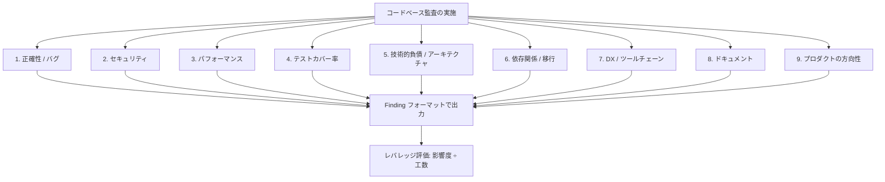

# Audit Playbook（監査プレイブック）

本プレイブックでは、カテゴリごとの監査項目を定義しています。各サブエージェント（または直接監査）は、該当セクションと末尾の**指摘事項フォーマット (Finding format)** を参照して監査を行います。コードベースの規模（2,000行のCLIツールから50万行のモノレポまで）に応じて監査の深度を調整してください。

指摘事項（Finding）は、具体的なコード上の根拠（Evidence）がある場合にのみ成立します。「おそらく N+1 クエリがある」は不適格であり、「`orders/api.ts:142` でループ内にて 1 アイテムごとに 1 クエリを発行している」と記述する必要があります。

---

## 9 つの監査カテゴリ (Audit Categories)



### 1. 正確性 / バグ (Correctness / Bugs)

最重要カテゴリ。推測ではなく、コードを読んで発見される実際のバグ：
- **エラー処理**: 握りつぶされた例外、空の catch ブロック、重要パスでの `catch (e) { console.log(e) }`。
- **非同期処理の危険性**: await の欠落、共有状態のレースコンディション、クリーンアップ漏れ。
- **Null/Undefined フロー**: 非 null アサーション (`!`) の乱用、オプションチェーンによる不必要な隠蔽。
- **境界条件**: オフバイワンエラー、空コレクションの未考慮、タイムゾーン/ロケール前提のロジック。
- **型とキャスト**: `any` や `as` キャストの乱用箇所。

### 2. セキュリティ (Security)

コードの明確な根拠に基づく問題点のみを対象とします：
- **機密情報の取り扱い規則**: 鍵やトークンの実際の値を指摘事項や計画書にコピーしてはなりません。`file:line` と資格情報の種類のみを記録します。
- **インジェクション / 危険なAPI**: 動的組み立てされた SQL / シェルコマンド、検証なしの HTML 出力（XSS）、パストラバーサル。
- **アクセス制御**: サーバー側の身元検証や権限確認（IDOR/CSRF）の欠落。
- **依存関係の脆弱性**: `npm audit` / `pip-audit` 等を読み取り専用で実行。

### 3. パフォーマンス (Performance)

アルゴリズムおよびアーキテクチャ上の本質的な改善を追求します：
- **N+1 パターン**: ループ内でのクエリ/データ取得、バッチ処理の欠落。
- **計算量**: ホットループ内での不要な `find`/`filter` 重複実行。
- **キャッシュの欠落**: 同一の重い計算の繰り返し、メモ化の未実施。
- **ペイロードサイズ**: 過剰なデータ取得、無制限リストのページネーション未実施。

### 4. テストカバー率 (Test Coverage)

単なるパーセンテージではなく、「テストがない危険なコード」を特定します：
- 決済、認証、データ変更などのクリティカルパスでテストが存在しない箇所。
- 変更頻度が高くテストがないモジュール（リファクタリングリスク）。
- テストコード自体の品質問題（アサーションのないテスト、過剰なモック）。

### 5. 技術的負債 & アーキテクチャ (Tech Debt & Architecture)

- ロジックの重複、コードの分岐・拡散。
- レイヤー違反（UIがデータ層内部に直接依存など）、循環参照。
- デッドコード、膨大すぎる「神モジュール (God object)」。

### 6. 依存関係 & 移行 (Dependencies & Migrations)

- コアフレームワークのメジャーバージョン遅延。
- 非推奨 (Deprecated) API の使用。
- メンテナンスが停止したライブラリへの依存。

### 7. DX & ツールチェーン (DX & Tooling)

- 型チェック、Lint、フォーマッタの未整備・破損。
- 開発見状フィードバックループの遅さ。

### 8. ドキュメント (Docs)

- 公開 API のドキュメント欠落。
- 誤ったセットアップ手順など、現状と乖離したドキュメント。

### 9. プロダクトの方向性 (Direction)

- TODO/FIXME の集積。
- README や仕様書で宣言されているが未実装の機能。
- アーキテクチャ上、容易に実現可能な機能拡張（プラグイン機構など）。

---

## 指摘事項フォーマット (Finding format)

すべての指摘事項は以下の形式で記録します：

```markdown
### [CATEGORY-NN] タイトル（命令形・短文）

- **Evidence**: `path/file.ts:123` — 何が存在するかの一文説明。
- **Impact**: 具体的な問題点。「毎リクエストごとに1+Nクエリが発生」など。
- **Effort**: S（数時間） / M（約1日） / L（複数日） — テストを含む修正工数。
- **Risk**: 修正によるリスク。LOW / MED / HIGH + 理由。
- **Confidence**: HIGH（確実） / MED（有力） / LOW（要調査）。
- **Fix sketch**: 1〜3文での修正方針の要約。
```

---

## 実装コード例（TypeScript / Bun）

指摘事項（Finding）の構造データ妥当性をチェックする TypeScript / Bun スクリプト例です：

```typescript
export interface AuditFinding {
  id: string;
  category: string;
  evidence: string;
  impact: string;
  effort: "S" | "M" | "L";
  risk: "LOW" | "MED" | "HIGH";
  confidence: "HIGH" | "MED" | "LOW";
  fixSketch: string;
}

export function validateFinding(finding: Partial<AuditFinding>): boolean {
  const requiredFields: (keyof AuditFinding)[] = [
    "id",
    "category",
    "evidence",
    "impact",
    "effort",
    "risk",
    "confidence",
    "fixSketch",
  ];
  for (const field of requiredFields) {
    const val = finding[field];
    if (typeof val !== "string" || val.trim() === "") {
      console.error(`Finding 検証エラー: 必須フィールド (${field}) が不足しているか無効です。`);
      return false;
    }
  }

  if (!["S", "M", "L"].includes(finding.effort!)) {
    console.error("Finding 検証エラー: effort の値が無効です。");
    return false;
  }
  if (!["LOW", "MED", "HIGH"].includes(finding.risk!)) {
    console.error("Finding 検証エラー: risk の値が無効です。");
    return false;
  }
  if (!["HIGH", "MED", "LOW"].includes(finding.confidence!)) {
    console.error("Finding 検証エラー: confidence の値が無効です。");
    return false;
  }

  const textFields = [
    finding.id,
    finding.category,
    finding.evidence,
    finding.impact,
    finding.fixSketch,
  ];
  const secretPattern = /AI_SECRET_KEY|ghp_|github_pat_|sk-[a-zA-Z0-9]{32,}/;
  for (const text of textFields) {
    if (text && secretPattern.test(text)) {
      console.error("Finding 検証エラー: 機密情報（Secret）が含まれています。非開示原則に違反しています。");
      return false;
    }
  }

  return true;
}
```

---

## 参考文献・ソース一覧

- **Improve Skill (スキル本体)**: [../SKILL.md](../SKILL.md)
- **Plan Template (計画書テンプレートガイド)**: [plan-template.md](plan-template.md)
- **Closing the Loop (実行・同期・Issue発行ガイド)**: [closing-the-loop.md](closing-the-loop.md)

---

*作成者：Software Architect Guide | バージョン 1.0 | Audit Playbook Reference Guide*
