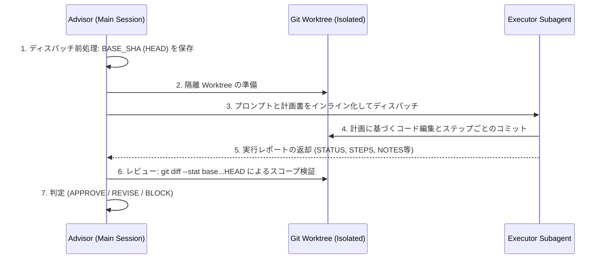

# Closing the Loop — execute, reconcile, issues

アドバイザーの役割は計画書の作成のみで終了するわけではありません。本ドキュメントでは、計画の実行と検証を行う `execute`、計画一覧の進捗と整合性を保つ `reconcile`、そして計画を GitHub Issue として発行する `--issues` の 3 つのフォローアップフローについて解説します。

基本方針は不変です：**アドバイザー自身は決してソースコードを編集しません。** `execute` フローにおいては、*隔離された git worktree 上で別の Executor サブエージェント*がコード編集を行います。アドバイザーはディスパッチ、レビュー、判定のみを担い、ユーザーの作業ブランチへの直接コミットやマージは行いません。

---

## 1. `execute <plan>` — ディスパッチとレビュー手順



### Preconditions（前提条件チェック）

ディスパッチ前に以下のすべてを確認してください：
- リポジトリが git 管理下にあること（worktree 隔離に必須）。
- 対象の計画書が存在し、依存関係となる計画が `plans/README.md` で `DONE` になっていること。
- ディスパッチ直前の HEAD コミット SHA を変数 `BASE_SHA` 等に完全 SHA（40 桁）として保存しておくこと。

### Dispatch（ディスパッチ）

`isolation: "worktree"` オプション付きで `general-purpose` サブエージェントを 1 つ起動します。
サブエージェントプロンプトには以下を含めます：

1. **計画書テキスト全体のインライン化**（未コミットの `plans/` を Executor が参照できるようにするため）。
2. **Executor 向け指示文（Preamble）**:
   - 計画書に従ってステップバイステップで作業し、各検証コマンドを実行すること。
   - スコープ内のファイルのみを編集すること。
   - 成果物は計画書の git ワークフローに従って Worktree 内でコミットすること。
   - レポートは以下のフォーマットで返却すること。

3. **レポートフォーマット**:

```text
STATUS: COMPLETE | STOPPED
STEPS: ステップごとの実行結果（完了/スキップ + 検証コマンド結果）
STOPPED BECAUSE: (STOPPEDの場合のみ) 停止条件および観察された内容
FILES CHANGED: 変更されたファイル一覧
NOTES: レビュアーへの注意事項（逸脱点、想定外の挙動、判断事項など）
```

### Review（アドバイザーによるレビュー）

アドバイザーによる PR レビューと同等の検証プロセスを実行します（アドバイザー自身はコード修正を行いません）：

1. **ベース SHA（`${BASE_SHA}`）および作業ツリーの差分・未追跡ファイル検証**:
   - ディスパッチ前に保存したベース SHA (`BASE_SHA`) からの変更（コミット済み・作業ツリー含む）および未追跡ファイルを検証します。
   - コマンド: `git -C <worktree> diff --stat ${BASE_SHA}` および `git -C <worktree> ls-files --others --exclude-standard`
   - Executor が Worktree 内で作成したコミット・変更に加え、未追跡のスコープ外ファイルも含めた変更ファイル全体が計画のインスコープ（In Scope）一覧と合致するか確認します。スコープ外のファイル（コミット済み・未追跡問わず）が1つでも検知された場合はレビュー失敗とします。
   - 詳細差分の確認: `git -C <worktree> diff ${BASE_SHA}` で実装内容を読み、コード規約や目的に適合しているか判定します。
2. **完了条件（Done criteria）の再実行**:
   - Executor の自己報告を鵜呑みにせず、Worktree 内で全検証コマンドを再実行します。
3. **新規テストの検証**:
   - 追加されたテストコードの内容を確認し、無意味なアサーションになっていないかチェックします。

### Verdict（判定）

| 判定 | 条件 | アクション |
|---|---|---|
| **APPROVE** | 全条件パス、スコープ遵守、品質維持 | インデックスのステータスを `DONE` に更新。ユーザーに diff 概要と Worktree パスを報告。**マージの判断はユーザーに委ね、アドバイザーが直接マージやコミットを行うことはありません。** |
| **REVISE** | 修正可能な不備が存在 | 具他的なフィードバックを添付して同一 Executor に再依頼（最大2回まで）。 |
| **BLOCK** | STOP条件発生、深刻なスコープ違反 | インデックスを `BLOCKED` に変更し、理由を明記。必要に応じて計画書を改訂。 |

---

## 2. `reconcile` — 計画書の同期と整合性維持

過去のセッションからの変更点を処理し、`plans/README.md` および各計画書を最新状態に保ちます：

- **DONE**: 現状の HEAD で完了条件が引き続き満たされているか簡易確認。
- **BLOCKED**: 理由を調査し、コードベースの変化に応じて計画を再構成または `REJECTED` に変更。
- **IN PROGRESS**: 中断された Executor の状態を確認。
- **TODO**: ドリフトチェックを実行。コードベースに変更がある場合は `Planned at` SHA やコード抜粋を更新。

---

## 3. `--issues` — GitHub Issues への発行

`/improve --issues` などの明示的なフラグ指定時、計画書を GitHub Issue として発行します：

1. **事前検証**: `gh auth status` と リポジトリの確認。
2. **可視性チェック**: `gh repo view --json visibility` でパブリックリポジトリの場合は機密情報（セキュリティ脆弱性や鍵の場所）が含まれていないか事前にユーザーの明示的確認を取得。
3. **発行**: `gh issue create --title "<plan title>" --body-file <plan file>` を実行し、発行された Issue URL を計画書および `plans/README.md` に記載。

---

## 実装コード例（TypeScript / Bun）

以下は、`execute` レビュー時にディスパッチ前のベース SHA（`base`）と Worktree HEAD 間の差分（`base...HEAD`）を評価し、スコープ違反を検知する Bun / TypeScript スクリプト例です：

```typescript
import { execFileSync } from "node:child_process";

export interface ReviewOptions {
  worktreePath: string;
  baseSha: string;
  inScopeFiles: string[];
}

export function reviewExecutorDiff(options: ReviewOptions): {
  success: boolean;
  changedFiles: string[];
  outOfScopeFiles: string[];
} {
  const { worktreePath, baseSha, inScopeFiles } = options;

  if (!/^[0-9a-f]{40}$/i.test(baseSha)) {
    throw new Error(`無効なベースコミット SHA 形式です: ${baseSha}`);
  }

  const verifiedBase = execFileSync(
    "git",
    ["-C", worktreePath, "rev-parse", "--verify", `${baseSha}^{commit}`],
    { encoding: "utf-8" }
  ).trim();

  if (!/^[0-9a-f]{40}$/i.test(verifiedBase)) {
    throw new Error(`検証済み SHA が完全形式ではありません: ${verifiedBase}`);
  }

  const output = execFileSync(
    "git",
    ["-C", worktreePath, "diff", "--name-only", "-z", `${verifiedBase}...HEAD`],
    { encoding: "utf-8" }
  );

  const changedFiles = output.split("\0").filter(Boolean);

  const outOfScopeFiles = changedFiles.filter((file) => !inScopeFiles.includes(file));

  if (outOfScopeFiles.length > 0) {
    console.error("レビュー失敗: スコープ外のファイルに変更が検出されました:");
    for (const f of outOfScopeFiles) {
      console.error(` - ${f}`);
    }
    return { success: false, changedFiles, outOfScopeFiles };
  }

  console.log("スコープ検証成功: すべての変更は計画されたスコープ内です。");
  return { success: true, changedFiles, outOfScopeFiles: [] };
}
```

---

## 参考文献・ソース一覧

- **Improve Skill (スキル本体)**: [../SKILL.md](../SKILL.md)
- **Plan Template (計画書テンプレートガイド)**: [plan-template.md](plan-template.md)
- **Audit Playbook (監査ガイド)**: [audit-playbook.md](audit-playbook.md)
- **Git Worktree ドキュメント**: [Git Documentation - git-worktree](https://git-scm.com/docs/git-worktree)

---

*作成者：Software Architect Guide | バージョン 1.0 | Closing the Loop Reference Guide*
