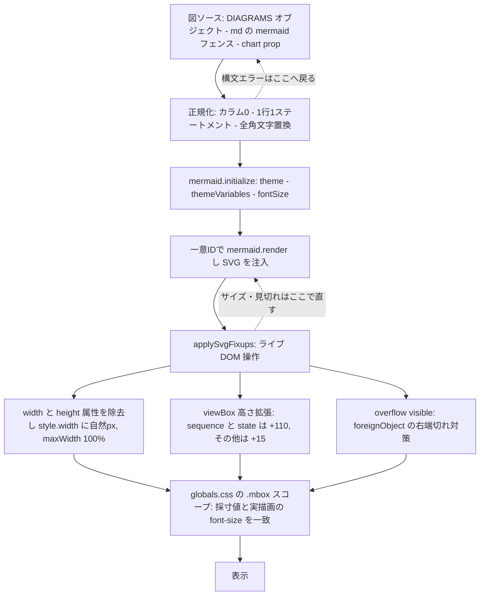

# Mermaid 構文・描画修正スキル

(最終更新日: 2026-09-13)

## 全体像: 図ソース → 描画パイプライン → SVG 後処理

修正がどの層の問題かを最初に切り分ける。**構文エラーは図ソース層、サイズ・見切れ・文字色は SVG 後処理層**で直す。層を取り違えた修正（例: 見切れを DSL の書き換えで直そうとする）は再発する。



| 層 | 典型的な症状 | 直す場所 |
|---|---|---|
| 図ソース | Syntax Error・図が出ない | `fix_mermaid.ts` / 全角文字置換 |
| 描画パイプライン | 全図が未描画・二重描画 | `apply_render_pipeline.ts` / `initialize` |
| 描画 ID | **1 枠に複数図が混在・別枠が空** | 描画 ID の一意化 + 描画の直列化（下記 §描画 ID 衝突） |
| SVG 後処理 | 見切れ・異常拡大・文字色 | `applySvgFixups` / `.mbox` CSS |

## 前提バージョンと正準実装（推測禁止）

| 項目 | 確定値 |
|---|---|
| Mermaid | **`mermaid@10.9.8`**（`web-next/package.json` の dependencies） |
| React 共通コンポーネント | `web-next/components/MermaidDiagram.tsx` — **default エクスポート** `export default MermaidDiagram` |
| `mermaid` の読込 | **モジュールスコープで共有する 1 本の `Promise`**（`loadMermaid()`）。インスタンスごとに `import("mermaid")` しない |
| `mermaid.initialize` | `loadMermaid()` 解決後に**初回 1 回のみ**実行（`mermaidInitialized` フラグ） |
| 描画 API | **`mermaid.render(一意ID, chart, containerEl)`**。`mermaid.run()` は使わない（§描画 ID 衝突） |
| テスト環境 | Vitest / jsdom。ページ／ガイドの契約テストでは `MermaidDiagram` をモックする。`MermaidDiagram` 自身のテスト（§描画 ID 衝突の回帰テスト）では実コンポーネントを読み込み、`mermaid` のみをモックする |

> 以降の「Mermaid v10 の必須ルール」は **v11 でも有効な基本構文ルール**である（カラム0・1行1ステートメント等）。
> v10 固有の記述であることを理由に読み飛ばさないこと。

## 🚀 まず再利用スクリプトを使う（トークン節約・最優先）

静的 HTML の Mermaid 描画崩れを直すときは、**ボイラープレート（render ループ・SVG 後処理・中央寄せ CSS）を手書きで再生成しないこと**。以下の再利用スクリプトで機械的処理を一括適用できる。

1. **図ソースを JSON 互換の正準オブジェクトで定義**（LLM の判断が必要なのはここだけ）:
   各図を 1 ステートメント 1 行・カラム 0・改行は `\n` または `<br/>` とし、`const DIAGRAMS = { "diag-1": "flowchart TD\nA --> B" };` の形式で HTML の `<script>` 内に書く。

2. **描画パイプラインを冪等適用**:

   ```bash
   bun run .claude/skills/fix-mermaid/scripts/apply_render_pipeline.ts <file.html>
   ```

   これが `<div class="mermaid">…</div>` → 連番 id 付き空 div への置換、`startOnLoad:false`+`securityLevel:'loose'` 付与、`applySvgFixups`+render ループ注入、中央寄せ CSS 注入をまとめて行う（再実行しても二重適用しない）。

3. **正本 Markdown から図を復元する場合**（HTML 側ソースが破壊された等）:

   ```bash
   bun run .claude/skills/fix-mermaid/scripts/restore_diagrams.ts <file.html> <source.md>
   ```

4. **インデント汚染・行分断のみの修正**（`.html`/`.md`/`.tsx`）は `fix_mermaid.ts`:

   ```bash
   bun run .claude/skills/fix-mermaid/scripts/fix_mermaid.ts <file>
   ```

> **SVG 幅の鉄則**: `apply_render_pipeline.ts` は SVG 幅に **viewBox 由来の自然 px 幅 + `maxWidth:100%`** を使う。`width:'100%'` も `width:'auto'`（viewBox のみで intrinsic サイズを持たない SVG ではコンテナ全幅へ伸びる）も、小さい flowchart LR 図を異常拡大させるため**使わない**。

## 対象

- `.html` ファイル内の `<div class="mermaid">` ブロック
- `.md` ファイル内の ` ```mermaid ` ブロック
- `.tsx` / `.ts` / `.jsx` / `.js` ファイル内の `chart={`...`}` などのテンプレートリテラル内の Mermaid 構文

## Mermaid v10 の必須ルール

1. コンテンツは**カラム0配置**（先頭空白なし）
2. 各ステートメントは**改行で分離**（1行に複数連結しない）
3. ノードラベル `A["text"]` の内容は**1行に収める**
4. `mindmap` のみ例外 — 内部インデントは階層構造を表すため保持する
5. `block-beta` は**使用禁止** — v10.9.5 でページ全体のクラッシュを起こした実績があり、現行 v11 でも安全性を検証していない。`graph TD` で代替する

## よくある原因

HTMLやコードのフォーマッタ（Prettier等）による破壊パターン:

- 14スペース等のHTML/コードインデントがMermaidコンテンツに混入する
- 長いノードラベルが行分断される（`A["テキスト` と `続き"]` に分かれる）
- 複数ステートメントが1行に連結される（`graph TD A["x"] B["y"] A --> B`）

## 修正手順

1. **全文検索**で修正対象ファイルを絞り込み、Mermaid ブロックを把握する
2. **ファイル読取**で各ブロックを確認し、上記ルール違反を特定する
3. **差分編集**または自動修正スクリプトで各ブロックの内容を修正する

```bash
bun run .claude/skills/fix-mermaid/scripts/fix_mermaid.ts path/to/file.tsx
```

## ダイアグラム別の注意点

| 種別 | 注意点 |
| ------ | -------- |
| `graph` / `flowchart` | 最頻出。カラム0ルールを厳守 |
| `sequenceDiagram` | `Note over A,B:` は1行に収める |
| `mindmap` | 内部インデント保持（唯一の例外） |
| `block-beta` | **使用禁止**（全体クラッシュ） |
| `htmlLabels: true` 環境 | `<` → `&lt;`、`>` → `&gt;` に変換 |

## 実地検証済み：ブラウザレンダラー固有の問題（2026年3月）

### IDEフォーマッター（Prettier）による破壊が根本原因

`<div class="mermaid">` に Mermaid ソースを直接書くと、VSCode/Prettier が保存のたびにインデントを付加して構文を壊す。**恒久対策は前述の JSON 互換 `DIAGRAMS` オブジェクト（改行は `\n`）への移管**（「まず再利用スクリプトを使う」手順1と同形式）。テンプレートリテラルは実改行がフォーマッタの再インデント対象になるため使わない。

### ブラウザレンダラーで Syntax Error を起こす文字・構文

| 箇所 | 問題のある記述 | 対処 |
| ------ | --------------- | ------ |
| `subgraph` ラベル | 丸括弧 `()` を含む | 削除または別表現に置換 |
| `subgraph` ラベル | 絵文字（`🌐` `🖥️` 等） | 削除 |
| `participant ... as` | 絵文字（`👤` `⚡` 等） | 削除 |
| ノードラベル `["..."]` | 全角波ダッシュ `〜` | `から` 等の日本語に置換 |
| ノードラベル `["..."]` | スラッシュ `path/to` | `-` またはスペースに置換 |
| 菱形ノード `{}` | クォートなし日本語 | クォートを追加する |
| 全ての図解 (全般) | 全角丸括弧 `（）` | 半角丸括弧 `( )` に置換する |
| 全ての図解 (全般) | 全角ダッシュ `―` | 半角ハイフン `-` に置換する |
| 全ての図解 (全般) | 全角コロン `：` | 半角コロン `:` に置換する |

#### 全角文字の一括置換手順

**`fix_mermaid.ts` はこの置換を行わない。** 同スクリプトが直すのはインデント汚染と行分断だけ。

1. **検出**: `grep -rn '[（）〜―：]' <対象ファイル>`
2. **置換**: ヒットした箇所を、**Mermaid ブロック内のものに限って**1件ずつ編集する。本文・表・見出しの全角文字は変更してはならない。
3. **再検証**: 手順1のコマンドを再実行し、残ったヒットがすべて Mermaid ブロック外であることを確認する。

### SVG サイズ制御

Mermaid v10/v11 は SVG 要素に絶対ピクセル値の `width`/`height` 属性を付与する。`mermaid.render()` の SVG を注入した後に必ず除去する。

```js
svgEl.removeAttribute('width');
svgEl.removeAttribute('height');
svgEl.style.width    = `${w}px`;   // 自然 px 幅
svgEl.style.maxWidth = '100%';
svgEl.style.height   = 'auto';
```

### シーケンス図・状態遷移図等の下部見切れ（クリッピング）対策（2026年6月追記）

Mermaid v10/v11 のシーケンス図（`sequenceDiagram`）や状態遷移図（`stateDiagram`）には SVG の `viewBox` 高さが不足するバグがある。描画後に高さを拡張する:

```javascript
const extraHeight = isSequenceOrState ? 110 : 15;
svgEl.setAttribute('viewBox', `${x} ${y} ${w} ${h + extraHeight}`);
```

### `quadrantChart` の文字被り対策（2026年6月追記）

```javascript
mermaid.initialize({
    quadrantChart: { chartWidth: 800, chartHeight: 600, pointRadius: 8, pointLabelFontSize: 14 }
});
```

図ごとの `maxWidth` インラインスタイルは指定しない。必要な表示調整は Mermaid DSL の `chartWidth`、`chartHeight`、`nodeSpacing`、`rankSpacing` などで行う。

### HTML での Mermaid 図解の中央寄せ Flexbox スタイル（2026年6月追記）

```css
.mermaid-wrap {
    display: flex;
    justify-content: safe center; /* 親幅を超える場合は flex-start（左詰め）として扱い左見切れを防ぐ */
    overflow-x: auto;
    width: 100%;
    margin: 1.5rem auto 2rem;
}
.mermaid {
    display: flex;
    justify-content: safe center;
    width: 100%;
}
.mermaid svg {
    display: block;
    margin: 0 auto;
    max-width: 100% !important;
    height: auto !important;
}
```

### React/Next.js (globals.css) 移植時の表示（2026年5月追記）

このリポジトリは CSS Modules を使わず `globals.css` のページスコープクラスでスタイルを管理する。

#### ⚠️ サイズ調整は図ごとに行い、文字の実効サイズを変えない

**禁止事項**:

- 異なる図種へ同じ `minWidth` / `maxHeight` を一括適用しない
- `%%{init: {"themeVariables": {"fontSize": "Xpx"}}}%%` で図ごとにフォントサイズを変えない — 採寸値と CSS の実描画値が乖離し、ノード枠からはみ出す
- `width:'100%'` を SVG に直接適用しない（小さい図が全幅へ異常拡大する）
- 縦長図へ `max-height` を付けない（横幅と文字まで縮小する）
- 1ページの問題を直すために共通コンポーネントの既定動作を変更しない

**個別対応の正準手順**:

1. 共通コンポーネントの `preserveNaturalScale` prop を `true` にして viewBox 由来の自然幅で表示する。
2. `.mbox` はコンテンツ領域の全幅を使い、ページ側でインライン `maxWidth` を指定しない。

```tsx
// page.tsx での正準使用例
<div className="mbox">
  <MermaidDiagram chart={DIAGRAM_LEVELS} preserveNaturalScale={true} />
</div>
```

#### ⚠️ スクロール時の図解縮小バグの防止（React.memo メモ化）

`IntersectionObserver` による親コンポーネントの再レンダリングで `style.width` がリセットされ、図が豆粒に縮小する不具合が発生する。**`MermaidDiagram` を必ず `React.memo` でラップする**（`web-next/components/MermaidDiagram.tsx` では実装済み）。

#### テスト環境（Vitest）での MermaidDiagram のモック化

**このリポジトリでの正準モック（`default` エクスポートをモックする）:**

```typescript
vi.mock("@/components/MermaidDiagram", () => ({
  default: function DummyMermaidDiagram({ chart }: { chart: string }) {
    return <pre data-testid="mermaid-diagram">{chart}</pre>;
  },
}));
```

`data-testid` は **`mermaid-diagram`** に統一すること。

## ⚠️ 描画 ID 衝突による「図の混在・空枠」（2026年9月実地: web-next）

### 症状

1 ページに複数の Mermaid 図がある場合に、

- **ある図の枠に別の図のノードが混ざって描画される**（例: 判断フロー図の中に別セクションの構成図のノードが出現）
- **本来その図があるべき枠が空のまま**（キャプションだけが残る）

構文は正しく、Console に構文エラーも出ない。リロードのたびに**再現したりしなかったり**する（タイミング依存）。

### 根本原因（node_modules の実装を確認済み）

1. `mermaid.run()` は描画 ID を **`mermaid-${Date.now()}` でしか採番しない**
   （`InitIDGenerator`: `deterministicIds` が false のとき `next = () => Date.now()`）。
   **ミリ秒精度**しかないため、同一 tick でマウントされた複数の図は同じ ID になる。
2. flowchart 等の renderer は描画先 SVG を **`document.querySelector('[id="<ID>"]')` と文書全体から**選ぶ。
   ID が衝突すると、後発の図が**文書順で最初に見つかった先行図の SVG**へ描き込まれる。
3. 結果として「先行図＝混在」「後発図＝空」になる。

> `deterministicIds: true` は解決にならない。`run()` は呼び出しごとに採番器を作り直すため、
> 各インスタンスが揃って `mermaid-0` になり衝突がむしろ確実化する。

### 対策（3 点セット。1 つでも欠けると再発する）

1. **`run()` をやめて `render()` を直接呼び、ID を呼び出し側で一意に採番する。**
   第 3 引数にコンテナ要素を渡すと採寸がページ内（`.mbox` スコープ）で行われ、
   `document.body` 直下に退避された場合のフォントサイズ差による文字切れも避けられる。

   ```ts
   let diagramSeq = 0;
   const uid = `mermaid-svg-${Date.now()}-${++diagramSeq}`;
   const { svg, bindFunctions } = await mermaid.render(uid, chart, containerEl);
   containerEl.innerHTML = svg;
   bindFunctions?.(containerEl);
   ```

2. **描画を直列化する。** mermaid はグローバル設定と DOM 一時領域を共有するため、並行描画は避ける。

   ```ts
   let renderQueue: Promise<unknown> = Promise.resolve();
   function enqueueRender<T>(task: () => Promise<T>): Promise<T> {
     const result = renderQueue.then(task, task); // 失敗しても後続を止めない
     renderQueue = result.catch(() => undefined);
     return result;
   }
   ```

3. **`import("mermaid")` と `initialize()` を 1 回に集約する。**
   インスタンスごとの動的 import はモジュール解決を競合させ、`initialize` の多重実行は
   描画中にグローバル設定を書き換える。

   ```ts
   let mermaidModulePromise: Promise<typeof import("mermaid")> | null = null;
   const loadMermaid = () => (mermaidModulePromise ??= import("mermaid"));
   let mermaidInitialized = false; // initialize は初回のみ
   ```

### 回帰テスト（必須）

`components/MermaidDiagram.concurrency.test.tsx` を正本とする。**`mermaid` をモックし、
2 インスタンスを同時マウントして次の 3 点を検証する**：

- `render` が呼ばれた ID がすべて**一意**であること
- `run()` が**呼ばれない**こと
- 各コンテナが**自分の chart だけ**を保持すること（他方の chart を含まないこと）

> **テストの落とし穴**: `vi.mock("mermaid")` は hoist されるため、factory の返り値は後続の
> `import("mermaid")` 呼び出しすべてに適用される（複数箇所で import しても実モジュールに解決される
> わけではない）。共有 Promise（対策 3）はモック成立の前提ではなく、**インスタンスごとに動的 import
> すると描画基盤の読み込みが競合し、初期化タイミングがずれてテストが不安定になる**ことへの対策である。

## Mermaid 10.9.8 + React 共通コンポーネントの可読性・文字切れ・文字色対策（2026年6月追記）

### 症状と根本原因の対応表

| 症状 | 根本原因 | 対策 |
| ------ | --------- | ------ |
| 文字が低コントラストで読みづらい | `theme:'base'` が明色背景を算出 | `theme:'dark'` + ソリッド濃色の `themeVariables` を明示 |
| ノード内の文字が下端で切れる | SVG `viewBox` 下端が見切れる | 描画後に `viewBox` の高さを拡張 + `overflow:visible` |
| ノード文字が**右端**で切れる（emoji を含む図のみ） | `<foreignObject>` は `overflow:hidden` がデフォルト | CSS で `foreignObject { overflow: visible }` |
| 文字色を変えても**全く反映されない** | `.next` キャッシュ汚染 | `.next` 削除 + dev サーバー完全再起動 + ハードリロード |
| 日本語ラベルの幅不足による軽微な切れ | Web フォント読込前に採寸 | `mermaid.render()` 直前に `await document.fonts.ready` |

### 正準の `mermaid.initialize` 設定（Mermaid 10.9.8）

```ts
m.default.initialize({
  startOnLoad: false,
  theme: "dark",
  themeVariables: {
    background: "#161b27",
    primaryColor: "#2d1f4e",
    primaryTextColor: "#e8eaf0",
    primaryBorderColor: "#4a2a8a",
    lineColor: "#4a5680",
    secondaryColor: "#0f2e2e",
    tertiaryColor: "#1e2535",
    edgeLabelBackground: "#161b27",
    fontSize: "16px",  // SVG 採寸に使う明示値。採寸値と CSS 実描画値を一致させる（1rem のような相対値は禁止）
  },
  htmlLabels: true,
  flowchart: { curve: "basis", htmlLabels: true, useMaxWidth: false },
  sequence: { useMaxWidth: false },
  gantt: { fontSize: 16 },
  pie: { textPosition: 0.75 },
});
```

### ⚠️ SVG 後処理は「文字列加工」ではなく「ライブ DOM 操作」で行う

`mermaid.render()` が返した SVG 文字列を `innerHTML` で注入した後、実 DOM の `querySelector('svg')` を直接操作する。`DOMParser('image/svg+xml')` + `XMLSerializer` で往復させると `foreignObject` 内の htmlLabels が壊れる。

`applySvgFixups` の実装は `web-next/components/MermaidDiagram.tsx` を正本とする。主要ロジック:

- SVG の `width`/`height` 属性を除去し、`style.width = "${w}px"`、`maxWidth = "100%"` をセット
- `preserveNaturalScale=true` のとき `minWidth` を `${w}px` に固定
- `viewBox` の高さを `+extraHeight` 拡張（sequence/state: +110、その他: +15）
- `style.overflow = "visible"` で viewBox はみ出し描画の途切れを防止
- 再処理時に前回の `minWidth` を事前クリア

### Mermaid の採寸値と CSS 文字サイズを一致させる

```css
/* globals.css の .mbox スコープ内に記述 */
.mbox svg foreignObject {
  overflow: visible;
}
.mbox svg foreignObject > div,
.mbox svg .nodeLabel,
.mbox svg .edgeLabel,
.mbox svg text,
.mbox svg tspan {
  overflow: visible;
  font-size: 16px !important;
}
```

### 文字色は「ノードラベル限定」で当てる（明背景×明文字の再発防止）

> **明色ノードの判定は `classDef` 名を第一手段とする。** 図側で `classDef yellowFill fill:#fbbc04,...` を定義し、CSS は `.yellowFill .nodeLabel` を対象にする。

```css
/* foreignObject のクリップ解除（emoji 採寸ズレによる右端切れ対策） */
.mbox svg foreignObject { overflow: visible; }
.mbox svg foreignObject > div,
.mbox svg .nodeLabel,
.mbox svg .edgeLabel { overflow: visible; }

/* 既定でノードラベルを白に */
.mbox svg .node .nodeLabel,
.mbox svg .node .nodeLabel * { color: #ffffff !important; }

/* 第一手段: classDef 名で明色ノードを判定する */
.mbox svg .yellowFill .nodeLabel,
.mbox svg .yellowFill .nodeLabel * { color: #000000 !important; }

/* 互換フォールバック（カラーコード直接指定の既存図のみ） */
.mbox svg .node[style*="fbbc04" i] .nodeLabel,
.mbox svg .node[style*="fbbc04" i] .nodeLabel * { color: #000000 !important; }
```

> `.edgeLabel *` に `fill:#fff` を当てない。エッジラベルの背景 `rect` が白く塗り潰される。

### 完了確認（順序厳守）

1. CSS / `MermaidDiagram.tsx` 変更時は `.next` を削除し、dev サーバーを完全再起動する:

```bash
cd web-next
rm -rf .next
bun run dev
```

2. ブラウザは**ハードリロード（⌘+Shift+R）**。複数図のあるページでは**数回リロードして**、図の混在・空枠が出ないことを確認する（ID 衝突はタイミング依存で毎回は出ない）。
3. `web-next/` で以下の 4 コマンドが**全通過**することを確認する（CLAUDE.md の必須要件）:

```bash
cd web-next
bun run lint
bun run typecheck
bun run test
bun run build
```

---

### Mermaid を諦めて HTML/CSS に置き換えるべきケース

以下は CSS では対処不能なため、**純粋な HTML/CSS ウィジェットに置き換える**：

- `flowchart TD` で 5〜6 ノードを直列チェーン → 縦長 900px 超
- 接続されていない複数のサブグラフ（ノード数が非対称なためアスペクト比が崩れる）

判断基準：「ノード増減に関わらず、他の図と同じ高さに収まる保証がない場合」

## 参考文献・ソース一覧

- Mermaid バージョン定義（`mermaid@10.9.8`）: [`web-next/package.json`](../../../web-next/package.json)
- React 共通コンポーネント（`applySvgFixups` の正本）: [`web-next/components/MermaidDiagram.tsx`](../../../web-next/components/MermaidDiagram.tsx)
- 描画 ID 衝突の回帰テスト: [`web-next/components/MermaidDiagram.concurrency.test.tsx`](../../../web-next/components/MermaidDiagram.concurrency.test.tsx)
- Mermaid v10 公式ドキュメント: <https://mermaid.js.org/intro/>
- Mermaid 設定リファレンス（`initialize` / `themeVariables`）: <https://mermaid.js.org/config/schema-docs/config.html>
- Mermaid リリースノート一覧（v10 系の変更点確認用）: <https://github.com/mermaid-js/mermaid/releases>
- React 公式リファレンス（`React.memo` / `useEffect`）: <https://react.dev/reference/react>
- Next.js App Router 公式ドキュメント: <https://nextjs.org/docs/app>
