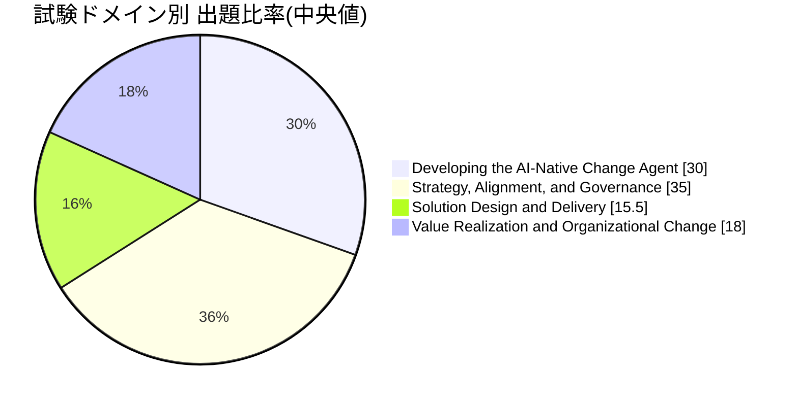
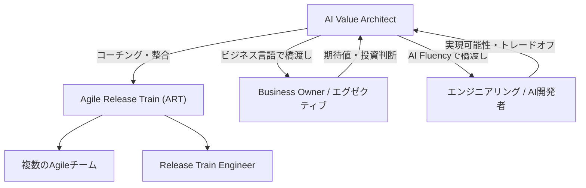
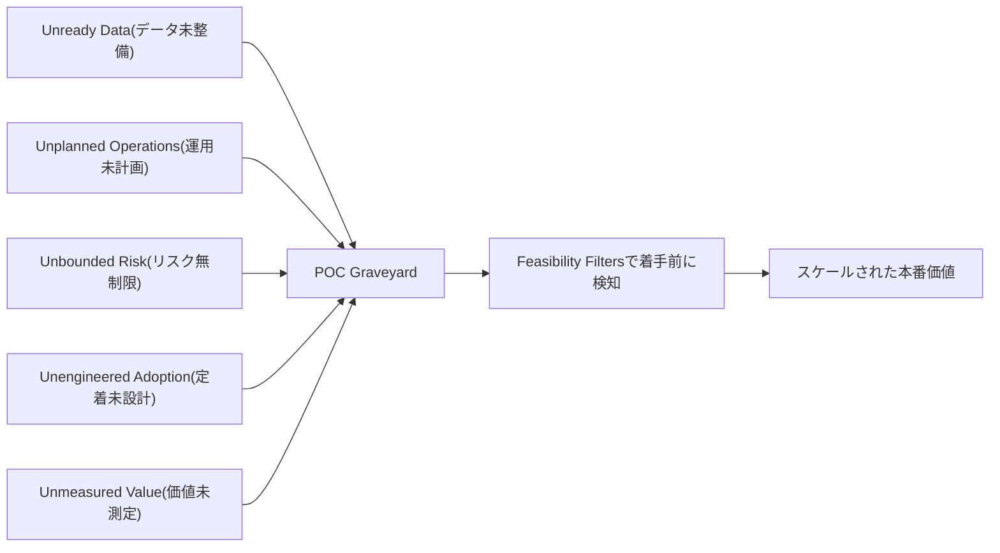
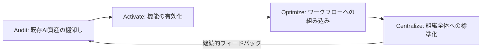
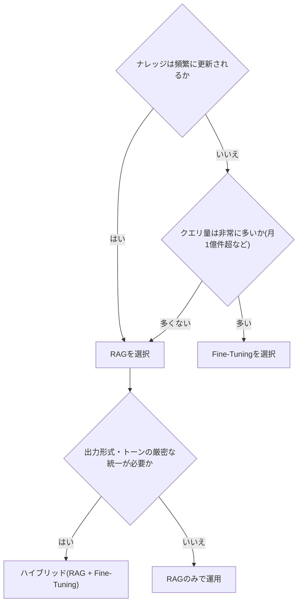
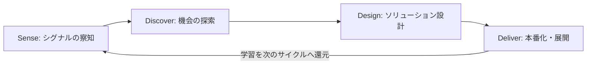
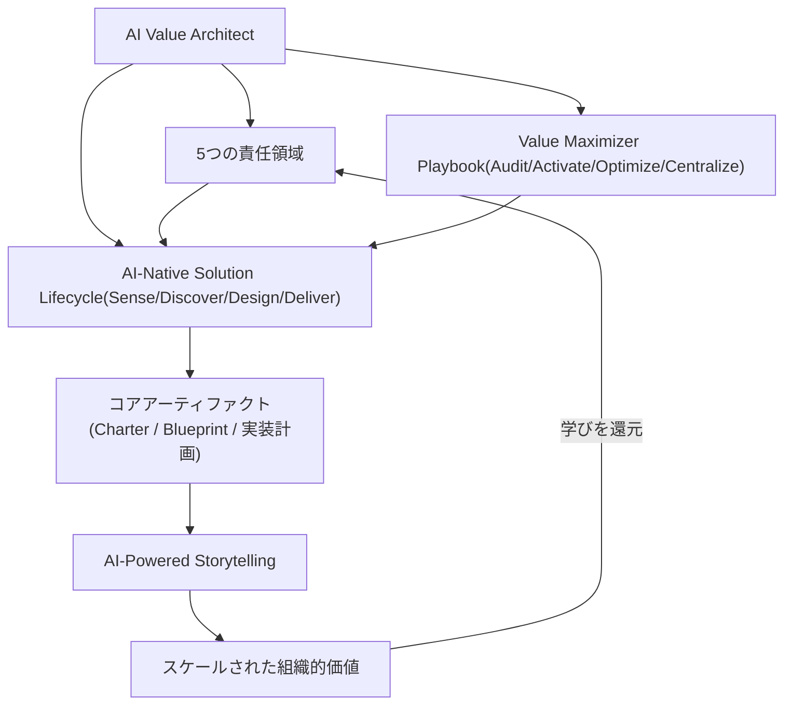

# AI-Native Value Architect Certification 学習ガイド

> 本ガイドは、Scaled Agile, Inc. が提供する **AI-Native Value Architect Certification**
> ([https://scaledagile.com/certification/ai-native-value-architect/](https://scaledagile.com/certification/ai-native-value-architect/))
> を初めて学ぶ方向けに、出題内容を4つの公式試験ドメインに沿って整理した学習資料です。
> 各項目について「何を学ぶか」「なぜ重要か」「現場でのベストプラクティス」を解説し、
> 根拠となる一次情報源のURLを併記しています。ASCIIアートは使用せず、フロー図はすべて
> Mermaid、図解・比較表はすべてMarkdown表記で統一しています。
>
> **免責事項**: 本ガイドはScaled Agile, Inc. の公式教材ではない、非公式の学習補助資料です。
> 試験の詳細は変更される可能性があるため、必ず公式コースおよび
> [Candidate Agreement](https://www.scaledagile.com/certification/candidate-agreement/) を
> 最終的な情報源として確認してください。

---

## 目次

1. [認定資格の全体像](#1-認定資格の全体像)
2. [AI Value Architectとは何か](#2-ai-value-architectとは何か)
3. [ドメイン1: Developing the AI-Native Change Agent (28–32%)](#3-ドメイン1-developing-the-ai-native-change-agent-2832)
4. [ドメイン2: Strategy, Alignment, and Governance (33–37%)](#4-ドメイン2-strategy-alignment-and-governance-3337)
5. [ドメイン3: Solution Design and Delivery (15–16%)](#5-ドメイン3-solution-design-and-delivery-1516)
6. [ドメイン4: Value Realization and Organizational Change (17–19%)](#6-ドメイン4-value-realization-and-organizational-change-1719)
7. [全体統合マップ](#7-全体統合マップ)
8. [用語集](#8-用語集)
9. [学習・試験対策チェックリスト](#9-学習試験対策チェックリスト)
10. [参考文献・ソース一覧](#10-参考文献ソース一覧)

---

## 0. 前提知識のおさらい

このガイドは、SAFe(Scaled Agile Framework)やAgile Release Train(ART)の
基礎用語をある程度知っている方を主な対象にしていますが、初学者でも迷わないよう
最低限の前提知識を先に整理しておきます。

| 用語 | 一言で言うと |
|---|---|
| **SAFe** | 大規模組織で複数チームのAgile開発を同期させるためのフレームワーク |
| **ART (Agile Release Train)** | 共通のミッションに向けて動く、複数のAgileチームの集合体(50〜125名規模が目安) |
| **RTE (Release Train Engineer)** | ARTのプロセスを回すサーバントリーダー(ScrumMasterのART版) |
| **SPC (SAFe Practice Consultant)** | 組織へのSAFe導入を支援する社内外のコンサルタント/トレーナー |
| **Business Owner** | ARTが生み出す価値に責任を持つ経営層側のステークホルダー |

これらの用語に馴染みがない場合は、本ガイドと合わせてSAFeの基礎資料を参照することを
おすすめします。

---

## 1. 認定資格の全体像

### 1.1 資格概要

| 項目 | 内容 |
|---|---|
| 認定名 | Certified AI-Native Value Architect |
| 提供元 | Scaled Agile, Inc.(SAFeの開発元) |
| 前提条件 | なし(None required) |
| 研修時間 | 2日間・16時間(対面 or リモート、リモートはプライベート/エンタープライズ研修のみ) |
| 認定取得方法 | 2日間コース受講 → 試験合格 |
| 認定の更新 | 1年ごとに更新(renewed yearly) |
| 前身コース | AI-Native Change Agent(本コースが置き換え、ポートフォリオ内の同じ位置を占める) |

> **ソース**: [AI-Native Value Architect Certification (Scaled Agile公式)](https://scaledagile.com/certification/ai-native-value-architect/)、
> [AI-Native Value Architect (Cprime, 認定トレーニングパートナー)](https://www.cprime.com/learning/courses/ai-native-value-architect/)

**ベストプラクティス**
- 前提条件は「なし」だが、実際にはScrumMaster/Team Coach、SPC、RTE、System Architect、
  Product Manager/Owner としてARTで実務経験がある人が対象として想定されている。
  未経験でいきなり受験するより、まずARTでの実務(ファシリテーション・ステークホルダー調整)
  を一定期間経験してから臨む方が、事例ベースの設問に対応しやすい。
- 「新しい役職(job title)」ではなく「既存の役割に追加する能力」という位置づけを
  理解した上で学習すると、試験問題の文脈(誰が・どの立場で・何をするか)を読み違えにくい。

### 1.2 試験概要

| 項目 | 内容 |
|---|---|
| 試験時間 | 120分 |
| 問題数 | 60問 |
| 合格ライン | 80% |
| 出題形式 | 多肢選択・単一選択(multiple choice, single select) |
| 受験形式 | Web受験、クローズドブック、外部支援不可 |
| 受験機会 | コース修了後、Learning Plan経由でアクセス可能 |
| 初回受験料 | コース修了後60日以内であれば研修費用に含まれる |
| 再受験料 | $50 |
| 再受験ポリシー | 1回目不合格後は即再受験可、2回目不合格後は10日待機、3回目不合格後は30日待機、以降は毎回30日待機 |

> **ソース**: [Exam Details: AI-Native Value Architect Exam(Scaled Agile公式サポート)](https://ai-native-support.scaledagile.com/en/articles/16504256-exam-details-ai-native-value-architect-exam-ai-native-value-architect)

**ベストプラクティス**
- 未回答の設問は不正解として扱われる仕様のため、時間切れが近づいたら分からない問題も
  必ず何かを選択して埋める。
- 練習問題(Practice Test)は本番と同じ出題数・難易度・時間配分・ドメイン構成で
  提供され、無制限に受験できる。ただし合格しても本試験の合格を保証しないため、
  「形式に慣れる」ためのツールと割り切って活用する。

### 1.3 試験ドメインと出題比率

| ドメイン | 出題比率 | 主要トピック |
|---|---|---|
| **Developing the AI-Native Change Agent** | 28–32% | 個人のAIロードマップとスキル構築 / 組織への影響力とリーダーシップ / ギャップの診断とコラボレーションの促進 |
| **Strategy, Alignment, and Governance** | 33–37% | ステークホルダーの整合性とコンフリクトマネジメント / 適応型計画とリスクマネジメント / 投資ケースとガバナンス |
| **Solution Design and Delivery** | 15–16% | 反復的デリバリーとクイックウィン / レディネスとモメンタム / Designフェーズのファシリテーション |
| **Value Realization and Organizational Change** | 17–19% | インパクトのためのストーリーテリング / 価値の測定 / 結果のコミュニケーション |

> **ソース**: [Exam Details: AI-Native Value Architect Exam(Scaled Agile公式サポート)](https://ai-native-support.scaledagile.com/en/articles/16504256-exam-details-ai-native-value-architect-exam-ai-native-value-architect)

**豆知識(ベストプラクティス: 名称の混乱を避ける)**
このドメイン名 "Developing the AI-Native Change Agent" には、旧コース名
「AI-Native Change Agent」がそのまま残っています。認定資格自体の名称は
「AI-Native Value Architect」に変わりましたが、試験ドメインの命名が更新されて
いないため、学習者は「Change Agent」と「Value Architect」が別の資格だと
誤解しないよう注意してください。両者は同一のポートフォリオ上の同じ役割です。

**ベストプラクティス**
- 出題比率が最も高いのは「Strategy, Alignment, and Governance」(33–37%)。
  学習時間の配分もこの比率に合わせ、Value Maximizer Playbookとリスクの
  ビジネス言語への翻訳(第4章)に最も多くの時間を割く。
- 逆に「Solution Design and Delivery」は15–16%と比率が低いが、実務上は
  最も手を動かす領域(Sense/Discover/Design/Deliverの実行)である。
  出題比率と実務での重要度は必ずしも一致しない点を意識する。

---

## 2. AI Value Architectとは何か

### 2.1 なぜ今この役割が必要なのか:「POCグレイブヤード」問題

多くの組織がAI導入で直面しているのは、技術そのものの失敗ではなく
「試作(Proof of Concept)から本番運用への道筋を誰も設計していない」という
組織的な失敗です。データが準備できていない、運用が計画されていない、
リスクの範囲が定まっていない、定着化が仕組み化されていない、価値が測定
されていない——これらが重なった結果、有望なデモが本番運用に至らないまま
放置される状態を指して「POCグレイブヤード(POC Graveyard)」と呼びます。

> **ソース**: [AI Value Architect(Scaled Agile Framework公式)](https://framework.scaledagile.com/ain-safe-ai-value-architect)

この問題を裏付ける外部データとして、MIT Media LabのProject NANDAが2025年に
発表した調査 *"The GenAI Divide: State of AI in Business 2025"* があります。
300件の公開AI導入事例の分析、150名超の経営層へのインタビュー、350名規模の
従業員調査に基づき、企業の生成AIパイロットの**約95%が測定可能な財務的リターンを
生んでいない**と報告されています。成功した組織(全体の約5%)は、単一の課題に
集中し、外部パートナーと連携し、バックオフィス業務の自動化に注力する傾向が
あったとされています。

> **ソース**: [MIT Report Finds Most AI Business Investments Fail, Reveals 'GenAI Divide'](https://virtualizationreview.com/articles/2025/08/19/mit-report-finds-most-ai-business-investments-fail-reveals-genai-divide.aspx)

また、Gartnerの調査では、CEOの多くがAIを次のビジネス時代を切り開く技術と
認識する一方、自社の経営幹部チームのAIに対する習熟度(AI savviness)には
懐疑的であるという「認識のギャップ」も指摘されています。

> **ソース**: [Gartner Survey Reveals That CEOs Believe Their Executive Teams Lack AI Savviness](https://www.gartner.com/en/newsroom/press-releases/2025-05-06-gartner-survey-reveals-that-ceos-believe-their-executive-teams-lack-ai-savviness)

**ベストプラクティス**
- これらの統計は「AIツールが悪い」のではなく「導入プロセスの設計が不十分」で
  あることを示している。AI Value Architectとして提案するときは、常に
  ツール選定の議論ではなく「本番化までの道筋(運用・リスク・定着・測定)」の
  議論にステークホルダーを引き戻すことを意識する。

### 2.2 役割の定義

AI Value Architectは、ART(Agile Release Train)上に置かれた専任の役割として
Scaled Agileが公式に定義したものです。次の3つの性質をあわせ持つ、境界線上の
存在として説明されています。

- **business-literate(ビジネスに精通している)** ——ただしBusiness Ownerそのものではない
- **AI-fluent(AIに堪能である)** ——ただしAI開発者そのものではない
- **facilitative(ファシリテーション能力がある)** ——ただし単なるファシリテーターではない

技術チームと経営層の間の分断を終わらせ、施策を「POCグレイブヤード」から
スケールされた持続的な価値へと導く存在と位置づけられています。

> **ソース**: [AI-Native Value Architect Certification(Scaled Agile公式)](https://scaledagile.com/certification/ai-native-value-architect/)、
> [AI Value Architect(Scaled Agile Framework公式)](https://framework.scaledagile.com/ain-safe-ai-value-architect)

このAI Value Architectという役割は、SAFeの新しい運用モデルである
**AI-Native SAFe**の中で正式に定義された役割の一つです。AI-Native SAFeは、
チーム編成・役割定義・ワークフロー・人とAIの引き継ぎ方を再設計し、
AI時代のガバナンスをSAFeに組み込んだバージョンとして発表されました。

> **ソース**: [Scaled Agile Releases AI-Native SAFe(PR Newswire)](https://www.prnewswire.com/news-releases/scaled-agile-releases-ai-native-safe-a-new-version-of-the-worlds-most-trusted-framework-to-provide-governance-for-the-ai-era-302807369.html)

### 2.3 対象者(候補となる既存の役割)

| 既存の役割 | AI Value Architectとして活きる強み |
|---|---|
| Scrum Master / Team Coach | チームのファシリテーション経験、障害物除去の習慣 |
| SAFe Practice Consultant (SPC) | 組織変革・SAFe導入の視点、複数チーム横断の調整力 |
| Release Train Engineer (RTE) | ART全体のシステム思考、複数ステークホルダーの同期経験 |
| System Architect | 技術的実現可能性の判断力、アーキテクチャ全体を俯瞰する視点 |
| Product Manager / Product Owner | ビジネス価値の定義力、優先順位付けの経験 |

新しい採用ポジションではなく、「今の役割に新しい能力を足す」形で組織内から
育成することが想定されています。

> **ソース**: [AI-Native Value Architect Certification(Scaled Agile公式)](https://scaledagile.com/certification/ai-native-value-architect/)

**ベストプラクティス**
- 自分がどの既存ロールから移行するかによって、伸ばすべきスキルの優先順位は
  異なる。例えばSystem Architect出身者はAI Fluencyの土台があるため、
  第3章のファシリテーション・組織影響力のスキルを重点的に鍛えると良い。
  逆にScrumMaster出身者はファシリテーションの土台があるため、
  第4章のRAG/Fine-Tuning経済性のような技術トレードオフの理解を重点的に補う。

### 2.4 5つの責任領域

Scaled Agileは、AI Value Architectの役割を構成する責任範囲として、
次の5つの領域を公式に定義しています。

| # | 責任領域 | 内容 |
|---|---|---|
| 1 | **Coaching AI Adoption**(AI導入のコーチング) | AIの責任ある活用をコーチングの規律として捉え、自分自身とチーム双方のAI Fluencyを高める |
| 2 | **Unlocking Value from Existing Tools**(既存ツールからの価値解放) | 組織がすでに保有・契約しているツールに眠るAI機能を掘り起こし、ワークフロー改善に活かす |
| 3 | **Bridging Business and Technology**(ビジネスと技術の橋渡し) | リスク・法務・データ・倫理といった新しい論点を、技術課題ではなくビジネス機会として扱い、部門横断の連携を進める |
| 4 | **Facilitating AI Solution Development**(AIソリューション開発のファシリテーション) | データ品質の変化・モデルドリフト・評価ギャップなど、AI特有の新しい失敗モードに対して適切な議論の場を作る |
| 5 | **Optimizing Outcomes**(アウトカムの最適化) | ワークフローや製品へのAI組み込みが、最終的にビジネスと顧客にとってより良い結果を生んでいるかを継続的に見る |

> **ソース**: [AI-Native SAFe Session 3: AI-Native Teams, Roles, and ARTs(Scaled Agile公式ブログ)](https://framework.scaledagile.com/blog/ai-native-safe-session-3-ai-native-teams-roles-and-arts)、
> [What is an AI Value Architect? Role & Skills(Gladwell Academy)](https://www.gladwellacademy.com/knowledge/blogs/what-is-an-ai-value-architect)

**ベストプラクティス(領域別)**
- **領域1(コーチング)**: 「使い方」だけでなく「いつ価値が出るか」「出力をどう評価するか」
  「どこに人間の判断が必要か」までセットでチームに伝える。ツールのトレーニングと
  混同しない。
- **領域2(既存資産の活用)**: 新規ツール導入の稟議を書く前に、既存の契約(Microsoft 365
  Copilot、Google Workspaceなど)に含まれるAI機能の利用率を必ず棚卸しする
  (詳細は第4章のValue Maximizer Playbookを参照)。
- **領域3(�橋渡し)**: 法務・データ・倫理の担当者を「後から巻き込む承認者」ではなく
  「最初から同席するチームメンバー」として扱う。
- **領域4(ファシリテーション)**: モデルドリフトやデータ品質の劣化は、小規模なテストでは
  発見しにくい。本番相当のデータ量・期間でのモニタリング計画を、設計フェーズの
  段階で合意しておく。
- **領域5(最適化)**: 「導入した」ことと「アウトカムが改善した」ことは別物。
  第6章の価値測定のフレームを使って、定期的にアウトカム指標を振り返る場を設ける。

---

## 3. ドメイン1: Developing the AI-Native Change Agent (28–32%)

### 3.1 5つの失敗モード(Five Failure Modes)

AIパイロットが本番運用に届かず「POCグレイブヤード」に沈む原因は、
偶然ではなく典型的な5つの失敗モードに整理できます。

| 失敗モード | 症状 | Value Architectの対応 |
|---|---|---|
| **Unready Data**(データ未整備) | 学習・検索対象のデータが散在・非構造化・品質不十分 | データオーナーを早期に特定し、データ品質基準を合意する |
| **Unplanned Operations**(運用未計画) | 本番稼働後の監視・再学習・障害対応の設計がない | MLOps/運用体制をDesignフェーズの成果物に含める |
| **Unbounded Risk**(リスク無制限) | セキュリティ・コンプライアンス・倫理面の許容範囲が未定義 | Feasibility Filtersでリスクの境界を事前に明文化する |
| **Unengineered Adoption**(定着未設計) | ツールは配布されたが、業務フローへの組み込みや変更管理がない | チェンジマネジメント計画をSolution Charterに組み込む |
| **Unmeasured Value**(価値未測定) | 成功の定義・測定指標がないため、投資判断ができない | 着手前にベースライン指標とターゲットを合意する |

> **ソース**: [AI-Native Value Architect(Cprime, 認定トレーニングパートナー)](https://www.cprime.com/learning/courses/ai-native-value-architect/)

**ベストプラクティス**
- 5つの失敗モードは「診断チェックリスト」として使う。新しいAI施策の提案を
  受けたら、まずこの5項目に照らして弱点を洗い出す習慣をつける。
- 5つのうち複数が同時に該当する施策(例:データも運用計画もない状態で
  リスクも未定義)は、着手前に必ずステークホルダーへの是正提案を行う。

### 3.2 Feasibility Filters

Feasibility Filtersは、コードを1行も書く前に、施策の実現可能性を検証する
一連の問いです。5つの失敗モードそれぞれに対応する形で設計されています。

| Feasibility Filter | 問い | 対応する失敗モード |
|---|---|---|
| データ準備度フィルタ | 必要なデータは十分な品質・アクセス性で存在するか | Unready Data |
| 運用準備度フィルタ | 本番運用後の監視・保守を誰がどう行うか定義されているか | Unplanned Operations |
| リスク境界フィルタ | セキュリティ・コンプライアンス・倫理上の許容範囲は明文化されているか | Unbounded Risk |
| 定着可能性フィルタ | 利用者の業務フローに組み込むための変更管理計画があるか | Unengineered Adoption |
| 価値測定フィルタ | 成功の定義と測定指標が着手前に合意されているか | Unmeasured Value |

**ベストプラクティス**
- Feasibility Filtersは一度きりのゲートではなく、Sense/Discover/Design/Deliver
  各フェーズ(第5章)の節目で繰り返し当てるチェックポイントとして運用する。
- 全ての項目で満点を求めず、「どのリスクを受容し、どのリスクは着手前に
  解消すべきか」を明示的に合意することが目的である。

### 3.3 個人のAIロードマップとスキル構築

AI Value Architect自身のAI Fluencyを継続的に高めるための、個人のスキル
ロードマップの考え方です。

| スキル領域 | 具体例 |
|---|---|
| プロンプト/AIリテラシー | 主要なAIツールの得意・不得意の把握、出力の検証方法 |
| データリテラシー | データ品質・バイアス・プライバシーの基本的な評価眼 |
| リスク/ガバナンスリテラシー | 社内ポリシーや外部規制(第4章参照)の基本理解 |
| ファシリテーションスキル | 対立する意見を持つステークホルダーの合意形成技術 |
| ストーリーテリングスキル | 技術的な成果を経営層向けの言葉に翻訳する技術(第6章参照) |

**ベストプラクティス**
- 5つのスキル領域を毎四半期ごとに自己評価し、最も弱い1領域に学習時間を
  集中させる。全方位を同時に伸ばそうとすると停滞しやすい。

### 3.4 組織への影響力とリーダーシップ

AI Value Architectには直接的な人事権限がないことが多いため、公式な権威では
なく「信頼」と「実績」による非公式な影響力(informal authority)を築く
ことが求められます。

**ベストプラクティス**
- 大きな変革を提案する前に、小さく・低リスクな「クイックウィン」
  (第5章参照)を先に見せて信頼を積み上げる。
- 経営層・現場双方の言葉で同じ内容を語れるよう、説明のバリエーションを
  複数用意しておく。

### 3.5 ギャップの診断とコラボレーションの促進

**ベストプラクティス**
- ギャップ診断は「技術ギャップ」だけでなく「スキルギャップ」「プロセスギャップ」
  「文化ギャップ」の3種類に分けて観察する。
- コラボレーションを促す場では、AI Value Architect自身が答えを出すのではなく、
  適切な問いを投げてチーム自身に気づかせるファシリテーションを優先する。

---

## 4. ドメイン2: Strategy, Alignment, and Governance (33–37%)

出題比率が最も高いドメインです。学習時間の配分もここに最も厚く割り当てて
ください。

### 4.1 Value Maximizer Playbook: Audit → Activate → Optimize → Centralize

多くの組織は、新しいAIツールを次々と導入する前に、**すでに保有しているAI機能の
80%が未活用のまま眠っている**という前提に立つ必要があります。Value Maximizer
Playbookは、その隠れた価値を段階的に掘り起こすための4段階フレームワークです。

| フェーズ | 目的 | 主な活動 |
|---|---|---|
| **Audit(監査)** | 組織が既に保有するAIツール・機能の棚卸し | 契約中のSaaSに含まれるAI機能の一覧化、利用率の可視化 |
| **Activate(活性化)** | 眠っている機能を実際に有効化する | 管理者設定の見直し、パイロットユーザーへのオンボーディング |
| **Optimize(最適化)** | 実際の業務ワークフローに組み込む | 既存プロセスの再設計、成果指標のモニタリング |
| **Centralize(標準化)** | 成功パターンをART全体・組織全体に展開する | ベストプラクティスの文書化、ガバナンスへの組み込み |

> **ソース**: [AI-Native Value Architect(Cprime, 認定トレーニングパートナー)](https://www.cprime.com/learning/courses/ai-native-value-architect/)、
> [AI-Native Value Architect Certification(Scaled Agile公式)](https://scaledagile.com/certification/ai-native-value-architect/)

**ベストプラクティス(フェーズ別)**
- **Audit**: 新規ツール予算を要求する前に、必ずこのフェーズを実施する。
  多くの場合、追加費用ゼロで解決できる課題がここで見つかる。
- **Activate**: 機能を有効化しただけで満足せず、実際に使われているかを
  利用ログで確認する。
- **Optimize**: 「AIを使うこと」ではなく「業務のアウトカムが改善すること」を
  ゴールに設定する。
- **Centralize**: 1チームでの成功事例を全社展開する際は、そのチーム固有の
  前提条件(データ、権限、文化)を明示した上で横展開する。

### 4.2 リスクを戦略に変換する: RAG vs. Fine-Tuning の経済性

AI Value Architectには、技術的なトレードオフを経営層にも伝わる「ビジネス言語」
に翻訳するAI Fluencyが求められます。試験でも頻出する典型例が、
**RAG(Retrieval-Augmented Generation)と Fine-Tuning のコスト構造の違い**です。

| 観点 | RAG | Fine-Tuning |
|---|---|---|
| 初期コスト | 低い(モデル訓練が不要) | 高い(データ準備・訓練計算資源が必要) |
| コスト構造 | クエリごとの従量課金(コンテキスト投入コストが累積) | 訓練時に前払い、以降は単価が比較的安定 |
| 知識更新の速さ | データを差し替えるだけで即時反映 | 再訓練が必要なため更新に時間がかかる |
| 出典の明示 | 検索元を引用できる | 内部化された知識のため出典を示しにくい |
| 向いている場面 | 知識が頻繁に変化する/大量多様な文書がある/迅速な立ち上げが必要 | クエリ量が非常に多い/出力形式やトーンの厳密な統一が必要 |
| 大量トラフィック時のコスト傾向 | コンテキスト投入コストが積み上がり高額化しうる | 一件あたりの限界費用が安定し、量が増えるほど有利になりやすい |

> **ソース**: [Should You Use RAG or Fine-Tune Your LLM?(Actian)](https://www.actian.com/blog/databases/should-you-use-rag-or-fine-tune-your-llm/)、
> [RAG vs Fine-Tuning in 2026: A Decision Framework for LLM Teams(Winder.ai)](https://winder.ai/rag-vs-fine-tuning-2026-decision-framework/)、
> [RAG vs. Fine-Tuning for Enterprise: A Practitioner's Decision Framework](https://4xxi.com/articles/rag-vs-fine-tuning/)

**ベストプラクティス**
- 経営層への説明では「RAGは月額課金型、Fine-Tuningは先行投資型」という
  家計・投資の例えに置き換えると理解が早い。
- 「どちらが優れているか」ではなく「クエリ量・知識の変化頻度・出典明示の
  必要性」という3変数で意思決定する、という枠組み自体を共有する。
- 多くの実務者は「まずRAGをデフォルトにし、コスト・品質上の明確な理由が
  あるときだけFine-Tuningやハイブリッドを検討する」という進め方を推奨して
  いる。最初からFine-Tuningに飛びつくのはアンチパターン。

### 4.3 ステークホルダーの整合性とコンフリクトマネジメント

**ベストプラクティス**
- ビジネスオーナー・エンジニアリング・エンドユーザーの三者は、しばしば
  「成功」の定義そのものが異なる。合意形成の場では、まず各者にとっての
  成功の定義を言語化させてから議論を始める。
- 対立が生じたときは、立場(position)ではなく背後にある利害(interest)に
  焦点を当てて仲介する。

### 4.4 適応型計画とリスクマネジメント

**ベストプラクティス**
- AI施策特有のリスク(モデルドリフト、ハルシネーション、データ漏洩など)は
  従来のソフトウェア開発のリスクと性質が異なるため、既存のリスク登録簿の
  項目をそのまま流用せず、AI特有のリスクカテゴリを追加する。
- 計画は一度で確定させず、Sense/Discover/Design/Deliverの各節目
  (第5章)で見直す前提で設計する。

### 4.5 投資ケースとガバナンス

AI施策のガバナンスを検討する際は、社内独自の基準だけでなく、外部の
公的フレームワークを参照するのがベストプラクティスです。代表的なものが
米国NISTの**AI Risk Management Framework (AI RMF)**で、Govern・Map・
Measure・Manageの4機能でAIリスクを管理する考え方を提供しています。

> **ソース**: [AI Risk Management Framework(NIST公式)](https://www.nist.gov/itl/ai-risk-management-framework)

**ベストプラクティス**
- 投資ケース(Investment Case)には、必ず「本番化までの総コスト
  (TCO)」を含める。PoC段階のコストだけで承認を取ると、後工程で
  予算超過が発覚しやすい。
- ガバナンス要件は「後から付け足す」のではなく、Solution Charter
  (第5章)の初期段階からリスク・コンプライアンス要件として組み込む。

---

## 5. ドメイン3: Solution Design and Delivery (15–16%)

### 5.1 AI-Native Solution Lifecycle 全体像

AI施策を「最初のシグナル」から「本番化の意思決定」まで導くための
4フェーズのライフサイクルです。

| フェーズ | 目的 | 主な活動 | 主な成果物 |
|---|---|---|---|
| **Sense(察知)** | 機会や課題の兆候を捉える | 現場の困りごとのヒアリング、既存データ・ツールの棚卸し | 課題仮説 |
| **Discover(探索)** | 機会を掘り下げ、実現可能性を検証する | Feasibility Filtersの適用、ステークホルダーインタビュー | 検証済みの機会仮説 |
| **Design(設計)** | ソリューションの形を具体化する | プロトタイピング、RAG/Fine-Tuning等の技術方式選定 | AI-Native Value Blueprint |
| **Deliver(提供)** | 本番運用に向けて実装・展開する | 段階的ロールアウト、運用体制の確立、価値測定の開始 | 本番稼働・測定結果 |

> **ソース**: [AI-Native Value Architect(Cprime, 認定トレーニングパートナー)](https://www.cprime.com/learning/courses/ai-native-value-architect/)

**ベストプラクティス**
- 4フェーズは一方通行の「ウォーターフォール」ではなく、Deliverで得た
  学びをSenseに還流させる循環として運用する。
- 各フェーズの終わりに、第3章のFeasibility Filtersを再度当てて
  「次のフェーズに進んでよいか」を明示的に判断する。

### 5.2 反復的デリバリーとクイックウィン

**ベストプラクティス**
- 大きな一発勝負のローンチではなく、小さく価値を証明できる単位に
  分割して段階的にリリースする。
- 最初のクイックウィンは「効果が大きいが実現が容易な」領域
  (低リスク・高頻度の定型業務など)から選ぶと、組織内の信頼を
  早期に獲得しやすい。

### 5.3 レディネスとモメンタム

**ベストプラクティス**
- 技術的な準備(データ・インフラ)だけでなく、利用者側の心理的な
  準備(変化への抵抗感、スキル不足への不安)も「レディネス」の
  一部として評価する。
- 初期の勢い(モメンタム)を維持するため、進捗や小さな成功を
  定期的に可視化して共有する。

### 5.4 Designフェーズのファシリテーション

**ベストプラクティス**
- Designフェーズのワークショップには、必ずビジネス側・技術側・
  エンドユーザー側の代表を同席させ、その場で認識合わせを行う。
  持ち帰っての非同期確認は誤解を長期化させやすい。

### 5.5 コアアーティファクトの構築

Designフェーズを通じて、以下の3つの成果物を作成します。

| アーティファクト | 目的 | 主な内容 |
|---|---|---|
| **AI-Native Solution Charter** | 施策の目的・範囲・制約を関係者間で明文化する | 目的、対象範囲、ステークホルダー、リスク境界、成功指標の初期案 |
| **AI-Native Value Blueprint** | 部門横断の合意形成された最終設計図 | 選定した技術方式(RAG/Fine-Tuning等)、運用体制、段階的ロールアウト計画 |
| **実装計画(Implementation Plan)** | 実行を加速するための具体的な計画 | タイムライン、責任分担、依存関係、リスク対応計画 |

> **ソース**: [AI-Native Value Architect(Cprime, 認定トレーニングパートナー)](https://www.cprime.com/learning/courses/ai-native-value-architect/)

**ベストプラクティス**
- Solution CharterとValue Blueprintは別文書として扱う。Charterは
  「何を・なぜやるか」の初期合意、Blueprintは「どうやるか」の
  最終設計として役割を分ける。
- どちらの文書も、経営層・技術者・エンドユーザーの全員が読んで
  理解できる言葉で書く。専門用語だけで構成しない。

---

## 6. ドメイン4: Value Realization and Organizational Change (17–19%)

### 6.1 AI-Powered Story Amplifier: インパクトのためのストーリーテリング

技術的な成功指標(精度、処理時間短縮など)をそのまま経営層に報告しても、
資金調達や全社展開の後押しにはなりにくいことがあります。AI-Powered
Story Amplifierは、技術指標をC-suite向けの説得力あるナラティブに
変換する手法です。

**構成の型(ベストプラクティス)**
1. **課題(Before)**: 何が問題だったのかを、数字ではなく「痛み」として描写する
2. **介入(What we did)**: どのAIソリューションをどう適用したかを簡潔に説明する
3. **結果(Impact)**: ビジネス指標(コスト削減額、対応時間短縮、顧客満足度など)で示す
4. **次への提案(Ask)**: この成功を踏まえて何を承認・投資してほしいかを明確に伝える

> **ソース**: [AI-Native Value Architect(Cprime, 認定トレーニングパートナー)](https://www.cprime.com/learning/courses/ai-native-value-architect/)

**ベストプラクティス**
- 技術的な成功指標(モデルの精度など)は、必ずビジネス指標(時間・
  コスト・収益・リスク低減)に変換してから報告する。技術指標だけの
  報告は、非技術系の経営層には伝わりにくい。
- 定量的な数字だけでなく、実際の利用者の声(定性的なエピソード)を
  1つ添えると説得力が増す。

### 6.2 価値の測定

**ベストプラクティス**
- 測定指標は「効率性(時間・コスト削減)」「品質(エラー率・満足度)」
  「リスク低減(コンプライアンス違反件数など)」「収益(売上・解約率)」
  「定着度(利用率・継続利用率)」の5カテゴリでバランスよく設計する。
  効率性だけに偏ると、品質やリスクの悪化を見逃す。
- 着手前(第3章のUnmeasured Value対策)にベースラインを取得して
  おかないと、事後の効果測定ができなくなる点に注意する。

### 6.3 結果のコミュニケーション

**ベストプラクティス**
- 同じ結果でも、聞き手(経営層/現場マネージャー/エンドユーザー)に
  応じて伝え方を変える。経営層にはROIとリスク低減、現場マネージャーには
  業務プロセスへの影響、エンドユーザーには日々の作業がどう楽になるかを
  中心に伝える。
- 成功事例だけでなく、うまくいかなかった点とその学びも合わせて共有する
  ことで、次の投資判断への信頼性が高まる。

---

## 7. 全体統合マップ

これまでの内容を1つの図に統合すると、AI Value Architectの役割は
次のような構造で捉えられます。

- **5つの責任領域**(第2章)は、AI Value Architectが日常的に果たす役割
- **Value Maximizer Playbook**(第4章)は、既存資産から価値を引き出す横断的な手法
- **AI-Native Solution Lifecycle**(第5章)は、個別施策を前に進める縦の時間軸
- **コアアーティファクト**(第5章)は、関係者の合意を形にする成果物
- **Storytelling**(第6章)は、成果を組織的な次の投資へとつなげる仕組み

---

## 8. 用語集

| 用語 | 説明 |
|---|---|
| **ART (Agile Release Train)** | 共通のミッションに向けて協調する複数のAgileチームの集合体 |
| **AI-Native SAFe** | AI時代のガバナンスと役割定義を組み込んだ、SAFeの新しい運用モデル |
| **POC Graveyard** | 試作(PoC)止まりで本番運用に至らないAI施策が滞留する状態の比喩表現 |
| **GenAI Divide** | AIを実験導入する組織と、実際に業務変革・財務的リターンを得る組織との間の格差(MIT NANDA 2025) |
| **Feasibility Filters** | AI施策の実現可能性をコーディング開始前に検証する一連の問い |
| **RAG (Retrieval-Augmented Generation)** | 外部データを検索してプロンプトに追加することで、LLMの回答を補強する技術 |
| **Fine-Tuning** | 追加データでモデル自体のパラメータを再学習させ、知識や振る舞いを内部化する技術 |
| **AI-Native Solution Charter** | AI施策の目的・範囲・制約を関係者間で最初に明文化する文書 |
| **AI-Native Value Blueprint** | 技術方式・運用体制・展開計画を含む、部門横断合意済みの最終設計図 |
| **RTE (Release Train Engineer)** | ARTのプロセス全体を回すサーバントリーダー |
| **SPC (SAFe Practice Consultant)** | 組織へのSAFe導入・変革を支援するコンサルタント/トレーナー |

---

## 9. 学習・試験対策チェックリスト

- [ ] 4つの試験ドメインと出題比率(第1.3節)を暗記し、学習時間を比率に合わせて配分した
- [ ] 5つの失敗モードとFeasibility Filtersの対応関係(第3章)を、図を見ずに説明できる
- [ ] Value Maximizer Playbookの4段階(Audit/Activate/Optimize/Centralize)を、
      それぞれの目的とともに順番通りに説明できる(第4.1節)
- [ ] RAGとFine-Tuningのコスト構造の違いを、経営層向けの言葉で説明できる(第4.2節)
- [ ] AI-Native Solution Lifecycleの4フェーズ(Sense/Discover/Design/Deliver)と、
      各フェーズの成果物を対応づけて説明できる(第5.1節)
- [ ] Solution CharterとValue Blueprintの役割の違いを説明できる(第5.5節)
- [ ] AI-Powered Story Amplifierの4段階構成(課題/介入/結果/提案)を使って、
      自分の職場の事例を1つストーリー化してみる(第6.1節)
- [ ] 5つの責任領域(第2.4節)それぞれについて、自分の現在の役割でどう
      実践できるか具体例を1つずつ挙げられる
- [ ] 公式の練習問題(Practice Test)を、時間を計って本番同様の条件で
      少なくとも1回受験した

---

## 10. 参考文献・ソース一覧

### 公式情報源(Scaled Agile, Inc.)
1. [AI-Native Value Architect Certification](https://scaledagile.com/certification/ai-native-value-architect/) — 認定資格の概要ページ
2. [AI Value Architect(役割定義)](https://framework.scaledagile.com/ain-safe-ai-value-architect) — 役割の公式定義
3. [AI-Native SAFe Session 3: AI-Native Teams, Roles, and ARTs](https://framework.scaledagile.com/blog/ai-native-safe-session-3-ai-native-teams-roles-and-arts) — 5つの責任領域の解説
4. [Exam Details: AI-Native Value Architect Exam](https://ai-native-support.scaledagile.com/en/articles/16504256-exam-details-ai-native-value-architect-exam-ai-native-value-architect) — 公式試験詳細・ドメイン構成
5. [Scaled Agile Releases AI-Native SAFe(プレスリリース)](https://www.prnewswire.com/news-releases/scaled-agile-releases-ai-native-safe-a-new-version-of-the-worlds-most-trusted-framework-to-provide-governance-for-the-ai-era-302807369.html) — AI-Native SAFe全体像

### 認定トレーニングパートナー(コース内容の裏付け)
6. [AI-Native Value Architect(Cprime)](https://www.cprime.com/learning/courses/ai-native-value-architect/) — 詳細なコースアウトライン
7. [AI-Native Value Architect(Capgemini Academy)](https://academy.capgemini.com/course/ai-native-value-architect-en) — 試験形式のクロスチェック
8. [AI-Native Value Architect(Pretty Agile)](https://prettyagile.com.au/course/ai-native-value-architect) — 試験形式のクロスチェック
9. [What is an AI Value Architect? Role & Skills(Gladwell Academy)](https://www.gladwellacademy.com/knowledge/blogs/what-is-an-ai-value-architect) — 5つの責任領域の第三者要約

### 業界調査・データソース
10. [MIT Report Finds Most AI Business Investments Fail, Reveals 'GenAI Divide'](https://virtualizationreview.com/articles/2025/08/19/mit-report-finds-most-ai-business-investments-fail-reveals-genai-divide.aspx) — MIT NANDA「GenAI Divide」95%統計の報道
11. [Gartner Survey Reveals That CEOs Believe Their Executive Teams Lack AI Savviness](https://www.gartner.com/en/newsroom/press-releases/2025-05-06-gartner-survey-reveals-that-ceos-believe-their-executive-teams-lack-ai-savviness) — 経営層のAI習熟度に関するGartner調査

### 技術解説記事(RAG vs Fine-Tuning、ガバナンス)
12. [Should You Use RAG or Fine-Tune Your LLM?(Actian)](https://www.actian.com/blog/databases/should-you-use-rag-or-fine-tune-your-llm/) — コスト構造の詳細分析
13. [RAG vs Fine-Tuning in 2026: A Decision Framework for LLM Teams(Winder.ai)](https://winder.ai/rag-vs-fine-tuning-2026-decision-framework/) — 2026年時点の意思決定フレームワーク
14. [RAG vs. Fine-Tuning for Enterprise: A Practitioner's Decision Framework](https://4xxi.com/articles/rag-vs-fine-tuning/) — 実務者による判断マトリクス
15. [AI Risk Management Framework(NIST)](https://www.nist.gov/itl/ai-risk-management-framework) — AIガバナンスの公的フレームワーク

---

*本ガイドは学習目的で作成された非公式資料であり、Scaled Agile, Inc. の公式教材・
著作物を複製したものではありません。試験内容・出題比率・料金体系は変更される
可能性があるため、受験前に必ず公式サイトで最新情報をご確認ください。*