# Architecting Generative AI Applications 徹底解説：プロトタイプから本番運用まで

> 本ガイドは、O'Reilly（Packt Publishing刊）『[Architecting Generative AI Applications](https://www.oreilly.com/library/view/architecting-generative-ai/9781806678655/)』（著者：Leonid Kuligin、Google Staff AI Engineer、2026年3月刊、全10章・278ページ）の目次構成と主題を土台に、初学者が生成AIアプリケーションを「プロトタイプから本番運用」まで一気通貫でアーキテクチャできるようになることを目標として、独自に再構成した学習ガイドです。原著の文章・図版を複製するものではなく、公開されている目次情報と2026年9月時点の業界動向のリサーチに基づいて、独自の説明・図解・具体例を用いて再構成しています。
>
> **本ガイドの構成**：第0部（前提知識）→ 原著Chapter 1〜10に対応する第1部〜第10部 → 独自追加の第11部（2026年9月時点の最新動向）→ 学習ロードマップ → 実践チェックリスト → 用語集 → 参考文献

---

## 目次

- [第0部：なぜ「プロトタイプ」と「本番運用」はこんなにも違うのか](#part0)
- [第1部（Ch1）：プロトタイプを構築する](#part1)
- [第2部（Ch2）：生成AIアプリケーションを評価する](#part2)
- [第3部（Ch3）：主要アーキテクチャを理解する](#part3)
- [第4部（Ch4）：プロトタイプから本番コードへ](#part4)
- [第5部（Ch5）：DevOps・MLOpsからLLMOpsへ](#part5)
- [第6部（Ch6）：アプリケーションをデプロイする](#part6)
- [第7部（Ch7）：倫理とセキュリティ](#part7)
- [第8部（Ch8）：可観測性と信頼性](#part8)
- [第9部（Ch9）：アプリケーションを保守する](#part9)
- [第10部（Ch10）：A/Bテストとオンライン実験](#part10)
- [第11部：2026年9月時点の最新動向](#part11)
- [学習ロードマップ](#roadmap)
- [実践チェックリスト](#checklist)
- [用語集](#glossary)
- [参考文献](#references)

---

<a id="part0"></a>
## 第0部：なぜ「プロトタイプ」と「本番運用」はこんなにも違うのか

### 0.1 このガイドが扱う問題

ChatGPTやClaude、Geminiのような大規模言語モデル（LLM）のAPIを使えば、「動くデモ」を作ること自体は数時間でできてしまいます。しかし、そのデモを「実際のユーザーが安心して使い続けられる本番システム」に育てるには、まったく別の種類のエンジニアリングが必要です。

原著者のLeonid Kuligin氏はGoogleのStaff AI Engineerであり、本書はまさに「バイブコーディング（vibe-coding）ツールやコーディングアシスタントでプロトタイプを作るのは簡単だが、それを本番に持っていく段階でほとんどのチームがつまずく」という問題意識から書かれています。本ガイドもこの問題意識を軸に、生成AIアプリケーションのライフサイクル全体を扱います。

### 0.2 生成AIアプリケーション開発の全体ライフサイクル

まず、これから学んでいく内容が開発ライフサイクルのどこに位置するのかを俯瞰しましょう。


このループが示すとおり、生成AIアプリケーション開発は一直線のウォーターフォールではなく、**評価とA/Bテストの結果が次の設計にフィードバックされ続ける循環型プロセス**です。従来のソフトウェア開発と決定的に違うのは、「入力に対して常に同じ出力が返る」という前提が崩れている点にあります。これが、評価（第2部）、LLMOps（第5部）、観測性（第8部）という3つの柱が本書全体を貫くテーマになっている理由です。

### 0.3 前提知識の整理

本ガイドは中級者（ソフトウェアエンジニア、QAエンジニア、データサイエンティスト）を主な対象としますが、以下の基礎用語だけ先に押さえておきます。

| 用語 | 意味 |
|---|---|
| LLM（大規模言語モデル） | 大量のテキストで訓練され、次に来るトークンを予測することで文章生成・要約・翻訳・コード生成などを行うモデル |
| トークン | LLMがテキストを処理する際の最小単位（単語の一部やサブワード）。課金や文脈長の制限はトークン数で決まる |
| プロンプト | LLMに与える入力指示文。システムプロンプト・ユーザープロンプト・Few-shot例などから構成される |
| 埋め込み（エンベディング） | テキストを高次元のベクトルに変換したもの。意味的な近さをベクトル間の距離で表現できる |
| RAG（Retrieval-Augmented Generation） | LLMの回答生成前に外部知識源から関連情報を検索し、プロンプトに含める手法 |
| エージェント | LLMが自律的にツール呼び出し・計画・振り返りを繰り返しながらタスクを遂行する仕組み |
| ハルシネーション | LLMが事実に基づかない、もっともらしい誤情報を生成する現象 |

これらの用語は本ガイド全体で繰り返し登場するため、わからなくなったら[用語集](#glossary)に戻ってください。


---

<a id="part1"></a>
## 第1部（Ch1）：プロトタイプを構築する

### 1.1 「成功するAIプロトタイプ」の秘訣

生成AIプロトタイプが失敗する最大の理由は、技術的な問題ではなく「何を検証したいのかが曖昧なまま作り始めてしまう」ことです。成功するプロトタイプには共通して次の特徴があります。

- **検証したい仮説が1つに絞られている**（例：「この業界特有の質問にLLMが十分な精度で答えられるか」）
- **成功・失敗の判定基準が事前に定義されている**（第2部の評価設計と直結）
- **スコープが意図的に小さい**（全機能を作り込まず、仮説検証に必要な最小限に留める）

### 1.2 大企業でのPoC立ち上げ vs スタートアップでのPoC立ち上げ

同じ「概念実証（PoC）」でも、組織の置かれた状況によって最適なアプローチは異なります。


大企業ではガバナンスとスケーラビリティが先に問われる一方、スタートアップでは「そもそも顧客が欲しがるものか」を最速で検証することが優先されます。

### 1.3 生成AIが何を変えたのか

従来の機械学習プロダクト開発と比較して、生成AIは開発サイクルの前提を大きく変えました。

| 観点 | 従来の機械学習プロダクト | 生成AIプロダクト |
|---|---|---|
| モデル構築の起点 | 自社データでゼロから学習・ファインチューニング | 汎用の基盤モデルAPIをまず呼び出すだけで動く |
| プロトタイプ着手までの時間 | 数週間〜数ヶ月（データ収集・前処理が先） | 数時間〜数日（プロンプトだけで検証可能） |
| 出力の性質 | 決定的、または確率分布として扱いやすい | 非決定的で自由形式のテキスト・マルチモーダル出力 |
| 評価の難しさ | 正解ラベルとの比較が容易な場合が多い | 「良い回答」の定義自体が主観的・文脈依存 |
| 主なボトルネック | データ収集とモデル学習 | 評価設計・信頼性・コスト管理・ガードレール |

### 1.4 生成AI開発における誤解（Misconceptions）

初学者やプロトタイプ止まりのチームが陥りがちな誤解を整理します。

- **誤解1：「デモがうまくいったから本番でも大丈夫」** → デモは往々にして開発者自身が「LLMが得意な入力」だけを選んで見せているため、実際の多様なユーザー入力での挙動を保証しません。
- **誤解2：「モデルを最新版に上げれば品質は自動的に上がる」** → プロンプトや評価データセットとモデルの相性が変わり、既存の挙動が壊れる（レグレッション）ことも珍しくありません。第5部・第10部で扱う継続的評価が必須になる理由です。
- **誤解3：「評価は最後にまとめてやればいい」** → 評価基準を後回しにすると、途中の意思決定（プロンプト変更、アーキテクチャ選定）が勘に頼ったものになります。第2部で詳しく扱うように、評価はプロトタイプ段階から並走させるべき活動です。
- **誤解4：「生成AIだから通常のソフトウェア工学のプラクティスは不要」** → 実際にはコードの可読性・単体テスト・CI/CDといった標準的なプラクティス（第4部・第5部）がむしろ重要性を増します。


---

<a id="part2"></a>
## 第2部（Ch2）：生成AIアプリケーションを評価する

### 2.1 なぜ評価がこれほど重要なのか

従来の機械学習では「テストセットに対する正解率」のようにゴールが明確でした。しかし生成AIでは、同じ質問でも文脈や表現の異なる複数の回答が「どれも正解」でありえます。この曖昧さに向き合うための体系立った評価フレームワークが、本書全体で最も重厚に扱われるテーマの一つです。

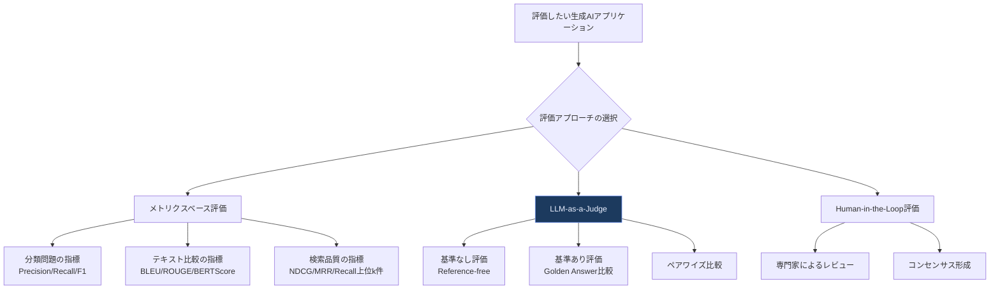

### 2.2 機械学習における汎化（Generalization）とMLライフサイクルの復習

生成AIの評価を理解する前提として、機械学習の基本ライフサイクル（データ収集→学習→検証→デプロイ→モニタリング）を思い出しておく価値があります。生成AIではこのライフサイクルの「学習」部分の多くを基盤モデル提供者（OpenAI、Anthropic、Googleなど）が担うため、開発者が主に責任を持つのは「検証（評価）」「デプロイ」「モニタリング」の部分に集中します。汎化性能、つまり「訓練時に見ていない入力にどれだけうまく対応できるか」という観点は、プロンプトエンジニアリングやRAGの設計においても変わらず中心的な関心事です。

### 2.3 メトリクスベース評価：分類問題としての生成AI

生成AIのタスクの一部は、実は分類問題として定式化できます（例：問い合わせのカテゴリ分類、感情分析、意図判定）。

| 指標 | 意味 | 適したタスク例 |
|---|---|---|
| Precision（適合率） | 「陽性」と予測したうち実際に正しかった割合 | 誤検知のコストが高いタスク（例：不正検知） |
| Recall（再現率） | 実際の陽性のうち正しく検出できた割合 | 見逃しのコストが高いタスク（例：医療スクリーニング） |
| F1スコア | PrecisionとRecallの調和平均 | 両者のバランスを取りたい場合 |
| マクロ平均/マイクロ平均 | 多クラス分類での指標の集約方法 | クラス数が多い意図分類タスクなど |

二値分類（Binary classification）ではPrecision/Recall/F1がそのまま使えますが、多クラス分類（Multi-class classification）では「マクロ平均（各クラスを平等に扱う）」と「マイクロ平均（サンプル数で重み付けする）」のどちらを使うかで結論が変わる点に注意が必要です。クラスの出現頻度に大きな偏りがあるデータセットでは、この選択がプロダクト判断を左右します。

### 2.4 テキスト比較の指標と検索の指標

自由形式のテキスト生成タスクでは、BLEU・ROUGE・BERTScoreのような指標で生成文と参照文の類似度を測ります。ただしこれらは表層的な語の一致（BLEU/ROUGE）や埋め込み空間での意味的類似度（BERTScore）を測るものであり、「事実として正しいか」までは保証しません。

検索（Retrieval）コンポーネントの評価には、情報検索分野で確立された指標を使います。

| 指標 | 意味 |
|---|---|
| Recall@k | 上位k件の検索結果の中に正解文書がどれだけ含まれているか |
| MRR（Mean Reciprocal Rank） | 最初に正解が現れる順位の逆数の平均。上位に正解が来るほど高スコア |
| NDCG（Normalized Discounted Cumulative Gain） | 順位を考慮した関連度スコアの累積。関連度に段階がある場合に有効 |

### 2.5 LLM-as-a-Judge：LLMに評価させるという発想

人手評価はコストが高く、スケールしません。そこで近年主流になっているのが「LLM自身に評価させる（LLM-as-a-Judge）」というアプローチです。2026年時点でこの手法は3つのパターンに整理されています。

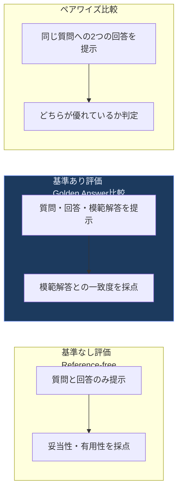

- **基準なし評価**：模範解答を用意する手間がない代わりに、判定基準が曖昧になりやすい
- **基準あり評価**：最も再現性が高いが、模範解答（ゴールデンアンサー）を維持するコストがかかる
- **ペアワイズ比較**：2つのモデル・プロンプトのA/B比較に強いが、判定順序による位置バイアスが起きやすい

2026年の実務知見として、LLM審査者には**位置バイアス**（先に提示された回答を好む）、**冗長性バイアス**（長い回答を高く評価しがち）、**自己贔屓バイアス**（同じモデルファミリーの出力を過大評価する）という3つの系統的な偏りが確認されており、これらを緩和する具体策が定着しています。

| バイアスの種類 | 内容 | 緩和策 |
|---|---|---|
| 位置バイアス | 提示順序によって評価が変わる | 回答の提示順をランダム化し、両方向で採点して平均を取る |
| 冗長性バイアス | 長い回答を無条件に高評価する傾向 | 評価基準に「簡潔さ」を明示的な採点軸として含める |
| 自己贔屓バイアス | 判定に使うモデルと同系統の出力を過大評価 | 判定用モデルを被評価対象と異なるベンダー・世代にする |

さらに、Chain-of-Thought形式でLLM審査者に採点理由を明示的に書かせてから最終スコアを出させる手法（G-Eval等）は、単純に点数だけを出させる場合と比べて人間の評価との一致度（Cohenのカッパ係数など）を大きく改善することが確認されています。実務では、LLM審査者を導入した後も**定期的に人間の専門家によるサンプル抽出評価**を行い、審査者自体がドリフトしていないかを検証する「審査者のキャリブレーション」が標準的な運用になっています。

### 2.6 コンセンサス（複数審査者の合議）

単一のLLM審査者に依存するリスクを下げるため、複数のモデル・複数のプロンプトで採点させて多数決や平均を取る「陪審員（Jury）」方式も広く使われています。1つの審査モデルに強く依存する体制よりコストは上がりますが、系統的バイアスの影響を平均化できるという利点があります。

### 2.7 Human-in-the-Loop（HITL）評価の実装

すべてを自動化することはできません。特に、法規制が絡む領域（医療・金融・法務）や、ブランド毀損リスクが大きい出力については、人間によるレビューを組み込む必要があります。

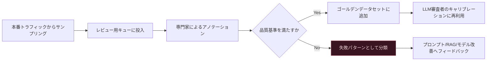

HITLをスケールさせる（Scaling and operationalizing human evaluation）ためには、レビュー担当者向けのガイドラインの明文化、アノテーション者間の一致率（Inter-Annotator Agreement）の計測、そしてレビュー結果を継続的に自動評価パイプラインへフィードバックする仕組みが欠かせません。

### 2.8 より複雑な評価シナリオ：RAGとエージェントの評価

**RAGアプリケーションの評価**は、検索（Retrieval）と生成（Generation）を分けて評価する「コンポーネント分解評価」が定石です。

| 評価軸 | 何を測るか |
|---|---|
| Context Precision（文脈適合率） | 検索された文脈のうち、実際に回答に必要な情報がどれだけ含まれるか |
| Context Recall（文脈再現率） | 回答に必要な情報のうち、検索で拾えた割合 |
| Faithfulness（忠実性） | 生成された回答が検索された文脈にどれだけ忠実か（ハルシネーションの逆指標） |
| Answer Relevancy（回答関連性） | 生成された回答が元の質問にどれだけ関連しているか |

**エージェントの評価**はさらに複雑で、単一のターン評価ではなく「軌跡（Trajectory）」全体を評価する必要があります。具体的には、（1）タスクを最終的に完遂できたかという**タスク成功率**、（2）不要なツール呼び出しや遠回りをしていないかという**効率性**、（3）各ステップでの**ツール選択の正しさ**、（4）途中で誤った判断をしても軌道修正できる**回復力（Resilience）**、という4つの軸で評価するのが2026年時点の標準的なアプローチです。


---

<a id="part3"></a>
## 第3部（Ch3）：主要アーキテクチャを理解する

### 3.1 プロンプトテンプレートの組織化とバージョン管理

プロンプトは「一度書いたら終わり」のものではなく、コードと同じように**バージョン管理・レビュー・A/Bテストの対象**として扱うべき成果物です。2026年時点では、プロンプトをアプリケーションコードから切り離し、専用の「プロンプトレジストリ」で一元管理する構成が主流になっています。

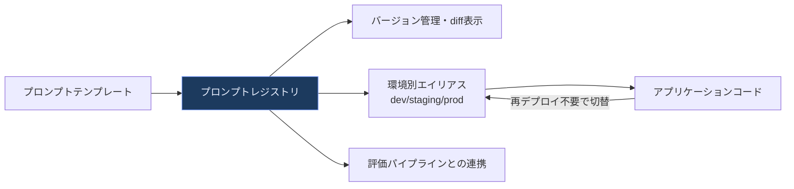

プロンプトをコードから分離しておくメリットは、非エンジニアのプロンプトエンジニアがアプリケーションの再デプロイなしにプロンプトを更新でき、かつすべての変更履歴が追跡可能になる点です。

### 3.2 ベクトルデータベースによる埋め込みの保存と検索

RAGの中核となるのが、テキストを埋め込みベクトルに変換して保存し、意味的な近さで検索するベクトルデータベースです。

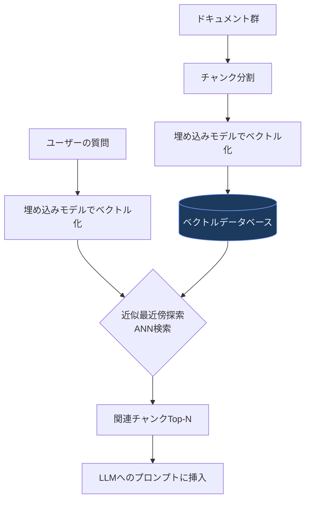

チャンク分割の粒度（固定長 vs 見出し・意味単位での分割）、埋め込みモデルの選定、近似最近傍探索（ANN）のアルゴリズム（HNSWなど）はいずれもRAGの検索品質を大きく左右するチューニングポイントです。

### 3.3 ハイブリッド検索とリランキング

純粋なベクトル検索（意味検索）には弱点があります。製品型番やエラーコードのような「厳密な文字列一致が必要な検索」には向いていません。そこで、キーワード検索（BM25などの疎ベクトル）とベクトル検索（密ベクトル）を組み合わせる**ハイブリッド検索**が2026年時点の本番標準になっています。

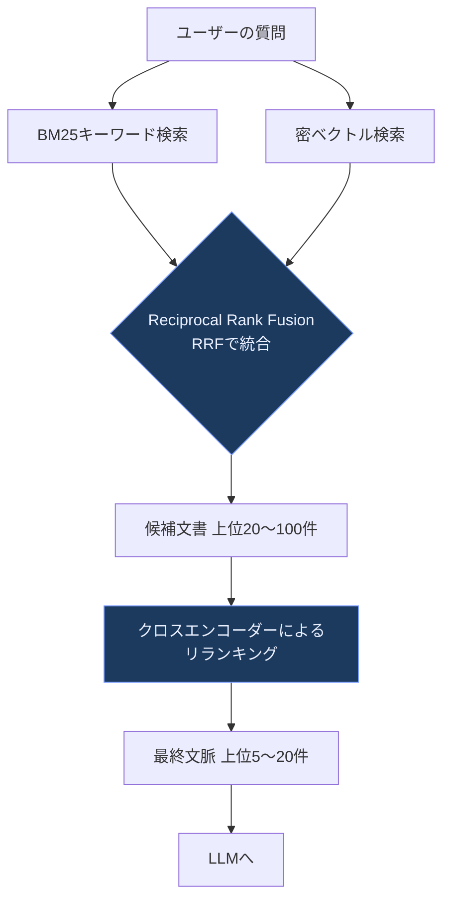

Reciprocal Rank Fusion（RRF）は、複数の検索結果の「順位」だけを使ってスコアを再計算する軽量な統合手法で、実装が簡単な割に効果が高いことから広く使われています。さらに、候補文書を絞り込んだ後にクロスエンコーダー型のリランカー（質問と文書のペアを直接読んで関連度を再評価するモデル）を通すことで、検索精度が大きく向上することが2026年の複数のベンチマーク研究で確認されています。一方でクロスエンコーダーは1件ずつ計算コストがかかるため、「まず粗く数千件から数十件に絞り込み、その少数だけを精密にリランキングする」という2段階構成が定石です。

#### インバーテッドインデックス（転置インデックス）

BM25のようなキーワード検索の裏側では、「単語→その単語を含む文書のリスト」という転置インデックスが使われています。これは検索エンジンの基礎技術であり、ベクトル検索が普及した現在でも、完全一致・部分一致が重要な場面では欠かせない仕組みです。

#### クエリ拡張（Query Expansion）

ユーザーの質問をそのまま検索クエリとして使うのではなく、LLMを使って類義語や関連語を含む複数のクエリに展開してから検索する手法です。ユーザーの語彙と文書の語彙にズレがある場合（専門用語 vs 平易な言葉など）に有効です。

### 3.4 限られたコンテキストウィンドウへの対処：MapReduceパターン

大量の文書を一度に要約・分析したいが、LLMのコンテキストウィンドウに収まらない場合、分散処理でおなじみのMapReduceパターンが応用できます。

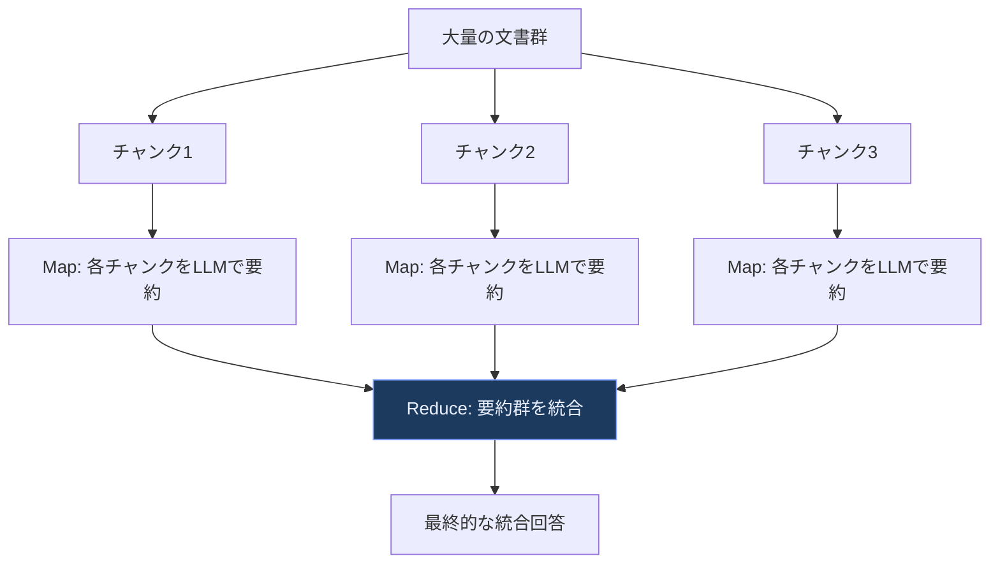

長いコンテキストウィンドウを持つモデルが増えた2026年現在でも、コスト・レイテンシ・「干し草の中の針（Needle in a Haystack）」問題（コンテキストが長くなるほど重要な情報が埋もれて見落とされやすくなる現象）の観点から、MapReduce的な分割統治は依然として有効な設計パターンです。

### 3.5 エージェンティックアーキテクチャの探求

生成AIアプリケーションの中でも特に設計判断が難しいのが、LLMが自律的にツールを呼び出しながらタスクを遂行する「エージェント」です。Anthropicが公開した"Building Effective Agents"などの実務知見をもとに、2026年時点で整理されている代表的なパターンを見ていきます。

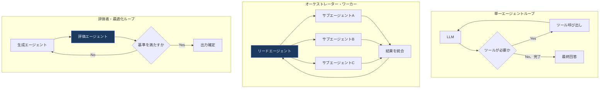

#### ツール呼び出し（Tool Calling）

エージェントの最も基本的な能力です。LLMに利用可能なツール（関数）の一覧とその引数スキーマを渡すと、LLMは「どのツールを、どんな引数で呼ぶべきか」を構造化データとして返します。呼び出し自体はアプリケーション側のコードが実行し、その結果を再びLLMに渡して次の判断を仰ぐ、というループを繰り返します。

#### タスク分解とTree of Thoughts

複雑なタスクを一度に解こうとせず、サブタスクに分解してから順に取り組む「タスク分解」、さらに複数の解法候補を並行して探索し、有望な枝だけを深掘りする「Tree of Thoughts」という推論戦略があります。これらは、単純な逐次推論（Chain of Thought）よりも探索的な問題（パズル、複雑な計画立案）で有効です。

#### マルチエージェントシステムと外部オーケストレーター

複数のエージェントを協調させる設計では、「1つのリードエージェントがタスクを分割し、専門特化したサブエージェントに委譲し、結果を統合する」オーケストレーター・ワーカー方式が代表的です。Anthropic自身の研究では、この方式が単一エージェントに対して評価ベンチマークで大幅な性能向上を示した一方、トークン消費量が数倍〜十数倍に増えることも報告されており、**「タスクが本当に並列分解可能かどうか」を見極めてから採用すべき、コストの高いパターン**であることが強調されています。

エージェント自体にすべての制御ロジックを埋め込むのではなく、LangGraphやTemporalのような**外部オーケストレーター**（ワークフローエンジン）にリトライ・タイムアウト・人間の承認ステップ・状態管理を任せる設計も広く採用されています。特にTemporalのような「耐久実行（Durable Execution）」基盤は、長時間動作するエージェントが途中でクラッシュしても状態を失わずに再開できる点で評価されています。

#### ツール呼び出しパターンの運用化

本番運用では、ツールへのアクセス権限を必要最小限に絞る「最小権限の原則」、高リスクな操作（決済実行、外部送信、破壊的な書き込みなど）には人間の承認を挟む「Human-in-the-Loop」、そしてツールの入出力をすべて監査ログに残すことが必須になります。これは第7部で扱うセキュリティの話題と直結します。

#### エージェンティックメモリ

エージェントが単発のタスクだけでなく、複数セッションにまたがる文脈を保持するには「メモリ」の設計が必要です。

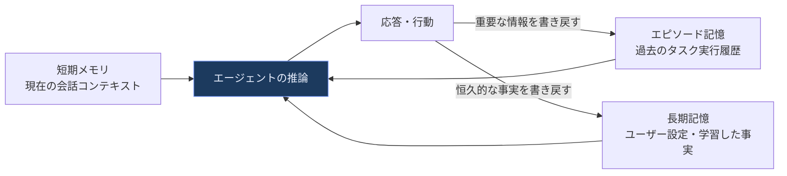

短期メモリ（今の会話のコンテキストウィンドウ内）、エピソード記憶（過去のタスク実行の要約）、長期記憶（ユーザーの恒久的な設定や学習した事実）という3層構造で設計するのが一般的です。メモリに何を残すか・いつ要約するかの設計を誤ると、古い誤情報がメモリに固定化されてしまう「メモリ汚染」のリスクがあるため、書き戻しには何らかの検証ステップを挟むことが推奨されます。


---

<a id="part4"></a>
## 第4部（Ch4）：プロトタイプから本番コードへ

### 4.1 なぜ「オペレーション化（Operationalization）」が重要なのか

Jupyterノートブックに書き殴ったプロトタイプのコードをそのまま本番に持っていくと、他のエンジニアが読めない・保守できない・テストできないという問題に直面します。生成AIアプリケーションであっても、ソフトウェア工学の基本原則が適用されるべき理由がここにあります。

### 4.2 コードの可読性を高める

Pythonでコードを読みやすくする基本は、意味のある変数名・関数の単一責任・型ヒントの活用・不要なネストの削減です。生成AI特有の注意点としては、プロンプト文字列をコード中にベタ書きせず、ロジックとプロンプトテンプレートを明確に分離することが挙げられます（3.1節のプロンプトレジストリの考え方と直結します）。

### 4.3 拡張しやすいコードにする：SOLID原則の中心的な2つ

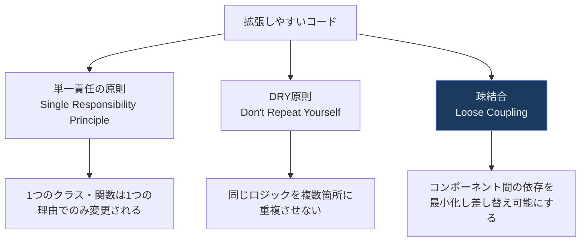

生成AIアプリケーションにおける**疎結合**は特に重要です。例えば「どのLLMプロバイダーを使うか」「どのベクトルデータベースを使うか」をアプリケーションロジックから抽象化しておけば、モデルの入れ替え（GPTからClaudeへ、Pineconeから自社ホスティングのpgvectorへ、など）がアプリケーションコード全体への大改修なしに行えます。これは第3部で触れたLLMゲートウェイの設計思想とも一致します。

### 4.4 テスト戦略：単体・統合・負荷テスト

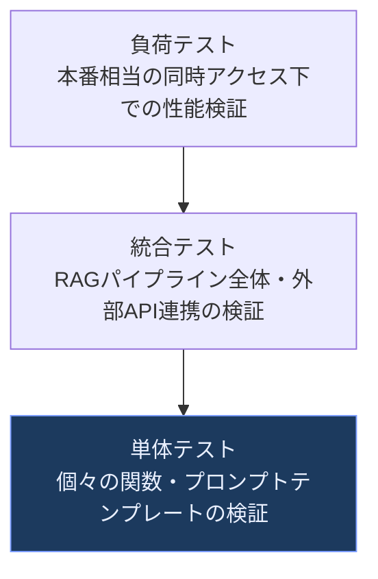

生成AIアプリケーションの単体テストでは、「LLM呼び出し自体をモック化し、周辺のビジネスロジック（入力のバリデーション、出力のパース、エラーハンドリング）を決定的にテストする」ことが基本になります。LLMの出力そのものの品質評価は、単体テストではなく第2部で扱った評価パイプライン（オフライン評価・LLM-as-a-Judge）の役割です。この線引きを曖昧にすると、「LLMの気まぐれでテストが落ちたり通ったりする」という不安定なテストスイートになってしまいます。

統合テストでは、RAGパイプライン全体（検索→生成→後処理）や外部API（決済、CRMなど）との連携を、実際に近い環境で検証します。負荷テストでは、同時多数のリクエストが来た際のレイテンシ悪化・レート制限への抵触・コスト急増を事前に把握します。

### 4.5 シンプルに保つことの価値、そして「近道」の代償

「動くから」という理由だけで応急処置的な実装（クイックフィックス）を重ねると、後から本質的な設計変更をする際の技術的負債になります。特に生成AIプロジェクトでは「とりあえずプロンプトに条件分岐を足す」という近道が繰り返されがちで、これがプロンプトの肥大化・保守不能化を招く典型的な失敗パターンです。複雑なロジックはプロンプトではなくコード側の分岐や、専用のツール呼び出しに切り出す判断が重要になります。

### 4.6 ユーザーオンボーディング

本番アプリケーションでは、ユーザーが生成AI機能の能力と限界を正しく理解できるようにするオンボーディング設計も欠かせません。何ができて何ができないのかを最初に明示し、ハルシネーションのリスクがある領域では出典表示や確信度の提示を行うことが、ユーザーの信頼構築とプロダクトの継続利用に直結します。


---

<a id="part5"></a>
## 第5部（Ch5）：DevOps・MLOpsからLLMOpsへ

### 5.1 DevOpsの復習：CI/CDとは何か

DevOpsは「コード変更を自動的にビルド・テスト・デプロイする仕組み（継続的インテグレーション/継続的デリバリー、CI/CD）」を通じて、開発と運用の壁を取り払う文化・実践の総称です。生成AI時代であっても、この基盤は変わらず必要です。

### 5.2 MLOps：機械学習パイプラインと成功指標

MLOpsはDevOpsの考え方を機械学習に拡張したもので、データの前処理・モデル学習・検証・デプロイ・モニタリングを含む「MLパイプライン」を自動化・再現可能にすることを目指します。MLOpsにおける成功指標は、モデル精度だけでなく、パイプラインの再現性、デプロイまでのリードタイム、モデルドリフトの検知速度などを含みます。

### 5.3 LLMOpsの誕生：何が新しく必要になったのか

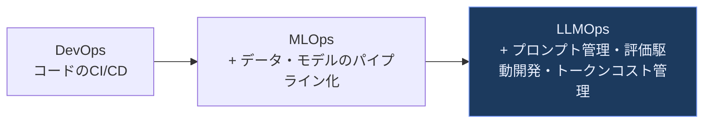

LLMOpsがMLOpsに単純に上乗せする要素として、2026年時点で実務的にコンセンサスが取れているのは次の点です。

| MLOpsにはなかった新要素 | 内容 |
|---|---|
| プロンプトのバージョン管理 | プロンプトはもはや「ちょっとした指示文」ではなく、テスト・A/Bテスト・継続的最適化の対象となる本番システムの構成要素 |
| 評価駆動開発（Evaluation-first） | 「とりあえずデプロイして様子を見る」から、リグレッションを事前に検知する体系的なテストへの転換 |
| マルチステップ・エージェントワークフローの追跡 | 単一の推論ではなく、複数ステップにまたがるエージェントの意思決定過程をトレースする必要性 |
| トークン単位のコスト帰属 | どのユーザー・機能・リクエストがどれだけのトークンコストを消費しているかを可視化する必要性 |
| モデルプロバイダーの多様化への対応 | 複数のLLMプロバイダー・複数世代のモデルを併用しながら、それぞれの評価・ルーティングを管理する必要性 |

2026年の業界調査では、LLMOpsプラットフォーム市場において「評価・観測性・プロンプト管理を1つの統合ワークフローで扱う」ことが差別化の主戦場になっており、これによって開発チームは「本番ログの分析→テストケース作成→評価実行→改善のデプロイ」というサイクルを大幅に高速化できると報告されています。

### 5.4 LLMOpsツールの選び方

LLMOpsツールを選定する際の主な評価軸を整理します。

| 評価軸 | 確認すべきポイント |
|---|---|
| トレーシング | マルチステップのエージェント実行を1つのトレースとして可視化できるか |
| 評価機能 | オフライン評価（CI連携）とオンライン評価（本番トラフィック）の両方に対応しているか |
| プロンプト管理 | プロンプトのバージョン管理・環境別デプロイ・ロールバックができるか |
| ベンダーロックイン | OpenTelemetryのような標準規格に準拠し、バックエンドを切り替え可能か |
| コスト | トークン単位のコスト、機能単位のコスト帰属が可視化できるか |

### 5.5 ケーススタディ：RAGアプリケーションのためのCI/CDジョブ

RAGアプリケーションのCI/CDパイプラインを具体的に見てみましょう。通常のアプリケーションのCI/CDに加えて、「検索品質」と「生成品質」の両方をゲートにする必要があります。

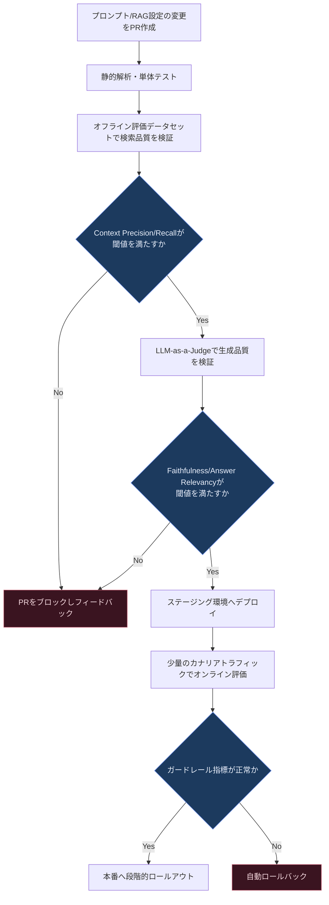

このパイプラインのポイントは、**プロンプトやRAG設定の変更を、通常のコード変更と同じくPull Requestベースでレビュー・自動テストの対象にする**ことです。これにより、「なんとなくプロンプトを直したら精度が落ちた」という事故を、マージ前に機械的に検知できるようになります。


---

<a id="part6"></a>
## 第6部（Ch6）：アプリケーションをデプロイする

### 6.1 ステートレスなアプリケーションとステートフルなアプリケーション

デプロイ設計の最初の分岐点は、アプリケーションが「状態（ステート）」をどこに持つかです。

| 特性 | ステートレス | ステートフル |
|---|---|---|
| リクエスト間の状態保持 | サーバー側では持たない（各リクエストが独立） | サーバー側でセッション状態を保持する |
| スケーリングのしやすさ | 容易（どのインスタンスにルーティングしてもよい） | 難しい（同じセッションは同じインスタンスに固定する必要がある場合がある） |
| 典型例 | 単発のプロンプト補完API | 長時間の会話履歴やエージェントの実行状態を持つセッション |

生成AIアプリケーション、特にマルチターンの会話やエージェント実行では、状態管理そのものはRedisや専用の「セッションストア」（第9部で詳述）に外出しし、**アプリケーションサーバー自体は極力ステートレスに保つ**のが2026年時点の定石です。これにより、アプリケーション層は水平スケーリングが容易になります。

### 6.2 デプロイのベストプラクティス

#### Infrastructure as Code（IaC）

インフラをコードとして宣言的に管理することで、環境間の差異（開発・ステージング・本番）をなくし、変更履歴をコードのバージョン管理と同じ仕組みで追跡できます。生成AIアプリケーションでは、ベクトルデータベースのインスタンス、GPU/TPUリソース、モデルサービングエンドポイントの定義もIaCの対象に含めるべきです。

#### シークレット管理と構成管理

APIキー・データベース認証情報などのシークレットはコードやコンテナイメージに埋め込まず、専用のシークレット管理サービスから実行時に注入します。構成管理（環境変数、フィーチャーフラグ）も同様に、コードの再デプロイなしに変更できる仕組みにしておくことで、プロンプトやモデルのバージョン切り替えを迅速に行えます。

### 6.3 アプリケーションのデプロイ方式

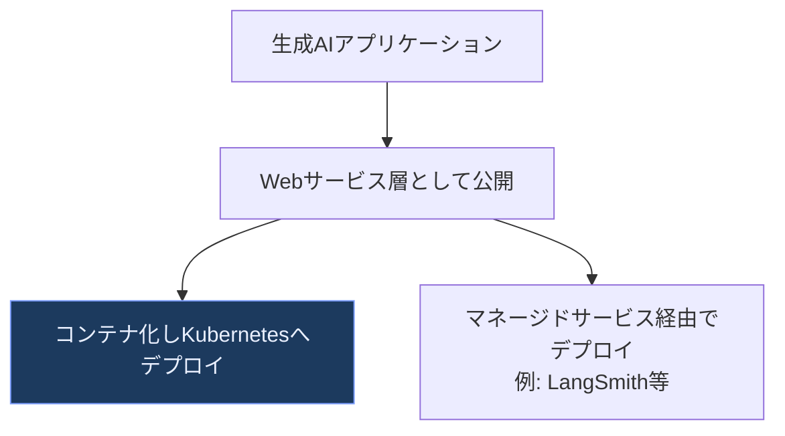

**コードをWeb APIとしてラップする**ことで、フロントエンドや他のマイクロサービスから標準的なHTTP/gRPCインターフェースで呼び出せるようになります。**Kubernetesへのデプロイ**では、通常のマイクロサービスと同様にヘルスチェック・オートスケーリング・ローリングアップデートの仕組みを活用しつつ、GPU/TPUノードプールの扱いや、モデルのロード時間を考慮したReadiness Probeの設計が生成AI特有の考慮点になります。一方、**マネージドサービス経由のデプロイ**は、自前でインフラを持たずに評価・トレーシング・デプロイまでを統合的に扱える利点があり、特に小規模チームやスピード重視のプロダクトで採用が進んでいます。

### 6.4 アプリケーションをスケールさせるベストプラクティス

#### キャッシングとCAP定理

生成AI呼び出しはレイテンシとコストの両面で高くつくため、キャッシングは最も費用対効果の高い最適化の一つです。

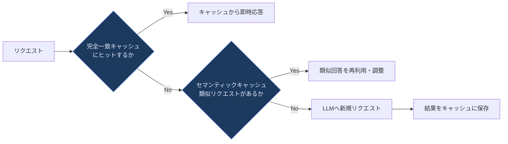

分散システムでキャッシュを持つ場合、古典的な**CAP定理**（一貫性・可用性・分断耐性の3つを同時に完全には満たせないという定理）の考え方が再び重要になります。キャッシュが複数リージョンに分散している場合、「常に最新の回答を返す一貫性」と「一部のノードが落ちても応答し続ける可用性」はトレードオフの関係にあり、生成AIのようにやや古いキャッシュでも実用上大きな問題にならないケースでは、可用性を優先する設計が一般的です。

#### コンテキストキャッシング（Prompt Caching）

生成AI特有のキャッシング手法として、プロンプトの共通部分（システムプロンプトや長い参考文書など）をモデル提供者側でキャッシュし、同じ接頭辞を持つリクエストの処理コストとレイテンシを削減する「プロンプトキャッシュ（コンテキストキャッシング）」があります。2026年にはこの機能がAnthropic・OpenAI・Googleの主要プロバイダーで標準的に提供されるようになり、コンテキストエンジニアリングの定石そのものを変えるインパクトをもたらしました（詳細は第11部で扱います）。

#### グレースフルデグラデーション（優雅な劣化）

LLMプロバイダーのAPIが遅延・障害を起こした場合に、アプリケーション全体を停止させるのではなく、機能を段階的に縮退させて動作を継続させる設計です。

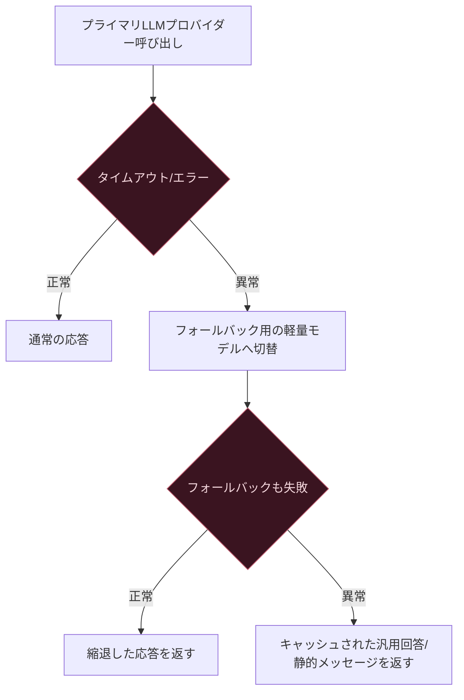

#### リクエストスロットリングとカスケード障害の防止

上流のLLMプロバイダーにはレート制限があり、これを超えると429エラーが返ってきます。アプリケーション側でリクエストレートを制御する「スロットリング」や、下流サービスの障害が上流に連鎖的に波及することを防ぐ「サーキットブレーカー」パターンは、通常の分散システムと同様に生成AIアプリケーションでも必須の防御機構です。ある1つのLLMプロバイダーの障害が、リトライの嵐によってアプリケーション全体を巻き込む「カスケード障害」に発展しないよう、指数バックオフ付きリトライ、リトライ回数の上限設定、タイムアウトの明示的な設定を組み合わせます。


---

<a id="part7"></a>
## 第7部（Ch7）：倫理とセキュリティ

### 7.1 Responsible AIの基本

責任あるAI（Responsible AI）は、単一の技術ではなく「公平性（Fairness）」「説明可能性（Explainability）」「安全性・セキュリティ（Safety and Security）」「プライバシー（Privacy）」という4本柱で構成される、開発プロセス全体に組み込むべき考え方です。

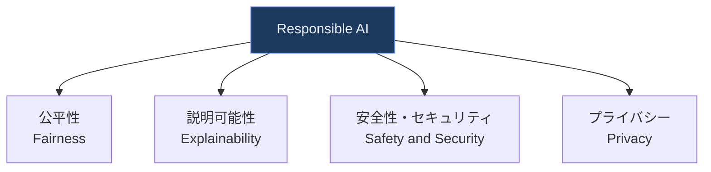

### 7.2 公平性（Fairness）

生成AIにおける公平性の問題は、従来の分類モデルにおける「特定の属性グループへの予測精度の偏り」だけでなく、**生成される文章そのものに含まれるステレオタイプや偏見**という新しい次元を持ちます。公平性を改善する取り組みとしては、訓練データの多様性確保（これは基盤モデル提供者側の責務が大きい）に加え、アプリケーション開発者側でも、プロンプト設計時にステレオタイプを助長しない指示を含める、評価データセットに多様な属性の入力を意図的に含める、といった対策が可能です。

### 7.3 説明可能性（Explainability）

「なぜモデルがその出力を返したのか」を人間が理解できるようにすることです。従来の機械学習では特徴量重要度のような手法が使われてきましたが、LLMは内部構造が複雑でブラックボックス性が高いため、**LLM自身に理由を説明させる（Chain-of-Thought的な説明生成）**、**RAGでは根拠となった文書を引用として明示する**、といった実務的な代替アプローチが取られます。ただし、LLMが「もっともらしい説明」を後付けで生成しているだけで、実際の内部推論過程とは異なる可能性がある点には注意が必要です。

### 7.4 安全性とセキュリティ

古典的な機械学習時代の安全性（誤分類による実害の防止）に加え、生成AI特有の安全性の課題として、有害コンテンツの生成、脱獄（ジェイルブレイク）攻撃への耐性、そして「エージェントが実世界に対して行動する」ことに伴う新しいリスクが加わりました。

2026年のOWASP Top 10 for LLM Applicationsでは、ランキングに顕著な変化が見られます。

| 2026年の順位 | リスク項目 | 2025年からの変化 |
|---|---|---|
| 1位 | プロンプトインジェクション | 2年連続1位を維持 |
| 2位 |機密情報の漏洩 | 順位変わらず |
| 3位 | 過剰な自律性（Excessive Agency） | 6位から3位へ急上昇 |
| 4位 | サプライチェーンの脆弱性 | 3位から後退 |
| 5位 | データ・モデルの汚染（Poisoning） | 4位から後退 |
| 6位 | 誤情報（Misinformation） | 下位から上昇 |
| 7位 | 無制限な消費（Unbounded Consumption） | 下位から上昇 |

特に注目すべきは「過剰な自律性」の急上昇です。これはエージェントに必要以上のツールアクセス権限や広すぎる操作範囲、人間の承認なしでの実行権限を与えることで生じるリスクであり、まさに第3部で扱ったエージェント設計・ツール呼び出しの運用化と直結します。また「無制限な消費」は、単なるトークン量の問題ではなく、1つのエージェントリクエストがネストしたツール呼び出しやサブエージェント呼び出しを通じて予期しないほどのコスト・計算資源を消費してしまうリスクを指しており、第6部のスロットリング・第9部のコスト管理と関連します。

さらに、OWASPは2025年末に「OWASP Top 10 for Agentic Applications」を新設し、エージェント特有のリスク（ツール権限の濫用、エージェント間通信の悪用、メモリ汚染など）を体系化しています。プロンプトインジェクションについては、セキュリティ研究者のSimon Willison氏が提唱した「**Lethal Trifecta（致死の三要素）**」という考え方が広く参照されています。これは、（1）機密データへのアクセス、（2）信頼できない外部コンテンツの処理、（3）外部への通信能力、という3つの能力が1つのエージェントに同時に揃うと、原理的にプロンプトインジェクションを完全には防げない構造的リスクが生まれる、という指摘です。

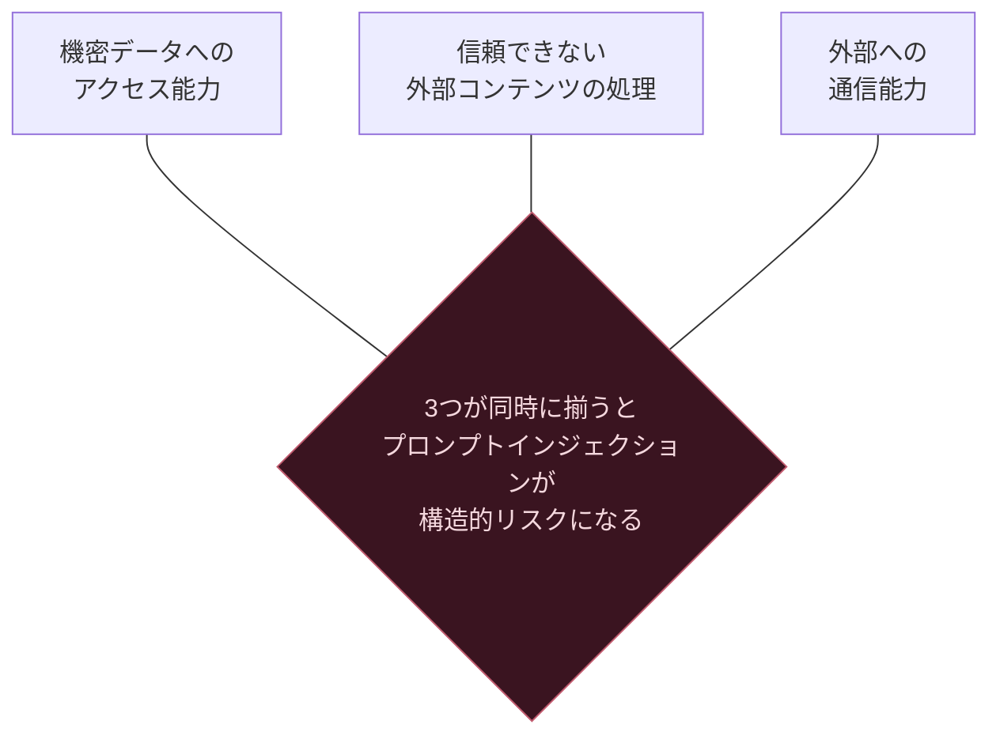

実務的な緩和策としては、（1）ツールへのアクセス権限を最小化する、（2）信頼できない入力（Webページの内容、メール本文など）とシステム指示を明確に分離して扱う、（3）高リスクな操作には人間の承認を必須にする、（4）Guardrails（NeMo GuardrailsやLlama Guardなど）による多段的な入出力フィルタリングを組み込む、という多層防御（Defense in Depth）の考え方が定着しています。

### 7.5 プライバシー

生成AIにおけるプライバシーの課題は、（1）訓練データに含まれる個人情報がモデルの出力に漏洩するリスク、（2）RAGで検索対象とするドキュメントに含まれる機密情報が意図しないユーザーに開示されるリスク、（3）ユーザーが入力したプロンプト自体に含まれる個人情報の取り扱い、という3層構造で考える必要があります。改善策としては、PIIの検出・マスキング、RAGにおけるドキュメントレベルのアクセス制御（ユーザーの権限に応じて検索対象を制限する）、ログ保持期間の最小化などが挙げられます。


---

<a id="part8"></a>
## 第8部（Ch8）：可観測性と信頼性

### 8.1 サイト信頼性エンジニアリング（SRE）とは何か

SRE（Site Reliability Engineering）は、Googleが提唱した「ソフトウェアエンジニアリングの手法を運用問題の解決に適用する」考え方です。生成AIアプリケーションは非決定的な出力・外部LLMプロバイダーへの依存・高い計算コストという特性を持つため、従来以上にSREの原則が重要になります。

### 8.2 信頼性の達成：SLI・SLO・SLAとエラーバジェット

```mermaid
flowchart LR
    A[SLI<br/>Service Level Indicator<br/>実際に計測する指標] --> B[SLO<br/>Service Level Objective<br/>内部的な目標値]
    B --> C[SLA<br/>Service Level Agreement<br/>顧客との契約上の約束]
    B --> D[エラーバジェット<br/>SLOから許容される失敗の余地]

    classDef highlightFill fill:#1c3a5e,stroke:#7c9eff,color:#eaf0ff
    class D highlightFill
```

- **SLI（サービスレベル指標）**：実際に計測する生の数値。生成AIでは「p95レイテンシ」「エラー率」に加えて「ハルシネーション率」「回答品質スコア」もSLIの対象になり得ます。
- **SLO（サービスレベル目標）**：SLIに対する内部的な目標（例：「p95レイテンシが3秒以内であることが99.9%の時間で成立する」）。
- **SLA（サービスレベル契約）**：SLOを顧客との契約に落とし込んだもので、通常SLOより緩い基準が設定されます。
- **エラーバジェット**：SLOが「100%」ではなく「99.9%」のように設定されることで生まれる、意図的に許容された失敗の余地です。

```mermaid
flowchart TB
    A[SLO 99.9%達成に設定] --> B[エラーバジェット 0.1%が発生]
    B --> C{バジェットの消費ペース}
    C -->|健全な範囲| D[新機能のリリースを継続]
    C -->|バジェット枯渇が近い| E[リリースを凍結し信頼性改善を優先]

    classDef dangerFill fill:#3a1420,stroke:#c05a6e,color:#f5d8de
    class E dangerFill
```

エラーバジェットの考え方の本質は、「信頼性を100%にすることがゴールではなく、ビジネス上合意された信頼性目標の範囲内で、いかに速く機能改善を続けられるか」というバランスを取ることにあります。生成AIプロダクトでは、モデルのアップグレードやプロンプト変更自体がこのバジェットを消費するリスク要因になるため、第5部のCI/CDゲートと密接に連動します。

### 8.3 その他のSRE原則とトイルの削減

SREのもう一つの重要な考え方が「トイル（Toil）」——手作業で繰り返し発生する、自動化可能なはずの運用作業——の削減です。生成AI運用チームにおけるトイルの典型例は、手動でのプロンプト調整、手動でのハルシネーション事例のレビュー、手動でのモデルバージョン切り替え作業などで、これらを自動化パイプラインに置き換えていくことがSREチームの重要な責務です。

### 8.4 本番アプリケーションの管理：テレメトリデータの3本柱

```mermaid
sequenceDiagram
    participant User as ユーザー
    participant App as アプリケーション
    participant LLM as LLMプロバイダー
    participant Obs as 可観測性基盤

    User->>App: リクエスト送信
    App->>Obs: トレース開始（Span生成）
    App->>LLM: プロンプト送信
    Obs->>Obs: メトリクス記録<br/>トークン数・レイテンシ
    LLM-->>App: 応答返却
    App->>Obs: ログ記録<br/>入出力・エラー有無
    App-->>User: 最終応答
    Obs->>Obs: トレース完了・保存
```

- **ログ（Logs）**：個々のイベントの詳細な記録。入力プロンプト、生成された出力、発生したエラーなど。
- **メトリクス（Metrics）**：集計された数値データ。リクエスト数、p50/p95/p99レイテンシ、トークン消費量、コストなど。
- **トレース（Traces）**：1つのリクエストがシステム内をどう伝播したかを示す、複数のスパンから成る因果関係の記録。エージェントのようなマルチステップ処理では特に重要です。

### 8.5 モニタリングとアラート、そしてGenAI観測性の標準化

2026年時点で最も重要な業界動向の一つが、**OpenTelemetryのGenAI Semantic Conventions（GenAI意味規約）**の普及です。これは、LLM呼び出し・エージェントの起動・ツール呼び出しといったイベントに対して、`gen_ai.*`から始まる標準化された属性名（モデル名、トークン数、終了理由など）を定義するもので、2024年4月にOpenTelemetryのGenAI SIG（特別関心グループ）によって策定が始まりました。

```mermaid
flowchart LR
    A[アプリケーションコード] --> B[OpenTelemetry SDK<br/>gen_ai.* 属性で計装]
    B --> C{OTLPエクスポーター}
    C --> D[Datadog]
    C --> E[Grafana]
    C --> F[任意のOTLP対応バックエンド]

    classDef highlightFill fill:#1c3a5e,stroke:#7c9eff,color:#eaf0ff
    class B highlightFill
```

この標準化以前は、Langfuse・Helicone・LangSmithなどの各ツールが独自のトレーシング形式を使っており、ベンダーロックインの原因になっていました。GenAI意味規約に対応することで、**計装は一度書けば、バックエンドをいつでも自由に切り替えられる**という利点が生まれます。2026年時点でこの規約はまだ「実験的（Experimental）」ステータスのものが多いものの、GitHub Copilot・Codex・Claude Codeのようなコーディングエージェント自体がネイティブにOpenTelemetryでトレースを出力するようになるなど、実装は着実に広がっています。

### 8.6 GenAI観測性特有の計装ポイント

従来のAPM（アプリケーション性能監視）と異なり、生成AIシステムの観測性では次の点を追加で計装する必要があります。

| 計装対象 | 理由 |
|---|---|
| プロンプト・完了内容のキャプチャ | デバッグ時に「なぜこの出力が返ったか」を再現するために必要（機密情報の扱いには注意） |
| トークン単位のコスト帰属 | どの機能・ユーザー・エージェントステップがコストを消費しているかを可視化 |
| TTFT（Time To First Token） | ストリーミング応答の体感速度を左右する、生成AI特有のレイテンシ指標 |
| ツール呼び出しの成否と引数 | エージェントがどのツールをどう使ったかを追跡し、デバッグと監査に使う |
| 品質スコア（オンライン評価結果） | 第2部の評価パイプラインの結果を本番トレースと紐づけ、品質の推移を監視する |


---

<a id="part9"></a>
## 第9部（Ch9）：アプリケーションを保守する

### 9.1 デプロイ後の生活：プラットフォームチームという発想

生成AIアプリケーションが1つや2つのうちは、各プロダクトチームがそれぞれLLM呼び出し・評価・デプロイの仕組みを個別に作ってもなんとかなります。しかし組織内で生成AI活用が広がるにつれ、共通基盤を提供する専任の「プラットフォームチーム」が必要になります。

### 9.2 通常のプラットフォームチームとGenAIプラットフォームチームの違い

通常の社内プラットフォームチーム（Kubernetes基盤、CI/CD基盤など）と比較して、GenAIプラットフォームチームには次のような固有の役割が求められます。

| 観点 | 通常のプラットフォームチーム | GenAIプラットフォームチーム |
|---|---|---|
| 主な提供物 | コンピュート・ネットワーク・CI/CD基盤 | 上記に加え、モデルアクセス・評価基盤・ガードレール |
| 変更の性質 | インフラの構成変更が中心 | モデルのバージョンアップ・プロンプトの継続的最適化も対象 |
| 品質保証の対象 | デプロイの成否・可用性 | 上記に加え、生成物の品質・安全性・コスト効率 |

### 9.3 GenAIプラットフォームのビルディングブロック

```mermaid
flowchart TB
    subgraph Platform[GenAIプラットフォーム]
        MG[モデルゲートウェイ]
        PS[プロンプトストア]
        TR[ツールレジストリ]
        ES[実行サンドボックス]
        SS[セッションストア]
        FS[フィードバックサービス]
        HITL[Human-in-the-Loopキュー]
    end

    App[各プロダクトチームのアプリケーション] --> MG
    App --> PS
    App --> TR
    App --> ES
    App --> SS
    App --> FS
    FS --> HITL

    classDef highlightFill fill:#1c3a5e,stroke:#7c9eff,color:#eaf0ff
    class MG highlightFill
```

各コンポーネントの役割を整理します。

| ビルディングブロック | 役割 |
|---|---|
| モデルゲートウェイ | 複数のLLMプロバイダーへのアクセスを単一APIに統一し、ルーティング・キャッシング・レート制限・コスト帰属を一元管理する |
| プロンプトストア | 3.1節で扱ったプロンプトレジストリを全社共通基盤として提供する |
| ツールレジストリ | エージェントが呼び出せるツールをカタログ化し、権限管理・バージョン管理を一元化する |
| 実行サンドボックス | エージェントが生成したコードやコマンドを、隔離された安全な環境で実行するための基盤 |
| セッションストア | マルチターンの会話状態やエージェントの実行状態を、ステートレスなアプリケーション層の外側で保持する |
| フィードバックサービス | ユーザーからの評価（高評価/低評価ボタンなど）や暗黙的なシグナル（会話の中断など）を収集する |
| Human-in-the-Loop | 第2部で扱ったHITL評価と、高リスクなエージェント操作の承認フローを統合的に扱うキュー |
| サービング/学習インフラ | モデルの推論サービング（オートスケーリング、GPU/TPU効率利用）と、必要に応じたファインチューニング基盤 |

2026年のLLMゲートウェイ市場では、単なるAPIルーターにとどまらず、コスト管理・ガードレール・観測性を統合した製品への需要が高まっており、複数のプロバイダー（OpenAI、Anthropic、Google Vertex AI、AWS Bedrockなど）に対して単一のインターフェースでアクセスできることが標準的な要件になっています。またMCP（Model Context Protocol、詳細は第11部）のようなツール接続の標準規格の普及に伴い、ツールレジストリの実装もMCPサーバーのカタログ管理へと収斂しつつあります。

### 9.4 プロダクト戦略とロードマップ

保守フェーズに入ったGenAIプロダクトのロードマップ策定では、「新機能の追加」だけでなく、「モデル世代交代への追従計画」「評価データセットの継続的な拡充」「ガードレールルールの継続的な見直し」といった、生成AI特有の保守項目を計画に組み込む必要があります。これらは往々にして新機能開発と工数を奪い合う関係にあるため、プロダクト戦略レベルで意図的に時間を確保することが、長期的な品質維持の鍵になります。


---

<a id="part10"></a>
## 第10部（Ch10）：A/Bテストとオンライン実験

### 10.1 A/Bテストとは何か

A/Bテストは、ユーザートラフィックを複数のバリアント（例：プロンプトA vs プロンプトB、モデルX vs モデルY、リトリーバル戦略A vs B）にランダムに割り当て、実際のユーザー行動データを使ってどちらが優れているかを統計的に判断する手法です。第2部のオフライン評価が「本番投入前の品質ゲート」であるのに対し、A/Bテストは「実際のユーザーにとって何が本当に価値があるか」を最終的に検証する手段です。

```mermaid
flowchart TB
    A[本番トラフィック] --> B{ランダム割当}
    B --> C[バリアントA<br/>既存のプロンプト/モデル]
    B --> D[バリアントB<br/>新しいプロンプト/モデル]
    C --> E[行動データ収集]
    D --> E
    E --> F[統計的検定]
    F --> G{有意な差があるか}
    G -->|Yes、Bが優位| H[Bを全ユーザーへ展開]
    G -->|有意差なし/Aが優位| I[Aを維持し次の仮説を検証]

    classDef highlightFill fill:#1c3a5e,stroke:#7c9eff,color:#eaf0ff
    class F highlightFill
```

### 10.2 統計的検定の基礎：第一種の過誤と第二種の過誤

| 用語 | 意味 | 生成AI文脈での具体例 |
|---|---|---|
| 第一種の過誤（False Positive） | 実際には差がないのに「差がある」と誤って判定する | 実は同等の品質のプロンプトBを「改善した」と誤認しロールアウトしてしまう |
| 第二種の過誤（False Negative） | 実際には差があるのに「差がない」と見逃す | 本当に優れた新モデルの効果を検出できず、旧モデルを使い続けてしまう |

生成AIのA/Bテストでは、LLMの出力自体に大きな分散（同じ入力でも毎回微妙に異なる出力）が加わるため、**通常のWebサイトのA/Bテストよりも検出に必要なサンプルサイズが大きくなりやすい**という特有の難しさがあります。統計的検定を行う前に、評価に使うLLM審査者自体の「同一入力に対するブレ幅」を事前に計測しておき、観測された差のどこまでが本当のバリアント間の差で、どこまでが審査者自身のノイズなのかを切り分けることが2026年の実務では推奨されています。

### 10.3 p値にまつわる誤解（Myths about p-value）

p値は「バリアント間に本当は差がないという仮定（帰無仮説）のもとで、観測されたデータ（またはそれ以上に極端なデータ）が得られる確率」を意味しますが、しばしば「p値が0.05未満なら効果が証明された」という誤った解釈がされがちです。実際には、p値は効果の大きさやビジネス上の重要性を何も語っておらず、**統計的に有意であっても、実務上無視できるほど小さい効果**というケースは珍しくありません。逆に、サンプルサイズが不足していると、実際には意味のある効果があっても統計的有意性に達しない（第二種の過誤）ことも起こります。

### 10.4 オンラインテストのための良い指標とは

A/Bテストの成否を左右するのは、統計手法そのものより「何を測るか」の設計です。

| 指標の種類 | 特徴 | 注意点 |
|---|---|---|
| 直接的な行動指標（クリック率、継続利用率など） | 解釈しやすく、ビジネス目標と直結しやすい | 短期的な指標がユーザーの長期的な満足度と一致しない場合がある |
| プロキシ指標（LLM審査者による品質スコアなど） | 収集コストが低くリアルタイムに近い形で計測できる | 審査者自体のブレ・バイアスが指標に混入する |
| ガードレール指標（p95レイテンシ、コスト、安全性違反率など） | プライマリ指標の改善のために犠牲にされがちな副作用を検知する | プライマリ指標と独立して、単独で実験を停止させる権限を持たせるべき |

### 10.5 テストの検出力（Power）を高める

検出力とは「本当に差がある場合に、それを正しく検出できる確率」のことです。検出力を高める代表的な手法として、（1）サンプルサイズを増やす、（2）分散の小さい指標を選ぶ、（3）ユーザー属性などの共変量で調整して分散を減らす（CUPED法など）、（4）連続的モニタリングに対応した逐次検定手法を使う、といったアプローチがあります。

### 10.6 A/Bテストでよくある誤り

- **早期終了バイアス**：統計的有意性に達した時点で実験を早期に打ち切ってしまうと、偶然の変動を「本物の効果」と誤認するリスクが高まります。事前に定めたサンプルサイズ・実験期間を守ることが重要です。
- **複数指標の多重比較問題**：多数の指標を同時に検定すると、偶然「有意」に見える指標が出やすくなります。プライマリ指標を事前に1つに絞り込むことが推奨されます。
- **ネットワーク効果・汚染の見落とし**：マルチエージェントシステムやチャット共有機能があるプロダクトでは、バリアントAのユーザーとバリアントBのユーザーが互いに影響し合い、実験結果が歪む可能性があります。
- **新奇性効果（Novelty Effect）**：新しいプロンプトやUIが一時的に高評価を得るが、慣れとともに効果が消失する現象。十分な実験期間を確保することで検出できます。


---

<a id="part11"></a>
## 第11部：2026年9月時点の最新動向

本書の原著は2026年3月刊行ですが、生成AIアーキテクチャの実務は数ヶ月単位で更新され続けています。ここでは2026年9月9日時点でのウェブ検索調査に基づき、本ガイドの各部と関連する最新動向を独自に補足します。

```mermaid
flowchart TB
    A[2026年9月時点の主要トレンド]
    A --> B[MCPのLinux Foundation移管<br/>エージェント間標準化の加速]
    A --> C[LLMOps: 評価駆動開発の主流化]
    A --> D[OWASP Top10: 過剰な自律性リスクの急浮上]
    A --> E[OpenTelemetry GenAI規約の普及]
    A --> F[ハイブリッド検索+リランキングの標準化]
    A --> G[マルチエージェント設計における<br/>トークンコスト意識の高まり]

    classDef highlightFill fill:#1c3a5e,stroke:#7c9eff,color:#eaf0ff
    class A highlightFill
```

### 11.1 エージェント間相互運用の標準化：MCPのLinux Foundation移管

2025年12月9日、AnthropicはModel Context Protocol（MCP）をLinux Foundation傘下の新設団体「Agentic AI Foundation（AAIF）」に寄贈しました。AAIFはAnthropic・Block・OpenAIが共同設立し、Google・Microsoft・AWS・Cloudflare・Bloombergが支援する組織で、MCPに加えてBlockのgoose、OpenAIのAGENTS.mdも創設プロジェクトとして参加しています。2026年3月時点でMCPは月間9,700万回のSDKダウンロードを記録し、公開MCPサーバー数は1万件を超えました。これは第3部で扱ったツールレジストリの実装が、事実上MCPサーバーのカタログ管理へと収斂しつつあることを裏付けています。単一ベンダー依存のリスクが解消されたことで、企業のエージェント基盤投資判断における採用障壁が大きく下がったと報告されています。

### 11.2 LLMOps：評価駆動開発とマルチステップ観測性の主流化

2026年のLLMOpsプラットフォーム動向を見ると、「まずデプロイしてから様子を見る」という姿勢から、CI上でリグレッションを検知する評価駆動開発への転換が明確なトレンドとして確認できます。あわせて、単発のLLM呼び出しのログだけでなく、マルチステップのエージェントワークフロー全体を1つのトレースとして可視化し、トークン単位でコストを帰属させる機能が、LLMOpsプラットフォームの標準機能になりつつあります。

### 11.3 セキュリティ：OWASP Top 10 for LLM Applications 2026の変化

第7部で述べたとおり、2026年版OWASP Top 10 for LLM Applicationsでは「過剰な自律性（Excessive Agency）」が2025年版の6位から3位へ急上昇しました。これは、エージェントに実世界への行動権限を与えるアーキテクチャ（第3部）が急速に普及したことの裏返しであり、ツール権限の最小化・人間承認フローの組み込みが、もはや「あれば良い」ではなく必須の設計要件になったことを意味します。あわせて2025年末にはエージェント特有のリスクを扱う「OWASP Top 10 for Agentic Applications」が新設され、セキュリティ評価のスコープがアプリケーション単体からエージェントの行動全体へと拡張されています。

### 11.4 観測性：OpenTelemetryのCNCF卒業とGenAI意味規約の定着

2026年5月21日、OpenTelemetryはCNCF（Cloud Native Computing Foundation）を「卒業」し、本番インフラの標準的な可観測性基盤としての地位を確立しました。これと歩調を合わせる形で、GenAI意味規約（`gen_ai.*`属性によるLLM呼び出し・エージェント・ツール呼び出しの標準化）の実装が広がり、GitHub Copilot・Codex・Claude Codeのようなコーディングエージェント自身がネイティブにOpenTelemetryトレースを出力するようになりました。第8部で述べたベンダーロックインの回避という利点が、実際のツールチェーンで具体化しつつある段階です。

### 11.5 RAG：ハイブリッド検索+2段階リランキングの実証データ

2026年に公表された複数のベンチマーク研究（金融文書を対象としたT2-RAGBenchなど）では、キーワード検索と密ベクトル検索を組み合わせたハイブリッド検索に、さらにクロスエンコーダー型リランキングを追加する2段階パイプラインが、単一手法と比べて大幅なRecall@5の改善（研究によっては単一手法比で17〜39%の相対改善）を示すことが報告されています。特筆すべきは、製品型番や表形式データを含む文書では、密ベクトル検索よりもBM25のようなキーワード検索の方が優れているケースが確認されている点で、「セマンティック検索が常に優位」という単純な思い込みへの反証データとして注目されています。

### 11.6 マルチエージェント設計：トークンコストという制約への意識

Anthropicの研究では、オーケストレーター・ワーカー型のマルチエージェントシステムが単一エージェントに対して評価ベンチマークで大幅な性能向上を示す一方、トークン消費量が単一エージェント比で約15倍に達することが報告されています。同社の分析によれば「トークン使用量だけで性能の分散の約80%を説明できる」とされており、2026年の実務コミュニティでは「マルチエージェント化は、タスクが本当に独立した並列スレッドに分解できる場合にのみ、コストに見合う」という選別的な採用姿勢が広がっています。第3部で扱ったオーケストレーター・ワーカーパターンを採用する際は、この費用対効果の見極めが設計判断の出発点になります。


---

<a id="roadmap"></a>
## 学習ロードマップ

初学者がこのガイドをどの順序で深掘りしていくべきかの目安です。

```mermaid
flowchart TB
    S1["ステップ1<br/>LLM/RAG/エージェントの基礎用語を理解する<br/>（第0部・用語集）"] --> S2
    S2["ステップ2<br/>小さなプロトタイプを作り<br/>評価基準を先に決める習慣をつける<br/>（第1部・第2部）"] --> S3
    S3["ステップ3<br/>RAG・エージェントの代表的な<br/>アーキテクチャパターンを手を動かして試す<br/>（第3部）"] --> S4
    S4["ステップ4<br/>コードの可読性・テスト戦略を整え<br/>CI/CDにプロンプト変更を乗せる<br/>（第4部・第5部）"] --> S5
    S5["ステップ5<br/>本番デプロイとスケーリング設計を学ぶ<br/>（第6部）"] --> S6
    S6["ステップ6<br/>セキュリティ・倫理審査を<br/>設計プロセスに組み込む<br/>（第7部）"] --> S7
    S7["ステップ7<br/>可観測性を仕込み<br/>SLI/SLO/エラーバジェットを運用に乗せる<br/>（第8部）"] --> S8
    S8["ステップ8<br/>プラットフォーム化と<br/>継続的なA/Bテストの文化を根付かせる<br/>（第9部・第10部）"] --> S9
    S9["ステップ9<br/>最新動向を継続的にキャッチアップする<br/>（第11部）"]

    classDef highlightFill fill:#1c3a5e,stroke:#7c9eff,color:#eaf0ff
    class S2,S7 highlightFill
```

初めて生成AIアプリケーションを構築する場合、ステップ1〜3（基礎理解・プロトタイプ・評価・アーキテクチャ）を1つの小さなプロジェクトで一通り経験することが、以降のステップの理解を大きく助けます。逆に、評価設計（ステップ2）を飛ばしてステップ3以降に進んでしまうと、後になって「何を改善すべきか判断できない」という壁に必ずぶつかります。

---

<a id="checklist"></a>
## 実践チェックリスト

- [ ] プロトタイプ着手前に、検証したい仮説と成功・失敗の判定基準を1つに絞って明文化した
- [ ] メトリクスベース評価・LLM-as-a-Judge・Human-in-the-Loopのどれを使うか、タスクの性質に応じて選定した
- [ ] LLM審査者の位置バイアス・冗長性バイアス・自己贔屓バイアスを認識し、緩和策（ランダム化、複数審査者の合議など）を組み込んだ
- [ ] RAGを使う場合、ハイブリッド検索（キーワード+ベクトル）と2段階リランキングの採用を検討した
- [ ] エージェントを使う場合、単一エージェント・オーケストレーター/ワーカー・評価者/最適化のどのパターンが適しているかを比較検討した
- [ ] マルチエージェント化を選ぶ前に、トークンコストの増加に見合う並列分解可能性があるかを見極めた
- [ ] プロンプトをコードから分離し、バージョン管理・レビュー対象にした
- [ ] LLM呼び出し自体をモック化した単体テストと、パイプライン全体を検証する統合テストを分離して設計した
- [ ] プロンプト・RAG設定の変更をPull Requestベースで評価パイプラインによる自動ゲートに通す仕組みを作った
- [ ] アプリケーション層をステートレスに保ち、セッション状態を外部ストアに切り出した
- [ ] キャッシング戦略（完全一致キャッシュ・セマンティックキャッシュ・プロンプトキャッシュ）を設計した
- [ ] LLMプロバイダー障害時のグレースフルデグラデーション・サーキットブレーカーを実装した
- [ ] エージェントのツールアクセス権限を最小化し、高リスク操作には人間の承認ステップを設けた（Lethal Trifectaのリスクを評価した）
- [ ] OWASP Top 10 for LLM Applications / Agentic Applicationsのリスク項目を自社アーキテクチャに照らして棚卸しした
- [ ] SLI/SLO/エラーバジェットを定義し、生成AI特有の指標（ハルシネーション率、品質スコア）を含めた
- [ ] OpenTelemetry GenAI意味規約に沿ったトレーシングを、少なくともLLM呼び出しレベルで導入した
- [ ] モデルゲートウェイ・プロンプトストア・ツールレジストリなど、複数チームで共有すべき基盤の要否を検討した
- [ ] A/Bテストのプライマリ指標を事前に1つに絞り込み、ガードレール指標（レイテンシ・コスト・安全性）を独立して監視した
- [ ] 早期終了バイアス・多重比較問題・新奇性効果を避けるための実験期間・サンプルサイズを事前に設計した

---

<a id="glossary"></a>
## 用語集

| 用語 | 説明 |
|---|---|
| LLM（大規模言語モデル） | 大量のテキストで訓練され、文章生成・要約・翻訳・コード生成などを行う基盤モデル |
| プロンプトエンジニアリング | LLMから望む出力を引き出すための入力設計技術 |
| RAG（Retrieval-Augmented Generation） | 外部知識源からの検索結果をプロンプトに含めて回答生成する手法 |
| ハイブリッド検索 | キーワード検索（BM25等）とベクトル検索を組み合わせる検索手法 |
| リランキング | 一次検索で得た候補集合を、より精密なモデルで並べ替える工程 |
| RRF（Reciprocal Rank Fusion） | 複数の検索結果の順位情報を使ってスコアを統合する手法 |
| エージェント | LLMが自律的にツール呼び出し・計画・振り返りを繰り返しながらタスクを遂行する仕組み |
| オーケストレーター・ワーカー | リードエージェントがタスクを分割し、複数のサブエージェントに委譲する設計パターン |
| ツールレジストリ | エージェントが利用可能なツールをカタログ化し権限管理する仕組み |
| MCP（Model Context Protocol） | AIモデルを外部ツール・データソースに接続するためのオープンな標準規格 |
| LLM-as-a-Judge | LLM自身に別のLLMの出力を評価させる評価手法 |
| Human-in-the-Loop（HITL） | 評価・意思決定プロセスに人間のレビューを組み込む仕組み |
| ハルシネーション | LLMが事実に基づかないもっともらしい誤情報を生成する現象 |
| LLMOps | プロンプト管理・評価駆動開発・トークンコスト管理を含む、LLMアプリケーション運用の専門分野 |
| プロンプトキャッシュ（コンテキストキャッシング） | プロンプトの共通部分をモデル提供者側でキャッシュし、コスト・レイテンシを削減する仕組み |
| SLI/SLO/SLA | サービスレベルの指標・目標・契約。信頼性エンジニアリングの基本概念 |
| エラーバジェット | SLOから逆算される、意図的に許容された失敗の余地 |
| OpenTelemetry | ログ・メトリクス・トレースを標準化して収集するオープンソースの観測性フレームワーク |
| GenAI意味規約 | OpenTelemetryにおける生成AI特有のイベントを標準化した属性の集合（`gen_ai.*`） |
| プロンプトインジェクション | 悪意ある入力によってLLMに意図しない指示を実行させる攻撃手法 |
| Lethal Trifecta（致死の三要素） | 機密データアクセス・信頼できない外部コンテンツ処理・外部通信能力の3つが同時に揃うリスク構造 |
| CAP定理 | 分散システムにおいて一貫性・可用性・分断耐性を同時に完全には満たせないという定理 |
| A/Bテスト | ユーザートラフィックを複数バリアントにランダム割当し統計的に比較する実験手法 |
| p値 | 帰無仮説のもとで観測データ以上に極端な結果が得られる確率 |
| ガードレール指標 | 実験におけるプライマリ指標改善の副作用（レイテンシ悪化、安全性違反など）を監視する指標 |

---

<a id="references"></a>
## 参考文献

本ガイドの作成にあたり参照した一次情報源です（2026年9月9日時点）。

**書籍・原著情報**
- Leonid Kuligin. *Architecting Generative AI Applications*. Packt Publishing / O'Reilly, March 2026. [https://www.oreilly.com/library/view/architecting-generative-ai/9781806678655/](https://www.oreilly.com/library/view/architecting-generative-ai/9781806678655/)

**エージェントアーキテクチャ・LLMOps**
- Anthropic. "Building Effective AI Agents." [https://resources.anthropic.com/building-effective-ai-agents](https://resources.anthropic.com/building-effective-ai-agents)
- Anthropic Engineering. "How we built our multi-agent research system." [https://www.anthropic.com/engineering/multi-agent-research-system](https://www.anthropic.com/engineering/multi-agent-research-system)
- Anthropic. "Donating the Model Context Protocol and establishing the Agentic AI Foundation." Dec 9, 2025. [https://anthropic.com/news/donating-the-model-context-protocol-and-establishing-of-the-agentic-ai-foundation](https://anthropic.com/news/donating-the-model-context-protocol-and-establishing-of-the-agentic-ai-foundation)
- Linux Foundation. "Linux Foundation Announces the Formation of the Agentic AI Foundation (AAIF)." [https://www.linuxfoundation.org/press/linux-foundation-announces-the-formation-of-the-agentic-ai-foundation](https://www.linuxfoundation.org/press/linux-foundation-announces-the-formation-of-the-agentic-ai-foundation)
- LangChain. "State of AI Agents." [https://www.langchain.com/state-of-agent-engineering](https://www.langchain.com/state-of-agent-engineering)
- Braintrust. "Best LLMOps platforms in 2026 compared." [https://www.braintrust.dev/articles/best-llmops-platforms-2025](https://www.braintrust.dev/articles/best-llmops-platforms-2025)
- Braintrust. "6 best LLM gateways for developers in 2026." [https://www.braintrust.dev/articles/best-llm-gateways-2026](https://www.braintrust.dev/articles/best-llm-gateways-2026)
- MLflow. "Prompt Registry for LLMs & Agents." [https://mlflow.org/prompt-registry](https://mlflow.org/prompt-registry)

**評価（Evaluation）**
- Openlayer. "LLM-as-judge: A complete guide to evaluation best practices in March 2026." [https://www.openlayer.com/blog/llm-as-judge-evaluation-guide](https://www.openlayer.com/blog/llm-as-judge-evaluation-guide)
- Future AGI. "LLM-as-Judge Best Practices in 2026: Calibration, Bias, and Cost." [https://futureagi.com/blog/llm-as-judge-best-practices-2026/](https://futureagi.com/blog/llm-as-judge-best-practices-2026/)
- DeepEval. "LLM-as-a-Judge in 2026: Top evaluation techniques and best practices." [https://deepeval.com/blog/llm-as-a-judge](https://deepeval.com/blog/llm-as-a-judge)
- Weights & Biases. "LLM evaluation: Metrics, frameworks, and best practices." [https://wandb.ai/onlineinference/genai-research/reports/LLM-evaluation-Metrics-frameworks-and-best-practices--VmlldzoxMTMxNjQ4NA](https://wandb.ai/onlineinference/genai-research/reports/LLM-evaluation-Metrics-frameworks-and-best-practices--VmlldzoxMTMxNjQ4NA)

**RAG・検索アーキテクチャ**
- Denser AI. "Hybrid Search for RAG: Combining BM25 and Dense Vector Search (2026 Guide)." [https://denser.ai/blog/hybrid-search-for-rag/](https://denser.ai/blog/hybrid-search-for-rag/)
- Digital Applied. "Hybrid Search: BM25, Vector & Reranking Reference 2026." [https://www.digitalapplied.com/blog/hybrid-search-bm25-vector-reranking-reference-2026](https://www.digitalapplied.com/blog/hybrid-search-bm25-vector-reranking-reference-2026)
- jobsbyculture. "RAG Architecture Guide 2026." [https://jobsbyculture.com/blog/rag-architecture-guide-2026](https://jobsbyculture.com/blog/rag-architecture-guide-2026)

**セキュリティ**
- ReversingLabs. "OWASP Top 10 for LLM Apps 2026: Excessive agency risk on the rise." [https://www.reversinglabs.com/blog/owasp-top-10-for-llm-apps-excessive-agency](https://www.reversinglabs.com/blog/owasp-top-10-for-llm-apps-excessive-agency)
- OWASP GenAI Security Project. "OWASP GenAI LLM Top 10 2026." [https://genai.owasp.org/resource/owasp-genai-llm-top-10-2026/](https://genai.owasp.org/resource/owasp-genai-llm-top-10-2026/)
- Aembit. "OWASP Top 10 for LLM Applications (2025)." [https://aembit.io/blog/owasp-top-10-llm-risks-explained/](https://aembit.io/blog/owasp-top-10-llm-risks-explained/)

**観測性（Observability）**
- Uptrace. "OpenTelemetry for AI Systems: LLM and Agent Observability (2026)." [https://uptrace.dev/blog/opentelemetry-ai-systems](https://uptrace.dev/blog/opentelemetry-ai-systems)
- Greptime. "How OpenTelemetry Traces LLM Calls, Agent Reasoning, and MCP Tools." [https://greptime.com/blogs/2026-05-09-opentelemetry-genai-semantic-conventions](https://greptime.com/blogs/2026-05-09-opentelemetry-genai-semantic-conventions)
- webhani. "OpenTelemetry Graduates CNCF and Brings Standardized LLM Observability with GenAI Conventions." [https://www.webhani.com/blog/opentelemetry-graduation-genai-observability-2026](https://www.webhani.com/blog/opentelemetry-graduation-genai-observability-2026)
- OpenObserve. "OpenTelemetry for LLMs: Complete SRE Guide for 2026." [https://openobserve.ai/blog/opentelemetry-for-llms/](https://openobserve.ai/blog/opentelemetry-for-llms/)

**A/Bテスト・オンライン実験**
- Arize AI. "What Is A/B Testing For LLMs." [https://arize.com/glossary/ab-testing-for-llms/](https://arize.com/glossary/ab-testing-for-llms/)
- Atlan. "LLM A/B Testing: A Production Statistics Framework [2026]." [https://atlan.com/know/ab-testing-llm-applications/](https://atlan.com/know/ab-testing-llm-applications/)

**その他 LLMOps／エコシステム動向**
- Braintrust. "Best AI Agent Orchestration Tools 2026 | Context Studios." [https://www.contextstudios.ai/guides/ai-agent-orchestration-tools-2026](https://www.contextstudios.ai/guides/ai-agent-orchestration-tools-2026)
- Datadog. "State of AI Engineering." [https://www.datadoghq.com/state-of-ai-engineering/](https://www.datadoghq.com/state-of-ai-engineering/)

---

*本ガイドはO'Reilly/Packt Publishing『Architecting Generative AI Applications』の目次構成をもとに、公開情報と2026年9月時点のウェブ検索調査に基づいて独自に再構成した学習資料であり、原著の文章・図版の複製ではありません。原著の詳細な内容については、上記O'Reillyの書誌ページからのご購読・ご購入をご検討ください。*