# AIエージェントによるアプリケーション構築 ― 初学者のためのステップバイステップガイド

## このガイドについて

このガイドは、2025年9月に刊行されたMichael Albada著『Building Applications with AI Agents』（O'Reilly Media）の章構成をベースに、2026年9月9日時点までの最新動向をウェブ検索で確認しながら、AIエージェント開発を初めて学ぶ人向けに再構成した解説資料です。Anthropic・OpenAI・Google・著名な独立系開発者（Simon Willison氏、Dex Horthy氏、Andrej Karpathy氏など）による一次情報を優先的に参照し、各セクションの末尾および巻末の参考文献に出典URLを明記しています。

> **注意**: AIエージェント分野は変化が非常に速い領域です。フレームワークの評価やダウンロード数などの統計は執筆時点（2026年9月）のスナップショットであり、今後変わる可能性があります。

### 参照書籍の情報

| 項目 | 内容 |
|---|---|
| 書名 | Building Applications with AI Agents |
| 著者 | Michael Albada |
| 出版社 | O'Reilly Media, Inc. |
| 刊行時期 | 2025年9月 |
| 対象レベル | Beginner to intermediate |
| ページ数 | 354ページ |
| URL | https://www.oreilly.com/library/view/building-applications-with/9781098176495/ |

## 目次

- [ステップ0: このガイドの読み方](#step0)
- [ステップ1: AIエージェントとは何か](#step1)
- [ステップ2: エージェントとワークフローの違い](#step2)
- [ステップ3: エージェントシステムの基本コンポーネント](#step3)
- [ステップ4: エージェントの種類（オーケストレーションパターン）](#step4)
- [ステップ5: ツール利用とModel Context Protocol（MCP）](#step5)
- [ステップ6: 知識とメモリ管理](#step6)
- [ステップ7: シングルエージェントからマルチエージェントへ](#step7)
- [ステップ8: エージェント間通信 ― MCPとA2A](#step8)
- [ステップ9: 主要フレームワークの選び方](#step9)
- [ステップ10: 検証と評価](#step10)
- [ステップ11: 本番運用でのモニタリングと改善ループ](#step11)
- [ステップ12: エージェントシステムを守る ― セキュリティ](#step12)
- [ステップ13: 人間とエージェントの協働](#step13)
- [ステップ14: 学習ロードマップ・まとめ](#step14)
- [用語集](#glossary)
- [参考文献・出典](#references)

---

<a id="step0"></a>

## ステップ0: このガイドの読み方

AIエージェントという言葉は、2023年ごろから急速に広まりましたが、その定義は長らく曖昧なままでした。しかし2025年後半から2026年にかけて、業界のエンジニアの間で実務的に使える共通認識が形成されつつあります。このガイドは、その共通認識をベースに、次の順番で学べるように構成しています。

1. **概念編（ステップ1〜3）**: エージェントとは何か、ワークフローとの違い、基本構成要素
2. **設計編（ステップ4〜8）**: オーケストレーションパターン、ツール連携、メモリ、マルチエージェント化、エージェント間通信
3. **実装編（ステップ9）**: フレームワークの選び方
4. **運用編（ステップ10〜13）**: 評価、モニタリング、セキュリティ、人間との協働
5. **まとめ（ステップ14）**: 学習ロードマップ

各ステップは独立して読めるように書いていますが、初めての方はステップ1から順番に読むことをおすすめします。図解はすべてMermaidのフローチャートで表現し、比較情報はMarkdownの表にまとめています。

---

<a id="step1"></a>

## ステップ1: AIエージェントとは何か

### 1-1. 定義がようやく定まりつつある

「エージェント」という言葉は、ベンダーやブログによって指す範囲がバラバラで、長年「生産的な会話を妨げる曖昧な用語」として批判されてきました。しかし、著名な独立系開発者であるSimon Willison氏は2025年9月の投稿で、業界がようやく実務的に使える定義に収束してきたと述べ、次のように定義しました。

> 「LLMエージェントとは、目標を達成するためにツールをループの中で実行するシステムである」（Simon Willison氏、2025年9月）

この定義のポイントは2つです。

- **ツールをループで実行する**: LLMがツール（関数呼び出し）を使い、その結果を再びLLMに読み込ませて次の行動を考えるというサイクルを繰り返します。
- **目標を達成するため**: 無限ループではなく、明確な終了条件（ゴールへの到達、または失敗の判断）を持ちます。

Anthropicも同様に、エージェント的なシステムの中核は「検索・ツール・メモリといった拡張機能を備えたLLM」であるとしています。この最小単位は次の図のように表せます。

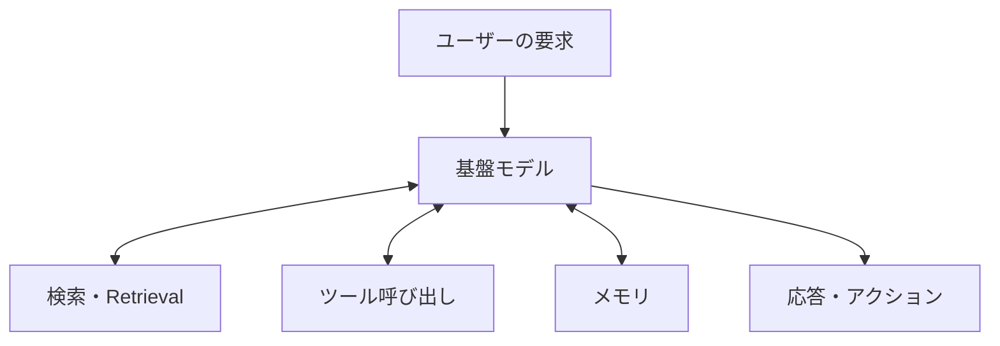

### 1-2. ビジネス用語としての「エージェント」との違い

Willison氏は同じ投稿で、「人間の代わりを務めるシステム」というビジネス寄りの定義には注意が必要だとも指摘しています。人間には「説明責任（accountability）」という、AIエージェントには持たせられない要素があるためです。OpenAIは自社のガイドで、エージェントを「あなたに代わって独立してタスクをこなすシステム」と説明していますが、これは主に自律性の度合いに着目した定義であり、Willison氏の「ツールをループで実行する」という技術的な定義と補完関係にあります。両方の視点を知っておくと、社内外での認識のズレを防ぎやすくなります。

**出典**: Simon Willison「I think "agent" may finally have a widely enough agreed upon definition to be useful jargon now」／Anthropic「Building Effective Agents」／OpenAI「A Practical Guide to Building Agents」（詳細は巻末参考文献 5・2・3）

---

<a id="step2"></a>

## ステップ2: エージェントとワークフローの違い

### 2-1. Anthropicによるアーキテクチャ上の区別

Anthropicはエンジニアリングブログ「Building Effective Agents」で、AI活用システムを大きく2つに分けています。

- **ワークフロー**: LLMとツールが、あらかじめ決められたコードの経路に沿ってオーケストレーションされるシステム
- **エージェント**: LLM自身が自分の処理の進め方やツールの使い方を動的に決定し、制御を握るシステム

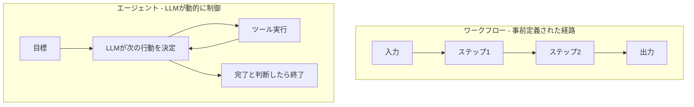

重要なのは、「エージェントの方が優れている」わけではないという点です。Anthropicは、タスクが予測可能で手順が決まっているならワークフローの方が信頼性・コストの面で有利であり、複雑さは必要な場合にのみ追加すべきだと強調しています。

### 2-2. 5つのワークフローパターンと選び方

Anthropicのブログでは、代表的な5つのワークフローパターンが紹介されています。

| パターン | 概要 |
|---|---|
| プロンプトチェイニング | タスクを順番に処理する複数ステップに分解し、各ステップの出力を次の入力にする |
| ルーティング | 入力の種類に応じて、異なる専用プロンプト・モデルに振り分ける |
| 並列化 | 独立したサブタスクを同時に実行し、結果を統合する |
| オーケストレーター・ワーカー | 中央のLLMがタスクを動的に分解し、複数のワーカーLLMに割り振る |
| 評価・最適化ループ | 生成結果を別のLLMが評価し、基準を満たすまで反復改善する |

どのパターンを選ぶべきかを整理すると、以下のような判断の流れになります。

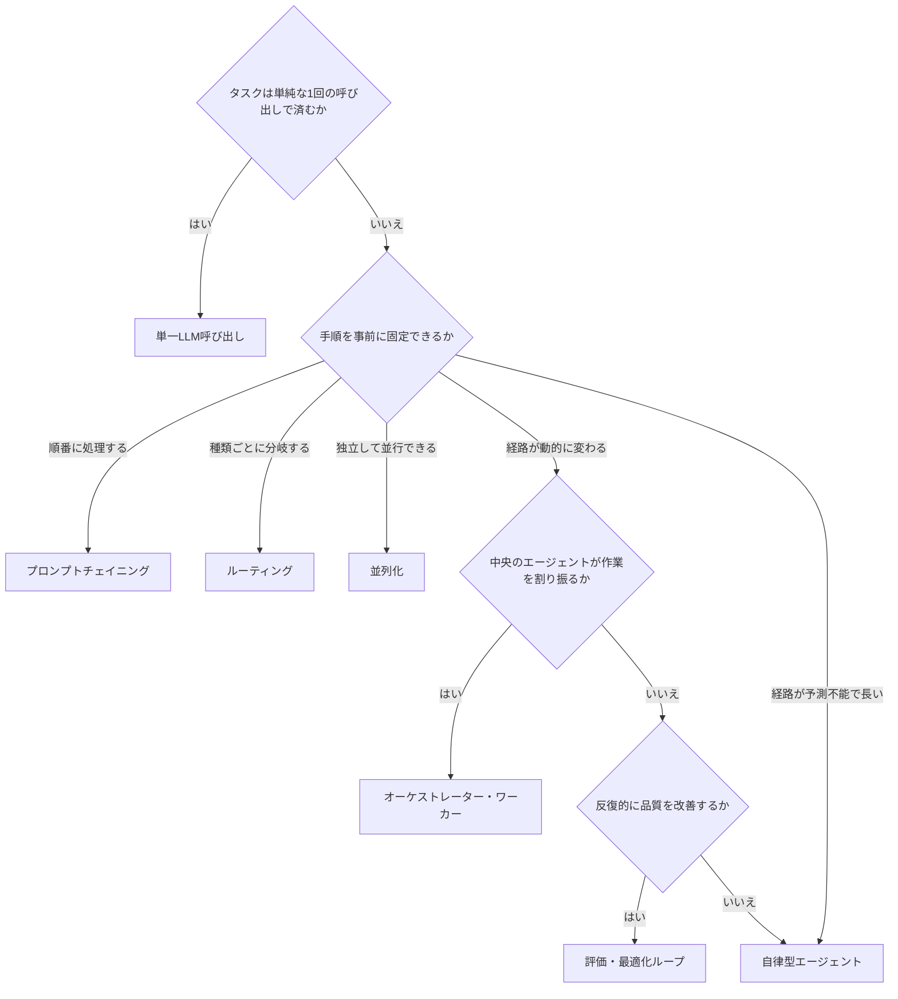

OpenAIの「A Practical Guide to Building Agents」も同じ方向性で、システムを分割・複雑化する目安として「条件分岐が多くプロンプトが肥大化してきた」「似たようなツールが多すぎて選択を誤る」といったシグナルを挙げています。まずは最も単純な構成から始め、これらのシグナルが出てから段階的に複雑にしていくのが、両社に共通する推奨アプローチです。

**出典**: Anthropic「Building Effective Agents」／OpenAI「A Practical Guide to Building Agents」（巻末参考文献 2・3）

---

<a id="step3"></a>

## ステップ3: エージェントシステムの基本コンポーネント

書籍『Building Applications with AI Agents』の第2章では、エージェントシステムを構成する4つの中核要素が整理されています。

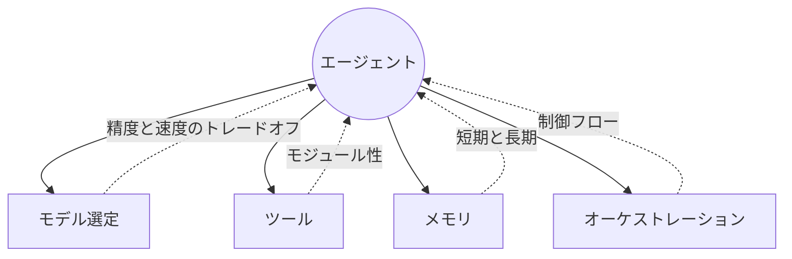

| 要素 | 役割 | 設計上の主な論点 |
|---|---|---|
| モデル選定 | タスクの性質に応じてどの基盤モデルを使うか決める | 精度、レイテンシ、コストのバランス |
| ツール | エージェントが外部の機能・データにアクセスする手段 | ツールの粒度、再利用性、文書化のしやすさ |
| メモリ | 過去のやり取りや知識を保持・検索する仕組み | 短期記憶（コンテキストウィンドウ）と長期記憶の使い分け |
| オーケストレーション | 複数のステップ・ツール・エージェントをどう連携させるか | 単一エージェントか複数エージェントか |

さらに設計時には、性能（速度と精度のトレードオフ）、スケーラビリティ、信頼性（一貫した挙動の担保）、コストという4つの軸でトレードオフを検討する必要があるとされています。これらは以降のステップで一つずつ掘り下げていきます。

**出典**: Michael Albada『Building Applications with AI Agents』第2章「Designing Agent Systems」（巻末参考文献 1）

---

<a id="step4"></a>

## ステップ4: エージェントの種類（オーケストレーションパターン）

エージェントの「頭脳」部分、つまりどう考えてどう行動するかにもいくつかの代表的なパターンがあります。

| タイプ | 概要 | 適した用途 |
|---|---|---|
| Reflex Agent | ルールや直接的なマッピングに従って即座に反応する。複雑な推論を行わない | 単純な分類・振り分けタスク |
| ReAct Agent | 「思考」と「行動」を交互に繰り返すループ構造を持つ | 動的なツール利用を伴う汎用タスク |
| Planner-Executor Agent | 計画を立てる役割と実行する役割を分離する | 長期にわたる複雑なタスクの構造化 |
| Query-Decomposition Agent | 複雑な問いを複数のサブクエスチョンに分解し、個別に解決してから統合する | 複合的な調査・分析タスク |
| Reflection Agent | 自分自身の出力を振り返り、改善を重ねる | 品質が重視されるコンテンツ生成 |
| Deep Research Agent | 大量の情報源を長時間かけて収集・統合する | 調査レポートの作成 |

このうち最も基本的で広く使われているのがReActパターンです。「Reasoning（推論）」と「Acting（行動）」を組み合わせた名前の通り、次のようなループで動作します。

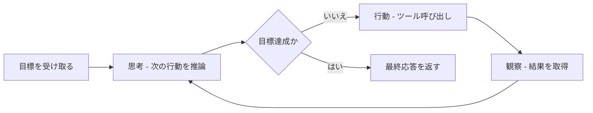

### 信頼性を高めるための12の原則

HumanLayer社のDex Horthy氏は、100人以上の開発者への聞き取りをもとに「12-Factor Agents」というGitHubリポジトリをまとめ、Heroku社の有名な「12-factor app」にならって、信頼性の高いLLMアプリケーションを作るための工学的な原則を提示しました。特に本ステップに関連が深いのは次の2つです。

- **制御フローを自分で持つ（Own your control flow）**: フレームワークに丸投げせず、分岐やループのロジックを自分のコードで管理する
- **小さく焦点を絞ったエージェントにする（Small, Focused Agents）**: 1つのエージェントに詰め込みすぎず、責務を分割する

このリポジトリはHacker Newsで大きな話題となり、フレームワーク批判ではなく「フレームワークに取り入れてほしい設計原則集」として位置づけられています。

**出典**: Michael Albada『Building Applications with AI Agents』第5章「Orchestration」／Dex Horthy・HumanLayer「12-Factor Agents」（巻末参考文献 1・4）

---

<a id="step5"></a>

## ステップ5: ツール利用とModel Context Protocol（MCP）

### 5-1. ツールの種類

エージェントが使うツールは、大きく分けるとローカルツール、API経由のツール、プラグイン形式のツール、そして状態を保持するステートフルなツールに分類できます。OpenAIのガイドでは、ツールをデータ取得用・アクション実行用・オーケストレーション用の3種類に整理しており、いずれの分類でも「ツールは文書化され、テストされ、再利用可能であるべき」という原則は共通しています。

### 5-2. Model Context Protocol（MCP）とは

以前は、AIモデルと外部ツール・データソースを接続するたびに、その組み合わせ専用の連携コードを書く必要がありました。これは「M個のモデル × N個のツール」の分だけ統合が必要になる、いわゆるM×N問題と呼ばれる状態です。Anthropicは2024年11月、この問題を解決するオープン標準としてModel Context Protocol（MCP）を発表しました。MCPは「AIアプリケーション向けのUSB-Cポートのようなもの」と例えられており、モデル側の実装を1つに標準化するだけで、あらゆるツール・データソースに接続できるようになります。

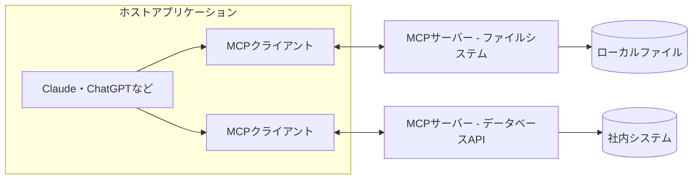

MCPは2026年までにOpenAIやGoogle DeepMind、Microsoftを含む業界標準として広く採用されました。ダウンロード規模は2025年12月9日時点で月間およそ9,700万回（出典18）でしたが、2026年7月28日版の仕様公開時点では Tier 1 SDK（TypeScript・Python・Go・C#）合計で月間5億回近くに達しています（出典17）。2025年12月には、Anthropicの一存で管理するのではなく、Linux Foundation傘下の「Agentic AI Foundation」に寄贈され、ベンダー中立なコミュニティ運営の標準となっています。

#### 最小構成のMCPサーバーとエージェントループ（実行可能な例）

上図の「MCPサーバー ― データベースAPI」に相当する最小のサーバーと、それを呼び出すエージェントループを示します。ツール呼び出し・終了条件・エラー処理という、エージェント実装の3要素がすべて含まれています。

```python
# inventory_server.py ― MCPサーバー側
# 依存: pip install "mcp[cli]>=2,<3" "pydantic>=2"
# 起動: python inventory_server.py（stdio でクライアントと接続する）
from mcp.server import MCPServer
from pydantic import BaseModel, Field

mcp = MCPServer("inventory")

# 社内システムを模した在庫データ（実運用では DB クエリに置き換える）
_STOCK: dict[str, int] = {"SKU-001": 12, "SKU-002": 0}


class StockResult(BaseModel):
    """ツールの戻り値スキーマ。型を固定しておくとクライアント側のパースが安定する。"""

    sku: str = Field(description="商品コード")
    quantity: int = Field(ge=0, description="在庫数")


@mcp.tool()
def get_stock(sku: str) -> StockResult:
    """指定した商品コードの在庫数を返す。

    未知の SKU は例外を送出する。MCP は例外を「ツール実行エラー」として
    クライアントへ返すため、エージェントはリトライや代替行動を判断できる。
    """
    if sku not in _STOCK:
        raise ValueError(f"未知の商品コードです: {sku}")
    return StockResult(sku=sku, quantity=_STOCK[sku])


if __name__ == "__main__":
    mcp.run(transport="stdio")
```

```python
# agent_loop.py ― エージェント（MCPクライアント）側
# 依存: pip install "mcp[cli]>=2,<3"
# 実行: python agent_loop.py
import asyncio
import sys
from pathlib import Path

from mcp import ClientSession, StdioServerParameters
from mcp.client.stdio import stdio_client
from mcp.shared.exceptions import MCPError
from mcp.types import CallToolResult

# 終了条件その1: ツール呼び出しの上限。無限ループとコスト暴走を防ぐ最後の砦。
MAX_STEPS = 5

# 終了条件その3: 1回のツール呼び出しの上限時間（秒）。応答が返らないサーバーで
# ループ全体が無期限にぶら下がるのを防ぐ。call_tool は float 秒を受け取る。
TOOL_TIMEOUT = 10.0

# サーバースクリプトはこのファイルからの相対位置で解決する。
# カレントディレクトリに依存すると、別の場所から起動したときに FileNotFoundError になる。
SERVER_SCRIPT = Path(__file__).resolve().parent / "inventory_server.py"


def summarize(result: CallToolResult) -> str:
    """ツール実行結果を安全に文字列化する。

    成功時はツール戻り値スキーマに沿った structured_content を優先し、
    無い場合のみ TextContent のテキストへフォールバックする。
    content が空配列でも、先頭要素がテキスト以外（画像など）でも
    IndexError / AttributeError を起こさない。
    """
    if not result.is_error and result.structured_content is not None:
        return str(result.structured_content)
    for block in result.content:
        text = getattr(block, "text", None)
        if text is not None:
            return text
    return "（テキストとして表示できる内容がありません）"


async def main() -> None:
    # command は "python" ではなく実行中のインタプリタを指定する。PATH 上の "python" は
    # 仮想環境の外を指したり存在しなかったりし、依存パッケージの解決先がずれる。
    params = StdioServerParameters(command=sys.executable, args=[str(SERVER_SCRIPT)])
    async with stdio_client(params) as (read, write):
        # ClientSession 自体にも読み取り上限を設ける。ここを省くと initialize() や
        # list_tools() が応答の無いサーバーで無期限に待ち続け、call_tool の
        # タイムアウトに到達する前にハングする。
        async with ClientSession(read, write, read_timeout_seconds=TOOL_TIMEOUT) as session:
            await session.initialize()

            # サーバーが公開するツール一覧を取得する（LLM へ渡すツール定義の元になる）
            tools = await session.list_tools()
            print("利用可能なツール:", [t.name for t in tools.tools])

            # 実際には次に呼ぶツールを LLM に決めさせる。ここでは決定論的に検証するため固定。
            plan = [{"sku": "SKU-999"}, {"sku": "SKU-001"}]

            for step, args in enumerate(plan, start=1):
                if step > MAX_STEPS:
                    print("上限に達したため打ち切ります")
                    break

                try:
                    result = await session.call_tool(
                        "get_stock",
                        args,
                        # 期限切れ時はサーバーへキャンセル通知が送られ MCPError になる
                        read_timeout_seconds=TOOL_TIMEOUT,
                    )
                except MCPError as exc:
                    # タイムアウトを含む呼び出し失敗も「失敗したツール結果」として観測に残す。
                    # ここで例外を伝播させるとループごと抜けてしまい、MAX_STEPS による
                    # 打ち切り判定も、残りの計画の実行も評価されなくなる。
                    print(f"step{step}: ツール呼び出し失敗 -> {exc}")
                    continue

                # エラー処理: is_error のときは内容をエージェントの観測として次ターンへ渡す。
                # 握りつぶさず、かつ例外で全体を止めないのが実運用でのポイント。
                if result.is_error:
                    print(f"step{step}: ツールエラー -> {summarize(result)}")
                    continue

                print(f"step{step}: 結果 -> {summarize(result)}")

                # 終了条件その2: 目的を満たしたら即座に抜ける
                if args["sku"] == "SKU-001":
                    print("必要な情報が得られたため、ループを終了して次の推論ステップへ進みます")
                    break


if __name__ == "__main__":
    asyncio.run(main())
```

このループが示すとおり、エージェントの制御構造は「ツール一覧の取得 → 呼び出し → 結果の観測 → 終了判定」の繰り返しです。`MAX_STEPS` のような上限と、`is_error` を観測として扱うエラー処理を最初から組み込んでおくことが、本番運用でのコスト暴走・無限ループの防止につながります。

### 5-3. ツールを自動生成するエージェント

書籍では、基盤モデル自身が新しいツールをその場で作り出す「Foundation Models as Tool Makers」というテーマも扱われています。必要なコードをリアルタイムに生成し、それをツールとして即座に利用するというアプローチで、あらかじめ用意していないタスクへの適応力を高める手法として注目されています。

**出典**: Michael Albada『Building Applications with AI Agents』第4章「Tool Use」／Anthropic「Introducing the Model Context Protocol」／WorkOS「Everything your team needs to know about MCP in 2026」／Model Context Protocol公式ドキュメント（巻末参考文献 1・7・9・8）

---

<a id="step6"></a>

## ステップ6: 知識とメモリ管理

### 6-1. 短期記憶と長期記憶

エージェントのメモリは、人間の記憶と同じように短期と長期に分けて考えると理解しやすくなります。

| 種類 | 実体 | 特徴 |
|---|---|---|
| 短期記憶 | コンテキストウィンドウ | 直近の会話・作業内容を保持するが、上限を超えると古い情報が失われる |
| 長期記憶（検索型） | ベクトルストア | 意味的な類似度で過去の情報を検索できる |
| 長期記憶（構造型） | ナレッジグラフ | エンティティ同士の関係性を明示的に保持できる |
| 長期記憶（要約型） | ノートテイキング | エージェント自身が重要事項を要約してメモに残す |

### 6-2. RAG（検索拡張生成）の基本フロー

長期記憶を実現する代表的な仕組みがRAG（Retrieval-Augmented Generation）です。ユーザーの質問に関連する情報をベクトルストアなどから検索し、それをプロンプトに追加してからLLMに回答させます。

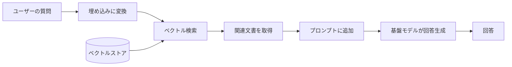

### 6-3. GraphRAGと動的なナレッジグラフ

単純なベクトル検索では、エンティティ同士の複雑な関係性をうまく扱えない場合があります。そこで登場するのがGraphRAGで、ナレッジグラフを構築・活用することで、より構造化された知識に基づく回答を可能にします。ただし、書籍でも指摘されている通り、動的に更新されるナレッジグラフには「情報の陳腐化」や「グラフの品質管理コスト」といったリスクも伴うため、導入前にその効果とコストを見極める必要があります。

**出典**: Michael Albada『Building Applications with AI Agents』第6章「Knowledge and Memory」（巻末参考文献 1）

---

<a id="step7"></a>

## ステップ7: シングルエージェントからマルチエージェントへ

### 7-1. いつエージェントを増やすべきか

エージェントを増やすかどうかは、最初から決めるものではなく、単一エージェントで詰まったときに検討するのが基本です。OpenAIのガイドは、次のようなシグナルが出たときに分割を検討すべきだとしています。

- プロンプト内の条件分岐（if-thenの連鎖）が多すぎてテンプレートの保守が難しくなってきた
- 似たような機能を持つツールが多く、エージェントが正しいツールを選べなくなってきた（15個程度の明確に異なるツールを問題なく扱えるチームもあれば、10個未満でも似通ったツールで混乱するチームもある）

### 7-2. マルチエージェントの調整方式

複数のエージェントをどう協調させるかにも複数の方式があります。

| 方式 | 概要 |
|---|---|
| 民主的協調 | エージェント同士が対等な立場で議論・合意形成する |
| マネージャー協調 | 管理役のエージェントがタスクを割り振り、結果を集約する |
| 階層的協調 | 複数階層に分かれた指揮系統でタスクを分担する |
| アクター・クリティック | 実行役（アクター）と評価役（クリティック）を分けて改善を繰り返す |

実務で最も広く使われているのがマネージャー協調の一種である「オーケストレーター・ワーカー」パターンです。

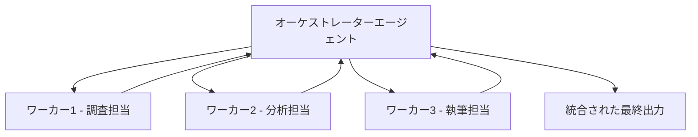

### 7-3. エージェント間のコミュニケーション手段

書籍第8章では、エージェント同士の通信手段として、ローカルなプロセス内通信から、メッセージブローカーやイベントバス、Ray・Orleans・Akkaといったアクターフレームワークまで、幅広い選択肢が紹介されています。どの方式を選ぶかは、エージェントを同一プロセス内で動かすか、分散環境で動かすかによって変わってきます。

**出典**: Michael Albada『Building Applications with AI Agents』第2章・第8章／OpenAI「A Practical Guide to Building Agents」（巻末参考文献 1・3）

---

<a id="step8"></a>

## ステップ8: エージェント間通信 ― MCPとA2A

マルチエージェント構成が一般的になるにつれ、「エージェントとツールをどうつなぐか」だけでなく「異なるベンダー・フレームワークで作られたエージェント同士をどうつなぐか」という課題が浮上しました。これに応えるのがGoogleが2025年4月に発表したAgent2Agent（A2A）プロトコルです。A2Aは同年6月にLinux Foundationへ寄贈され、2026年8月27日にはMCPと同じくAgentic AI Foundation（AAIF）のGrowth Stageプロジェクトとして受け入れられています。

| 項目 | MCP | A2A |
|---|---|---|
| 目的 | エージェントとツール・データソースの接続 | エージェント同士の発見・委譲・通信 |
| 策定元 | Anthropic（2024年11月） | Google（2025年4月） |
| 現在の管理団体 | Agentic AI Foundation（Linux Foundation） | Agentic AI Foundation（Linux Foundation） |
| 主な仕組み | ホスト・クライアント・サーバー構成、JSON-RPC 2.0 | Agent Cardによる能力の公開、タスクのライフサイクル管理、HTTP＋SSE＋JSON-RPC 2.0 |
| たとえ | AIアプリ向けのUSB-Cポート | 組織間の業務委託のような役割分担の仕組み |

両者は競合するものではなく、補完関係にあります。1つのエージェントがA2Aで別の専門エージェントにタスクを委譲し、そのエージェントがMCPで実際のツールやデータにアクセスする、という組み合わせが一般的です。

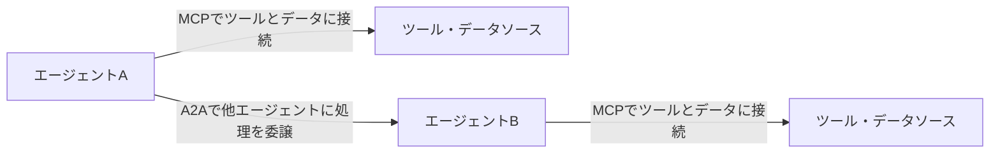

**出典**: Google Developers Blog「Google Cloud donates A2A to Linux Foundation」／A2A Protocol 公式ブログ「A New Chapter for A2A: Joining the Agentic AI Foundation」（巻末参考文献 10・11）

---

<a id="step9"></a>

## ステップ9: 主要フレームワークの選び方

書籍の第1章では、LangGraph、AutoGen、CrewAI、OpenAI Agents SDKという4つの代表的なフレームワークが紹介されています。2026年9月時点では、これにAnthropicのClaude Agent SDKや、GoogleのAgent Development Kit（ADK）を加えた選択肢が実務でよく比較されています。

| フレームワーク | 開発元 | オーケストレーションモデル | 学習コスト | 本番運用実績 | 得意なこと |
|---|---|---|---|---|---|
| LangGraph | LangChain | 有向グラフ＋条件分岐エッジ | 中（グラフの概念を理解する必要） | 高い（チェックポイント、タイムトラベルデバッグ、観測性が充実） | 複雑な状態管理とヒューマン・イン・ザ・ループが必要な本番システム |
| CrewAI | CrewAI | 役割ベースのチーム編成 | 低い | 中（成長中だが機能は発展途上） | 少ないコード量でのマルチエージェントの試作 |
| AutoGen／AG2 | Microsoft／コミュニティ | 対話ベースの多者間会話 | 中 | 中（Microsoftはより広範なMicrosoft Agent Frameworkに軸足を移行中） | エージェント同士が議論しながらコードを書く・実行するタスク |
| OpenAI Agents SDK | OpenAI | 明示的なハンドオフを伴う薄い抽象化 | 低い | 高い（組み込みのトレーシングとガードレール） | シンプルな構成で素早く動かしたい単一〜少数エージェント |
| Claude Agent SDK | Anthropic | ツール利用パターン、MCPネイティブ対応 | 中 | 高い（安全性重視、拡張思考、ネイティブストリーミング） | コーディングエージェントなど高い信頼性が求められる用途 |
| Google ADK | Google | Vertex AIエコシステムとの統合 | 中 | 発展途上（最も新しいフレームワーク） | Google Cloud環境内でのエージェント構築 |

### 選び方の目安

現場のエンジニアの声を集めた比較記事では、次のような使い分けがよく紹介されています。

- まずCrewAIのような軽量なフレームワークでロジックの妥当性を素早く検証する
- 本番運用に進む段階で、チェックポイントやエラーリカバリーが充実したLangGraphに移行する
- OpenAI Agents SDKやClaude Agent SDKのようなベンダーSDKは、特定モデルへの依存を許容できるならシンプルさのメリットが大きい

また、AutoGenはMicrosoftの開発方針転換（より広範なMicrosoft Agent Frameworkへの統合）により、新規機能開発のペースが落ちているという指摘もあるため、新規プロジェクトで採用する場合は最新の開発状況を確認することをおすすめします。

**出典**: Michael Albada『Building Applications with AI Agents』第1章／Firecrawl「The best open source frameworks for building AI agents in 2026」／Techsy「LangGraph vs CrewAI vs OpenAI Agents」（巻末参考文献 1・15・16）

---

<a id="step10"></a>

## ステップ10: 検証と評価

### 10-1. 評価は開発の柱

書籍第9章は、「測定こそがエージェント開発の要（キーストーン）である」という考え方から始まります。評価を開発の最後に付け足すのではなく、開発ライフサイクルの最初から組み込むことが推奨されています。

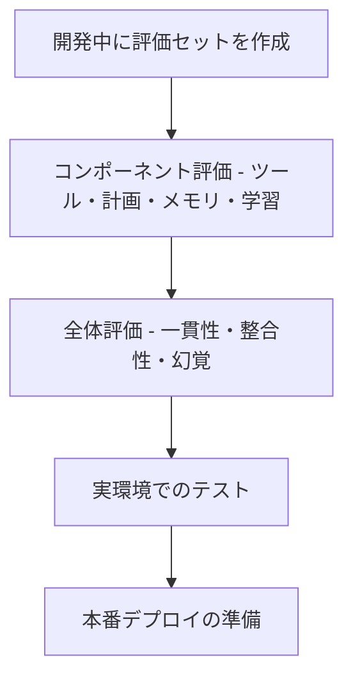

### 10-2. コンポーネント評価と全体評価

評価は大きく2段階に分けられます。

- **コンポーネント評価**: ツール選択が正しいか、計画立案が妥当か、メモリの検索精度は十分か、学習（Reflectionやファインチューニング）が効果を上げているかを個別に検証する
- **全体評価（ホリスティック評価）**: エンドツーエンドのシナリオでの性能、一貫性、応答間の整合性、幻覚（ハルシネーション）の発生率、想定外の入力への対応力を検証する

### 10-3. ガードレールという考え方

OpenAIのガイドでは、評価と並んでガードレール（安全装置）の重要性が強調されています。関連性チェック、安全性分類、機微情報のフィルタリング、モデレーション、ルールベースの保護、出力バリデーションなど、複数のレイヤーを組み合わせることで、単一のチェックに依存しない防御を構築する考え方です。これはステップ12で扱うセキュリティ対策とも密接に関係します。

**出典**: Michael Albada『Building Applications with AI Agents』第9章「Validation and Measurement」／OpenAI「A Practical Guide to Building Agents」（巻末参考文献 1・3）

---

<a id="step11"></a>

## ステップ11: 本番運用でのモニタリングと改善ループ

### 11-1. モニタリングスタックの選択肢

書籍第10章では、代表的な観測性（オブザーバビリティ）スタックが紹介されています。

| ツール | 特徴 |
|---|---|
| Grafana＋OpenTelemetry＋Loki＋Tempo | OSSの汎用可観測性スタック。メトリクス・ログ・トレースを統合的に扱える |
| ELKスタック（Elasticsearch、Logstash／Fluentd、Kibana） | ログの収集・検索に強みがあり、既存の運用実績があるチーム向け |
| Arize Phoenix | LLM／エージェントに特化したOSSの観測性ツール |
| SigNoz | OpenTelemetryネイティブの統合可観測性プラットフォーム |
| Langfuse | LLMアプリケーションに特化したトレース・評価・プロンプト管理プラットフォーム |

どのスタックを選ぶかは、チームの既存の運用基盤や、LLM特有のトレース（思考過程・ツール呼び出しの履歴）をどれだけ細かく可視化したいかによって変わります。

### 11-2. モニタリングから改善へのループ

書籍第10章と第11章の内容をつなげると、本番運用は次のような循環的なプロセスとして捉えられます。シャドーモード（本番トラフィックを使いつつ実際のアクションは実行しない検証）やカナリアデプロイ、A/Bテスト、バンディットアルゴリズムを用いた実験などが、この改善ループを支える具体的な手法として紹介されています。

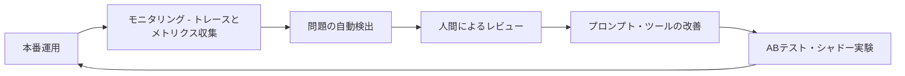

ユーザーからのフィードバックも、明示的な評価スコアと同じくらい重要な観測性シグナルとして扱うべきだとされています。また、入力データの分布が時間とともに変化する「ディストリビューションシフト」を検知する仕組みも、長期運用では欠かせません。

**出典**: Michael Albada『Building Applications with AI Agents』第10章「Monitoring in Production」・第11章「Improvement Loops」（巻末参考文献 1）

---

<a id="step12"></a>

## ステップ12: エージェントシステムを守る ― セキュリティ

### 12-1. Lethal Trifecta（危険な三要素の組み合わせ）

セキュリティ研究者としても知られるSimon Willison氏は2025年6月、エージェントに関わる重大なリスクパターンを「Lethal Trifecta（致死的な三要素）」と名付けました。次の3つの能力が1つのエージェントに同時に揃うと、攻撃者に悪用される危険性が急激に高まるという考え方です。

- **プライベートデータへのアクセス**: メール、社内文書、顧客情報などを読み取れる
- **信頼できないコンテンツの処理**: 外部のWebページやメール本文など、攻撃者が操作できるかもしれない情報を読み込む
- **外部への通信手段**: 読み取った情報を外部に送信できる（メール送信、API呼び出しなど）

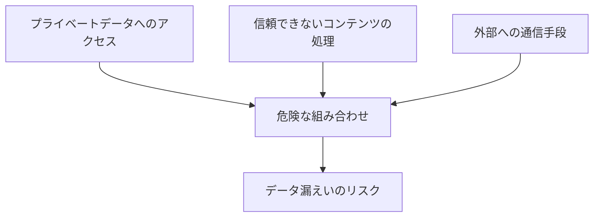

この3つが揃うと、たとえば「Webページに埋め込まれた悪意ある指示文をエージェントが読み込み、それに従って機密情報を外部に送信してしまう」といった間接的なプロンプトインジェクション攻撃が成立してしまいます。Willison氏は、この組み合わせそのものを避けることが唯一の確実な防御策だと述べています。

### 12-2. MAESTROフレームワークによる脅威モデリング

書籍第12章でも触れられているように、エージェント特有のリスクには、従来のSTRIDEのようなソフトウェアセキュリティの脅威モデリング手法だけでは対応しきれない部分があります。そこでCloud Security Alliance（CSA）は2025年2月、エージェント型AI専用の脅威モデリングフレームワーク「MAESTRO（Multi-Agent Environment, Security, Threat, Risk, and Outcome）」を発表しました。MAESTROは、システムを7つのレイヤーに分解して段階的に脅威を洗い出す手法で、代表的なレイヤーの切り口は次の通りです。

| レイヤー（概要） | 主な観点 |
|---|---|
| 基盤モデル | モデル自体の脆弱性、抽出・操作への耐性 |
| データ運用 | 学習・検索に使うデータの完全性と出所 |
| エージェントフレームワーク | 推論ループとツール呼び出しの実装の安全性 |
| デプロイ・インフラ | 実行環境の権限管理と分離 |
| 評価・観測性 | 異常な挙動をどう検知するか |
| セキュリティ・コンプライアンス | 認可、監査ログ、規制対応 |
| エージェントエコシステム | 複数エージェント間の信頼関係、なりすまし対策 |

### 12-3. 実践的な防御策

書籍とここまでの出典を踏まえると、実務では次のような対策の組み合わせが有効です。

- **最小権限の原則**: エージェントに与えるツールの権限を必要最小限にとどめる
- **人間による承認**: リスクの高い操作（送金、外部送信、削除など）は人間の承認を経てから実行する（12-Factor Agentsの「ツール呼び出しで人間に連絡する」という原則とも一致）
- **サンドボックス化**: 実行環境を隔離し、被害範囲を限定する
- **継続的なレッドチーミング**: 実際に攻撃を試みることで、想定していなかった穴を発見する
- **監視とロギング**: 監査に必要な最小限のメタデータ（タイムスタンプ、実行主体、ツール名、成否、レイテンシ、リクエスト ID）のみを記録し、異常を検知できるようにする。プロンプト本文・ツール引数・ツール実行結果・PII・アクセストークン等の秘密情報はマスキングまたは除外する。ペイロードを保存する場合は、対象を障害調査に必要なエラー時のツール引数だけに限定し、値はハッシュ化または上位数十文字への切り詰めを行う。ログの閲覧はセキュリティ担当ロールに限定し（アクセス制御）、保存期間を定めて（例: 監査ログ 1 年、デバッグログ 30 日）期限到達後は自動削除する

**出典**: Michael Albada『Building Applications with AI Agents』第12章「Protecting Agentic Systems」／Simon Willison「The lethal trifecta for AI agents」／Cloud Security Alliance「Agentic AI Threat Modeling Framework: MAESTRO」（巻末参考文献 1・6・12）

---

<a id="step13"></a>

## ステップ13: 人間とエージェントの協働

### 13-1. 自律性のスライダー

書籍第3章・第13章では、エージェントにどこまで自律性を持たせるかを、オン・オフの二択ではなく「スライダー」として捉える考え方が紹介されています。

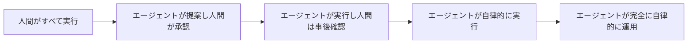

タスクのリスクの高さ、エージェントの実績、可逆性（やり直しが利くかどうか）に応じて、どのポジションから始めるかを決め、信頼が積み上がるにつれて右側（自律性が高い方向）に移していくというアプローチが実務的です。

### 13-2. 説明責任は人間に残る

Simon Willison氏は、人間には「説明責任（accountability）」という、AIエージェントに肩代わりさせられない要素があると指摘しています。エージェントが下した判断であっても、それを許可し、監督し、結果に責任を持つのは最終的に人間であるという前提は、エスカレーション設計（エージェントがどのタイミングで人間に判断を委ねるか）やガバナンス設計の基本になります。

### 13-3. エスカレーション設計のポイント

書籍では、信頼の構築を「ライフサイクル」として捉え、次のような観点を継続的に見直すことが推奨されています。

- エージェントがどのような場面で自信度の低さを表明し、人間に確認を求めるべきか
- 失敗したときに、どのようにユーザーへ丁寧に伝え、次の一手を提示するか（グレースフルデグラデーション）
- 組織内でのエージェントの担当範囲と、人間の担当範囲をどう線引きするか

**出典**: Michael Albada『Building Applications with AI Agents』第3章「User Experience Design for Agentic Systems」・第13章「Human-Agent Collaboration」／Simon Willison「I think "agent" may finally have a widely enough agreed upon definition」（巻末参考文献 1・5）

---

<a id="step14"></a>

## ステップ14: 学習ロードマップ・まとめ

### 14-1. 学習の進め方

これまでのステップを踏まえ、初学者が無理なくAIエージェント開発を習得していくための道筋は、おおよそ次のようになります。

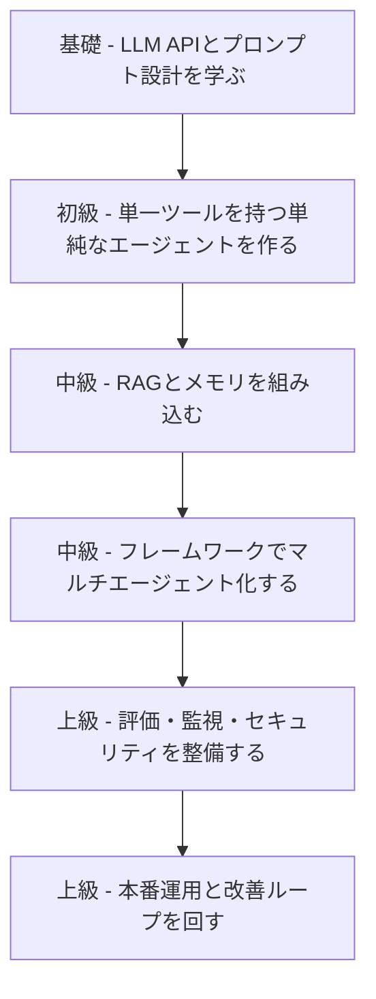

| フェーズ | 学ぶこと | このガイドの該当ステップ |
|---|---|---|
| 基礎 | LLM APIの呼び出し方、プロンプト設計の基本 | ステップ1〜2 |
| 初級 | ツール呼び出しを1つ持つ、ReActベースの単純なエージェント | ステップ3〜4 |
| 中級 | MCPによるツール連携、RAGによるメモリ拡張 | ステップ5〜6 |
| 中級 | フレームワークを使ったマルチエージェント構成 | ステップ7〜9 |
| 上級 | 評価セットの整備、観測性の導入 | ステップ10〜11 |
| 上級 | セキュリティ対策と、人間とのすり合わせを含めた本番運用 | ステップ12〜13 |

### 14-2. 「エージェンティック・エンジニアリング」という新しい職能

元OpenAI共同創業者のAndrej Karpathy氏は、2026年4月のSequoia Capital主催イベント「AI Ascent 2026」で、自身が2025年に提唱した「バイブコーディング（vibe coding、AIの出力を深く検証せずに受け入れる開発スタイル）」の先にある、より規律だったスタイルとして「エージェンティック・エンジニアリング（agentic engineering）」という概念を提示しました。Karpathy氏はこれを、仕様設計、差分レビュー、評価ループの構築、権限管理など、複数の自律的なエージェントを協調させながらプロフェッショナルな品質を維持する実践知だと説明しています。バイブコーディングが「誰でも試作できる」という参入障壁の低さ（床）を引き下げる一方、エージェンティック・エンジニアリングは「専門家が到達できる品質の天井」を引き上げるものだと位置づけられており、本ガイドで扱ってきた評価・監視・セキュリティ・人間との協働といったテーマは、まさにこの「天井」を支える実務スキルに当たります。

### 14-3. まとめ

AIエージェント開発は、単に「賢いモデルを呼び出す」だけでは完結しません。このガイドで見てきたように、

- ワークフローとエージェントを適切に使い分け、必要な分だけ複雑さを足すこと
- ツール・メモリ・オーケストレーションという基本コンポーネントを丁寧に設計すること
- MCPやA2Aのような標準プロトコルを活用し、相互運用性を確保すること
- 評価と監視を開発の初期段階から組み込み、改善のループを回し続けること
- Lethal TrifectaやMAESTROのような枠組みでセキュリティリスクを体系的に洗い出すこと
- 人間の説明責任を前提に、自律性のレベルを段階的に調整すること

といった一つひとつの積み重ねが、実運用に耐えるAIエージェントアプリケーションを作り上げていきます。まずは本ガイドのステップ1〜5で紹介した最小構成のエージェントを自分の手で動かしてみることから始めてみてください。

**出典**: Andrej Karpathy「Sequoia Ascent 2026 summary」／Sequoia Capital「Andrej Karpathy: From Vibe Coding to Agentic Engineering」（巻末参考文献 13・14）

---

<a id="glossary"></a>

## 用語集

| 用語 | 説明 |
|---|---|
| エージェント（Agent） | 目標を達成するためにツールをループの中で実行するLLMシステム |
| ワークフロー（Workflow） | LLMとツールが事前に定義された経路に沿って動くシステム |
| MCP（Model Context Protocol） | AIモデルと外部ツール・データソースを標準化された方法で接続するオープンプロトコル |
| A2A（Agent2Agent） | 異なるベンダー・フレームワークのエージェント同士が発見・通信・タスク委譲を行うためのオープンプロトコル |
| RAG（Retrieval-Augmented Generation） | 外部の知識を検索してプロンプトに追加し、それをもとにLLMが回答を生成する手法 |
| ReAct | 「思考（Reasoning）」と「行動（Acting）」を交互に繰り返すエージェントのループ構造 |
| オーケストレーター・ワーカー | 中央のエージェントがタスクを分解し、複数のワーカーエージェントに割り振るパターン |
| Lethal Trifecta | プライベートデータへのアクセス、信頼できないコンテンツの処理、外部通信手段の3つが揃う危険な状態 |
| MAESTRO | エージェント型AI専用の7層構造の脅威モデリングフレームワーク |
| ガードレール（Guardrail） | エージェントの入出力を検証し、安全性を確保するための仕組みの総称 |
| ヒューマン・イン・ザ・ループ | 人間がプロセスの中でレビューや承認などの役割を担う設計方針 |
| ベクトルストア | テキストなどを埋め込みベクトルに変換して保存し、意味的な類似検索を可能にするデータベース |
| ナレッジグラフ | エンティティ同士の関係性を明示的に表現したデータ構造 |

---

<a id="references"></a>

## 参考文献・ソース一覧

1. Michael Albada, *Building Applications with AI Agents*, O'Reilly Media, 2025年9月.
   https://www.oreilly.com/library/view/building-applications-with/9781098176495/
2. Anthropic, "Building Effective Agents".
   https://www.anthropic.com/engineering/building-effective-agents
3. OpenAI, "A Practical Guide to Building Agents" (PDF).
   https://cdn.openai.com/business-guides-and-resources/a-practical-guide-to-building-agents.pdf
4. Dex Horthy / HumanLayer, "12-Factor Agents".
   https://github.com/humanlayer/12-factor-agents
5. Simon Willison, "I think 'agent' may finally have a widely enough agreed upon definition to be useful jargon now", 2025年9月18日.
   https://simonwillison.net/2025/Sep/18/agents/
6. Simon Willison, "The lethal trifecta for AI agents: private data, untrusted content, and external communication", 2025年6月16日.
   https://simonwillison.net/2025/Jun/16/the-lethal-trifecta/
7. Anthropic, "Introducing the Model Context Protocol", 2024年11月.
   https://www.anthropic.com/news/model-context-protocol
8. Model Context Protocol 公式ドキュメント.
   https://modelcontextprotocol.io/docs/2026-07-28/getting-started/intro
9. WorkOS, "Everything your team needs to know about MCP in 2026".
   https://workos.com/blog/everything-your-team-needs-to-know-about-mcp-in-2026
10. Google Developers Blog, "Google Cloud donates A2A to Linux Foundation", 2025年6月23日.
    https://developers.googleblog.com/en/google-cloud-donates-a2a-to-linux-foundation/
11. A2A Protocol Blog, "A New Chapter for A2A: Joining the Agentic AI Foundation", 2026年8月27日.
    https://a2a-protocol.org/latest/blog/2026/08/27/a-new-chapter-for-a2a-joining-the-agentic-ai-foundation/
12. Cloud Security Alliance（Ken Huang氏執筆）, "Agentic AI Threat Modeling Framework: MAESTRO", 2025年2月6日.
    https://cloudsecurityalliance.org/blog/2025/02/06/agentic-ai-threat-modeling-framework-maestro
13. Andrej Karpathy, "Sequoia Ascent 2026 summary".
    https://karpathy.bearblog.dev/sequoia-ascent-2026/
14. Sequoia Capital, "Andrej Karpathy: From Vibe Coding to Agentic Engineering" (YouTube), 2026年4月.
    https://www.youtube.com/watch?v=96jN2OCOfLs
15. Firecrawl, "The best open source frameworks for building AI agents in 2026".
    https://www.firecrawl.dev/blog/best-open-source-agent-frameworks
16. Techsy, "LangGraph vs CrewAI vs OpenAI Agents (Ship Test 2026)".
    https://techsy.io/en/blog/langgraph-vs-crewai-vs-openai-agents-sdk
17. Model Context Protocol Blog, "The 2026-07-28 Specification", 2026年7月28日.
    https://blog.modelcontextprotocol.io/posts/2026-07-28/
18. Model Context Protocol Blog, "MCP joins the Agentic AI Foundation", 2025年12月9日（月間約9,700万ダウンロードの出典）.
    https://blog.modelcontextprotocol.io/posts/2025-12-09-mcp-joins-agentic-ai-foundation/
