# LLMパワードアプリケーション構築ガイド

**初学者のためのステップバイステップ実践入門(2026年9月版)**

> 本ガイドは、Packt Publishing 刊の書籍 *Building LLM Powered Applications*(Valentina Alto 著, 2024年5月刊。O'Reilly Learning でも配信されています、出典0)を出発点としつつ、刊行から約2年の間に大きく様変わりしたLLMアプリケーション開発の実践知を、2026年9月9日時点の情報でアップデートした学習ガイドです。原著はLangChainを中心に「LLMの基礎 → プロンプトエンジニアリング → 会話アプリ → 構造化データ → マルチモーダル → ファインチューニング → 責任あるAI」という流れで構成されていますが、その後「エージェント」「Model Context Protocol(MCP)」「コンテキストエンジニアリング」「評価/オブザーバビリティ」といった新しい実践領域が業界標準になりました。本ガイドはこの最新の実践知を、初めてLLMアプリケーションを作るエンジニアにも理解できるよう、ステップバイステップで解説します。

---

## この記事の読み方

- プログラミングの基礎知識はあるが、LLMアプリケーション開発は初めてという方を対象にしています。
- 各ステップは独立して読めますが、上から順に読むと「基礎知識 → 設計 → 実装 → 運用」という開発の流れに沿って理解が深まります。
- 図はすべてMermaidのフローチャートで表現し、比較情報はMarkdownの表にまとめています。
- 本文中の丸括弧付き番号(例: 出典1)は、末尾の「参考文献・ソース一覧」セクションに対応しています。モデル名・価格・ベンチマーク順位などは2026年時点でも数週間単位で更新され続けているため、実際に採用する際は必ず一次情報を確認してください。

### まず動かしてみる: 最小のLLMアプリ

図を眺める前に、30行ほどで動く最小のLLMアプリを手元で動かしておくと、以降の説明が具体的に読めるようになります。「LLMを呼ぶ」「出力を型で受け取る」「テストする」という、この後のすべてのStepに共通する骨格です。

```python
# app/main.py
# 依存: pip install "fastapi[standard]" "pydantic>=2" "anthropic>=1.4,<2"
#       SDK のバージョンは固定する。メジャー更新で client の引数や戻り値の型が変わるため。
# 起動: uvicorn app.main:app --reload
#       ANTHROPIC_API_KEY はコマンドラインに書かず、シークレット管理やCIの環境変数から渡す。
#       コマンドに直書きするとシェル履歴やプロセス一覧に鍵が残る。
# 動作確認: curl -X POST localhost:8000/ask -H 'Content-Type: application/json' -d '{"question":"RAGとは？"}'
import os
from collections.abc import AsyncIterator
from contextlib import asynccontextmanager

from anthropic import (
    Anthropic,
    APIConnectionError,
    APIStatusError,
)
from fastapi import FastAPI, HTTPException
from pydantic import BaseModel, Field

SYSTEM_PROMPT = "あなたは日本語で簡潔に答える技術アシスタントです。3文以内で答えてください。"

# 時間をおけば回復しうるステータス。SDK が自動再試行する条件と同じ基準にそろえる
# （408 タイムアウト / 409 競合 / 429 レート制限 / 5xx。過負荷を表す 529 は 5xx 側で拾う）。
RETRYABLE_STATUS_CODES = frozenset({408, 409, 429})


class IncompleteResponseError(RuntimeError):
    """応答が最後まで生成されなかったことを表す。部分回答を成功として返さないために使う。"""

class AskRequest(BaseModel):
    """入力の型。空文字や長すぎる質問はここで自動的に422として弾かれる。"""

    question: str = Field(min_length=1, max_length=1000)

class AskResponse(BaseModel):
    answer: str

@asynccontextmanager
async def lifespan(app: FastAPI) -> AsyncIterator[None]:
    """クライアントはアプリ全体で1つだけ生成する。

    リクエストごとに生成すると HTTP コネクションプールが毎回捨てられ、
    TLSハンドシェイクのやり直しでレイテンシとファイルディスクリプタを浪費する。
    """
    # SDK 既定値（timeout=600秒 / max_retries=2）はバッチ処理向けで、
    # HTTP リクエスト/レスポンスのアプリケーションには長すぎる。用途に合わせて明示する。
    app.state.llm = Anthropic(
        api_key=os.environ["ANTHROPIC_API_KEY"],
        timeout=30.0,     # 秒。1リクエストの上限。Webハンドラのタイムアウトより短く設定する
        max_retries=2,    # 接続エラー・408・409・429・5xx を再試行。指数バックオフと
                          # Retry-After の待機が加わるため、総待ち時間は timeout×(max_retries+1) を超えうる
    )
    yield
    app.state.llm.close()  # 終了時に HTTP コネクションを解放する

app = FastAPI(lifespan=lifespan)

def call_llm(question: str) -> str:
    """LLM呼び出しを1関数に閉じ込める。テストではこの関数だけを差し替える。"""
    resp = app.state.llm.messages.create(
        model="claude-sonnet-5",
        max_tokens=300,
        # claude-sonnet-5 は thinking を省略すると adaptive thinking で動作する。
        # 短答用途では思考トークンが無駄になるため、明示的に無効化する。
        thinking={"type": "disabled"},
        system=SYSTEM_PROMPT,
        messages=[{"role": "user", "content": question}],
    )
    # stop_reason を先に検査する。max_tokens で打ち切られた応答も HTTP 200 で返り、
    # content には途中までの文章が入っているため、素通しすると「途中で切れた回答」を
    # 正常応答として利用者へ返してしまう。end_turn 以外は本文を返さない。
    if resp.stop_reason != "end_turn":
        raise IncompleteResponseError(
            f"応答が完了していません (stop_reason={resp.stop_reason})"
        )

    # 拡張思考を有効にしたモデルでは thinking ブロックが先頭に来ることがある。
    # content[0] を text と決め打ちせず、type で絞り込む。
    for block in resp.content:
        if block.type == "text":
            return block.text
    raise ValueError("応答に text ブロックが含まれていません")

@app.post("/ask", response_model=AskResponse)
def ask(req: AskRequest) -> AskResponse:
    try:
        answer = call_llm(req.question)
    except APIConnectionError as exc:
        # 接続失敗。サブクラスの APITimeoutError もここで捕捉される。
        raise HTTPException(status_code=503, detail="LLMの呼び出しに失敗しました") from exc
    except APIStatusError as exc:
        # 503に変換するのは「時間をおけば回復しうるプロバイダ側の障害」だけに限る。
        # 認証エラー(401)やモデル未検出(404)は設定・実装の不具合であり、503に丸めると
        # 無意味なリトライを誘発する。捕捉せず500として顕在化させる。
        if exc.status_code in RETRYABLE_STATUS_CODES or exc.status_code >= 500:
            raise HTTPException(
                status_code=503, detail="LLMの呼び出しに失敗しました"
            ) from exc
        raise
    except IncompleteResponseError as exc:
        # 部分回答を200で返さない。上流の応答が不完全なので502とする。
        raise HTTPException(
            status_code=502, detail="LLMの応答が完了しませんでした"
        ) from exc

    if not answer.strip():
        raise HTTPException(status_code=502, detail="LLMが空の応答を返しました")
    return AskResponse(answer=answer)
```

テストではLLMを呼びません。`monkeypatch`で`call_llm`を差し替えることで、APIキーもネットワークも不要な、毎回同じ結果になるテストになります。

```python
# tests/test_main.py
# 依存: pip install pytest "anthropic>=1.4,<2" "httpx2>=2"
#       anthropic 1.x は HTTP 層に httpx のフォークである httpx2 を使う。
#       SDK 例外へ渡す Request/Response も httpx2 の型でそろえる。
# 実行: pytest tests/test_main.py
from collections.abc import Iterator
from types import SimpleNamespace
from unittest.mock import MagicMock

import httpx2
import pytest
from anthropic import APIConnectionError, AuthenticationError
from fastapi.testclient import TestClient

from app import main

@pytest.fixture
def client(monkeypatch: pytest.MonkeyPatch) -> Iterator[TestClient]:
    """lifespanを実行しつつ、実SDKクライアントの生成だけを差し替える。

    TestClientを`with`で使わないとlifespanが起動せず、app.state.llm が未設定のまま
    本番との差異を見逃す。生成と後始末の両方をここで検証する。
    """
    llm = MagicMock()
    anthropic_factory = MagicMock(return_value=llm)
    monkeypatch.setenv("ANTHROPIC_API_KEY", "test-key")
    monkeypatch.setattr(main, "Anthropic", anthropic_factory)

    with TestClient(main.app) as test_client:
        anthropic_factory.assert_called_once()  # 起動時に1つだけ生成される
        yield test_client

    llm.close.assert_called_once()  # 終了時にHTTPコネクションが解放される

def test_質問に対して回答を返す(client: TestClient, monkeypatch: pytest.MonkeyPatch) -> None:
    # Arrange
    monkeypatch.setattr(main, "call_llm", lambda question: "RAGは検索拡張生成です。")

    # Act
    res = client.post("/ask", json={"question": "RAGとは？"})

    # Assert
    assert res.status_code == 200
    assert res.json() == {"answer": "RAGは検索拡張生成です。"}

def test_空の質問はバリデーションで拒否する(client: TestClient) -> None:
    # Arrange / Act
    res = client.post("/ask", json={"question": ""})

    # Assert: LLMに到達する前に弾かれる
    assert res.status_code == 422

def test_プロバイダ障害なら503を返す(client: TestClient, monkeypatch: pytest.MonkeyPatch) -> None:
    # Arrange: 503へ変換されるのは型付きSDK例外だけ
    def raise_error(question: str) -> str:
        raise APIConnectionError(
            request=httpx2.Request("POST", "https://api.anthropic.com/v1/messages")
        )

    monkeypatch.setattr(main, "call_llm", raise_error)

    # Act
    res = client.post("/ask", json={"question": "RAGとは？"})

    # Assert
    assert res.status_code == 503

def test_max_tokensで打ち切られた応答は200で返さない(client: TestClient) -> None:
    """部分回答を成功として返していないかを守る回帰テスト。"""
    # Arrange: HTTP 200 だが stop_reason が max_tokens の応答
    client.app.state.llm.messages.create.return_value = SimpleNamespace(
        stop_reason="max_tokens",
        content=[SimpleNamespace(type="text", text="RAGは検索拡")],
    )

    # Act
    res = client.post("/ask", json={"question": "RAGとは？"})

    # Assert: 途中までの本文が利用者へ漏れない
    assert res.status_code == 502
    assert "RAGは検索拡" not in res.text

def test_認証エラーは503へ丸めない(client: TestClient, monkeypatch: pytest.MonkeyPatch) -> None:
    # Arrange: 401 は設定の不具合。再試行しても回復しない
    def raise_error(question: str) -> str:
        raise AuthenticationError(
            "invalid api key",
            response=httpx2.Response(
                401, request=httpx2.Request("POST", "https://api.anthropic.com/v1/messages")
            ),
            body=None,
        )

    monkeypatch.setattr(main, "call_llm", raise_error)

    # Act / Assert: 捕捉されず500として顕在化する
    with pytest.raises(AuthenticationError):
        client.post("/ask", json={"question": "RAGとは？"})
```

この骨格に、Step 3以降で扱うプロンプト設計・コンテキスト管理・RAG・ガードレールを段階的に足していくのが、本ガイドの進み方です。

## 目次

1. [Step 0: 全体像をつかむ](#step-0-全体像をつかむ)
2. [Step 1: LLMの基礎を理解する](#step-1-llmの基礎を理解する)
3. [Step 2: アプリケーションに合ったLLMを選ぶ](#step-2-アプリケーションに合ったllmを選ぶ)
4. [Step 3: プロンプトエンジニアリングをマスターする](#step-3-プロンプトエンジニアリングをマスターする)
5. [Step 4: コンテキストエンジニアリング](#step-4-コンテキストエンジニアリング)
6. [Step 5: LLMアプリケーションの構成要素](#step-5-llmアプリケーションの構成要素)
7. [Step 6: ワークフローとエージェントの設計パターン](#step-6-ワークフローとエージェントの設計パターン)
8. [Step 7: RAGでLLMに知識を与える](#step-7-ragでllmに知識を与える)
9. [Step 8: オーケストレーションフレームワークを選ぶ](#step-8-オーケストレーションフレームワークを選ぶ)
10. [Step 9: ファインチューニングは必要か](#step-9-ファインチューニングは必要か)
11. [Step 10: マルチモーダル対応アプリケーションへの拡張](#step-10-マルチモーダル対応アプリケーションへの拡張)
12. [Step 11: 評価とオブザーバビリティ](#step-11-評価とオブザーバビリティ)
13. [Step 12: 安全性・ガードレール・責任あるAI](#step-12-安全性ガードレール責任あるai)
14. [Step 13: 本番運用へ](#step-13-本番運用へ)
15. [まとめ: 学習ロードマップ](#まとめ-学習ロードマップ)
16. [参考文献・ソース一覧](#参考文献ソース一覧)

---

## Step 0: 全体像をつかむ

いきなり細部に入る前に、LLMアプリケーション開発全体の地図を描いておきましょう。著名なAI研究者であるAndrej Karpathy氏(元OpenAI創業メンバー、元Tesla AI部門責任者)は2025年6月のY Combinator講演で、LLMを「英語で書かれたプログラムを実行する新種のコンピュータ」に例え、これを「Software 3.0」と呼びました。プロンプトやコンテキストウィンドウがプログラムそのものであり、LLMはそのインタプリタである、という考え方です(出典1)。この視点は、この後のすべてのステップの土台になります。プロンプト設計もツール連携もエージェント設計も、突き詰めれば「LLMというインタプリタに何を読み込ませ、どう振る舞わせるか」を設計する作業だからです。

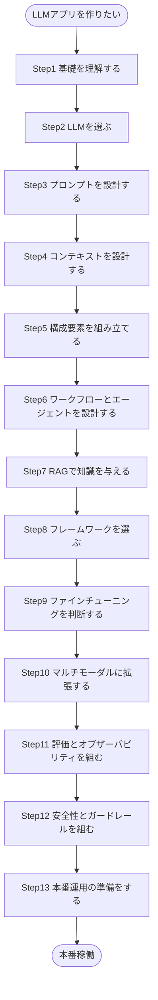

**図1: LLMアプリケーション開発の全体マップ**

重要なのは、この地図は一直線に一度だけ進むものではなく、実際には小さく反復しながら何度も行き来するという点です。Anthropicのエンジニアリングチームも「最もシンプルな解決策から始め、必要な場合にのみ複雑さを増やす」ことを一貫して推奨しています(出典2)。まずはStep1から順に見ていきましょう。

---

## Step 1: LLMの基礎を理解する

### 基盤モデルとLLM

LLM(大規模言語モデル)は、インターネット規模のテキストデータで事前学習された「基盤モデル(Foundation Model)」の一種です。Transformerと呼ばれるニューラルネットワークのアーキテクチャに基づいており、入力されたトークン列から次のトークンを予測することを繰り返すことで、文章の生成・要約・翻訳・推論など幅広いタスクをこなせるようになります。原著書籍でもこの基本アーキテクチャの理解が第1章の中心テーマになっています(出典0書籍)。

### モデルが完成するまでの流れ

現在主流のLLMは、大きく分けて次の3段階を経て製品として提供されます。

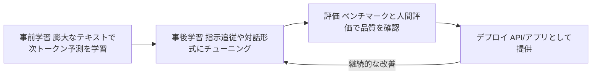

**図2: LLMが製品として提供されるまでの一般的な流れ**

- **事前学習(Pre-training)**: 大量のテキストから統計的な言語パターンを学習する段階です。
- **事後学習(Post-training)**: SFT(教師ありファインチューニング)やRLHF(人間のフィードバックによる強化学習)などを通じて、指示に従う対話モデルへと調整します。
- **評価(Evaluation)**: SWE-bench(コーディング)やMMLU系のベンチマーク、人間による選好評価など複数の指標で品質を測ります。
- **デプロイ**: API・チャットアプリ・エージェント基盤などの形で公開されます。

### ベースモデル vs カスタマイズ済みモデル

原著書籍が強調しているように、「そのまま使えるベースモデル」と「特定用途向けにカスタマイズしたモデル」は区別して考える必要があります(出典0書籍)。カスタマイズの方法には、後述するプロンプトエンジニアリング・RAG・ファインチューニングなど複数の選択肢があり、どれを選ぶかは Step 9 で詳しく扱います。ここで初学者が押さえておくべき要点は、**「モデルを再学習させること」は選択肢の一つに過ぎず、多くの場合はより手軽な方法で十分**という点です。

---

## Step 2: アプリケーションに合ったLLMを選ぶ

### 2026年9月時点のモデル地図

LLM市場は非常に速いペースで動いています。Anthropic・OpenAI・Google・xAIといった主要ラボがフロンティアモデルを数週間おきに更新する一方、DeepSeek・Qwen・Kimi・GLMなど中国発のオープンウェイトモデルも急速に性能を伸ばし、価格競争を牽引しています(出典3)。あるモデル比較記事は「単一の"最良のモデル"は存在せず、コーディングに強いClaude系、汎用性の高いGPT系、マルチモーダルとコストパフォーマンスに優れたGemini系、俊敏でエージェント指向のGrok系というように、ラボごとに異なる個性がある」と評しています(出典4)。またSimon Willison氏(データベースツールDatasetteの開発者であり、LLM分野で最も広く読まれている実務家ブロガーの一人)は、コーディングエージェントの分野で2025年後半から2026年にかけて推論モデルが一気に主流化し、価格が急速に下がったことを指摘しています(出典5)。

このような環境では、特定のモデル名やベンチマーク順位を覚えることよりも、**「自分のタスクに対してどう選定し、どう評価するか」という判断プロセスを身につけること**の方が長く役立ちます。

| 観点 | 確認すること | 向いているモデルの傾向 |
| --- | --- | --- |
| タスクの難易度 | 複雑な多段階推論やコーディングが必要か | フロンティア級の推論モデル |
| リクエスト頻度とコスト | 大量の短いリクエストを高速に処理したいか | 軽量・高速な廉価モデル |
| データ主権・カスタマイズ性 | 自社インフラでの運用や重みへのアクセスが必要か | オープンウェイトモデル(Llama系、Qwen系、DeepSeek系など) |
| コンテキスト長 | 長い文書やコードベース全体を読ませたいか | 長コンテキストウィンドウに対応したモデル |
| エコシステム | 既存のツール連携やMCPサーバー資産を活かしたいか | 対応エコシステムが充実したラボのモデル |

**表1: LLM選定時に確認すべき観点**

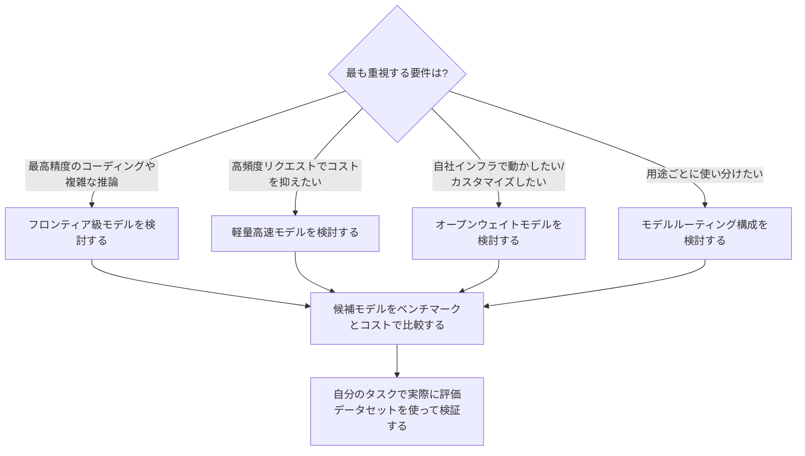

**図3: LLM選定のディシジョンフロー**

複数の比較記事が共通して強調しているのは、「リーダーボードは毎月のように入れ替わるため、特定のモデルにハードコードするのではなく、モデルを切り替え可能な形でアプリケーションを設計し、タスクの複雑度に応じて異なるモデルへルーティングする戦略が2026年の実践的な標準になりつつある」という点です(出典6)。これはStep 6で紹介する「ルーティング」パターンにもつながります。

---

## Step 3: プロンプトエンジニアリングをマスターする

プロンプトエンジニアリングとは、AIモデルからより良い出力を得るために指示を構造化する技術です。Anthropicの開発者向けブログは、これを「良いプロンプトと曖昧な指示の差が、そのまま欲しい結果に一発でたどり着けるか、何度もやり取りを重ねる必要があるかの差になる」技術だと説明しています(出典7)。

### 基本テクニック

Anthropicが2025年11月に公開し2026年にかけて更新しているガイドでは、次の基本テクニックが紹介されています(出典7)。

- **明確で明示的な指示を書く**: モデルに推測させず、欲しい出力を直接的に述べます。「分析して」ではなく「〇〇の観点から分析し、△△形式で出力して」のように書きます。
- **文脈と目的を伝える**: なぜその出力が必要なのかを伝えると、モデルは意図に沿った判断をしやすくなります。
- **具体性を持たせる**: 文字数・出力形式・対象読者・制約条件などを明示します。
- **例を示す(Few-shot)**: 説明より実例の方が伝わる場合に有効です。まずは1つの例(One-shot)から始め、それでも安定しない場合にのみ例を追加します。
- **「わからない」と言う許可を与える**: 「情報が不十分な場合は推測せずそう伝えてください」と一言添えるだけで、ハルシネーション(もっともらしい誤情報の生成)を減らせます。

### 応用テクニック

より複雑なタスクやエージェント構築の際には、以下の応用テクニックが役立ちます(出典7)。

- **プレフィル(Prefill)**: モデルの応答の書き出しをこちらで指定し、JSON出力の強制や前置きの省略に使います。
- **思考の連鎖(Chain of Thought)**: 「段階的に考えてから答えて」と指示し、複雑な分析タスクの精度を上げます。Claudeなどの最新モデルが備える拡張思考(Extended Thinking)機能が使える場合は、そちらの方が一般的に優先されますが、透明性のある推論過程が必要な場面では明示的なCoTも依然として有効です。
- **出力形式の制御**: 「〜しないで」ではなく「〜してください」という肯定形で指示する方が、モダンなモデルには効果的だとされています。
- **プロンプトチェイニング(Prompt Chaining)**: 1つのプロンプトでは処理しきれない複雑なタスクを、複数の呼び出しに分割します。これはStep 6で紹介するワークフローパターンの基礎にもなります。

一方で、XMLタグによる構造化や過度なロールプロンプティング(「あなたは〜の専門家です」)は、以前ほど重要ではなくなってきているとAnthropicは指摘しています。現行の主要モデルは、明示的でわかりやすい文章だけでも十分に構造を理解できるためです(出典7)。

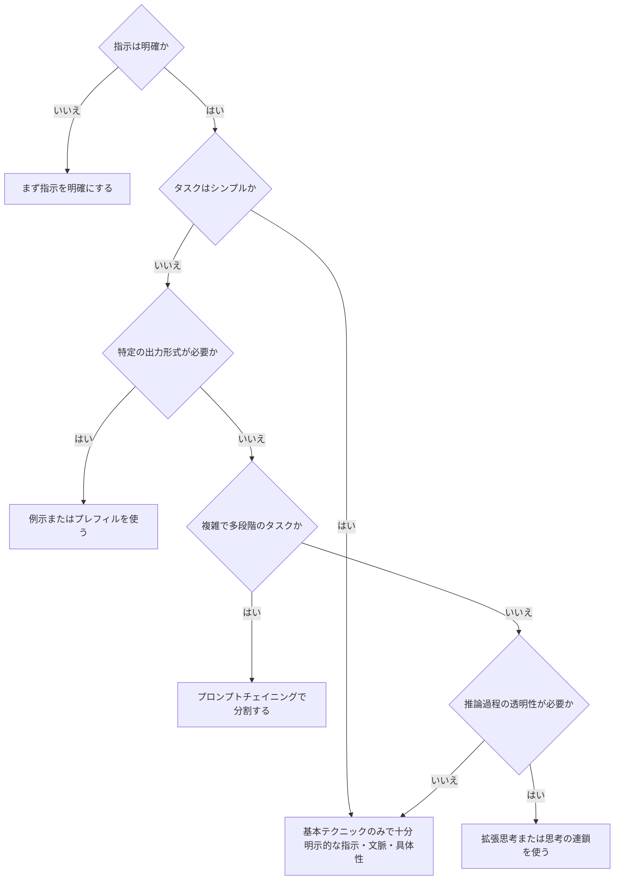

**図4: プロンプトエンジニアリング技法の選択フロー**(出典7の判断基準をもとに作成)

| 欲しいもの | 使う技法 |
| --- | --- |
| 特定の出力形式 | 例示・プレフィル・明示的な形式指示 |
| 段階的な推論 | 拡張思考(利用可能な場合)または思考の連鎖 |
| 複雑な多段階タスク | プロンプトチェイニング |
| 透明性のある推論根拠 | 構造化された思考の連鎖 |
| ハルシネーション対策 | 「わからない」と言う許可 |

**表2: 目的別プロンプト技法の選び方**(出典7)

Anthropicのガイドは最後に、「最良のプロンプトは最も長く複雑なものではなく、必要最小限の構造で目的を確実に達成できるもの」だと締めくくっています(出典7)。まずは基本テクニックを習慣化し、それで解決しない問題にだけ応用テクニックを重ねる、という順序が重要です。

---

## Step 4: コンテキストエンジニアリング

2025年後半以降、業界の関心は「プロンプトエンジニアリング」から「コンテキストエンジニアリング」へと広がっています。Anthropicはこれを「LLMの推論時に含まれるトークン集合、すなわちシステムプロンプト・ツール定義・会話履歴・検索結果など、コンテキストウィンドウに入りうるすべての情報を、最適な形でキュレーションし維持するための一連の戦略」と定義しています(出典8)。あるエンジニアリングブログはこれを「プロンプトエンジニアリングが一文の設計だとすれば、コンテキストエンジニアリングはその一文を生み出すパイプライン全体の設計である」と表現しています(出典9)。

### なぜ重要なのか: コンテキストの劣化(Context Rot)

各モデルベンダーは2024年から2025年にかけてコンテキストウィンドウを100万トークン級まで拡大しましたが、「窓が大きければ大きいほど良い」わけではないことがわかってきました。Chroma Researchが2025年7月に発表した調査は、GPT・Claude・Geminiを含む18のフロンティアモデルを対象に、入力が長くなるにつれてすべてのモデルの精度が劣化することを示しました。劣化は緩やかではなく、ウィンドウの上限よりずっと手前で精度が崖のように落ち込む場合があり、20件の文書のうち関連情報が5〜15番目の位置にあるだけで、一部のモデルは30ポイント以上正答率を落としたと報告されています(出典10)。

このため、2026年時点の実践では「大きいコンテキストウィンドウに頼る」のではなく「厳選されたトークンだけを渡す規律」が重視されています。コーディングエージェントやリサーチエージェントのように、実行ステップごとに検索結果やツール出力を積み重ねていくシステムほど、この積み重ねが後続のすべてのステップの精度を下げてしまう点に注意が必要です(出典10)。

### 実践上のポイント

- システムプロンプト・ツール定義・会話履歴・検索結果それぞれについて、「本当にこのステップに必要か」を問い直す。
- 長くなった会話履歴は要約(コンパクション)し、古いツール出力やあきらめた推論経路を残さない。
- 重要な情報はコンテキストの先頭または末尾に配置する(「middle」に埋もれた情報は見落とされやすい)。
- ツールの出力形式は、モデルが元々インターネット上で見慣れている自然な形式に近づける(詳しくはStep 6のツール設計の項目を参照)。

プロンプトエンジニアリングは廃れたわけではなく、コンテキストエンジニアリングという大きな枠組みの中の一つの基礎的な構成要素として位置づけ直された、と理解するのが実務的には正確です(出典7)。

---

## Step 5: LLMアプリケーションの構成要素

ここからは実際にアプリケーションを組み立てる段階です。Anthropicのエンジニアリングチームは、数十社のエージェント構築を支援した経験から「最も成功している実装は、複雑なフレームワークではなく、シンプルで組み合わせ可能なパターンを使っている」と述べています(出典2)。その最も基本的な構成要素が「拡張されたLLM(Augmented LLM)」です。

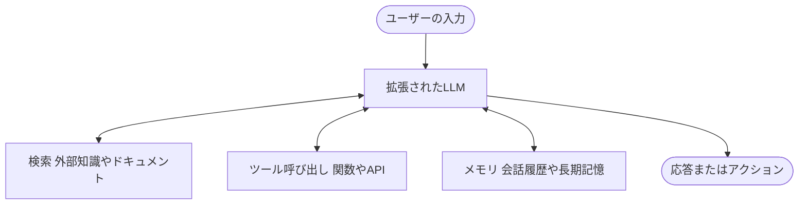

**図5: 拡張されたLLM(Augmented LLM)の構成図**(出典2をもとに作成)

現在のモデルは、自ら検索クエリを生成し、適切なツールを選び、何を記憶すべきかを判断する能力を備えています。この「検索・ツール・メモリ」という3つの拡張機能をどう実装するかが、アプリケーション設計の中心テーマになります。

### ツール利用とModel Context Protocol(MCP)

ツール利用(Tool Use、Function Callingとも呼ばれる)は、LLMに外部システムを操作させるための仕組みです。かつては各社が独自の実装方法を使っていましたが、2024年11月にAnthropicが公開したModel Context Protocol(MCP)が、この分野の共通規格として急速に普及しました(出典11)。MCPはJSON-RPCベースのオープンな標準で、AIアプリケーションがリモートのMCPサーバーからツール・再利用可能なプロンプト・リソースを発見し、都度アドホックなAPI連携を書く代わりに、統一されたインターフェースを通じて呼び出せるようにします。なおセッションの扱いは仕様バージョンで異なります。2025-11-25仕様まではプロトコルレベルのセッションが定義されていましたが、これは常にステートフルであることを要求するものではありません。初期化応答でサーバーが`Mcp-Session-Id`ヘッダーを返した場合にかぎり、クライアントは以降のリクエストで同ヘッダーを付与する必要があり、サーバーが返さなければセッションIDを持たないステートレスな運用も仕様に沿った実装でした。これにより、N個のAIアプリケーションとM個のツールを個別に統合する「N×M問題」を解消することを目的としています(出典11)。

MCPは2025年11月の1周年を経て、学生・個人開発者からスタートアップ・大企業のアーキテクトまで幅広いコミュニティによって仕様策定(Specification Enhancement Proposal)が進められる、ガバナンス構造を持つオープンプロジェクトへと成長しました(出典12)。2026年7月28日には最大級の改訂版である「2026-07-28」仕様が確定し、プロトコルレベルのセッション（`Mcp-Session-Id`）を廃止してコア部分をステートレス化したうえで、サーバー側でUIを描画する「MCP Apps」拡張や長時間実行タスクに対応する「Tasks」拡張、より厳格なOAuth認可などが導入されています(出典13)。初学者がまず押さえるべきは、「ツールをどう定義し、モデルにどう発見させるか」という設計そのものが、規格化が進んでいるとはいえ依然として重要な設計課題である、という点です。

Anthropicは、ツールの定義にもプロンプト本体と同じくらいの注意を払うべきだとし、これを「エージェント・コンピュータ・インターフェース(ACI)」と呼んでいます(出典2)。実際にSWE-bench向けのコーディングエージェントを構築した際には、プロンプト全体の調整よりもツールの調整に多くの時間を費やしたと報告されています。たとえば相対パスでのファイル指定はエージェントが作業ディレクトリを移動した後にミスを誘発しやすいため、常に絶対パスを要求するようツールを変更したところ、モデルは正確に扱えるようになったという事例が紹介されています(出典2)。ツール設計の実践的なポイントは次のとおりです。

- モデルの立場に立って、そのツールの使い方が説明とパラメータだけで自明かどうかを確認する。
- パラメータ名や説明文は、新人エンジニアへの丁寧なドキュメントを書くつもりで作る。
- 実際にモデルにツールを使わせてみて、どこで間違えるかを観察し、改善を繰り返す。
- 間違った使い方をしにくいように、引数の設計そのものを工夫する(ポカヨケ)。

---

## Step 6: ワークフローとエージェントの設計パターン

ここが本ガイドの中核です。Anthropicは「エージェント的なシステム(Agentic System)」を、あらかじめ定義されたコードパスに沿ってLLMとツールを組み合わせる**ワークフロー(Workflow)**と、LLMが自らのプロセスやツール利用を動的に決定していく**エージェント(Agent)**の2種類に区別しています(出典2)。

> **ワークフロー**: LLMとツールが、あらかじめ定義されたコードパスを通じてオーケストレーションされるシステム。
> **エージェント**: LLMが自らのプロセスとツール利用を動的に決定し、タスクの達成方法をコントロールし続けるシステム。

複雑さを増やす前に、まず「本当にエージェントが必要か」を問うことが推奨されています。エージェント的なシステムはレイテンシとコストを引き換えにタスク遂行能力を高めるものであり、多くのアプリケーションでは、検索と文脈内の例だけを備えた単発のLLM呼び出しで十分だとされています(出典2)。

### ワークフローパターン1: プロンプトチェイニング

タスクを固定された一連のステップに分解し、各LLM呼び出しが前段の出力を処理します。中間ステップに「ゲート」と呼ばれるプログラム的なチェックを挟むことで、途中で軌道修正できます。マーケティング文章を作成してから翻訳する、文書のアウトラインを作成して基準を満たすか確認してから本文を書く、といったタスクに向いています(出典2)。

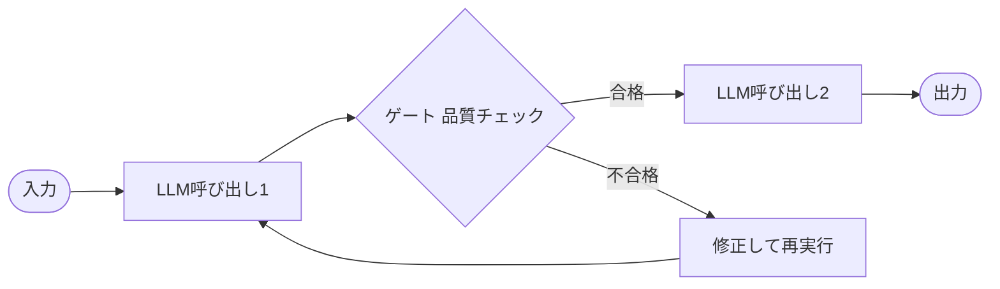

**図6: プロンプトチェイニングのワークフロー**(出典2)

### ワークフローパターン2: ルーティング

入力を分類し、それぞれ専門化された後続処理に振り分けます。1種類の入力に最適化すると別の種類の性能が犠牲になるような場面で、関心を分離できます。カスタマーサポートの問い合わせを一般質問・返金依頼・技術サポートに振り分けたり、簡単な質問は軽量モデルへ、難しい質問は高性能モデルへルーティングしてコストと性能のバランスを取ったりする用途に向いています(出典2)。

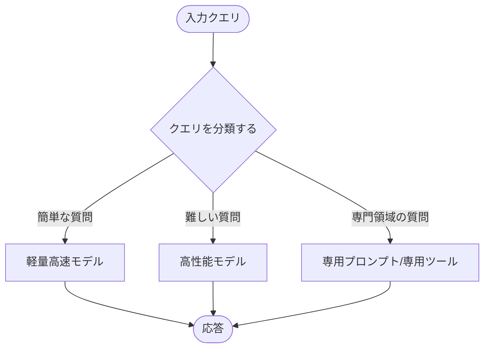

**図7: ルーティングのワークフロー**(出典2)

### ワークフローパターン3: 並列化(セクショニングと投票)

複数のLLM呼び出しを同時に走らせ、結果をプログラム的に集約します。「セクショニング」はタスクを独立したサブタスクに分割して並列実行する方法、「投票」は同じタスクを複数回実行して多様な出力を得る方法です。ガードレールの実装(1つのモデルがユーザー要求を処理し、別のモデルが不適切な内容をスクリーニングする)や、コードの脆弱性レビュー(複数のプロンプトがそれぞれ異なる観点でチェックする)などに使われます(出典2)。

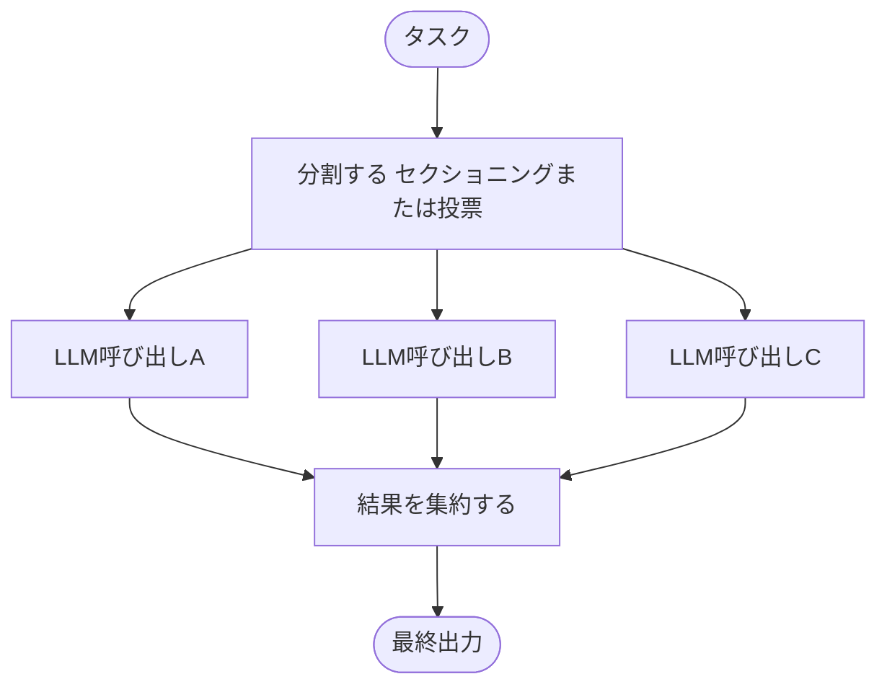

**図8: 並列化のワークフロー**(出典2)

### ワークフローパターン4: オーケストレーター・ワーカー

中心となるLLM(オーケストレーター)がタスクを動的に分解し、ワーカーLLMに委任し、結果を統合します。並列化と似た形に見えますが、サブタスクがあらかじめ定義されているのではなく、入力に応じてオーケストレーターが都度決定する点が異なります。複数ファイルに複雑な変更を加えるコーディングタスクや、複数の情報源から情報を集めて分析する検索タスクに向いています(出典2)。

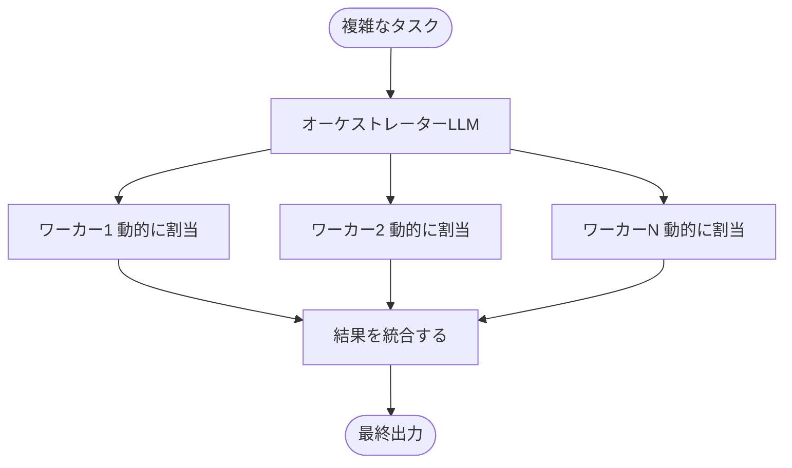

**図9: オーケストレーター・ワーカーのワークフロー**(出典2)

### ワークフローパターン5: 評価者・最適化ループ

1つのLLM呼び出しが応答を生成し、別のLLM呼び出しがループの中で評価とフィードバックを行います。評価基準が明確で、人間がフィードバックを与えることで応答が明確に改善する種類のタスクに特に有効です。文学作品の翻訳(評価者LLMが翻訳者LLMが最初に捉えきれなかったニュアンスを指摘する)や、複数回の検索と分析が必要な複雑な調査タスクなどに使われます(出典2)。

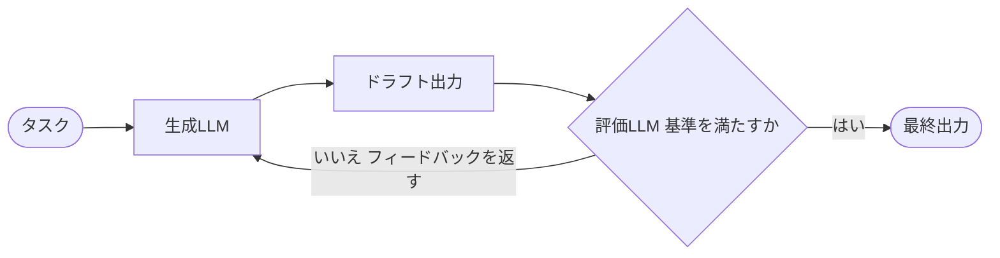

**図10: 評価者・最適化ループのワークフロー**(出典2)

### 自律型エージェント

ワークフローが人間の決めた道筋をなぞるのに対し、エージェントはタスクが明確になった後、人間からの指示や対話をきっかけに自律的に計画し、実行します。実行中は、ツールの呼び出し結果やコード実行結果など「環境からのグラウンドトゥルース」を各ステップで取得し、進捗を評価することが重要です。人間はチェックポイントやブロッカーに遭遇した時点でフィードバックを求められます。タスクは完了時に終了しますが、暴走を防ぐために最大反復回数などの停止条件を設けるのが一般的です(出典2)。

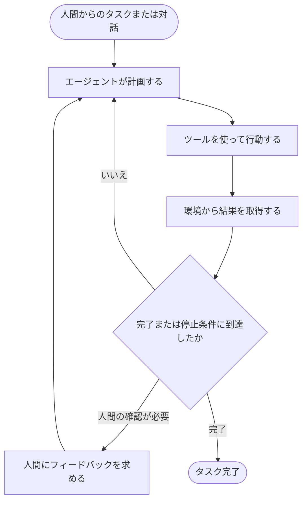

**図11: 自律型エージェントのループ**(出典2)

エージェントは、必要なステップ数を事前に予測できず、固定された経路をハードコードできないような、オープンエンドな問題に向いています。ただしその自律性ゆえにコストが高くなりやすく、エラーが積み重なるリスクもあるため、サンドボックス環境での十分なテストと適切なガードレールが推奨されています(出典2)。

### フレームワークは必要か

Anthropicは、Claude Agent SDKやAWSのStrands Agents SDK、ドラッグ&ドロップ型のRivet、Vellumなど多くのフレームワークが存在するとしつつも、「まずはLLM APIを直接使うところから始めることを勧める。多くのパターンは数行のコードで実装できる。フレームワークを使う場合も、内部で何が起きているかを理解しておくこと。実装の仮定を誤解することが、顧客のエラーの一般的な原因になっている」とアドバイスしています(出典2)。フレームワークの具体的な比較はStep 8で扱います。

---

## Step 7: RAGでLLMに知識を与える

### RAGとは何か、なぜ必要か

RAG(Retrieval-Augmented Generation、検索拡張生成)は、LLMが応答を生成する前に、外部の知識ベースから関連文書を検索し、それをコンテキストとしてモデルに渡す仕組みです。静的な学習データだけに頼るのではなく、推論のたびに最新かつ検証可能な情報を取り込めるようにすることで、ハルシネーションを減らし、事実に基づいた回答を実現します(出典14)。ある実務ガイドは「素朴なRAGパイプラインはおよそ40%の確率で検索に失敗し、間違った文書に基づいた自信満々の回答を生成してしまう」と指摘しており、2026年時点でも検索精度こそがRAGの最大のボトルネックであり続けていると強調しています(出典15)。

### RAGは一つの技術ではなくスペクトラム

2026年の実践では、RAGは単一の実装ではなく、クエリの複雑さに応じて適切な戦略を選ぶ「スペクトラム」として扱われるようになっています(出典16)。

| 種類 | 向いているクエリ | 特徴 |
| --- | --- | --- |
| 素朴なRAG(Naive RAG) | 単一の文書内で答えられる質問 | ベクトル検索+リランクのみ。高速・低コスト |
| 高度なRAG(Advanced RAG) | 2〜3件の文書統合が必要な質問 | ハイブリッド検索(ベクトル+キーワード)、クエリ変換、リランキングを追加 |
| GraphRAG | エンティティ間の関係性を辿る必要がある質問 | 知識グラフを構築し、関係性をたどって検索する |
| エージェンティックRAG(Agentic RAG) | 多段階の推論や反復的な検証が必要な質問 | エージェントが検索クエリの分解・検索・検証・再検索を自律的に繰り返す |

**表3: RAGの種類と適用場面**(出典16, 出典17)

「Adaptive RAG(適応的RAG)」と呼ばれるパターンでは、まずクエリの複雑さを分類し、単純な質問には高速で低コストなパイプラインを、複雑な質問には多段階のエージェンティックな処理を割り当てることで、コストと品質の最適なバランスを取ります(出典16)。エージェンティックRAGは2026年の企業向けAIエージェントで支配的なパターンになりつつあると報告されていますが(出典17)、すべてのクエリに適用するのはコスト面で非効率であるため、複雑さに応じた出し分けが重要です。

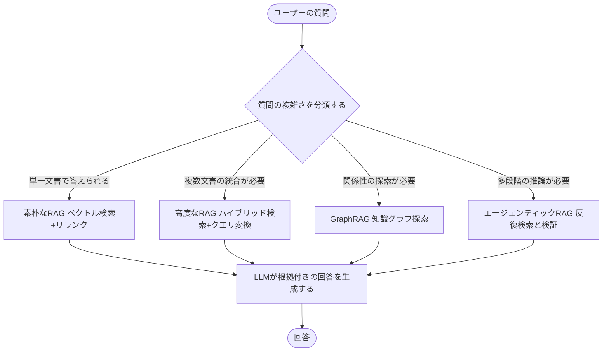

**図12: Adaptive RAGのパイプライン選択フロー**(出典16をもとに作成)

### 実装の基本要素

RAGパイプラインを構築する際に押さえておくべき基本要素は次のとおりです。

- **チャンキング**: 文書を検索可能な単位に分割します。固定長で機械的に分割すると、文や表の途中で切れてしまい、技術的には関連していても実質的に使えないチャンクになりがちです。意味的にまとまった単位で分割することが重要とされています(出典15)。
- **埋め込みとベクトルデータベース**: チャンクをベクトル化し、類似度検索できるデータベース(Pinecone、Weaviate、Qdrant、Milvus、Chromaなど)に格納します。
- **ハイブリッド検索とリランキング**: ベクトル検索(意味的類似度)とキーワード検索(BM25など)を組み合わせ、リランカーで最終的な順位を精緻化します。
- **評価**: RAGASのようなフレームワークを用いて、忠実性(Faithfulness、回答が検索結果に基づいているか)や関連性(Relevance)などを定量的に測定します(出典15)。詳しい評価手法はStep 11で扱います。

「RAGが失敗する場合、その原因の約73%は生成部分ではなく検索部分にある」という2026年の業界分析もあり(出典15)、初学者はまず検索の質を疑う習慣を持つとよいでしょう。

---

## Step 8: オーケストレーションフレームワークを選ぶ

Step 6で見たように、Anthropicはまず生のAPI呼び出しから始めることを推奨していますが、統合の幅を広げたい場合や、チームでの開発効率を優先したい場合には、フレームワークの利用が現実的な選択肢になります。原著書籍が紹介していたLangChain・Haystack・Semantic Kernelという構図(出典0書籍)は現在も生きていますが、2026年にはLangChainからエージェントオーケストレーション専用の「LangGraph」が独立した主要コンポーネントとして定着し、LlamaIndexはRAGとデータ接続に特化したポジションを固めています(出典18)。

| フレームワーク | 得意領域 | 2026年の位置づけ |
| --- | --- | --- |
| LangChain / LangGraph | 汎用オーケストレーション、状態を持つ複雑なエージェント | LangGraphが分岐・ループ・人間参加型フローを持つエージェント構築の主要な選択肢に。統合数が非常に多い |
| LlamaIndex | RAG、文書ベースの検索 | LlamaParseによる高精度な文書パース(表・図表を含む)が強み。データ取り込みと検索に特化 |
| Semantic Kernel | .NET/Microsoftエコシステムとの統合 | エンタープライズ・Azure連携が中心 |
| Haystack | 検索・QAパイプライン構築 | パイプライン指向のRAG構築ツールとして継続利用 |
| Claude Agent SDK / Strands Agents SDK | エージェント基盤の直接構築 | Anthropic/AWSが提供する低レベルSDK。フレームワークの抽象化を薄く保ちたい場合に選ばれる |
| Rivet / Vellum | ノーコード/ローコードでのワークフロー構築 | GUIでのプロトタイピングや非エンジニアとの協業に向く |

**表4: 主要オーケストレーションフレームワークの比較**(出典0書籍, 出典2, 出典18)

複数の2026年時点の比較記事に共通する結論は、「LangChain(LangGraph)とLlamaIndexは互いに排他的な選択肢ではなく、多くの本番アプリケーションでは両方を組み合わせている」という点です。具体的には、LlamaIndexで文書の取り込み・チャンキング・検索を担当し、LangGraphでいつ検索するか・いつ他のツールを使うか・いつ直接回答するかを判断するエージェントオーケストレーションを担当する、という役割分担です(出典18)。

フレームワークを選ぶ際は、次の問いを自分に投げかけると判断しやすくなります。

- 自分のタスクの重心は「検索」寄りか「エージェント的な意思決定」寄りか。
- チームは将来、モデルプロバイダーを切り替える可能性があるか(その場合、抽象化レイヤーの価値が上がる)。
- デバッグのしやすさをどこまで重視するか(抽象化が厚いほど、内部で何が起きているか追いにくくなる)。
- そもそも1回のAPI呼び出しで十分なタスクではないか。

最後の問いは軽視されがちですが、Anthropicが繰り返し強調しているように、「複雑さは、それが明確に成果を改善する場合にのみ追加すべき」という原則は、フレームワーク選定にもそのまま当てはまります(出典2)。

---

## Step 9: ファインチューニングは必要か

原著書籍の第11章はファインチューニングの技術的な手順に多くのページを割いていますが、2026年時点の実践知は「まずファインチューニングを検討する前に、より手軽な選択肢を使い切ること」を強く推奨しています。ある実務ガイドは、これを **プロンプト → RAG → ファインチューニング → 蒸留** という順序で捉えるべきだとし、「ファインチューニングに関する相談を受けるチームのほとんどは、まだファインチューニングをすべきではない。プロンプトを直し、実際に機能するRAGパイプラインを構築し、評価の仕組みを整える方が先だ」と述べています(出典19)。

### 何を変えたいのかを切り分ける

複数の情報源が共通して強調しているのは、この3技術が同じ問題を解決する代替手段ではなく、それぞれ異なる問題を解決する道具だという点です(出典20)。

- **プロンプトエンジニアリング**: モデルの振る舞いと知識の両方を、インフラに触れずに形作る。無料かつ即座に反映できる。
- **RAG**: モデルが「知っていること」を変える。動的・外部・専有の知識が必要な場合に有効。
- **ファインチューニング**: モデルの「振る舞い方」を変える。出力形式、口調、ドメイン固有の推論パターンなど、プロンプトだけでは安定しない一貫性が必要な場合に有効。ほとんどの場合、新しい事実を教え込む用途には向かない。

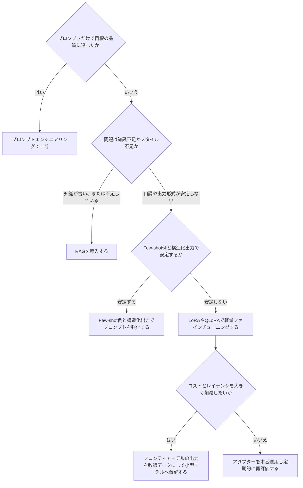

**図13: ファインチューニング要否の決定木**(出典19, 出典20をもとに作成)

### LoRA / QLoRAが主流になった理由

2026年時点で「フルファインチューニング(全パラメータの再学習)」が選ばれる場面は限られており、多くの場合はLoRA(Low-Rank Adaptation)やQLoRA(量子化を組み合わせたLoRA)のようなパラメータ効率の良い手法(PEFT)が使われます。LoRAはベースモデルの重みを凍結したまま小さなアダプター層だけを学習させることでコストを大幅に削減し、QLoRAはさらに4bit量子化を組み合わせることで、コンシューマー向けGPU1枚でも大規模モデルを調整できるようにします(出典21)。ある実務ガイドは、分類や抽出タスクであれば200〜500件程度の質の高いサンプルで十分な場合が多く、「データセットのサイズを追い求めて足踏みする」ことの方が問題になりやすいと指摘しています(出典20)。

### 見落とされがちな運用コスト

ファインチューニングを選んだ後も、アダプターのバージョン管理、ロールバック計画、再学習の頻度、ベースモデルのドリフト管理といった「運用の税金」が継続的に発生します。ホスティングプロバイダーがベースモデルを更新すると、アダプターの性能が静かに劣化することもあるため、四半期ごとの再検証を計画に組み込むことが推奨されています(出典19)。学習コストだけでなく、評価・データキュレーション・ライフサイクル管理を含めた総コストで判断することが重要です。

---

## Step 10: マルチモーダル対応アプリケーションへの拡張

原著書籍の第10章が扱っているように、LLMアプリケーションはテキストだけでなく、画像・音声・動画・コードなど複数のモダリティを組み合わせることでより幅広いユースケースに対応できます(出典0書籍)。現在の主要なフロンティアモデルの多くはテキストと画像をネイティブに扱えるようになっており、請求書や図表を含む文書の解析、画面を見ながら操作するコンピュータ操作エージェント、音声インターフェースを持つアプリケーションなどが実用段階に入っています。

マルチモーダル対応アプリケーションを設計する際の考え方は、これまでのステップで紹介した原則の延長線上にあります。

- **Augmented LLMの拡張として捉える**: 画像やコード実行環境も、Step 5で紹介した「ツール」の一種として設計できます。
- **単一のツールで完結させるか、複数のツールを組み合わせるかを検討する**: たとえば画像解析と文章生成をひとつのモデル呼び出しで済ませられる場合と、専用の画像認識ツール・音声合成ツールを個別に呼び出して結果を統合する場合とでは、設計の複雑さとコストが大きく変わります。
- **評価指標もモダリティごとに用意する**: テキストの評価指標(Step 11)をそのまま画像や音声の評価に流用できないことが多いため、モダリティごとの評価基準を別途設計する必要があります。

マルチモーダルはモデルの進化が特に速い領域であるため、具体的な機能や対応モデルは公式ドキュメントで随時確認することを推奨します。

---

## Step 11: 評価とオブザーバビリティ

「動くプロトタイプを作ること」と「本番品質のアプリケーションを作ること」の間には大きな溝があります。Chip Huyen氏(スタンフォード大学で機械学習システム設計を教え、ベストセラー *Designing Machine Learning Systems* および *AI Engineering* の著者)は、早くから「LLMで格好いいものを作るのは簡単だが、本番運用に耐えるものを作るのは非常に難しい」と指摘しており、その原因の一端はプロンプトエンジニアリングにおけるエンジニアリング的な厳密さの欠如にあるとしています(出典22)。この溝を埋めるのが評価(Evaluation)とオブザーバビリティ(Observability)です。

### 3層の評価構造

2026年の実務ガイドは、信頼できるエージェントを運用するために次の3つの評価層が必要だと整理しています(出典23)。

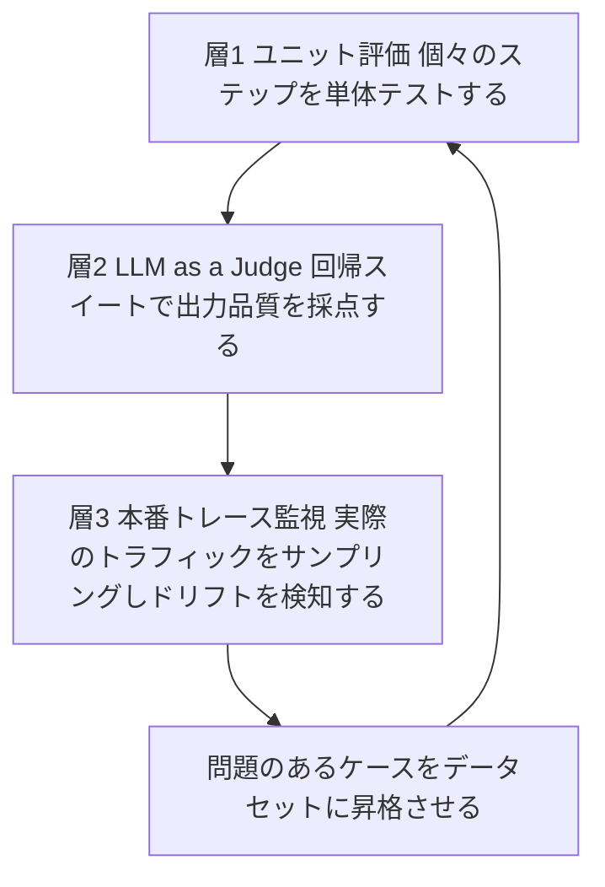

**図14: 評価とオブザーバビリティの3層構造**(出典23をもとに作成)

1. **ユニット評価**: 検索結果の関連性やツール呼び出しの正しさなど、パイプラインの個々のステップを単体テストのように検証します。
2. **LLM-as-a-Judge回帰スイート**: 主観的な品質(トーンや網羅性など)を、別のLLMを評価者として使い、既知の入力に対する期待される出力と比較しながら継続的に採点します。
3. **本番トレースの継続監視**: 実際のトラフィックをサンプリングし、品質のドリフト(徐々の劣化)を検知します。問題のあったケースを、回帰テスト用のデータセットに昇格させることで、監視と評価のループを閉じます。

あるオブザーバビリティ記事は、「ほとんどのエージェント障害はモデルの誤りではなく、ツール呼び出しの失敗・コンテキストの切り詰め・制御不能なループから生じており、通常のAPM(アプリケーション性能監視)ツールはエージェント専用の計測なしにこれらを検知できない」と指摘しています(出典24)。

### 主なツール

| ツール | 特徴 |
| --- | --- |
| LangSmith | LangChain/LangGraphとの統合が深い。トレーシングと評価を一体で提供 |
| Braintrust | 評価(Eval)ファーストな設計。データセット・スコアラー・実験比較のワークフローに強い |
| Langfuse | オープンソースでセルフホスト可能。トレーシングとプロンプト管理が中心 |
| MLflow | オープンソースでベンダー中立。トレース・評価・プロンプト最適化・ガバナンスを一つの基盤で提供 |
| Arize Phoenix / RAGAS / DeepEval | 忠実性・関連性・ハルシネーションなど、出力そのものを採点するオープンソースの評価ライブラリ |

**表5: 評価・オブザーバビリティツールの比較**(出典25, 出典26)

どのツールを選ぶ場合でも、OpenTelemetryのような業界標準の計装レイヤーを使ってトレースをベンダー中立に保つことで、後からツールを入れ替えたり組み合わせたりしやすくなります(出典24)。

---

## Step 12: 安全性・ガードレール・責任あるAI

原著書籍の第12章「Responsible AI」は、モデルレベル・メタプロンプトレベル・ユーザーインターフェースレベルという3層でのアーキテクチャを提示していました(出典0書籍)。この考え方の骨格は現在も有効ですが、2026年にはより具体的な脅威モデルと規制の枠組みが整備されています。

### 主要な脅威: プロンプトインジェクション

OWASP(Open Worldwide Application Security Project)が公開している「LLMアプリケーションのためのTop 10」では、プロンプトインジェクション(LLM01)が依然として最も重要な脆弱性カテゴリーとして挙げられています(出典27)。プロンプトインジェクションは、攻撃者が細工した入力によって、モデルとそれに接続されたツールにポリシー違反や意図しない操作を行わせる攻撃です。この問題が構造的に難しいのは、LLMが「指示」と「データ」を完全には区別できないためだとされています(出典27)。Simon Willison氏は2026年の予測として、「コーディングエージェントのセキュリティについて、いずれ大きな事故が起きるだろう。私自身を含め、多くの人がこれらのエージェントを事実上rootユーザーとして動かしている」と警鐘を鳴らしています(出典5)。

### ガードレールの実装レイヤー

実務では、ガードレールを入力側と出力側の両方に配置するのが一般的です(出典28)。

- **入力ガードレール**: プロンプトインジェクション検知、入力のサニタイズ、トピック分類による対象外リクエストの拒否、PII(個人識別情報)検知、レート制限。
- **出力ガードレール**: トークシシティ検知、事実性チェック(検索結果との照合)、PIIスキャン、指示階層の強制(システムプロンプトがユーザー入力より優先されることの担保)。
- **エージェント固有のガードレール**: どのツールをどの権限で呼び出せるかの制御、会話メモリを悪用したコンテキスト操作攻撃への対策、監査ログの記録。

NeMo Guardrails(NVIDIA、対話フローの制御に強み)、Guardrails AI(構造化出力の検証に強み)、LlamaFirewall(プロンプトインジェクション対策に特化)など、オープンソースのガードレールフレームワークも充実してきています(出典29)。

| OWASP Top 10 for LLM Applications 2026(抜粋) | 内容 | 主な対策 |
| --- | --- | --- |
| LLM01:2026 プロンプトインジェクション | 指示を上書き・迂回させる入力 | 入力の信頼境界を明確にし、指示階層を強制する |
| LLM02:2026 機密情報の漏洩 | PIIや機密データの意図しない出力 | 出力側でのPII検知・レダクション |
| LLM05:2026 データとモデルのポイズニング | 学習データ・ファインチューニングデータ・RAGの取り込み元への汚染 | 取り込み元の出所検証とデータ来歴の記録 |
| LLM08:2026 隠れコンテキストの露出 | システムプロンプトに加え、検索文書・メモリ・ツール応答など、モデルに渡る非公開コンテキストの漏洩 | 非公開コンテキストに機密を置かず、権限判定をアプリ側で行う |
| LLM09:2026 ベクトル/埋め込みの弱点 | RAG経由での間接的なプロンプトインジェクション | 検索結果にもガードレールを適用する |
| LLM10:2026 不適切な出力処理 | 出力をそのまま下流システムで実行してしまう | 出力の検証・サニタイズをルールとして定義する |

**表6: OWASP Top 10 for LLM Applications 2026(抜粋)と対策の方向性**(出典27, 出典28)

### 規制動向

EUのAI Act(AI規則)は2026年8月2日から一般適用が始まりました。ただし高リスクAIシステムの義務はDigital Omnibusによる改正で後ろ倒しされ、附属書III記載の単独型高リスクAIは2027年12月2日、EU製品安全法規の対象製品に組み込まれる附属書I該当の高リスクAIは2028年8月2日からの適用となります。いずれも正確性・堅牢性・サイバーセキュリティに関する対策が要求されます(出典30)。地域によって規制の内容や適用時期は異なるため、対象ユーザーの所在地に応じた最新の法令確認が必要です。

---

## Step 13: 本番運用へ

最後に、アプリケーションを本番環境で安定して運用するための実践的なチェックポイントを整理します。

### コストとレイテンシの最適化

- **モデルルーティング**: Step 2・Step 6で紹介したルーティングパターンを使い、簡単なリクエストは軽量モデルへ、難しいリクエストのみ高性能モデルへ回すことで、コストと品質のバランスを取ります。
- **プロンプトキャッシュ**: 繰り返し使われるシステムプロンプトや長いコンテキストをキャッシュし、トークンコストとレイテンシを削減します。
- **ストリーミングとバッチ処理**: ユーザー向けの対話にはストリーミング応答で体感速度を改善し、リアルタイム性が不要な大量処理にはバッチAPIを活用してコストを抑えます。
- **コンテキストの規律**: Step 4で述べたとおり、コンテキストは大きければ良いというものではありません。不要なトークンを削ぎ落とすことは、コスト削減だけでなく精度維持のためにも重要です。

### 経済性についての視点

Simon Willison氏は、AIによってコードを書くコストが劇的に下がることで需要そのものが何倍にも増える可能性がある、というジェヴォンズのパラドックスの観点から2026年以降を展望しています。もしこれが現実になれば、エンジニアの価値は「どれだけ速くコードを書けるか」ではなく「結果をどう検証し、システムの境界をどう守るか」に移っていくだろうと述べています(出典5)。この視点は、本ガイドで繰り返し強調してきた評価(Step 11)とガードレール(Step 12)への投資が、単なる品質管理ではなく長期的な競争力の源泉になることを示唆しています。

### 本番リリース前チェックリスト

| チェック項目 | 確認内容 |
| --- | --- |
| 評価セット | 主要なユースケースを網羅した評価データセットを用意し、継続的に計測しているか |
| フォールバック | モデルAPIの障害やレート制限時に、どう振る舞うか定義しているか |
| ガードレール | 入力・出力の両方にガードレールを実装し、テストしているか |
| コスト監視 | モデルごと・機能ごとのトークン消費とコストを可視化しているか |
| ロールバック計画 | プロンプトやモデルのバージョンを切り戻せる仕組みがあるか |
| ログとトレース | 障害調査のために十分な粒度でトレースを記録しているか(個人情報の扱いに注意) |
| 人間参加型の設計 | 高リスクな操作には人間の承認ステップを挟んでいるか |

**表7: 本番リリース前チェックリスト**

---

## まとめ: 学習ロードマップ

ここまで13のステップを通じて、LLMアプリケーション開発の基礎から応用までを見てきました。最後に、初学者がどの順序でスキルを積み上げていくとよいか、学習の流れとしてまとめます。

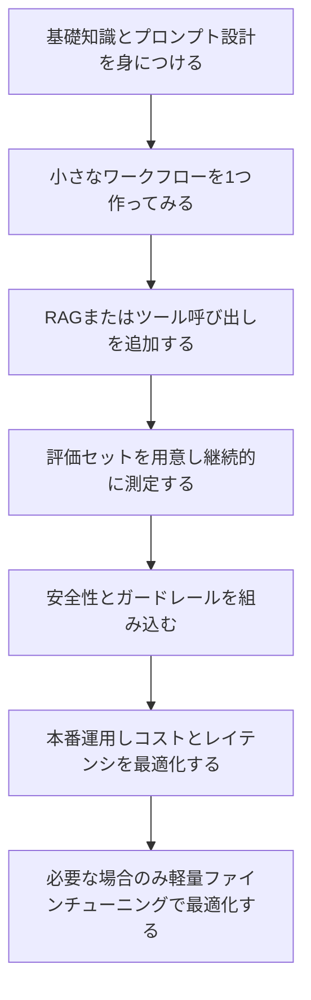

**図15: 初学者のための学習ロードマップ**

本ガイドを通じて一貫して繰り返されたメッセージは、Anthropicのエンジニアリングチームの言葉に集約されています。「LLM分野での成功は、最も洗練されたシステムを作ることではない。自分のニーズに合った"正しい"システムを作ることだ。シンプルなプロンプトから始め、包括的な評価で最適化し、よりシンプルな解決策では不十分な場合にのみ多段階のエージェント的システムを追加する」(出典2)。これは技術トレンドが移り変わっても変わらない、実践知の核心だと言えるでしょう。

---

## 参考文献・ソース一覧

本ガイドの作成にあたり参照した情報源です。本文中の「出典N」は、以下の同じ番号の項目に対応します（番号は文書全体で一意で、カテゴリごとに振り直していません）。書籍情報およびモデル名・価格・ベンチマーク数値は執筆時点(2026年9月9日)のものであり、その後変更されている可能性があります。

### 元ネタとなった書籍

- **出典0** Valentina Alto, *Building LLM Powered Applications*, Packt Publishing, 2024年5月刊 — https://www.oreilly.com/library/view/building-llm-powered/9781835462317/

### 著名な国際的開発者・研究者による情報源

- **出典1** Andrej Karpathy, "Software Is Changing (Again)" YC AI Startup School講演(2025年6月)の書き起こし・解説 — https://www.donnamagi.com/articles/karpathy-yc-talk
- **出典5** Simon Willison, "LLM predictions for 2026"(コーディングエージェントのセキュリティに関する見解の紹介記事) — https://www.wandoosystems.com/resources/llm-predictions-2026-willison
- **出典22** Chip Huyen, "Building LLM Applications for Production", 2023年 — https://huyenchip.com/2023/04/11/llm-engineering.html

### Anthropic公式

- **出典2** Anthropic, "Building effective agents" — https://www.anthropic.com/engineering/building-effective-agents
- **出典7** Anthropic, "Best practices for prompt engineering for 2026" — https://claude.com/blog/best-practices-for-prompt-engineering
- **出典8** Anthropic, "Effective context engineering for AI agents" — https://www.anthropic.com/engineering/effective-context-engineering-for-ai-agents
- **出典9** Anthropic, "Engineering at Anthropic"(エンジニアリングブログ一覧) — https://www.anthropic.com/engineering

### モデル選定・市場動向

- **出典3** "Best LLMs Right Now: September 2026 Model Rankings & Use Cases" — https://azumo.com/artificial-intelligence/ai-insights/top-10-llms-0625
- **出典4** "The Best LLMs in 2026: A Plain-English Comparison" — https://mindshub.ai/blog/navigating-the-llm-landscape-a-comparative-analysis-of-leading-large-language-models
- **出典6** "LangChain vs LlamaIndex"(LLM市場動向・モデルルーティングを含む比較記事) — https://contracollective.com/blog/langchain-vs-llamaindex-llm-orchestration-2026

### コンテキストエンジニアリング

- **出典10** Kelly Hong, Anton Troynikov, Jeff Huber (Chroma), "Context Rot: How Increasing Input Tokens Impacts LLM Performance", 2025年7月14日 — https://www.trychroma.com/research/context-rot

### Model Context Protocol公式

- **出典11** Model Context Protocol 公式サイト — https://modelcontextprotocol.io/
- **出典12** "One Year of MCP: November 2025 Spec Release" — https://blog.modelcontextprotocol.io/posts/2025-11-25-first-mcp-anniversary/
- **出典13** "The 2026-07-28 Specification"(確定版) — https://modelcontextprotocol.io/specification/2026-07-28

### RAGに関する情報源

- **出典14** "What Is RAG? How Retrieval-Augmented Generation Works in 2026" — https://atlan.com/know/what-is-rag/
- **出典15** "RAG Production Guide 2026" — https://lushbinary.com/blog/rag-retrieval-augmented-generation-production-guide/
- **出典16** "RAG Techniques Compared: A Practical Guide to Retrieval Augmented Generation in 2026" — https://blog.starmorph.com/blog/rag-techniques-compared-best-practices-guide
- **出典17** "20 Advanced RAG Types to Know in 2026" — https://www.turingpost.com/p/ragtypes

### フレームワーク比較に関する情報源

- **出典18** "LangChain vs LlamaIndex 2026: Complete Framework Guide" — https://itsourcecode.com/ai-framework/langchain-vs-llamaindex-2026-complete-guide/

### ファインチューニングに関する情報源

- **出典19** "Fine-Tuning LLMs in 2026: When RAG Isn't Enough (and When It Still Is)" — https://bigdataboutique.com/blog/fine-tuning-llms-when-rag-isnt-enough
- **出典20** "RAG vs Fine-Tuning in 2026: A Decision Framework for LLM Teams" — https://winder.ai/rag-vs-fine-tuning-2026-decision-framework/
- **出典21** Dettmers, T. et al., "QLoRA: Efficient Finetuning of Quantized LLMs" (arXiv:2305.14314) — https://arxiv.org/abs/2305.14314

### 評価・オブザーバビリティに関する情報源

- **出典23** "Agent Observability 2026: Evals, Traces, Cost Guide" — https://www.digitalapplied.com/blog/agent-observability-2026-evals-traces-cost-guide
- **出典24** "Top 5 LLM and Agent Observability Tools in 2026"(MLflow) — https://mlflow.org/top-5-agent-observability-tools/
- **出典25** "Top LLM Observability and Evaluation Platforms in 2026" — https://www.marktechpost.com/2026/08/09/top-llm-observability-and-evaluation-platforms-in-2026-langfuse-langsmith-braintrust-arize-and-more-compared/
- **出典26** "Book Review: AI Engineering by Chip Huyen"(評価手法の解説を含む) — https://hippocampus-garden.com/book_review_huyen/

### 安全性・ガードレール・責任あるAIに関する情報源

- **出典27** OWASP GenAI Security Project, "OWASP Top 10 for LLM Applications 2026" — https://genai.owasp.org/resource/owasp-genai-llm-top-10-2026/
- **出典28** "The Complete AI Guardrails Implementation Guide for 2026" — https://www.getmaxim.ai/articles/the-complete-ai-guardrails-implementation-guide-for-2026/
- **出典29** "LlamaFirewall: An open source guardrail system for building secure AI agents" — https://arxiv.org/pdf/2505.03574

### 規制に関する情報源

- **出典30** European Commission, "AI Act"(適用時期を含む公式解説ページ) — https://digital-strategy.ec.europa.eu/en/policies/regulatory-framework-ai

### 補足資料（本文では直接引用していない参考リンク）

- Simon Willison, llm-coding-agent リリースノート(2026年7月) — https://simonwillison.net/2026/Jul/2/llm-coding-agent/
- Simon Willisonのブログの活動状況まとめ(agentic-engineering, coding-agentsタグ) — https://tomrochette.com/agents/simon-willison/
- Chip Huyen, *AI Engineering: Building Applications with Foundation Models*(O'Reilly)書誌情報 — https://www.amazon.com/AI-Engineering-Building-Applications-Foundation/dp/1098166302
- MCP Roadmap — https://modelcontextprotocol.io/development/roadmap
- "Model Context Protocol(MCP)explained: A practical technical overview" — https://codilime.com/blog/model-context-protocol-explained/
- "Fine-Tuning vs RAG vs Prompt Engineering [2026 Framework]" — https://www.kunalganglani.com/blog/fine-tuning-vs-rag-prompt-engineering
- "LLM Guardrails: The Complete Guide to AI Safety Guardrails (2026)" — https://aisecurityandsafety.org/en/guides/llm-guardrails/

---

*本ガイドはWeb検索によって収集した2026年9月9日時点の情報をもとに作成しています。LLM関連の技術・製品・価格・ベンチマーク順位は変化が非常に速い領域のため、実際の意思決定にあたっては必ず各社の公式ドキュメントや最新のベンチマーク結果を確認してください。*
