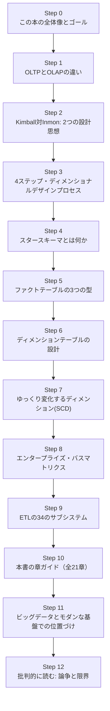
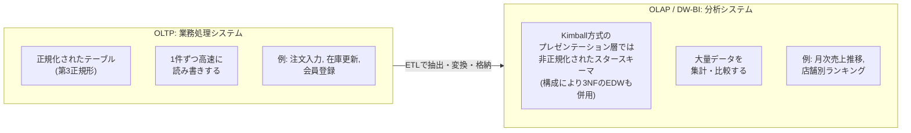
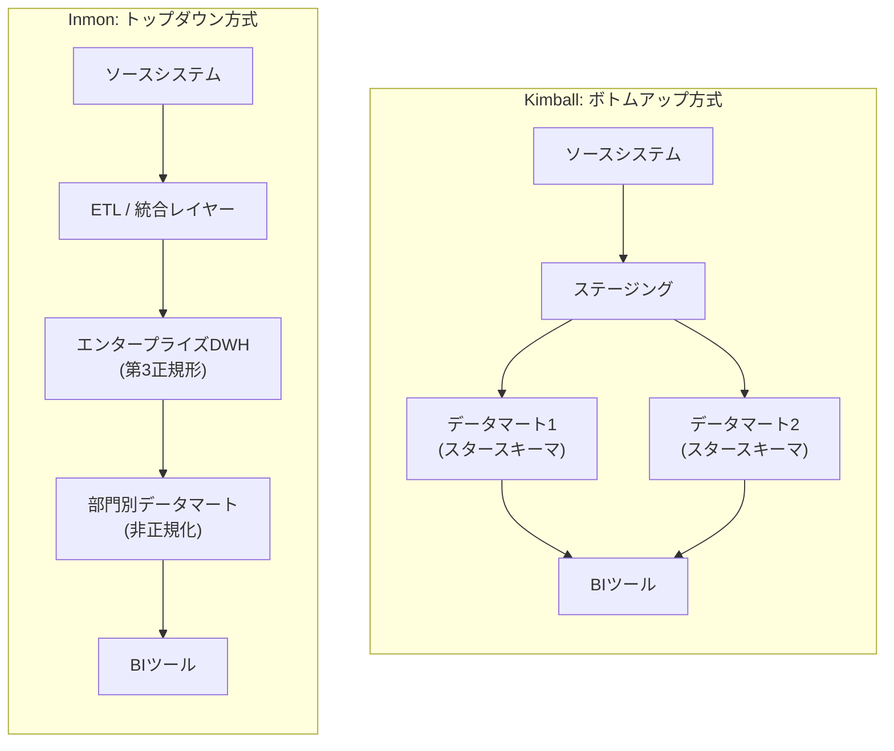
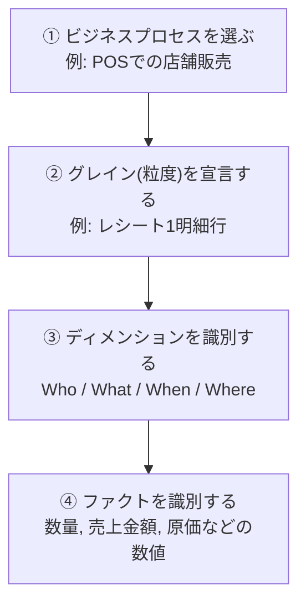
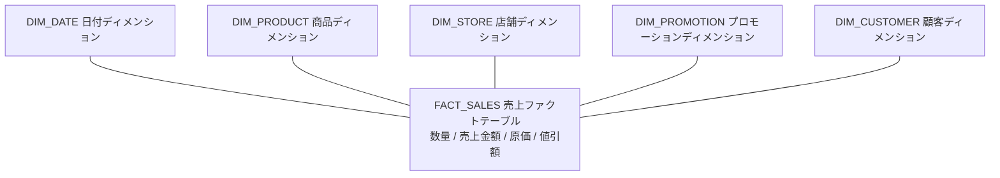
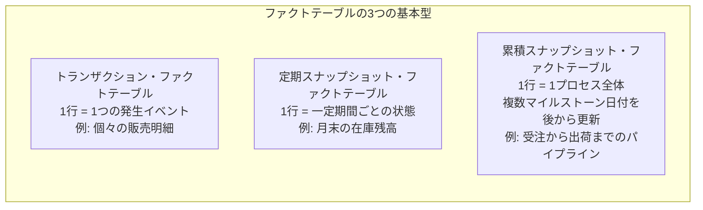
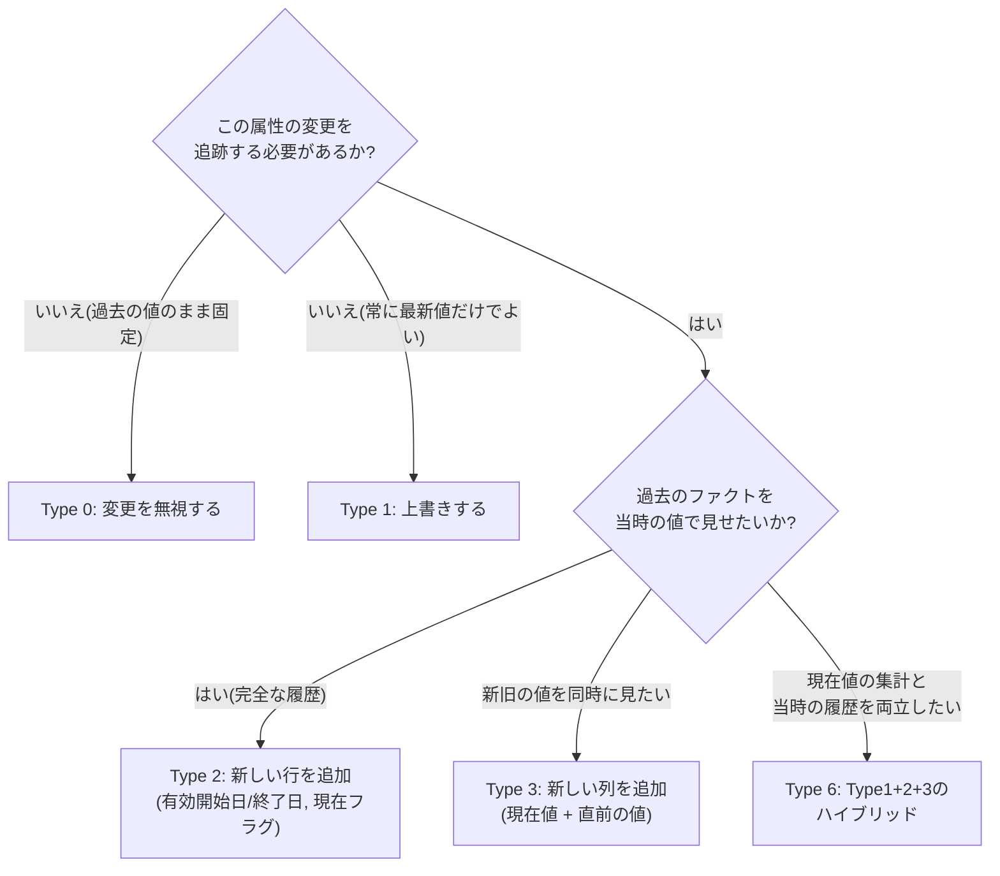
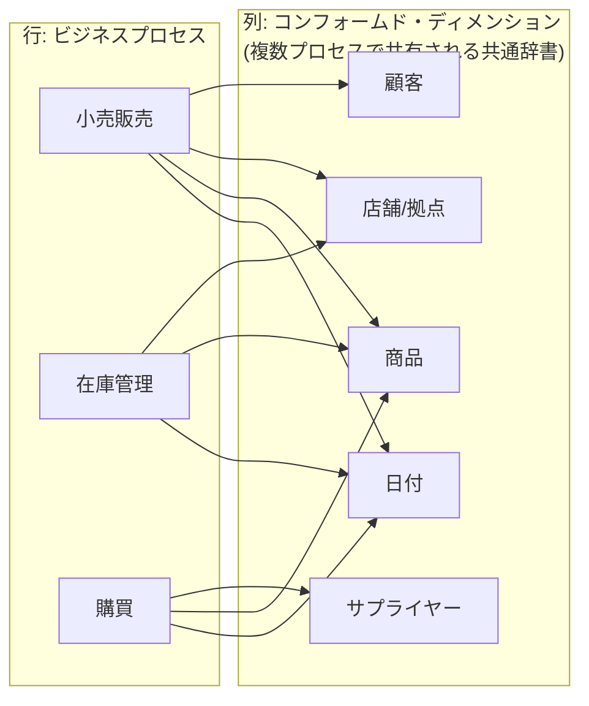
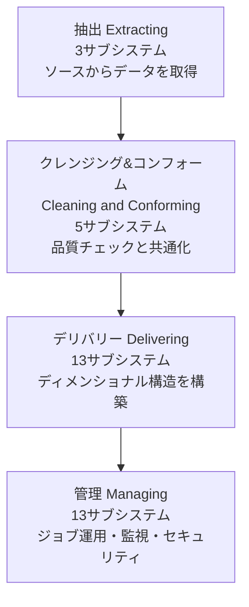
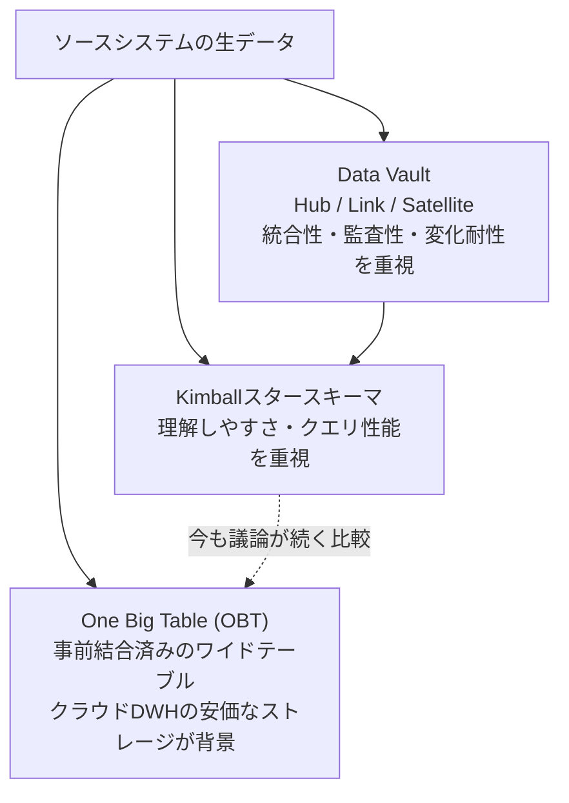

# 『The Data Warehouse Toolkit: The Definitive Guide to Dimensional Modeling』完全読解ガイド

**― ディメンショナルモデリング初学者のためのステップバイステップ解説**

> 原著: Ralph Kimball, Margy Ross 著『The Data Warehouse Toolkit: The Definitive Guide to Dimensional Modeling, 3rd Edition』(Wiley, 2013)
> O'Reilly掲載ページ: https://www.oreilly.com/library/view/the-data-warehouse/9781118530801/
>
> 本ガイドは、データウェアハウス/BI業界で「ディメンショナルモデリングのバイブル」と呼ばれる本書を、初めてデータ基盤設計に触れるエンジニア・アナリスト向けに、著者独自の構成で噛み砕いて解説する非公式の学習補助資料です。原著の文章を転載するものではなく、内容の要点を独自の言葉と図解で再構成したものです。実務で本格的に設計を行う際は、必ず原著（および各種一次情報）を参照してください。

---

## 目次

1. [本書の基本情報](#book-info)
2. [著者について](#authors)
3. [学習ロードマップ](#roadmap)
4. [Step 0: なぜこの本が「定番教科書」なのか](#step0)
5. [Step 1: OLTPとOLAPの違いを理解する](#step1)
6. [Step 2: 2つの設計思想 ── Kimball対Inmon](#step2)
7. [Step 3: 4ステップ・ディメンショナルデザインプロセス](#step3)
8. [Step 4: スタースキーマとは何か](#step4)
9. [Step 5: ファクトテーブルの3つの型](#step5)
10. [Step 6: ディメンションテーブルの設計技法](#step6)
11. [Step 7: ゆっくり変化するディメンション（SCD）](#step7)
12. [Step 8: エンタープライズ・データウェアハウス・バスマトリクス](#step8)
13. [Step 9: ETLの34のサブシステム](#step9)
14. [Step 10: 本書の章ガイド（全21章の早見表）](#step10)
15. [Step 11: ビッグデータ・モダンなクラウド基盤での位置づけ](#step11)
16. [Step 12: 批判的に読む ── 論争と限界](#step12)
17. [学習チェックリスト](#checklist)
18. [用語集](#glossary)
19. [参考文献・出典](#references)

---

<a id="book-info"></a>

## 1. 本書の基本情報

| 項目 | 内容 |
|---|---|
| 原題 | *The Data Warehouse Toolkit: The Definitive Guide to Dimensional Modeling*, 3rd Edition |
| 著者 | Ralph Kimball, Margy Ross |
| 出版社 | Wiley |
| シリーズ初版 | 1996年（『The Data Warehouse Toolkit』第1版） |
| 本ガイドが扱う版 | 第3版（2013年7月刊行） |
| ページ数 | 約600〜624ページ |
| ISBN | 978-1-118-53080-1 |
| 想定読者レベル | Beginner to intermediate（O'Reilly表記） |
| 章構成 | Introduction + 全21章 + Index |
| 関連シリーズ | 『The Data Warehouse Lifecycle Toolkit』『The Data Warehouse ETL Toolkit』『The Kimball Group Reader』 |

第3版は第2版までの内容を大幅に拡張したもので、ETLに関する章が2つ新設され、SCD（ゆっくり変化するディメンション）の技法がType 0〜7まで拡張され、12業界分のバスマトリクス例が収録されるなど、実務向けの「技法の完全な辞典」として再構成されている点が特徴です。

<a id="authors"></a>

## 2. 著者について

**Ralph Kimball** は、スタンフォード大学で電気工学の博士号を取得後、Xerox PARC（パロアルト研究所）に在籍し、マウス・アイコン・ウィンドウを初めて商用製品に搭載した「Xerox Star Workstation」の主任設計者の一人として活躍しました。その後、意思決定支援ソフトウェア企業Metaphor Computer Systemsの副社長を経て、1986年にRed Brick Systemsを創業（CEOは1992年まで）。同社はデータウェアハウス向けに最適化されたリレーショナルデータベースで知られ、ビットマップインデックスによって当時の他製品より大幅に高速な性能を実現していました。その後Kimball Groupを設立し、1982年以降データウェアハウス／BI業界のビジョナリーとして活動を続けています。

**Margy Ross** はKimball Groupの社長であり、Ralph Kimballとの共著者として5冊のToolkitシリーズを執筆。1982年以来30年以上にわたりデータウェアハウス／BI領域に専念してきた人物です。

両者による「Kimball方式（ディメンショナルモデリング）」は、Bill Inmonが提唱する方式と並び、データウェアハウス設計における二大方法論の一つとされています。

<a id="roadmap"></a>

## 3. 学習ロードマップ

本書は「基礎技法 → 業界別ケーススタディ → ライフサイクル／ETL → ビッグデータ」という順に難易度が上がっていく構成になっています。本ガイドでは、その骨格を抜き出して次の順序で学びます。



---

<a id="step0"></a>

## Step 0: なぜこの本が「定番教科書」なのか

Kimballによる最初の『The Data Warehouse Toolkit』は1996年に刊行され、業界にディメンショナルモデリングという考え方を本格的に広めた書籍として位置づけられています。データモデリングの世界的専門メディアでも、この初版は実務で磨かれた豊富な具体例を伴ってOLAP的なモデリング手法を提示した点が高く評価されており、1990年代後半の実案件で「頼りになる一冊」として使われていたという証言も見られます。

第3版（本ガイドが扱う版）では、以下の点が強化されました。

- 新章として「Kimball Dimensional Modeling Techniques Overview（第2章）」が追加され、これまでの技法が体系的に一つの章にまとめられた
- ラグ付きの可変階層や多値属性を扱うためのブリッジテーブルなど、高度なパターンの解説が拡充
- 12業界分のエンタープライズ・バスマトリクス例を収録
- SCD（ゆっくり変化するディメンション）技法がType 0〜7まで拡張
- ビジネス関係者とのコラボレーティブなモデリング設計セッションに関するガイダンスを追加

原著の目次を見ると、Introduction（導入）から始まり、第1〜2章で理論的基礎を、第3〜16章で小売・在庫・調達・受注管理・会計・CRM・人事・金融・通信・運輸・教育・医療・ECommerce・保険という14業界分のケーススタディを、第17〜20章でプロジェクトのライフサイクルとETLシステム構築を、第21章でビッグデータ分析を扱う構成になっています（詳しい章立ては[Step 10](#step10)の早見表を参照）。

---

<a id="step1"></a>

## Step 1: OLTPとOLAPの違いを理解する

ディメンショナルモデリングを理解する第一歩は、「業務システム（OLTP）」と「分析システム（OLAP／DW-BI）」がまったく異なる目的のために設計されるという事実を押さえることです。



| 観点 | OLTP（業務システム） | OLAP / DW-BI（分析システム） |
|---|---|---|
| 目的 | 日々の取引を正確・高速に記録する | 過去〜現在の傾向を分析し意思決定を支援する |
| データ構造 | 正規化（第3正規形が基本） | アーキテクチャによる（Kimball方式のプレゼンテーション層ではディメンショナルモデル〈スタースキーマ〉が一般的） |
| 典型的なクエリ | 特定の1件を高速に検索・更新 | 大量の行を集計・グループ化・比較 |
| 更新頻度 | リアルタイムで頻繁に更新 | バッチ（またはマイクロバッチ）でまとめて反映 |
| 利用者 | アプリケーション、現場担当者 | アナリスト、経営層、BIツール |

Kimballはこの「データ取得の世界」と「データ分析の世界」が根本的に異なるというところから議論を始め、ビジネスユーザーが理解しやすく、かつクエリ性能が高いデータウェアハウスを作るための設計手法としてディメンショナルモデリングを提示しています。原著第1章のタイトルどおり、データ取得（Data Capture）とデータ分析（Data Analysis）は「別世界（Different Worlds）」であるという前提が、本書全体の出発点になっています。

---

<a id="step2"></a>

## Step 2: 2つの設計思想 ── Kimball対Inmon

データウェアハウス設計には歴史的に2つの大きな流派があります。Kimballの「ボトムアップ（dimensional）」方式と、Bill Inmonの「トップダウン（normalized）」方式です。


上図がKimball自身の提唱する「DW/BIアーキテクチャ」です。ソースシステムからバックルームのステージングエリアを経て、プレゼンテーションエリア（ディメンショナルモデルの集合）にデータが格納され、BIアプリケーションから直接アクセスされる、という一気通貫の流れが特徴です。

これに対してInmonは、正規化されたエンタープライズ全体のデータウェアハウス（EDW）をまず構築し、そこから部門ごとのデータマートを派生させるという逆方向のアプローチを取ります。



| 観点 | Kimball（ボトムアップ） | Inmon（トップダウン） |
|---|---|---|
| 出発点 | 個々のビジネスプロセス（データマート） | 企業全体のデータモデル（EDW） |
| データ構造 | ディメンショナルモデル（スタースキーマ／スノーフレークスキーマ） | 正規化モデル（第3正規形が基本） |
| 初期投資と着手までの速さ | 比較的早く価値を出しやすい | 全体設計に時間がかかりやすい |
| データの一貫性 | コンフォームド・ディメンションで担保する必要がある | 中央のEDWが単一の真実の源になりやすい |
| 分析ツールからの直接アクセス | ディメンショナルモデルへ直接アクセス可能 | データマート経由でのアクセスが基本 |

なお、両者に加えて、2000年代にDan Linstedtが提唱した「Data Vault」という第3の方法論も存在します。Data Vaultは、監査性と変更への耐性を重視し、Hub（ビジネスキー）・Link（関係）・Satellite（属性の履歴）という3種類のテーブルで構成される、ソースシステムの変化に強い統合レイヤーを提供する手法です。Data Vaultについては[Step 11](#step11)で改めて取り上げます。

> **初学者向けメモ**: 現場では「Kimball方式かInmon方式か」という二者択一ではなく、両者のアイデアを組み合わせたハイブリッドな設計（例: Data VaultやEDWの上にKimball流のデータマートを構築する）もよく採用されます。本書はあくまで「ディメンショナルモデリングという技法そのもの」を深掘りする一冊であり、アーキテクチャ全体の選定論争に深入りする本ではない点は覚えておくとよいでしょう。

---

<a id="step3"></a>

## Step 3: 4ステップ・ディメンショナルデザインプロセス

本書全体を貫く最も重要な方法論が、この「4ステップ・ディメンショナルデザインプロセス」です。原著第3章（小売販売のケーススタディ）で初めて登場し、以降のすべての業界別ケーススタディで繰り返し適用されます。



### ① ビジネスプロセスを選ぶ

部署や機能単位ではなく、「発注」「販売」「出荷」「請求」のような、計測可能なオペレーション上のイベントを選びます。最初に着手するモデルは、最もインパクトが大きく、最も重要なビジネス課題に答えられ、かつデータ抽出が現実的に可能なものを選ぶべきだとされています。

### ② グレイン（粒度）を宣言する

Kimball Groupが公開している設計ノウハウ集（Design Tip）の中でも、この「グレイン宣言」は特に重要視されています。何千件もの受講者の設計をレビューしてきた経験から、最も頻繁に発生する設計ミスは「ファクトテーブルのグレインを設計の最初に明確化していないこと」だと述べられています。グレインが曖昧なままだと、設計全体が不安定な土台の上に立つことになり、どのディメンションを採用すべきかの議論が堂々巡りになったり、本来含めるべきでない粒度のファクトが紛れ込んだりする原因になります。

グレイン宣言は「ファクトテーブルの主キーを列挙すること」ではなく、「ファクトテーブルの1行が何を表すか」をビジネス用語で正確に言い表すことだと強調されています。例えば、次のような宣言が挙げられます。

- 小売店のレシート上の個々の明細行（スキャナーで記録された単位）
- 保険契約に対する個々のトランザクション
- 医師からの請求書の1明細行
- 航空機の搭乗券1枚

グレインをまずビジネス的な言葉で確定させ、そのあとで初めて「どのディメンションが妥当か」が自然と決まってくる、という順序が重要だとされています。Kimball Group自身も、グレイン宣言は設計全体を拘束する「契約」であり、ディメンションやファクトを選ぶより前に確定させなければならない、と説明しています。特に強調されるのが「アトミック・グレイン（atomic grain）」、つまりビジネスプロセスが捕捉できる最も細かい粒度からモデリングを始めるべきだという考え方で、これにより後から発生する予測不能なアドホッククエリにも耐えられる設計になるとされています。

### ③ ディメンションを識別する

グレインが確定したら、そのファクトテーブルの各行を「説明」するディメンションを列挙します。ディメンションは基本的に Who（誰が）・What（何を）・When（いつ）・Where（どこで）に答えるためのテーブルです。小売販売の例では、日付・商品・店舗・プロモーションなどが典型的なディメンションになります。

### ④ ファクトを識別する

最後に、そのグレインにおいて計測可能な数値（売上金額、数量、原価など）を洗い出します。ファクトはできる限り加算可能（additive）であることが望ましいとされます（詳細は[Step 5](#step5)）。

---

<a id="step4"></a>

## Step 4: スタースキーマとは何か

4ステップ・プロセスの成果物として組み立てられるのが「スタースキーマ」です。中心に1つのファクトテーブルを置き、それを複数のディメンションテーブルが取り囲む形をとります。



Wikipediaのスタースキーマ解説でも触れられているとおり、ファクトテーブルは基本的に数値と、説明情報を持つディメンションへの外部キーで構成され、非常に細かい粒度（グレイン）でイベントを記録できるよう設計されます。

### サロゲートキー（surrogate key）とナチュラルキー

ディメンションテーブルの主キーには、ソースシステム由来の自然キー（例: 商品コード）をそのまま使うのではなく、データウェアハウス側で独自に発番する「サロゲートキー」（単純な連番の整数など）を使うのが定石です。理由は主に次の2つです。

1. ソースシステムが同じ自然キーを再利用したり、体系を変更したりしても影響を受けない
2. SCD Type 2（[Step 7](#step7)参照）で同じ商品の「バージョン違い」を複数行として保持できるようになる

### 簡易的なDDLイメージ

```sql
-- ディメンションテーブル（サロゲートキーが主キー）
CREATE TABLE dim_product (
    product_key      INT PRIMARY KEY,   -- サロゲートキー
    product_id       VARCHAR(20),       -- ソースシステムの自然キー
    product_name     VARCHAR(200),
    category         VARCHAR(100),
    brand            VARCHAR(100),
    effective_date   DATE,
    expiration_date  DATE,
    is_current       BOOLEAN
);

-- ファクトテーブル（ディメンションへの外部キー + 数値）
CREATE TABLE fact_sales (
    date_key         INT REFERENCES dim_date(date_key),
    product_key      INT REFERENCES dim_product(product_key),
    store_key        INT REFERENCES dim_store(store_key),
    promotion_key    INT REFERENCES dim_promotion(promotion_key),
    sales_quantity   INT,
    sales_dollar_amt DECIMAL(12,2),
    cost_dollar_amt  DECIMAL(12,2)
);
```

### なぜ正規化（スノーフレーク化）を避けるのか

原著第3章には「Resisting Normalization Urges（正規化したくなる衝動に抗う）」という節があります。OLTP出身のエンジニアは、ディメンションテーブルの中の階層（例: 商品 → サブカテゴリ → カテゴリ）を見ると、つい正規化して複数テーブルに分割したくなります。しかし本書はこれを「スノーフレーキング」と呼び、基本的には推奨していません。ストレージの節約効果はごくわずかである一方、ビジネスユーザーにとってJOINの数が増えて理解しにくくなり、クエリ性能も低下しやすいためです。非常に巨大なディメンション（数千万行規模など）で明確な必要がある場合に限り、部分的なスノーフレーク化を検討する、というスタンスです。

---

<a id="step5"></a>

## Step 5: ファクトテーブルの3つの型

Kimball Groupは、実務上ほぼすべてのファクトテーブルが次の3つの型のいずれかに分類できると説明しています。



| 型 | グレイン | 特徴 | 代表例 |
|---|---|---|---|
| トランザクション・ファクトテーブル | 1行 = 発生した1つのイベント | 最も一般的で「主力」となる型。行は基本的に追記のみ | POSの販売明細、Webサイトのクリックイベント |
| 定期スナップショット・ファクトテーブル | 1行 = 特定の期間（日次・週次・月次）ごとのスナップショット | トランザクション系のデータに依存して生成されることが多い | 月末時点の口座残高、週次の在庫水準 |
| 累積スナップショット・ファクトテーブル | 1行 = プロセス全体（開始から終了まで） | 明確な開始と終了を持つプロセスに使う。複数のマイルストーン日付列を持ち、進捗に応じて同じ行を繰り返し更新する。未確定の日付を表すため、日付ディメンションには「不明」を表すプレースホルダー行を用意しておく必要がある | 注文から出荷・請求・入金までのパイプライン、大学の入学から卒業までの過程 |

データモデリングに関する解説記事でも、この3分類はKimball流ディメンショナルモデリングの基本要素として、長年ほぼ変わらずに使われ続けていると指摘されています。

### 加算可能性（additive）という考え方

ファクト（数値列）は「加算可能（additive）」「準加算可能（semi-additive）」「非加算（non-additive）」の3種類に分類されます。

- **加算可能**: すべてのディメンションにわたって単純に合計してよい（例: 売上金額、販売数量）
- **準加算可能**: 一部のディメンションについては合計できるが、時間軸については合計できない（例: 口座残高は店舗をまたいで合計できるが、月をまたいで合計すると意味を成さない）
- **非加算**: 単純な合計に意味がない（例: 単価、比率）。この場合は平均などの別の集計方法が必要

### ファクトレス・ファクトテーブル

原著第3章では「ファクトレス・ファクトテーブル」も紹介されています。数値のファクトを一切持たず、複数のディメンションキーの組み合わせだけで「何かが発生した」という事実、または「あるディメンションの組み合わせがカバー範囲として存在する」という事実を記録するテーブルです（例: 学生の出席記録、店舗と商品の取扱可否の組み合わせ）。

---

<a id="step6"></a>

## Step 6: ディメンションテーブルの設計技法

ディメンションテーブルは「ビジネスユーザーが理解しやすい説明的な属性」を持つテーブルです。本書第2章では、次のような設計技法が体系的に整理されています。

| 技法 | 説明 |
|---|---|
| コンフォームド・ディメンション（Conformed Dimension） | 複数のビジネスプロセス（複数のファクトテーブル）で共通利用される、統一された定義・粒度・キーを持つディメンション。企業全体でデータを串刺し分析するための土台になる |
| 縮退ディメンション（Degenerate Dimension） | ディメンションテーブルを別途持たず、ファクトテーブルの中にそのまま残す識別子（例: 伝票番号・注文番号）。実質的な属性を持たないため独立テーブル化する意味が薄い |
| ジャンク・ディメンション（Junk Dimension） | 個別には小さすぎたり関連が薄かったりするフラグ・インジケータ類（Yes/Noフラグなど）をまとめて1つのディメンションに格納したもの |
| ロールプレイング・ディメンション（Role-Playing Dimension） | 同じディメンション（例: 日付）を、注文日・出荷日・請求日のように複数の異なる役割でファクトテーブルから参照する手法。物理的にはビューなどで別名を与えて扱う |
| アウトリガー（Outrigger） | あるディメンションテーブルの中に、さらに別の小さなディメンションへの外部キーを持たせる構造。多用は避けるべきとされる |
| ブリッジテーブル（Bridge Table） | 1つのファクト行が複数のディメンション値（多値属性）や可変長の階層（ラグ付き階層）と関連する場合に使う中間テーブル。第3版で拡充されたトピックの一つ |
| ディメンション階層（Hierarchy） | 商品 → サブカテゴリ → カテゴリのような、ドリルダウン／ロールアップに使う階層構造をディメンションテーブルの属性列として素直に持たせる |
| ミニディメンション（Mini-Dimension） | 頻繁に変化する属性群を、巨大な親ディメンションから切り出して別テーブル化したもの。SCD Type 4で用いられる |

---

<a id="step7"></a>

## Step 7: ゆっくり変化するディメンション（SCD）

初学者が最もつまずきやすく、同時に本書で最も重要なトピックの一つが「Slowly Changing Dimension（SCD）」です。ディメンションの属性（例: 顧客の住所、商品のカテゴリ）は本来「ゆっくり」であっても変化するため、その変化をどう扱うかを設計時に決めておく必要があります。

Kimballはこの概念を1996年の初版で導入しました。第3版ではType 1〜3の基本技法に加え、Type 0・4・5・6・7が体系的に整理されています。



| Type | 挙動 | メリット | デメリット・注意点 |
|---|---|---|---|
| Type 0 | 属性値を初期値のまま固定し、以降の変更を無視する | 実装が最も単純 | 生年月日など「本来変わらないはずの値」以外には不向き |
| Type 1（上書き） | 古い値を新しい値で単純に上書きする | 実装が簡単。常に最新の状態で分析できる | 過去のファクトも「今の属性」で見えてしまい、履歴上の正確さが失われる |
| Type 2（行追加） | 変更のたびに新しいサロゲートキーを持つ行を追加し、有効開始日・終了日・現在フラグを持たせる | 完全な履歴を保持でき、当時の状態でファクトを分析できる | ディメンションの行数が増える。ファクトテーブルとのJOINキー管理が複雑になる |
| Type 3（列追加） | 「現在の値」列と「直前の値」列を両方持つ | 新旧どちらの切り口でも分析できる | 2値までしか保持できず、頻繁な変更には向かない。利用頻度は低い技法とされる |
| Type 4（ミニディメンション追加） | 頻繁に変化する属性群（年齢帯・所得帯・与信スコア帯など）を主ディメンションから切り出してミニディメンションとし、ファクトテーブルは主ディメンションとミニディメンションの両方のキーを持つ | 主ディメンションでType 2の行が急増するのを防ぎつつ、ファクト発生時点の属性プロファイルで分析できる | ミニディメンションの属性は値を帯（バンド）に丸める必要があり、ファクトを経由しないと主ディメンションとミニディメンションの現在の対応が分からない |
| Type 5（4+1） | Type 4のミニディメンションに加え、主ディメンションにも「現在のミニディメンション」へのキーをType 1（上書き）で持たせる（アウトリガー） | ファクトを経由せずに、顧客などの現在のプロファイルで集計できる | 現在のキーを上書きするETLが追加で必要になり、設計・運用がやや複雑 |
| Type 6（1+2+3のハイブリッド） | Type 2で履歴行を追加しつつ、Type 1的な「現在値」列とType 3的な「直前値」列も同時に持つ | 履歴分析と最新値分析を1つのテーブルで両立できる | 設計・ETLロジックが最も複雑 |
| Type 7（デュアルキー） | Type 6と同等の機能を、物理的な列上書きではなく、履歴行ごとのType 2サロゲートキーと、履歴をまたいで同一エンティティを識別する恒久キー（durable key）の2種類をファクトに持たせて使い分けて実現する（自然キーは不変である場合に限り恒久キーとして使える） | Type 6より実装がシンプルになるケースがある | やはり相応の設計スキルが必要 |

Kimball Group自身のDesign Tip記事によれば、Type 1（上書き）・Type 2（行追加）・Type 3（列追加）という3つの基本技法だけでは対応しきれない、より高度で複雑な実務要件に応えるために、Type 0・4・5・6・7というより発展的な技法が整理されたという経緯があります。また、Kimball自身とMargy Rossが1990年代から2000年代に執筆した記事では、Type 1は主に「データの訂正」に適した技法であり、Type 2では変更のたびに新しいサロゲートキーを持つ行が追加され、旧行・新行の両方が自然キー（または恒久的な識別子）、最新行フラグ、有効開始日・終了日を属性として持つという設計が説明されています。

なお、実務でよく使われるのはType 0・1・2の3つで、Type 3以降はかなり限定的な場面でのみ使われるという指摘もあります。特にType 5については、業界内で厳密に合意された定義が存在するわけではない点に注意が必要です。

### 具体例で見るSCD Type 2

顧客が転居した場合の`DIM_CUSTOMER`テーブルの変化を、SCD Type 2で表現すると次のようになります。

| customer_key（サロゲートキー） | customer_id（自然キー） | customer_name | city | is_current | effective_date | expiration_date |
|---|---|---|---|---|---|---|
| 1001 | C-500 | 田中太郎 | 大阪市 | false | 2022-01-01 | 2026-03-14 |
| 1002 | C-500 | 田中太郎 | 東京都 | true | 2026-03-15 | 9999-12-31 |

`customer_key = 1001` を参照している過去のファクト行は引き続き「大阪市」の田中太郎として分析され、転居後のファクト行は新しいサロゲートキー`1002`（東京都）を参照します。これにより「当時どこに住んでいた顧客が、どこでどれだけ購入していたか」という履歴が正しく保たれます。

---

<a id="step8"></a>

## Step 8: エンタープライズ・データウェアハウス・バスマトリクス

複数のビジネスプロセス（複数のデータマート）を段階的に構築していく際、Kimball方式で全体の一貫性を保つための設計図が「エンタープライズ・データウェアハウス・バスマトリクス」です。原著第4章（在庫）で初めて本格的に導入される概念で、第3版では12業界分の具体例が収録されています。



バスマトリクスは、行にビジネスプロセス（＝将来のファクトテーブル候補）、列にコンフォームド・ディメンションを配置し、交点に「そのプロセスがそのディメンションを使うかどうか」を印で示す一覧表です。実際の表は次のようなイメージになります。

| ビジネスプロセス ＼ ディメンション | 日付 | 商品 | 店舗/拠点 | サプライヤー | 顧客 |
|---|:---:|:---:|:---:|:---:|:---:|
| 小売販売 | ✕ | ✕ | ✕ | | ✕ |
| 在庫管理 | ✕ | ✕ | ✕ | | |
| 購買（調達） | ✕ | ✕ | | ✕ | |

この一覧表を作る狙いは、個々のデータマートをバラバラに作ってしまい、後から「店舗ディメンションの定義がマートごとに違う」といった不整合が生じるのを防ぐことにあります。コンフォームド・ディメンションとは、複数のファクトテーブルで共通のキー・粒度・属性定義を持つディメンションのことで、これにより異なるビジネスプロセス間でのドリルアクロス（串刺し集計）が可能になります。

バスマトリクスは、いきなり企業全体のモデルを作ろうとするInmon流の「一枚岩」アプローチとは異なり、「各データマートは段階的に構築しつつ、全体としては整合性を保つ」というKimball方式の中核をなす仕組みだと言えます。

---

<a id="step9"></a>

## Step 9: ETLの34のサブシステム

原著第19〜20章では、ディメンショナルモデルにデータを供給する「バックルーム（ETLシステム）」の設計が扱われます。Kimball Groupは、数百件の成功したデータウェアハウス事例の研究から、ETLアーキテクチャに共通して必要となる要素を34個のサブシステムとして整理しました。



| グループ | サブシステム数 | 主な内容 |
|---|:---:|---|
| 抽出（Extracting） | 3 | ソースシステムの理解、データ抽出、変更データの検知など、ETLシステムがソースシステムから独立して動作できるようにするための入口部分 |
| クレンジング＆コンフォーム（Cleaning and Conforming） | 5 | データ品質チェック、エラーイベントの記録、コンフォームド・ディメンション／コンフォームド・ファクトへの整形 |
| デリバリー（Delivering） | 13 | SCDの実装、サロゲートキー生成、ファクトテーブルのロード、階層管理など、最終的なディメンショナル構造を組み立てる中核部分 |
| 管理（Managing） | 13 | ジョブスケジューリング、バックアップ・リカバリ、セキュリティ、メタデータ管理など、ETL環境全体を運用するための仕組み |

「ETL」という4文字は世間に広く浸透していますが、実際には「Extracting（抽出）」「Cleaning and Conforming（クレンジングとコンフォーム）」「Delivering（デリバリー）」「Managing（管理）」という4つの大きな工程から構成される、という整理がなされています。初学者がまず押さえておくべきポイントは、ETLは単なる「抽出・変換・ロード」という3語で片付けられるものではなく、SCDの実装やサロゲートキーの採番、ジョブの監視・リカバリまで含む、相応の規模を持つシステムだという認識です。

---

<a id="step10"></a>

## Step 10: 本書の章ガイド（全21章の早見表）

本書は第3〜16章にかけて、業界別のケーススタディを通じて技法を1つずつ積み上げていく構成になっています。実際に原著を読み進める際のロードマップとして、O'Reillyの目次情報をもとに全21章を一覧化しました。

| 章 | タイトル | 学べる主な技法 |
|---|---|---|
| 1 | Data Warehousing, Business Intelligence, and Dimensional Modeling Primer | DW/BIの目的、Kimballのアーキテクチャ、ディメンショナルモデリングにまつわる誤解の解消 |
| 2 | Kimball Dimensional Modeling Techniques Overview | 基本〜高度な技法の全体マップ（第3版で新設） |
| 3 | Retail Sales | 4ステップ・デザインプロセス、スタースキーマの基礎、ファクトレス・ファクトテーブル |
| 4 | Inventory | ファクトテーブルの3類型、バリューチェーン統合、バスマトリクス |
| 5 | Procurement | SCDの基礎（Type 1〜3）とハイブリッドSCD技法 |
| 6 | Order Management | 累積スナップショット・ファクトテーブル、受注と請求の関係 |
| 7 | Accounting | 総勘定元帳データ、予算プロセス、コンソリデート・ファクトテーブル |
| 8 | Customer Relationship Management | 多値ディメンションのためのブリッジテーブル、複雑な顧客行動のモデリング |
| 9 | Human Resources Management | 再帰的な従業員階層、多値スキルキーワード属性 |
| 10 | Financial Services | ディメンション・トリアージ、スーパータイプ／サブタイプ・スキーマ |
| 11 | Telecommunications | 設計レビューの進め方、既存データ構造のリモデリング |
| 12 | Transportation | 相関の強いディメンションの統合、日付・時刻の扱い |
| 13 | Education | 累積スナップショット、ファクトレス・ファクトテーブルの応用 |
| 14 | Healthcare | 請求と支払い、電子カルテ、遡及的な変更への対応 |
| 15 | Electronic Commerce | クリックストリームのモデリング、チャネル横断の収益性分析 |
| 16 | Insurance | ポリシー／クレームのトランザクションとスナップショット、よくある設計ミスの総まとめ |
| 17 | Kimball DW/BI Lifecycle Overview | プロジェクトのライフサイクル全体像、よくある落とし穴 |
| 18 | Dimensional Modeling Process and Tasks | モデリングプロジェクトの進め方、チーム編成 |
| 19 | ETL Subsystems and Techniques | 34のETLサブシステムの詳細（[Step 9](#step9)参照） |
| 20 | ETL System Design and Development Process and Tasks | ETL計画、初回ロードと増分ロード、リアルタイム対応 |
| 21 | Big Data Analytics | ビッグデータ時代におけるディメンショナルモデリングの位置づけ |

---

<a id="step11"></a>

## Step 11: ビッグデータ・モダンなクラウド基盤での位置づけ

本書第3版は2013年の刊行であり、Snowflake・BigQuery・Databricksのような現代的なクラウド型データウェアハウス／レイクハウスや、dbtに代表されるELT主導のモダンデータスタックが本格的に普及する以前に書かれています。そのため「2013年の技法が2026年の基盤でもそのまま通用するのか」という問いは、業界で継続的に議論されてきたテーマです。



### 「One Big Table（OBT）」派の主張

2020年のCoalesceカンファレンスで、dbt Labsコミュニティに向けた講演の中でDave Fowler氏は、Kimballが提唱したディメンショナルモデリングとスタースキーマは、モダンデータスタックの文脈では「害の方が大きい」とまで表現し、その有効性に疑問を投げかけました。この主張の背景には、クラウドの列指向データウェアハウスにおいてはストレージコストが劇的に下がり、Kimballが本を書いた当時ほど非正規化のコストメリットが大きくないという事情があります。この講演に対して、Brooklyn Data Co.のJosh Devlin氏とSydney Burns氏は同じCoalesceの場で「Kimball方式を丸ごと捨てるのではなく、モダンな時代に合わせてアップデートして活かすべきだ」という反論を展開しました。

### Dimension Snapshot（Functional Data Engineering）という第三の道

Facebook・Airbnb・Lyftなどで採用されてきたアプローチとして、Airflow・Supersetの生みの親として知られるMaxime Beauchemin氏（当時Lyftのシニアデータエンジニア）が2018年のData Council講演、および著名な技術ブログ記事「Functional Data Engineering」で提唱したのが「ディメンション・スナップショット」という手法です。日次・週次でディメンション全体をまるごと新しいテーブルパーティションとして追記していくことで、SCD特有の複雑なUPSERTロジックを回避するという考え方で、同氏は「コンピュートは安い。ストレージは安い。エンジニアの時間は高い」という言葉でこの発想を説明しています。ディメンションデータはファクトデータに比べて小規模であることが多く、10年分を日次スナップショットしても現代のデータウェアハウスにとっては軽微なコストで済む、という考え方です。

このアプローチはKimball流のSCD技法そのものを置き換えるものというより、「べき等で再現可能なバッチ処理」という関数型データエンジニアリングの原則のもとで、SCDが解決しようとしていた問題（履歴の保持）を別の実装方法で解決するものだと整理されています。

### それでも色褪せないKimballの基礎

一方で、Kimballの提唱したスタースキーマ、非正規化されたデータの活用、ファクトテーブルとディメンションテーブルという分割そのものは、分析ワークロードのモデリング手法として時代を超えて強力であるという評価も根強くあります。実際、dbtの公式ドキュメントの用語集でも、ディメンショナルモデリングの4ステップ設計プロセス（ビジネスプロセスの選定→グレイン宣言→ディメンション識別→ファクト識別）は、現代においても変わらず「公式な」設計プロセスとして紹介されています。

さらに、dbtと組み合わせることで、ディメンショナルモデリングの持つ「わかりやすさ」を活かしつつ、変換ロジックのテストやバージョン管理をモダンな開発ワークフローに載せられるという実践例も、欧州のコンサルティング企業のブログなどで紹介されています。

また、Data Vaultは大規模で複雑なソースシステムを持ち、厳格な監査要件がある大企業・金融機関・政府機関などで、Kimball方式を置き換えるというより「補完する」統合レイヤーとして採用される場面が多いとされています。

---

<a id="step12"></a>

## Step 12: 批判的に読む ── 論争と限界

初学者であっても、本書を「唯一絶対の正解」として鵜呑みにするのではなく、以下のような批判・限界を踏まえたうえで学ぶことが望ましいと考えられます。

### 1. 非正規化のコストメリット前提が薄れつつある

本書のスタースキーマ推奨は、「非正規化によってJOINを減らし、クエリを高速化する」という前提に強く支えられています。しかし列指向のクラウドデータウェアハウスでは、圧縮効率や自動最適化の進化により、正規化度合いが多少高くても十分な性能が出るケースが増えており、[Step 11](#step11)で紹介した「One Big Table」派の主張の背景にもなっています。

### 2. データ冗長性と「単一の真実の源」の欠如

Kimball方式は個々のデータマート単位でディメンションを非正規化して保持するため、コンフォームド・ディメンションの運用を徹底しないと、データの重複や、企業全体で見たときの「単一の真実の源（Single Source of Truth）」の欠如につながりやすいという指摘があります。これはInmon方式支持者からよく挙げられる批判点です。

### 3. 変化への柔軟性

ボトムアップで積み上げていくKimball方式は、ある業務領域に最適化された構造になりやすい分、事業構造や組織構造が大きく変わった際に、既存のスタースキーマの改修コストが高くなりやすいという指摘もあります。ソースシステムの変化が非常に激しい大企業では、この点がData Vaultのような別方式が選ばれる理由の一つになっています。

### 4. 刊行時期による技術的な前提の古さ

第3版は2013年刊行であり、当時主流だったオンプレミスのMPP型データウェアハウス（Teradata、Netezzaなど）を念頭に置いた記述が多く含まれます。クラウドの分離型ストレージ・コンピュートアーキテクチャ、リアルタイムのストリーミング処理基盤、セマンティックレイヤー／メトリクスレイヤーといった、2020年代以降に一般化した技術要素については当然ながら扱われていません。

### 5. それでも本書が読まれ続ける理由

上記の批判はいずれも「物理的な実装方法」に関するものが中心であり、「グレインを明確にする」「ファクトとディメンションを分離して考える」「コンフォームド・ディメンションで全社的な一貫性を保つ」といった、Kimballが確立した**概念的な語彙とフレームワーク**そのものは、実装技術が変わった現在でも業界標準の共通言語として使われ続けています。dbtやSnowflakeなど、本書刊行後に登場したモダンなツール群のドキュメントや講演でも、Kimballの用語（グレイン、コンフォームド・ディメンション、SCDなど）がそのまま前提知識として使われていることからも、この点はうかがえます。

> **読み方のアドバイス**: 本書を「物理設計のマニュアル」としてではなく、「分析用データをどう概念化するか」という思考のフレームワークとして読むと、クラウド時代の今でも十分に得るものが大きい一冊だと言えます。実際の物理実装（パーティション戦略、マテリアライズドビュー、ディメンション・スナップショットの採用可否など）は、利用しているプラットフォームの特性に応じて別途検討するとよいでしょう。

---

<a id="checklist"></a>

## 学習チェックリスト

- [ ] OLTPとOLAPの違いを、自分の言葉で説明できる
- [ ] KimballとInmonのアーキテクチャの違いを説明できる
- [ ] 4ステップ・ディメンショナルデザインプロセスを、実際の業務プロセスに当てはめて実践できる
- [ ] 「グレインを宣言する」ことの重要性を理解し、自分が扱うデータのグレインを一文で言い表せる
- [ ] スタースキーマにおけるファクトテーブルとディメンションテーブルの役割の違いを説明できる
- [ ] サロゲートキーを使う理由を2つ以上挙げられる
- [ ] ファクトテーブルの3類型（トランザクション／定期スナップショット／累積スナップショット）を区別できる
- [ ] 加算可能・準加算可能・非加算の違いを説明できる
- [ ] SCD Type 0・1・2・3の違いを、具体例つきで説明できる
- [ ] コンフォームド・ディメンションとバスマトリクスの役割を説明できる
- [ ] ETLが「抽出・クレンジング＆コンフォーム・デリバリー・管理」の4工程からなることを理解している
- [ ] モダンなクラウドDWHの文脈で、Kimball方式に対する主な批判・代替案（OBT、ディメンション・スナップショット、Data Vault）を最低1つずつ説明できる

---

<a id="glossary"></a>

## 用語集

| 用語 | 説明 |
|---|---|
| ディメンショナルモデリング | 分析用途に最適化された、ファクトテーブルとディメンションテーブルによるデータモデリング手法 |
| スタースキーマ | 中心の1つのファクトテーブルを複数のディメンションテーブルが取り囲む構造 |
| スノーフレークスキーマ | ディメンションをさらに正規化して複数テーブルに分割した構造 |
| ファクトテーブル | 業務プロセスの測定イベントを記録するテーブル。通常は数値の測定値（ファクト）とディメンションへの外部キーを持つが、数値のファクトを持たないファクトレス・ファクトテーブルも存在する |
| ディメンションテーブル | 説明的な属性（Who/What/When/Where）を持つテーブル |
| グレイン（粒度） | ファクトテーブルの1行が表す内容の定義 |
| サロゲートキー | データウェアハウス側で独自に発番される、意味を持たない代理キー |
| コンフォームド・ディメンション | 複数のビジネスプロセスで共有される、統一定義のディメンション |
| 縮退ディメンション | 独立したテーブルを持たず、ファクトテーブルに直接残される識別子 |
| ジャンク・ディメンション | 小規模なフラグ・インジケータ類をまとめたディメンション |
| ロールプレイング・ディメンション | 同一ディメンションを複数の役割で参照する手法 |
| ブリッジテーブル | 多値属性や可変階層を扱うための中間テーブル |
| SCD（ゆっくり変化するディメンション） | ディメンション属性の変化をどう扱うかを定めた一連の技法（Type 0〜7） |
| バスマトリクス | ビジネスプロセスとコンフォームド・ディメンションの対応関係を示す一覧表 |
| 34のETLサブシステム | Kimball Groupが整理した、ETLアーキテクチャに共通する34の構成要素 |
| One Big Table（OBT） | 複数のディメンションをあらかじめ結合してしまう、ワイドなテーブル設計の考え方 |
| Data Vault | Hub／Link／Satelliteの3テーブルで構成される、統合性・監査性重視の代替的モデリング手法 |

---

<a id="references"></a>

## 参考文献・出典

原則としてKimball Group公式情報を一次情報とし、加えて国際的に著名なデータエンジニア・企業ブログによる解説・議論を参照しています（アクセス日: 2026年9月）。

| No. | ソース | タイトル・内容 | URL |
|---|---|---|---|
| 1 | O'Reilly（本書掲載元） | The Data Warehouse Toolkit, 3rd Edition ― 目次・書誌情報 | https://www.oreilly.com/library/view/the-data-warehouse/9781118530801/ |
| 2 | Kimball Group（公式） | 書籍紹介ページ、第3版の変更点 | https://www.kimballgroup.com/data-warehouse-business-intelligence-resources/books/data-warehouse-dw-toolkit/ |
| 3 | Wiley（出版社公式） | 書籍紹介ページ | https://www.wiley.com/en-us/The+Data+Warehouse+Toolkit:+The+Definitive+Guide+to+Dimensional+Modeling,+3rd+Edition-p-9781118530801 |
| 4 | Kimball Group（公式Design Tip） | グレイン宣言の重要性（Design Tip） | https://www.kimballgroup.com/data-warehouse-business-intelligence-resources/kimball-techniques/dimensional-modeling-techniques/grain/ |
| 5 | Kimball Group（公式Design Tip #152） | Slowly Changing Dimension Types 0, 4, 5, 6, 7 | https://www.kimballgroup.com/2013/02/design-tip-152-slowly-changing-dimension-types-0-4-5-6-7/ |
| 6 | InformationWeek（Kimball & Ross 寄稿） | Slowly Changing Dimensions Are Not Always as Easy as 1, 2, 3 | https://www.informationweek.com/data-management/slowly-changing-dimensions-are-not-always-as-easy-as-1-2-3 |
| 7 | Kimball Group（公式） | The 34 Subsystems of ETL | https://www.kimballgroup.com/data-warehouse-business-intelligence-resources/kimball-techniques/etl-architecture-34-subsystems/ |
| 8 | Kimball Group（公式） | Fact Table Core Concepts カテゴリページ | https://www.kimballgroup.com/category/fact-table-core-concepts/ |
| 9 | Wikipedia | Ralph Kimball（経歴） | https://en.wikipedia.org/wiki/Ralph_Kimball |
| 10 | Wikipedia | Star schema | https://en.wikipedia.org/wiki/Star_schema |
| 11 | Wikipedia | Fact table | https://en.wikipedia.org/wiki/Fact_table |
| 12 | Wikipedia | Slowly changing dimension | https://en.wikipedia.org/wiki/Slowly_changing_dimension |
| 13 | Wikipedia | Dimensional modeling | https://en.wikipedia.org/wiki/Dimensional_modeling |
| 14 | Wikipedia | Data mart（コンフォームド・ディメンション） | https://en.wikipedia.org/wiki/Data_mart |
| 15 | Maxime Beauchemin（Airflow/Superset開発者, Medium） | Functional Data Engineering ― a modern paradigm for batch data processing | https://maximebeauchemin.medium.com/functional-data-engineering-a-modern-paradigm-for-batch-data-processing-2327ec32c42a |
| 16 | dbt Labs / Coalesce | Babies and bathwater: Is Kimball still relevant?（講演） | https://coalesce.getdbt.com/blog/babies-and-bathwater-is-kimball-still-relevant |
| 17 | dbt Labs（公式ドキュメント） | Glossary: Dimensional modeling | https://docs.getdbt.com/terms/dimensional-modeling |
| 18 | Holistics | Kimball's Dimensional Data Modeling（Analytics Setup Guidebook） | https://www.holistics.io/books/setup-analytics/kimball-s-dimensional-data-modeling/ |
| 19 | Holistics | The Three Types of Fact Tables | https://holistics.io/blog/the-three-types-of-fact-tables |
| 20 | Databricks（公式ブログ） | Loading a Data Warehouse Slowly Changing Dimension Type 2 Using Matillion on Databricks Lakehouse Platform | https://databricks.com/blog/2023/01/25/loading-data-warehouse-slowly-changing-dimension-type-2-using-matillion.html |
| 21 | MotherDuck | 用語集: Grain | https://motherduck.com/glossary/grain/ |
| 22 | TDWI | Data Vault Modeling: An Alternative to Dimensional Modeling | https://tdwi.org/blogs/data-101/2026/05/data-vault-modeling.aspx |
| 23 | Keboola | Kimball vs Inmon: Which approach should you choose | https://www.keboola.com/blog/kimball-vs-inmon.md |
| 24 | Hightouch | Modern Data Warehouse Modelling: The Definitive Guide - Part 2 | https://www.hightouch.com/blog/data-warehouse-modelling-part-2 |
| 25 | Xebia | Kimball dimensional modelling（dbtとの組み合わせ事例） | https://xebia.com/blog/kimball-dimensional-modelling/ |

---

*本ガイドは公開情報および原著の目次情報をもとに独自に作成した学習補助資料です。内容の正確性には配慮していますが、実務での設計判断や試験対策には、必ず原著および一次情報（Kimball Group公式サイト等）をご確認ください。*
