# データベース設計の名著を読み解く：『Database Design for Mere Mortals』徹底解説ガイド

## この記事について

『Database Design for Mere Mortals: A Hands-On Guide to Relational Database Design』(邦題は未訳、直訳すると「普通の人のためのデータベース設計」)は、Michael J. Hernandez による、リレーショナルデータベース設計の入門書です。1996年の初版以来、特定のDBMS製品やSQLの知識を前提とせず、業務要件からテーブル構造を組み立てる「設計プロセス」そのものを平易な言葉で解説してきた点が特徴で、30年近く版を重ねながら読み継がれています。

このガイドは、本書の最新版である第4版（25th Anniversary Edition, 2020年）の構成に沿って、各章の要点をステップ形式でかみ砕いて解説するものです。原著を読む前の地図として、あるいは読後の振り返り資料として活用してください。なお、本書は正規化理論（第1正規形〜第5正規形）を主軸に据えない独自の設計手法を採っている点が特徴的であり、このガイドでもその立ち位置を丁寧に扱います。

## 書籍データ

| 項目 | 内容 |
|---|---|
| 原題 | Database Design for Mere Mortals: A Hands-On Guide to Relational Database Design |
| 著者 | Michael J. Hernandez |
| 初版刊行 | 1996年12月（Addison-Wesley） |
| 最新版 | 第4版「25th Anniversary Edition」（2020年12月刊行、Addison-Wesley Professional） |
| ページ数 | 約640ページ |
| ISBN-13（第4版） | 978-0-13-678804-1 |
| 序文 | Michelle Poolet（Mount Vernon Data Systems LLC） |
| 姉妹書 | 『SQL Queries for Mere Mortals』（John L. Viescas との共著） |
| 前提知識 | 不要。データベース未経験者を主な対象に書かれている |
| 特徴 | 特定のDBMS製品やSQL構文に依存しない、プラットフォーム非依存の設計手法書 |

## 想定読者・このガイドの使い方

- 業務でデータベースやテーブルを設計する必要があるが、体系的に学んだことがないエンジニア・アナリスト
- 独学でSQLは書けるようになったが、テーブル構造そのものの「正しい設計の仕方」に自信が持てない人
- 正規化理論を学んだものの、実務でどう使えばよいか掴めていない人
- 原著（英語）を読む前に全体像を掴んでおきたい人

各ステップは原著の章立てにほぼ対応しています。まずは目次代わりに全体構成を俯瞰しましょう。

## 本書の全体構成

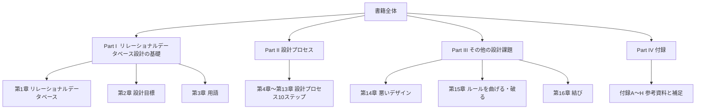

Part Iで基礎知識と用語を固め、Part II（本書の中核、10章分）で実際の設計プロセスを順を追って実践し、Part IIIで応用的な注意点を扱う、という構成になっています。

## この本の設計思想：正規化理論ではなく「独自メソッド」

多くのデータベース教科書は第1正規形（1NF）から第5正規形（5NF）までを段階的に検証する「正規化」を設計の中心に据えます。しかし本書は違うアプローチを取ります。Hernandezは、関数従属性や非キー属性といった形式的な用語は初学者には難解すぎると考え、代わりに「理想的フィールド（ideal field）」「理想的テーブル（ideal table）」という独自の基準でテーブル構造を検証する、より実践的な手法を提示しています。正規化そのものは付録Gで補足的に扱われるにとどまり、本編の設計プロセスには組み込まれていません。

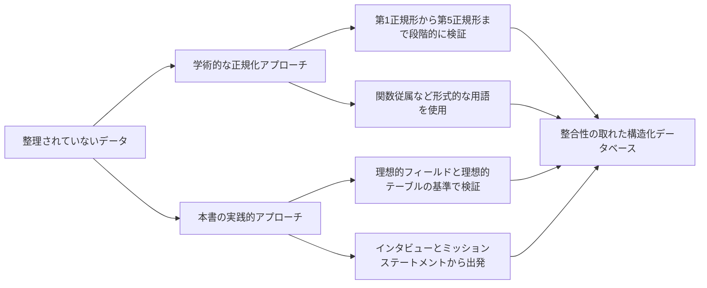

この違いを知らずに読むと「正規化の説明がない」と戸惑うかもしれませんが、これは意図的な設計判断です。実務上、本書の手法をきちんと適用すれば、結果として得られるテーブル構造はおおむね第3正規形（3NF）相当の水準に達すると業界内でも評価されています。正規化理論そのものを体系的に学びたい場合は、後述の「次のステップ」で紹介する資料を併読することをおすすめします。

## 学習ロードマップ

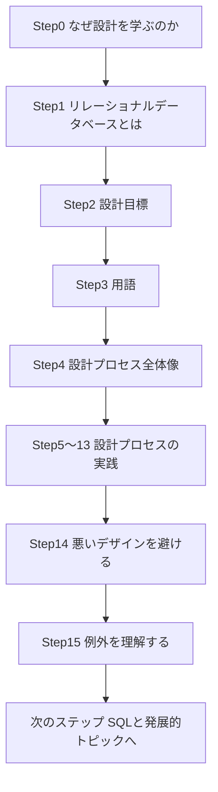

---

# Part I: リレーショナルデータベース設計の基礎

## Step1: リレーショナルデータベースとは何か（第1章）

第1章はもっとも基礎的な問い、「データベースとは何か」から始まります。本書におけるデータベースとは、単なるデータの集合ではなく、「関連する情報を目的に沿って整理した構造」を指します。特にリレーショナルデータベースは、データをテーブル（表）という形式で格納し、テーブル同士を共通のキーで関連づけることでデータを取り出す仕組みです。

第1章で紹介される、リレーショナルデータベースの主な利点は次の通りです。

| 利点 | 内容 |
|---|---|
| 組み込みの多層整合性 | フィールドレベル・テーブルレベル・リレーションシップレベルでデータの正確性を保証できる |
| データの一元管理 | 同じデータを複数箇所に重複して持たずに済む |
| 柔軟な問い合わせ | あらかじめ決められた形式だけでなく、多様な切り口でデータを取り出せる |
| データの独立性 | アプリケーションの実装とデータ構造を分離できる |

章の終盤では、リレーショナルデータベース管理システム（RDBMS）がこうした構造をどのように実現しているかが概観され、Part II以降で扱う「設計」というテーマへの橋渡しがなされます。

## Step2: 設計目標とアプローチ（第2章）

なぜわざわざ「設計」に時間をかける必要があるのでしょうか。第2章はこの動機づけから始まります。行き当たりばったりで作られたデータベースは、データの重複・矛盾・更新時の不整合といった問題を後から引き起こし、その修正コストは設計段階できちんと手を打つよりもはるかに高くつきます。

本章では、良い設計の目的として次のような点が挙げられています。

- データの重複を排除し、記憶域を節約する
- データの正確性と整合性を保証する
- アプリケーションのニーズに柔軟に対応できる構造にする
- 将来の拡張や変更を容易にする

そのうえで、伝統的な設計手法（正規化理論を中心に据えるもの）と、本書が提示する独自の設計手法を対比しています。前述の通り、本書は正規化理論そのものの詳細な解説を主目的とせず、より実務的で段階的なプロセスを重視する立場を取ります。

## Step3: 用語を正しく理解する（第3章）

設計プロセスに入る前に、共通言語を整えておく必要があります。第3章では、本書全体を通じて使われる用語が4つのカテゴリに整理されています。

| カテゴリ | 主な用語 |
|---|---|
| 値に関する用語 | データ、情報、Null（値が存在しないこと） |
| 構造に関する用語 | テーブル、フィールド、レコード、ビュー、キー、インデックス |
| リレーションシップに関する用語 | リレーションシップ、参加のタイプ、参加の度合い |
| 整合性に関する用語 | フィールド仕様、データ整合性 |

特に重要なのが「Null」の扱いです。Nullは「空文字列」や「ゼロ」とは異なり、「値が未知である、または適用されない」ことを表す特別な状態です。この違いを理解していないと、後の章で扱う整合性ルールの設計を誤ってしまいます。

もう一つ本章の山場が、テーブル間の「リレーションシップ」の4類型です。

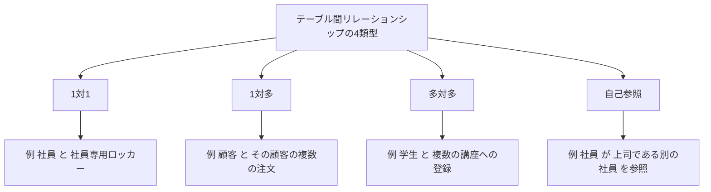

この分類は第10章「テーブルリレーションシップ」で改めて詳しく扱われますが、以降の章を読み進めるうえでの基礎知識として、この段階で押さえておく必要があります。

---

# Part II: 設計プロセス（第4章〜第13章）

Part IIは本書の中核です。著者が提唱する設計プロセスは、大きく7つのフェーズから構成されています。ただしフェーズと章は必ずしも1対1で対応せず、第4章はこの7フェーズ全体を概観する導入章であり、3つ目のフェーズ「データ構造の作成」は第7章から第9章の3章にわたって詳述されます。

このプロセスは一度きりの直線的な作業ではなく、見直しのたびにミッションステートメントへ立ち返ることが想定された反復的な流れである点に注意してください。

## Step4: 設計プロセスの全体像（第4章）

第4章は、上図で示した7フェーズそれぞれの目的を概説する、いわば「地図」の章です。各フェーズを完了させることの重要性が強調されており、途中で工程を飛ばすと後の章で手戻りが発生しやすいことが警告されています。特に、最初のミッションステートメント策定を軽視してしまうと、後続のテーブル設計全体の方向性がぶれてしまう点が繰り返し強調されます。

## Step5: プロセスの開始 ― インタビューとミッションステートメント（第5章）

設計は要件を聞き出すことから始まります。第5章では、利用者やマネジメント層へのインタビューの進め方が具体的なガイドラインとともに解説されます。

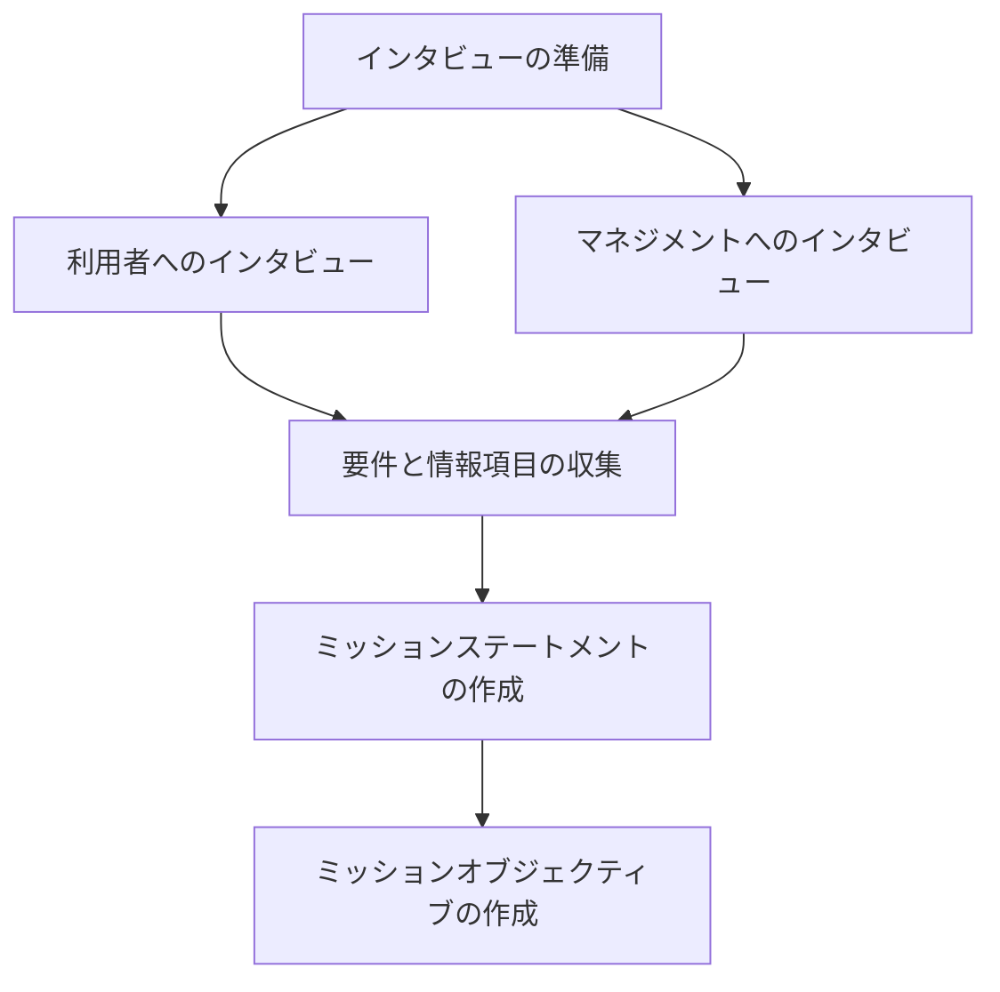

ミッションステートメントは、データベースを作る「目的」を一文または数文で言語化したものです。曖昧な目的からは曖昧な設計しか生まれないため、本章では「良いミッションステートメント」の条件（具体的であること、データベースの対象領域を明確にすることなど）が丁寧に説明されています。ミッションステートメントをさらに具体的な達成項目に分解したものが「ミッションオブジェクティブ」であり、これが後の章でテーブルやフィールドを洗い出す際の判断基準として機能します。

## Step6: 現行データベースの分析（第6章）

多くの場合、設計対象となる業務にはすでに何らかのデータ管理の仕組み（紙の台帳、スプレッドシート、レガシーシステムなど）が存在します。第6章では、その現行の仕組みを分析する手順が扱われます。

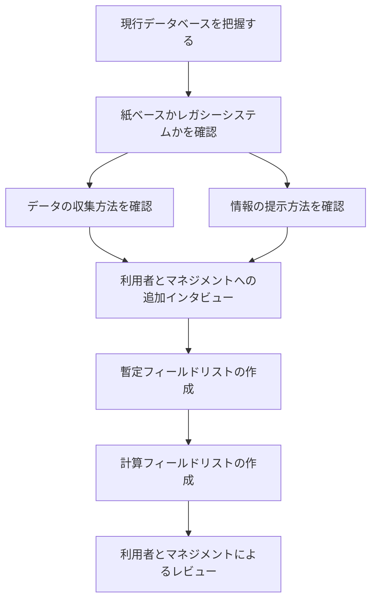

ここで作成される「暫定フィールドリスト」は、集めた情報のすべての項目を洗い出したものであり、次章以降でテーブル構造を組み立てる際の素材になります。合計金額のように他のフィールドから計算できる項目は「計算フィールドリスト」として別扱いにする点も実務上重要なポイントです。

## Step7: テーブル構造の確立（第7章）

いよいよ、収集した情報を実際のテーブル構造へと落とし込みます。第7章は本書の中でも特に分量が多く、実務的な工夫が詰め込まれた章です。

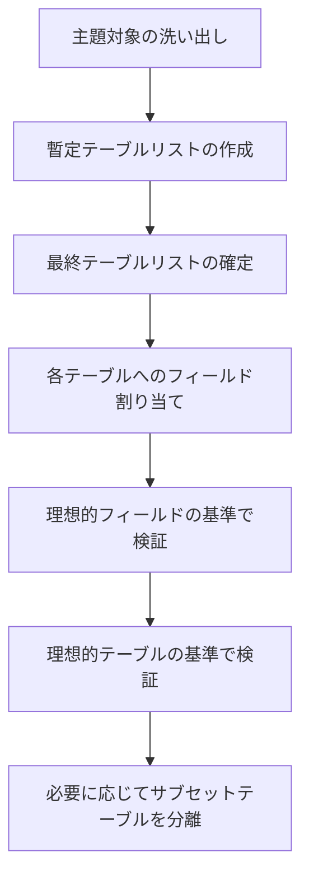

ここで登場する「理想的フィールド（ideal field）」とは、他のフィールドから計算・導出できず、複数の値や意味を持たない、単一の事実を表すフィールドのことです。同様に「理想的テーブル（ideal table）」とは、単一の主題（人・物・出来事など）だけを表し、重複するデータを持たないテーブルを指します。この2つの基準を満たすようにテーブルとフィールドを繰り返し見直していく作業こそが、本書における正規化理論の代替手段にあたります。

よくある問題とその対処も整理されています。

| 問題 | 内容 | 対処 |
|---|---|---|
| 複数部分フィールド | 1つのフィールドに複数の情報が混在している（例 氏名） | 姓・名など単一の情報単位に分割する |
| 多値フィールド | 1つのフィールドに複数の値が入っている（例 電話番号1・2） | 別テーブルへ切り出す |
| 重複データ | 同じ情報が複数のテーブルやレコードに存在する | 主題ごとにテーブルを分離する |

## Step8: キー（第8章）

各レコードを一意に識別する仕組みが「キー」です。第8章では、キーの分類と選定基準が扱われます。

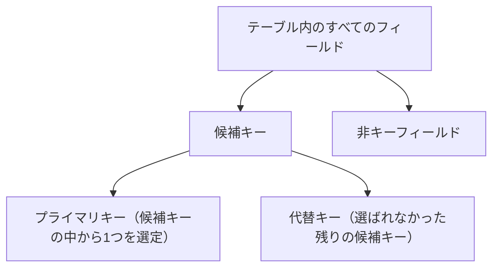

候補キーとは「レコードを一意に識別できるフィールド、またはフィールドの組み合わせ」のうち、条件を満たすすべての候補を指します。その中から実際にテーブルの識別子として採用するものがプライマリキーであり、選ばれなかった候補キーは代替キーとして、一意性を保証する補助的な制約に使われます。良いプライマリキーの条件（値が変化しない、意味を持ちすぎない、できるだけ単純であることなど）も具体的に解説されています。

## Step9: フィールド仕様（第9章）

各フィールドが「どのようなデータを、どのような形式で保持するか」を定義するのがフィールド仕様です。

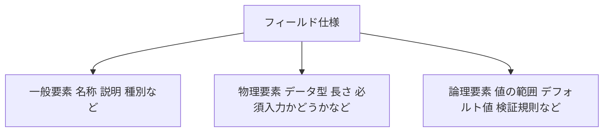

フィールド仕様を丁寧に定義しておくことは、後の章で扱う「フィールドレベルの整合性」の土台になります。似た性質を持つフィールドをまとめて定義できる「汎用フィールド仕様」や、同じ仕様を複数のフィールドに複製する「複製フィールド仕様」といった、実務上の効率化テクニックも紹介されています。

## Step10: テーブルリレーションシップ（第10章）

Step3で概観した4種類のリレーションシップを、実際のテーブル設計に落とし込む章です。1対多や多対多といった関係をどのように外部キーで表現するか、また、多対多関係を解消するための「交差テーブル（中間テーブル）」の作り方が具体的に解説されます。

もう一つの重要なテーマが、親レコードが削除されたときに子レコードをどう扱うかという「削除規則」です。

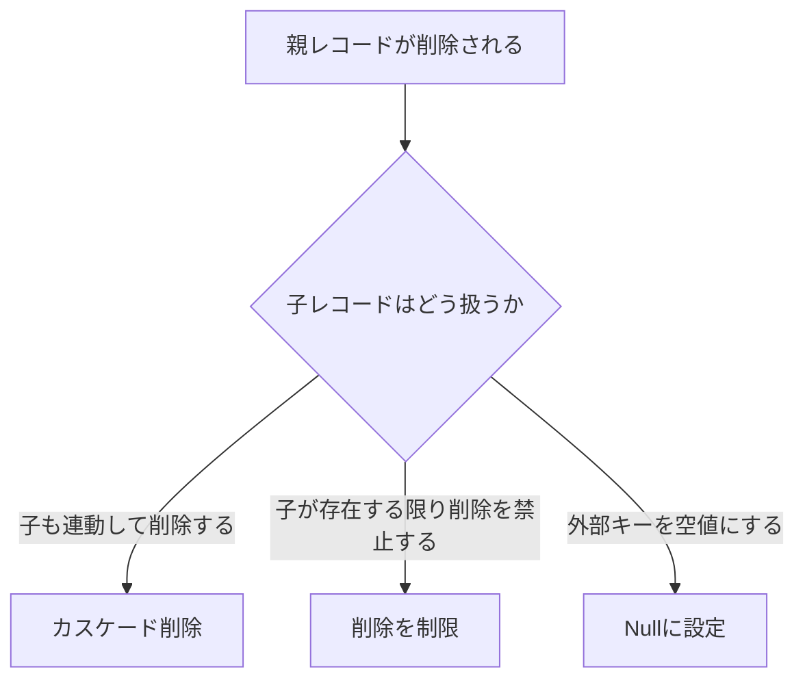

さらに、各テーブルがリレーションシップに「必ず参加するか、任意で参加するか（参加のタイプ）」、「最小・最大いくつのレコードと関連しうるか（参加の度合い）」を明確にすることで、後の整合性設計の精度が大きく高まる点が強調されています。

## Step11: ビジネスルール（第11章）

ビジネスルールとは、組織や業務固有の制約条件のことです。第11章では、これを大きく2つに分類しています。

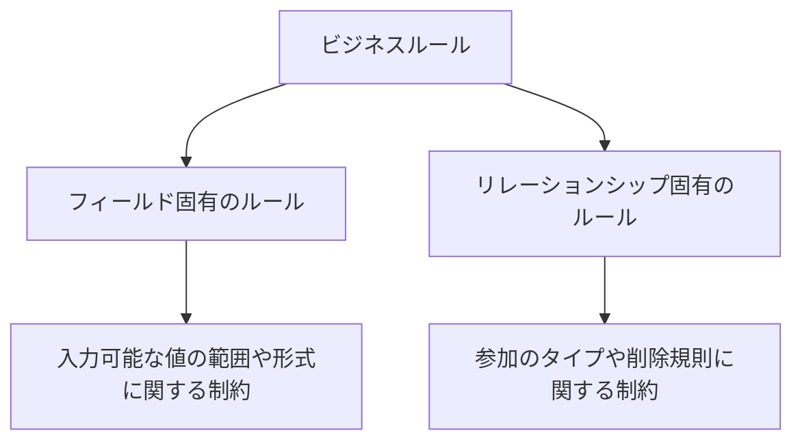

ビジネスルールの多くは、データベースそのものだけでなく、業務プロセスや運用にも関わってきます。そのため、利用者やマネジメントとの合意形成がとりわけ重要であることが繰り返し述べられています。あわせて、決められた値の集合の中からしか入力を許可しない「検証テーブル（validation table）」の活用法も紹介されます。

## Step12: ビュー（第12章）

ビューとは、テーブルに格納された実データそのものではなく、特定の目的のために整形された「見え方」を定義したものです。

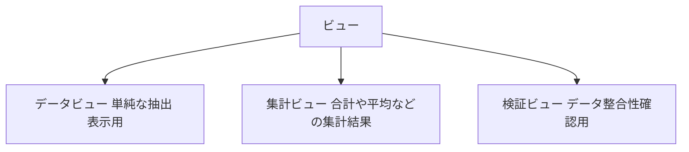

利用者がどのような形でデータを見たいかは、設計の初期段階（第5〜6章のインタビュー）で集めた情報要件と密接に結びついています。第12章では、そうした要件をどのビュー種別に落とし込むべきかを判断する基準が示されます。

## Step13: データ整合性の最終レビュー（第13章）

設計プロセスの最終フェーズは、これまで積み上げてきた整合性ルールをすべて見直す作業です。

| レビュー対象 | 確認内容 |
|---|---|
| テーブルレベルの整合性 | プライマリキーの重複や欠落がないか |
| フィールドレベルの整合性 | フィールド仕様に沿わない値が入りうる余地がないか |
| リレーションシップレベルの整合性 | 外部キーが正しく参照を保っているか、削除規則が適切か |
| ビジネスルール | 業務要件との齟齬がないか |
| ビュー | 利用者の要求を満たせているか |

このレビューを経て、設計ドキュメント一式（テーブル一覧、フィールド仕様、リレーションシップ図など）を取りまとめれば、Part IIで示された設計プロセスは完了です。

---

# Part III: その他の設計課題（第14章〜第16章）

## Step14: 悪いデザイン ― 避けるべきパターン（第14章）

第14章は、これまでとは逆に「やってはいけない設計」を具体例とともに示す章です。

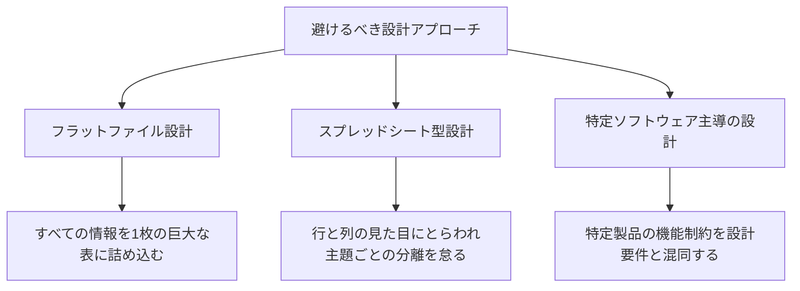

特にスプレッドシート的な発想（「1行1レコード、列を増やせば何でも表現できる」という思い込み）は、多値フィールドや重複データを生みやすく、Step7で扱った「理想的フィールド」「理想的テーブル」の基準に反する典型例として繰り返し警告されています。

## Step15: ルールを曲げる・破るとき（第15章）

第14章で「やってはいけない」とされた設計判断も、状況によっては意図的に選択される場合があります。第15章では、分析用データベース（OLAP的な用途）の設計や、処理性能向上を目的とした非正規化など、ルールを意図的に緩める正当な理由と、その際に必ず行うべき「なぜそうしたかの文書化」の重要性が扱われます。あくまで例外は例外として、根拠を明示したうえで選択すべきだという立場が一貫しています。

## Step16: 結び（第16章）

最終章は短い総括です。良いデータベース設計は特別な才能ではなく、一貫した手順と常識的な判断力があれば誰にでも実践できる、という本書全体を貫くメッセージが改めて述べられ、Part IVの付録（設計プロセスの図解、用語集、推奨読書リストなど）へと読者を導きます。

---

# 読み方を深めるための補足

## 正規化についての補足（付録G）

前述の通り、本書は正規化理論を設計プロセスの中心に据えていません。付録Gでは、著者自身がその理由を説明しています。要点は次の2つに整理できます。

1. 正規化理論を正しく解説しようとすると、関数従属性のような形式的な概念の説明が不可欠になり、「Mere Mortals（普通の人）」向けという本書の趣旨から外れてしまう
2. 本書が提示する「理想的フィールド」「理想的テーブル」という基準に沿って設計を進めれば、正規化理論を意識しなくても、実務上おおむね同等の結果（多くの場合、第3正規形相当の構造）に到達できる

正規化理論そのものを体系的に学びたい読者のために、一般的な正規形の考え方を簡単な表にまとめておきます（これは本書独自の説明ではなく、リレーショナルデータベース理論一般における標準的な整理です）。

| 正規形 | 主な目的 |
|---|---|
| 第1正規形（1NF） | 繰り返しグループを排除し、各フィールドの値を単一の値にする |
| 第2正規形（2NF） | 複合キーの一部にのみ従属する項目を別テーブルへ分離する |
| 第3正規形（3NF） | 主キー以外の項目同士の従属関係（推移的従属）を排除する |
| ボイス–コッド正規形（BCNF） | 3NFをさらに厳密化し、すべての決定項が候補キーになるようにする |
| 第4・第5正規形 | 多値従属性や結合従属性に起因する冗長性を排除する |

本書の「理想的フィールド」基準はおおむね1NF〜2NFの目的に、「理想的テーブル」基準はおおむね2NF〜3NFの目的に対応すると捉えると、両者のアプローチを橋渡しして理解しやすくなります。

## 批判的に読む ― 本書の限界と読む際の注意点

世界的に評価の高い本書ですが、初学者が読む際には以下の点も踏まえておくと、より実務に活かしやすくなります。

- **正規化理論への深入りは避けられている**：前述の通り、本書は正規化理論を体系的には扱いません。学術的な裏付けまで理解したい場合は、C. J. Date の著作などを併読する必要があります。
- **SQLはスコープ外**：本書はテーブル構造の「設計」に特化しており、SQLの書き方そのものは扱いません。実装段階に進む際は、姉妹書『SQL Queries for Mere Mortals』などを参照する必要があります。
- **要件収集の手法がやや伝統的**：インタビューを中心としたウォーターフォール色の強い要件収集プロセスが前提になっており、アジャイル開発のように要件が反復的に変化する現場では、プロセスの適用の仕方に一定の工夫が必要です（ただし第4版では、リモートワーク環境でのインタビューの進め方など、時代に合わせた更新が加えられています）。
- **リレーショナルモデル以外は対象外**：ドキュメント指向やキーバリュー型など、いわゆるNoSQL的なデータモデルは本書の対象外です。あくまでリレーショナルデータベース、特にOLTP（トランザクション処理）用途の設計を主眼としています。

## 次のステップ ― あわせて読みたい資料

| 資料 | 位置づけ |
|---|---|
| 『SQL Queries for Mere Mortals』（John L. Viescas との共著） | 本書で設計したテーブルに対して、実際にSQLでどう問い合わせるかを学ぶ姉妹書 |
| C. J. Date『An Introduction to Database Systems』 | 正規化理論を含む、よりアカデミックなリレーショナルデータベース理論を学びたい場合の定番書。本書の付録Hでも推奨読書として挙げられている |
| E. F. Codd『The Relational Model for Database Management: Version 2』 | リレーショナルモデルの提唱者自身による原典。付録Hの推奨読書リストの筆頭に挙げられている |
| relationaldbdesign.com の正規化解説ページ | 1NF・2NF・3NFを具体例つきで学び直せるオンライン教材。本書の内容とあわせて参照すると理解が深まる |
| Martin Kleppmann『Designing Data-Intensive Applications』 | 設計を終えた後、分散システムやスケーラビリティの観点からデータベースをより深く理解したい読者向け |

## 学習チェックリスト

- [ ] リレーショナルデータベースの利点を自分の言葉で説明できる
- [ ] Nullが「空文字列」や「ゼロ」と異なる概念であることを説明できる
- [ ] 1対1・1対多・多対多・自己参照の4つのリレーションシップを具体例とともに説明できる
- [ ] ミッションステートメントとミッションオブジェクティブの違いを説明できる
- [ ] 「理想的フィールド」「理想的テーブル」の基準に沿ってテーブルを見直せる
- [ ] 候補キー・プライマリキー・代替キーの違いを説明できる
- [ ] 1対多・多対多それぞれのリレーションシップを外部キーでどう表現するか説明できる
- [ ] カスケード削除・削除の制限・Null設定という3つの削除規則の違いを説明できる
- [ ] フィールド固有のビジネスルールとリレーションシップ固有のビジネスルールを区別できる
- [ ] データビュー・集計ビュー・検証ビューの違いを説明できる
- [ ] 本書の設計手法と、正規化理論との関係を自分の言葉で説明できる

## まとめ

『Database Design for Mere Mortals』は、正規化理論という「正攻法」とは異なる角度から、リレーショナルデータベース設計を平易に学べる稀有な一冊です。ミッションステートメントの策定から始まり、テーブル構造の確立、キーの選定、リレーションシップとビジネスルールの定義、ビューの設計、そして最終的な整合性レビューに至る一連のプロセスは、特定の製品やSQL方言に依存しないため、どのようなデータベース環境で働くエンジニアにとっても長く通用する基礎体力になります。一方で、正規化理論そのものやSQLの実装知識は本書の対象外であるため、実務ではぜひ他の資料と組み合わせて活用してください。

## 参考文献

1. [Database Design for Mere Mortals: 25th Anniversary Edition, 4th Edition - Google Books](https://books.google.co.jp/books/about/Database_Design_for_Mere_Mortals.html?id=MVApxsrcHiAC&redir_esc=y) ― ユーザー指定の書籍情報ページ（Google Books）
2. [Database Design for Mere Mortals, 4th Edition | InformIT](https://www.informit.com/store/database-design-for-mere-mortals-9780136788096) ― 出版元 Pearson/InformIT による公式な目次・概要ページ
3. [Database Design for Mere Mortals: 25th Anniversary Edition, 4th Edition - O'Reilly](https://www.oreilly.com/library/view/database-design-for/9780136788133/) ― O'Reilly Online Learning 上の書誌情報
4. [Appendix G: On Normalization - O'Reilly](https://www.oreilly.com/library/view/database-design-for/9780136788133/appg.xhtml) ― 著者自身による、正規化理論を主軸にしなかった理由の解説（付録G）
5. [Appendix H: Recommended Reading（第3版） - O'Reilly](https://www.oreilly.com/library/view/database-design-for/9780133122282/app08.html) ― 著者による推奨読書リスト（Codd、Dateなど）
6. [Chapter 2: Design Objectives（第3版） - O'Reilly](https://www.oreilly.com/library/view/database-design-for/9780133122282/ch02.html) ― 設計目標と設計手法を扱う第2章のプレビュー
7. [Database Design for Mere Mortals - Goodreads](https://www.goodreads.com/book/show/150062.Database_Design_for_Mere_Mortals) ― 読者レビュー集。実務者からの評価コメントが多数
8. [Database Design for Mere Mortals - Editions - Goodreads](https://www.goodreads.com/work/editions/144832-database-design-for-mere-mortals-a-hands-on-guide-to-relational-databas?page=1) ― 初版（1996年）から第4版までの版歴一覧
9. [Hacker News: "This is the book I recommend to everyone who is shy about DBs"](https://news.ycombinator.com/item?id=18807653) ― 国際的な開発者コミュニティ Hacker News での推薦コメント
10. [Hacker News: "Buy the book Database Design for Mere Mortals"](https://news.ycombinator.com/item?id=40193125) ― SQL初学者への定番推薦としての言及
11. [Hacker News: "Huge +1 to Database Design for Mere Mortals"](https://news.ycombinator.com/item?id=28748545) ― 経験者による詳細なレビューコメント（C. J. Dateの著作との比較にも言及）
12. [Database Design for Mere Mortals: 25th Anniversary Edition - 全目次（DOKUMEN.PUB）](https://dokumen.pub/database-design-for-mere-mortals-25th-anniversary-edition-9780136788041-0136788041.html) ― 第4版の全付録一覧を含む詳細目次
13. [Database Design for Mere Mortals: 25th Anniversary Edition, 4th edition - Pearson+](https://www.pearson.com/en-us/pearsonplus/p/9780137459667) ― 出版元 Pearson の公式販売ページ
14. [Database Design for Mere Mortals - Amazon.com（第3版）](https://www.amazon.com/Database-Design-Mere-Mortals-Hands/dp/0321884493) ― 著者略歴（Microsoft Visual Studio グループでのプログラムマネージャー経験など）を掲載
15. [Normalization in Database Design: 1NF, 2NF, 3NF Explained with Examples - relationaldbdesign.com](https://www.relationaldbdesign.com/database-analysis/module3/intro-normal-forms.php) ― 本書と併読できる正規化理論の補足教材
16. [Database Design for Mere Mortals - Summary excerpt（flylib.com）](https://flylib.com/books/en/1.199.1.38/1/) ― 著者が正規形の形式的定義をあえて採用しなかった理由に関する抜粋
17. [Summit '97: Normalization Is a Nice Theory - David Adams & Dan Beckett](http://www.island-data.com/downloads/papers/normalization.pdf) ― 本書の第3正規形の説明が実務コミュニティでどのように参照されてきたかを示す資料
