# Database Internals 完全ガイド ― 分散データシステムの内部を初学者向けにステップバイステップで理解する

> 原著: *Database Internals: A Deep Dive into How Distributed Data Systems Work*（Alex Petrov 著、O'Reilly Media、2019年）
> 本ガイドは、原著の構成・専門用語を尊重しつつ、初めてデータベース内部構造や分散システム理論に触れる読者でも理解できるよう、独自の言葉で噛み砕いて再構成した学習用ドキュメントです。

---

## はじめに ― なぜ「データベースの中身」を学ぶ必要があるのか

私たちは普段、PostgreSQL や MySQL、MongoDB、Cassandra といったデータベースを「ブラックボックス」として扱いがちです。SQL や API を叩けばデータが返ってくる ― それで十分に思えます。

しかし、次のような場面に直面したとき、内部構造の知識が決定的な差を生みます。

- なぜこのクエリだけ極端に遅いのか、実行計画のどこがボトルネックなのかを推測したい
- 新しいデータベースを選定するとき、「結局どれも同じでは？」ではなく、ストレージエンジンやレプリケーション方式の違いから本質的なトレードオフを判断したい
- 分散データベースで「たまに古いデータが読めてしまう」「ノード障害時にデータが消えた」といった問題の根本原因を理解したい
- 自分自身でデータベースやキャッシュ、キューといったインフラコンポーネントを設計・実装したい

本書 *Database Internals* は、まさにこうした問いに答えるために書かれた一冊です。著者の Alex Petrov 氏は Apache Cassandra のコミッター兼 PMC（Project Management Committee）メンバーであり、Apple でデータインフラストラクチャエンジニアとして働いてきた実務家です。本書は特定の製品を分解するのではなく、PostgreSQL・MySQL・MongoDB（WiredTiger）・Cassandra・etcd・CockroachDB・Spanner など、多種多様なデータベースに共通する「概念」を抽出して解説する点に特徴があります。

本ガイドでは、原著全14章の内容を **18のステップ** に整理し、それぞれに Mermaid 図と具体例を添えて、初学者が挫折しないように解説していきます。

---

## 書籍情報

| 項目 | 内容 |
|---|---|
| 原題 | Database Internals: A Deep Dive into How Distributed Data Systems Work |
| 著者 | Alex Petrov（Oleksandr Petrov） |
| 出版社 | O'Reilly Media |
| 初版発行 | 2019年10月 |
| ページ数 | 初版・紙版で xix + 351ページ（前付ローマ数字19ページ＋本文351ページ＝全370ページ）。書店・書誌データベースでは表紙等を含めた約376ページと表記されることがある |
| ISBN（紙版） | 978-1492040347 |
| ISBN（電子版） | 978-1492040309 / 978-1492040330 |
| 構成 | 全2部・全14章 + 付録A（参考文献一覧） |
| 著者の経歴 | Apache Cassandra コミッター・PMCメンバー、Apple のデータインフラストラクチャエンジニア。DataStax でのシニアソフトウェアエンジニア経験もある |
| 公式サイト | [databass.dev](https://www.databass.dev/)（著者本人が運営する本書の公式コンパニオンサイト。正誤表・著者情報を掲載） |

---

## この本の全体像

本書は大きく2つのパートに分かれています。**Part I（ストレージエンジン）** は「1台のマシンの中でデータをどのように保存し、効率よく読み書きするか」を扱い、**Part II（分散システム）** は「複数台のマシンにまたがってデータを複製・分散させながら、いかに一貫性を保つか」を扱います。この2部構成こそが、現代のほとんどのデータベース製品の違いを生み出している核心部分だと著者は述べています。

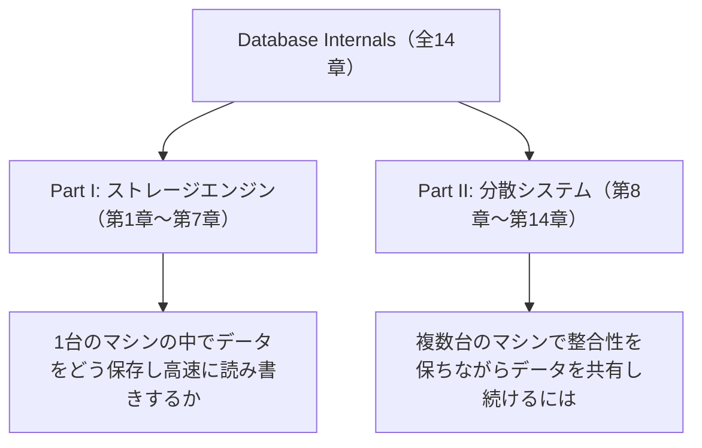

原著と比較すると、しばしば話題になる *Designing Data-Intensive Applications*（Martin Kleppmann 著）が「データシステム全般の広く浅い地図」を描く本であるのに対し、本書はストレージエンジンの内部データ構造とコンセンサスアルゴリズムの実装レベルにまで踏み込む「深く狭い」本だと評されています（詳細は本ガイド末尾の参考文献を参照）。両者は競合ではなく補完関係にあると考えるとよいでしょう。

---

## STEP 1: DBMSの基本アーキテクチャを理解する（第1章）

データベース管理システム（DBMS）は、一枚岩のソフトウェアではなく、役割の異なる複数のコンポーネントが積み重なった「層構造」でできています。クライアントからのリクエストは、この層を上から下へと流れていきます。

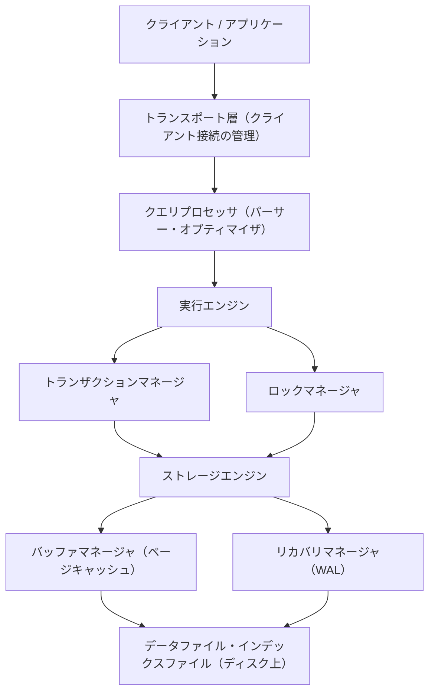

ここで重要なのは、SQL のパースやクエリ最適化を行う「クエリプロセッサ」層と、実際にバイト列をディスクへ読み書きする「ストレージエンジン」層は、はっきり分離されているという点です。実際、MySQL（InnoDB や MyRocks）・MongoDB（WiredTiger）のように、上位のクエリ層を保ったまま、下位のストレージエンジンだけを差し替えられる設計のデータベースも存在します。SQLite はストレージエンジン自体は差し替えられませんが、ディスクアクセスを抽象化した VFS（Virtual File System）層を独自実装に置き換えられる点で、同様の層分離の考え方を体現しています。本書はこの下側、つまりストレージエンジンと分散データ管理の部分に的を絞った一冊です。

また、本書はデータベースを「データファイル」と「インデックスファイル」という2種類のファイルの組み合わせとして捉えます。

- **データファイル**: レコードの実体（ペイロード）そのものを保存するファイル
- **インデックスファイル**: キーから、対応するレコードの位置（データファイル上のオフセットなど）へのマッピングを保存するファイル

多くの場合、インデックス自体が「キー→値」を直接保持する主インデックス（primary index）として振る舞い、値の部分にデータファイルへの間接参照（インダイレクション）を持たせる構成が取られます。

---

## STEP 2: メモリ型データベース vs ディスク型データベース（第1章）

データベースは、データの永続化場所によって大きく2種類に分類できます。

| 分類 | 特徴 | 代表例 |
|---|---|---|
| ディスク型（Disk-Based） | データセットがメモリに収まらないことを前提に、ディスク上の効率的なデータ構造（B-Tree、LSM-Treeなど）を中心に設計される | PostgreSQL、MySQL、Cassandra |
| メモリ型（In-Memory / Memory-Based） | 主要な処理をメモリ上で完結させ、高速なアクセスを実現する。ただしメモリは揮発性であるため、耐久性（Durability）の確保が別途必要になる | Redis、Memcached、SAP HANA（の一部モード） |

メモリ型データベースであっても「耐久性が不要」というわけではありません。プロセスがクラッシュしたりマシンが再起動したりしても、コミット済みのデータが失われないようにする仕組み（スナップショット取得や追記型ログへの書き込みなど）が必要です。つまり、メモリ型データベースの多くも、実際にはディスクへの書き込みを内部で行っており、両者の境界は「常にディスク構造を主として使うか、メモリ上の構造を主として使い、ディスクは耐久性確保の補助として使うか」というアクセスパターンの違いとして理解するのが正確です。

---

## STEP 3: 行指向ストレージ vs 列指向ストレージ（第1章）

もう1つの重要な分類軸が、レコードをどう物理的にレイアウトするかです。

| 分類 | 考え方 | 得意なワークロード |
|---|---|---|
| 行指向（Row-Oriented） | 1レコード分のすべてのカラムをまとめて連続して保存する | OLTP（オンライントランザクション処理）：1件のレコード全体を読み書きする処理が多い場合 |
| 列指向（Column-Oriented） | 同じカラムの値だけをまとめて連続して保存する**物理的なデータ配置方式** | OLAP（分析処理）：特定の数カラムだけを大量の行にわたって集計する処理が多い場合 |

例えば「全顧客の平均年齢を求める」というクエリでは、`age` カラムの値だけを連続して読み込める列指向の方が、無駄なディスクI/Oが少なく高速になります。一方、「顧客IDで1件のレコード全体を取得する」というクエリでは、行指向の方が1回のディスクアクセスでレコード全体を読み込めるため有利です。なお、Cassandra や Bigtable に代表される「ワイドカラムストア」は、名前が似ているため列指向ストレージと混同されがちですが、両者は別の層の概念です。列指向がディスク上の**物理配置**の話であるのに対し、ワイドカラムストアは「行（row）／パーティション／カラムファミリ」という構造でデータを表現する**論理データモデル**を指します。実際、Cassandra はパーティション単位で行のデータをまとめて保持しており、物理配置としては列指向 OLAP エンジンとは異なる特性を持ちます。

---

## STEP 4: B-Treeの基礎を理解する（第2章）

Part I の中心的なテーマの1つが B-Tree です。B-Tree は、1970年代に Rudolf Bayer と Ed McCreight によって考案されて以来、半世紀近くにわたって PostgreSQL、MySQL（InnoDB）、Oracle、SQLite、MongoDB（WiredTiger）など、極めて多くのリレーショナル／非リレーショナルデータベースの標準的なインデックス構造として使われ続けています。

なぜ単純な二分探索木（Binary Search Tree）ではなく B-Tree なのでしょうか。理由はディスクの物理特性にあります。

- ディスク（特に HDD）は、ランダムな位置への1回のアクセスに比較的大きなレイテンシがかかる
- 一方で、一度アクセスした位置の「近く」を読むコスト（シーケンシャルアクセス）は非常に低い
- そのため、1回のディスクアクセスでできるだけ多くの情報（＝多くのキー）を読み込める構造が望ましい

二分探索木は1ノードに1つのキーしか持てず、木の高さ（＝ディスクアクセス回数）は、平衡が保たれている場合でもキー数に対して対数的に増えていきます。さらに平衡化されていない二分探索木では、挿入順によって木が一方向に伸び、高さがキー数に対して線形にまで悪化します。これに対し B-Tree は、1ノード（多くの場合1ディスクページに対応）に多数のキーを持たせることで「扇（ファンアウト）」を大きくし、木の高さを低く保ちます。ファンアウトが十分に大きければ、数百万〜数十億件のレコードがあってもごく少数のディスクアクセスで目的のレコードにたどり着けます。ただし実際の I/O 回数は固定ではなく、木の高さ・ページサイズ・キーサイズ、そして上位ノードがバッファプールにキャッシュされているかどうかに左右されます。実務では上位数階層が常駐していることが多く、その場合ディスクへ実際に到達する回数はさらに減ります。

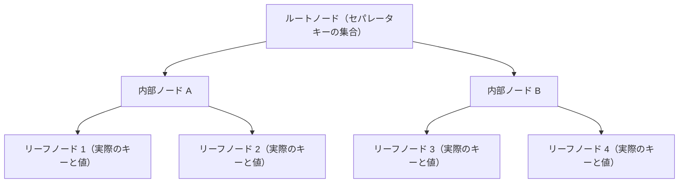

B-Tree の各内部ノードは、子ノードへの「境界」となる「セパレータキー」を保持しています。探索時は、探索したいキーとセパレータキーを比較しながら、正しい子ノードへと下降していきます。

---

## STEP 5: B-Treeの検索・分割・マージのアルゴリズム（第2章）

### 検索アルゴリズム

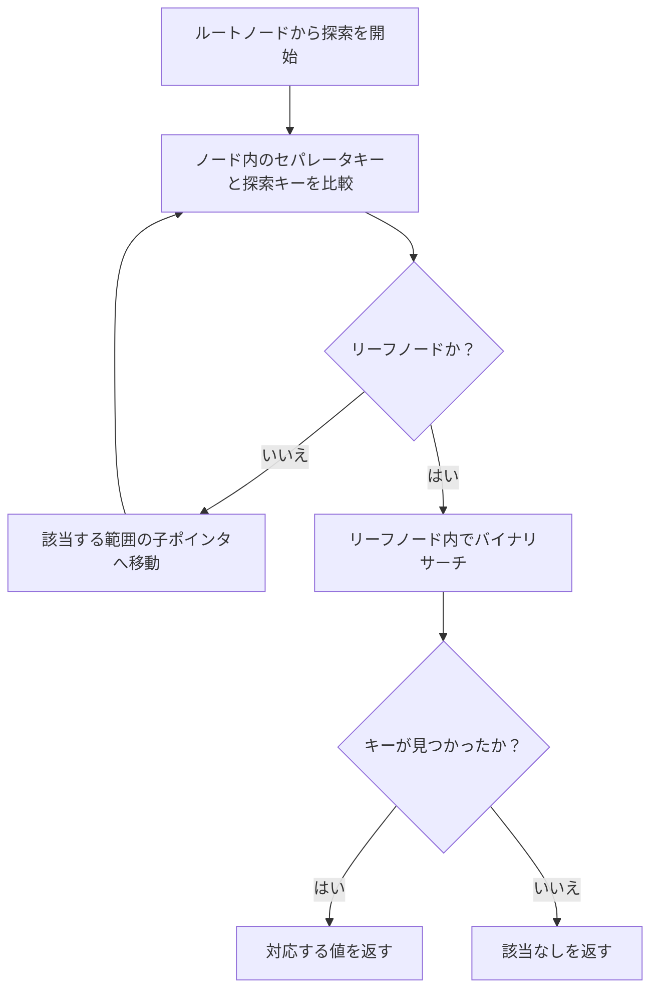

### ノード分割（Split）

B-Tree は「バランス木」であり、挿入や削除のたびに木のバランス（各リーフまでの深さが等しい状態）を保つよう再構成されます。あるノードにキーを挿入しようとしてページの容量を超えてしまう場合、そのノードは2つに分割され、分割の境界となったキーが親ノードへ「昇格」します。

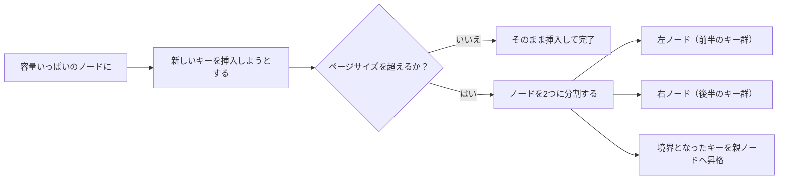

逆に、削除によってノード内のキー数が少なくなりすぎた場合には、隣接ノードとの「マージ（併合）」や「再分配（リバランス）」が行われ、木全体の充填率が一定水準以上に保たれます。この分割・マージのロジックこそが B-Tree 実装の中でも特にバグを生みやすい部分であり、原著第4章では、この処理を安全に行うための「ブレッドクラム（経路の記録）」といった実装テクニックが詳しく解説されています。

---

## STEP 6: ファイルフォーマットとページ構造（第3章）

B-Tree の各ノードは、多くの場合ディスク上の固定サイズの「ページ」（一般的に4KB〜16KB程度）1つに対応します。しかし、キーや値のサイズは可変長であることが多く、固定サイズのページの中に可変長データを効率よく詰め込む工夫が必要です。この目的でよく使われるのが「スロットページ（Slotted Page）」という構造です。

| 領域 | 役割 |
|---|---|
| ページヘッダ | ページの種別、キー数、空き容量などのメタ情報 |
| スロット配列（ポインタ配列） | 各セル（キーと値のペア）へのオフセットを保持する配列。ページ先頭側から伸びていく |
| セル領域 | 実際のキー・値のバイト列。ページ末尾側から逆方向に詰められていく |

スロット配列とセル領域を両端から向かい合わせに成長させることで、ページ内の空き領域を柔軟に使い切りつつ、セルの物理的な並び順を変えずに「論理的な順序」だけをスロット配列の並べ替えで表現できます。これにより、キーの挿入・削除のたびに大量のバイト列をコピーし直す必要がなくなります。

このほか、本書ではプリミティブ型のバイナリエンコーディング方法、可変長文字列の扱い方、ページのバージョニング（フォーマット変更への対応）、チェックサムによる破損検出といった、実務でファイルフォーマットを設計する際に必須となる要素技術が解説されています。

---

## STEP 7: B-Tree実装の詳細（第4章）

実際にプロダクション品質の B-Tree を実装するには、STEP 4〜5 で説明した理論だけでは不十分です。原著第4章では、現実のデータベース実装で使われている以下のような実践的なテクニックが解説されています。

- **ページヘッダの設計**: マジックナンバー（フォーマット識別）、兄弟ページへのリンク（B-link Tree）、最右ポインタ、ノードのハイキー（そのノードが担当するキー範囲の上限）
- **オーバーフローページ**: 1つのセルが1ページに収まらないほど大きい場合に、別ページへ値を逃がす仕組み
- **インダイレクションポインタを使ったバイナリサーチ**: スロット配列を介した間接的な探索
- **バルクロード**: 大量データを初期投入する際に、逐次挿入よりも効率的に木を構築する手法
- **圧縮**: ページ単位・ブロック単位でのデータ圧縮
- **バキュームとデフラグメンテーション**: 更新・削除によって発生した断片化を解消し、ページの利用効率を回復させる処理

これらは地味に思える工夫の積み重ねですが、実際のデータベース製品の性能・信頼性を大きく左右する部分です。

---

## STEP 8: トランザクション処理とクラッシュリカバリ（第5章）

### バッファマネージャとページキャッシュ

ディスクI/Oは依然としてメモリアクセスより何桁も遅いため、頻繁にアクセスされるページはメモリ上の「バッファプール（ページキャッシュ）」にキャッシュされます。バッファマネージャは、キャッシュのヒット判定、ページのピン留め（使用中ページの追い出し防止）、そしてキャッシュが満杯になったときにどのページを追い出すか（ページ置換アルゴリズム）を管理します。

### Write-Ahead Logging（WAL）とクラッシュリカバリ

データベースが突然クラッシュしても、コミット済みのトランザクションのデータが失われてはいけません。これを実現する中心的な仕組みが **WAL（Write-Ahead Log）** です。「変更されたデータページをディスクへ書き出す前に、必ずその変更内容を記録したログを安定記憶へ永続化しておく」という原則です。メモリ上のページは先に書き換えて構わず、制約がかかるのはあくまで**ディスクへの書き出し順序**である点が要点で、これによりランダムなページ書き込みを遅延させつつ、シーケンシャルなログ書き込みだけを同期化できます。この順序が守られていれば、クラッシュ後の再起動時にログから正しい状態を復元できます。ただし復元は「ログを再生するだけ」では済みません。未コミットのページもディスクへ書き出してよい Steal 構成では、クラッシュ時点のディスク上に未コミットの更新が混ざりうるためです。ARIES に代表される手順では、まずログ上の更新を Redo してクラッシュ時点の状態を再現し、そのうえで未コミットだった更新を Undo することで、整合性のとれた状態へ戻します。

多くの実プロダクトが採用しているリカバリアルゴリズムが **ARIES**（Algorithm for Recovery and Isolation Exploiting Semantics、IBMが考案）です。ARIESは大きく3つのフェーズで構成されます。

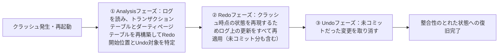

このほか、ページを更新するタイミング（Steal / No-Steal）や、変更をいつディスクへ反映するか（Force / No-Force）というポリシーの組み合わせが、リカバリの複雑さと通常運用時の性能のトレードオフを決定づけます。

---

## STEP 9: 同時実行制御 ― 分離レベルとMVCC（第5章）

複数のトランザクションが同時にデータへアクセスするとき、互いに干渉して不整合な結果（read/write anomaly）を生まないようにする仕組みが「同時実行制御（Concurrency Control）」です。

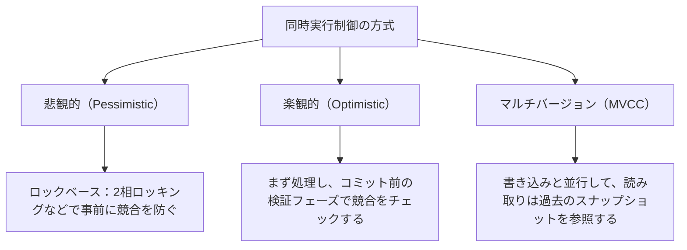

- **悲観的同時実行制御（PCC）**: あらかじめロックを取得してから処理を行い、競合を未然に防ぐ。ロック待ちによるスループット低下がトレードオフ
- **楽観的同時実行制御（OCC）**: 処理はロックなしで進め、コミット直前に競合が起きていないか検証し、競合していればロールバックする。競合が稀な場合に高いスループットを発揮する
- **マルチバージョン同時実行制御（MVCC）**: 各行について複数のバージョンを保持し、読み取りは書き込みをブロックせずに自分から見えるバージョンを参照する。どの範囲でスナップショットが固定されるか（文単位か、トランザクション単位か）は分離レベルと実装に依存し、読み取りトランザクション全体が常に同一のスナップショットを見るとは限らない。PostgreSQLをはじめ多くの現代的なデータベースが採用

また、原著ではこれらの方式の上に成り立つ「分離レベル（Isolation Levels）」（Read Uncommitted、Read Committed、Repeatable Read、Serializable など）と、それぞれのレベルで許容されてしまう異常（Dirty Read、Non-repeatable Read、Phantom Read など）が体系的に整理されています。

---

## STEP 10: B-Treeバリアント（第6章）

素朴な B-Tree にはいくつかの弱点があります。特に「更新のたびにページをその場（in-place）で書き換える」という性質は、並行書き込み時のロック管理や、SSDの書き込み摩耗（wear）の観点で不利になることがあります。原著第6章では、これらの課題に対応するために考案された多様な B-Tree の派生構造が紹介されています。

| バリアント | 特徴 | 代表例 |
|---|---|---|
| Copy-on-Write B-Tree | ページを直接書き換えず、変更が必要なページ（と、その祖先すべて）を新しいコピーとして書き出す。MVCCとの相性がよく、クラッシュ整合性も得やすい | LMDB |
| Lazy B-Tree | 変更をすぐにはツリー構造へ反映せず、ノードやページ単位のバッファへいったん溜めてからまとめて適用する。書き込みをバッチ化することでI/Oを削減する | WiredTiger |
| Lazy-Adaptive Tree | 更新バッファをノード単位ではなくサブツリー単位で階層的に持ち、バッファが溢れた段階で下位のサブツリーへ伝播させる | 研究論文由来 |
| FD-Tree | Fractional Cascading（部分カスケード）の技法を用いて、複数の「ラン（logarithmic runs）」を効率よく検索できるようにした構造 | 研究論文由来 |
| Bw-Tree | ページをその場で更新せず、Compare-and-Swap（CAS）を用いた「更新チェーン」を追記していくことでロックフリーな並行性を実現する | Microsoft のSQL Server Hekaton などの研究に由来 |
| Cache-Oblivious B-Tree | van Emde Boas レイアウトを用い、特定のキャッシュサイズを意識しなくても、あらゆる階層のキャッシュに対して漸近的に最適なアクセス性能を発揮するよう設計された構造 | 主に理論研究の文脈 |

これらは、STEP 11 で扱う「ログ構造化ストレージ」と合わせて、「その場更新（in-place update）」から「追記（append-only）」へとデータベースの世界がシフトしてきた歴史の中間地点に位置づけられる技術群です。

---

## STEP 11: ログ構造化ストレージ（LSM-Tree）（第7章）

B-Tree が「その場更新」を基本とするのに対し、**LSM-Tree（Log-Structured Merge-Tree）** は「追記のみ（append-only）」を基本とする、まったく異なる設計思想のストレージ構造です。Cassandra、RocksDB、LevelDB、HBase など、多くの現代的な NoSQL データベースがこの方式を採用しています。

LSM-Tree の基本的な考え方は次の通りです。

1. 書き込みは、まずメモリ上のソート済み構造（**Memtable**、多くは Skiplist などで実装）へ即座に反映される。実装や設定で WAL が有効な場合は、同時に耐障害性のために WAL へも書き込まれる。WAL は無効化できる設定を持つ製品もあり（RocksDB の `disableWAL`、Cassandra の `durable_writes = false` など）、無効にするとフラッシュ前の書き込みはクラッシュ時に失われる
2. Memtable が一定サイズに達すると、その内容がソート済みのまま「**SSTable**（Sorted String Table）」としてディスクへ書き出される（フラッシュ）
3. 時間の経過とともにディスク上に多数の SSTable が蓄積していく
4. バックグラウンドで定期的に「**コンパクション**」が実行され、複数の SSTable がマージされて、より少数の・より大きな SSTable へと統合される。この過程で、削除済み（tombstone）のデータや、上書きされて不要になった古いバージョンのデータが取り除かれる。ただし回収は無条件ではなく、対象キー範囲に**より古いデータが他に残っていない**ことに加え、実行中の読み取りスナップショットから参照されないなどの可視性条件（実装ごとの保持期間の設定を含む）を満たしたものだけが対象になる

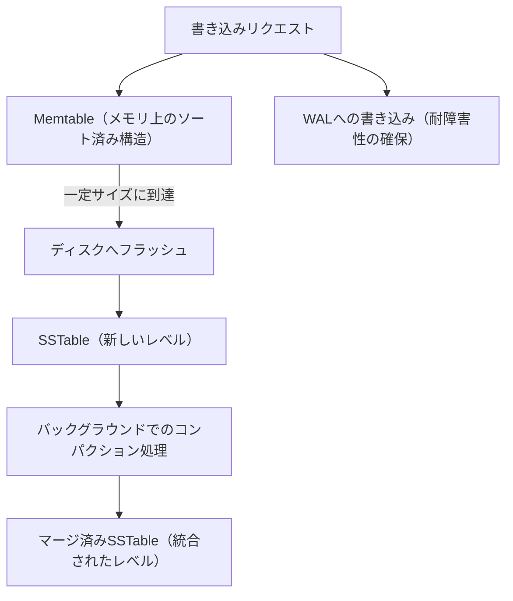

LSM-Tree の読み取りは、B-Tree に比べて本質的に複雑です。あるキーの最新の値がどこにあるかは、Memtable と複数のレベルの SSTable のいずれにも存在しうるため、複数の場所をマージしながら探索する必要があります（Merge-Iteration）。この探索コストを削減するために **Bloom Filter**（あるキーがそのSSTableに「絶対に存在しない」ことを高速に判定できる確率的データ構造）が広く使われています。

原著では、この読み取り・書き込み・空間の3つの増幅（**RUM予想**：Read／Update／Memory amplification）というトレードオフの枠組みで、LSM-Tree の設計判断を評価しています。さらに、SSTableのような整列済み構造すら持たない「非整列型LSMストレージ」の代表例として Bitcask（Riak の初期ストレージエンジン）や WiscKey（キーとバリューを分離して格納しコンパクションコストを削減する設計）も紹介されています。

---

## Part I まとめ：ストレージエンジンの全体像

ここまでの STEP 1〜11 で、Part I「ストレージエンジン」の全体像を見てきました。要点を整理すると、ストレージエンジンの設計は、大きく「**その場更新型（In-Place Update）**」と「**ログ構造化型（Log-Structured / Immutable）**」という2つの系譜に分けられ、それぞれにトレードオフがあります。

| 観点 | B-Tree系（その場更新型） | LSM-Tree系（ログ構造化型） |
|---|---|---|
| 書き込み特性 | ランダムI/Oが発生しやすい | シーケンシャルI/Oが中心で書き込みが高速 |
| 読み取り特性 | 1回の探索で完結し高速 | 複数レベルをマージする必要があり相対的に複雑 |
| 空間効率 | 断片化への対処（デフラグ）が必要 | コンパクションにより整理されるが、一時的に余分な空間を使う |
| 代表的な採用例 | PostgreSQL、MySQL（InnoDB）、MongoDB（WiredTiger） | Cassandra、RocksDB、LevelDB、HBase |

どちらが「優れている」というものではなく、書き込みが多いワークロードか読み取りが多いワークロードか、SSDかHDDか、といった条件によって最適解が変わる、というのが本書 Part I 全体を通じた重要なメッセージです。

---

## STEP 12: 分散システムの基礎的な難しさ（第8章）

Part II では舞台が「1台のマシンの中」から「複数台のマシンをまたいだネットワーク」へと移ります。1台のマシンの中で完結する処理と比べ、分散システムには根本的に異なる難しさがあります。

- **ネットワークは信頼できない**: メッセージは遅延する、失われる、重複する、順序が入れ替わることがある
- **部分的な障害（Partial Failure）が起こりうる**: あるノードは正常に動き続け、別のノードだけがクラッシュする、というような「一部だけ壊れる」状況が常態化する
- **クロックは同期していない**: 各ノードの時計にはズレ（クロックドリフト）があり、「イベントAとイベントBのどちらが先に起きたか」を単純なタイムスタンプ比較だけでは判定できない

こうした難しさを理論的に裏付ける、分散システムの古典的な2つの結果が本章で紹介されます。

- **Two Generals' Problem（二将軍問題）**: 信頼できない通信路を使って、2つの主体が「攻撃するタイミング」について100%確実な合意に至ることは、原理的に不可能であることを示す思考実験
- **FLP不可能性**: 非同期分散システムにおいて、1つのプロセスがクラッシュしうるだけで、決定的なアルゴリズムではコンセンサスの**停止性（必ず有限時間で決着すること）** を保証できないことを示した、Fischer・Lynch・Paterson による有名な定理。安全性にあたるAgreementやValidityが崩れるという主張ではない

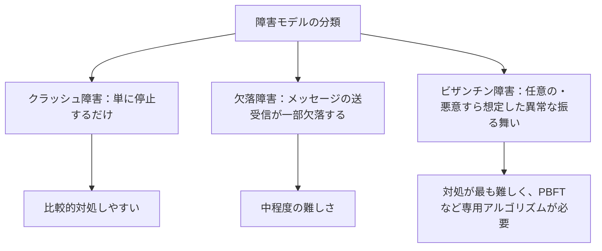

これらの理論的限界は「悲観的な話」に聞こえるかもしれませんが、実際には「完璧な解決策は存在しない以上、どの保証を諦め、どの保証を優先するかを意識的に設計する」という、分散システム設計における現実的な姿勢の土台になっています。この考え方は、STEP 15 で扱う一貫性モデルの議論に直結していきます。

---

## STEP 13: 障害検出アルゴリズム（第9章）

非同期システムでは、あるノードが「本当にクラッシュしたのか」「単にネットワークが遅いだけなのか」を確実に区別する方法が存在しません。メッセージ遅延に上限がない以上、応答がないという事実だけからは両者を判別できないためで、これは障害検出器（Failure Detector）モデルが本質的に抱える限界です。

これと関連しつつも別の定理が **FLP不可能性**（Fischer・Lynch・Paterson）です。こちらは「非同期システムにおいて、たった1つのプロセスがクラッシュしうるだけでも、決定性のあるアルゴリズムでコンセンサスの停止性（必ず有限時間で決着すること）を保証することはできない」という結果を指します。障害検出が困難であること自体を述べた定理ではなく、コンセンサスの解決可能性に関する主張である点に注意が必要です。

こうした理論的限界があるため、実践的なシステムでは確実な判定を諦め、「疑わしさ」を確率的・ヒューリスティックに判定する障害検出器が使われます。

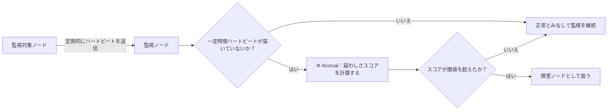

最もシンプルな方式は、一定間隔で「ハートビート」を送り合い、決められたタイムアウトを超えたら故障と「みなす」というものです。しかし、固定のタイムアウト値は「ネットワークが混雑している普段の状況」と「本当に落ちた状況」を区別できず、誤検出を生みがちです。この問題への改良として **Φ (Phi) Accrual障害検出器** が紹介されています。これは固定の閾値で二値判定するのではなく、過去のハートビート到着間隔の統計分布から「このノードの障害の疑わしさを表すスコア」Φ を連続値として算出する方式です。Φ は「生きている確率」そのものではなく、次のハートビートが現時点までに届かなかったことの起こりにくさを対数スケールで表した指標で、値が大きいほど故障の疑いが強いことを意味します。アプリケーションは自らの許容誤検出率に応じて閾値を選べます。この方式は、Cassandra や Akka などで実際に採用されています。また、全ノードが個別に監視するのではなく、ゴシッププロトコル（STEP 16）を通じて障害情報自体を伝播させる方式も紹介されています。

---

## STEP 14: リーダー選出アルゴリズム（第10章）

多くの分散システムでは、特定の決定（例：書き込みの受付順序を決めるなど）を単一のノード（リーダー）に集約することで、システム全体の設計をシンプルにします。しかし、そのリーダー自身が故障した場合には、残りのノードの中から新しいリーダーを選び直す必要があります。これが「リーダー選出」問題です。

原著では、比較的古典的でシンプルなアルゴリズム群が紹介されています。

- **Bullyアルゴリズム**: 各ノードが一意のIDを持ち、自分より大きいIDを持つ生存ノードがいないことを確認できたノードが、自らをリーダーだと宣言する（IDの大きい者が「いじめっ子（bully）」のように選出権を奪い合うことに由来）
- **Next-In-Line Failover / Candidate-Ordinary最適化**: Bullyアルゴリズムの通信量を削減するための工夫
- **招待アルゴリズム（Invitation Algorithm）**: ノードが自らグループを形成し、互いを「招待」し合う形でリーダーを決定する
- **リングアルゴリズム**: ノードを論理的なリング状に並べ、メッセージをリングに沿って回覧することでリーダーを決定する

これらのアルゴリズムは、後の STEP 18 で扱う Raft のような、コンセンサスアルゴリズムに内包された「より堅牢なリーダー選出の仕組み」の前提知識としても位置づけられます。

---

## STEP 15: レプリケーションと一貫性モデル（第11章）

分散データベースの多くは、可用性と耐障害性を高めるために、同じデータを複数のノードへ複製（レプリケーション）します。しかし、複製を作った瞬間から「どのレプリカを読んでも常に最新の値が返ってくることを保証するか」という一貫性の問題が生じます。

### CAP定理

分散システムの議論で頻繁に登場する **CAP定理** は、「Consistency（一貫性）」「Availability（可用性）」「Partition tolerance（ネットワーク分断耐性）」の3つのうち、ネットワーク分断が実際に発生した際には、CとAの両方を同時に完全には満たせない、ということを示しています。ここで言うCとAは日常語ではなく、定理の中で次のように厳密に定義された性質である点に注意が必要です。

- **Consistency**: atomic consistency、すなわち**線形化可能性（linearizability）** のこと。結果整合性やセッション一貫性といった任意の一貫性モデル一般を指すのではない
- **Availability**: **故障していないノードが受け取ったリクエストは必ず応答を返して完了できる**という性質。稼働率（アップタイム）やレイテンシの良さを指すのではない
原著では、CAP定理を単純化しすぎず、その正しい適用範囲（分断が実際に起きている「間」の話であって、平常時の話ではない）を丁寧に解説しています。

### 一貫性モデルのスペクトラム

一貫性には「オール・オア・ナッシング」ではなく、強さの異なる複数のモデルが存在します。

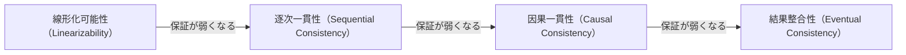

> 注記: 上図は代表的な4モデルを「保証の強さ」の包含関係に沿って並べた簡略図です。一貫性モデル全体は一列に並ぶわけではなく、比較できない（強弱を決められない）モデルも多数存在する半順序をなします。また、保証を弱めれば必ず性能や可用性が上がるわけではありません。可用性については CAP・PACELC が示すとおり分断時の選択肢が広がりますが、実際の性能はワークロード・レプリカ配置・実装によって決まります。

- **線形化可能性（Linearizability）**: あたかもデータのコピーが1つしか存在しないかのように振る舞う、最も強い一貫性モデル。実装コストと性能面のトレードオフが大きい
- **逐次一貫性（Sequential Consistency）**: すべてのノードが同じ順序で操作を観測することを保証するが、その順序が「実時間」と一致している必要はない
- **因果一貫性（Causal Consistency）**: 因果関係のある操作（あるイベントが別のイベントの結果である場合）の順序のみを保証し、無関係な操作の順序は保証しない
- **結果整合性（Eventual Consistency）**: 新しい書き込みが止まれば、いずれすべてのレプリカが同じ値に収束することだけを保証する、最も緩いモデル

さらに、Cassandra や DynamoDB に見られる「チューナブル（調整可能）な一貫性」、Riak などに見られる「Witness Replica」、そしてネットワーク分断中でも書き込みの競合を数学的に自動解消できる **CRDT（Conflict-free Replicated Data Type）** と、CRDT が満たす一貫性モデルである **強収束性（Strong Eventual Consistency）** といった、実践的で発展的な話題まで扱われています。

---

## STEP 16: アンチエントロピーと伝播（第12章）

レプリカ間でデータがズレてしまった（一時的な不整合が生じた）とき、それを検出し修復する仕組みが「アンチエントロピー（Anti-Entropy）」です。

- **Read Repair**: 読み取り時に複数レプリカへ問い合わせ、応答内容が食い違っていたら、その場で古いレプリカを最新の値に更新する
- **Hinted Handoff**: 書き込み先のレプリカが一時的に応答不能な場合、別のノードが代わりにその書き込みを一時保存しておき、対象ノードが復帰した際に転送する
- **Merkle Tree（マークル木）**: レプリカ同士のデータ全体を1件ずつ比較するのは非効率なため、データをハッシュ値の木構造にまとめ、ルートハッシュから順に比較することで、差分が存在する部分だけを効率的に特定する

また、障害検出やメタデータの伝播に使われる **Gossipプロトコル**（各ノードがランダムに選んだ少数の他ノードへ情報を伝え、それが連鎖的にクラスタ全体へ広がっていく方式）についても、オーバーレイネットワークの構成や、通信量を抑える「Partial View（部分的なメンバーシップ管理）」といった実装上の工夫とあわせて解説されています。

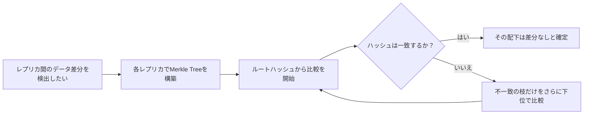

---

## STEP 17: 分散トランザクション（第13章）

複数のノードにまたがるデータへの変更を「全部成功」か「全部失敗」のどちらかに揃える（原子性を保つ）ためのプロトコルが分散トランザクションです。

### 2相コミット（2PC）

最も古典的な手法が **2PC（Two-Phase Commit）** です。文字通り2つのフェーズから構成されます。

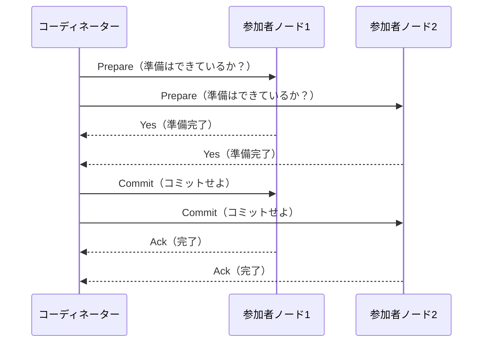

2PCの弱点は、コーディネーターがCommitを送る直前でクラッシュした場合、参加者は「コミットすべきかロールバックすべきか」を自力で判断できず、コーディネーターが復旧するまでブロックし続けてしまう点です。この弱点を緩和しようとしたのが **3PC（Three-Phase Commit）** ですが、こちらもネットワーク分断が絡む状況では完全な解決策にはなりません。

### より現代的なアプローチ

原著ではさらに、実際のプロダクションシステムで使われている、より洗練された分散トランザクション手法が紹介されています。

- **Calvin**: あらかじめ決定論的な実行順序をスケジューリングすることで、実行時のロック調整コストを削減するアプローチ
- **Spanner**（Google）: **TrueTime**（GPS と原子時計に支えられた分散時刻 API で、現在時刻を一点ではなく「不確実性区間」として返す）を活用するアプローチ。TrueTime だけで外部一貫性が得られるわけではなく、コミット時にその不確実性区間が過ぎ去るまで待つ **commit-wait** を組み合わせることで、「T1 のコミット完了後に T2 が開始した場合、T1 のコミットタイムスタンプは必ず T2 のそれより小さい」ことを保証し、グローバル分散環境での外部一貫性を実現する（実行期間が重なるトランザクション同士にこの順序を課すものではない）
- **Percolator**（Google）: Bigtable上にMVCCベースの分散トランザクションを構築し、大規模なインクリメンタル処理（Googleの検索インデックス更新など）に使われたアプローチ

また、データを複数ノードへ分割配置する「データベースパーティショニング」の代表的な手法として **一貫性ハッシュ法（Consistent Hashing）** も本章で扱われており、ノードの追加・削除時に再配置されるデータ量を最小限に抑える仕組みが解説されています。

---

## STEP 18: コンセンサスアルゴリズム（第14章）

Part II ― そして本書全体 ― の集大成にあたるのが、第14章で扱われる **コンセンサス（合意形成）** です。「クラスタ内の複数ノードが、一部に故障が発生しても、ある1つの値について同じ結論に到達する」問題であり、分散システム理論の中でも特に難易度が高い領域とされています。コンセンサスアルゴリズムが満たすべき性質は、一般に次の3つで定義されます。

- **Validity（妥当性）**: 決定される値は、いずれかのノードが実際に提案した値でなければならない（アルゴリズムが勝手に値を作り出さない）
- **Agreement（合意性）**: 正常に稼働しているノードが値を決定する場合、それらはすべて同じ値を決定する
- **Termination（停止性）**: 一定の前提条件（過半数ノードが到達可能である、部分同期モデルであるなど）のもとで、正常なノードは最終的に何らかの値を決定する

Termination は無条件に保証されるものではない点に注意が必要です。STEP 12・13 で触れた **FLP不可能性** が示すとおり、完全な非同期システムでは 1 プロセスのクラッシュだけで停止性の保証は成立しません。実用的なアルゴリズムは、障害検出器や部分同期といった追加の前提を置くことでこの壁を回避しています。

### Paxos

**Paxos**（Leslie Lamportにより考案）は、コンセンサス問題に対する最初期の実用的な解として広く知られています。原著では、基本のPaxosアルゴリズムに加えて、実運用でのスループットを高めるための派生版が紹介されています。

- **Multi-Paxos**: 複数の合意インスタンスにまたがって安定したリーダーを維持し、毎回のリーダー選出コストを省く
- **Fast Paxos**: 特定条件下でメッセージのラウンド数を削減する
- **Egalitarian Paxos**: 単一リーダーへの依存を減らし、複数ノードが並行して提案できるようにする
- **Flexible Paxos**: クォーラム（定足数）の構成条件を緩和し、より柔軟なデプロイを可能にする

### Raft

Paxosはその正確な仕様が難解であることでも知られており、この「理解のしやすさ（Understandability）」を明示的な設計目標として2014年に発表されたのが **Raft** です。Raftはリーダー選出・ログレプリケーション・安全性の3つの要素に処理を明確に分割しており、etcd・Consul・CockroachDB・TiKVなど、現代の多くの分散システムで採用されています。

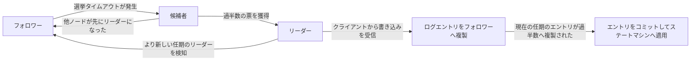

### ビザンチン合意

これまでのアルゴリズムは、ノードが「クラッシュはするが嘘はつかない」ことを前提としています。しかし、ブロックチェーンのような信頼境界の低い環境や、悪意あるノードの存在を想定する必要がある場面では、この前提が崩れます。そのための手法が **ビザンチン合意（Byzantine Consensus）** であり、原著では代表的なアルゴリズムである **PBFT（Practical Byzantine Fault Tolerance）** が、リカバリとチェックポインティングの仕組みとあわせて紹介されています。

原著全体の締めくくりとして、「Broadcast（ブロードキャスト）」「Atomic Broadcast（アトミックブロードキャスト）」「Virtual Synchrony（仮想同期）」「ZAB（Zookeeper Atomic Broadcast）」といった関連概念も整理されており、コンセンサスとブロードキャストプロトコルの関係性が体系的に理解できるようになっています。

---

## 全14章 一覧表

| Part | 章 | 章タイトル（原題） | 主な内容 |
|---|---|---|---|
| I. ストレージエンジン | 1 | Introduction and Overview | DBMSアーキテクチャ、メモリ型/ディスク型、行指向/列指向、データファイルとインデックスファイル |
| I | 2 | B-Tree Basics | 二分探索木からB-Treeへ、ディスク向け構造、階層と探索アルゴリズム |
| I | 3 | File Formats | バイナリエンコーディング、スロットページ、可変長データの管理、チェックサム |
| I | 4 | Implementing B-Trees | ページヘッダ、オーバーフローページ、バイナリサーチ、リバランス、圧縮、デフラグ |
| I | 5 | Transaction Processing and Recovery | バッファ管理、WAL、ARIES、分離レベル、OCC/PCC/MVCC |
| I | 6 | B-Tree Variants | Copy-on-Write（LMDB）、WiredTiger、FD-Tree、Bw-Tree、Cache-Oblivious B-Tree |
| I | 7 | Log-Structured Storage | LSM-Tree、SSTable、Bloom Filter、コンパクション、Bitcask、WiscKey |
| （Part I まとめ） | ― | Part I Conclusion | ストレージエンジン全体のまとめ |
| II. 分散システム | 8 | Introduction and Overview | 分散システムの難しさ、Two Generals Problem、FLP不可能性、障害モデル |
| II | 9 | Failure Detection | ハートビート、Φ Accrual障害検出器、ゴシップベースの障害検出 |
| II | 10 | Leader Election | Bullyアルゴリズム、招待アルゴリズム、リングアルゴリズム |
| II | 11 | Replication and Consistency | CAP定理、線形化可能性、逐次/因果一貫性、結果整合性、CRDT |
| II | 12 | Anti-Entropy and Dissemination | Read Repair、Merkle Tree、Hinted Handoff、Gossipプロトコル |
| II | 13 | Distributed Transactions | 2PC、3PC、Calvin、Spanner、Percolator、一貫性ハッシュ法 |
| II | 14 | Consensus | Paxos系（Multi/Fast/Egalitarian/Flexible）、Raft、ビザンチン合意（PBFT） |
| （Part II まとめ） | ― | Part II Conclusion | 分散システム全体のまとめ |
| 付録 | A | Bibliography | 100本以上の論文と10冊以上の書籍を中心に、OSS実装などの参考資料も含む参考文献一覧 |

---

## 国際的なエンジニアコミュニティからの評価

本書は特定の企業のマーケティング資料ではなく、実際にデータベース・分散システムの最前線で働く著名なエンジニアたちから継続的に高く評価されている技術書です（発言内容は要旨としてまとめ、原文の引用は最小限にとどめています。原発言は参考文献のリンク先で確認できます）。

- **Martin Kleppmann**（*Designing Data-Intensive Applications* 著者）は、自著と合わせて読むことで、特にストレージエンジンとコンセンサスの分野をより深く理解できる「良い続編」として本書を紹介しています。
- **Marc Brooker**（Amazon Web ServicesのDistinguished Engineer）は、自身が日常的に人へ勧める一冊として本書を挙げています。
- **Joran Dirk Greef**（分散データベース TigerBeetle の創業者・CEO）は、最初から最後まで通して読める数少ないデータベース書籍の1つとして本書を推薦しています。
- **Ed Huang**（分散SQLデータベース PingCAP / TiDB の共同創業者・CTO）は、データベースの世界に関わる者なら誰もが一度は耳にしたことがある一冊だとコメントしています。
- **Dominik Tornow**（*Thinking in Distributed Systems* 著者）は、中国語版のレビューに協力するなど、本書の国際的な普及にも関与しています。
- **Chris Seaton**（TruffleRubyなどの開発で知られる著名なプログラミング言語処理系エンジニア）は、アカデミックな出版社ではない書籍としては異例なほど深く精密な内容でありながら、非常に読みやすくコンパクトだと評しています。

このほかにも、*System Design Interview* の著者である Alex Xu、Apache Ignite PMCで *Just use Postgres* の著者である Denis Magda など、データベース・分散システム分野で広く知られる開発者たちから、継続的に推薦の声が寄せられています（詳細と原発言へのリンクは参考文献を参照してください）。

---

## この本の読み方・学習ロードマップ

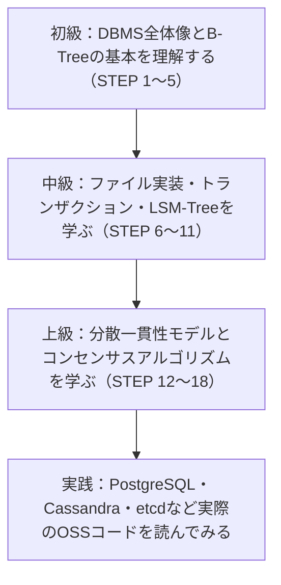

初めて読む場合は、いきなり全ページを精読しようとせず、次のような順序をおすすめします。

1. まず Part I（STEP 1〜11）を通読し、「その場更新型（B-Tree）」と「ログ構造化型（LSM-Tree）」という2大設計思想の違いを掴む
2. Part II（STEP 12〜18）は、CAP定理や一貫性モデルなど比較的とっつきやすい章から入り、最後にコンセンサス（Paxos/Raft）という最も難解な領域へ進む
3. 一度読んだだけで完全に理解しようとせず、実際に PostgreSQL のB-Treeインデックス実装や、etcdのRaft実装のソースコードを眺めながら再読すると理解が深まる
4. 前提知識としての分散システム理論をより体系的に広く俯瞰したい場合は、Martin Kleppmann の *Designing Data-Intensive Applications* を並行して読むと相互補完的に理解が進む

---

## まとめ

*Database Internals* は、「データベースを使う人」から「データベースの中身を理解し、選定・設計・トラブルシューティングできる人」へとステップアップするための、稀有な一冊です。B-TreeとLSM-Treeという2つのストレージエンジンの系譜、そしてPaxosやRaftに代表されるコンセンサスアルゴリズムという、現代のあらゆる分散データベースの土台となる知識を、一冊で体系的に押さえられる点に大きな価値があります。

本ガイドで扱った18のステップは、あくまで最初の地図です。ぜひ原著、そして参考文献に挙げた一次資料（論文・カンファレンストーク・OSS実装）にあたりながら、実際に手を動かして理解を深めていってください。

---

## 参考文献・出典

本ガイドの作成にあたり、2026年9月21日時点で参照可能な以下の情報源を確認しました。

1. O'Reilly 公式書籍ページ（本書の概要・目次） ― https://www.oreilly.com/library/view/database-internals/9781492040330/
2. Alex Petrov 氏本人が運営する本書の公式コンパニオンサイト databass.dev（著者プロフィール、著名エンジニアからの推薦の声を掲載） ― https://www.databass.dev/
3. databass.dev 正誤表（Errata） ― https://databass.dev/errata
4. 本書の詳細な目次（章・節・ページ番号の一覧、O'Reillyの公式PDFを図書館が収録） ― https://www.gbv.de/dms/ilmenau/toc/1688659285.PDF
5. Martin Kleppmann（*Designing Data-Intensive Applications* 著者）による、本書を "Designing Data-Intensive Applications" の発展的な続編として推薦する投稿 ― https://x.com/martinkl/status/1273913672885317632
6. Marc Brooker（Amazon Web Services, Distinguished Engineer）による推薦の投稿 ― https://x.com/marcjbrooker/status/1591438104979984384
7. Joran Dirk Greef（TigerBeetleDB 創業者・CEO）による推薦の投稿 ― https://x.com/jorandirkgreef/status/1807429356525858904
8. Ed Huang（PingCAP 共同創業者・CTO）による推薦の投稿 ― https://x.com/dxhuang/status/1241244337922396161
9. Dominik Tornow（*Thinking in Distributed Systems* 著者）による投稿 ― https://x.com/dominiktornow/status/1814446370578669654
10. Chris Seaton による、本書の技術的な深さと読みやすさを評した投稿 ― https://twitter.com/ChrisGSeaton/status/1208502843033837568
11. Alex Petrov 氏自身による ACM Queue 誌への寄稿（ストレージエンジンのアルゴリズムに関する解説記事） ― https://queue.acm.org/detail.cfm?id=3220266
12. Alex Petrov 氏による InfoQ でのカンファレンス講演（Storage Algorithms） ― https://www.infoq.com/presentations/storage-algorithms
13. Hippocampus's Garden による書評（*Designing Data-Intensive Applications* との比較を含む） ― https://hippocampus-garden.com/book_review_petrov/
14. Goodreads の本書ページ（Emre Sevinç氏による、*Designing Data-Intensive Applications* および *Cassandra: The Definitive Guide* と並ぶ位置づけについてのレビューを含む） ― https://www.goodreads.com/book/show/44647144-database-internals
15. 章ごとの学習ノート・要約（コミュニティによる読書ノート） ― https://notes.stonecharioteer.com/books/database-internals/index.html
16. 著者 Alex Petrov 氏の経歴に関する情報（Apache Cassandra コミッター・PMCメンバー、Appleでの職務経歴） ― https://bookshop.org/p/books/database-internals-a-deep-dive-into-how-distributed-data-systems-work-alex-petrov/79ff30324a22a51e

> 補足: 本ガイドは上記の一次情報源（公式ページ・著者本人の発信）を中心に事実関係を確認したうえで、内容の解説自体はB-Tree・LSM-Tree・Paxos・Raft・CAP定理などコンピュータサイエンスの標準的な公知の知識に基づき、著作権保護対象である書籍本文の再現を避けて独自の言葉で執筆しています。
