# マルチエージェントシステムの設計（Designing Multi-Agent Systems）— 初学者向け実践ガイド

## 本ガイドについて

ご提示いただいた O'Reilly のページ（`https://www.oreilly.com/library/view/designing-with-multi-agent/9783110797473/`）は、Evangelos Pantazis 著・De Gruyter 刊『*Designing with Multi-Agent Systems*』（2024年2月刊）でした。実際に内容を確認したところ、この書籍は**建築・エンジニアリング・建設（AEC）分野**において、ファサード設計やシェル構造設計などの初期設計段階にマルチエージェントシステム（群知能によるボトムアップ的な形態生成）を応用する研究書であり、ソフトウェア/AIエンジニアリングにおける「LLMエージェントを複数連携させるシステム設計」とは主題が異なります。

そのため本ガイドでは、書籍の章構成をなぞるのではなく、**2026年9月時点でのソフトウェア/AIエンジニアリングにおけるマルチエージェントシステム設計**を、Anthropic・OpenAI・Google・Cognition・Linux Foundation（Agentic AI Foundation）・OWASP などの一次情報に基づいて初学者向けに再構成しました。参考にした情報源のURLはすべて末尾の参考文献に明記しています。

---

## 目次

- 第0部　前提知識 — LLMエージェントとは何か
- 第1部　なぜマルチエージェントなのか — 効果とコスト、そして反論
- 第2部　基本設計パターン9種
- 第3部　コンテキストエンジニアリングと状態設計
- 第4部　エージェント間通信プロトコル
- 第5部　メモリアーキテクチャ
- 第6部　ツール利用と権限設計
- 第7部　評価とオブザーバビリティ
- 第8部　安全性とセキュリティ設計
- 第9部　実装フレームワークの選択（2026年版）
- 第10部　設計チェックリストとアンチパターン
- 第11部　2026年9月時点の最新動向
- 学習ロードマップ
- 用語集
- 参考文献

---

## 第0部　前提知識 — LLMエージェントとは何か

### 0.1 LLMエージェントの基本ループ

マルチエージェントシステムを理解する前に、まず「エージェントが1つだけの場合」の動作を押さえておきましょう。Anthropicは、マルチエージェントシステムを「複数のエージェント（＝ツールをループの中で自律的に使うLLM）が協調して動くシステム」と定義しています。単一のエージェントは、次のような「認識→計画→実行→観察」のループを、終了条件（最終出力ツールの呼び出し、規定ターン数への到達、エラーなど）に達するまで繰り返します。

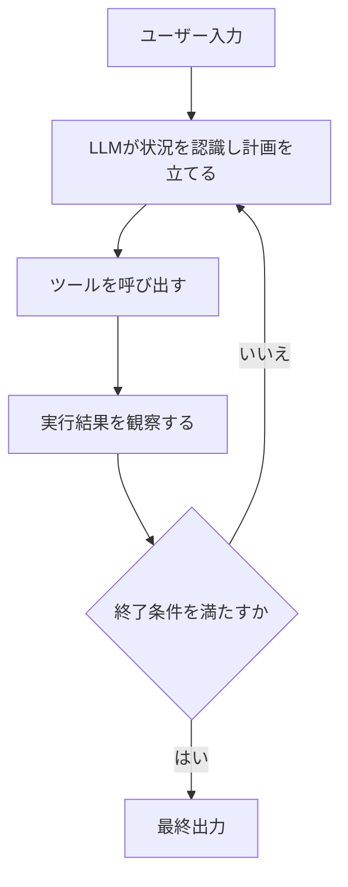

OpenAIが公開した「A practical guide to building agents」でも、この「ループ（run）」こそが単一エージェント・マルチエージェントの両方に共通する中核概念だと説明されています。ツールを段階的に増やしていくだけで単一エージェントは多くのタスクをこなせるため、**まず単一エージェントで行けるところまで行く**のが定石です。

### 0.2 単一エージェントの限界

単一エージェントには次のような限界があります。

| 限界 | 内容 |
|---|---|
| コンテキストウィンドウの上限 | 大規模な調査や長時間タスクでは、必要な情報がコンテキスト長を超えてしまう |
| 逐次処理のボトルネック | 独立した複数の方向性を同時に探索できず、幅優先の探索ができない |
| Context Rot（後述） | 入力トークン数が増えるほど、モデルの回答品質が非一様に劣化する現象がChromaの研究で確認されている |
| 専門性の分散困難 | 1つのプロンプト・1つのツールセットに、性質の異なる複数の専門知識を詰め込みにくい |

### 0.3 マルチエージェントシステムとは

マルチエージェントシステム（MAS）は、複数のLLMエージェントが役割・コンテキスト・ツールを分担しながら、1つの目的に向かって協調するシステムです。Anthropicのエンジニアリングチームは、人類が「個人としての知能」ではなく「集団としての協調」によって文明を進歩させてきたことになぞらえ、「知能がある閾値に達すると、マルチエージェントシステムは性能をスケールさせるための重要な手段になる」と述べています。

---

## 第1部　なぜマルチエージェントなのか — 効果とコスト、そして反論

### 1.1 Anthropicの知見：90.2%の性能向上と15倍のトークンコスト

Anthropicは自社のResearch機能を、リードエージェントが計画を立て複数のサブエージェントを並列に生成する「オーケストレーター・ワーカー（orchestrator-worker）」パターンで構築しました。内部評価では、Claude Opus 4をリードエージェントに、Claude Sonnet 4をサブエージェントに使ったマルチエージェント構成が、単一のClaude Opus 4に対して**リサーチタスクで90.2%の性能向上**を示しました。この改善の80%はトークン使用量の差で説明でき、並列に独立したコンテキストウィンドウを使えることが単一エージェントでは実現できないスケーリングを可能にしています。

一方で、マルチエージェントシステムは**通常のチャットに比べて約15倍のトークンを消費**します。したがって「成果の価値がコストを上回るタスク」に絞って採用すべきだというのがAnthropicの結論です。

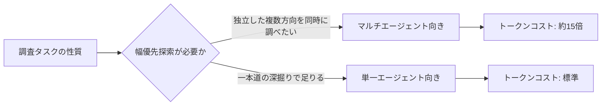

### 1.2 いつマルチエージェントを使うべきか

Anthropicの知見をもとに整理すると、マルチエージェントが向くのは次のようなケースです。

- 幅優先探索（breadth-first）が有効な、独立した複数の調査方向がある問題
- 1つのコンテキストウィンドウに収まらない量の情報を扱う必要がある問題
- 専門性の異なる複数の役割（検索・検証・執筆など）に明確に分解できる問題
- 読み取り専用（read-only）で、誤りのコストが比較的低いタスク

### 1.3 反論：Cognitionの「Don't Build Multi-Agents」

Anthropicのブログ公開からわずか1日後、Devin/Windsurfを開発するCognition社のWalden Yan氏（共同創業者・CPO）は「Don't Build Multi-Agents（マルチエージェントを作るな）」という反対の主張を公開し、大きな論争を呼びました。Cognitionが提示する原則は次の2つです。

1. **コンテキストを共有せよ、しかも個々のメッセージだけでなくエージェントの行動履歴全体を共有せよ**
2. **意思決定を、対立が起こりうる形で分割してはならない**

Yan氏の主張は、複数のサブエージェントが断片化したコンテキストの中でそれぞれ意思決定をすると、決定同士が矛盾し脆いシステムになるというものです。彼が推奨するのは、可能な限り**単一スレッド（single-threaded）で連続したコンテキストを持つエージェント**であり、コンテキストウィンドウが溢れるほどの長時間タスクに限り、行動履歴を要約・圧縮する専用のモデルを導入する設計です。

### 1.4 両者の折衷点：Single-Writer原則

2026年4月、Yan氏はフォローアップ記事「Multi-Agents: What's Actually Working」で主張を精緻化しました。そこでの結論は「**書き込み（実際に環境へ作用する操作）はシングルスレッドに保ち、追加のエージェントは行動ではなく知性を提供する**（=助言・レビュー・調査に徹する）ときに、マルチエージェントは最もうまく機能する」というものです。並列に「書き込み」を行うエージェント群（parallel-writer swarm）は依然として避けるべきだが、単一の実行者を複数のアドバイザーエージェントが支える構成は有効、という折衷案です。

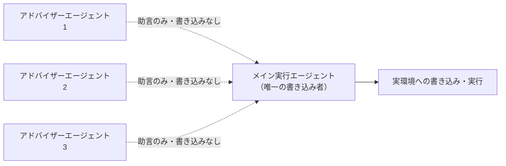

興味深いことに、Cognition自身も同じ記事の中で「Anthropicが翌日に類似の課題認識に基づくマルチエージェント研究システムの記事を発表しており、両者は読み取り専用エージェントという適用領域の第一歩について似た結論に達していた」と振り返っています。つまり対立は見た目ほど大きくなく、**「読み取り中心・探索中心のタスクでは並列マルチエージェントが有効、書き込み・実行が絡むタスクではシングルライターを守る」**という設計指針に収束しつつあります。

---

## 第2部　基本設計パターン9種

ここからは、実務でよく使われる9つのオーケストレーションパターンを解説します。OpenAIの実務ガイドは、マルチエージェント設計を大きく「集中管理型（manager）」と「分散型（decentralized）」の2つに分類しており、以下のパターンもこの軸に沿って整理できます。

### 2.1 パイプライン（逐次実行）パターン

最も単純な形。各エージェントが順番にタスクを処理し、前段の出力が次段の入力になります。

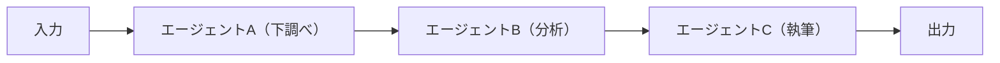

- **向いている場面**：処理の順序が明確で、各段階が独立したスキルを要する場合（例：調査→分析→レポート作成）
- **弱点**：前段のエラーがそのまま後段に伝播する。並列化の恩恵が得られない

#### 実装例：3段パイプラインを動かす

上図の「下調べ → 分析 → 執筆」をそのままコードにしたものです。`Stage` に「役割（システムプロンプト）」だけを持たせ、前段の出力を次段の入力へ渡していく点がパイプラインの本質で、段の増減はタプルへの追加・削除だけで済みます。

このコードには、上で挙げた**弱点への対策**も入れてあります。`stop_reason` が `end_turn` 以外（特に `max_tokens` による途中打ち切り）のときに例外を投げているのは、**壊れた出力を次段へ渡さない**ためです。パイプラインでは前段のエラーが後段へ伝播するため、段の境界が唯一の検査ポイントになります。

なお `max_tokens` は思考（thinking）と最終応答の合計に掛かる上限です。`claude-opus-5` は `thinking` を省略すると適応的思考（adaptive thinking）が既定で有効になるため、1024 程度では思考の途中で打ち切られ、上記の `RuntimeError` 経路に落ちやすくなります。ここでは非ストリーミング呼び出しの既定値として 16000 を与えています。

またレスポンス本文を取り出す `extract_text` は `content[0].text` と決め打ちしていません。思考（thinking）が有効なモデルではレスポンスの先頭が `thinking` ブロックになるため、`type` で絞り込む必要があります。

```python
# pipeline_agents.py ― パイプライン（逐次実行）パターンの最小実装
# 前提: Python 3.10 以上（anthropic 1.x は Python 3.9 をサポートしない）
# 依存: pip install "anthropic>=1.4,<2"
# 実行: export ANTHROPIC_API_KEY=...
#       python pipeline_agents.py "社内向け生成AIガイドラインの整備"
from __future__ import annotations

import os
import sys
from dataclasses import dataclass

from anthropic import Anthropic, APIConnectionError, APIStatusError, APITimeoutError
from anthropic.types import Message

MODEL = "claude-opus-5"


@dataclass(frozen=True)
class Stage:
    """パイプラインの1段。前段の出力がそのまま次段の入力になる。"""

    name: str
    system: str
    max_tokens: int


# 図の「下調べ → 分析 → 執筆」に対応する。段を足したいときはこのタプルに追加するだけでよい。
STAGES: tuple[Stage, ...] = (
    Stage(
        name="下調べ",
        system=(
            "あなたは調査担当です。与えられたテーマについて、"
            "検討すべき論点を5個、箇条書きで列挙してください。結論は書かないでください。"
        ),
        max_tokens=16000,
    ),
    Stage(
        name="分析",
        system=(
            "あなたは分析担当です。渡された論点リストを、"
            "影響度と実現難易度の2軸で評価し、優先順位を付けてください。"
        ),
        max_tokens=16000,
    ),
    Stage(
        name="執筆",
        system=(
            "あなたは執筆担当です。渡された分析結果をもとに、"
            "意思決定者向けの要約を300字程度の日本語でまとめてください。"
        ),
        max_tokens=16000,
    ),
)


def extract_text(message: Message) -> str:
    """レスポンスから text ブロックだけを連結する。

    content[0] を決め打ちしてはいけない。thinking が有効なモデルでは
    先頭が thinking ブロックになり、AttributeError で落ちる。
    """
    parts = [block.text for block in message.content if block.type == "text"]
    if not parts:
        raise ValueError("text ブロックが含まれていません")
    return "\n".join(parts)


def run_stage(client: Anthropic, stage: Stage, payload: str) -> str:
    """1段ぶんを実行する。異常な stop_reason は握りつぶさず例外にする。"""
    message = client.messages.create(
        model=MODEL,
        max_tokens=stage.max_tokens,
        system=stage.system,
        messages=[{"role": "user", "content": payload}],
    )
    if message.stop_reason == "max_tokens":
        # 途中で切れた出力を次段へ渡すと、誤りがパイプライン全体に伝播する
        raise RuntimeError(f"{stage.name}: max_tokens に達して出力が途中で切れました")
    if message.stop_reason != "end_turn":
        raise RuntimeError(f"{stage.name}: 想定外の stop_reason={message.stop_reason}")
    return extract_text(message)


def run_pipeline(client: Anthropic, topic: str) -> str:
    """前段の出力を次段の入力へ渡していく。これがパイプラインの本体。"""
    payload = topic
    for stage in STAGES:
        payload = run_stage(client, stage, payload)
        # 段の中身（payload）は標準エラーへ出さない。エージェント間で受け渡される
        # 中間出力は入力データの断片を含みうるため、ログ収集基盤や CI のジョブログへ
        # そのまま流れると機密情報の漏洩経路になる。内容ハッシュも残さない。
        # 短い中間出力は候補を推測して再計算すれば照合できてしまい、
        # 切り詰めたダイジェストであっても内容の指紋として機能するため。
        # ここでは追跡に必要な監査メタデータ（段名・長さ）だけを残す。
        print(
            f"--- {stage.name} 完了 (chars={len(payload)}) ---",
            file=sys.stderr,
        )
    return payload


def main() -> int:
    if len(sys.argv) != 2:
        print("usage: python pipeline_agents.py <テーマ>", file=sys.stderr)
        return 2

    api_key = os.environ.get("ANTHROPIC_API_KEY")
    if not api_key:
        print("環境変数 ANTHROPIC_API_KEY が未設定です", file=sys.stderr)
        return 2

    # SDK 既定値（timeout=600秒 / max_retries=2）は用途に合わせて明示的に上書きする
    client = Anthropic(api_key=api_key, timeout=120.0, max_retries=2)

    try:
        print(run_pipeline(client, sys.argv[1]))
    except APIStatusError as exc:
        print(f"API エラー ({exc.status_code}): {exc.message}", file=sys.stderr)
        return 1
    # APITimeoutError は APIConnectionError のサブクラス。先に捕捉しないと到達しない。
    except APITimeoutError:
        print(f"タイムアウト（{client.timeout} 秒）。再試行後も応答がありません", file=sys.stderr)
        return 1
    except APIConnectionError as exc:
        print(f"接続に失敗しました: {exc}", file=sys.stderr)
        return 1
    except (RuntimeError, ValueError) as exc:
        print(f"パイプライン中断: {exc}", file=sys.stderr)
        return 1
    return 0


if __name__ == "__main__":
    raise SystemExit(main())
```

段ごとの中間出力そのものをログへ出すと、パイプラインが扱った入力データが標準エラー経由でログ基盤へ蓄積されます。既定では段名・文字数といった監査メタデータのみを記録し、本文をそのまま出力するデバッグは明示的なデバッグフラグ（環境変数や `--debug` オプション）でのみ有効化してください。その際も、機密項目のマスキング・出力先へのアクセス制御・保持期間の上限をセットで用意することが前提です。

### 2.2 並列（コンカレント）パターン

同じ入力に対して複数のエージェントが独立に処理し、結果を集約します。

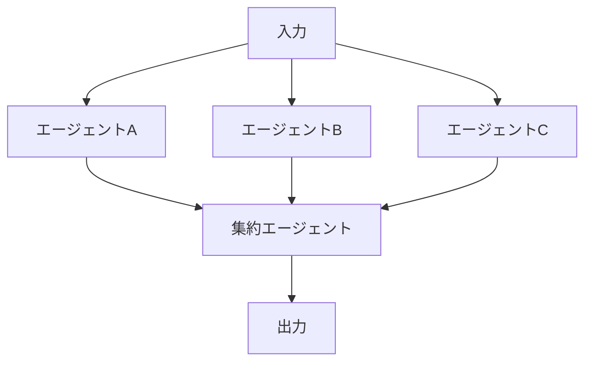

- **向いている場面**：異なる視点・異なるツールで同じ問題に多角的にアプローチしたい場合（例：複数の投資アナリストの意見を集約する）
- **弱点**：集約ロジックが複雑になりやすく、結果の矛盾をどう解決するかの設計が必要

### 2.3 オーケストレーター・ワーカーパターン

中央のオーケストレーター（リードエージェント）が計画を立て、複数のワーカー（サブエージェント）に独立したタスクを委任し、結果を統合します。Anthropicの研究システムがこの代表例です。

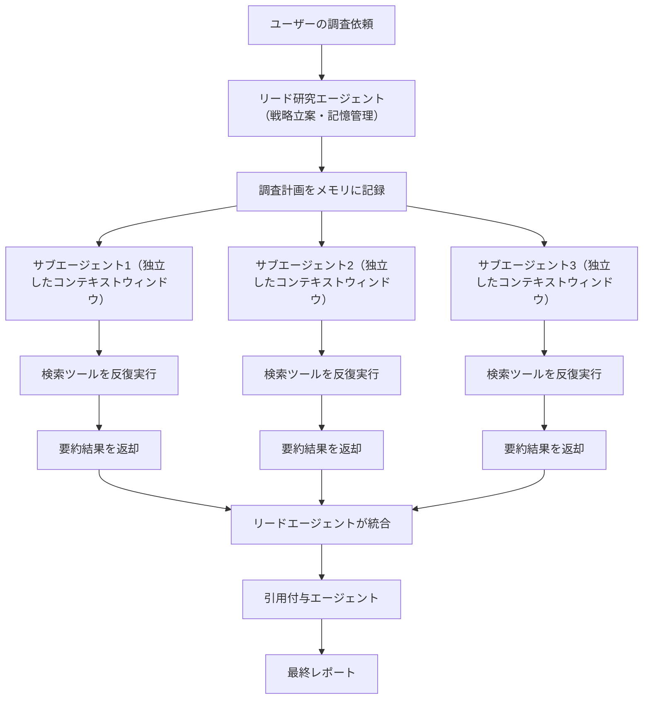

- **設計上の要点**：ワーカーは互いに直接会話しない。すべての意思決定はオーケストレーターに集約される（トポロジーが制約される＝挙動を予測しやすい）
- **委任の質が命**：各サブエージェントには「目的」「出力フォーマット」「使うべきツールと情報源」「タスクの境界」を明確に与えないと、作業の重複や漏れが生じるとAnthropicは報告しています

### 2.4 マネージャー（Agents-as-Tools）パターン

OpenAIの実務ガイドが紹介するもう1つの集中管理型パターン。オーケストレーター・ワーカーと似ていますが、専門エージェントを「ツール」として呼び出す形式で実装される点が特徴です。会話の主導権は常に中央のマネージャーが保持し続けます。

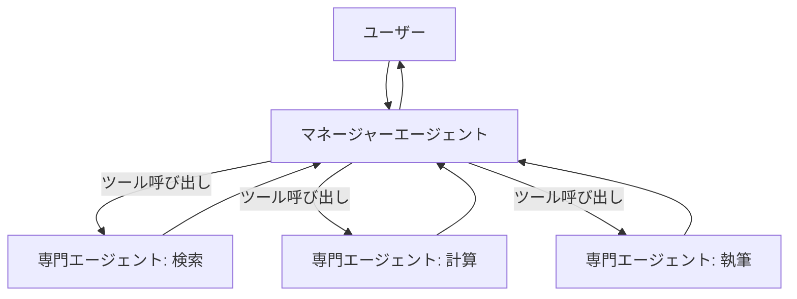

### 2.5 ハンドオフ（分散型）パターン

エージェント間で会話の主導権そのものを受け渡す「分散型」パターン。カスタマーサポートのトリアージのように、最初に応対したエージェントが適切な専門エージェントへ会話を完全に引き継ぐ場合に向いています。

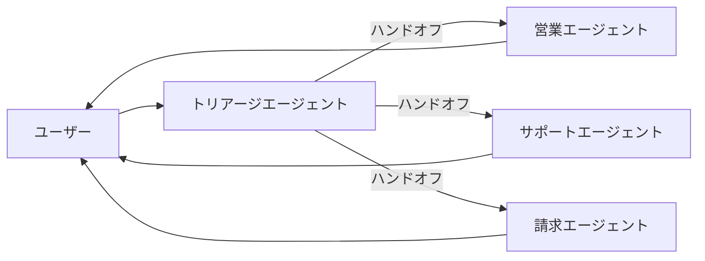

OpenAIのAgents SDKドキュメントは、マネージャー型を「エッジがツール呼び出しを表す」構成、ハンドオフ型を「エッジがエージェント間の主導権移譲を表す」構成として、両者をグラフとしてモデル化できると説明しています。

### 2.6 階層型（スーパーバイザー・オブ・スーパーバイザーズ）パターン

LangGraphの `langgraph-supervisor` ライブラリが提唱する構成で、スーパーバイザーが別のスーパーバイザー（チームリーダー）を管理し、そのチームリーダーがさらに個別のワーカーを管理する多層構造です。

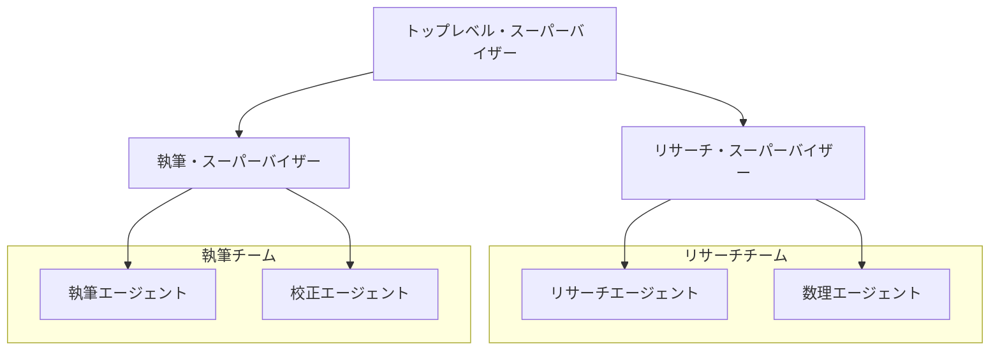

- **向いている場面**：組織図のようにチームが階層化されており、各チーム内でのみ密な連携が必要な大規模タスク
- **弱点**：階層が深くなるほどレイテンシとトークンコストが積み上がる

### 2.7 ネットワーク（ピアツーピア）パターン

中央のオーケストレーターを置かず、エージェント同士が対等な立場で直接対話し、状態を共有する構成です。柔軟性は高い一方、全体の挙動を追跡・検証するのが難しくなります。

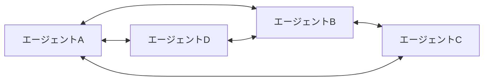

### 2.8 討論・投票（Debate / Voting）パターン

複数のエージェントに独立して案を出させ、審判役のエージェント（または多数決）が最終判断を下す構成です。単一の視点によるバイアスを緩和したい場合に有効です。

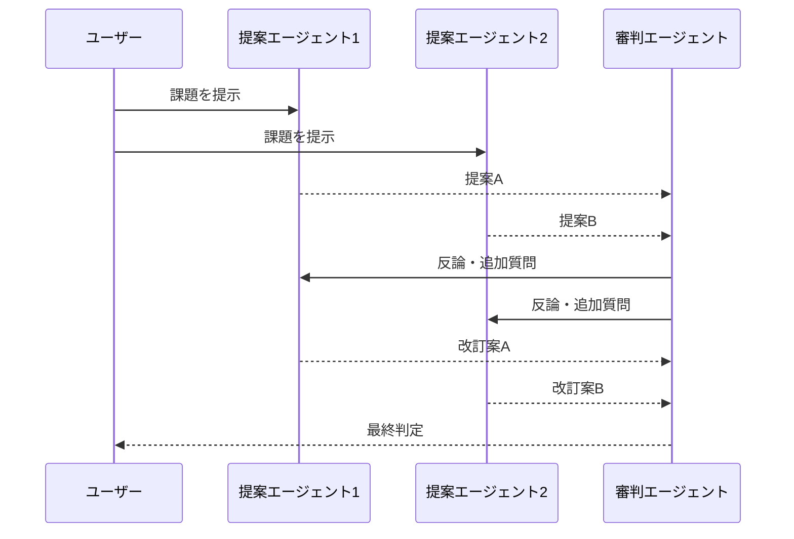

### 2.9 ブラックボードパターン

古典的なAIアーキテクチャの1つ。複数の「知識源エージェント」が共有の掲示板（ブラックボード）に情報を書き込み、制御エージェントがそれを見て次にどの知識源を動かすかを決定します。

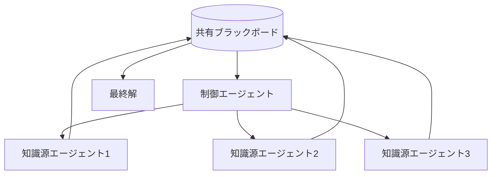

### 2.10 パターン選択の判断基準

| パターン | 向いている用途 | 主な利点 | 主な弱点 |
|---|---|---|---|
| パイプライン | 順序が明確な多段処理 | 実装が単純・デバッグしやすい | 並列化不可、前段の誤りが伝播 |
| 並列 | 多角的な分析・意見集約 | 幅優先の探索、レイテンシ短縮 | 集約ロジックの複雑さ |
| オーケストレーター・ワーカー | 大規模な調査・探索タスク | 挙動が予測しやすい、独立コンテキストで並列性を確保 | トークンコストが高い（約15倍） |
| マネージャー（Agents-as-Tools） | 専門知識の呼び出し | 主導権が中央に残り制御しやすい | マネージャーがボトルネックになりうる |
| ハンドオフ（分散型） | カスタマーサポート等のトリアージ | 専門エージェントへの完全な引き継ぎが自然 | 引き継ぎ後の一貫性維持が課題 |
| 階層型 | 組織的な大規模タスク | チームごとに関心を分離できる | 階層が深いほどコスト増 |
| ネットワーク | 高い柔軟性が必要な探索的タスク | 制約が少なく創発的な協調が可能 | 挙動の予測・デバッグが困難 |
| 討論・投票 | バイアス低減、意思決定の質向上 | 多様な視点を統合できる | ラウンド数に比例してコスト増 |
| ブラックボード | 異種の専門知識を段階的に統合 | 知識源の追加・差し替えが容易 | 制御ロジックの設計が難しい |

---

## 第3部　コンテキストエンジニアリングと状態設計

### 3.1 コンテキストウィンドウという希少資源

Anthropicは自社の実務記事「Effective context engineering for AI agents」の中で、コンテキストウィンドウを「有限で希少な資源」と表現しています。マルチエージェント設計における多くの意思決定は、突き詰めると「どの情報を、どのエージェントの、どの時点のコンテキストに入れるか」という配分問題に帰着します。

### 3.2 Context Rot（コンテキストの劣化）

ベクトルデータベース企業Chromaの研究「Context Rot: How Increasing Input Tokens Impacts LLM Performance」は、GPT-4.1・Claude 4・Gemini 2.5・Qwen3など18の最新モデルを対象に、入力トークン数を増やすと（たとえタスクの難易度を一定に保っても）モデルの性能が一様ではなく劣化していくことを実証しました。この現象は「Context Rot」と呼ばれています。同研究が実験として直接報告しているのは、次のような**観測された性能劣化**です。

1. **入力トークン数そのものの影響**：探索すべき情報量やタスク難易度を一定に保っても、入力を長くするだけで正答率が下がる
2. **ディストラクターの影響**：探している内容と意味的に似ているが無関係な文を混ぜると精度が落ち、その度合いは入力が長いほど大きくなる
3. **文書構造の影響**：論理的に連続した文書よりも、文をシャッフルした非連続な文書のほうが成績が良いという、直感に反する結果が出るモデルがある

これらが**なぜ**起きるのかは、同研究が確定させたものではありません。注意が先頭と末尾に偏る「Lost-in-the-middle効果」（Liuらの別研究による指摘）や、入力長に対して二次的に増える注意計算のなかで関連性の低いトークン対が支配的になる「注意の希釈」といった説明は、現時点では**仮説であり今後の検証課題**として扱うのが妥当です。設計上重要なのは機序の断定ではなく、「長い入力は、難易度が同じでも性能を落としうる」という観測結果のほうです。

「コンテキストウィンドウが大きい＝たくさん詰め込んでよい」という発想はこの研究によって否定されており、マルチエージェント設計で各エージェントのコンテキストを意図的に分離・圧縮することの技術的な裏付けになっています。

### 3.3 分離境界（Isolation Boundary）の設計

Anthropicが指摘する、マルチエージェント設計における最重要の意思決定が「各サブエージェントは、他のエージェントの状況についてどこまで知る必要があるか」という**分離境界**の設計です。リサーチのようなタスクでは「ほぼ何も知らなくてよい」という割り切りが機能する一方、Cognitionが主張するように、コーディングのような一貫性が問われるタスクでは、行動履歴全体を共有したほうがうまくいきます。

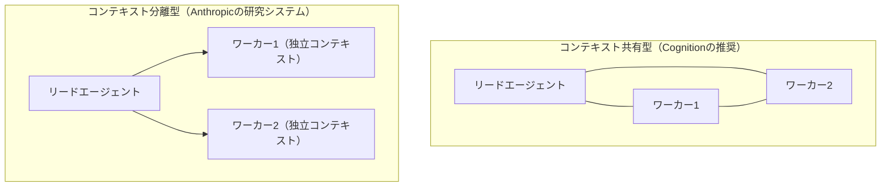

### 3.4 圧縮（Compaction）とノートテイキング

長時間タスクでコンテキストが溢れる場合、Anthropicは主に3つの手法を挙げています。

| 手法 | 概要 | 向いている場面 |
|---|---|---|
| 圧縮（Compaction） | 会話履歴を要約し、重要な決定・イベントのみを残して古い詳細を削る | 長い対話の流れを維持したいタスク |
| ノートテイキング | エージェントが外部メモリ（ファイル等）に節目ごとのメモを書き出す | マイルストーンが明確な反復的な開発作業 |
| マルチエージェント化 | 探索を複数の独立したコンテキストに分割する | 並列探索が有効な複雑な調査・分析タスク |

### 3.5 Single-Writer原則（再掲）

第1部で紹介した「書き込みは常に単一の実行者に集約する」という原則は、コンテキスト設計の観点からも理にかなっています。複数の書き込み者が同じ状態を非同期に更新すると、各エージェントが古いコンテキストに基づいて矛盾した判断を下すリスクが高まるためです。

---

## 第4部　エージェント間通信プロトコル

2025年から2026年にかけて、エージェント間の相互運用性を支える複数のオープンプロトコルが整備され、標準化団体の傘下に統合される動きが進みました。

### 4.1 MCP（Model Context Protocol）

Anthropicが2024年11月にオープンソース化した、AIアプリケーションを外部のデータやツールに接続するための標準プロトコルです。1年でMCPは月間9,700万件のSDKダウンロード、1万件超の稼働中サーバーを抱える業界標準に成長し、ChatGPT・Claude・Cursor・Gemini・Microsoft Copilot・VS Codeなど主要なAI製品に採用されました。2025年12月9日、AnthropicはMCPをLinux Foundation傘下の新設団体「Agentic AI Foundation（AAIF）」へ寄贈し、ベンダー中立なガバナンスのもとで運営される体制に移行しました。

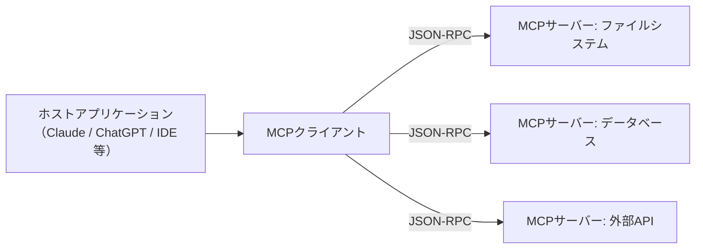

### 4.2 A2A（Agent2Agent Protocol）

Googleが2025年4月に発表した、異なるベンダー・フレームワークで作られたエージェント同士が発見し合い、対話し、タスクを委任し合うためのオープンプロトコルです。同年6月にはLinux Foundationへ寄贈され、Amazon・Cisco・Microsoft・Salesforce・SAP・ServiceNowなど100社以上が支持する標準に成長しました。2026年8月時点でA2Aは150組織以上の支持を得て、サプライチェーン・金融・保険・IT運用など複数業界で本番運用に入っています。同月、A2AはLinux Foundationの広い傘下からAAIF（Agentic AI Foundation）へと管轄を移し、MCPと並ぶ「エージェント間対話の標準層」として位置づけられています。

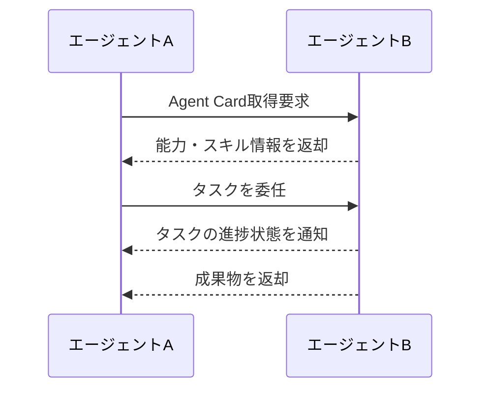

MCPとA2Aはしばしば対立するものと誤解されますが、実際には**補完関係**にあります。MCPは「エージェントがツールやデータにどう接続するか」を、A2Aは「エージェント同士がどう対話し役割分担するか」を扱う、レイヤーの異なる標準です。

### 4.3 ACPとAGENTS.md

- **ACP（Agent Communication Protocol）**：IBM Researchが開発した、FIPA-ACLの系譜を引く交渉指向のプロトコルで、propose/accept/reject/counterのような型付きの発話行為（performative）によるマルチターン対話を形式化していました。**ACPは2025年8月にLinux FoundationのLF AI & Data配下でA2Aへ統合済み**（`i-am-bee/acp` リポジトリは2025年8月27日にアーカイブされ read-only 化）であり、独立したプロトコルとして選定する対象ではありません。旧ACP資料や既存実装を参照する場合は、交渉的対話の概念モデル（提案・受諾・拒否・カウンタ）は設計の参考として活かしつつ、実装面はA2A（Agent Cardによる能力公開、タスク委任、進捗状態の通知）へ読み替えます。
- **AGENTS.md**：OpenAIが2025年8月に公開した、コーディングエージェント向けにリポジトリ固有の指示（ビルド手順やコーディング規約）を伝えるためのシンプルなMarkdown規約です。Linux Foundationのプレスリリース（2025年12月9日時点）によれば、6万件を超えるオープンソースプロジェクトおよびエージェントフレームワーク（Amp・Codex・Cursor・Devin・Factory・Gemini CLI・GitHub Copilot・Jules・VS Codeなど）に採用されています（母集団は「AGENTS.mdを採用した公開プロジェクト・フレームワーク」。出典は末尾参考文献のAAIF設立プレスリリース）。

### 4.4 Agentic AI Foundation（AAIF）とプロトコルの地形図

2025年12月9日、Linux Foundationは「Agentic AI Foundation（AAIF）」の設立を発表しました。Anthropic・Block・OpenAIが共同で設立し、Google・Microsoft・AWS・Cloudflare・Bloombergが支援するディレクテッドファンドです。設立時点でMCP（Anthropic）、goose（Block製のエージェントフレームワーク）、AGENTS.md（OpenAI）の3プロジェクトが創設プロジェクトとして寄贈されました。

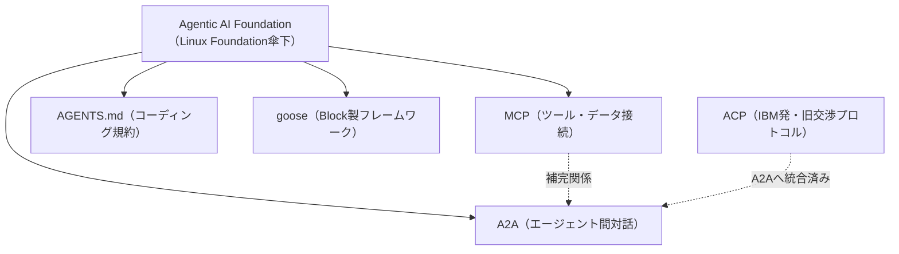

| プロトコル | 開発元 | 主目的 | 現在の管轄 |
|---|---|---|---|
| MCP | Anthropic | エージェントとツール・データの接続 | AAIF（Linux Foundation） |
| A2A | Google | エージェント間の発見・対話・タスク委任 | AAIF（Linux Foundation） |
| ACP | IBM Research | 型付き発話行為による交渉的対話（旧仕様） | A2Aへ統合済み（単独のプロトコルとしては提供されない） |
| AGENTS.md | OpenAI | コーディングエージェントへのリポジトリ規約伝達 | AAIF（Linux Foundation） |

---

## 第5部　メモリアーキテクチャ

マルチエージェントシステムでは、「誰が」「何を」「どのくらいの期間」記憶するかの設計がシステムの信頼性を大きく左右します。

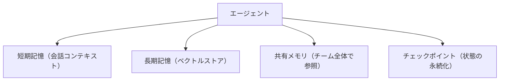

| メモリ種別 | 役割 | 実装例 |
|---|---|---|
| 短期記憶 | 現在のタスクに関する直近のやり取り | 会話履歴、スクラッチパッド |
| 長期記憶 | セッションを跨いで保持したい知識・事実 | ベクトルストア＋RAG、要約済みメモファイル |
| 共有メモリ | 複数エージェントが参照・更新する共通の状態 | ブラックボード、共有ドキュメント、Redis等のキー・バリューストア |
| チェックポイント | 実行状態のスナップショットと再開ポイント | LangGraphのcheckpointer、セッションストア |

Anthropicのリードエージェントが「調査計画をメモリに記録する」設計（第2部）は、長時間の調査でコンテキストウィンドウの上限を超えても計画自体を見失わないための、長期記憶の典型的な使い方です。

---

## 第6部　ツール利用と権限設計

### 6.1 ツール設計原則

OpenAIの実務ガイドは、ツールの説明・スキーマを明確にすることで、モデルの発見性を高め、バージョン管理を単純化し、重複した定義を防げると指摘しています。ツールは大きく「データ取得系」「アクション実行系」「他エージェント呼び出し系」に分類できます。

### 6.2 最小権限の原則

マルチエージェントシステムでは、すべてのエージェントに同じ権限を与えるのではなく、タスクの性質に応じて権限を絞り込むことが重要です。外部への書き込みや金銭・機密情報に関わる操作を行うエージェントに、人間の承認ゲートを挟むのは定石です。

一方で、**「読み取り専用だから承認不要」と一律に扱ってはなりません**。後述のLethal Trifectaは、(1) 機密データへアクセスする、(2) 非信頼な入力（Webページ、受信メール、外部エージェントの応答など）を処理する、(3) 外部へ通信できる――の**3つが同一セッションに同時に揃ったとき**に成立し、プロンプトインジェクションによる情報漏洩の経路になります。読み取り専用のエージェントもこの例外ではありません。3つすべてが揃っていなくても、いずれか1つに該当する時点で「残りの要素が後から加わらないか」を点検し、追加統制の要否を検討する契機としてください。3条件が同時に揃う場合は、次の統制を前提条件とします。

- **送信先の制限**：外部送信は許可した宛先（ドメイン・エンドポイント）のみに限定し、任意のURLへの送信を禁じる。
- **機密データの除外**：送信ペイロードから資格情報・個人情報などの機密データを除外する（フィルタと監査ログをセットで用意する）。
- **人間の承認**：上記の統制が十分に効かない場合、または機密データがシステム外へ出る可能性が残る場合は、承認なしの実行を認めない。

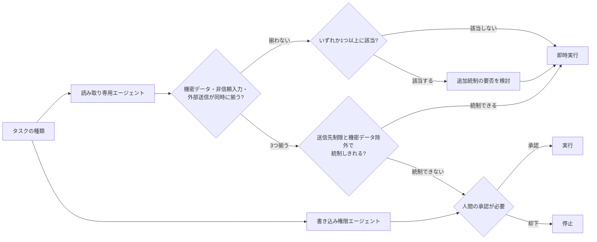

### 6.3 サンドボックス化

ツール実行の副作用を隔離するため、コード実行やファイル操作は専用のサンドボックス環境で行い、本番環境や機密データへの直接アクセスを避けるのが望ましい設計です。これは次章のセキュリティ設計とも密接に関係します。

---

## 第7部　評価とオブザーバビリティ

### 7.1 評価駆動開発（Evaluation-Driven Development）

マルチエージェントシステムは非決定的（同じ入力でも毎回異なる経路を辿りうる）であるため、従来のソフトウェアテストだけでは不十分です。Anthropicは、マルチエージェントシステムのプロトタイプから本番移行までの過程で、「初期段階では少数のテストケースに対する詳細な観察から始め、エージェントが失敗するパターンを見つけ、それに応じて評価基準を継続的に見直す」評価駆動のアプローチが不可欠だったと報告しています。

### 7.2 OpenTelemetry GenAI Semantic Conventions

観測基盤側では、OpenTelemetryプロジェクトがLLM呼び出し・エージェントの推論ステップ・ツール呼び出し・MCP通信を標準化された属性で計装するための「GenAI Semantic Conventions」を整備しています。2026年6月にはGenAI関連の規約が専用リポジトリへ切り出され、独立してバージョン管理されるようになりました。2026年8月時点でこの規約はまだ「Development」ステータスであり、確定した標準ではないものの、モデル呼び出し・トークン使用量・エージェント操作（作成／呼び出し／計画／ツール実行）・MCP通信・評価結果（`gen_ai.evaluation.result`）まで一貫した語彙でトレースできる点が実務上の価値です。

名前空間は用途で分かれている点に注意が必要です。**MCP固有の属性は`mcp.*`名前空間**に置かれ、リソース（`mcp.resource.uri`）・メソッド（`mcp.method.name`）・セッション（`mcp.session.id`）といったMCP特有の概念を表します。ただし`mcp.session.id`が指す**プロトコルレベルのセッションは、MCP仕様のリビジョン`2026-07-28`で`Mcp-Session-Id`ヘッダーごとStreamable HTTPから削除されました**（同リビジョンのサーバは`Mcp-Session-Id`を受け取っても無視し、セッションIDを発行も反響もしません）。したがってこの属性が意味を持つのは`2025-11-25`以前のリビジョン、またはそれらと相互運用するための後方互換経路に限られます。現行リビジョンを前提とする計装では、セッションIDに依存せず、アプリケーションが明示的に持つ状態ハンドル（会話IDやタスクIDなど）と、リクエスト単位の相関（トレースID／スパンID、JSON-RPCの`id`）で紐付けてください。接続先サーバの識別には、MCP固有の属性ではなく汎用のサーバ属性（`server.address`、`server.port`）を使います。一方、**ツールの引数や実行結果のようにMCPに限定されない共通概念は`gen_ai.*`のまま**（`gen_ai.tool.name`、`gen_ai.tool.call.arguments`、`gen_ai.tool.call.result`など）です。MCP経由のツール呼び出しを計装する際は、1つのスパンに両名前空間の属性が同居することになります。

ただし`gen_ai.tool.call.arguments`と`gen_ai.tool.call.result`は、ツールへ渡した引数と実行結果の中身そのものであり、認証情報・個人情報・社外秘データを含み得ます。このため規約上これらは**既定では記録されないOpt-In属性**と位置づけられており、計装側が提供する明示的なOpt-In設定で有効化した場合にのみ出力されます。これはOpenTelemetry SDK全体に共通する単一の設定ではなく、言語ごとの計装実装が用意する点に注意してください。例えばOpenTelemetry Pythonでは`opentelemetry-util-genai`と対応する計装が環境変数`OTEL_INSTRUMENTATION_GENAI_CAPTURE_MESSAGE_CONTENT`を提供しており、既定値の`NO_CONTENT`（内容を記録しない）に対して`SPAN_ONLY` / `EVENT_ONLY` / `SPAN_AND_EVENT`を明示的に指定したときだけ内容が出力されます。有効化する場合は、機微な値のマスキング（トークンやメールアドレスの伏字化）、トレースバックエンド側でのアクセス制御、保持期間の短縮といった保護策を併せて適用してください。これらを用意できないうちは無効のままにしておくのが安全です。

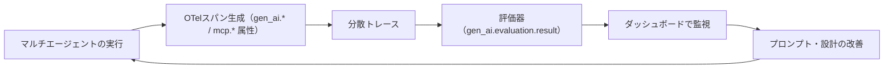

### 7.3 主要メトリクス

| メトリクス種別 | 具体例 |
|---|---|
| コスト・効率 | トークン使用量、API呼び出し回数、レイテンシ |
| 品質 | タスク成功率、LLM-as-Judgeによる評価スコア、人間評価との一致率 |
| 協調の健全性 | サブエージェント間の重複作業率、タスク漏れの発生率 |
| 安全性 | ガードレールの発火回数、人間承認ゲートでの却下率 |

---

## 第8部　安全性とセキュリティ設計

マルチエージェントシステムは、ツールを介して外部の世界に触れる分だけ、単一のチャットボットよりも攻撃対象領域（アタックサーフェス）が広がります。

### 8.1 Lethal Trifecta（致死の三要素）

セキュリティ研究者Simon Willison氏が2025年6月16日に提唱した概念で、次の3つの能力が**同一のエージェントセッション内に同時に揃う**と、攻撃者は特別なハッキング技術なしにデータを窃取できてしまうというものです。

1. **プライベートデータへのアクセス**（メール、社内文書、顧客情報など）
2. **信頼できない外部コンテンツへの露出**（Webページ、受信メール、Issueコメントなど攻撃者が書き込める場所）
3. **外部への通信手段**（メール送信、Pull Request作成、APIコールなど）

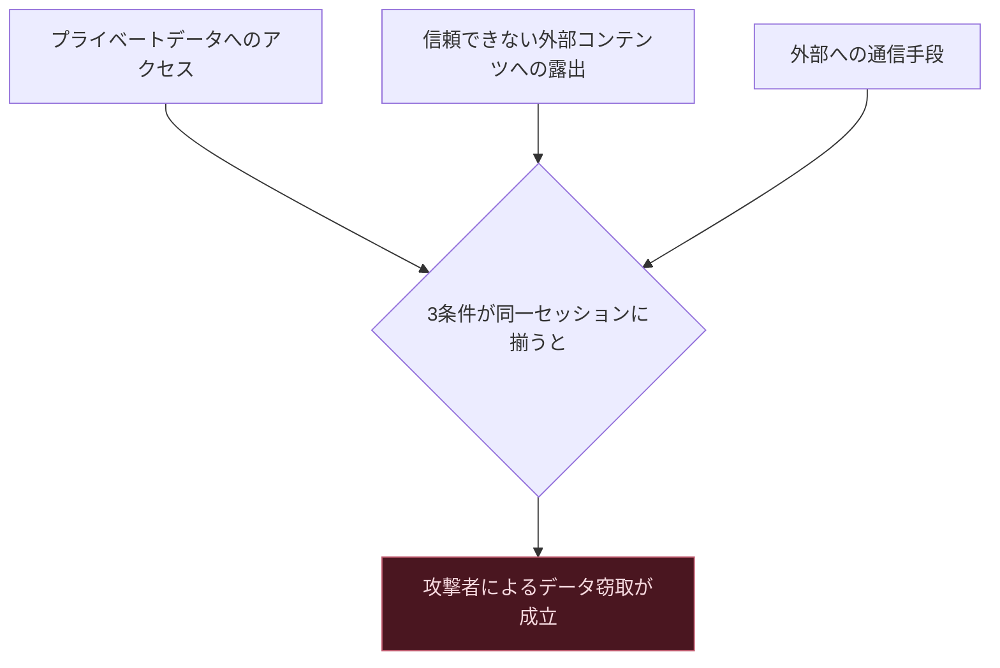

Willison氏自身が「この問題を100%確実に防ぐ方法は、いまだにわかっていない」と述べているとおり、ガードレール製品による検知だけに頼るのは危険です。実際に報告されたGitHub MCPの脆弱性は、1つのMCPサーバーが「攻撃者が書き込める公開Issueの読み取り」「プライベートリポジトリへのアクセス」「Pull Request作成による外部送信」という三要素をすべて備えていたために悪用されました。**唯一の確実な対策は、この三要素が同一セッションに同時に揃う設計そのものを避けること**です。

### 8.2 OWASP Top 10 for Agentic Applications（2026年版）

OWASP GenAI Security Projectは2025年12月、自律的に計画・記憶・ツール実行・権限行使を行うエージェント特有のリスクを対象とした「OWASP Top 10 for Agentic Applications 2026」を公開しました。100名を超えるセキュリティ専門家によるレビューを経て、ASI01〜ASI10という識別子でリスクを分類しています。

| ID | リスクの概要 |
|---|---|
| ASI01 | エージェントのゴールハイジャック（目的の乗っ取り） |
| ASI02〜ASI09 | ツール誤用、メモリ汚染、権限昇格、監査性の欠如など、エージェント特有の攻撃面 |
| ASI10 | 暴走エージェント（Rogue Agents） |

同時に更新された「OWASP Top 10 for LLM Applications 2026」では、**「過剰な自律性（Excessive Agency）」の順位が3位まで上昇**し、エージェントが自律的にシェルコマンドを実行したり外部APIを呼んだりする本番インシデントが増えていることを反映しています。マルチエージェント設計においては、プロンプトインジェクションが両リストのうち6つのカテゴリに関連するとOWASPは指摘しており、**「モデルを騙されないようにする」のではなく「騙されたモデルが到達できる範囲を制限する」**というアーキテクチャ上の防御思想が中心に据えられています。

### 8.3 過剰な自律性への対策：Rule of Two

Lethal Trifectaへの実践的な対策として、Metaが2025年10月31日に公開した「Agents Rule of Two」という設計指針があります。これは、1回のセッションで次の3つの性質のうち**同時に満たしてよいのは最大2つまで**とする考え方です。

1. 信頼できない入力を処理する
2. プライベートデータにアクセスする
3. 外部に対して作用する（通信・実行）

3つすべてを満たす必要がある場合は自律実行を許さず、必ず人間による承認を挟みます。

### 8.4 ガードレールの多層防御

OpenAIの実務ガイドは、ガードレールを単一の防壁ではなく「層」として設計することを推奨しています。

```mermaid
flowchart TB
    In[エージジェントへの入力] --> L1[第1層: 関連性分類器]
    L1 --> L2[第2層: ツール実行前のリスク評価]
    L2 --> L3[第3層: 出力検証・PIIフィルタ]
    L3 --> L4[第4層: 人間承認ゲート]
    L4 --> Out[実行・出力]
```

### 8.5 Human-in-the-Loop設計

高リスクな操作（金銭の移動、外部への送信、本番環境への書き込みなど）や、エージェントが繰り返し失敗しているケースでは、人間の介入を安全装置として組み込むことが不可欠です。これは「効率のための例外」ではなく、マルチエージェントシステムの標準的な設計要素として位置づけるべきです。

---

## 第9部　実装フレームワークの選択（2026年版）

2026年時点で、マルチエージェントシステムの実装に使われる主要フレームワークは大きく整理が進みました。Microsoftは研究指向のAutoGenとエンタープライズ指向のSemantic Kernelを統合し、「Microsoft Agent Framework」として2026年4月2日にGA（一般提供）を迎えています。公式ドキュメントはAgent Frameworkを両者の「直接の後継（direct successor）」かつ「次世代」と位置づけており、AutoGenの単純なエージェント抽象とSemantic Kernelのエンタープライズ機能（セッションベースの状態管理・型安全・ミドルウェア・テレメトリ）を引き継いだ上で、グラフベースのワークフローを追加した設計です。AutoGen単体のリポジトリは新機能の追加を終えてコミュニティ管理へ移り、新規開発は公式の移行ガイドでAgent Frameworkへ誘導されています。

### 9.1 フレームワーク比較表

| フレームワーク | 開発元 | 得意な実行モデル | モデル依存 | 学習コスト | 主な用途 |
|---|---|---|---|---|---|
| LangGraph | LangChain | グラフ＋状態遷移、チェックポイント／タイムトラベルが強力 | モデル非依存 | 中 | 監査性・厳密な制御が必要な規制業界の本番運用 |
| CrewAI | CrewAI | 役割ベースの「クルー」定義 | モデル非依存 | 低（最短20行で開始） | 素早いプロトタイピング |
| OpenAI Agents SDK | OpenAI | ハンドオフ＋ホスト済みツール | OpenAIモデル中心 | 低 | OpenAIモデル中心の低摩擦な開発 |
| Google ADK | Google | コードファースト、階層的エージェントツリー、A2A相互運用 | Geminiに最適化（他モデルも利用可） | 中 | Google Cloud／Vertex AI中心の開発、マルチモーダル |
| Microsoft Agent Framework | Microsoft | AutoGen＋Semantic Kernelを統合、MCP／A2Aをネイティブ対応 | モデル非依存 | 中 | Azure／.NETネイティブなエンタープライズ |
| Claude Agent SDK | Anthropic | ツール利用チェーン＋サブエージェント | Claudeモデル | 中 | 安全性重視、拡張思考を活用する開発 |

### 9.2 フレームワーク選択の意思決定

```mermaid
flowchart TB
    Q1{既存のクラウド・技術基盤は} -->|Google Cloud中心| ADK[Google ADK]
    Q1 -->|Azure/.NET中心| MAF[Microsoft Agent Framework]
    Q1 -->|OpenAIモデル中心で低摩擦に始めたい| OAISDK[OpenAI Agents SDK]
    Q1 -->|マルチベンダー・規制業界で監査性が必要| LG[LangGraph]
    Q1 -->|役割ベースで素早くプロトタイプしたい| Crew[CrewAI]
    Q1 -->|Claudeモデルで安全性を重視| CSDK[Claude Agent SDK]
```

いずれのフレームワークを選んでも、業務ロジック自体は再利用可能ですが、フレームワーク固有のオーケストレーションコードは移行時に書き直しが必要になる点に留意してください。MCPやA2Aといった標準プロトコルへの対応が進むほど、この「フレームワークのロックイン」は将来的に緩和されていくと見られています。

---

## 第10部　設計チェックリストとアンチパターン

### 10.1 設計チェックリスト

- [ ] まず単一エージェント＋ツール追加で対応できないかを検討したか
- [ ] マルチエージェント化によって得られる価値が、約15倍というトークンコスト増に見合うかを見積もったか
- [ ] 各エージェントの分離境界（何を知らせ、何を知らせないか）を明示的に設計したか
- [ ] 「書き込み」を行うエージェントを単一（Single-Writer）に絞ったか
- [ ] 各サブエージェントへの委任指示に「目的」「出力フォーマット」「使うツール」「タスクの境界」を明記したか
- [ ] コンテキストが肥大化した場合の圧縮・ノートテイキング戦略を用意したか
- [ ] エージェント間通信にMCP／A2Aなどの標準プロトコルを活用できないか検討したか
- [ ] 長期記憶・共有メモリ・チェックポイントの保存先と保持期間を設計したか
- [ ] 各ツールに最小権限を割り当て、高リスク操作には人間承認ゲートを設けたか
- [ ] Lethal Trifecta（プライベートデータ・信頼できない入力・外部通信）が同一セッションに同時に揃っていないかを監査したか
- [ ] OWASP Top 10 for Agentic Applicationsに照らしたリスク評価を行ったか
- [ ] OpenTelemetry GenAI Semantic Conventions等でトレース・評価結果を計装したか
- [ ] 評価駆動開発のサイクル（失敗パターンの収集→評価基準の見直し）を回せる体制があるか

### 10.2 よくあるアンチパターン

| アンチパターン | 何が問題か |
|---|---|
| なんでもマルチエージェント化 | 単純なタスクにまでオーケストレーターを導入し、コストとレイテンシだけが増える |
| 曖昧な委任指示 | サブエージェントへの指示が抽象的すぎて、作業の重複・漏れ・目的のずれが生じる |
| 並列な書き込み者 | 複数のエージェントが同じ状態を非同期に書き換え、矛盾した結果を生む |
| コンテキストの無制限な共有 | Context Rotにより、情報を詰め込むほどかえって判断精度が落ちる |
| Lethal Trifectaの放置 | プライベートデータ・信頼できない入力・外部通信を1つのエージェントに無自覚に集約してしまう |
| 評価をリリース後回しにする | 非決定的なシステムに対して事前の評価基盤を用意せず、本番で初めて失敗パターンに気づく |

---

## 第11部　2026年9月時点の最新動向

- **プロトコル層の再編**：AnthropicはMCPを、GoogleはA2Aを、それぞれLinux Foundation傘下のAgentic AI Foundation（AAIF）へ移管し、両プロトコルは「ツール接続層（MCP）」と「エージェント間対話層（A2A）」として補完関係にあることが業界的に定着しました。IBM発のACPはA2Aへ統合済みであり、旧ACPベースの資料はA2Aへの移行情報として読み替える必要があります。
- **フレームワークの整理**：Microsoft Agent Framework 1.0が2026年4月2日にGAし、AutoGenとSemantic Kernelが統合されました。AutoGenの資産はAgent Frameworkへ引き継がれ（公式には「直接の後継」）、AutoGen単体のリポジトリは新機能追加を終えてコミュニティ管理へ移行しています。2026年時点で実務上検討すべきフレームワークはLangGraph・CrewAI・OpenAI Agents SDK・Google ADK・Microsoft Agent Framework・Claude Agent SDKの6つに整理されています。
- **セキュリティの重心が「エージェントの自律性」へ移動**：OWASP Top 10 for LLM Applications 2026で「過剰な自律性」が3位に上昇し、Agentic Applications向けのTop 10（ASI01〜ASI10）が新設されました。Simon Willison氏のLethal Trifectaは、OWASPの分類と対応づけられる形で業界共通の脅威モデルとして定着しています。
- **観測基盤の標準化が進行中**：OpenTelemetryのGenAI Semantic Conventionsは2026年6月に専用リポジトリへ切り出され独立してバージョン管理されるようになりましたが、2026年8月時点でも「Development」ステータスであり、まだ確定した仕様ではありません。
- **単一 vs マルチエージェントの論争は「使い分け」へ収束**：2025年6月に同時期に公開されたAnthropicとCognitionの対照的な記事をきっかけに始まった論争は、2026年4月のCognitionのフォローアップ記事により、「読み取り中心の探索タスクでは並列マルチエージェントが有効、書き込み・実行を伴うタスクではSingle-Writer原則を守る」という実務的な使い分けへ収束しつつあります。
- **エンタープライズでの導入加速**：Gartnerは、マルチエージェントシステムに関するクライアントからの問い合わせが2024年第1四半期から2025年第2四半期にかけて1,445%増加したと報告しています（母集団はGartnerに寄せられたクライアント問い合わせ件数）。また2025年8月26日のプレスリリースでは、2026年までにエンタープライズアプリケーションの40%がタスク特化型AIエージェントを組み込む（2025年時点では5%未満）と予測しています。いずれも出典URLは末尾の参考文献「調査・市場データ」を参照してください。一方で、導入意欲の高さに比べてガードレール・権限管理・実行ログといった運用統制の整備は遅れているとの指摘が繰り返されており、設計・セキュリティ面での成熟が導入速度に追いついていない実態があります。

---

## 学習ロードマップ

1. **基礎固め**：単一エージェントのループ（第0部）とコンテキストエンジニアリングの基本（第3部）を理解する
2. **パターンを知る**：第2部の9パターンを、実際に手元でLangGraphやCrewAIなど1つのフレームワークで最低3パターン（パイプライン・並列・オーケストレーター/ワーカー）を実装して体感する
3. **通信とメモリ**：MCP・A2A（第4部）と、短期／長期／共有メモリの設計（第5部）を、実際に外部ツールを接続しながら学ぶ
4. **評価基盤を先に作る**：本番投入前に、OpenTelemetryベースのトレーシングと評価パイプライン（第7部）を最低限用意する
5. **セキュリティレビュー**：Lethal TrifectaとOWASP Top 10 for Agentic Applications（第8部）に照らして、既存の設計を監査する
6. **フレームワーク選定**：自社のクラウド・モデル方針に合わせて第9部の比較表からフレームワークを選び、小規模なパイロットで検証する
7. **継続的改善**：チェックリスト（第10部）を運用ルールに組み込み、評価駆動でエージェントの委任指示・分離境界を継続的に見直す

---

## 用語集

| 用語 | 説明 |
|---|---|
| エージェントループ | LLMが「計画→ツール実行→観察」を終了条件まで繰り返す基本動作 |
| オーケストレーター・ワーカー | 中央のオーケストレーターが複数のワーカーへタスクを委任し結果を統合するパターン |
| ハンドオフ | エージェント間で会話の主導権そのものを受け渡す分散型の連携方式 |
| コンテキストエンジニアリング | 有限なコンテキストウィンドウに何をどう配分するかを設計する営み |
| Context Rot | 入力トークン数の増加に伴い、モデルの出力品質が非一様に劣化する現象 |
| 分離境界（Isolation Boundary） | あるエージェントが他のエージェントの状況をどこまで知るべきかの設計上の線引き |
| Single-Writer原則 | 実環境への「書き込み」を行うエージェントを常に単一に絞る設計原則 |
| MCP | エージェントを外部のツール・データに接続するための標準プロトコル |
| A2A | 異なるベンダーのエージェント同士が発見・対話・タスク委任を行うための標準プロトコル |
| Lethal Trifecta | プライベートデータアクセス・信頼できない入力・外部通信の3条件が揃うとデータ窃取が成立する脆弱な構成 |
| 過剰な自律性（Excessive Agency） | エージェントが必要以上の権限・裁量を与えられ、誤誘導された際の被害が拡大するリスク |
| Rule of Two | 1セッションで「信頼できない入力処理」「プライベートデータアクセス」「外部作用」のうち2つまでしか同時に許可しない設計指針 |
| 評価駆動開発 | 非決定的なエージェントシステムに対し、失敗パターンの観察と評価基準の見直しを継続するアプローチ |

---

## 参考文献

本ガイドの作成にあたり、以下の一次情報・著名な国際的開発者・組織の発信を優先的に参照しました（2026年9月10日時点で確認）。

**Anthropic（一次情報）**
- How we built our multi-agent research system — https://www.anthropic.com/engineering/multi-agent-research-system
- Effective context engineering for AI agents — https://www.anthropic.com/engineering/effective-context-engineering-for-ai-agents
- Donating the Model Context Protocol and establishing the Agentic AI Foundation — https://www.anthropic.com/news/donating-the-model-context-protocol-and-establishing-of-the-agentic-ai-foundation
- MCP joins the Agentic AI Foundation（Model Context Protocol公式ブログ）— https://blog.modelcontextprotocol.io/posts/2025-12-09-mcp-joins-agentic-ai-foundation/
- MCP仕様 リビジョン`2026-07-28` Streamable HTTP（プロトコルレベルのセッションと`Mcp-Session-Id`の削除、後方互換の扱い）— https://modelcontextprotocol.io/specification/2026-07-28/basic/transports/streamable-http
- MCP仕様 Versioning（現行リビジョンは`2026-07-28`）— https://modelcontextprotocol.io/specification/versioning

**OpenAI（一次情報）**
- A practical guide to building agents（PDF）— https://cdn.openai.com/business-guides-and-resources/a-practical-guide-to-building-agents.pdf
- Agents（OpenAI 公式ドキュメント。上記ガイドのWeb版に相当する内容）— https://platform.openai.com/docs/guides/agents
- OpenAI Agents SDK ドキュメント — https://openai.github.io/openai-agents-python/agents/

**Google / Linux Foundation（一次情報）**
- Linux Foundation Launches the Agent2Agent Protocol Project — https://www.linuxfoundation.org/press/linux-foundation-launches-the-agent2agent-protocol-project-to-enable-secure-intelligent-communication-between-ai-agents
- Google Cloud donates A2A to Linux Foundation（Google Developers Blog）— https://developers.googleblog.com/en/google-cloud-donates-a2a-to-linux-foundation/
- A year of open collaboration: Celebrating the anniversary of A2A（Google Open Source Blog）— https://opensource.googleblog.com/2026/04/a-year-of-open-collaboration-celebrating-the-anniversary-of-a2a.html
- A2A Protocol Surpasses 150 Organizations（Linux Foundation プレスリリース）— https://www.linuxfoundation.org/press/a2a-protocol-surpasses-150-organizations-lands-in-major-cloud-platforms-and-sees-enterprise-production-use-in-first-year
- Linux Foundation Announces the Formation of the Agentic AI Foundation（AAIF）— https://www.linuxfoundation.org/press/linux-foundation-announces-the-formation-of-the-agentic-ai-foundation
- A New Chapter for A2A: Joining the Agentic AI Foundation（A2A Protocol 公式ブログ、2026年8月27日）— https://a2a-protocol.org/latest/blog/2026/08/27/a-new-chapter-for-a2a-joining-the-agentic-ai-foundation/
- ACP Joins Forces with A2A Under the Linux Foundation's LF AI & Data（LF AI & Data、2025年8月29日。ACPのA2A統合の出典）— https://lfaidata.foundation/communityblog/2025/08/29/acp-joins-forces-with-a2a-under-the-linux-foundations-lf-ai-data/
- i-am-bee/acp（ACP公式リポジトリ。2025年8月27日にアーカイブされ、READMEにA2Aへの移行ガイドを掲載）— https://github.com/i-am-bee/acp

**Microsoft（一次情報）**
- Microsoft Agent Framework Overview（AutoGenとSemantic Kernelの「直接の後継」という公式の位置づけ）— https://learn.microsoft.com/en-us/agent-framework/overview/
- Migration Guide from AutoGen（AutoGenからAgent Frameworkへの公式移行ガイド）— https://learn.microsoft.com/en-us/agent-framework/migration-guide/from-autogen/
- microsoft/autogen（AutoGen公式リポジトリ。現状の位置づけと新規利用者への案内）— https://github.com/microsoft/autogen

**Cognition（Walden Yan、一次情報）**
- Don't Build Multi-Agents — https://cognition.ai/blog/dont-build-multi-agents
- Multi-Agents: What's Actually Working（2026年4月22日、上記記事のフォローアップ）— https://cognition.com/blog/multi-agents-working

**LangChain / LangGraph（一次情報）**
- LangGraph: Multi-Agent Workflows（LangChain公式ブログ）— https://www.langchain.com/blog/langgraph-multi-agent-workflows
- langgraph-supervisor-py（GitHub公式リポジトリ）— https://github.com/langchain-ai/langgraph-supervisor-py

**Antonio Gulli（Google, Agentic Design Patterns著者）**
- Agentic Design Patterns: A Hands-On Guide to Building Intelligent Systems（Springer Nature）— https://link.springer.com/book/10.1007/978-3-032-01402-3

**セキュリティ（一次情報）**
- The lethal trifecta for AI agents（Simon Willison氏本人のブログ、2025年6月16日）— https://simonwillison.net/2025/Jun/16/the-lethal-trifecta/
- Agents Rule of Two: A Practical Approach to AI Agent Security（Meta AI公式ブログ、2025年10月31日）— https://ai.meta.com/blog/practical-ai-agent-security/
- OWASP Top 10 for Agentic Applications for 2026 — https://genai.owasp.org/resource/owasp-top-10-for-agentic-applications-for-2026/
- OWASP GenAI LLM Top 10 2026 — https://genai.owasp.org/resource/owasp-genai-llm-top-10-2026/

**観測基盤（一次情報）**
- Inside the LLM Call: GenAI Observability with OpenTelemetry（OpenTelemetry公式ブログ）— https://opentelemetry.io/blog/2026/genai-observability/
- OpenTelemetry Python Contrib: GenAI Util（`OTEL_INSTRUMENTATION_GENAI_CAPTURE_MESSAGE_CONTENT` の値と既定値の出典）— https://opentelemetry-python-contrib.readthedocs.io/en/latest/instrumentation-genai/util.html

**研究（一次情報）**
- Context Rot: How Increasing Input Tokens Impacts LLM Performance（Chroma Research）— https://www.trychroma.com/research/context-rot

**調査・市場データ（一次情報）**
- Multiagent Systems in Enterprise AI: Efficiency, Innovation and Vendor Advantage（Gartner。問い合わせ件数1,445%増［2024年Q1→2025年Q2］の出典）— https://www.gartner.com/en/articles/multiagent-systems
- Gartner Predicts 40% of Enterprise Apps Will Feature Task-Specific AI Agents by 2026, Up from Less Than 5% in 2025（2025年8月26日発表）— https://www.gartner.com/en/newsroom/press-releases/2025-08-26-gartner-predicts-40-percent-of-enterprise-apps-will-feature-task-specific-ai-agents-by-2026-up-from-less-than-5-percent-in-2025

**参考にした対象書籍（本ガイドの主題とは異なるAEC分野の書籍）**
- Designing with Multi-Agent Systems（Evangelos Pantazis著、De Gruyter／O'Reilly）— https://www.oreilly.com/library/view/designing-with-multi-agent/9783110797473/
