# Graph Databases: New Opportunities for Connected Data 初学者ガイド

> Ian Robinson、Jim Webber、Emil Eifrem 著『Graph Databases, 2nd Edition』(O'Reilly Media)をベースに、グラフデータベースの考え方をゼロからステップバイステップで学ぶための解説記事です。本書の文章をそのまま引用するのではなく、内容を要約・再構成し、2026年9月時点の最新動向(GQL標準化、GraphRAGなど)も補足しています。

## この記事について

- **原著**: *Graph Databases: New Opportunities for Connected Data*, 2nd Edition
- **著者**: Ian Robinson, Jim Webber, Emil Eifrem(3人ともNeo4j創業メンバーもしくは元エンジニア)
- **参照元URL**: https://www.oreilly.com/library/view/graph-databases-2nd/9781491930885/
- **この記事の目的**: プログラミング経験はあるがグラフデータベースは初めて、という読者が「グラフとは何か」から「実務でどう使うか」まで一気通貫で理解できるようにする

## 対象読者

- リレーショナルデータベース(RDB)は知っているが、グラフデータベースは触ったことがない開発者
- ソーシャルグラフ、レコメンデーション、不正検知、ナレッジグラフなど「つながり」を扱うシステムに興味がある人
- 最近話題のGraphRAG(グラフを使ったRAG)の前提知識を固めたい人

## 書籍情報

| 項目 | 内容 |
|---|---|
| 原題 | Graph Databases: New Opportunities for Connected Data |
| 版 | 第2版(2015年6月) |
| 著者 | Ian Robinson, Jim Webber, Emil Eifrem |
| 出版社 | O'Reilly Media, Inc. |
| ページ数 | 236ページ |
| 難易度 | 中級から上級(ただし基礎から説明されている) |
| 主に扱うグラフDB | Neo4j(クエリ言語はCypher) |
| 無料配布 | Neo4j公式サイトから今もPDF / iBooks / Kindle形式で無料配布中 |
| 参照URL | https://www.oreilly.com/library/view/graph-databases-2nd/9781491930885/ |

O'Reillyの書籍ページによると、本書は高度に接続されたデータを管理・検索するためのグラフデータベースの実践的な設計・実装方法を学べる一冊で、第2版では最新のCypher構文に合わせてコード例と図版が刷新されています。データモデリングやクエリ、コード例を通じて、組織がグラフデータベースをどう活用して競合より優位に立っているかを学べる構成になっています。

なお本書は今でもNeo4j社の公式サイトから無料でダウンロードできます(PDF / Kindle / iBooks形式)。

## 章立て(原著の目次)

| 章 | タイトル | 主なトピック |
|---|---|---|
| 1 | Introduction | グラフとは何か、グラフの空間全体像、グラフDBとグラフ計算エンジンの違い、性能・柔軟性・俊敏性という3つの強み |
| 2 | Options for Storing Connected Data | リレーショナルDBとNoSQLがなぜ「関係」を扱うのが苦手か、グラフDBがどう関係を第一級市民にするか |
| 3 | Data Modeling with Graphs | ラベル付きプロパティグラフモデル、Cypher入門、リレーショナルモデリングとの比較、よくあるモデリングの落とし穴 |
| 4 | Building a Graph Database Application | クエリ駆動のデータモデリング、アプリケーションアーキテクチャ、テスト駆動でのモデル開発、キャパシティプランニング、データインポート |
| 5 | Graphs in the Real World | 組織がグラフDBを選ぶ理由、代表的なユースケース、実際の導入事例 |
| 6 | Graph Database Internals | ネイティブグラフ処理とネイティブグラフストレージ、プログラマティックAPI、トランザクション・可用性・スケールなどの非機能特性 |
| 7 | Predictive Analysis with Graph Theory | 幅優先探索・深さ優先探索、Dijkstra法、A*アルゴリズム、三者閉包・構造的均衡・ローカルブリッジ |
| 付録A | NOSQL Overview | NoSQLが生まれた背景、ACIDとBASE、NoSQLの4象限(Key-Value/Document/Column-family/Graph) |

出典:O'Reilly書籍ページの目次。

## 学習ロードマップ

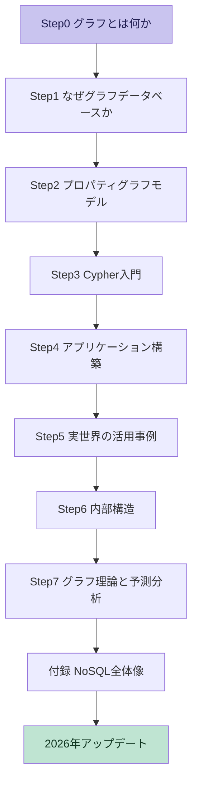

*図1: この記事全体の学習ロードマップ*

---

## Step0: グラフとは何か

数学的には、グラフ G は「頂点(ノード)の集合 V」と「辺(リレーションシップ)の集合 E」の組 G = (V, E) として定義されます。ノードは「モノ」、リレーションシップは「モノとモノのつながり」を表します。

グラフデータベースの世界で最もよく使われるのが**ラベル付きプロパティグラフ(Labeled Property Graph, LPG)モデル**です。ポイントは次の4つです。

- **ノード**: 人・会社・商品などの「モノ」。1つ以上の**ラベル**(種類)を持てる
- **リレーションシップ**: ノード同士のつながり。必ず**向き**と**種類**を持つ(例: `WORKS_AT`)
- **プロパティ**: ノードやリレーションシップに付けられるキー・バリューの属性(例: `名前 = 田中`)
- **ラベル**: ノードをグループ分けするためのタグ(例: `Person`、`Company`)

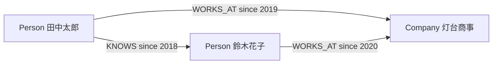

*図2: プロパティグラフの最小構成例(ノード・リレーションシップ・プロパティ・ラベル)*

重要なのは、**リレーションシップ自体が一級のデータ構造**として保存される点です。リレーショナルDBでは「関係」は外部キーという間接的な形でしか表現できませんが、グラフDBではリレーションシップそのものに向き・種類・プロパティを持たせられます。

本書ではさらに「グラフデータベース」と「グラフ計算エンジン」を区別しています。前者はOLTP的なトランザクション処理に向いたデータベースそのものであり、後者はPageRankのような大規模グラフ分析(バッチ処理)に向いたエンジンを指します。本書が主に扱うのは前者です。

---

## Step1: なぜグラフデータベースなのか

### リレーショナルDBの弱点

リレーショナルDBは「関係」を暗黙的にしか表現できません。外部キーとJOINで関係を再構築するため、多段の関係(友達の友達の友達、など)をたどるクエリは、テーブルが大きくなるほどJOINのコストが跳ね上がります。またスキーマ変更のたびにマイグレーションコストがかかり、ドメインの進化に追従しにくいという課題もあります。

### NoSQL集約指向DBの弱点

Key-Value・Document・Column-familyといった「集約指向(aggregate-oriented)」なNoSQLデータベースは、1つのまとまり(集約)の中のデータには強い一方、集約をまたぐ関係を表現するのが苦手です。関係を表現しようとすると、結局アプリケーション側でJOIN相当の処理を書くことになります。

Martin FowlerとPramod Sadalageの共著『NoSQL Distilled』でも、グラフDBは「集約指向」の3タイプ(Key-Value、Document、Column-family)とは異なる第4のカテゴリとして明確に区別されており、リレーショナルDBでは扱いにくい関係を横断的にたどれる点がグラフDBの強みだと説明されています。

### グラフDBの強み

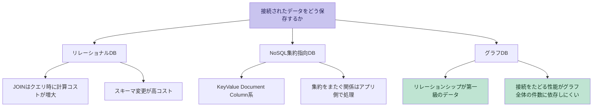

*図3: リレーショナルDB・NoSQL・グラフDBの位置づけ比較*

| 観点 | リレーショナルDB | NoSQL集約指向DB | グラフDB |
|---|---|---|---|
| リレーションの表現 | 外部キー(暗黙的) | 基本的に表現しない | リレーションシップとして明示的に保存 |
| 多段の関係をたどるコスト | 結合アルゴリズム・インデックス・データ分布に依存する | アプリ側の追加実装が必要 | ホップ数・分岐数・結果件数・キャッシュ状態に依存する |
| スキーマ | 事前に固定 | 緩い、または無し | ラベルとプロパティで柔軟に進化 |
| 得意な処理 | 集計・レポーティング | 大量データの高速な読み書き | 多段の関係をたどる探索クエリ |

本書ch1で説明される「グラフデータベースの力」は、**性能(Performance)**・**柔軟性(Flexibility)**・**俊敏性(Agility)** の3つに整理されています。関係をたどる性能が(グラフ全体の件数よりも)探索して実際に触れた部分の大きさに左右されやすいこと、スキーマレスに近い形でドメインを進化させやすいこと、開発初期から反復的にモデルを育てやすいことが強みとして挙げられています。

---

## Step2: ラベル付きプロパティグラフモデル

グラフDBでのデータモデリングは、「まず正規化されたテーブルを作る」というリレーショナルDB的な発想ではなく、**「どんな質問に答えたいか」からモデルを作る(クエリ駆動のモデリング)** という発想で進めます。

本書ch3では、シェイクスピアの戯曲・劇団・上演場所などをまたいだ「クロスドメイングラフ」を例に、複数の異なる領域のデータを1つのグラフに統合するデモンストレーションを行っています(具体的なコードはここでは引用せず、考え方のみ紹介します)。

### よくあるモデリングの落とし穴(アンチパターン)

- **リレーションシップを何でも同じ種類にしてしまう**: `RELATED_TO` のような汎用的すぎるリレーションシップ種別は、後からクエリで絞り込みにくくなる
- **プロパティにすべきものをノードにしすぎる、または逆**: 複雑な値(期間、金額の履歴など)はノードとしてモデル化した方が扱いやすいことが多い
- **時間の扱いを後回しにする**: 「いつからいつまで有効な関係か」を最初から設計に組み込まないと、後で大きな手戻りになる
- **スーパーノード(次数が極端に大きいノード)への配慮不足**: 数百万件のリレーションシップが1つのノードに集中すると、そのノード周辺のクエリだけ極端に遅くなることがある

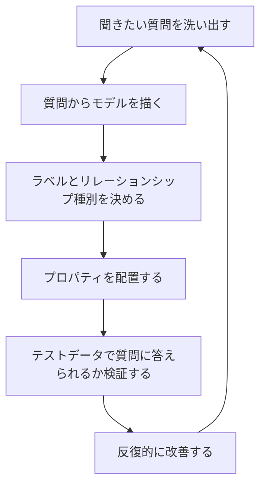

*図4: クエリ駆動のグラフデータモデリングのサイクル*

---

## Step3: Cypherクエリ言語入門

Cypherは、Neo4jのために作られた「人間にとって読みやすい」宣言的なグラフクエリ言語です。パターン(どんな形のノード・リレーションシップを探すか)を、そのまま矢印付きの記法で書けるのが最大の特徴です。

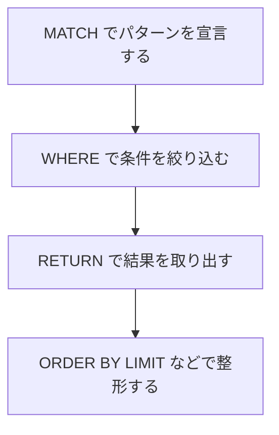

*図5: 基本的なCypherクエリの組み立て方*

以下は、本書の例そのものではなく、社員と会社のつながりを題材にした独自のサンプルです。

```cypher
// 田中さんが働いている会社を探す
MATCH (p:Person {name: "田中太郎"})-[:WORKS_AT]->(c:Company)
RETURN c.name

// 田中さんの知人のうち、田中さんと同じ会社で働いている人を探す
MATCH (p:Person {name: "田中太郎"})-[:KNOWS]->(friend:Person)
MATCH (p)-[:WORKS_AT]->(c:Company)<-[:WORKS_AT]-(friend)
RETURN friend.name, c.name

// 新しいノードとリレーションシップを作る
CREATE (p:Person {name: "佐藤次郎"})-[:WORKS_AT {since: 2024}]->(c:Company {name: "灯台商事"})
```

ポイントは、`(ノード)-[:関係種別]->(ノード)` という書き方が、そのままグラフの図と対応していることです。JOINを何段も書く必要がなく、たどりたい経路をそのままクエリとして表現できます。

### CypherからGQLへ

2024年4月、Cypherをベースにした**GQL(Graph Query Language)**がISO/IEC 39075として国際標準になりました。1987年のSQL制定以来、ISOが新しく制定したデータベース問い合わせ言語としては初めてのものです。TigerGraphのCEOであるMingxi Wu氏は、自社ブログで「GQLはグラフDB業界が(リレーショナルDB、Key-Valueストアに続く)3つ目の代表的なデータベースカテゴリとして確立したことを象徴する出来事だ」と位置づけ、GQLがパターンマッチング構文を使い、SQLとCypherの両方の記法をサポートしていると解説しています。詳細はStep7の後の「2026年時点のアップデート」で扱います。

---

## Step4: グラフデータベースアプリケーションの構築

本書ch4では、実際にグラフDBを使ったアプリケーションを作る際の実務的な観点がまとめられています。

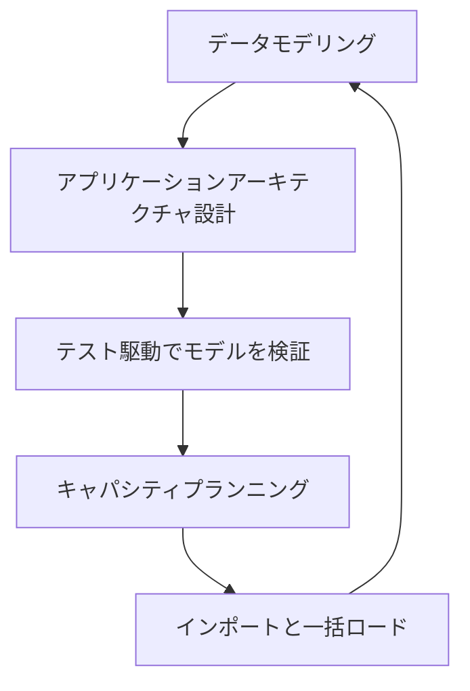

*図6: グラフデータベースアプリケーション開発の反復サイクル*

### データモデリング(実装レベル)

- アプリケーションが実際に必要とする質問からモデルを描く
- 「モノ」はノードに、「構造(つながり方)」はリレーションシップに対応させる
- 粒度の細かすぎる/粗すぎるリレーションシップを避ける
- 複雑な値(履歴、期間など)はノードとして表現する

### アプリケーションアーキテクチャ

- 組み込み(embedded)モードとサーバーモードのどちらでデータベースを動かすか
- クラスタリングとロードバランシングの設計
- テスト駆動でデータモデル自体を検証する(モデルの妥当性をユニットテストで担保する)

### キャパシティプランニング

- 性能(パフォーマンス)、冗長性(可用性)、負荷(スループット)という3つの最適化基準
- 想定される読み書きの量、ノード・リレーションシップの総数から必要なリソースを見積もる

### データのインポート

- 初期インポート(一括ロード)とバッチインポート(継続的な取り込み)の2パターンがある
- 大量データを初めて投入するときは、インデックス構築のタイミングなどに注意が必要

---

## Step5: 実世界におけるグラフの活用事例

本書ch5では、組織がなぜグラフDBを選ぶのか、そして代表的なユースケースが紹介されています。

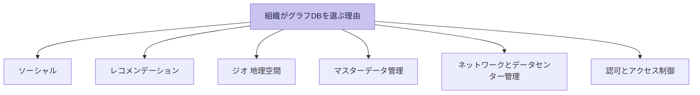

*図7: 本書で紹介される代表的なユースケース*

| ユースケース | 典型的な問い | 代表的な適用分野 |
|---|---|---|
| ソーシャル | 「友達の友達」は誰か、影響力の大きい人は誰か | SNS、プロフェッショナル向けネットワーク |
| レコメンデーション | この人が興味を持ちそうな商品やコンテンツは何か | ECサイト、動画・音楽配信 |
| ジオ(地理空間) | 近くにある拠点、最適な配送ルートは何か | 物流、ロジスティクス |
| マスターデータ管理 | このデータはどのマスタと紐づくべきか | 顧客データ統合、商品データ統合 |
| ネットワークとデータセンター管理 | この機器が故障したら何が影響を受けるか | 通信キャリア、ITインフラ運用 |
| 認可とアクセス制御 | このユーザはこのリソースにアクセスできるか | 権限管理、コンプライアンス |

これらのユースケースに共通するのは、「単発のデータ」ではなく「データ同士のつながりを何段もたどる」ことで初めて価値が出る、という点です。本書はプロフェッショナル向けソーシャルネットワークでのレコメンデーション、認可・アクセス制御、地理空間・物流の3つを実例として詳しく掘り下げています。

---

## Step6: グラフデータベースの内部構造

「なぜグラフDBは関係をたどるのが速いのか」を理解する鍵が、**ネイティブグラフ処理(native graph processing)** と **インデックスフリー隣接(index-free adjacency)** という概念です。

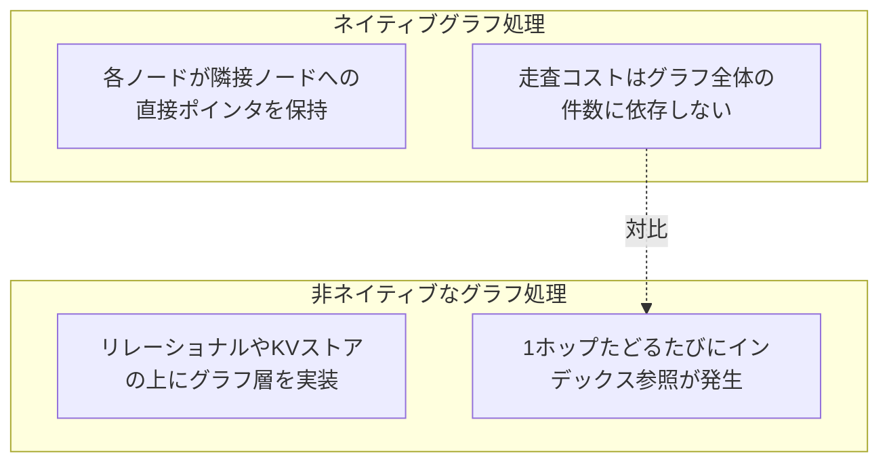

*図8: ネイティブグラフ処理と非ネイティブなグラフ処理の違い*

分かりやすい例え話として、コンサルタントのDan McCreary氏はブログで「index-free adjacencyは、隣人の家に手紙を届けるのに住所録を調べる(インデックス参照)必要がなく、隣にいることを直接知っているから歩いて渡せる、という感覚に近い」と説明しています。技術的には、リレーショナルDBでのJOINはインデックス参照を伴うため計算量が O(log n) 程度で増加しがちなのに対し、ネイティブグラフDBでの1ホップの走査は、たどるノードに接続されたリレーションシップの数だけに依存し、グラフ全体のサイズには依存しません。

Neo4jのGraphAcademyの教材でも、3階層の親子関係をたどるSQLクエリと、Cypherの同等クエリを比較し、SQLでは複数回のインデックス参照とプランニングが必要になる一方、ネイティブグラフではノードとリレーションシップがポインタで直接つながっているため参照コストが小さいことが示されています。

### プログラマティックAPI

本書ではNeo4j固有の実装として、Kernel API(最下層の低レベルAPI)、Core API(一般的なプログラマティックAPI)、Traversal Framework(探索の仕方を宣言的に指定できるAPI)の3層構成が紹介されています。

### 非機能特性

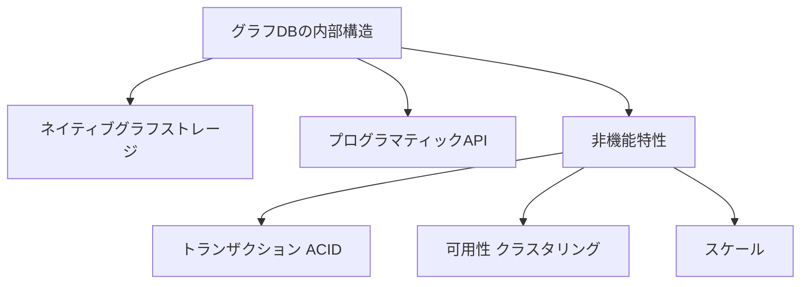

*図9: グラフデータベース内部構造の全体像*

グラフDBの多くはACIDトランザクションをサポートし、書き込みの一貫性を保証します。一方で、グラフはリレーションシップという「横断的なつながり」を持つデータ構造であるため、リレーショナルDBのように単純にシャーディング(水平分割)するのが難しく、スケールアウトの設計は独自の工夫が必要になる点が本書でも課題として挙げられています。

---

## Step7: グラフ理論による予測分析

本書ch7では、グラフを「探索」するアルゴリズムと、グラフの構造から未来の変化を予測する古典的な社会ネットワーク分析の理論が紹介されています。

### 幅優先探索と深さ優先探索

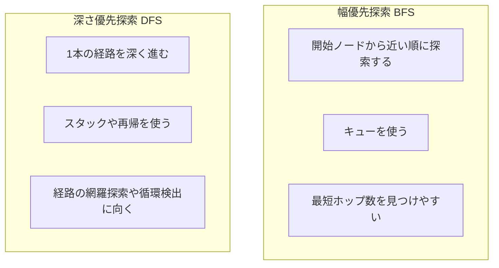

*図10: 幅優先探索と深さ優先探索の違い*

### Dijkstra法とA*アルゴリズム

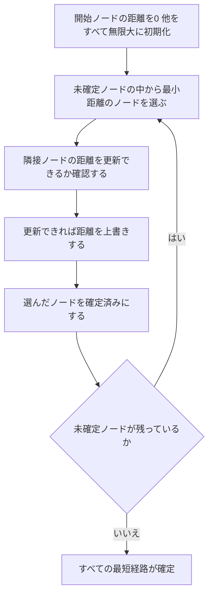

*図11: Dijkstra法の処理の流れ*

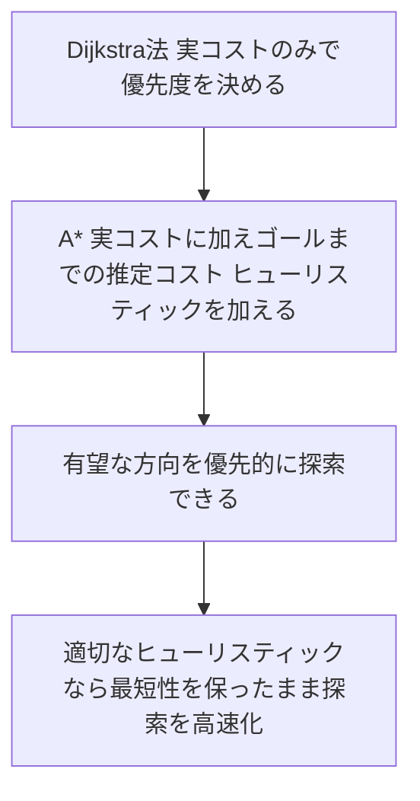

*図12: A*アルゴリズムがDijkstra法を拡張する考え方*

| アルゴリズム | 目的 | 重み付きグラフへの対応 | 代表的な用途 |
|---|---|---|---|
| BFS | 最短ホップ数を求める | 非対応 | SNSでの最短経路(次数)、到達可能性判定 |
| DFS | 経路を網羅的にたどる | 非対応 | 循環検出、連結成分の抽出 |
| Dijkstra法 | 重み付きグラフの最短距離を求める | 対応(非負の重みのみ) | カーナビ、経路探索エンジン |
| A* | ヒューリスティック付きの最短距離を求める | 対応(非負の重みのみ) | ゲームAIの経路探索、地図アプリ |

### 三者閉包・構造的均衡・ローカルブリッジ

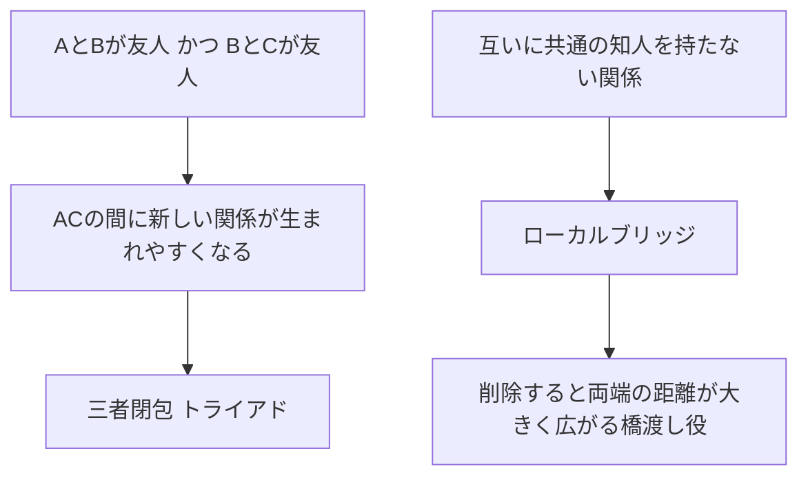

*図13: 三者閉包とローカルブリッジの考え方*

本書のこの章は、社会ネットワーク分析の古典であるDavid Easley氏(コーネル大学)とJon Kleinberg氏(同大学)の共著『Networks, Crowds, and Markets』の考え方を土台にしています。三者閉包(triadic closure)は「共通の友人を持つ2人は将来友人になりやすい」という経験則、構造的均衡(structural balance)は「友人関係・敵対関係が入り混じった三者関係のうち、心理的に安定しやすい組み合わせがある」という理論、ローカルブリッジ(local bridge)は「共通の知人を持たない関係は、削除すると両端の距離が大きく広がる橋渡し役になっている」という考え方です。これらは、レコメンデーションの精度向上や、不正検知における「怪しい孤立したつながり」の発見などに応用されています。

---

## 付録: NoSQL全体像の中でのグラフDB

本書の付録Aでは、グラフDBを含むNoSQLデータベース全体の見取り図が整理されています。

| タイプ | データモデル | 代表的な実装例(2026年時点) | 得意なこと |
|---|---|---|---|
| Key-Value | キーと値の単純な対応 | Redis, Amazon DynamoDB | 高速な読み書き、キャッシュ |
| Document | JSONのようなドキュメント単位 | MongoDB, Couchbase | 半構造化データの柔軟な保存 |
| Column-family | 列指向の広いテーブル | Apache Cassandra, HBase | 大量データの書き込みスループット |
| Graph | ノードとリレーションシップ | Neo4j, TigerGraph, ArangoDB | 多段の関係を横断する探索 |

ACID(Atomicity, Consistency, Isolation, Durability)は個々のトランザクションが満たす特性の集合であり、BASE(Basically Available, Soft state, Eventually consistent)は可用性と結果整合性を優先する分散システムの設計方針を指す標語です。粒度の異なるこの2つの対比、そしてプロパティグラフ・ハイパーグラフ・トリプル(RDF)という3つのグラフ表現方式の違いも本書付録で扱われています。RDF/トリプルストアはセマンティックウェブの標準技術であるSPARQLで問い合わせるのに対し、本書が中心的に扱うプロパティグラフモデルはCypher(および後述のGQL)で問い合わせる点が大きな違いです。

---

## 2026年時点のアップデート: GQL標準化とGraphRAG

本書の初版は2013年、第2版は2015年に出版されており、原著が書かれた時点では存在しなかった重要な動きが2024年以降に2つ起きています。

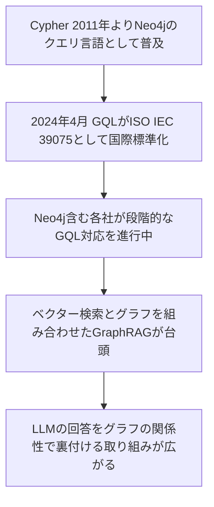

*図14: CypherからGQL、GraphRAGへの流れ*

### 1. GQLの国際標準化(2024年)

2024年4月、ISO/IEC合同技術委員会がGQL(Graph Query Language)を国際標準として制定しました。1987年にSQLが標準化されて以来、ISOが新たに制定したデータベース問い合わせ言語としては初めてのものです。GQL標準はCypherを強く参考にした設計になっており、Neo4jは独自のCypherを段階的にGQL準拠へ進化させる方針を明らかにしています。TigerGraphのCEOであるMingxi Wu氏は自社ブログで「グラフDBがリレーショナルDB・Key-Valueストアに次ぐ3つ目の代表的なデータベースカテゴリとして確立したことを象徴する出来事」と評しており、TheNewStack誌の取材に対してNeo4jのCTOであるPhilip Rathle氏も「SQLと同じ組織から出た国際標準であることが、グラフDBの主流化に大きな説得力を持つ」と述べています。

### 2. GraphRAG: LLMとナレッジグラフの融合

2025年から2026年にかけて、大規模言語モデル(LLM)の回答精度を高めるためにグラフDBを使う「GraphRAG」が急速に広がっています。従来のRAG(Retrieval-Augmented Generation)がベクトル検索やキーワード検索(BM25など)、それらを組み合わせたハイブリッド検索で関連文書を集めるのに対し、GraphRAGはさらにナレッジグラフの明示的な関係性を組み合わせることで、エンティティ間の関係が複雑なドメイン(規制文書、サプライチェーン、技術サポートなど)での回答精度とハルシネーション(誤った情報生成)の抑制を狙う手法です。

Neo4jで製品イノベーションを率いるMichael Hunger氏は、2026年の記事「Graph and AI Trends 2026」の中で、「AIエージェントは自律的に一連の業務をやり切るところまではまだ到達しておらず、モデル品質も時間とともに劣化しうる」といった率直な課題認識を示しつつ、グラフとAIの組み合わせが次の段階に進むための論点を整理しています。GraphRAGの実装をめぐっては、Neo4j自身が提供する`neo4j-graphrag-python`パッケージ、LlamaIndexの`PropertyGraphIndex`、LangChainの`LLMGraphTransformer`など複数のアプローチが2026年時点で並存しており、用途に応じて使い分けるのが実務上の判断ポイントになっています。

---

## 主要グラフデータベースの比較(2026年時点)

| 製品 | データモデル | クエリ言語 | 特徴 |
|---|---|---|---|
| Neo4j | プロパティグラフ | Cypher(GQLへ段階的に対応中) | 最大手。公式のGQL準拠ドキュメントによれば必須機能の多くと任意機能の相当部分に対応済みだが、未対応の必須機能が残っており実装が進行中。GraphAcademyなど学習コンテンツが充実、GraphRAG関連ツールも自社提供 |
| TigerGraph | プロパティグラフ | GSQL(GQL標準化に参画・対応を推進中) | GSQLは独自言語で、GQLへ全面準拠しているわけではない。並列処理を活かした大規模グラフ分析に強み |
| ArangoDB | マルチモデル(ドキュメント+グラフ) | AQL | ドキュメントDBとグラフDBを1つのエンジンに統合 |
| Amazon Neptune | プロパティグラフ、RDF両対応 | openCypher, Gremlin, SPARQL | AWSのフルマネージドサービス、複数クエリ言語に対応 |
| JanusGraph | プロパティグラフ | Gremlin | OSS。分散ストレージ(Cassandra等)の上に構築可能 |

2026年時点のブログ記事では、GQL標準化とAIツーリングの成熟によって、新規のグラフDBプロジェクトの多くがGremlinよりもCypher(あるいはGQL)を選ぶ傾向にあること、GraphRAGが「不正検知・レコメンデーション以外で初めて主流化したグラフDBのユースケース」だと位置づけられています。

---

## 用語集

| 用語 | 説明 |
|---|---|
| ノード(Node) | グラフにおける「モノ」を表すデータ単位。ラベルとプロパティを持てる |
| リレーションシップ(Relationship) | ノード同士のつながり。必ず向きと種類を持つ、一級のデータ構造 |
| ラベル(Label) | ノードの種類を表すタグ(例: `Person`、`Company`) |
| プロパティ(Property) | ノードやリレーションシップに付けられるキー・バリューの属性 |
| Cypher | Neo4j向けに設計された宣言的なグラフクエリ言語 |
| GQL | Cypherをベースに2024年にISO/IEC 39075として国際標準化されたグラフクエリ言語 |
| インデックスフリー隣接(index-free adjacency) | 各ノードが隣接ノードへの直接ポインタを保持し、走査コストがグラフ全体の件数に依存しない性質 |
| ネイティブグラフ処理 | グラフ専用に設計されたストレージ・実行エンジンでの処理方式 |
| 三者閉包(triadic closure) | 共通の友人を持つ2人が将来友人になりやすいという経験則 |
| ローカルブリッジ(local bridge) | 共通の知人を持たない関係で、削除すると両端の距離が大きく広がるもの |
| GraphRAG | ナレッジグラフとベクトル検索を組み合わせてLLMの回答精度を高める手法 |

---

## 批判的に読む

世界クラスのエンジニアとして本書を鵜呑みにせず、以下の観点も押さえておくと理解が立体的になります。

- **著者全員がNeo4j(旧Neo Technology)の関係者**であるため、本書は「グラフデータベース全般」というタイトルながら、実質的にはNeo4jとCypherを中心に据えた内容になっています。RDF/トリプルストア(SPARQLで問い合わせる系統)やTigerGraph・JanusGraphのような他のグラフDBアーキテクチャへの言及は限定的です。
- **無料配布そのものがNeo4j社のリード獲得(マーケティング)施策**でもあります。内容の質自体は独立系レビュアーからも一定の評価を得ていますが、この文脈は踏まえておく価値があります。
- **出版は2015年**で、Cypherの構文はその後何度も更新されており(2024年のGQL標準化への追従を含む)、本書に載っているコード例をそのまま最新のNeo4jで実行すると動かない、あるいは非推奨の書き方になっている場合があります。学習の際は必ず公式ドキュメントで最新構文を確認してください。
- **ch7の「グラフ理論」は応用寄りの軽い紹介**にとどまっており、三者閉包やローカルブリッジといった概念を数学的にきちんと理解したい場合は、コーネル大学のDavid Easley氏・Jon Kleinberg氏による『Networks, Crowds, and Markets』(無料で読める草稿版あり)を併読することをおすすめします。
- **GraphRAGやグラフニューラルネットワークなど、2020年代後半のAI関連の応用はカバーされていません**。本書は「トランザクショナルなグラフDBの基礎」を固めるための一冊として読み、最新のAI活用トレンドは本記事の「2026年時点のアップデート」や各社の公式ブログで補うのが実務的です。
- 独立系のレビュアーからは、印刷版のボリュームがやや薄く感じられ、レビュー当時のNeo4jの最新機能(2.0系)に必ずしも追従しきれていなかったという指摘もありました。技術書全般に言えることですが、公式ドキュメントとの併読が安全です。

---

## 学習チェックリスト

- [ ] グラフの基本要素(ノード・リレーションシップ・プロパティ・ラベル)を説明できる
- [ ] リレーショナルDB・NoSQL集約指向DB・グラフDBの違いを説明できる
- [ ] ラベル付きプロパティグラフモデルで簡単なドメインをモデリングできる
- [ ] Cypherの基本文法(MATCH / WHERE / RETURN / CREATE)を読み書きできる
- [ ] クエリ駆動のデータモデリング(質問からモデルを作る)を説明できる
- [ ] よくあるモデリングのアンチパターンを2つ以上挙げられる
- [ ] インデックスフリー隣接の意味と、なぜ性能上有利なのかを説明できる
- [ ] グラフDBが向いているユースケースを5つ以上挙げられる
- [ ] BFS・DFS・Dijkstra法・A*アルゴリズムの違いと用途を説明できる
- [ ] 三者閉包やローカルブリッジなど社会ネットワーク分析の基本概念を説明できる
- [ ] GQL標準化とGraphRAGなど、2024年以降の主要な動向を把握している

---

## まとめ

グラフデータベースは「関係」を第一級のデータとして扱うことで、リレーショナルDBやNoSQLでは苦労しがちな「多段のつながりをたどるクエリ」を高速かつ表現力豊かに書けるようにする技術です。本書はその考え方を、ラベル付きプロパティグラフモデル・Cypher・アプリケーション構築の実務・内部構造・グラフ理論という5つの切り口から一貫して説明しており、出版から10年以上経った今でも基礎を学ぶ教材として通用します。一方で、GQLの国際標準化やGraphRAGの台頭など、2024年以降の動きは本書に含まれていないため、最新の一次情報と組み合わせて学習することをおすすめします。

---

## 参考文献

### 公式情報源

1. O'Reilly Media — *Graph Databases, 2nd Edition* 書籍ページ(目次・概要)
   https://www.oreilly.com/library/view/graph-databases-2nd/9781491930885/
2. Neo4j — 無料eBookダウンロードページ
   https://neo4j.com/lp/book-graph-databases/
3. Neo4j — O'Reilly『Graph Databases』公式紹介ページ
   https://neo4j.com/graph-databases-book-sx/
4. Neo4j — GraphAcademy「Native Graph」レッスン(index-free adjacencyの解説)
   https://graphacademy.neo4j.com/courses/neo4j-fundamentals/2-property-graphs/2-native-graph
5. Neo4j Blog — Native vs. Non-Native Graph Database
   https://neo4j.com/blog/native-vs-non-native-graph-technology/
6. Neo4j Blog — Will It Graph? Identifying a Good Fit for Graph Databases, Part 1
   https://neo4j.com/blog/developer/will-it-graph-identifying-a-good-fit-for-graph-databases-part-1
7. Neo4j — GQL国際標準化プレスリリース(2024年4月)
   https://neo4j.com/press-releases/gql-standard/

### 国際的な開発者・著名人による解説と書評

8. InfoQ — *Graph Databases* Book Review and Interview(著者Ian Robinson・Jim Webberへのインタビュー)
   https://www.infoq.com/articles/graph-databases-book-review
9. i-programmer.info — Kay Ewbank氏による書評
   https://www.i-programmer.info/bookreviews/21-database/7977-graph-databases.html
10. datawookie.dev — 独立系開発者による書評
    https://datawookie.dev/blog/2015-02-09-book-review-graph-databases/
11. Dan McCreary — “How to Explain Index-Free Adjacency to Your Manager”(Medium)
    https://dmccreary.medium.com/how-to-explain-index-free-adjacency-to-your-manager-1a8e68ec664a
12. Mingxi Wu(TigerGraph CEO)— “The Rise of GQL: A New ISO Standard in Graph Query Language”(TigerGraph公式ブログ)
    https://www.tigergraph.com/blog/the-rise-of-gql-a-new-iso-standard-in-graph-query-language
13. TheNewStack — “GQL: A New ISO Standard for Querying Graph Databases”
    https://thenewstack.io/gql-a-new-iso-standard-for-querying-graph-databases/
14. Michael Hunger(Neo4j VP of Product Innovation）— “Graph and AI Trends 2026: Why Is AI Running but Not Yet Delivering?”
    https://www.wearedevelopers.com/magazine/680-graph-and-ai-trends-2026-why-is-ai-running-but-not-yet-delivering
15. Daniel Wertheim — 開発者個人ブログでの紹介記事
    https://danielwertheim.se/do-not-miss-the-free-e-book-graph-databases/

### 学術・関連分野の一次資料

16. David Easley & Jon Kleinberg(コーネル大学）— *Networks, Crowds, and Markets: Reasoning About a Highly Connected World*(草稿版無料公開)
    http://www.cs.cornell.edu/home/kleinber/networks-book/
17. Martin Fowler & Pramod Sadalage — *NoSQL Distilled* 書籍情報(グラフDBを含むNoSQL全体の分類)
    https://pearson.com/store/p/nosql-distilled-a-brief-guide-to-the-emerging-world-of-polyglot-persistence/P200000009587/9780321826626
18. ThoughtWorks — Martin Fowlerによる「Rise of NoSQL」ポッドキャスト
    https://www.thoughtworks.com/insights/podcasts/technology-podcasts/rise-nosql

### 2025〜2026年のGraphRAG・グラフDB動向

19. Atlan — “Neo4j GraphRAG vs. LlamaIndex vs. LangChain Graph Transformer”
    https://atlan.com/know/ai-agent/knowledge-graph/neo4j-graphrag-vs-llamaindex-vs-langchain/
20. “Graph Databases in 2026: Neo4j, ArangoDB, TigerGraph and the GraphRAG Moment”
    https://pdpspectra.com/blog/neo4j-vs-arangodb-2026
    