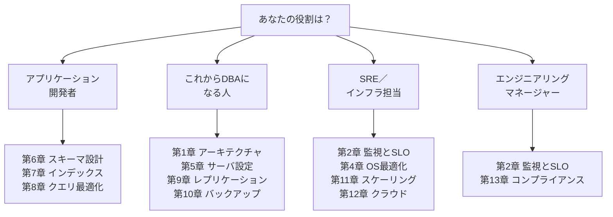
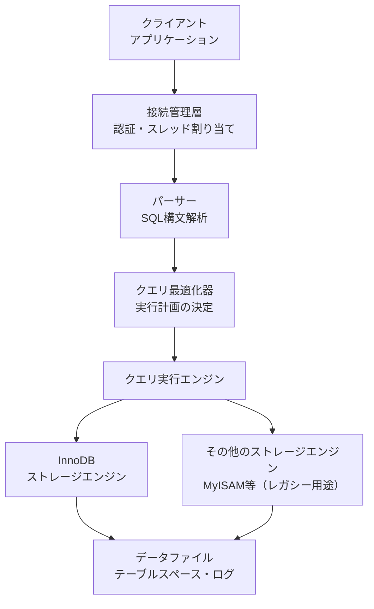
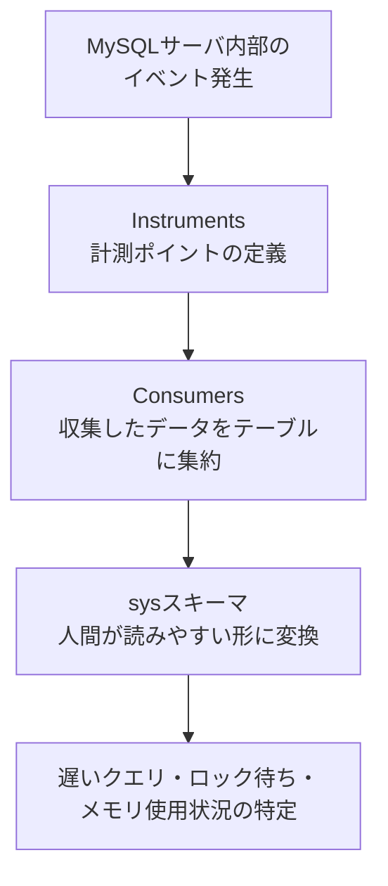
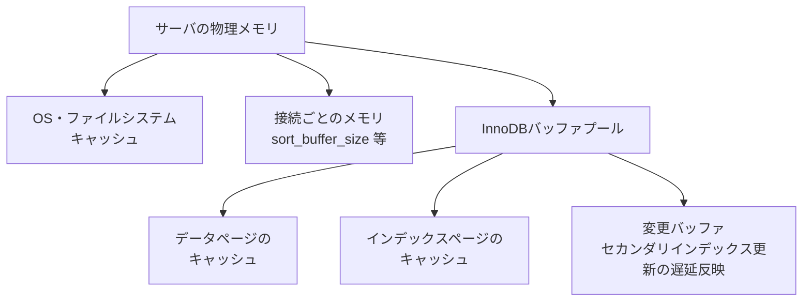
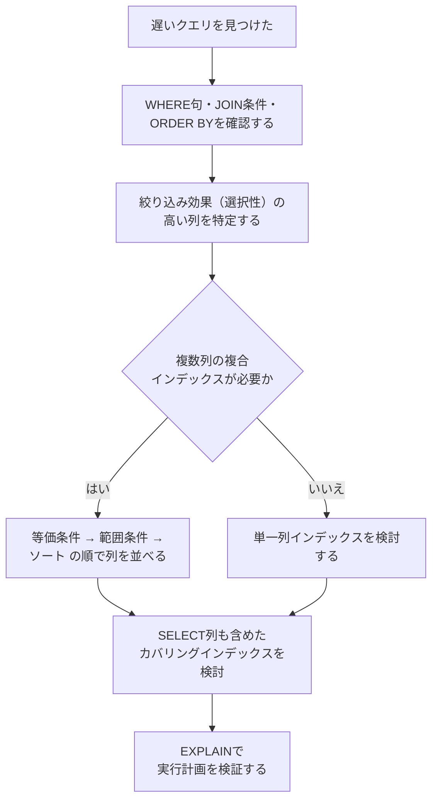
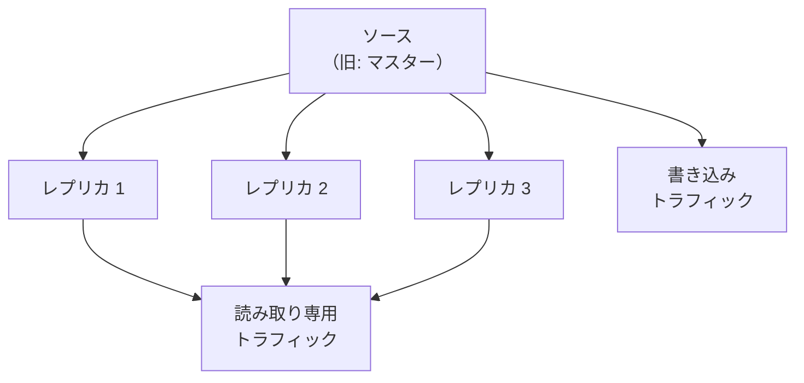
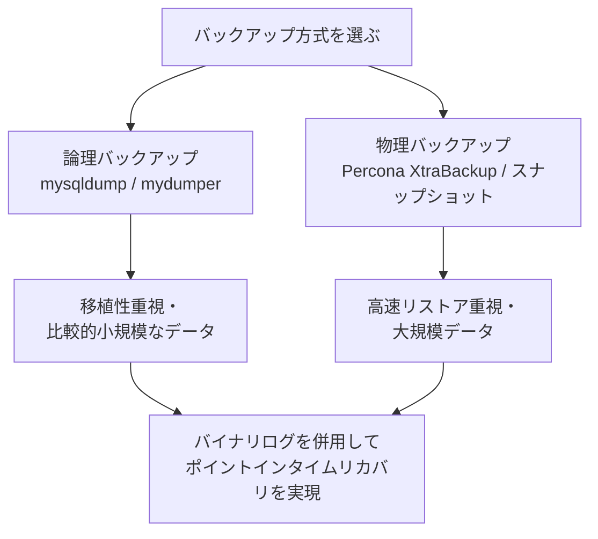
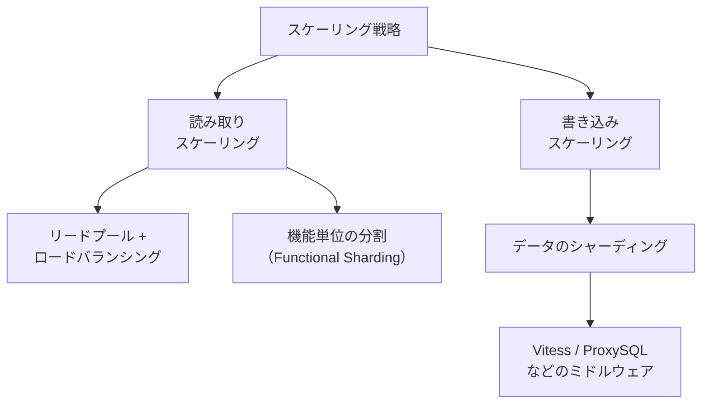
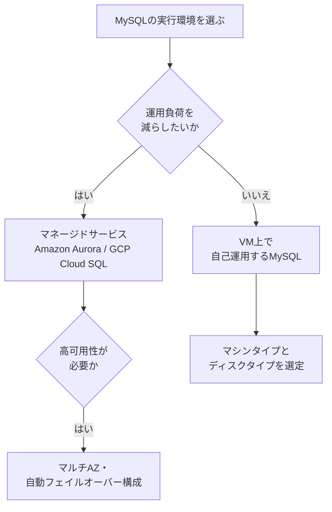

# 『High Performance MySQL: Proven Strategies for Operating at Scale』徹底解説ガイド

> 初学者からステップアップしたいエンジニアまでを対象に、O'Reilly刊『High Performance MySQL, 4th Edition』（Silvia Botros・Jeremy Tinley 著）の内容を、章立てに沿って一つずつわかりやすく解説します。本書刊行（2021年11月）以降のMySQLエコシステムの変化についても、Percona・Oracle MySQLチームなど国際的に著名な開発者・企業の発信をもとに補足しています。

---

## この記事について

- **対象書籍**: High Performance MySQL: Proven Strategies for Operating at Scale（第4版）
- **原書ページ**: https://www.oreilly.com/library/view/high-performance-mysql/9781492080503/
- **著者**: Silvia Botros（Twilio シニア・プリンシパルエンジニア／元SendGrid）、Jeremy Tinley（Etsy シニアスタッフエンジニア、MySQL歴20年以上）
- **序文（Foreword）執筆**: Jeremy Cole（元Google／Twitter、InnoDB内部構造研究で国際的に知られるエンジニア）
- **出版**: O'Reilly Media, Inc. / 2021年11月 / 386ページ
- **本ガイドの方針**: 各章の要点をステップごとに整理し、図解はすべてMermaidで表現、比較情報は表形式でまとめています。ASCIIアートによる図解は使用していません。

---

## 書籍情報まとめ

| 項目 | 内容 |
|---|---|
| タイトル | High Performance MySQL: Proven Strategies for Operating at Scale |
| 版 | 第4版（Fourth Edition） |
| 著者 | Silvia Botros, Jeremy Tinley |
| 序文 | Jeremy Cole |
| 出版社 | O'Reilly Media, Inc. |
| 出版年月 | 2021年11月 |
| ページ数 | 386ページ |
| 難易度 | Intermediate to advanced（中級〜上級） |
| 章構成 | 全13章 + 付録2本 |
| ISBN | 9781492080503（電子版）/ 9781492080510（ペーパーバック） |
| 前版との関係 | 第3版（2012年）はBaron Schwartz・Peter Zaitsev・Vadim Tkachenko（いずれもPercona創業に関わった著名なMySQLエンジニア）による著作で、本書はその精神を引き継ぎつつ、SRE的な運用思想やクラウド時代の実践に合わせて全面刷新されています |

---

## 対象読者

本書は「中級〜上級」向けとされていますが、本ガイドでは初学者が段階的に理解できるよう構成を補足しています。以下のような人におすすめです。

- MySQLを使ったアプリケーションを開発しているが、パフォーマンスやスケールの話になると自信がないアプリケーションエンジニア
- これからDBA（データベース管理者）やSRE（Site Reliability Engineer）としてMySQL運用に関わる人
- 「なんとなく動いているMySQL」を、根拠を持って設計・運用できるようにしたいインフラ担当者
- クラウド上でMySQLを運用する際の選択肢（マネージドサービス vs 自己運用）を理解したい人

---

## 本書の全体像（5部構成）

本書の13章＋付録2本は、内容的に次の5つのまとまりに整理できます。


この5部構成が、本ガイドの「Step 1」〜「Step 13」の土台になります。

---

## 学習ロードマップ（役割別のおすすめ順路）

全部を最初から順番に読む必要はありません。自分の立場に応じて、重点的に読む章を変えるのがおすすめです。



---

## Step 0: なぜ「ハイパフォーマンスなMySQL」が必要なのか

MySQLは初期設定のままでも「動く」データベースです。しかし、アクセス数やデータ量が増えてくると、次のような問題が表面化します。

- 特定のクエリだけ急に遅くなる
- ある時間帯だけレプリケーションの遅延が広がる
- ディスクI/Oがボトルネックになり、スケールアップでは対処しきれなくなる
- 障害発生時に「何がSLA違反の原因か」を素早く特定できない

本書の第4版が第3版（2012年）と大きく異なる点は、単なる内部構造の解説にとどまらず、**「サービスレベル目標（SLO）を起点に、チームとしてどう信頼性を作るか」** という運用思想を前面に出していることです。これは、著者の一人であるSilvia Botrosが長年SendGridやTwilioのような大規模メール配信・通信プラットフォームで、実際にMySQLを何千台も運用してきた経験に基づいています。

---

## Step 1: MySQLアーキテクチャを理解する（第1章）

### 1-1. MySQLの論理アーキテクチャ

MySQLは大きく分けて「接続層」「SQLレイヤー（パーサー・最適化器）」「ストレージエンジン層」の3層構造になっています。



ポイントは、**SQLレイヤーとストレージエンジン層が分離されている**ことです。これにより、SQL構文の解釈やクエリ最適化はエンジン共通で行いつつ、実際のデータ格納・取得方法だけをストレージエンジンごとに切り替えられます。現在の実務では、ほぼ全てのテーブルで **InnoDB** を使うのが標準です。

### 1-2. 同時実行制御（Concurrency Control）

複数のクライアントが同時に同じデータへアクセスするとき、MySQLは「読み書きロック」と「MVCC（多version同時実行制御）」を組み合わせて整合性を保っています。

| 用語 | 説明 |
|---|---|
| 読み書きロック（Read/Write Lock） | 共有ロックと排他ロックでアクセスを調停する基本方式。InnoDBでは通常の `SELECT` は共有ロックを取らず（後述のMVCCによる一貫性読み取り）、`SELECT ... FOR SHARE` / `FOR UPDATE` のようなロッキングリードと書き込みだけが明示的にロックを取得する |
| ロック粒度（Lock Granularity） | テーブル単位・行単位など、ロックの範囲。InnoDBは行レベルロックが基本 |
| MVCC | 通常の `SELECT`（一貫性読み取り）がロックを取らずに「その時点のスナップショット」を読める仕組み。READ COMMITTED / REPEATABLE READ ではこれが既定の動作で、読み取りと書き込みが互いをブロックしにくくなる。ロッキングリードは対象外で、最新行に対してロックを取る |
| デッドロック | 複数のトランザクションが互いのロック解放を待ち合って停止する状態。InnoDBは自動検出してどちらかをロールバックする |

### 1-3. トランザクション分離レベル

| 分離レベル | ダーティリード | ノンリピータブルリード | ファントムリード | 備考 |
|---|---|---|---|---|
| READ UNCOMMITTED | 発生する | 発生する | 発生する | ほぼ使われない |
| READ COMMITTED | 防げる | 発生する | 発生する | 多くのOLTPシステムで採用 |
| REPEATABLE READ | 防げる | 防げる | 原則防げる（MVCC+ネクストキーロック） | **MySQLのデフォルト** |
| SERIALIZABLE | 防げる | 防げる | 防げる | 最も安全だが並行性が大きく低下 |

### 1-4. その他、第1章で押さえておきたいトピック

- **トランザクションログ（redo log）**: クラッシュ時にコミット済みデータを復元するための仕組み
- **レプリケーション**: 第9章で詳しく扱う、複製によるスケールと可用性向上の基礎
- **JSONドキュメントサポート**: MySQL 5.7以降、JSON型カラムでスキーマレスなデータも扱える
- **データディクショナリの刷新とAtomic DDL**: MySQL 8.0でメタデータ管理がトランザクショナルになり、DDL（スキーマ変更）の途中失敗によるメタデータ不整合が起きにくくなった

---

## Step 2: SREの視点で監視する（第2章）

第4版で最も特徴的な章の一つです。「監視ツールを入れる」ことがゴールではなく、**ビジネス上の信頼性目標からSLI/SLOを定義し、そこから逆算して何を計測すべきかを決める** という考え方を提示しています。

### 2-1. SLI/SLOを起点にした監視サイクル


### 2-2. 計測すべき代表的な指標

| カテゴリ | 具体例 |
|---|---|
| 可用性 | 接続成功率、ヘルスチェックの成否 |
| クエリレイテンシ | p50 / p95 / p99 のクエリ応答時間 |
| エラー | デッドロック発生数、接続エラー、レプリケーションエラー |
| 長期トレンド | ディスク使用量の伸び、コネクション数の推移、ビジネスの繁忙期との相関 |

「何を測るか」は技術的な都合ではなく、**顧客が何に困ると『使えない』と感じるか** から逆算すべき、というのが本章の一貫した主張です。これは、著者らが実際にメール配信基盤という「止まったら即座にビジネス影響が出る」システムを運用してきた経験が色濃く反映されています。

---

## Step 3: Performance Schemaを使いこなす（第3章）

Performance Schemaは、MySQLサーバ内部で発生するイベント（クエリ実行、ロック待ち、I/O待ちなど）を計測するための標準機能です。



### 3-1. sysスキーマが便利な理由

Performance Schemaの生データは列数が多く読みにくいため、`sys` スキーマという「人間向けのビュー集」が用意されています。例えば以下のような用途で使われます。

| 目的 | 使うビュー（例） |
|---|---|
| 遅いSQL文の特定 | `sys.statements_with_runtimes_in_95th_percentile` |
| メタデータロック待ちの確認 | `sys.schema_table_lock_waits` |
| メモリ使用量の内訳確認 | `sys.memory_global_by_current_bytes` |
| 頻発しているエラーの確認 | `performance_schema.events_errors_summary_global_by_error` |

### 3-2. 有効化・チューニングの基本

- Performance Schemaは基本的にデフォルトで有効
- 全インストゥルメントを有効化するとオーバーヘッドが増えるため、必要な項目だけを絞って有効化するのが実務的
- `performance_schema_max_*` 系の変数でメモリサイズを調整できる

---

## Step 4: OS・ハードウェアの最適化（第4章）

MySQLのパフォーマンスは、MySQL単体の設定だけでなく、稼働しているOSやハードウェアの特性に大きく左右されます。

### 4-1. どこがボトルネックになりやすいか

| リソース | ボトルネックになりやすい理由 | 対処の方向性 |
|---|---|---|
| CPU | 複雑なクエリ・大量の同時接続でコアが埋まる | コア数と単一スレッド性能のバランスを見て選定 |
| メモリ | InnoDBバッファプールが小さいとディスクI/Oが増える | ワーキングセット（頻繁にアクセスされるデータ量）に見合ったメモリを確保 |
| ディスクI/O | ランダムI/Oが多いワークロードで顕著 | SSD／NVMeの採用、適切なRAID構成 |
| ネットワーク | レプリケーションや大量データ転送時に顕在化 | 帯域とレイテンシの両方を確認 |

### 4-2. ストレージ選定のポイント

- **SSD/フラッシュストレージ**: ランダムI/Oに強く、現在のMySQL運用ではほぼ標準
- **RAID構成**: RAID10は読み書き双方の性能と冗長性のバランスが良く、多くの本番環境で採用される
- **ファイルシステム**: ext4やXFSなど、ジャーナリングファイルシステムが一般的
- **ディスクI/Oスケジューラ**: Linuxのマルチキュー環境では `none`（スケジューリングを行わずデバイスへ直接発行）と `mq-deadline`（レイテンシ上限を設ける）が主な選択肢。どちらが有利かはカーネルバージョン・デバイス・ワークロードで変わるため、実際のワークロードでベンチマークを取って決める

### 4-3. メモリとスワップ

MySQLサーバでスワップが発生すると、バッファプールへのアクセスがディスクI/Oに化けてしまい性能が大きく劣化します。`vm.swappiness` を低めに設定し、極力スワップが発生しない構成を目指すことが推奨されています。

---

## Step 5: サーバ設定の最適化（第5章）

### 5-1. メモリ配分の考え方



よく使われる目安は「専用DBサーバであれば、物理メモリの60〜80%程度をInnoDBバッファプールに割り当てる」という経験則です。ただし、接続数が多い場合は「接続ごとのメモリ使用量 × 最大接続数」も考慮する必要があり、本書ではこの見積もり方を具体的な計算式とともに解説しています。

### 5-2. 最低限おさえるべき設定項目（イメージ例）

```ini
# 本書の考え方に基づく設定例（値は環境ごとに調整が必要）
[mysqld]
innodb_buffer_pool_size = 12G        # 物理メモリに応じて調整
innodb_buffer_pool_instances = 8     # バッファプールを分割。8は buffer_pool_size >= 1GB の64bit環境での既定値
                                     # 上の 12G / 高並列OLTP を前提とした値。CPUコア数と並列度に応じて見直す
innodb_flush_log_at_trx_commit = 1   # デフォルト。耐久性重視
innodb_redo_log_capacity = 2G        # 更新の多いワークロードでは大きめに（8.0.30以降）
max_connections = 500
thread_cache_size = 100
```

> 補足: 原著執筆時点では `innodb_log_file_size` を使いますが、MySQL 8.0.30以降はこれに代わる `innodb_redo_log_capacity` が推奨で、再起動なしにredoログ容量を動的変更できます（詳細は本ガイド末尾の「2026年時点でのアップデート情報」を参照）。

### 5-3. 設定変更で気をつけること

本書が繰り返し強調しているのは、「よくわからないままコピペした設定値を入れない」という姿勢です。

- 変数のスコープ（グローバル／セッション）を理解してから変更する
- 一度に多くの変数を変えず、変更の影響を1つずつ検証する
- 本番へ適用する前に、ステージング環境で負荷テストを行う

---

## Step 6: スキーマ設計と管理（第6章）

### 6-1. データ型選びの基本方針

| データ型カテゴリ | 選び方の原則 |
|---|---|
| 整数型 | 必要な範囲に対して最小のバイト数の型を選ぶ（`INT`で十分なのに`BIGINT`を使わない等） |
| 実数型 | 金額など正確性が必要な値は `DECIMAL`、誤差が許容できる場合は `FLOAT`/`DOUBLE` |
| 文字列型 | 可変長データは`VARCHAR`、固定長かつ短い場合は`CHAR`も検討 |
| 日時型 | タイムゾーンを意識するなら`TIMESTAMP`、範囲が広い場合は`DATETIME` |
| ビットパックデータ | フラグの集合などは`BIT`型やビット演算で圧縮できる場合がある |
| JSON | 構造が頻繁に変わる付加的なデータに限定して使い、検索条件になる列は正規化する |

### 6-2. よくある落とし穴（Schema Design Gotchas）

- **カラムが多すぎるテーブル**: 1行のサイズが大きくなり、I/O効率が悪化する
- **JOINが多すぎる設計**: 過度な正規化はクエリを複雑にし、最適化器の負担も増える
- **万能ENUMの濫用**: `ENUM`型は変更コストが高く、値の追加・削除でスキーマ変更が必要になりがち
- **見せかけのENUM**: 実質的に無制限に増える値を`ENUM`にしてしまうアンチパターン
- **「NULLなんて使わない」という誤解**: NULLを無理に避けて意味のない初期値（空文字や0）で代用すると、かえってクエリの意味が曖昧になる

### 6-3. スキーマ管理をプラットフォーム化する

本書では、スキーマ変更（マイグレーション）を「属人的な手作業」から「データストア基盤の一部として自動化・レビュー可能なプロセス」に変えていくことの重要性が説かれています。オンラインDDLツール（gh-ost、pt-online-schema-changeなど）を使い、本番トラフィックを止めずにスキーマ変更を行う運用が現在では一般的です。

---

## Step 7: 高パフォーマンスのためのインデックス設計（第7章）

### 7-1. インデックスの基本

InnoDBのインデックスはB-Tree構造が基本です。主キーに基づく「クラスタードインデックス」と、それ以外の「セカンダリインデックス」の違いを理解することが出発点になります。

| インデックス種別 | 特徴 |
|---|---|
| クラスタードインデックス | 主キー順にデータそのものが物理的に格納される。InnoDBでは必ず存在する |
| セカンダリインデックス | 指定した列の値と、対応する主キー値を持つ。検索後に主キーでデータ本体を引き直す |
| カバリングインデックス | SELECTで必要な列がすべてインデックスに含まれ、テーブル本体へのアクセスが不要になる |
| プレフィックスインデックス | 長い文字列列の先頭N文字だけをインデックス化し、サイズと選択性のバランスを取る |

### 7-2. インデックス設計の判断フロー



### 7-3. 複合インデックスの列順の考え方

複合インデックスでは、**「等価条件で使う列 → 範囲条件やソートで使う列」** の順に並べるのが基本原則です（いわゆる「左端プレフィックスの法則」）。例えば `WHERE user_id = ? AND created_at > ?` というクエリに対しては、`(user_id, created_at)` の順で複合インデックスを作るのが効果的です。

### 7-4. インデックスのメンテナンス

- **冗長インデックス・重複インデックス**: `(a)` と `(a, b)` のように片方がもう片方の先頭部分と一致する場合、片方が不要になっていることが多い
- **未使用インデックス**: 書き込み時のオーバーヘッドだけが発生し読み取りに使われていないインデックスは削除候補
- **統計情報の更新**: `ANALYZE TABLE` で最適化器が使う統計を最新に保つ
- **断片化の解消**: `OPTIMIZE TABLE` やオンラインDDLツールでインデックス・データの断片化を整理する

---

## Step 8: クエリパフォーマンスの最適化（第8章）

### 8-1. 「なぜクエリは遅くなるのか」を考える出発点

本書は、クエリ最適化の第一歩を「**不要なデータを取得していないか**」というシンプルな問いに置いています。

- 必要な列だけを`SELECT`しているか（`SELECT *`の濫用を避ける）
- MySQLが調べている行数（examined rows）と、実際に返している行数（returned rows）に大きな差がないか
- インデックスを使わずにフルスキャンしていないか

### 8-2. クエリ最適化の反復サイクル


### 8-3. クエリ再構成の代表的なテクニック

| テクニック | 内容 |
|---|---|
| 複雑なクエリの分割 | 1本の巨大なJOINクエリを、複数のシンプルなクエリ＋アプリ側結合に分ける |
| クエリのチャンク化 | 大量データの一括更新・削除を、小さな単位に分割して負荷を平準化する |
| JOIN分解 | サブクエリやJOINを段階的に分解し、それぞれの実行計画を最適化しやすくする |

### 8-4. 特定パターンのクエリ最適化

- **COUNT()クエリ**: 条件なしの`COUNT(*)`はInnoDBでは想像以上にコストがかかる場合がある
- **JOINクエリ**: 結合順序と結合に使う列のインデックスが性能を左右する
- **GROUP BY + ROLLUP**: 集計の粒度を増やすほどコストが増える点に注意
- **LIMIT / OFFSET**: 大きなOFFSET値は、スキップする行も内部的には読み込むため非効率になりやすい
- **SQL_CALC_FOUND_ROWS**: ページネーションでよく使われてきたが、`SQL_CALC_FOUND_ROWS` と `FOUND_ROWS()` はMySQL 8.0.17で非推奨となり、MySQL 8.4時点でも将来の削除が予告されている。`LIMIT` 付きの取得クエリと、総件数を求める `COUNT(*)` クエリを別々に発行する方式へ移行する

---

## Step 9: レプリケーション（第9章）

### 9-1. レプリケーションの基本トポロジー



### 9-2. 知っておきたい主要トピック

| トピック | 概要 |
|---|---|
| バイナリログフォーマット | STATEMENT（SQL文そのもの）、ROW（変更行データ）、MIXED（両者の併用） |
| GTID（グローバルトランザクションID） | トランザクションを一意なIDで識別し、フェイルオーバー後の再同期を容易にする |
| 準同期レプリケーション | ソースが、設定した台数（既定1台）以上のレプリカからACKを受け取るまでコミットの完了応答を待つ。ACKはレプリカがリレーログへ書き込みディスクへフラッシュした時点で返るもので、レプリカ側でのSQL適用・コミットまでは待たない。タイムアウトまでに必要なACKが揃わない場合は非同期レプリケーションへフォールバックする |
| マルチスレッドレプリケーション | 複数ワーカースレッドで並列にレプリケーション適用を行い、レプリケーション遅延を抑える |
| 遅延レプリケーション | 意図的に適用を遅らせ、誤操作からの復旧などに利用するレプリカ |

### 9-3. レプリケーショントポロジーの選択肢

- **Active/Passive**: 通常時は1台のソースだけが書き込みを受け付け、もう1台は待機系
- **Active/Read Pool**: 1台のソースに対して複数のレプリカが読み取りを分散して受け持つ、最も一般的な構成
- **非推奨のトポロジー**: マルチソースレプリケーションのような複雑な構成は、整合性管理の難易度が高く本書でも慎重な扱いを推奨

### 9-4. よくあるレプリケーション障害と対処

- ソース側でのバイナリログ破損
- サーバIDの重複・未設定
- 一時テーブルの欠落によるレプリケーション停止（STATEMENT形式に固有の問題。ROW／MIXED形式では一時テーブルのみを使う文は通常バイナリログに記録されない。予期しないレプリカ停止で、開いていた一時テーブルが失われた場合に後続の文が失敗する）
- レプリケーション遅延の増大（大きなトランザクション、単一スレッド適用のボトルネックなどが典型的原因）

---

## Step 10: バックアップとリカバリ（第10章）

### 10-1. バックアップ方式の選び方



| 方式 | メリット | デメリット |
|---|---|---|
| 論理バックアップ（mysqldump / mydumper） | SQL文として可搬性が高く、異なるバージョン間の移行にも使える | データ量が大きいと取得・リストアに時間がかかる |
| 物理バックアップ（Percona XtraBackup） | ファイル単位のコピーで高速、稼働中でも取得可能（ホットバックアップ） | 基本的に同一・互換性あるMySQLバージョン間でのみ利用可能 |
| ファイルシステムスナップショット | ほぼ瞬時に取得できる | ストレージ側の機能に依存し、一貫性の取り方に注意が必要 |

### 10-2. バックアップ設計で決めるべきこと

- **RPO（目標復旧時点）とRTO（目標復旧時間）をまず定義する**
- フルバックアップと増分・差分バックアップの組み合わせ方
- バイナリログの管理（ローテーション、保存期間、専用ストレージへの退避）
- 定期的な「リストア訓練」を行い、バックアップが実際に使えることを確認する

---

## Step 11: MySQLのスケーリング（第11章）

### 11-1. 読み取りスケーリングと書き込みスケーリング



### 11-2. 読み取りスケーリングの要点

- **リードプール**: 複数のレプリカに読み取りクエリを分散する
- **ヘルスチェック**: 遅延しているレプリカやダウンしているレプリカをプールから自動的に外す
- **ロードバランシングアルゴリズム**: ラウンドロビン、最小接続数ベースなど、ワークロードに応じた選択
- **キューイング**: 瞬間的な負荷急増を平準化する仕組み

### 11-3. 書き込みスケーリングとシャーディング

書き込みが単一サーバの限界に達した場合、データを複数のMySQLインスタンスに分割する「シャーディング」が必要になります。

| 検討事項 | 内容 |
|---|---|
| パーティショニングキーの選択 | どの列を基準にデータを分割するか（例: user_id） |
| 複数パーティショニングキー | 1つのキーだけでは対応しきれないアクセスパターンへの対処 |
| シャードをまたぐクエリ | 集計やJOINがシャードをまたぐ場合の扱い方 |
| Vitess | YouTubeで開発され、CNCFに移管された、MySQL互換の分散データベースミドルウェア。透過的なシャーディングとコネクションプーリングを提供 |
| ProxySQL | クエリルーティングや負荷分散を担う高性能なMySQLプロキシ |

シャーディングは強力ですが、「アプリケーションがシャーディングキーを意識した設計になっている必要がある」「シャードをまたぐJOINや集計が難しくなる」といったトレードオフを伴うため、本書では **まず読み取りスケーリングや機能分割で対応できないかを検討し、それでも足りない場合の最終手段として書き込みシャーディングを検討する** という順序が推奨されています。

---

## Step 12: クラウドでのMySQL（第12章）

### 12-1. マネージドサービス vs 自己運用



### 12-2. 主要な選択肢の比較

| 選択肢 | 特徴 |
|---|---|
| Amazon Aurora for MySQL | ストレージ層をAWSが独自最適化、自動スケーリングと高い可用性が特徴 |
| GCP Cloud SQL for MySQL | GCP環境との親和性が高く、運用の簡素化を重視するチーム向け |
| VM上での自己運用 | 設定の自由度が最も高い反面、パッチ適用・バックアップ・冗長化まで自前で設計・運用する必要がある |

### 12-3. マシンタイプ・ディスクタイプ選定の考え方

- ワークロードがCPUバウンドかI/Oバウンドかを見極めてから、インスタンスタイプを選ぶ
- クラウドのブロックストレージにはIOPS・スループットの上限があるため、想定ワークロードに対して十分な性能のディスクタイプを選定する
- ネットワーク帯域もインスタンスタイプごとに上限があるため、レプリケーションやバックアップ転送量を考慮する

---

## Step 13: MySQLにおけるコンプライアンス（第13章）

現代のMySQL運用では、性能だけでなく「規制・監査要件を満たす設計」も重要なテーマです。

| フレームワーク | 概要 |
|---|---|
| SOC 2 Type 2 | 組織のセキュリティ統制が継続的に機能していることを示す監査基準 |
| SOX法（Sarbanes-Oxley Act） | 上場企業の財務報告の正確性・内部統制に関する米国法 |
| PCI DSS | クレジットカード情報を扱う事業者向けのセキュリティ基準 |
| HIPAA | 米国における医療情報の保護に関する法律 |
| FedRAMP | 米国政府機関向けクラウドサービスのセキュリティ認証制度 |
| GDPR | EU域内の個人データ保護規則 |
| Schrems II | EU-US間の国際データ移転に関する欧州司法裁判所の判決とその影響 |

### コンプライアンス実現のための実装ポイント

- **シークレット管理**: パスワードや認証情報をコードや設定ファイルに直書きしない
- **役割とデータの分離**: 最小権限の原則に基づいたアクセス制御
- **変更の追跡**: 誰が・いつ・何を変更したかを監査可能にする
- **バックアップ・リストア手順の文書化と検証**: 障害時にも規定の手順で確実に復旧できることを担保する

---

## 付録A: MySQLのアップグレード


- **なぜアップグレードするのか**: セキュリティパッチ、性能改善、新機能の活用、サポート切れの回避
- **アップグレードのライフサイクル**: 計画 → テスト → 段階的適用 → 監視、という一連の流れを型化する
- **テストの段階**: 開発環境でのテスト → 本番ミラー環境でのテスト → レプリカでの実地テスト、と徐々に本番へ近づける
- **大規模環境でのアップグレード**: 数百〜数千台規模になると、自動化されたツールチェーンなしでは現実的に運用できない

## 付録B: MySQL on Kubernetes

- **Kubernetesでのリソースプロビジョニング**: StatefulSetやPersistentVolumeを用いたステートフルなMySQL運用の基本
- **目標を明確に絞り込む**: 「Kubernetesで何を解決したいのか」を最初に定義する（オーケストレーションの自動化なのか、リソース効率化なのか）
- **コントロールプレーンの選択**: MySQL Operatorなど、どのツールでクラスタのライフサイクルを管理するかを選定する
- **細部への目配り**: ストレージのパフォーマンス特性、Pod再起動時のフェイルオーバー挙動など、Kubernetes特有の落とし穴に注意する

---

## 2026年時点でのアップデート情報

本書第4版は2021年11月刊行のため、それ以降のMySQLエコシステムの進化を補足します。ここでの情報は、Percona（第3版の共著者であるPeter ZaitsevとVadim Tkachenkoが創業した企業）およびOracle MySQLチームの公式発信をもとにしています。

### MySQLのリリースモデルの変更（MySQL 8.4 LTS）

2024年、MySQLは新しいリリースモデルに移行しました。「Innovationリリース」（新機能を含む短いサポート期間のリリース）と「LTS（長期サポート）リリース」の2系統に分かれ、**MySQL 8.4がその最初のLTSリリース**となりました。本書執筆時点（2021年）にはまだ存在しなかった区分です。

### InnoDBのデフォルト値の見直し

MySQL 8.4 LTSでは、20個ものInnoDB関連変数のデフォルト値が、現代のハードウェア・ワークロードに合わせて見直されました。代表例は次のとおりです。

| 変数 | 従来のデフォルト | 8.4 LTSでのデフォルト |
|---|---|---|
| innodb_adaptive_hash_index | ON | OFF |
| innodb_change_buffering | all | none |
| innodb_buffer_pool_in_core_file | ON | 環境によりOFF（コアダンプ時のメモリ内容を含めない） |

出典: MySQL Community ManagerのFrédéric Descamps氏（lefred.be）の解説、および MySQL 8.4 リファレンスマニュアルの InnoDB システム変数の記載を参照しています。

### 動的なInnoDB Redoログ（Dynamic InnoDB Redo Log）

MySQL 8.0.30以降、本書執筆時点で使われていた `innodb_log_file_size` に代わり、`innodb_redo_log_capacity` という変数でRedoログの「容量」を指定する方式に変わりました。最大の変化は、**サーバを再起動しなくてもRedoログ容量を動的に変更できる**ようになった点です。以前は容量変更のたびに再起動が必要でした。

### Percona発の最新パフォーマンス検証（2026年）

Perconaは2026年に入ってからも継続的にMySQLエコシステムのベンチマークを公開しています。2026年のPerconaのMySQLエコシステム性能検証レポートでは、MySQL（5.7 / 8.0 / 8.4 / 9.6）・Percona Server（5.7 / 8.0 / 8.4）・MariaDBの計10バージョンがsysbench OLTPで比較されています（Percona Server の 9.x 系は比較対象に含まれていません）。バッファプールサイズ・並列度・ネットワーク越しの実行といった条件別に、バージョンごとの性能特性の違いが報告されています。本書の内容を実践に移す際は、こうした最新のベンチマークデータも合わせて確認することが推奨されます。

### 水平スケーリングのエコシステム（Vitess / PlanetScale）

本書第11章で紹介されているVitessは、YouTubeが開発しCNCF（Cloud Native Computing Foundation）のプロジェクトとなった、MySQL互換の分散データベースミドルウェアです。VTGate（ステートレスなクエリルーター）とVTTablet（各MySQLインスタンスに付随するサイドカー）という構成で透過的なシャーディングを実現する仕組みは、本書刊行後も継続して進化しています。VitessをベースにしたマネージドサービスであるPlanetScaleも、書き込みスケーリングの選択肢として実務での採用が広がっています。

---

## 批判的に読む：本書の限界と補完の必要性

どんなに優れた技術書にも刊行時点というものがあります。本書を活用する際は、次の点を意識すると良いでしょう。

- **刊行が2021年11月であること**: MySQL 8.4 LTSのリリースモデル変更（2024年）や、動的Redoログ（MySQL 8.0.30、2022年）など、本書執筆後に登場した機能・変更は当然カバーされていません
- **バージョン固有のデフォルト値は要確認**: 本書中のサーバ設定の考え方（メモリ配分やバッファプールサイジングの原則）は普遍性が高い一方、具体的なデフォルト値は version ごとに変わるため、必ず利用中のバージョンの公式ドキュメントで確認する必要があります
- **クラウドサービスの機能は変化が速い**: 第12章で扱われるAurora・Cloud SQLなどのマネージドサービスの機能・価格体系は頻繁にアップデートされるため、最新の公式情報を参照することが不可欠です
- **AI・ベクトル検索など新しい用途への言及はない**: 本書刊行後、MySQLエコシステムにはベクトル検索やAIワークロード対応など新たな潮流も生まれています。伝統的なOLTPパフォーマンスチューニングを扱う本書の範囲外であることを理解した上で読む必要があります

本書の一番の価値は、個々の設定値の暗記ではなく、**「なぜその設計判断をするのか」という思考プロセス**（SLOから逆算する監視設計、データアクセスパターンから逆算するインデックス設計など）にあります。この思考プロセス自体は版が古くなっても陳腐化しにくい部分です。

---

## 学習チェックリスト

以下は、本書の内容を実務に落とし込む際の確認項目です。

- [ ] 自分のサービスにとっての「SLO」を、可用性・レイテンシ・エラー率の観点で言語化できる
- [ ] `EXPLAIN` の出力を読み、フルスキャンが起きているかどうかを判断できる
- [ ] 複合インデックスの列順を、等価条件・範囲条件・ソートの観点で設計できる
- [ ] InnoDBバッファプールのサイジングを、物理メモリと接続数から見積もれる
- [ ] 論理バックアップと物理バックアップの使い分けを説明できる
- [ ] レプリケーション遅延の主な原因を3つ以上挙げられる
- [ ] 読み取りスケーリングと書き込みシャーディングのどちらを先に検討すべきか説明できる
- [ ] 自社のコンプライアンス要件（GDPR、PCI DSSなど）とデータベース設計の関係を意識できる
- [ ] 利用中のMySQLバージョンの公式リリースノートを確認する習慣がある

---

## 用語集

| 用語 | 説明 |
|---|---|
| InnoDB | MySQLの標準ストレージエンジン。行レベルロックとMVCCによるトランザクション対応が特徴 |
| MVCC | Multiversion Concurrency Control。複数バージョンのデータを保持し、ロックを最小限に読み取りを可能にする仕組み |
| バッファプール | InnoDBがデータ・インデックスをメモリ上にキャッシュする領域 |
| Redoログ | クラッシュリカバリのために変更内容を記録するログ |
| GTID | Global Transaction Identifier。レプリケーションにおいてトランザクションを一意に識別するID |
| カバリングインデックス | クエリが必要とする列をすべて含み、テーブル本体へのアクセスを不要にするインデックス |
| シャーディング | データを複数のデータベースインスタンスに分割して格納し、書き込みをスケールさせる手法 |
| SLI / SLO | Service Level Indicator / Objective。信頼性を定量的に定義・計測するための指標と目標値 |
| Vitess | MySQL互換の分散データベースミドルウェア。透過的なシャーディングを提供する |

---

## まとめ

『High Performance MySQL, 4th Edition』は、単なる「MySQLの設定チューニング事典」ではなく、**アーキテクチャの理解 → 計測に基づく監視 → データモデリング → クエリ最適化 → 冗長化・拡張 → クラウド運用・コンプライアンス** という一連の流れを、SRE的な視点で貫いた実践書です。

初学者はまず第1章（アーキテクチャ）・第7章（インデックス）・第8章（クエリ最適化）から着手し、運用に関わるようになったら第2章（監視）・第9章（レプリケーション）・第10章（バックアップ）へと読み進めるのがおすすめです。本書刊行以降のバージョン変更点については、本ガイドの「2026年時点でのアップデート情報」やPercona・Oracle MySQLチームの公式発信を併読することで、内容を現在の環境にアップデートしながら活用できます。

---

## 参考文献

- O'Reilly公式書籍ページ（目次・概要）: https://www.oreilly.com/library/view/high-performance-mysql/9781492080503/
- 序文（Jeremy Cole 執筆）: https://www.oreilly.com/library/view/high-performance-mysql/9781492080503/foreword01.html
- Amazon 書籍ページ（著者プロフィール）: https://www.amazon.com/High-Performance-MySQL-Strategies-Operating/dp/1492080519
- Goodreads 書籍ページ: https://www.goodreads.com/book/show/60469941-high-performance-mysql
- Changelog「Ship It!」ポッドキャスト、Silvia Botros氏へのインタビュー（#118）: https://changelog.com/shipit/118
- Silvia Botros氏 Medium プロフィール: https://medium.com/@dbsmasher
- Silvia Botros氏 LeadDevプロフィール: https://leaddev.com/community/silvia-botros
- Percona社概要（第3版著者Peter Zaitsev・Vadim Tkachenkoの経歴）: https://en.wikipedia.org/wiki/Percona
- Jeremy Cole氏によるInnoDB内部構造研究に関するインタビュー記事（Percona） : https://www.percona.com/blog/engineer-duo-google-linkedin-join-innodb-talks/
- Percona Blog「MySQL 8.4.3 and 9.1.0: Major Performance Gains Revealed」: https://www.percona.com/blog/mysql-8-4-3-and-9-1-0-major-performance-gains-revealed/
- Percona Blog「2026 MySQL Ecosystem Performance Benchmark Report」: https://www.percona.com/blog/2026-mysql-ecosystem-performance-benchmark-report/
- Percona Blog「MySQL January 2026 Performance Review」: https://www.percona.com/blog/mysql-january-2026-performance-review/
- Percona Blog「Performance Progression of Percona Server for MySQL 8.4」: https://www.percona.com/blog/performance-progression-of-percona-server-for-mysql-8-4/
- MySQL 8.4 リファレンスマニュアル「InnoDB Startup Options and System Variables」（8.4 LTS で見直されたInnoDB変数の既定値の一次情報）: https://dev.mysql.com/doc/refman/8.4/en/innodb-parameters.html
- MySQL 8.4 リファレンスマニュアル「Redo Log」（`innodb_redo_log_capacity` による動的なRedoログ容量変更）: https://dev.mysql.com/doc/refman/8.4/en/innodb-redo-log.html
- Frédéric Descamps氏（Oracle MySQL Community Manager）ブログ「MySQL 8.4 LTS: New Production-Ready Defaults for InnoDB」: https://lefred.be/content/mysql-8-4-lts-new-production-ready-defaults-for-innodb/
- Vitess公式ドキュメント「VTGate」: https://vitess.io/docs/concepts/vtgate/
- Vitess公式ドキュメント「Components FAQ」: https://vitess.io/docs/faq/getting-started/components
