# 『NoSQL Distilled』初学者向け完全ガイド ― ポリグロット・パーシステンスの世界へ

> 原題: *NoSQL Distilled: A Brief Guide to the Emerging World of Polyglot Persistence*
> 著者: Pramod J. Sadalage / Martin Fowler　出版: Addison-Wesley Professional（2012年）
> O'Reilly収録ページ: https://www.oreilly.com/library/view/nosql-distilled-a/9780133036138/

## この記事について

このガイドは、Pramod J. SadalageとMartin Fowlerによる名著『NoSQL Distilled』を、**RDB（リレーショナルデータベース）しか触ったことがない初学者**でも迷わず読み進められるように、全15章の構成に沿ってステップバイステップで解説したものです。

本書はわずか192ページ（実質152ページ）の薄い本ですが、その分「特定の製品の使い方」ではなく「NoSQLというジャンル全体を貫く概念」を凝縮して説明することに徹しています。だからこそ、刊行から10年以上経った今でも版を重ね続け、多くの現場で「NoSQLを学ぶなら最初の1冊」として紹介され続けています。

このガイドでは、
- 各章のポイントをかみ砕いて説明し、
- 図解はすべて **Mermaid** のフローチャートで表現し（ASCIIアートは使用しません）、
- 2012年刊行という原著の限界を補うため、**2026年9月時点の最新情報**も要所で補足し、
- 巻末に一次情報源・著名な開発者の書評へのURLをまとめています。

---

## 本書について

| 項目 | 内容 |
|---|---|
| 原題 | NoSQL Distilled: A Brief Guide to the Emerging World of Polyglot Persistence |
| 著者 | Pramod J. Sadalage、Martin Fowler |
| 出版社 | Addison-Wesley Professional（Martin Fowler Signature Series） |
| 刊行 | 2012年8月 |
| ページ数 | 192ページ（O'Reilly掲載値）／著者自身は「152ページ」と紹介 |
| ISBN | 978-0-321-82662-6 |
| 受賞 | Dr. Dobb's Jolt Awards 2013 ファイナリスト |
| 構成 | Part I: Understand（1〜7章）／Part II: Implement（8〜15章） |
| 登場する代表製品 | Riak、MongoDB、Cassandra、Neo4j |

著者の Pramod J. Sadalage は ThoughtWorks のプリンシパルコンサルタントで、データベース専門家とアプリケーション開発者の橋渡し役を務め、Scott Ambler との共著『Refactoring Databases』でも知られます。もう一人の著者 Martin Fowler は『Refactoring』『Patterns of Enterprise Application Architecture』などで知られるソフトウェア設計の第一人者で、当時 ThoughtWorks の Chief Scientist を務めていました。

---

## 対象読者

- RDB（MySQL、PostgreSQLなど）は使ったことがあるが、NoSQLは名前しか知らない人
- 「NoSQLって結局どれを使えばいいの？」という疑問をざっくり整理したい人
- CAP定理、シャーディング、Map-Reduceといった用語を聞いたことはあるが説明できない人
- アーキテクトとして技術選定の土台となる語彙と判断軸を身につけたい人

前提知識として、SQLの基本的なテーブル操作（SELECT・JOINなど）を知っていれば十分です。特定のNoSQL製品の操作経験は不要です。

---

## 学習ロードマップ

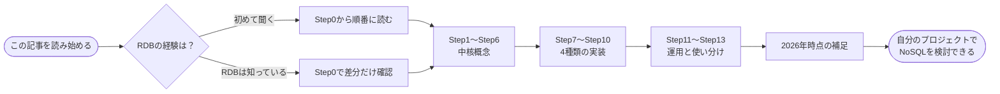

## 本書全体の構成

原著は「Part I: Understand（概念を理解する）」と「Part II: Implement（実装として選ぶ）」の2部・全15章から成ります。本ガイドのStep番号は、この15章にそのまま対応しています。

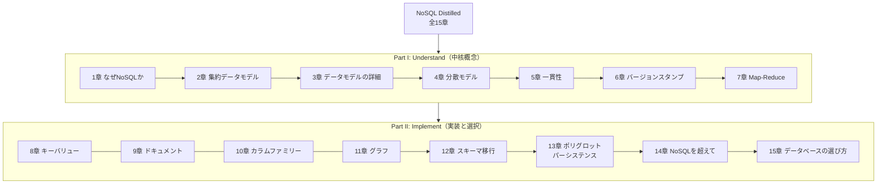

---

## Step0. なぜNoSQLなのか（第1章 Why NoSQL?）

### RDBは20年以上ずっと「唯一の答え」だった

著者らは本書の冒頭で、エンタープライズの世界では長年「データはリレーショナルデータベースに保存するもの」という前提が揺るがなかった、と振り返っています。RDBには、
- 永続化（Persistence）
- 同時実行制御（Concurrency Control）
- アプリケーション間のデータ統合（Integration）

という3つの役割があり、これらを一手に引き受けてきました。データはプログラムよりも長生きするため、枯れた技術で安定してアクセスできることには大きな価値があります。

### 2つのほころび

その安定した王座に、2つの方向からほころびが生じます。

1. **インピーダンス・ミスマッチ（Impedance Mismatch）**
   アプリケーション内のオブジェクト（メモリ上の入れ子構造）と、正規化されたリレーショナルのテーブル群は形が異なります。この変換コストが開発者を悩ませ続けてきました。
2. **クラスタの襲来（Attack of the Clusters）**
   GoogleやAmazonのような大規模サービスは、1台の巨大なサーバーではなく、安価なコモディティサーバーを大量に束ねたクラスタでデータを扱う必要に迫られました。しかし、当時広く使われていたRDB製品の多くは単一ノードでの動作を中心に設計されており、クラスタ上で水平に分散させることは前提になっていませんでした（本書刊行後に普及したGoogle SpannerやCockroachDBのような分散SQLは、RDBのモデルを保ったままこの前提を覆しています）。

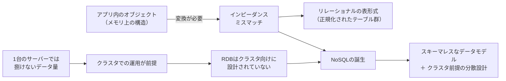

### 「NoSQL」という言葉自体があいまい

面白いことに、著者らは「NoSQLには厳密な定義がない」とはっきり書いています。特定の設計思想から生まれた言葉ではなく、Cassandra・MongoDB・Neo4j・Riakのような最近の非リレーショナルなデータベース群を指すために後から貼られたラベル（偶然生まれた新造語、"accidental neologism"）に過ぎません。強いて共通点を挙げるなら、

- スキーマレスなデータを扱う
- クラスタ上で動くことを前提にしている
- 伝統的な一貫性を、他の有用な性質（可用性やスケーラビリティ）とトレードオフできる
- 多くがオープンソースである
- 21世紀のウェブ規模の需要を意識して作られている

といった「傾向」にすぎません。NoSQLを採用する主な動機は2つに整理できます。

1. **クラスタでの大規模なデータアクセス**を、適切なコストで実現したい
2. リレーショナルなデータモデルがそぐわない場面で、**より生産性の高いデータモデル**を使いたい

### Key Points（第1章のまとめ）

- RDBは20年間、永続化・同時実行制御・アプリケーション統合を担ってきた成功した技術である
- アプリ開発者は、リレーショナルモデルとメモリ上のデータ構造の「インピーダンス・ミスマッチ」に苛立ってきた
- データベースを統合ポイントとして使う発想から、アプリケーション側でデータを抱え込みサービス経由で連携する発想への移行が進んでいる
- データストアの変化を後押しした決定的な要因は、クラスタで大量データを扱う必要性だった
- RDBはクラスタで効率よく動くようには設計されていない
- 「NoSQL」は厳密な定義を持たない偶発的な新造語であり、共通の特徴を観察できるだけである

---

## Step1. 集約データモデル（第2章 Aggregate Data Models）

### リレーショナルモデルには「モデル」が一つしかない

RDBの大きな強みの一つは、どの製品を使っても基本的なデータモデル（テーブル・行・列）が同じであることです。一方でNoSQLには単一の共通モデルがなく、代表的なものだけでも4種類に分かれます。

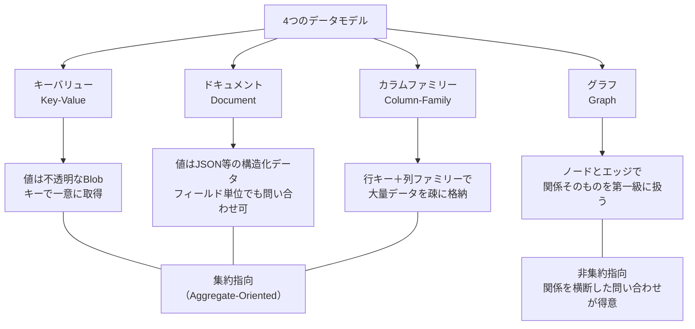

### 集約（Aggregate）という考え方

キーバリュー・ドキュメント・カラムファミリーの3つに共通するのが「**集約（Aggregate）**」という単位です。集約とは、ドメイン駆動設計（DDD）由来の概念で、「ひとまとまりとして扱いたいデータの集合」を指します。たとえば注文（Order）であれば、顧客情報・注文明細・配送先住所を1つの集約としてまとめて保存し、1回の操作で読み書きします。

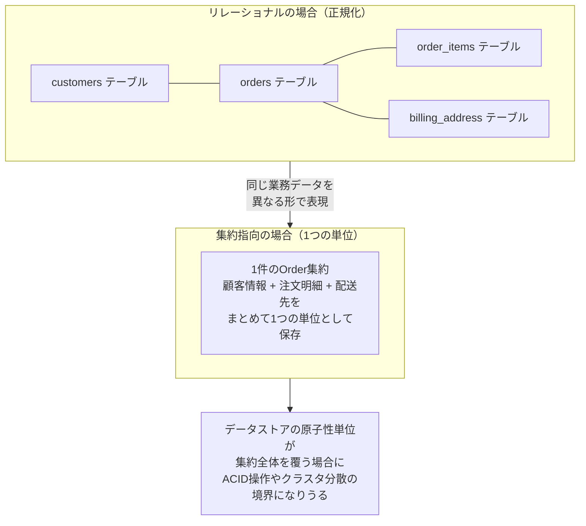

集約という単位を導入すると、次の2つのメリットが生まれます。

1. **クラスタへの分散が自然になる**：集約ごとデータベースが1つのノードに配置できれば、複数ノードにまたがるやり取りを減らせる
2. **ACID的な操作の境界が明確になる**：データストアの原子性の単位が集約全体を覆う場合に限り、1つの集約に対する更新を原子的に行える（原子性の単位が1ドキュメント・1行などに限られる製品では、集約がその単位を超えた時点で原子性は保証されない）

一方で、**集約をまたいだ関係（inter-aggregate relationships）は、集約内の関係（intra-aggregate relationships）よりも扱いにくくなる**というトレードオフも生まれます。これは次のStepで詳しく見ます。

### 集約指向 vs 非集約指向

| 観点 | 集約指向（KV・ドキュメント・カラムファミリー） | 非集約指向（グラフDB） |
|---|---|---|
| 得意なアクセスパターン | 同じ集約をまとめて読み書きする処理 | データを様々な切り口で組み合わせて使う処理 |
| クラスタ分散のしやすさ | 集約単位で分散しやすい | 関係をまたぐため分散は難しくなりがち |
| 向いている例 | ショッピングカート、ユーザープロファイル | ソーシャルグラフ、レコメンド、不正検知 |

### Key Points（第2章のまとめ）

- 集約とは、ひとまとまりとして扱うデータの集合であり、ACID操作の境界にもなる
- キーバリュー・ドキュメント・カラムファミリーは、いずれも集約指向データベースの一形態とみなせる
- 集約はクラスタ上でのデータ管理をしやすくする
- 集約指向データベースは、同じ集約への操作が中心の場合にうまく機能する。逆に多様な形でデータを組み合わせて使う場合は、非集約指向（＝RDBやグラフDB）の方が向く
- 集約指向データベースでは、集約をまたぐ関係の扱いが、集約内の関係よりも難しくなる

---

## Step2. データモデルの詳細（第3章 More Details on Data Models）

第3章では、集約指向だけでは語りきれない話題――関係の扱い、グラフDB、スキーマレス、マテリアライズドビュー――を掘り下げます。

### 集約をまたぐ関係の扱い方

集約指向データベースでは、集約をまたぐ関係を表現する主な方法が2つあります。

- **他の集約のIDを値として保持する**（RDBの外部キーに近い発想）。ただし整合性はアプリケーション側の責任になる
- **集約の中に相手のデータをコピーして埋め込む**。読み取りは速くなるが、更新時に複数箇所を書き換える必要が出る

集約をまたぐ「結合（JOIN）」に相当する処理は、RDBほど汎用的には扱えません。ただし一律に不可能というわけではなく、たとえばMongoDBは`$lookup`でコレクション間の結合を実行できます。サポート範囲（結合の種類、シャード構成での制限など）や性能特性は製品ごとに大きく異なるため、要件を満たせない場合はアプリケーションコード側で複数回のアクセスに分解して実装することになります。

### グラフデータベースという逆方向のアプローチ

ここで登場するのがグラフデータベースです。グラフDBは集約指向とは正反対の発想を取ります。大きな集約にまとめるのではなく、**小さなノード（頂点）とエッジ（辺）の集合として、関係そのものを第一級のデータとして扱います**。

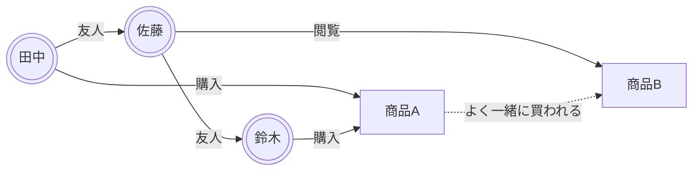

グラフDBのクエリは「隣接するノードをたどる」処理に最適化されており、「友人の友人で、かつ同じ商品を買った人」のような多段階の関係をたどる問い合わせで有利になりやすい構造です。ただしRDBの多段JOINに対して常に速いわけではなく、優劣はワークロード（ホップ数・分岐数・結果件数）とスキーマ設計、インデックスの有無に左右されるため、比較には対象ワークロードを定めたベンチマークが必要です。本書はNeo4jを代表例として扱っています。

### スキーマレスであること = スキーマがないわけではない

「NoSQL = スキーマレス」とよく言われますが、著者らはこれを誤解しやすいポイントとして丁寧に説明しています。スキーマレスとは「データベース自身が事前にスキーマを強制しない」という意味であり、**実際にはスキーマは消えたのではなく、書き込みを行うアプリケーションコードの側に移動しただけ**です。この移動には次のようなメリット・デメリットがあります。

| | メリット | デメリット |
|---|---|---|
| スキーマレス | フィールドの追加・削除が容易。異なる形のデータを同じコレクションに混在できる | データの構造を保証する仕組みが薄れ、暗黙の前提がコード側に散らばりやすい |
| RDBの固定スキーマ | データベースがデータ形式を保証してくれる | スキーマ変更のたびにマイグレーションの手間がかかる |

### マテリアライズドビューとデータアクセス志向のモデリング

RDBの世界では、正規化してから必要に応じてビューを作るのが一般的です。一方、集約指向のNoSQLでは、**「どういうクエリで読み出したいか」を先に決めてから、その読み出しに最適な形でデータを非正規化して保存する**という順序でモデリングします。これを補うのが**マテリアライズドビュー**（あらかじめ計算済みの問い合わせ結果を保持しておく仕組み）で、集計や複雑な読み出しパターンを高速化するために使われます。

### Key Points（第3章のまとめ）

- 集約をまたぐ関係は、キー参照または埋め込みのどちらかで表現するが、いずれもRDBのJOINほど宣言的には扱えない
- グラフデータベースは集約指向とは逆に、データを小さなノードに分割し、ノード間の関係を明示的に扱うことで複雑な関係のクエリに強くなる
- スキーマレスとは「スキーマが消える」ことではなく、「スキーマを強制する責任がデータベースからアプリケーションコードへ移る」ことを意味する
- マテリアライズドビューは、あらかじめ計算しておいた問い合わせ結果であり、集約指向データベースでの高度な読み出しパターンを実現する主要な手段になる
- NoSQLのモデリングは「どんな問い合わせで読み出すか」から逆算して設計する

---

## Step3. 分散モデル（第4章 Distribution Models）

NoSQLがクラスタ前提で生まれた以上、データをどう複数ノードに分散させるかは本書の核心テーマの一つです。分散のやり方は大きく2軸――**シャーディング**（データを分割する）と**レプリケーション**（データを複製する）――に整理できます。

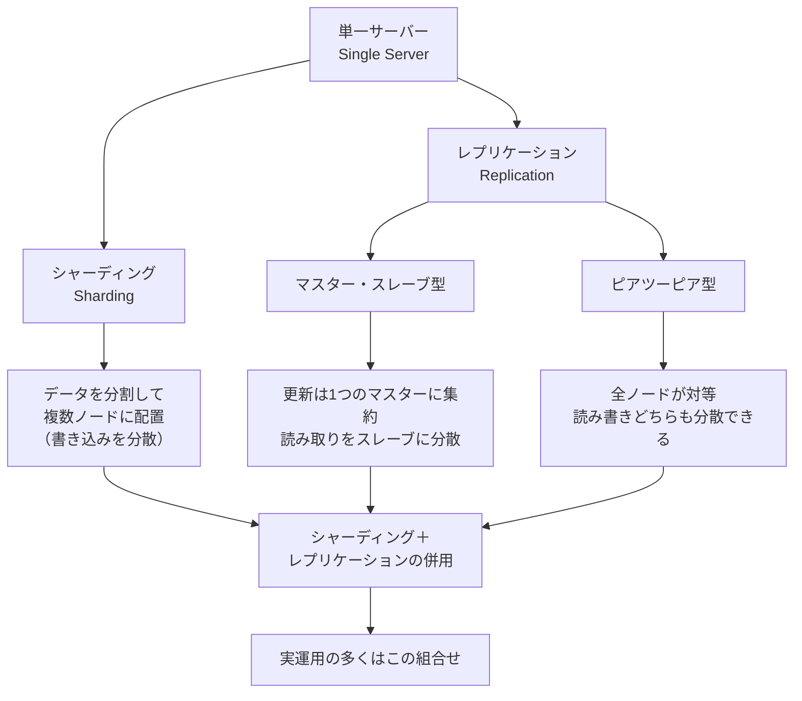

### 単一サーバー（Single Server）という選択肢を軽視しない

分散の話をする前に、著者らは「実は多くのケースで単一サーバーでも十分」と釘を刺しています。グラフデータベースのように分散が難しいモデルや、開発体験を優先したい場合には、あえて分散させずに単一サーバーで運用する選択肢も現実的です。

### シャーディング：データを「分割」して書き込みを散らす

シャーディングは、異なるデータをそれぞれ別のノードに配置する手法です。うまくシャーディングキーを選べば、同時にアクセスされやすいデータを同じノードにまとめられ、多くの操作を1ノード内で完結させられます。一方で、シャード同士をまたぐ集計処理は難しくなります。

また、関連データを寄せることだけを考えてキーを選ぶと、アクセスが特定のキーへ集中したときに1つのノードがホットスポット化し、他ノードが遊んだまま全体のスループットがそのノードに律速されます。負荷分散の効果を得るには、**関連データの局所化とノード間の負荷の平準化を両立させる**シャーディングキーを選ぶ必要があります。

### レプリケーション：データを「複製」して読み取りと耐障害性を高める

- **マスター・スレーブ型レプリケーション**：1つのマスターノードが更新を受け付け、その内容を複数のスレーブに反映します。読み取り負荷を複数ノードに分散できる一方、マスターが単一障害点になり得ます。
- **ピアツーピア型レプリケーション**：すべてのノードが対等な立場でデータを複製し合います。単一障害点がなくなる代わりに、複数ノードへの同時書き込みによる**書き込み競合**にどう対処するかが新たな課題になります。

実際のシステムの多くは、シャーディングとレプリケーションを組み合わせて使います。たとえば「データを複数のシャードに分割し、各シャードをさらに複数台にレプリケーションする」という構成です。

### Key Points（第4章のまとめ）

- 分散には大きく分けてシャーディング（分割）とレプリケーション（複製）の2つの軸がある
- シャーディングは書き込みの負荷を複数ノードに分散させるが、シャードをまたぐ集計は難しくなる
- マスター・スレーブ型レプリケーションは読み取りの負荷分散に強いが、マスターが単一障害点になりやすい
- ピアツーピア型レプリケーションは単一障害点を避けられるが、書き込み競合への対処が必要になる
- 実運用ではシャーディングとレプリケーションを組み合わせるのが一般的である

---

## Step4. 一貫性（第5章 Consistency）

分散システムでは「一貫性（Consistency）」の意味が一枚岩ではなくなります。本書はこれを**更新の一貫性（Update Consistency）**と**読み取りの一貫性（Read Consistency）**に分けて説明します。

### 更新の一貫性：書き込み競合をどう扱うか

複数のクライアントが同じデータを同時に更新しようとしたときにどうするか。代表的な戦略は次の3つです。

| 戦略 | 考え方 |
|---|---|
| 悲観的並行性制御 | 更新前にロックを取り、他の更新をブロックする |
| 楽観的並行性制御 | 更新時にバージョンを確認し、競合していれば書き込みを拒否する（Step5のバージョンスタンプで詳説） |
| 競合解決の先送り | 競合をいったん両方保存し、後からアプリケーションやユーザーに解決させる |

### 読み取りの一貫性：みんなが同じ答えを見るとは限らない

レプリケーションされた環境では、更新がすべてのレプリカに伝播するまでに時間差が生じます。この間に読み取りを行うと、ノードによって異なる値が返る可能性があります。これが**結果整合性（Eventual Consistency）**――「いずれは全ノードが同じ値に収束するが、その瞬間は保証されない」という考え方です。

### CAP定理

一貫性の議論で必ず出てくるのがCAP定理です。CAP定理は、Eric Brewerが2000年に提唱し、2002年にGilbertとLynchが定式化した考え方で、ネットワーク分断が発生した状況では、分散データストアは**一貫性（Consistency）**と**可用性（Availability）**のどちらかを選ばざるを得ない、というものです（分断耐性=Partition Toleranceは、ネットワークが分断されうる以上、事実上は前提条件になります）。

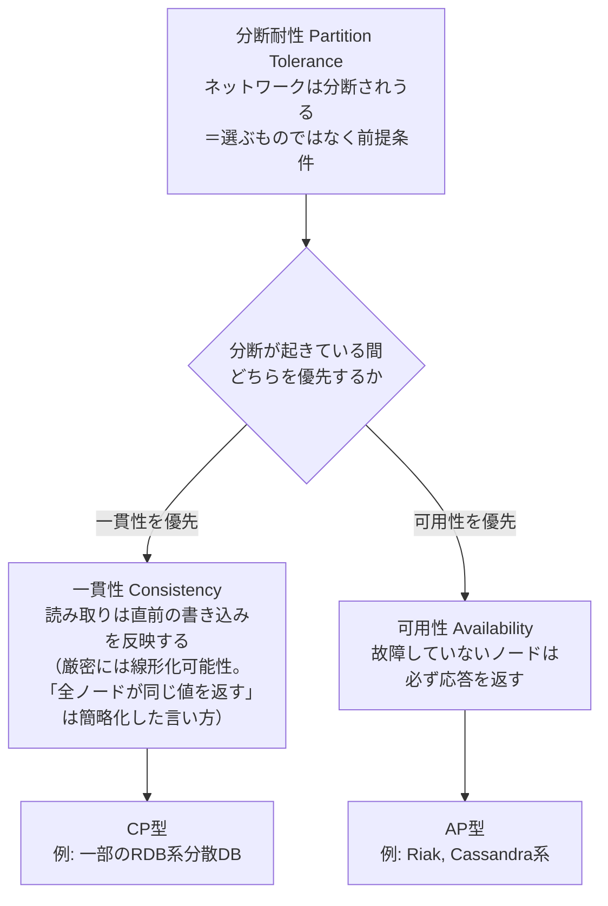

> **補足（発展）**：CAP定理は「2つしか選べない」という単純化のしすぎだという指摘も根強くあります。提唱者本人であるEric Brewerも2012年の論文「CAP Twelve Years Later」で、分断が起きていない平常時にまで無理に犠牲を払う必要はなく、実際には部分的なトレードオフを細かく設計できると述べ、当初の「2 of 3」という説明を自ら見直しています。さらにMartin Kleppmannは2015年の論文「A Critique of the CAP Theorem」で、CAP定理の定式化そのものが実務上の設計判断には荒すぎると批判しています。詳しくは批判的に読むの章と参考文献を参照してください。

### 一貫性を緩めることで得られるもの、失うもの

強い一貫性を要求するほど、可用性やレイテンシを犠牲にしやすくなります。逆に一貫性を緩めれば、可用性や応答速度を確保できます。同様に、**耐久性（Durability）**――「書き込みが確実にディスクへ反映されたか」――も、性能とのトレードオフで緩めることがあります（たとえば書き込みを一度メモリだけに反映し、非同期でディスクに反映するなど）。

### クォーラム：読み書きにいくつのノードの合意が必要か

分散システムでは、レプリカの台数を N、書き込み成功に必要な台数を W、読み取りに問い合わせる台数を R とすると、`W + R > N` を満たす設定では、読み取り先のレプリカ集合と書き込み先のレプリカ集合が必ず1台以上重なります。

ただし、これは「最新値を含むレプリカが読み取り結果に混ざる」ことを示すだけで、それ自体が最新値の取得を保証するわけではありません。実際に最新値を返せるかは、次の前提が揃っているかに依存します。

- バージョン（ベクタークロックなど）を比較して更新同士の因果関係を判定できること。因果的に順序づけられる更新であれば、後続の値を最新として選べる
- 因果関係を持たない「同時（concurrent）」な更新は、最新を一意に決められないため衝突として扱われる。その解決方法（後勝ち、値のマージ、複数バージョンをクライアントへ返すなど）が定義されていること
- 読み取りが途中で打ち切られず、W・R が実際にその回数を満たしていること
- Read Repair やアンチエントロピーによって、遅れたレプリカが修復されること

これらを踏まえたうえで、W・R・Nの組み合わせを調整することで、一貫性と可用性のバランスを細かく設計できます。

### Key Points（第5章のまとめ）

- 分散システムの一貫性は「更新の一貫性」と「読み取りの一貫性」に分けて考える必要がある
- 結果整合性は、いずれ全ノードが収束することだけを保証し、収束までの時間は保証しない
- CAP定理は、ネットワーク分断時に一貫性と可用性のどちらを優先するかという選択を迫る
- 一貫性や耐久性を意図的に緩めることで、可用性や性能を高められる
- クォーラム（W・R・Nの関係）を調整することで、一貫性と可用性のトレードオフを細かく制御できる

---

## Step5. バージョンスタンプ（第6章 Version Stamps）

### なぜタイムスタンプだけでは不十分なのか

「最後に書き込まれたものを正とする（Last-Write-Wins）」という単純な戦略は、複数ノードでクロックがわずかにずれるだけで、正しい順序を保証できなくなるという弱点があります。そこで登場するのが**バージョンスタンプ**――更新のたびに増分するカウンタやハッシュなど、明示的にバージョンを識別する仕組みです。

### ビジネストランザクションとシステムトランザクション

本書は、DBが保証する短い「システムトランザクション」と、ユーザーの一連の操作全体を指す長い「ビジネストランザクション」を区別します。Webアプリのように、ユーザーがデータを読み込んでから更新を送るまでに時間差がある場合、その間に他のユーザーが同じデータを更新しているかもしれません。バージョンスタンプは、この**楽観的並行性制御**――「読み込んだときのバージョンと、書き込む直前のバージョンを比較し、ズレていれば競合として扱う」――を実現する土台になります。

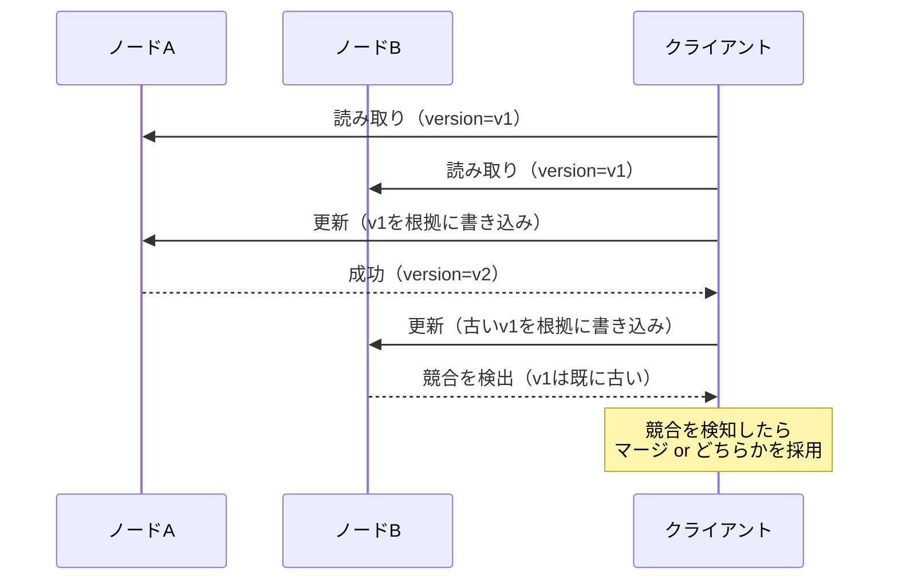

### 複数ノードにまたがるバージョンスタンプ

ピアツーピア型レプリケーションのように複数ノードが同時に書き込みを受け付けられる環境では、単純な増分カウンタでは不十分です。ここで使われるのが**ベクタークロック（Vector Clock）**のような仕組みで、「どのノードが」「何回目の更新を」行ったかを記録し、真に競合している更新（＝どちらが新しいとも言えない更新）だけを検出できるようにします。

### Key Points（第6章のまとめ）

- タイムスタンプだけに頼る「最後の書き込みが勝つ」方式は、クロックのずれによって危険な場合がある
- バージョンスタンプは、楽観的並行性制御――読み込み時と書き込み時のバージョンを比較して競合を検出する仕組み――を支える
- ビジネストランザクションは、DBのシステムトランザクションよりも長い時間軸で考える必要がある
- 複数ノードが同時に書き込みを受け付けられる環境では、ベクタークロックのような仕組みで真の競合を見分ける

---

## Step6. Map-Reduce（第7章 Map-Reduce）

### 集約指向データベースにおける集計の課題

RDBならSQLのGROUP BYで済むような集計処理も、データが集約単位でクラスタ中に散らばっていると、単純にはいきません。そこで使われるのが**Map-Reduce**という計算モデルです。

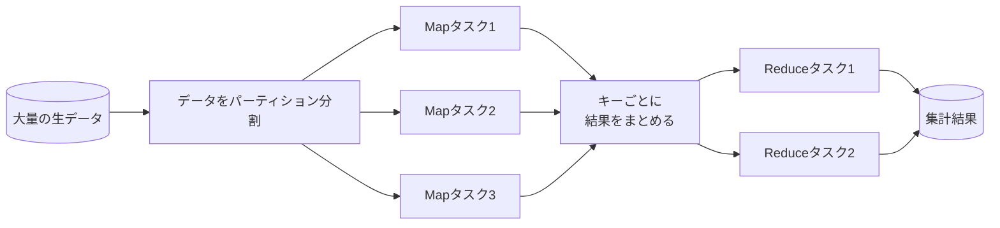

### Map関数とReduce関数

- **Mapタスク**：各ノード上のデータに対して独立に実行され、入力を「キーと値のペア」に変換する。各ノードが自分の持つデータだけを処理すればよいため、並列化しやすい
- **Reduceタスク**：Mapの出力を、同じキーごとにまとめて集計する。Mapに比べて「同じキーのデータを1か所に集める」処理が必要になるため、ネットワーク越しのデータ移動（シャッフル）が発生する

### パーティショニングと結合（Combining）

大規模なMap-Reduceでは、Reduceの前段に「Combiner」を挟み、各ノード内であらかじめ部分集計をしてからシャッフルすることで、ノード間の通信量を減らす最適化が一般的です。

### Map-Reduce計算の合成

単一のMap-Reduceだけでなく、複数のMap-Reduce処理を**パイプライン状に連結**したり、**複数の入力に対して同じ処理を並行して走らせ、後で結果を突き合わせる**といった合成パターンも紹介されています。これにより、単純な集計だけでなく、複雑な分析処理もクラスタ上に分散させて実行できます。

### Key Points（第7章のまとめ）

- Map-Reduceは、クラスタに分散したデータに対して集計処理を行うための計算モデルである
- Mapタスクは各ノードで独立に並列実行でき、Reduceタスクは同じキーのデータをまとめて処理する
- Combinerによる部分集計は、ノード間のデータ移動を減らす重要な最適化である
- 複数のMap-Reduce処理を合成することで、より複雑な分析パイプラインを構築できる

---

## Step7. キーバリューデータベース（第8章 Key-Value Databases）

Part IIからは、4つの代表的なNoSQLデータベースについて「What Is」「Features」「Suitable Use Cases」「When Not to Use」という共通フォーマットで解説していきます。まずはもっともシンプルなキーバリューストアです。

### キーバリューストアとは

一意なキーに対して、中身を問わない「値（Blob）」を1つだけ紐づけて保存する、もっとも単純なデータモデルです。データベース自身は値の中身を理解しません。本書ではRiakを代表例として扱っています。

### 主な特徴

- **一貫性**：どう扱うかは製品と構成によって異なる。Riakのようなピアツーピア型の製品は書き込み競合の解決にバージョンスタンプ（Step5）を用いるが、単一マスタのRedisや、強い整合性の読み取りを選べるAmazon DynamoDBのように別の方式をとる製品もある
- **トランザクション**：1つのキーに対する操作はアトミック。複数キーにまたがるトランザクションの可否は製品と構成によって異なり、Riakのように基本的にサポートしないものがある一方、Amazon DynamoDBは`TransactWriteItems`で複数アイテムをまとめて原子的に書き込め、RedisもMULTI/EXECで一連のコマンドをまとめて実行できる（Redis Clusterでは対象キーが同一ハッシュスロットに属している必要がある）
- **クエリ機能**：キーによる取得のみがコアの機能。値の中身を条件に検索する機能は基本的に持たない（製品によっては補助的なインデックス機能を持つ）
- **スケーリング**：水平分散が容易で、単純なリードスルー／ライトスルーのキャッシュとしても使いやすい

### 向いている用途

- セッションデータの保存
- ユーザープロファイルや設定情報のキャッシュ
- ショッピングカート（Amazon Dynamoの著名な事例のように）
- ユーザーごとの単純な統計値の保持

### 向かない用途

- キー以外の条件で値を検索したい場合
- 複数キーにまたがる操作をアトミックに行いたい場合
- キー同士の関係（リレーション）を扱いたい場合

---

## Step8. ドキュメントデータベース（第9章 Document Databases）

### ドキュメントデータベースとは

キーバリューストアの値を、JSONやXMLのような**構造化されたドキュメント**に置き換えたものです。データベース自身がドキュメントの構造を理解できるため、キー以外のフィールドでも問い合わせができます。本書ではMongoDBを主な例に、CouchDBやRavenDBにも触れています。

### 主な特徴

- **クエリ機能**：ドキュメント内の任意のフィールドに対してインデックスを張り、条件検索や範囲検索ができる
- **集約の考え方**：1つのドキュメントの中にリスト構造やネスト構造を自由に持てるため、「注文とその明細」のような1対多の関係を1ドキュメントにまとめやすい
- **スキーマの柔軟性**：ドキュメントごとに異なるフィールド構成を持てる（Step2で触れたスキーマレスの実例）

### 向いている用途

- イベントログの記録
- コンテンツ管理システム（CMS）やブログのような、構造が可変なデータ
- Webアプリケーションのバックエンド全般（構造がドキュメント単位で完結しやすい場合）
- 分析目的での柔軟なデータ収集

### 向かない用途

- 複数のドキュメントをまたぐ複雑なトランザクションが必要で、利用する製品・配置構成がその範囲を提供しない、あるいは提供していても性能要件を満たせない場合（例：MongoDBはレプリカセットで複数ドキュメント、4.2以降はシャード構成でも分散トランザクションを扱えるが、単一ドキュメント更新に比べて相応のコストがかかる）
- データの構造がドキュメントをまたいで頻繁に再編成される（＝集約の境界が変わりやすい）場合
- 集約に分けにくい、高度に関係性が絡み合ったデータ（→ グラフDBの出番）

---

## Step9. カラムファミリーストア（第10章 Column-Family Stores）

### カラムファミリーストアとは

Googleの Bigtable 論文に着想を得たモデルで、行キーに対して「列（カラム）」の集合をまとめて保存します。列同士をグループ化したものを「カラムファミリー」と呼びます。本書ではCassandraを主な例に、HBaseにも触れています。

ただし「列が固定されない」度合いは製品によって異なります。

- **Bigtable・HBase**：列はあらかじめ固定されず、行ごとに異なる可変長の列を持てます。事前に定義するのはカラムファミリーまでで、その中の列修飾子（カラム名）は書き込み時に自由に決められます。
- **Cassandra**：現行のCQLでは、列はテーブルスキーマとして定義します。値を設定しない列があっても構わず、その分の記憶域も消費しない（疎である）一方で、Bigtableのように行ごとへ任意の列を後から足せるわけではありません。列を動的に増やしたい場合は、コレクション型やクラスタリングキーを使ったモデリングで表現します。

### 主な特徴

- **2次元・場合によっては3次元のデータモデル**：行キー×カラムファミリー×カラム名という構造で、疎（スパース）なデータを効率よく格納できる
- **書き込みスループットの高さ**：ログや時系列データのように、追記中心のワークロードに強い
- **一貫性のチューニング**：Cassandraのように、クォーラム（Step4）の設定によって一貫性と可用性のバランスを細かく調整できる実装が多い

### 向いている用途

- 大量の書き込みが発生するイベントログ・時系列データ
- 巨大なデータセットに対する分散カウンター
- 読み出しパターンがあらかじめ分かっている大規模なWebサービスのバックエンド

### 向かない用途

- クエリパターンが頻繁に変わるプロトタイピング段階のシステム
- 複雑な集約・結合を必要とする分析クエリ
- ACIDに近い強いトランザクション保証が必須の場合

---

## Step10. グラフデータベース（第11章 Graph Databases）

### グラフデータベースとは

Step2で紹介した通り、集約指向とは対照的に、小さなノードとエッジの集合としてデータをモデリングします。ノード・エッジの双方にプロパティ（属性）を持たせられるのが一般的です。本書ではNeo4jを主な例として扱っています。

### 主な特徴

- **関係のたどりやすさ**：Neo4jのようなネイティブグラフストレージでは、各ノードが隣接ノードへの参照を直接保持します（インデックスフリー隣接）。これが効くのは探索の**開始ノードを特定した後**の隣接たどりの部分で、開始ノード自体はインデックス検索などで見つける必要があります。この性質を持たない非ネイティブな実装（RDBやドキュメントDBの上にグラフAPIを載せたもの）には当てはまりません。また可変長パスの探索では、ホップ数と分岐数に応じて生成されるパスが爆発的に増えて大幅に遅くなることがあり、「常に高速」ではありません
- **柔軟なスキーマ**：ノードやエッジの種類を後から追加しやすい
- **専用のクエリ言語**：Cypherのようなグラフ探索に特化したクエリ言語を持つ製品が多い

### 向いている用途

- ソーシャルネットワークの友人関係
- レコメンドエンジン（「この商品を買った人はこれも買っています」）
- 不正検知（取引ネットワークの中の怪しいパターン探索）
- 経路探索・依存関係の解析

### 向かない用途

- グラフ全体にまたがる大規模な集計・更新をクラスタ全体に単純に水平分散したい場合（グラフDBは他のNoSQLほど素直には水平分散できないことが多い）
- 関係がほとんど存在しない、単純なレコード管理

### 4つのデータベースの使い分け早見表

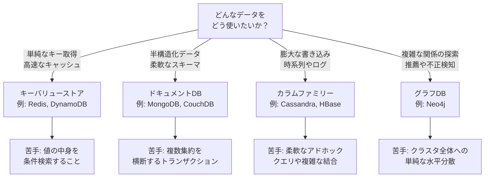

| データモデル | 代表例（本書刊行時） | 得意なこと | 苦手なこと |
|---|---|---|---|
| キーバリュー | Riak, Redis, Memcached, Amazon DynamoDB | 高速な単純取得、キャッシュ | 値の中身での検索、複数キーの整合性 |
| ドキュメント | MongoDB, CouchDB, RavenDB | 柔軟なスキーマ、フィールド検索 | ドキュメントをまたぐトランザクション（製品・構成が対応していない場合、または対応していても性能コストが要件に合わない場合） |
| カラムファミリー | Cassandra, HBase | 大量書き込み、時系列データ | 複雑な結合・集計クエリ |
| グラフ | Neo4j, InfiniteGraph | 複雑な関係のたどり | クラスタ全体への単純な水平分散 |

---

## Step11. スキーマ移行（第12章 Schema Migrations）

### 「スキーマレスだからマイグレーション不要」は誤解

Step2で触れた通り、スキーマレスとはスキーマがアプリケーションコード側に移動しただけであり、著者のMartin Fowlerは「スキーマレスだから移行を考えなくてよい、というのは深刻な誤解だ」と明言しています。実際には、RDBのマイグレーションで培われてきた技法の多くが、NoSQLでも活用できます（この分野はもう一人の著者Sadalage自身が『Refactoring Databases』で先駆的に扱ったテーマでもあります）。

### RDBのスキーマ変更 vs NoSQLのスキーマ変更

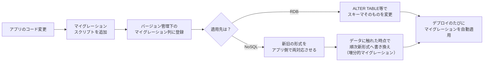

RDBでは、スキーマの変更を明示的な `ALTER TABLE` として一括適用するのが一般的です。一方NoSQLでは、次のような戦略が使われます。

- **アプリケーション側での新旧両対応**：読み込み時に古い形式を検出したら、新しい形式に変換してから使う
- **増分的（増加的）マイグレーション**：レコードがアクセスされたタイミングで、その都度新しい形式に書き換えていく。すべてのレコードを一斉に書き換える必要がない
- **一括マイグレーション（Eager Migration）**：メンテナンスウィンドウを設けて、既存データを一気に新形式へ変換する

いずれの場合も、マイグレーションスクリプトをバージョン管理し、デプロイの一部として自動的に適用する運用（継続的デリバリー的な発想）が推奨されています。

### Key Points（第12章のまとめ）

- スキーマレスであることは、スキーマを考えなくてよいことを意味しない
- スキーマの変更は、RDBでは明示的なALTER操作として、NoSQLではアプリケーションコードでの新旧両対応として扱われることが多い
- 増分的マイグレーションを使えば、データに触れたタイミングで少しずつ新形式へ移行できる
- マイグレーションはバージョン管理し、デプロイパイプラインの一部として自動化するべきである

---

## Step12. ポリグロット・パーシステンス（第13章 Polyglot Persistence）

いよいよ本書のサブタイトルにもなっている中心概念、**ポリグロット・パーシステンス（Polyglot Persistence）**です。

### 1つのアプリに1つのDBという発想からの脱却

これまで多くの組織は、トランザクション・セッション管理・BI・ロギングなど、性質の異なるあらゆるデータを同じRDBエンジンに詰め込んできました。しかし著者らは、**データの使われ方が異なれば、最適なデータストアも異なる**と主張します。「ポリグロット（多言語）」という言葉が示す通り、1つのプログラミング言語で全てを書く必要がないのと同様に、1つのデータストアで全てを賄う必要はない、という発想です。

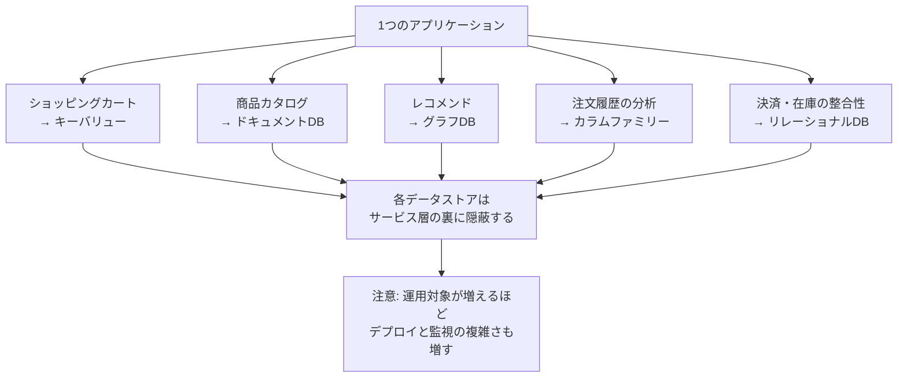

### データストアを「統合ポイント」にしない

Martin Fowlerは、ポリグロット・パーシステンスを実践する上でもっとも重要な帰結として、**「データベースをアプリケーション間の統合ポイントとして直接共有する」発想から、「各アプリケーションが自分のデータストアをカプセル化し、より上位のサービス層を通じて連携する」発想への転換**を挙げています。異なるデータモデルを持つ複数のデータストアを1つのスキーマとして外部に晒すのではなく、サービスの背後に隠すことで、それぞれのデータストアの都合に振り回されずに済みます。

### 適切な技術を選ぶ・機能拡張のために持ち込む

ポリグロット・パーシステンスは、最初から壮大な設計をする必要はありません。まずは既存のRDB中心のアーキテクチャの中で、特定の機能（全文検索、グラフ探索、キャッシュなど）だけを専用のNoSQLに任せる、という段階的な拡張から始めるのが現実的です。

### エンタープライズ視点での懸念：運用の複雑さ

一方で、データストアの種類が増えるほど、監視・バックアップ・運用スキルの確保・デプロイの複雑さも増していきます。著者らは、ポリグロット・パーシステンスの恩恵と、この運用コストとを天秤にかけて判断する必要があると釘を刺しています。

### Key Points（第13章のまとめ）

- ポリグロット・パーシステンスとは、データの使われ方に応じて複数のデータストア技術を使い分けるという考え方である
- データベースを直接の統合ポイントにするのではなく、アプリケーションがデータストアをカプセル化し、サービス層で連携する発想への転換が重要になる
- まずは既存システムの一部機能を拡張する形でNoSQLを導入するのが現実的な出発点になりやすい
- データストアの種類が増えるほど、デプロイと運用の複雑さというコストも増加する

---

## Step13. NoSQLを超えて（第14章 Beyond NoSQL）

本書は「NoSQL」という枠そのものにもこだわりすぎません。第14章では、NoSQLの4分類にも当てはまらない、その他の永続化の選択肢を紹介しています。

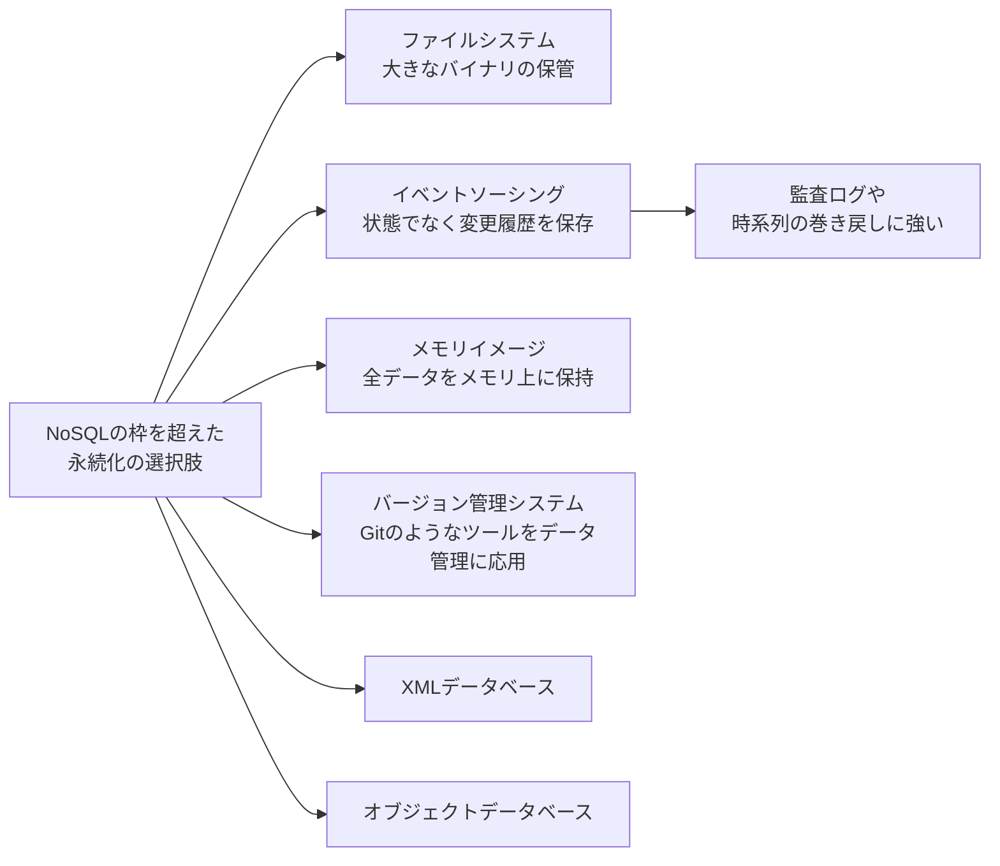

- **ファイルシステム**：画像や動画のような大きなバイナリは、無理にデータベースに詰め込むよりファイルシステム（またはオブジェクトストレージ）に置き、メタデータだけをDBに持つ方が理にかなうことが多い
- **イベントソーシング（Event Sourcing）**：現在の「状態」ではなく、状態に至るまでの「変更イベントの履歴」を保存する設計手法。現在の状態はイベント履歴を再生することで導出する
- **メモリイメージ（Memory Image）**：全データをメモリ上に保持し、耐久性はイベントログなどで別途担保する設計。読み書きが極めて高速になる
- **バージョン管理システムの応用**：Gitのような分散バージョン管理の仕組みを、一般的なデータ管理に応用する発想
- **XMLデータベース／オブジェクトデータベース**：NoSQLブーム以前から存在する、それぞれ独自の歴史を持つ永続化技術

### Key Points（第14章のまとめ）

- 永続化の選択肢はNoSQLの4分類だけにとどまらない
- 大きなバイナリデータは、ファイルシステムやオブジェクトストレージに置く方が適切なことが多い
- イベントソーシングは、状態そのものではなく変更履歴を保存することで、監査性や巻き戻し可能性を高める
- メモリイメージは、全データをメモリ上に保持することで高速な読み書きを実現する設計である

---

## Step14. データベースの選び方（第15章 Choosing Your Database）

最終章では、ここまでの内容を踏まえた「では結局どう選ぶのか」という実践的な指針がまとめられています。

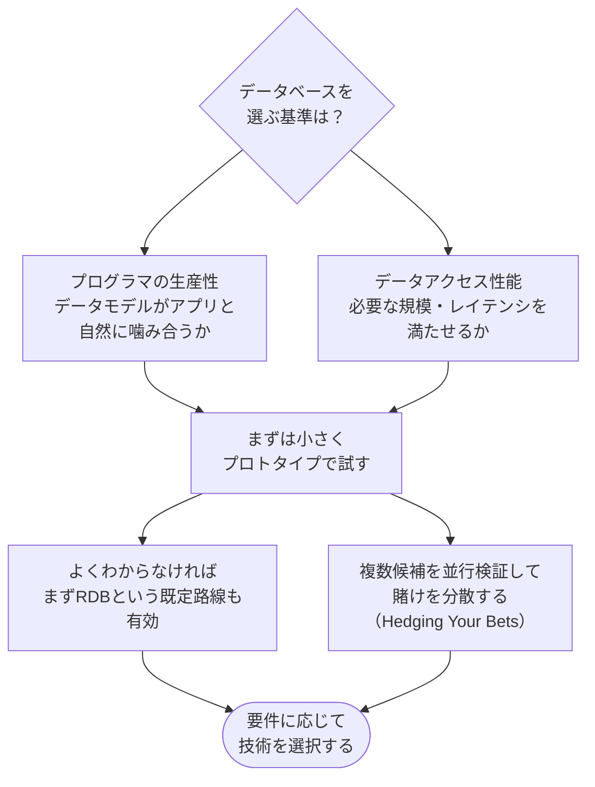

### 2つの主要な判断軸

1. **プログラマの生産性（Programmer Productivity）**：そのデータモデルが、扱いたいデータの形と自然に噛み合っているか。RDBに無理やり押し込むより、適したモデルを選ぶ方が開発が速く進むことがある
2. **データアクセス性能（Data-Access Performance）**：クラスタで捌く必要があるデータ量・スループット・レイテンシの要件を満たせるか

### デフォルトに留まる勇気、賭けを分散する勇気

- **既定路線に留まる（Sticking with the Default）**：チームの経験や既存の運用体制を考えると、あえて枯れたRDBを選び続けることが合理的な場合もある
- **賭けを分散する（Hedging Your Bets）**：要件が固まりきらない段階では、複数の技術を並行して検証し、実際に手を動かしてみることで判断材料を増やす

著者らが一貫して強調するのは、「**とにかく実際に試してみること**」です。オープンソースのNoSQL製品が多いという利点を活かし、机上の比較だけでなく、実際のシナリオでプロトタイプを動かして確かめることが、最終的な判断の精度を大きく左右します。

### Key Points（第15章のまとめ）

- データベース選定の主要な判断軸は、プログラマの生産性とデータアクセス性能の2つに整理できる
- 既存の体制や経験を踏まえて、あえてRDBという既定路線に留まる判断も合理的でありうる
- 要件が不確かな段階では、複数の技術を並行して試し、賭けを分散させるとよい
- 最終的な判断は、机上の比較よりも実際に試してみることで精度が上がる

---

## 2026年時点の補足：刊行から10年以上が経って何が変わったか

『NoSQL Distilled』は2012年8月に刊行された本です。ここまで解説してきた**概念**（集約、CAP定理、シャーディング、ポリグロット・パーシステンスなど）は今も色あせていませんが、本書が挙げる**具体的な製品や状況証拠**は、2026年現在から見るとアップデートが必要な部分があります。

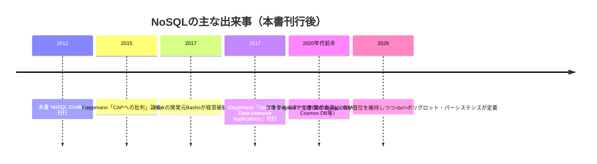

### 本書の看板例だったRiakは、開発主体が入れ替わっている

本書はキーバリューストアの代表例としてRiakを繰り返し取り上げていますが、開発の担い手は当初から大きく変わっています。

- **旧来のRiak（Basho Technologies / basho）**: 開発元のBasho Technologiesは2017年に資金繰りに行き詰まって経営破綻し、資産はBet365に買収されました。`basho/riak` リポジトリのリリースは2023年6月の3.0.16を最後に止まっており、データベースカタログサイト「Database of Databases」でも「abandoned（放棄された）」と分類されています。
- **現在のRiak（OpenRiak コミュニティ）**: その後、有志による `OpenRiak` 組織へ開発が引き継がれています。Riak KV は2026年1月に3.4.0、2026年6月に3.4.1がリリースされており、本ガイド執筆時点（2026年9月）でも各コンポーネントのリポジトリが更新され続けています。

したがって「Riakは開発停止」と一括りにするのは正確ではなく、止まっているのはBasho時代の系統で、コミュニティ主導の系統は動いている、と分けて捉える必要があります。とはいえ商用サポートを伴う製品としての選択肢は限られるため、本書でRiakの動作例を読むときは、まず「ピアツーピア型レプリケーションを説明するための教材」として読むのが実用的です。

対照的に、本書のもう3つの代表例――MongoDB（ドキュメント）、Cassandra（カラムファミリー）、Neo4j（グラフ）――はいずれも2026年時点でも各カテゴリの代表格であり続けています。

### CAP定理の理解は、より繊細になった

Step4で触れた通り、CAP定理の提唱者Eric Brewer自身が2012年の論文「CAP Twelve Years Later: How the 'Rules' Have Changed」で、「2つのうち2つしか選べない」という単純化は誤解を招きやすいと振り返り、分断が起きていない平常時には3つの性質をすべて追求してよいこと、分断時の犠牲も粒度を細かく設計できることを説明しています。さらにケンブリッジ大学のMartin Kleppmannは2015年の論文「A Critique of the CAP Theorem」で、CAP定理の定式化そのものが実務上の設計判断には粗すぎると指摘し、レイテンシと一貫性のトレードオフとして捉え直すべきだと論じています。

### より現代的な「次の1冊」の定番になったDDIA

本書の後継として2017年に刊行されたMartin Kleppmannの『Designing Data-Intensive Applications』（通称DDIA）は、NoSQL Distilledが切り開いた「データストアを俯瞰して比較する」というアプローチを引き継ぎつつ、ストレージエンジンの内部構造、レプリケーションの詳細、トランザクションの分離レベル、ストリーム処理までを、より深く現代的な事例とともに扱っています。NoSQL Distilledを読み終えて「もっと深く知りたい」と思った読者の多くが、次に手に取る本として挙げています。

### 2026年のNoSQL勢力図：クラウドマネージド化とマルチモデル化

- **クラウドマネージド型が既定路線になった**：Amazon DynamoDB、Azure Cosmos DB、MongoDB Atlasのように、運用そのものをクラウド事業者に任せる形態が主流になり、本書が懸念していた「ポリグロット・パーシステンスの運用コスト」の一部は、マネージドサービスの普及によって軽減されつつあります
- **DB-Enginesランキング**（採用実績ではなく、求人・技術記事・検索数などから算出される「人気度」の指標）では、2026年9月時点でもMongoDBが[文書DBカテゴリ](https://db-engines.com/en/ranking/document+store)で首位、Redisが[キーバリューDBカテゴリ](https://db-engines.com/en/ranking/key-value+store)で首位、Neo4jが[グラフDBカテゴリ](https://db-engines.com/en/ranking/graph+dbms)で首位を維持しています。市場シェアを表すものではない点に注意してください
- **4分類の境界がにじんできた**：Azure Cosmos DBやArangoDBのような「マルチモデル」データベース、あるいはPostgreSQLのJSONB型のように、RDBがNoSQL的な柔軟性を取り込む動きも一般化し、「NoSQLかRDBか」という二者択一よりも、「どの機能をどのデータストアに担わせるか」というポリグロット・パーシステンス的な発想そのものが主流になりました
- **本書が扱っていない領域**：2012年刊行のため、当然ながらベクトルデータベース（Qdrant、Milvusなど）のようなAI・機械学習ワークロード向けの新しいカテゴリは扱われていません。これらは埋め込みベクトルの近似最近傍検索を中心に据えた、AI・ベクトル検索向けの追加カテゴリ（あるいは検索基盤）として2020年代に急速に発展した領域です。既存のドキュメントDBやRDBを置き換えるものとは限らず、pgvectorやMongoDB Atlas Vector Searchのように既存DBの拡張として併用される形も一般的です

---

## 批判的に読む

本書を鵜呑みにせず、以下の点は意識しながら読むことをおすすめします。

1. **「NoSQL」という言葉自体の定義のゆるさ**：著者ら自身が「NoSQLは厳密な定義を持たない偶発的な新造語」と認めています。この言葉に過度な期待や統一的なイメージを重ねすぎないよう注意が必要です
2. **代表例の陳腐化**：上述の通り、Riakの実質的な開発停止のように、10年以上前の「今のイチオシ」は現在では通用しないことがあります。個別の製品名よりも、その背後にある「データモデル」の考え方を吸収する読み方が長持ちします
3. **CAP定理の単純化**：本書のCAP定理の説明はわかりやすい反面、提唱者自身や後続の研究者による精緻化を踏まえると、「2つしか選べない」という理解だけで止まらないほうがよいでしょう
4. **薄い本ゆえの割り切り**：著者ら自身が「飛行機の中で読み切れる分量」を意図したと述べている通り、本書は意図的に各トピックを深掘りしすぎない設計になっています。実装の詳細（各製品のドライバの使い方、具体的なクエリ構文など）は別途、各製品の公式ドキュメントやKleppmannのDDIAのような専門書で補う必要があります
5. **AI時代のワークロードは対象外**：ベクトル検索、埋め込み表現の保存といった、2020年代以降に一般化したAI関連のデータ管理の話題は、本書の守備範囲には含まれていません

---

## 用語集

| 用語 | 説明 |
|---|---|
| NoSQL | 非リレーショナルなデータベース群を指す、厳密な定義を持たない総称 |
| ポリグロット・パーシステンス | データの使われ方に応じて複数のデータストア技術を使い分ける設計思想 |
| 集約（Aggregate） | ひとまとまりとして扱うデータの集合。データストアの原子性単位が集約全体を覆う場合、ACID操作やクラスタ分散の単位になりうる |
| インピーダンス・ミスマッチ | アプリ内のオブジェクト構造とリレーショナルなテーブル構造の間のズレ |
| シャーディング | データを分割して複数ノードに配置する分散手法 |
| レプリケーション | 同じデータを複数ノードに複製する分散手法 |
| CAP定理 | ネットワーク分断時に一貫性と可用性のどちらかを選ばざるを得ないという考え方 |
| 結果整合性 | 更新がすべてのレプリカに反映されるまで時間差はあるが、いずれ収束するという一貫性モデル |
| バージョンスタンプ | 更新のたびに変化する識別子。楽観的並行性制御による競合検出に使う |
| クォーラム | 読み書きの成功に必要なノード数の合意（W・R・Nの関係） |
| Map-Reduce | クラスタに分散したデータを集計するための計算モデル |
| スキーマレス | データベース自身がスキーマを強制しないこと。スキーマの責務がアプリ側に移る |
| マテリアライズドビュー | あらかじめ計算しておいた問い合わせ結果 |
| スキーマ移行（マイグレーション） | データの構造変更を、バージョン管理された手順として適用する仕組み |
| イベントソーシング | 状態ではなく、状態に至る変更イベントの履歴を保存する設計手法 |

---

## 学習チェックリスト

- [ ] インピーダンス・ミスマッチとクラスタへの対応という、NoSQLが生まれた2つの背景を説明できる
- [ ] 集約（Aggregate）という考え方と、それがクラスタ分散とACID操作の境界になる理由を説明できる
- [ ] キーバリュー・ドキュメント・カラムファミリー・グラフという4つのデータモデルの違いと、それぞれの向き不向きを説明できる
- [ ] シャーディングとレプリケーション（マスター・スレーブ／ピアツーピア）の違いを説明できる
- [ ] CAP定理の内容と、その単純化しすぎな面について説明できる
- [ ] 結果整合性とクォーラム（W・R・N）の関係を説明できる
- [ ] バージョンスタンプが楽観的並行性制御にどう使われるかを説明できる
- [ ] Map-ReduceのMapタスクとReduceタスクの役割の違いを説明できる
- [ ] スキーマレスであることが「スキーマ不要」を意味しない理由を説明できる
- [ ] ポリグロット・パーシステンスの考え方と、その運用上のトレードオフを説明できる
- [ ] 自分のプロジェクトのデータに対して、プログラマの生産性とデータアクセス性能の2軸で技術選定を考えられる
- [ ] 本書刊行後にRiakやCAP定理の理解がどう変化したか、大まかに説明できる

---

## まとめ

『NoSQL Distilled』は、わずか150ページ強という分量の中に、NoSQLというジャンルを貫く概念――集約、分散モデル、一貫性、Map-Reduce、そして何よりポリグロット・パーシステンス――を凝縮した一冊です。個々の製品の使い方を教える本ではなく、「なぜこの技術が生まれ、何を得意とし、何が苦手なのか」という判断軸そのものを授けてくれる本だからこそ、刊行から10年以上経った今も色あせずに読み継がれています。

一方で、具体的な製品事例（特にRiak）や、CAP定理の単純化された説明は、2026年時点の知見を踏まえて補いながら読む必要があります。本書で概念の地図を手に入れたら、次はMartin KleppmannのDesigning Data-Intensive Applicationsのような、より現代的で詳細な一冊に進むのがおすすめの学習パスです。

---

## 参考文献

1. NoSQL Distilled: A Brief Guide to the Emerging World of Polyglot Persistence（O'Reilly収録・目次全15章）
   https://www.oreilly.com/library/view/nosql-distilled-a/9780133036138/
2. Martin Fowler公式サイト：書籍紹介ページ
   https://martinfowler.com/books/nosql.html
3. Martin Fowler公式サイト：Key Points from NoSQL Distilled（各章末の要点まとめ）
   https://martinfowler.com/articles/nosqlKeyPoints.html
4. Martin Fowler bliki: PolyglotPersistence
   https://martinfowler.com/bliki/PolyglotPersistence.html
5. Martin Fowler bliki: Aggregate Oriented Database
   https://martinfowler.com/bliki/AggregateOrientedDatabase.html
6. Martin Fowler / Pramod Sadalage: NoSQL and Polyglot Persistence（原型となったインフォデック、QCon 2012）
   https://martinfowler.com/articles/nosql-intro-original.pdf
7. InfoQ: Interview and Book Review: NoSQL Distilled（著者2名へのインタビュー、Srini Penchikala）
   https://www.infoq.com/articles/nosql-distilled-book-review/
8. Eric Brewer: CAP Twelve Years Later: How the "Rules" Have Changed（IEEE Computer誌、InfoQ転載）
   https://www.infoq.com/articles/cap-twelve-years-later-how-the-rules-have-changed/
9. Martin Kleppmann: A Critique of the CAP Theorem（arXiv, 2015）
   https://arxiv.org/pdf/1509.05393
10. Martin Kleppmann: Designing Data-Intensive Applications 公式サイト
    https://dataintensive.net/
11. Wikipedia: Polyglot persistence
    https://en.wikipedia.org/wiki/Polyglot_persistence
12. Wikipedia: Martin Fowler (software engineer)
    https://en.wikipedia.org/wiki/Martin_Fowler_(software_engineer)
13. Wikipedia: Riak
    https://en.wikipedia.org/wiki/Riak
14. Database of Databases: Riak（開発が停止し「abandoned」と分類されている状況）
    https://dbdb.io/db/riak
15. Hacker News: "Riak the database survives Basho the company"（Basho破綻後のコミュニティの反応）
    https://news.ycombinator.com/item?id=16231080
16. Yevgeniy Brikman（Gruntwork共同創業者、"Terraform: Up & Running"著者）による書評
    https://www.ybrikman.com/blog/2014/11/03/nosql-distilled/
17. Florian Hopf（検索技術コンサルタント）による書評
    http://blog.florian-hopf.de/2017/11/book-review-nosql-distilled.html
18. DB-Engines Ranking（データベース人気ランキング、2026年9月時点）
    https://db-engines.com/en/ranking
    