# 『Refactoring Databases: Evolutionary Database Design』初学者向け完全ガイド

> 原著：Scott W. Ambler, Pramod J. Sadalage『Refactoring Databases: Evolutionary Database Design』（Addison-Wesley Professional, 2006）
> 本ガイドはウェブ検索で得られた一次情報・著者自身が公開している資料・国際的に著名な開発者の記事をもとに、2026年9月19日時点の情報を反映して作成しています。ASCIIアートは使用せず、図解はすべてMermaid、一覧・比較情報はすべてMarkdownの表で表現しています。

---

## この記事について

「データベースの設計は最初に一度だけ固めるもの」——多くのエンジニアが暗黙のうちにそう信じています。しかしアジャイル開発が当たり前になった現在、アプリケーションコードだけでなく**データベースのスキーマも反復的に進化させる**必要があります。その方法論を初めて体系立てて示したのが、本ガイドで扱う『Refactoring Databases: Evolutionary Database Design』です。

本書は2006年の出版ながら、著者の一人 Pramod Sadalage が Martin Fowler と共著した記事「Evolutionary Database Design」（martinfowler.com、2016年に全面改訂）や、現在の Flyway・Liquibase といったマイグレーションツール、さらには「Expand/Contract（拡張・収縮）パターン」と呼ばれる今日のゼロダウンタイムデプロイ手法の直接の源流になっています。本ガイドでは、この本の考え方を初学者にも分かるようにステップバイステップで解説し、現代の開発現場でどう活きているかまで橋渡しします。

---

## 書籍基本情報

| 項目 | 内容 |
| --- | --- |
| 原題 | *Refactoring Databases: Evolutionary Database Design* |
| 著者 | Scott W. Ambler、Pramod J. Sadalage |
| シリーズ | Addison-Wesley Signature Series（編者 Martin Fowler） |
| 出版社 | Addison-Wesley Professional |
| 初版発行 | 2006年3月 |
| ページ数 | 384ページ、11章＋付録 |
| ISBN-13（ハードカバー初版） | 978-0-321-29353-4 |
| ISBN-13（ペーパーバック版） | 978-0-321-77451-4 |
| 日本語版 | 『データベース・リファクタリング　データベースの体質改善テクニック』ピアソン・エデュケーション、2008年4月10日 |
| 日本語版ISBN | 978-4-89471-500-4 |
| 主な読者層 | アプリケーション開発者、DBA、アーキテクト、アジャイル／DevOpsチーム |
| 前提知識 | SQLの基礎、リレーショナルデータベースの基本概念（正規化・外部キーなど） |
| 収録リファクタリング数 | 60〜70種類以上（構造・データ品質・参照整合性・アーキテクチャ・メソッドの5分類＋変換） |

出典：O'Reilly掲載ページ、Amazon商品ページ、InformIt商品ページ、eBay掲載の目次情報（詳細URLは末尾の参考文献を参照）。

---

## 著者について

**Scott W. Ambler** は、アジャイルモデリング（Agile Modeling）やアジャイルデータ（Agile Data）手法の提唱者として知られるソフトウェアプロセス改善コンサルタントです。トロント近郊を拠点に、のちにDisciplined Agile（DA）の実践リーダーとしても活動しています。

**Pramod J. Sadalage** は ThoughtWorks のプリンシパルコンサルタントで、1999年に大規模なJ2EEアプリケーションでエクストリーム・プログラミング（XP）を実践していた際、進化的データベース設計とデータベースリファクタリングの手法を最初に考案した人物です。のちに Martin Fowler と共著で『NoSQL Distilled』も執筆しています。

**Martin Fowler** は本書のシリーズ編者であり、序文も寄せています。さらにPramod Sadalageと共著で公開記事「Evolutionary Database Design」（初出2003年、2016年に大幅改訂）を執筆しており、本書のエッセンスを無料で読める形にまとめています。

---

## Step 0：学習ロードマップ — どこから読むか

本書は約380ページと決して短くありませんが、全員が最初から最後まで通読する必要はありません。目的別に読む章を絞るのが実践的です。

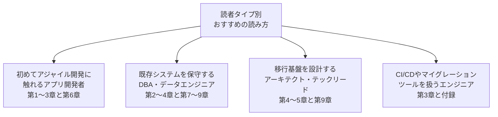

本ガイドでは、この4タイプすべてに必要な知識を横断的にカバーしつつ、初学者が迷わないよう順序立てて解説します。

---

## Step 1：なぜ「進化的データベース設計」が必要なのか

ウォーターフォール型の開発では、要件定義フェーズでデータベース設計を完全に固め、以後は変更しないことが前提でした。しかしアジャイル開発では要求は反復（イテレーション）を重ねるごとに明らかになっていきます。アプリケーションコードは「リファクタリング」という手法で安全に進化させられるようになった一方、データベースは長らく「一度作ったら触れない聖域」として扱われてきました。これが両者の間に生まれる根本的なミスマッチです。

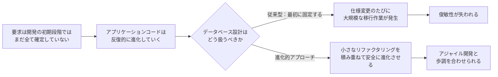

本書の目的は、Martin Fowlerが1999年の著書『Refactoring: Improving the Design of Existing Code』でコードに対して確立した「振る舞いを変えずに内部構造を改善する」という考え方を、データベースのスキーマ・データ・ストアドプロシージャにも適用できる形で体系化することにあります。

---

## Step 2：本の全体構成

本書は大きく「基礎編（第1〜5章）」と「カタログ編（第6〜11章）」の2部構成になっており、巻末にUMLデータモデリング表記法の付録・用語集・推奨図書リストが付いています。

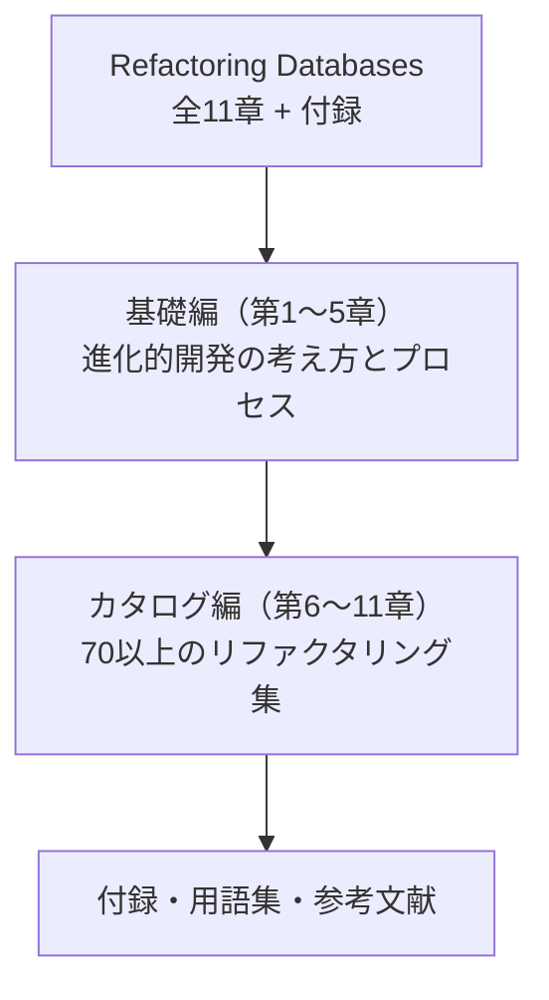

各章の内容は次の通りです。

| 章 | タイトル | 主な内容 |
| --- | --- | --- |
| 第1章 | Evolutionary Database Development | 進化的データベース開発の全体像、回帰テスト、構成管理、開発者用サンドボックス |
| 第2章 | Database Refactoring | データベースリファクタリングの定義、コードリファクタリングとの違い、分類、データベースの「臭い」 |
| 第3章 | The Process of Database Refactoring | リファクタリングを実施する具体的な手順（メカニクス） |
| 第4章 | Deploying into Production | 本番環境へのデプロイ戦略、スケジュールダウンタイムと継続稼働 |
| 第5章 | Database Refactoring Strategies | 単一アプリケーションDBと複数アプリケーションDBでの戦略の違い |
| 第6章 | Structural Refactorings | 構造リファクタリング（テーブル構造の変更） |
| 第7章 | Data Quality Refactorings | データ品質リファクタリング（値の一貫性・妥当性の改善） |
| 第8章 | Referential Integrity Refactorings | 参照整合性リファクタリング（外部キー・削除方針など） |
| 第9章 | Architectural Refactorings | アーキテクチャリファクタリング（外部プログラムとの連携方法の改善） |
| 第10章 | Method Refactorings | メソッドリファクタリング（ストアドプロシージャ・トリガー・関数の改善） |
| 第11章 | Transformations | 変換（意味論を変える、非リファクタリングな変更） |
| 付録A | The UML Data Modeling Notation | 本書内で使われるUML表記法の解説 |

出典：eBay掲載の詳細目次、ACM Queueによる書評、dokumen.pub掲載の章立て情報（末尾参考文献参照）。

---

## Step 3：データベースリファクタリングとは何か

Martin Fowlerによるコードリファクタリングの定義は「観測可能な振る舞いを変えずに、理解しやすく安価に変更できるようにソフトウェアの内部構造に加える変更」でした。本書はこれをデータベースに拡張し、次のように定義しています。

> データベースリファクタリングとは、データベーススキーマに対する小さな変更であり、意味論（保存されている情報の内容や解釈のされ方）を変えずに設計を改善するものである。

ここで重要なのは、データベースリファクタリングがコードリファクタリングと違い、**同時に3つの異なる変更**を伴う点です。

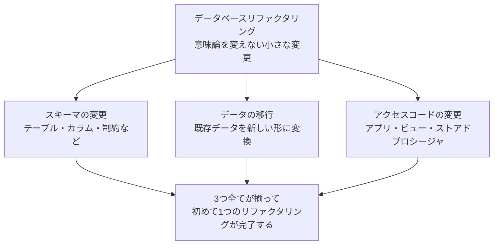

スキーマだけ変えてデータを移行し忘れる、あるいはアクセスコードの更新を忘れる——このどれか一つでも欠けると、リファクタリングは未完了のまま本番に混乱をもたらします。Martin Fowlerは自身の記事の中で、この三位一体性こそがデータベースリファクタリングを（単純に見えて）コードリファクタリングより難しくしている理由だと述べています。

---

## Step 4：データベースの「臭い」を見分ける

コードに「コードの臭い（code smell）」があるように、データベースにも「データベースの臭い（database smell）」があります。Scott Ambler が2003年に提唱したこの概念は、リファクタリングが必要かどうかを判断する手がかりになります。

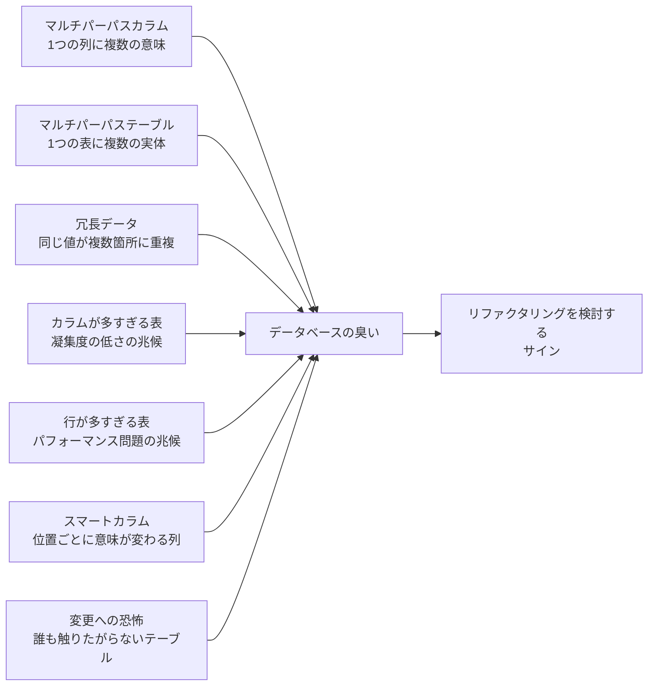

| 臭い | 説明 |
| --- | --- |
| マルチパーパスカラム | 1つの列が複数の目的で使われ、値の意味を判別する追加ロジックが必要になっている状態 |
| マルチパーパステーブル | 1つのテーブルに複数種類のエンティティが混在している状態 |
| 冗長データ | 同じ値が複数箇所に重複して保存され、不整合が起きやすい状態 |
| カラムが多すぎる表 | 表が複数のエンティティの情報を無理に1つにまとめている兆候 |
| 行が多すぎる表 | 検索・更新に時間がかかり、パフォーマンス上の問題を引き起こしやすい状態 |
| スマートカラム | 値の中の位置ごとに異なる意味を持たせている列（例：コードの前半が地域、後半が種別など） |
| 変更への恐怖 | 誰もそのテーブルの仕組みを正確に把握しておらず、触るのを避けている状態 |

出典：ApexSQL Solution Centerによる解説記事（Ambler, 2003年提唱の内容を要約したもの。末尾参考文献参照）。

---

## Step 5：リファクタリングのプロセス（メカニクス）

第3章では、1つのデータベースリファクタリングを安全に実施するための具体的な手順が示されています。本書ではこれを「メカニクス（mechanics）」と呼びます。

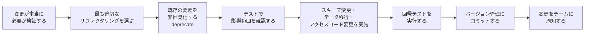

ポイントは、いきなり古い構造を削除するのではなく、まず「非推奨化（deprecate）」して一定の移行期間を設けることです。これにより、そのデータベースに依存している他のアプリケーションやレポートが安全に追従できる猶予が生まれます。この移行期間の考え方は次のStepで詳しく扱います。

---

## Step 6：移行期間とパラレルチェンジ（Parallel Change）パターン

破壊的な変更（destructive change：既存のアクセスコードを壊してしまう可能性のある変更）を行う場合、本書は「移行期間（transition period）」を設けることを推奨しています。これは、新旧両方の構造を一定期間並行してサポートし、依存している側が自分のペースで移行できるようにする考え方です。

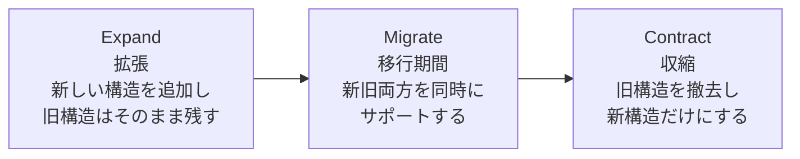

この「拡張→移行→収縮」という3段階の考え方は、のちにMartin Fowlerが自身のbliki（ブログ的な用語辞典）で「Parallel Change（並行変更、別名 expand/contract パターン）」として整理し直したものと本質的に同じです。現在では、ローリングデプロイやゼロダウンタイムデプロイを実現するための標準的な手法として、Flyway・Liquibaseのようなツールを使う多くのチームに広く使われています。

例えばテーブル名を変更する場合、本書は次のようなテクニックを示しています。

```sql
-- customerテーブルをclientへリネームする
ALTER TABLE customer RENAME TO client;

-- 移行期間中、旧名customerでアクセスするコードのために
-- ビューを用意しておく
CREATE VIEW customer AS
SELECT id, first_name, last_name FROM client;
```

移行期間が終わり、依存している全アプリケーションが新しいテーブル名を使うようになったことを確認できたら、このビューを削除して「収縮」フェーズを完了させます。

---

## Step 7：本番環境へのデプロイ戦略

第4章では、開発中のデータベースだけでなく、すでに本番稼働しているデータベースへリファクタリングを適用する際の難しさを扱っています。大きな分かれ道は「データベースを利用するアプリケーションが1つだけか、複数か」です。

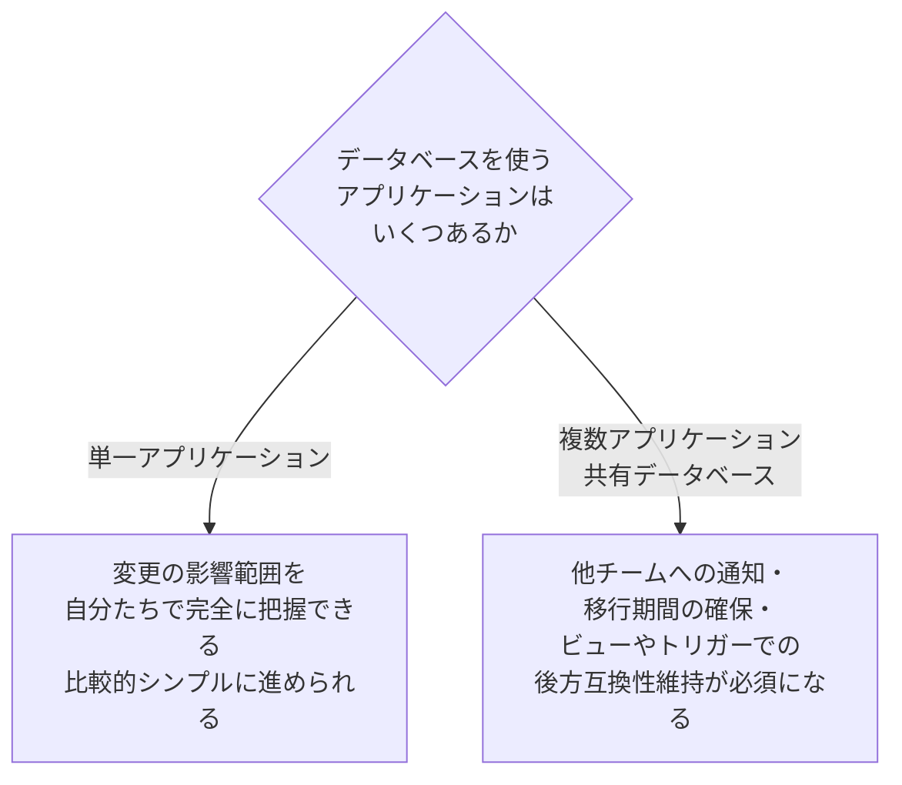

複数アプリケーションが同じデータベースを共有している状況（いわゆる Shared Database パターン）では、あるチームの変更が別のチームのアプリケーションを予期せず壊してしまうリスクが常につきまといます。本書はこのリスクを軽減するために、変更の事前告知、移行期間の確保、そして必要であれば外部キー制約・トリガー・ビューを使った後方互換性の維持を具体的な手順とともに紹介しています。

---

## Step 8：単一アプリ vs 複数アプリのデータベース戦略

第5章「Database Refactoring Strategies」では、リファクタリングを実施するにあたっての基本方針が示されています。要点は次の3つに集約できます。

1. **変更はできるだけ小さくする** — 1回のリファクタリングで変える範囲を最小限にとどめることで、問題が起きたときの原因特定と復旧が容易になります。
2. **常にテストしてからコミットする** — 自分のローカル環境（サンドボックス）でスキーマ変更・データ移行・回帰テストをすべて実行し、グリーンになってから共有リポジトリに反映します。
3. **本番相当の環境で検証する** — 特に複数アプリケーションが依存する共有データベースでは、ステージング環境などでリファクタリングの影響を確認してから本番に適用します。

これらは、次章以降で紹介するあらゆる個別のリファクタリング手法に共通して適用される原則です。

---

## Step 9：リファクタリングカタログ全体像

本書の後半（第6〜11章）は、実際に使える60〜70種類以上のリファクタリングを収録したカタログになっています。分類は5つの「リファクタリング」カテゴリと、1つの「非リファクタリング」カテゴリ（変換）です。

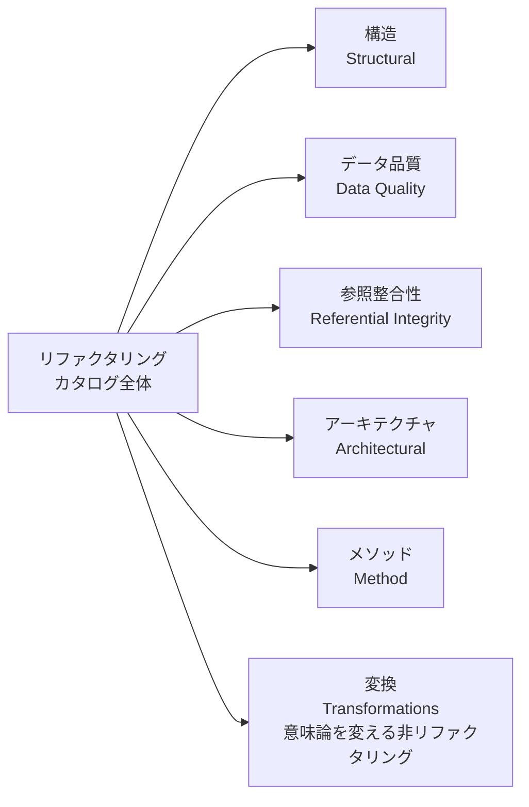

| カテゴリ | 定義 |
| --- | --- |
| 構造（Structural） | テーブル構造そのものに対する変更 |
| データ品質（Data Quality） | 保存されている値の一貫性・妥当性を高める変更 |
| 参照整合性（Referential Integrity） | 関連する行の存在保証や、不要になった行の適切な削除に関する変更 |
| アーキテクチャ（Architectural） | 外部プログラムがデータベースとやり取りする方法を改善する変更 |
| メソッド（Method） | ストアドプロシージャ・ストアド関数・トリガーの品質を改善する変更 |
| 変換（Transformations） | 新しい要素を追加したり既存要素を変更したりすることで、意味論そのものを変える変更（リファクタリングではない） |

出典：Scott Ambler自身が運営するAgile Data（agiledata.org）「Catalog of Database Refactorings」、および著者自身の公式カタログサイト databaserefactoring.com（末尾参考文献参照）。

---

## Step 10：構造リファクタリング（Structural Refactorings）

テーブルやカラムの「形」そのものを変えるリファクタリングです。本書で最もページ数が割かれているカテゴリ（第6章、本文で最も長い章）で、日常的に最もよく使う分類でもあります。

| リファクタリング名 | 何をするか |
| --- | --- |
| Drop Column | 使われなくなった列を削除する |
| Drop Table | 使われなくなったテーブルを削除する |
| Drop View | 使われなくなったビューを削除する |
| Introduce Calculated Column | 他の列から計算できる値を格納する列を新設する |
| Introduce Surrogate Key | 意味を持たない代理キー（連番など）を主キーとして導入する |
| Merge Columns | 複数の列を1つに統合する |
| Merge Tables | 複数のテーブルを1つに統合する |
| Move Column | 列を別のテーブルへ移動する |
| Rename Column | 列名をより分かりやすい名前に変更する |
| Rename Table | テーブル名をより分かりやすい名前に変更する |
| Rename View | ビュー名をより分かりやすい名前に変更する |
| Replace LOB with Table | 大きなオブジェクト型（BLOB/CLOB）の列を別テーブルに置き換える |
| Replace Column | 列のデータ型や意味を別のものに置き換える |
| Replace One-To-Many with Associative Table | 1対多の関係を、中間の関連テーブルを使った表現に置き換える |
| Replace Surrogate Key with Natural Key | 代理キーを、業務上意味のある自然キーに置き換える |
| Split Column | 1つの列に詰め込まれている複数の情報を、複数の列に分割する |
| Split Table | 1つのテーブルを複数のテーブルに分割する |

出典：databaserefactoring.com（著者公式サイト）に掲載されたStructural Refactoringsの一覧、Red Gate Simple Talk掲載の解説記事（末尾参考文献参照）。

---

## Step 11：データ品質リファクタリング（Data Quality Refactorings）

保存されているデータの値そのものの一貫性・妥当性を高めるリファクタリングです（第7章）。

| リファクタリング名 | 何をするか |
| --- | --- |
| Add Lookup Table | 特定の値の集合を管理するためのルックアップテーブルを追加する |
| Apply Standard Codes | バラバラな表記のコード値を標準化されたコード体系に統一する |
| Apply Standard Type | 同じ意味の列で異なるデータ型が使われている状態を統一する |
| Consolidate Key Strategy | キーの採番方式（自然キー／代理キー）をデータベース全体で統一する |
| Drop Column Constraint | 不要になった列制約を削除する |
| Drop Default Value | 不要になったデフォルト値を削除する |
| Drop Non Nullable | 不要になったNOT NULL制約を緩める |
| Introduce Column Constraint | 値の妥当性を保証するための列制約を追加する |
| Introduce Common Format | 日付や電話番号など、表記ゆれのある値の書式を統一する |
| Introduce Default Value | 列にデフォルト値を導入する |
| Make Column Non Nullable | NULL値を許可していた列にNOT NULL制約を導入する |
| Move Data | データを別の場所（列やテーブル）へ移動する |
| Replace Type Code with Property Flags | 種別コード列を、複数の真偽値（フラグ）列に置き換える |

出典：Agile Data（agiledata.org）「Catalog of Database Refactorings: Data Quality Refactorings」（末尾参考文献参照）。

---

## Step 12：参照整合性リファクタリング（Referential Integrity Refactorings）

関連する行同士の整合性を保証したり、不要な行を適切に扱ったりするためのリファクタリングです（第8章）。

| リファクタリング名 | 何をするか |
| --- | --- |
| Add Foreign Key Constraint | 他のテーブルとの関連を保証する外部キー制約を追加する |
| Add Trigger for Calculated Column | 計算列の値を自動更新するトリガーを追加する |
| Drop Foreign Key Constraint | 不要になった外部キー制約を削除する |
| Introduce Cascading Delete | 親行が削除されたときに関連する子行も自動的に削除されるようにする |
| Introduce Hard Delete | 削除フラグ列を廃止し、行そのものを物理的に削除するようにする |
| Introduce Soft Delete | 行を物理削除せず、削除フラグを立てるだけにする |
| Introduce Trigger for History | データ変更履歴（監査ログ）を記録するトリガーを追加する |

このカテゴリで特に初学者が迷いやすいのが「論理削除（Soft Delete）」と「物理削除（Hard Delete）」のどちらを選ぶかという判断です。

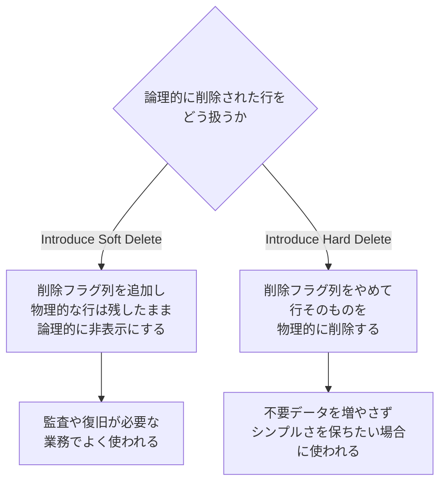

出典：Agile Data（agiledata.org）「Catalog of Database Refactorings: Referential Integrity Refactorings」（末尾参考文献参照）。

---

## Step 13：アーキテクチャリファクタリング（Architectural Refactorings）

外部プログラムがデータベースとやり取りする「方法」自体を改善するリファクタリングです（第9章）。

| リファクタリング名 | 何をするか |
| --- | --- |
| Add CRUD Methods | 特定のエンティティに対するCRUD（作成・取得・更新・削除）操作をストアドプロシージャとして整備する |
| Add Mirror Table | 別のデータベースに、既存テーブルの複製（ミラー）テーブルを作成する |
| Add Read Method | エンティティを取得するための読み取り専用メソッドを追加する |
| Encapsulate Table with View | 既存テーブルへの直接アクセスをビューで包み、内部構造の変更をアプリから隠蔽する |
| Introduce Calculation Method | 計算ロジックをストアドプロシージャ／関数として切り出す |
| Introduce Index | 検索性能を高めるためのインデックスを追加する |
| Introduce Read Only Table | 読み取り専用として扱うべきテーブルであることを明示する |
| Migrate Method from Database | データベース内にあるロジックをアプリケーション層へ移す |
| Migrate Method to Database | アプリケーション層にあるロジックをデータベース内へ移す |
| Replace Method(s) with View | 複数のメソッドをまとめて1つのビューに置き換える |
| Replace View with Method(s) | ビューを、より柔軟なメソッド（ストアドプロシージャ）に置き換える |
| Use Official Data Source | ある実体について、複製されたデータではなく公式のデータソースを参照するように変更する |

出典：Agile Data（agiledata.org）「Catalog of Database Refactorings: Architectural Refactorings」（末尾参考文献参照）。

---

## Step 14：メソッドリファクタリングと変換（Transformations）

**メソッドリファクタリング（第10章）**は、ストアドプロシージャ・トリガー・関数といった「データベース内のコード」に対するリファクタリングです。多くはMartin Fowlerの原著『Refactoring』にあるコードリファクタリングカタログを、データベースのメソッドに適用したものです。

| リファクタリング名 | 何をするか |
| --- | --- |
| Rename Method | メソッド名をより分かりやすい名前に変更する |
| Parameterize Method(s) | 似た処理をするメソッド群を、パラメータで振る舞いを切り替える1つのメソッドに統合する |
| Remove Parameter | 使われなくなった引数を削除する |
| Reorder Parameters | 引数の並び順を整理し直す |
| Extract Method | 長い処理の一部を、別の名前付きメソッドとして切り出す |
| Decompose Conditional | 複雑な条件分岐を、意味の分かる名前のメソッドに分解する |
| Introduce Variable | 分かりにくい式に名前を付けて変数化する |
| Substitute Algorithm | 分かりにくいアルゴリズムを、より明快なものに置き換える |

**変換（Transformations、第11章）**は、リファクタリングとは異なり、データベースの意味論そのものを変える追加的な変更です。純粋なリファクタリング（振る舞いを変えない変更）と区別して扱われます。

| 変換名 | 何をするか |
| --- | --- |
| Insert Data | 新しいデータを挿入する（新機能のための初期データ投入など） |
| Introduce New Column | 新しい情報を保持するための列を追加する |
| Introduce New Table | 新しいエンティティを表すテーブルを追加する |
| Introduce View | 新しい切り口でデータを見せるビューを追加する |
| Update Data | 既存データの値を更新する（新しい要件に合わせた書き換えなど） |

出典：databaserefactoring.com（著者公式サイト）に掲載されたMethod RefactoringsおよびTransformationの一覧（末尾参考文献参照）。

---

## Step 15：実践ウォークスルー① Split Column をやってみる

ここからは、実際のシナリオに沿って構造リファクタリングを1つ体験してみましょう。題材は Martin Fowler と Pramod Sadalage の記事「Evolutionary Database Design」で紹介されている「在庫（inventory）テーブルの `inventory_code` 列を、場所・ロット番号・シリアル番号の3つの列に分割する」という例です。

**変更前の状態**：`inventory` テーブルには `product_inventory_code` という1つの列があり、そこに「場所コード」「ロット番号」「シリアル番号」が連結された文字列として格納されています。ある開発者（記事内では「Jen」）が、これら3つの情報を個別に検索・更新できるようにする、というユーザーストーリーを実装することになりました。

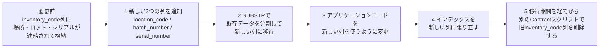

このリファクタリング（Expand〜Migrateフェーズ）を実現する移行スクリプトの例（Oracle SQLの場合）は次のようになります。

```sql
ALTER TABLE inventory ADD location_code VARCHAR2(6) NULL;
ALTER TABLE inventory ADD batch_number VARCHAR2(6) NULL;
ALTER TABLE inventory ADD serial_number VARCHAR2(10) NULL;

UPDATE inventory SET location_code = SUBSTR(product_inventory_code,1,6);
UPDATE inventory SET batch_number = SUBSTR(product_inventory_code,7,6);
UPDATE inventory SET serial_number = SUBSTR(product_inventory_code,11,10);

DROP INDEX uidx_inventory_code;

CREATE UNIQUE INDEX uidx_inventory_identifier
  ON inventory (location_code, batch_number, serial_number);
```

このスクリプトはローカルの開発用データベースでまず実行し、既存のテスト一式を流して振る舞いが壊れていないことを確認してから、バージョン管理システム（マイグレーションスクリプトとして）にコミットします。CIサーバーがこれを検知し、統合用データベースに同じスクリプトを適用してテストを再実行し、問題がなければステージング・本番へと同じスクリプトが順番に適用されていきます。

旧列 `product_inventory_code` は、Step 6で説明した「移行期間（transition period）」の考え方に沿って、この時点ではまだ削除しません。すべての利用者（アプリケーション・レポートなど）が新しい3列を参照するように切り替わったことを確認できてから、`ALTER TABLE inventory DROP COLUMN product_inventory_code;` を実行する別のContractフェーズ用スクリプトとして、改めてコミット・適用します。

> ポイント：スキーマ変更（列追加）、データ移行（SUBSTRによる分割）、アクセスコード変更（アプリ側の参照列の変更）が1つのマイグレーションスクリプトと1回のコミットにまとめられている点が、Step 3で説明した「3つの変更が揃って1つのリファクタリング」という原則を体現しています。一方で旧列の削除（収縮）は、移行期間を経た後の独立したリファクタリングとして扱います。

---

## Step 16：実践ウォークスルー② Rename Table と移行期間

続いて、Step 6で紹介した「移行期間」の考え方を、テーブル名変更という具体的な例で確認します。`customer` テーブルを、より業務の実態に合った `client` という名前に変更したいとします。

複数のアプリケーションがこの `customer` テーブルに依存している場合、いきなり `RENAME` すると、まだ移行していないアプリケーションのSQLが一斉にエラーになってしまいます。そこで本書は次のような段階的な手順を示しています。

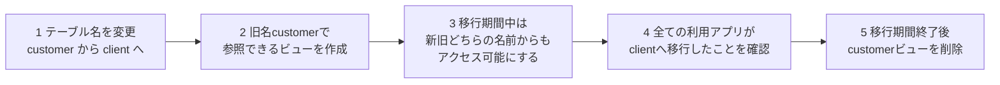

```sql
-- ステップ1〜2：テーブル名を変更し、旧名のビューを用意する
ALTER TABLE customer RENAME TO client;

CREATE VIEW customer AS
SELECT id, first_name, last_name FROM client;
```

この移行期間の長さは組織によって様々です。Martin FowlerとPramod Sadalageの記事によれば、数ヶ月で終わる場合もあれば、大規模な組織では数年かかることもあると述べられています。重要なのは「移行期間をどれだけ短くできるか」ではなく、「移行期間中も新旧両方が安全に動き続けること」を保証する設計です。

---

## Step 17：現代における位置づけ — Flyway・Liquibaseと Expand/Contract パターン

本書が出版された2006年当時、データベースマイグレーションを自動化する専用ツールはまだ黎明期でした。しかし本書とその考え方は、その後のツールチェーンの標準的な設計思想の土台になっています。

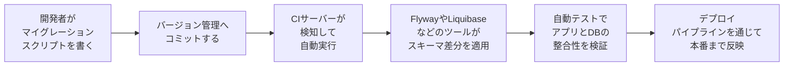

Martin FowlerとPramod Sadalageによる2016年改訂版の「Evolutionary Database Design」では、本書で示された考え方を土台に、Flyway・Liquibase・MyBatis Migrationsなどの具体的なツールでの実装例が追加され、CI/CDパイプラインの中でどう自動化するかが詳しく解説されています。さらにこの記事の中では、本書のStep 6で紹介した「移行期間」の考え方が、Martin Fowlerのbliki上の別記事「Parallel Change」として独立して整理し直されており、現在では「Expand/Contract パターン」という呼び名で、ゼロダウンタイムデプロイやローリングデプロイを実現するための標準的な語彙として業界に広く定着しています。

また、本書が提唱した「開発者は各自が自分専用のデータベースインスタンスを持つべきである」という実践は、当時はデータベースのライセンス費用や運用コストの高さから実現が難しいこともありましたが、クラウドネイティブなデータベース基盤の進化により、より低コストで実現しやすくなってきています。

> 補足：本ガイド作成時点（2026年9月）の情報では、この「開発者ごとに独立したデータベースインスタンスを持つ」という考え方が、コピーオンライトによるブランチ機能を備えた新しいクラウドデータベース基盤の登場によって、より実践しやすくなってきているという指摘も見られます。技術の進化とともに、本書が2006年に示した理念がより実現しやすい形へと近づいている一例と言えるでしょう。

---

## 批判的に読む — この本の限界と時代背景

初学者が本書を手に取る前に知っておくとよい留意点をまとめます。

- **出版は2006年**：本文中のコード例はOracleとJavaを中心に書かれており、C#・C++・VB.NETや、DB2・SQL Server・MySQL・Sybaseへの応用は「読み替えれば可能」という位置づけです。当時はFlyway・Liquibaseのような専用マイグレーションツールがまだ存在しない、または黎明期だったため、本書自体はスクリプトを手作業に近い形で管理する前提で書かれています。
- **NoSQLやスキーマレスDBへの言及はない**：本書はリレーショナルデータベースを前提としています。NoSQLデータベースにおける「暗黙のスキーマ」の進化的な扱い方は、後年のMartin Fowlerの記事や『NoSQL Distilled』（Fowler・Sadalage共著）で補完的に扱われています。
- **カタログの網羅性には既に限界がある**：2019年には研究者によって新しいカテゴリの追加提案がなされているなど、データベースリファクタリングというテーマ自体が本書出版後も学術的・実務的に発展を続けています。
- **それでも中核となる考え方は褪せていない**：「スキーマ・データ・アクセスコードの3つを同時に扱う」「移行期間を設けて段階的に変更する」「小さな変更を積み重ねる」という原則は、2016年のMartin Fowler・Sadalage共著記事、そして現在広く使われるExpand/Contractパターンにそのまま受け継がれており、内容の古さよりも先見性の方が際立つ一冊です。

---

## 用語集

| 用語 | 説明 |
| --- | --- |
| データベースリファクタリング | 意味論を変えずにデータベース設計を改善する小さな変更。スキーマ変更・データ移行・アクセスコード変更の3つを伴う |
| データベースの臭い | リファクタリングが必要であることを示す設計上の兆候 |
| 破壊的な変更（destructive change） | 既存のアクセスコードを壊す可能性がある変更 |
| 移行期間（transition period） | 新旧両方の構造を一定期間並行してサポートする期間 |
| Parallel Change / Expand-Contract | 移行期間の考え方を「拡張・移行・収縮」の3フェーズに整理した、現在広く使われる用語 |
| マイグレーションスクリプト | スキーマ変更とデータ移行の内容を記述し、バージョン管理下に置く実行可能なスクリプト |
| 単一アプリケーションデータベース | 1つのアプリケーションだけが利用するデータベース |
| 共有データベース（Shared Database） | 複数のアプリケーションが同じデータベースを利用する構成 |
| サンドボックス | 開発者が他者に影響を与えずに自由に実験できる、自分専用のデータベース環境 |
| 変換（Transformation） | 意味論そのものを変える、リファクタリングではない変更 |

---

## 理解度チェックリスト

- [ ] データベースリファクタリングが「スキーマ変更・データ移行・アクセスコード変更」の3つを同時に伴う理由を説明できる
- [ ] データベースの臭いを3つ以上挙げ、それぞれどのリファクタリングで対処できそうか説明できる
- [ ] 「破壊的な変更」と「非破壊的な変更」の違いを説明できる
- [ ] 移行期間（Expand/Contract パターン）がなぜ必要か、Rename Tableの例で説明できる
- [ ] 構造・データ品質・参照整合性・アーキテクチャ・メソッドの5分類それぞれの目的を、自分の言葉で説明できる
- [ ] Soft DeleteとHard Deleteをどう使い分けるか判断できる
- [ ] 単一アプリケーションDBと共有データベースで、リファクタリングの進め方がどう変わるか説明できる
- [ ] 本書の考え方が、Flyway・LiquibaseなどのCI/CDツールとどうつながっているか説明できる

---

## まとめ

『Refactoring Databases: Evolutionary Database Design』は、アジャイル開発においてアプリケーションコードと同じ速度でデータベースを安全に進化させるための方法論を、初めて体系立てて示した一冊です。中心にあるのは「小さな変更を積み重ねる」「スキーマ・データ・アクセスコードを常にセットで扱う」「移行期間を設けて段階的に変更する」というシンプルな原則であり、これらは2006年の出版から20年近く経った現在も、Flyway・Liquibaseといったマイグレーションツールや、ゼロダウンタイムデプロイの標準手法であるExpand/Contractパターンという形で開発現場に息づいています。まずは自分のプロジェクトで日常的に発生している「データベースの臭い」を1つ見つけ、本ガイドで紹介したメカニクスに沿って小さなリファクタリングを試してみることから始めるとよいでしょう。

---

## 参考文献

本ガイドの作成にあたり、以下の情報源を参照しました。可能な限り、著者自身が公開している一次情報や、国際的に著名な開発者・組織による記事を優先しています。

**著者自身・関係者による一次情報**

- Pramod Sadalage 公式カタログサイト「Refactoring Databases: Evolutionary Database Design」（全リファクタリング一覧、翻訳版情報）

  https://databaserefactoring.com/

- Scott W. Ambler「The Agile Data (AD) Method: Catalog of Database Refactorings」

  https://agiledata.org/?p=3391

- Scott W. Ambler「Catalog of Database Refactorings: Referential Integrity Refactorings」

  https://agiledata.org/?p=3539

- Scott W. Ambler「Catalog of Database Refactorings: Architectural Refactorings」

  https://agiledata.org/?p=3551

- Scott W. Ambler「Catalog of Database Refactorings: Data Quality Refactorings」

  https://agiledata.org/?p=3520

**Martin Fowler（国際的に著名なソフトウェアアーキテクト）による記事**

- Martin Fowler, Pramod Sadalage「Evolutionary Database Design」（2016年改訂版）

  https://martinfowler.com/articles/evodb.html

- Martin Fowler「ParallelChange」（bliki）

  https://www.martinfowler.com/bliki/ParallelChange.html

**出版社・書誌情報**

- O'Reilly Online Learning 書籍ページ

  https://www.oreilly.com/library/view/refactoring-databases-evolutionary/0321293533/

- InformIt 商品ページ

  https://www.informit.com/store/refactoring-databases-evolutionary-database-design-9780132652117

- Pramod J. Sadalage 著者紹介（InformIt）

  https://www.informit.com/authors/bio/E26DAF98-2469-43EB-A05C-CA60B2F82A27

- 目次詳細（eBay掲載）

  https://www.ebay.com/p/102876595

**書評・解説記事**

- ACM Queue「Review of Refactoring Databases: Evolutionary Database Design」（原文は403で直接アクセス不可のためInternet Archive保存版を掲載）

  https://web.archive.org/web/20240710022711/https://queue.acm.org/detail.cfm?id=1160453

- Red Gate Simple Talk「Refactoring Databases: The Process」（本書第3章からの抜粋記事）

  https://www.red-gate.com/simple-talk/databases/sql-server/database-administration-sql-server/refactoring-databases-the-process/

- Red Gate Simple Talk「Database Refactoring」（構造リファクタリングの解説）

  https://www.red-gate.com/simple-talk/databases/sql-server/t-sql-programming-sql-server/database-refactoring/

- ApexSQL Solution Center「SQL database refactoring techniques」（データベースの臭いの解説）

  https://solutioncenter.apexsql.com/?p=3629

**現代の実践とのつながり**

- Pete Hodgson「Expand/Contract: making a breaking change without a big bang」

  https://blog.thepete.net/blog/2023/12/05/expand/contract-making-a-breaking-change-without-a-big-bang

**日本語版情報**

- 「リファクタリング (データベース)」Weblio辞書（Wikipedia由来、日本語版書誌情報を含む）

  https://www.weblio.jp/content/Database+refactoring
