# SQLアンチパターン 第2版 ―初学者のためのステップバイステップ解説ガイド

> 原著 *SQL Antipatterns, Volume 1: Avoiding the Pitfalls of Database Programming*（Bill Karwin 著、Pragmatic Bookshelf）／日本語版『SQLアンチパターン 第2版 ―データベースプログラミングで陥りがちな失敗とその対策』（オライリー・ジャパン、2025年7月刊）を題材に、データベース設計とSQLを学び始めたばかりの人に向けて、全27章の内容を噛み砕いて解説するガイドです。

## 書籍情報

| 項目 | 内容 |
| --- | --- |
| 原題 | SQL Antipatterns, Volume 1: Avoiding the Pitfalls of Database Programming |
| 著者 | Bill Karwin |
| 原著出版社 | Pragmatic Bookshelf（初版 2010年／第2版 2022年10月） |
| 日本語版タイトル | SQLアンチパターン 第2版 ―データベースプログラミングで陥りがちな失敗とその対策 |
| 日本語版出版社 | オライリー・ジャパン（発売元 オーム社） |
| 監訳 | 和田卓人（t-wada） |
| 日本語版発売日 | 2025年7月 |
| ISBN | 978-4-8144-0074-4 |
| ページ数 | 約400ページ（原著第2版は378ページ） |
| 章構成 | 全27章＋付録A（正規化のルール）＋日本語版限定付録「砂の城」 |
| 本書の分類 | 4部構成＋ボーナス1部：論理設計／物理設計／クエリ／アプリケーション開発／外部キーのミニアンチパターン |

## この本は何のための本か

「アンチパターン」とは、一見うまくいきそうに見えるのに、実際には後々まで開発者を苦しめる「悪い設計パターン」のことです。本書は、著者のBill Karwinが長年SQLに関する質問に答え続けてきた経験から、開発者が繰り返しハマる失敗を26個（本文24章＋ボーナス2章）選び出し、それぞれに名前を付けて「見分け方」と「治し方」を示した一冊です。

日本語版監訳者であり、テスト駆動開発の普及やSQLアンチパターン初版（2013年）の企画を持ち込んだことでも知られる和田卓人氏は、2025年7月に開催されたイベント「t-wadaさんに聞く！SQLアンチパターン第2版」で、本書の意義を次のように語っています。AIエージェントに自然言語で指示してコードを書かせる「バイブコーディング」が広がる中で、UIなどは作り直しがきいても、いったんデータベースに入ったデータは後戻りできない、だからこそ他人の失敗から学び、落とし穴に名前を付けて回避することに価値がある、という趣旨の説明です。

本ガイドは、この原著・日本語版の構成に沿って、初学者にもわかりやすいように各アンチパターンを「目的」「アンチパターン（何がまずいか）」「見分け方」「使ってもよい場合」「解決策」という本書自身の章構成（t-wada氏の言う「アンチパターンの解剖」）に合わせて整理し直したものです。

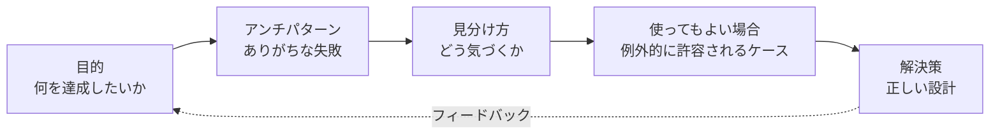

## 対象読者・使い方

- SQLの基本文法（SELECT／INSERT／JOINなど）は書けるが、テーブル設計や実務でのSQL運用に自信がない人
- 独学や業務で「なんとなく動くSQL」を書いてきたが、体系的な知識を身につけたい人
- レビューやアーキテクチャ設計で「このテーブル設計は大丈夫か」を判断する立場になった人

各ステップは独立して読めるように書かれていますが、初めて読む場合はStep0から順に読み進めることをおすすめします。すでに設計で困っている場合は、該当するアンチパターン名から拾い読みしても構いません。

## 本書の全体像（4部構成＋ボーナス）

原著・日本語版とも大きな構成は初版から変わらず、「データベース論理設計」「データベース物理設計」「クエリ」「アプリケーション開発」という4つのカテゴリでアンチパターンを紹介しています。第2版では、これに「外部キーのミニアンチパターン」を集めたボーナスパートが加わりました。

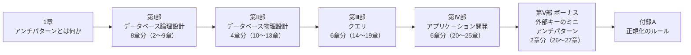

各部に含まれる章の内訳は、このあとの一覧表で確認できます。

書名から「SQLの書き方に関する本」だと誤解されがちですが、実際にカバーしている範囲はテーブル設計・物理設計・インデックス設計・SQLインジェクションなどのセキュリティ・パスワードの扱い・スケールを見据えたアプリケーション設計まで及びます。「SQLのアンチパターン」という名前から連想される内容は、実は第Ⅲ部（クエリのアンチパターン）だけです。世間で最も評価が高いのは第Ⅰ部（データベース論理設計）で、テーブル設計の失敗は後々まで響くというのが、多くの読者に支持されている理由だとされています。

## 全27章 一覧表

| 部 | 章 | アンチパターン名（日本語） | 英語名 | ひとことで言うと |
| --- | --- | --- | --- | --- |
| - | 1章 | アンチパターンとは何か | What's an Antipattern? | 本書の読み方・用語の導入 |
| Ⅰ 論理設計 | 2章 | ジェイウォーク（信号無視） | Jaywalking | カンマ区切りで複数値を1列に詰め込む |
| Ⅰ 論理設計 | 3章 | ナイーブツリー（素朴な木） | Naive Trees | 親IDだけで木構造を表現し続ける |
| Ⅰ 論理設計 | 4章 | IDリクワイアド（とりあえずID） | ID Required | すべてのテーブルに機械的に`id`列を追加する |
| Ⅰ 論理設計 | 5章 | キーレスエントリ（外部キー嫌い） | Keyless Entry | 外部キー制約を敬遠する |
| Ⅰ 論理設計 | 6章 | EAV（エンティティ・アトリビュート・バリュー） | Entity-Attribute-Value | 何にでも対応できる汎用属性テーブルを作る |
| Ⅰ 論理設計 | 7章 | ポリモーフィック関連 | Polymorphic Associations | 1つの外部キー列で複数の親テーブルを指す |
| Ⅰ 論理設計 | 8章 | マルチカラムアトリビュート（複数列属性） | Multicolumn Attributes | 繰り返し項目のために列を横に増やす |
| Ⅰ 論理設計 | 9章 | メタデータトリブル（メタデータ大増殖） | Metadata Tribbles | スケールのためにテーブルや列を複製する |
| Ⅱ 物理設計 | 10章 | ラウンディングエラー（丸め誤差） | Rounding Errors | 金額をFLOATで扱う |
| Ⅱ 物理設計 | 11章 | サーティワンフレーバー（31のフレーバー） | 31 Flavors | 列定義に許容値を直接書き込む |
| Ⅱ 物理設計 | 12章 | ファントムファイル（幻のファイル） | Phantom Files | 画像等をDB外のファイルシステムだけで管理する |
| Ⅱ 物理設計 | 13章 | インデックスショットガン（闇雲インデックス） | Index Shotgun | 根拠なくインデックスを増減させる |
| Ⅲ クエリ | 14章 | フィア・オブ・ジ・アンノウン（恐怖のunknown） | Fear of the Unknown | NULLを普通の値のように扱う／逆に恐れすぎる |
| Ⅲ クエリ | 15章 | アンビギュアスグループ（曖昧なグループ） | Ambiguous Groups | GROUP BYで非集約列を無自覚に参照する |
| Ⅲ クエリ | 16章 | ランダムセレクション | Random Selection | ORDER BY RAND()でランダム行を取る |
| Ⅲ クエリ | 17章 | プアマンズ・サーチエンジン（貧者のサーチエンジン） | Poor Man's Search Engine | LIKE述語だけで全文検索を実装する |
| Ⅲ クエリ | 18章 | スパゲッティクエリ | Spaghetti Query | 1つの巨大なクエリで全部を解決しようとする |
| Ⅲ クエリ | 19章 | インプリシットカラム（暗黙の列） | Implicit Columns | `SELECT *`やカラム省略のINSERTを多用する |
| Ⅳ アプリ開発 | 20章 | リーダブルパスワード（読み取り可能パスワード） | Readable Passwords | パスワードを平文やリバーシブルな形で保存する |
| Ⅳ アプリ開発 | 21章 | SQLインジェクション | SQL Injection | 未検証の入力をSQLとして実行してしまう |
| Ⅳ アプリ開発 | 22章 | シュードキー・ニートフリーク（疑似キー潔癖症） | Pseudokey Neat-Freak | 欠番になった連番IDを詰め直そうとする |
| Ⅳ アプリ開発 | 23章 | シー・ノー・エビル（臭いものに蓋） | See No Evil | エラーやSQLの戻り値をチェックしない |
| Ⅳ アプリ開発 | 24章 | ディプロマティック・イミュニティ（外交特権） | Diplomatic Immunity | SQLだけ開発プラクティス（レビュー・テスト・バージョン管理）の対象外にする |
| Ⅳ アプリ開発 | 25章 | スタンダード・オペレーティング・プロシージャ（さびついた開発標準） | Standard Operating Procedures | 何でもストアドプロシージャで解決しようとする |
| Ⅴ ボーナス | 26章 | 標準SQLにおける外部キーの誤った使い方 | Foreign Key Mistakes in Standard SQL | 外部キー定義そのものの典型的ミス集 |
| Ⅴ ボーナス | 27章 | MySQLにおける外部キーの誤った使い方 | Foreign Key Mistakes in MySQL | MySQL固有の外部キーの落とし穴 |
| - | 付録A | 正規化のルール | Rules of Normalization | 正規形の基礎知識のおさらい |

参考：原著第2版の目次は出版社Pragmatic Bookshelfの公式ページで確認できます（[https://pragprog.com/titles/bksap1/sql-antipatterns-volume-1/](https://pragprog.com/titles/bksap1/sql-antipatterns-volume-1/)）。日本語版の詳細な目次はオライリー・ジャパン公式ページ（[https://www.oreilly.co.jp/books/9784814400744/](https://www.oreilly.co.jp/books/9784814400744/)）で立ち読みできます。

---

## Step0：アンチパターンとは何か（1章）

本書冒頭の1章では、以降の章を読むための土台となる考え方が説明されます。

- **アンチパターンの2つのタイプ**：問題を認識せずに繰り返し使ってしまう「無自覚な」アンチパターンと、短期的な都合で意図的に選び、後で技術的負債として返ってくる「意図的な」アンチパターンがあります。
- **アンチパターンの解剖**：本書は各章を「目的（何を達成したいか）」「アンチパターン（ありがちな失敗）」「見分け方」「使ってもよい場合」「解決策」という共通の型で説明します。この型自体が、読者が自分のプロジェクトのアンチパターンを発見するためのチェックリストになります。
- **ER図とサンプルデータベース**：本書全体を通じて、バグ追跡システム（Bugs、Accounts、Productsなどのテーブル）という一貫したサンプルデータベースが使われ、各章のアンチパターンがこのサンプルに即して説明されます。

初学者がまず押さえておくべきなのは、「アンチパターンは常に間違いというわけではない」という点です。本書のすべての章に「使ってもよい場合」の節があるのはそのためで、後述する各アンチパターンでも同様に、正しい原則だけでなく例外的に許容される状況を必ず併記します。

---

## Step1：第Ⅰ部 データベース論理設計のアンチパターン（2〜9章）

テーブルにどんな情報を、どんな形で格納するかを決めるのが論理設計です。ここでの失敗は、アプリケーションが育つにつれてじわじわと開発を苦しめるため、本書の中でも特に評価が高いパートです。

### 2章 ジェイウォーク（信号無視）

| 項目 | 内容 |
| --- | --- |
| 目的 | 1つの実体（たとえば「製品」）に対して複数の値（複数のアカウントIDなど）を持たせたい |
| アンチパターン | `account_ids`列に`"12,34,56"`のようなカンマ区切り文字列を保存する |
| 見分け方 | クエリの中に`LIKE '%,34,%'`のような部分一致検索が現れる |
| 使ってもよい場合 | 値の集合をアプリケーション側で完全にブラックボックスとして扱い、DB側で検索・結合・集計を一切行わない場合に限り許容されることがある |
| 解決策 | 多対多の関係を表す「交差テーブル（intersection table）」を作る |

```sql
-- アンチパターン：カンマ区切りで複数値を1列に詰め込む
CREATE TABLE Products (
  product_id   INTEGER PRIMARY KEY,
  product_name VARCHAR(100),
  account_ids  VARCHAR(500) -- "12,34,56" のような文字列
);

-- 解決策：交差テーブルを作成する
CREATE TABLE Contacts (
  product_id INTEGER NOT NULL REFERENCES Products(product_id),
  account_id INTEGER NOT NULL REFERENCES Accounts(account_id),
  PRIMARY KEY (product_id, account_id)
);
```

交差テーブルにすれば、集計（`COUNT`）や結合（`JOIN`）、特定の値を含むかどうかの検索がすべて標準的なSQLで書けるようになり、値の長さ制限や区切り文字の衝突といった問題からも解放されます。

### 3章 ナイーブツリー（素朴な木）

組織図やコメントの返信ツリーのような階層構造を、親のIDだけを持つ「隣接リスト（Adjacency List）」で表現し続けると、先祖や子孫をすべて取得するクエリが極端に複雑になります。

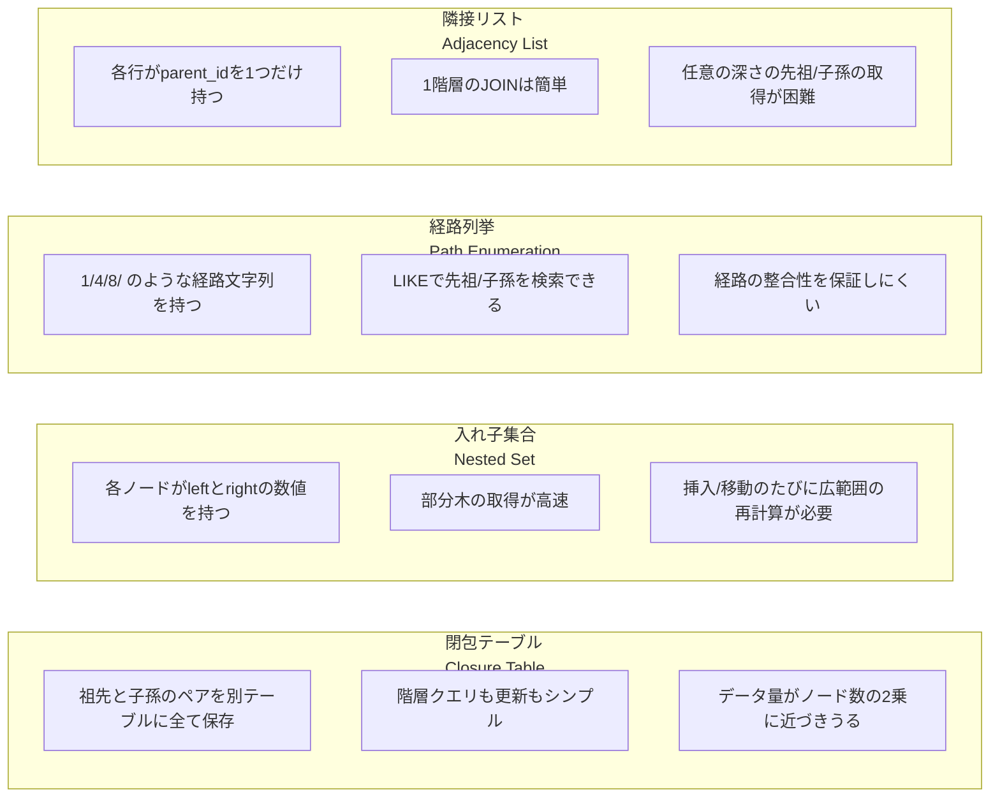

第2版で最も大きく変わった章の1つがこの3章です。初版（2013年）の時点では、再帰SQL（CTE：Common Table Expression）の標準化は進んでいたものの、各データベース製品での実装状況がまちまちだったため、隣接リストによる階層格納は明確なアンチパターンとされていました。しかし現在ではほとんどの主要なRDBMSがCTEを実装しているため、隣接リストは「必ずしもアンチパターンとは限らない」という記述に更新されています。これは、日本語版監訳者の和田卓人氏がイベントで特に強調していた変更点です。

```sql
-- 隣接リストでも、再帰CTEを使えば子孫を取得できる（現在の主要RDBMSで利用可）
WITH RECURSIVE Descendants AS (
  SELECT comment_id, parent_id, 1 AS depth
  FROM Comments
  WHERE comment_id = 1
  UNION ALL
  SELECT c.comment_id, c.parent_id, d.depth + 1
  FROM Comments c
  JOIN Descendants d ON c.parent_id = d.comment_id
)
SELECT * FROM Descendants;
```

それでも、深い階層に対して高頻度で先祖・子孫を検索するようなユースケースでは、経路列挙・入れ子集合・閉包テーブルといった代替モデルの方が適していることがあります。どのモデルを選ぶべきかは、「更新頻度」と「階層クエリの複雑さ・頻度」のどちらを優先するかで決まります。

### 4章 IDリクワイアド（とりあえずID）

「すべてのテーブルは`id`という名前の自動採番の主キーを持つべき」というルールを機械的に適用すると、交差テーブルのような複合主キーが自然なテーブルにまで無意味な`id`列を追加してしまったり、本来複合キーで表現すべき一意性制約が緩んでしまったりします。

- **見分け方**：多対多の交差テーブルなのに、`(product_id, account_id)`の複合主キーではなく、無関係な連番`id`だけが主キーになっている。
- **使ってもよい場合**：ORMのようなツールが単一列の主キーを前提としている場合など、規約を一律に適用した方が開発効率が上がるケースもあります。
- **解決策**：主キーの規約はテーブルごとの性質に合わせて選ぶ（Tailored to Fit）。交差テーブルには複合主キーを、それ以外のエンティティには用途に応じた代理キーを使う、という判断を意識的に行います。

### 5章 キーレスエントリ（外部キー嫌い）

パフォーマンス低下やスキーマ変更の面倒さを理由に、外部キー制約をあえて使わない設計です。

- **アンチパターン**：外部キー制約を宣言せず、アプリケーションコード側だけで参照整合性を保とうとする。
- **見分け方**：「完璧なコードを書けば制約は不要」という前提に立っている、孤立したレコード（親を失った子レコード）が発生する、「私のミスではありません」と原因調査に時間がかかる。
- **使ってもよい場合**：意図的にデータウェアハウスなどでロード速度を優先し、整合性チェックをETL側で完結させる場合。
- **解決策**：外部キー制約を宣言する。複数テーブルにまたがる変更（`ON UPDATE CASCADE`／`ON DELETE CASCADE`など）もサポートされており、心配されるほどのオーバーヘッドにはならないケースが大半です。

### 6章 EAV（エンティティ・アトリビュート・バリュー）

「どんな属性でも柔軟に追加できるように」と、`entity_id`・`attribute_name`・`attribute_value`という3列だけの汎用テーブルを作る設計です。著者のBill Karwinは、自身のブログでも「EAV設計はアンチパターンである」と繰り返し述べており、キー・バリューのペアをまとめて1つのBLOB/JSON列に格納する方が、中途半端なEAVよりまだましだとさえ書いています（出典は参考文献を参照）。

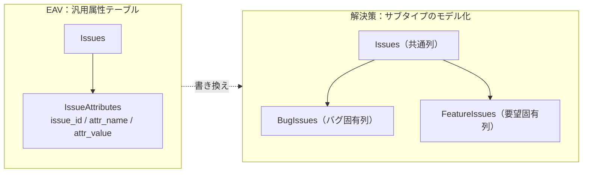

- **見分け方**：型やNOT NULLといった通常の列制約が一切使えず、必須属性の有無をアプリケーションコードでしかチェックできていない。1行分のデータを得るために大量のOUTER JOINや行の縦横変換が必要になっている。
- **使ってもよい場合**：属性の種類が本当に予測不能で、かつ属性ごとの検索やSQLレベルでの制約が不要な、ごく限定的なメタデータ格納。
- **解決策**：サブタイプをテーブルとしてモデル化する（単一テーブル継承、クラステーブル継承、半構造化データ列の追加など）。

### 7章 ポリモーフィック関連

1つの外部キー列（例：`issue_id`）で、`issue_type`のような種別列と組み合わせて複数の親テーブル（BugsとFeatures）のどちらかを指そうとする設計です。標準SQLの外部キー制約は「1つの列が1つの親テーブルのみを参照する」ことを前提にしているため、この設計では外部キー制約そのものを宣言できません。

- **見分け方**：外部キー制約が存在しない列に対して、アプリケーションコード側で`issue_type`によって参照先テーブルを分岐させている。
- **解決策**：関連を単純化する。具体的には、共通の親テーブル（Issues）を用意し、BugsとFeaturesの両方がそれを参照するように設計を反転させる（交差テーブルを介した多対多にする方法も含む）。

### 8章 マルチカラムアトリビュート（複数列属性）

繰り返し発生しうる値（電話番号1、電話番号2、電話番号3……）のために、テーブルに`phone1`、`phone2`、`phone3`のような列を横に並べていく設計です。

- **見分け方**：似た名前の列が連番で複数存在する。特定の値を検索するクエリが`WHERE phone1 = ? OR phone2 = ? OR phone3 = ?`のようにOR条件で列挙されている。列の上限（例：電話番号は3つまで）が業務要件ではなくテーブル設計の都合で決まっている。
- **使ってもよい場合**：値の数が固定かつ小さく、それぞれの列の意味が明確に異なる場合（例：`start_date`と`end_date`のように、繰り返しではなく別の意味を持つ列）。
- **解決策**：従属テーブル（1対多の関係を持つ別テーブル）を作成する。

### 9章 メタデータトリブル（メタデータ大増殖）

データ量の増加に対応するため、`Bugs_2024`、`Bugs_2025`のように年ごとにテーブルを複製したり、同じ意味の列を`tag1`〜`tag10`のように複製したりする設計です。名前の由来はスタートレックに登場する爆発的に増殖する生物「トリブル」から来ています。

- **見分け方**：似た名前のテーブルや列が周期的（年度・月・カテゴリごと）に増え続けている。集計のために複数テーブルを`UNION`する必要がある。
- **解決策**：パーティショニングと正規化。物理的な分割が必要な場合はデータベース製品のパーティショニング機能を使い、論理設計としては1つの正規化されたテーブルに保つ。

---

## Step2：第Ⅱ部 データベース物理設計のアンチパターン（10〜13章）

物理設計は、データ型やインデックスなど「どう格納し、どう最適化するか」を扱います。

### 10章 ラウンディングエラー（丸め誤差）

金額のような小数を`FLOAT`（浮動小数点数）型で扱うと、2進数表現の都合上、10進数の小数を正確に表現できず、丸め誤差が積み重なっていきます。

```sql
-- アンチパターン：金額をFLOATで扱う
CREATE TABLE Accounts (
  account_id INTEGER PRIMARY KEY,
  balance    FLOAT
);

-- 解決策：NUMERIC（DECIMAL）型で正確な10進数を扱う
CREATE TABLE Accounts (
  account_id INTEGER PRIMARY KEY,
  balance    NUMERIC(9, 2)
);
```

- **見分け方**：`SUM()`した合計金額が期待値と数円〜数十円ずれる。`WHERE balance = 100.00`のような等価比較が意図通りに動かない。
- **使ってもよい場合**：科学技術計算など、10進数としての正確さより広い範囲・高速な演算が優先される場合。
- **解決策**：`NUMERIC`／`DECIMAL`型を使う。

### 11章 サーティワンフレーバー（31のフレーバー）

列に入りうる値の一覧を、`CHECK (status IN ('open','closed','pending'))`のように列定義やCHECK制約の中に直接書き込む設計です。名前は「31種類のアイスクリームフレーバー」を扱うチェーン店の喩えから来ています。

- **見分け方**：値の選択肢を1つ追加・削除するたびにALTER TABLEが必要になる。似た制約が複数のテーブルに重複してコピーされている。
- **使ってもよい場合**：値の集合が本当に固定で、将来変わる可能性がほぼないことが確実な場合。
- **解決策**：許容値を別テーブルの行（データ）として持ち、外部キー制約で参照させる。

### 12章 ファントムファイル（幻のファイル）

画像などのバイナリデータについて、「大きなデータはDBに入れるべきではない」という思い込みから、ファイルパスだけをDBに保存し、実体はファイルシステムだけで管理する設計です。

- **見分け方**：DBのレコードは削除されたのに対応するファイルだけが残り続ける（あるいはその逆）、いわゆる「幽霊ファイル」問題が発生している。ファイルとDBレコードのバックアップ・トランザクションの整合性を取るのに苦労している。
- **解決策**：必要に応じてBLOB型を使う。ファイルシステムで管理する場合も、トランザクションやバックアップの整合性戦略をきちんと設計する。

### 13章 インデックスショットガン（闇雲インデックス）

根拠や計測なしにインデックスを追加したり削除したりする設計です。著者Bill Karwinは、この章の解決策として"MENTOR"というニーモニック（頭字語）を提唱しており、自身の技術カンファレンス発表（Independent Oracle Users Group、2010年）でも同じ枠組みを使って解説しています。

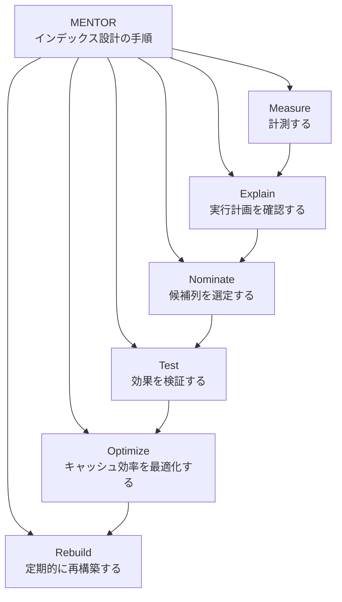

- **Measure（計測）**：どのクエリが最もコストを消費しているかをスロークエリログやプロファイラで特定する。
- **Explain（説明）**：`EXPLAIN`文で実行計画を確認し、インデックスが使われていないクエリを洗い出す。
- **Nominate（指名）**：`WHERE`句・`JOIN`条件・`ORDER BY`・`MIN()`/`MAX()`で使われる列をインデックス候補として選ぶ。
- **Test（検証）**：インデックス追加前後で実際に性能が改善したかを検証する。
- **Optimize（最適化）**：不要な冗長インデックスを削除し、キャッシュに乗る範囲でインデックスを絞り込む。
- **Rebuild（再構築）**：インデックスは断片化するため、定期的な再構築・統計情報の更新を行う。

- **使ってもよい場合**：小規模で読み取りが少ないテーブルなど、インデックスの費用対効果自体が低い場合はインデックスを増やさない判断も正しい。
- **解決策**：勘や思いつきではなく、MENTORの手順に沿ってインデックスを設計する。

---

## Step3：第Ⅲ部 クエリのアンチパターン（14〜19章）

SQL文そのものの書き方に関するアンチパターンです。書名から連想されやすい「SQLの書き方」の話題は、実はこの第Ⅲ部に集中しています。

### 14章 フィア・オブ・ジ・アンノウン（恐怖のunknown）

NULL（値が未知・未設定であることを表す特別な状態）を、`0`や空文字列のような「普通の値」として扱ってしまう、あるいは逆にNULLを避けようとして無理にダミー値を入れてしまうアンチパターンです。

```sql
-- アンチパターン：NULLを通常の値と混同する比較
SELECT * FROM Bugs WHERE assigned_to = NULL; -- 常に真にならない

-- 解決策：IS NULL / IS NOT NULLでNULLを一意な特別な値として扱う
SELECT * FROM Bugs WHERE assigned_to IS NULL;
SELECT * FROM Bugs WHERE assigned_to IS NOT NULL;
```

- **見分け方**：集計関数の結果がNULLを含む行によって直感と違う挙動になる（`NOT IN`のサブクエリにNULLが混ざると結果が空になる、というミニアンチパターンも紹介されています）。
- **解決策**：NULLを「値が不明または存在しないことを示す特別なマーカー」として一貫した方法で扱う。`COALESCE()`で既定値に変換する、`IS NULL`／`IS NOT NULL`で明示的に比較する、といった対処を徹底する。

### 15章 アンビギュアスグループ（曖昧なグループ）

`GROUP BY`を使ったクエリで、集約関数にもGROUP BY句にも含まれない列を`SELECT`してしまい、「どの行の値が返るか不定」な曖昧なクエリになってしまうアンチパターンです。

- **見分け方**：「グループの中で最大値を持つ行を1行取得したい」というよくある要件に対して、`GROUP BY`だけで非グループ化列を無自覚に選択している。
- **解決策**：関数従属性のある列のみをクエリする、相関サブクエリを使う、導出テーブル（サブクエリ）を使う、`JOIN`を使う、他の列にも集約関数を適用する、グループごとにすべての値を連結する、といった複数の代替策が紹介されています。データベース間の移植性を考慮した「ポータブルSQL」というミニアンチパターンも収録されています。

### 16章 ランダムセレクション

テーブルからランダムに1行取得したいときに、`ORDER BY RAND()`（あるいは`RANDOM()`）で全行を並び替えてから`LIMIT 1`する設計です。行数が多いテーブルでは全行のソートコストがかかり、極端に遅くなります。

- **見分け方**：ランダム抽出のクエリが行数に比例して遅くなる。
- **解決策**：最小値と最大値の間からランダムなキー値を選ぶ、欠番の次のキー値を選ぶ、すべてのキー値のリストを受け取ってアプリケーション側でランダムに選ぶ、オフセットを用いてランダムに行を選ぶ、といった「特定の順番に依存しない」複数の代替策が紹介されています。

### 17章 プアマンズ・サーチエンジン（貧者のサーチエンジン）

全文検索を実装したいときに、`LIKE '%keyword%'`のようなパターンマッチ述語だけで済ませてしまう設計です。

- **見分け方**：検索が遅い、関連度でのランキングができない、活用形やあいまい検索に対応できない。
- **解決策**：各データベース製品が提供するベンダー拡張機能（MySQLの全文検索インデックス、Oracleのテキストインデックス、Microsoft SQL Serverの全文検索、PostgreSQLのテキスト検索、SQLiteのFTS）や、サードパーティの検索エンジンを使う。

### 18章 スパゲッティクエリ

複雑な問題を、可読性を犠牲にしてでも1つの巨大なSQL文で解決しようとするアンチパターンです。

- **見分け方**：1つのクエリに大量の`JOIN`や`CASE`式、サブクエリが詰め込まれていて、書いた本人でも後から追えなくなっている。
- **解決策**：分割統治（Divide and Conquer）。複雑な問題を複数のシンプルなクエリに分割し、アプリケーションコード側で組み合わせる。

### 19章 インプリシットカラム（暗黙の列）

`SELECT *`や、列名を指定しない`INSERT INTO table VALUES (...)`のように、列を明示せずに省略記法を多用するアンチパターンです。

- **見分け方**：テーブルに列を追加しただけでアプリケーションが壊れる、意図しない列まで取得してネットワーク・メモリを無駄にしている。
- **解決策**：列を明示的に指定する。タイピング量を減らす目的だけで省略記法を使わない。

---

## Step4：第Ⅳ部 アプリケーション開発のアンチパターン（20〜25章）

SQLをアプリケーションコードからどう扱うか、開発プロセスにどう組み込むかに関するアンチパターンです。

### 20章 リーダブルパスワード（読み取り可能パスワード）

パスワードを忘れたユーザーに再送できるようにと、パスワードを平文やリバーシブルな暗号化（復号可能な暗号）で保存してしまうアンチパターンです。

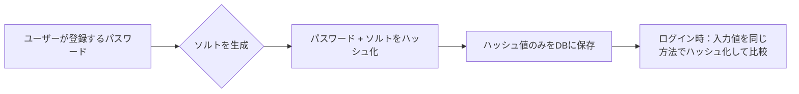

- **見分け方**：「パスワードを忘れた場合はメールでお送りします」という機能が存在する（＝平文または復号可能な形で保存している証拠）。
- **解決策**：ソルト付きハッシュ（salted hash）を保存する。ハッシュ文字列を保存するデータ型についての「Storing Hash Strings in VARCHAR」というミニアンチパターンも収録されています。

### 21章 SQLインジェクション

未検証の外部入力を、そのままSQL文の一部として実行してしまうアンチパターンです。攻撃者が入力欄に不正なSQL断片を仕込むことで、意図しないクエリが実行されてしまいます。

```sql
-- アンチパターン：文字列連結でSQLを組み立てる
-- 入力値: ' OR '1'='1
query = "SELECT * FROM Accounts WHERE email = '" + input + "'"

-- 解決策：プレースホルダとバインド変数を使う
SELECT * FROM Accounts WHERE email = ?;
-- パラメータとして input を渡す（SQL文字列には決して連結しない）
```

- **見分け方**：SQL文字列をアプリケーションコード側で単純な文字列連結によって組み立てている。
- **解決策**：「誰も信用しない（Trust No One）」。プレースホルダ（バインド変数）を使ったプリペアドステートメントで、コードとデータを明確に分離する。クオートの中にパラメータを書いてしまうという典型的な実装ミスも「ミニアンチパターン」として取り上げられています。

### 22章 シュードキー・ニートフリーク（疑似キー潔癖症）

削除によって連番の主キーに欠番ができるのを気にして、IDを詰め直そうとするアンチパターンです。

- **見分け方**：削除・再採番のたびに関連テーブルの外部キーまで更新する必要が生じ、余計な複雑さと不整合のリスクを生んでいる。
- **解決策**：「気にしない（Get Over It）」。代理キーはあくまで内部的な識別子であり、連続性や美しさを保証する必要はないと割り切る。

### 23章 シー・ノー・エビル（臭いものに蓋）

SQL文の戻り値やエラーコードをチェックせず、成功したものとみなしてコードを進めてしまうアンチパターンです。

- **見分け方**：診断せずに「動いているはず」と判断している、エラーが握りつぶされてログにすら残っていない。
- **解決策**：戻り値や例外を必ずチェックし、エラーから優雅に回復する。デバッグ時には、実際にデータベースに送られたSQL文そのものを確認する。構文エラーメッセージの読み方についてのミニアンチパターンも収録されています。

### 24章 ディプロマティック・イミュニティ（外交特権）

アプリケーションコードには適用しているバージョン管理・コードレビュー・テストといった開発プラクティスを、「SQLは特別だから」という理由で適用しないアンチパターンです。

- **見分け方**：スキーマ定義やクエリがGitなどのバージョン管理の対象外になっている、SQLに対する単体テスト・結合テストが存在しない。
- **解決策**：SQLコードも第一級の成果物として扱う「包括的な品質文化」を築く。具体的には、文書化・バージョン管理・テスト・複数ブランチの扱いをアプリケーションコードと同じ水準で行う。

### 25章 スタンダード・オペレーティング・プロシージャ（さびついた開発標準）

第2版で新設された章の1つです。ビジネスロジックを「とりあえずストアドプロシージャで実装する」という、かつての開発標準を無批判に踏襲してしまうアンチパターンを扱います。

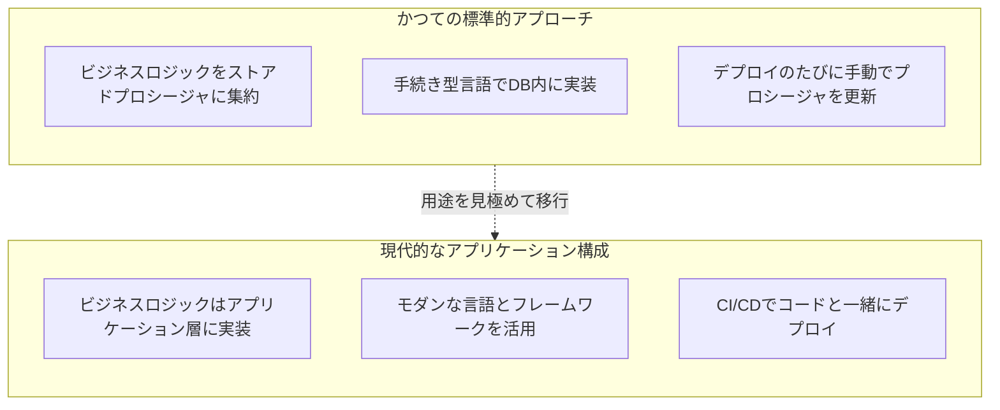

- **アンチパターン**：「声の大きい人に従う」形で、移植性・デバッグのしやすさ・拡張性を検討せずにストアドプロシージャを多用する。
- **使ってもよい場合**：権限を絞った特権操作、ネットワーク往復を減らしたい重い処理、頻度の低い管理系バッチ処理など、ストアドプロシージャが適したユースケースも存在します。
- **解決策**：モダンなアプリケーションアーキテクチャを採用する。ビジネスロジックは基本的にアプリケーションコード側に置き、ストアドプロシージャは適材適所で使う。

---

## Step5：第Ⅴ部 ボーナス：外部キーのミニアンチパターン（26〜27章）

第2版で新設されたボーナスパートで、外部キー制約そのものの定義でありがちな間違いを集めたリファレンス的な2章です。

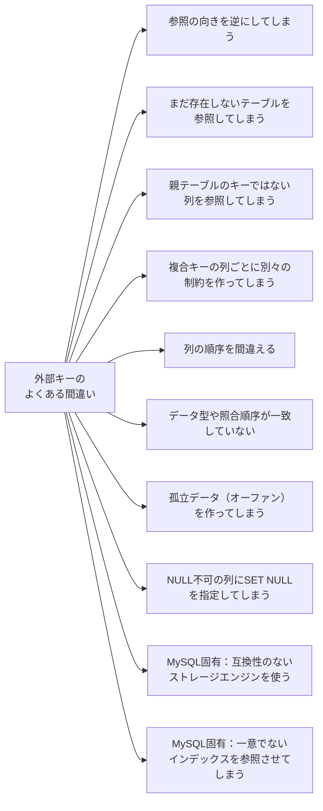

### 26章 標準SQLにおける外部キーの誤った使い方

参照の方向を逆にしてしまう、まだ作成されていないテーブルを参照しようとしてエラーになる、親テーブルの主キーやユニークキーではない列を参照してしまう、複合キーに対して列ごとに別々の制約を作ってしまう、列の順序を取り違える、データ型や文字コード・照合順序が一致していない、孤立データを生んでしまう、NOT NULL列にSET NULLオプションを指定してしまう、重複した制約名を作ってしまう、互換性のないテーブルタイプ同士を参照させてしまう、といった標準SQLレベルでの典型的なミスが列挙されます。

### 27章 MySQLにおける外部キーの誤った使い方

互換性のないストレージエンジン（InnoDBとMyISAMの混在など）を使う、外部キーに不必要に大きなデータ型を使う、一意でないインデックスへの外部キーを定義しようとする、インライン参照構文の落とし穴、デフォルトの参照構文（`REFERENCES`句だけで実際には制約が有効になっていない等）の誤解、MySQL特有の互換性のないテーブルタイプの組み合わせなど、MySQLというデータベース製品固有の外部キーの落とし穴がまとめられています。

---

## Step6：付録A 正規化のルール

本編の各章を理解するための前提知識として、付録Aではリレーション（テーブル）の定義と正規化の基礎がまとめられています。

- **リレーションの5つの性質**：行に上下の順序がない／列に左右の順序がない／重複行を許可しない／すべての列は単一の型を持ち各行に1つの値を持つ／行に隠れた構成要素がない。
- **正規化の神話**：「正規化すればするほど良い」という単純化された理解ではなく、正規化は目的（更新時の不整合を防ぐこと）のための手段であるという位置づけが強調されます。
- **各正規形の概要**：第1正規形・第2正規形・第3正規形・ボイス・コッド正規形・第4正規形・第5正規形について、それぞれが防ぐ異常（更新異常・挿入異常・削除異常）の観点から簡潔に説明されます。
- **正規化は常識的なもの**：難解な理論というより、「1つの事実は1か所にだけ記録する」という常識的な設計原則の体系化として位置づけられています。


本書全体を通じて登場する「交差テーブルを作る」「サブタイプをモデル化する」「従属テーブルに分ける」といった解決策の多くは、この正規化の考え方を具体的な設計判断に落とし込んだものだと理解すると、各章のつながりが見えやすくなります。

---

## Step7：日本語版限定付録「砂の城」

日本語版だけの特典として、MySQL・Oracleに精通したデータベースエンジニアである奥野幹也氏による書き下ろしの追加アンチパターン「砂の城」が用意されています。これは初版の日本語版に収録されていた「25章 砂の城」を第2版向けに改訂したもので、オライリー・ジャパンの公式サイトから「関連ファイル」としてPDFをダウンロードできます。地震や津波のような自然災害に起因するシビアアクシデントへの備えという文脈から着想を得た、日本語版ならではの視点によるアンチパターンです（詳細は巻末の参考文献のリンク先PDFを参照してください）。

---

## 初版から第2版への変化

日本語版監訳者の和田卓人氏によるイベント解説（Findy Media、2025年10月公開）をもとに、初版（2013年の日本語版、原著2010年）から第2版（2025年の日本語版、原著2022年）への主な変化を整理します。

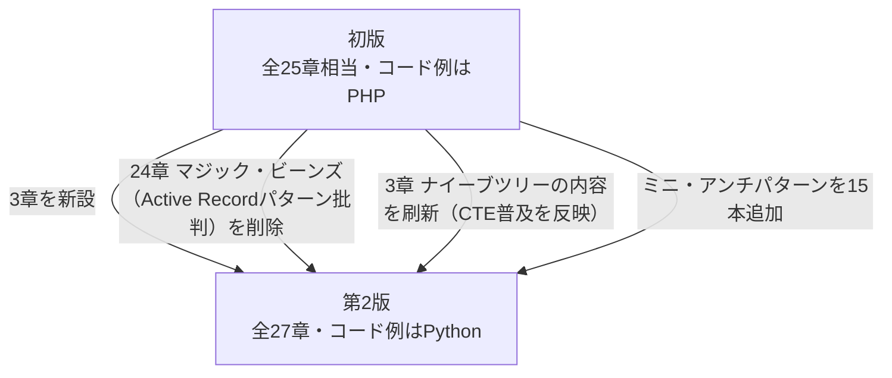

| 変化 | 内容 |
| --- | --- |
| ページ数 | 48ページ増（第2版は全400ページ） |
| 新設された章 | 25章 スタンダード・オペレーティング・プロシージャ、26章・27章 外部キーのミニアンチパターン（合計3章） |
| 削除された章 | 初版24章「マジック・ビーンズ」。RailsやLaravelなどで広く使われるActive Recordパターンを名指しでアンチパターン扱いしていたが、第2版ではこの12年でActive Record系ORMが多くの事業を支えてきた実績を踏まえ、「採用＝アンチパターンではない」という整理に変わり、章ごと削除された |
| 最も内容が変わった既存章 | 3章「ナイーブツリー」。CTE（再帰SQL）の実装が主要RDBMSに広く普及したことを受け、隣接リストを「必ずしもアンチパターンとは限らない」と再評価する記述に更新 |
| ミニ・アンチパターン | 新たに15本追加（章末の短いコラムとして収録） |
| コード例の言語 | PHPからPythonに刷新 |
| 改訂規模 | 監訳作業で確認された原文の変更箇所は400〜450箇所程度 |

この変化の背景として、t-wada氏は2025年のイベントで「バイブコーディング」（AIエージェントに自然言語で指示してコードやシステムを作らせる開発スタイル）が広がる時代性についても言及しており、UIのようにやり直しがきく部分と違って、データベースに一度入ったデータの構造は後から挽回しにくいからこそ、他人の失敗に名前を付けて学ぶ本書の価値が今なお高い、という趣旨の解説をしています。

---

## 国際的な開発者・コミュニティでの評価

本書は原著の初版（2010年）以来、英語圏の開発者コミュニティで継続的に参照されてきました。

- **著者自身による情報発信**：著者のBill Karwinは、書籍出版に先立つ2009年の自身のブログ記事「EAV FAIL」で、EAV（実体・属性・値）設計を明確に「アンチパターン」と呼び、キー・バリューのペアをまとめて1つの列に格納する方がEAVよりましだと述べています。また、13章「インデックスショットガン」の核となる"MENTOR"という手法は、著者自身がIndependent Oracle Users Groupのイベント（2010年）で発表したスライド「MENTOR Your Indexes」でも詳しく解説されています。
- **Hacker Newsでの言及**：技術者コミュニティHacker Newsでは、データベース設計に関する議論のたびに本書がしばしば引用されており、「フレームワークの多くはアンチパターンを助長する設計になっている」という文脈で、C. J. Dateの浩瀚な教科書と対比しつつ「読みやすい入門書」として紹介されるコメントも見られます。別のスレッドでは、JSONB列の使用に関する議論の中で、EAVパターンの問題点を説明する際の代表的な参考文献として挙げられています。
- **書評・要約サイト**：Goodreadsには560件を超えるレーティングが寄せられ（平均4.0前後）、「短く要点を突いた各章の構成」「アンチパターンを使ってよい場面まで併記している点」が高く評価されている一方、「提示される解決策の説明がやや駆け足」という指摘も見られます。開発者個人のブログ（Tyler Hillery氏、openlamptech等）でも、実務でのSQL経験がある読者からの具体的な学びが多数共有されています。

---

## 批判的に読む

本書を初学者が読む際に、あらかじめ知っておくとよい限界や留意点をまとめます。

- **前提知識が必要**：本書はSQLの入門書（SELECT文の書き方など）ではありません。基本文法をすでに理解している読者が、設計判断の「引き出し」を増やすための本という位置づけです。
- **MySQL中心の例**：コード例はMySQL 8.0を主軸にしつつ他のRDBMSにも言及されますが、細部の挙動（NULLの扱い、拡張構文など）は製品ごとに異なるため、自分が使う製品のドキュメントでの裏取りが必要です。
- **原著の削除された旧24章の議論は文脈として押さえておく価値がある**：Active Recordパターンをめぐる評価の変化（アンチパターン扱いの撤回）は、設計原則が「銀の弾丸」ではなく、エコシステムの成熟度によって評価が変わりうることを示す好例です。読者自身の現場でも、当時アンチパターンとされていたものが今は許容される、あるいはその逆が起こりうることを念頭に置くとよいでしょう。
- **カタログ形式ゆえの限界**：25個のアンチパターンは独立した章として並んでいますが、実務では複数のアンチパターンが絡み合って発生します（たとえばEAVとポリモーフィック関連が併発するなど）。本書を読んだ後は、自分たちのスキーマ全体を俯瞰し、複合的な問題として捉え直す作業が別途必要です。

---

## 学習ロードマップ

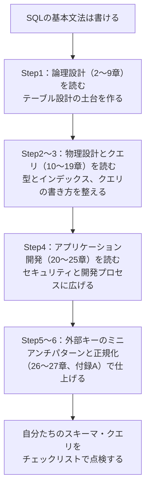

初めて本書に触れる場合は、まず第Ⅰ部（論理設計）だけでも読み終えることを目標にするとよいでしょう。テーブル設計の判断は後から変更するコストが最も高いため、最初に投資する価値があります。すでに稼働中のシステムを抱えている場合は、第Ⅳ部（アプリケーション開発）の21章「SQLインジェクション」と20章「リーダブルパスワード」から先に点検することを強くおすすめします。

---

## チェックリスト

自分たちのデータベース・SQLコードに、本書で紹介されたアンチパターンが潜んでいないかを確認するための25項目です。

- [ ] カンマ区切りの値を1つの列に詰め込んでいる列はないか（2章 ジェイウォーク）
- [ ] 親IDだけに頼った木構造で、先祖・子孫の取得クエリが複雑化していないか（3章 ナイーブツリー）
- [ ] すべてのテーブルに機械的に`id`列を追加し、複合主キーが自然なテーブルまで壊していないか（4章 IDリクワイアド）
- [ ] 外部キー制約を敬遠し、参照整合性をアプリケーションコード任せにしていないか（5章 キーレスエントリ）
- [ ] 汎用的な属性テーブル（EAV）で何にでも対応しようとしていないか（6章 EAV）
- [ ] 1つの外部キー列で複数の親テーブルを指そうとしていないか（7章 ポリモーフィック関連）
- [ ] 繰り返し項目のために列を横に増やし続けていないか（8章 マルチカラムアトリビュート）
- [ ] スケールのためにテーブルや列を年度・カテゴリごとに複製していないか（9章 メタデータトリブル）
- [ ] 金額をFLOAT型で扱っていないか（10章 ラウンディングエラー）
- [ ] 許容値を列定義やCHECK制約に直接書き込んでいないか（11章 サーティワンフレーバー）
- [ ] ファイルとDBレコードの整合性戦略を決めずにファイルシステムだけで運用していないか（12章 ファントムファイル）
- [ ] 根拠のないままインデックスを追加・削除していないか（13章 インデックスショットガン）
- [ ] NULLを普通の値のように比較・演算していないか（14章 フィア・オブ・ジ・アンノウン）
- [ ] GROUP BYクエリで非集約列を無自覚に選択していないか（15章 アンビギュアスグループ）
- [ ] `ORDER BY RAND()`で全行をソートしてランダム抽出していないか（16章 ランダムセレクション）
- [ ] 全文検索を`LIKE '%...%'`だけで実装していないか（17章 プアマンズ・サーチエンジン）
- [ ] 1つの巨大なクエリで複雑な問題を解決しようとしていないか（18章 スパゲッティクエリ）
- [ ] `SELECT *`や列名省略のINSERTを本番コードで使っていないか（19章 インプリシットカラム）
- [ ] パスワードを平文や復号可能な形で保存していないか（20章 リーダブルパスワード）
- [ ] SQL文を文字列連結で組み立てている箇所はないか（21章 SQLインジェクション）
- [ ] 欠番になった連番IDを詰め直そうとしていないか（22章 シュードキー・ニートフリーク）
- [ ] SQL文の戻り値やエラーをチェックせずに握りつぶしていないか（23章 シー・ノー・エビル）
- [ ] SQLコードだけレビュー・バージョン管理・テストの対象外になっていないか（24章 ディプロマティック・イミュニティ）
- [ ] ビジネスロジックを安易にストアドプロシージャへ寄せていないか（25章 スタンダード・オペレーティング・プロシージャ）
- [ ] 外部キー定義自体に、参照方向・列順序・データ型不一致などの誤りがないか（26〜27章 外部キーのミニアンチパターン）

---

## まとめ

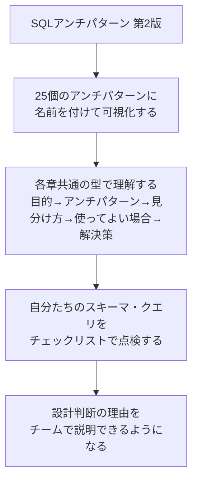

本書の価値は、単に「正しいテーブル設計」を丸暗記させることではなく、それぞれのアンチパターンに固有の名前を与えることで、チーム内で「これはジェイウォークだよね」「EAVになりかけてない？」といった共通言語を持てるようにする点にあります。25個すべてを一度に覚える必要はありません。まずは自分たちのプロジェクトで実際に困っている章から読み始め、本ガイドのチェックリストを使って定期的に見直す習慣をつけることをおすすめします。

---

## 参考文献・出典

| No. | 出典 | URL |
| --- | --- | --- |
| 1 | オライリー・ジャパン公式サイト「SQLアンチパターン 第2版」書籍紹介・目次立ち読み | https://www.oreilly.co.jp/books/9784814400744/ |
| 2 | オーム社（Ohmsha）「SQLアンチパターン（第2版）」書籍ページ | https://www.ohmsha.co.jp/book/9784814400744/ |
| 3 | オライリー・ジャパン日本語版付録PDF「砂の城」（奥野幹也氏 書き下ろし） | https://www.oreilly.co.jp/pub/9784814400744/sql-antipatterns-2nd-sunanoshiro.pdf |
| 4 | Pragmatic Bookshelf公式サイト「SQL Antipatterns, Volume 1」（原著第2版・全27章の詳細目次） | https://pragprog.com/titles/bksap1/sql-antipatterns-volume-1/ |
| 5 | Pragmatic Bookshelf公式サイト「SQL Antipatterns」（原著初版・絶版、比較用） | https://pragprog.com/titles/bksqla/sql-antipatterns/ |
| 6 | Findy Media「t-wadaさんに聞く！『SQLアンチパターン第2版』全27章まとめて紹介」（監訳者・和田卓人氏によるイベント解説） | https://findy-code.io/media/articles/event-sql-antipatterns-250728 |
| 7 | Bill Karwin氏によるカンファレンス発表資料「MENTOR Your Indexes」（Independent Oracle Users Group、2010年） | https://www.slideshare.net/billkarwin/mentor-your-indexes |
| 8 | Hacker News「SQL Antipatterns」関連スレッド（EAV／JSONB列をめぐる議論） | https://news.ycombinator.com/item?id=44921630 |
| 9 | Tyler Hillery氏の個人ブログ「SQL Antipatterns: Avoiding the Pitfalls of Database Programming」書評 | https://tylerhillery.com/notes/sql-antipatterns/ |
| 10 | openlamptech（英語圏の開発者ブログ）「Book Recommendation - SQL Antipatterns」 | https://openlamptech.substack.com/p/book-recommendation-sql-antipatterns |
| 11 | Amazon.co.jp「SQLアンチパターン 第2版」商品ページ（全27章の日本語章タイトル一覧） | https://www.amazon.co.jp/dp/4814400748 |
| 12 | Goodreads「SQL Antipatterns」作品ページ（版一覧・レーティング） | https://www.goodreads.com/work/editions/11753471-sql-antipatterns-avoiding-the-pitfalls-of-database-programming-pragmat |
| 13 | Internet Archive「SQL Antipatterns」初版スキャン（Bill Karwin著、2011年） | https://archive.org/details/sqlantipatternsa0000karw |
| 14 | 幡ヶ谷亭直吉ブログ「『SQLアンチパターン 第2版』を読んで」（日本語読者による読書メモ、2025年10月） | https://hiliteeternal.hatenablog.com/entry/2025/10/17/211849 |

> 本ガイドは上記の公開情報をもとに2026年9月時点でまとめたものです。書籍の正確な内容は必ず原著・日本語版そのものをご確認ください。
