# ⚡ EDA（イベント駆動アーキテクチャ）完全ガイド

## 📚 目次

1. [EDAとは何か？](#1-edaとは何か)
2. [EDAの基本構成要素](#2-edaの基本構成要素)
3. [イベントの種類と設計](#3-イベントの種類と設計)
4. [メッセージブローカーとイベントストリーミング](#4-メッセージブローカーとイベントストリーミング)
5. [EDAのトポロジーパターン](#5-edaのトポロジーパターン)
6. [Apache Kafka 完全解説](#6-apache-kafka-完全解説)
7. [AWS EventBridge 完全解説](#7-aws-eventbridge-完全解説)
8. [イベントソーシング（Event Sourcing）](#8-イベントソーシングevent-sourcing)
9. [CQRS（Command Query Responsibility Segregation）](#9-cqrscommand-query-responsibility-segregation)
10. [EDAのエラーハンドリングと信頼性設計](#10-edaのエラーハンドリングと信頼性設計)
11. [EDAのセキュリティ設計](#11-edaのセキュリティ設計)
12. [EDAの監視・オブザーバビリティ](#12-edaの監視オブザーバビリティ)
13. [EDA実践：ECサイト完全事例](#13-eda実践ecサイト完全事例)
14. [EDAのベストプラクティス総まとめ](#14-edaのベストプラクティス総まとめ)
15. [EDAのアンチパターン](#15-edaのアンチパターン)
16. [参考文献・ソース一覧](#16-参考文献ソース一覧)

---

## 1. EDAとは何か？

### 1.1 EDAの定義

**Event-Driven Architecture（イベント駆動アーキテクチャ）** は、システムのコンポーネント間の通信を「**イベント（事象）**」によって行うアーキテクチャスタイルです。各コンポーネントはイベントを**発行（Publish）**したり**購読（Subscribe）**したりすることで、互いに**疎結合**を保ちながら連携します。

> 💡 **核心思想：**「何かが起きたことを通知し、それに反応する。コンポーネントは互いの存在を知らなくてよい」

### 1.2 従来のリクエスト駆動型 vs EDA

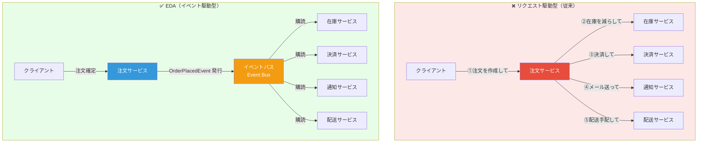
```mermaid
graph TD
    subgraph REQ["❌ リクエスト駆動型（従来）"]
        direction LR
        R_CLIENT["クライアント"] -->|"①注文を作成して"| R_ORDER["注文サービス"]
        R_ORDER -->|"②在庫を減らして"| R_STOCK["在庫サービス"]
        R_ORDER -->|"③決済して"| R_PAYMENT["決済サービス"]
        R_ORDER -->|"④メール送って"| R_NOTIFY["通知サービス"]
        R_ORDER -->|"⑤配送手配して"| R_SHIP["配送サービス"]
    end

    subgraph EDA_ARCH["✅ EDA（イベント駆動型）"]
        direction LR
        E_CLIENT["クライアント"] -->|"注文確定"| E_ORDER["注文サービス"]
        E_ORDER -->|"OrderPlacedEvent 発行"| E_BUS["イベントバス<br>Event Bus"]
        E_BUS -->|"購読"| E_STOCK["在庫サービス"]
        E_BUS -->|"購読"| E_PAYMENT["決済サービス"]
        E_BUS -->|"購読"| E_NOTIFY["通知サービス"]
        E_BUS -->|"購読"| E_SHIP["配送サービス"]
    end

    style REQ fill:#fde8e8
    style EDA_ARCH fill:#e8fde8
    style E_BUS fill:#f39c12,color:#fff
    style E_ORDER fill:#3498db,color:#fff
    style R_ORDER fill:#e74c3c,color:#fff
```

### 1.3 EDAが解決する問題

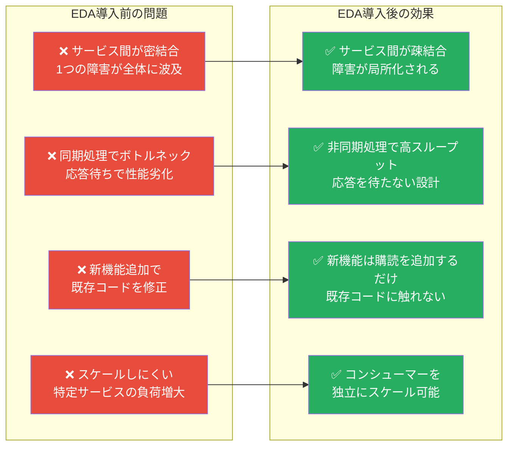
```mermaid
graph LR
    subgraph "EDA導入前の問題"
        P1["❌ サービス間が密結合<br>1つの障害が全体に波及"]
        P2["❌ 同期処理でボトルネック<br>応答待ちで性能劣化"]
        P3["❌ 新機能追加で<br>既存コードを修正"]
        P4["❌ スケールしにくい<br>特定サービスの負荷増大"]
    end

    subgraph "EDA導入後の効果"
        S1["✅ サービス間が疎結合<br>障害が局所化される"]
        S2["✅ 非同期処理で高スループット<br>応答を待たない設計"]
        S3["✅ 新機能は購読を追加するだけ<br>既存コードに触れない"]
        S4["✅ コンシューマーを<br>独立にスケール可能"]
    end

    P1 --> S1
    P2 --> S2
    P3 --> S3
    P4 --> S4

    style P1 fill:#e74c3c,color:#fff
    style P2 fill:#e74c3c,color:#fff
    style P3 fill:#e74c3c,color:#fff
    style P4 fill:#e74c3c,color:#fff
    style S1 fill:#27ae60,color:#fff
    style S2 fill:#27ae60,color:#fff
    style S3 fill:#27ae60,color:#fff
    style S4 fill:#27ae60,color:#fff
```

### 1.4 EDAが適しているユースケース

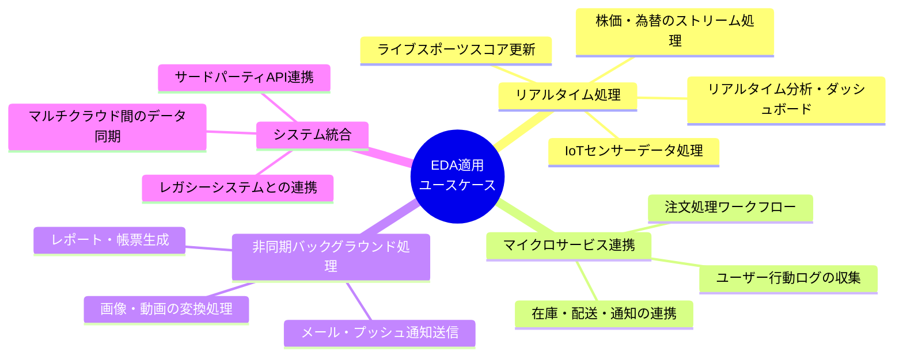
```mermaid
mindmap
    root((EDA適用<br>ユースケース))
        リアルタイム処理
            リアルタイム分析・ダッシュボード
            IoTセンサーデータ処理
            株価・為替のストリーム処理
            ライブスポーツスコア更新
        マイクロサービス連携
            注文処理ワークフロー
            在庫・配送・通知の連携
            ユーザー行動ログの収集
        非同期バックグラウンド処理
            メール・プッシュ通知送信
            レポート・帳票生成
            画像・動画の変換処理
        システム統合
            レガシーシステムとの連携
            サードパーティAPI連携
            マルチクラウド間のデータ同期
```

---

## 2. EDAの基本構成要素

### 2.1 EDAの3つの主要コンポーネント

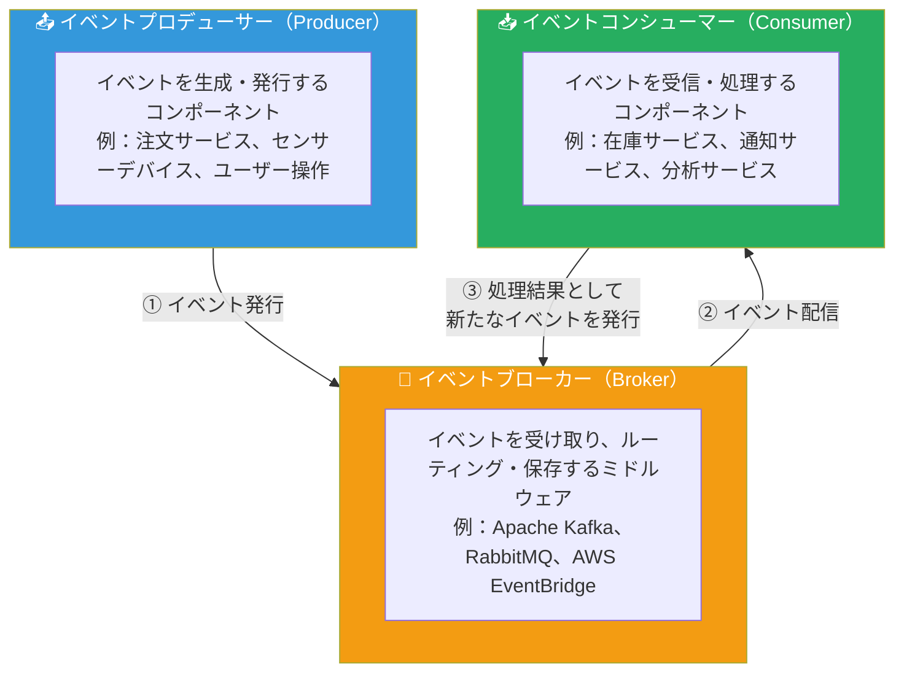
```mermaid
graph TD
    subgraph PRODUCER["📤 イベントプロデューサー（Producer）"]
        P_DESC["イベントを生成・発行するコンポーネント<br>例：注文サービス、センサーデバイス、ユーザー操作"]
    end

    subgraph BROKER["🔀 イベントブローカー（Broker）"]
        B_DESC["イベントを受け取り、ルーティング・保存するミドルウェア<br>例：Apache Kafka、RabbitMQ、AWS EventBridge"]
    end

    subgraph CONSUMER["📥 イベントコンシューマー（Consumer）"]
        C_DESC["イベントを受信・処理するコンポーネント<br>例：在庫サービス、通知サービス、分析サービス"]
    end

    PRODUCER -->|"① イベント発行"| BROKER
    BROKER -->|"② イベント配信"| CONSUMER
    CONSUMER -->|"③ 処理結果として<br>新たなイベントを発行"| BROKER

    style PRODUCER fill:#3498db,color:#fff
    style BROKER fill:#f39c12,color:#fff
    style CONSUMER fill:#27ae60,color:#fff
```

### 2.2 イベントの解剖（Anatomy of an Event）

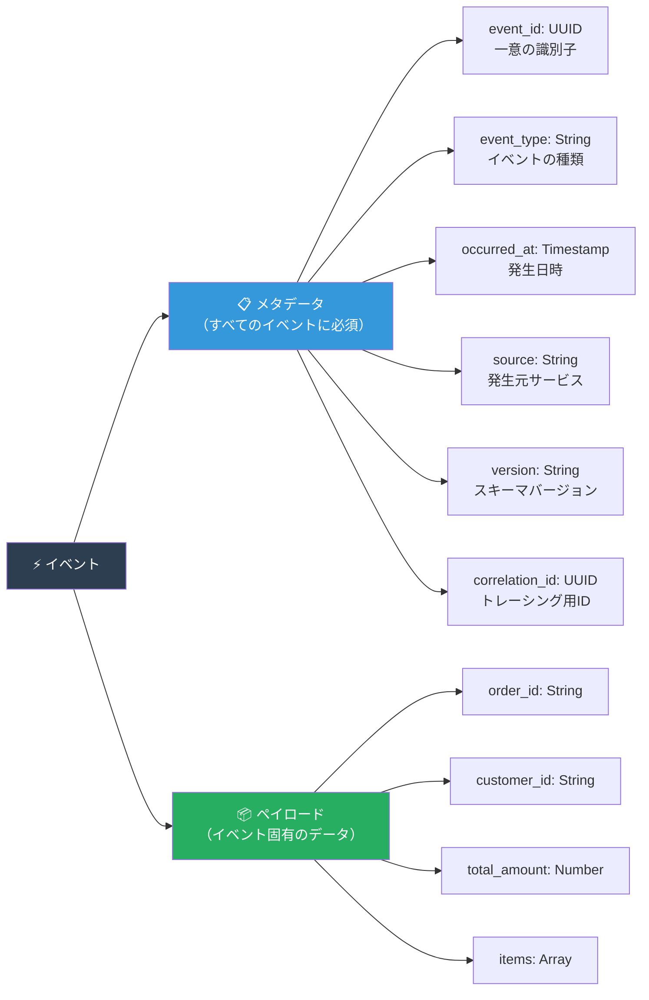
```mermaid
graph LR
    EVENT["⚡ イベント"]

    EVENT --> META["📋 メタデータ<br>（すべてのイベントに必須）"]
    EVENT --> PAYLOAD["📦 ペイロード<br>（イベント固有のデータ）"]

    META --> M1["event_id: UUID<br>一意の識別子"]
    META --> M2["event_type: String<br>イベントの種類"]
    META --> M3["occurred_at: Timestamp<br>発生日時"]
    META --> M4["source: String<br>発生元サービス"]
    META --> M5["version: String<br>スキーマバージョン"]
    META --> M6["correlation_id: UUID<br>トレーシング用ID"]

    PAYLOAD --> D1["order_id: String"]
    PAYLOAD --> D2["customer_id: String"]
    PAYLOAD --> D3["total_amount: Number"]
    PAYLOAD --> D4["items: Array"]

    style EVENT fill:#2c3e50,color:#fff
    style META fill:#3498db,color:#fff
    style PAYLOAD fill:#27ae60,color:#fff
```

### 2.3 イベントの実装例（Python）

```python
from dataclasses import dataclass, field, asdict
from datetime import datetime, timezone
from uuid import uuid4
from typing import Any
import json


@dataclass(frozen=True)
class EventMetadata:
    """すべてのイベントに共通するメタデータ"""
    event_id: str = field(default_factory=lambda: str(uuid4()))
    occurred_at: str = field(
        default_factory=lambda: datetime.now(timezone.utc).isoformat()
    )
    version: str = "1.0"
    correlation_id: str = field(default_factory=lambda: str(uuid4()))


@dataclass(frozen=True)
class OrderPlacedEvent:
    """
    注文が確定されたイベント
    - 名前は必ず過去形（OrderPlaced = 注文が確定した）
    - イミュータブル（frozenで変更不可）
    - 自己完結型（受信者がDBを参照しなくてよい情報を含む）
    """
    # メタデータ
    event_type: str = "order.placed"
    source: str = "order-service"
    metadata: EventMetadata = field(default_factory=EventMetadata)

    # ペイロード（イベント固有データ）
    order_id: str = ""
    customer_id: str = ""
    customer_email: str = ""
    total_amount: float = 0.0
    currency: str = "JPY"
    items: list = field(default_factory=list)
    shipping_address: dict = field(default_factory=dict)

    def to_json(self) -> str:
        """JSONシリアライズ"""
        return json.dumps(asdict(self), ensure_ascii=False)

    @classmethod
    def from_json(cls, json_str: str) -> "OrderPlacedEvent":
        """JSONデシリアライズ"""
        data = json.loads(json_str)
        if isinstance(data.get("metadata"), dict):
            data["metadata"] = EventMetadata(**data["metadata"])
        return cls(**data)


# 使用例
event = OrderPlacedEvent(
    order_id="order_12345",
    customer_id="cust_67890",
    customer_email="user@example.com",
    total_amount=15000.0,
    currency="JPY",
    items=[
        {"product_id": "prod_001", "name": "Tシャツ", "quantity": 2, "price": 5000},
        {"product_id": "prod_002", "name": "ジーンズ", "quantity": 1, "price": 5000},
    ],
    shipping_address={
        "postal_code": "150-0001",
        "prefecture": "東京都",
        "city": "渋谷区",
        "street": "神宮前1-1-1"
    }
)

print(event.to_json())
```

---

## 3. イベントの種類と設計

### 3.1 イベントの4分類

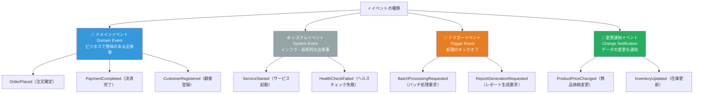
```mermaid
graph TD
    EVENTS["⚡ イベントの種類"]

    EVENTS --> DOMAIN["🧩 ドメインイベント<br>Domain Event<br>ビジネスで意味のある出来事"]
    EVENTS --> SYSTEM["⚙️ システムイベント<br>System Event<br>インフラ・技術的な出来事"]
    EVENTS --> TRIGGER["🔔 トリガーイベント<br>Trigger Event<br>処理のキックオフ"]
    EVENTS --> CHANGE["🔄 変更通知イベント<br>Change Notification<br>データの変更を通知"]

    DOMAIN --> D1["OrderPlaced（注文確定）"]
    DOMAIN --> D2["PaymentCompleted（決済完了）"]
    DOMAIN --> D3["CustomerRegistered（顧客登録）"]

    SYSTEM --> S1["ServiceStarted（サービス起動）"]
    SYSTEM --> S2["HealthCheckFailed（ヘルスチェック失敗）"]

    TRIGGER --> T1["BatchProcessingRequested（バッチ処理要求）"]
    TRIGGER --> T2["ReportGenerationRequested（レポート生成要求）"]

    CHANGE --> C1["ProductPriceChanged（商品価格変更）"]
    CHANGE --> C2["InventoryUpdated（在庫更新）"]

    style DOMAIN fill:#3498db,color:#fff
    style SYSTEM fill:#95a5a6,color:#fff
    style TRIGGER fill:#e67e22,color:#fff
    style CHANGE fill:#27ae60,color:#fff
```

### 3.2 イベント設計のベストプラクティス：Good vs Bad

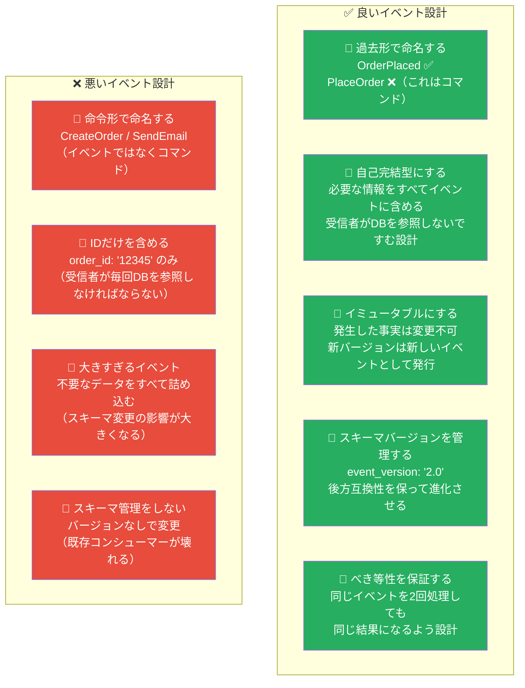
```mermaid
graph TD
    subgraph "✅ 良いイベント設計"
        G1["📌 過去形で命名する<br>OrderPlaced ✅<br>PlaceOrder ❌（これはコマンド）"]
        G2["📌 自己完結型にする<br>必要な情報をすべてイベントに含める<br>受信者がDBを参照しないですむ設計"]
        G3["📌 イミュータブルにする<br>発生した事実は変更不可<br>新バージョンは新しいイベントとして発行"]
        G4["📌 スキーマバージョンを管理する<br>event_version: '2.0'<br>後方互換性を保って進化させる"]
        G5["📌 べき等性を保証する<br>同じイベントを2回処理しても<br>同じ結果になるよう設計"]
    end

    subgraph "❌ 悪いイベント設計"
        B1["🚫 命令形で命名する<br>CreateOrder / SendEmail<br>（イベントではなくコマンド）"]
        B2["🚫 IDだけを含める<br>order_id: '12345' のみ<br>（受信者が毎回DBを参照しなければならない）"]
        B3["🚫 大きすぎるイベント<br>不要なデータをすべて詰め込む<br>（スキーマ変更の影響が大きくなる）"]
        B4["🚫 スキーマ管理をしない<br>バージョンなしで変更<br>（既存コンシューマーが壊れる）"]
    end

    style G1 fill:#27ae60,color:#fff
    style G2 fill:#27ae60,color:#fff
    style G3 fill:#27ae60,color:#fff
    style G4 fill:#27ae60,color:#fff
    style G5 fill:#27ae60,color:#fff
    style B1 fill:#e74c3c,color:#fff
    style B2 fill:#e74c3c,color:#fff
    style B3 fill:#e74c3c,color:#fff
    style B4 fill:#e74c3c,color:#fff
```

### 3.3 イベントスキーマの進化戦略

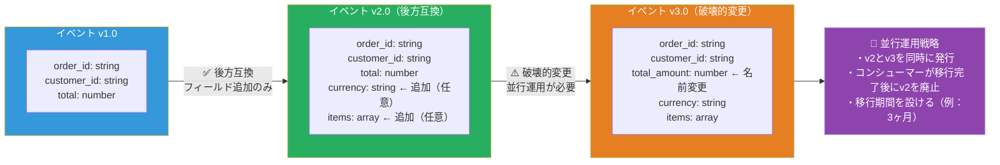
```mermaid
flowchart LR
    subgraph V1["イベント v1.0"]
        V1_DATA["order_id: string<br>customer_id: string<br>total: number"]
    end

    subgraph V2["イベント v2.0（後方互換）"]
        V2_DATA["order_id: string<br>customer_id: string<br>total: number<br>currency: string ← 追加（任意）<br>items: array ← 追加（任意）"]
    end

    subgraph V3["イベント v3.0（破壊的変更）"]
        V3_DATA["order_id: string<br>customer_id: string<br>total_amount: number ← 名前変更<br>currency: string<br>items: array"]
    end

    V1 -->|"✅ 後方互換<br>フィールド追加のみ"| V2
    V2 -->|"⚠️ 破壊的変更<br>並行運用が必要"| V3

    V3 --> STRATEGY["🔄 並行運用戦略<br>・v2とv3を同時に発行<br>・コンシューマーが移行完了後にv2を廃止<br>・移行期間を設ける（例：3ヶ月）"]

    style V1 fill:#3498db,color:#fff
    style V2 fill:#27ae60,color:#fff
    style V3 fill:#e67e22,color:#fff
    style STRATEGY fill:#8e44ad,color:#fff
```

---

## 4. メッセージブローカーとイベントストリーミング

### 4.1 主要ブローカーの比較

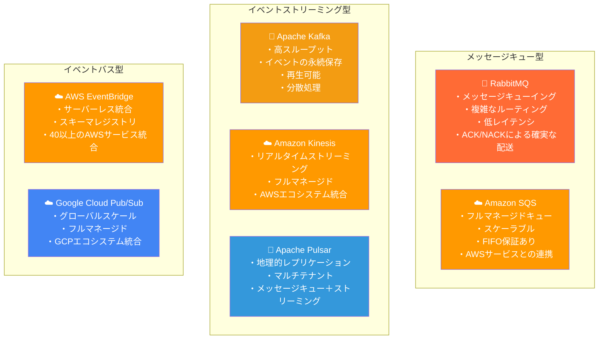
```mermaid
graph TD
    subgraph "メッセージキュー型"
        RMQ["🐰 RabbitMQ<br>・メッセージキューイング<br>・複雑なルーティング<br>・低レイテンシ<br>・ACK/NACKによる確実な配送"]
        SQS["☁️ Amazon SQS<br>・フルマネージドキュー<br>・スケーラブル<br>・FIFO保証あり<br>・AWSサービスとの連携"]
    end

    subgraph "イベントストリーミング型"
        KAFKA["🔶 Apache Kafka<br>・高スループット<br>・イベントの永続保存<br>・再生可能<br>・分散処理"]
        KINESIS["☁️ Amazon Kinesis<br>・リアルタイムストリーミング<br>・フルマネージド<br>・AWSエコシステム統合"]
        PULSAR["🌟 Apache Pulsar<br>・地理的レプリケーション<br>・マルチテナント<br>・メッセージキュー＋ストリーミング"]
    end

    subgraph "イベントバス型"
        EVENTBRIDGE["☁️ AWS EventBridge<br>・サーバーレス統合<br>・スキーマレジストリ<br>・40以上のAWSサービス統合"]
        PUBSUB["☁️ Google Cloud Pub/Sub<br>・グローバルスケール<br>・フルマネージド<br>・GCPエコシステム統合"]
    end

    style KAFKA fill:#f39c12,color:#fff
    style RMQ fill:#ff6b35,color:#fff
    style SQS fill:#ff9900,color:#fff
    style KINESIS fill:#ff9900,color:#fff
    style PULSAR fill:#3498db,color:#fff
    style EVENTBRIDGE fill:#ff9900,color:#fff
    style PUBSUB fill:#4285f4,color:#fff
```

### 4.2 ユースケース別ブローカー選択ガイド

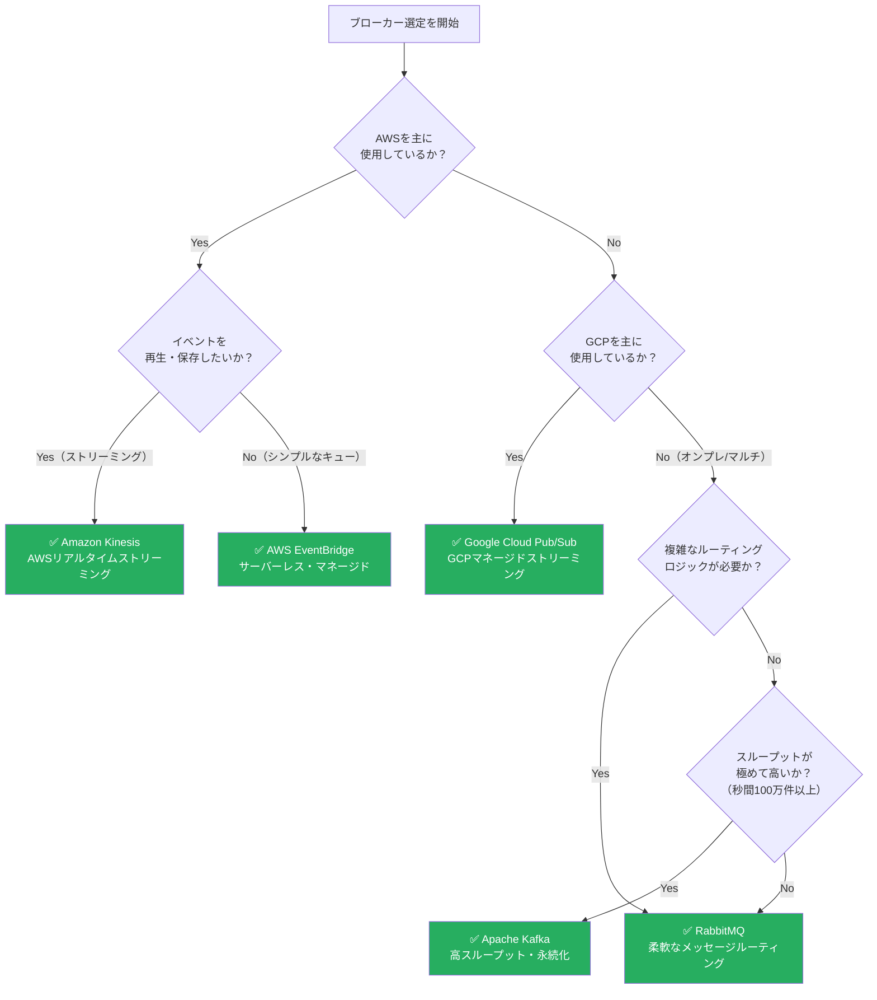
```mermaid
flowchart TD
    START["ブローカー選定を開始"]

    Q1{"AWSを主に<br>使用しているか？"}
    Q2{"イベントを<br>再生・保存したいか？"}
    Q3{"複雑なルーティング<br>ロジックが必要か？"}
    Q4{"スループットが<br>極めて高いか？<br>（秒間100万件以上）"}
    Q5{"GCPを主に<br>使用しているか？"}

    EVENTBRIDGE_REC["✅ AWS EventBridge<br>サーバーレス・マネージド"]
    KINESIS_REC["✅ Amazon Kinesis<br>AWSリアルタイムストリーミング"]
    KAFKA_REC["✅ Apache Kafka<br>高スループット・永続化"]
    RMQ_REC["✅ RabbitMQ<br>柔軟なメッセージルーティング"]
    PUBSUB_REC["✅ Google Cloud Pub/Sub<br>GCPマネージドストリーミング"]

    START --> Q1
    Q1 -->|"Yes"| Q2
    Q1 -->|"No"| Q5
    Q2 -->|"Yes（ストリーミング）"| KINESIS_REC
    Q2 -->|"No（シンプルなキュー）"| EVENTBRIDGE_REC
    Q5 -->|"Yes"| PUBSUB_REC
    Q5 -->|"No（オンプレ/マルチ）"| Q3
    Q3 -->|"Yes"| RMQ_REC
    Q3 -->|"No"| Q4
    Q4 -->|"Yes"| KAFKA_REC
    Q4 -->|"No"| RMQ_REC

    style EVENTBRIDGE_REC fill:#27ae60,color:#fff
    style KINESIS_REC fill:#27ae60,color:#fff
    style KAFKA_REC fill:#27ae60,color:#fff
    style RMQ_REC fill:#27ae60,color:#fff
    style PUBSUB_REC fill:#27ae60,color:#fff
```

### 4.3 メッセージキュー vs イベントストリーミングの違い

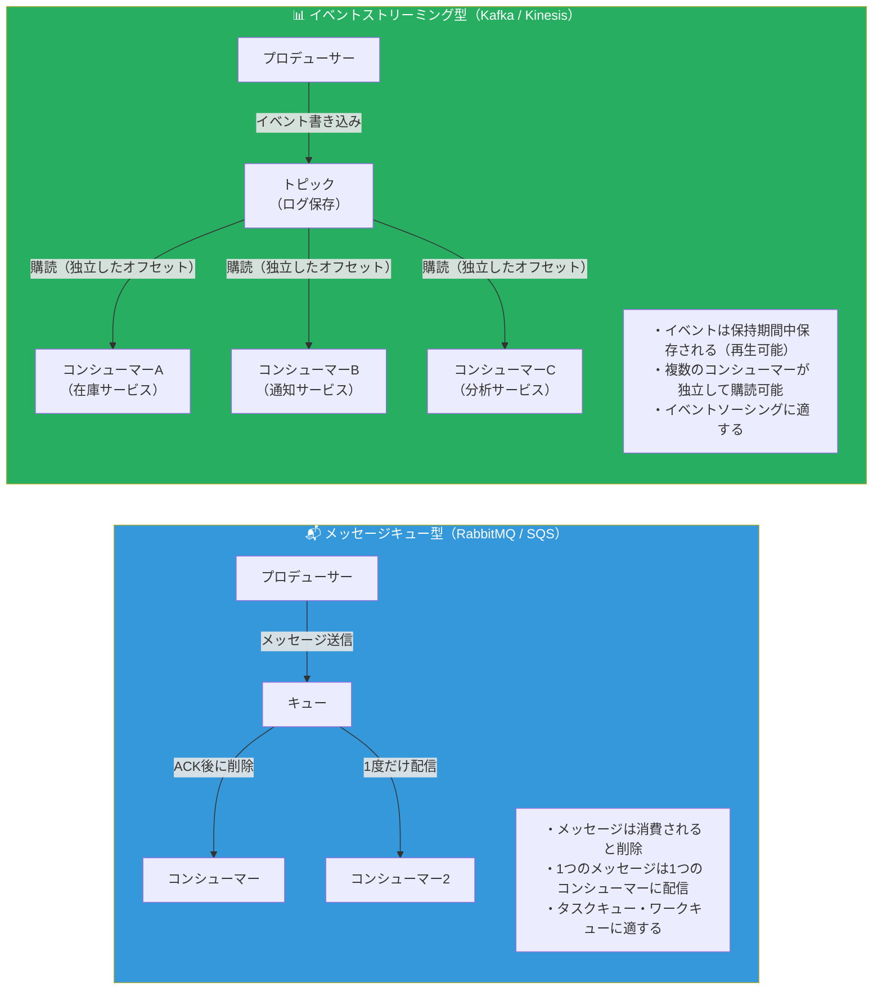
```mermaid
graph LR
    subgraph QUEUE["📬 メッセージキュー型（RabbitMQ / SQS）"]
        QP["プロデューサー"] -->|"メッセージ送信"| QQ["キュー"]
        QQ -->|"ACK後に削除"| QC["コンシューマー"]
        QQ -->|"1度だけ配信"| QC2["コンシューマー2"]
        NOTE_Q["・メッセージは消費されると削除<br>・1つのメッセージは1つのコンシューマーに配信<br>・タスクキュー・ワークキューに適する"]
    end

    subgraph STREAM["📊 イベントストリーミング型（Kafka / Kinesis）"]
        SP["プロデューサー"] -->|"イベント書き込み"| ST["トピック<br>（ログ保存）"]
        ST -->|"購読（独立したオフセット）"| SC1["コンシューマーA<br>（在庫サービス）"]
        ST -->|"購読（独立したオフセット）"| SC2["コンシューマーB<br>（通知サービス）"]
        ST -->|"購読（独立したオフセット）"| SC3["コンシューマーC<br>（分析サービス）"]
        NOTE_S["・イベントは保持期間中保存される（再生可能）<br>・複数のコンシューマーが独立して購読可能<br>・イベントソーシングに適する"]
    end

    style QUEUE fill:#3498db,color:#fff
    style STREAM fill:#27ae60,color:#fff
```

---

## 5. EDAのトポロジーパターン

### 5.1 仲介者トポロジー（Mediator Topology）

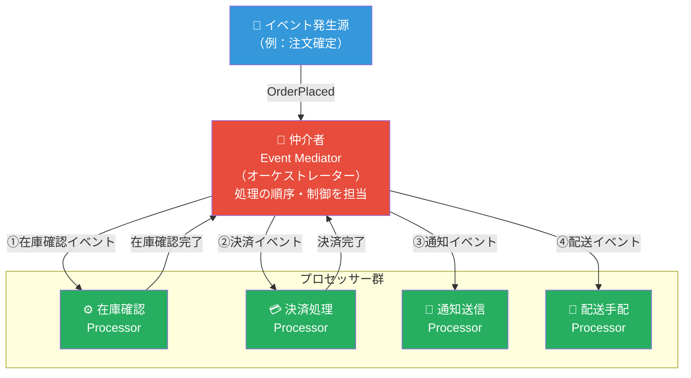
```mermaid
graph TD
    INITIATOR["🚀 イベント発生源<br>（例：注文確定）"]

    MEDIATOR["🎯 仲介者<br>Event Mediator<br>（オーケストレーター）<br>処理の順序・制御を担当"]

    subgraph "プロセッサー群"
        P1["⚙️ 在庫確認<br>Processor"]
        P2["💳 決済処理<br>Processor"]
        P3["📧 通知送信<br>Processor"]
        P4["🚚 配送手配<br>Processor"]
    end

    INITIATOR -->|"OrderPlaced"| MEDIATOR
    MEDIATOR -->|"①在庫確認イベント"| P1
    P1 -->|"在庫確認完了"| MEDIATOR
    MEDIATOR -->|"②決済イベント"| P2
    P2 -->|"決済完了"| MEDIATOR
    MEDIATOR -->|"③通知イベント"| P3
    MEDIATOR -->|"④配送イベント"| P4

    style MEDIATOR fill:#e74c3c,color:#fff
    style INITIATOR fill:#3498db,color:#fff
    style P1 fill:#27ae60,color:#fff
    style P2 fill:#27ae60,color:#fff
    style P3 fill:#27ae60,color:#fff
    style P4 fill:#27ae60,color:#fff
```

### 5.2 ブローカートポロジー（Broker Topology）

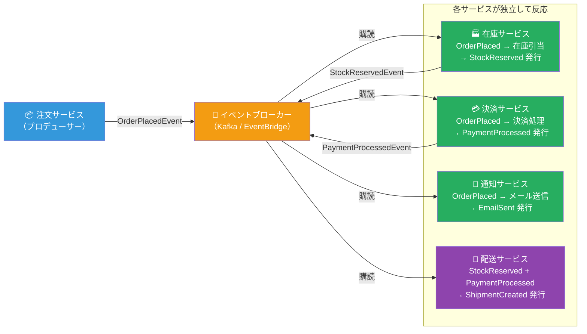
```mermaid
graph LR
    ORDER_SVC["📦 注文サービス<br>（プロデューサー）"]

    BROKER["🔀 イベントブローカー<br>（Kafka / EventBridge）"]

    subgraph "各サービスが独立して反応"
        STOCK["🏭 在庫サービス<br>OrderPlaced → 在庫引当<br>→ StockReserved 発行"]
        PAYMENT["💳 決済サービス<br>OrderPlaced → 決済処理<br>→ PaymentProcessed 発行"]
        NOTIFY["📧 通知サービス<br>OrderPlaced → メール送信<br>→ EmailSent 発行"]
        SHIP["🚚 配送サービス<br>StockReserved + PaymentProcessed<br>→ ShipmentCreated 発行"]
    end

    ORDER_SVC -->|"OrderPlacedEvent"| BROKER
    BROKER -->|"購読"| STOCK
    BROKER -->|"購読"| PAYMENT
    BROKER -->|"購読"| NOTIFY
    STOCK -->|"StockReservedEvent"| BROKER
    PAYMENT -->|"PaymentProcessedEvent"| BROKER
    BROKER -->|"購読"| SHIP

    style ORDER_SVC fill:#3498db,color:#fff
    style BROKER fill:#f39c12,color:#fff
    style STOCK fill:#27ae60,color:#fff
    style PAYMENT fill:#27ae60,color:#fff
    style NOTIFY fill:#27ae60,color:#fff
    style SHIP fill:#8e44ad,color:#fff
```

### 5.3 仲介者 vs ブローカーの使い分け

| 観点 | 仲介者トポロジー | ブローカートポロジー |
|------|-------------|----------------|
| **処理の制御** | 中央集権的・順序制御可能 | 分散・各サービスが自律 |
| **結合度** | 仲介者への依存あり | 完全疎結合 |
| **エラーハンドリング** | 仲介者で一元管理 | 各サービスが個別に対応 |
| **可視性** | フロー全体が見えやすい | 追跡が複雑になりやすい |
| **適用場面** | 複雑なワークフロー・承認フロー | 独立したリアクション処理 |
| **代表ツール** | AWS Step Functions, Temporal | Apache Kafka, EventBridge |

### 5.4 Sagaパターン（分散トランザクション）

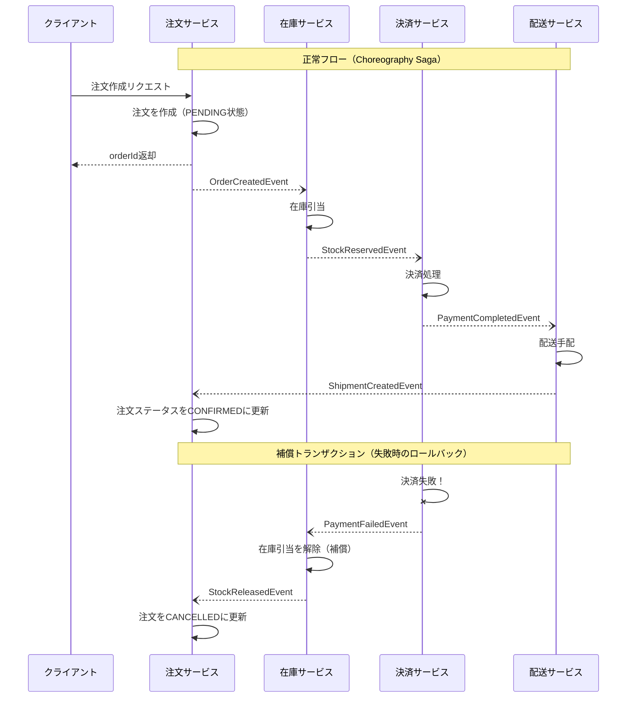
```mermaid
sequenceDiagram
    participant CLIENT as クライアント
    participant ORDER as 注文サービス
    participant STOCK as 在庫サービス
    participant PAYMENT as 決済サービス
    participant SHIP as 配送サービス

    Note over ORDER,SHIP: 正常フロー（Choreography Saga）

    CLIENT->>ORDER: 注文作成リクエスト
    ORDER->>ORDER: 注文を作成（PENDING状態）
    ORDER-->>CLIENT: orderId返却
    ORDER--)STOCK: OrderCreatedEvent

    STOCK->>STOCK: 在庫引当
    STOCK--)PAYMENT: StockReservedEvent

    PAYMENT->>PAYMENT: 決済処理
    PAYMENT--)SHIP: PaymentCompletedEvent

    SHIP->>SHIP: 配送手配
    SHIP--)ORDER: ShipmentCreatedEvent

    ORDER->>ORDER: 注文ステータスをCONFIRMEDに更新

    Note over ORDER,SHIP: 補償トランザクション（失敗時のロールバック）

    PAYMENT-xPAYMENT: 決済失敗！
    PAYMENT--)STOCK: PaymentFailedEvent
    STOCK->>STOCK: 在庫引当を解除（補償）
    STOCK--)ORDER: StockReleasedEvent
    ORDER->>ORDER: 注文をCANCELLEDに更新
```

---

## 6. Apache Kafka 完全解説

### 6.1 Kafkaのアーキテクチャ概観

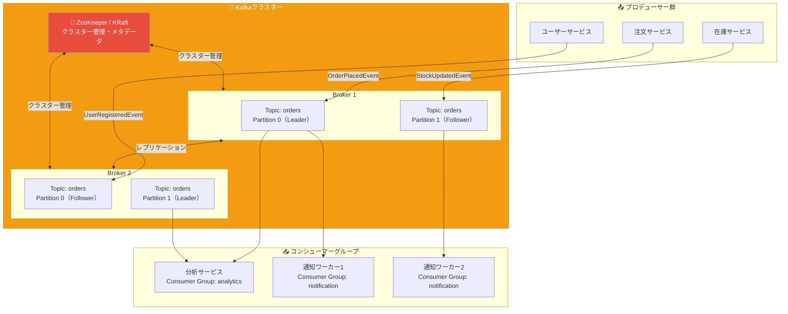
```mermaid
graph TD
    subgraph PRODUCERS["📤 プロデューサー群"]
        P1["注文サービス"]
        P2["在庫サービス"]
        P3["ユーザーサービス"]
    end

    subgraph KAFKA_CLUSTER["🔶 Kafkaクラスター"]
        subgraph BROKER1["Broker 1"]
            T1_P0["Topic: orders<br>Partition 0（Leader）"]
            T1_P1["Topic: orders<br>Partition 1（Follower）"]
        end
        subgraph BROKER2["Broker 2"]
            T2_P0["Topic: orders<br>Partition 0（Follower）"]
            T2_P1["Topic: orders<br>Partition 1（Leader）"]
        end
        ZK["🦁 ZooKeeper / KRaft<br>クラスター管理・メタデータ"]
    end

    subgraph CONSUMERS["📥 コンシューマーグループ"]
        CG1["分析サービス<br>Consumer Group: analytics"]
        CG2_1["通知ワーカー1<br>Consumer Group: notification"]
        CG2_2["通知ワーカー2<br>Consumer Group: notification"]
    end

    P1 -->|"OrderPlacedEvent"| T1_P0
    P2 -->|"StockUpdatedEvent"| T1_P1
    P3 -->|"UserRegisteredEvent"| T2_P0

    T1_P0 --> CG1
    T2_P1 --> CG1
    T1_P0 --> CG2_1
    T1_P1 --> CG2_2

    BROKER1 <-->|"レプリケーション"| BROKER2
    ZK <-->|"クラスター管理"| BROKER1
    ZK <-->|"クラスター管理"| BROKER2

    style KAFKA_CLUSTER fill:#f39c12,color:#fff
    style ZK fill:#e74c3c,color:#fff
```

### 6.2 Kafkaの主要概念

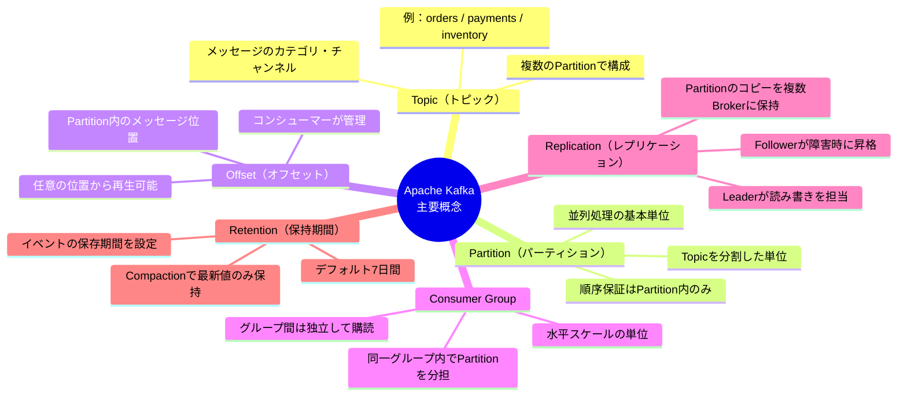
```mermaid
mindmap
    root((Apache Kafka<br>主要概念))
        Topic（トピック）
            メッセージのカテゴリ・チャンネル
            例：orders / payments / inventory
            複数のPartitionで構成
        Partition（パーティション）
            Topicを分割した単位
            並列処理の基本単位
            順序保証はPartition内のみ
        Offset（オフセット）
            Partition内のメッセージ位置
            コンシューマーが管理
            任意の位置から再生可能
        Consumer Group
            同一グループ内でPartitionを分担
            グループ間は独立して購読
            水平スケールの単位
        Replication（レプリケーション）
            Partitionのコピーを複数Brokerに保持
            Leaderが読み書きを担当
            Followerが障害時に昇格
        Retention（保持期間）
            イベントの保存期間を設定
            デフォルト7日間
            Compactionで最新値のみ保持
```

### 6.3 Kafkaの実装例（Python - kafka-python）

```python
from kafka import KafkaProducer, KafkaConsumer
from kafka.errors import KafkaError
from uuid import uuid4
from datetime import datetime, timezone
import json
import logging

logger = logging.getLogger(__name__)


# ─────────── プロデューサーの実装 ───────────

class OrderEventProducer:
    """注文イベントのプロデューサー"""

    def __init__(self, bootstrap_servers: list[str]):
        self._producer = KafkaProducer(
            bootstrap_servers=bootstrap_servers,
            # JSONシリアライザ
            value_serializer=lambda v: json.dumps(v, ensure_ascii=False).encode("utf-8"),
            key_serializer=lambda k: k.encode("utf-8") if k else None,
            # 信頼性設定
            acks="all",           # すべてのレプリカへの書き込み確認を待つ
            retries=3,            # 失敗時のリトライ回数
            retry_backoff_ms=100, # リトライ間隔
            # パフォーマンス設定
            batch_size=16384,     # バッチサイズ（16KB）
            linger_ms=10,         # バッチ待機時間（10ms）
            compression_type="gzip",  # 圧縮
        )
        self._topic = "orders"

    def publish_order_placed(self, order: dict) -> None:
        """注文確定イベントを発行する"""
        event = {
            "event_type": "order.placed",
            "event_id": str(uuid4()),
            "occurred_at": datetime.now(timezone.utc).isoformat(),
            "version": "1.0",
            "order_id": order["id"],
            "customer_id": order["customer_id"],
            "total_amount": order["total_amount"],
            "currency": order["currency"],
            "items": order["items"],
        }

        try:
            # order_idをキーにすることで同じ注文のイベントが
            # 同じパーティションに送られ、順序が保証される
            future = self._producer.send(
                topic=self._topic,
                key=order["id"],
                value=event,
            )
            # 送信結果を確認（同期待機）
            record_metadata = future.get(timeout=10)
            logger.info(
                f"イベント発行成功: topic={record_metadata.topic}, "
                f"partition={record_metadata.partition}, "
                f"offset={record_metadata.offset}"
            )
        except KafkaError as e:
            logger.error(f"イベント発行失敗: {e}")
            raise

    def close(self) -> None:
        self._producer.flush()
        self._producer.close()


# ─────────── コンシューマーの実装 ───────────

class InventoryEventConsumer:
    """在庫サービスのイベントコンシューマー"""

    def __init__(self, bootstrap_servers: list[str]):
        self._consumer = KafkaConsumer(
            "orders",  # 購読するトピック
            bootstrap_servers=bootstrap_servers,
            group_id="inventory-service",  # コンシューマーグループID
            # JSONデシリアライザ
            value_deserializer=lambda v: json.loads(v.decode("utf-8")),
            # オフセット管理
            auto_offset_reset="earliest",  # 最初から読む
            enable_auto_commit=False,       # 手動コミット（確実な処理のため）
            # パフォーマンス設定
            max_poll_records=100,           # 1回のポーリングで最大100件
            session_timeout_ms=30000,       # セッションタイムアウト
        )

    def start(self) -> None:
        """イベントの受信を開始する"""
        logger.info("在庫サービス：イベント受信開始")
        try:
            for message in self._consumer:
                try:
                    self._process_event(message.value)
                    # 処理成功後にオフセットをコミット（べき等性の確保）
                    self._consumer.commit()
                except Exception as e:
                    logger.error(f"イベント処理エラー: {e}")
                    # Dead Letter Queueへ送信する処理
                    self._send_to_dlq(message.value, str(e))
        finally:
            self._consumer.close()

    def _process_event(self, event: dict) -> None:
        """イベントを処理する（べき等性を保証）"""
        event_type = event.get("event_type")

        if event_type == "order.placed":
            order_id = event["order_id"]
            # べき等性チェック：同じイベントを2度処理しない
            if self._already_processed(event["event_id"]):
                logger.info(f"重複イベントをスキップ: {event['event_id']}")
                return
            self._reserve_stock(order_id, event["items"])
            self._mark_as_processed(event["event_id"])
        else:
            logger.debug(f"未対応のイベントタイプ: {event_type}")

    def _already_processed(self, event_id: str) -> bool:
        """処理済みイベントかチェック（Redisなどで管理）"""
        # 実際の実装ではRedis等で処理済みIDを管理する
        return False

    def _reserve_stock(self, order_id: str, items: list) -> None:
        """在庫を引き当てる"""
        for item in items:
            logger.info(f"在庫引当: {item['product_id']} x {item['quantity']}")

    def _mark_as_processed(self, event_id: str) -> None:
        """処理済みとしてマーク"""
        pass

    def _send_to_dlq(self, event: dict, error: str) -> None:
        """Dead Letter Queueへ送信"""
        logger.error(f"DLQへ送信: {event}, エラー: {error}")
```

### 6.4 Kafkaのパーティション戦略

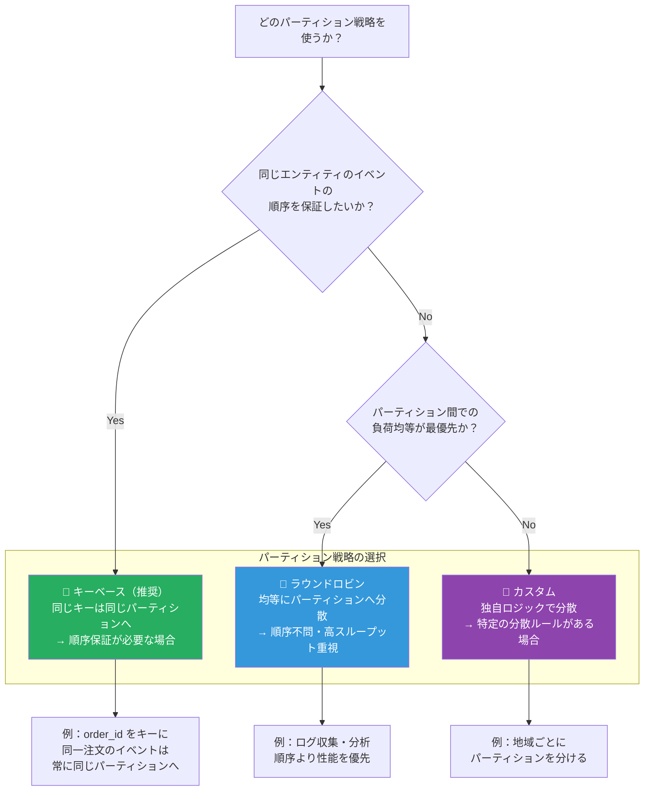
```mermaid
graph TD
    subgraph "パーティション戦略の選択"
        S1["🎯 キーベース（推奨）<br>同じキーは同じパーティションへ<br>→ 順序保証が必要な場合"]
        S2["🔄 ラウンドロビン<br>均等にパーティションへ分散<br>→ 順序不問・高スループット重視"]
        S3["🔧 カスタム<br>独自ロジックで分散<br>→ 特定の分散ルールがある場合"]
    end

    CHOOSE["どのパーティション戦略を使うか？"]

    CHOOSE --> Q1{"同じエンティティのイベントの<br>順序を保証したいか？"}
    Q1 -->|"Yes"| S1
    Q1 -->|"No"| Q2{"パーティション間での<br>負荷均等が最優先か？"}
    Q2 -->|"Yes"| S2
    Q2 -->|"No"| S3

    S1 --> EX1["例：order_id をキーに<br>同一注文のイベントは<br>常に同じパーティションへ"]
    S2 --> EX2["例：ログ収集・分析<br>順序より性能を優先"]
    S3 --> EX3["例：地域ごとに<br>パーティションを分ける"]

    style S1 fill:#27ae60,color:#fff
    style S2 fill:#3498db,color:#fff
    style S3 fill:#8e44ad,color:#fff
```

---

## 7. AWS EventBridge 完全解説

### 7.1 EventBridgeのアーキテクチャ

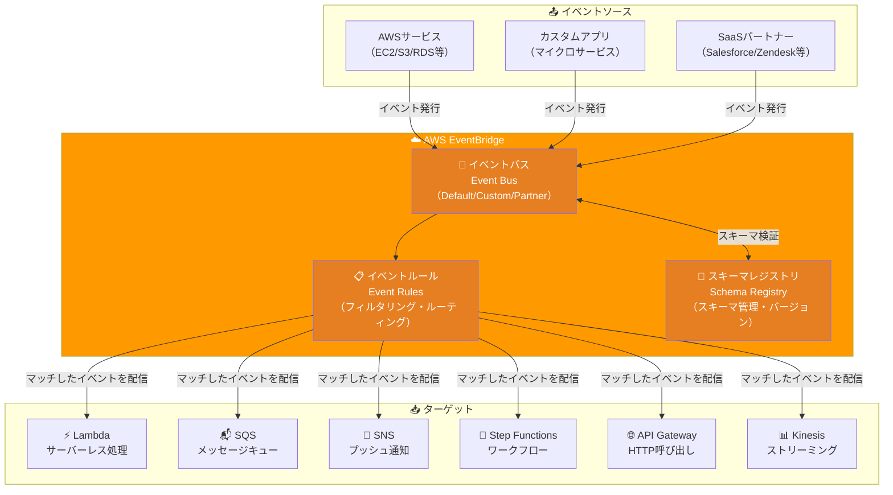
```mermaid
graph TD
    subgraph SOURCES["📤 イベントソース"]
        AWS_SVC["AWSサービス<br>（EC2/S3/RDS等）"]
        CUSTOM_APP["カスタムアプリ<br>（マイクロサービス）"]
        SAAS["SaaSパートナー<br>（Salesforce/Zendesk等）"]
    end

    subgraph EB["☁️ AWS EventBridge"]
        BUS["🚌 イベントバス<br>Event Bus<br>（Default/Custom/Partner）"]
        RULES["📋 イベントルール<br>Event Rules<br>（フィルタリング・ルーティング）"]
        SCHEMA["📐 スキーマレジストリ<br>Schema Registry<br>（スキーマ管理・バージョン）"]
    end

    subgraph TARGETS["📥 ターゲット"]
        LAMBDA["⚡ Lambda<br>サーバーレス処理"]
        SQS2["📬 SQS<br>メッセージキュー"]
        SNS["📣 SNS<br>プッシュ通知"]
        STEP["🔄 Step Functions<br>ワークフロー"]
        API_GW["🌐 API Gateway<br>HTTP呼び出し"]
        KINESIS2["📊 Kinesis<br>ストリーミング"]
    end

    AWS_SVC -->|"イベント発行"| BUS
    CUSTOM_APP -->|"イベント発行"| BUS
    SAAS -->|"イベント発行"| BUS

    BUS --> RULES
    RULES -->|"マッチしたイベントを配信"| LAMBDA
    RULES -->|"マッチしたイベントを配信"| SQS2
    RULES -->|"マッチしたイベントを配信"| SNS
    RULES -->|"マッチしたイベントを配信"| STEP
    RULES -->|"マッチしたイベントを配信"| API_GW
    RULES -->|"マッチしたイベントを配信"| KINESIS2

    BUS <-->|"スキーマ検証"| SCHEMA

    style EB fill:#ff9900,color:#fff
    style BUS fill:#e67e22,color:#fff
    style RULES fill:#e67e22,color:#fff
    style SCHEMA fill:#e67e22,color:#fff
```

### 7.2 EventBridgeルールの設定例（Terraform）

```hcl
# カスタムイベントバスの作成
resource "aws_cloudwatch_event_bus" "orders" {
  name = "orders-event-bus"
}

# 注文確定イベントをLambdaにルーティングするルール
resource "aws_cloudwatch_event_rule" "order_placed_to_inventory" {
  name           = "order-placed-to-inventory"
  event_bus_name = aws_cloudwatch_event_bus.orders.name
  description    = "注文確定イベントを在庫サービスLambdaにルーティング"

  # イベントパターン：特定のイベントタイプのみマッチ
  event_pattern = jsonencode({
    source      = ["com.myapp.order-service"]
    detail-type = ["OrderPlaced"]
    detail = {
      # 金額が1000円以上の注文のみ（フィルタリング）
      total_amount = [{
        numeric = [">=", 1000]
      }]
    }
  })
}

# ターゲット（Lambda関数）の設定
resource "aws_cloudwatch_event_target" "inventory_lambda" {
  rule           = aws_cloudwatch_event_rule.order_placed_to_inventory.name
  event_bus_name = aws_cloudwatch_event_bus.orders.name
  target_id      = "InventoryServiceLambda"
  arn            = aws_lambda_function.inventory_service.arn

  # 失敗時のDead Letter Queue設定
  dead_letter_config {
    arn = aws_sqs_queue.event_dlq.arn
  }

  # リトライポリシー
  retry_policy {
    maximum_event_age_in_seconds = 3600  # 最大1時間リトライ
    maximum_retry_attempts       = 3     # 最大3回リトライ
  }
}
```

---

## 8. イベントソーシング（Event Sourcing）

### 8.1 イベントソーシングとは

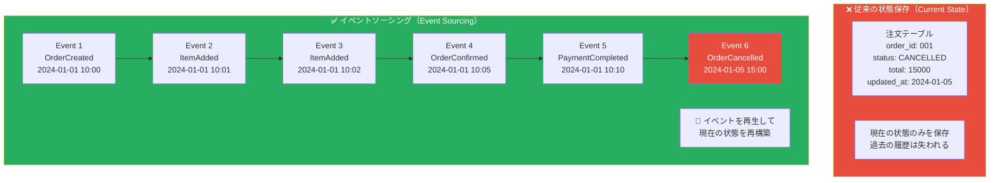
```mermaid
graph TD
    subgraph TRADITIONAL["❌ 従来の状態保存（Current State）"]
        T_ORDER["注文テーブル<br>order_id: 001<br>status: CANCELLED<br>total: 15000<br>updated_at: 2024-01-05"]
        T_NOTE["現在の状態のみを保存<br>過去の履歴は失われる"]
    end

    subgraph ES["✅ イベントソーシング（Event Sourcing）"]
        E1["Event 1<br>OrderCreated<br>2024-01-01 10:00"]
        E2["Event 2<br>ItemAdded<br>2024-01-01 10:01"]
        E3["Event 3<br>ItemAdded<br>2024-01-01 10:02"]
        E4["Event 4<br>OrderConfirmed<br>2024-01-01 10:05"]
        E5["Event 5<br>PaymentCompleted<br>2024-01-01 10:10"]
        E6["Event 6<br>OrderCancelled<br>2024-01-05 15:00"]

        E1 --> E2 --> E3 --> E4 --> E5 --> E6

        REBUILD["🔄 イベントを再生して<br>現在の状態を再構築"]
    end

    style TRADITIONAL fill:#e74c3c,color:#fff
    style ES fill:#27ae60,color:#fff
    style E6 fill:#e74c3c,color:#fff
```

### 8.2 イベントストアの実装例（Python）

```python
from dataclasses import dataclass, field
from datetime import datetime, timezone
from typing import Any
from uuid import uuid4
import json


@dataclass
class StoredEvent:
    """イベントストアに保存されるイベント"""
    event_id: str
    aggregate_id: str       # 集約のID（例：注文ID）
    aggregate_type: str     # 集約の種類（例：Order）
    event_type: str         # イベントの種類（例：OrderPlaced）
    event_data: dict        # イベントのペイロード
    event_version: int      # 集約の楽観的ロック用バージョン
    occurred_at: datetime


class OrderAggregate:
    """
    イベントソーシングによる注文集約
    - 状態変更はイベントを通じてのみ行う
    - 現在の状態はイベントの再生から導出する
    """

    def __init__(self, order_id: str):
        self._id = order_id
        self._status = "INITIAL"
        self._items = []
        self._total = 0
        self._version = 0
        self._uncommitted_events: list[dict] = []

    # ─── コマンドハンドラー（ビジネスロジック）───

    def create(self, customer_id: str) -> None:
        """注文を作成する"""
        if self._status != "INITIAL":
            raise ValueError("すでに作成済みです")
        self._apply_and_record({
            "event_type": "OrderCreated",
            "customer_id": customer_id,
        })

    def add_item(self, product_id: str, name: str, price: float, qty: int) -> None:
        """商品を追加する"""
        if self._status != "PENDING":
            raise ValueError("PENDING状態でのみ商品を追加できます")
        self._apply_and_record({
            "event_type": "ItemAdded",
            "product_id": product_id,
            "name": name,
            "price": price,
            "quantity": qty,
        })

    def confirm(self) -> None:
        """注文を確定する"""
        if self._status != "PENDING":
            raise ValueError("PENDING状態の注文のみ確定できます")
        if not self._items:
            raise ValueError("商品が1件もありません")
        self._apply_and_record({"event_type": "OrderConfirmed"})

    def cancel(self, reason: str) -> None:
        """注文をキャンセルする"""
        if self._status in ("SHIPPED", "DELIVERED"):
            raise ValueError("発送済みはキャンセルできません")
        self._apply_and_record({
            "event_type": "OrderCancelled",
            "reason": reason,
        })

    # ─── イベントアプライヤー（状態の更新）───

    def _apply_event(self, event: dict) -> None:
        """イベントを適用して状態を更新する"""
        event_type = event["event_type"]
        if event_type == "OrderCreated":
            self._status = "PENDING"
        elif event_type == "ItemAdded":
            self._items.append({
                "product_id": event["product_id"],
                "name": event["name"],
                "price": event["price"],
                "quantity": event["quantity"],
            })
            self._total += event["price"] * event["quantity"]
        elif event_type == "OrderConfirmed":
            self._status = "CONFIRMED"
        elif event_type == "OrderCancelled":
            self._status = "CANCELLED"
        self._version += 1

    def _apply_and_record(self, event_data: dict) -> None:
        """イベントを適用してアンコミットイベントに記録する"""
        self._apply_event(event_data)
        self._uncommitted_events.append(event_data)

    @classmethod
    def rebuild_from_events(cls, order_id: str, events: list[dict]) -> "OrderAggregate":
        """保存されたイベントから集約を再構築する"""
        aggregate = cls(order_id)
        for event in events:
            aggregate._apply_event(event)
        return aggregate

    def get_uncommitted_events(self) -> list[dict]:
        return list(self._uncommitted_events)

    def mark_events_as_committed(self) -> None:
        self._uncommitted_events.clear()

    @property
    def id(self) -> str:
        return self._id

    @property
    def status(self) -> str:
        return self._status

    @property
    def version(self) -> int:
        return self._version
```

### 8.3 イベントソーシングのスナップショット戦略

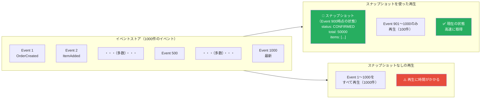
```mermaid
flowchart LR
    subgraph EVENTS["イベントストア（1000件のイベント）"]
        EV1["Event 1<br>OrderCreated"]
        EV2["Event 2<br>ItemAdded"]
        DOTS1["・・・（多数）・・・"]
        EV500["Event 500"]
        DOTS2["・・・（多数）・・・"]
        EV1000["Event 1000<br>最新"]
    end

    subgraph WITH_SNAPSHOT["スナップショットを使った再生"]
        SNAP["📸 スナップショット<br>（Event 900時点の状態）<br>status: CONFIRMED<br>total: 50000<br>items: [...]"]
        RECENT["Event 901〜1000のみ<br>再生（100件）"]
        CURRENT["✅ 現在の状態<br>高速に取得"]
    end

    subgraph WITHOUT_SNAPSHOT["スナップショットなしの再生"]
        ALL_EV["Event 1〜1000を<br>すべて再生（1000件）"]
        SLOW["⚠️ 再生に時間がかかる"]
    end

    EVENTS --> WITH_SNAPSHOT
    EVENTS --> WITHOUT_SNAPSHOT

    style SNAP fill:#27ae60,color:#fff
    style CURRENT fill:#27ae60,color:#fff
    style SLOW fill:#e74c3c,color:#fff
```

---

## 9. CQRS（Command Query Responsibility Segregation）

### 9.1 CQRSとは

```mermaid
graph LR
    subgraph TRADITIONAL_DB["❌ 従来の単一モデル"]
        APP["アプリケーション"] -->|"読み書き混在"| DB["単一DB<br>（正規化された設計）"]
        DB -->|"複雑なJOINで<br>パフォーマンス低下"| APP
    end

    subgraph CQRS_PATTERN["✅ CQRS（コマンドと読み取りを分離）"]
        CMD_SIDE["✍️ コマンドサイド<br>Command Side<br>（書き込み・状態変更）"]
        QUERY_SIDE["📖 クエリサイド<br>Query Side<br>（読み取り・参照）"]

        CMD_DB["書き込みDB<br>（正規化・整合性重視）"]
        QUERY_DB["読み取りDB<br>（非正規化・検索最適化）"]

        SYNC["🔄 同期メカニズム<br>（イベント駆動で同期）"]

        CMD_SIDE --> CMD_DB
        CMD_DB --> SYNC
        SYNC -->|"読み取り最適化モデルを更新"| QUERY_DB
        QUERY_DB --> QUERY_SIDE
    end

    style TRADITIONAL_DB fill:#fde8e8
    style CQRS_PATTERN fill:#e8fde8
    style CMD_SIDE fill:#3498db,color:#fff
    style QUERY_SIDE fill:#27ae60,color:#fff
    style SYNC fill:#f39c12,color:#fff
```

### 9.2 EDA + CQRS + Event Sourcing の組み合わせ

```mermaid
flowchart TD
    subgraph WRITE["✍️ 書き込みサイド（Command）"]
        CMD["コマンド<br>CreateOrder / CancelOrder"]
        AGG["集約<br>OrderAggregate"]
        ES_STORE["イベントストア<br>（Event Sourcing）"]
        EV_PUBLISH["イベント発行<br>OrderPlacedEvent"]

        CMD --> AGG
        AGG -->|"イベント永続化"| ES_STORE
        AGG -->|"イベント発行"| EV_PUBLISH
    end

    subgraph EVENT_BUS_BOX["🔀 イベントバス（Kafka）"]
        BUS_NODE["イベントバス"]
    end

    subgraph READ["📖 読み取りサイド（Query）"]
        PROJ1["プロジェクション1<br>注文サマリービュー<br>（PostgreSQL）"]
        PROJ2["プロジェクション2<br>顧客注文履歴<br>（Elasticsearch）"]
        PROJ3["プロジェクション3<br>売上分析ダッシュボード<br>（Redis）"]

        QUERY_API["クエリAPI<br>GET /orders/{id}<br>GET /customers/{id}/orders"]
    end

    EV_PUBLISH --> EVENT_BUS_BOX
    EVENT_BUS_BOX --> PROJ1
    EVENT_BUS_BOX --> PROJ2
    EVENT_BUS_BOX --> PROJ3
    PROJ1 --> QUERY_API
    PROJ2 --> QUERY_API
    PROJ3 --> QUERY_API

    style WRITE fill:#3498db,color:#fff
    style EVENT_BUS_BOX fill:#f39c12,color:#fff
    style READ fill:#27ae60,color:#fff
```

---

## 10. EDAのエラーハンドリングと信頼性設計

### 10.1 信頼性設計の全体像

```mermaid
graph TD
    subgraph RELIABILITY["🛡️ EDA信頼性設計の要素"]
        AT_LEAST_ONCE["At-Least-Once Delivery<br>少なくとも1回は配信する<br>→ 重複処理の可能性あり"]
        AT_MOST_ONCE["At-Most-Once Delivery<br>最大1回だけ配信する<br>→ メッセージロストの可能性あり"]
        EXACTLY_ONCE["Exactly-Once Delivery<br>正確に1回だけ配信する<br>→ 実装コストが高い"]
    end

    AT_LEAST_ONCE -->|"べき等性（Idempotency）で対処"| IDEMPOTENT["✅ べき等なコンシューマー<br>重複処理しても結果が変わらない設計"]
    EXACTLY_ONCE -->|"KafkaのExactly-Once Semantics"| EOS["✅ Kafka EOS<br>トランザクション対応"]

    style AT_LEAST_ONCE fill:#f39c12,color:#fff
    style AT_MOST_ONCE fill:#e74c3c,color:#fff
    style EXACTLY_ONCE fill:#27ae60,color:#fff
    style IDEMPOTENT fill:#27ae60,color:#fff
    style EOS fill:#27ae60,color:#fff
```

### 10.2 Dead Letter Queue（DLQ）パターン

```mermaid
flowchart LR
    PRODUCER2["📤 プロデューサー"]
    MAIN_QUEUE["📬 メインキュー<br>（Main Queue）"]
    CONSUMER2["📥 コンシューマー"]
    DLQ["💀 Dead Letter Queue<br>（DLQ）<br>処理失敗メッセージを格納"]
    ALERT["🔔 アラート<br>（CloudWatch / PagerDuty）"]
    DLQHANDLER["🔧 DLQハンドラー<br>手動確認・リトライ・<br>デバッグ・破棄"]

    PRODUCER2 -->|"メッセージ発行"| MAIN_QUEUE
    MAIN_QUEUE -->|"配信"| CONSUMER2
    CONSUMER2 -->|"処理成功 → ACK"| MAIN_QUEUE
    CONSUMER2 -->|"処理失敗（3回リトライ後）"| DLQ
    DLQ --> ALERT
    DLQ --> DLQHANDLER
    DLQHANDLER -->|"修正後に再投入"| MAIN_QUEUE

    style DLQ fill:#e74c3c,color:#fff
    style ALERT fill:#f39c12,color:#fff
    style DLQHANDLER fill:#3498db,color:#fff
```

### 10.3 サーキットブレーカーパターン

```mermaid
stateDiagram-v2
    [*] --> CLOSED: 初期状態

    CLOSED --> CLOSED: 処理成功
    CLOSED --> OPEN: 失敗率がしきい値超過\n（例：5秒間に50%失敗）

    OPEN --> OPEN: すべてのリクエストを即拒否\n（フォールバックを返す）
    OPEN --> HALF_OPEN: タイムアウト後\n（例：30秒経過）

    HALF_OPEN --> CLOSED: テストリクエストが成功\n（サービス回復）
    HALF_OPEN --> OPEN: テストリクエストが失敗\n（まだ回復していない）
```

### 10.4 リトライ戦略の実装例（Python）

```python
import time
import random
from typing import Callable, Any
from functools import wraps
import logging

logger = logging.getLogger(__name__)


def exponential_backoff_retry(
    max_retries: int = 3,
    base_delay: float = 1.0,
    max_delay: float = 60.0,
    jitter: bool = True,
    exceptions: tuple = (Exception,),
):
    """
    指数バックオフ + ジッターによるリトライデコレーター
    
    ジッター（ランダム要素）を加えることで、
    複数のコンシューマーが同時にリトライして
    サービスに負荷が集中する「Thundering Herd問題」を防ぐ
    """
    def decorator(func: Callable) -> Callable:
        @wraps(func)
        def wrapper(*args, **kwargs) -> Any:
            last_exception = None
            for attempt in range(max_retries + 1):
                try:
                    return func(*args, **kwargs)
                except exceptions as e:
                    last_exception = e
                    if attempt == max_retries:
                        logger.error(
                            f"最大リトライ回数に達しました: {func.__name__}, "
                            f"エラー: {e}"
                        )
                        raise

                    # 指数バックオフ: 1s, 2s, 4s, 8s...
                    delay = min(base_delay * (2 ** attempt), max_delay)
                    if jitter:
                        # ジッター: ±50%のランダム要素を追加
                        delay = delay * (0.5 + random.random())

                    logger.warning(
                        f"リトライ {attempt + 1}/{max_retries}: "
                        f"{func.__name__}, {delay:.2f}秒後に再試行"
                    )
                    time.sleep(delay)
            raise last_exception
        return wrapper
    return decorator


# 使用例
@exponential_backoff_retry(max_retries=3, base_delay=1.0)
def process_order_event(event: dict) -> None:
    """注文イベントを処理する（自動リトライ付き）"""
    order_service.reserve_inventory(event["items"])
```

---

## 11. EDAのセキュリティ設計

### 11.1 EDAのセキュリティレイヤー

```mermaid
graph TD
    subgraph SECURITY["🔒 EDA セキュリティ設計"]
        AUTHN["🔑 認証（Authentication）<br>誰がイベントを発行しているか"]
        AUTHZ["🛡️ 認可（Authorization）<br>何のトピックに書き込み・読み取りできるか"]
        ENCRYPT["🔐 暗号化（Encryption）<br>転送中・保存中のデータを暗号化"]
        AUDIT["📋 監査ログ（Audit Log）<br>誰が何のイベントを送受信したか記録"]
        SCHEMA_VALID["✅ スキーマ検証<br>不正なイベントのインジェクションを防ぐ"]
    end

    AUTHN --> IMPL_AUTHN["・サービスアカウント<br>・mTLS（相互TLS）<br>・JWT/OAuth2トークン"]
    AUTHZ --> IMPL_AUTHZ["・KafkaのトピックレベルACL<br>・IAMロールポリシー（AWS）<br>・VPCネットワーク制限"]
    ENCRYPT --> IMPL_ENCRYPT["・TLS 1.2以上での転送暗号化<br>・AES-256での保存暗号化<br>・個人情報フィールドのフィールドレベル暗号化"]
    SCHEMA_VALID --> IMPL_SCHEMA["・Schema Registry（Confluent）<br>・JSON Schema Validation<br>・Avroスキーマ検証"]

    style AUTHN fill:#e74c3c,color:#fff
    style AUTHZ fill:#3498db,color:#fff
    style ENCRYPT fill:#27ae60,color:#fff
    style AUDIT fill:#f39c12,color:#fff
    style SCHEMA_VALID fill:#8e44ad,color:#fff
```

### 11.2 個人情報（PII）の取り扱いパターン

```mermaid
flowchart LR
    subgraph PUBLISH["発行時"]
        P_EVENT["元のイベント<br>customer_id: 12345<br>name: 山田太郎<br>email: yamada@example.com<br>credit_card: 4111-xxxx"]
        P_ENCRYPT["🔐 PIIを暗号化・マスク<br>customer_id: 12345<br>name: [ENCRYPTED:abc...xyz]<br>email: ya***@***.com<br>credit_card: [TOKENIZED:tok_xxx]"]
    end

    subgraph CONSUME["受信時"]
        C_AUTHORIZED["✅ 認可されたサービス<br>（決済サービス）<br>→ 復号化して使用"]
        C_UNAUTHORIZED["❌ 認可外のサービス<br>（分析サービス）<br>→ 暗号化されたまま使用"]
    end

    P_EVENT -->|"PIIマスキング処理"| P_ENCRYPT
    P_ENCRYPT -->|"イベントバスに発行"| C_AUTHORIZED
    P_ENCRYPT -->|"イベントバスに発行"| C_UNAUTHORIZED

    style P_ENCRYPT fill:#27ae60,color:#fff
    style C_AUTHORIZED fill:#27ae60,color:#fff
    style C_UNAUTHORIZED fill:#95a5a6,color:#fff
```

---

## 12. EDAの監視・オブザーバビリティ

### 12.1 EDAの可観測性の3本柱

```mermaid
graph TD
    OBS["🔭 オブザーバビリティ<br>（可観測性）"]

    OBS --> METRICS["📊 メトリクス<br>Metrics<br>数値で状態を把握"]
    OBS --> LOGS["📝 ログ<br>Logs<br>イベントの詳細記録"]
    OBS --> TRACES["🔗 トレース<br>Distributed Tracing<br>イベントの流れを追跡"]

    METRICS --> M1["イベント発行レート（件/秒）"]
    METRICS --> M2["コンシューマーラグ（遅延件数）"]
    METRICS --> M3["エラーレート（%）"]
    METRICS --> M4["DLQメッセージ数"]
    METRICS --> M5["処理レイテンシ（ms）"]

    LOGS --> L1["イベントID・タイプ・タイムスタンプ"]
    LOGS --> L2["処理成功・失敗のログ"]
    LOGS --> L3["スキーマ検証エラー"]

    TRACES --> T1["Correlation IDでイベント追跡"]
    TRACES --> T2["サービス間の処理フロー可視化"]
    TRACES --> T3["ボトルネックの特定"]

    style METRICS fill:#3498db,color:#fff
    style LOGS fill:#27ae60,color:#fff
    style TRACES fill:#8e44ad,color:#fff
```

### 12.2 Kafkaコンシューマーラグの監視

```mermaid
xychart-beta
    title "Kafkaコンシューマーラグの推移（健全な状態）"
    x-axis ["09:00", "09:10", "09:20", "09:30", "09:40", "09:50", "10:00"]
    y-axis "ラグ（未処理メッセージ数）" 0 --> 1000
    bar [50, 80, 120, 200, 350, 180, 60]
    line [100, 100, 100, 100, 100, 100, 100]
```

### 12.3 分散トレーシングのフロー

```mermaid
sequenceDiagram
    participant CLI as クライアント
    participant ORDER_API as 注文API
    participant KAFKA as Kafka
    participant STOCK_W as 在庫ワーカー
    participant PAY_W as 決済ワーカー
    participant JAEGER as Jaeger/Zipkin

    Note over CLI,JAEGER: Correlation ID: trace-abc-123 で全体を追跡

    CLI->>ORDER_API: POST /orders [trace-abc-123]
    ORDER_API->>JAEGER: Span: order-api-create [trace-abc-123]
    ORDER_API->>KAFKA: OrderPlacedEvent [trace-abc-123]
    KAFKA-->>ORDER_API: ack

    KAFKA->>STOCK_W: OrderPlacedEvent [trace-abc-123]
    STOCK_W->>JAEGER: Span: stock-worker-reserve [trace-abc-123]
    STOCK_W->>KAFKA: StockReservedEvent [trace-abc-123]

    KAFKA->>PAY_W: StockReservedEvent [trace-abc-123]
    PAY_W->>JAEGER: Span: payment-worker-process [trace-abc-123]

    Note over JAEGER: 全スパンを統合してトレース全体を可視化
```

---

## 13. EDA実践：ECサイト完全事例

### 13.1 システムアーキテクチャ全体図

```mermaid
graph TD
    subgraph FRONTEND["🖥️ フロントエンド"]
        WEB["Web App<br>（React）"]
        MOBILE["Mobile App<br>（iOS/Android）"]
    end

    subgraph API_LAYER["🌐 APIレイヤー"]
        AG["API Gateway<br>（認証・レート制限）"]
        ORDER_API2["注文API"]
        PRODUCT_API["商品API"]
        USER_API["ユーザーAPI"]
    end

    subgraph EVENT_LAYER["⚡ イベントレイヤー（Apache Kafka）"]
        T_ORDERS["Topic: orders<br>Partitions: 12"]
        T_PAYMENTS["Topic: payments<br>Partitions: 6"]
        T_INVENTORY["Topic: inventory<br>Partitions: 6"]
        T_NOTIFICATIONS["Topic: notifications<br>Partitions: 3"]
    end

    subgraph WORKERS["⚙️ イベントワーカー"]
        INV_W["在庫ワーカー<br>（Kubernetes）"]
        PAY_W2["決済ワーカー<br>（Kubernetes）"]
        NOTIF_W["通知ワーカー<br>（Lambda）"]
        SHIP_W["配送ワーカー<br>（Kubernetes）"]
        ANALYTICS_W["分析ワーカー<br>（Spark Streaming）"]
    end

    subgraph DATASTORES["🗄️ データストア"]
        ORDER_DB["注文DB<br>（PostgreSQL）"]
        INVENTORY_DB["在庫DB<br>（PostgreSQL）"]
        READ_DB["読み取りDB<br>（Elasticsearch）"]
        CACHE["キャッシュ<br>（Redis）"]
        DWH["データウェアハウス<br>（Snowflake）"]
    end

    WEB & MOBILE --> AG
    AG --> ORDER_API2 & PRODUCT_API & USER_API

    ORDER_API2 -->|"OrderPlacedEvent"| T_ORDERS
    T_ORDERS --> INV_W & PAY_W2 & NOTIF_W

    INV_W -->|"StockReservedEvent"| T_INVENTORY
    PAY_W2 -->|"PaymentCompletedEvent"| T_PAYMENTS
    T_PAYMENTS --> SHIP_W & NOTIF_W

    T_ORDERS & T_PAYMENTS & T_INVENTORY --> ANALYTICS_W

    INV_W --> INVENTORY_DB
    PAY_W2 --> ORDER_DB
    NOTIF_W --> T_NOTIFICATIONS
    ANALYTICS_W --> DWH

    ORDER_API2 & PRODUCT_API & USER_API --> READ_DB & CACHE

    style EVENT_LAYER fill:#f39c12,color:#fff
    style API_LAYER fill:#3498db,color:#fff
    style WORKERS fill:#27ae60,color:#fff
    style DATASTORES fill:#8e44ad,color:#fff
```

### 13.2 注文処理の完全なイベントフロー

```mermaid
sequenceDiagram
    participant USER as ユーザー
    participant ORDER_SVC as 注文サービス
    participant KAFKA2 as Kafka
    participant STOCK_SVC as 在庫サービス
    participant PAY_SVC as 決済サービス
    participant SHIP_SVC as 配送サービス
    participant NOTIF_SVC as 通知サービス

    USER->>ORDER_SVC: 注文確定ボタンをクリック
    ORDER_SVC->>ORDER_SVC: 注文を作成（PENDING）
    ORDER_SVC-->>USER: orderId返却（即座）

    ORDER_SVC--)KAFKA2: OrderPlacedEvent
    Note right of KAFKA2: 非同期処理開始

    par 並行処理
        KAFKA2--)STOCK_SVC: OrderPlacedEvent
        STOCK_SVC->>STOCK_SVC: 在庫確認・引当
        STOCK_SVC--)KAFKA2: StockReservedEvent

        KAFKA2--)NOTIF_SVC: OrderPlacedEvent
        NOTIF_SVC->>USER: 注文受付確認メール送信
    end

    KAFKA2--)PAY_SVC: StockReservedEvent
    PAY_SVC->>PAY_SVC: 決済処理
    PAY_SVC--)KAFKA2: PaymentCompletedEvent

    par 並行処理
        KAFKA2--)SHIP_SVC: PaymentCompletedEvent
        SHIP_SVC->>SHIP_SVC: 配送手配
        SHIP_SVC--)KAFKA2: ShipmentCreatedEvent

        KAFKA2--)NOTIF_SVC: PaymentCompletedEvent
        NOTIF_SVC->>USER: 決済完了・発送準備メール送信
    end

    KAFKA2--)ORDER_SVC: ShipmentCreatedEvent
    ORDER_SVC->>ORDER_SVC: 注文ステータスをSHIPPEDに更新
```

---

## 14. EDAのベストプラクティス総まとめ

### 14.1 イベント設計のベストプラクティス

| # | カテゴリ | ベストプラクティス | 理由 |
|---|---------|----------------|------|
| 1 | **命名** | 過去形・英語で命名（OrderPlaced） | イベントは「起きた事実」を表す |
| 2 | **ペイロード** | 自己完結型にする | 受信者がDBを参照しなくて済む |
| 3 | **スキーマ** | バージョン管理を必ずする | 後方互換性を保ちながら進化させる |
| 4 | **べき等性** | 同じイベントを2回処理しても同じ結果に | At-Least-Once配信に対応するため |
| 5 | **サイズ** | 1イベントは1MB以下を目安 | Kafkaのデフォルト上限・ネットワーク効率 |
| 6 | **メタデータ** | event_id・occurred_at・correlation_idを必ず付与 | トレーシング・デバッグに必須 |

### 14.2 運用のベストプラクティス

```mermaid
mindmap
    root((EDA<br>運用ベストプラクティス))
        信頼性
            DLQを必ず設定する
            リトライは指数バックオフ＋ジッター
            べき等なコンシューマーを実装する
            サーキットブレーカーを導入する
        スケーラビリティ
            パーティション数はコンシューマー数の倍
            コンシューマーグループで水平スケール
            ホットパーティションを避ける
        監視
            コンシューマーラグを常時監視
            DLQのメッセージ数にアラートを設定
            Correlation IDで全体を追跡
        セキュリティ
            TLS 1.2以上での暗号化
            最小権限のACLを設定
            PIIはフィールドレベルで暗号化
        スキーマ管理
            Schema Registryを導入する
            破壊的変更は並行運用で移行する
            後方互換性テストを自動化する
```

### 14.3 EDA成熟度モデル

```mermaid
graph TD
    LV0["Level 0: 同期API連携<br>サービス間の直接HTTP呼び出し"]
    LV1["Level 1: 基本的なキュー導入<br>非同期処理にキューを使用<br>（RabbitMQ/SQS）"]
    LV2["Level 2: Pub/Sub パターン<br>複数コンシューマーへの配信<br>（Kafka/EventBridge）"]
    LV3["Level 3: イベントストリーミング<br>イベントの永続化・再生<br>（Kafka + Consumer Groups）"]
    LV4["Level 4: Event Sourcing + CQRS<br>イベントを唯一の真実とする<br>読み書きの完全分離"]
    LV5["Level 5: Real-time Streaming Platform<br>リアルタイム分析・ML統合<br>完全な可観測性・自動スケール"]

    LV0 --> LV1 --> LV2 --> LV3 --> LV4 --> LV5

    style LV0 fill:#e74c3c,color:#fff
    style LV1 fill:#e67e22,color:#fff
    style LV2 fill:#f39c12,color:#fff
    style LV3 fill:#27ae60,color:#fff
    style LV4 fill:#3498db,color:#fff
    style LV5 fill:#8e44ad,color:#fff
```

---

## 15. EDAのアンチパターン

### 15.1 主要なアンチパターン

```mermaid
graph TD
    subgraph "❌ Anti-Pattern 1: Event Sourcing の乱用"
        A1["すべてのデータにEvent Sourcingを適用<br>→ 単純なCRUDにも過剰な複雑性"]
        A1_FIX["解決：複雑なビジネスロジックのみに限定<br>参照データ・マスタデータには通常DBを使う"]
    end

    subgraph "❌ Anti-Pattern 2: Chatty Events（過剰なイベント）"
        A2["細かすぎるイベントを大量発行<br>→ コンシューマーが毎回DBアクセス<br>例：UserFirstNameChanged / UserLastNameChanged"]
        A2_FIX["解決：ビジネス的に意味のある粒度に統合<br>UserProfileUpdated（変更フィールドをまとめて）"]
    end

    subgraph "❌ Anti-Pattern 3: Synchronous Thinking（同期的な思考）"
        A3["EDAなのに同期的な応答を期待する設計<br>→ Consumer完了を待つ結果整合性の理解不足"]
        A3_FIX["解決：結果整合性（Eventual Consistency）を<br>UX設計に組み込む（ポーリング/WebSocket）"]
    end

    subgraph "❌ Anti-Pattern 4: God Event（神イベント）"
        A4["1つのイベントにすべての情報を詰め込む<br>例：OrderSuperEvent（500フィールド）<br>→ スキーマ変更の影響が甚大"]
        A4_FIX["解決：責務を分割した複数のイベントに分ける<br>OrderPlaced / PaymentProcessed / ShipmentCreated"]
    end

    style A1 fill:#e74c3c,color:#fff
    style A2 fill:#e74c3c,color:#fff
    style A3 fill:#e74c3c,color:#fff
    style A4 fill:#e74c3c,color:#fff
    style A1_FIX fill:#27ae60,color:#fff
    style A2_FIX fill:#27ae60,color:#fff
    style A3_FIX fill:#27ae60,color:#fff
    style A4_FIX fill:#27ae60,color:#fff
```

### 15.2 アンチパターン判定フロー

```mermaid
flowchart TD
    CHECK["EDAアーキテクチャの健全性チェック"]

    Q1{"コンシューマーが<br>イベント処理後にDBを<br>頻繁に参照しているか？"}
    Q2{"1つのイベントに<br>50フィールド以上<br>含まれているか？"}
    Q3{"DLQにメッセージが<br>毎日大量に<br>溜まっているか？"}
    Q4{"サービス間で<br>直接HTTP呼び出しと<br>イベントが混在しているか？"}
    Q5{"コンシューマーラグが<br>常時1000件以上<br>あるか？"}

    FIX1["📦 ペイロードを自己完結型にする<br>（イベントに必要な情報を含める）"]
    FIX2["✂️ イベントを適切な粒度に分割する<br>（責務ごとに分ける）"]
    FIX3["🔧 べき等性とリトライ処理を改善する<br>（DLQ分析でパターンを特定）"]
    FIX4["🔀 アーキテクチャを統一する<br>（EDAかAPI呼び出しか明確に分ける）"]
    FIX5["📈 コンシューマーをスケールアウトする<br>（パーティション数とインスタンス数を増やす）"]
    HEALTHY["✅ 健全なEDAアーキテクチャ"]

    CHECK --> Q1
    Q1 -->|"Yes"| FIX1
    Q1 -->|"No"| Q2
    Q2 -->|"Yes"| FIX2
    Q2 -->|"No"| Q3
    Q3 -->|"Yes"| FIX3
    Q3 -->|"No"| Q4
    Q4 -->|"Yes"| FIX4
    Q4 -->|"No"| Q5
    Q5 -->|"Yes"| FIX5
    Q5 -->|"No"| HEALTHY

    style HEALTHY fill:#27ae60,color:#fff
    style FIX1 fill:#3498db,color:#fff
    style FIX2 fill:#3498db,color:#fff
    style FIX3 fill:#3498db,color:#fff
    style FIX4 fill:#3498db,color:#fff
    style FIX5 fill:#3498db,color:#fff
```

---

## 16. 参考文献・ソース一覧

### 📚 必読書籍

| タイトル | 著者 | 難易度 | 内容 |
|---------|------|--------|------|
| **Designing Event-Driven Systems** | Ben Stopford | ★★★☆☆ | KafkaベースのEDA設計（無料PDF） |
| **Building Event-Driven Microservices** | Adam Bellemare | ★★★★☆ | EDAとマイクロサービスの実践 |
| **Designing Data-Intensive Applications** | Martin Kleppmann | ★★★★★ | ストリーミング処理の決定版 |
| **Enterprise Integration Patterns** | Hohpe & Woolf | ★★★★☆ | メッセージングパターンの原典 |
| **Implementing Domain-Driven Design** | Vaughn Vernon | ★★★★☆ | DDD × EDAの統合 |
| **Cloud Native Patterns** | Cornelia Davis | ★★★☆☆ | クラウドネイティブなEDA実装 |

### 🌐 公式ドキュメント・URL

#### EDA コア概念

| リソース | URL |
|---------|-----|
| **Martin Fowler - Event-Driven Architecture** | https://martinfowler.com/articles/201701-event-driven.html |
| **Martin Fowler - Event Sourcing** | https://martinfowler.com/eaaDev/EventSourcing.html |
| **Martin Fowler - CQRS** | https://martinfowler.com/bliki/CQRS.html |
| **Martin Fowler - Saga Pattern** | https://martinfowler.com/articles/patterns-of-distributed-systems/saga.html |
| **CloudEvents 仕様（CNCF公式）** | https://cloudevents.io/ |
| **EDA Visuals - イベント設計ガイド** | https://www.enterpriseintegrationpatterns.com/ |

#### Apache Kafka

| リソース | URL |
|---------|-----|
| **Apache Kafka 公式ドキュメント** | https://kafka.apache.org/documentation/ |
| **Kafka Design（アーキテクチャ詳細）** | https://kafka.apache.org/documentation/#design |
| **Confluent - Kafka チュートリアル** | https://developer.confluent.io/learn-kafka/ |
| **Designing Event-Driven Systems（無料書籍）** | https://www.confluent.io/designing-event-driven-systems/ |
| **Kafka Python クライアント** | https://kafka-python.readthedocs.io/ |

#### AWS イベントサービス

| リソース | URL |
|---------|-----|
| **AWS EventBridge 公式** | https://aws.amazon.com/eventbridge/ |
| **Amazon SQS 公式** | https://aws.amazon.com/sqs/ |
| **Amazon SNS 公式** | https://aws.amazon.com/sns/ |
| **Amazon Kinesis 公式** | https://aws.amazon.com/kinesis/ |
| **AWS EDA パターン解説** | https://aws.amazon.com/event-driven-architecture/ |
| **AWS Step Functions（Saga実装）** | https://aws.amazon.com/step-functions/ |

#### イベントソーシング・CQRS

| リソース | URL |
|---------|-----|
| **Event Store DB 公式** | https://www.eventstore.com/ |
| **Axon Framework（Java CQRS/ES）** | https://developer.axoniq.io/ |
| **Cosmic Python - Event Sourcing（リポジトリ）** | https://github.com/cosmicpython/book |
| **Greg Young - CQRS Documents** | https://cqrs.files.wordpress.com/2010/11/cqrs_documents.pdf |

#### 分散システム・信頼性

| リソース | URL |
|---------|-----|
| **Martin Fowler - Circuit Breaker** | https://martinfowler.com/bliki/CircuitBreaker.html |
| **Martin Fowler - Retry Pattern** | https://martinfowler.com/articles/patterns-of-distributed-systems/retry.html |
| **Enterprise Integration Patterns（公式）** | https://www.enterpriseintegrationpatterns.com/ |

#### 監視・オブザーバビリティ

| リソース | URL |
|---------|-----|
| **Jaeger 分散トレーシング（CNCF）** | https://www.jaegertracing.io/ |
| **OpenTelemetry 公式** | https://opentelemetry.io/ |
| **Confluent - Kafka Monitoring** | https://docs.confluent.io/platform/current/kafka/monitoring.html |
| **Grafana 公式** | https://grafana.com/ |

---

> 📅 本ドキュメントは2024年時点の情報を基に作成しています。各ツール・サービスのバージョンや仕様は変更される場合があります。実装前に必ず公式ドキュメントをご確認ください。

---

*作成者：World-Class Software Architect Guide | バージョン 1.0 | EDA Complete Guide*
