# 🚀 FDD（フィーチャー駆動開発）完全ガイド

## 📚 目次

1. [FDDとは何か？](#1-fddとは何か)
2. [FDDの全体構造と5つのプロセス](#2-fddの全体構造と5つのプロセス)
3. [プロセス1：全体モデルの開発](#3-プロセス1全体モデルの開発)
4. [プロセス2：フィーチャーリストの構築](#4-プロセス2フィーチャーリストの構築)
5. [プロセス3：フィーチャーごとの計画策定](#5-プロセス3フィーチャーごとの計画策定)
6. [プロセス4：フィーチャーごとの設計](#6-プロセス4フィーチャーごとの設計)
7. [プロセス5：フィーチャーごとの構築](#7-プロセス5フィーチャーごとの構築)
8. [FDDのロール（役割）定義](#8-fddのロール役割定義)
9. [フィーチャーの記述と分解方法](#9-フィーチャーの記述と分解方法)
10. [進捗管理と報告](#10-進捗管理と報告)
11. [FDDと他手法との比較・組み合わせ](#11-fddと他手法との比較組み合わせ)
12. [FDD実践：ECサイト完全事例](#12-fdd実践ecサイト完全事例)
13. [FDDのベストプラクティス総まとめ](#13-fddのベストプラクティス総まとめ)
14. [FDDのアンチパターン](#14-fddのアンチパターン)
15. [参考文献・ソース一覧](#15-参考文献ソース一覧)

---

## 1. FDDとは何か？

### 1.1 FDDの定義

**Feature-Driven Development（フィーチャー駆動開発）** は、Jeff De Lucaと Peter Coadが1997年に提唱した**反復的・漸進的なアジャイルソフトウェア開発手法**です。シンガポールの大規模銀行システム開発（15ヶ月・50名・15万行規模）で生まれた実績ある手法です。

> 💡 **核心思想：**「顧客にとって価値ある機能（フィーチャー）を2週間以内に反復的に届け続ける。すべての設計・開発活動はフィーチャーを中心に回す」

### 1.2 FDDが解決する問題

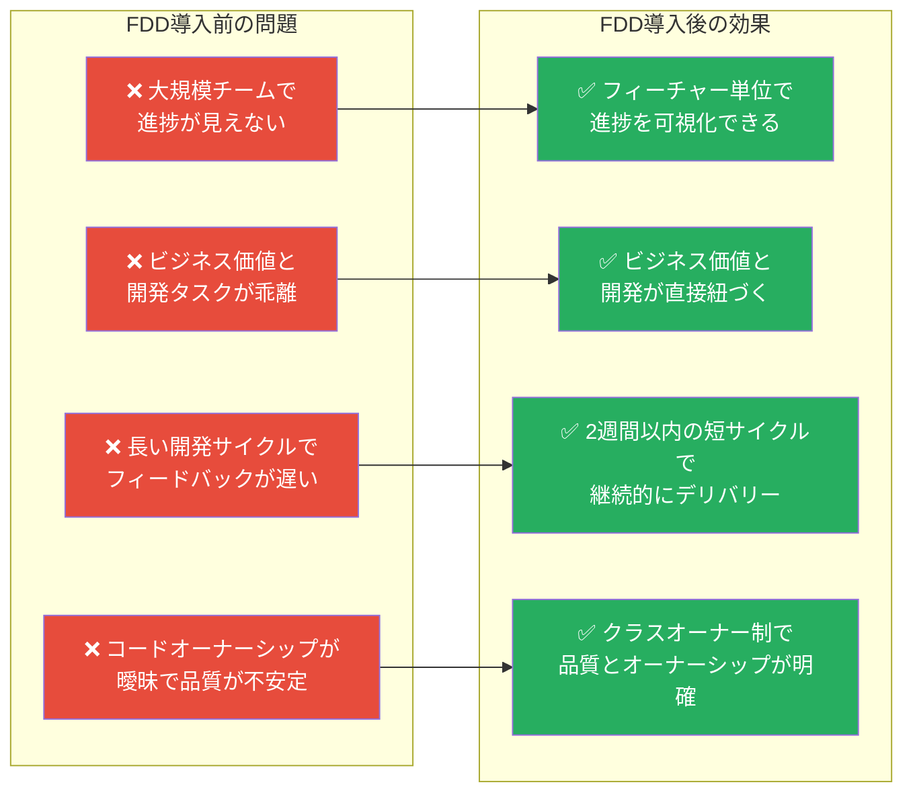
```mermaid
graph LR
    subgraph "FDD導入前の問題"
        P1["❌ 大規模チームで<br>進捗が見えない"]
        P2["❌ ビジネス価値と<br>開発タスクが乖離"]
        P3["❌ 長い開発サイクルで<br>フィードバックが遅い"]
        P4["❌ コードオーナーシップが<br>曖昧で品質が不安定"]
    end

    subgraph "FDD導入後の効果"
        S1["✅ フィーチャー単位で<br>進捗を可視化できる"]
        S2["✅ ビジネス価値と<br>開発が直接紐づく"]
        S3["✅ 2週間以内の短サイクルで<br>継続的にデリバリー"]
        S4["✅ クラスオーナー制で<br>品質とオーナーシップが明確"]
    end

    P1 --> S1
    P2 --> S2
    P3 --> S3
    P4 --> S4

    style P1 fill:#e74c3c,color:#fff
    style P2 fill:#e74c3c,color:#fff
    style P3 fill:#e74c3c,color:#fff
    style P4 fill:#e74c3c,color:#fff
    style S1 fill:#27ae60,color:#fff
    style S2 fill:#27ae60,color:#fff
    style S3 fill:#27ae60,color:#fff
    style S4 fill:#27ae60,color:#fff
```

### 1.3 FDDの6つのベストプラクティス

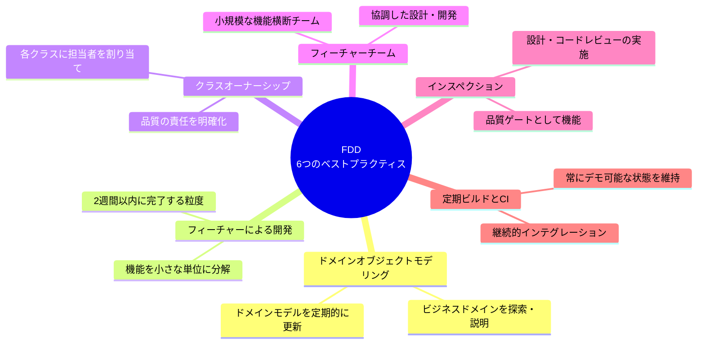
```mermaid
mindmap
    root((FDD<br>6つのベストプラクティス))
        ドメインオブジェクトモデリング
            ビジネスドメインを探索・説明
            ドメインモデルを定期的に更新
        フィーチャーによる開発
            機能を小さな単位に分解
            2週間以内に完了する粒度
        クラスオーナーシップ
            各クラスに担当者を割り当て
            品質の責任を明確化
        フィーチャーチーム
            小規模な機能横断チーム
            協調した設計・開発
        インスペクション
            設計・コードレビューの実施
            品質ゲートとして機能
        定期ビルドとCI
            常にデモ可能な状態を維持
            継続的インテグレーション
```

### 1.4 FDDが適しているプロジェクト

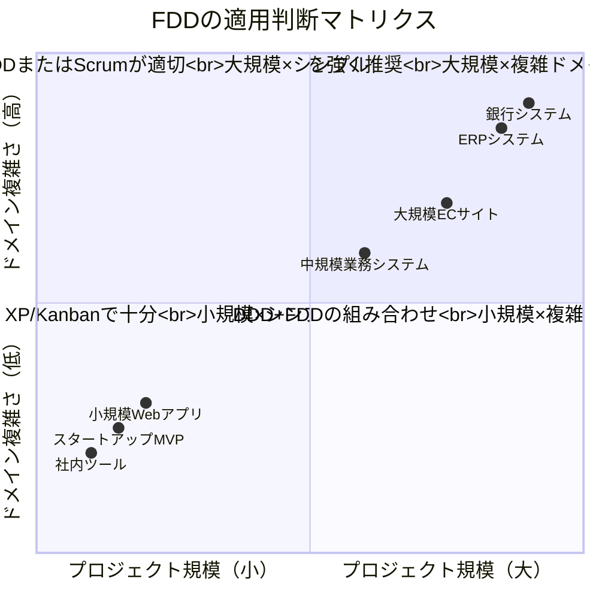
```mermaid
quadrantChart
    title FDDの適用判断マトリクス
    x-axis "プロジェクト規模（小）" --> "プロジェクト規模（大）"
    y-axis "ドメイン複雑さ（低）" --> "ドメイン複雑さ（高）"
    quadrant-1 "FDDを強く推奨<br>大規模×複雑ドメイン"
    quadrant-2 "FDDまたはScrumが適切<br>大規模×シンプル"
    quadrant-3 "XP/Kanbanで十分<br>小規模×シンプル"
    quadrant-4 "DDD+FDDの組み合わせ<br>小規模×複雑ドメイン"
    銀行システム: [0.9, 0.9]
    ERPシステム: [0.85, 0.85]
    大規模ECサイト: [0.75, 0.7]
    中規模業務システム: [0.6, 0.6]
    小規模Webアプリ: [0.2, 0.3]
    スタートアップMVP: [0.15, 0.25]
    社内ツール: [0.1, 0.2]
```

---

## 2. FDDの全体構造と5つのプロセス

### 2.1 FDDの5つのプロセス全体像

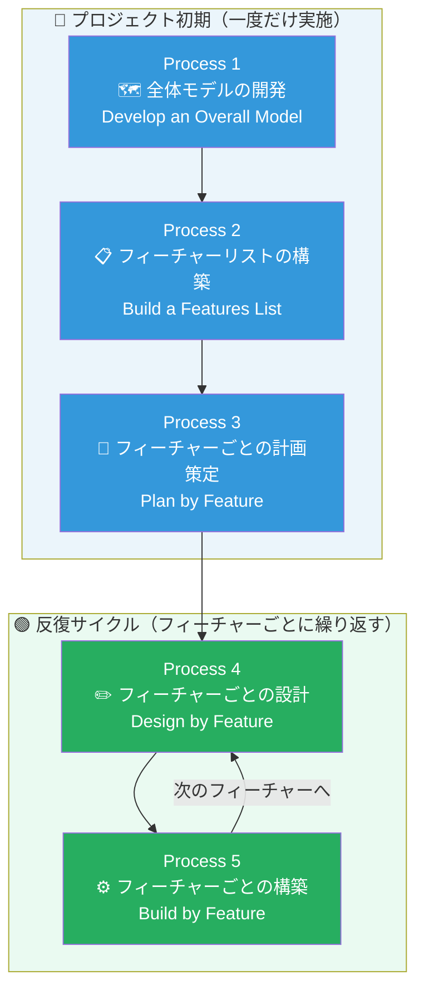
```mermaid
flowchart TD
    subgraph INIT["🔵 プロジェクト初期（一度だけ実施）"]
        P1["Process 1<br>🗺️ 全体モデルの開発<br>Develop an Overall Model"]
        P2["Process 2<br>📋 フィーチャーリストの構築<br>Build a Features List"]
        P3["Process 3<br>📅 フィーチャーごとの計画策定<br>Plan by Feature"]
    end

    subgraph ITER["🟢 反復サイクル（フィーチャーごとに繰り返す）"]
        P4["Process 4<br>✏️ フィーチャーごとの設計<br>Design by Feature"]
        P5["Process 5<br>⚙️ フィーチャーごとの構築<br>Build by Feature"]
    end

    P1 --> P2
    P2 --> P3
    P3 --> P4
    P4 --> P5
    P5 --> |"次のフィーチャーへ"| P4

    style P1 fill:#3498db,color:#fff
    style P2 fill:#3498db,color:#fff
    style P3 fill:#3498db,color:#fff
    style P4 fill:#27ae60,color:#fff
    style P5 fill:#27ae60,color:#fff
    style INIT fill:#ebf5fb
    style ITER fill:#eafaf1
```

### 2.2 FDDのタイムライン概観

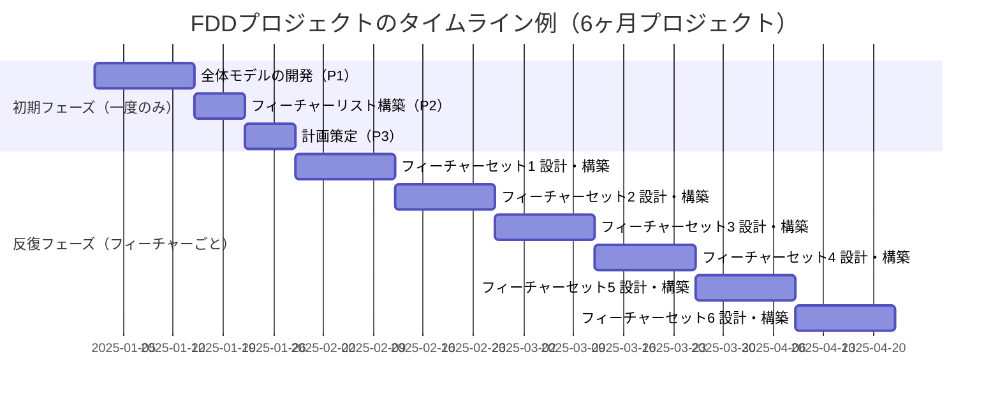
```mermaid
gantt
    title FDDプロジェクトのタイムライン例（6ヶ月プロジェクト）
    dateFormat  YYYY-MM-DD
    section 初期フェーズ（一度のみ）
        全体モデルの開発（P1）        :p1, 2025-01-01, 14d
        フィーチャーリスト構築（P2）   :p2, after p1, 7d
        計画策定（P3）               :p3, after p2, 7d
    section 反復フェーズ（フィーチャーごと）
        フィーチャーセット1 設計・構築  :f1, after p3, 14d
        フィーチャーセット2 設計・構築  :f2, after f1, 14d
        フィーチャーセット3 設計・構築  :f3, after f2, 14d
        フィーチャーセット4 設計・構築  :f4, after f3, 14d
        フィーチャーセット5 設計・構築  :f5, after f4, 14d
        フィーチャーセット6 設計・構築  :f6, after f5, 14d
```

### 2.3 FDDの階層構造

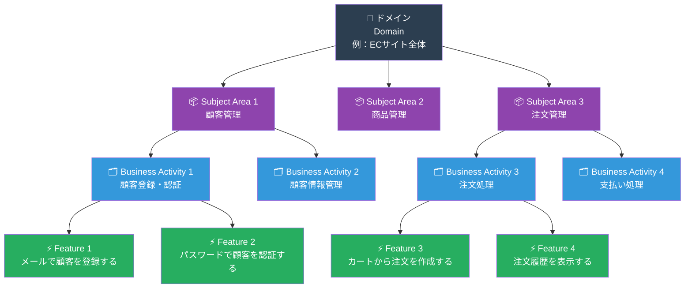
```mermaid
graph TD
    DOMAIN["🏢 ドメイン<br>Domain<br>例：ECサイト全体"]
    DOMAIN --> SA1["📦 Subject Area 1<br>顧客管理"]
    DOMAIN --> SA2["📦 Subject Area 2<br>商品管理"]
    DOMAIN --> SA3["📦 Subject Area 3<br>注文管理"]

    SA1 --> BA1["🗂️ Business Activity 1<br>顧客登録・認証"]
    SA1 --> BA2["🗂️ Business Activity 2<br>顧客情報管理"]
    SA3 --> BA3["🗂️ Business Activity 3<br>注文処理"]
    SA3 --> BA4["🗂️ Business Activity 4<br>支払い処理"]

    BA1 --> F1["⚡ Feature 1<br>メールで顧客を登録する"]
    BA1 --> F2["⚡ Feature 2<br>パスワードで顧客を認証する"]
    BA3 --> F3["⚡ Feature 3<br>カートから注文を作成する"]
    BA3 --> F4["⚡ Feature 4<br>注文履歴を表示する"]

    style DOMAIN fill:#2c3e50,color:#fff
    style SA1 fill:#8e44ad,color:#fff
    style SA2 fill:#8e44ad,color:#fff
    style SA3 fill:#8e44ad,color:#fff
    style BA1 fill:#3498db,color:#fff
    style BA2 fill:#3498db,color:#fff
    style BA3 fill:#3498db,color:#fff
    style BA4 fill:#3498db,color:#fff
    style F1 fill:#27ae60,color:#fff
    style F2 fill:#27ae60,color:#fff
    style F3 fill:#27ae60,color:#fff
    style F4 fill:#27ae60,color:#fff
```

---

## 3. プロセス1：全体モデルの開発

### 3.1 全体モデルとは

プロジェクト開始時に**一度だけ**実施する、ドメイン全体の高レベルな理解とモデリングです。完璧を目指さず、チームの共通理解を作ることが目的です。

### 3.2 全体モデル開発のプロセスフロー

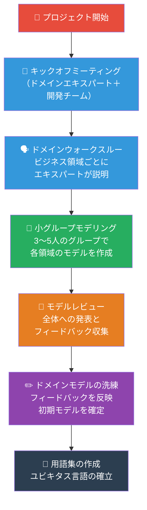
```mermaid
flowchart TD
    START["🚀 プロジェクト開始"]
    
    KICK["👥 キックオフミーティング<br>（ドメインエキスパート＋開発チーム）"]
    
    WALK["🗣️ ドメインウォークスルー<br>ビジネス領域ごとに<br>エキスパートが説明"]
    
    SMALL["🔬 小グループモデリング<br>3〜5人のグループで<br>各領域のモデルを作成"]
    
    REVIEW["🔎 モデルレビュー<br>全体への発表と<br>フィードバック収集"]
    
    REFINE["✏️ ドメインモデルの洗練<br>フィードバックを反映<br>初期モデルを確定"]
    
    GLOSSARY["📖 用語集の作成<br>ユビキタス言語の確立"]

    START --> KICK --> WALK --> SMALL --> REVIEW --> REFINE --> GLOSSARY

    style START fill:#e74c3c,color:#fff
    style KICK fill:#3498db,color:#fff
    style WALK fill:#3498db,color:#fff
    style SMALL fill:#27ae60,color:#fff
    style REVIEW fill:#e67e22,color:#fff
    style REFINE fill:#8e44ad,color:#fff
    style GLOSSARY fill:#2c3e50,color:#fff
```

### 3.3 ドメインモデルの例（ECサイト）

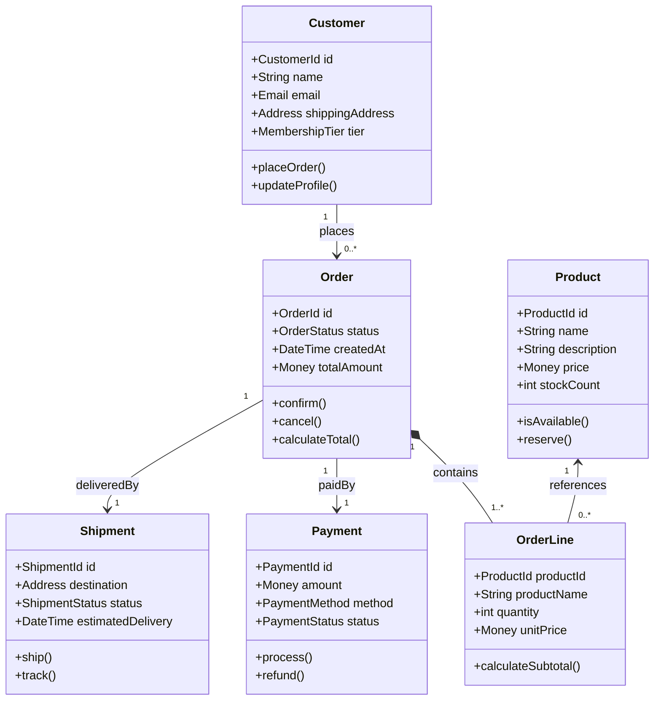
```mermaid
classDiagram
    class Customer {
        +CustomerId id
        +String name
        +Email email
        +Address shippingAddress
        +MembershipTier tier
        +placeOrder()
        +updateProfile()
    }

    class Order {
        +OrderId id
        +OrderStatus status
        +DateTime createdAt
        +Money totalAmount
        +confirm()
        +cancel()
        +calculateTotal()
    }

    class OrderLine {
        +ProductId productId
        +String productName
        +int quantity
        +Money unitPrice
        +calculateSubtotal()
    }

    class Product {
        +ProductId id
        +String name
        +String description
        +Money price
        +int stockCount
        +isAvailable()
        +reserve()
    }

    class Payment {
        +PaymentId id
        +Money amount
        +PaymentMethod method
        +PaymentStatus status
        +process()
        +refund()
    }

    class Shipment {
        +ShipmentId id
        +Address destination
        +ShipmentStatus status
        +DateTime estimatedDelivery
        +ship()
        +track()
    }

    Customer "1" --> "0..*" Order : places
    Order "1" *-- "1..*" OrderLine : contains
    Order "1" --> "1" Payment : paidBy
    Order "1" --> "1" Shipment : deliveredBy
    Product "1" <-- "0..*" OrderLine : references
```

### 3.4 全体モデル開発のベストプラクティス

| # | プラクティス | 詳細 |
|---|-------------|------|
| 1 | **完璧を求めない** | 初期モデルは「十分に良い」程度でOK。反復の中で改善する |
| 2 | **ドメインエキスパートを必ず巻き込む** | エンジニアだけでモデルを作らない |
| 3 | **色分け付箋を使う** | クラス・属性・メソッドを色で区別してホワイトボードで作業 |
| 4 | **UMLは補助ツールとして使う** | 厳密なUMLより、チームが理解できる図を優先 |
| 5 | **用語集を必ず作る** | モデルで使った言葉を全員が同じ意味で使えるようにする |
| 6 | **2週間以内に完成させる** | 初期モデリングに時間をかけすぎない |

---

## 4. プロセス2：フィーチャーリストの構築

### 4.1 フィーチャーとは

**フィーチャー（Feature）** は、クライアント評価の観点から価値を持つ小さな機能です。

> 💡 **FDDの鉄則：** 1つのフィーチャーは **2週間以内** に設計・開発・テスト完了できる粒度でなければならない。

### 4.2 フィーチャーの記述形式

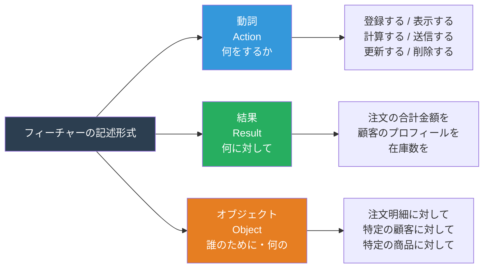
```mermaid
graph LR
    FORMAT["フィーチャーの記述形式"]
    FORMAT --> ACTION["動詞<br>Action<br>何をするか"]
    FORMAT --> RESULT["結果<br>Result<br>何に対して"]
    FORMAT --> OBJECT["オブジェクト<br>Object<br>誰のために・何の"]

    ACTION --> EX1["登録する / 表示する<br>計算する / 送信する<br>更新する / 削除する"]
    RESULT --> EX2["注文の合計金額を<br>顧客のプロフィールを<br>在庫数を"]
    OBJECT --> EX3["注文明細に対して<br>特定の顧客に対して<br>特定の商品に対して"]

    style FORMAT fill:#2c3e50,color:#fff
    style ACTION fill:#3498db,color:#fff
    style RESULT fill:#27ae60,color:#fff
    style OBJECT fill:#e67e22,color:#fff
```

### 4.3 良いフィーチャーと悪いフィーチャーの例

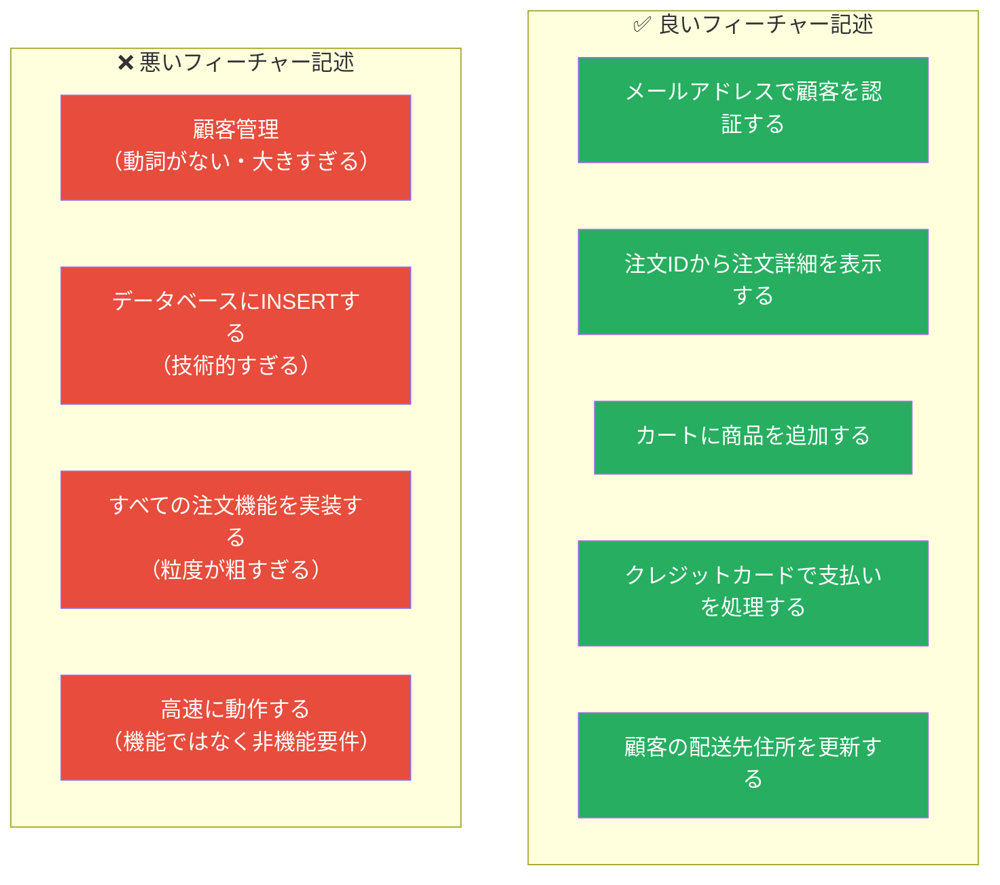
```mermaid
graph TD
    subgraph "✅ 良いフィーチャー記述"
        G1["メールアドレスで顧客を認証する"]
        G2["注文IDから注文詳細を表示する"]
        G3["カートに商品を追加する"]
        G4["クレジットカードで支払いを処理する"]
        G5["顧客の配送先住所を更新する"]
    end

    subgraph "❌ 悪いフィーチャー記述"
        B1["顧客管理<br>（動詞がない・大きすぎる）"]
        B2["データベースにINSERTする<br>（技術的すぎる）"]
        B3["すべての注文機能を実装する<br>（粒度が粗すぎる）"]
        B4["高速に動作する<br>（機能ではなく非機能要件）"]
    end

    style G1 fill:#27ae60,color:#fff
    style G2 fill:#27ae60,color:#fff
    style G3 fill:#27ae60,color:#fff
    style G4 fill:#27ae60,color:#fff
    style G5 fill:#27ae60,color:#fff
    style B1 fill:#e74c3c,color:#fff
    style B2 fill:#e74c3c,color:#fff
    style B3 fill:#e74c3c,color:#fff
    style B4 fill:#e74c3c,color:#fff
```

### 4.4 フィーチャーリスト構築のプロセス

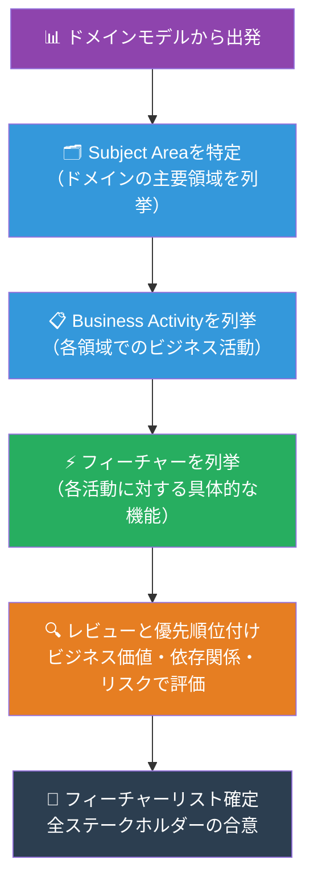
```mermaid
flowchart TD
    MODEL["📊 ドメインモデルから出発"]
    AREA["🗂️ Subject Areaを特定<br>（ドメインの主要領域を列挙）"]
    ACT["📋 Business Activityを列挙<br>（各領域でのビジネス活動）"]
    FEAT["⚡ フィーチャーを列挙<br>（各活動に対する具体的な機能）"]
    REVIEW["🔍 レビューと優先順位付け<br>ビジネス価値・依存関係・リスクで評価"]
    LIST["📝 フィーチャーリスト確定<br>全ステークホルダーの合意"]

    MODEL --> AREA --> ACT --> FEAT --> REVIEW --> LIST

    style MODEL fill:#8e44ad,color:#fff
    style AREA fill:#3498db,color:#fff
    style ACT fill:#3498db,color:#fff
    style FEAT fill:#27ae60,color:#fff
    style REVIEW fill:#e67e22,color:#fff
    style LIST fill:#2c3e50,color:#fff
```

### 4.5 フィーチャーリストの構造例（ECサイト）

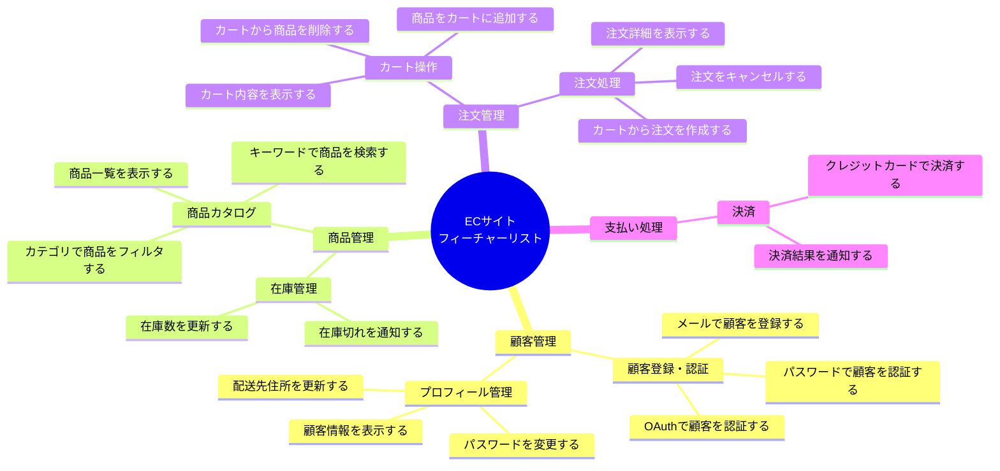
```mermaid
mindmap
    root((ECサイト<br>フィーチャーリスト))
        顧客管理
            顧客登録・認証
                メールで顧客を登録する
                パスワードで顧客を認証する
                OAuthで顧客を認証する
            プロフィール管理
                顧客情報を表示する
                配送先住所を更新する
                パスワードを変更する
        商品管理
            商品カタログ
                商品一覧を表示する
                キーワードで商品を検索する
                カテゴリで商品をフィルタする
            在庫管理
                在庫数を更新する
                在庫切れを通知する
        注文管理
            カート操作
                商品をカートに追加する
                カートから商品を削除する
                カート内容を表示する
            注文処理
                カートから注文を作成する
                注文詳細を表示する
                注文をキャンセルする
        支払い処理
            決済
                クレジットカードで決済する
                決済結果を通知する
```

---

## 5. プロセス3：フィーチャーごとの計画策定

### 5.1 計画策定の目的と流れ

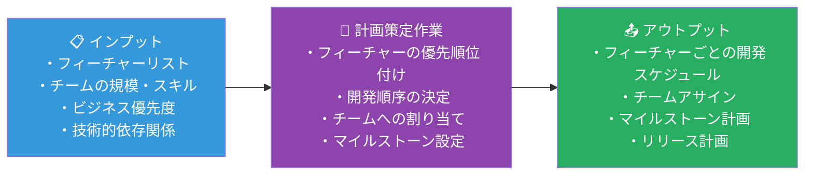
```mermaid
flowchart LR
    INPUT["📋 インプット<br>・フィーチャーリスト<br>・チームの規模・スキル<br>・ビジネス優先度<br>・技術的依存関係"]

    PLAN["📅 計画策定作業<br>・フィーチャーの優先順位付け<br>・開発順序の決定<br>・チームへの割り当て<br>・マイルストーン設定"]

    OUTPUT["📤 アウトプット<br>・フィーチャーごとの開発スケジュール<br>・チームアサイン<br>・マイルストーン計画<br>・リリース計画"]

    INPUT --> PLAN --> OUTPUT

    style INPUT fill:#3498db,color:#fff
    style PLAN fill:#8e44ad,color:#fff
    style OUTPUT fill:#27ae60,color:#fff
```

### 5.2 フィーチャーの優先順位付けフレームワーク

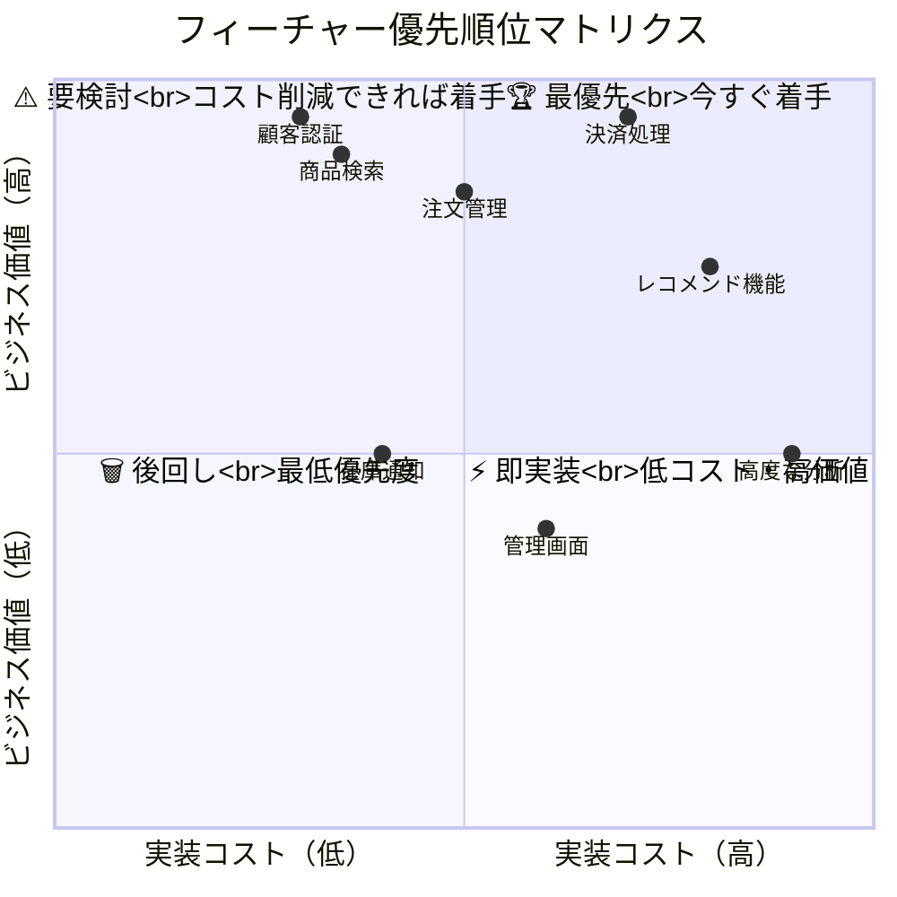
```mermaid
quadrantChart
    title フィーチャー優先順位マトリクス
    x-axis "実装コスト（低）" --> "実装コスト（高）"
    y-axis "ビジネス価値（低）" --> "ビジネス価値（高）"
    quadrant-1 "🏆 最優先<br>今すぐ着手"
    quadrant-2 "⚠️ 要検討<br>コスト削減できれば着手"
    quadrant-3 "🗑️ 後回し<br>最低優先度"
    quadrant-4 "⚡ 即実装<br>低コスト・高価値"
    顧客認証: [0.3, 0.95]
    商品検索: [0.35, 0.9]
    決済処理: [0.7, 0.95]
    注文管理: [0.5, 0.85]
    レコメンド機能: [0.8, 0.75]
    在庫通知: [0.4, 0.5]
    管理画面: [0.6, 0.4]
    高度な分析: [0.9, 0.5]
```

### 5.3 チームアサインメント計画

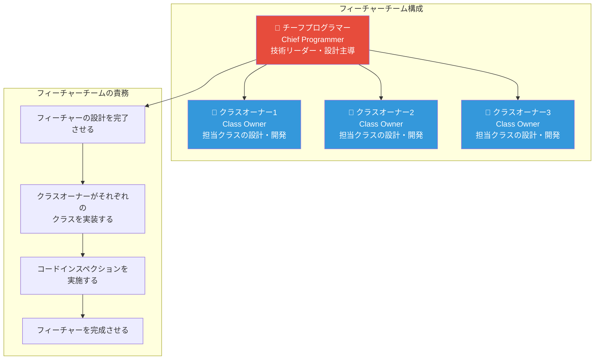
```mermaid
graph TD
    subgraph "フィーチャーチーム構成"
        CHIEF["👑 チーフプログラマー<br>Chief Programmer<br>技術リーダー・設計主導"]
        DEV1["👤 クラスオーナー1<br>Class Owner<br>担当クラスの設計・開発"]
        DEV2["👤 クラスオーナー2<br>Class Owner<br>担当クラスの設計・開発"]
        DEV3["👤 クラスオーナー3<br>Class Owner<br>担当クラスの設計・開発"]
    end

    subgraph "フィーチャーチームの責務"
        R1["フィーチャーの設計を完了させる"]
        R2["クラスオーナーがそれぞれの<br>クラスを実装する"]
        R3["コードインスペクションを実施する"]
        R4["フィーチャーを完成させる"]
    end

    CHIEF --> DEV1
    CHIEF --> DEV2
    CHIEF --> DEV3
    CHIEF --> R1
    R1 --> R2
    R2 --> R3
    R3 --> R4

    style CHIEF fill:#e74c3c,color:#fff
    style DEV1 fill:#3498db,color:#fff
    style DEV2 fill:#3498db,color:#fff
    style DEV3 fill:#3498db,color:#fff
```

### 5.4 計画策定のベストプラクティス

| # | プラクティス | 詳細 |
|---|-------------|------|
| 1 | **ビジネス価値で優先順位をつける** | 技術的な都合ではなく、顧客・ビジネスの価値で順序を決める |
| 2 | **依存関係を先にマップする** | フィーチャー間の技術的依存を把握して順序を決める |
| 3 | **バッファを必ず組み込む** | 計画の80%をスケジュールし、残り20%をバッファとして確保 |
| 4 | **チーム全員で計画を作る** | チーフプログラマーが独断で決めず、全員の合意を得る |
| 5 | **マイルストーンを細かく設定する** | 月次・週次のチェックポイントを設ける |

---

## 6. プロセス4：フィーチャーごとの設計

### 6.1 設計プロセスの全体フロー

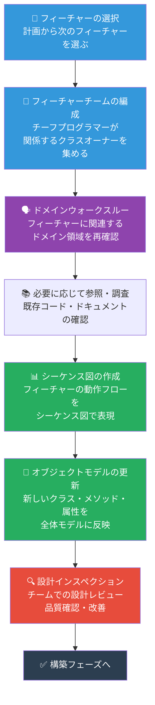
```mermaid
flowchart TD
    SELECT["🎯 フィーチャーの選択<br>計画から次のフィーチャーを選ぶ"]
    
    TEAM["👥 フィーチャーチームの編成<br>チーフプログラマーが<br>関係するクラスオーナーを集める"]
    
    DOMAIN_WALK["🗣️ ドメインウォークスルー<br>フィーチャーに関連する<br>ドメイン領域を再確認"]
    
    STUDY["📚 必要に応じて参照・調査<br>既存コード・ドキュメントの確認"]
    
    SEQ_DIAG["📊 シーケンス図の作成<br>フィーチャーの動作フローを<br>シーケンス図で表現"]
    
    UPDATE_MODEL["🔄 オブジェクトモデルの更新<br>新しいクラス・メソッド・属性を<br>全体モデルに反映"]
    
    DESIGN_REVIEW["🔍 設計インスペクション<br>チームでの設計レビュー<br>品質確認・改善"]
    
    PROCEED["✅ 構築フェーズへ"]

    SELECT --> TEAM --> DOMAIN_WALK --> STUDY --> SEQ_DIAG --> UPDATE_MODEL --> DESIGN_REVIEW --> PROCEED

    style SELECT fill:#3498db,color:#fff
    style TEAM fill:#3498db,color:#fff
    style DOMAIN_WALK fill:#8e44ad,color:#fff
    style SEQ_DIAG fill:#27ae60,color:#fff
    style UPDATE_MODEL fill:#27ae60,color:#fff
    style DESIGN_REVIEW fill:#e74c3c,color:#fff
    style PROCEED fill:#2c3e50,color:#fff
```

### 6.2 シーケンス図の例（注文作成フィーチャー）

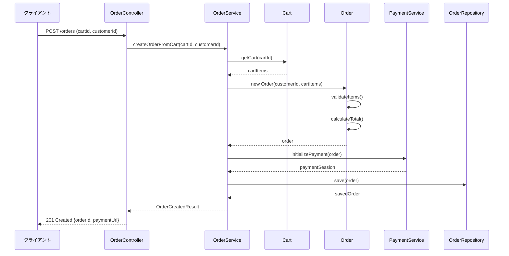
```mermaid
sequenceDiagram
    participant CLIENT as クライアント
    participant ORDER_CTRL as OrderController
    participant ORDER_SVC as OrderService
    participant CART as Cart
    participant ORDER as Order
    participant PAYMENT as PaymentService
    participant REPO as OrderRepository

    CLIENT->>ORDER_CTRL: POST /orders (cartId, customerId)
    ORDER_CTRL->>ORDER_SVC: createOrderFromCart(cartId, customerId)
    
    ORDER_SVC->>CART: getCart(cartId)
    CART-->>ORDER_SVC: cartItems

    ORDER_SVC->>ORDER: new Order(customerId, cartItems)
    ORDER->>ORDER: validateItems()
    ORDER->>ORDER: calculateTotal()
    ORDER-->>ORDER_SVC: order

    ORDER_SVC->>PAYMENT: initializePayment(order)
    PAYMENT-->>ORDER_SVC: paymentSession

    ORDER_SVC->>REPO: save(order)
    REPO-->>ORDER_SVC: savedOrder

    ORDER_SVC-->>ORDER_CTRL: OrderCreatedResult
    ORDER_CTRL-->>CLIENT: 201 Created {orderId, paymentUrl}
```

### 6.3 設計インスペクションのチェックリスト

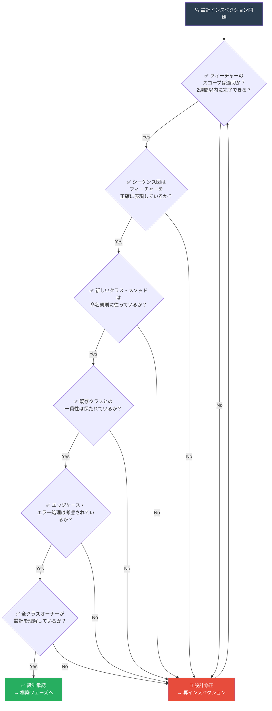
```mermaid
flowchart TD
    START["🔍 設計インスペクション開始"]
    
    C1{"✅ フィーチャーの<br>スコープは適切か？<br>2週間以内に完了できる？"}
    C2{"✅ シーケンス図は<br>フィーチャーを<br>正確に表現しているか？"}
    C3{"✅ 新しいクラス・メソッドは<br>命名規則に従っているか？"}
    C4{"✅ 既存クラスとの<br>一貫性は保たれているか？"}
    C5{"✅ エッジケース・<br>エラー処理は考慮されているか？"}
    C6{"✅ 全クラスオーナーが<br>設計を理解しているか？"}
    
    PASS["✅ 設計承認<br>→ 構築フェーズへ"]
    REVISE["🔄 設計修正<br>→ 再インスペクション"]

    START --> C1
    C1 --> |"Yes"| C2
    C1 --> |"No"| REVISE
    C2 --> |"Yes"| C3
    C2 --> |"No"| REVISE
    C3 --> |"Yes"| C4
    C3 --> |"No"| REVISE
    C4 --> |"Yes"| C5
    C4 --> |"No"| REVISE
    C5 --> |"Yes"| C6
    C5 --> |"No"| REVISE
    C6 --> |"Yes"| PASS
    C6 --> |"No"| REVISE
    REVISE --> C1

    style START fill:#2c3e50,color:#fff
    style PASS fill:#27ae60,color:#fff
    style REVISE fill:#e74c3c,color:#fff
```

---

## 7. プロセス5：フィーチャーごとの構築

### 7.1 構築プロセスの全体フロー

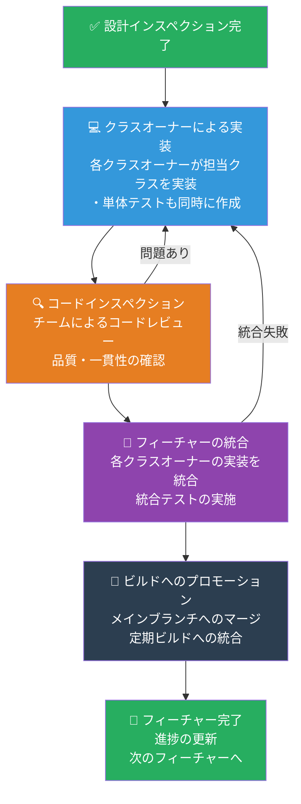
```mermaid
flowchart TD
    DESIGN_OK["✅ 設計インスペクション完了"]
    
    IMPL["💻 クラスオーナーによる実装<br>各クラスオーナーが担当クラスを実装<br>・単体テストも同時に作成"]
    
    CODE_REVIEW["🔍 コードインスペクション<br>チームによるコードレビュー<br>品質・一貫性の確認"]
    
    INTEGRATION["🔗 フィーチャーの統合<br>各クラスオーナーの実装を統合<br>統合テストの実施"]
    
    PROMOTE["🚀 ビルドへのプロモーション<br>メインブランチへのマージ<br>定期ビルドへの統合"]
    
    COMPLETE["🎉 フィーチャー完了<br>進捗の更新<br>次のフィーチャーへ"]

    DESIGN_OK --> IMPL --> CODE_REVIEW --> INTEGRATION --> PROMOTE --> COMPLETE
    CODE_REVIEW --> |"問題あり"| IMPL
    INTEGRATION --> |"統合失敗"| IMPL

    style DESIGN_OK fill:#27ae60,color:#fff
    style IMPL fill:#3498db,color:#fff
    style CODE_REVIEW fill:#e67e22,color:#fff
    style INTEGRATION fill:#8e44ad,color:#fff
    style PROMOTE fill:#2c3e50,color:#fff
    style COMPLETE fill:#27ae60,color:#fff
```

### 7.2 クラスオーナーシップの仕組み

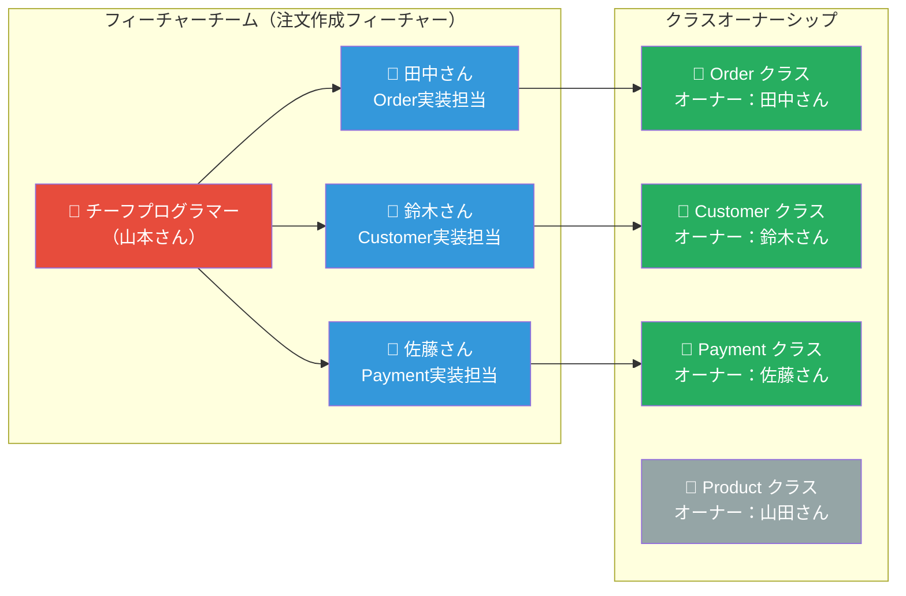
```mermaid
graph LR
    subgraph "クラスオーナーシップ"
        ORDER_CLASS["📄 Order クラス<br>オーナー：田中さん"]
        CUSTOMER_CLASS["📄 Customer クラス<br>オーナー：鈴木さん"]
        PAYMENT_CLASS["📄 Payment クラス<br>オーナー：佐藤さん"]
        PRODUCT_CLASS["📄 Product クラス<br>オーナー：山田さん"]
    end

    subgraph "フィーチャーチーム（注文作成フィーチャー）"
        CHIEF2["👑 チーフプログラマー<br>（山本さん）"]
        TANAKA["👤 田中さん<br>Order実装担当"]
        SUZUKI["👤 鈴木さん<br>Customer実装担当"]
        SATO["👤 佐藤さん<br>Payment実装担当"]
    end

    CHIEF2 --> TANAKA
    CHIEF2 --> SUZUKI
    CHIEF2 --> SATO
    TANAKA --> ORDER_CLASS
    SUZUKI --> CUSTOMER_CLASS
    SATO --> PAYMENT_CLASS

    style CHIEF2 fill:#e74c3c,color:#fff
    style TANAKA fill:#3498db,color:#fff
    style SUZUKI fill:#3498db,color:#fff
    style SATO fill:#3498db,color:#fff
    style ORDER_CLASS fill:#27ae60,color:#fff
    style CUSTOMER_CLASS fill:#27ae60,color:#fff
    style PAYMENT_CLASS fill:#27ae60,color:#fff
    style PRODUCT_CLASS fill:#95a5a6,color:#fff
```

### 7.3 コードインスペクションのベストプラクティス

| # | チェック項目 | 詳細 |
|---|------------|------|
| 1 | **命名の一貫性** | フィーチャーリスト・モデルと変数名・クラス名が一致しているか |
| 2 | **単体テストの網羅性** | 正常系・異常系・境界値のテストが揃っているか |
| 3 | **コードの可読性** | コメント・ドキュメントが適切に記述されているか |
| 4 | **設計との一致** | シーケンス図通りに実装されているか |
| 5 | **既存コードとの一貫性** | コーディング規約・パターンが統一されているか |
| 6 | **セキュリティ・パフォーマンス** | 明らかな問題がないか |

---

## 8. FDDのロール（役割）定義

### 8.1 FDDの役割構造

```mermaid
graph TD
    subgraph "キーロール（必須）"
        PM["🎯 プロジェクトマネージャー<br>Project Manager<br>予算・スケジュール・リソース管理"]
        CA["🏛️ チーフアーキテクト<br>Chief Architect<br>技術的な設計全体を統括"]
        DM["📊 開発マネージャー<br>Development Manager<br>日々の開発活動を管理"]
        CP["👑 チーフプログラマー<br>Chief Programmer<br>フィーチャーチームをリード"]
        CO["💻 クラスオーナー<br>Class Owner<br>担当クラスの設計・実装"]
        DE["🧠 ドメインエキスパート<br>Domain Expert<br>ビジネス知識を提供"]
    end

    subgraph "サポートロール（補助）"
        SR1["🔍 リリースマネージャー<br>リリース計画・管理"]
        SR2["🔒 言語エキスパート<br>技術標準・ベストプラクティス"]
        SR3["🏗️ ビルドエンジニア<br>CI/CDパイプライン管理"]
        SR4["🧪 QAエンジニア<br>テスト戦略・品質保証"]
    end

    PM --> CA
    PM --> DM
    CA --> CP
    DM --> CP
    CP --> CO
    DE --> CP

    style PM fill:#2c3e50,color:#fff
    style CA fill:#8e44ad,color:#fff
    style DM fill:#3498db,color:#fff
    style CP fill:#e74c3c,color:#fff
    style CO fill:#27ae60,color:#fff
    style DE fill:#e67e22,color:#fff
```

### 8.2 チーフプログラマーの責務詳細

```mermaid
mindmap
    root((チーフプログラマー<br>の責務))
        フィーチャー管理
            フィーチャーの選択と優先順位
            フィーチャーチームの編成
            進捗のトラッキング
        技術リーダーシップ
            設計の主導
            技術的な問題解決
            コードの品質基準設定
        コミュニケーション
            ステークホルダーへの報告
            チーム間の調整
            ドメインエキスパートとの連携
        成果物管理
            シーケンス図の作成・承認
            設計インスペクションの実施
            フィーチャー完了の判定
```

### 8.3 ロール別の活動タイムライン

```mermaid
gantt
    title FDDロール別活動（2週間スプリント）
    dateFormat  YYYY-MM-DD
    section プロジェクトマネージャー
        進捗確認・報告                  :pm1, 2025-01-01, 14d
    section チーフアーキテクト
        アーキテクチャレビュー           :ca1, 2025-01-01, 3d
        技術的問題対応                  :ca2, 2025-01-04, 7d
    section チーフプログラマー
        フィーチャー選択・チーム編成     :cp1, 2025-01-01, 1d
        ドメインウォークスルー           :cp2, 2025-01-02, 1d
        設計（シーケンス図）             :cp3, 2025-01-03, 2d
        設計インスペクション             :cp4, 2025-01-05, 1d
        構築フェーズ監督                 :cp5, 2025-01-06, 6d
        コードインスペクション           :cp6, 2025-01-12, 1d
        フィーチャー統合・完了           :cp7, 2025-01-13, 1d
    section クラスオーナー
        設計への参加                    :co1, 2025-01-02, 3d
        クラス実装                      :co2, 2025-01-06, 6d
        コードレビュー対応              :co3, 2025-01-12, 2d
```

---

## 9. フィーチャーの記述と分解方法

### 9.1 フィーチャー分解のステップ

```mermaid
flowchart TD
    BVISION["💼 ビジネスビジョン<br>例：顧客がオンラインで商品を購入できるECサイト"]
    
    SUBJECT["📦 Subject Area への分解<br>例：顧客管理 / 商品管理 / 注文管理 / 決済"]
    
    ACTIVITY["🎯 Business Activity への分解<br>例：注文管理 → 注文処理 / 注文追跡 / 返品処理"]
    
    FEATURE["⚡ Feature への分解<br>例：注文処理 → カートから注文を作成する<br>          → 注文確認メールを送信する<br>          → 注文ステータスを更新する"]
    
    TASK["🔧 Task への分解（実装内部のみ）<br>例：Orderクラスの作成<br>    OrderRepositoryの実装<br>    OrderServiceのユニットテスト"]

    BVISION --> SUBJECT --> ACTIVITY --> FEATURE --> TASK

    style BVISION fill:#2c3e50,color:#fff
    style SUBJECT fill:#8e44ad,color:#fff
    style ACTIVITY fill:#3498db,color:#fff
    style FEATURE fill:#27ae60,color:#fff
    style TASK fill:#95a5a6,color:#fff
```

### 9.2 フィーチャーの粒度チェック

```mermaid
flowchart TD
    FEATURE_CHECK["フィーチャーの粒度チェック"]
    
    Q1{"2週間以内に<br>完了できるか？"}
    Q2{"ビジネス価値が<br>明確か？"}
    Q3{"テスト可能か？"}
    Q4{"独立して<br>デリバリーできるか？"}
    
    TOO_BIG["📦 大きすぎる<br>→ さらに分解する"]
    TOO_SMALL["🔧 小さすぎる<br>→ タスクレベル、まとめる"]
    JUST_RIGHT["✅ 適切な粒度<br>→ フィーチャーリストに追加"]

    FEATURE_CHECK --> Q1
    Q1 --> |"No（大きい）"| TOO_BIG
    Q1 --> |"Yes"| Q2
    Q2 --> |"No"| TOO_SMALL
    Q2 --> |"Yes"| Q3
    Q3 --> |"No"| TOO_SMALL
    Q3 --> |"Yes"| Q4
    Q4 --> |"No"| TOO_BIG
    Q4 --> |"Yes"| JUST_RIGHT

    style TOO_BIG fill:#e74c3c,color:#fff
    style TOO_SMALL fill:#f39c12,color:#fff
    style JUST_RIGHT fill:#27ae60,color:#fff
```

### 9.3 フィーチャー記述テンプレート

```markdown
フィーチャーID:     FT-003
フィーチャー名:     カートから注文を作成する
Subject Area:      注文管理
Business Activity: 注文処理
優先度:            High（P1）
担当チーフ:        山本 太郎
クラスオーナー:    田中（Order）, 鈴木（Customer）, 佐藤（Payment）
依存フィーチャー:  FT-001（商品をカートに追加する）
推定工数:          5日
ステータス:        In Progress（設計完了 / 実装中）
受入基準:
  - [ ] カート内の全商品が注文明細に変換される
  - [ ] 在庫不足の商品がある場合はエラーを返す
  - [ ] 注文IDが発行される
  - [ ] 注文確認メールがトリガーされる
```

---

## 10. 進捗管理と報告

### 10.1 FDDの6段階完了ステータス

```mermaid
graph LR
    S0["0%<br>未着手"]
    S1["1%<br>設計開始"]
    S2["40%<br>設計完了"]
    S3["45%<br>設計インスペクション完了"]
    S4["50%<br>コーディング開始"]
    S5["99%<br>コードインスペクション完了"]
    S6["100%<br>プロモーション完了"]

    S0 --> S1 --> S2 --> S3 --> S4 --> S5 --> S6

    style S0 fill:#95a5a6,color:#fff
    style S1 fill:#3498db,color:#fff
    style S2 fill:#3498db,color:#fff
    style S3 fill:#f39c12,color:#fff
    style S4 fill:#e67e22,color:#fff
    style S5 fill:#27ae60,color:#fff
    style S6 fill:#2c3e50,color:#fff
```

### 10.2 フィーチャーごとの進捗追跡

```mermaid
xychart-beta
    title "フィーチャー完了数の推移（バーンアップチャート）"
    x-axis ["Week1", "Week2", "Week3", "Week4", "Week5", "Week6", "Week7", "Week8"]
    y-axis "フィーチャー完了数" 0 --> 50
    bar [3, 8, 14, 20, 27, 34, 41, 48]
    line [6, 12, 18, 25, 31, 37, 43, 50]
```

### 10.3 ステータスレポートの構成

```mermaid
graph TD
    REPORT["📊 週次進捗レポート"]
    
    REPORT --> OVERALL["📈 全体進捗サマリー<br>・総フィーチャー数：100<br>・完了フィーチャー数：42<br>・完了率：42%<br>・計画比：-3%（遅延）"]
    
    REPORT --> SUBJECT_PROG["📦 Subject Area別進捗<br>・顧客管理：85%完了<br>・商品管理：60%完了<br>・注文管理：30%完了<br>・決済：10%完了"]
    
    REPORT --> RISKS["⚠️ リスク・課題<br>・決済APIの仕様変更による遅延<br>・在庫管理の技術課題"]
    
    REPORT --> NEXT["📅 来週の計画<br>・FT-023〜FT-027の設計・開発<br>・決済APIとの統合テスト"]

    style REPORT fill:#2c3e50,color:#fff
    style OVERALL fill:#3498db,color:#fff
    style SUBJECT_PROG fill:#27ae60,color:#fff
    style RISKS fill:#e74c3c,color:#fff
    style NEXT fill:#8e44ad,color:#fff
```

### 10.4 進捗管理のベストプラクティス

| # | プラクティス | 詳細 |
|---|-------------|------|
| 1 | **フィーチャー単位で進捗を測る** | ストーリーポイントより完了フィーチャー数で測定 |
| 2 | **週次レポートを欠かさない** | ステークホルダーに毎週現状を共有する |
| 3 | **6段階ステータスを厳格に運用** | 「ほぼ完了」は存在しない。明確なステータスを保つ |
| 4 | **色分けで視覚化する** | 赤（遅延）黄（注意）緑（正常）で全員が一目でわかるように |
| 5 | **バーンアップチャートを使う** | スコープ変更も反映できるバーンアップが推奨 |

---

## 11. FDDと他手法との比較・組み合わせ

### 11.1 主要手法との比較表

| 観点 | FDD | Scrum | XP | Kanban |
|------|-----|-------|-----|--------|
| **スプリント** | 2週間（フィーチャー単位） | 1〜4週間 | 1〜2週間 | なし（継続的フロー） |
| **進捗の単位** | フィーチャー完了数 | ストーリーポイント | テスト通過数 | スループット |
| **スケール** | 大規模チーム向き | 小〜中規模向き | 小〜中規模向き | 規模問わず |
| **設計重視度** | 高（モデリング重視） | 中 | 高（TDD重視） | 低 |
| **ロール定義** | 明確（6種類） | 明確（3種類） | 明確（ペア） | 少ない |
| **ドキュメント** | 中程度 | 少ない | 少ない | 少ない |
| **適用ドメイン** | 複雑なビジネスロジック | 幅広い | 技術品質重視 | 保守・運用 |

### 11.2 FDDと他手法の組み合わせパターン

```mermaid
graph TD
    FDD_CORE["🚀 FDD（コアプロセス）"]

    FDD_CORE --> DDD_COMBO["🧩 FDD + DDD<br>ドメインモデルをDDDで設計<br>フィーチャー分解はFDDで実施<br>→ 大規模・複雑ドメインに最適"]

    FDD_CORE --> TDD_COMBO["🧪 FDD + TDD<br>フィーチャー設計フェーズでテストを先に書く<br>→ 品質とスピードのバランス"]

    FDD_CORE --> SCRUM_COMBO["📋 FDD + Scrum<br>フィーチャーリストをProduct Backlogとして使用<br>スプリントでフィーチャーをデリバリー<br>→ アジャイル組織への導入がしやすい"]

    FDD_CORE --> CI_COMBO["⚙️ FDD + CI/CD<br>フィーチャー完了ごとに自動ビルド<br>継続的デリバリーの実現<br>→ モダンな開発基盤との統合"]

    style FDD_CORE fill:#e74c3c,color:#fff
    style DDD_COMBO fill:#8e44ad,color:#fff
    style TDD_COMBO fill:#3498db,color:#fff
    style SCRUM_COMBO fill:#27ae60,color:#fff
    style CI_COMBO fill:#e67e22,color:#fff
```

### 11.3 プロジェクト規模別の推奨アプローチ

```mermaid
flowchart TD
    START["プロジェクト開始"]
    
    Q1{"チームサイズは？"}
    Q2{"ドメインの複雑さは？"}
    Q3{"リリース頻度の<br>要件は？"}

    SMALL_SIMPLE["Kanban / XP<br>シンプルな手法で十分"]
    MEDIUM["Scrum<br>スプリント型アジャイル"]
    LARGE_SIMPLE["FDD<br>大規模・明確なスコープ"]
    LARGE_COMPLEX["FDD + DDD<br>大規模・複雑ドメイン"]
    CONT_DELIVERY["FDD + CI/CD<br>継続的デリバリー重視"]

    START --> Q1
    Q1 --> |"小（〜10人）"| SMALL_SIMPLE
    Q1 --> |"中（10〜30人）"| Q2
    Q1 --> |"大（30人以上）"| LARGE_SIMPLE
    Q2 --> |"シンプル"| MEDIUM
    Q2 --> |"複雑"| LARGE_COMPLEX
    LARGE_SIMPLE --> Q3
    Q3 --> |"高頻度"| CONT_DELIVERY

    style SMALL_SIMPLE fill:#95a5a6,color:#fff
    style MEDIUM fill:#3498db,color:#fff
    style LARGE_SIMPLE fill:#27ae60,color:#fff
    style LARGE_COMPLEX fill:#8e44ad,color:#fff
    style CONT_DELIVERY fill:#e67e22,color:#fff
```

---

## 12. FDD実践：ECサイト完全事例

### 12.1 プロジェクト概要

```mermaid
graph LR
    subgraph "プロジェクト概要"
        INFO1["📋 プロジェクト名：<br>大手百貨店ECサイト構築"]
        INFO2["👥 チーム規模：<br>25名（チーフ3名・開発20名・QA2名）"]
        INFO3["📅 期間：<br>6ヶ月（P1〜P3：1ヶ月、P4〜P5：5ヶ月）"]
        INFO4["⚡ フィーチャー総数：<br>120フィーチャー"]
    end
```

### 12.2 全体モデル（P1の成果物）

```mermaid
classDiagram
    class Customer {
        +register()
        +login()
        +updateProfile()
        +viewOrderHistory()
    }
    class Cart {
        +addItem()
        +removeItem()
        +updateQuantity()
        +checkout()
    }
    class Order {
        +create()
        +confirm()
        +cancel()
        +track()
    }
    class Product {
        +search()
        +viewDetail()
        +checkStock()
    }
    class Payment {
        +process()
        +refund()
        +getStatus()
    }
    class Shipment {
        +create()
        +updateStatus()
        +track()
    }
    class Review {
        +submit()
        +edit()
        +delete()
    }

    Customer --> Cart : uses
    Customer --> Order : places
    Customer --> Review : writes
    Cart --> Order : converts to
    Order --> Payment : requires
    Order --> Shipment : triggers
    Product --> Cart : added to
    Product --> Review : receives
```

### 12.3 フィーチャーリスト（P2の成果物・抜粋）

```mermaid
mindmap
    root((ECサイト<br>フィーチャーリスト<br>全120件))
        顧客管理 30件
            認証・登録 8件
                メールで顧客を登録する
                パスワードで顧客を認証する
                Googleアカウントで認証する
                パスワードをリセットする
            プロフィール 12件
                プロフィールを表示する
                住所を追加する
                支払い方法を登録する
            注文履歴 10件
                注文一覧を表示する
                注文詳細を表示する
        商品管理 35件
            カタログ 15件
                商品一覧を表示する
                商品を検索する
                カテゴリで絞り込む
            在庫 10件
                在庫数を確認する
                在庫切れ商品を非表示にする
            レビュー 10件
                レビューを投稿する
                レビューを表示する
        注文・決済 55件
            カート 15件
                商品をカートに追加する
                カートを表示する
                数量を変更する
            注文 20件
                注文を作成する
                注文を確定する
                注文をキャンセルする
            決済 20件
                クレジットカードで決済する
                決済結果を通知する
                返金処理をする
```

### 12.4 計画と実績の比較（P3の成果物）

```mermaid
xychart-beta
    title "フィーチャー完了数：計画 vs 実績（月次）"
    x-axis ["Month1", "Month2", "Month3", "Month4", "Month5", "Month6"]
    y-axis "累計完了フィーチャー数" 0 --> 120
    bar [20, 40, 62, 82, 100, 120]
    line [18, 38, 58, 80, 100, 120]
```

### 12.5 フィーチャー実装例：「注文を作成する」

```mermaid
sequenceDiagram
    participant UI as フロントエンド
    participant API as OrderAPI
    participant ORDER_SVC as OrderService
    participant CART_SVC as CartService
    participant STOCK_SVC as StockService
    participant ORDER_REPO as OrderRepository
    participant EVENT_BUS as EventBus

    UI->>API: POST /api/v1/orders
    API->>ORDER_SVC: createOrder(customerId, cartId)
    
    ORDER_SVC->>CART_SVC: getCartItems(cartId)
    CART_SVC-->>ORDER_SVC: [CartItem...]

    loop 各カートアイテム
        ORDER_SVC->>STOCK_SVC: checkAvailability(productId, qty)
        STOCK_SVC-->>ORDER_SVC: AvailabilityResult
    end

    ORDER_SVC->>ORDER_SVC: buildOrder(customerId, cartItems)
    ORDER_SVC->>ORDER_SVC: calculateTotal()
    
    ORDER_SVC->>ORDER_REPO: save(order)
    ORDER_REPO-->>ORDER_SVC: savedOrder

    ORDER_SVC->>EVENT_BUS: publish(OrderCreatedEvent)
    EVENT_BUS-->>ORDER_SVC: ack

    ORDER_SVC-->>API: OrderCreatedResult
    API-->>UI: 201 {orderId, total, estimatedDelivery}
```

---

## 13. FDDのベストプラクティス総まとめ

### 13.1 プロセス別ベストプラクティス

```mermaid
graph TD
    subgraph "P1: 全体モデルの開発"
        BP1_1["✅ 完璧なモデルより<br>共通理解を優先"]
        BP1_2["✅ ドメインエキスパートを<br>必ず参加させる"]
        BP1_3["✅ 2週間以内に完成させる"]
    end

    subgraph "P2: フィーチャーリスト構築"
        BP2_1["✅ 動詞+結果+オブジェクトで記述"]
        BP2_2["✅ 2週間で完了できる粒度に分解"]
        BP2_3["✅ ビジネス用語で書く<br>（技術用語を使わない）"]
    end

    subgraph "P3: 計画策定"
        BP3_1["✅ ビジネス価値で優先順位"]
        BP3_2["✅ バッファを20%確保"]
        BP3_3["✅ 全員で計画を作る"]
    end

    subgraph "P4: フィーチャー設計"
        BP4_1["✅ シーケンス図は必ず作成"]
        BP4_2["✅ 設計インスペクションを省略しない"]
        BP4_3["✅ 設計変更はモデルを更新する"]
    end

    subgraph "P5: フィーチャー構築"
        BP5_1["✅ クラスオーナーが実装する"]
        BP5_2["✅ コードインスペクションは必須"]
        BP5_3["✅ 完了条件を明確に守る"]
    end
```

### 13.2 FDD成熟度モデル

```mermaid
graph TD
    LV0["Level 0: FDD未適用<br>場当たり的な開発・進捗不透明"]
    LV1["Level 1: 基本的なFDD導入<br>フィーチャーリストの作成・5つのプロセスの実施"]
    LV2["Level 2: ロールの確立<br>チーフプログラマー・クラスオーナー制の運用"]
    LV3["Level 3: 可視化と計測<br>6段階ステータス・バーンアップチャートの活用"]
    LV4["Level 4: 継続的改善<br>レトロスペクティブ・プロセス改善の定着"]
    LV5["Level 5: 組織全体への展開<br>複数チームでのFDD標準化・スケール"]

    LV0 --> LV1 --> LV2 --> LV3 --> LV4 --> LV5

    style LV0 fill:#e74c3c,color:#fff
    style LV1 fill:#e67e22,color:#fff
    style LV2 fill:#f39c12,color:#fff
    style LV3 fill:#27ae60,color:#fff
    style LV4 fill:#3498db,color:#fff
    style LV5 fill:#8e44ad,color:#fff
```

### 13.3 FDD導入ロードマップ

```mermaid
flowchart LR
    MONTH1["Month 1<br>🎓 基礎理解<br>・FDDの5プロセス学習<br>・サンプルプロジェクトで実践<br>・ロールの理解"]
    MONTH2["Month 2<br>🛠️ 小規模適用<br>・5〜10人の試験的導入<br>・フィーチャーリスト作成<br>・クラスオーナーシップ試験運用"]
    MONTH3["Month 3<br>📊 計測と調整<br>・進捗レポートの運用<br>・フィーチャー完了率の計測<br>・チームへのフィードバック"]
    MONTH4_6["Month 4-6<br>🚀 本格展開<br>・大規模プロジェクトへの適用<br>・複数チームへのスケール<br>・継続的改善の定着"]

    MONTH1 --> MONTH2 --> MONTH3 --> MONTH4_6

    style MONTH1 fill:#3498db,color:#fff
    style MONTH2 fill:#27ae60,color:#fff
    style MONTH3 fill:#e67e22,color:#fff
    style MONTH4_6 fill:#8e44ad,color:#fff
```

---

## 14. FDDのアンチパターン

### 14.1 よくある失敗パターン

```mermaid
graph TD
    subgraph "❌ アンチパターン1: Feature Bloat（フィーチャー肥大化）"
        A1_DESC["1つのフィーチャーが2週間を<br>大幅に超える規模になっている"]
        A1_CAUSE["原因：分解が不十分<br>「注文管理システムを実装する」"]
        A1_FIX["解決策：動詞+結果+オブジェクト形式で<br>2週間以内の粒度に分解する"]
    end

    subgraph "❌ アンチパターン2: Absent Domain Expert（ドメインエキスパート不在）"
        A2_DESC["開発者だけでモデリングを行い<br>ビジネス知識が欠落している"]
        A2_CAUSE["原因：ステークホルダー参加の軽視"]
        A2_FIX["解決策：P1から全プロセスに<br>ドメインエキスパートを巻き込む"]
    end

    subgraph "❌ アンチパターン3: Ghost Class Owner（幽霊クラスオーナー）"
        A3_DESC["クラスオーナーが名前だけで<br>実際の責任を持っていない状態"]
        A3_CAUSE["原因：ロール定義の形骸化"]
        A3_FIX["解決策：インスペクションでオーナーシップを<br>明確に問い、責任を強化する"]
    end

    subgraph "❌ アンチパターン4: Skip Inspection（インスペクション省略）"
        A4_DESC["忙しさを理由に設計・コード<br>インスペクションを省略する"]
        A4_CAUSE["原因：短期的なスピードの優先"]
        A4_FIX["解決策：インスペクションをゲートとして<br>定義し、省略できないルールにする"]
    end

    style A1_DESC fill:#e74c3c,color:#fff
    style A2_DESC fill:#e74c3c,color:#fff
    style A3_DESC fill:#e74c3c,color:#fff
    style A4_DESC fill:#e74c3c,color:#fff
    style A1_FIX fill:#27ae60,color:#fff
    style A2_FIX fill:#27ae60,color:#fff
    style A3_FIX fill:#27ae60,color:#fff
    style A4_FIX fill:#27ae60,color:#fff
```

### 14.2 アンチパターン判定フロー

```mermaid
flowchart TD
    CHECK["FDDプロジェクトの健全性チェック"]

    Q1{"フィーチャーが<br>2週間以内に完了しているか？"}
    Q2{"ドメインエキスパートが<br>P1に参加しているか？"}
    Q3{"設計インスペクションが<br>毎回実施されているか？"}
    Q4{"クラスオーナーが<br>自分のクラスに責任を持っているか？"}
    Q5{"進捗が毎週<br>報告されているか？"}

    HEALTHY["✅ 健全なFDDプロジェクト"]
    WARNING["⚠️ 要改善：該当するアンチパターンに対処する"]

    CHECK --> Q1
    Q1 --> |"Yes"| Q2
    Q1 --> |"No"| WARNING
    Q2 --> |"Yes"| Q3
    Q2 --> |"No"| WARNING
    Q3 --> |"Yes"| Q4
    Q3 --> |"No"| WARNING
    Q4 --> |"Yes"| Q5
    Q4 --> |"No"| WARNING
    Q5 --> |"Yes"| HEALTHY
    Q5 --> |"No"| WARNING

    style HEALTHY fill:#27ae60,color:#fff
    style WARNING fill:#e74c3c,color:#fff
```

---

## 15. 参考文献・ソース一覧

### 📚 必読書籍

| タイトル | 著者 | 難易度 | 内容 |
|---------|------|--------|------|
| **A Practical Guide to Feature-Driven Development** | Stephen R. Palmer, John M. Felsing | ★★★★☆ | FDD原典・実践ガイド |
| **Java Modeling in Color with UML** | Peter Coad, Jeff De Luca, Eric Lefebvre | ★★★★☆ | FDDのドメインモデリング手法 |
| **Agile Estimating and Planning** | Mike Cohn | ★★★☆☆ | アジャイル計画手法の詳解 |
| **Clean Agile** | Robert C. Martin | ★★★☆☆ | アジャイル開発の原則 |
| **The Art of Agile Development** | James Shore | ★★★☆☆ | アジャイル実践の総合ガイド |

### 🌐 公式ドキュメント・URL

#### FDD コア概念・原典

| リソース | URL |
|---------|-----|
| **FDD公式サイト（Jeff De Luca）** | https://web.archive.org/web/20210226190807/https://www.nebulon.com/articles/fdd/index.html |
| **FDD原典論文（1997年シンガポールプロジェクト）** | https://web.archive.org/web/20201026042456/https://www.nebulon.com/articles/fdd/downloads/oreilly-fdd.pdf |
| **Agile Alliance - FDD解説** | https://www.agilealliance.org/glossary/fdd/ |
| **Martin Fowler - FDD概要** | https://martinfowler.com/articles/newMethodology.html |

#### FDDプロセスと実践

| リソース | URL |
|---------|-----|
| **FDD Steps & Milestones（詳細解説）** | https://www.agilealliance.org/glossary/fdd/#q=~(infinite~false~filters~(postType~(~'page~'post~'aa_book~'aa_event_session~'aa_experience_report~'aa_glossary~'aa_research_paper~'aa_video)~tags~(~'fdd))~searchTerm~'~sort~false~sortDirection~'asc~page~1) |
| **Scaled Agile / FDD** | https://scaledagileframework.com/ |

#### アジャイル関連リソース

| リソース | URL |
|---------|-----|
| **Agile Manifesto（公式）** | https://agilemanifesto.org/ |
| **Agile Alliance（一般）** | https://www.agilealliance.org/ |
| **Scrum.org（比較参考）** | https://www.scrum.org/ |
| **Extreme Programming（XP公式）** | http://www.extremeprogramming.org/ |

#### ドメインモデリング関連

| リソース | URL |
|---------|-----|
| **UML公式仕様（Object Management Group）** | https://www.uml.org/ |
| **Martin Fowler - Analysis Patterns** | https://martinfowler.com/books/ap.html |
| **Martin Fowler - Domain Model** | https://martinfowler.com/eaaCatalog/domainModel.html |

#### CI/CDとの統合

| リソース | URL |
|---------|-----|
| **Continuous Integration（Martin Fowler）** | https://martinfowler.com/articles/continuousIntegration.html |
| **GitHub Actions 公式** | https://docs.github.com/en/actions |
| **CircleCI 公式** | https://circleci.com/docs/ |

---

> 📅 本ドキュメントは2024年時点の情報を基に作成しています。

## 著者情報

- **著者名**: Software Architect Guide
- **所属**: ソフトウェアアーキテクト設計プロジェクト
- **バージョン**: 1.0
- **対象ドキュメント**: FDD Complete Guide
- **連絡先**: architect-guide@example.com
