# 🏛️ クリーンアーキテクチャ 完全ガイド
>
> 世界トップクラスのソフトウェアアーキテクトが解説する、初学者から実践者まで対応したClean Architecture決定版

---

## 📚 目次

1. [クリーンアーキテクチャとは何か？](#1-クリーンアーキテクチャとは何か)
2. [4つの同心円（レイヤー）の完全解説](#2-4つの同心円レイヤーの完全解説)
3. [依存性の逆転原則（DIP）](#3-依存性の逆転原則dip)
4. [Entities（エンティティ）層](#4-entitiesエンティティ層)
5. [Use Cases（ユースケース）層](#5-use-casesユースケース層)
6. [Interface Adapters（インターフェースアダプター）層](#6-interface-adaptersインターフェースアダプター層)
7. [Frameworks & Drivers（フレームワーク）層](#7-frameworks--driversフレームワーク層)
8. [依存性注入（Dependency Injection）](#8-依存性注入dependency-injection)
9. [ディレクトリ構成とパッケージ設計](#9-ディレクトリ構成とパッケージ設計)
10. [クリーンアーキテクチャのテスト戦略](#10-クリーンアーキテクチャのテスト戦略)
11. [SOLID原則とクリーンアーキテクチャ](#11-solid原則とクリーンアーキテクチャ)
12. [関連アーキテクチャパターンとの比較](#12-関連アーキテクチャパターンとの比較)
13. [実践：ECサイト完全実装例](#13-実践ecサイト完全実装例)
14. [段階的導入ガイド](#14-段階的導入ガイド)
15. [ベストプラクティス総まとめ](#15-ベストプラクティス総まとめ)
16. [アンチパターン](#16-アンチパターン)
17. [参考文献・ソース一覧](#17-参考文献ソース一覧)

---

## 1. クリーンアーキテクチャとは何か？

### 1.1 定義と背景

**Clean Architecture（クリーンアーキテクチャ）** は、Robert C. Martin（Uncle Bob）が2012年のブログ記事と2017年の著書で提唱したソフトウェアアーキテクチャ原則です。

> 💡 **核心思想：**「ビジネスロジック（ドメイン）を技術的詳細（フレームワーク・DB・UI）から完全に分離し、ビジネスルールが最も価値ある資産として永続する設計を実現する」

### 1.2 クリーンアーキテクチャが解決する問題

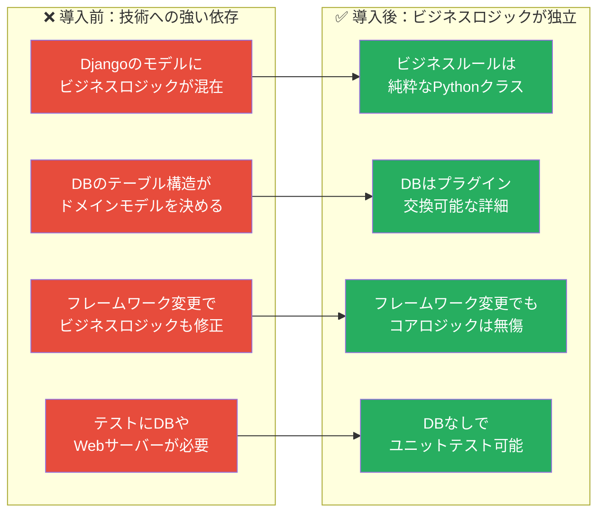
```mermaid
graph LR
    subgraph "❌ 導入前：技術への強い依存"
        P1["Djangoのモデルに<br>ビジネスロジックが混在"]
        P2["DBのテーブル構造が<br>ドメインモデルを決める"]
        P3["フレームワーク変更で<br>ビジネスロジックも修正"]
        P4["テストにDBや<br>Webサーバーが必要"]
    end

    subgraph "✅ 導入後：ビジネスロジックが独立"
        S1["ビジネスルールは<br>純粋なPythonクラス"]
        S2["DBはプラグイン<br>交換可能な詳細"]
        S3["フレームワーク変更でも<br>コアロジックは無傷"]
        S4["DBなしで<br>ユニットテスト可能"]
    end

    P1 --> S1
    P2 --> S2
    P3 --> S3
    P4 --> S4

    style P1 fill:#e74c3c,color:#fff
    style P2 fill:#e74c3c,color:#fff
    style P3 fill:#e74c3c,color:#fff
    style P4 fill:#e74c3c,color:#fff
    style S1 fill:#27ae60,color:#fff
    style S2 fill:#27ae60,color:#fff
    style S3 fill:#27ae60,color:#fff
    style S4 fill:#27ae60,color:#fff
```

### 1.3 クリーンアーキテクチャの4つの特性

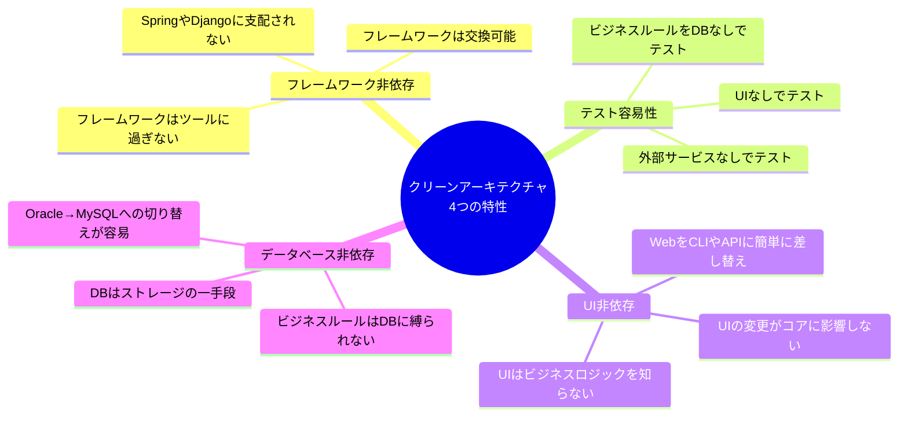
```mermaid
mindmap
    root((クリーンアーキテクチャ<br>4つの特性))
        フレームワーク非依存
            フレームワークはツールに過ぎない
            SpringやDjangoに支配されない
            フレームワークは交換可能
        テスト容易性
            ビジネスルールをDBなしでテスト
            UIなしでテスト
            外部サービスなしでテスト
        UI非依存
            UIはビジネスロジックを知らない
            WebをCLIやAPIに簡単に差し替え
            UIの変更がコアに影響しない
        データベース非依存
            DBはストレージの一手段
            Oracle→MySQLへの切り替えが容易
            ビジネスルールはDBに縛られない
```

### 1.4 他のアーキテクチャとの系譜

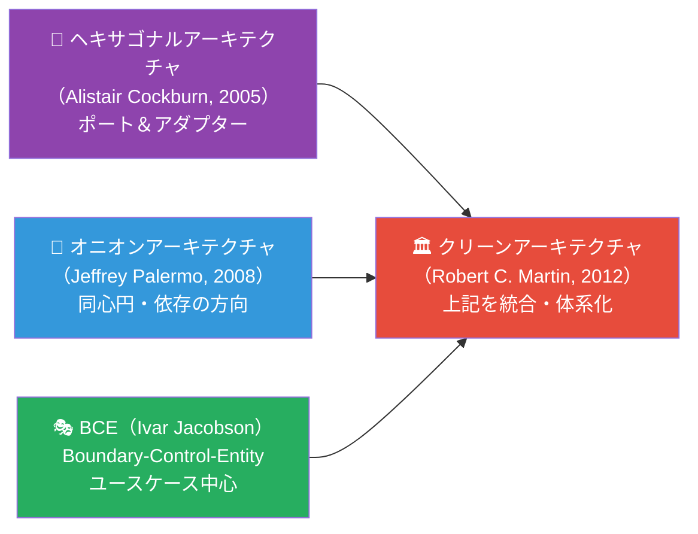
```mermaid
flowchart LR
    HEXAGONAL["🔷 ヘキサゴナルアーキテクチャ<br>（Alistair Cockburn, 2005）<br>ポート＆アダプター"]
    ONION["🧅 オニオンアーキテクチャ<br>（Jeffrey Palermo, 2008）<br>同心円・依存の方向"]
    BCE["🎭 BCE（Ivar Jacobson）<br>Boundary-Control-Entity<br>ユースケース中心"]
    CLEAN["🏛️ クリーンアーキテクチャ<br>（Robert C. Martin, 2012）<br>上記を統合・体系化"]

    HEXAGONAL --> CLEAN
    ONION --> CLEAN
    BCE --> CLEAN

    style HEXAGONAL fill:#8e44ad,color:#fff
    style ONION fill:#3498db,color:#fff
    style BCE fill:#27ae60,color:#fff
    style CLEAN fill:#e74c3c,color:#fff
```

---

## 2. 4つの同心円（レイヤー）の完全解説

### 2.1 同心円の全体像

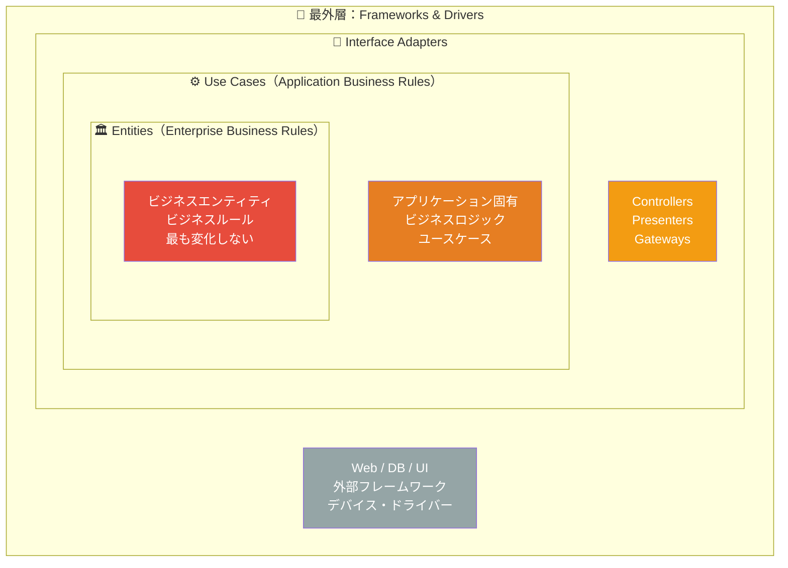
```mermaid
graph TD
    subgraph OUTER["🔧 最外層：Frameworks & Drivers"]
        subgraph ADAPTERS["🔌 Interface Adapters"]
            subgraph USECASES["⚙️ Use Cases（Application Business Rules）"]
                subgraph ENTITIES["🏛️ Entities（Enterprise Business Rules）"]
                    E_CORE["ビジネスエンティティ<br>ビジネスルール<br>最も変化しない"]
                end
                UC_CORE["アプリケーション固有<br>ビジネスロジック<br>ユースケース"]
            end
            AD_CORE["Controllers<br>Presenters<br>Gateways"]
        end
        FW_CORE["Web / DB / UI<br>外部フレームワーク<br>デバイス・ドライバー"]
    end

    style E_CORE fill:#e74c3c,color:#fff
    style UC_CORE fill:#e67e22,color:#fff
    style AD_CORE fill:#f39c12,color:#fff
    style FW_CORE fill:#95a5a6,color:#fff
```

### 2.2 依存の方向：内側だけを向く

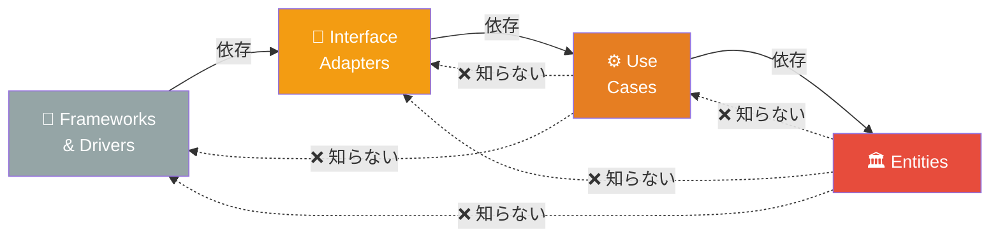
```mermaid
flowchart LR
    FW["🔧 Frameworks<br>& Drivers"]
    AD["🔌 Interface<br>Adapters"]
    UC["⚙️ Use<br>Cases"]
    EN["🏛️ Entities"]

    FW -->|"依存"| AD
    AD -->|"依存"| UC
    UC -->|"依存"| EN

    EN -.->|"❌ 知らない"| UC
    EN -.->|"❌ 知らない"| AD
    EN -.->|"❌ 知らない"| FW
    UC -.->|"❌ 知らない"| AD
    UC -.->|"❌ 知らない"| FW

    style FW fill:#95a5a6,color:#fff
    style AD fill:#f39c12,color:#fff
    style UC fill:#e67e22,color:#fff
    style EN fill:#e74c3c,color:#fff
```

### 2.3 各レイヤーの変更頻度と安定性

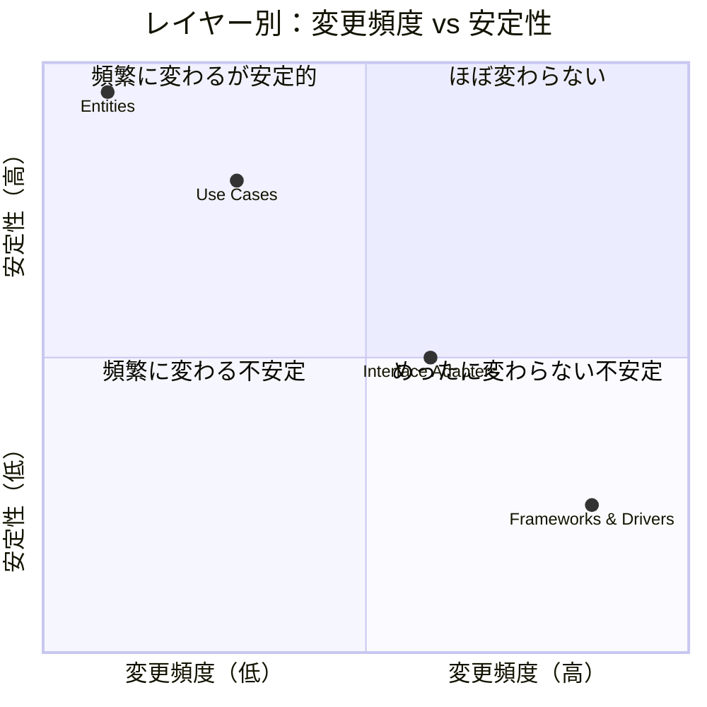
```mermaid
quadrantChart
    title レイヤー別：変更頻度 vs 安定性
    x-axis 変更頻度（低） --> 変更頻度（高）
    y-axis 安定性（低） --> 安定性（高）
    quadrant-1 "ほぼ変わらない"
    quadrant-2 "頻繁に変わるが安定的"
    quadrant-3 "頻繁に変わる不安定"
    quadrant-4 "めったに変わらない不安定"
    Entities: [0.1, 0.95]
    Use Cases: [0.3, 0.8]
    Interface Adapters: [0.6, 0.5]
    Frameworks & Drivers: [0.85, 0.25]
```

### 2.4 「境界を越える」データの流れ

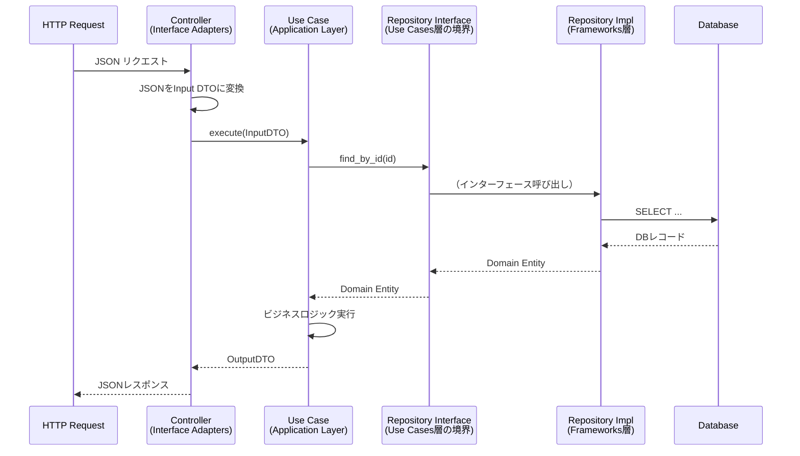
```mermaid
sequenceDiagram
    participant HTTP as HTTP Request
    participant CTRL as Controller<br>(Interface Adapters)
    participant UC as Use Case<br>(Application Layer)
    participant REPO_IF as Repository Interface<br>(Use Cases層の境界)
    participant REPO_IMPL as Repository Impl<br>(Frameworks層)
    participant DB as Database

    HTTP->>CTRL: JSON リクエスト
    CTRL->>CTRL: JSONをInput DTOに変換
    CTRL->>UC: execute(InputDTO)
    UC->>REPO_IF: find_by_id(id)
    REPO_IF->>REPO_IMPL: （インターフェース呼び出し）
    REPO_IMPL->>DB: SELECT ...
    DB-->>REPO_IMPL: DBレコード
    REPO_IMPL-->>REPO_IF: Domain Entity
    REPO_IF-->>UC: Domain Entity
    UC->>UC: ビジネスロジック実行
    UC-->>CTRL: OutputDTO
    CTRL-->>HTTP: JSONレスポンス
```

---

## 3. 依存性の逆転原則（DIP）

### 3.1 DIPの前後比較

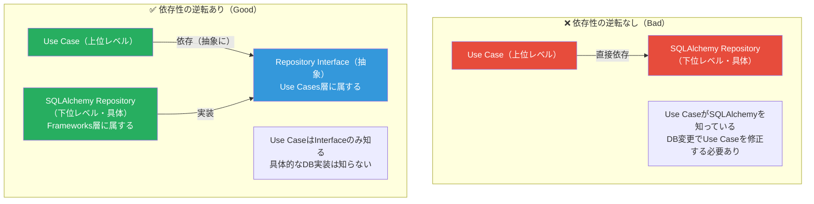
```mermaid
graph TD
    subgraph BAD["❌ 依存性の逆転なし（Bad）"]
        UC_BAD["Use Case（上位レベル）"]
        REPO_BAD["SQLAlchemy Repository（下位レベル・具体）"]
        UC_BAD -->|"直接依存"| REPO_BAD
        NOTE_BAD["Use CaseがSQLAlchemyを知っている<br>DB変更でUse Caseを修正する必要あり"]
    end

    subgraph GOOD["✅ 依存性の逆転あり（Good）"]
        UC_GOOD["Use Case（上位レベル）"]
        IF_GOOD["Repository Interface（抽象）<br>Use Cases層に属する"]
        REPO_GOOD["SQLAlchemy Repository（下位レベル・具体）<br>Frameworks層に属する"]
        UC_GOOD -->|"依存（抽象に）"| IF_GOOD
        REPO_GOOD -->|"実装"| IF_GOOD
        NOTE_GOOD["Use CaseはInterfaceのみ知る<br>具体的なDB実装は知らない"]
    end

    style UC_BAD fill:#e74c3c,color:#fff
    style REPO_BAD fill:#e74c3c,color:#fff
    style UC_GOOD fill:#27ae60,color:#fff
    style IF_GOOD fill:#3498db,color:#fff
    style REPO_GOOD fill:#27ae60,color:#fff
```

### 3.2 境界をまたぐポリモーフィズム

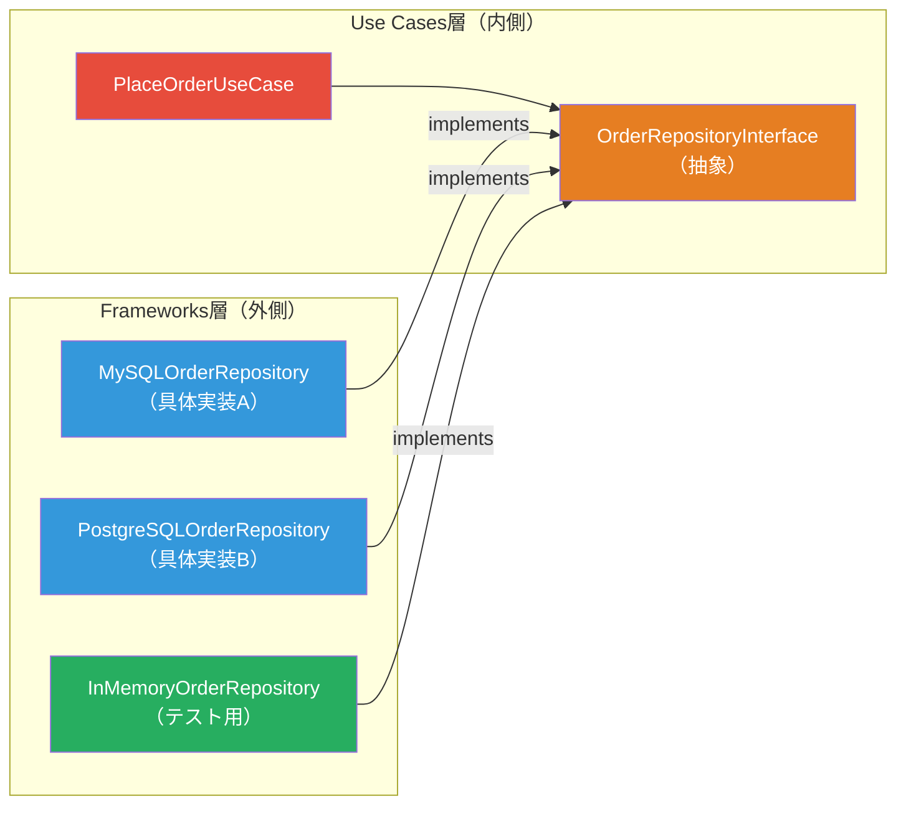
```mermaid
graph LR
    subgraph "Use Cases層（内側）"
        UC["PlaceOrderUseCase"]
        REPO_IF["OrderRepositoryInterface<br>（抽象）"]
        UC --> REPO_IF
    end

    subgraph "Frameworks層（外側）"
        MYSQL["MySQLOrderRepository<br>（具体実装A）"]
        POSTGRES["PostgreSQLOrderRepository<br>（具体実装B）"]
        INMEM["InMemoryOrderRepository<br>（テスト用）"]
    end

    MYSQL -->|"implements"| REPO_IF
    POSTGRES -->|"implements"| REPO_IF
    INMEM -->|"implements"| REPO_IF

    style UC fill:#e74c3c,color:#fff
    style REPO_IF fill:#e67e22,color:#fff
    style MYSQL fill:#3498db,color:#fff
    style POSTGRES fill:#3498db,color:#fff
    style INMEM fill:#27ae60,color:#fff
```

### 3.3 依存性逆転の実装例（Python）

```python
# ────────────────────────────────────────────
# Use Cases層（内側）：インターフェースを定義
# ────────────────────────────────────────────
from abc import ABC, abstractmethod
from typing import Optional


class OrderRepository(ABC):
    """
    リポジトリのインターフェース（抽象）
    Use Cases層に置く。フレームワークは知らない。
    """
    @abstractmethod
    def find_by_id(self, order_id: str) -> Optional["Order"]:
        ...

    @abstractmethod
    def save(self, order: "Order") -> None:
        ...


class PlaceOrderUseCase:
    """
    Use Caseは抽象（インターフェース）にのみ依存する。
    SQLAlchemyもDjangoも知らない。
    """
    def __init__(self, order_repository: OrderRepository):  # 抽象に依存
        self._repo = order_repository

    def execute(self, command: "PlaceOrderCommand") -> "PlaceOrderResult":
        order = Order.create(
            customer_id=command.customer_id,
            items=command.items,
        )
        self._repo.save(order)
        return PlaceOrderResult(order_id=order.id)


# ────────────────────────────────────────────
# Frameworks層（外側）：具体的な実装
# ────────────────────────────────────────────
from sqlalchemy.orm import Session


class SQLAlchemyOrderRepository(OrderRepository):
    """
    具体的なSQLAlchemy実装。
    外側レイヤーが内側のインターフェースを実装する。
    """
    def __init__(self, session: Session):
        self._session = session

    def find_by_id(self, order_id: str) -> Optional[Order]:
        record = self._session.query(OrderModel).filter_by(id=order_id).first()
        return self._to_domain(record) if record else None

    def save(self, order: Order) -> None:
        model = self._to_model(order)
        self._session.merge(model)
        self._session.commit()

    def _to_domain(self, record: "OrderModel") -> Order:
        """DBモデル → ドメインエンティティへの変換"""
        return Order(id=record.id, customer_id=record.customer_id,
                     status=OrderStatus(record.status))

    def _to_model(self, order: Order) -> "OrderModel":
        """ドメインエンティティ → DBモデルへの変換"""
        return OrderModel(id=order.id, customer_id=order.customer_id,
                          status=order.status.value)


# ────────────────────────────────────────────
# テスト用インメモリ実装（依存性逆転の恩恵）
# ────────────────────────────────────────────
class InMemoryOrderRepository(OrderRepository):
    """DBなしでユニットテストが可能になる"""
    def __init__(self):
        self._store: dict[str, Order] = {}

    def find_by_id(self, order_id: str) -> Optional[Order]:
        return self._store.get(order_id)

    def save(self, order: Order) -> None:
        self._store[order.id] = order
```

---

## 4. Entities（エンティティ）層

### 4.1 エンティティ層の役割

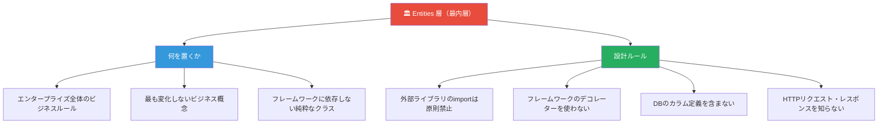
```mermaid
graph TD
    ENTITY_LAYER["🏛️ Entities 層（最内層）"]

    ENTITY_LAYER --> WHAT["何を置くか"]
    ENTITY_LAYER --> RULE["設計ルール"]

    WHAT --> W1["エンタープライズ全体のビジネスルール"]
    WHAT --> W2["最も変化しないビジネス概念"]
    WHAT --> W3["フレームワークに依存しない純粋なクラス"]

    RULE --> R1["外部ライブラリのimportは原則禁止"]
    RULE --> R2["フレームワークのデコレーターを使わない"]
    RULE --> R3["DBのカラム定義を含まない"]
    RULE --> R4["HTTPリクエスト・レスポンスを知らない"]

    style ENTITY_LAYER fill:#e74c3c,color:#fff
    style WHAT fill:#3498db,color:#fff
    style RULE fill:#27ae60,color:#fff
```

### 4.2 エンティティの実装例（Python）

```python
from dataclasses import dataclass, field
from datetime import datetime
from enum import Enum
from typing import Optional
from uuid import uuid4


class OrderStatus(Enum):
    """注文ステータス（ドメインの概念）"""
    PENDING   = "pending"
    CONFIRMED = "confirmed"
    SHIPPED   = "shipped"
    DELIVERED = "delivered"
    CANCELLED = "cancelled"


@dataclass(frozen=True)
class Money:
    """
    値オブジェクト（Value Object）
    金額のビジネスルールをここに閉じ込める
    """
    amount: int
    currency: str = "JPY"

    def __post_init__(self):
        if self.amount < 0:
            raise ValueError("金額は0以上でなければなりません")

    def add(self, other: "Money") -> "Money":
        if self.currency != other.currency:
            raise ValueError("通貨単位が一致しません")
        return Money(self.amount + other.amount, self.currency)

    def multiply(self, factor: int) -> "Money":
        return Money(self.amount * factor, self.currency)


    @classmethod
    def from_persistence(cls, id: str, customer_id: str, status: OrderStatus, lines: list[OrderLine], created_at: datetime) -> "Order":
        """永続化層からの復元用ファクトリ"""
        order = cls(customer_id=customer_id)
        order.id = id
        order._status = status
        order._lines = lines
        order.created_at = created_at
        return order


@dataclass
class OrderLine:
    """注文明細（Aggregate内部のオブジェクト）"""
    product_id:   str
    product_name: str
    unit_price:   Money
    quantity:     int

    @property
    def subtotal(self) -> Money:
        return self.unit_price.multiply(self.quantity)


@dataclass
class Order:
    """
    注文エンティティ（Aggregate Root）
    ─ このクラスにフレームワークの痕跡はない ─
    ─ 純粋なビジネスルールのみを持つ ─
    """
    id:          str
    customer_id: str
    _lines:      list[OrderLine]   = field(default_factory=list)
    _status:     OrderStatus       = OrderStatus.PENDING
    created_at:  datetime          = field(default_factory=datetime.utcnow)

    # ─── ファクトリメソッド ───
    @classmethod
    def create(cls, customer_id: str) -> "Order":
        return cls(id=str(uuid4()), customer_id=customer_id)

    # ─── ビジネスルール ───
    def add_line(self, product_id: str, product_name: str,
                 price: Money, qty: int) -> None:
        self._assert_editable()
        if qty <= 0:
            raise ValueError("数量は1以上でなければなりません")
        self._lines.append(OrderLine(product_id, product_name, price, qty))

    def confirm(self) -> None:
        if self._status != OrderStatus.PENDING:
            raise ValueError("保留中の注文のみ確定できます")
        if not self._lines:
            raise ValueError("商品が1件もありません")
        self._status = OrderStatus.CONFIRMED

    def cancel(self) -> None:
        if self._status in (OrderStatus.SHIPPED, OrderStatus.DELIVERED):
            raise ValueError("発送済み・配達済みの注文はキャンセルできません")
        self._status = OrderStatus.CANCELLED

    # ─── プロパティ（読み取り専用） ───
    @property
    def status(self) -> OrderStatus:
        return self._status

    @property
    def total(self) -> Money:
        if not self._lines:
            return Money(0)
        totals = [line.subtotal for line in self._lines]
        return sum(totals[1:], totals[0])

    @property
    def lines(self) -> tuple[OrderLine, ...]:
        return tuple(self._lines)

    # ─── プライベートヘルパー ───
    def _assert_editable(self) -> None:
        if self._status != OrderStatus.PENDING:
            raise ValueError("確定済みの注文は変更できません")
```

### 4.3 エンティティの設計ベストプラクティス

```mermaid
mindmap
    root((Entity<br>設計原則))
        自己完結性
            ビジネスルールをEntityが保持
            セッターを公開しない
            意図を表すメソッド名
        不変条件の保証
            コンストラクタでバリデーション
            常に正しい状態を維持
            不正な状態遷移を拒否
        依存なし
            import は標準ライブラリのみ
            フレームワークのデコレーター禁止
            DBスキーマを知らない
        テスト容易性
            new Order() だけでテスト開始
            モックが一切不要
            高速なユニットテスト
```

---

## 5. Use Cases（ユースケース）層

### 5.1 ユースケース層の役割

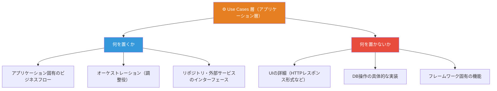
```mermaid
flowchart TD
    UC_LAYER["⚙️ Use Cases 層（アプリケーション層）"]

    UC_LAYER --> WHAT2["何を置くか"]
    UC_LAYER --> NOT_WHAT["何を置かないか"]

    WHAT2 --> W4["アプリケーション固有のビジネスフロー"]
    WHAT2 --> W5["オーケストレーション（調整役）"]
    WHAT2 --> W6["リポジトリ・外部サービスのインターフェース"]

    NOT_WHAT --> NW1["UIの詳細（HTTPレスポンス形式など）"]
    NOT_WHAT --> NW2["DB操作の具体的な実装"]
    NOT_WHAT --> NW3["フレームワーク固有の機能"]

    style UC_LAYER fill:#e67e22,color:#fff
    style WHAT2 fill:#3498db,color:#fff
    style NOT_WHAT fill:#e74c3c,color:#fff
```

### 5.2 ユースケースのInput/Output設計

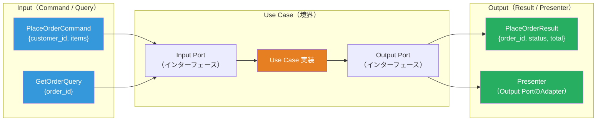
```mermaid
graph LR
    subgraph "Input（Command / Query）"
        CMD["PlaceOrderCommand<br>{customer_id, items}"]
        QUERY["GetOrderQuery<br>{order_id}"]
    end

    subgraph "Use Case（境界）"
        UC_IN["Input Port<br>（インターフェース）"]
        UC_IMPL["Use Case 実装"]
        UC_OUT["Output Port<br>（インターフェース）"]
    end

    subgraph "Output（Result / Presenter）"
        RESULT["PlaceOrderResult<br>{order_id, status, total}"]
        PRESENTER["Presenter<br>（Output PortのAdapter）"]
    end

    CMD --> UC_IN
    QUERY --> UC_IN
    UC_IN --> UC_IMPL
    UC_IMPL --> UC_OUT
    UC_OUT --> RESULT
    UC_OUT --> PRESENTER

    style CMD fill:#3498db,color:#fff
    style QUERY fill:#3498db,color:#fff
    style UC_IMPL fill:#e67e22,color:#fff
    style RESULT fill:#27ae60,color:#fff
    style PRESENTER fill:#27ae60,color:#fff
```

### 5.3 ユースケースの実装例（Python）

```python
from dataclasses import dataclass
from typing import Optional
from abc import ABC, abstractmethod


# ─── Input/Output DTOの定義 ───

@dataclass(frozen=True)
class PlaceOrderCommand:
    """注文作成コマンド（入力DTO）"""
    customer_id: str
    items: list[dict]   # [{product_id, quantity}...]


@dataclass(frozen=True)
class PlaceOrderResult:
    """注文作成結果（出力DTO）"""
    order_id:     str
    status:       str
    total_amount: int
    currency:     str


# ─── リポジトリ・外部サービスのインターフェース ───

class OrderRepository(ABC):
    @abstractmethod
    def save(self, order: Order) -> None: ...

    @abstractmethod
    def find_by_id(self, order_id: str) -> Optional[Order]: ...


class ProductRepository(ABC):
    @abstractmethod
    def find_by_id(self, product_id: str) -> Optional[Product]: ...


class CustomerRepository(ABC):
    @abstractmethod
    def find_by_id(self, customer_id: str) -> Optional[Customer]: ...


class EventPublisher(ABC):
    @abstractmethod
    def publish(self, event: object) -> None: ...


# ─── Use Case の実装 ───

class PlaceOrderUseCase:
    """
    注文作成ユースケース
    ─ ビジネスフローをオーケストレートする ─
    ─ 具体的なDB・メール送信方法は知らない ─
    """

    def __init__(
        self,
        order_repository:    OrderRepository,
        product_repository:  ProductRepository,
        customer_repository: CustomerRepository,
        event_publisher:     EventPublisher,
    ):
        self._order_repo    = order_repository
        self._product_repo  = product_repository
        self._customer_repo = customer_repository
        self._event_pub     = event_publisher

    def execute(self, command: PlaceOrderCommand) -> PlaceOrderResult:
        # 1. 顧客の存在確認
        customer = self._customer_repo.find_by_id(command.customer_id)
        if not customer:
            raise EntityNotFoundError(f"顧客が見つかりません: {command.customer_id}")
        if not customer.is_active:
            raise BusinessRuleError("このアカウントは現在ご利用できません")

        # 2. 注文エンティティの生成
        order = Order.create(customer_id=command.customer_id)

        # 3. 各商品を注文明細に追加
        for item_data in command.items:
            product = self._product_repo.find_by_id(item_data["product_id"])
            if not product:
                raise EntityNotFoundError(f"商品が見つかりません: {item_data['product_id']}")
            if not product.has_stock(item_data["quantity"]):
                raise BusinessRuleError(f"在庫が不足しています: {product.name}")

            order.add_line(
                product_id=product.id,
                product_name=product.name,
                price=product.price,
                qty=item_data["quantity"],
            )

        # 4. 注文確定
        order.confirm()

        # 5. 永続化
        self._order_repo.save(order)

        # 6. ドメインイベント発行
        self._event_pub.publish(
            OrderPlacedEvent(order_id=order.id, customer_id=order.customer_id)
        )

        return PlaceOrderResult(
            order_id=order.id,
            status=order.status.value,
            total_amount=order.total.amount,
            currency=order.total.currency,
        )


# ─── カスタム例外 ───

class EntityNotFoundError(Exception):
    pass


class BusinessRuleError(Exception):
    pass
```

---

## 6. Interface Adapters（インターフェースアダプター）層

### 6.1 アダプター層の役割

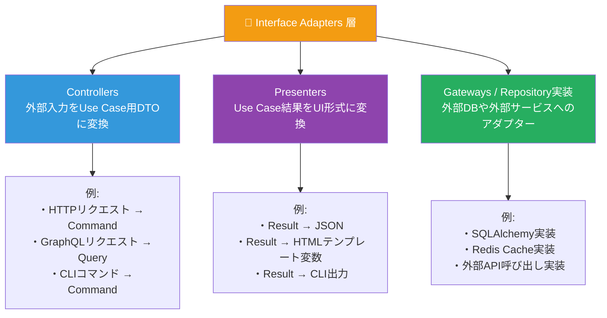
```mermaid
graph TD
    ADAPTER_LAYER["🔌 Interface Adapters 層"]

    ADAPTER_LAYER --> CTRL["Controllers<br>外部入力をUse Case用DTOに変換"]
    ADAPTER_LAYER --> PRES["Presenters<br>Use Case結果をUI形式に変換"]
    ADAPTER_LAYER --> GATE["Gateways / Repository実装<br>外部DBや外部サービスへのアダプター"]

    CTRL --> CTRL_EX["例:<br>・HTTPリクエスト → Command<br>・GraphQLリクエスト → Query<br>・CLIコマンド → Command"]

    PRES --> PRES_EX["例:<br>・Result → JSON<br>・Result → HTMLテンプレート変数<br>・Result → CLI出力"]

    GATE --> GATE_EX["例:<br>・SQLAlchemy実装<br>・Redis Cache実装<br>・外部API呼び出し実装"]

    style ADAPTER_LAYER fill:#f39c12,color:#fff
    style CTRL fill:#3498db,color:#fff
    style PRES fill:#8e44ad,color:#fff
    style GATE fill:#27ae60,color:#fff
```

### 6.2 ControllerとPresenterの分離

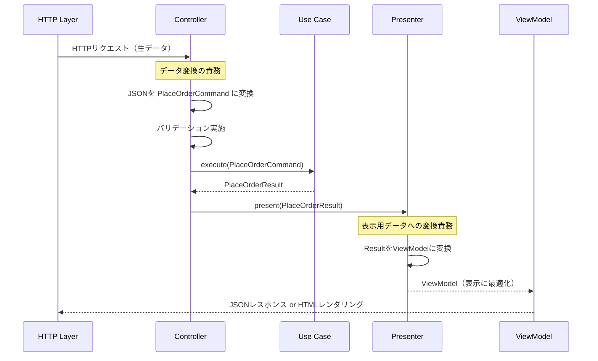
```mermaid
sequenceDiagram
    participant HTTP as HTTP Layer
    participant CTRL as Controller
    participant UC as Use Case
    participant PRES as Presenter
    participant VM as ViewModel

    HTTP->>CTRL: HTTPリクエスト（生データ）

    Note over CTRL: データ変換の責務
    CTRL->>CTRL: JSONを PlaceOrderCommand に変換
    CTRL->>CTRL: バリデーション実施

    CTRL->>UC: execute(PlaceOrderCommand)
    UC-->>CTRL: PlaceOrderResult

    CTRL->>PRES: present(PlaceOrderResult)
    Note over PRES: 表示用データへの変換責務
    PRES->>PRES: ResultをViewModelに変換
    PRES-->>VM: ViewModel（表示に最適化）
    VM-->>HTTP: JSONレスポンス or HTMLレンダリング
```

### 6.3 Controller実装例（FastAPI）

```python
from fastapi import APIRouter, Depends, HTTPException, status
from pydantic import BaseModel, Field
from typing import List
import logging

logger = logging.getLogger(__name__)
router = APIRouter(prefix="/v1/orders", tags=["orders"])


# ─── リクエスト・レスポンスモデル（HTTP層のDTOは外側の詳細）───

class OrderItemInput(BaseModel):
    product_id: str = Field(..., min_length=1)
    quantity:   int = Field(..., ge=1)


class CreateOrderRequest(BaseModel):
    customer_id: str          = Field(..., min_length=1)
    items:       List[OrderItemInput] = Field(..., min_items=1)


class OrderResponse(BaseModel):
    """Presenter がここを生成する"""
    order_id:     str
    status:       str
    total_amount: int
    currency:     str
    message:      str


# ─── Controller ───

@router.post("", status_code=status.HTTP_201_CREATED, response_model=OrderResponse)
async def create_order(
    request: CreateOrderRequest,
    use_case: PlaceOrderUseCase = Depends(get_place_order_use_case),
):
    """
    Controller の責務:
    1. HTTPリクエストをCommandに変換
    2. Use Caseを呼び出す
    3. 結果をHTTPレスポンスに変換（Presenter経由）
    """
    try:
        # HTTPリクエスト → Use Case Input DTOへ変換
        command = PlaceOrderCommand(
            customer_id=request.customer_id,
            items=[
                {"product_id": item.product_id, "quantity": item.quantity}
                for item in request.items
            ],
        )

        # Use Case の実行
        result = use_case.execute(command)

        # Output DTO → HTTP レスポンスへ変換（Presenter の役割）
        return OrderResponse(
            order_id=result.order_id,
            status=result.status,
            total_amount=result.total_amount,
            currency=result.currency,
            message="注文が確定されました",
        )

    except EntityNotFoundError as e:
        raise HTTPException(status_code=404, detail=str(e))
    except BusinessRuleError as e:
        raise HTTPException(status_code=422, detail=str(e))
    except Exception as e:
        logger.error(f"予期しないエラー: {e}", exc_info=True)
        raise HTTPException(status_code=500, detail="内部エラーが発生しました")
```

### 6.4 Repository Adapter実装例（SQLAlchemy）

```python
from sqlalchemy.orm import Session, DeclarativeBase, Mapped, mapped_column
from sqlalchemy import String, Integer, Enum as SAEnum
from typing import Optional


# ─── DBモデル（外側の詳細・ドメインとは別物）───

class Base(DeclarativeBase):
    pass


class OrderModel(Base):
    __tablename__ = "orders"

    id:          Mapped[str]  = mapped_column(String(36), primary_key=True)
    customer_id: Mapped[str]  = mapped_column(String(36), nullable=False)
    status:      Mapped[str]  = mapped_column(String(20), nullable=False)
    total_amount:Mapped[int]  = mapped_column(Integer,    nullable=False)


# ─── Repository Adapter（Interface Adapters層）───

class SQLAlchemyOrderRepository(OrderRepository):
    """
    OrderRepository インターフェースの SQLAlchemy 実装
    ─ DBモデル ↔ ドメインエンティティの変換を担当 ─
    """

    def __init__(self, session: Session):
        self._session = session

    def find_by_id(self, order_id: str) -> Optional[Order]:
        record = (
            self._session.query(OrderModel)
            .filter(OrderModel.id == order_id)
            .first()
        )
        return self._to_domain(record) if record else None

    def save(self, order: Order) -> None:
        existing = self._session.get(OrderModel, order.id)
        model = self._to_model(order)
        if existing:
            for key, value in vars(model).items():
                if not key.startswith("_"):
                    setattr(existing, key, value)
        else:
            self._session.add(model)
        self._session.flush()

    # ─── マッピングメソッド ───

    def _to_domain(self, record: OrderModel) -> Order:
        """DBレコード → ドメインエンティティ変換"""
        order = Order.__new__(Order)
        order.id          = record.id
        order.customer_id = record.customer_id
        order._status     = OrderStatus(record.status)
        order._lines      = []
        return order

    def _to_model(self, order: Order) -> OrderModel:
        """ドメインエンティティ → DBレコード変換"""
        return OrderModel(
            id=order.id,
            customer_id=order.customer_id,
            status=order.status.value,
            total_amount=order.total.amount,
        )
```

---

## 7. Frameworks & Drivers（フレームワーク）層

### 7.1 最外層で行うこと

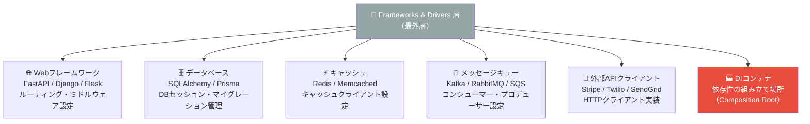
```mermaid
graph TD
    FW_LAYER["🔧 Frameworks & Drivers 層（最外層）"]

    FW_LAYER --> WEB["🌐 Webフレームワーク<br>FastAPI / Django / Flask<br>ルーティング・ミドルウェア設定"]
    FW_LAYER --> DB["🗄️ データベース<br>SQLAlchemy / Prisma<br>DBセッション・マイグレーション管理"]
    FW_LAYER --> CACHE["⚡ キャッシュ<br>Redis / Memcached<br>キャッシュクライアント設定"]
    FW_LAYER --> QUEUE["📨 メッセージキュー<br>Kafka / RabbitMQ / SQS<br>コンシューマー・プロデューサー設定"]
    FW_LAYER --> EXTERNAL["🔌 外部APIクライアント<br>Stripe / Twilio / SendGrid<br>HTTPクライアント実装"]
    FW_LAYER --> DI_CONTAINER["🏭 DIコンテナ<br>依存性の組み立て場所<br>（Composition Root）"]

    style FW_LAYER fill:#95a5a6,color:#fff
    style DI_CONTAINER fill:#e74c3c,color:#fff
```

### 7.2 Composition Root（依存性の組み立て）

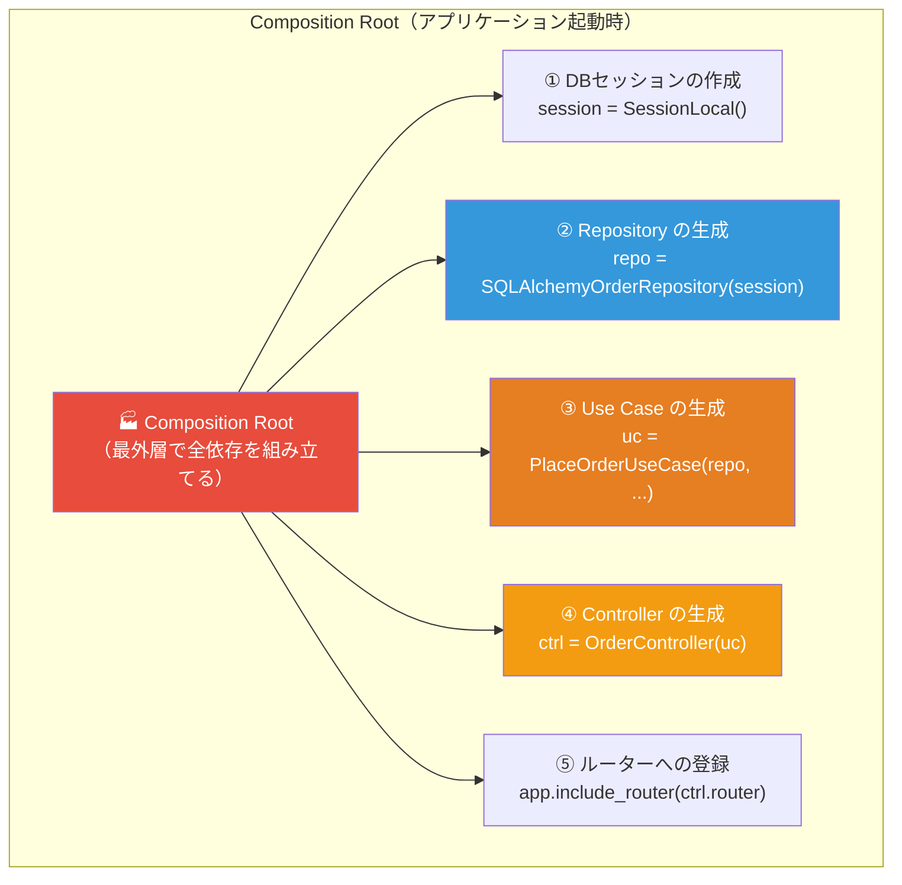
```mermaid
graph TD
    subgraph "Composition Root（アプリケーション起動時）"
        CR["🏭 Composition Root<br>（最外層で全依存を組み立てる）"]

        CR --> DB_INST["① DBセッションの作成<br>session = SessionLocal()"]
        CR --> REPO_INST["② Repository の生成<br>repo = SQLAlchemyOrderRepository(session)"]
        CR --> UC_INST["③ Use Case の生成<br>uc = PlaceOrderUseCase(repo, ...)"]
        CR --> CTRL_INST["④ Controller の生成<br>ctrl = OrderController(uc)"]
        CR --> ROUTE["⑤ ルーターへの登録<br>app.include_router(ctrl.router)"]
    end

    style CR fill:#e74c3c,color:#fff
    style REPO_INST fill:#3498db,color:#fff
    style UC_INST fill:#e67e22,color:#fff
    style CTRL_INST fill:#f39c12,color:#fff
```

### 7.3 Composition Root 実装例（FastAPI）

```python
import os
from fastapi import FastAPI, Depends
from sqlalchemy import create_engine
from sqlalchemy.orm import sessionmaker, Session
from functools import lru_cache

# ─── DB設定 ───

DATABASE_URL = os.environ.get("DATABASE_URL")
if not DATABASE_URL:
    raise RuntimeError("DATABASE_URL が環境変数に設定されていません。")

engine = create_engine(DATABASE_URL, pool_pre_ping=True)
SessionLocal = sessionmaker(bind=engine, autocommit=False, autoflush=False)


def get_db() -> Session:
    """DBセッションの依存性プロバイダー"""
    db = SessionLocal()
    try:
        yield db
    finally:
        db.close()


# ─── 依存性の組み立て（Composition Root）───

def get_order_repository(db: Session = Depends(get_db)) -> OrderRepository:
    """Repository の生成"""
    return SQLAlchemyOrderRepository(session=db)


def get_product_repository(db: Session = Depends(get_db)) -> ProductRepository:
    return SQLAlchemyProductRepository(session=db)


def get_customer_repository(db: Session = Depends(get_db)) -> CustomerRepository:
    return SQLAlchemyCustomerRepository(session=db)


def get_event_publisher() -> EventPublisher:
    return KafkaEventPublisher(bootstrap_servers="localhost:9092")


def get_place_order_use_case(
    order_repo:    OrderRepository    = Depends(get_order_repository),
    product_repo:  ProductRepository  = Depends(get_product_repository),
    customer_repo: CustomerRepository = Depends(get_customer_repository),
    event_pub:     EventPublisher     = Depends(get_event_publisher),
) -> PlaceOrderUseCase:
    """Use Case の生成（全依存を注入）"""
    return PlaceOrderUseCase(
        order_repository=order_repo,
        product_repository=product_repo,
        customer_repository=customer_repo,
        event_publisher=event_pub,
    )


# ─── FastAPI アプリケーションの生成 ───

def create_app() -> FastAPI:
    app = FastAPI(title="ECサイト注文API", version="1.0.0")
    app.include_router(router)
    return app

app = create_app()
```

---

## 8. 依存性注入（Dependency Injection）

### 8.1 DIの3つのパターン

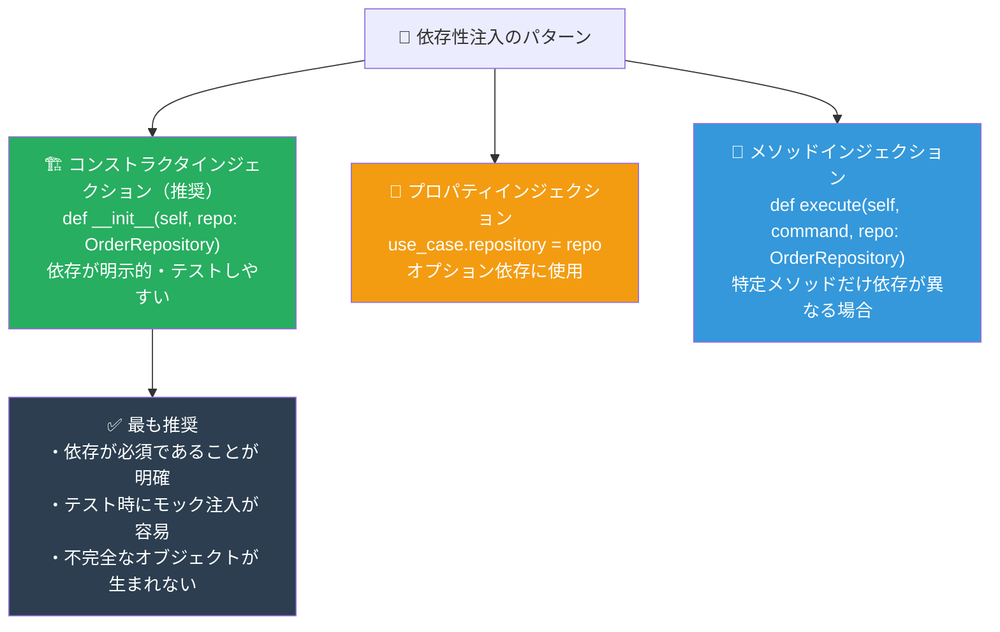
```mermaid
graph TD
    DI["💉 依存性注入のパターン"]

    DI --> CONSTRUCTOR["🏗️ コンストラクタインジェクション（推奨）<br>def __init__(self, repo: OrderRepository)<br>依存が明示的・テストしやすい"]

    DI --> PROPERTY["📌 プロパティインジェクション<br>use_case.repository = repo<br>オプション依存に使用"]

    DI --> METHOD["🔧 メソッドインジェクション<br>def execute(self, command, repo: OrderRepository)<br>特定メソッドだけ依存が異なる場合"]

    CONSTRUCTOR --> BEST["✅ 最も推奨<br>・依存が必須であることが明確<br>・テスト時にモック注入が容易<br>・不完全なオブジェクトが生まれない"]

    style CONSTRUCTOR fill:#27ae60,color:#fff
    style PROPERTY fill:#f39c12,color:#fff
    style METHOD fill:#3498db,color:#fff
    style BEST fill:#2c3e50,color:#fff
```

### 8.2 DIとテスタビリティの関係

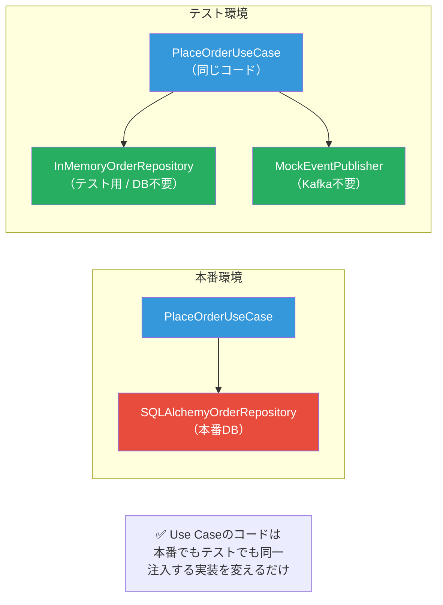
```mermaid
graph LR
    subgraph "本番環境"
        PROD_UC["PlaceOrderUseCase"]
        PROD_REPO["SQLAlchemyOrderRepository<br>（本番DB）"]
        PROD_UC --> PROD_REPO
    end

    subgraph "テスト環境"
        TEST_UC["PlaceOrderUseCase<br>（同じコード）"]
        TEST_REPO["InMemoryOrderRepository<br>（テスト用 / DB不要）"]
        MOCK_PUB["MockEventPublisher<br>（Kafka不要）"]
        TEST_UC --> TEST_REPO
        TEST_UC --> MOCK_PUB
    end

    NOTE["✅ Use Caseのコードは<br>本番でもテストでも同一<br>注入する実装を変えるだけ"]

    style PROD_UC fill:#3498db,color:#fff
    style TEST_UC fill:#3498db,color:#fff
    style PROD_REPO fill:#e74c3c,color:#fff
    style TEST_REPO fill:#27ae60,color:#fff
    style MOCK_PUB fill:#27ae60,color:#fff
```

---

## 9. ディレクトリ構成とパッケージ設計

### 9.1 推奨ディレクトリ構成

```text
my_app/
│
├── domain/                          # Entities層（最内側）
│   ├── __init__.py
│   ├── entities/
│   │   ├── order.py                 # Order, OrderLine, OrderStatus
│   │   ├── product.py               # Product
│   │   └── customer.py              # Customer
│   ├── value_objects/
│   │   ├── money.py                 # Money
│   │   └── address.py               # Address
│   └── exceptions.py                # BusinessRuleError など
│
├── application/                     # Use Cases層
│   ├── __init__.py
│   ├── use_cases/
│   │   ├── place_order.py           # PlaceOrderUseCase
│   │   ├── cancel_order.py          # CancelOrderUseCase
│   │   └── get_order.py             # GetOrderUseCase
│   ├── interfaces/                  # リポジトリ・サービスのインターフェース
│   │   ├── order_repository.py      # OrderRepository (ABC)
│   │   ├── product_repository.py    # ProductRepository (ABC)
│   │   └── event_publisher.py       # EventPublisher (ABC)
│   └── dtos/
│       ├── commands.py              # PlaceOrderCommand など
│       └── results.py               # PlaceOrderResult など
│
├── adapters/                        # Interface Adapters層
│   ├── __init__.py
│   ├── controllers/
│   │   ├── order_controller.py      # HTTP Controller（FastAPI Router）
│   │   └── product_controller.py
│   ├── presenters/
│   │   └── order_presenter.py       # Result → JSON変換
│   └── repositories/
│       ├── sqlalchemy_order_repo.py # SQLAlchemy実装
│       ├── sqlalchemy_product_repo.py
│       └── in_memory_order_repo.py  # テスト用実装
│
├── infrastructure/                  # Frameworks & Drivers層
│   ├── __init__.py
│   ├── database/
│   │   ├── models.py               # SQLAlchemyモデル定義
│   │   ├── session.py              # DBセッション設定
│   │   └── migrations/             # Alembicマイグレーション
│   ├── messaging/
│   │   └── kafka_publisher.py      # Kafka Event Publisher実装
│   └── external/
│       └── stripe_payment.py       # Stripe APIクライアント
│
├── main.py                          # アプリケーションエントリポイント
│                                    # Composition Root
└── tests/
    ├── unit/
    │   ├── domain/                  # エンティティのユニットテスト
    │   └── application/             # ユースケースのユニットテスト
    ├── integration/
    │   └── adapters/                # DB操作の統合テスト
    └── e2e/
        └── api/                     # APIのE2Eテスト
```

### 9.2 パッケージ間の依存関係

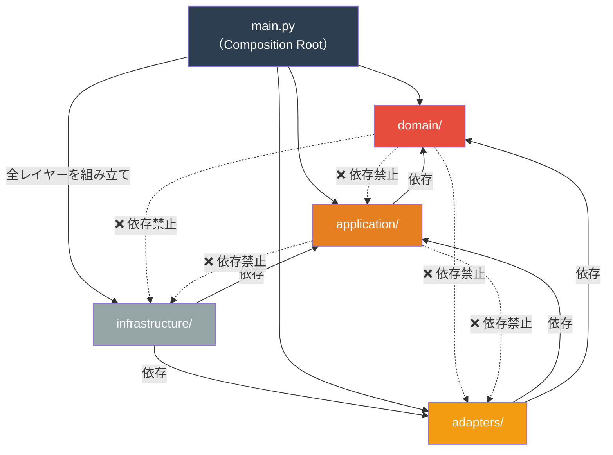
```mermaid
graph TD
    DOM["domain/"]
    APP["application/"]
    ADP["adapters/"]
    INF["infrastructure/"]
    MAIN["main.py<br>（Composition Root）"]

    APP -->|"依存"| DOM
    ADP -->|"依存"| APP
    ADP -->|"依存"| DOM
    INF -->|"依存"| ADP
    INF -->|"依存"| APP
    MAIN -->|"全レイヤーを組み立て"| INF
    MAIN --> ADP
    MAIN --> APP
    MAIN --> DOM

    DOM -.->|"❌ 依存禁止"| APP
    DOM -.->|"❌ 依存禁止"| ADP
    DOM -.->|"❌ 依存禁止"| INF
    APP -.->|"❌ 依存禁止"| ADP
    APP -.->|"❌ 依存禁止"| INF

    style DOM fill:#e74c3c,color:#fff
    style APP fill:#e67e22,color:#fff
    style ADP fill:#f39c12,color:#fff
    style INF fill:#95a5a6,color:#fff
    style MAIN fill:#2c3e50,color:#fff
```

---

## 10. クリーンアーキテクチャのテスト戦略

### 10.1 レイヤー別テスト戦略

```mermaid
graph TD
    subgraph "テストピラミッド（クリーンアーキテクチャ版）"
        E2E_T["E2Eテスト（少数）<br>HTTP経由で実際のシナリオを検証<br>ツール：pytest + httpx / Playwright"]
        INT_T["統合テスト（中程度）<br>DB・外部サービスを含めたテスト<br>ツール：pytest + TestContainers"]
        UNIT_T["ユニットテスト（多数）<br>Domain + Use Case を DB なしでテスト<br>ツール：pytest"]
    end

    UNIT_T --> INT_T --> E2E_T

    UNIT_T --> UNIT_NOTE["✅ 最も重要・最も速い<br>・エンティティ：new Order() のみで開始<br>・ユースケース：InMemoryRepo を使用"]
    INT_T --> INT_NOTE["⚠️ 中程度<br>・リポジトリ実装のテスト<br>・DB接続が必要（TestContainers推奨）"]
    E2E_T --> E2E_NOTE["⚠️ 少数で十分<br>・重要なシナリオのみ<br>・最も遅い・最も壊れやすい"]

    style UNIT_T fill:#27ae60,color:#fff
    style INT_T fill:#e67e22,color:#fff
    style E2E_T fill:#e74c3c,color:#fff
```

### 10.2 ユニットテスト実装例（pytest）

```python
import pytest
from domain.entities.order import Order, OrderStatus
from domain.value_objects.money import Money
from application.use_cases.place_order import PlaceOrderUseCase, PlaceOrderCommand
from adapters.repositories.in_memory_order_repo import InMemoryOrderRepository


# ─────────────── ドメイン層のユニットテスト ───────────────

class TestOrder:
    """Order エンティティのテスト（モック不要・DB不要）"""

    def test_新規作成したら保留中になること(self):
        order = Order.create(customer_id="cust_123")
        assert order.status == OrderStatus.PENDING

    def test_明細追加後に確定できること(self):
        order = Order.create(customer_id="cust_123")
        order.add_line("prod_001", "Tシャツ", Money(1000), 2)
        order.confirm()
        assert order.status == OrderStatus.CONFIRMED

    def test_明細なしで確定するとエラーになること(self):
        order = Order.create(customer_id="cust_123")
        with pytest.raises(ValueError, match="商品が1件もありません"):
            order.confirm()

    def test_発送済み注文のキャンセルはエラーになること(self):
        order = Order.create(customer_id="cust_123")
        order.add_line("prod_001", "Tシャツ", Money(1000), 1)
        order.confirm()
        order._status = OrderStatus.SHIPPED   # 強制的に状態変更（テスト用）
        with pytest.raises(ValueError, match="発送済み"):
            order.cancel()

    def test_合計金額が正しく計算されること(self):
        order = Order.create(customer_id="cust_123")
        order.add_line("prod_001", "Tシャツ",  Money(1000), 2)
        order.add_line("prod_002", "ジーンズ", Money(5000), 1)
        assert order.total == Money(7000)


# ─────────────── ユースケース層のユニットテスト ───────────────

class TestPlaceOrderUseCase:
    """PlaceOrderUseCase のテスト（InMemoryRepo使用・DB不要）"""

    @pytest.fixture
    def setup(self):
        """テスト用の依存性セットアップ"""
        order_repo    = InMemoryOrderRepository()
        product_repo  = InMemoryProductRepository(products=[
            Product(id="prod_001", name="Tシャツ", price=Money(1000), stock=10),
        ])
        customer_repo = InMemoryCustomerRepository(customers=[
            Customer(id="cust_123", name="山田太郎", is_active=True),
        ])
        event_pub     = InMemoryEventPublisher()

        use_case = PlaceOrderUseCase(
            order_repository=order_repo,
            product_repository=product_repo,
            customer_repository=customer_repo,
            event_publisher=event_pub,
        )
        return use_case, order_repo, event_pub

    def test_有効なコマンドで注文が作成されること(self, setup):
        use_case, order_repo, _ = setup
        command = PlaceOrderCommand(
            customer_id="cust_123",
            items=[{"product_id": "prod_001", "quantity": 2}],
        )
        result = use_case.execute(command)

        assert result.status == "confirmed"
        assert result.total_amount == 2000
        saved_order = order_repo.find_by_id(result.order_id)
        assert saved_order is not None

    def test_存在しない顧客で注文するとエラーになること(self, setup):
        use_case, _, _ = setup
        command = PlaceOrderCommand(
            customer_id="unknown_customer",
            items=[{"product_id": "prod_001", "quantity": 1}],
        )
        with pytest.raises(EntityNotFoundError):
            use_case.execute(command)

    def test_注文確定後にイベントが発行されること(self, setup):
        use_case, _, event_pub = setup
        command = PlaceOrderCommand(
            customer_id="cust_123",
            items=[{"product_id": "prod_001", "quantity": 1}],
        )
        use_case.execute(command)
        assert len(event_pub.published_events) == 1
        assert isinstance(event_pub.published_events[0], OrderPlacedEvent)
```

### 10.3 テスト速度の比較

```mermaid
xychart-beta
    title "レイヤー別テスト実行時間の比較（100件あたり）"
    x-axis ["Entityユニット", "UCユニット", "Repository統合", "API E2E"]
    y-axis "実行時間（秒）" 0 --> 60
    bar [0.5, 1.2, 15, 55]
```

---

## 11. SOLID原則とクリーンアーキテクチャ

### 11.1 SOLIDとクリーンアーキテクチャの対応関係

```mermaid
graph TD
    SOLID["SOLID原則"]

    SOLID --> SRP["S: 単一責任原則<br>Single Responsibility Principle<br>1クラス = 1つの変更理由"]
    SOLID --> OCP["O: 開放閉鎖原則<br>Open/Closed Principle<br>拡張に開き・修正に閉じる"]
    SOLID --> LSP["L: リスコフ置換原則<br>Liskov Substitution Principle<br>サブクラスは親クラスの代替可能"]
    SOLID --> ISP["I: インターフェース分離原則<br>Interface Segregation Principle<br>小さなインターフェースに分割"]
    SOLID --> DIP["D: 依存性逆転原則<br>Dependency Inversion Principle<br>抽象に依存・具体に依存しない"]

    SRP --> SRP_CA["CA での実現:<br>Controller / UseCase / Repository<br>各クラスの責務を明確に分離"]
    OCP --> OCP_CA["CA での実現:<br>新機能 = 新UseCase追加<br>既存UseCase は修正しない"]
    LSP --> LSP_CA["CA での実現:<br>InMemoryRepo ↔ SQLAlchemyRepo<br>完全に交換可能"]
    ISP --> ISP_CA["CA での実現:<br>OrderRepository を<br>ReadOnly/WriteOnly に分割"]
    DIP --> DIP_CA["CA での実現:<br>UseCase → Interface (抽象)<br>SQLAlchemy → Interface を実装"]

    style SRP fill:#3498db,color:#fff
    style OCP fill:#8e44ad,color:#fff
    style LSP fill:#27ae60,color:#fff
    style ISP fill:#e67e22,color:#fff
    style DIP fill:#e74c3c,color:#fff
```

### 11.2 開放閉鎖原則の適用例

```mermaid
flowchart TD
    subgraph "❌ OCP違反（修正に開いている）"
        UC_BAD2["PlaceOrderUseCase<br>if payment_method == 'credit_card':<br>    stripe_charge()<br>elif payment_method == 'paypal':<br>    paypal_charge()<br>elif payment_method == 'new_method': # ← 毎回修正！<br>    ..."]
    end

    subgraph "✅ OCP準拠（拡張に開いている）"
        IF_PAY["PaymentGateway<br>（インターフェース）"]
        STRIPE["StripeGateway<br>（実装A）"]
        PAYPAL["PayPalGateway<br>（実装B）"]
        NEW["NewMethodGateway<br>（実装C：追加するだけ）"]
        UC_GOOD2["PlaceOrderUseCase<br>gateway.charge(order)<br>← 修正不要！"]

        STRIPE --> IF_PAY
        PAYPAL --> IF_PAY
        NEW --> IF_PAY
        UC_GOOD2 --> IF_PAY
    end

    style UC_BAD2 fill:#e74c3c,color:#fff
    style IF_PAY fill:#e67e22,color:#fff
    style UC_GOOD2 fill:#27ae60,color:#fff
    style NEW fill:#3498db,color:#fff
```

---

## 12. 関連アーキテクチャパターンとの比較

### 12.1 アーキテクチャパターンの比較

```mermaid
graph TD
    subgraph "レイヤードアーキテクチャ（伝統的）"
        LA_P["Presentation"]
        LA_B["Business Logic"]
        LA_D["Data Access"]
        LA_DB[("Database")]
        LA_P --> LA_B --> LA_D --> LA_DB
        LA_NOTE["問題: DBへの依存が上位まで伝播<br>テストにDBが必要"]
    end

    subgraph "クリーンアーキテクチャ"
        CA_EN["Entities（内側）"]
        CA_UC["Use Cases"]
        CA_AD["Adapters"]
        CA_FW["Frameworks（外側）"]
        CA_FW --> CA_AD --> CA_UC --> CA_EN
        CA_NOTE["✅ 依存は内側のみ<br>DBなしでテスト可能"]
    end

    style LA_NOTE fill:#e74c3c,color:#fff
    style CA_NOTE fill:#27ae60,color:#fff
```

### 12.2 ヘキサゴナルアーキテクチャとの違い

```mermaid
graph LR
    subgraph "ヘキサゴナルアーキテクチャ"
        HEX_CORE["Application Core<br>（Domain + Application）"]
        HEX_IN["Inbound Ports<br>（Driving Side）<br>HTTP / CLI / Message"]
        HEX_OUT["Outbound Ports<br>（Driven Side）<br>DB / API / Email"]
        HEX_IN --> HEX_CORE
        HEX_CORE --> HEX_OUT
    end

    subgraph "クリーンアーキテクチャとの対応"
        COMP["✅ 概念的に同一<br>• Application Core = Entities + Use Cases<br>• Inbound Ports = Controllers/Presenters<br>• Outbound Ports = Repository Interfaces<br><br>クリーンアーキテクチャはより詳細に<br>各レイヤーの責務を規定している"]
    end

    style HEX_CORE fill:#e74c3c,color:#fff
    style HEX_IN fill:#3498db,color:#fff
    style HEX_OUT fill:#27ae60,color:#fff
    style COMP fill:#2c3e50,color:#fff
```

### 12.3 フレームワーク別の適用ガイド

```mermaid
graph TD
    subgraph "Python（FastAPI + SQLAlchemy）"
        PY_DOM["domain/ ← 純粋Python"]
        PY_APP["application/ ← 純粋Python"]
        PY_ADP["adapters/ ← Pydantic / SQLAlchemy"]
        PY_INF["infrastructure/ ← FastAPI / Alembic"]
    end

    subgraph "JavaScript/TypeScript（NestJS）"
        JS_DOM["domain/ ← 純粋TypeScript"]
        JS_APP["application/ ← 純粋TypeScript"]
        JS_ADP["adapters/ ← TypeORM Entity"]
        JS_INF["infrastructure/ ← NestJS Module"]
    end

    subgraph "Java（Spring Boot）"
        JA_DOM["domain/ ← 純粋Java"]
        JA_APP["application/ ← 純粋Java"]
        JA_ADP["adapters/ ← JPA Entity"]
        JA_INF["infrastructure/ ← Spring @Controller"]
    end

    style PY_DOM fill:#e74c3c,color:#fff
    style JS_DOM fill:#e74c3c,color:#fff
    style JA_DOM fill:#e74c3c,color:#fff
```

---

## 13. 実践：ECサイト完全実装例

### 13.1 ECサイトのクリーンアーキテクチャ全体像

```mermaid
graph TD
    subgraph "Entities（ドメイン層）"
        E_ORDER["Order<br>Entity"]
        E_PRODUCT["Product<br>Entity"]
        E_CUSTOMER["Customer<br>Entity"]
        E_MONEY["Money<br>Value Object"]
        E_ORDER --> E_MONEY
        E_PRODUCT --> E_MONEY
    end

    subgraph "Use Cases（アプリケーション層）"
        UC1["PlaceOrderUseCase"]
        UC2["CancelOrderUseCase"]
        UC3["GetOrderUseCase"]
        UC4["ListOrdersUseCase"]
        UC_IF1["OrderRepository<br>（Interface）"]
        UC_IF2["ProductRepository<br>（Interface）"]
        UC_IF3["EventPublisher<br>（Interface）"]
        UC1 --> UC_IF1
        UC1 --> UC_IF2
        UC1 --> UC_IF3
    end

    subgraph "Interface Adapters"
        CTRL["OrderController<br>（FastAPI Router）"]
        REPO_SQL["SQLAlchemyOrderRepo<br>（実装）"]
        REPO_MEM["InMemoryOrderRepo<br>（テスト用）"]
        CTRL --> UC1
        CTRL --> UC3
        REPO_SQL -->|"implements"| UC_IF1
        REPO_MEM -->|"implements"| UC_IF1
    end

    subgraph "Frameworks & Drivers"
        FASTAPI["FastAPI App"]
        SQLALCHEMY["SQLAlchemy Engine"]
        KAFKA["Kafka Producer"]
        FASTAPI --> CTRL
        SQLALCHEMY --> REPO_SQL
    end

    style E_ORDER fill:#e74c3c,color:#fff
    style E_PRODUCT fill:#e74c3c,color:#fff
    style E_CUSTOMER fill:#e74c3c,color:#fff
    style UC1 fill:#e67e22,color:#fff
    style CTRL fill:#f39c12,color:#fff
    style FASTAPI fill:#95a5a6,color:#fff
```

### 13.2 注文作成の完全フロー

```mermaid
sequenceDiagram
    participant CLI as HTTP Client
    participant FW as FastAPI<br>(Framework)
    participant CTRL as OrderController<br>(Adapter)
    participant UC as PlaceOrderUseCase<br>(Application)
    participant DOM as Order Entity<br>(Domain)
    participant REPO as SQLAlchemyRepo<br>(Adapter)
    participant DB as PostgreSQL<br>(Framework)
    participant PUB as KafkaPublisher<br>(Framework)

    CLI->>FW: POST /v1/orders {JSON}
    FW->>FW: JWT認証・レート制限
    FW->>CTRL: router.create_order(request)

    Note over CTRL: Adapter: JSON → Command 変換
    CTRL->>UC: execute(PlaceOrderCommand)

    Note over UC: Application: オーケストレーション
    UC->>REPO: find_customer(customer_id)
    REPO->>DB: SELECT * FROM customers
    DB-->>REPO: CustomerRecord
    REPO-->>UC: Customer Entity

    UC->>DOM: Order.create(customer_id)
    DOM-->>UC: Order (PENDING)

    UC->>DOM: order.add_line(product, qty)
    UC->>DOM: order.confirm()
    DOM-->>UC: Order (CONFIRMED)

    UC->>REPO: save(order)
    REPO->>DB: INSERT INTO orders
    DB-->>REPO: ✅

    UC->>PUB: publish(OrderPlacedEvent)
    PUB->>PUB: Kafka トピックに送信

    UC-->>CTRL: PlaceOrderResult
    Note over CTRL: Adapter: Result → HTTP レスポンス変換
    CTRL-->>FW: OrderResponse(201)
    FW-->>CLI: 201 Created {JSON}
```

### 13.3 テストの完全実行例

```python
# tests/unit/application/test_place_order_use_case.py

import pytest
from unittest.mock import MagicMock, call

class TestPlaceOrderUseCase:
    """
    ユースケースの完全なユニットテスト
    ─ DB・Kafka・外部サービス不要 ─
    """

    @pytest.fixture
    def repositories(self):
        """テスト用インメモリリポジトリのセットアップ"""
        return {
            "order_repository": InMemoryOrderRepository(),
            "product_repository": InMemoryProductRepository([
                Product(id="prod_001", name="Tシャツ",
                        price=Money(1000), stock=10),
                Product(id="prod_002", name="ジーンズ",
                        price=Money(5000), stock=3),
            ]),
            "customer_repository": InMemoryCustomerRepository([
                Customer(id="active_customer",  is_active=True),
                Customer(id="inactive_customer", is_active=False),
            ]),
            "event_publisher": InMemoryEventPublisher(),
        }

    @pytest.fixture
    def use_case(self, repositories):
        return PlaceOrderUseCase(**repositories)

    # ─── 正常系テスト ───

    def test_正常な注文作成(self, use_case, repositories):
        result = use_case.execute(PlaceOrderCommand(
            customer_id="active_customer",
            items=[{"product_id": "prod_001", "quantity": 2}],
        ))
        assert result.status == "confirmed"
        assert result.total_amount == 2000

    def test_複数商品の注文(self, use_case):
        result = use_case.execute(PlaceOrderCommand(
            customer_id="active_customer",
            items=[
                {"product_id": "prod_001", "quantity": 2},
                {"product_id": "prod_002", "quantity": 1},
            ],
        ))
        assert result.total_amount == 7000  # 1000*2 + 5000*1

    def test_注文後にイベントが発行される(self, use_case, repositories):
        use_case.execute(PlaceOrderCommand(
            customer_id="active_customer",
            items=[{"product_id": "prod_001", "quantity": 1}],
        ))
        events = repositories["event_publisher"].published_events
        assert len(events) == 1
        assert isinstance(events[0], OrderPlacedEvent)

    # ─── 異常系テスト ───

    def test_存在しない顧客(self, use_case):
        with pytest.raises(EntityNotFoundError, match="顧客が見つかりません"):
            use_case.execute(PlaceOrderCommand(
                customer_id="ghost_customer",
                items=[{"product_id": "prod_001", "quantity": 1}],
            ))

    def test_非アクティブ顧客(self, use_case):
        with pytest.raises(BusinessRuleError, match="ご利用できません"):
            use_case.execute(PlaceOrderCommand(
                customer_id="inactive_customer",
                items=[{"product_id": "prod_001", "quantity": 1}],
            ))

    def test_在庫超過(self, use_case):
        with pytest.raises(BusinessRuleError, match="在庫が不足"):
            use_case.execute(PlaceOrderCommand(
                customer_id="active_customer",
                items=[{"product_id": "prod_001", "quantity": 999}],
            ))
```

---

## 14. 段階的導入ガイド

### 14.1 既存プロジェクトへの段階的移行

```mermaid
flowchart TD
    PHASE0["Phase 0: 現状把握<br>既存コードのアーキテクチャを分析<br>最も痛みの大きい箇所を特定"]

    PHASE1["Phase 1: ドメイン層の分離<br>ビジネスロジックをEntity/Value Objectに抽出<br>フレームワーク依存を除去する"]

    PHASE2["Phase 2: ユースケースの分離<br>サービスクラスをUseCaseに整理<br>インターフェースを定義する"]

    PHASE3["Phase 3: リポジトリパターン導入<br>DB操作をRepositoryに抽出<br>InMemory実装でテストを書く"]

    PHASE4["Phase 4: コントローラーの整理<br>HTTPの詳細とビジネスロジックを分離<br>DTOの変換ロジックを整備"]

    PHASE5["Phase 5: 依存性注入の完成<br>Composition Rootの確立<br>全依存の外部からの注入"]

    PHASE0 --> PHASE1 --> PHASE2 --> PHASE3 --> PHASE4 --> PHASE5

    style PHASE0 fill:#95a5a6,color:#fff
    style PHASE1 fill:#e74c3c,color:#fff
    style PHASE2 fill:#e67e22,color:#fff
    style PHASE3 fill:#f39c12,color:#fff
    style PHASE4 fill:#3498db,color:#fff
    style PHASE5 fill:#27ae60,color:#fff
```

### 14.2 導入ロードマップ（タイムライン）

```mermaid
gantt
    title クリーンアーキテクチャ導入ロードマップ
    dateFormat  YYYY-MM-DD
    section 学習フェーズ
        SOLID原則の習得         :l1, 2025-01-01, 7d
        CA概念・同心円の理解     :l2, after l1, 7d
        小規模サンプル実装       :l3, after l2, 14d
    section 試験的導入
        新機能1つをCA設計で実装  :p1, after l3, 14d
        レビュー・フィードバック  :p2, after p1, 7d
        テスト戦略の確立         :p3, after p2, 7d
    section 本格展開
        既存コードのドメイン抽出 :m1, after p3, 21d
        ユースケース整理         :m2, after m1, 14d
        リポジトリパターン導入   :m3, after m2, 14d
    section 成熟化
        DI完全整備              :f1, after m3, 14d
        テストカバレッジ向上     :f2, after f1, 14d
        チームへの展開・教育     :f3, after f2, 14d
```

---

## 15. ベストプラクティス総まとめ

### 15.1 レイヤー別ベストプラクティス

| レイヤー | やるべきこと | やってはいけないこと |
|---------|-----------|------------------|
| **Entities** | ビジネスルールをEntityに集約 | フレームワークのimport |
| **Entities** | Value ObjectはFrozenに | DBカラム定義を含める |
| **Use Cases** | インターフェースにのみ依存 | 具体的なDB操作を直接書く |
| **Use Cases** | Input/Output DTOで境界を明確に | HTTPリクエストオブジェクトを受け取る |
| **Adapters** | ドメインモデルとDBモデルを分離 | ビジネスロジックを置く |
| **Adapters** | 変換ロジック（Mapper）を明確に | Entityを直接DBに保存する |
| **Frameworks** | 設定・初期化のみ行う | ビジネスロジックを混入させる |
| **Frameworks** | Composition Rootで全依存を組み立て | Use CaseからDBを直接生成 |

### 15.2 クリーンアーキテクチャの成熟度モデル

```mermaid
graph TD
    LV0["Level 0: スパゲッティ<br>ビジネスロジックがControllerに<br>DBアクセスがViewに散乱"]
    LV1["Level 1: レイヤード<br>Controller / Service / Repository の分離<br>ただしDBに強く依存"]
    LV2["Level 2: ドメイン分離<br>EntityとValue Objectを導入<br>ビジネスルールをドメイン層に集約"]
    LV3["Level 3: インターフェース導入<br>Repository IfとUse Caseを分離<br>DBなしでテスト可能"]
    LV4["Level 4: 完全なCA<br>全層の依存が内側のみ<br>フレームワーク交換可能"]
    LV5["Level 5: CA + DDD + EDA<br>Bounded Context + Domain Events<br>マイクロサービスへの展開も容易"]

    LV0 --> LV1 --> LV2 --> LV3 --> LV4 --> LV5

    style LV0 fill:#e74c3c,color:#fff
    style LV1 fill:#e67e22,color:#fff
    style LV2 fill:#f39c12,color:#fff
    style LV3 fill:#27ae60,color:#fff
    style LV4 fill:#3498db,color:#fff
    style LV5 fill:#8e44ad,color:#fff
```

### 15.3 「過剰設計」を避けるための判断基準

```mermaid
flowchart TD
    START["クリーンアーキテクチャを適用するか判断"]

    Q1{"チームが5人以上か<br>または今後拡大予定か？"}
    Q2{"ビジネスロジックが<br>複雑か？<br>（条件分岐が多い）"}
    Q3{"プロジェクトが<br>1年以上続く予定か？"}
    Q4{"複数のフロントエンド<br>（Web/モバイル）があるか？"}

    FULL_CA["✅ フルCA推奨<br>全レイヤーを導入"]
    PARTIAL_CA["⚠️ 部分適用<br>Domain + UseCase層のみ<br>Adapter/FW は軽量に"]
    SIMPLE["📦 シンプルアーキテクチャ<br>MVC or レイヤードで十分<br>過剰設計を避ける"]

    START --> Q1
    Q1 -->|"Yes"| Q2
    Q1 -->|"No"| Q2
    Q2 -->|"Yes"| Q3
    Q2 -->|"No"| SIMPLE
    Q3 -->|"Yes"| Q4
    Q3 -->|"No"| PARTIAL_CA
    Q4 -->|"Yes"| FULL_CA
    Q4 -->|"No"| PARTIAL_CA

    style FULL_CA fill:#27ae60,color:#fff
    style PARTIAL_CA fill:#f39c12,color:#fff
    style SIMPLE fill:#3498db,color:#fff
```

---

## 16. アンチパターン

### 16.1 よくある失敗パターン

```mermaid
graph TD
    subgraph "❌ Anti-Pattern 1: Leaky Abstraction（漏れた抽象）"
        AP1["Use Case が SQLAlchemy Session を直接受け取る<br>def __init__(self, session: Session)  ← NG<br>→ フレームワーク詳細がUse Caseに漏れている"]
        AP1_FIX["解決：Repository インターフェースを介す<br>def __init__(self, repo: OrderRepository)  ← OK"]
    end

    subgraph "❌ Anti-Pattern 2: Fat Entity（太りすぎたEntity）"
        AP2["Entity に HTTP レスポンス生成・メール送信・<br>ログ出力など何でも詰め込む<br>→ 単一責任原則の違反"]
        AP2_FIX["解決：Entity はビジネスルールのみ<br>副作用はUseCase・Domain Eventで処理"]
    end

    subgraph "❌ Anti-Pattern 3: Anemic Domain Model（貧血モデル）"
        AP3["Entity が getter/setter だけで<br>ビジネスロジックが全てService層に<br>→ CAの恩恵が得られない"]
        AP3_FIX["解決：order.confirm() のように<br>ビジネス操作をEntityのメソッドとして定義"]
    end

    subgraph "❌ Anti-Pattern 4: Use Case God Object（神ユースケース）"
        AP4["1つのUseCaseが注文・在庫・決済・通知・<br>配送をすべて処理する巨大クラス"]
        AP4_FIX["解決：1UseCase = 1ビジネスアクション<br>PlaceOrder / ProcessPayment を分割"]
    end

    subgraph "❌ Anti-Pattern 5: Layer Skipping（レイヤースキップ）"
        AP5["Controller が Repository を直接呼び出す<br>Use Caseを飛ばしてDBに直接アクセス"]
        AP5_FIX["解決：必ずUse Caseを経由する<br>Controller → UseCase → Repository"]
    end

    style AP1 fill:#e74c3c,color:#fff
    style AP2 fill:#e74c3c,color:#fff
    style AP3 fill:#e74c3c,color:#fff
    style AP4 fill:#e74c3c,color:#fff
    style AP5 fill:#e74c3c,color:#fff
    style AP1_FIX fill:#27ae60,color:#fff
    style AP2_FIX fill:#27ae60,color:#fff
    style AP3_FIX fill:#27ae60,color:#fff
    style AP4_FIX fill:#27ae60,color:#fff
    style AP5_FIX fill:#27ae60,color:#fff
```

### 16.2 健全性チェックフロー

```mermaid
flowchart TD
    CHECK["クリーンアーキテクチャの健全性チェック"]

    Q1{"domain/ フォルダに<br>SQLAlchemyやFastAPIの<br>importがあるか？"}
    Q2{"Use Case が<br>HTTPリクエストオブジェクトを<br>直接受け取っているか？"}
    Q3{"DBなしで<br>ユースケースの<br>ユニットテストが書けるか？"}
    Q4{"Entity に<br>ビジネスルールが<br>あるか（メソッドがあるか）？"}
    Q5{"Controller が<br>ビジネスロジックを<br>含んでいないか？"}

    FIX1["🔧 依存を取り除く<br>標準ライブラリのみに限定する"]
    FIX2["🔧 DTOで境界を設ける<br>Input/Output DTOを定義する"]
    FIX3["🔧 Repository Interfaceを導入<br>InMemory実装でテストを書く"]
    FIX4["🔧 ビジネスロジックを<br>Entityに移動する（Rich Domain Model）"]
    FIX5["🔧 ロジックをUse Caseへ移動<br>ControllerはHTTP変換のみに"]
    HEALTHY["✅ 健全なクリーンアーキテクチャ"]

    CHECK --> Q1
    Q1 -->|"Yes（importがある）"| FIX1
    Q1 -->|"No"| Q2
    Q2 -->|"Yes"| FIX2
    Q2 -->|"No"| Q3
    Q3 -->|"No（書けない）"| FIX3
    Q3 -->|"Yes"| Q4
    Q4 -->|"No（setter/getterのみ）"| FIX4
    Q4 -->|"Yes"| Q5
    Q5 -->|"No（含んでいる）"| FIX5
    Q5 -->|"Yes"| HEALTHY

    style HEALTHY fill:#27ae60,color:#fff
    style FIX1 fill:#3498db,color:#fff
    style FIX2 fill:#3498db,color:#fff
    style FIX3 fill:#3498db,color:#fff
    style FIX4 fill:#3498db,color:#fff
    style FIX5 fill:#3498db,color:#fff
```

---

## 17. 参考文献・ソース一覧

### 📚 必読書籍

| タイトル | 著者 | 難易度 | 内容 |
|---------|------|--------|------|
| **Clean Architecture: A Craftsman's Guide** | Robert C. Martin | ★★★★☆ | CA原典・Uncle Bobによる決定版 |
| **Clean Code** | Robert C. Martin | ★★★☆☆ | コード品質とアーキテクチャの基礎 |
| **Domain-Driven Design** | Eric Evans | ★★★★★ | DDDとCAの組み合わせに必須 |
| **Implementing Domain-Driven Design** | Vaughn Vernon | ★★★★☆ | DDDの実践的実装（CA適用例多数） |
| **Architecture Patterns with Python** | Harry Percival, Bob Gregory | ★★★☆☆ | PythonでのCA・DDD実践書 |
| **Designing Data-Intensive Applications** | Martin Kleppmann | ★★★★★ | 大規模システムでのCA適用 |

### 🌐 公式ドキュメント・URL

#### クリーンアーキテクチャ原典

| リソース | URL |
|---------|-----|
| **The Clean Architecture（Uncle Bob 原文ブログ）** | https://blog.cleancoder.com/uncle-bob/2012/08/13/the-clean-architecture.html |
| **Robert C. Martin 公式ブログ** | https://blog.cleancoder.com/ |
| **Clean Architecture（書籍公式）** | https://www.goodreads.com/book/show/18043011-clean-architecture |

#### ヘキサゴナルアーキテクチャ関連

| リソース | URL |
|---------|-----|
| **Hexagonal Architecture（Alistair Cockburn 原文）** | https://alistair.cockburn.us/hexagonal-architecture/ |
| **Ports and Adapters（詳細解説）** | https://herbertograca.com/2017/09/14/ports-adapters-architecture/ |

#### アーキテクチャ解説

| リソース | URL |
|---------|-----|
| **Martin Fowler - Patterns of Enterprise Application Architecture** | https://www.martinfowler.com/eaaCatalog/ |
| **Martin Fowler - Domain Model** | https://martinfowler.com/eaaCatalog/domainModel.html |
| **Martin Fowler - Repository Pattern** | https://martinfowler.com/eaaCatalog/repository.html |
| **Martin Fowler - Anemic Domain Model（アンチパターン）** | https://martinfowler.com/bliki/AnemicDomainModel.html |
| **The Onion Architecture（Jeffrey Palermo）** | https://jeffreypalermo.com/2008/07/the-onion-architecture-part-1/ |

#### Python実装例・リファレンス

| リソース | URL |
|---------|-----|
| **Architecture Patterns with Python（無料オンライン版）** | https://www.cosmicpython.com/ |
| **Cosmic Python GitHub（サンプルコード）** | https://github.com/cosmicpython/book |
| **FastAPI Clean Architecture サンプル** | https://github.com/tiangolo/full-stack-fastapi-template |

#### SOLID原則

| リソース | URL |
|---------|-----|
| **SOLID原則（Uncle Bob 解説）** | https://blog.cleancoder.com/uncle-bob/2020/10/18/Solid-Relevance.html |
| **Dependency Inversion Principle（詳細）** | https://martinfowler.com/articles/dipInTheWild.html |

#### テスト関連

| リソース | URL |
|---------|-----|
| **Martin Fowler - Test Pyramid** | https://martinfowler.com/articles/practical-test-pyramid.html |
| **Pytest 公式ドキュメント** | https://docs.pytest.org/ |
| **TestContainers（統合テスト用）** | https://testcontainers.com/ |

#### 学習リソース・コミュニティ

| リソース | URL |
|---------|-----|
| **DDD Community** | https://dddcommunity.org/ |
| **Awesome Clean Architecture（GitHub）** | https://github.com/serodari/awesome-clean-architecture |
| **InfoQ Architecture Articles** | https://www.infoq.com/architecture-design/ |
\n---\n\n*作成者：World-Class Software Architect Guide | バージョン 1.0 | Clean Architecture Complete Guide*
