# 🧩 コンポーネント指向開発（Component-Oriented Development）完全ガイド

## 📚 目次

1. [コンポーネント指向開発とは何か？](#1-コンポーネント指向開発とは何か)
2. [コンポーネントの設計原則](#2-コンポーネントの設計原則)
3. [コンポーネントの分類と粒度](#3-コンポーネントの分類と粒度)
4. [コンポーネント間の通信パターン](#4-コンポーネント間の通信パターン)
5. [UIコンポーネント設計（フロントエンド）](#5-uiコンポーネント設計フロントエンド)
6. [バックエンドコンポーネント設計](#6-バックエンドコンポーネント設計)
7. [コンポーネントのライフサイクル管理](#7-コンポーネントのライフサイクル管理)
8. [依存性管理と疎結合設計](#8-依存性管理と疎結合設計)
9. [コンポーネントのテスト戦略](#9-コンポーネントのテスト戦略)
10. [コンポーネントライブラリとデザインシステム](#10-コンポーネントライブラリとデザインシステム)
11. [マイクロフロントエンド・マイクロサービスとの統合](#11-マイクロフロントエンドマイクロサービスとの統合)
12. [実践：ECサイト完全コンポーネント実装例](#12-実践ecサイト完全コンポーネント実装例)
13. [コンポーネントのアンチパターン](#13-コンポーネントのアンチパターン)
14. [ベストプラクティス総まとめ](#14-ベストプラクティス総まとめ)
15. [参考文献・ソース一覧](#15-参考文献ソース一覧)

---

## 1. コンポーネント指向開発とは何か？

### 1.1 定義

**コンポーネント指向開発（Component-Oriented Development / COD）** とは、ソフトウェアシステムを**再利用可能・独立した「コンポーネント」の集合体**として設計・構築する開発パラダイムです。各コンポーネントは明確に定義されたインターフェースを持ち、内部実装を隠蔽しながら外部と協調します。

> 💡 **一言で言うと：**「システムを LEGO ブロックのように、独立した部品に分けて組み立てる考え方」

### 1.2 コンポーネントとは何か？

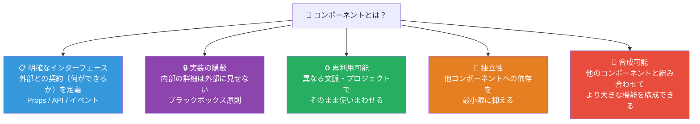

### 1.3 OOP との違い・関係性

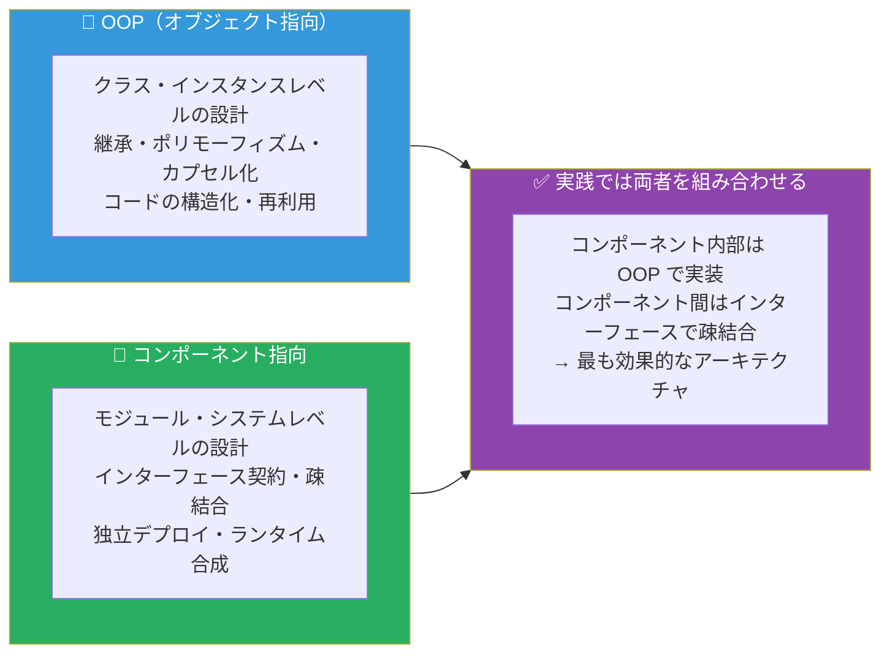

### 1.4 コンポーネント指向の歴史と現在

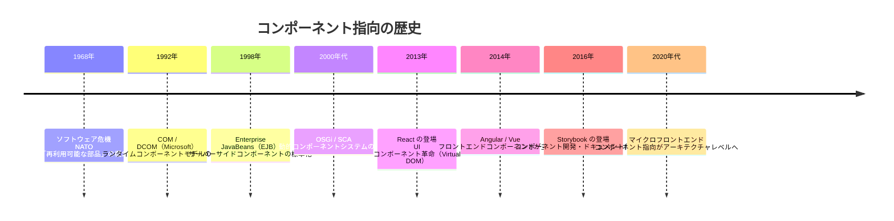

### 1.5 なぜコンポーネント指向が重要なのか

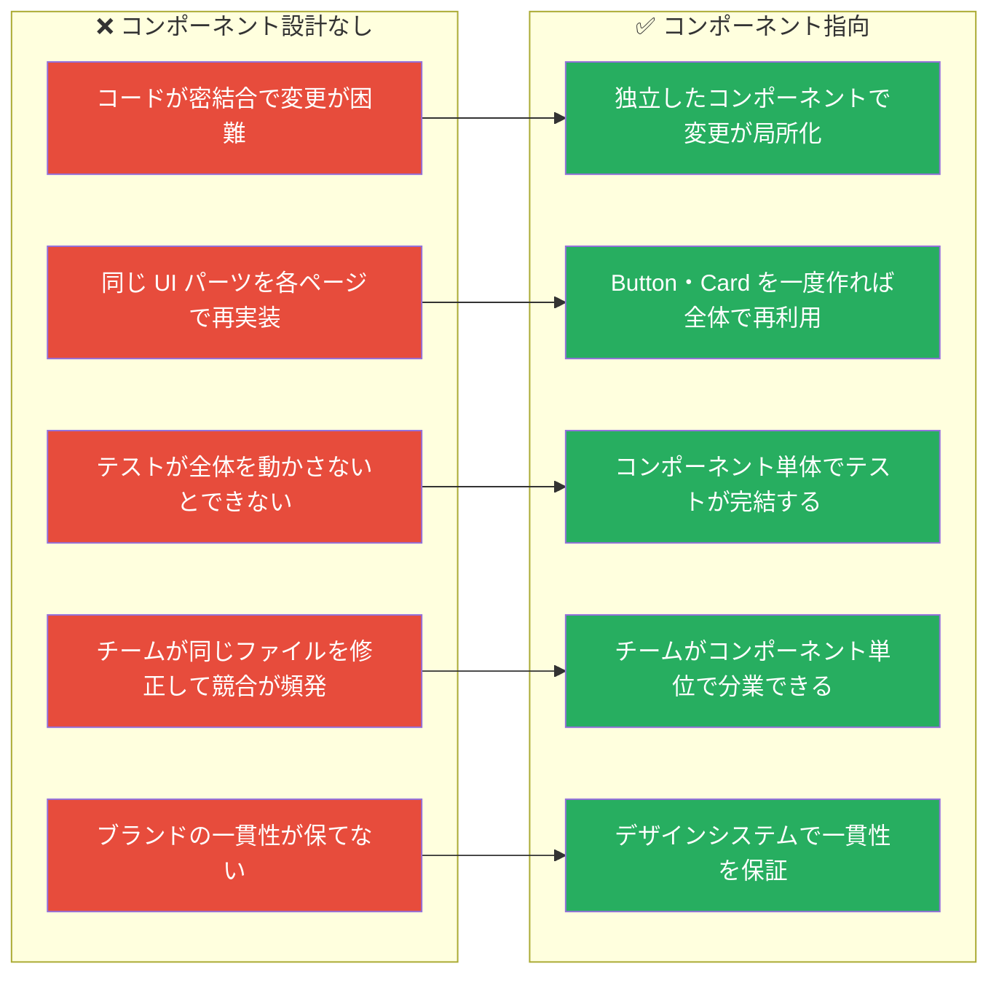

---

## 2. コンポーネントの設計原則

### 2.1 コンポーネント設計の5原則（CCP・CRP・ADP・SDP・SAP）

Robert C. Martin が提唱したコンポーネント設計の原則群です。

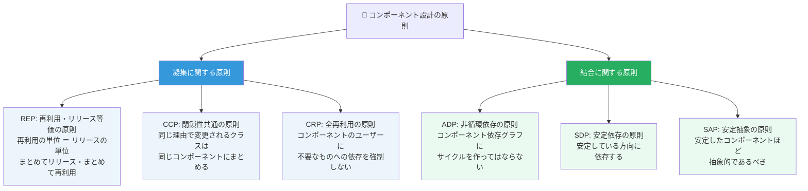

### 2.2 高凝集・低結合の原則

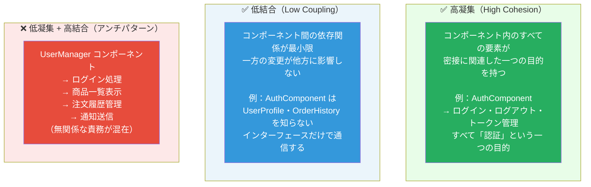

### 2.3 インターフェース契約（Contract）の設計

コンポーネントのインターフェースは「契約」です。変更しにくく、明確に定義します。

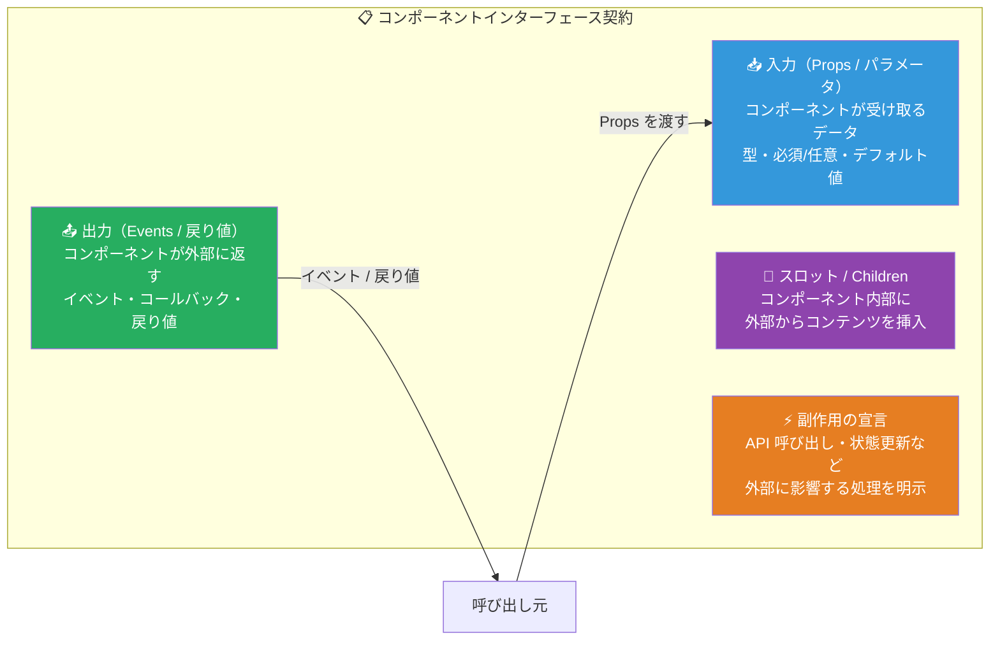

---

## 3. コンポーネントの分類と粒度

### 3.1 アトミックデザイン（Atomic Design）

Brad Frost が提唱した、UI コンポーネントを化学構造になぞらえて整理するシステムです。

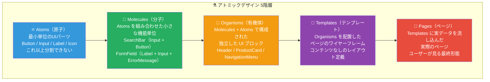

### 3.2 各レベルの具体例（ECサイト）

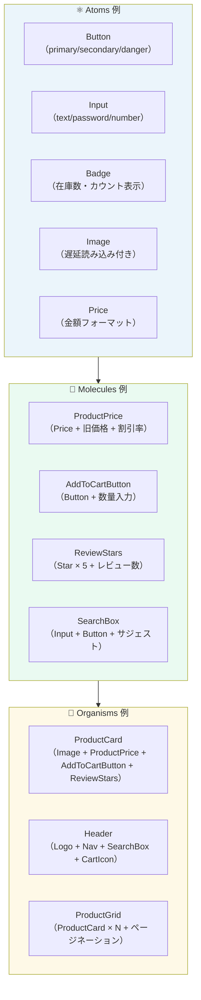

### 3.3 コンポーネントの責務による分類

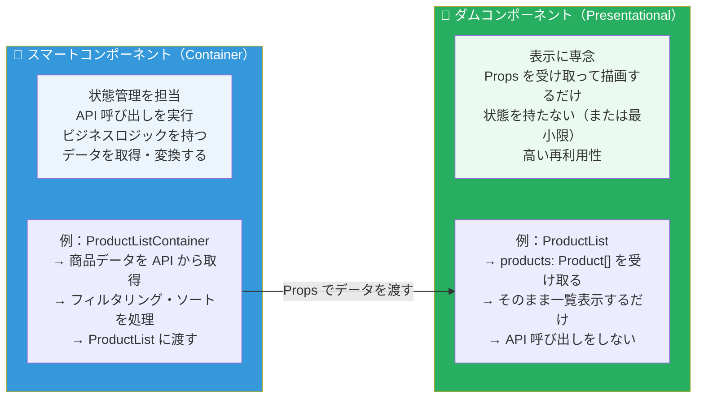

### 3.4 コンポーネント粒度の決定フロー

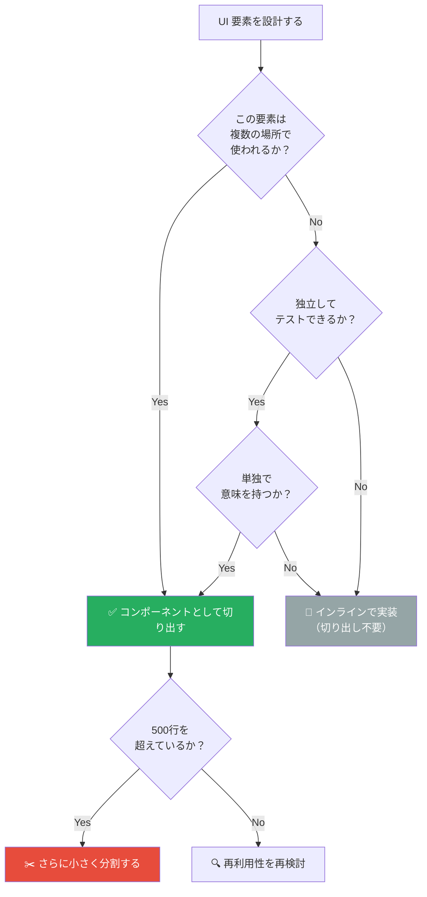

---

## 4. コンポーネント間の通信パターン

### 4.1 通信パターンの全体像

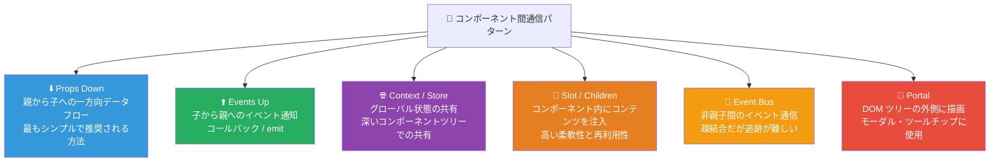

### 4.2 Props Down / Events Up パターン（基本）

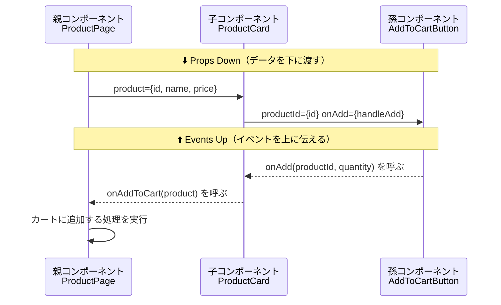

### 4.3 Context / Store パターン（グローバル状態）

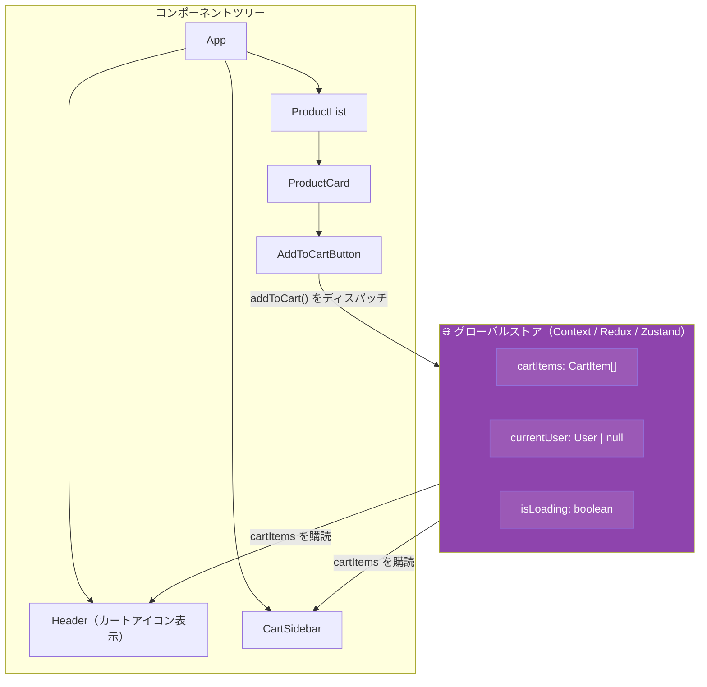

### 4.4 Slot / Children パターン（合成）

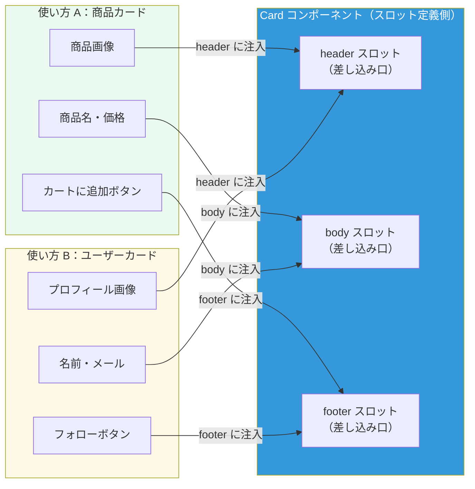

### 4.5 通信パターンの使い分けガイド

| 状況 | 推奨パターン | 理由 |
|------|------------|------|
| 親子間のデータ受け渡し | Props Down | シンプルで追跡しやすい |
| 子から親への通知 | Events Up（コールバック） | 一方向フローを保てる |
| 2〜3階層を超えた共有 | Context / Store | Props Drilling を回避 |
| ログイン状態・テーマ等 | Context | アプリ全体での共有に適す |
| 親子でないコンポーネント間 | Store / Event Bus | 直接の依存を避ける |
| 柔軟な UI 合成 | Slot / Children | レイアウトや内容を外部化 |

---

## 5. UIコンポーネント設計（フロントエンド）

### 5.1 React コンポーネント設計のベストプラクティス

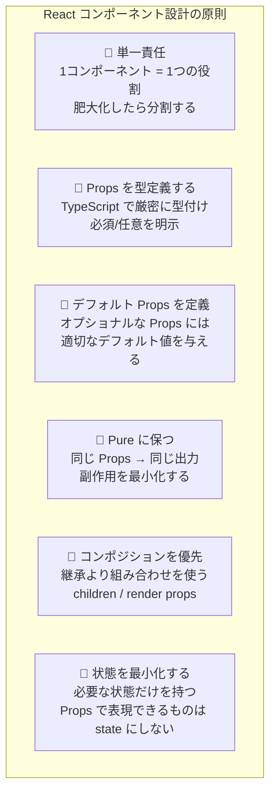

### 5.2 React コンポーネント実装例

**Button コンポーネント（Atom）：**

```tsx
// components/atoms/Button/Button.tsx

import React from 'react';
import styles from './Button.module.css';

// ✅ Props を厳密に型定義
type ButtonVariant = 'primary' | 'secondary' | 'danger' | 'ghost';
type ButtonSize = 'sm' | 'md' | 'lg';

interface ButtonProps {
  // 必須 Props
  children: React.ReactNode;
  onClick: () => void;

  // オプション Props（デフォルト値付き）
  variant?: ButtonVariant;
  size?: ButtonSize;
  disabled?: boolean;
  loading?: boolean;
  fullWidth?: boolean;

  // アクセシビリティ
  ariaLabel?: string;
  type?: 'button' | 'submit' | 'reset';
}

// ✅ 関数コンポーネント + TypeScript
export const Button: React.FC<ButtonProps> = ({
  children,
  onClick,
  variant = 'primary',    // デフォルト値
  size = 'md',
  disabled = false,
  loading = false,
  fullWidth = false,
  ariaLabel,
  type = 'button',
}) => {
  const handleClick = () => {
    if (!disabled && !loading) {
      onClick();
    }
  };

  return (
    <button
      type={type}
      className={[
        styles.button,
        styles[variant],
        styles[size],
        fullWidth ? styles.fullWidth : '',
        loading ? styles.loading : '',
      ].filter(Boolean).join(' ')}
      onClick={handleClick}
      disabled={disabled || loading}
      aria-label={ariaLabel}
      aria-busy={loading}
    >
      {loading ? (
        <span className={styles.spinner} aria-hidden="true" />
      ) : null}
      <span className={loading ? styles.hidden : ''}>{children}</span>
    </button>
  );
};

// ✅ コンポーネントの表示名（デバッグ用）
Button.displayName = 'Button';

export default Button;
```

**ProductCard コンポーネント（Organism）：**

```tsx
// components/organisms/ProductCard/ProductCard.tsx

import React, { useState, useCallback } from 'react';
import { Button } from '@/components/atoms/Button';
import { Badge } from '@/components/atoms/Badge';
import { Price } from '@/components/atoms/Price';
import { ReviewStars } from '@/components/molecules/ReviewStars';
import type { Product } from '@/types/product';

interface ProductCardProps {
  product: Product;
  onAddToCart: (productId: string, quantity: number) => void;
  onWishlist?: (productId: string) => void;
  showReviews?: boolean;
}

// ✅ ダムコンポーネント：Props を受け取って表示するだけ
export const ProductCard: React.FC<ProductCardProps> = ({
  product,
  onAddToCart,
  onWishlist,
  showReviews = true,
}) => {
  const [quantity, setQuantity] = useState(1);
  const [isAdding, setIsAdding] = useState(false);

  const handleAddToCart = useCallback(async () => {
    setIsAdding(true);
    try {
      await onAddToCart(product.id, quantity);
    } catch (error) {
      console.error('Failed to add to cart:', error);
      // 必要に応じてユーザーへの通知処理などをここに追加
    } finally {
      setIsAdding(false);
    }
  }, [product.id, quantity, onAddToCart]);

  return (
    <article
      className="product-card"
      data-testid={`product-card-${product.id}`}
    >
      {/* 商品画像 */}
      <div className="product-card__image-wrapper">
        
        {product.isNew && <Badge variant="new">NEW</Badge>}
        {product.discountRate > 0 && (
          <Badge variant="sale">{product.discountRate}% OFF</Badge>
        )}
      </div>

      {/* 商品情報 */}
      <div className="product-card__body">
        <h3 className="product-card__name">{product.name}</h3>
        <Price
          current={product.price}
          original={product.originalPrice}
          currency="JPY"
        />
        {showReviews && (
          <ReviewStars
            rating={product.rating}
            reviewCount={product.reviewCount}
          />
        )}
      </div>

      {/* アクション */}
      <div className="product-card__footer">
        <Button
          onClick={handleAddToCart}
          loading={isAdding}
          disabled={product.stockCount === 0}
          fullWidth
        >
          {product.stockCount === 0 ? '在庫切れ' : 'カートに追加'}
        </Button>
        {onWishlist && (
          <Button
            variant="ghost"
            onClick={() => onWishlist(product.id)}
            ariaLabel="ウィッシュリストに追加"
          >
            ♡
          </Button>
        )}
      </div>
    </article>
  );
};
```

### 5.3 Custom Hooks：ロジックのコンポーネント化

Custom Hooks はロジックをコンポーネントとして再利用する React のパターンです。

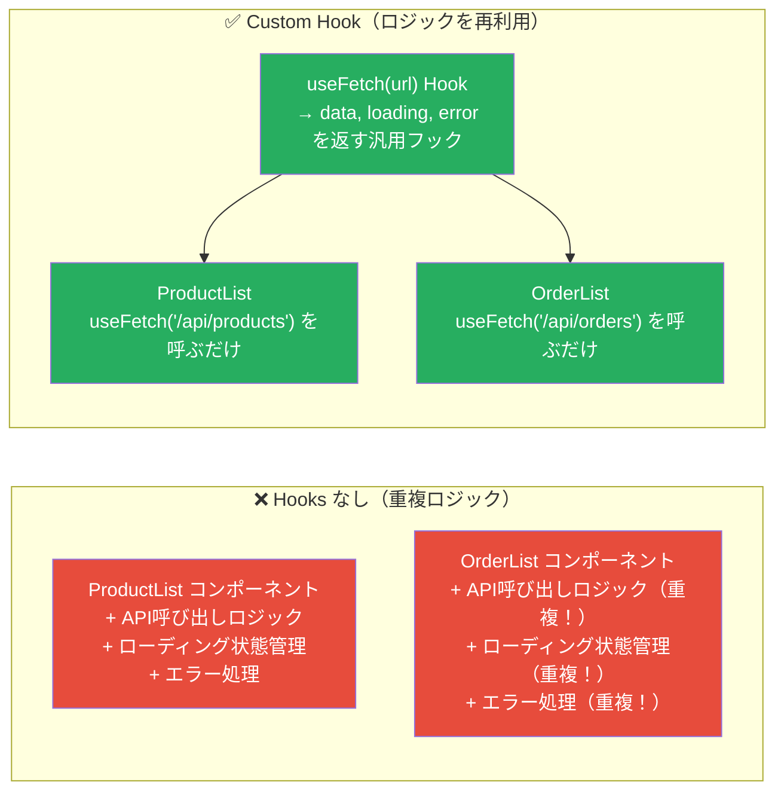

```tsx
// hooks/useFetch.ts — ロジックを再利用可能なコンポーネントとして抽出

import { useState, useEffect, useCallback } from 'react';

interface FetchState<T> {
  data: T | null;
  loading: boolean;
  error: Error | null;
  refetch: () => void;
}

// ✅ 汎用フェッチフック（ロジックの再利用）
function useFetch<T>(url: string): FetchState<T> {
  const [data, setData] = useState<T | null>(null);
  const [loading, setLoading] = useState(true);
  const [error, setError] = useState<Error | null>(null);
  const [trigger, setTrigger] = useState(0);

  const refetch = useCallback(() => setTrigger(prev => prev + 1), []);

  useEffect(() => {
    const controller = new AbortController();

    const fetchData = async () => {
      setLoading(true);
      setError(null);
      try {
        const response = await fetch(url, { signal: controller.signal });
        if (!response.ok) {
          throw new Error(`HTTP ${response.status}: ${response.statusText}`);
        }
        const json = await response.json();
        setData(json);
      } catch (err) {
        if ((err as Error).name === 'AbortError') {
          return; // アボート時は状態更新をスキップ
        }
        setError(err instanceof Error ? err : new Error('不明なエラー'));
      } finally {
        if (!controller.signal.aborted) {
          setLoading(false);
        }
      }
    };

    fetchData();

    // クリーンアップ：アンマウント時にリクエストを中断
    return () => {
      controller.abort();
    };
  }, [url, trigger]);

  return { data, loading, error, refetch };
}

// ✅ 使い方（ProductList コンポーネントで）
const ProductList: React.FC = () => {
  const { data: products, loading, error, refetch } = useFetch<Product[]>('/api/products');

  if (loading) return <Spinner />;
  if (error) return <ErrorMessage message={error.message} onRetry={refetch} />;

  return <ProductGrid products={products ?? []} />;
};
```

### 5.4 Vue コンポーネント設計（Composition API）

```vue
<!-- components/organisms/ProductCard/ProductCard.vue -->
<template>
  <article :data-testid="`product-card-${product.id}`" class="product-card">
    <!-- 商品画像エリア -->
    <div class="product-card__image-wrapper">
      
      <Badge v-if="product.isNew" variant="new">NEW</Badge>
    </div>

    <!-- 商品情報エリア -->
    <div class="product-card__body">
      <h3 class="product-card__name">{{ product.name }}</h3>
      <Price :current="product.price" :original="product.originalPrice" />
      <ReviewStars
        v-if="showReviews"
        :rating="product.rating"
        :review-count="product.reviewCount"
      />
    </div>

    <!-- アクションエリア -->
    <div class="product-card__footer">
      <Button
        :loading="isAdding"
        :disabled="product.stockCount === 0"
        full-width
        @click="handleAddToCart"
      >
        {{ product.stockCount === 0 ? '在庫切れ' : 'カートに追加' }}
      </Button>
    </div>
  </article>
</template>

<script setup lang="ts">
import { ref } from 'vue';
import type { Product } from '@/types/product';

// ✅ Props を TypeScript で型定義
interface Props {
  product: Product;
  showReviews?: boolean;
}

const props = withDefaults(defineProps<Props>(), {
  showReviews: true,
});

// ✅ イベントを型定義
const emit = defineEmits<{
  addToCart: [productId: string, quantity: number];
  wishlist: [productId: string];
}>();

// ローカル状態（最小限）
const isAdding = ref(false);

const handleAddToCart = async () => {
  isAdding.value = true;
  try {
    emit('addToCart', props.product.id, 1);
  } finally {
    isAdding.value = false;
  }
};
</script>
```

---

## 6. バックエンドコンポーネント設計

### 6.1 バックエンドにおけるコンポーネントの概念

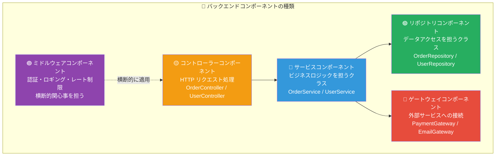

### 6.2 NestJS によるコンポーネント設計

NestJS は Angular の影響を受けた、TypeScript ファーストのバックエンドフレームワークで、コンポーネント指向を強力にサポートします。

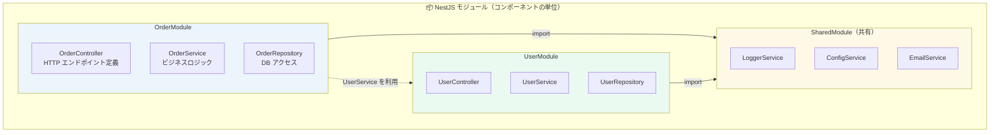

```typescript
// order/order.module.ts
// ✅ モジュール：コンポーネントをまとめる単位

import { Module } from '@nestjs/common';
import { TypeOrmModule } from '@nestjs/typeorm';
import { OrderController } from './order.controller';
import { OrderService } from './order.service';
import { OrderRepository } from './order.repository';
import { OrderEntity } from './entities/order.entity';
import { UserModule } from '../user/user.module';

@Module({
  imports: [
    TypeOrmModule.forFeature([OrderEntity]),
    UserModule, // UserService を利用するためにインポート
  ],
  controllers: [OrderController],  // HTTP エンドポイント
  providers: [OrderService, OrderRepository],  // ビジネスロジック・データアクセス
  exports: [OrderService],  // 他モジュールから利用可能にする
})
export class OrderModule {}
```

```typescript
// order/order.service.ts
// ✅ サービスコンポーネント：ビジネスロジック担当

import { Injectable, NotFoundException, BadRequestException } from '@nestjs/common';
import { OrderRepository } from './order.repository';
import { UserService } from '../user/user.service';
import { CreateOrderDto } from './dto/create-order.dto';
import type { Order } from './entities/order.entity';

@Injectable()  // ✅ DI コンテナに登録
export class OrderService {
  constructor(
    private readonly orderRepository: OrderRepository,  // 注入
    private readonly userService: UserService,          // 注入（疎結合）
  ) {}

  async createOrder(dto: CreateOrderDto): Promise<Order> {
    // ユーザーの存在確認
    const user = await this.userService.findById(dto.customerId);
    if (!user) {
      throw new NotFoundException(`顧客が見つかりません: ${dto.customerId}`);
    }
    if (!user.isActive) {
      throw new BadRequestException('非アクティブなユーザーは注文できません');
    }

    // 注文を作成して保存
    const order = this.orderRepository.create({
      customerId: dto.customerId,
      items: dto.items,
      status: 'pending',
    });

    return this.orderRepository.save(order);
  }

  async findById(orderId: string): Promise<Order> {
    const order = await this.orderRepository.findOne({ where: { id: orderId } });
    if (!order) {
      throw new NotFoundException(`注文が見つかりません: ${orderId}`);
    }
    return order;
  }
}
```

```typescript
// order/order.controller.ts
// ✅ コントローラーコンポーネント：HTTP 処理担当

import {
  Controller, Get, Post, Body, Param,
  UseGuards, HttpCode, HttpStatus
} from '@nestjs/common';
import { ApiTags, ApiOperation, ApiBearerAuth } from '@nestjs/swagger';
import { OrderService } from './order.service';
import { CreateOrderDto } from './dto/create-order.dto';
import { JwtAuthGuard } from '../auth/guards/jwt-auth.guard';
import { CurrentUser } from '../auth/decorators/current-user.decorator';

@ApiTags('orders')
@ApiBearerAuth()
@UseGuards(JwtAuthGuard)
@Controller('api/v1/orders')
export class OrderController {
  constructor(private readonly orderService: OrderService) {}

  @Post()
  @HttpCode(HttpStatus.CREATED)
  @ApiOperation({ summary: '注文を作成する' })
  async create(
    @Body() dto: CreateOrderDto,
    @CurrentUser() user: { id: string },
  ) {
    return this.orderService.createOrder({ ...dto, customerId: user.id });
  }

  @Get(':id')
  @ApiOperation({ summary: '注文詳細を取得する' })
  async findOne(@Param('id') id: string) {
    return this.orderService.findById(id);
  }
}
```

### 6.3 Python コンポーネント設計（FastAPI）

```python
# order/router.py — FastAPI でのコンポーネント設計

from fastapi import APIRouter, Depends, HTTPException, status
from typing import Annotated

from .service import OrderService
from .schemas import CreateOrderRequest, OrderResponse
from ..auth.dependencies import get_current_user
from ..auth.schemas import CurrentUser

# ✅ ルーターをコンポーネントとして分割
router = APIRouter(prefix="/api/v1/orders", tags=["orders"])


def get_order_service() -> OrderService:
    """依存性注入：OrderService を提供する"""
    return OrderService()


@router.post("/", response_model=OrderResponse, status_code=status.HTTP_201_CREATED)
async def create_order(
    request: CreateOrderRequest,
    current_user: Annotated[CurrentUser, Depends(get_current_user)],
    service: Annotated[OrderService, Depends(get_order_service)],
):
    """注文を作成する"""
    try:
        order = await service.create_order(
            customer_id=current_user.id,
            items=request.items,
        )
        return OrderResponse.from_domain(order)
    except ValueError as e:
        raise HTTPException(
            status_code=status.HTTP_422_UNPROCESSABLE_ENTITY,
            detail=str(e),
        )
```

---

## 7. コンポーネントのライフサイクル管理

### 7.1 フロントエンドコンポーネントのライフサイクル

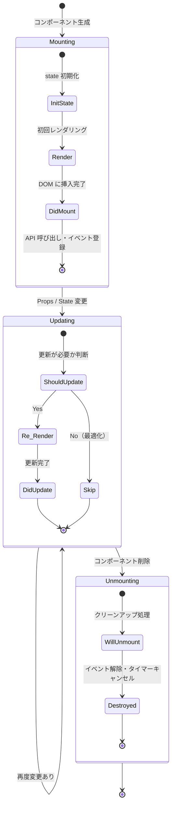

### 7.2 React ライフサイクルの実装

```tsx
// ✅ React Hooks によるライフサイクル管理

import React, { useState, useEffect, useRef, useCallback } from 'react';

interface LiveDataProps {
  productId: string;
  pollingInterval?: number;
}

const LiveInventoryComponent: React.FC<LiveDataProps> = ({
  productId,
  pollingInterval = 5000,
}) => {
  const [stockCount, setStockCount] = useState<number | null>(null);
  const [isLoading, setIsLoading] = useState(true);
  const intervalRef = useRef<NodeJS.Timeout | null>(null);
  const abortControllerRef = useRef<AbortController | null>(null);

  // ─── Mounting / Updating ───
  const fetchStock = useCallback(async () => {
    // 前のリクエストをキャンセル
    abortControllerRef.current?.abort();
    abortControllerRef.current = new AbortController();

    try {
      const response = await fetch(`/api/products/${productId}/stock`, {
        signal: abortControllerRef.current.signal,
      });
      const data = await response.json();
      setStockCount(data.stockCount);
    } catch (err) {
      if ((err as Error).name !== 'AbortError') {
        console.error('在庫取得エラー:', err);
      }
    } finally {
      setIsLoading(false);
    }
  }, [productId]);

  useEffect(() => {
    // ✅ Mounting: 初回データ取得 + ポーリング開始
    fetchStock();
    intervalRef.current = setInterval(fetchStock, pollingInterval);

    // ✅ Unmounting: クリーンアップ（メモリリーク防止）
    return () => {
      intervalRef.current && clearInterval(intervalRef.current);
      abortControllerRef.current?.abort();
    };
  }, [fetchStock, pollingInterval]); // productId 変更時も再実行

  if (isLoading) return <span>読み込み中...</span>;

  return (
    <div>
      <span>在庫: {stockCount ?? '不明'} 個</span>
      {stockCount === 0 && <span className="badge-danger">在庫切れ</span>}
    </div>
  );
};
```

### 7.3 バックエンドコンポーネントのライフサイクル

```mermaid
stateDiagram-v2
    [*] --> Registered : DI コンテナへ登録

    state Registered {
        [*] --> Resolved : 依存関係の解決
        Resolved --> Instantiated : インスタンス生成
        Instantiated --> OnInit : 初期化フック（接続・設定）
        OnInit --> [*]
    }

    Registered --> Active : アプリケーション起動完了

    state Active {
        [*] --> Handling : リクエスト処理
        Handling --> Handling : 継続的に処理
    }

    Active --> Destroying : シャットダウン信号

    state Destroying {
        [*] --> OnDestroy : クリーンアップフック
        OnDestroy --> DBClose : DB 接続クローズ
        DBClose --> CacheFlush : キャッシュフラッシュ
        CacheFlush --> [*]
    }

    Destroying --> [*]
```

---

## 8. 依存性管理と疎結合設計

### 8.1 依存性注入（Dependency Injection）の仕組み

```mermaid
graph TD
    subgraph WITHOUT_DI["❌ DI なし（密結合）"]
        SERVICE_BAD["OrderService<br>内部で new MySQLRepository()"]
        DB_BAD["MySQLRepository<br>（直接生成・テスト不可）"]
        SERVICE_BAD --> DB_BAD
    end

    subgraph WITH_DI["✅ DI あり（疎結合）"]
        DI_CONTAINER["🏭 DI コンテナ<br>（IoC コンテナ）<br>依存関係を管理・注入"]
        SERVICE_GOOD["OrderService<br>コンストラクタで受け取るだけ"]
        REPO_INTERFACE["OrderRepository<br>（インターフェース・抽象）"]
        MYSQL_REPO["MySQLOrderRepository<br>（本番用）"]
        INMEMORY_REPO["InMemoryOrderRepository<br>（テスト用）"]

        DI_CONTAINER -->|"本番時は注入"| MYSQL_REPO
        DI_CONTAINER -->|"テスト時は注入"| INMEMORY_REPO
        MYSQL_REPO -->|"実装"| REPO_INTERFACE
        INMEMORY_REPO -->|"実装"| REPO_INTERFACE
        SERVICE_GOOD -->|"依存"| REPO_INTERFACE
    end

    style SERVICE_BAD fill:#e74c3c,color:#fff
    style DB_BAD fill:#e74c3c,color:#fff
    style DI_CONTAINER fill:#f39c12,color:#fff
    style SERVICE_GOOD fill:#27ae60,color:#fff
    style REPO_INTERFACE fill:#3498db,color:#fff
    style MYSQL_REPO fill:#27ae60,color:#fff
    style INMEMORY_REPO fill:#27ae60,color:#fff
```

### 8.2 依存関係グラフと循環依存の回避

```mermaid
graph LR
    subgraph CYCLIC["❌ 循環依存（アンチパターン）"]
        A_BAD["OrderService"] -->|"依存"| B_BAD["UserService"]
        B_BAD -->|"依存"| C_BAD["NotificationService"]
        C_BAD -->|"依存"| A_BAD
    end

    subgraph ACYCLIC["✅ 非循環依存（正しい設計）"]
        A_GOOD["OrderService"] -->|"依存"| B_GOOD["UserService"]
        A_GOOD -->|"依存"| C_GOOD["NotificationService"]
        B_GOOD -->|"依存"| D_GOOD["UserRepository"]
        C_GOOD -->|"依存"| E_GOOD["EmailGateway"]
    end

    style A_BAD fill:#e74c3c,color:#fff
    style B_BAD fill:#e74c3c,color:#fff
    style C_BAD fill:#e74c3c,color:#fff
    style A_GOOD fill:#27ae60,color:#fff
    style B_GOOD fill:#27ae60,color:#fff
    style C_GOOD fill:#27ae60,color:#fff
```

### 8.3 インターフェース分離の実装

```typescript
// ✅ インターフェース分離原則（ISP）をコンポーネント設計に適用

// ❌ 肥大化したインターフェース（ISP 違反）
interface UserRepository {
  findById(id: string): Promise<User>;
  findAll(): Promise<User[]>;
  save(user: User): Promise<void>;
  delete(id: string): Promise<void>;
  findByEmailWithFullHistory(email: string): Promise<UserWithHistory>;  // 一部のみ必要
  generateMonthlyReport(): Promise<Report>;  // 一部のみ必要
}

// ✅ 分離されたインターフェース
interface UserReader {
  findById(id: string): Promise<User | null>;
  findByEmail(email: string): Promise<User | null>;
}

interface UserWriter {
  save(user: User): Promise<void>;
  delete(id: string): Promise<void>;
}

interface UserReportGenerator {
  generateMonthlyReport(): Promise<Report>;
}

// OrderService は UserReader だけに依存（不要なメソッドを知らなくてよい）
class OrderService {
  constructor(
    private readonly userReader: UserReader,  // 必要なインターフェースだけに依存
  ) {}

  async createOrder(customerId: string, items: OrderItem[]) {
    const user = await this.userReader.findById(customerId);
    if (!user) throw new Error('ユーザーが見つかりません');
    // ...
  }
}
```

---

## 9. コンポーネントのテスト戦略

### 9.1 コンポーネントテストのピラミッド

```mermaid
graph TD
    subgraph COMP_TEST_PYRAMID["🔺 コンポーネントテストピラミッド"]
        E2E_T["E2E テスト（少数）<br>実際のブラウザで全体フローを確認<br>Playwright / Cypress<br>最も遅い・最もコスト高"]

        INTEGRATION_T["統合テスト（中程度）<br>複数コンポーネントの連携を確認<br>React Testing Library<br>ユーザー操作をシミュレート"]

        UNIT_T["ユニットテスト（多数）<br>単一コンポーネントの動作確認<br>Vitest / Jest<br>高速・モックを活用"]

        VISUAL_T["ビジュアルテスト（補完）<br>見た目の変化を検出<br>Storybook / Chromatic<br>スタイル・レイアウトの回帰テスト"]
    end

    UNIT_T --> INTEGRATION_T --> E2E_T
    VISUAL_T -.->|"補完的に使う"| UNIT_T

    style E2E_T fill:#e74c3c,color:#fff
    style INTEGRATION_T fill:#f39c12,color:#fff
    style UNIT_T fill:#27ae60,color:#fff
    style VISUAL_T fill:#3498db,color:#fff
```

### 9.2 フロントエンドコンポーネントのテスト実装

```tsx
// components/atoms/Button/Button.test.tsx

import { render, screen, fireEvent } from '@testing-library/react';
import userEvent from '@testing-library/user-event';
import { Button } from './Button';

describe('Button コンポーネント', () => {
  // ─── レンダリングテスト ───

  test('テキストが正しく表示される', () => {
    render(<Button onClick={() => {}}>カートに追加</Button>);
    expect(screen.getByText('カートに追加')).toBeInTheDocument();
  });

  test('primary バリアントがデフォルトで適用される', () => {
    render(<Button onClick={() => {}}>ボタン</Button>);
    const btn = screen.getByRole('button');
    expect(btn).toHaveClass('primary');
  });

  // ─── インタラクションテスト ───

  test('クリックで onClick が呼ばれる', async () => {
    const handleClick = vi.fn();
    render(<Button onClick={handleClick}>クリック</Button>);

    await userEvent.click(screen.getByRole('button'));
    expect(handleClick).toHaveBeenCalledOnce();
  });

  test('disabled のとき onClick が呼ばれない', async () => {
    const handleClick = vi.fn();
    render(<Button onClick={handleClick} disabled>クリック</Button>);

    await userEvent.click(screen.getByRole('button'));
    expect(handleClick).not.toHaveBeenCalled();
  });

  test('loading 状態のときスピナーが表示される', () => {
    render(<Button onClick={() => {}} loading>送信中</Button>);
    expect(screen.getByRole('button')).toHaveAttribute('aria-busy', 'true');
  });

  // ─── アクセシビリティテスト ───

  test('ariaLabel が設定される', () => {
    render(
      <Button onClick={() => {}} ariaLabel="ウィッシュリストに追加">♡</Button>
    );
    expect(screen.getByLabelText('ウィッシュリストに追加')).toBeInTheDocument();
  });
});
```

```tsx
// components/organisms/ProductCard/ProductCard.test.tsx

import { render, screen, waitFor } from '@testing-library/react';
import userEvent from '@testing-library/user-event';
import { ProductCard } from './ProductCard';
import type { Product } from '@/types/product';

const mockProduct: Product = {
  id: 'P001',
  name: 'テスト商品',
  price: 3000,
  originalPrice: 5000,
  imageUrl: '/test-image.jpg',
  rating: 4.5,
  reviewCount: 120,
  stockCount: 10,
  isNew: false,
  discountRate: 40,
};

describe('ProductCard コンポーネント', () => {
  test('商品名が表示される', () => {
    render(
      <ProductCard
        product={mockProduct}
        onAddToCart={() => {}}
      />
    );
    expect(screen.getByText('テスト商品')).toBeInTheDocument();
  });

  test('カートに追加ボタンのクリックで onAddToCart が呼ばれる', async () => {
    const mockAddToCart = vi.fn();
    render(
      <ProductCard
        product={mockProduct}
        onAddToCart={mockAddToCart}
      />
    );

    await userEvent.click(screen.getByText('カートに追加'));
    expect(mockAddToCart).toHaveBeenCalledWith('P001', 1);
  });

  test('在庫切れのとき「在庫切れ」ボタンが表示されクリック不可', async () => {
    const outOfStock = { ...mockProduct, stockCount: 0 };
    const mockAddToCart = vi.fn();

    render(
      <ProductCard product={outOfStock} onAddToCart={mockAddToCart} />
    );

    const btn = screen.getByText('在庫切れ');
    expect(btn).toBeDisabled();

    await userEvent.click(btn);
    expect(mockAddToCart).not.toHaveBeenCalled();
  });
});
```

### 9.3 バックエンドコンポーネントのテスト

```typescript
// order/order.service.spec.ts

import { Test, TestingModule } from '@nestjs/testing';
import { OrderService } from './order.service';
import { OrderRepository } from './order.repository';
import { UserService } from '../user/user.service';
import { NotFoundException, BadRequestException } from '@nestjs/common';

// ✅ モックファクトリー
const mockOrderRepository = {
  create: jest.fn(),
  save: jest.fn(),
  findOne: jest.fn(),
};

const mockUserService = {
  findById: jest.fn(),
};

describe('OrderService', () => {
  let service: OrderService;

  beforeEach(async () => {
    const module: TestingModule = await Test.createTestingModule({
      providers: [
        OrderService,
        { provide: OrderRepository, useValue: mockOrderRepository },
        { provide: UserService, useValue: mockUserService },
      ],
    }).compile();

    service = module.get<OrderService>(OrderService);
    jest.clearAllMocks();
  });

  describe('createOrder', () => {
    test('有効なデータで注文が作成される', async () => {
      const mockUser = { id: 'U001', isActive: true, name: '山田太郎' };
      const mockOrder = { id: 'O001', customerId: 'U001', status: 'pending' };

      mockUserService.findById.mockResolvedValue(mockUser);
      mockOrderRepository.create.mockReturnValue(mockOrder);
      mockOrderRepository.save.mockResolvedValue(mockOrder);

      const result = await service.createOrder({
        customerId: 'U001',
        items: [{ productId: 'P001', quantity: 2 }],
      });

      expect(result).toEqual(mockOrder);
      expect(mockOrderRepository.save).toHaveBeenCalledOnce();
    });

    test('存在しないユーザーの場合 NotFoundException が発生する', async () => {
      mockUserService.findById.mockResolvedValue(null);

      await expect(
        service.createOrder({ customerId: 'UNKNOWN', items: [] })
      ).rejects.toThrow(NotFoundException);
    });

    test('非アクティブユーザーの場合 BadRequestException が発生する', async () => {
      mockUserService.findById.mockResolvedValue({
        id: 'U001',
        isActive: false,
      });

      await expect(
        service.createOrder({ customerId: 'U001', items: [] })
      ).rejects.toThrow(BadRequestException);
    });
  });
});
```

---

## 10. コンポーネントライブラリとデザインシステム

### 10.1 デザインシステムの構造

```mermaid
graph TD
    subgraph DESIGN_SYSTEM["🎨 デザインシステム"]
        subgraph FOUNDATION["基盤（Foundation）"]
            COLORS["🎨 カラーパレット<br>Primary / Secondary / Semantic<br>Light / Dark モード対応"]
            TYPOGRAPHY["📝 タイポグラフィ<br>フォントファミリー・サイズ・ウェイト"]
            SPACING["📐 スペーシング<br>4px グリッドシステム"]
            ICONS["🔣 アイコンセット<br>統一されたスタイル"]
        end

        subgraph TOKENS["デザイントークン"]
            DESIGN_TOKENS["CSS カスタムプロパティ / JS オブジェクト<br>--color-primary: #3498db<br>--spacing-md: 16px<br>→ 一元管理・テーマ切り替えが容易"]
        end

        subgraph COMP_LIB["コンポーネントライブラリ"]
            ATOM_COMP["Atoms: Button / Input / Icon / Badge"]
            MOL_COMP["Molecules: FormField / SearchBar / Card"]
            ORG_COMP["Organisms: Header / Footer / Modal"]
        end

        subgraph DOCS["ドキュメント & ツール"]
            STORYBOOK["Storybook<br>コンポーネントカタログ"]
            FIGMA["Figma<br>デザインソース"]
            CHANGELOG["Changelog<br>変更履歴管理"]
        end
    end

    FOUNDATION --> TOKENS
    TOKENS --> COMP_LIB
    COMP_LIB --> DOCS

    style FOUNDATION fill:#ebf5fb
    style TOKENS fill:#eafaf1
    style COMP_LIB fill:#fef9e7
    style DOCS fill:#fde8e8
```

### 10.2 デザイントークンの実装

```typescript
// design-system/tokens/index.ts
// ✅ デザイントークン：コンポーネント設計の基盤

export const tokens = {
  // ─── カラー ───
  colors: {
    brand: {
      primary: '#3498db',
      primaryDark: '#2980b9',
      primaryLight: '#74b9e3',
      secondary: '#27ae60',
    },
    semantic: {
      success: '#2ecc71',
      warning: '#f39c12',
      danger: '#e74c3c',
      info: '#3498db',
    },
    neutral: {
      white: '#ffffff',
      gray100: '#f8f9fa',
      gray200: '#e9ecef',
      gray300: '#dee2e6',
      gray500: '#adb5bd',
      gray700: '#495057',
      gray900: '#212529',
      black: '#000000',
    },
  },

  // ─── スペーシング（4px グリッド）───
  spacing: {
    xs:  '4px',
    sm:  '8px',
    md:  '16px',
    lg:  '24px',
    xl:  '32px',
    xxl: '48px',
  },

  // ─── タイポグラフィ ───
  typography: {
    fontFamily: {
      base: "'Noto Sans JP', 'Hiragino Sans', sans-serif",
      mono: "'JetBrains Mono', 'Courier New', monospace",
    },
    fontSize: {
      xs: '12px',
      sm: '14px',
      md: '16px',
      lg: '18px',
      xl: '24px',
      xxl: '32px',
    },
    fontWeight: {
      regular: 400,
      medium:  500,
      semibold: 600,
      bold:    700,
    },
    lineHeight: {
      tight:  1.25,
      normal: 1.5,
      loose:  1.75,
    },
  },

  // ─── ボーダー・シャドウ ───
  border: {
    radius: {
      sm: '4px',
      md: '8px',
      lg: '12px',
      full: '9999px',
    },
    width: { thin: '1px', medium: '2px' },
  },

  // ─── アニメーション ───
  animation: {
    duration: {
      fast:   '150ms',
      normal: '250ms',
      slow:   '400ms',
    },
    easing: {
      ease: 'cubic-bezier(0.4, 0, 0.2, 1)',
      easeIn: 'cubic-bezier(0.4, 0, 1, 1)',
      easeOut: 'cubic-bezier(0, 0, 0.2, 1)',
    },
  },
} as const;

// CSS カスタムプロパティとして出力
export const generateCSSVariables = () => `
  :root {
    --color-primary: ${tokens.colors.brand.primary};
    --spacing-md: ${tokens.spacing.md};
    --font-size-md: ${tokens.typography.fontSize.md};
    --border-radius-md: ${tokens.border.radius.md};
    --animation-duration-normal: ${tokens.animation.duration.normal};
  }
`;
```

### 10.3 Storybook による コンポーネントカタログ

```tsx
// components/atoms/Button/Button.stories.tsx
// ✅ Storybook: コンポーネントのドキュメント＋ビジュアルテスト

import type { Meta, StoryObj } from '@storybook/react';
import { Button } from './Button';

const meta: Meta<typeof Button> = {
  title: 'Atoms/Button',
  component: Button,
  parameters: {
    layout: 'centered',
    docs: {
      description: {
        component: `
ユーザーがアクションを実行するための基本ボタンコンポーネントです。
4種類のバリアント（primary / secondary / danger / ghost）と3種類のサイズに対応しています。
        `,
      },
    },
  },
  argTypes: {
    variant: {
      control: 'select',
      options: ['primary', 'secondary', 'danger', 'ghost'],
      description: 'ボタンのスタイルバリアント',
    },
    size: {
      control: 'select',
      options: ['sm', 'md', 'lg'],
    },
    disabled: { control: 'boolean' },
    loading:  { control: 'boolean' },
    fullWidth: { control: 'boolean' },
  },
  tags: ['autodocs'],  // 自動ドキュメント生成
};

export default meta;
type Story = StoryObj<typeof Button>;

// ─── 各バリアントのストーリー ───
export const Primary: Story = {
  args: {
    children: 'カートに追加',
    variant: 'primary',
    onClick: () => console.log('クリックされました'),
  },
};

export const Secondary: Story = {
  args: { ...Primary.args, variant: 'secondary', children: 'ウィッシュリスト' },
};

export const Danger: Story = {
  args: { ...Primary.args, variant: 'danger', children: '削除する' },
};

export const Loading: Story = {
  args: { ...Primary.args, loading: true, children: '処理中...' },
};

export const Disabled: Story = {
  args: { ...Primary.args, disabled: true, children: '在庫切れ' },
};

// ─── アクセシビリティチェック付きストーリー ───
export const AllSizes: Story = {
  render: () => (
    <div style={{ display: 'flex', gap: '16px', alignItems: 'center' }}>
      <Button onClick={() => {}} size="sm">Small</Button>
      <Button onClick={() => {}}>Medium（Default）</Button>
      <Button onClick={() => {}} size="lg">Large</Button>
    </div>
  ),
};
```

---

## 11. マイクロフロントエンド・マイクロサービスとの統合

### 11.1 マイクロフロントエンドとコンポーネント

```mermaid
graph TD
    subgraph MFE["🏗️ マイクロフロントエンドアーキテクチャ"]
        SHELL["🐚 Shell アプリケーション<br>（ホスト）<br>各 MFE を読み込み・配置する"]

        subgraph TEAM_A["チームA: 商品チーム"]
            PRODUCT_MFE["Product MFE<br>（独立デプロイ）<br>商品一覧・詳細・検索"]
        end

        subgraph TEAM_B["チームB: 注文チーム"]
            ORDER_MFE["Order MFE<br>（独立デプロイ）<br>カート・チェックアウト"]
        end

        subgraph TEAM_C["チームC: ユーザーチーム"]
            USER_MFE["User MFE<br>（独立デプロイ）<br>認証・プロフィール"]
        end

        SHARED_LIB["📦 共有コンポーネントライブラリ<br>（デザインシステム）<br>全チームが使用する共通 UI"]
    end

    SHELL --> PRODUCT_MFE
    SHELL --> ORDER_MFE
    SHELL --> USER_MFE
    PRODUCT_MFE --> SHARED_LIB
    ORDER_MFE --> SHARED_LIB
    USER_MFE --> SHARED_LIB

    style SHELL fill:#2c3e50,color:#fff
    style PRODUCT_MFE fill:#3498db,color:#fff
    style ORDER_MFE fill:#27ae60,color:#fff
    style USER_MFE fill:#e67e22,color:#fff
    style SHARED_LIB fill:#8e44ad,color:#fff
```

### 11.2 Module Federation による MFE 実装

```javascript
// ✅ webpack.config.js — Module Federation の設定

// 🏠 Shell アプリケーション（ホスト）
const shellConfig = {
  plugins: [
    new ModuleFederationPlugin({
      name: 'shell',
      remotes: {
        // 各 MFE を動的に読み込む
        productApp: 'productApp@https://product.example.com/remoteEntry.js',
        orderApp: 'orderApp@https://order.example.com/remoteEntry.js',
        userApp: 'userApp@https://user.example.com/remoteEntry.js',
      },
      shared: {
        // React を共有（バンドルサイズ削減）
        react: { singleton: true, requiredVersion: '^18.0.0' },
        'react-dom': { singleton: true, requiredVersion: '^18.0.0' },
        // デザインシステムを共有
        '@company/design-system': { singleton: true },
      },
    }),
  ],
};

// 📦 Product MFE（リモート）
const productConfig = {
  plugins: [
    new ModuleFederationPlugin({
      name: 'productApp',
      filename: 'remoteEntry.js',
      exposes: {
        // 外部に公開するコンポーネント
        './ProductList': './src/components/ProductList',
        './ProductDetail': './src/components/ProductDetail',
        './SearchBox': './src/components/SearchBox',
      },
    }),
  ],
};
```

```tsx
// shell/src/App.tsx — MFE コンポーネントの動的読み込み

import React, { Suspense, lazy } from 'react';
import { ErrorBoundary } from 'react-error-boundary';

// ✅ 各 MFE コンポーネントを遅延読み込み
const ProductList = lazy(() => import('productApp/ProductList'));
const CartSidebar = lazy(() => import('orderApp/CartSidebar'));

function MFEErrorFallback({ error }: { error: Error }) {
  return (
    <div className="error-container">
      <p>このコンポーネントの読み込みに失敗しました</p>
      <p>{error.message}</p>
    </div>
  );
}

export function App() {
  return (
    <div className="app-shell">
      {/* 各 MFE を ErrorBoundary でラップ（障害隔離）*/}
      <ErrorBoundary FallbackComponent={MFEErrorFallback}>
        <Suspense fallback={<div>商品一覧を読み込み中...</div>}>
          <ProductList />
        </Suspense>
      </ErrorBoundary>

      <ErrorBoundary FallbackComponent={MFEErrorFallback}>
        <Suspense fallback={null}>
          <CartSidebar />
        </Suspense>
      </ErrorBoundary>
    </div>
  );
}
```

### 11.3 コンポーネントとマイクロサービスのマッピング

```mermaid
graph LR
    subgraph FRONTEND["フロントエンド（コンポーネント）"]
        PC["ProductCard<br>コンポーネント"]
        OC["OrderCart<br>コンポーネント"]
        UC["UserProfile<br>コンポーネント"]
    end

    subgraph API_GW["API Gateway"]
        GW_NODE["ルーティング・認証・<br>レート制限・ロギング"]
    end

    subgraph MICROSERVICES["バックエンド（マイクロサービス）"]
        PROD_SVC["商品サービス<br>GET /products"]
        ORDER_SVC["注文サービス<br>POST /orders"]
        USER_SVC["ユーザーサービス<br>GET /users/:id"]
        PAYMENT_SVC["決済サービス<br>POST /payments"]
    end

    PC -->|"商品データ取得"| GW_NODE
    OC -->|"注文・決済"| GW_NODE
    UC -->|"ユーザー情報"| GW_NODE

    GW_NODE --> PROD_SVC
    GW_NODE --> ORDER_SVC
    GW_NODE --> USER_SVC
    GW_NODE --> PAYMENT_SVC

    style FRONTEND fill:#ebf5fb
    style API_GW fill:#fef9e7
    style MICROSERVICES fill:#eafaf1
```

---

## 12. 実践：ECサイト完全コンポーネント実装例

### 12.1 コンポーネント構成図

```mermaid
graph TD
    subgraph PAGES_LAYER["📱 Pages"]
        TOP_PAGE["TopPage"]
        PRODUCT_PAGE["ProductDetailPage"]
        CART_PAGE["CartPage"]
        CHECKOUT_PAGE["CheckoutPage"]
    end

    subgraph TEMPLATE_LAYER["📄 Templates"]
        MAIN_LAYOUT["MainLayout<br>Header + Main + Footer"]
        CHECKOUT_LAYOUT["CheckoutLayout<br>Step ナビ + コンテンツ"]
    end

    subgraph ORG_LAYER["🦠 Organisms"]
        HEADER_ORG["Header<br>（ロゴ・ナビ・検索・カートアイコン）"]
        PRODUCT_GRID["ProductGrid<br>（ProductCard × N）"]
        CART_ITEMS["CartItems<br>（CartItem × N）"]
        CHECKOUT_FORM["CheckoutForm<br>（住所・支払い入力）"]
        ORDER_SUMMARY["OrderSummary<br>（注文内容・合計確認）"]
    end

    subgraph MOL_LAYER["🔬 Molecules"]
        PRODUCT_CARD["ProductCard"]
        CART_ITEM["CartItem"]
        PRICE_DISPLAY["PriceDisplay"]
        FORM_FIELD["FormField"]
        SEARCH_BOX["SearchBox"]
        PAGINATION["Pagination"]
    end

    subgraph ATOM_LAYER["⚛️ Atoms"]
        BUTTON["Button"]
        INPUT["Input"]
        BADGE["Badge"]
        IMAGE["LazyImage"]
        LABEL["Label"]
        SPINNER["Spinner"]
    end

    TOP_PAGE --> MAIN_LAYOUT
    PRODUCT_PAGE --> MAIN_LAYOUT
    CART_PAGE --> MAIN_LAYOUT
    CHECKOUT_PAGE --> CHECKOUT_LAYOUT

    MAIN_LAYOUT --> HEADER_ORG
    MAIN_LAYOUT --> PRODUCT_GRID
    PRODUCT_GRID --> PRODUCT_CARD
    CART_PAGE --> CART_ITEMS
    CART_ITEMS --> CART_ITEM
    CHECKOUT_PAGE --> CHECKOUT_FORM
    CHECKOUT_PAGE --> ORDER_SUMMARY

    PRODUCT_CARD --> IMAGE
    PRODUCT_CARD --> PRICE_DISPLAY
    PRODUCT_CARD --> BUTTON
    PRODUCT_CARD --> BADGE
    CART_ITEM --> INPUT
    CART_ITEM --> BUTTON
    FORM_FIELD --> LABEL
    FORM_FIELD --> INPUT
    CHECKOUT_FORM --> FORM_FIELD
    HEADER_ORG --> SEARCH_BOX
    SEARCH_BOX --> INPUT
    SEARCH_BOX --> BUTTON

    style PAGES_LAYER fill:#fde8e8
    style TEMPLATE_LAYER fill:#fef9e7
    style ORG_LAYER fill:#eafaf1
    style MOL_LAYER fill:#ebf5fb
    style ATOM_LAYER fill:#f8f9fa
```

### 12.2 カートコンポーネントの完全実装

```tsx
// ─── Types ───
interface CartItem {
  id: string;
  product: {
    id: string;
    name: string;
    price: number;
    imageUrl: string;
    maxStock: number;
  };
  quantity: number;
}

// ─── Custom Hook：カートロジックのコンポーネント化 ───
function useCart() {
  const [items, setItems] = useState<CartItem[]>([]);
  const [isLoading, setIsLoading] = useState(false);

  // UUID 生成のフォールバック
  const generateId = useCallback(() => {
    if (typeof crypto !== 'undefined' && crypto.randomUUID) {
      return crypto.randomUUID();
    }
    return Array.from(crypto.getRandomValues(new Uint8Array(16)))
      .map(b => b.toString(16).padStart(2, '0'))
      .join('');
  }, []);

  const addItem = useCallback((product: CartItem['product'], quantity = 1) => {
    setItems(prev => {
      const existing = prev.find(item => item.product.id === product.id);
      if (existing) {
        return prev.map(item =>
          item.product.id === product.id
            ? { ...item, quantity: Math.min(item.quantity + quantity, product.maxStock) }
            : item
        );
      }
      return [...prev, { id: generateId(), product, quantity }];
    });
  }, [generateId]);

  const updateQuantity = useCallback((itemId: string, newQuantity: number) => {
    if (newQuantity <= 0) {
      setItems(prev => prev.filter(item => item.id !== itemId));
    } else {
      setItems(prev =>
        prev.map(item =>
          item.id === itemId ? { ...item, quantity: newQuantity } : item
        )
      );
    }
  }, []);

  const removeItem = useCallback((itemId: string) => {
    setItems(prev => prev.filter(item => item.id !== itemId));
  }, []);

  const totalAmount = items.reduce(
    (sum, item) => sum + item.product.price * item.quantity,
    0
  );

  const totalCount = items.reduce((sum, item) => sum + item.quantity, 0);

  return {
    items,
    totalAmount,
    totalCount,
    isLoading,
    addItem,
    updateQuantity,
    removeItem,
  };
}

// ─── CartItem コンポーネント（Molecule）───
const CartItemComponent: React.FC<{
  item: CartItem;
  onUpdateQuantity: (id: string, qty: number) => void;
  onRemove: (id: string) => void;
}> = ({ item, onUpdateQuantity, onRemove }) => (
  <li className="cart-item" data-testid={`cart-item-${item.id}`}>
    
    <div className="cart-item__info">
      <p className="cart-item__name">{item.product.name}</p>
      <p className="cart-item__price">
        ¥{(item.product.price * item.quantity).toLocaleString()}
      </p>
    </div>
    <div className="cart-item__controls">
      <Button
        variant="ghost"
        size="sm"
        onClick={() => onUpdateQuantity(item.id, item.quantity - 1)}
        ariaLabel="数量を減らす"
      >
        −
      </Button>
      <span className="cart-item__quantity">{item.quantity}</span>
      <Button
        variant="ghost"
        size="sm"
        onClick={() => onUpdateQuantity(item.id, item.quantity + 1)}
        disabled={item.quantity >= item.product.maxStock}
        ariaLabel="数量を増やす"
      >
        ＋
      </Button>
    </div>
    <Button
      variant="ghost"
      size="sm"
      onClick={() => onRemove(item.id)}
      ariaLabel={`${item.product.name} をカートから削除`}
    >
      🗑
    </Button>
  </li>
);

// ─── CartSidebar コンポーネント（Organism）───
const CartSidebar: React.FC<{
  cart: ReturnType<typeof useCart>;
  onCheckout: () => void;
}> = ({ cart, onCheckout }) => (
  <aside className="cart-sidebar" aria-label="ショッピングカート">
    <h2 className="cart-sidebar__title">
      カート ({cart.totalCount}点)
    </h2>

    {cart.items.length === 0 ? (
      <p className="cart-sidebar__empty">カートは空です</p>
    ) : (
      <>
        <ul className="cart-sidebar__items">
          {cart.items.map(item => (
            <CartItemComponent
              key={item.id}
              item={item}
              onUpdateQuantity={cart.updateQuantity}
              onRemove={cart.removeItem}
            />
          ))}
        </ul>

        <div className="cart-sidebar__summary">
          <div className="cart-sidebar__total">
            <span>合計</span>
            <strong>¥{cart.totalAmount.toLocaleString()}</strong>
          </div>
          <Button onClick={onCheckout} fullWidth size="lg">
            購入手続きへ
          </Button>
        </div>
      </>
    )}
  </aside>
);
```

### 12.3 コンポーネントのディレクトリ構成

```text
src/
├── components/
│   ├── atoms/                    # 最小単位のコンポーネント
│   │   ├── Button/
│   │   │   ├── Button.tsx        # 実装
│   │   │   ├── Button.test.tsx   # ユニットテスト
│   │   │   ├── Button.stories.tsx # Storybook
│   │   │   ├── Button.module.css  # スタイル（CSS Modules）
│   │   │   └── index.ts           # エクスポート
│   │   ├── Input/
│   │   ├── Badge/
│   │   └── index.ts               # Atoms 一括エクスポート
│   │
│   ├── molecules/                # Atoms の組み合わせ
│   │   ├── ProductCard/
│   │   ├── FormField/
│   │   ├── SearchBox/
│   │   └── index.ts
│   │
│   ├── organisms/                # 独立した UI ブロック
│   │   ├── Header/
│   │   ├── ProductGrid/
│   │   ├── CartSidebar/
│   │   └── index.ts
│   │
│   ├── templates/                # レイアウト定義
│   │   ├── MainLayout/
│   │   └── index.ts
│   │
│   └── pages/                    # 実際のページ
│       ├── TopPage/
│       ├── ProductDetailPage/
│       └── CartPage/
│
├── hooks/                        # Custom Hooks（ロジックコンポーネント）
│   ├── useCart.ts
│   ├── useFetch.ts
│   ├── useIntersectionObserver.ts
│   └── index.ts
│
├── contexts/                     # Context（グローバル状態）
│   ├── CartContext.tsx
│   └── AuthContext.tsx
│
├── design-system/                # デザインシステム
│   ├── tokens/
│   │   ├── colors.ts
│   │   ├── spacing.ts
│   │   └── index.ts
│   └── global.css
│
└── types/                        # 型定義
    ├── product.ts
    ├── order.ts
    └── user.ts
```

---

## 13. コンポーネントのアンチパターン

### 13.1 主要なアンチパターン一覧

```mermaid
graph TD
    subgraph ANTIPATTERNS["⚠️ コンポーネントのアンチパターン"]
        MONOLITH["🔴 コンポーネントモノリス<br>すべての処理を1コンポーネントに<br>500行を超えるコンポーネント"]

        PROPS_DRILLING["🔴 Props ドリリング<br>5階層以上 Props を伝搬<br>中間コンポーネントが不要な Props を持つ"]

        MIXED_CONCERN["🔴 関心事の混在<br>UI ロジックとビジネスロジックが混在<br>API 呼び出しと描画が同一コンポーネント"]

        DIRECT_MUTATION["🔴 状態の直接変更<br>Props を直接書き換える<br>共有状態を直接ミュートする"]

        PREMATURE_OPT["🔴 過度な最適化<br>すべてを useMemo / useCallback でラップ<br>コードが複雑になり逆効果"]

        OVERABSTRACTION["🔴 過度な抽象化<br>1回しか使わないものをコンポーネント化<br>不必要な汎用化"]
    end

    MONOLITH --> FIX1["解決: SRP を適用して分割<br>Container / Presentational パターン"]
    PROPS_DRILLING --> FIX2["解決: Context / Store を使う<br>コンポジションを活用する"]
    MIXED_CONCERN --> FIX3["解決: Custom Hooks でロジックを分離<br>Container コンポーネントに移動"]
    DIRECT_MUTATION --> FIX4["解決: イミュータブルな更新を行う<br>setState / emit でのみ状態を変更"]

    style MONOLITH fill:#e74c3c,color:#fff
    style PROPS_DRILLING fill:#e74c3c,color:#fff
    style MIXED_CONCERN fill:#e74c3c,color:#fff
    style DIRECT_MUTATION fill:#e74c3c,color:#fff
    style FIX1 fill:#27ae60,color:#fff
    style FIX2 fill:#27ae60,color:#fff
    style FIX3 fill:#27ae60,color:#fff
    style FIX4 fill:#27ae60,color:#fff
```

### 13.2 Props ドリリングの解決例

```tsx
// ❌ Props ドリリング（アンチパターン）
const App = () => {
  const [user, setUser] = useState<User | null>(null);
  return <Layout user={user} setUser={setUser} />;
};

const Layout = ({ user, setUser }: Props) => (
  <div>
    <Header user={user} setUser={setUser} />  {/* user を中継するだけ */}
    <Main user={user} />
  </div>
);

const Header = ({ user, setUser }: Props) => (
  <header>
    <Nav user={user} setUser={setUser} />  {/* さらに中継 */}
  </header>
);

const Nav = ({ user, setUser }: Props) => (
  <nav>
    <UserMenu user={user} onLogout={() => setUser(null)} />  {/* ようやく使われる */}
  </nav>
);

// ✅ Context で解決
const AuthContext = React.createContext<{
  user: User | null;
  logout: () => void;
} | null>(null);

const AuthProvider: React.FC<{ children: React.ReactNode }> = ({ children }) => {
  const [user, setUser] = useState<User | null>(null);
  const logout = useCallback(() => setUser(null), []);

  return (
    <AuthContext.Provider value={{ user, logout }}>
      {children}
    </AuthContext.Provider>
  );
};

const useAuth = () => {
  const ctx = React.useContext(AuthContext);
  if (!ctx) throw new Error('AuthProvider の外で useAuth を呼びました');
  return ctx;
};

// どこからでも user にアクセス可能
const UserMenu = () => {
  const { user, logout } = useAuth();  // Props を受け取る必要がない
  return <div>{user?.name} <button onClick={logout}>ログアウト</button></div>;
};
```

---

## 14. ベストプラクティス総まとめ

### 14.1 コンポーネント設計のチェックリスト

```mermaid
graph TD
    subgraph CHECKLIST["✅ コンポーネント設計チェックリスト"]
        C1["📌 単一責任<br>1コンポーネント = 1つの明確な役割"]
        C2["📌 Props を最小限に<br>必要なデータだけを受け取る"]
        C3["📌 型定義を徹底する<br>TypeScript で Props/Events を厳密に型付け"]
        C4["📌 デフォルト値を設定<br>オプションな Props には適切なデフォルト値"]
        C5["📌 副作用を分離する<br>Custom Hooks / サービス層に移動"]
        C6["📌 テストを書く<br>ユニット・統合・ビジュアルテストを整備"]
        C7["📌 アクセシビリティを考慮<br>ARIA 属性・キーボード操作・コントラスト"]
        C8["📌 ドキュメント化する<br>Storybook でカタログ化・変更履歴管理"]
        C9["📌 パフォーマンスを意識<br>不要な再レンダリングを避ける"]
        C10["📌 エラー境界を設ける<br>ErrorBoundary でコンポーネントを保護"]
    end
```

### 14.2 コンポーネントライフサイクルのベストプラクティス

| フェーズ | ベストプラクティス | 理由 |
|---------|-----------------|------|
| **設計** | 最も小さい粒度から設計する（Atoms から） | 再利用性と組み合わせやすさが向上する |
| **実装** | Pure コンポーネントを目指す | テストしやすく、予測可能な動作を保証 |
| **状態管理** | 状態は最も近い親に置く | 不要なグローバル状態を避ける |
| **通信** | Props Down / Events Up を基本にする | データフローが追跡しやすい |
| **依存** | インターフェースに依存する（具体に依存しない） | テストと差し替えが容易になる |
| **テスト** | ユーザー操作ベースのテストを書く | 実装ではなく振る舞いを検証する |
| **ドキュメント** | Storybook で全状態を記録する | チームの共通認識と品質保証 |
| **リリース** | セマンティックバージョニングを使う | 破壊的変更を明確にする |

### 14.3 コンポーネント指向成熟度モデル

```mermaid
graph TD
    LV0["Level 0: モノリシックなビュー<br>コンポーネント分割なし<br>ページ単位の大きな実装"]
    LV1["Level 1: 基本的なコンポーネント化<br>再利用されるパーツを切り出す<br>Button / Input などの Atoms"]
    LV2["Level 2: アトミックデザインの導入<br>Atoms / Molecules / Organisms の階層<br>システマティックな粒度管理"]
    LV3["Level 3: デザインシステムの確立<br>デザイントークン・共通コンポーネントライブラリ<br>Storybook でカタログ化"]
    LV4["Level 4: Container / Presentational の分離<br>ロジックとビューの完全分離<br>Custom Hooks によるロジック再利用"]
    LV5["Level 5: マイクロフロントエンド<br>コンポーネントが独立したチームの単位に<br>独立デプロイ・完全な疎結合"]

    LV0 --> LV1 --> LV2 --> LV3 --> LV4 --> LV5

    style LV0 fill:#e74c3c,color:#fff
    style LV1 fill:#e67e22,color:#fff
    style LV2 fill:#f39c12,color:#fff
    style LV3 fill:#27ae60,color:#fff
    style LV4 fill:#3498db,color:#fff
    style LV5 fill:#8e44ad,color:#fff
```

### 14.4 フレームワーク別ベストプラクティス比較

| 観点 | React | Vue | Angular |
|------|-------|-----|---------|
| **コンポーネント定義** | 関数コンポーネント + Hooks | SFC（Composition API） | クラス or 関数 + デコレータ |
| **Props 検証** | TypeScript インターフェース | TypeScript + defineProps | TypeScript + @Input |
| **状態管理** | useState / Zustand / Redux | ref / reactive / Pinia | サービス / NgRx |
| **スロット** | children / render props | `<slot>` | `<ng-content>` |
| **テスト** | React Testing Library | Vue Test Utils | TestBed |
| **コンポーネントカタログ** | Storybook | Storybook / Histoire | Storybook |

---

## 15. 参考文献・ソース一覧

### 📚 必読書籍

| タイトル | 著者 | 分野 |
|---------|------|------|
| **Component Software: Beyond OO** | Clemens Szyperski | コンポーネント指向の理論的基礎 |
| **Atomic Design** | Brad Frost | UI コンポーネント設計手法 |
| **Clean Architecture** | Robert C. Martin | コンポーネント設計原則（CCP・CRP・ADP 等） |
| **Building Design Systems** | Sarrah Vesselov & Taurie Davis | デザインシステム構築 |
| **Micro Frontends in Action** | Michael Geers | マイクロフロントエンド実践 |
| **React: Up and Running** | Stoyan Stefanov | React コンポーネント実践 |
| **Vue.js 3 By Example** | John Au-Yeung | Vue コンポーネント実践 |

### 🌐 公式ドキュメント・URL

#### コンポーネント設計原則

| リソース | URL |
|---------|-----|
| **Robert C. Martin — コンポーネント設計原則** | https://blog.cleancoder.com/uncle-bob/2015/03/08/ThoughtOnStaticTyping.html |
| **Atomic Design（Brad Frost 原著）** | https://atomicdesign.bradfrost.com/ |
| **Component-Driven Development（CDD 公式）** | https://www.componentdriven.org/ |
| **アトミックデザイン日本語解説（Smashing Magazine）** | https://www.smashingmagazine.com/2016/11/atomic-design-process/ |
| **Martin Fowler — Presentation Domain Data Layering** | https://martinfowler.com/bliki/PresentationDomainDataLayering.html |

#### React コンポーネント

| リソース | URL |
|---------|-----|
| **React 公式ドキュメント（日本語）** | https://ja.react.dev/ |
| **React 公式 — コンポーネントとプロップス** | https://ja.react.dev/learn/your-first-component |
| **React 公式 — カスタム Hook** | https://ja.react.dev/learn/reusing-logic-with-custom-hooks |
| **React 公式 — コンテキスト** | https://ja.react.dev/learn/passing-data-deeply-with-context |
| **React Testing Library 公式** | https://testing-library.com/docs/react-testing-library/intro/ |
| **Real Python — React コンポーネントパターン** | https://reactpatterns.com/ |

#### Vue コンポーネント

| リソース | URL |
|---------|-----|
| **Vue 3 公式ドキュメント（日本語）** | https://ja.vuejs.org/ |
| **Vue 公式 — コンポーネントの基礎** | https://ja.vuejs.org/guide/essentials/component-basics |
| **Vue 公式 — Composition API** | https://ja.vuejs.org/guide/extras/composition-api-faq |
| **Vue 公式 — スロット** | https://ja.vuejs.org/guide/components/slots |
| **Vue Test Utils 公式** | https://test-utils.vuejs.org/ |

#### デザインシステム・Storybook

| リソース | URL |
|---------|-----|
| **Storybook 公式ドキュメント** | https://storybook.js.org/docs |
| **Storybook — コンポーネントストーリーフォーマット** | https://storybook.js.org/docs/writing-stories |
| **Design Tokens W3C 仕様** | https://tr.designtokens.org/ |
| **Brad Frost — Atomic Design オンライン書籍（無料）** | https://atomicdesign.bradfrost.com/table-of-contents/ |
| **Chromatic（ビジュアルテスト）** | https://www.chromatic.com/ |
| **Style Dictionary（デザイントークン管理）** | https://amzn.github.io/style-dictionary/ |

#### マイクロフロントエンド

| リソース | URL |
|---------|-----|
| **Micro Frontends（Martin Fowler）** | https://martinfowler.com/articles/micro-frontends.html |
| **Module Federation 公式（Webpack）** | https://webpack.js.org/concepts/module-federation/ |
| **microfront.ends.zone — 実践ガイド** | https://micro-frontends.org/ |
| **Single-SPA 公式** | https://single-spa.js.org/ |

#### テスト

| リソース | URL |
|---------|-----|
| **Testing Library 公式（React/Vue/Angular）** | https://testing-library.com/ |
| **Vitest 公式** | https://vitest.dev/ |
| **Jest 公式** | https://jestjs.io/ja/ |
| **Playwright 公式（E2E テスト）** | https://playwright.dev/ |
| **Kent C. Dodds — Testing コンポーネント** | https://kentcdodds.com/blog/how-to-test-custom-react-hooks |

#### バックエンドコンポーネント

| リソース | URL |
|---------|-----|
| **NestJS 公式ドキュメント** | https://docs.nestjs.com/ |
| **NestJS — モジュール** | https://docs.nestjs.com/modules |
| **NestJS — 依存性注入** | https://docs.nestjs.com/fundamentals/custom-providers |
| **FastAPI 公式ドキュメント（日本語）** | https://fastapi.tiangolo.com/ja/ |
| **FastAPI — 依存性注入** | https://fastapi.tiangolo.com/ja/tutorial/dependencies/ |

#### コンポーネントライブラリ（参考実装）

| リソース | URL |
|---------|-----|
| **shadcn/ui（React）** | https://ui.shadcn.com/ |
| **Radix UI（アクセシブルな Atom）** | https://www.radix-ui.com/ |
| **Vuetify（Vue コンポーネントライブラリ）** | https://vuetifyjs.com/ja/ |
| **Angular Material（Angular）** | https://material.angular.io/ |
| **Headless UI（スタイルなし・アクセシブル）** | https://headlessui.com/ |

---

> 📅 本ドキュメントは2024年時点の情報を基に作成しています。各ツール・フレームワークのバージョンや仕様は変更される場合があります。実装前に必ず公式ドキュメントをご確認ください。

---

*作成者：World-Class Software Architect Guide | バージョン 1.0 | Component-Oriented Development Complete Guide*
