# CSSカスタムプロパティ・カラー・タイポグラフィ・スペーシングシステム

> 対象読者：フロントエンド開発の初学者〜中級者  
> 難易度：🟡 基礎  
> 最終更新：2025年

---

## 目次

3. [CSSカスタムプロパティ（変数）システム](#3-cssカスタムプロパティ変数システム)
   - 3.1 カスタムプロパティとは何か
   - 3.2 定義・参照・スコープ
   - 3.3 トークンの階層設計
   - 3.4 JavaScriptとの連携
   - 3.5 ベストプラクティス

4. [カラーシステム](#4-カラーシステム)
   - 4.1 カラーシステムの目的
   - 4.2 カラーパレットの構造
   - 4.3 セマンティックカラートークン
   - 4.4 ダークモード対応
   - 4.5 アクセシビリティとコントラスト比
   - 4.6 ベストプラクティス

5. [タイポグラフィシステム](#5-タイポグラフィシステム)
   - 5.1 タイポグラフィの重要性
   - 5.2 タイプスケールの設計
   - 5.3 フォントファミリーとウェイト
   - 5.4 行高・文字間隔・行長
   - 5.5 レスポンシブタイポグラフィ
   - 5.6 ベストプラクティス

6. [スペーシング・サイジングシステム](#6-スペーシングサイジングシステム)
   - 6.1 スペーシングシステムの目的
   - 6.2 ベースグリッドと数列
   - 6.3 スペーシングトークンの設計
   - 6.4 コンポーネントサイジング
   - 6.5 スペーシングの適用パターン
   - 6.6 ベストプラクティス

---

## 3. CSSカスタムプロパティ（変数）システム

### 3.1 カスタムプロパティとは何か

CSSカスタムプロパティ（CSS変数）とは、**CSS内で定義・再利用できる値の入れ物**です。
`--` で始まる名前で定義し、`var()` 関数で参照します。

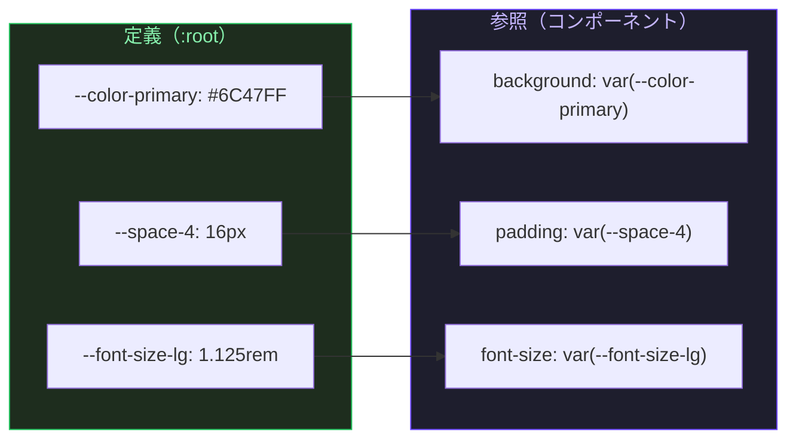

**従来のSASS変数との違い**

| 特性 | CSS変数 (`--name`) | SASS変数 (`$name`) |
|------|-------------------|-------------------|
| 処理タイミング | ブラウザが実行時に解決 | コンパイル時に解決 |
| JavaScriptから操作 | できる | できない |
| スコープ | DOM階層に従う | ファイルスコープ |
| ダークモード切り替え | 変数の再定義だけでOK | 不可 |
| カスケード・継承 | する | しない |
| ブラウザ開発ツールで確認 | できる | できない |

---

### 3.2 定義・参照・スコープ

#### 基本構文

```css
/* ===== 定義 ===== */
:root {
  --color-primary: #6C47FF;   /* グローバルスコープ */
}

.card {
  --card-bg: #1e1e2e;         /* .card スコープ限定 */
  background: var(--card-bg);
}

/* ===== 参照 ===== */
.button {
  background: var(--color-primary);
}

/* ===== フォールバック値（第2引数） ===== */
.button {
  /* --color-brand が未定義の場合は #6C47FF を使用 */
  background: var(--color-brand, #6C47FF);

  /* フォールバックに別の変数を使うことも可能 */
  color: var(--text-on-brand, var(--color-white, #ffffff));
}
```

#### スコープの仕組み

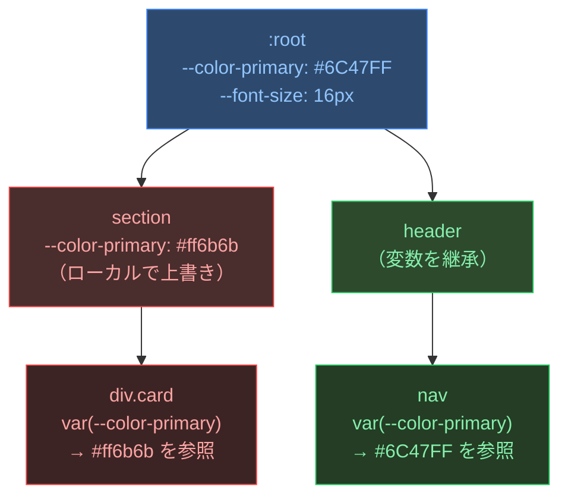

**ポイント**：CSS変数はDOMツリーに従って継承されます。子要素は親要素の変数を参照でき、より近い祖先で上書きされた値が優先されます。

---

### 3.3 トークンの階層設計

プロダクションで使われる設計では、トークンを3層に分けて管理します。

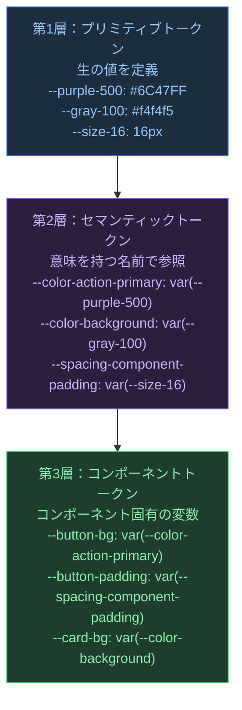

```css
/* ===== 第1層：プリミティブトークン ===== */
:root {
  /* カラースケール */
  --purple-50:  #f5f3ff;
  --purple-100: #ede9fe;
  --purple-500: #6C47FF;
  --purple-600: #5a38e0;
  --purple-900: #1e0a5c;

  --gray-50:  #fafafa;
  --gray-100: #f4f4f5;
  --gray-500: #71717a;
  --gray-900: #18181b;

  --red-500:   #ef4444;
  --green-500: #22c55e;
  --amber-500: #f59e0b;

  /* スペース原子値 */
  --size-0:  0px;
  --size-1:  4px;
  --size-2:  8px;
  --size-3:  12px;
  --size-4:  16px;
  --size-6:  24px;
  --size-8:  32px;
  --size-12: 48px;
  --size-16: 64px;
}

/* ===== 第2層：セマンティックトークン（ライトモード） ===== */
:root {
  /* カラーの意味付け */
  --color-action-primary:      var(--purple-500);
  --color-action-primary-hover: var(--purple-600);
  --color-danger:              var(--red-500);
  --color-success:             var(--green-500);
  --color-warning:             var(--amber-500);

  /* 背景・テキスト */
  --color-bg-base:     var(--gray-50);
  --color-bg-surface:  var(--gray-100);
  --color-text-primary: var(--gray-900);
  --color-text-muted:  var(--gray-500);

  /* スペーシングの意味付け */
  --spacing-xs:  var(--size-1);
  --spacing-sm:  var(--size-2);
  --spacing-md:  var(--size-4);
  --spacing-lg:  var(--size-6);
  --spacing-xl:  var(--size-8);
}

/* ===== 第3層：コンポーネントトークン ===== */
:root {
  --button-bg:          var(--color-action-primary);
  --button-bg-hover:    var(--color-action-primary-hover);
  --button-padding-x:   var(--spacing-md);
  --button-padding-y:   var(--spacing-sm);
  --card-bg:            var(--color-bg-surface);
  --card-padding:       var(--spacing-lg);
}
```

---

### 3.4 JavaScriptとの連携

CSS変数はJavaScriptからリアルタイムに読み書きできます。

```javascript
// ===== 読み取り =====
const root = document.documentElement;
const primaryColor = getComputedStyle(root)
  .getPropertyValue('--color-action-primary')
  .trim();
// => "#6C47FF"

// ===== 書き込み（リアルタイムにテーマ変更） =====
root.style.setProperty('--color-action-primary', '#ff6b6b');

// ===== テーマ切り替えの実装例 =====
function setTheme(theme) {
  const themes = {
    light: {
      '--color-bg-base':      '#fafafa',
      '--color-text-primary': '#18181b',
    },
    dark: {
      '--color-bg-base':      '#18181b',
      '--color-text-primary': '#f4f4f5',
    }
  };

  Object.entries(themes[theme]).forEach(([key, value]) => {
    root.style.setProperty(key, value);
  });

  localStorage.setItem('theme', theme);
}

// ===== 初期化（保存済みテーマを復元） =====
const saved = localStorage.getItem('theme') || 'light';
setTheme(saved);
```

---

### 3.5 ベストプラクティス

#### ✅ 命名は `--カテゴリ-役割-修飾子` の形式で統一する

```css
/* NG: 意味がわからない名前 */
--c1: #6C47FF;
--blue: #3b82f6;
--big: 24px;

/* OK: カテゴリ-役割-修飾子 の形式 */
--color-action-primary:       #6C47FF;
--color-action-primary-hover: #5a38e0;
--color-feedback-danger:      #ef4444;
--font-size-heading-lg:       1.5rem;
--spacing-component-gap:      16px;
```

#### ✅ `@property` で型定義する（モダンブラウザ）

```css
/* CSS Houdini の @property でアニメーション可能に */
@property --progress {
  syntax: '<number>';
  inherits: false;
  initial-value: 0;
}

.progress-bar {
  --progress: 0;
  width: calc(var(--progress) * 1%);
  transition: --progress 0.3s ease;
}

/* JavaScriptから数値だけ渡せる */
/* el.style.setProperty('--progress', 75); */
```

#### ✅ 未使用変数は定期的に棚卸しする

```css
/* デザイントークンファイルを独立させて管理 */
/* tokens.css  ← プリミティブ・セマンティックトークン */
/* components/ ← コンポーネントトークン */
```

---

## 4. カラーシステム

### 4.1 カラーシステムの目的

カラーシステムとは、**プロダクト全体で一貫した色の使い方を保証する仕組み**です。
「なんとなく見た目が合う色」を選ぶのではなく、**目的・意味・アクセシビリティ**に基づいて色を定義します。

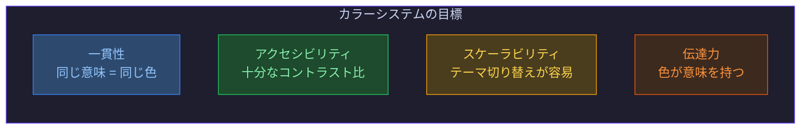

---

### 4.2 カラーパレットの構造

#### スケール（色の濃淡）

各カラーを50〜900の10段階で定義します。数値が大きいほど暗くなります。

```css
/* ===== パープルスケールの例 ===== */
:root {
  --purple-50:  #f5f3ff;  /* 最も淡い */
  --purple-100: #ede9fe;
  --purple-200: #ddd6fe;
  --purple-300: #c4b5fd;
  --purple-400: #a78bfa;
  --purple-500: #8b5cf6;  /* ベースカラー */
  --purple-600: #7c3aed;
  --purple-700: #6d28d9;
  --purple-800: #5b21b6;
  --purple-900: #4c1d95;  /* 最も濃い */
}
```

```mermaid
graph LR
    C50["50\n最も淡い\n背景・ホバー"] --> C100["100"] --> C200["200"] --> C300["300"] --> C400["400"] --> C500["500\nベース\nメインUI"] --> C600["600\nホバー状態"] --> C700["700"] --> C800["800"] --> C900["900\n最も濃い\nテキスト"]

    style C50  fill:#f5f3ff,color:#4c1d95,stroke:#c4b5fd
    style C100 fill:#ede9fe,color:#4c1d95,stroke:#c4b5fd
    style C200 fill:#ddd6fe,color:#4c1d95,stroke:#a78bfa
    style C300 fill:#c4b5fd,color:#3b1e8c,stroke:#8b5cf6
    style C400 fill:#a78bfa,color:#fff,stroke:#7c3aed
    style C500 fill:#8b5cf6,color:#fff,stroke:#6d28d9
    style C600 fill:#7c3aed,color:#fff,stroke:#5b21b6
    style C700 fill:#6d28d9,color:#fff,stroke:#4c1d95
    style C800 fill:#5b21b6,color:#fff,stroke:#3b0f8c
    style C900 fill:#4c1d95,color:#ede9fe,stroke:#3b0f8c
```

#### カテゴリ分類

| カテゴリ | 用途 | 代表例 |
|---------|------|--------|
| **Brand** | ブランドの主色・アクセント | --purple-500 |
| **Neutral** | 背景・テキスト・ボーダー | --gray-100〜900 |
| **Semantic** | 意味を持つUI状態 | danger, success, warning, info |
| **Overlay** | モーダル背景・影 | rgba(0,0,0,0.5) |

---

### 4.3 セマンティックカラートークン

「何色か」ではなく「**何のための色か**」で命名します。

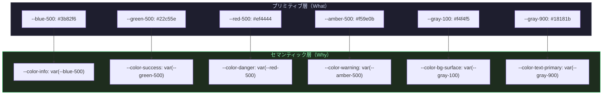

```css
/* ===== セマンティックカラートークンの完全な定義例 ===== */
:root {
  /* アクション系 */
  --color-action-primary:         var(--purple-500);
  --color-action-primary-hover:   var(--purple-600);
  --color-action-primary-active:  var(--purple-700);
  --color-action-primary-subtle:  var(--purple-50);

  /* フィードバック系 */
  --color-feedback-danger:        var(--red-500);
  --color-feedback-danger-subtle: var(--red-50);
  --color-feedback-success:       var(--green-500);
  --color-feedback-success-subtle: var(--green-50);
  --color-feedback-warning:       var(--amber-500);
  --color-feedback-warning-subtle: var(--amber-50);
  --color-feedback-info:          var(--blue-500);
  --color-feedback-info-subtle:   var(--blue-50);

  /* 背景系 */
  --color-bg-base:                var(--gray-50);
  --color-bg-surface:             var(--white);
  --color-bg-overlay:             var(--gray-100);

  /* テキスト系 */
  --color-text-primary:           var(--gray-900);
  --color-text-secondary:         var(--gray-600);
  --color-text-muted:             var(--gray-400);
  --color-text-on-primary:        var(--white);
  --color-text-disabled:          var(--gray-300);

  /* ボーダー系 */
  --color-border-default:         var(--gray-200);
  --color-border-strong:          var(--gray-400);
  --color-border-focus:           var(--purple-500);
}
```

---

### 4.4 ダークモード対応

CSS変数を使えば、ダークモードの切り替えは**セマンティックトークンの値を置き換えるだけ**です。

```css
/* ===== ライトモード（デフォルト） ===== */
:root {
  --color-bg-base:       #fafafa;
  --color-bg-surface:    #ffffff;
  --color-text-primary:  #18181b;
  --color-text-muted:    #71717a;
  --color-border-default: #e4e4e7;
}

/* ===== ダークモード（OS設定に追従） ===== */
@media (prefers-color-scheme: dark) {
  :root {
    --color-bg-base:       #09090b;
    --color-bg-surface:    #18181b;
    --color-text-primary:  #fafafa;
    --color-text-muted:    #a1a1aa;
    --color-border-default: #27272a;
  }
}

/* ===== ダークモード（クラスによる手動切り替え） ===== */
[data-theme="dark"] {
  --color-bg-base:       #09090b;
  --color-bg-surface:    #18181b;
  --color-text-primary:  #fafafa;
  --color-text-muted:    #a1a1aa;
  --color-border-default: #27272a;
}
```

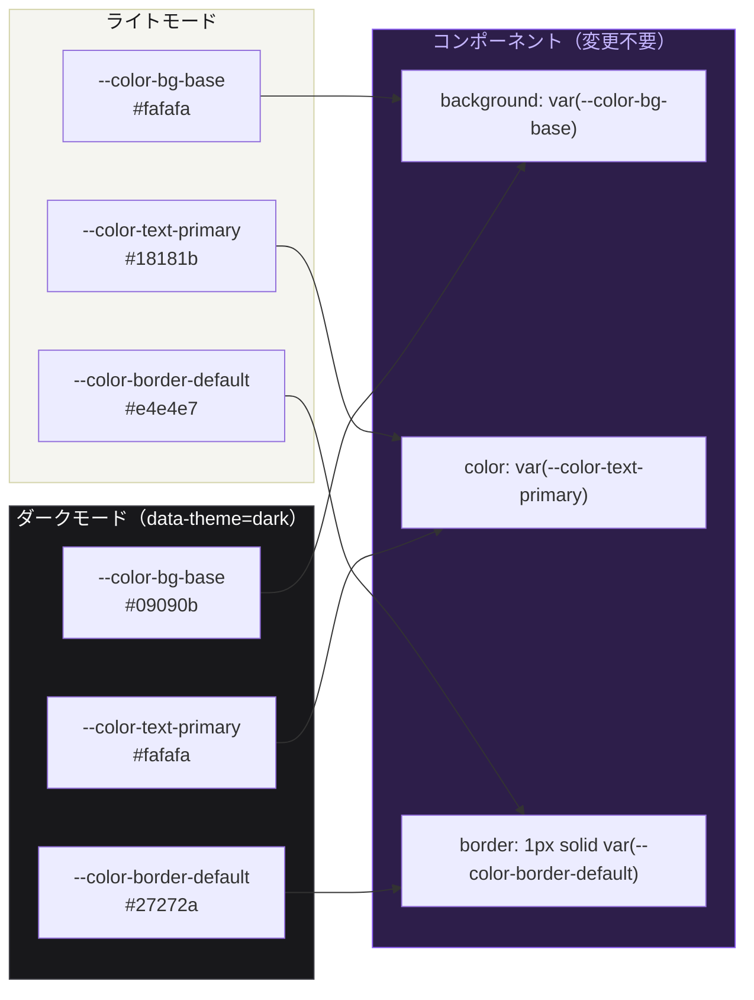

---

### 4.5 アクセシビリティとコントラスト比

**WCAG 2.1** では、テキストの読みやすさのためにコントラスト比の基準を定めています。

| 基準レベル | 通常テキスト | 大きなテキスト (18pt以上) |
|-----------|------------|----------------------|
| **AA**（推奨最低基準） | 4.5:1以上 | 3:1以上 |
| **AAA**（理想基準） | 7:1以上 | 4.5:1以上 |

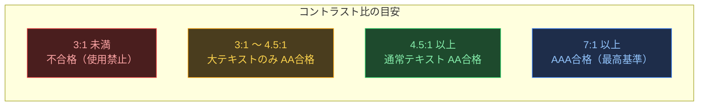

```css
/* ===== コントラストを意識したカラー設計の例 ===== */

/* NG: 薄い背景 + 薄いテキスト（コントラスト不足） */
.badge-bad {
  background: var(--purple-100); /* #ede9fe */
  color: var(--purple-300);      /* #c4b5fd  コントラスト比: 約2.3:1 → 不合格 */
}

/* OK: 薄い背景 + 濃いテキスト */
.badge-good {
  background: var(--purple-100); /* #ede9fe */
  color: var(--purple-800);      /* #5b21b6  コントラスト比: 約7.5:1 → AAA合格 */
}

/* 確認ツール: https://webaim.org/resources/contrastchecker/ */
```

---

### 4.6 ベストプラクティス

#### ✅ セマンティックトークンはプリミティブを参照する（直接値を書かない）

```css
/* NG: セマンティックトークンにハードコード */
:root {
  --color-danger: #ef4444;
}

/* OK: プリミティブを参照 */
:root {
  --red-500: #ef4444;                  /* プリミティブ */
  --color-danger: var(--red-500);      /* セマンティック */
}
/* → 将来 #ef4444 を変えたくなっても --red-500 だけ修正すればOK */
```

#### ✅ コンポーネントには必ずセマンティックカラーを使う

```css
/* NG: プリミティブをコンポーネントで直接使う */
.alert-error {
  background: var(--red-50);    /* 意味が不明確 */
  color: var(--red-900);
}

/* OK: セマンティックトークンを使う */
.alert-error {
  background: var(--color-feedback-danger-subtle);
  color: var(--color-feedback-danger);
}
```

#### ✅ カラー用途は5つに分類して考える

```text
1. 背景（Background）  - bg-base, bg-surface, bg-overlay
2. テキスト（Text）    - text-primary, text-secondary, text-muted
3. アクション（Action）- action-primary, action-secondary
4. フィードバック（Feedback） - danger, success, warning, info
5. ボーダー（Border）  - border-default, border-strong, border-focus
```

---

## 5. タイポグラフィシステム

### 5.1 タイポグラフィの重要性

ウェブサイトのコンテンツの**95%はタイポグラフィ**で構成されています（[iA Inc. の研究](https://ia.net/topics/the-web-is-all-about-typography-period)）。
タイポグラフィシステムは、読みやすさ・ヒエラルキー・ブランドの一貫性を保証します。

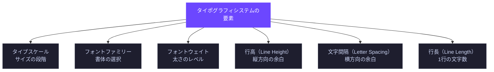

---

### 5.2 タイプスケールの設計

#### モジュラースケール（比率による設計）

等比数列を使って、視覚的に調和したサイズ体系を作ります。

```text
比率: 1.25（Major Third）の場合
base = 1rem (16px)

xs:   1rem ÷ 1.25²  = 0.64rem   ≈ 10px
sm:   1rem ÷ 1.25   = 0.8rem    = 12.8px
base: 1rem           = 1rem     = 16px
lg:   1rem × 1.25   = 1.25rem  = 20px
xl:   1rem × 1.25²  = 1.563rem = 25px
2xl:  1rem × 1.25³  = 1.953rem = 31.25px
3xl:  1rem × 1.25⁴  = 2.441rem ≈ 39px
```

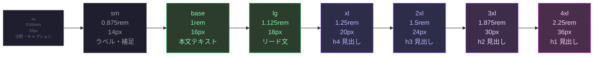

```css
/* ===== タイプスケールのトークン定義 ===== */
:root {
  --font-size-xs:   0.64rem;   /* 10px  */
  --font-size-sm:   0.875rem;  /* 14px  */
  --font-size-base: 1rem;      /* 16px  */
  --font-size-lg:   1.125rem;  /* 18px  */
  --font-size-xl:   1.25rem;   /* 20px  */
  --font-size-2xl:  1.5rem;    /* 24px  */
  --font-size-3xl:  1.875rem;  /* 30px  */
  --font-size-4xl:  2.25rem;   /* 36px  */
  --font-size-5xl:  3rem;      /* 48px  */
}
```

---

### 5.3 フォントファミリーとウェイト

#### フォントファミリーの役割分担

```css
:root {
  /* サンセリフ: 本文・UI要素に */
  --font-sans: 'Inter', 'Hiragino Kaku Gothic ProN',
               'Noto Sans JP', system-ui, sans-serif;

  /* セリフ: 長文・見出しに（ブランドによる） */
  --font-serif: 'Georgia', 'Noto Serif JP', serif;

  /* モノスペース: コード・等幅表示に */
  --font-mono: 'JetBrains Mono', 'Fira Code',
               'Source Code Pro', monospace;
}
```

#### フォントウェイト

```css
:root {
  --font-weight-regular:   400;  /* 通常テキスト */
  --font-weight-medium:    500;  /* ラベル・UIテキスト */
  --font-weight-semibold:  600;  /* 小見出し・強調 */
  --font-weight-bold:      700;  /* 見出し */
}

/* 使用例 */
body          { font-weight: var(--font-weight-regular); }
.label        { font-weight: var(--font-weight-medium); }
h3, h4        { font-weight: var(--font-weight-semibold); }
h1, h2        { font-weight: var(--font-weight-bold); }
```

---

### 5.4 行高・文字間隔・行長

#### 行高（Line Height）

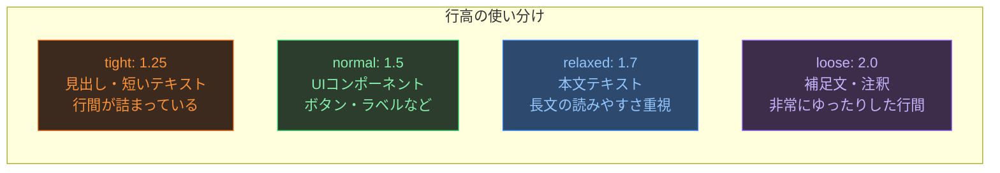

```css
:root {
  --line-height-none:    1;
  --line-height-tight:   1.25;
  --line-height-normal:  1.5;
  --line-height-relaxed: 1.7;
  --line-height-loose:   2;
}

/* 推奨の組み合わせ */
h1, h2, h3 {
  line-height: var(--line-height-tight);   /* 1.25 見出しは詰める */
}

p, li {
  line-height: var(--line-height-relaxed); /* 1.7 本文はゆったり */
}

button, label {
  line-height: var(--line-height-normal);  /* 1.5 UIパーツは中間 */
}
```

#### 文字間隔（Letter Spacing）と行長（Line Length）

```css
:root {
  /* 文字間隔トークン */
  --tracking-tight:  -0.025em;  /* 見出し（大きいサイズは詰める） */
  --tracking-normal:  0em;      /* 通常テキスト */
  --tracking-wide:    0.025em;  /* 小さいラベル・ALL CAPS */
  --tracking-wider:   0.05em;   /* 大文字のみのテキスト */
}

h1, h2 {
  letter-spacing: var(--tracking-tight);
}

.label-uppercase {
  text-transform: uppercase;
  letter-spacing: var(--tracking-wider); /* 大文字は必ず字間を広げる */
}

/* ===== 行長（コンテンツの幅制限） ===== */
/* 理想は 45〜75文字/行 。英語では約 60ch が最適とされる */
.prose {
  max-width: 65ch;    /* ch = 文字幅 (0の幅) */
  /* 日本語の場合は 35〜40em が目安 */
}
```

---

### 5.5 レスポンシブタイポグラフィ

#### clamp() を使ったフルイドタイポグラフィ

`clamp(最小値, 推奨値, 最大値)` で、画面幅に応じてなめらかにサイズが変化します。

```css
/* ===== clamp() の構文 ===== */
/* clamp(最小サイズ, ビューポート依存の計算値, 最大サイズ) */

h1 {
  /* 320px画面: 1.75rem → 1280px画面: 3rem でなめらかに変化 */
  font-size: clamp(1.75rem, 3vw + 1rem, 3rem);
}

h2 {
  font-size: clamp(1.375rem, 2vw + 1rem, 2.25rem);
}

p {
  /* 本文は clamp で最小/最大を固定しておく */
  font-size: clamp(1rem, 1.25vw + 0.75rem, 1.125rem);
}

/* ===== CSS変数との組み合わせ ===== */
:root {
  --font-size-h1: clamp(1.75rem, 3vw + 1rem, 3rem);
  --font-size-h2: clamp(1.375rem, 2vw + 1rem, 2.25rem);
  --font-size-h3: clamp(1.125rem, 1.5vw + 0.75rem, 1.5rem);
  --font-size-body: clamp(1rem, 1.25vw + 0.5rem, 1.125rem);
}
```

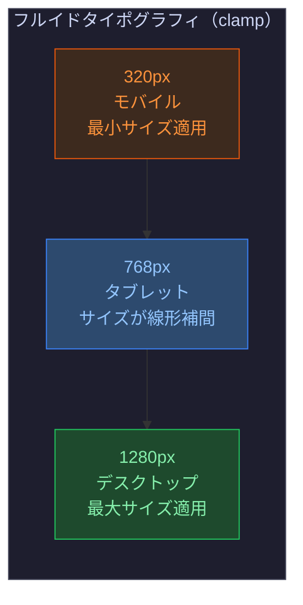

---

### 5.6 ベストプラクティス

#### ✅ 見出しの階層を飛ばさない（SEO・アクセシビリティ）

```html
<!-- NG: h1 の次に h3 -->
<h1>ページタイトル</h1>
<h3>サブセクション</h3>  <!-- h2 をスキップ -->

<!-- OK: 階層順に使う -->
<h1>ページタイトル</h1>
<h2>セクション</h2>
<h3>サブセクション</h3>
```

#### ✅ `px` ではなく `rem` を使う

```css
/* NG: px 指定（ブラウザのフォントサイズ設定を無視する） */
.text {
  font-size: 14px;
}

/* OK: rem 指定（ブラウザ設定に追従する） */
.text {
  font-size: 0.875rem; /* = ブラウザのデフォルト16px × 0.875 = 14px */
}
```

#### ✅ 日本語フォントは必ず日本語フォントをフォールバックに含める

```css
:root {
  --font-sans:
    /* 英語フォント（高品質なラテン文字） */
    'Inter',
    /* macOS/iOS 日本語 */
    'Hiragino Kaku Gothic ProN', 'Hiragino Sans',
    /* Windows 日本語 */
    'Meiryo', 'Yu Gothic',
    /* Android・汎用 */
    'Noto Sans JP',
    /* 最終フォールバック */
    system-ui, sans-serif;
}
```

#### ✅ Web フォントは適切な `font-display` を設定する

```css
@font-face {
  font-family: 'Inter';
  src: url('/fonts/Inter-var.woff2') format('woff2');
  font-weight: 100 900;
  font-style: normal;
  font-display: swap; /* フォント読み込み中はシステムフォントで表示 */
}
```

---

## 6. スペーシング・サイジングシステム

### 6.1 スペーシングシステムの目的

スペーシングシステムとは、**余白・サイズを一定のルールに従って統一する仕組み**です。
「なんとなく16pxにした」ではなく、**すべての余白が理由を持つ**状態を目指します。

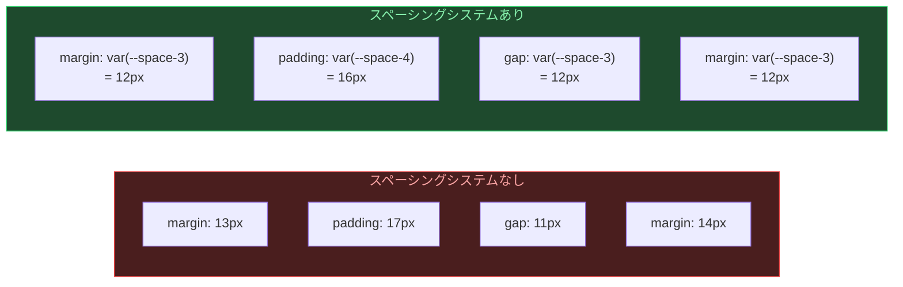

---

### 6.2 ベースグリッドと数列

#### 4px ベースグリッド（業界標準）

ほとんどのデザインシステムは **4px** を基準単位として使用しています。
これはデバイスのピクセル密度（1x/2x/3x）でキレイに割り切れるためです。

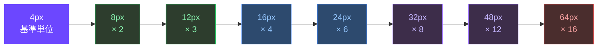

---

### 6.3 スペーシングトークンの設計

```css
/* ===== スペーシングトークン（4px基準） ===== */
:root {
  --space-px:  1px;   /* ボーダー・デバイダー専用 */
  --space-0:   0px;
  --space-0-5: 2px;   /* 極小の微調整 */
  --space-1:   4px;   /* アイコンとラベルの間など */
  --space-2:   8px;   /* 関連要素のタイト結合 */
  --space-3:   12px;  /* コンポーネント内要素間 */
  --space-4:   16px;  /* コンポーネント標準パディング */
  --space-5:   20px;
  --space-6:   24px;  /* セクション内の余白 */
  --space-8:   32px;  /* カード・パネルの余白 */
  --space-10:  40px;
  --space-12:  48px;  /* セクション間の余白 */
  --space-16:  64px;  /* ページレベルの余白 */
  --space-20:  80px;
  --space-24:  96px;  /* ヒーロー・大セクション */
}
```

#### セマンティックスペーシングトークン

```css
:root {
  /* コンポーネント内部の余白 */
  --spacing-inset-xs:  var(--space-2);   /* 8px  - バッジ・タグ */
  --spacing-inset-sm:  var(--space-3);   /* 12px - 小ボタン */
  --spacing-inset-md:  var(--space-4);   /* 16px - 標準ボタン・入力 */
  --spacing-inset-lg:  var(--space-6);   /* 24px - カード・パネル */
  --spacing-inset-xl:  var(--space-8);   /* 32px - モーダル */

  /* スタック（縦方向の間隔） */
  --spacing-stack-xs:  var(--space-2);   /* 8px  - タイトに並ぶリスト */
  --spacing-stack-sm:  var(--space-4);   /* 16px - フォームフィールド間 */
  --spacing-stack-md:  var(--space-6);   /* 24px - セクション内要素間 */
  --spacing-stack-lg:  var(--space-12);  /* 48px - セクション間 */
  --spacing-stack-xl:  var(--space-16);  /* 64px - ページセクション間 */

  /* インライン（横方向の間隔） */
  --spacing-inline-xs: var(--space-1);   /* 4px  - アイコン + ラベル */
  --spacing-inline-sm: var(--space-2);   /* 8px  - ボタン内要素間 */
  --spacing-inline-md: var(--space-4);   /* 16px - カラム間 */
  --spacing-inline-lg: var(--space-6);   /* 24px - 広めのカラム間 */
}
```

---

### 6.4 コンポーネントサイジング

#### 高さのスケール

インタラクティブ要素（ボタン・入力フォーム・セレクト）は、統一された高さを持つべきです。

```css
:root {
  /* コンポーネントの高さスケール */
  --size-component-xs: 24px;   /* チップ・タグ */
  --size-component-sm: 32px;   /* 小ボタン・小入力フォーム */
  --size-component-md: 40px;   /* 標準ボタン・入力フォーム（推奨） */
  --size-component-lg: 48px;   /* 大ボタン・大入力フォーム */
  --size-component-xl: 56px;   /* 特大ボタン（ランディングページ等） */
}

/* インタラクティブ要素の最小タッチターゲット */
/* WCAG 2.5.5 : 44×44px 以上を推奨 */
.button, .input, .select {
  min-height: var(--size-component-md); /* 40px */
  min-width: 44px;                      /* タッチターゲット確保 */
}
```

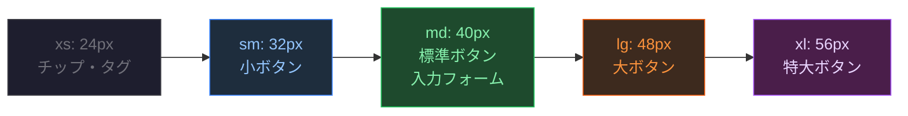

#### コンテナ幅スケール

```css
:root {
  /* コンテナの最大幅 */
  --container-xs:  320px;   /* 超狭コンテンツ（モーダルなど） */
  --container-sm:  480px;   /* 狭コンテンツ（フォームなど） */
  --container-md:  768px;   /* 中程度（ブログ本文など） */
  --container-lg:  1024px;  /* 標準コンテンツ */
  --container-xl:  1280px;  /* 広いレイアウト */
  --container-2xl: 1536px;  /* フルワイドレイアウト */
}

/* 使用例 */
.container {
  width: 100%;
  max-width: var(--container-xl);
  margin-inline: auto;
  padding-inline: var(--space-4);
}

@media (min-width: 768px) {
  .container {
    padding-inline: var(--space-6);
  }
}
```

---

### 6.5 スペーシングの適用パターン

#### 近接の原則（関連性とスペース）

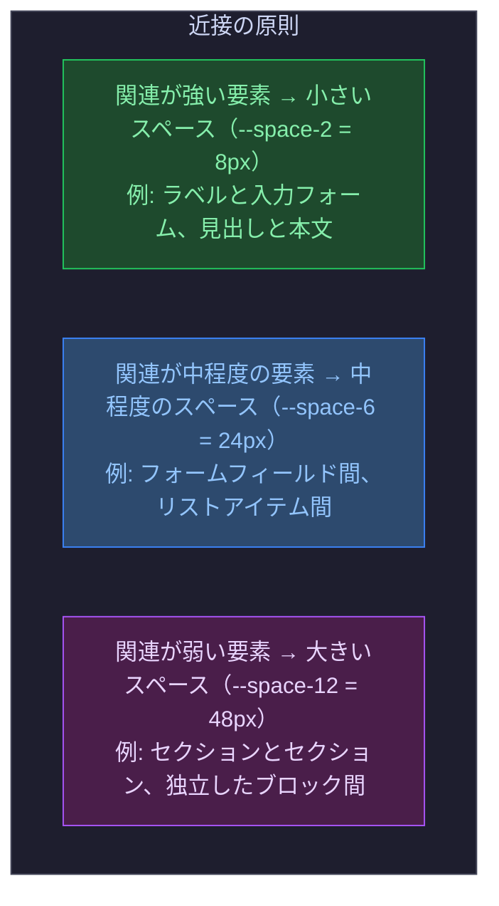

```css
/* ===== 近接の原則をCSSで表現 ===== */

/* フォームグループ: ラベルと入力は近く */
.form-group {
  display: flex;
  flex-direction: column;
  gap: var(--space-1);        /* 4px: ラベルと入力の間 */
}

/* フォームフィールド間: 中程度のスペース */
.form-section {
  display: flex;
  flex-direction: column;
  gap: var(--space-4);        /* 16px: フィールド間 */
}

/* フォームとボタンの間: 少し広めのスペース */
.form-actions {
  margin-top: var(--space-6); /* 24px */
}

/* セクション間: 大きいスペース */
.page-section + .page-section {
  margin-top: var(--space-16); /* 64px */
}
```

#### パディングとマージンの使い分け

```css
/* パディング: コンポーネント内部の余白 */
.card {
  padding: var(--spacing-inset-lg); /* 24px: カード内部 */
}

/* マージン: コンポーネント間の余白（外部空間） */
/* 現代的なアプローチでは margin の代わりに gap を使う */
.card-grid {
  display: grid;
  gap: var(--space-6); /* 24px: カード間 */
}

/* margin よりも gap が推奨される理由 */
/* - 最後の要素への不要なマージンが発生しない */
/* - 親コンテナとの依存が発生しない */
```

---

### 6.6 ベストプラクティス

#### ✅ マジックナンバーを排除し、必ずトークンを使う

```css
/* NG: 理由のない数値 */
.component {
  padding: 13px 17px;
  margin-bottom: 22px;
  gap: 11px;
}

/* OK: トークンを使用（4px グリッドに沿う） */
.component {
  padding: var(--space-3) var(--space-4);  /* 12px 16px */
  margin-bottom: var(--space-6);            /* 24px */
  gap: var(--space-3);                      /* 12px */
}
```

#### ✅ margin より gap を優先する

```css
/* NG: margin による間隔指定（最後の要素に余分なマージンが残る） */
.list-item {
  margin-bottom: var(--space-4);
}

/* OK: 親要素の gap で管理 */
.list {
  display: flex;
  flex-direction: column;
  gap: var(--space-4);
  /* すべての要素間に等間隔、最後には付かない */
}
```

#### ✅ スペースを「意味」で選ぶ

```text
コンポーネント内の密接な関係  → --space-1 〜 --space-2  ( 4px〜 8px)
コンポーネント内の標準的な間隔 → --space-3 〜 --space-4  (12px〜16px)
コンポーネント間の余白        → --space-6 〜 --space-8  (24px〜32px)
セクション間の余白            → --space-12〜--space-16 (48px〜64px)
ページレベルの大きな余白      → --space-20〜--space-24 (80px〜96px)
```

#### ✅ padding は対称か、水平/垂直で分けて指定する

```css
/* NG: 4値を全部バラバラに指定 → 意図が読み取りにくい */
.button {
  padding: 8px 16px 10px 14px;
}

/* OK: 対称に指定 */
.button {
  padding: var(--space-2) var(--space-4); /* 8px 16px */
}

/* OK: 論理プロパティで指定（RTL対応）  */
.button {
  padding-block:  var(--space-2);  /* 上下 8px */
  padding-inline: var(--space-4);  /* 左右 16px */
}
```

---

## まとめ：4システムの関係性

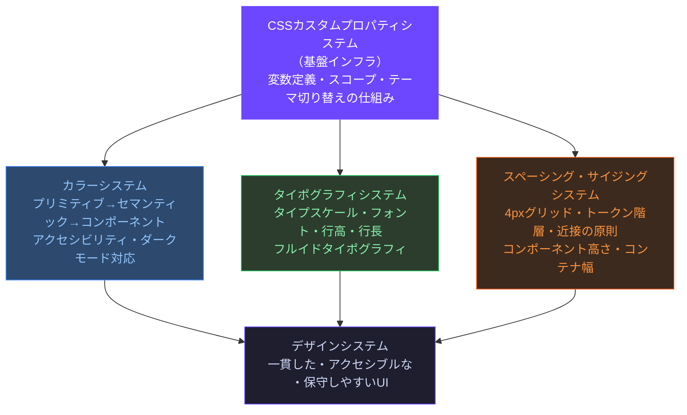

---

## 参考リソース

### CSSカスタムプロパティ

- **MDN - CSS カスタムプロパティ** — https://developer.mozilla.org/ja/docs/Web/CSS/Using_CSS_custom_properties
- **MDN - @property** — https://developer.mozilla.org/en-US/docs/Web/CSS/@property
- **CSS Tricks - A Complete Guide to Custom Properties** — https://css-tricks.com/a-complete-guide-to-custom-properties/
- **W3C CSS Custom Properties Spec** — https://www.w3.org/TR/css-variables-1/

### カラーシステム

- **Material Design 3 - Color System** — https://m3.material.io/styles/color/overview
- **Radix UI Colors** — https://www.radix-ui.com/colors
- **Tailwind CSS - Color Palette** — https://tailwindcss.com/docs/customizing-colors
- **WebAIM Contrast Checker** — https://webaim.org/resources/contrastchecker/
- **WCAG 2.1 - Success Criterion 1.4.3 (Contrast)** — https://www.w3.org/WAI/WCAG21/Understanding/contrast-minimum.html

### タイポグラフィシステム

- **iA Inc. - Web Typography** — https://ia.net/topics/the-web-is-all-about-typography-period
- **Modular Scale** — https://www.modularscale.com/
- **MDN - font-display** — https://developer.mozilla.org/ja/docs/Web/CSS/@font-face/font-display
- **MDN - clamp()** — https://developer.mozilla.org/ja/docs/Web/CSS/clamp
- **Every Layout - The Stack** — https://every-layout.dev/layouts/stack/
- **Google Fonts Knowledge** — https://fonts.google.com/knowledge

### スペーシング・サイジングシステム

- **Material Design - Spacing** — https://m3.material.io/foundations/layout/understanding-layout/spacing
- **8-point Grid System** — https://spec.fm/specifics/8-pt-grid
- **Tailwind CSS - Spacing** — https://tailwindcss.com/docs/customizing-spacing
- **WCAG 2.5.5 - Target Size** — https://www.w3.org/WAI/WCAG21/Understanding/target-size.html
- **Smashing Magazine - Spacing in Design Systems** — https://www.smashingmagazine.com/2021/04/designing-developing-color-system/

### デザイントークン全般

- **Design Tokens Community Group (W3C)** — https://www.w3.org/community/design-tokens/
- **Style Dictionary (Amazon)** — https://styledictionary.com/
- **Token Types Specification** — https://tr.designtokens.org/format/
