# 🎨 CSSデザインシステム完全ガイド
>
> 初学者から実践者まで対応した、モダンCSSデザインシステム構築の決定版

---

## 📚 目次

| # | 章タイトル | レベル |
|---|-----------|--------|
| 1 | [デザインシステムとは何か？](#1-デザインシステムとは何か) | 🟢 入門 |
| 2 | [CSS設計の基礎原則](#2-css設計の基礎原則) | 🟢 入門 |
| 3 | [CSSカスタムプロパティ（変数）システム](#3-cssカスタムプロパティ変数システム) | 🟡 基礎 |
| 4 | [カラーシステム](#4-カラーシステム) | 🟡 基礎 |
| 5 | [タイポグラフィシステム](#5-タイポグラフィシステム) | 🟡 基礎 |
| 6 | [スペーシング・サイジングシステム](#6-スペーシングサイジングシステム) | 🟡 基礎 |
| 7 | [グリッド・レイアウトシステム](#7-グリッドレイアウトシステム) | 🟠 中級 |
| 8 | [コンポーネント設計とBEM命名規則](#8-コンポーネント設計とbem命名規則) | 🟠 中級 |
| 9 | [レスポンシブデザインシステム](#9-レスポンシブデザインシステム) | 🟠 中級 |
| 10 | [アクセシビリティ（a11y）設計](#10-アクセシビリティa11y設計) | 🟠 中級 |
| 11 | [アニメーション・トランジションシステム](#11-アニメーショントランジションシステム) | 🔴 上級 |
| 12 | [CSSアーキテクチャパターン](#12-cssアーキテクチャパターン) | 🔴 上級 |
| 13 | [デザイントークン](#13-デザイントークン) | 🔴 上級 |
| 14 | [実践：完全なコンポーネント実装例](#14-実践完全なコンポーネント実装例) | 🔴 上級 |
| 15 | [パフォーマンス最適化](#15-パフォーマンス最適化) | 🔴 上級 |
| 16 | [ツール・エコシステム](#16-ツールエコシステム) | 🟠 中級 |
| 17 | [ベストプラクティス総まとめ](#17-ベストプラクティス総まとめ) | 全レベル |
| 18 | [参考文献・ソース一覧](#18-参考文献ソース一覧) | 参考 |

---

## 1. デザインシステムとは何か？

### 1.1 定義と目的

**デザインシステム**とは、一貫性のあるUIを効率よく構築するための「**再利用可能なコンポーネント・ルール・ドキュメントの集合体**」です。  
単なるスタイルガイドではなく、デザインと開発の両チームをつなぐ**共通言語**として機能します。

> 💡 **わかりやすいたとえ：**  
> デザインシステムは「レゴブロックのセット」です。  
> ブロック（コンポーネント）の種類・色・接続ルール（デザイン原則）があらかじめ決まっているため、  
> 誰が組み立てても一貫した作品になります。

### 1.2 デザインシステムの全体構造

```mermaid
graph TD
    DS["🎨 デザインシステム"]

    DS --> F["🧱 ファンデーション層<br/>（基盤・最初に定義）"]
    DS --> C["🧩 コンポーネント層<br/>（再利用可能な部品）"]
    DS --> P["📐 パターン層<br/>（部品の組み合わせ方）"]
    DS --> G["📖 ドキュメント層<br/>（使い方・ガイドライン）"]

    F --> F1["🎨 カラーシステム"]
    F --> F2["📝 タイポグラフィ"]
    F --> F3["📏 スペーシング"]
    F --> F4["🔲 グリッド・レイアウト"]
    F --> F5["✨ アニメーション"]

    C --> C1["ボタン・フォーム"]
    C --> C2["カード・リスト"]
    C --> C3["モーダル・ダイアログ"]
    C --> C4["ナビゲーション"]
    C --> C5["テーブル・データ表示"]

    P --> P1["ページレイアウトパターン"]
    P --> P2["フォームパターン"]
    P --> P3["エラー表示パターン"]

    G --> G1["アクセシビリティガイド"]
    G --> G2["コーディング規約"]
    G --> G3["Storybook・カタログ"]

    style DS fill:#1a1a2e,color:#eee,stroke:#e94560
    style F fill:#16213e,color:#eee,stroke:#0f3460
    style C fill:#0f3460,color:#eee,stroke:#e94560
    style P fill:#533483,color:#eee,stroke:#e94560
    style G fill:#2d6a4f,color:#eee,stroke:#52b788
```

### 1.3 「あり」vs「なし」の比較

```mermaid
graph LR
    subgraph WITHOUT["❌ デザインシステムなし（よくある問題）"]
        W1["ボタンAの色: #3498db"]
        W2["ボタンBの色: #2980b9"]
        W3["ボタンCの色: rgb(52,152,219)"]
        W4["フォントサイズが<br/>ページごとにバラバラ"]
        W5["余白の基準がない"]
        W6["色を変えたい→<br/>全ファイルを修正"]
    end

    subgraph WITH["✅ デザインシステムあり（解決後）"]
        S1["--color-primary: #3498db<br/>（1箇所で定義）"]
        S2["全ボタンが変数を参照"]
        S3["色を変えたい→<br/>変数1行を変更するだけ"]
        S4["フォントスケールが統一"]
        S5["スペーシングが8px刻み"]
        S6["新メンバーも迷わない"]
    end

    WITHOUT -.->|"デザインシステム導入"| WITH

    style W1 fill:#e74c3c,color:#fff,stroke:#c0392b
    style W2 fill:#e74c3c,color:#fff,stroke:#c0392b
    style W3 fill:#e74c3c,color:#fff,stroke:#c0392b
    style W4 fill:#e74c3c,color:#fff,stroke:#c0392b
    style W5 fill:#e74c3c,color:#fff,stroke:#c0392b
    style W6 fill:#e74c3c,color:#fff,stroke:#c0392b
    style S1 fill:#27ae60,color:#fff,stroke:#1e8449
    style S2 fill:#27ae60,color:#fff,stroke:#1e8449
    style S3 fill:#27ae60,color:#fff,stroke:#1e8449
    style S4 fill:#27ae60,color:#fff,stroke:#1e8449
    style S5 fill:#27ae60,color:#fff,stroke:#1e8449
    style S6 fill:#27ae60,color:#fff,stroke:#1e8449
```

### 1.4 代表的なデザインシステム

| システム名 | 企業 | 特徴 | URL |
|-----------|------|------|-----|
| **Material Design 3** | Google | マテリアル（素材）の物理的概念に基づく | https://m3.material.io/ |
| **Human Interface Guidelines** | Apple | 「人間中心設計」を徹底 | https://developer.apple.com/design/human-interface-guidelines/ |
| **Carbon Design System** | IBM | エンタープライズ向け・アクセシビリティ重視 | https://carbondesignsystem.com/ |
| **Fluent 2** | Microsoft | アクリル・深度・モーションが特徴 | https://fluent2.microsoft.design/ |
| **Polaris** | Shopify | EC特化・コンバージョン最適化 | https://polaris.shopify.com/ |
| **Primer** | GitHub | オープンソース・開発者向け | https://primer.style/ |

### 1.5 ✅ ベストプラクティス：デザインシステム導入のステップ

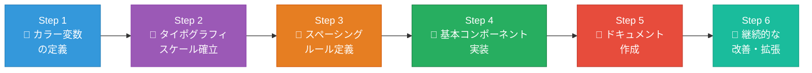

> 📖 **参考：** Nielsen Norman Group「Design Systems 101」  
> https://www.nngroup.com/articles/design-systems-101/

---

## 2. CSS設計の基礎原則

### 2.1 CSSのカスケード（Cascade）とは

CSSの「C」は**Cascade（カスケード）**を意味します。  
複数のスタイルが同じ要素に適用される場合、**どのスタイルが勝つか**を決める仕組みです。

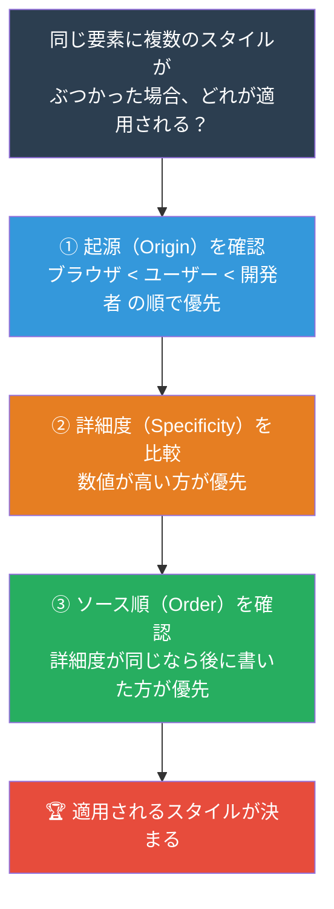

### 2.2 詳細度（Specificity）の計算

詳細度は `(a, b, c, d)` の4桁で表現します。

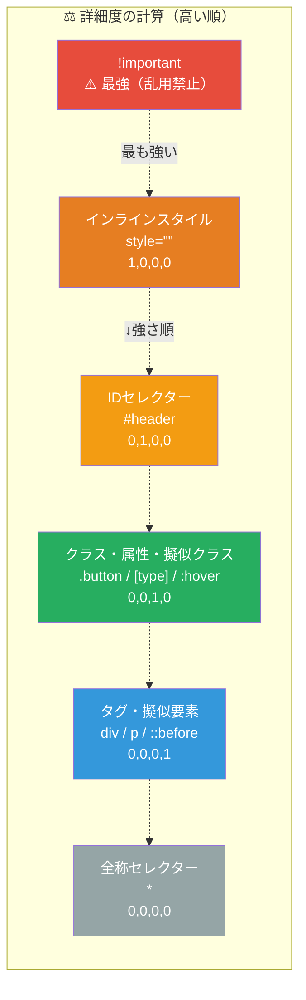

**具体的な計算例：**

```css
/* 詳細度の計算例 */

/* (0,0,0,1) = 1点 */
div { color: black; }

/* (0,0,1,0) = 10点 */
.button { color: blue; }

/* (0,0,1,1) = 11点 → .button + div を組み合わせ */
div.button { color: green; }

/* (0,1,0,0) = 100点 → ⚠️ 使用を避ける */
#header { color: red; }

/* (1,0,0,0) = 1000点 → ⚠️ 絶対に避ける */
style="color: purple;"

/* ✅ 推奨：フラットなクラスで詳細度を低く均一に保つ */
.btn-primary { color: white; }        /* (0,0,1,0) = 10点 */
.btn-primary--large { font-size: 18px; } /* (0,0,1,0) = 10点 */
```

### 2.3 CSS設計の3大原則

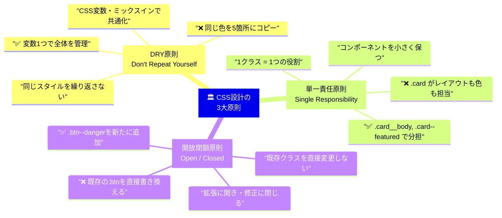

### 2.4 ✅ ベストプラクティス：詳細度管理

```css
/* ❌ 悪い例：詳細度が高すぎて上書きが困難 */
#sidebar .navigation ul li a.active {
  color: blue; /* 詳細度: 0,1,2,3 = とても高い */
}

/* ✅ 良い例：フラットなクラスで詳細度を低く均一に */
.nav-link--active {
  color: blue; /* 詳細度: 0,0,1,0 = 低くて管理しやすい */
}

/* ✅ さらに良い：@layer を使って意図的に優先順位を制御 */
@layer components {
  .nav-link--active { color: blue; }
}
@layer utilities {
  .text-red { color: red; } /* utilities は常に components より強い */
}
```

> 📖 **参考：** MDN Web Docs「詳細度」  
> https://developer.mozilla.org/ja/docs/Web/CSS/Specificity

---

## 3. CSSカスタムプロパティ（変数）システム

### 3.1 CSS変数とは何か？

CSS変数（正式名称：CSSカスタムプロパティ）は、**スタイルの値を名前をつけて保存し、全体で使い回す**仕組みです。

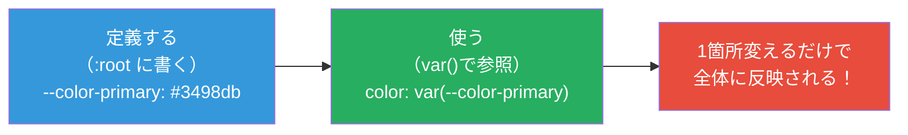

### 3.2 CSS変数 vs Sass変数の違い

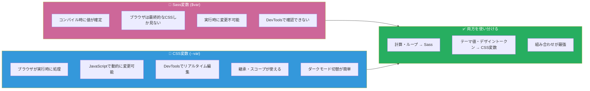

### 3.3 CSS変数の完全な書き方

```css
/* ─────────────────────────────────────────────
   Step 1: :root に変数を定義する
   :root = HTML要素全体に適用されるグローバルスコープ
   ───────────────────────────────────────────── */
:root {
  /* 命名規則：--[カテゴリ]-[サブカテゴリ]-[バリアント] */
  --color-primary-500: #3498db;
  --color-primary-600: #2980b9;
  --color-primary-50:  #ebf5fb;

  --font-size-base: 1rem;       /* 16px */
  --space-4: 1rem;              /* 16px */
  --radius-md: 0.5rem;          /* 8px  */
}

/* ─────────────────────────────────────────────
   Step 2: var() で変数を参照する
   var(変数名, フォールバック値)
   ───────────────────────────────────────────── */
.button {
  background-color: var(--color-primary-500);
  /* フォールバック: 変数が未定義の場合の代替値 */
  font-size: var(--font-size-btn, var(--font-size-base, 1rem));
}

/* ─────────────────────────────────────────────
   Step 3: コンポーネントスコープで変数を上書き
   ───────────────────────────────────────────── */
.card {
  /* .card の中でだけ有効なローカル変数 */
  --card-padding: var(--space-6);
  --card-bg: var(--color-surface);

  padding: var(--card-padding);
  background-color: var(--card-bg);
}

/* .card--compact は --card-padding だけ変える */
.card--compact {
  --card-padding: var(--space-3);
  /* card-bg はそのまま継承される */
}

/* ─────────────────────────────────────────────
   Step 4: JavaScriptで動的に変更する
   ───────────────────────────────────────────── */
/*
  // テーマカラーをリアルタイム変更
  document.documentElement.style.setProperty(
    '--color-primary-500', '#e74c3c'
  );

  // 変数の値を読み取る
  const primary = getComputedStyle(document.documentElement)
    .getPropertyValue('--color-primary-500');
*/
```

### 3.4 ダークモード対応（CSS変数の真骨頂）

```css
/* ライトモード（デフォルト） */
:root {
  --bg-page:    #ffffff;
  --bg-surface: #f8f9fa;
  --text-base:  #212529;
  --text-muted: #6c757d;
  --border:     #dee2e6;
}

/* ─── 方法①：OSの設定に連動（自動切替） ─── */
@media (prefers-color-scheme: dark) {
  :root {
    --bg-page:    #0d1117;
    --bg-surface: #161b22;
    --text-base:  #f0f6fc;
    --text-muted: #8b949e;
    --border:     #30363d;
  }
}

/* ─── 方法②：data属性でJSから切替（手動切替） ─── */
[data-theme="dark"] {
  --bg-page:    #0d1117;
  --bg-surface: #161b22;
  --text-base:  #f0f6fc;
  --text-muted: #8b949e;
  --border:     #30363d;
}

/* 切り替えるだけでOK。コンポーネントのCSSは変更不要！ */
.card {
  background-color: var(--bg-surface); /* ← ライト/ダーク自動対応 */
  color: var(--text-base);
  border: 1px solid var(--border);
}
```

### 3.5 ✅ ベストプラクティス：CSS変数の命名規則

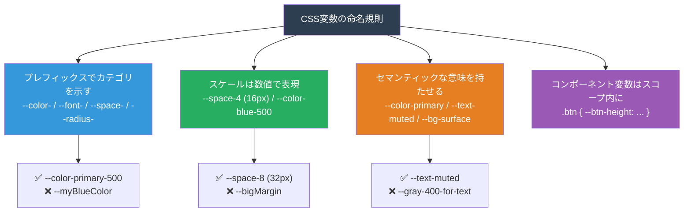

> 📖 **参考：** MDN Web Docs「CSSカスタムプロパティ（変数）」  
> https://developer.mozilla.org/ja/docs/Web/CSS/Using_CSS_custom_properties

---

## 4. カラーシステム

### 4.1 カラーシステムの3層構造

プロが作るカラーシステムは**3層構造**になっています。

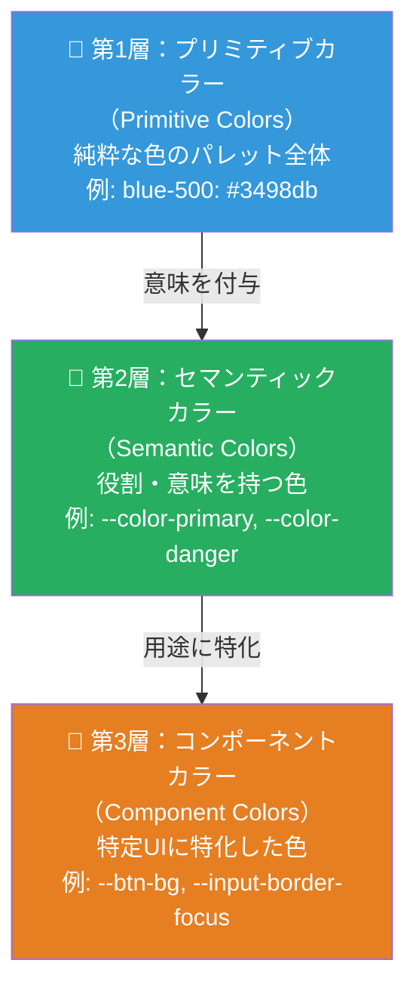

**なぜ3層にするの？** → 変更に強くなるため。  
ブランドカラーを変えたい場合、第1層（プリミティブ）を変えれば、第2・3層は自動的に追従します。

### 4.2 HSLカラーモデルを使ったパレット設計

HSL（色相H・彩度S・明度L）を使うと、体系的なパレットが作りやすくなります。

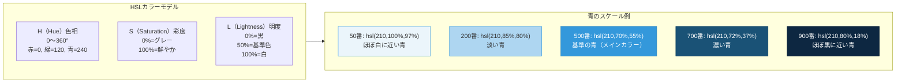

### 4.3 完全なカラーシステムの実装

```css
/* ═══════════════════════════════════════════════
   カラーシステム完全実装
   ═══════════════════════════════════════════════ */

:root {
  /* ──────────────────────────────────────────
     第1層：プリミティブカラーパレット
     すべての色の「原材料」として定義
     ────────────────────────────────────────── */

  /* ブルー系 */
  --blue-50:   hsl(210, 100%, 97%);
  --blue-100:  hsl(210,  90%, 93%);
  --blue-200:  hsl(210,  85%, 85%);
  --blue-300:  hsl(210,  80%, 73%);
  --blue-400:  hsl(210,  75%, 63%);
  --blue-500:  hsl(210,  70%, 52%); /* ← ベース */
  --blue-600:  hsl(210,  70%, 43%);
  --blue-700:  hsl(210,  72%, 35%);
  --blue-800:  hsl(210,  75%, 25%);
  --blue-900:  hsl(210,  80%, 16%);

  /* グリーン系 */
  --green-50:  hsl(145, 100%, 96%);
  --green-500: hsl(145,  63%, 42%);
  --green-700: hsl(145,  65%, 30%);

  /* レッド系 */
  --red-50:    hsl(  0, 100%, 97%);
  --red-500:   hsl(  0,  74%, 55%);
  --red-700:   hsl(  0,  74%, 40%);

  /* イエロー系 */
  --yellow-50:  hsl( 45, 100%, 96%);
  --yellow-500: hsl( 38,  92%, 50%);
  --yellow-700: hsl( 35,  90%, 35%);

  /* グレー系 */
  --gray-50:   hsl(210,  17%, 98%);
  --gray-100:  hsl(210,  17%, 95%);
  --gray-200:  hsl(210,  16%, 90%);
  --gray-300:  hsl(210,  14%, 83%);
  --gray-400:  hsl(210,  14%, 65%);
  --gray-500:  hsl(210,   9%, 45%);
  --gray-600:  hsl(210,  11%, 35%);
  --gray-700:  hsl(210,  13%, 25%);
  --gray-800:  hsl(210,  15%, 16%);
  --gray-900:  hsl(210,  17%, 10%);

  /* ──────────────────────────────────────────
     第2層：セマンティックカラー
     「意味」を持つ変数名で定義
     ────────────────────────────────────────── */

  /* ブランド・アクション */
  --color-primary:         var(--blue-500);
  --color-primary-hover:   var(--blue-600);
  --color-primary-active:  var(--blue-700);
  --color-primary-subtle:  var(--blue-50);
  --color-primary-muted:   var(--blue-100);

  /* ステータス */
  --color-success:         var(--green-500);
  --color-success-subtle:  var(--green-50);
  --color-danger:          var(--red-500);
  --color-danger-subtle:   var(--red-50);
  --color-warning:         var(--yellow-500);
  --color-warning-subtle:  var(--yellow-50);

  /* 背景 */
  --color-bg-page:         #ffffff;
  --color-bg-surface:      var(--gray-50);
  --color-bg-elevated:     #ffffff;
  --color-bg-overlay:      rgba(0, 0, 0, 0.5);

  /* テキスト */
  --color-text-primary:    var(--gray-900);
  --color-text-secondary:  var(--gray-600);
  --color-text-muted:      var(--gray-500);
  --color-text-disabled:   var(--gray-400);
  --color-text-inverse:    #ffffff;
  --color-text-on-primary: #ffffff;

  /* ボーダー */
  --color-border-default:  var(--gray-200);
  --color-border-strong:   var(--gray-400);
  --color-border-focus:    var(--blue-500);
}

/* ダークモード */
@media (prefers-color-scheme: dark) {
  :root {
    --color-bg-page:         var(--gray-900);
    --color-bg-surface:      var(--gray-800);
    --color-text-primary:    var(--gray-50);
    --color-text-secondary:  var(--gray-300);
    --color-text-muted:      var(--gray-500);
    --color-border-default:  var(--gray-700);
  }
}
```

### 4.4 アクセシブルなコントラスト比

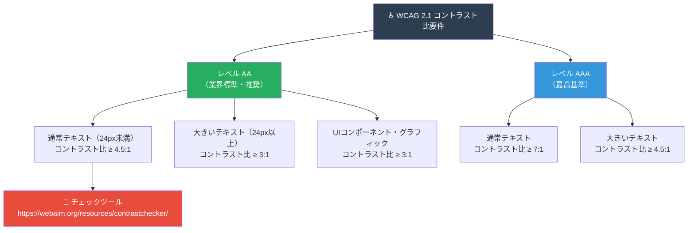

**コントラスト比の具体例：**

```css
/* ─── コントラスト比を確保したカラーペアの例 ─── */

/* ✅ 白背景に濃いテキスト: 16.1:1（余裕でクリア） */
.text-dark-on-white { 
  background: #ffffff; 
  color: #212529; 
}

/* ✅ 青背景に白テキスト: 4.5:1（AAAギリギリ） */
.text-white-on-primary { 
  background: var(--blue-500); /* #2980b9相当 */
  color: #ffffff; 
}

/* ❌ 水色背景に白テキスト: 1.8:1（NG！読めない） */
/* .text-white-on-light-blue { background: #aed6f1; color: #ffffff; } */

/* ✅ 改善版：暗い青にすればクリア */
.text-white-on-dark-blue { 
  background: var(--blue-700); 
  color: #ffffff; /* 7:1以上 */
}
```

> 📖 **参考：**  
> - WCAG 2.1 日本語訳：https://waic.jp/translations/WCAG21/  
> - コントラストチェッカー：https://webaim.org/resources/contrastchecker/  
> - Who Can Use（視覚特性別確認）：https://www.whocanuse.com/

---

## 5. タイポグラフィシステム

### 5.1 タイポグラフィを構成する要素

```mermaid
mindmap
    root["📝 タイポグラフィ<br/>システムの要素"]
        フォントファミリー
            「サンセリフ」本文・UIに最適
            「セリフ」見出し・高級感に
            「モノスペース」コード表示に
        フォントサイズスケール
            「Modular Scale」比率で決める
            「8pxグリッド」に合わせる
            「clamp()」で流動的に
        フォントウェイト
            「400 Regular」通常の本文
            「600 Semibold」強調・ラベル
            「700 Bold」見出し・重要
        行間 line-height
            「本文: 1.6〜1.8」読みやすさ優先
            「見出し: 1.1〜1.3」締まった印象
        字間 letter-spacing
            「見出し: マイナス」引き締まる
            「ALL CAPS: プラス」読みやすく
        最大文字数 measure
            「日本語: 40〜60字/行」
            「英語: 50〜75文字/行」
```

### 5.2 Modular Scale（モジュラースケール）

比率を使ってフォントサイズを体系的に決める手法です。

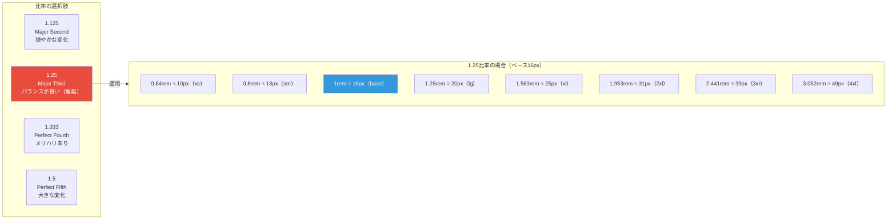

### 5.3 タイポグラフィシステムの完全実装

```css
/* ═══════════════════════════════════════════════
   タイポグラフィシステム完全実装
   ═══════════════════════════════════════════════ */

:root {
  /* ─── フォントファミリー ─── */
  --font-sans: 
    'Noto Sans JP',
    -apple-system,          /* macOS/iOS のシステムフォント */
    BlinkMacSystemFont,     /* macOS Chrome */
    'Segoe UI',             /* Windows */
    sans-serif;

  --font-serif:
    'Noto Serif JP',
    'Hiragino Mincho ProN',
    'Yu Mincho',
    Georgia,
    serif;

  --font-mono:
    'JetBrains Mono',       /* 開発者向け等幅フォント */
    'Fira Code',
    'Cascadia Code',
    Consolas,
    monospace;

  /* ─── フォントサイズスケール（比率: 1.25 Major Third）─── */
  /* 命名：--text-[サイズ名] */
  --text-xs:   0.64rem;   /* ≈ 10px: 注釈・ツールチップ */
  --text-sm:   0.8rem;    /* ≈ 13px: キャプション・補足 */
  --text-base: 1rem;      /*   16px: 本文（基準値） */
  --text-lg:   1.25rem;   /*   20px: リード文・強調 */
  --text-xl:   1.563rem;  /* ≈ 25px: h4 */
  --text-2xl:  1.953rem;  /* ≈ 31px: h3 */
  --text-3xl:  2.441rem;  /* ≈ 39px: h2 */
  --text-4xl:  3.052rem;  /* ≈ 49px: h1 */
  --text-5xl:  3.815rem;  /* ≈ 61px: ヒーロー見出し */
  --text-6xl:  4.768rem;  /* ≈ 76px: 特大見出し */

  /* ─── 流動的サイズ（レスポンシブ） ─── */
  /* clamp(最小, 推奨, 最大) でビューポート幅に応じて自動変化 */
  --text-hero: clamp(var(--text-3xl), 5vw, var(--text-5xl));
  --text-h1:   clamp(var(--text-2xl), 4vw, var(--text-4xl));

  /* ─── フォントウェイト ─── */
  --font-regular:   400;
  --font-medium:    500;
  --font-semibold:  600;
  --font-bold:      700;
  --font-extrabold: 800;

  /* ─── 行間（line-height） ─── */
  --leading-none:    1;       /* 見出し・ボタンなど単行 */
  --leading-tight:   1.25;   /* 見出し */
  --leading-snug:    1.375;  /* サブ見出し */
  --leading-normal:  1.5;    /* UIテキスト */
  --leading-relaxed: 1.625;  /* 本文・説明文 */
  --leading-loose:   2;      /* 日本語長文 */

  /* ─── 字間（letter-spacing） ─── */
  --tracking-tighter: -0.05em;  /* 大きい見出しを締める */
  --tracking-tight:   -0.025em;
  --tracking-normal:   0;
  --tracking-wide:     0.025em;
  --tracking-wider:    0.05em;
  --tracking-widest:   0.1em;   /* 大文字ラベル・バッジ */
}

/* ─── セマンティックな見出しスタイル ─── */
/* HTMLタグとユーティリティクラスの両方に適用 */
h1, .heading-1 {
  font-family: var(--font-serif);
  font-size: var(--text-h1);
  font-weight: var(--font-bold);
  line-height: var(--leading-tight);
  letter-spacing: var(--tracking-tight);
  color: var(--color-text-primary);
  /* テキストレンダリング最適化 */
  text-rendering: optimizeLegibility;
}

h2, .heading-2 {
  font-family: var(--font-sans);
  font-size: var(--text-3xl);
  font-weight: var(--font-bold);
  line-height: var(--leading-tight);
  letter-spacing: var(--tracking-tight);
}

h3, .heading-3 {
  font-family: var(--font-sans);
  font-size: var(--text-2xl);
  font-weight: var(--font-semibold);
  line-height: var(--leading-snug);
}

h4, .heading-4 {
  font-family: var(--font-sans);
  font-size: var(--text-xl);
  font-weight: var(--font-semibold);
  line-height: var(--leading-snug);
}

/* ─── 本文・ユーティリティクラス ─── */
.text-body-large { 
  font-size: var(--text-lg); 
  line-height: var(--leading-relaxed); 
}

.text-body { 
  font-size: var(--text-base); 
  line-height: var(--leading-normal); 
}

.text-body-small { 
  font-size: var(--text-sm); 
  line-height: var(--leading-normal); 
}

.text-caption { 
  font-size: var(--text-xs); 
  line-height: var(--leading-normal);
  color: var(--color-text-muted);
}

/* ─── 読みやすい本文コンテナ ─── */
.prose {
  /* max-widthを文字数で指定（ch = '0'文字の幅） */
  max-width: 65ch;   /* 英語の場合 */
  /* max-width: 40em;  日本語の場合 */
  font-size: var(--text-base);
  line-height: var(--leading-relaxed);
  color: var(--color-text-primary);
}

.prose > * + * { margin-top: var(--space-4); }
.prose > h2 + * { margin-top: var(--space-3); }

/* ─── コードブロック ─── */
code, kbd, pre {
  font-family: var(--font-mono);
  font-size: 0.875em; /* 相対値で本文の87.5%に */
}

pre {
  padding: var(--space-4);
  border-radius: var(--radius-md);
  background-color: var(--gray-900);
  color: var(--gray-50);
  overflow-x: auto;
  line-height: var(--leading-relaxed);
}
```

### 5.4 フォント読み込みのベストプラクティス

```html
<!-- ✅ Google Fonts 最適化読み込み -->

<!-- 1. DNSルックアップを事前解決 -->
<link rel="preconnect" href="https://fonts.googleapis.com">
<link rel="preconnect" href="https://fonts.gstatic.com" crossorigin>

<!-- 2. フォントを読み込む（display=swap でFOUTを防ぐ） -->
<link href="https://fonts.googleapis.com/css2?
  family=Noto+Sans+JP:wght@400;600;700&
  family=Noto+Serif+JP:wght@700&
  display=swap"
  rel="stylesheet">
```

```css
/* ✅ セルフホスティングの場合（パフォーマンス最良） */
@font-face {
  font-family: 'CustomFont';
  src: url('/fonts/custom.woff2') format('woff2'),
       url('/fonts/custom.woff')  format('woff');
  font-weight: 400;
  font-display: swap;
  /* font-display の選択肢:
   * auto     : ブラウザに任せる
   * block    : 3秒まで非表示（FOIT）→ 推奨しない
   * swap     : システムフォント表示→切替（FOUT）← 推奨
   * fallback : 短い待機後にシステムフォント固定
   * optional : 速い接続のみフォント適用
   */
}
```

> 📖 **参考：**  
> - web.dev「Optimize WebFont loading」https://web.dev/articles/font-best-practices  
> - Modular Scale ツール：https://www.modularscale.com/

---

## 6. スペーシング・サイジングシステム

### 6.1 なぜスペーシングシステムが必要か

```mermaid
graph LR
    subgraph CHAOS["❌ スペーシングがバラバラな状態"]
        C1["margin: 13px"]
        C2["padding: 17px"]
        C3["gap: 11px"]
        C4["margin-top: 23px"]
        C5["デザインに統一感がない"]
        C6["数値の根拠がわからない"]
    end

    subgraph ORDER["✅ スペーシングシステムがある状態"]
        O1["--space-3 = 12px（4の倍数）"]
        O2["--space-4 = 16px（4の倍数）"]
        O3["--space-6 = 24px（4の倍数）"]
        O4["すべて4pxグリッドに整列"]
        O5["デザインに規則性と美しさが生まれる"]
    end

    CHAOS -.->|"改善"| ORDER

    style CHAOS fill:#e74c3c,color:#fff,stroke:#c0392b
    style ORDER fill:#27ae60,color:#fff,stroke:#1e8449
```

### 6.2 4pxグリッドシステム

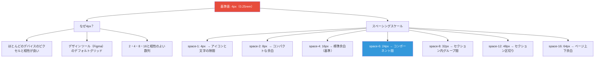

### 6.3 スペーシングシステムの完全実装

```css
/* ═══════════════════════════════════════════════
   4px基準スペーシングシステム完全実装
   ═══════════════════════════════════════════════ */

:root {
  /* ─── 基本スペーシングスケール ─── */
  /* 命名：--space-[数値]  数値 × 4px = 実際のサイズ */
  --space-px:  1px;
  --space-0:   0;
  --space-1:   0.25rem;   /*  4px */
  --space-2:   0.5rem;    /*  8px */
  --space-3:   0.75rem;   /* 12px */
  --space-4:   1rem;      /* 16px ← 基準値 */
  --space-5:   1.25rem;   /* 20px */
  --space-6:   1.5rem;    /* 24px */
  --space-7:   1.75rem;   /* 28px */
  --space-8:   2rem;      /* 32px */
  --space-9:   2.25rem;   /* 36px */
  --space-10:  2.5rem;    /* 40px */
  --space-11:  2.75rem;   /* 44px */
  --space-12:  3rem;      /* 48px */
  --space-14:  3.5rem;    /* 56px */
  --space-16:  4rem;      /* 64px */
  --space-20:  5rem;      /* 80px */
  --space-24:  6rem;      /* 96px */
  --space-28:  7rem;      /* 112px */
  --space-32:  8rem;      /* 128px */
  --space-40:  10rem;     /* 160px */
  --space-48:  12rem;     /* 192px */
  --space-56:  14rem;     /* 224px */
  --space-64:  16rem;     /* 256px */

  /* ─── コンポーネントサイズ ─── */
  /* インタラクティブ要素は最小44×44px（WCAG推奨） */
  --size-touch-target: 2.75rem;  /* 44px: タッチターゲット最小サイズ */

  /* ボタンの高さ */
  --size-btn-xs: 1.75rem;  /* 28px: 極小ボタン */
  --size-btn-sm: 2rem;     /* 32px: 小ボタン */
  --size-btn-md: 2.5rem;   /* 40px: 標準ボタン */
  --size-btn-lg: 3rem;     /* 48px: 大ボタン */
  --size-btn-xl: 3.5rem;   /* 56px: 特大ボタン */

  /* フォームコントロール */
  --size-input: 2.5rem;    /* 40px: テキスト入力欄 */

  /* アバター */
  --size-avatar-xs: 1.5rem;   /* 24px */
  --size-avatar-sm: 2rem;     /* 32px */
  --size-avatar-md: 2.5rem;   /* 40px */
  --size-avatar-lg: 3rem;     /* 48px */
  --size-avatar-xl: 4rem;     /* 64px */
  --size-avatar-2xl: 6rem;    /* 96px */

  /* アイコン */
  --size-icon-sm: 1rem;    /* 16px */
  --size-icon-md: 1.25rem; /* 20px */
  --size-icon-lg: 1.5rem;  /* 24px */
  --size-icon-xl: 2rem;    /* 32px */

  /* ボーダー角丸（Radius） */
  --radius-none: 0;
  --radius-sm:   0.25rem;  /*  4px: タグ・バッジ */
  --radius-md:   0.5rem;   /*  8px: ボタン・入力欄 */
  --radius-lg:   0.75rem;  /* 12px: カード */
  --radius-xl:   1rem;     /* 16px: モーダル */
  --radius-2xl:  1.5rem;   /* 24px: ドロワー */
  --radius-3xl:  2rem;     /* 32px: 大きなカード */
  --radius-full: 9999px;   /* 完全な円・ピル形状 */

  /* ボックスシャドウ */
  --shadow-xs:  0 1px 2px 0 rgb(0 0 0 / 0.05);
  --shadow-sm:  0 1px 3px 0 rgb(0 0 0 / 0.1),
                0 1px 2px -1px rgb(0 0 0 / 0.1);
  --shadow-md:  0 4px 6px -1px rgb(0 0 0 / 0.1),
                0 2px 4px -2px rgb(0 0 0 / 0.1);
  --shadow-lg:  0 10px 15px -3px rgb(0 0 0 / 0.1),
                0 4px 6px -4px rgb(0 0 0 / 0.1);
  --shadow-xl:  0 20px 25px -5px rgb(0 0 0 / 0.1),
                0 8px 10px -6px rgb(0 0 0 / 0.1);
  --shadow-2xl: 0 25px 50px -12px rgb(0 0 0 / 0.25);
  --shadow-inner: inset 0 2px 4px 0 rgb(0 0 0 / 0.05);

  /* フォーカスリング */
  --ring-width:  2px;
  --ring-color:  var(--blue-500);
  --ring-offset: 2px;
}
```

### 6.4 スペーシングの使い分けガイド

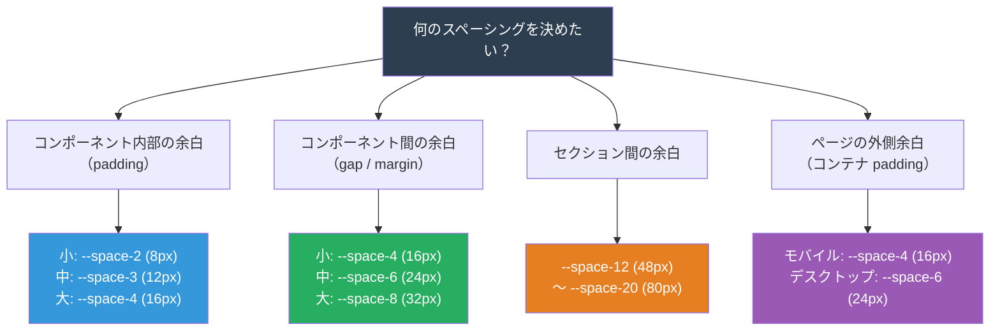

> 📖 **参考：**  
> - Tailwind CSS Spacing：https://tailwindcss.com/docs/customizing-spacing  
> - 8pt Grid System：https://spec.fm/specifics/8-pt-grid

---

## 7. グリッド・レイアウトシステム

### 7.1 CSS GridとFlexboxの使い分け

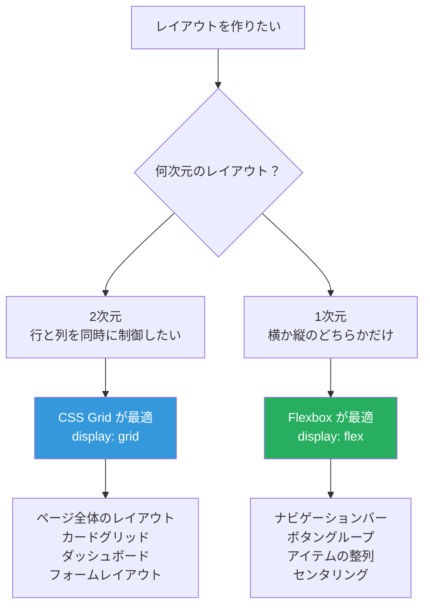

### 7.2 CSS Gridの基本概念

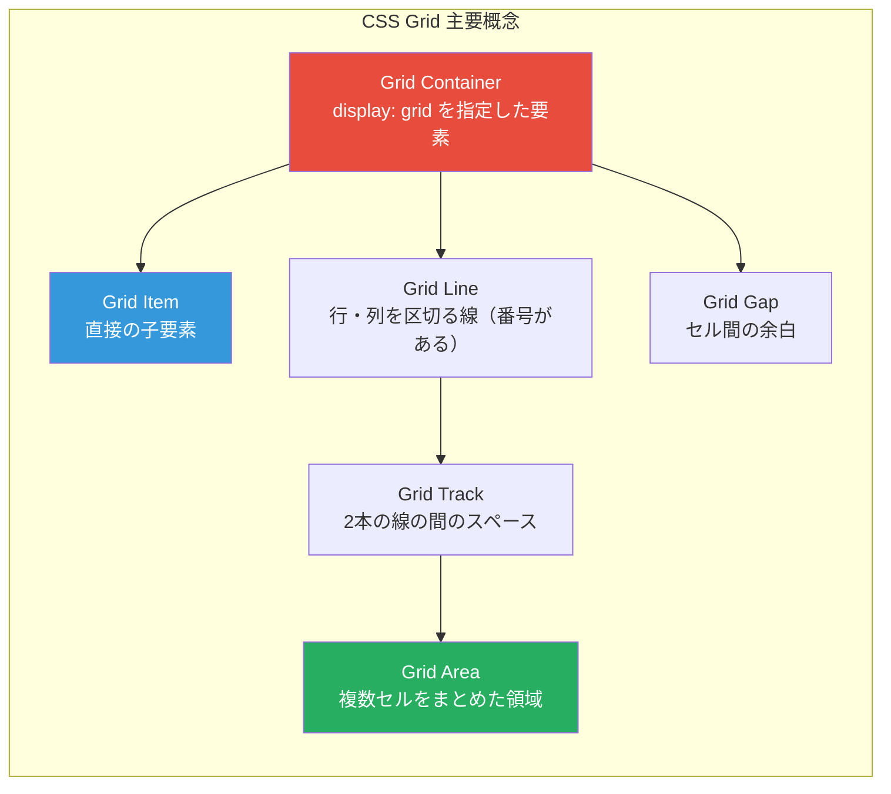

### 7.3 グリッドシステムの完全実装

```css
/* ═══════════════════════════════════════════════
   グリッド・レイアウトシステム完全実装
   ═══════════════════════════════════════════════ */

:root {
  /* コンテナの最大幅 */
  --container-sm:   640px;
  --container-md:   768px;
  --container-lg:   1024px;
  --container-xl:   1280px;
  --container-2xl:  1536px;

  /* グリッドのカラム数 */
  --grid-cols: 12;
  --grid-gap:  var(--space-6);
}

/* ─── コンテナ ─── */
.container {
  width: 100%;
  max-width: var(--container-xl);
  margin-inline: auto;
  padding-inline: var(--space-4);
}

/* サイズ別コンテナ */
.container-sm  { max-width: var(--container-sm);  }
.container-md  { max-width: var(--container-md);  }
.container-lg  { max-width: var(--container-lg);  }
.container-2xl { max-width: var(--container-2xl); }

/* ─── 12カラムグリッド ─── */
.grid {
  display: grid;
  grid-template-columns: repeat(var(--grid-cols), 1fr);
  gap: var(--grid-gap);
}

/* カラムスパン */
.col-span-1  { grid-column: span 1; }
.col-span-2  { grid-column: span 2; }
.col-span-3  { grid-column: span 3; }   /* 1/4 幅 */
.col-span-4  { grid-column: span 4; }   /* 1/3 幅 */
.col-span-6  { grid-column: span 6; }   /* 1/2 幅 */
.col-span-8  { grid-column: span 8; }   /* 2/3 幅 */
.col-span-9  { grid-column: span 9; }   /* 3/4 幅 */
.col-span-12 { grid-column: span 12; }  /* 全幅 */

/* ─── 自動レスポンシブグリッド（推奨パターン） ─── */

/* カードグリッド: 最小280px、空きがあれば自動でカラムが増える */
.auto-grid {
  display: grid;
  grid-template-columns: repeat(
    auto-fill,
    minmax(min(280px, 100%), 1fr)
  );
  gap: var(--space-6);
}

/* RAM（Repeat Auto Minmax）パターン */
.ram-grid {
  display: grid;
  grid-template-columns: repeat(
    auto-fit,
    minmax(clamp(200px, 30%, 400px), 1fr)
  );
  gap: var(--space-4);
}

/* ─── 名前付きエリアによるページレイアウト ─── */
.layout-page {
  display: grid;
  grid-template-rows: auto 1fr auto;
  grid-template-areas:
    "header"
    "main"
    "footer";
  min-height: 100dvh; /* dvh = Dynamic Viewport Height */
}

/* サイドバーレイアウト */
.layout-sidebar {
  display: grid;
  grid-template-columns: 260px 1fr;
  grid-template-areas:
    "sidebar main";
  gap: var(--space-8);
  min-height: calc(100dvh - var(--header-height, 60px));
}

.layout-sidebar > .sidebar { grid-area: sidebar; }
.layout-sidebar > .main    { grid-area: main;    }

/* ─── Flexboxレイアウトパターン ─── */

/* 水平・垂直中央揃え */
.flex-center {
  display: flex;
  align-items: center;
  justify-content: center;
}

/* 両端揃え（スペースビトウィーン） */
.flex-between {
  display: flex;
  align-items: center;
  justify-content: space-between;
}

/* 垂直スタック */
.stack {
  display: flex;
  flex-direction: column;
  gap: var(--space-4);
}

/* 水平クラスタ */
.cluster {
  display: flex;
  flex-wrap: wrap;
  gap: var(--space-3);
  align-items: center;
}

/* スペーサー（残りのスペースを埋める） */
.spacer { flex: 1 1 auto; }

/* ─── コンテナクエリ（2023年〜全主要ブラウザ対応） ─── */
/* ビューポートではなく「親要素の幅」に基づくレスポンシブ */
.card-container {
  container-type: inline-size;
  container-name: card;
}

/* カードコンテナが480px以上になったら横並びに */
@container card (min-width: 30rem) {
  .card-inner {
    display: flex;
    flex-direction: row;
    gap: var(--space-4);
  }
}
```

### 7.4 ✅ ベストプラクティス：レイアウト選択フロー

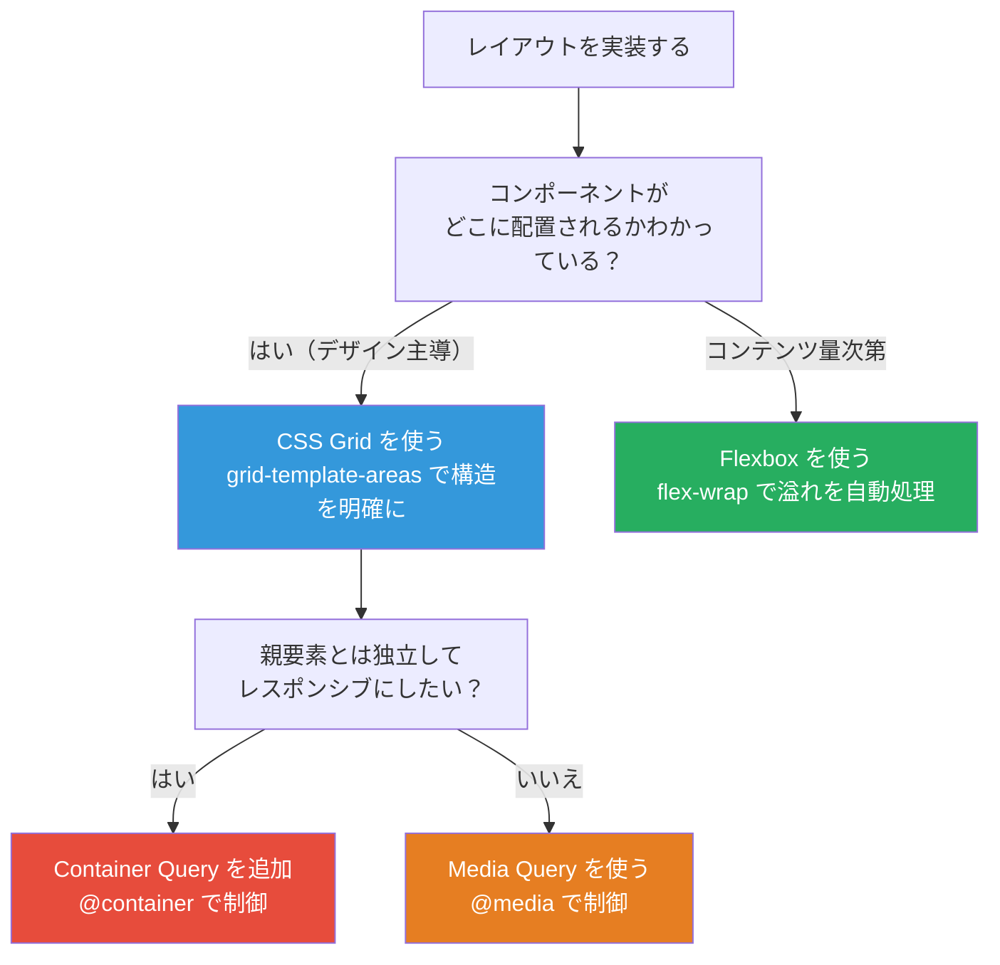

> 📖 **参考：**  
> - MDN CSS Grid：https://developer.mozilla.org/ja/docs/Web/CSS/CSS_grid_layout  
> - Every Layout（レイアウトパターン集）：https://every-layout.dev/  
> - Container Queries：https://developer.mozilla.org/ja/docs/Web/CSS/CSS_container_queries

---

## 8. コンポーネント設計とBEM命名規則

### 8.1 BEM（Block Element Modifier）とは

BEMはCSS命名規則の一つで、コードの**可読性・再利用性・保守性**を高めます。

```mermaid
graph TD
    BEM["🧱 BEM命名規則"]

    BEM --> BLOCK["Block（ブロック）<br/>独立した意味を持つ最小単位<br/>.card .button .nav .form"]
    BEM --> ELEMENT["Element（エレメント）<br/>ブロックを構成する部品<br/>.card__title .card__image .nav__item"]
    BEM --> MODIFIER["Modifier（モディファイア）<br/>バリエーションや状態の違い<br/>.card--featured .button--primary .button--disabled"]

    BLOCK --> B1["1つのブロックは<br/>他に依存せず単独で存在できる"]
    ELEMENT --> E1["__（二重アンダースコア）で繋ぐ<br/>ブロックの外では使わない"]
    MODIFIER --> M1["--（二重ハイフン）で繋ぐ<br/>ブロックかエレメントに追加する"]

    style BLOCK fill:#3498db,color:#fff
    style ELEMENT fill:#27ae60,color:#fff
    style MODIFIER fill:#e67e22,color:#fff
```

### 8.2 BEM記法の具体例

```html
<!-- 
  BEMの記法:
  .block
  .block__element
  .block--modifier
  .block__element--modifier
-->

<!-- カードコンポーネントのHTML例 -->
<article class="card card--featured">                <!-- Block + Modifier -->
  <div class="card__image-wrap">                     <!-- Element -->
        <!-- Element -->
    <span class="card__badge card__badge--sale">     <!-- Element + Modifier -->
      SALE
    </span>
  </div>
  <div class="card__body">                           <!-- Element -->
    <p class="card__category">カテゴリ</p>           <!-- Element -->
    <h3 class="card__title">商品タイトル</h3>        <!-- Element -->
    <p class="card__description">説明文...</p>       <!-- Element -->
    <div class="card__footer">                       <!-- Element -->
      <span class="card__price">¥1,200</span>        <!-- Element -->
      <button class="btn btn--primary btn--sm">      <!-- Block + Modifiers -->
        購入する
      </button>
    </div>
  </div>
</article>
```

### 8.3 コンポーネント変数パターン（現代的BEM）

CSS変数をコンポーネントのローカル変数として使うと、修飾子の実装が格段にシンプルになります。

```css
/* ═══════════════════════════════════════════════
   ボタンコンポーネント完全実装（CSS変数 + BEM）
   ═══════════════════════════════════════════════ */

/* ─── ベーススタイル ─── */
.btn {
  /*
   * コンポーネント内部で使うローカル変数を定義
   * モディファイアはこれらの変数を上書きするだけでよい
   */
  --btn-bg:          transparent;
  --btn-color:       var(--color-text-primary);
  --btn-border:      1px solid transparent;
  --btn-height:      var(--size-btn-md);    /* 40px */
  --btn-padding-x:   var(--space-4);        /* 16px */
  --btn-font-size:   var(--text-base);      /* 16px */
  --btn-font-weight: var(--font-medium);
  --btn-radius:      var(--radius-md);
  --btn-shadow:      none;

  /* ─── レイアウト ─── */
  display: inline-flex;
  align-items: center;
  justify-content: center;
  gap: var(--space-2);

  /* ─── サイズ ─── */
  height: var(--btn-height);
  padding-inline: var(--btn-padding-x);
  min-width: 2.75rem; /* 44px タッチターゲット最小値 */

  /* ─── タイポグラフィ ─── */
  font-family: var(--font-sans);
  font-size: var(--btn-font-size);
  font-weight: var(--btn-font-weight);
  line-height: 1;
  text-decoration: none;
  white-space: nowrap;

  /* ─── ビジュアル ─── */
  background-color: var(--btn-bg);
  color: var(--btn-color);
  border: var(--btn-border);
  border-radius: var(--btn-radius);
  box-shadow: var(--btn-shadow);

  /* ─── インタラクション ─── */
  cursor: pointer;
  user-select: none;
  transition:
    background-color 150ms ease,
    color 150ms ease,
    border-color 150ms ease,
    box-shadow 150ms ease,
    transform 100ms ease;
}

/* ホバー・フォーカス・アクティブ */
.btn:hover:not(:disabled) {
  filter: brightness(0.92);
}

/* ✅ :focus ではなく :focus-visible を使う
   マウスクリック時にはフォーカスリングを表示しない */
.btn:focus-visible {
  outline: var(--ring-width) solid var(--ring-color);
  outline-offset: var(--ring-offset);
}

.btn:active:not(:disabled) {
  transform: scale(0.97);
}

/* 無効化状態 */
.btn:disabled,
.btn[aria-disabled="true"] {
  opacity: 0.5;
  cursor: not-allowed;
  pointer-events: none;
}

/* ─── バリアント（種類）── */
/* 変数を上書きするだけ！スタイルの重複がない */

/* プライマリ（最重要アクション） */
.btn--primary {
  --btn-bg:     var(--color-primary);
  --btn-color:  #ffffff;
  --btn-shadow: var(--shadow-sm);
}

/* セカンダリ（アウトライン） */
.btn--secondary {
  --btn-border: 1px solid var(--color-border-strong);
}

/* デンジャー（削除・取り消し） */
.btn--danger {
  --btn-bg:    var(--color-danger);
  --btn-color: #ffffff;
}

/* ゴースト（控えめ） */
.btn--ghost {
  --btn-color: var(--color-primary);
}
.btn--ghost:hover:not(:disabled) {
  background-color: var(--color-primary-subtle);
  filter: none;
}

/* ─── サイズ ─── */
.btn--xs {
  --btn-height:    1.75rem;  /* 28px */
  --btn-padding-x: var(--space-2);
  --btn-font-size: var(--text-xs);
}

.btn--sm {
  --btn-height:    var(--size-btn-sm);  /* 32px */
  --btn-padding-x: var(--space-3);
  --btn-font-size: var(--text-sm);
}

.btn--lg {
  --btn-height:    var(--size-btn-lg);  /* 48px */
  --btn-padding-x: var(--space-6);
  --btn-font-size: var(--text-lg);
}

/* アイコンのみ（正方形） */
.btn--icon {
  --btn-padding-x: 0;
  aspect-ratio: 1;
  width: var(--btn-height);
}

/* 全幅 */
.btn--block {
  width: 100%;
}

/* ─── ローディング状態 ─── */
.btn--loading {
  pointer-events: none;
  color: transparent;
  position: relative;
}

.btn--loading::after {
  content: '';
  position: absolute;
  inset: 0;
  margin: auto;
  width: 1.2em;
  height: 1.2em;
  border: 2px solid currentColor;
  border-top-color: transparent;
  border-radius: 50%;
  animation: btn-spin 0.7s linear infinite;
  color: var(--btn-color);
}

@keyframes btn-spin {
  to { transform: rotate(360deg); }
}
```

### 8.4 カードコンポーネントの完全実装

```css
/* ═══════════════════════════════════════════════
   カードコンポーネント完全実装
   ═══════════════════════════════════════════════ */

.card {
  /* ─── コンポーネント変数（上書き可能） ─── */
  --card-padding:    var(--space-6);
  --card-radius:     var(--radius-lg);
  --card-shadow:     var(--shadow-sm);
  --card-bg:         var(--color-bg-surface);
  --card-border:     1px solid var(--color-border-default);

  display: flex;
  flex-direction: column;
  padding: var(--card-padding);
  border-radius: var(--card-radius);
  box-shadow: var(--card-shadow);
  background-color: var(--card-bg);
  border: var(--card-border);
  overflow: hidden;
  /* GPU最適化のためtransformを使う */
  transition:
    box-shadow 200ms ease,
    transform 200ms ease;
}

.card__image-wrap {
  /* カードの padding を相殺して端まで画像を表示 */
  margin: calc(var(--card-padding) * -1);
  margin-bottom: var(--card-padding);
  aspect-ratio: 16 / 9;
  overflow: hidden;
  background-color: var(--color-bg-elevated);
}

.card__image {
  width: 100%;
  height: 100%;
  object-fit: cover;
  display: block;
  transition: transform 400ms ease;
}

.card__header {
  display: flex;
  flex-direction: column;
  gap: var(--space-2);
}

.card__badge {
  display: inline-flex;
  align-items: center;
  padding: var(--space-1) var(--space-2);
  font-size: var(--text-xs);
  font-weight: var(--font-bold);
  text-transform: uppercase;
  letter-spacing: var(--tracking-widest);
  border-radius: var(--radius-full);
  background-color: var(--color-primary-subtle);
  color: var(--color-primary);
  width: fit-content;
}

.card__title {
  font-size: var(--text-xl);
  font-weight: var(--font-semibold);
  line-height: var(--leading-tight);
  color: var(--color-text-primary);
  margin: 0;
}

.card__body {
  flex: 1;  /* 残りのスペースを埋めてフッターを底部に固定 */
  font-size: var(--text-base);
  line-height: var(--leading-relaxed);
  color: var(--color-text-secondary);
  margin-top: var(--space-3);
}

.card__footer {
  display: flex;
  align-items: center;
  justify-content: space-between;
  padding-top: var(--space-4);
  margin-top: var(--space-4);
  border-top: 1px solid var(--color-border-default);
}

/* ─── モディファイア ─── */

/* インタラクティブカード（リンク・クリック可能） */
.card--interactive {
  cursor: pointer;
  text-decoration: none;
  color: inherit;
}

.card--interactive:hover {
  --card-shadow: var(--shadow-xl);
  transform: translateY(-3px);
}

.card--interactive:hover .card__image {
  transform: scale(1.05);
}

.card--interactive:focus-visible {
  outline: var(--ring-width) solid var(--ring-color);
  outline-offset: var(--ring-offset);
}

/* コンパクト */
.card--compact {
  --card-padding: var(--space-4);
}

/* フィーチャー強調 */
.card--featured {
  --card-border: 2px solid var(--color-primary);
  --card-shadow: 0 0 0 4px var(--color-primary-subtle), var(--shadow-md);
}

/* 横並びカード */
.card--horizontal {
  flex-direction: row;
}

.card--horizontal .card__image-wrap {
  flex-shrink: 0;
  width: 200px;
  margin: calc(var(--card-padding) * -1);
  margin-right: var(--card-padding);
  aspect-ratio: auto;
  border-radius: var(--card-radius) 0 0 var(--card-radius);
}
```

### 8.5 ✅ ベストプラクティス：コンポーネント設計チェックリスト

```mermaid
mindmap
    root["✅ コンポーネント設計<br/>チェックリスト"]
        変数設計
            ローカル変数で内部値を管理
            モディファイアは変数を上書き
            グローバル変数を参照する
        状態管理
            ":hover フォーカス・アクティブ"
            ":disabled 無効化状態"
            "ローディング状態"
            "エラー状態"
        アクセシビリティ
            ":focus-visible でフォーカス表示"
            "最小44×44pxのタッチターゲット"
            "セマンティックなHTML要素を使う"
            "aria属性で意味を補足"
        パフォーマンス
            "transformでアニメーション"
            "will-changeは最小限に"
            "GPU加速を活用"
        レスポンシブ
            "クリティカルサイズはclamp()"
            "コンテナクエリで自律的に"
```

> 📖 **参考：**  
> - BEM公式：https://getbem.com/  
> - Smashing Magazine「BEM For Beginners」：https://www.smashingmagazine.com/2018/06/bem-for-beginners/

---

## 9. レスポンシブデザインシステム

### 9.1 モバイルファースト設計

```mermaid
graph LR
    subgraph MF["✅ モバイルファースト（推奨）"]
        MF1["まずスマホ向けスタイルを書く"]
        MF2["min-width で大画面に拡張する"]
        MF3["必要な分だけCSSが増える"]
        MF4["小さい画面のパフォーマンス最良"]
    end

    subgraph DF["❌ デスクトップファースト（非推奨）"]
        DF1["デスクトップ向けを先に書く"]
        DF2["max-width で縮小・上書きする"]
        DF3["スマホはデスクトップCSSも読む"]
        DF4["小さい画面に余計な処理が走る"]
    end

    MF -.->|"優れている理由"| REASON["パフォーマンス優先<br/>コンテンツ優先思考<br/>Progressive Enhancement（段階的強化）"]

    style MF fill:#27ae60,color:#fff
    style DF fill:#e74c3c,color:#fff
    style REASON fill:#3498db,color:#fff
```

### 9.2 ブレークポイント体系

```mermaid
graph TD
    BP["📱 ブレークポイント体系"]

    BP --> XS["xs: 0px〜<br/>スマートフォン縦向き<br/>コンテンツは1カラム"]
    BP --> SM["sm: 480px〜<br/>スマートフォン横向き<br/>2カラム可能"]
    BP --> MD["md: 768px〜<br/>タブレット<br/>サイドバー表示可"]
    BP --> LG["lg: 1024px〜<br/>PC小・タブレット横<br/>本格的なデスクトップUI"]
    BP --> XL["xl: 1280px〜<br/>PC標準<br/>最大コンテンツ幅"]
    BP --> XXL["2xl: 1536px〜<br/>大型ディスプレイ<br/>余白を増やす"]

    style XS fill:#27ae60,color:#fff
    style SM fill:#2ecc71,color:#fff
    style MD fill:#f39c12,color:#fff
    style LG fill:#e67e22,color:#fff
    style XL fill:#e74c3c,color:#fff
    style XXL fill:#c0392b,color:#fff
```

### 9.3 レスポンシブシステムの完全実装

```css
/* ═══════════════════════════════════════════════
   レスポンシブデザインシステム完全実装
   ═══════════════════════════════════════════════ */

/*
 * ─── ブレークポイント ───
 * NOTE: CSS変数はメディアクエリ内では使えないので
 *       em単位でハードコードする
 *       （em = ユーザーのフォント設定に連動するため）
 *
 * sm:  480px → 30em
 * md:  768px → 48em
 * lg: 1024px → 64em
 * xl: 1280px → 80em
 */

/* ─── モバイルファーストのメディアクエリ ─── */

/* sm以上 */
@media (min-width: 30em) {
  .grid { --grid-gap: var(--space-4); }
}

/* md以上（タブレット） */
@media (min-width: 48em) {
  .container { padding-inline: var(--space-6); }
  .layout-sidebar {
    display: grid;
  }
}

/* lg以上（PC） */
@media (min-width: 64em) {
  .container { padding-inline: var(--space-8); }
}

/* ─── clamp() による流動的サイジング ─── */
:root {
  /*
   * clamp(最小値, 理想値, 最大値)
   * ビューポート幅に応じて自動的にスケーリング
   * メディアクエリいらずのレスポンシブ
   */

  /* 見出しサイズ：小画面24px〜大画面48px */
  --text-h1-fluid: clamp(1.5rem, 4vw + 1rem, 3rem);

  /* ヒーロー見出し：小画面32px〜大画面80px */
  --text-hero-fluid: clamp(2rem, 6vw + 1rem, 5rem);

  /* セクション余白：小画面32px〜大画面96px */
  --section-spacing: clamp(2rem, 8vw, 6rem);

  /* コンテナパディング：最小16px〜最大32px */
  --container-padding: clamp(1rem, 3vw, 2rem);
}

/* ─── レスポンシブグリッドパターン ─── */

/* パターン1: ブレークポイントで列数を変える */
.grid-responsive {
  display: grid;
  grid-template-columns: 1fr;  /* モバイル: 1列 */
  gap: var(--space-4);
}

@media (min-width: 30em) {
  .grid-responsive { grid-template-columns: repeat(2, 1fr); }
}

@media (min-width: 64em) {
  .grid-responsive { grid-template-columns: repeat(4, 1fr); }
}

/* パターン2: auto-fill で自動調整（メディアクエリ不要） */
.grid-auto {
  display: grid;
  grid-template-columns: repeat(
    auto-fill,
    minmax(min(250px, 100%), 1fr)
  );
  gap: var(--space-6);
}

/* ─── レスポンシブタイポグラフィ ─── */
h1 {
  font-size: var(--text-h1-fluid);
}

.hero-title {
  font-size: var(--text-hero-fluid);
}

/* ─── 表示・非表示ユーティリティ ─── */
.hidden-sm { display: none; }
.hidden-md { display: none; }

@media (min-width: 30em) {
  .hidden-sm { display: revert; }
  .show-sm   { display: none; }
}

@media (min-width: 48em) {
  .hidden-md { display: revert; }
  .show-md   { display: none; }
}

/* ─── コンテナクエリによる自律的コンポーネント ─── */
.product-grid {
  container-type: inline-size;
  container-name: product-grid;
}

/* 親が600px以上になったら3カラム */
@container product-grid (min-width: 37.5rem) {
  .product-card-list {
    grid-template-columns: repeat(3, 1fr);
  }
}

/* ─── プリント対応 ─── */
@media print {
  .no-print { display: none !important; }
  .page-break { page-break-after: always; }

  body {
    font-size: 12pt;
    color: black;
    background: white;
  }

  /* リンクのURLを表示 */
  a[href]::after {
    content: " (" attr(href) ")";
    font-size: 0.8em;
  }
}
```

### 9.4 ✅ ベストプラクティス：レスポンシブ設計の判断基準

```mermaid
graph TD
    subgraph DO["✅ やるべきこと"]
        D1["モバイルファーストで書く（min-width）"]
        D2["clamp()で流動的サイズを活用"]
        D3["コンテナクエリで部品を自律的に"]
        D4["touch-action: manipulationでスクロール最適化"]
        D5["最小44×44pxのタッチターゲット"]
    end

    subgraph DONT["❌ やってはいけないこと"]
        DN1["max-widthクエリを多用する"]
        DN2["px単位でブレークポイントを決める<br/>（ユーザー設定に依存しない）"]
        DN3["JavaScriptでレスポンシブを実装<br/>（CSSで解決できることが多い）"]
        DN4["コンテンツを隠すだけのレスポンシブ"]
    end

    style DO fill:#27ae60,color:#fff
    style DONT fill:#e74c3c,color:#fff
```

> 📖 **参考：**  
> - web.dev「Responsive design」：https://web.dev/learn/design  
> - MDN「メディアクエリの使用」：https://developer.mozilla.org/ja/docs/Web/CSS/CSS_media_queries/Using_media_queries  
> - Container Queries（MDN）：https://developer.mozilla.org/ja/docs/Web/CSS/CSS_container_queries

---

## 10. アクセシビリティ（a11y）設計

### 10.1 アクセシビリティの4原則（POUR）

```mermaid
graph TD
    POUR["♿ WCAG 2.1の4原則（POUR）<br/>（世界標準のアクセシビリティ基準）"]

    POUR --> P["P: Perceivable<br/>知覚可能<br/>すべての情報を何らかの感覚で認識できる"]
    POUR --> O["O: Operable<br/>操作可能<br/>すべての機能をキーボードで操作できる"]
    POUR --> U["U: Understandable<br/>理解可能<br/>情報とUIが理解しやすい"]
    POUR --> R["R: Robust<br/>堅牢<br/>支援技術が確実に解釈できる"]

    P --> P1["代替テキスト（alt属性）"]
    P --> P2["カラーコントラスト 4.5:1以上"]
    P --> P3["動画に字幕を付ける"]

    O --> O1["キーボードフォーカスが見える"]
    O --> O2["タブキーで全操作できる"]
    O --> O3["スキップリンク提供"]

    U --> U1["エラーメッセージが具体的"]
    U --> U2["フォームラベルが正確"]
    U --> U3["一貫したナビゲーション"]

    R --> R1["正しいHTMLセマンティクス"]
    R --> R2["ARIAの適切な使用"]

    style POUR fill:#2c3e50,color:#fff
    style P fill:#3498db,color:#fff
    style O fill:#27ae60,color:#fff
    style U fill:#e67e22,color:#fff
    style R fill:#9b59b6,color:#fff
```

### 10.2 アクセシブルなCSSの実装

```css
/* ═══════════════════════════════════════════════
   アクセシビリティ対応CSS完全実装
   ═══════════════════════════════════════════════ */

/* ─── 1. グローバルリセット（ベース） ─── */
*,
*::before,
*::after {
  box-sizing: border-box;
  /* すべてのブラウザでアニメーションの基準を統一 */
}

html {
  /* pxではなく%で指定 → ユーザーのフォント設定を尊重 */
  font-size: 100%;  /* ✅ ユーザー設定（通常16px）に従う */
  /* font-size: 14px; ← ❌ ユーザー設定を無視する */
  scroll-behavior: smooth;
  /* テキスト自動拡大を防ぐ（iOS向け） */
  -webkit-text-size-adjust: 100%;
  text-size-adjust: 100%;
}

/* ─── 2. フォーカスの可視化（最重要！） ─── */
/*
 * :focus      → マウス・キーボード両方でフォーカスリング表示
 * :focus-visible → キーボード操作時のみフォーカスリング表示（推奨）
 *
 * ⚠️ outline: none は絶対にしてはいけない！
 *    キーボードユーザーがどこにいるかわからなくなる
 */

/* キーボードフォーカス時のみ目立つリングを表示 */
:focus-visible {
  outline: 2px solid var(--color-border-focus);
  outline-offset: 2px;
  /* Safariはまだoutlineがうまくいかないためbox-shadowも使う */
  box-shadow: 0 0 0 4px rgba(52, 152, 219, 0.2);
}

/* ─── 3. スキップリンク ─── */
/* ページ先頭のキーボードユーザー向けナビスキップ */
.skip-link {
  position: absolute;
  top: -100%;      /* 通常は画面外に隠す */
  left: var(--space-4);
  z-index: 9999;
  padding: var(--space-2) var(--space-4);
  background-color: var(--color-primary);
  color: #ffffff;
  text-decoration: none;
  font-weight: var(--font-semibold);
  border-radius: var(--radius-md);
  transition: top 200ms ease;
}

/* フォーカスされたときだけ表示する */
.skip-link:focus {
  top: var(--space-4);
}

/* ─── 4. 視覚的に隠す（スクリーンリーダーには読む） ─── */
/* .sr-only = Screen Reader Only */
.sr-only {
  position: absolute;
  width: 1px;
  height: 1px;
  padding: 0;
  margin: -1px;
  overflow: hidden;
  clip: rect(0, 0, 0, 0);
  white-space: nowrap;
  border-width: 0;
}

/* フォーカス時は表示する（スキップリンクなど） */
.sr-only-focusable:focus,
.sr-only-focusable:focus-within {
  position: static;
  width: auto;
  height: auto;
  padding: 0;
  margin: 0;
  overflow: visible;
  clip: auto;
  white-space: normal;
}

/* ─── 5. 最小タッチターゲットサイズ ─── */
/* WCAG 2.5.5 (AAA): 44×44px
   WCAG 2.5.8 (AA, WCAG 2.2): 24×24px */
button,
[role="button"],
[role="checkbox"],
[role="radio"],
a {
  /* 視覚サイズを変えずにタッチ領域を拡大する技法 */
  position: relative;
}

/* タッチ領域を外側に拡大（iOS/Android向け） */
.touch-target::after {
  content: '';
  position: absolute;
  inset: -12px;  /* 上下左右12pxずつ拡大 */
}

/* ─── 6. モーション削減（アニメーション無効化） ─── */
/* 前庭覚障害などで動きが辛いユーザー向け */
@media (prefers-reduced-motion: reduce) {
  *,
  *::before,
  *::after {
    animation-duration: 0.01ms !important;
    animation-iteration-count: 1 !important;
    transition-duration: 0.01ms !important;
    scroll-behavior: auto !important;
  }
}

/* ─── 7. ハイコントラストモード対応 ─── */
/* Windows「ハイコントラスト」設定、強制カラーモード */
@media (forced-colors: active) {
  /* システム定義色を使う */
  .btn--primary {
    background-color: ButtonFace;
    color: ButtonText;
    border: 2px solid ButtonText;
  }

  /* 装飾的なシャドウは消える（OK） */
  /* 意味のある輪郭・枠線は border で代替する */
  .card {
    border: 2px solid CanvasText;
  }
}

/* ─── 8. フォーム アクセシビリティ ─── */
.form-field {
  display: flex;
  flex-direction: column;
  gap: var(--space-1);
}

/* ラベルは常に表示する（placeholder の代替にしない） */
.form-label {
  font-size: var(--text-sm);
  font-weight: var(--font-medium);
  color: var(--color-text-secondary);
}

.form-input {
  height: var(--size-input);
  padding-inline: var(--space-3);
  font-size: var(--text-base);
  border: 1px solid var(--color-border-default);
  border-radius: var(--radius-md);
  background-color: var(--color-bg-page);
  color: var(--color-text-primary);
  transition: border-color 150ms ease, box-shadow 150ms ease;
  width: 100%;
}

.form-input:hover {
  border-color: var(--color-border-strong);
}

.form-input:focus-visible {
  outline: none;
  border-color: var(--color-border-focus);
  box-shadow: 0 0 0 3px rgba(52, 152, 219, 0.2);
}

/* エラー状態：色だけでなくアイコンでも示す */
.form-field--error .form-input {
  border-color: var(--color-danger);
  padding-right: var(--space-10);
  background-image: url("data:image/svg+xml,%3Csvg xmlns='http://www.w3.org/2000/svg' viewBox='0 0 20 20' fill='%23e74c3c'%3E%3Cpath fill-rule='evenodd' d='M18 10a8 8 0 11-16 0 8 8 0 0116 0zm-7 4a1 1 0 11-2 0 1 1 0 012 0zm-1-9a1 1 0 00-1 1v4a1 1 0 102 0V6a1 1 0 00-1-1z'/%3E%3C/svg%3E");
  background-repeat: no-repeat;
  background-position: right var(--space-3) center;
  background-size: var(--size-icon-md);
}

.form-error {
  font-size: var(--text-sm);
  color: var(--color-danger);
  display: flex;
  align-items: center;
  gap: var(--space-1);
}

/* ─── 9. リンクのアクセシビリティ ─── */
/* カラーだけでなく下線でもリンクであることを示す */
a:not([class]) {
  color: var(--color-primary);
  text-decoration: underline;
  text-underline-offset: 3px;
  text-decoration-thickness: 1px;
}

a:not([class]):hover {
  text-decoration-thickness: 2px;
}

/* 新しいタブで開くリンクには視覚的インジケーター */
a[target="_blank"]::after {
  content: " ↗";
  font-size: 0.8em;
}
```

### 10.3 ✅ ベストプラクティス：アクセシビリティチェックリスト

```mermaid
mindmap
    root["♿ アクセシビリティ<br/>チェックリスト"]
        視覚
            "コントラスト比 4.5:1以上"
            "テキストサイズ 16px以上（本文）"
            "カラーだけで情報を伝えない"
            "フォーカスリングを消さない"
        操作
            "キーボードのみで全操作できる"
            "タブ順序が論理的"
            "スキップリンクがある"
            "タッチターゲット44×44px以上"
        コンテンツ
            "img に alt 属性"
            "フォームにラベル"
            "エラーメッセージが具体的"
            "見出しの階層が正しい"
        技術
            "セマンティックHTMLを使う"
            "aria属性で補完"
            "スクリーンリーダーでテスト"
            "ズーム200%でレイアウト崩れない"
```

> 📖 **参考：**  
> - WCAG 2.1 日本語訳：https://waic.jp/translations/WCAG21/  
> - WebAIM コントラストチェッカー：https://webaim.org/resources/contrastchecker/  
> - axe DevTools（無料）：https://www.deque.com/axe/devtools/  
> - WAI-ARIA Authoring Practices：https://www.w3.org/WAI/ARIA/apg/

---

## 11. アニメーション・トランジションシステム

### 11.1 アニメーション設計の原則

```mermaid
graph TD
    ANIM["✨ アニメーション設計の4原則"]

    ANIM --> P1["目的がある<br/>意味のある動きだけ使う"]
    ANIM --> P2["高速・軽快<br/>UIは100〜300ms以内"]
    ANIM --> P3["パフォーマンス優先<br/>GPUで動くプロパティのみ"]
    ANIM --> P4["アクセシブル<br/>prefers-reduced-motion対応"]

    P3 --> GPU["✅ GPUで動く（高速）<br/>transform: translate / scale / rotate<br/>opacity"]
    P3 --> CPU["❌ CPUで動く（重い・避ける）<br/>width / height / top / left<br/>margin / padding / font-size"]

    style P1 fill:#3498db,color:#fff
    style P2 fill:#27ae60,color:#fff
    style P3 fill:#e67e22,color:#fff
    style P4 fill:#9b59b6,color:#fff
    style GPU fill:#27ae60,color:#fff
    style CPU fill:#e74c3c,color:#fff
```

### 11.2 なぜ transform と opacity だけでアニメーションするのか

```mermaid
flowchart LR
    subgraph REFLOW["❌ width変更は重い（リフロー発生）"]
        R1["width変更"]
        R2["レイアウト再計算<br/>（全要素に影響）"]
        R3["ペイント再描画"]
        R4["コンポジット"]
        R1 --> R2 --> R3 --> R4
    end

    subgraph COMPOSITE["✅ transform変更は軽い（コンポジットのみ）"]
        C1["transform変更"]
        C2["コンポジット<br/>（GPUで処理）"]
        C1 --> C2
    end

    style REFLOW fill:#e74c3c,color:#fff
    style COMPOSITE fill:#27ae60,color:#fff
```

### 11.3 アニメーションシステムの完全実装

```css
/* ═══════════════════════════════════════════════
   アニメーション・トランジションシステム完全実装
   ═══════════════════════════════════════════════ */

:root {
  /* ─── イージング関数 ─── */
  --ease-in:       cubic-bezier(0.4, 0, 1, 1);
  --ease-out:      cubic-bezier(0, 0, 0.2, 1);     /* 推奨：UIの出現 */
  --ease-in-out:   cubic-bezier(0.4, 0, 0.2, 1);   /* 推奨：UIの移動 */
  --ease-spring:   cubic-bezier(0.175, 0.885, 0.32, 1.275); /* 弾む感じ */
  --ease-bounce:   cubic-bezier(0.68, -0.55, 0.265, 1.55);  /* 大きく弾む */

  /* ─── デュレーション（持続時間） ─── */
  --duration-instant:  0ms;
  --duration-fast:     100ms;   /* マイクロインタラクション（ボタン押下など） */
  --duration-normal:   200ms;   /* 標準のUI変化 */
  --duration-slow:     300ms;   /* モーダル・ドロップダウンなど */
  --duration-slower:   500ms;   /* ページ遷移・スライド */
  --duration-slowest:  700ms;   /* 大きな視覚変化 */

  /* ─── よく使うトランジションの組み合わせ ─── */
  --transition-colors:
    color            var(--duration-fast) var(--ease-out),
    background-color var(--duration-fast) var(--ease-out),
    border-color     var(--duration-fast) var(--ease-out);

  --transition-transform:
    transform var(--duration-normal) var(--ease-in-out);

  --transition-opacity:
    opacity var(--duration-normal) var(--ease-out);

  --transition-shadow:
    box-shadow var(--duration-normal) var(--ease-out);

  --transition-all-ui:
    color            var(--duration-fast)   var(--ease-out),
    background-color var(--duration-fast)   var(--ease-out),
    border-color     var(--duration-fast)   var(--ease-out),
    box-shadow       var(--duration-normal) var(--ease-out),
    transform        var(--duration-normal) var(--ease-out),
    opacity          var(--duration-normal) var(--ease-out);
}

/* ─── キーフレームアニメーション ─── */

/* フェードイン */
@keyframes fade-in {
  from { opacity: 0; }
  to   { opacity: 1; }
}

/* フェードアウト */
@keyframes fade-out {
  from { opacity: 1; }
  to   { opacity: 0; }
}

/* 上からスライドイン */
@keyframes slide-in-from-top {
  from { opacity: 0; transform: translateY(-10px); }
  to   { opacity: 1; transform: translateY(0); }
}

/* 下からスライドイン */
@keyframes slide-in-from-bottom {
  from { opacity: 0; transform: translateY(10px); }
  to   { opacity: 1; transform: translateY(0); }
}

/* 左からスライドイン */
@keyframes slide-in-from-left {
  from { opacity: 0; transform: translateX(-10px); }
  to   { opacity: 1; transform: translateX(0); }
}

/* ズームイン */
@keyframes zoom-in {
  from { opacity: 0; transform: scale(0.95); }
  to   { opacity: 1; transform: scale(1); }
}

/* スピナー */
@keyframes spin {
  to { transform: rotate(360deg); }
}

/* パルス（点滅） */
@keyframes pulse {
  0%, 100% { opacity: 1; }
  50%       { opacity: 0.4; }
}

/* シマー（スケルトンローディング用） */
@keyframes shimmer {
  from { background-position: -200% 0; }
  to   { background-position:  200% 0; }
}

/* バウンス */
@keyframes bounce {
  0%, 100% { transform: translateY(0); animation-timing-function: ease-in; }
  50%       { transform: translateY(-8px); animation-timing-function: ease-out; }
}

/* ─── アニメーションユーティリティクラス ─── */
.animate-fade-in          { animation: fade-in             var(--duration-normal) var(--ease-out) both; }
.animate-slide-in-top     { animation: slide-in-from-top   var(--duration-normal) var(--ease-out) both; }
.animate-slide-in-bottom  { animation: slide-in-from-bottom var(--duration-normal) var(--ease-out) both; }
.animate-slide-in-left    { animation: slide-in-from-left  var(--duration-normal) var(--ease-out) both; }
.animate-zoom-in          { animation: zoom-in             var(--duration-slow)   var(--ease-spring) both; }
.animate-spin             { animation: spin                1s linear infinite; }
.animate-pulse            { animation: pulse               2s ease-in-out infinite; }
.animate-bounce           { animation: bounce              1s ease-in-out infinite; }

/* アニメーション遅延（連続して要素を表示する場合） */
.delay-75   { animation-delay:  75ms; }
.delay-100  { animation-delay: 100ms; }
.delay-150  { animation-delay: 150ms; }
.delay-200  { animation-delay: 200ms; }
.delay-300  { animation-delay: 300ms; }
.delay-500  { animation-delay: 500ms; }
.delay-700  { animation-delay: 700ms; }

/* ─── スケルトンローディング ─── */
.skeleton {
  position: relative;
  overflow: hidden;
  background-color: var(--color-border-default);
  border-radius: var(--radius-sm);
  /* コンテンツを隠す */
  color: transparent !important;
  pointer-events: none;
  user-select: none;
}

.skeleton::after {
  content: '';
  position: absolute;
  inset: 0;
  background: linear-gradient(
    90deg,
    transparent 0%,
    rgba(255, 255, 255, 0.5) 50%,
    transparent 100%
  );
  background-size: 200% 100%;
  animation: shimmer 1.5s linear infinite;
}

/* ─── ホバーエフェクト ─── */
.hover-lift {
  transition: var(--transition-transform), var(--transition-shadow);
}

.hover-lift:hover {
  transform: translateY(-3px);
  box-shadow: var(--shadow-xl);
}

/* ─── スクロールアニメーション ─── */
/* Intersection Observerと組み合わせて使う */
.reveal {
  opacity: 0;
  transform: translateY(24px);
  transition:
    opacity  var(--duration-slower) var(--ease-out),
    transform var(--duration-slower) var(--ease-out);
}

.reveal.is-visible {
  opacity: 1;
  transform: translateY(0);
}

/* ─── モーション削減対応（必須） ─── */
@media (prefers-reduced-motion: reduce) {
  *,
  *::before,
  *::after {
    animation-duration:       0.01ms !important;
    animation-iteration-count: 1    !important;
    transition-duration:      0.01ms !important;
    scroll-behavior:          auto  !important;
  }
  .reveal {
    opacity: 1;
    transform: none;
  }
}
```

### 11.4 ✅ ベストプラクティス：アニメーションの時間感覚

```mermaid
graph LR
    subgraph TIMING["⏱️ UI別の推奨デュレーション"]
        T1["0〜100ms<br/>マイクロインタラクション<br/>ボタン色変化・フォーカスリング"]
        T2["100〜200ms<br/>標準UIフィードバック<br/>ホバー・アクティブ状態"]
        T3["200〜400ms<br/>UIの出現・消滅<br/>ドロップダウン・ツールチップ"]
        T4["300〜500ms<br/>パネル・モーダル<br/>サイドドロワー"]
        T5["500ms以上<br/>ページ遷移<br/>大きなレイアウト変化"]
    end

    style T1 fill:#3498db,color:#fff
    style T2 fill:#27ae60,color:#fff
    style T3 fill:#2ecc71,color:#fff
    style T4 fill:#f39c12,color:#fff
    style T5 fill:#e74c3c,color:#fff
```

> 📖 **参考：**  
> - Google Material Design Motion：https://m3.material.io/styles/motion/overview  
> - CSS Triggers（プロパティの描画コスト）：https://csstriggers.com/  
> - web.dev「Animations」：https://web.dev/articles/animations-guide

---

## 12. CSSアーキテクチャパターン

### 12.1 主要アーキテクチャの比較

```mermaid
graph TD
    ARCH["🏛️ CSSアーキテクチャパターン比較"]

    ARCH --> ITCSS["ITCSS<br/>Inverted Triangle CSS<br/>「逆三角形」構造"]
    ARCH --> BEM2["BEM<br/>Block Element Modifier<br/>命名規則中心"]
    ARCH --> CUBE["CUBE CSS<br/>Composition Utility Block Exception<br/>モダンな4概念"]
    ARCH --> UTILITY["Utility-First<br/>Tailwind CSS方式<br/>小さいクラスを組み合わせる"]

    ITCSS --> IT1["✅ 大規模プロジェクト向き<br/>詳細度の衝突を防ぐ"]
    BEM2 --> BM1["✅ コンポーネント設計に最適<br/>再利用しやすい"]
    CUBE --> CB1["✅ モダン・柔軟<br/>CSS変数と相性が良い"]
    UTILITY --> UT1["✅ 速い・一貫性がある<br/>設計判断が減る"]

    style ITCSS fill:#3498db,color:#fff
    style BEM2 fill:#27ae60,color:#fff
    style CUBE fill:#e67e22,color:#fff
    style UTILITY fill:#9b59b6,color:#fff
```

### 12.2 ITCSS（逆三角形CSS）の構造

```mermaid
graph TD
    subgraph TRIANGLE["ITCSS 逆三角形（上ほど広く・低い詳細度）"]
        S1["⑦ Utilities<br/>!important あり・ヘルパークラス<br/>最も高い詳細度・最も狭いスコープ"]
        S2["⑥ Trumps / Overrides<br/>デバッグ・緊急上書き用"]
        S3["⑤ Components<br/>UIコンポーネント"]
        S4["④ Objects<br/>フレームワーク・レイアウトパターン"]
        S5["③ Elements<br/>HTMLタグのデフォルトスタイル"]
        S6["② Tools（Sass）<br/>ミックスイン・関数"]
        S7["① Settings<br/>変数定義のみ（CSS出力なし）<br/>最も低い詳細度・最も広いスコープ"]
    end

    S7 --> S6 --> S5 --> S4 --> S3 --> S2 --> S1

    style S7 fill:#eaf4fb,color:#333
    style S6 fill:#d6eaf8,color:#333
    style S5 fill:#aed6f1,color:#333
    style S4 fill:#7fb3d3,color:#fff
    style S3 fill:#5499c7,color:#fff
    style S2 fill:#2980b9,color:#fff
    style S1 fill:#1a5276,color:#fff
```

### 12.3 CSS @layer を使った現代的な構造化

`@layer` はCSS Cascade Layers（2022年〜全主要ブラウザ対応）で、**レイヤー順に優先度を制御**できます。

```css
/* ═══════════════════════════════════════════════
   @layer を使った現代的CSSアーキテクチャ
   ═══════════════════════════════════════════════ */

/*
 * レイヤーの宣言順が優先度を決める
 * → 後に宣言したレイヤーが勝つ
 * → utilities は常に components より強い
 */
@layer
  reset,        /* 1. ブラウザリセット（最弱） */
  base,         /* 2. HTMLタグのデフォルト */
  tokens,       /* 3. デザイントークン（変数） */
  objects,      /* 4. レイアウトパターン */
  components,   /* 5. UIコンポーネント */
  utilities;    /* 6. ユーティリティクラス（最強） */

/* ─── 1. Reset ─── */
@layer reset {
  *,
  *::before,
  *::after { box-sizing: border-box; }

  * { margin: 0; padding: 0; }

  img, video { max-width: 100%; height: auto; display: block; }

  input, button, textarea, select { font: inherit; }
}

/* ─── 2. Base ─── */
@layer base {
  html { font-size: 100%; scroll-behavior: smooth; }

  body {
    font-family: var(--font-sans);
    font-size: var(--text-base);
    line-height: var(--leading-normal);
    color: var(--color-text-primary);
    background-color: var(--color-bg-page);
    -webkit-font-smoothing: antialiased;
  }

  h1 { font-size: var(--text-h1-fluid); font-weight: var(--font-bold); }
  h2 { font-size: var(--text-3xl);      font-weight: var(--font-bold); }
  h3 { font-size: var(--text-2xl);      font-weight: var(--font-semibold); }
  h4 { font-size: var(--text-xl);       font-weight: var(--font-semibold); }

  a { color: var(--color-primary); text-decoration: underline; }
}

/* ─── 3. Tokens ─── */
@layer tokens {
  :root {
    /* 全デザイントークンをここに集約 */
    --color-primary: #3498db;
    /* ... */
  }
}

/* ─── 4. Objects (レイアウトパターン) ─── */
@layer objects {
  .container { max-width: var(--container-xl); margin-inline: auto; }
  .grid { display: grid; gap: var(--space-6); }
  .stack { display: flex; flex-direction: column; }
  .cluster { display: flex; flex-wrap: wrap; }
}

/* ─── 5. Components ─── */
@layer components {
  .btn     { /* ... ボタンの完全スタイル */ }
  .card    { /* ... カードの完全スタイル */ }
  .input   { /* ... 入力欄の完全スタイル */ }
  .badge   { /* ... バッジの完全スタイル */ }
}

/* ─── 6. Utilities（最優先） ─── */
@layer utilities {
  /* @layer utilities の中では !important 不要！ */
  .hidden   { display: none; }
  .sr-only  { /* スクリーンリーダー専用 */ }
  .flex     { display: flex; }
  .grid-u   { display: grid; }
  .block    { display: block; }
  .truncate {
    overflow: hidden;
    text-overflow: ellipsis;
    white-space: nowrap;
  }

  /* 余白ユーティリティ */
  .mt-0  { margin-top: 0; }
  .mt-4  { margin-top: var(--space-4); }
  .mt-8  { margin-top: var(--space-8); }
  .mb-4  { margin-bottom: var(--space-4); }
  .p-4   { padding: var(--space-4); }
  .px-4  { padding-inline: var(--space-4); }
  .py-4  { padding-block: var(--space-4); }

  /* テキストユーティリティ */
  .text-center { text-align: center; }
  .text-right  { text-align: right; }
  .text-muted  { color: var(--color-text-muted); }
  .text-bold   { font-weight: var(--font-bold); }

  /* 色ユーティリティ */
  .bg-primary  { background-color: var(--color-primary); }
  .text-primary-color { color: var(--color-primary); }
}
```

### 12.4 ファイル構成の推奨例

```text
styles/
├── 00-settings/          ← デザイントークン（変数定義のみ）
│   ├── _colors.css
│   ├── _typography.css
│   ├── _spacing.css
│   └── _index.css
│
├── 01-base/              ← リセット・HTMLタグのデフォルト
│   ├── _reset.css
│   ├── _typography.css
│   └── _index.css
│
├── 02-objects/           ← レイアウトパターン
│   ├── _container.css
│   ├── _grid.css
│   ├── _stack.css
│   └── _index.css
│
├── 03-components/        ← UIコンポーネント
│   ├── _button.css
│   ├── _card.css
│   ├── _form.css
│   ├── _nav.css
│   ├── _modal.css
│   └── _index.css
│
├── 04-utilities/         ← ヘルパークラス
│   ├── _display.css
│   ├── _spacing.css
│   ├── _typography.css
│   └── _index.css
│
└── main.css              ← すべてをimport
```

```css
/* main.css */
@layer reset, base, tokens, objects, components, utilities;

@import '00-settings/index.css' layer(tokens);
@import '01-base/index.css'     layer(base);
@import '02-objects/index.css'  layer(objects);
@import '03-components/index.css' layer(components);
@import '04-utilities/index.css' layer(utilities);
```

> 📖 **参考：**  
> - ITCSS：https://csswizardry.com/  
> - CUBE CSS：https://cube.fyi/  
> - CSS Cascade Layers（MDN）：https://developer.mozilla.org/ja/docs/Learn/CSS/Building_blocks/Cascade_layers

---

## 13. デザイントークン

### 13.1 デザイントークンとは

```mermaid
graph LR
    subgraph TOKEN_WHAT["🪙 デザイントークンとは"]
        T1["設計上の判断をコードとして表現したもの"]
        T2["色・サイズ・余白などの値に名前を付ける"]
        T3["デザインと開発の共通言語になる"]
        T4["複数プラットフォームで同じ値を共有"]
    end

    subgraph FLOW["トークンの流れ"]
        F1["Figma Variables<br/>（デザインツール）"]
        F2["JSON / YAML<br/>（プラットフォーム共通）"]
        F3["Style Dictionary<br/>（自動変換ツール）"]
        F4_A["CSS変数（Web）"]
        F4_B["Swift定数（iOS）"]
        F4_C["Kotlin定数（Android）"]
    end

    F1 -->|"エクスポート"| F2
    F2 -->|"変換"| F3
    F3 --> F4_A
    F3 --> F4_B
    F3 --> F4_C

    style TOKEN_WHAT fill:#2c3e50,color:#fff
    style F3 fill:#e74c3c,color:#fff
    style F4_A fill:#3498db,color:#fff
    style F4_B fill:#27ae60,color:#fff
    style F4_C fill:#9b59b6,color:#fff
```

### 13.2 トークンの3階層

```mermaid
flowchart TD
    L1["🎨 第1階層：プリミティブトークン<br/>純粋な値。意味を持たない<br/>blue-500: #3498db<br/>space-4: 16px"]

    L2["🎯 第2階層：セマンティックトークン<br/>意味・役割を持つ<br/>color-primary → blue-500を参照<br/>space-button-padding → space-4を参照"]

    L3["🧩 第3階層：コンポーネントトークン<br/>特定のUIに特化<br/>btn-primary-bg → color-primaryを参照<br/>btn-padding-x → space-button-paddingを参照"]

    L1 -->|"意味付け"| L2
    L2 -->|"用途特化"| L3

    BENEFIT["✅ メリット：<br/>ブランドカラーを変えたい<br/>→ 第1階層を変えるだけで全体に伝播"]

    L1 --> BENEFIT

    style L1 fill:#3498db,color:#fff
    style L2 fill:#27ae60,color:#fff
    style L3 fill:#e67e22,color:#fff
    style BENEFIT fill:#9b59b6,color:#fff
```

### 13.3 デザイントークンのJSON定義

```json
{
  "$schema": "https://schemas.tokens.studio/1.0",
  "global": {
    "color": {
      "blue": {
        "50":  { "value": "#ebf5fb", "$type": "color" },
        "100": { "value": "#d6eaf8", "$type": "color" },
        "200": { "value": "#aed6f1", "$type": "color" },
        "300": { "value": "#85c1e9", "$type": "color" },
        "400": { "value": "#5dade2", "$type": "color" },
        "500": { "value": "#3498db", "$type": "color" },
        "600": { "value": "#2e86c1", "$type": "color" },
        "700": { "value": "#2874a6", "$type": "color" },
        "800": { "value": "#1a5276", "$type": "color" },
        "900": { "value": "#154360", "$type": "color" }
      },
      "gray": {
        "50":  { "value": "#f9fafb", "$type": "color" },
        "100": { "value": "#f3f4f6", "$type": "color" },
        "500": { "value": "#6b7280", "$type": "color" },
        "900": { "value": "#111827", "$type": "color" }
      }
    },
    "spacing": {
      "1":  { "value": "4px",  "$type": "dimension" },
      "2":  { "value": "8px",  "$type": "dimension" },
      "4":  { "value": "16px", "$type": "dimension" },
      "6":  { "value": "24px", "$type": "dimension" },
      "8":  { "value": "32px", "$type": "dimension" },
      "12": { "value": "48px", "$type": "dimension" },
      "16": { "value": "64px", "$type": "dimension" }
    },
    "borderRadius": {
      "sm":   { "value": "4px",    "$type": "borderRadius" },
      "md":   { "value": "8px",    "$type": "borderRadius" },
      "lg":   { "value": "12px",   "$type": "borderRadius" },
      "xl":   { "value": "16px",   "$type": "borderRadius" },
      "full": { "value": "9999px", "$type": "borderRadius" }
    }
  },
  "semantic": {
    "color": {
      "primary":        { "value": "{global.color.blue.500}", "$type": "color" },
      "primary-hover":  { "value": "{global.color.blue.600}", "$type": "color" },
      "primary-subtle": { "value": "{global.color.blue.50}",  "$type": "color" },
      "text-default":   { "value": "{global.color.gray.900}", "$type": "color" },
      "text-muted":     { "value": "{global.color.gray.500}", "$type": "color" },
      "bg-page":        { "value": "#ffffff", "$type": "color" },
      "bg-surface":     { "value": "{global.color.gray.50}",  "$type": "color" }
    }
  }
}
```

### 13.4 Style Dictionary で自動変換する

```javascript
// style-dictionary.config.js
// npm install --save-dev style-dictionary

const StyleDictionary = require('style-dictionary');

module.exports = {
  source: ['tokens/**/*.json'],

  platforms: {

    /* ── Web: CSS カスタムプロパティ ── */
    css: {
      transformGroup: 'css',
      buildPath: 'dist/css/',
      files: [
        {
          destination: 'tokens.css',
          format: 'css/variables',
          options: {
            selector: ':root',
            outputReferences: true,   // 参照を var() で出力
          }
        }
      ]
    },

    /* ── Web: JavaScript / TypeScript ── */
    js: {
      transformGroup: 'js',
      buildPath: 'dist/js/',
      files: [
        {
          destination: 'tokens.js',
          format: 'javascript/es6'
        },
        {
          destination: 'tokens.d.ts',
          format: 'typescript/es6-declarations'
        }
      ]
    },

    /* ── iOS: Swift ── */
    ios: {
      transformGroup: 'ios-swift',
      buildPath: 'dist/ios/',
      files: [
        {
          destination: 'Tokens.swift',
          format: 'ios-swift/class.swift',
          className: 'DesignTokens'
        }
      ]
    },

    /* ── Android: XML ── */
    android: {
      transformGroup: 'android',
      buildPath: 'dist/android/',
      files: [
        {
          destination: 'res/values/tokens.xml',
          format: 'android/resources'
        }
      ]
    }
  }
};

/*
 * 変換後の出力例（CSS）:
 *
 * :root {
 *   --color-blue-50: #ebf5fb;
 *   --color-blue-500: #3498db;
 *   --color-primary: var(--color-blue-500);
 * }
 */
```

### 13.5 ✅ ベストプラクティス：デザイントークン運用フロー

```mermaid
flowchart LR
    D["🎨 デザイナー<br/>Figma Variables で<br/>トークンを定義"]
    E["📤 エクスポート<br/>Tokens Studio Plugin で<br/>JSONに書き出し"]
    G["🤖 自動変換<br/>Style Dictionary が<br/>各プラットフォーム用に変換"]
    CI["🔄 CI/CD<br/>コードとトークンが<br/>常に同期"]
    DEV["👩‍💻 開発者<br/>CSS変数・Swift定数で<br/>実装"]

    D --> E --> G --> CI --> DEV
    DEV -.->|"フィードバック"| D

    style D fill:#9b59b6,color:#fff
    style G fill:#e74c3c,color:#fff
    style CI fill:#27ae60,color:#fff
    style DEV fill:#3498db,color:#fff
```

> 📖 **参考：**  
> - Style Dictionary：https://styledictionary.com/  
> - Tokens Studio（Figmaプラグイン）：https://tokens.studio/  
> - W3C Design Tokens仕様：https://designtokens.org

---

## 14. 実践：完全なコンポーネント実装例

### 14.1 ECサイト商品カード完全実装

```html
<!-- 商品カードHTML -->
<article class="product-card" aria-label="商品: ワイヤレスヘッドフォン">
  <a class="product-card__link" href="/products/headphone-01" tabindex="-1" aria-hidden="true">
    <div class="product-card__image-wrap">
      
      <span class="product-card__badge product-card__badge--sale">SALE</span>
    </div>
  </a>

  <div class="product-card__body">
    <p class="product-card__category">オーディオ</p>

    <h2 class="product-card__title">
      <a class="product-card__title-link" href="/products/headphone-01">
        ワイヤレスノイズキャンセリングヘッドフォン
      </a>
    </h2>

    <div class="product-card__rating" aria-label="評価：5点中4.5点（レビュー128件）">
      <span class="product-card__stars" aria-hidden="true">★★★★½</span>
      <span class="product-card__review-count">(128件)</span>
    </div>

    <div class="product-card__price-group">
      <span class="product-card__price">¥12,800</span>
      <span class="product-card__price-original" aria-label="元の価格">
        <s>¥19,800</s>
      </span>
      <span class="product-card__discount-rate" aria-label="35%オフ">35%OFF</span>
    </div>

    <p class="product-card__description">
      40時間連続再生・マルチポイント接続対応。快適な装着感と高音質を両立。
    </p>
  </div>

  <div class="product-card__footer">
    <button
      class="btn btn--primary btn--block"
      aria-label="ワイヤレスヘッドフォンをカートに追加"
    >
      カートに追加
    </button>
    <button
      class="btn btn--ghost btn--icon"
      aria-label="ウィッシュリストに追加"
      aria-pressed="false"
    >
      <svg aria-hidden="true" focusable="false" width="20" height="20" viewBox="0 0 24 24">
        <path d="M12 21.35l-1.45-1.32C5.4 15.36 2 12.28 2 8.5 2 5.42 4.42 3 7.5 3c1.74 0 3.41.81 4.5 2.09C13.09 3.81 14.76 3 16.5 3 19.58 3 22 5.42 22 8.5c0 3.78-3.4 6.86-8.55 11.54L12 21.35z"/>
      </svg>
    </button>
  </div>
</article>
```

```css
/* ═══════════════════════════════════════════════
   商品カードCSS完全実装
   ═══════════════════════════════════════════════ */

.product-card {
  --pc-radius:   var(--radius-xl);
  --pc-padding:  var(--space-4);
  --pc-bg:       var(--color-bg-surface);
  --pc-shadow:   var(--shadow-sm);
  --pc-border:   1px solid var(--color-border-default);

  display: flex;
  flex-direction: column;
  background: var(--pc-bg);
  border: var(--pc-border);
  border-radius: var(--pc-radius);
  box-shadow: var(--pc-shadow);
  overflow: hidden;
  transition:
    transform   200ms var(--ease-out),
    box-shadow  200ms var(--ease-out);
}

.product-card:hover {
  transform: translateY(-4px);
  box-shadow: var(--shadow-xl);
}

/* ── 画像エリア ── */
.product-card__image-wrap {
  position: relative;
  aspect-ratio: 4 / 3;
  overflow: hidden;
  background-color: var(--color-bg-elevated);
}

.product-card__image {
  width: 100%;
  height: 100%;
  object-fit: cover;
  display: block;
  transition: transform 400ms var(--ease-out);
}

.product-card:hover .product-card__image {
  transform: scale(1.06);
}

/* ── バッジ ── */
.product-card__badge {
  position: absolute;
  top: var(--space-3);
  left: var(--space-3);
  padding: var(--space-1) var(--space-2);
  font-size: var(--text-xs);
  font-weight: var(--font-bold);
  letter-spacing: var(--tracking-widest);
  text-transform: uppercase;
  border-radius: var(--radius-sm);
  color: #fff;
}

.product-card__badge--sale    { background-color: var(--color-danger);  }
.product-card__badge--new     { background-color: var(--color-success); }
.product-card__badge--limited { background-color: var(--color-warning); }

/* ── ボディ ── */
.product-card__body {
  flex: 1;
  display: flex;
  flex-direction: column;
  gap: var(--space-2);
  padding: var(--pc-padding);
}

.product-card__category {
  font-size: var(--text-xs);
  font-weight: var(--font-medium);
  color: var(--color-primary);
  text-transform: uppercase;
  letter-spacing: var(--tracking-wider);
  margin: 0;
}

.product-card__title {
  font-size: var(--text-base);
  font-weight: var(--font-semibold);
  line-height: var(--leading-snug);
  margin: 0;
  /* 2行で省略 */
  display: -webkit-box;
  -webkit-line-clamp: 2;
  -webkit-box-orient: vertical;
  overflow: hidden;
}

.product-card__title-link {
  color: var(--color-text-primary);
  text-decoration: none;
}

.product-card__title-link:hover { text-decoration: underline; }

/* フォーカス可視化 */
.product-card__title-link:focus-visible {
  outline: var(--ring-width) solid var(--ring-color);
  outline-offset: 2px;
  border-radius: var(--radius-sm);
}

/* ── 評価 ── */
.product-card__rating {
  display: flex;
  align-items: center;
  gap: var(--space-1);
}

.product-card__stars { color: #f39c12; font-size: var(--text-sm); }

.product-card__review-count {
  font-size: var(--text-xs);
  color: var(--color-text-muted);
}

/* ── 価格 ── */
.product-card__price-group {
  display: flex;
  align-items: baseline;
  gap: var(--space-2);
  flex-wrap: wrap;
  margin-top: auto;
}

.product-card__price {
  font-size: var(--text-xl);
  font-weight: var(--font-bold);
  color: var(--color-text-primary);
}

.product-card__price-original {
  font-size: var(--text-sm);
  color: var(--color-text-muted);
  text-decoration: line-through;
}

.product-card__discount-rate {
  font-size: var(--text-xs);
  font-weight: var(--font-bold);
  color: var(--color-danger);
  background: var(--color-danger-subtle);
  padding: 2px var(--space-1);
  border-radius: var(--radius-sm);
}

.product-card__description {
  font-size: var(--text-sm);
  color: var(--color-text-secondary);
  line-height: var(--leading-relaxed);
  margin: 0;
  /* 2行で省略 */
  display: -webkit-box;
  -webkit-line-clamp: 2;
  -webkit-box-orient: vertical;
  overflow: hidden;
}

/* ── フッター ── */
.product-card__footer {
  display: flex;
  gap: var(--space-2);
  padding: var(--pc-padding);
  padding-top: 0;
}

/* ─── コンテナクエリで自律レスポンシブ ─── */
.product-grid { container-type: inline-size; }

@container (min-width: 28rem) {
  .product-card {
    flex-direction: row;
  }
  .product-card__image-wrap {
    flex-shrink: 0;
    width: 160px;
    aspect-ratio: auto;
  }
}
```

---

### 14.2 フォームコンポーネント完全実装

```html
<!-- アクセシブルなフォーム例 -->
<form class="form" novalidate>
  <!-- テキスト入力 -->
  <div class="form-field">
    <label class="form-label" for="name">
      お名前
      <span class="form-required" aria-label="必須">*</span>
    </label>
    <input
      class="form-input"
      type="text"
      id="name"
      name="name"
      autocomplete="name"
      required
      aria-required="true"
      aria-describedby="name-error"
    >
    <!-- エラーはDOMに存在させる（aria-live で動的表示） -->
    <p class="form-error" id="name-error" role="alert" hidden>
      お名前を入力してください
    </p>
  </div>

  <!-- セレクト -->
  <div class="form-field">
    <label class="form-label" for="country">国・地域</label>
    <div class="form-select-wrap">
      <select class="form-select" id="country" name="country">
        <option value="">選択してください</option>
        <option value="jp">日本</option>
        <option value="us">アメリカ</option>
      </select>
    </div>
  </div>

  <!-- チェックボックス -->
  <div class="form-field form-field--checkbox">
    <input
      class="form-checkbox"
      type="checkbox"
      id="agree"
      name="agree"
      required
      aria-required="true"
    >
    <label class="form-checkbox-label" for="agree">
      <a href="/terms" target="_blank">利用規約</a>に同意します
    </label>
  </div>

  <button class="btn btn--primary btn--lg btn--block" type="submit">
    送信する
  </button>
</form>
```

```css
/* ── フォームCSS完全実装 ── */

.form {
  display: flex;
  flex-direction: column;
  gap: var(--space-5);
  max-width: 480px;
}

.form-field {
  display: flex;
  flex-direction: column;
  gap: var(--space-1);
}

.form-label {
  font-size: var(--text-sm);
  font-weight: var(--font-medium);
  color: var(--color-text-secondary);
  display: flex;
  align-items: center;
  gap: var(--space-1);
}

.form-required {
  color: var(--color-danger);
  font-size: var(--text-xs);
}

/* ─── 入力共通 ─── */
.form-input,
.form-select,
.form-textarea {
  --input-height: var(--size-input, 2.5rem);

  height: var(--input-height);
  width: 100%;
  padding-inline: var(--space-3);
  font-family: inherit;
  font-size: var(--text-base);
  color: var(--color-text-primary);
  background-color: var(--color-bg-page);
  border: 1px solid var(--color-border-default);
  border-radius: var(--radius-md);
  transition:
    border-color 150ms ease,
    box-shadow   150ms ease;
}

.form-input::placeholder { color: var(--color-text-muted); }

.form-input:hover,
.form-select:hover { border-color: var(--color-border-strong); }

.form-input:focus-visible,
.form-select:focus-visible,
.form-textarea:focus-visible {
  outline: none;
  border-color: var(--color-border-focus);
  box-shadow: 0 0 0 3px rgba(52, 152, 219, 0.2);
}

/* ── テキストエリア ── */
.form-textarea {
  height: auto;
  min-height: 120px;
  padding-block: var(--space-3);
  resize: vertical;
  line-height: var(--leading-relaxed);
}

/* ── セレクト（カスタム矢印） ── */
.form-select-wrap {
  position: relative;
}

.form-select {
  appearance: none;
  padding-right: var(--space-10);
  cursor: pointer;
}

.form-select-wrap::after {
  content: '';
  position: absolute;
  right: var(--space-3);
  top: 50%;
  transform: translateY(-50%);
  width: 1.25rem;
  height: 1.25rem;
  background-image: url("data:image/svg+xml,%3Csvg xmlns='http://www.w3.org/2000/svg' viewBox='0 0 20 20' fill='%236b7280'%3E%3Cpath fill-rule='evenodd' d='M5.23 7.21a.75.75 0 011.06.02L10 11.168l3.71-3.938a.75.75 0 111.08 1.04l-4.25 4.5a.75.75 0 01-1.08 0l-4.25-4.5a.75.75 0 01.02-1.06z'/%3E%3C/svg%3E");
  background-repeat: no-repeat;
  pointer-events: none;
}

/* ── チェックボックス ── */
.form-field--checkbox {
  flex-direction: row;
  align-items: flex-start;
  gap: var(--space-2);
}

.form-checkbox {
  width: 1.125rem;
  height: 1.125rem;
  flex-shrink: 0;
  margin-top: 2px;
  accent-color: var(--color-primary);
  cursor: pointer;
}

.form-checkbox:focus-visible {
  outline: var(--ring-width) solid var(--ring-color);
  outline-offset: var(--ring-offset);
}

.form-checkbox-label {
  font-size: var(--text-sm);
  line-height: var(--leading-relaxed);
  cursor: pointer;
}

/* ── エラー状態 ── */
.form-field--error .form-input,
.form-field--error .form-select,
.form-field--error .form-textarea {
  border-color: var(--color-danger);
}

.form-field--error .form-input:focus-visible {
  box-shadow: 0 0 0 3px rgba(231, 76, 60, 0.2);
}

.form-error {
  font-size: var(--text-sm);
  color: var(--color-danger);
  display: flex;
  align-items: center;
  gap: var(--space-1);
}

/* エラーは[hidden]で非表示、JSで hidden を外す */
.form-error[hidden] { display: none; }

/* ── 成功状態 ── */
.form-field--success .form-input {
  border-color: var(--color-success);
  background-image: url("data:image/svg+xml,%3Csvg xmlns='http://www.w3.org/2000/svg' viewBox='0 0 20 20' fill='%2327ae60'%3E%3Cpath fill-rule='evenodd' d='M16.707 5.293a1 1 0 010 1.414l-8 8a1 1 0 01-1.414 0l-4-4a1 1 0 011.414-1.414L8 12.586l7.293-7.293a1 1 0 011.414 0z'/%3E%3C/svg%3E");
  background-repeat: no-repeat;
  background-position: right var(--space-3) center;
  background-size: 1.25rem;
  padding-right: var(--space-10);
}
```

---

## 15. パフォーマンス最適化

### 15.1 CSS パフォーマンスの全体像

```mermaid
graph TD
    PERF["🚀 CSSパフォーマンス最適化"]

    PERF --> LOAD["読み込み最適化<br/>ファイルサイズを減らす"]
    PERF --> RENDER["描画最適化<br/>ブラウザの作業を減らす"]
    PERF --> PAINT["ペイント最適化<br/>再描画を減らす"]

    LOAD --> L1["Critical CSS（重要CSSのインライン化）"]
    LOAD --> L2["未使用CSSの削除（PurgeCSS）"]
    LOAD --> L3["CSS圧縮・Gzip/Brotli圧縮"]
    LOAD --> L4["@importより<link>でパラレル読み込み"]

    RENDER --> R1["content-visibility: auto（画面外遅延）"]
    RENDER --> R2["CSS containment（影響範囲の限定）"]
    RENDER --> R3["セレクタの単純化（詳細度を下げる）"]

    PAINT --> P1["transform/opacityのみアニメーション"]
    PAINT --> P2["will-changeの最小限使用"]
    PAINT --> P3["font-display: swapでFOITを防ぐ"]

    style LOAD fill:#3498db,color:#fff
    style RENDER fill:#27ae60,color:#fff
    style PAINT fill:#e67e22,color:#fff
```

### 15.2 Critical CSS（重要CSSのインライン化）

```html
<!-- ✅ Critical CSSをHTMLにインライン化して初回描画を速くする -->
<head>
  <style>
    /*
     * Critical CSS = ファーストビュー（スクロールなしで見える範囲）の
     * レンダリングに必要な最小限のCSS
     * 目安：14KB以下（TCPスロースタートの上限）
     */

    /* リセット・基本スタイル */
    *, *::before, *::after { box-sizing: border-box; }
    body { margin: 0; font-family: system-ui, sans-serif; }

    /* ヘッダー・ナビ（常に見える） */
    .header { /* ... */ }
    .nav    { /* ... */ }

    /* ヒーローセクション（ファーストビュー） */
    .hero   { /* ... */ }

    /* フォント読み込み最適化 */
    @font-face {
      font-family: 'Noto Sans JP';
      font-style: normal;
      font-weight: 400;
      font-display: swap;  /* フォント読み込み中はシステムフォントで表示 */
      src: url('/fonts/noto-sans-jp-400.woff2') format('woff2');
      /* unicode-range でサブセット化 */
      unicode-range: U+3000-9FFF, U+F900-FAFF, U+FE10-FE1F, U+FF00-FFEF;
    }
  </style>

  <!-- 残りのCSSは非同期で読み込む -->
  <!-- media="print" にすると非同期読み込みになる →読み込み後 all に変更 -->
  <link
    rel="stylesheet"
    href="/css/main.css"
    media="print"
    onload="this.media='all'"
  >
  <!-- JavaScriptが無効な場合のフォールバック -->
  <noscript><link rel="stylesheet" href="/css/main.css"></noscript>
</head>
```

### 15.3 content-visibility と CSS containment

```css
/* ═══════════════════════════════════════════════
   content-visibility：画面外コンテンツの描画を遅延
   → スクロールリストのパフォーマンスが劇的に改善
   ═══════════════════════════════════════════════ */

/* ✅ 長いリストやカードグリッドに有効 */
.article-list-item {
  content-visibility: auto;

  /*
   * contain-intrinsic-size：推定サイズを指定
   * これがないとスクロールバーの位置が崩れる
   * 実際のコンテンツ高さに近い値を指定
   */
  contain-intrinsic-size: 0 300px;
}

/* ── CSS Containment（影響範囲の限定） ── */

/*
 * contain プロパティで「このボックスの変更が
 * 外部に影響を与えないこと」をブラウザに伝える
 * → ブラウザが局所的な最適化を行える
 */

/* サイズ + レイアウト + スタイルを限定 */
.widget {
  contain: strict;  /* size layout style paint を一括指定 */
}

/* レイアウトとペイントのみ限定（よく使う） */
.card {
  contain: layout paint;
}

/* ── will-change（慎重に使う） ── */

/*
 * will-change は使い過ぎると逆効果！
 * アニメーション直前にJSで付与し、終了後に削除する
 * 静的なCSSには書かない
 */

/* ❌ 悪い例：常時指定 */
.card {
  will-change: transform; /* メモリを常時消費 */
}

/* ✅ 良い例：ホバー時だけ有効化 */
.card:hover {
  will-change: transform; /* ホバー直後に準備 */
}

/* さらに良い例（JS使用）：アニメーション前後のみ */
/*
  element.addEventListener('mouseenter', () => {
    el.style.willChange = 'transform';
  });
  element.addEventListener('animationend', () => {
    el.style.willChange = 'auto';
  });
*/
```

### 15.4 未使用CSSの削除（PurgeCSS）

```javascript
// postcss.config.js
// npm install --save-dev @fullhuman/postcss-purgecss

module.exports = {
  plugins: [
    /* ── 本番ビルド時のみ PurgeCSS を実行 ── */
    process.env.NODE_ENV === 'production' &&
    require('@fullhuman/postcss-purgecss')({
      /* HTMLとJSファイルを解析してクラスを検出 */
      content: [
        './src/**/*.html',
        './src/**/*.jsx',
        './src/**/*.tsx',
        './src/**/*.vue',
      ],

      /* 削除しないセレクタのパターン（セーフリスト） */
      safelist: {
        /* 完全一致で保持するクラス */
        standard: ['active', 'open', 'loading', 'error'],
        /* 正規表現で保持するクラス */
        greedy: [/^btn--/, /^card--/, /^animate-/],
      },

      /* カスタムCSSの変数など削除しないもの */
      variables: true,
    }),

    /* CSS圧縮 */
    require('cssnano')({
      preset: ['default', {
        discardComments: { removeAll: true },
        normalizeWhitespace: true,
      }]
    }),
  ].filter(Boolean),
};
```

### 15.5 ✅ パフォーマンス計測・目標値

```mermaid
graph TD
    subgraph METRICS["📊 Core Web Vitals 目標値（2024年基準）"]
        LCP["LCP: Largest Contentful Paint<br/>最大コンテンツの描画時間<br/>✅ 良好：2.5秒以下<br/>⚠️ 改善必要：4秒以下<br/>❌ 不良：4秒超"]
        FID["FID → INP: Interaction to Next Paint<br/>インタラクションの応答時間<br/>✅ 良好：200ms以下<br/>⚠️ 改善必要：500ms以下"]
        CLS["CLS: Cumulative Layout Shift<br/>レイアウトのズレ量<br/>✅ 良好：0.1以下<br/>⚠️ 改善必要：0.25以下"]
    end

    subgraph CSS_TARGET["🎯 CSS単体の目標"]
        CT1["Critical CSS：14KB以下"]
        CT2["メインCSS（gzip後）：50KB以下"]
        CT3["未使用CSS：10%以下"]
        CT4["セレクタ深さ：3段階以内"]
    end

    style LCP fill:#3498db,color:#fff
    style FID fill:#27ae60,color:#fff
    style CLS fill:#e67e22,color:#fff
```

> 📖 **参考：**  
> - web.dev「Optimize CSS」：https://web.dev/fast/#optimize-your-css  
> - PurgeCSS：https://purgecss.com/  
> - content-visibility（MDN）：https://developer.mozilla.org/ja/docs/Web/CSS/content-visibility  
> - Chrome DevTools パフォーマンス計測：https://developer.chrome.com/docs/devtools/performance/

---

## 16. ツール・エコシステム

### 16.1 デザインシステムを支えるツール全体図

```mermaid
graph TD
    subgraph DESIGN["🎨 デザインツール"]
        FIGMA["Figma<br/>UIデザイン・変数管理"]
        TOKENS_S["Tokens Studio<br/>トークン管理Pluginfor Figma"]
    end

    subgraph BUILD["🔧 ビルドツール"]
        POSTCSS["PostCSS<br/>CSSの変換・最適化"]
        STYLELINT["Stylelint<br/>CSSの文法・品質チェック"]
        PURGECSS["PurgeCSS<br/>未使用CSS削除"]
        CSSNANO["cssnano<br/>CSS圧縮"]
    end

    subgraph DOC["📚 ドキュメント・テスト"]
        STORY["Storybook<br/>コンポーネントカタログ"]
        CHROMATIC["Chromatic<br/>ビジュアルリグレッション"]
        AXE["axe-core<br/>a11y自動テスト"]
    end

    subgraph TOKEN_TOOL["🪙 トークン変換"]
        SD["Style Dictionary<br/>多プラットフォーム変換"]
    end

    FIGMA --> TOKENS_S
    TOKENS_S --> SD
    SD --> POSTCSS
    POSTCSS --> STYLELINT
    POSTCSS --> PURGECSS
    POSTCSS --> CSSNANO
    STORY --> CHROMATIC
    STORY --> AXE

    style FIGMA fill:#9b59b6,color:#fff
    style STORY fill:#e74c3c,color:#fff
    style SD fill:#e67e22,color:#fff
    style AXE fill:#27ae60,color:#fff
```

### 16.2 Stylelint 設定例

```javascript
// .stylelintrc.js
module.exports = {
  extends: [
    'stylelint-config-standard',    // 標準ルール
    'stylelint-config-recess-order', // プロパティの並び順強制
  ],

  plugins: [
    'stylelint-order',
  ],

  rules: {
    /* ── カスタムプロパティ命名規則 ── */
    'custom-property-pattern': [
      '^([a-z][a-z0-9]*)(-[a-z0-9]+)*$',
      { message: 'CSS変数名はケバブケースで書いてください' }
    ],

    /* ── クラス命名規則（BEM） ── */
    'selector-class-pattern': [
      '^[a-z]([a-z0-9-]+)?(__[a-z0-9]([a-z0-9-]+)?)?(--[a-z0-9]([a-z0-9-]+)?)?$',
      { message: 'クラス名はBEM記法で書いてください' }
    ],

    /* ── NG: 詳細度を上げるセレクタ ── */
    'selector-max-id': [0, { message: 'IDセレクタは使用禁止' }],
    'selector-max-type': [2, { message: 'タグセレクタは2段階まで' }],
    'selector-max-specificity': ['0,4,0'],

    /* ── NG: 動作が重いプロパティ ── */
    'declaration-property-value-disallowed-list': {
      /* all: initial/unset は影響が大きすぎる */
      'all': ['initial', 'unset'],
    },

    /* ── マジックナンバー禁止 ── */
    'number-max-precision': 4,

    /* ── プロパティ並び順（RECESS ORDER） ── */
    'order/properties-order': 'flexible',
  }
};
```

### 16.3 PostCSS 設定例

```javascript
// postcss.config.js
module.exports = {
  plugins: [
    /* ─ CSS変数・ネスト・モダン構文を古いブラウザ向けに変換 ─ */
    require('postcss-preset-env')({
      stage: 2,          // 標準化が進んでいる機能を変換
      features: {
        'nesting-rules':          true, // CSS Nestingを変換
        'custom-media-queries':   true, // カスタムメディアクエリ
        'color-function':         true, // color()関数
        'oklab-function':         true, // oklch()
      },
      browsers: [
        'last 2 versions',
        'not dead',
        '> 0.5%'
      ]
    }),

    /* ─ ベンダープレフィックスを自動付与 ─ */
    require('autoprefixer'),

    /* ─ 本番時のみ最適化 ─ */
    ...(process.env.NODE_ENV === 'production' ? [
      require('@fullhuman/postcss-purgecss')({
        content: ['./src/**/*.{html,js,jsx,ts,tsx,vue}'],
      }),
      require('cssnano')({ preset: 'default' }),
    ] : []),
  ],
};
```

### 16.4 Storybook コンポーネントストーリー例

```javascript
// src/stories/Button.stories.js

export default {
  title:     'Design System/Button',
  component: 'button',

  /* ── コントロールの設定 ── */
  argTypes: {
    variant: {
      control: 'select',
      options: ['primary', 'secondary', 'danger', 'ghost'],
      description: 'ボタンの種類',
    },
    size: {
      control: 'select',
      options: ['xs', 'sm', 'md', 'lg'],
      description: 'ボタンのサイズ',
    },
    label: {
      control: 'text',
      description: 'ボタンのテキスト',
    },
    disabled: {
      control: 'boolean',
      description: '無効化状態',
    },
  },
};

/* ── ストーリー（状態ごとのスナップショット） ── */

export const Primary = {
  args: { variant: 'primary', label: '購入する', size: 'md' },
};

export const Secondary = {
  args: { variant: 'secondary', label: 'キャンセル', size: 'md' },
};

export const Disabled = {
  args: { variant: 'primary', label: '送信する', disabled: true },
};

/* ── 全バリエーションを一覧表示 ── */
export const AllVariants = {
  render: () => `
    <div style="display: flex; gap: 12px; flex-wrap: wrap;">
      <button class="btn btn--primary">プライマリ</button>
      <button class="btn btn--secondary">セカンダリ</button>
      <button class="btn btn--danger">削除</button>
      <button class="btn btn--ghost">ゴースト</button>
      <button class="btn btn--primary" disabled>無効化</button>
    </div>
  `,
};
```

> 📖 **参考：**  
> - Storybook：https://storybook.js.org/  
> - Stylelint：https://stylelint.io/  
> - PostCSS：https://postcss.org/  
> - Chromatic：https://www.chromatic.com/  
> - axe-core：https://github.com/dequelabs/axe-core

---

## 17. ベストプラクティス総まとめ

### 17.1 よくあるアンチパターン一覧

```mermaid
graph TD
    AP["❌ よくあるCSSアンチパターン"]

    AP --> A1["IDセレクタの乱用<br/>#header, #main-content<br/>→ 詳細度が高すぎ上書き困難に"]
    AP --> A2["!important の多用<br/>→ 詳細度競争の悪循環"]
    AP --> A3["深いネスト<br/>.nav .list .item .link a span<br/>→ HTMLと密結合・脆い"]
    AP --> A4["px固定のフォントサイズ<br/>font-size: 14px<br/>→ ユーザー設定を無視"]
    AP --> A5["outline: none の多用<br/>→ キーボードユーザーが操作不能に"]
    AP --> A6["マジックナンバー<br/>top: 37px（なぜ37？）<br/>→ 変更時に影響範囲不明"]
    AP --> A7["アニメーションにwidth/height<br/>→ リフロー多発・パフォーマンス悪化"]
    AP --> A8["グローバルな * セレクタの乱用<br/>→ すべての要素に影響"]

    style AP fill:#e74c3c,color:#fff
    style A1 fill:#fadbd8,color:#333
    style A2 fill:#fadbd8,color:#333
    style A3 fill:#fadbd8,color:#333
    style A4 fill:#fadbd8,color:#333
    style A5 fill:#fadbd8,color:#333
    style A6 fill:#fadbd8,color:#333
    style A7 fill:#fadbd8,color:#333
    style A8 fill:#fadbd8,color:#333
```

### 17.2 アンチパターンと正しい対処法の対比

| ❌ アンチパターン | ✅ 正しいアプローチ |
|---|---|
| `#header { color: red }` | `.site-header { color: red }` |
| `font-size: 14px` | `font-size: 0.875rem` |
| `outline: none !important` | `:focus-visible { outline: 2px solid blue }` |
| `top: 37px`（マジックナンバー） | `top: calc(var(--header-height) + var(--space-2))` |
| `width` でアニメーション | `transform: scaleX()` でアニメーション |
| `@media (max-width: 768px)` | `@media (min-width: 48em)`（モバイルファースト） |
| `color: #3498db`（直書き） | `color: var(--color-primary)` |
| `.card .body .title a span` | `.card__title-link` |

### 17.3 デザインシステム成熟度モデル

```mermaid
graph LR
    L0["Lv.0<br/>場当たり的<br/>コピペのCSS<br/>一貫性なし"]
    L1["Lv.1<br/>基礎整備<br/>カラー・フォント変数化<br/>リセットCSS導入"]
    L2["Lv.2<br/>コンポーネント化<br/>BEM + CSS変数<br/>ボタン・カード統一"]
    L3["Lv.3<br/>システム化<br/>デザイントークン<br/>Storybook導入"]
    L4["Lv.4<br/>自動化<br/>Style Dictionary<br/>ビジュアルリグレッション"]
    L5["Lv.5<br/>エコシステム<br/>多プラットフォーム共有<br/>CI/CDで自動検証"]

    L0 -->|"変数導入"| L1
    L1 -->|"BEM適用"| L2
    L2 -->|"トークン整備"| L3
    L3 -->|"ツール整備"| L4
    L4 -->|"組織的展開"| L5

    style L0 fill:#7f8c8d,color:#fff
    style L1 fill:#3498db,color:#fff
    style L2 fill:#27ae60,color:#fff
    style L3 fill:#f39c12,color:#fff
    style L4 fill:#e74c3c,color:#fff
    style L5 fill:#9b59b6,color:#fff
```

### 17.4 最終チェックリスト

```mermaid
mindmap
    root["✅ リリース前<br/>最終チェックリスト"]
        パフォーマンス
            LCP 2.5秒以内
            CSS 50KB以下（gzip後）
            未使用CSS削除済み
            Critical CSSインライン化
        アクセシビリティ
            コントラスト比 4.5:1以上
            キーボード操作できる
            スクリーンリーダー確認
            フォーカスリング表示
        レスポンシブ
            スマホ（360px〜）表示確認
            タブレット（768px〜）確認
            ズーム200%で崩れない
            横向き表示確認
        コード品質
            Stylelintエラーゼロ
            マジックナンバーなし
            CSS変数を統一使用
            !important 最小限
        ブラウザ互換
            Chrome / Firefox / Safari
            iOS Safari / Android Chrome
            Windows ハイコントラスト確認
```

---

## 18. 参考文献・ソース一覧

### 18.1 公式ドキュメント

| 分類 | タイトル | URL |
|---|---|---|
| CSS基礎 | MDN CSS リファレンス（日本語） | https://developer.mozilla.org/ja/docs/Web/CSS |
| CSS基礎 | CSS Tricks | https://css-tricks.com/ |
| 学習 | web.dev Learn CSS | https://web.dev/learn/css |
| 学習 | CSS for JS developers | https://css-for-js.dev/ |

### 18.2 設計・アーキテクチャ

| 分類 | タイトル | URL |
|---|---|---|
| 命名 | BEM 公式 | https://getbem.com/ |
| アーキ | ITCSS | https://csswizardry.com/ |
| アーキ | CUBE CSS | https://cube.fyi/ |
| レイアウト | Every Layout | https://every-layout.dev/ |
| トークン | Style Dictionary | https://styledictionary.com/ |
| トークン | W3C Design Tokens 仕様 | https://designtokens.org |

### 18.3 アクセシビリティ

| 分類 | タイトル | URL |
|---|---|---|
| 基準 | WCAG 2.1 日本語訳 | https://waic.jp/translations/WCAG21/ |
| ツール | WebAIM コントラストチェッカー | https://webaim.org/resources/contrastchecker/ |
| ツール | axe DevTools | https://www.deque.com/axe/devtools/ |
| パターン | WAI-ARIA Authoring Practices | https://www.w3.org/WAI/ARIA/apg/ |
| 学習 | WebAIM | https://webaim.org/ |

### 18.4 パフォーマンス

| 分類 | タイトル | URL |
|---|---|---|
| 計測 | Core Web Vitals | https://web.dev/vitals/ |
| 最適化 | web.dev Performance | https://web.dev/fast/ |
| ツール | PurgeCSS | https://purgecss.com/ |
| 確認 | CSS Triggers | https://csstriggers.com/ |
| 計測 | PageSpeed Insights | https://pagespeed.web.dev/ |

### 18.5 ツール・エコシステム

| 分類 | タイトル | URL |
|---|---|---|
| コンポーネント | Storybook | https://storybook.js.org/ |
| デザイン | Figma | https://www.figma.com/ |
| トークン | Tokens Studio | https://tokens.studio/ |
| Lint | Stylelint | https://stylelint.io/ |
| ビルド | PostCSS | https://postcss.org/ |
| テスト | Chromatic | https://www.chromatic.com/ |
| デザインシステム参考 | Material Design 3 | https://m3.material.io/ |
| デザインシステム参考 | Atlassian Design System | https://atlassian.design/ |
| デザインシステム参考 | GitHub Primer | https://primer.style/ |

---

*本ガイドは 2024〜2025年時点のベストプラクティスをもとに作成しています。CSSは進化が速い分野ですので、最新情報は各公式ドキュメントを参照してください。*
