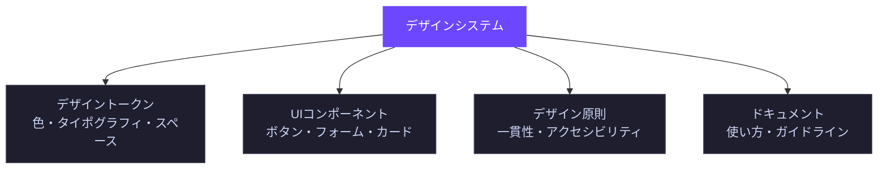
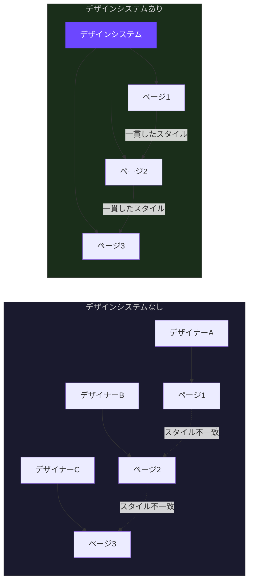
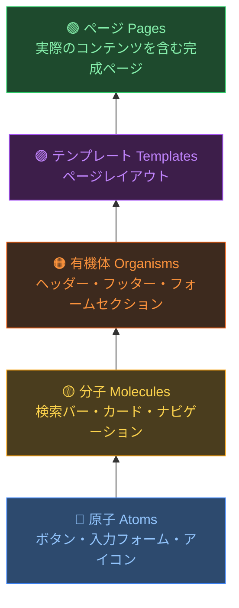
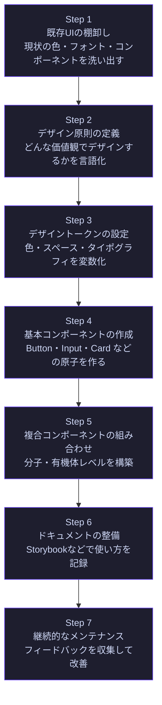
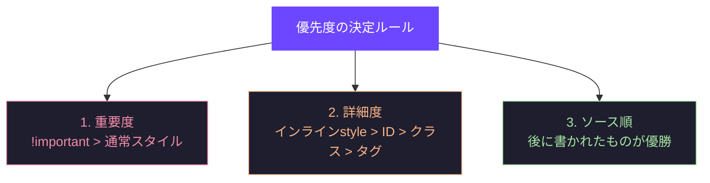
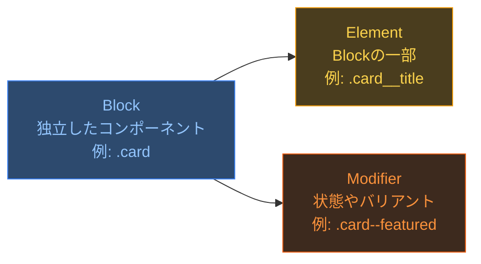
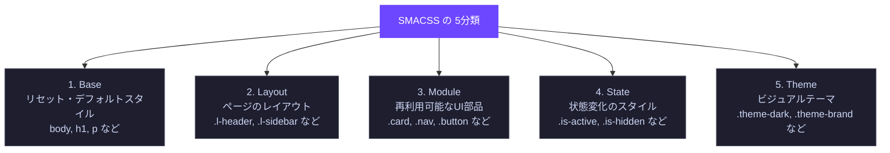
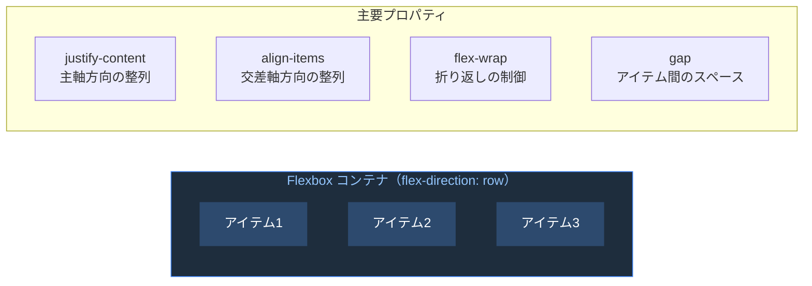
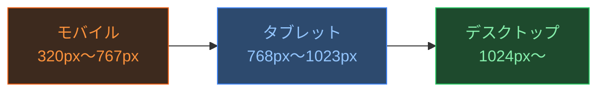
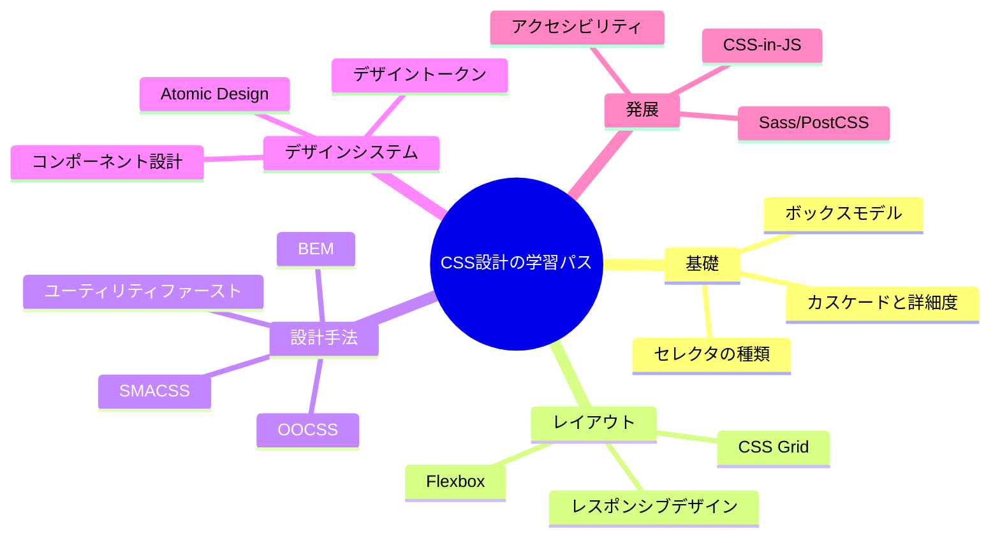

# デザインシステムとCSS設計の基礎

> 対象読者：フロントエンド開発の初学者  
> 難易度：🟢 入門  
> 最終更新：2025年

---

## 目次

1. [デザインシステムとは何か](#1-デザインシステムとは何か)
   - 1.1 定義と目的
   - 1.2 なぜデザインシステムが必要か
   - 1.3 デザインシステムの構成要素
   - 1.4 代表的なデザインシステムの事例
   - 1.5 構築ステップ
   - 1.6 ベストプラクティス

2. [CSS設計の基礎原則](#2-css設計の基礎原則)
   - 2.1 CSSカスケードと詳細度
   - 2.2 主要なCSS設計手法
   - 2.3 CSS変数（カスタムプロパティ）
   - 2.4 レイアウト設計の基礎
   - 2.5 レスポンシブデザイン
   - 2.6 ベストプラクティス

---

## 1. デザインシステムとは何か

### 1.1 定義と目的

デザインシステムとは、**プロダクト全体で一貫したUIを構築するための「単一の信頼できる情報源（Single Source of Truth）」** です。  
デザインの原則・再利用可能なコンポーネント・ガイドラインをひとつのシステムとして統合したものを指します。



**デザインシステムがないとどうなるか（よくある問題）**

| 問題 | 具体例 |
|------|--------|
| 見た目のばらつき | ページAは青いボタン、ページBは緑のボタン |
| コードの重複 | 同じようなコンポーネントが複数箇所に散在 |
| 開発速度の低下 | 毎回ゼロからUIを実装する |
| 保守コストの増大 | 色を変えるだけで数十ファイルを修正 |

---

### 1.2 なぜデザインシステムが必要か



**メリットのまとめ**

- **一貫性**：ユーザーが迷わない統一されたUI
- **効率性**：再利用可能なコンポーネントで開発速度が向上
- **スケーラビリティ**：チームが大きくなっても品質を維持
- **コラボレーション**：デザイナーとエンジニアの共通言語になる

---

### 1.3 デザインシステムの構成要素

デザインシステムは「**原子設計（Atomic Design）**」の考え方で整理されることが多いです。



#### デザイントークン（Design Tokens）

デザインシステムの最も基本的な構成要素。色・スペース・タイポグラフィなどの「値」を変数として定義します。

```css
/* デザイントークンの例（CSS カスタムプロパティ） */
:root {
  /* カラートークン */
  --color-primary-500: #6C47FF;
  --color-primary-600: #5a38e0;
  --color-neutral-100: #f4f4f5;
  --color-neutral-900: #18181b;

  /* スペーストークン（4px基準グリッド） */
  --space-1: 4px;
  --space-2: 8px;
  --space-4: 16px;
  --space-6: 24px;
  --space-8: 32px;

  /* タイポグラフィトークン */
  --font-size-sm: 0.875rem;  /* 14px */
  --font-size-base: 1rem;    /* 16px */
  --font-size-lg: 1.125rem;  /* 18px */
  --font-size-xl: 1.25rem;   /* 20px */

  /* ボーダー半径トークン */
  --radius-sm: 4px;
  --radius-md: 8px;
  --radius-lg: 12px;
}
```

---

### 1.4 代表的なデザインシステムの事例

| システム名 | 企業 | 特徴 |
|-----------|------|------|
| [Material Design](https://m3.material.io/) | Google | マテリアルの物理的な振る舞いを模倣 |
| [Lightning Design System](https://www.lightningdesignsystem.com/) | Salesforce | エンタープライズ向け |
| [Carbon Design System](https://carbondesignsystem.com/) | IBM | アクセシビリティに強み |
| [Ant Design](https://ant.design/) | Alibaba | React向けの豊富なコンポーネント |
| [Polaris](https://polaris.shopify.com/) | Shopify | Eコマース特化 |

---

### 1.5 構築ステップ



---

### 1.6 ベストプラクティス

#### ✅ トークンは階層化して定義する

```css
/* NG: 直接ハードコードされた値 */
.button {
  background: #6C47FF; /* 変更に弱い */
}

/* OK: エイリアストークンを使う */
:root {
  /* プリミティブトークン（生の値） */
  --purple-500: #6C47FF;

  /* セマンティックトークン（意味を持つ） */
  --color-action-primary: var(--purple-500);
}

.button {
  background: var(--color-action-primary); /* 変更に強い */
}
```

#### ✅ コンポーネントは「単一責任の原則」で設計する

```css
/* NG: ボタンコンポーネントにレイアウトを持たせる */
.button {
  background: var(--color-action-primary);
  margin: 0 auto; /* これは外部が担当すべき */
  width: 100%;    /* これも外部が担当すべき */
}

/* OK: コンポーネントは見た目だけを担当 */
.button {
  display: inline-flex;
  align-items: center;
  padding: var(--space-2) var(--space-4);
  background: var(--color-action-primary);
  color: white;
  border-radius: var(--radius-md);
  /* マージン・幅は使う側が決める */
}
```

#### ✅ バリアントはデータ属性やクラス修飾子で表現する

```html
<!-- BEM記法によるバリアント -->
<button class="button button--primary">送信</button>
<button class="button button--secondary">キャンセル</button>
<button class="button button--danger">削除</button>
```

```css
.button { /* ベーススタイル */ }
.button--primary { background: var(--color-action-primary); }
.button--secondary { background: transparent; border: 1px solid var(--color-action-primary); }
.button--danger { background: var(--color-danger-500); }
```

---

## 2. CSS設計の基礎原則

### 2.1 CSSカスケードと詳細度

CSSで最も重要な概念のひとつが「**カスケード（Cascade）**」です。複数のスタイルが同じ要素に適用された場合、どれが優先されるかを決めるルールです。



#### 詳細度（Specificity）の計算方法

詳細度は `(a, b, c)` の3桁の数値で表します。

| セレクタの種類 | 詳細度 | 例 |
|---------------|--------|-----|
| インラインスタイル | (1,0,0) | `style="color:red"` |
| IDセレクタ | (0,1,0) | `#header` |
| クラス・属性・疑似クラス | (0,0,1) | `.button`, `[type]`, `:hover` |
| タグ・疑似要素 | (0,0,1) | `div`, `::before` |
| ユニバーサル | (0,0,0) | `*` |

```css
/* 詳細度の比較例 */
p               { color: black; }   /* (0,0,1) */
.text           { color: blue; }    /* (0,1,0) ← 勝つ */
#content        { color: green; }   /* (1,0,0) ← さらに勝つ */
p.text#content  { color: red; }     /* (1,1,1) ← 最も強い */
```

> **初学者へのアドバイス**：`!important` の多用は避けましょう。詳細度の戦争を引き起こし、後のメンテナンスが困難になります。

---

### 2.2 主要なCSS設計手法

#### BEM（Block Element Modifier）

最も広く使われているCSS命名規則です。



```html
<!-- BEM の構文: Block__Element--Modifier -->
<article class="card card--featured">
  
  <div    class="card__body">
    <h2   class="card__title">タイトル</h2>
    <p    class="card__description">説明文...</p>
    <a    class="card__link card__link--primary" href="#">続きを読む</a>
  </div>
</article>
```

```css
/* BEM スタイルの例 */
.card {
  border-radius: var(--radius-lg);
  overflow: hidden;
  background: var(--color-background-secondary);
}

.card--featured {
  border: 2px solid var(--color-primary-500);
}

.card__title {
  font-size: var(--font-size-lg);
  font-weight: 600;
  color: var(--color-text-primary);
}

.card__link--primary {
  color: var(--color-primary-500);
  font-weight: 500;
}
```

---

#### OOCSS（Object-Oriented CSS）

「構造」と「スキン（見た目）」を分離するアプローチです。

```css
/* NG: 繰り返しが多い */
.button-primary {
  display: inline-flex;
  padding: 8px 16px;
  border-radius: 6px;
  background: #6C47FF;
  color: white;
}

.button-danger {
  display: inline-flex;   /* 重複 */
  padding: 8px 16px;      /* 重複 */
  border-radius: 6px;     /* 重複 */
  background: #ef4444;
  color: white;
}

/* OK: 構造とスキンを分離 */
.button {               /* 構造（共通） */
  display: inline-flex;
  padding: 8px 16px;
  border-radius: 6px;
  color: white;
}

.button-primary  { background: #6C47FF; } /* スキン */
.button-danger   { background: #ef4444; } /* スキン */
```

---

#### SMACSS（Scalable and Modular Architecture for CSS）

CSSのルールを5つのカテゴリに分類する考え方です。



---

#### ユーティリティファースト（Utility-First / Tailwind CSS的アプローチ）

単一の目的を持つ小さなクラスを組み合わせてスタイルを構成します。

```html
<!-- 従来のアプローチ -->
<button class="submit-button">送信</button>

<!-- ユーティリティファースト（Tailwind CSS風） -->
<button class="px-4 py-2 bg-purple-600 text-white rounded-md font-medium hover:bg-purple-700">
  送信
</button>
```

**各アプローチの比較**

| 手法 | 学習コスト | 保守性 | 柔軟性 | 適したプロジェクト |
|------|-----------|--------|--------|-------------------|
| BEM | 低 | 高 | 中 | 中〜大規模 |
| OOCSS | 中 | 高 | 高 | 大規模 |
| SMACSS | 中 | 高 | 中 | 大規模 |
| Utility-First | 低 | 中 | 高 | 小〜大規模 |

---

### 2.3 CSS変数（カスタムプロパティ）

CSS変数は現代のCSS設計の核心です。JavaScriptからも読み書きでき、動的なテーマ切り替えが可能になります。

```css
/* ===== 定義 ===== */
:root {
  --color-primary: #6C47FF;
  --spacing-unit: 4px;
}

/* ===== 使用 ===== */
.component {
  color: var(--color-primary);
  padding: calc(var(--spacing-unit) * 4); /* 16px */
}

/* ===== フォールバック値 ===== */
.component {
  color: var(--color-primary, #6C47FF); /* 変数がない場合は#6C47FFを使う */
}

/* ===== スコープ（スコープ限定の変数） ===== */
.card {
  --card-padding: 24px; /* .card の中でのみ有効 */
  padding: var(--card-padding);
}

/* ===== ダークモードの実装例 ===== */
:root {
  --bg-color: #ffffff;
  --text-color: #18181b;
}

@media (prefers-color-scheme: dark) {
  :root {
    --bg-color: #18181b;
    --text-color: #f4f4f5;
  }
}

body {
  background-color: var(--bg-color);
  color: var(--text-color);
  /* media queryで全コンポーネントが自動的に切り替わる */
}
```

---

### 2.4 レイアウト設計の基礎

#### Flexbox — 1次元レイアウト



```css
/* Flexbox の典型的な使用例 */

/* ナビゲーションバー */
.navbar {
  display: flex;
  justify-content: space-between; /* 両端揃え */
  align-items: center;            /* 縦方向中央 */
  padding: 0 var(--space-6);
}

/* カードグリッド */
.card-list {
  display: flex;
  flex-wrap: wrap;   /* 画面幅に応じて折り返す */
  gap: var(--space-4);
}

/* 中央揃えの定番パターン */
.centered {
  display: flex;
  justify-content: center;
  align-items: center;
  min-height: 100vh;
}
```

#### CSS Grid — 2次元レイアウト

```css
/* CSS Grid の典型的な使用例 */

/* 12カラムグリッド */
.grid {
  display: grid;
  grid-template-columns: repeat(12, 1fr);
  gap: var(--space-4);
}

/* レスポンシブなカードレイアウト */
.card-grid {
  display: grid;
  grid-template-columns: repeat(auto-fill, minmax(300px, 1fr));
  /* 最小300px、最大1frで自動的にカラム数を調整 */
  gap: var(--space-6);
}

/* 聖杯レイアウト（Holy Grail Layout） */
.holy-grail {
  display: grid;
  grid-template:
    "header  header  header"  auto
    "sidebar main    aside"   1fr
    "footer  footer  footer"  auto
    / 200px  1fr     200px;
  min-height: 100vh;
}

.header  { grid-area: header; }
.sidebar { grid-area: sidebar; }
.main    { grid-area: main; }
.aside   { grid-area: aside; }
.footer  { grid-area: footer; }
```

---

### 2.5 レスポンシブデザイン



#### モバイルファーストのアプローチ（推奨）

```css
/* ===== モバイルファースト =====
   まずモバイル向けのスタイルを書き、
   大きな画面向けに上書きする
*/

/* モバイル（デフォルト） */
.container {
  padding: var(--space-4);
  font-size: 1rem;
}

.card-grid {
  display: grid;
  grid-template-columns: 1fr; /* 1カラム */
  gap: var(--space-4);
}

/* タブレット（768px以上） */
@media (min-width: 768px) {
  .container {
    padding: var(--space-6);
  }

  .card-grid {
    grid-template-columns: repeat(2, 1fr); /* 2カラム */
  }
}

/* デスクトップ（1024px以上） */
@media (min-width: 1024px) {
  .container {
    max-width: 1200px;
    margin: 0 auto;
    padding: var(--space-8);
  }

  .card-grid {
    grid-template-columns: repeat(3, 1fr); /* 3カラム */
  }
}
```

#### よく使うブレークポイントの定義（CSS変数を使用）

```css
:root {
  --bp-sm: 640px;
  --bp-md: 768px;
  --bp-lg: 1024px;
  --bp-xl: 1280px;
}

/* 注意: CSS変数はmedia queryの条件式内では使えないため、
   プリプロセッサ（Sass）や設計上の定数として管理する */
```

---

### 2.6 ベストプラクティス

#### ✅ セレクタのネストは浅く保つ（3階層以内）

```css
/* NG: 深すぎるネスト（詳細度が高くなりすぎ、メンテが困難） */
.page .content .section .card .card__body .card__title {
  font-size: 1.2rem;
}

/* OK: BEMで扁平に保つ */
.card__title {
  font-size: 1.2rem;
}
```

#### ✅ マジックナンバーを避け、変数とcalc()を使う

```css
/* NG: なぜこの値なのかわからない */
.modal {
  top: 72px;
  height: calc(100vh - 72px);
}

/* OK: 意味のある変数名で表現 */
:root {
  --header-height: 72px;
}

.modal {
  top: var(--header-height);
  height: calc(100vh - var(--header-height));
}
```

#### ✅ !importantを使わない設計を心がける

```css
/* NG: !important で無理やり上書き */
.button {
  background: red !important;
}

/* OK: コンポーネントのバリアントとして設計 */
.button--danger {
  background: var(--color-danger-500);
}
```

#### ✅ アクセシビリティを考慮したスタイリング

```css
/* フォーカスインジケーターを消さない */
:focus-visible {
  outline: 2px solid var(--color-primary-500);
  outline-offset: 2px;
}

/* 動きを減らす設定を尊重する */
@media (prefers-reduced-motion: reduce) {
  *,
  *::before,
  *::after {
    animation-duration: 0.01ms !important;
    transition-duration: 0.01ms !important;
  }
}

/* 十分なコントラスト比を確保する（WCAG AA: 4.5:1以上） */
.text-muted {
  /* color: #999; ← NG: コントラスト不足の可能性 */
  color: var(--color-text-secondary); /* デザイントークンで管理 */
}
```

#### ✅ CSSプロパティは論理プロパティを使う（国際化対応）

```css
/* NG: 方向に依存したプロパティ */
.element {
  margin-left: 16px;
  padding-right: 8px;
  border-left: 1px solid;
}

/* OK: 論理プロパティ（RTL言語でも自動対応） */
.element {
  margin-inline-start: 16px;
  padding-inline-end: 8px;
  border-inline-start: 1px solid;
}
```

---

## まとめと次のステップ



---

## 参考リソース

### デザインシステム

- **Atomic Design by Brad Frost** — https://bradfrost.com/blog/post/atomic-web-design/
- **Design Tokens Community Group (W3C)** — https://www.w3.org/community/design-tokens/
- **Design Systems Handbook (InVision)** — https://www.designbetter.co/design-systems-handbook
- **Carbon Design System (IBM)** — https://carbondesignsystem.com/
- **Material Design 3 (Google)** — https://m3.material.io/

### CSS設計

- **MDN Web Docs - CSS Cascade** — https://developer.mozilla.org/ja/docs/Web/CSS/Cascade
- **MDN Web Docs - CSS Custom Properties** — https://developer.mozilla.org/ja/docs/Web/CSS/Using_CSS_custom_properties
- **SMACSS 公式サイト** — https://smacss.com/
- **BEM 公式サイト** — https://getbem.com/
- **CSS Tricks - A Complete Guide to Flexbox** — https://css-tricks.com/snippets/css/a-guide-to-flexbox/
- **CSS Tricks - A Complete Guide to Grid** — https://css-tricks.com/snippets/css/complete-guide-grid/
- **Every Layout (Heydon Pickering & Andy Bell)** — https://every-layout.dev/

### アクセシビリティ

- **WCAG 2.1 日本語訳** — https://waic.jp/translations/WCAG21/
- **MDN - アクセシビリティ** — https://developer.mozilla.org/ja/docs/Web/Accessibility

### 学習プラットフォーム

- **web.dev (Google)** — https://web.dev/learn/css/
- **CSS for JavaScript Developers (Josh W. Comeau)** — https://css-for-js.dev/
