# グリッド・レイアウト・コンポーネント設計・レスポンシブ・アクセシビリティ

> 対象読者：フロントエンド開発の初学者〜中級者  
> 難易度：🟠 中級  
> 最終更新：2025年

---

## 目次

7. [グリッド・レイアウトシステム](#7-グリッドレイアウトシステム)
   - 7.1 レイアウトシステムとは
   - 7.2 CSS Flexbox の完全ガイド
   - 7.3 CSS Grid の完全ガイド
   - 7.4 レイアウトパターン集
   - 7.5 FlexboxとGridの使い分け
   - 7.6 ベストプラクティス

8. [コンポーネント設計とBEM命名規則](#8-コンポーネント設計とbem命名規則)
   - 8.1 コンポーネント設計の原則
   - 8.2 BEM の完全ガイド
   - 8.3 CSS Modules / Scoped CSS
   - 8.4 コンポーネントのバリアント設計
   - 8.5 コンポーネントの状態管理
   - 8.6 ベストプラクティス

9. [レスポンシブデザインシステム](#9-レスポンシブデザインシステム)
   - 9.1 レスポンシブ設計の考え方
   - 9.2 ブレークポイントシステム
   - 9.3 コンテナクエリ
   - 9.4 流動的レイアウトの技術
   - 9.5 レスポンシブ画像
   - 9.6 ベストプラクティス

10. [アクセシビリティ（a11y）設計](#10-アクセシビリティa11y設計)
    - 10.1 アクセシビリティとは何か
    - 10.2 WCAG ガイドラインの構造
    - 10.3 セマンティックHTML
    - 10.4 キーボード操作対応
    - 10.5 スクリーンリーダー対応（ARIA）
    - 10.6 カラーとコントラスト
    - 10.7 ベストプラクティス

---

## 7. グリッド・レイアウトシステム

### 7.1 レイアウトシステムとは

レイアウトシステムとは、**ページ・コンポーネント内の要素の配置ルールを体系化したもの**です。
すべての画面で一貫した空間リズムを生み出し、予測可能な構造を保証します。

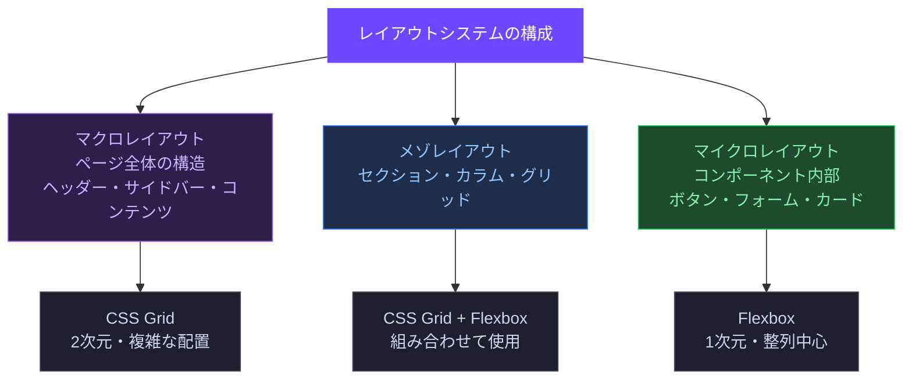

---

### 7.2 CSS Flexbox の完全ガイド

Flexbox は **1次元（行または列）** のレイアウトを扱います。
コンテナとアイテムの2つの役割があり、それぞれにプロパティがあります。

#### 主軸と交差軸

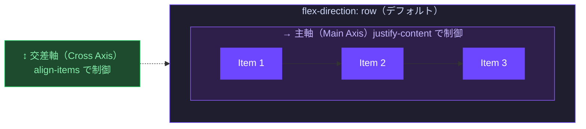

#### コンテナプロパティ（親要素）

```css
.flex-container {
  display: flex;                  /* Flexbox を有効化 */
  flex-direction: row;            /* row | row-reverse | column | column-reverse */
  flex-wrap: nowrap;              /* nowrap | wrap | wrap-reverse */
  justify-content: flex-start;    /* 主軸方向の整列 */
  align-items: stretch;           /* 交差軸方向の整列 */
  align-content: stretch;         /* 複数行の交差軸整列（wrap時） */
  gap: var(--space-4);            /* アイテム間のスペース（row-gap column-gap） */
}
```

**`justify-content` の値**

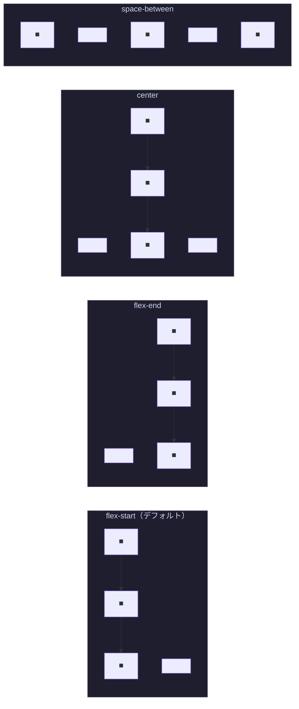

#### アイテムプロパティ（子要素）

```css
.flex-item {
  flex-grow:   0;     /* 余白があるとき伸びる割合 (0=伸びない) */
  flex-shrink: 1;     /* 余白が足りないとき縮む割合 (1=縮む) */
  flex-basis:  auto;  /* 初期サイズ */

  /* 上記3つのショートハンド */
  flex: 0 1 auto;     /* grow shrink basis */

  /* よく使うショートハンドの意味 */
  flex: 1;            /* = 1 1 0  等幅で伸縮する */
  flex: auto;         /* = 1 1 auto コンテンツ基準で伸縮する */
  flex: none;         /* = 0 0 auto 固定サイズ */

  align-self: auto;   /* 個別の交差軸整列（コンテナの align-items を上書き） */
  order: 0;           /* 表示順（数値が小さいほど前） */
}
```

#### Flexbox の典型的なパターン

```css
/* ===== ナビゲーションバー ===== */
.navbar {
  display: flex;
  align-items: center;
  justify-content: space-between;
  padding: 0 var(--space-6);
  height: var(--size-component-lg); /* 48px */
}

.navbar__logo { flex: none; }
.navbar__nav  { display: flex; gap: var(--space-4); }
.navbar__actions { display: flex; gap: var(--space-2); margin-inline-start: auto; }

/* ===== 完全中央揃え ===== */
.centered-layout {
  display: flex;
  justify-content: center;
  align-items: center;
  min-height: 100svh; /* svh: ブラウザのUIを除いたビューポート高さ */
}

/* ===== カードフッター（ボタンを下部に固定） ===== */
.card {
  display: flex;
  flex-direction: column;
}

.card__body  { flex: 1; }        /* 余白を全部吸収 */
.card__footer { flex: none; }    /* 高さ固定 */

/* ===== 左アイコン + テキスト のパターン ===== */
.list-item {
  display: flex;
  align-items: center;
  gap: var(--space-3);
}

.list-item__icon { flex: none; width: 20px; }
.list-item__text { flex: 1; min-width: 0; } /* min-width:0 でテキスト省略が効く */
```

---

### 7.3 CSS Grid の完全ガイド

CSS Grid は **2次元（行と列）** を同時に制御できます。
複雑なレイアウトもシンプルなコードで表現できます。

#### Grid の基本概念

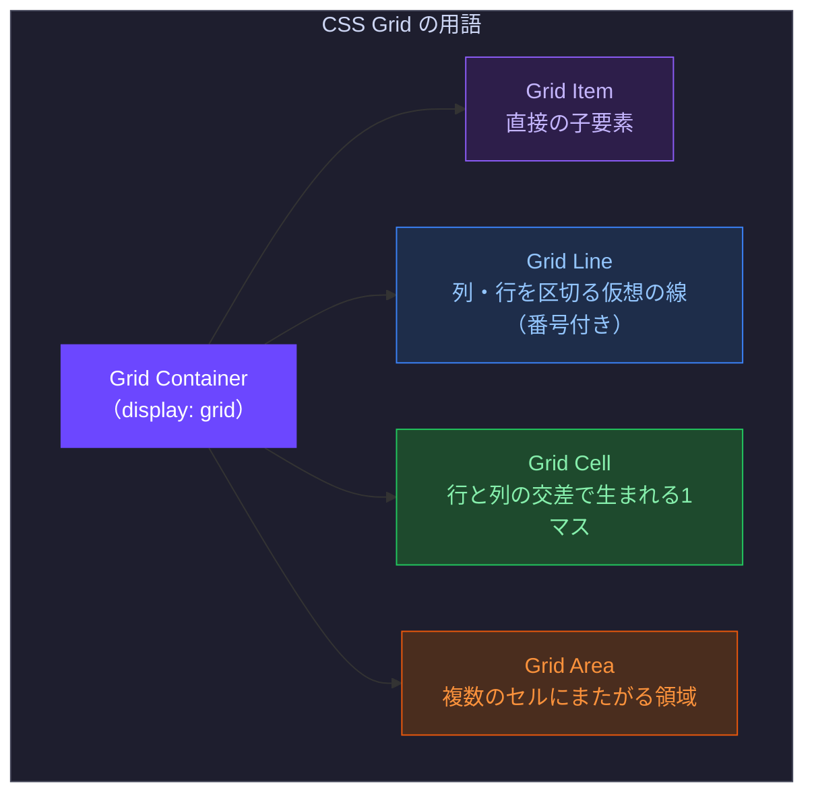

#### コンテナプロパティ

```css
.grid-container {
  display: grid;

  /* ===== カラム定義 ===== */
  grid-template-columns: 200px 1fr 1fr;     /* 固定 + 均等2列 */
  grid-template-columns: repeat(3, 1fr);    /* 3等分 */
  grid-template-columns: repeat(12, 1fr);   /* 12カラムグリッド */

  /* auto-fill: できるだけ多くのカラムを作る（空カラムあり） */
  grid-template-columns: repeat(auto-fill, minmax(250px, 1fr));

  /* auto-fit: カラム数をアイテムに合わせる（空カラムなし） */
  grid-template-columns: repeat(auto-fit, minmax(250px, 1fr));

  /* ===== 行定義 ===== */
  grid-template-rows: auto 1fr auto;  /* ヘッダー・メイン・フッター */

  /* ===== 名前付きエリア ===== */
  grid-template-areas:
    "header  header  header"
    "sidebar main    main"
    "footer  footer  footer";

  /* ===== 間隔 ===== */
  gap:        var(--space-4);         /* 行列同じ */
  row-gap:    var(--space-6);         /* 行間のみ */
  column-gap: var(--space-4);         /* 列間のみ */
}
```

#### アイテムプロパティ

```css
.grid-item {
  /* ===== 列の配置 ===== */
  grid-column: 1 / 3;          /* 列ライン1から3（2列分） */
  grid-column: 1 / span 2;     /* 1列目から2列分 */
  grid-column: 1 / -1;         /* 左端から右端まで（全幅） */

  /* ===== 行の配置 ===== */
  grid-row: 1 / 3;             /* 行ライン1から3（2行分） */

  /* ===== 名前付きエリアで配置 ===== */
  grid-area: header;
  grid-area: sidebar;
  grid-area: main;
  grid-area: footer;

  /* ===== セル内の整列（個別） ===== */
  justify-self: center;        /* 列方向（水平）の整列 */
  align-self: end;             /* 行方向（垂直）の整列 */
  place-self: center end;      /* align-self / justify-self のショートハンド */
}
```

#### 名前付きエリアレイアウトの実例

```css
/* ===== 聖杯レイアウト（Holy Grail Layout） ===== */
.holy-grail {
  display: grid;
  grid-template-areas:
    "header  header  header"
    "sidebar main    aside"
    "footer  footer  footer";
  grid-template-columns: 240px 1fr 200px;
  grid-template-rows: auto 1fr auto;
  min-height: 100svh;
  gap: var(--space-4);
}

.holy-grail > header  { grid-area: header; }
.holy-grail > nav     { grid-area: sidebar; }
.holy-grail > main    { grid-area: main; }
.holy-grail > aside   { grid-area: aside; }
.holy-grail > footer  { grid-area: footer; }

/* ===== モバイルではシングルカラムに ===== */
@media (max-width: 768px) {
  .holy-grail {
    grid-template-areas:
      "header"
      "main"
      "sidebar"
      "aside"
      "footer";
    grid-template-columns: 1fr;
  }
}
```

---

### 7.4 レイアウトパターン集

業界でよく使われるパターンを CSS Grid/Flexbox で実装します。

```css
/* ===== 1. RAM パターン（Repeat, Auto, Minmax） ===== */
/* アイテム数に関わらず自動でカラム調整 */
.auto-grid {
  display: grid;
  grid-template-columns: repeat(auto-fit, minmax(min(300px, 100%), 1fr));
  gap: var(--space-6);
}

/* ===== 2. サイドバー付きレイアウト ===== */
.with-sidebar {
  display: grid;
  grid-template-columns: min-content 1fr; /* サイドバーはコンテンツ幅、メインは残り */
  gap: var(--space-6);
}

/* ===== 3. カードが均等割りで最後の行も左詰め ===== */
.card-grid {
  display: grid;
  grid-template-columns: repeat(3, 1fr);
  gap: var(--space-4);
}

/* ===== 4. スタックレイアウト（縦並び・等間隔） ===== */
.stack {
  display: flex;
  flex-direction: column;
  gap: var(--space-4);
}

/* ===== 5. クラスター（タグ・バッジの折り返し） ===== */
.cluster {
  display: flex;
  flex-wrap: wrap;
  gap: var(--space-2);
  align-items: center;
}

/* ===== 6. インセットレイアウト（コンテンツを中央に） ===== */
.inset {
  max-width: var(--container-xl); /* 1280px */
  margin-inline: auto;
  padding-inline: var(--space-4);
}

/* ===== 7. フルブリード（1要素だけ全幅） ===== */
/* 参考: https://ryanmulligan.dev/blog/layout-breakout/ */
.content-grid {
  --padding-inline: var(--space-4);
  --content-max-width: 680px;
  --breakout-max-width: 900px;

  display: grid;
  grid-template-columns:
    [full-width-start]
      minmax(var(--padding-inline), 1fr)
      [breakout-start]
        minmax(0, calc((var(--breakout-max-width) - var(--content-max-width)) / 2))
        [content-start]
          min(100% - (var(--padding-inline) * 2), var(--content-max-width))
        [content-end]
        minmax(0, calc((var(--breakout-max-width) - var(--content-max-width)) / 2))
      [breakout-end]
      minmax(var(--padding-inline), 1fr)
    [full-width-end];
}

.content-grid > * { grid-column: content; }
.content-grid > .breakout { grid-column: breakout; }
.content-grid > .full-width { grid-column: full-width; }
```

---

### 7.5 FlexboxとGridの使い分け

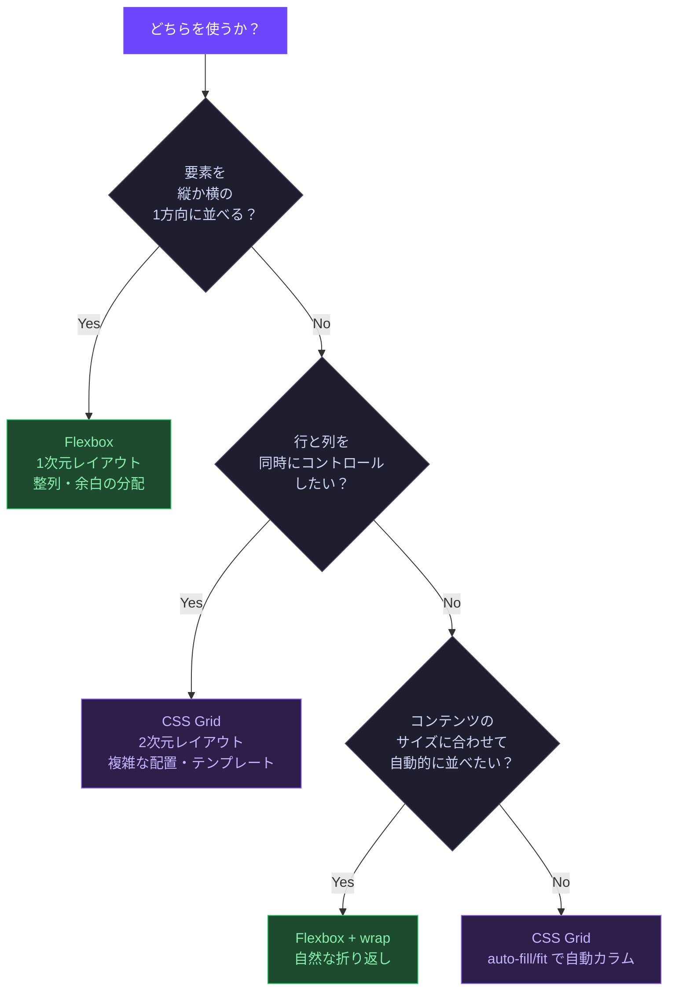

| 場面 | 推奨 | 理由 |
|------|------|------|
| ナビゲーションバー | Flexbox | 横1列・アイテム整列 |
| ボタン内のアイコン+テキスト | Flexbox | 横1列・中央揃え |
| タグ・バッジのリスト | Flexbox + wrap | 折り返し |
| ページ全体のレイアウト | Grid | 行と列を同時管理 |
| カードグリッド | Grid | 自動カラム配置 |
| フォームの入力群 | Grid | 複数列の整列 |

---

### 7.6 ベストプラクティス

#### ✅ `margin` より `gap` でアイテム間隔を管理する

```css
/* NG: margin で間隔を管理（最後の要素に余分なスペースが残る） */
.card { margin-bottom: var(--space-4); }

/* OK: 親の gap で管理（精確で予測可能） */
.card-list {
  display: flex;
  flex-direction: column;
  gap: var(--space-4);
}
```

#### ✅ `min()` / `max()` / `clamp()` でレスポンシブをミニマムに保つ

```css
/* media query なしでレスポンシブなグリッドを実現 */
.auto-grid {
  grid-template-columns: repeat(auto-fit, minmax(min(300px, 100%), 1fr));
  /* min(300px, 100%): 300pxが100%を超えたら100%に縮む → 1カラムに */
}
```

#### ✅ `place-items` / `place-content` のショートハンドを活用する

```css
/* align-items + justify-items をまとめて指定 */
.grid { place-items: center; }          /* = align-items: center; justify-items: center; */
.grid { place-content: center space-between; } /* align-content / justify-content */
```

---

## 8. コンポーネント設計とBEM命名規則

### 8.1 コンポーネント設計の原則

コンポーネントとは、**単一の機能・見た目を持つ再利用可能なUI部品**です。
優れたコンポーネント設計は以下の原則に従います。

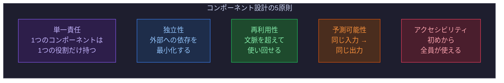

---

### 8.2 BEM の完全ガイド

BEM（Block Element Modifier）は、CSSクラス名の命名規則です。
**Block（ブロック）** → **Element（エレメント）** → **Modifier（モディファイア）** の3層構造で構成されます。

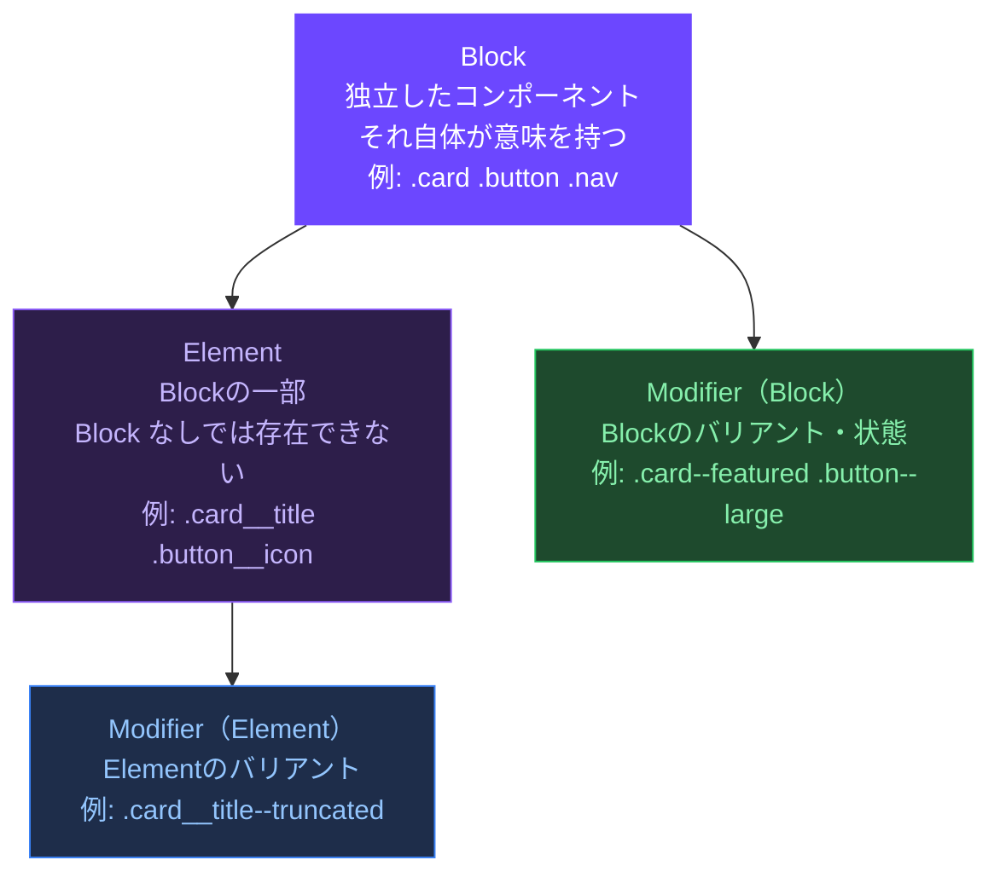

#### 命名規則の構文

```text
.block {}
.block__element {}
.block--modifier {}
.block__element--modifier {}
```

#### 実装例：カードコンポーネント

```html
<!-- HTML 構造 -->
<article class="card card--featured">
  <div class="card__media">
    
    <span class="card__badge card__badge--new">NEW</span>
  </div>
  <div class="card__body">
    <div class="card__meta">
      <span class="card__category">テクノロジー</span>
      <time class="card__date">2025年1月1日</time>
    </div>
    <h2 class="card__title">記事タイトル</h2>
    <p class="card__description card__description--truncated">
      記事の説明文がここに入ります...
    </p>
  </div>
  <footer class="card__footer">
    <a class="card__link" href="#">続きを読む</a>
    <button class="card__action card__action--bookmark" aria-label="ブックマーク">
    </button>
  </footer>
</article>
```

```css
/* ===== Block ===== */
.card {
  display: flex;
  flex-direction: column;
  border-radius: var(--radius-lg);
  background: var(--color-bg-surface);
  border: 1px solid var(--color-border-default);
  overflow: hidden;
}

/* Block Modifier */
.card--featured {
  border-color: var(--color-action-primary);
  box-shadow: 0 0 0 1px var(--color-action-primary);
}

/* ===== Elements ===== */
.card__media {
  position: relative;
  aspect-ratio: 16 / 9;
  overflow: hidden;
}

.card__image {
  width: 100%;
  height: 100%;
  object-fit: cover;
}

.card__badge {
  position: absolute;
  top: var(--space-2);
  right: var(--space-2);
  padding: var(--space-1) var(--space-2);
  border-radius: var(--radius-sm);
  font-size: var(--font-size-xs);
  font-weight: var(--font-weight-semibold);
  background: var(--color-bg-surface);
  color: var(--color-text-primary);
}

/* Element Modifier */
.card__badge--new {
  background: var(--color-action-primary);
  color: var(--color-text-on-primary);
}

.card__body {
  flex: 1;
  padding: var(--spacing-inset-lg); /* 24px */
  display: flex;
  flex-direction: column;
  gap: var(--space-2);
}

.card__title {
  font-size: var(--font-size-xl);
  font-weight: var(--font-weight-semibold);
  line-height: var(--line-height-tight);
  color: var(--color-text-primary);
}

.card__description {
  color: var(--color-text-secondary);
  line-height: var(--line-height-relaxed);
}

/* Element Modifier */
.card__description--truncated {
  display: -webkit-box;
  -webkit-box-orient: vertical;
  -webkit-line-clamp: 3;
  overflow: hidden;
}

.card__footer {
  display: flex;
  align-items: center;
  justify-content: space-between;
  padding: var(--space-4) var(--spacing-inset-lg);
  border-top: 1px solid var(--color-border-default);
}
```

#### よくある BEM の間違い

```html
<!-- NG: Element の中に Block を入れ子にした命名 -->
<div class="card">
  <div class="card__header__title"> <!-- __ を2つ使うのは NG -->
  </div>
</div>

<!-- OK: 独立した Element として定義 -->
<div class="card">
  <header class="card__header">
    <h2 class="card__title"></h2>   <!-- card__header__title ではない -->
  </header>
</div>
```

```css
/* NG: Block の外側にある要素への影響 */
.card {
  margin: 0 auto;    /* 外部レイアウトは Block が持つべきでない */
  width: 100%;       /* 使用側が決めるべき */
}

/* OK: Block は内部のみ責任を持つ */
.card {
  display: flex;
  flex-direction: column;
  border-radius: var(--radius-lg);
  /* margin・位置・幅は使う側のコンテナが決める */
}
```

---

### 8.3 CSS Modules / Scoped CSS

React・Vue などのコンポーネントフレームワークでは、CSSのスコープを自動化する仕組みがあります。

```css
/* ===== CSS Modules（.module.css） ===== */
/* ビルド時に .card_xK2aP のようにユニーク名に変換される */

.card { /* → .card_xK2aP */
  border-radius: var(--radius-lg);
}

.card__title { /* → .card__title_xK2aP */
  font-size: var(--font-size-xl);
}
```

```jsx
/* React での使用例 */
import styles from './Card.module.css';

function Card({ title }) {
  return (
    <article className={styles.card}>
      <h2 className={styles.card__title}>{title}</h2>
    </article>
  );
}
```

```html
<!-- Vue の Scoped CSS -->
<template>
  <article class="card">
    <h2 class="card__title">{{ title }}</h2>
  </article>
</template>

<style scoped>
/* data-v-XXXXXX 属性が自動付与され、スコープが限定される */
.card { border-radius: var(--radius-lg); }
.card__title { font-size: var(--font-size-xl); }
</style>
```

---

### 8.4 コンポーネントのバリアント設計

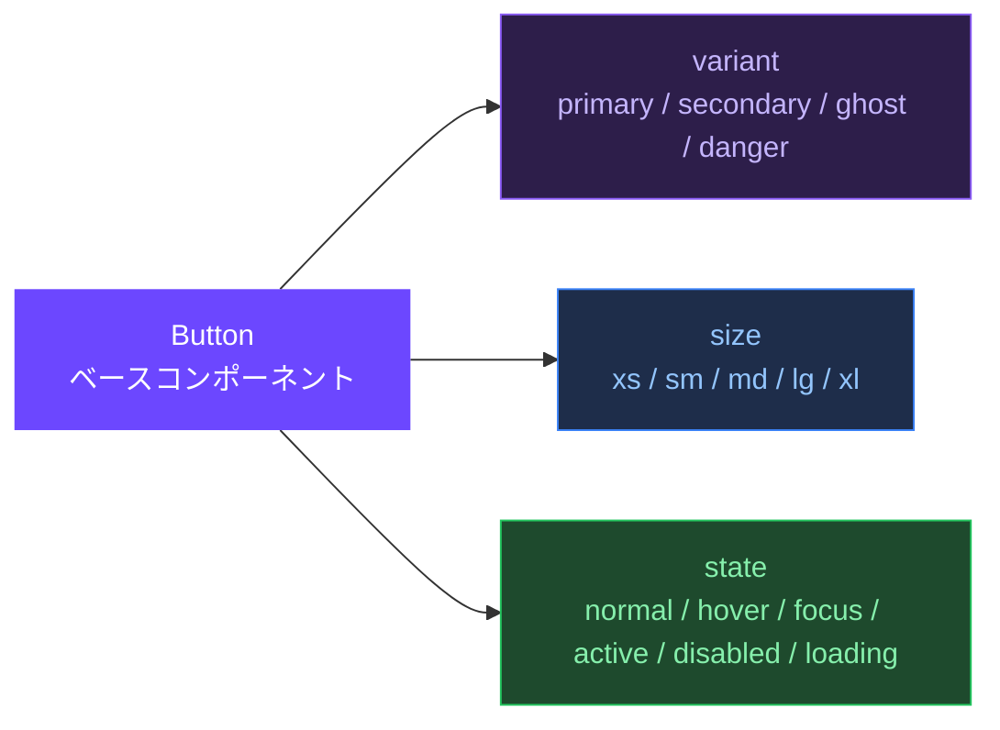

```css
/* ===== ボタンコンポーネントの完全実装 ===== */

/* ベーススタイル */
.button {
  display: inline-flex;
  align-items: center;
  justify-content: center;
  gap: var(--space-2);
  border: 1px solid transparent;
  border-radius: var(--radius-md);
  font-size: var(--font-size-sm);
  font-weight: var(--font-weight-medium);
  line-height: 1;
  cursor: pointer;
  transition: background-color 150ms ease, color 150ms ease, border-color 150ms ease;

  /* フォーカスリング（アクセシビリティ必須） */
  outline: none;
}

.button:focus-visible {
  outline: 2px solid var(--color-action-primary);
  outline-offset: 2px;
}

/* サイズバリアント */
.button--sm {
  height: var(--size-component-sm); /* 32px */
  padding-inline: var(--space-3);
  font-size: var(--font-size-xs);
}

.button--md {
  height: var(--size-component-md); /* 40px */
  padding-inline: var(--space-4);
}

.button--lg {
  height: var(--size-component-lg); /* 48px */
  padding-inline: var(--space-6);
  font-size: var(--font-size-base);
}

/* デザインバリアント */
.button--primary {
  background: var(--color-action-primary);
  color: var(--color-text-on-primary);
}
.button--primary:hover { background: var(--color-action-primary-hover); }
.button--primary:active { background: var(--color-action-primary-active); }

.button--secondary {
  background: transparent;
  color: var(--color-action-primary);
  border-color: var(--color-action-primary);
}
.button--secondary:hover { background: var(--color-action-primary-subtle); }

.button--ghost {
  background: transparent;
  color: var(--color-text-secondary);
}
.button--ghost:hover {
  background: var(--color-bg-overlay);
  color: var(--color-text-primary);
}

.button--danger {
  background: var(--color-feedback-danger);
  color: white;
}

/* 状態バリアント */
.button:disabled,
.button[aria-disabled="true"] {
  opacity: 0.4;
  cursor: not-allowed;
  pointer-events: none;
}

.button--loading {
  cursor: wait;
  opacity: 0.7;
}
```

---

### 8.5 コンポーネントの状態管理

```mermaid
stateDiagram-v2
    [*] --> Default: 初期状態
    Default --> Hover: マウスオーバー
    Default --> Focus: タブキー / クリック
    Hover --> Default: マウスアウト
    Hover --> Active: クリック開始
    Focus --> Default: フォーカス外れる
    Focus --> Active: Enterキー / クリック
    Active --> Default: クリック終了
    Default --> Disabled: disabled 属性
    Disabled --> [*]: コンポーネント除去
    Default --> Loading: 非同期処理中
    Loading --> Default: 処理完了
    Loading --> Error: エラー発生
    Error --> Default: 再試行
```

```css
/* ===== 状態はクラスで表現（is- prefix） ===== */

/* インタラクション状態（CSSが管理） */
.button:hover   { /* hover 状態 */ }
.button:focus-visible { /* focus 状態 */ }
.button:active  { /* active 状態 */ }
.button:disabled { /* disabled 状態 */ }

/* アプリケーション状態（JSがクラスを付与） */
.button.is-loading { cursor: wait; }
.button.is-success { background: var(--color-feedback-success); }
.button.is-error   { background: var(--color-feedback-danger); }

/* データ属性による状態（HTML属性と連動） */
.input[aria-invalid="true"] {
  border-color: var(--color-feedback-danger);
}
```

---

### 8.6 ベストプラクティス

#### ✅ コンポーネントのCSSは外側のマージンを持たない

```css
/* NG: コンポーネントが外側の空間を管理 */
.card {
  margin-bottom: var(--space-6);  /* 再利用時に邪魔になる */
}

/* OK: コンポーネントは内側のみ管理 */
.card { padding: var(--spacing-inset-lg); }

/* 配置する側のコンテナで管理 */
.card-grid { gap: var(--space-6); }
```

#### ✅ クラスはセレクタの詳細度を上げない

```css
/* NG: ID や タグ + クラスで詳細度を上げる */
#sidebar .card { color: red; }
article.card   { color: red; }

/* OK: クラスのみで詳細度を統一 */
.card--sidebar { color: red; }
```

#### ✅ `:not()` で状態の除外を表現する

```css
/* 最後のアイテム以外に下線を引く */
.list__item:not(:last-child) {
  border-bottom: 1px solid var(--color-border-default);
}

/* ホバー・フォーカスを一括指定 */
.card:is(:hover, :focus-within) {
  border-color: var(--color-action-primary);
}
```

---

## 9. レスポンシブデザインシステム

### 9.1 レスポンシブ設計の考え方

レスポンシブデザインとは、**デバイスの画面サイズに関わらず、最適なUI/UXを提供する**設計手法です。

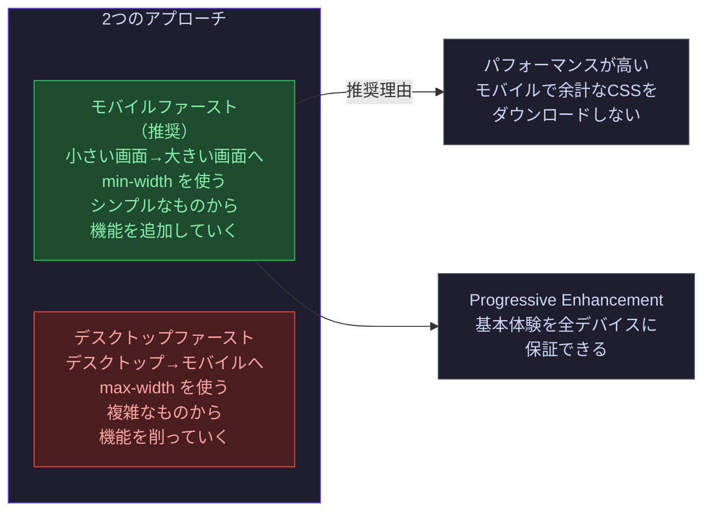

---

### 9.2 ブレークポイントシステム

#### 代表的なブレークポイント設計

```css
/* ===== ブレークポイントトークン ===== */
/* （CSSのメディアクエリ内では変数が使えないためコメントで定義） */
/*
  --bp-sm:  640px   スマートフォン横向き
  --bp-md:  768px   タブレット縦向き
  --bp-lg:  1024px  タブレット横向き・小型ラップトップ
  --bp-xl:  1280px  デスクトップ
  --bp-2xl: 1536px  大型ディスプレイ
*/

/* ===== モバイルファーストの記述順序 ===== */

/* 1. デフォルト（モバイル: 0〜639px） */
.component { font-size: var(--font-size-base); }

/* 2. sm: 640px 以上 */
@media (min-width: 640px) {
  .component { font-size: var(--font-size-lg); }
}

/* 3. md: 768px 以上 */
@media (min-width: 768px) {
  .component { font-size: var(--font-size-xl); }
}

/* 4. lg: 1024px 以上 */
@media (min-width: 1024px) {
  .component { font-size: var(--font-size-2xl); }
}
```

#### メディアクエリの種類

```css
/* ===== 画面幅 ===== */
@media (min-width: 768px) { }   /* 768px 以上 */
@media (max-width: 767px) { }   /* 767px 以下（デスクトップファースト） */
@media (768px <= width < 1024px) { } /* 範囲指定（モダン構文） */

/* ===== 向き ===== */
@media (orientation: portrait)  { } /* 縦向き */
@media (orientation: landscape) { } /* 横向き */

/* ===== ユーザー設定 ===== */
@media (prefers-color-scheme: dark)    { } /* ダークモード */
@media (prefers-reduced-motion: reduce){ } /* アニメーション抑制 */
@media (prefers-contrast: more)        { } /* 高コントラスト */
@media (forced-colors: active)         { } /* Windows 高コントラストモード */

/* ===== 印刷 ===== */
@media print { }

/* ===== 複数条件の組み合わせ ===== */
@media (min-width: 768px) and (orientation: landscape) { }
```

---

### 9.3 コンテナクエリ

コンテナクエリは**ビューポートではなく、親コンテナのサイズ**に応じてスタイルを変える新機能です（2023年に全モダンブラウザ対応）。

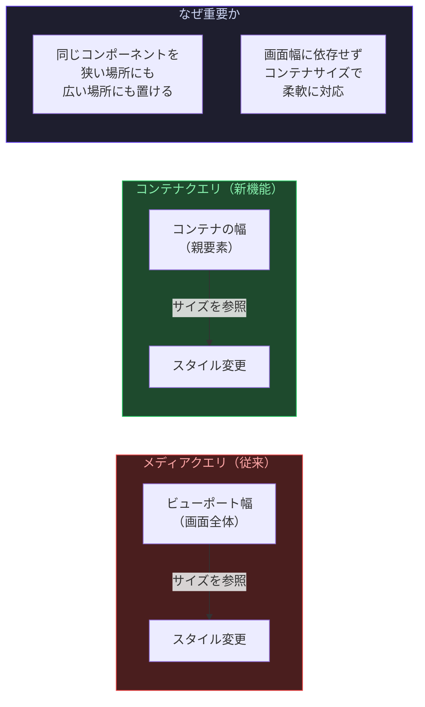

```css
/* ===== コンテナクエリの使い方 ===== */

/* Step 1: 親要素をコンテナとして登録 */
.card-wrapper {
  container-type: inline-size;  /* 幅を参照するコンテナ */
  container-name: card;          /* 名前をつけると複数管理できる */
}

/* Step 2: コンテナクエリでスタイルを分岐 */
/* 親コンテナが 500px 以上のとき */
@container card (min-width: 500px) {
  .card {
    display: grid;
    grid-template-columns: 200px 1fr;
  }
}

/* 親コンテナが 500px 未満のとき（デフォルト） */
.card {
  display: flex;
  flex-direction: column;
}

/* ===== 実践：サイドバーの幅が変わっても対応するカード ===== */
/* サイドバーあり（狭い） / サイドバーなし（広い） どちらでも最適表示 */
.article-grid {
  container-type: inline-size;
}

@container (min-width: 400px) {
  .article-card {
    flex-direction: row;  /* 横並びに */
  }
}

@container (min-width: 600px) {
  .article-card {
    grid-template-columns: 240px 1fr;  /* 固定サムネイル幅 */
  }
}
```

---

### 9.4 流動的レイアウトの技術

#### `min()` / `max()` / `clamp()` の活用

```css
/* ===== min(): 2つの値の小さい方を採用 ===== */
.element {
  width: min(500px, 100%);
  /* 500px か 親の100% の小さい方 */
  /* → 親が500px未満なら100%（はみ出さない）、以上なら500px固定 */
}

/* ===== max(): 2つの値の大きい方を採用 ===== */
.element {
  padding: max(var(--space-4), 5vw);
  /* 16px か 5vw の大きい方 */
  /* → ビューポートが狭い時は最低 16px を保証 */
}

/* ===== clamp(): 最小・推奨・最大の範囲内に収める ===== */
.element {
  width: clamp(300px, 50%, 800px);
  /* 最小300px、推奨50%、最大800px */
  font-size: clamp(1rem, 2.5vw, 1.5rem);
}

/* ===== 流動的なスペーシング ===== */
.section {
  padding-block: clamp(var(--space-8), 10vw, var(--space-24));
  /* 小画面: 32px → 大画面: 96px でなめらかに変化 */
}
```

---

### 9.5 レスポンシブ画像

```html
<!-- ===== srcset と sizes による最適化 ===== -->


<!-- ===== picture要素でアート・ディレクション ===== -->
<picture>
  <!-- モバイル向け（縦長の画像） -->
  <source
    media="(max-width: 767px)"
    srcset="hero-mobile.jpg"
  >
  <!-- デスクトップ向け（横長の画像） -->
  <source
    media="(min-width: 768px)"
    srcset="hero-desktop.jpg"
  >
  <!-- フォールバック -->
  
</picture>
```

```css
/* ===== CSS でのレスポンシブ画像 ===== */
.responsive-image {
  width: 100%;
  height: auto;         /* アスペクト比を保持 */
  object-fit: cover;    /* コンテナにフィット（比率維持） */
  object-position: center;
}

/* アスペクト比固定コンテナ */
.image-container {
  aspect-ratio: 16 / 9;
  overflow: hidden;
}

.image-container img {
  width: 100%;
  height: 100%;
  object-fit: cover;
}
```

---

### 9.6 ベストプラクティス

#### ✅ ブレークポイントはコンテンツが壊れた時点で設定する

```css
/* NG: デバイスサイズに合わせたブレークポイント */
@media (max-width: 375px) { } /* iPhone の画面幅 */
@media (max-width: 768px) { } /* iPad の画面幅 */

/* OK: コンテンツが崩れるポイントで設定 */
/* "テキストが折り返され始めた時"
   "カードが横並びに入らなくなった時"
   など、コンテンツ起点で判断する */
@media (min-width: 52rem) { } /* このコンテンツが2カラムに収まる幅 */
```

#### ✅ `vh` より `svh` / `dvh` を使う

```css
/* NG: vh はモバイルブラウザのUIバーを考慮しない */
.hero {
  height: 100vh; /* iOSのアドレスバーが出ると崩れる */
}

/* OK: 安全なビューポート単位を使う */
.hero {
  height: 100svh; /* svh: Small Viewport Height（UIバー表示時の高さ） */
  min-height: 100svh;
}
/* または dvh（動的に変化） / lvh（最大高さ） */
```

#### ✅ タッチデバイスへのホバースタイルを適切に制御する

```css
/* NG: タッチデバイスでホバーが残り続ける */
.card:hover { background: var(--color-bg-overlay); }

/* OK: ポインターデバイス（マウス）のみホバーを適用 */
@media (hover: hover) and (pointer: fine) {
  .card:hover { background: var(--color-bg-overlay); }
}
```

---

## 10. アクセシビリティ（a11y）設計

### 10.1 アクセシビリティとは何か

アクセシビリティ（a11y）とは、**すべての人がウェブを利用できる**よう設計することです。
「a11y」は accessibility の a と y の間に11文字あることに由来します。

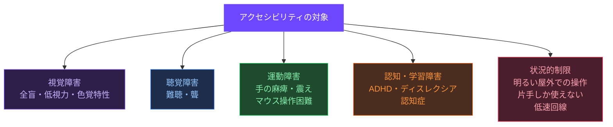

**アクセシビリティはコンプライアンスではなく、品質の問題**です。
アクセシブルなUIは、一般ユーザーにとっても使いやすいUIです（カーブカット効果）。

---

### 10.2 WCAG ガイドラインの構造

WCAG（Web Content Accessibility Guidelines）はW3Cが定める国際標準です。

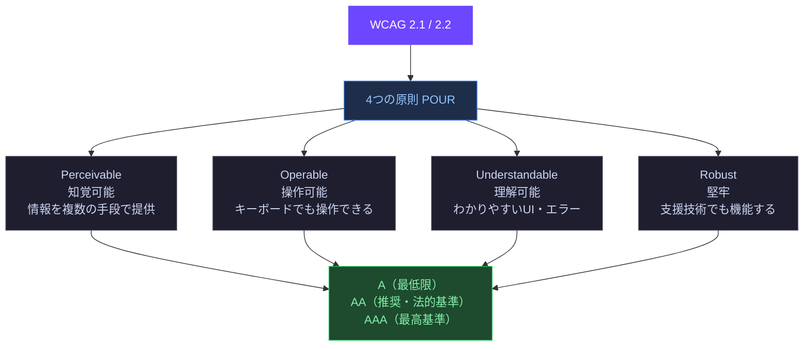

---

### 10.3 セマンティックHTML

セマンティックHTMLは、アクセシビリティの**最も重要な基礎**です。
適切なHTML要素を使うだけで、多くのアクセシビリティ要件を自動的に満たします。

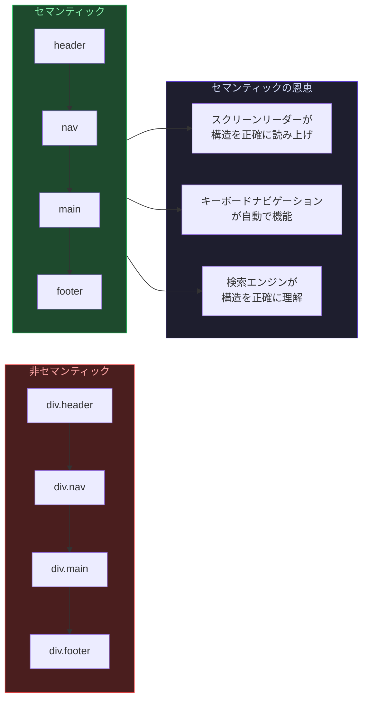

```html
<!-- NG: すべてを div で構成 -->
<div class="page">
  <div class="header">
    <div class="logo">ロゴ</div>
    <div class="nav">
      <div class="nav-item"><div class="link" onclick="...">ホーム</div></div>
    </div>
  </div>
  <div class="main">
    <div class="hero">
      <div class="title">タイトル</div>
      <div class="button" onclick="...">始める</div>
    </div>
  </div>
</div>

<!-- OK: セマンティックなHTML -->
<body>
  <header>
    <a href="/" aria-label="ホームへ戻る">
      
    </a>
    <nav aria-label="メインナビゲーション">
      <ul role="list">
        <li><a href="/home">ホーム</a></li>
        <li><a href="/about">About</a></li>
      </ul>
    </nav>
  </header>

  <main id="main-content">
    <section aria-labelledby="hero-heading">
      <h1 id="hero-heading">タイトル</h1>
      <button type="button">始める</button>  <!-- div + onclick ではなく button を使う -->
    </section>

    <article>
      <h2>記事タイトル</h2>
      <p>記事の内容...</p>
    </article>
  </main>

  <footer>
    <p><small>© 2025 Company Name</small></p>
  </footer>
</body>
```

**重要なセマンティック要素一覧**

| 要素 | 意味 | 代替できない理由 |
|------|------|----------------|
| `<button>` | クリック可能な操作 | Enter/Space キー操作、role=button が自動付与 |
| `<a href>` | リンク（ナビゲーション） | Enter キー操作、role=link が自動付与 |
| `<input>` | フォーム入力 | キーボード入力、`<label>` と関連付け |
| `<nav>` | ナビゲーション領域 | landmark role で素早くジャンプ可能 |
| `<main>` | メインコンテンツ | スクリーンリーダーでスキップ可能 |
| `<h1>`〜`<h6>` | 見出しの階層 | 文書の目次として機能 |
| `<table>` | 表形式データ | `<thead>` `<th>` `<caption>` で関係を明示 |

---

### 10.4 キーボード操作対応

視覚障害・運動障害のあるユーザーの多くは**キーボードのみ**でウェブを操作します。

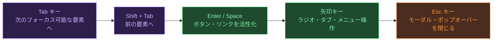

#### フォーカス管理の実装

```css
/* ===== フォーカスインジケーター（絶対に消してはいけない） ===== */

/* NG: フォーカスを非表示にする */
*:focus { outline: none; } /* 最悪のアンチパターン */
button:focus { outline: 0; }

/* OK: マウス使用時は非表示、キーボード時は表示 */
:focus { outline: none; }                      /* デフォルトは非表示 */
:focus-visible {                               /* キーボードフォーカス時のみ表示 */
  outline: 2px solid var(--color-border-focus);
  outline-offset: 2px;
  border-radius: var(--radius-sm);
}

/* ===== スキップリンク（ページ先頭のナビゲーションをスキップ） ===== */
.skip-link {
  position: absolute;
  top: -100%;
  left: var(--space-4);
  padding: var(--space-2) var(--space-4);
  background: var(--color-action-primary);
  color: var(--color-text-on-primary);
  border-radius: var(--radius-md);
  z-index: 9999;
  font-weight: var(--font-weight-semibold);
  text-decoration: none;
  transition: top 200ms ease;
}

.skip-link:focus {
  top: var(--space-4); /* フォーカス時に表示 */
}
```

```html
<!-- スキップリンクの実装 -->
<body>
  <!-- ページ最初の要素としてスキップリンクを配置 -->
  <a class="skip-link" href="#main-content">メインコンテンツへスキップ</a>

  <header>
    <!-- 長いナビゲーション -->
  </header>

  <main id="main-content" tabindex="-1">  <!-- tabindex="-1" でプログラムフォーカス可能に -->
    <!-- メインコンテンツ -->
  </main>
</body>
```

#### フォーカストラップ（モーダル内でフォーカスを閉じ込める）

```javascript
// モーダルが開いている間、フォーカスをモーダル内に閉じ込める
function trapFocus(modalElement) {
  const focusableElements = modalElement.querySelectorAll(
    'a[href], button:not([disabled]), textarea, input, select, [tabindex]:not([tabindex="-1"])'
  );
  const firstFocusable = focusableElements[0];
  const lastFocusable  = focusableElements[focusableElements.length - 1];

  modalElement.addEventListener('keydown', (e) => {
    if (e.key !== 'Tab') return;

    if (e.shiftKey) {
      // Shift+Tab: 最初の要素にいたら最後に飛ぶ
      if (document.activeElement === firstFocusable) {
        lastFocusable.focus();
        e.preventDefault();
      }
    } else {
      // Tab: 最後の要素にいたら最初に飛ぶ
      if (document.activeElement === lastFocusable) {
        firstFocusable.focus();
        e.preventDefault();
      }
    }
  });
}
```

---

### 10.5 スクリーンリーダー対応（ARIA）

ARIA（Accessible Rich Internet Applications）は、HTMLだけでは表現できないアクセシビリティ情報を補完します。

**ARIAの3つのカテゴリ**

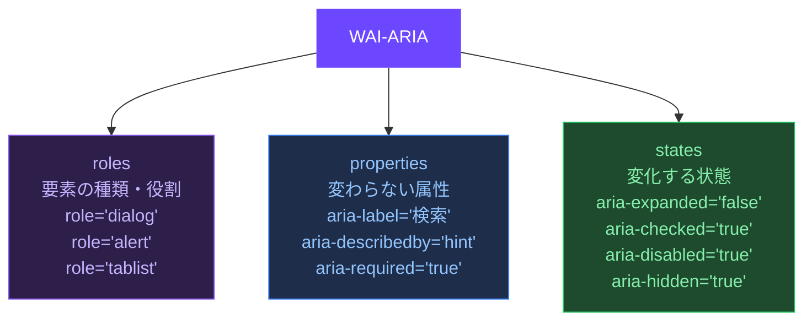

**ARIAの第一原則：ネイティブHTMLを優先する**

```html
<!-- NG: div + ARIA で疑似ボタンを作る（複雑・バグが起きやすい） -->
<div
  role="button"
  tabindex="0"
  aria-pressed="false"
  onkeydown="if(event.key==='Enter'||event.key===' ')handleClick()"
  onclick="handleClick()"
>
  クリック
</div>

<!-- OK: ネイティブの button 要素を使う（ARIAは自動付与） -->
<button type="button" aria-pressed="false">
  クリック
</button>
```

```html
<!-- ===== よく使うARIAパターン ===== -->

<!-- 1. ラベルの提供（視覚的なラベルがない場合） -->
<button aria-label="メニューを閉じる">
  <svg aria-hidden="true" focusable="false">...</svg>  <!-- アイコンをスクリーンリーダーから隠す -->
</button>

<!-- 2. 追加説明の関連付け -->
<input
  id="email"
  type="email"
  aria-describedby="email-hint email-error"
  aria-invalid="true"
>
<p id="email-hint">会社のメールアドレスを入力してください</p>
<p id="email-error" role="alert">有効なメールアドレスを入力してください</p>

<!-- 3. 展開・折り畳み -->
<button aria-expanded="false" aria-controls="menu">
  メニュー
</button>
<ul id="menu" hidden>...</ul>

<!-- 4. ライブリージョン（動的に変化するコンテンツ） -->
<div role="status" aria-live="polite">   <!-- 穏やかな通知 -->
  3件の結果が見つかりました
</div>
<div role="alert" aria-live="assertive">  <!-- 緊急の通知（エラーなど） -->
  エラーが発生しました
</div>

<!-- 5. ランドマーク -->
<header role="banner">...</header>
<nav aria-label="パンくずリスト">...</nav>
<nav aria-label="メインナビゲーション">...</nav>
<main role="main">...</main>
<aside aria-label="関連リンク">...</aside>
<footer role="contentinfo">...</footer>
```

---

### 10.6 カラーとコントラスト

#### 色だけに頼らない情報伝達

```html
<!-- NG: 色だけでエラーを示す（色覚特性のユーザーに伝わらない） -->
<input class="error" type="text">  <!-- 赤いボーダーのみ -->

<!-- OK: アイコン + テキスト + 色を組み合わせる -->
<div class="form-field">
  <input
    type="text"
    aria-invalid="true"
    aria-describedby="error-msg"
  >
  <p id="error-msg" class="error-message">
    <!-- アイコン（意味をaria-hiddenで隠す） -->
    <svg aria-hidden="true" class="error-icon">...</svg>
    <!-- テキストでも明示 -->
    このフィールドは必須です
  </p>
</div>
```

```css
/* ===== フォームエラーの視覚的表現（色以外でも伝える） ===== */
.form-field--error .input {
  border-color: var(--color-feedback-danger);     /* 色 */
  border-width: 2px;                              /* 太さ（色以外の手がかり） */
  background-image: url("data:image/svg+xml,..."); /* アイコン */
}

.error-message {
  display: flex;
  align-items: center;
  gap: var(--space-1);
  color: var(--color-feedback-danger);
  font-size: var(--font-size-sm);
  margin-top: var(--space-1);
}
```

#### アニメーションと動き

```css
/* ===== prefers-reduced-motion: アニメーション抑制設定を尊重 ===== */

/* デフォルト: アニメーションあり */
.modal {
  transition: opacity 300ms ease, transform 300ms ease;
  transform: translateY(8px);
  opacity: 0;
}
.modal.is-open {
  transform: translateY(0);
  opacity: 1;
}

/* アニメーション抑制設定時: 即時表示 */
@media (prefers-reduced-motion: reduce) {
  .modal {
    transition: opacity 150ms ease; /* フェードのみ（位置は動かさない） */
    transform: none;
  }
}

/* 自動再生メディアも停止 */
@media (prefers-reduced-motion: reduce) {
  *, *::before, *::after {
    animation-play-state: paused !important;
  }
  video[autoplay] {
    animation-play-state: paused;
  }
}
```

---

### 10.7 ベストプラクティス

#### ✅ 画像には常に適切な alt テキストを設定する

```html
<!-- 情報を持つ画像: 内容を説明する -->


<!-- 装飾的な画像: alt="" で読み上げをスキップ -->


<!-- アイコン付きボタン: ボタンにラベルが必要 -->
<button aria-label="削除">
  <svg aria-hidden="true">...</svg>
</button>
```

#### ✅ フォームは `<label>` と `<input>` を必ず関連付ける

```html
<!-- NG: placeholder だけで入力欄を示す -->
<input type="email" placeholder="メールアドレス">

<!-- OK: label で明示的に関連付ける -->
<div class="form-field">
  <label for="email">
    メールアドレス
    <span aria-label="必須" class="required-mark">*</span>
  </label>
  <input
    id="email"
    type="email"
    autocomplete="email"
    required
    aria-required="true"
  >
</div>
```

#### ✅ テーブルは適切なマークアップを使う

```html
<table>
  <caption>2024年四半期別売上データ</caption>  <!-- タイトル -->
  <thead>
    <tr>
      <th scope="col">四半期</th>  <!-- scope="col" で列ヘッダーを明示 -->
      <th scope="col">売上</th>
      <th scope="col">前期比</th>
    </tr>
  </thead>
  <tbody>
    <tr>
      <th scope="row">Q1</th>  <!-- scope="row" で行ヘッダーを明示 -->
      <td>¥10,000,000</td>
      <td>+5%</td>
    </tr>
  </tbody>
</table>
```

#### ✅ アクセシビリティテストの自動化

```bash
# axe-core（最も普及したa11yテストツール）
npm install --save-dev @axe-core/cli

# CI/CDでチェック
npx axe http://localhost:3000 --exit

# Jest / Vitest での単体テスト
# npm install --save-dev jest-axe
```

```javascript
// axe-core を使ったコンポーネントテストの例
import { render } from '@testing-library/react';
import { axe, toHaveNoViolations } from 'jest-axe';
expect.extend(toHaveNoViolations);

test('Button コンポーネントにアクセシビリティ違反がないこと', async () => {
  const { container } = render(<Button>送信</Button>);
  const results = await axe(container);
  expect(results).toHaveNoViolations();
});
```

---

## まとめ：4トピックの関係性

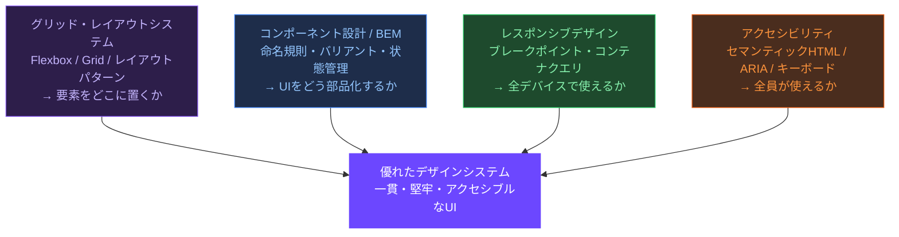

---

## 参考リソース

### グリッド・レイアウトシステム

- **MDN - CSS Grid Layout** — https://developer.mozilla.org/ja/docs/Web/CSS/CSS_grid_layout
- **MDN - CSS Flexible Box Layout** — https://developer.mozilla.org/ja/docs/Web/CSS/CSS_flexible_box_layout
- **CSS Tricks - A Complete Guide to Flexbox** — https://css-tricks.com/snippets/css/a-guide-to-flexbox/
- **CSS Tricks - A Complete Guide to CSS Grid** — https://css-tricks.com/snippets/css/complete-guide-grid/
- **Every Layout（レイアウトプリミティブ集）** — https://every-layout.dev/
- **Full-Bleed Layout（Ryan Mulligan）** — https://ryanmulligan.dev/blog/layout-breakout/
- **Grid by Example（Rachel Andrew）** — https://gridbyexample.com/

### コンポーネント設計・BEM

- **BEM 公式ドキュメント** — https://getbem.com/introduction/
- **BEM Methodology（公式）** — https://en.bem.info/methodology/
- **Inverted Triangle CSS（Harry Roberts）** — https://www.creativebloq.com/web-design/manage-large-css-projects-itcss-101517528
- **CSS Modules 公式** — https://github.com/css-modules/css-modules

### レスポンシブデザインシステム

- **MDN - レスポンシブデザイン** — https://developer.mozilla.org/ja/docs/Learn_web_development/Core/CSS_layout/Responsive_Design
- **MDN - コンテナクエリ** — https://developer.mozilla.org/ja/docs/Web/CSS/CSS_containment/Container_queries
- **web.dev - Responsive Design** — https://web.dev/learn/design/
- **MDN - svh / dvh / lvh 単位** — https://developer.mozilla.org/en-US/docs/Web/CSS/length#viewport-percentage_lengths
- **Una Kravets - Ten modern layouts in one line of CSS** — https://web.dev/articles/one-line-layouts

### アクセシビリティ（a11y）

- **WCAG 2.1（W3C 公式）** — https://www.w3.org/TR/WCAG21/
- **WCAG 2.1 日本語訳（WAIC）** — https://waic.jp/translations/WCAG21/
- **WAI-ARIA 1.2（W3C）** — https://www.w3.org/TR/wai-aria-1.2/
- **ARIA Authoring Practices Guide** — https://www.w3.org/WAI/ARIA/apg/
- **MDN - アクセシビリティ** — https://developer.mozilla.org/ja/docs/Web/Accessibility
- **The A11Y Project** — https://www.a11yproject.com/
- **axe-core（テストツール）** — https://github.com/dequelabs/axe-core
- **WebAIM - Screen Reader Survey** — https://webaim.org/projects/screenreadersurvey9/
- **Inclusive Components（Heydon Pickering）** — https://inclusive-components.design/
