# アニメーション・CSSアーキテクチャ・デザイントークン・実践・パフォーマンス・ツール

> 対象読者：フロントエンド開発の中級者〜上級者  
> 難易度：🔴 上級（16章のみ 🟠 中級）  
> 最終更新：2025年

---

## 目次

11. [アニメーション・トランジションシステム](#11-アニメーショントランジションシステム)
12. [CSSアーキテクチャパターン](#12-cssアーキテクチャパターン)
13. [デザイントークン](#13-デザイントークン)
14. [実践：完全なコンポーネント実装例](#14-実践完全なコンポーネント実装例)
15. [パフォーマンス最適化](#15-パフォーマンス最適化)
16. [ツール・エコシステム](#16-ツールエコシステム)

---

## 11. アニメーション・トランジションシステム

### 11.1 アニメーションシステムの目的

アニメーションは**装飾ではなくコミュニケーション手段**です。
適切なアニメーションはユーザーに「何が起きているか」を直感的に伝えます。

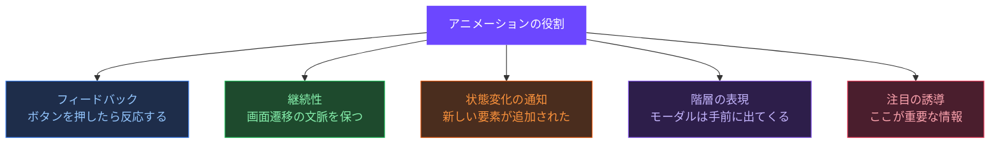

---

### 11.2 イージング（Easing）システム

イージングとは**アニメーションの加速・減速パターン**です。自然な動きは直線的ではありません。

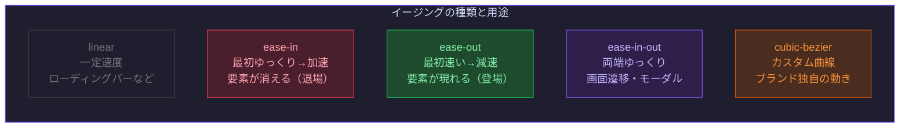

```css
/* ===== イージングトークンの定義 ===== */
:root {
  /* 標準イージング */
  --ease-linear:     linear;
  --ease-in:         cubic-bezier(0.4, 0, 1, 1);
  --ease-out:        cubic-bezier(0, 0, 0.2, 1);
  --ease-in-out:     cubic-bezier(0.4, 0, 0.2, 1);

  /* ブランド固有のイージング */
  --ease-spring:     cubic-bezier(0.34, 1.56, 0.64, 1);  /* バネのような弾み */
  --ease-smooth:     cubic-bezier(0.25, 0.1, 0.25, 1);    /* なめらかな動き */
  --ease-anticipate: cubic-bezier(0.36, 0, 0.66, -0.56);  /* 少し引いてから進む */

  /* 物理ベースのイージング（Material Design 3） */
  --ease-emphasized:          cubic-bezier(0.2, 0, 0, 1);
  --ease-emphasized-decelerate: cubic-bezier(0.05, 0.7, 0.1, 1);
  --ease-emphasized-accelerate: cubic-bezier(0.3, 0, 0.8, 0.15);
  --ease-standard:            cubic-bezier(0.2, 0, 0, 1);
}
```

---

### 11.3 デュレーション（Duration）システム

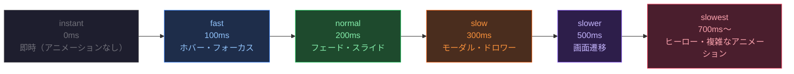

```css
/* ===== デュレーショントークン ===== */
:root {
  --duration-instant:  0ms;
  --duration-fast:     100ms;
  --duration-normal:   200ms;
  --duration-slow:     300ms;
  --duration-slower:   500ms;
  --duration-slowest:  700ms;
}
```

---

### 11.4 CSS Transition の完全ガイド

```css
/* ===== transition の構文 ===== */
/* transition: プロパティ名 デュレーション イージング 遅延; */

.button {
  background: var(--color-action-primary);
  transform: scale(1);
  box-shadow: none;

  /* 複数プロパティを個別に制御 */
  transition:
    background-color var(--duration-fast)   var(--ease-out),
    transform        var(--duration-normal)  var(--ease-spring),
    box-shadow       var(--duration-normal)  var(--ease-out);
}

.button:hover {
  background: var(--color-action-primary-hover);
  transform: scale(1.02);
  box-shadow: 0 4px 16px rgba(108, 71, 255, 0.3);
}

/* ===== GPU が扱えるプロパティのみアニメーションさせる ===== */
/*
  ✅ 推奨（コンポジタースレッドで処理 → 60fps を維持）:
    - transform（移動・拡縮・回転）
    - opacity（透明度）
    - filter（ぼかしなど）
    - clip-path

  ❌ 非推奨（レイアウト再計算が発生 → 重い）:
    - width / height
    - top / left / margin / padding
    - font-size
*/

/* NG: レイアウトに影響するプロパティをアニメーション */
.menu {
  height: 0;
  transition: height 300ms ease; /* レイアウト再計算が毎フレーム発生 */
}
.menu.is-open { height: 200px; }

/* OK: transform + opacity でアニメーション */
.menu {
  opacity: 0;
  transform: translateY(-8px);
  transition:
    opacity   200ms var(--ease-out),
    transform 200ms var(--ease-out);
  pointer-events: none;
}
.menu.is-open {
  opacity: 1;
  transform: translateY(0);
  pointer-events: auto;
}
```

---

### 11.5 CSS Animation（@keyframes）の完全ガイド

```css
/* ===== @keyframes の定義 ===== */

/* フェードイン */
@keyframes fade-in {
  from { opacity: 0; }
  to   { opacity: 1; }
}

/* スライドアップ */
@keyframes slide-up {
  from {
    opacity: 0;
    transform: translateY(16px);
  }
  to {
    opacity: 1;
    transform: translateY(0);
  }
}

/* ローディングスピナー */
@keyframes spin {
  from { transform: rotate(0deg); }
  to   { transform: rotate(360deg); }
}

/* パルス（注目を引く） */
@keyframes pulse {
  0%, 100% { transform: scale(1); opacity: 1; }
  50%       { transform: scale(1.05); opacity: 0.8; }
}

/* シェイク（エラー通知） */
@keyframes shake {
  0%, 100% { transform: translateX(0); }
  20%       { transform: translateX(-8px); }
  40%       { transform: translateX(8px); }
  60%       { transform: translateX(-4px); }
  80%       { transform: translateX(4px); }
}

/* ===== animation プロパティの構文 ===== */
.element {
  /* animation: 名前 デュレーション イージング 遅延 回数 方向 フィルモード 再生状態 */
  animation: slide-up 300ms var(--ease-out) 0ms 1 normal both running;

  /* 各プロパティを個別に指定する方が読みやすい */
  animation-name:            slide-up;
  animation-duration:        300ms;
  animation-timing-function: var(--ease-out);
  animation-delay:           0ms;
  animation-iteration-count: 1;      /* infinite で無限ループ */
  animation-direction:       normal; /* reverse / alternate / alternate-reverse */
  animation-fill-mode:       both;   /* forwards: 最後の状態を維持 / backwards: 最初の状態から */
  animation-play-state:      running; /* paused で停止 */
}

/* ===== ユーティリティクラスとして定義 ===== */
.animate-fade-in    { animation: fade-in  200ms var(--ease-out) both; }
.animate-slide-up   { animation: slide-up 300ms var(--ease-out) both; }
.animate-spin       { animation: spin     1s    var(--ease-linear) infinite; }
.animate-pulse      { animation: pulse    2s    var(--ease-in-out) infinite; }
.animate-shake      { animation: shake   400ms  var(--ease-out) both; }
```

---

### 11.6 View Transitions API（ページ遷移アニメーション）

```css
/* ===== View Transitions API（Chrome 111+、Safari 18+対応） ===== */

/* デフォルトのクロスフェードをカスタマイズ */
::view-transition-old(root) {
  animation: fade-out 200ms var(--ease-in) both;
}

::view-transition-new(root) {
  animation: fade-in 300ms var(--ease-out) both;
}

@keyframes fade-out {
  from { opacity: 1; }
  to   { opacity: 0; }
}

/* ===== 要素レベルの遷移 ===== */
.hero-image {
  view-transition-name: hero;  /* ユニークな名前を設定 */
}

::view-transition-old(hero),
::view-transition-new(hero) {
  animation-duration: 400ms;
  animation-timing-function: var(--ease-emphasized);
}
```

```javascript
// View Transitions API の使用例
async function navigateTo(url) {
  if (!document.startViewTransition) {
    window.location.href = url;
    return;
  }

  document.startViewTransition(async () => {
    const response = await fetch(url);
    const html = await response.text();
    document.documentElement.innerHTML = html;
    window.history.pushState({}, '', url);
  });
}
```

---

### 11.7 アクセシビリティへの配慮

```css
/* ===== prefers-reduced-motion: アニメーション削減設定を必ず尊重する ===== */

/* 方法1: メディアクエリで上書き */
.animated-element {
  animation: slide-up 300ms var(--ease-out) both;
}

@media (prefers-reduced-motion: reduce) {
  .animated-element {
    animation: fade-in 150ms ease both; /* 動きを排除してフェードのみに */
  }
}

/* 方法2: カスタムプロパティで制御（推奨） */
:root {
  --motion-duration-normal: 200ms;
  --motion-easing-default:  var(--ease-out);
}

@media (prefers-reduced-motion: reduce) {
  :root {
    --motion-duration-normal: 0ms; /* 全てのアニメーションを瞬時に */
  }
}

.button {
  transition: background-color var(--motion-duration-normal) var(--motion-easing-default);
}
```

---

### 11.8 ベストプラクティス

#### ✅ アニメーションは「意味があるもの」だけに使う

```text
良いアニメーションの基準:
1. ユーザーの操作に対するフィードバックがある
2. コンテンツの変化を補足説明している
3. 注意を引く必要がある情報に使っている
4. ブランドのパーソナリティを表現している

避けるべきアニメーション:
- ページを開いただけで動く装飾アニメーション
- ユーザーが待たされるだけのロード演出
- 100ms 以下の微細な動きの乱用
- ループし続けて注意を散らすもの
```

#### ✅ will-change は事前に設定する

```css
/* GPU レイヤーに事前昇格させてカクつきを防ぐ */
.modal {
  will-change: transform, opacity; /* アニメーション開始前に設定 */
}

/* アニメーション終了後は外す（メモリを解放） */
.modal.animation-done {
  will-change: auto;
}

/* NG: すべての要素に適用（過剰なメモリ消費） */
* { will-change: transform; }
```

---

## 12. CSSアーキテクチャパターン

### 12.1 CSSアーキテクチャとは

CSSアーキテクチャとは、**プロジェクト全体でCSSをどのように整理・管理するか**の設計方針です。
プロジェクト規模・チーム・フレームワークによって最適な方法は異なります。

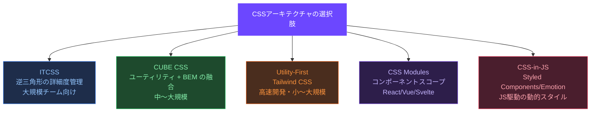

---

### 12.2 ITCSS（Inverted Triangle CSS）

Harry Roberts が考案した、**詳細度の低いものから高いものへ順に積み上げる**アーキテクチャです。

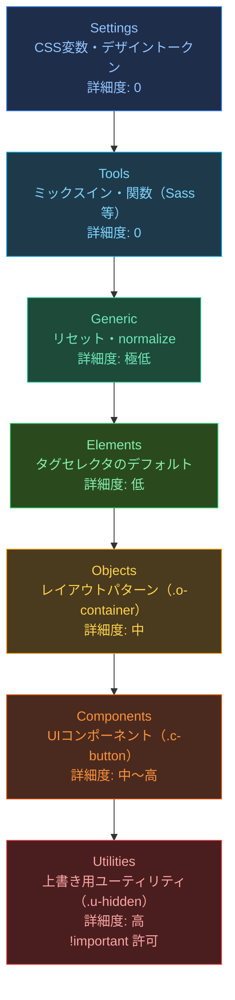

```text
project/
├── styles/
│   ├── 1-settings/
│   │   ├── _tokens.css          # デザイントークン
│   │   └── _breakpoints.css     # ブレークポイント定数
│   ├── 2-tools/
│   │   └── _mixins.scss         # Sass ミックスイン
│   ├── 3-generic/
│   │   ├── _reset.css           # CSS リセット
│   │   └── _box-sizing.css
│   ├── 4-elements/
│   │   ├── _base.css            # body, html のデフォルト
│   │   ├── _typography.css      # h1-h6, p, a のデフォルト
│   │   └── _forms.css           # input, button のデフォルト
│   ├── 5-objects/
│   │   ├── _container.css       # .o-container
│   │   ├── _grid.css            # .o-grid
│   │   └── _stack.css           # .o-stack
│   ├── 6-components/
│   │   ├── _button.css          # .c-button
│   │   ├── _card.css            # .c-card
│   │   └── _modal.css           # .c-modal
│   └── 7-utilities/
│       ├── _display.css         # .u-hidden, .u-sr-only
│       ├── _spacing.css         # .u-mt-4, .u-p-6
│       └── _text.css            # .u-text-center
└── main.css                     # 全ファイルを @import
```

---

### 12.3 CUBE CSS

Andy Bell が提案した、**Composition（構成）・Utility（ユーティリティ）・Block（ブロック）・Exception（例外）** の4層アーキテクチャです。

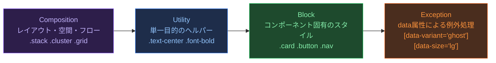

```html
<!-- CUBE CSS の実装例 -->
<a
  class="button | text-base font-medium"
  data-variant="primary"
  data-size="lg"
  href="/get-started"
>
  始める
</a>
<!-- | は Composition と Utility の境界を示す慣習 -->
```

```css
/* Block: コアスタイル */
.button {
  display: inline-flex;
  align-items: center;
  gap: var(--space-2);
  border-radius: var(--radius-md);
  cursor: pointer;
  transition: background var(--duration-fast) var(--ease-out);
}

/* Exception: data属性でバリアント管理 */
.button[data-variant="primary"] {
  background: var(--color-action-primary);
  color: var(--color-text-on-primary);
}

.button[data-variant="ghost"] {
  background: transparent;
  color: var(--color-action-primary);
}

.button[data-size="lg"] {
  height: var(--size-component-lg);
  padding-inline: var(--space-6);
  font-size: var(--font-size-base);
}
```

---

### 12.4 CSS Layers（@layer）

CSS Cascade Layers は、**詳細度の戦争を終わらせる**モダンCSSの仕組みです（2022年全ブラウザ対応）。

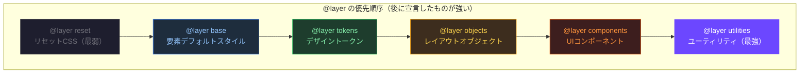

```css
/* ===== @layer の宣言（順序を最初に定義） ===== */
@layer reset, base, tokens, objects, components, utilities;

/* ===== 各レイヤーへの割り当て ===== */
@layer reset {
  *, *::before, *::after { box-sizing: border-box; }
  * { margin: 0; }
}

@layer tokens {
  :root {
    --color-primary: #6C47FF;
    --space-4: 16px;
  }
}

@layer components {
  .button {
    background: var(--color-primary);
    padding: var(--space-2) var(--space-4);
  }
}

@layer utilities {
  /* utilities は詳細度が低くても components に勝つ */
  .bg-transparent { background: transparent !important; }
  .hidden { display: none; }
}

/* ===== レイヤー外のスタイルは常に最強 ===== */
.override { color: red; } /* レイヤーに属さないので全レイヤーに勝つ */
```

---

### 12.5 アーキテクチャの選定指針

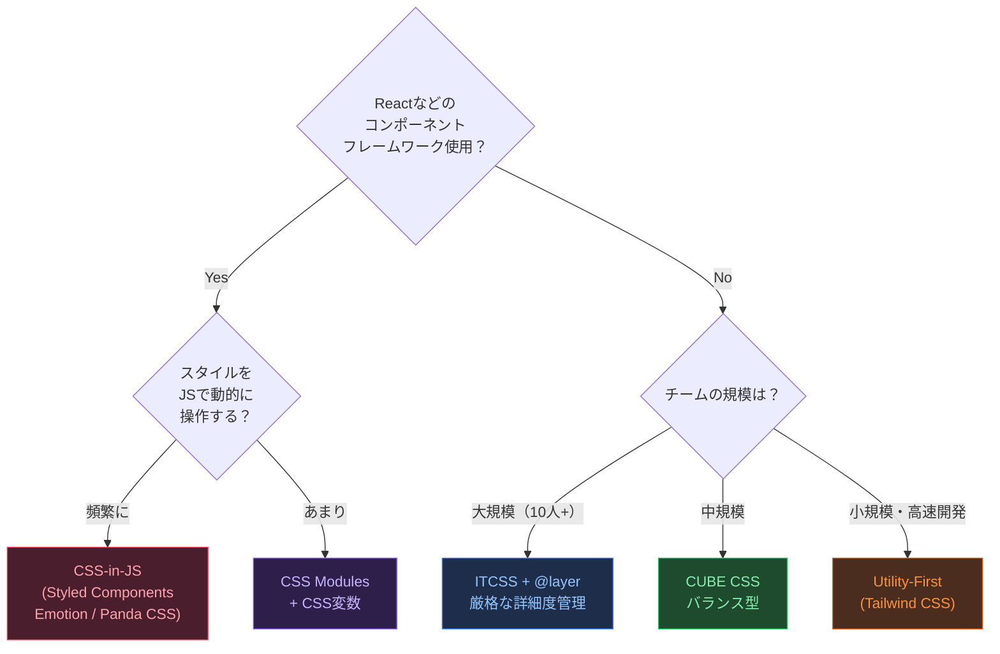

---

## 13. デザイントークン

### 13.1 デザイントークンとは

デザイントークンとは、**デザインの意思決定をプラットフォーム非依存の形式で保存したもの**です。
色・スペース・タイポグラフィなどをJSONで定義し、CSS・iOS・Android・Figmaに自動変換します。

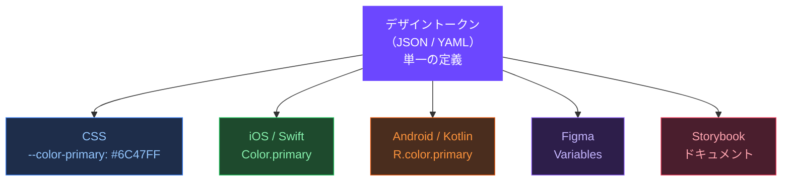

---

### 13.2 W3C Design Tokens 仕様

W3Cが標準化を進めるデザイントークンのJSON形式です。

```json
{
  "color": {
    "purple": {
      "50":  { "$value": "#f5f3ff", "$type": "color" },
      "500": { "$value": "#6C47FF", "$type": "color" },
      "900": { "$value": "#1e0a5c", "$type": "color" }
    },
    "action": {
      "primary": {
        "$value": "{color.purple.500}",
        "$type": "color",
        "$description": "メインのアクションカラー（ボタン・リンクなど）"
      }
    }
  },
  "spacing": {
    "4": { "$value": "16px", "$type": "dimension" },
    "6": { "$value": "24px", "$type": "dimension" }
  },
  "font-size": {
    "base": { "$value": "1rem", "$type": "dimension" },
    "lg":   { "$value": "1.125rem", "$type": "dimension" }
  },
  "duration": {
    "fast":   { "$value": "100ms", "$type": "duration" },
    "normal": { "$value": "200ms", "$type": "duration" }
  },
  "border-radius": {
    "md": { "$value": "8px",  "$type": "dimension" },
    "lg": { "$value": "12px", "$type": "dimension" }
  }
}
```

---

### 13.3 Style Dictionary による自動変換

Amazon が OSS で公開している Style Dictionary は、トークンのJSONから各プラットフォーム向けのファイルを自動生成します。

```javascript
// style-dictionary.config.js
import StyleDictionary from 'style-dictionary';

export default {
  source: ['tokens/**/*.json'],

  platforms: {
    /* CSS カスタムプロパティへの変換 */
    css: {
      transformGroup: 'css',
      prefix: '',
      buildPath: 'dist/css/',
      files: [
        {
          destination: 'tokens.css',
          format: 'css/variables',
          options: {
            selector: ':root',
            outputReferences: true,
          },
        },
      ],
    },

    /* JavaScript / TypeScript への変換 */
    js: {
      transformGroup: 'js',
      buildPath: 'dist/js/',
      files: [
        {
          destination: 'tokens.js',
          format: 'javascript/es6',
        },
        {
          destination: 'tokens.d.ts',
          format: 'typescript/es6-declarations',
        },
      ],
    },

    /* iOS Swift への変換 */
    ios: {
      transformGroup: 'ios-swift',
      buildPath: 'dist/ios/',
      files: [
        {
          destination: 'StyleDictionaryColor.swift',
          format: 'ios-swift/class.swift',
          filter: { attributes: { category: 'color' } },
        },
      ],
    },

    /* Android Compose への変換 */
    android: {
      transformGroup: 'android',
      buildPath: 'dist/android/',
      files: [
        {
          destination: 'tokens.xml',
          format: 'android/resources',
        },
      ],
    },
  },
};
```

```bash
# トークンのビルド
npx style-dictionary build --config style-dictionary.config.js
```

**生成されるCSSの例**

```css
/* dist/css/tokens.css（自動生成） */
:root {
  --color-purple-50: #f5f3ff;
  --color-purple-500: #6C47FF;
  --color-purple-900: #1e0a5c;
  --color-action-primary: var(--color-purple-500);
  --spacing-4: 16px;
  --spacing-6: 24px;
  --font-size-base: 1rem;
  --font-size-lg: 1.125rem;
  --duration-fast: 100ms;
  --duration-normal: 200ms;
  --border-radius-md: 8px;
  --border-radius-lg: 12px;
}
```

---

### 13.4 Figma Variables との連携

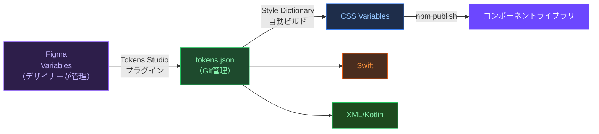

---

### 13.5 ベストプラクティス

#### ✅ トークンファイルをGitで管理し、変更を追跡する

```bash
tokens/
├── primitive/
│   ├── color.json       # カラースケール（生の値）
│   ├── spacing.json     # スペーシングスケール
│   └── typography.json  # タイポグラフィスケール
├── semantic/
│   ├── light.json       # ライトモードのセマンティック
│   └── dark.json        # ダークモードのセマンティック
└── component/
    ├── button.json      # ボタン固有トークン
    └── card.json        # カード固有トークン
```

#### ✅ セマンティックトークンは必ずプリミティブを参照する

```json
{
  "color": {
    "action": {
      "primary": {
        "$value": "{color.purple.500}",
        "$type": "color"
      }
    }
  }
}
```

---

## 14. 実践：完全なコンポーネント実装例

### 14.1 実装するコンポーネント

デザインシステムの考え方を集約した **Modal（モーダルダイアログ）コンポーネント** を、アクセシビリティ・アニメーション・BEM・トークンをすべて組み合わせて実装します。

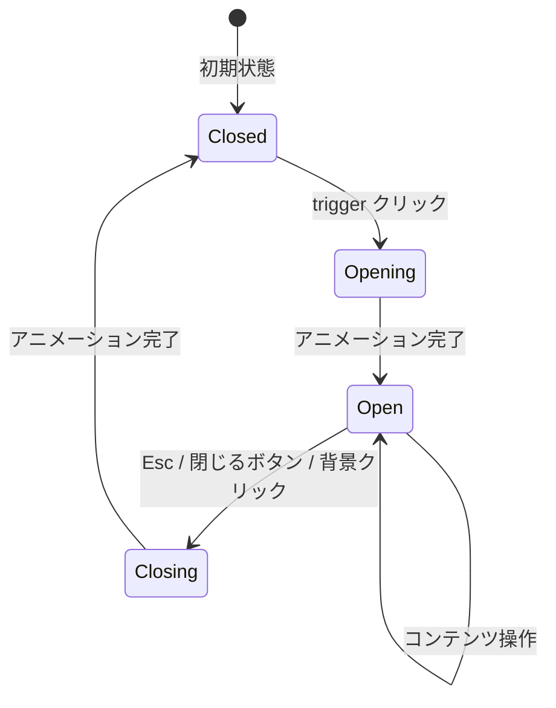

---

### 14.2 HTML 構造

```html
<!-- モーダルのHTML構造（セマンティック + ARIA） -->

<!-- トリガー -->
<button
  class="button button--primary"
  type="button"
  data-modal-trigger="confirm-modal"
>
  確認ダイアログを開く
</button>

<!-- モーダル本体 -->
<div
  id="confirm-modal"
  class="modal"
  role="dialog"
  aria-modal="true"
  aria-labelledby="modal-title"
  aria-describedby="modal-description"
  hidden
>
  <!-- 背景オーバーレイ -->
  <div class="modal__overlay" data-modal-close></div>

  <!-- ダイアログ本体 -->
  <div class="modal__dialog">
    <!-- ヘッダー -->
    <header class="modal__header">
      <h2 class="modal__title" id="modal-title">
        削除の確認
      </h2>
      <button
        class="modal__close"
        type="button"
        aria-label="ダイアログを閉じる"
        data-modal-close
      >
        <svg class="modal__close-icon" aria-hidden="true" focusable="false"
             viewBox="0 0 24 24" width="20" height="20">
          <path d="M18 6L6 18M6 6l12 12" stroke="currentColor"
                stroke-width="2" stroke-linecap="round"/>
        </svg>
      </button>
    </header>

    <!-- ボディ -->
    <div class="modal__body">
      <p class="modal__description" id="modal-description">
        このアイテムを削除しますか？この操作は元に戻せません。
      </p>
    </div>

    <!-- フッター -->
    <footer class="modal__footer">
      <button class="button button--secondary" type="button" data-modal-close>
        キャンセル
      </button>
      <button class="button button--danger" type="button" id="confirm-delete">
        削除する
      </button>
    </footer>
  </div>
</div>
```

---

### 14.3 CSS 実装（BEM + トークン）

```css
/* ===== Modal コンポーネント ===== */

/* --- Block --- */
.modal {
  /* アニメーション用のカスタムプロパティ */
  --modal-duration:  var(--duration-slow, 300ms);
  --modal-easing:    var(--ease-out, cubic-bezier(0, 0, 0.2, 1));

  /* 配置 */
  position: fixed;
  inset: 0; /* top: 0; right: 0; bottom: 0; left: 0 の短縮形 */
  z-index: 1000;
  display: grid;
  place-items: center;
  padding: var(--space-4);

  /* 初期状態 */
  opacity: 0;
  pointer-events: none;
  visibility: hidden;
  transition:
    opacity      var(--modal-duration) var(--modal-easing),
    visibility   0ms linear var(--modal-duration); /* 非表示は遅延させる */
}

/* 表示状態 */
.modal.is-open {
  opacity: 1;
  pointer-events: auto;
  visibility: visible;
  transition:
    opacity    var(--modal-duration) var(--modal-easing),
    visibility 0ms linear 0ms;
}

/* --- Elements --- */

/* オーバーレイ（背景） */
.modal__overlay {
  position: absolute;
  inset: 0;
  background: rgba(0, 0, 0, 0.5);
  backdrop-filter: blur(4px);
  cursor: pointer;
}

@media (prefers-reduced-motion: reduce) {
  .modal__overlay { backdrop-filter: none; }
}

/* ダイアログ本体 */
.modal__dialog {
  position: relative;
  z-index: 1; /* overlay の上に */
  width: min(100%, var(--container-sm, 480px)); /* 最大480px */
  background: var(--color-bg-surface);
  border-radius: var(--radius-xl, 16px);
  border: 1px solid var(--color-border-default);
  display: flex;
  flex-direction: column;
  max-height: calc(100svh - var(--space-8));
  overflow: hidden;

  /* 登場アニメーション */
  transform: translateY(16px) scale(0.97);
  transition:
    transform var(--modal-duration) var(--modal-easing);
}

.modal.is-open .modal__dialog {
  transform: translateY(0) scale(1);
}

@media (prefers-reduced-motion: reduce) {
  .modal__dialog {
    transform: none;
    transition: none;
  }
}

/* ヘッダー */
.modal__header {
  display: flex;
  align-items: flex-start;
  justify-content: space-between;
  gap: var(--space-4);
  padding: var(--space-6);
  border-bottom: 1px solid var(--color-border-default);
  flex-shrink: 0;
}

/* タイトル */
.modal__title {
  font-size: var(--font-size-xl, 1.25rem);
  font-weight: var(--font-weight-semibold, 600);
  line-height: var(--line-height-tight, 1.25);
  color: var(--color-text-primary);
}

/* 閉じるボタン */
.modal__close {
  display: inline-flex;
  align-items: center;
  justify-content: center;
  width: 32px;
  height: 32px;
  border: none;
  border-radius: var(--radius-md, 8px);
  background: transparent;
  color: var(--color-text-muted);
  cursor: pointer;
  flex-shrink: 0;
  transition: background var(--duration-fast) var(--ease-out);
}

.modal__close:hover { background: var(--color-bg-overlay); }

.modal__close:focus-visible {
  outline: 2px solid var(--color-border-focus);
  outline-offset: 2px;
}

/* ボディ */
.modal__body {
  padding: var(--space-6);
  overflow-y: auto;
  flex: 1;
}

.modal__description {
  color: var(--color-text-secondary);
  line-height: var(--line-height-relaxed, 1.7);
}

/* フッター */
.modal__footer {
  display: flex;
  align-items: center;
  justify-content: flex-end;
  gap: var(--space-3);
  padding: var(--space-4) var(--space-6);
  border-top: 1px solid var(--color-border-default);
  flex-shrink: 0;
}
```

---

### 14.4 JavaScript 実装（アクセシブル）

```javascript
/* ===== Modal コントローラー ===== */
class Modal {
  #modal;
  #trigger;
  #focusableElements;
  #previouslyFocused;

  constructor(modalId) {
    this.#modal   = document.getElementById(modalId);
    this.#trigger = document.querySelector(`[data-modal-trigger="${modalId}"]`);

    if (!this.#modal || !this.#trigger) return;
    this.#init();
  }

  #init() {
    /* トリガーに開くイベント */
    this.#trigger.addEventListener('click', () => this.open());

    /* 閉じるボタン・オーバーレイに閉じるイベント */
    this.#modal.querySelectorAll('[data-modal-close]').forEach(el => {
      el.addEventListener('click', () => this.close());
    });

    /* Esc キーで閉じる */
    this.#modal.addEventListener('keydown', (e) => {
      if (e.key === 'Escape') this.close();
      if (e.key === 'Tab')    this.#trapFocus(e);
    });
  }

  open() {
    /* フォーカス位置を記憶 */
    this.#previouslyFocused = document.activeElement;

    /* hidden 属性を外してから表示アニメーション */
    this.#modal.removeAttribute('hidden');
    this.#modal.removeAttribute('aria-hidden');

    /* 次のフレームでクラス付与（アニメーションのため） */
    requestAnimationFrame(() => {
      this.#modal.classList.add('is-open');
    });

    /* フォーカスをモーダル内の最初の要素へ */
    this.#getFocusableElements();
    this.#focusableElements[0]?.focus();

    /* body のスクロールを止める */
    document.body.style.overflow = 'hidden';
  }

  close() {
    this.#modal.classList.remove('is-open');

    /* アニメーション完了後に非表示 */
    const duration = getComputedStyle(this.#modal)
      .getPropertyValue('--modal-duration').trim();
    const ms = parseFloat(duration) * (duration.endsWith('s') && !duration.endsWith('ms') ? 1000 : 1);

    setTimeout(() => {
      this.#modal.setAttribute('hidden', '');
      this.#modal.setAttribute('aria-hidden', 'true');
      document.body.style.overflow = '';

      /* フォーカスを元の場所に戻す */
      this.#previouslyFocused?.focus();
    }, ms);
  }

  #getFocusableElements() {
    this.#focusableElements = [
      ...this.#modal.querySelectorAll(
        'a[href], button:not([disabled]), textarea, input, select, [tabindex]:not([tabindex="-1"])'
      ),
    ];
  }

  #trapFocus(e) {
    if (!this.#focusableElements.length) return;
    const first = this.#focusableElements[0];
    const last  = this.#focusableElements[this.#focusableElements.length - 1];

    if (e.shiftKey && document.activeElement === first) {
      last.focus();
      e.preventDefault();
    } else if (!e.shiftKey && document.activeElement === last) {
      first.focus();
      e.preventDefault();
    }
  }
}

/* 初期化 */
const confirmModal = new Modal('confirm-modal');
```

---

## 15. パフォーマンス最適化

### 15.1 CSS パフォーマンスの基礎

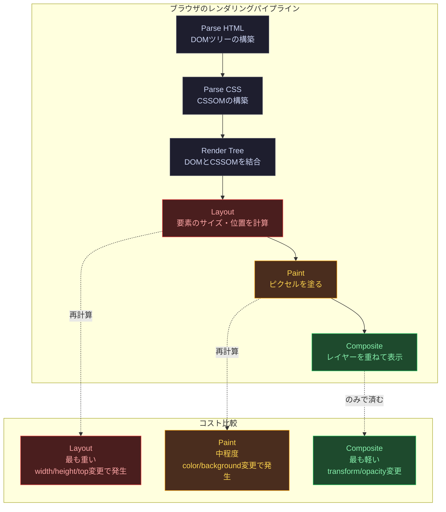

---

### 15.2 クリティカルCSS

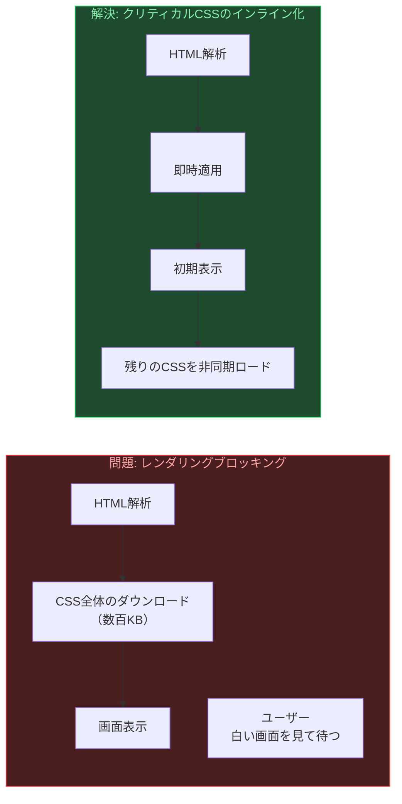

```html
<!-- クリティカルCSSのインライン化 -->
<head>
  <!-- Above the fold のCSSをインラインに -->
  <style>
    /* ファーストビューに必要なスタイルのみ */
    :root { --color-bg-base: #fafafa; --color-text-primary: #18181b; }
    body { font-family: system-ui, sans-serif; background: var(--color-bg-base); margin: 0; }
    .header { display: flex; align-items: center; height: 64px; padding: 0 24px; }
    .hero { padding: 80px 24px; text-align: center; }
  </style>

  <!-- 残りのCSSは非同期ロード -->
  <link
    rel="preload"
    href="/styles/main.css"
    as="style"
    onload="this.onload=null;this.rel='stylesheet'"
  >
  <noscript><link rel="stylesheet" href="/styles/main.css"></noscript>
</head>
```

---

### 15.3 CSS のロード最適化

```html
<!-- ===== フォントのプリロード ===== -->
<head>
  <!-- 使用するフォントファイルを事前にロード -->
  <link rel="preload" href="/fonts/Inter-var.woff2" as="font" type="font/woff2" crossorigin>
  <link rel="preload" href="/fonts/NotoSansJP-Regular.woff2" as="font" type="font/woff2" crossorigin>
</head>

<!-- ===== メディアクエリで条件ロード ===== -->
<link rel="stylesheet" href="print.css" media="print">
<link rel="stylesheet" href="mobile.css" media="(max-width: 768px)">
```

```css
/* ===== @font-face の最適化 ===== */
@font-face {
  font-family: 'Inter';
  /* woff2 のみ（全モダンブラウザ対応） */
  src: url('/fonts/Inter-var.woff2') format('woff2');
  /* 可変フォント: 1ファイルで複数ウェイトをカバー */
  font-weight: 100 900;
  font-style: normal;
  font-display: swap;      /* FLASHを防ぎ、FLOUTを許容 */
  unicode-range: U+0000-00FF, U+0131; /* 使用する文字範囲のみ */
}

/* ===== contain プロパティ: ブラウザの最適化ヒント ===== */
.widget {
  /* このコンテナの変更が外部のレイアウトに影響しないことを宣言 */
  contain: layout style;
}

.card-list {
  contain: strict; /* layout + style + paint + size */
}

/* ===== content-visibility: 画面外要素のレンダリングをスキップ ===== */
.article-card {
  content-visibility: auto;              /* 画面外はレンダリングスキップ */
  contain-intrinsic-size: auto 400px;   /* スキップ時の推定サイズ（レイアウトシフト防止） */
}
```

---

### 15.4 CSS セレクタのパフォーマンス

```css
/* ===== セレクタの効率（右から左に読む） ===== */

/* NG: 右端が広すぎるセレクタ（多くの要素にマッチして走査が重い） */
.page .content * { color: inherit; }        /* * は全要素にマッチ */
.sidebar div + div { margin-top: 8px; }     /* 全 div を走査 */
.header ul li a { color: var(--link); }     /* 深いネスト */

/* OK: 具体的なクラスセレクタ（マッチが速い） */
.sidebar__item { margin-top: 8px; }
.nav__link { color: var(--link); }

/* ===== :is() / :where() で冗長な繰り返しを排除 ===== */

/* NG: 同じスタイルの繰り返し */
h1, h2, h3, h4, h5, h6 { font-weight: 600; }

/* OK: :is() でまとめる（詳細度は引数の中で最も高いもの） */
:is(h1, h2, h3, h4, h5, h6) { font-weight: 600; }

/* :where() は詳細度0のため上書きしやすい */
:where(h1, h2, h3, h4, h5, h6) { font-weight: 600; }
```

---

### 15.5 CSS バンドルサイズの最適化

```javascript
/* ===== PurgeCSS: 未使用CSSの削除 ===== */
// postcss.config.js
export default {
  plugins: {
    '@fullhuman/postcss-purgecss': {
      content: [
        './src/**/*.html',
        './src/**/*.jsx',
        './src/**/*.tsx',
        './src/**/*.vue',
      ],
      defaultExtractor: (content) =>
        content.match(/[\w-/:]+(?<!:)/g) || [],
      /* セーフリスト: 動的に追加されるクラスは削除しない */
      safelist: {
        standard: ['is-open', 'is-loading', 'is-error'],
        patterns: [/^animate-/, /^modal/],
      },
    },
  },
};
```

```javascript
/* ===== CSS の圧縮（Lightning CSS / cssnano） ===== */
// vite.config.js
import { defineConfig } from 'vite';

export default defineConfig({
  css: {
    transformer: 'lightningcss',    /* Rust製の超高速CSS処理ツール */
    lightningcss: {
      minify: true,
      browserslist: 'last 2 versions, > 1%',
    },
  },
  build: {
    cssMinify: 'lightningcss',
  },
});
```

---

### 15.6 Core Web Vitals との関係

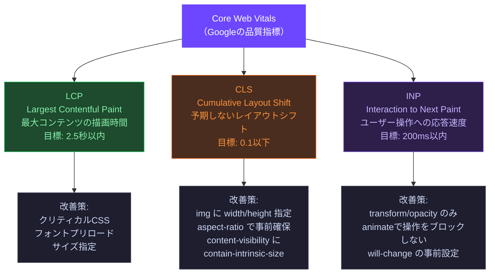

```css
/* ===== CLS 対策: 画像に必ずサイズを指定 ===== */
img {
  /* width と height 属性（HTML側）を指定すると
     aspect-ratio が自動計算される */
  aspect-ratio: attr(width) / attr(height); /* モダンブラウザ */
  width: 100%;
  height: auto;
}

/* ===== CLS 対策: カスタムフォントのレイアウトシフト軽減 ===== */
/* size-adjust で代替フォントのサイズを本番フォントに近づける */
@font-face {
  font-family: 'InterFallback';
  src: local('Arial');
  size-adjust: 107%;       /* InterとArialのサイズ差を調整 */
  ascent-override: 90%;
  descent-override: 22%;
  line-gap-override: 0%;
}
```

---

## 16. ツール・エコシステム

### 16.1 ツールの全体像

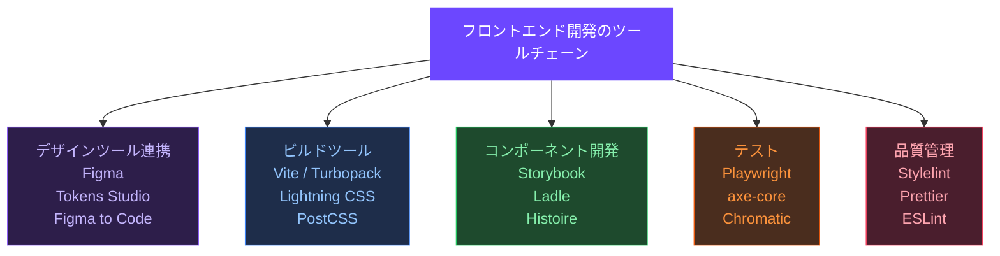

---

### 16.2 Storybook：コンポーネントカタログ

```javascript
// Button.stories.jsx
import { Button } from './Button';

/* メタ情報 */
export default {
  title: 'Components/Button',
  component: Button,
  parameters: {
    layout: 'centered',
    docs: {
      description: {
        component: 'ユーザーのアクションを起動するためのインタラクティブ要素。',
      },
    },
  },
  /* コントロール（UIでプロパティを変更できる） */
  argTypes: {
    variant: {
      control: { type: 'select' },
      options: ['primary', 'secondary', 'ghost', 'danger'],
    },
    size: {
      control: { type: 'radio' },
      options: ['sm', 'md', 'lg'],
    },
    disabled: { control: 'boolean' },
    loading:  { control: 'boolean' },
  },
};

/* 個別のストーリー */
export const Primary = {
  args: { variant: 'primary', size: 'md', children: '送信する' },
};

export const Danger = {
  args: { variant: 'danger', size: 'md', children: '削除する' },
};

export const Loading = {
  args: { variant: 'primary', size: 'md', loading: true, children: '処理中...' },
};

/* すべてのバリアントを一覧表示 */
export const AllVariants = {
  render: () => (
    <div style={{ display: 'flex', gap: '12px', flexWrap: 'wrap' }}>
      {['primary', 'secondary', 'ghost', 'danger'].map(variant =>
        ['sm', 'md', 'lg'].map(size => (
          <Button key={`${variant}-${size}`} variant={variant} size={size}>
            {variant} / {size}
          </Button>
        ))
      )}
    </div>
  ),
};
```

---

### 16.3 PostCSS：CSSのトランスパイル

```javascript
// postcss.config.js
export default {
  plugins: [
    /* ===== 構文拡張 ===== */
    'postcss-import',          // @import を解決してバンドル
    'postcss-nesting',         // CSS Nesting（W3C仕様）をサポート

    /* ===== 互換性 ===== */
    'autoprefixer',            // ベンダープレフィックスを自動付与
    'postcss-preset-env',      // モダンCSSを古いブラウザ向けに変換

    /* ===== 最適化 ===== */
    'cssnano',                 // CSSの圧縮・最適化（本番ビルドのみ）
  ],
};
```

```css
/* postcss-nesting の使用例（W3C CSS Nesting に準拠） */
.card {
  background: var(--color-bg-surface);
  border-radius: var(--radius-lg);

  /* ネストされたセレクタ */
  & .card__title {
    font-size: var(--font-size-xl);
  }

  &:hover {
    border-color: var(--color-action-primary);
  }

  /* メディアクエリもネスト可能 */
  @media (min-width: 768px) {
    display: grid;
    grid-template-columns: 200px 1fr;
  }
}
```

---

### 16.4 Stylelint：CSSのLint

```javascript
// .stylelintrc.json
{
  "extends": [
    "stylelint-config-standard",          // 標準ルール
    "stylelint-config-recommended-scss"   // SCSSを使う場合
  ],
  "plugins": [
    "stylelint-order"                     // プロパティの並び順チェック
  ],
  "rules": {
    /* ===== 命名規則 ===== */
    "selector-class-pattern": [
      "^[a-z][a-z0-9]*(__[a-z][a-z0-9]*)?(--[a-z][a-z0-9]*)?$",
      { "message": "BEM 命名規則に従ってください" }
    ],
    "custom-property-pattern": "^[a-z][a-z0-9-]*$",

    /* ===== マジックナンバーの禁止 ===== */
    "declaration-property-value-disallowed-list": {
      "/.*/": ["#[0-9a-fA-F]{3,8}"],
      "message": "カスタムプロパティを使用してください（ハードコードされた色は禁止）"
    },

    /* ===== プロパティの並び順 ===== */
    "order/properties-order": [
      "display", "flex-direction", "align-items", "justify-content", "gap",
      "grid-template-columns", "grid-template-rows",
      "position", "top", "right", "bottom", "left", "z-index",
      "width", "min-width", "max-width", "height", "min-height", "max-height",
      "padding", "padding-block", "padding-inline",
      "margin", "margin-block", "margin-inline",
      "border", "border-radius",
      "background", "color",
      "font-size", "font-weight", "line-height",
      "transition", "animation"
    ],

    /* ===== その他 ===== */
    "no-descending-specificity": true,
    "color-no-invalid-hex": true,
    "shorthand-property-no-redundant-values": true
  }
}
```

---

### 16.5 Chromatic：ビジュアルリグレッションテスト

```javascript
// .github/workflows/chromatic.yml（抜粋）

// package.json のスクリプト
{
  "scripts": {
    "chromatic": "chromatic --project-token=$CHROMATIC_PROJECT_TOKEN",
    "test:storybook": "test-storybook --url http://localhost:6006"
  }
}
```

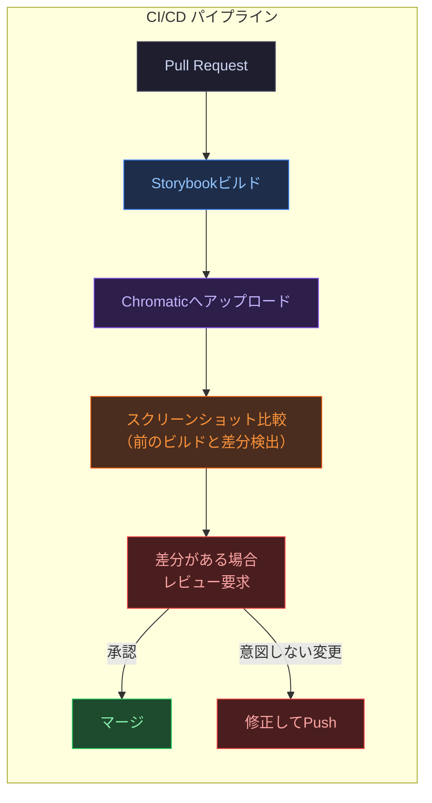

---

### 16.6 ツールの推奨スタック

```mermaid
graph TD
    subgraph STARTER["スターターセット（小〜中規模）"]
        S1["Vite\nビルドツール"] --> S2["Tailwind CSS\nユーティリティCSS"] --> S3["Storybook\nコンポーネントカタログ"] --> S4["Stylelint\nLint"]
    end

    subgraph PRO["プロセット（中〜大規模）"]
        P1["Turborepo\nモノレポ管理"] --> P2["CSS Modules\n+ CSS変数"] --> P3["Style Dictionary\nトークン変換"] --> P4["Chromatic\nビジュアルテスト"] --> P5["axe-core\na11yテスト"]
    end

    subgraph ENTERPRISE["エンタープライズ"]
        E1["Nx\nモノレポ"] --> E2["Panda CSS\nCSS-in-JS型安全"] --> E3["Zeroheight\nデザインドキュメント"] --> E4["Tokens Studio\nFigma連携"] --> E5["Playwright\nE2Eテスト"]
    end

    style STARTER fill:#1e4a2d,stroke:#22c55e,color:#86efac
    style PRO fill:#1e2d4a,stroke:#3b82f6,color:#93c5fd
    style ENTERPRISE fill:#2d1e4a,stroke:#8b5cf6,color:#c4b5fd
```

---

## 全体まとめ：デザインシステムの成熟度モデル

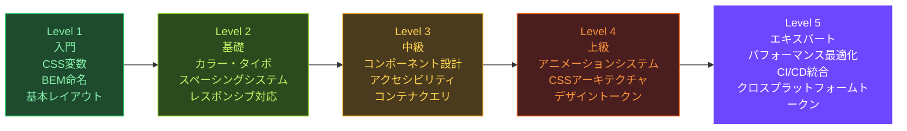

---

## 参考リソース

### アニメーション・トランジション

- **MDN - CSS Transitions** — https://developer.mozilla.org/ja/docs/Web/CSS/CSS_transitions
- **MDN - CSS Animations** — https://developer.mozilla.org/ja/docs/Web/CSS/CSS_animations
- **MDN - View Transitions API** — https://developer.mozilla.org/en-US/docs/Web/API/View_Transitions_API
- **Material Design 3 - Motion** — https://m3.material.io/styles/motion/overview
- **Google web.dev - Animations Guide** — https://web.dev/articles/animations-guide
- **CSS Tricks - Animation Performance** — https://css-tricks.com/css-animation-tricks/

### CSSアーキテクチャ

- **ITCSS（Harry Roberts）** — https://www.creativebloq.com/web-design/manage-large-css-projects-itcss-101517528
- **CUBE CSS（Andy Bell）** — https://cube.fyi/
- **CSS Cascade Layers（MDN）** — https://developer.mozilla.org/ja/docs/Web/CSS/@layer
- **Cascade Layers（Miriam Suzanne）** — https://www.smashingmagazine.com/2022/01/new-layer-tools-for-css/

### デザイントークン

- **W3C Design Tokens 仕様** — https://tr.designtokens.org/format/
- **Style Dictionary（Amazon）** — https://amzn.github.io/style-dictionary/
- **Tokens Studio for Figma** — https://tokens.studio/
- **Theo（Salesforce）** — https://github.com/salesforce-ux/theo

### パフォーマンス最適化

- **web.dev - Core Web Vitals** — https://web.dev/articles/vitals
- **MDN - content-visibility** — https://developer.mozilla.org/en-US/docs/Web/CSS/content-visibility
- **web.dev - CSS Performance** — https://web.dev/articles/fast#optimize_your_css
- **Lightning CSS** — https://lightningcss.dev/
- **Google - Eliminate render-blocking resources** — https://developer.chrome.com/docs/lighthouse/performance/render-blocking-resources
- **web.dev - font-display** — https://web.dev/articles/font-display
- **PurgeCSS** — https://purgecss.com/

### ツール・エコシステム

- **Storybook 公式** — https://storybook.js.org/
- **PostCSS 公式** — https://postcss.org/
- **Stylelint 公式** — https://stylelint.io/
- **Chromatic（ビジュアルテスト）** — https://www.chromatic.com/
- **axe DevTools** — https://www.deque.com/axe/
- **Vite 公式** — https://vitejs.dev/
- **Turborepo（Vercel）** — https://turbo.build/repo
- **Panda CSS** — https://panda-css.com/
- **Zeroheight（デザインドキュメント）** — https://zeroheight.com/
