# 🌐 API-First設計 完全ガイド

## 📚 目次

1. [API-Firstとは何か？](#1-api-firstとは何か)
2. [API-Firstの開発フロー](#2-api-firstの開発フロー)
3. [OpenAPI（Swagger）仕様の完全解説](#3-openapiswagger仕様の完全解説)
4. [RESTful API設計原則](#4-restful-api設計原則)
5. [APIのバージョニング戦略](#5-apiのバージョニング戦略)
6. [認証・認可の設計](#6-認証認可の設計)
7. [エラーハンドリングの設計](#7-エラーハンドリングの設計)
8. [APIのページネーション・フィルタリング](#8-apiのページネーションフィルタリング)
9. [APIゲートウェイパターン](#9-apiゲートウェイパターン)
10. [APIのテスト戦略](#10-apiのテスト戦略)
11. [APIドキュメントとDeveloper Experience](#11-apiドキュメントとdeveloper-experience)
12. [GraphQL vs REST vs gRPC 比較](#12-graphql-vs-rest-vs-grpc-比較)
13. [API-First実践：ECサイト完全事例](#13-api-first実践ecサイト完全事例)
14. [API-Firstのベストプラクティス総まとめ](#14-api-firstのベストプラクティス総まとめ)
15. [API-Firstのアンチパターン](#15-api-firstのアンチパターン)
16. [参考文献・ソース一覧](#16-参考文献ソース一覧)

---

## 1. API-Firstとは何か？

### 1.1 API-Firstの定義

**API-First（APIファースト）** とは、ソフトウェア開発において**実装より先にAPIの設計・仕様を確定させ、その仕様を中心にフロントエンド・バックエンドの開発を並行して進める**アプローチです。

> 💡 **核心思想：**「APIは製品である。コードを書く前に、APIという"契約"を設計し、全チームがその契約に合意してから開発をはじめる」

### 1.2 従来の開発 vs API-First

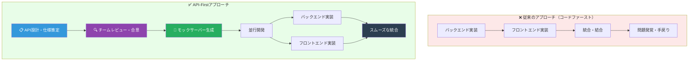

### 1.3 API-Firstが解決する問題

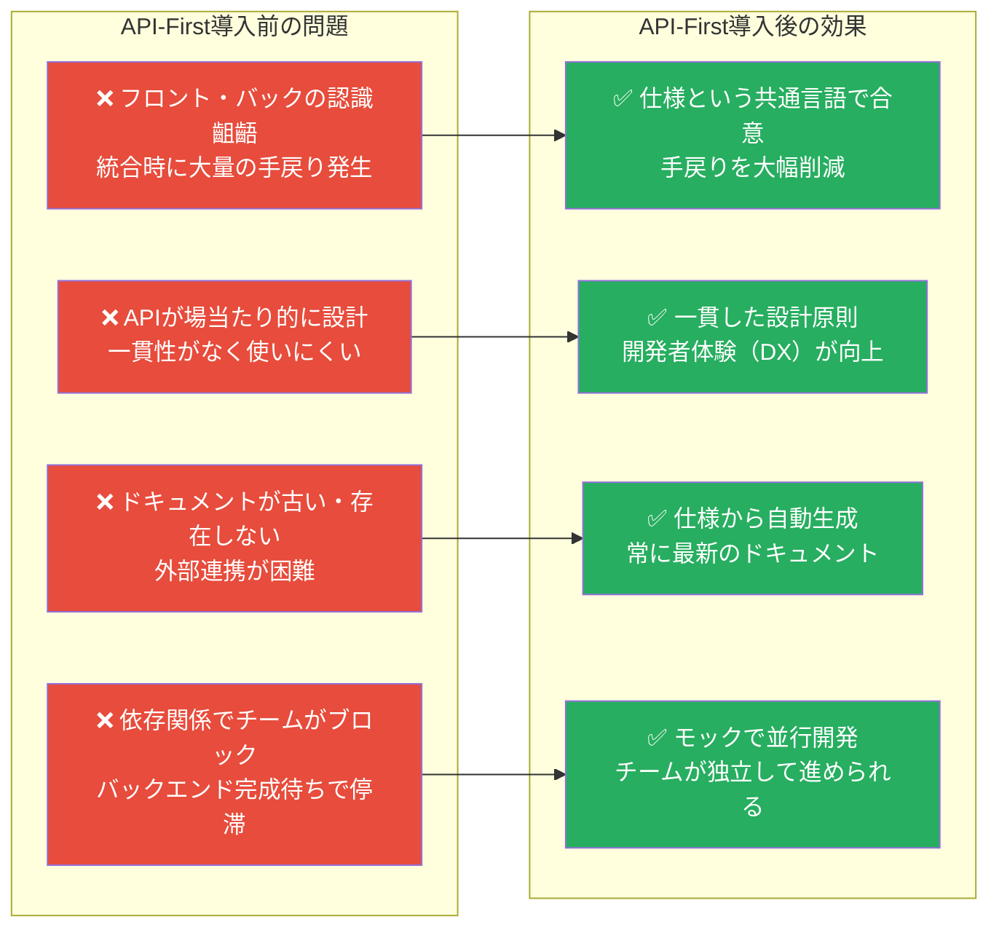

### 1.4 API-Firstが適しているケース

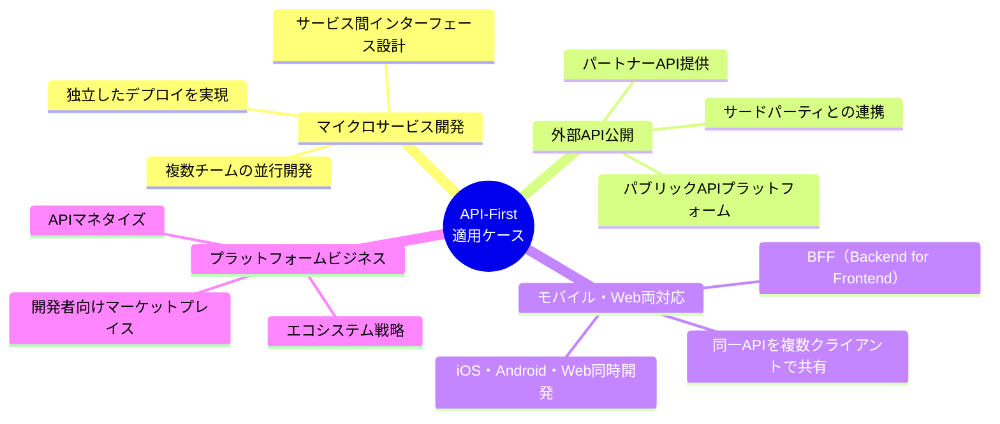

---

## 2. API-Firstの開発フロー

### 2.1 API-First開発の全体プロセス

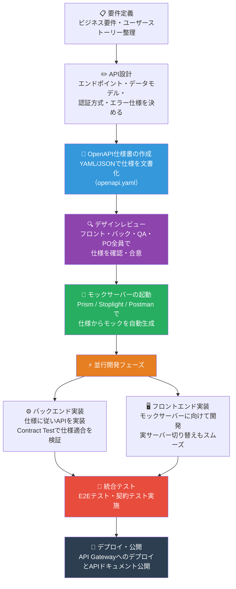

### 2.2 API設計フェーズの詳細ステップ

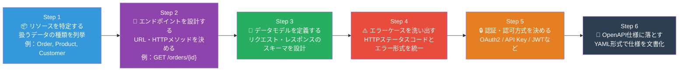

### 2.3 モックサーバーを使った並行開発

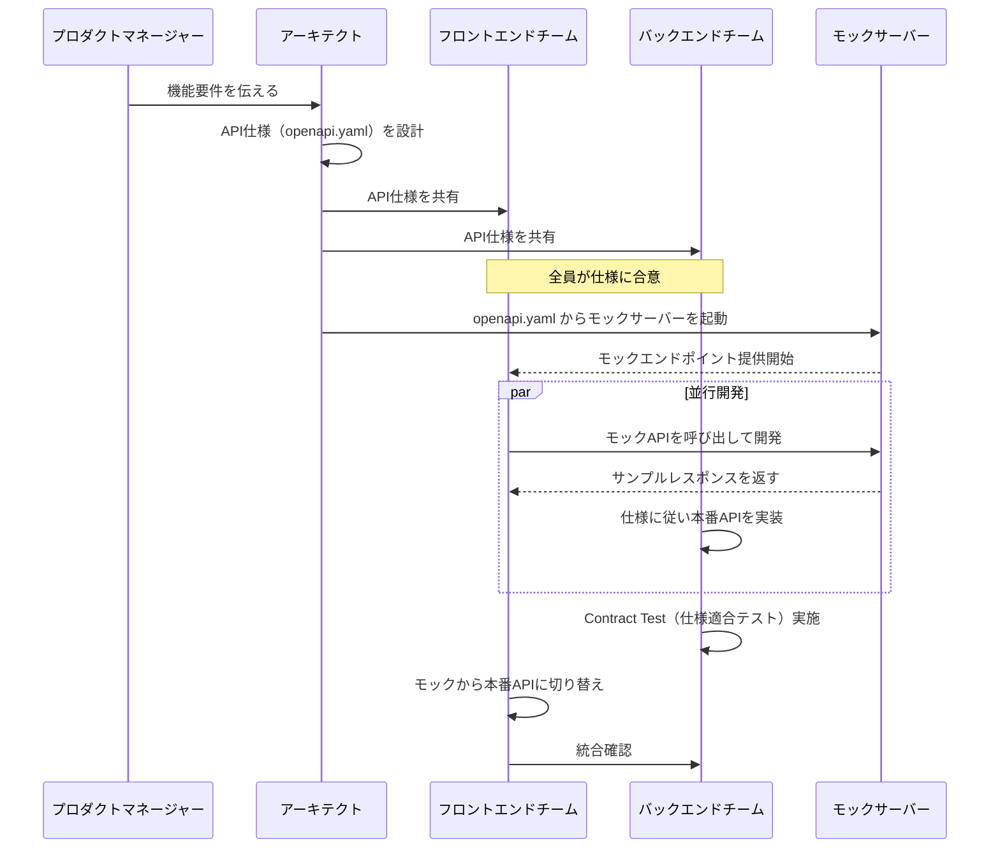

---

## 3. OpenAPI（Swagger）仕様の完全解説

### 3.1 OpenAPI仕様の構造

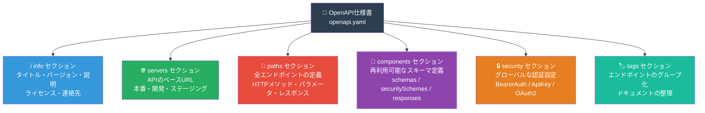

### 3.2 OpenAPI仕様の完全記述例（ECサイト注文API）

```yaml
openapi: 3.1.0
info:
  title: ECサイト 注文管理API
  version: 2.0.0
  description: |
    ECサイトの注文管理に関するAPI仕様です。
    注文の作成・取得・キャンセルを提供します。
  contact:
    name: APIサポートチーム
    email: api-support@example.com
    url: https://developer.example.com/support
  license:
    name: Apache 2.0
    url: https://www.apache.org/licenses/LICENSE-2.0

servers:
  - url: https://api.example.com/v2
    description: 本番環境
  - url: https://api-staging.example.com/v2
    description: ステージング環境
  - url: http://localhost:8080/v2
    description: ローカル開発環境

tags:
  - name: orders
    description: 注文管理
  - name: products
    description: 商品管理

security:
  - BearerAuth: []

paths:
  /orders:
    get:
      tags: [orders]
      summary: 注文一覧取得
      operationId: listOrders
      parameters:
        - name: status
          in: query
          schema:
            type: string
            enum: [pending, confirmed, shipped, delivered, cancelled]
          description: 注文ステータスでフィルタリング
        - name: page
          in: query
          schema:
            type: integer
            minimum: 1
            default: 1
        - name: per_page
          in: query
          schema:
            type: integer
            minimum: 1
            maximum: 100
            default: 20
      responses:
        "200":
          description: 注文一覧取得成功
          content:
            application/json:
              schema:
                $ref: "#/components/schemas/OrderListResponse"
        "401":
          $ref: "#/components/responses/Unauthorized"

    post:
      tags: [orders]
      summary: 注文作成
      operationId: createOrder
      requestBody:
        required: true
        content:
          application/json:
            schema:
              $ref: "#/components/schemas/CreateOrderRequest"
            example:
              customer_id: "cust_12345"
              items:
                - product_id: "prod_001"
                  quantity: 2
                - product_id: "prod_002"
                  quantity: 1
              shipping_address:
                postal_code: "150-0001"
                prefecture: "東京都"
                city: "渋谷区"
                street: "神宮前1-1-1"
      responses:
        "201":
          description: 注文作成成功
          content:
            application/json:
              schema:
                $ref: "#/components/schemas/Order"
        "400":
          $ref: "#/components/responses/BadRequest"
        "422":
          $ref: "#/components/responses/UnprocessableEntity"

  /orders/{order_id}:
    get:
      tags: [orders]
      summary: 注文詳細取得
      operationId: getOrder
      parameters:
        - name: order_id
          in: path
          required: true
          schema:
            type: string
          description: 注文ID
      responses:
        "200":
          description: 注文取得成功
          content:
            application/json:
              schema:
                $ref: "#/components/schemas/Order"
        "404":
          $ref: "#/components/responses/NotFound"

    delete:
      tags: [orders]
      summary: 注文キャンセル
      operationId: cancelOrder
      parameters:
        - name: order_id
          in: path
          required: true
          schema:
            type: string
      requestBody:
        required: true
        content:
          application/json:
            schema:
              type: object
              required: [reason]
              properties:
                reason:
                  type: string
                  description: キャンセル理由
      responses:
        "200":
          description: キャンセル成功
          content:
            application/json:
              schema:
                $ref: "#/components/schemas/Order"
        "409":
          $ref: "#/components/responses/Conflict"

components:
  securitySchemes:
    BearerAuth:
      type: http
      scheme: bearer
      bearerFormat: JWT

  schemas:
    Order:
      type: object
      required: [id, customer_id, status, total_amount, created_at]
      properties:
        id:
          type: string
          example: "order_abc123"
        customer_id:
          type: string
          example: "cust_12345"
        status:
          type: string
          enum: [pending, confirmed, shipped, delivered, cancelled]
        items:
          type: array
          items:
            $ref: "#/components/schemas/OrderItem"
        total_amount:
          type: integer
          description: 合計金額（円）
          example: 15000
        created_at:
          type: string
          format: date-time
          example: "2024-01-15T10:30:00Z"

    OrderItem:
      type: object
      required: [product_id, product_name, quantity, unit_price]
      properties:
        product_id:
          type: string
        product_name:
          type: string
        quantity:
          type: integer
          minimum: 1
        unit_price:
          type: integer

    CreateOrderRequest:
      type: object
      required: [customer_id, items, shipping_address]
      properties:
        customer_id:
          type: string
        items:
          type: array
          minItems: 1
          items:
            type: object
            required: [product_id, quantity]
            properties:
              product_id:
                type: string
              quantity:
                type: integer
                minimum: 1
        shipping_address:
          $ref: "#/components/schemas/Address"

    Address:
      type: object
      required: [postal_code, prefecture, city, street]
      properties:
        postal_code:
          type: string
          pattern: "^\\d{3}-\\d{4}$"
          example: "150-0001"
        prefecture:
          type: string
        city:
          type: string
        street:
          type: string

    OrderListResponse:
      type: object
      properties:
        data:
          type: array
          items:
            $ref: "#/components/schemas/Order"
        pagination:
          $ref: "#/components/schemas/Pagination"

    Pagination:
      type: object
      properties:
        total:
          type: integer
        page:
          type: integer
        per_page:
          type: integer
        total_pages:
          type: integer

    ErrorResponse:
      type: object
      required: [error]
      properties:
        error:
          type: object
          required: [code, message]
          properties:
            code:
              type: string
              example: "VALIDATION_ERROR"
            message:
              type: string
              example: "リクエストの形式が正しくありません"
            details:
              type: array
              items:
                type: object
                properties:
                  field:
                    type: string
                  message:
                    type: string

  responses:
    BadRequest:
      description: リクエスト不正
      content:
        application/json:
          schema:
            $ref: "#/components/schemas/ErrorResponse"
    Unauthorized:
      description: 認証エラー
      content:
        application/json:
          schema:
            $ref: "#/components/schemas/ErrorResponse"
    NotFound:
      description: リソースが存在しない
      content:
        application/json:
          schema:
            $ref: "#/components/schemas/ErrorResponse"
    Conflict:
      description: リソースの状態が操作を許可しない
      content:
        application/json:
          schema:
            $ref: "#/components/schemas/ErrorResponse"
    UnprocessableEntity:
      description: ビジネスルール違反
      content:
        application/json:
          schema:
            $ref: "#/components/schemas/ErrorResponse"
```

---

## 4. RESTful API設計原則

### 4.1 HTTPメソッドとCRUD操作のマッピング

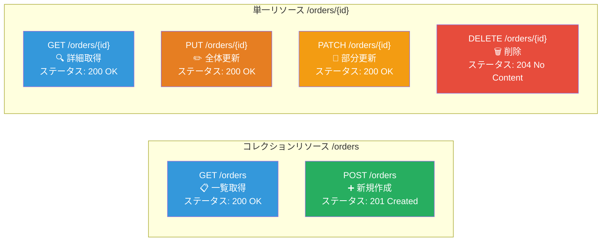

### 4.2 HTTPステータスコードの体系

```mermaid
graph TD
    STATUS["HTTPステータスコード"]

    STATUS --> S2XX["✅ 2xx 成功系"]
    STATUS --> S3XX["↩️ 3xx リダイレクト系"]
    STATUS --> S4XX["⚠️ 4xx クライアントエラー系"]
    STATUS --> S5XX["🔥 5xx サーバーエラー系"]

    S2XX --> SC200["200 OK<br>取得・更新成功"]
    S2XX --> SC201["201 Created<br>新規作成成功"]
    S2XX --> SC202["202 Accepted<br>非同期処理受付"]
    S2XX --> SC204["204 No Content<br>削除成功"]

    S3XX --> SC301["301 Moved Permanently<br>恒久的リダイレクト"]
    S3XX --> SC304["304 Not Modified<br>キャッシュ有効"]

    S4XX --> SC400["400 Bad Request<br>リクエスト形式不正"]
    S4XX --> SC401["401 Unauthorized<br>認証が必要"]
    S4XX --> SC403["403 Forbidden<br>権限なし"]
    S4XX --> SC404["404 Not Found<br>リソースなし"]
    S4XX --> SC409["409 Conflict<br>状態競合"]
    S4XX --> SC422["422 Unprocessable Entity<br>ビジネスルール違反"]
    S4XX --> SC429["429 Too Many Requests<br>レート制限超過"]

    S5XX --> SC500["500 Internal Server Error<br>サーバー内部エラー"]
    S5XX --> SC502["502 Bad Gateway<br>上流サービスエラー"]
    S5XX --> SC503["503 Service Unavailable<br>サービス利用不可"]

    style S2XX fill:#27ae60,color:#fff
    style S3XX fill:#3498db,color:#fff
    style S4XX fill:#e67e22,color:#fff
    style S5XX fill:#e74c3c,color:#fff
```

### 4.3 URLの設計ルールとベストプラクティス

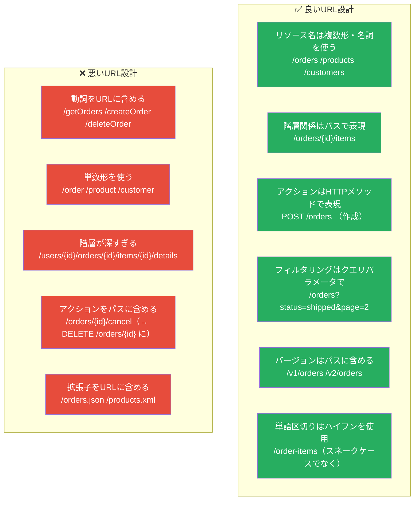

### 4.4 REST成熟度モデル（Richardson Maturity Model）

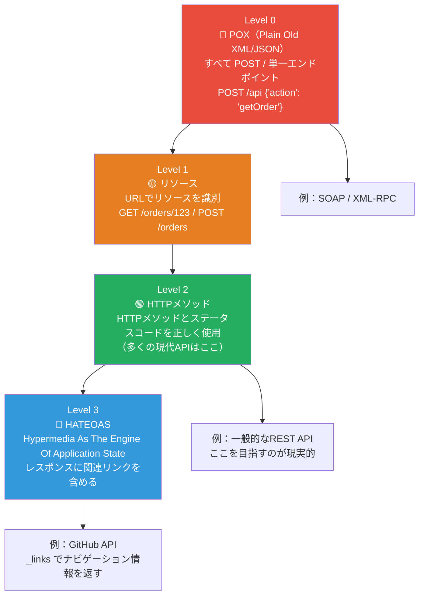

---

## 5. APIのバージョニング戦略

### 5.1 バージョニング方式の比較

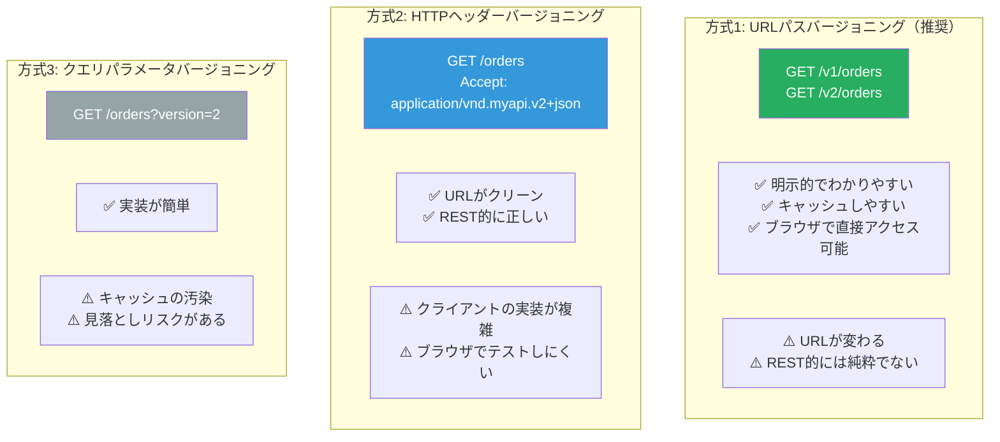

### 5.2 バージョニングのライフサイクル

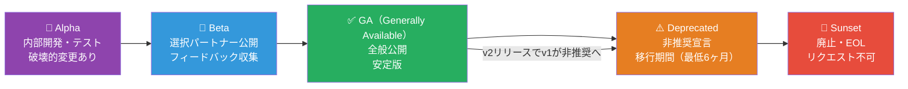

### 5.3 後方互換性のルール

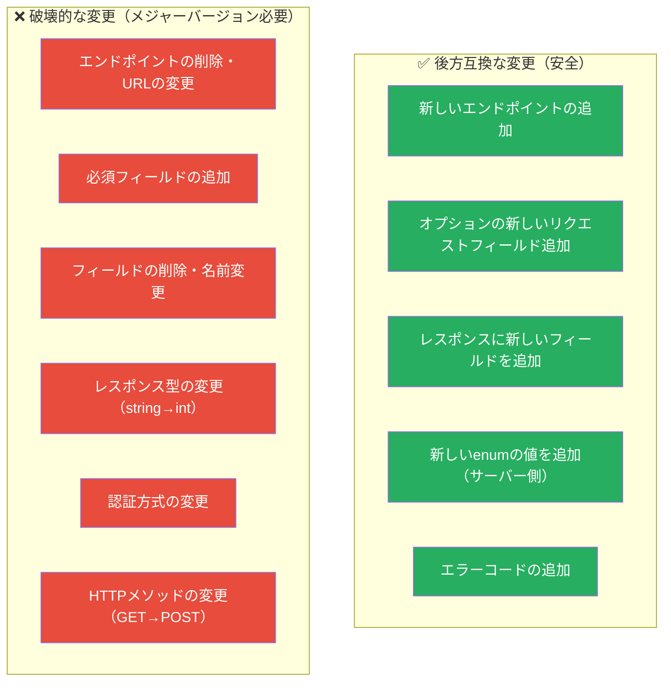

---

## 6. 認証・認可の設計

### 6.1 主要な認証方式の比較

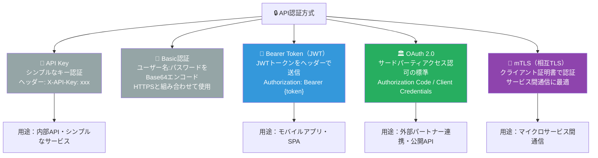

### 6.2 OAuth 2.0の認証フロー

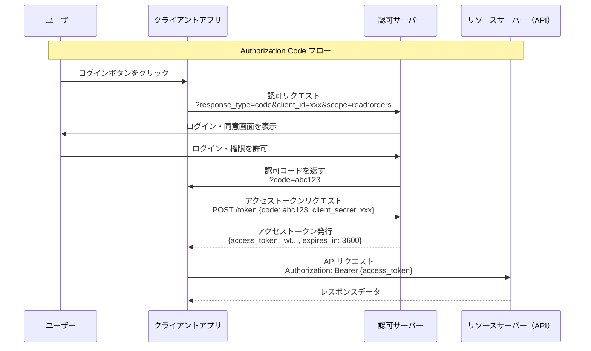

### 6.3 JWTの構造と検証フロー

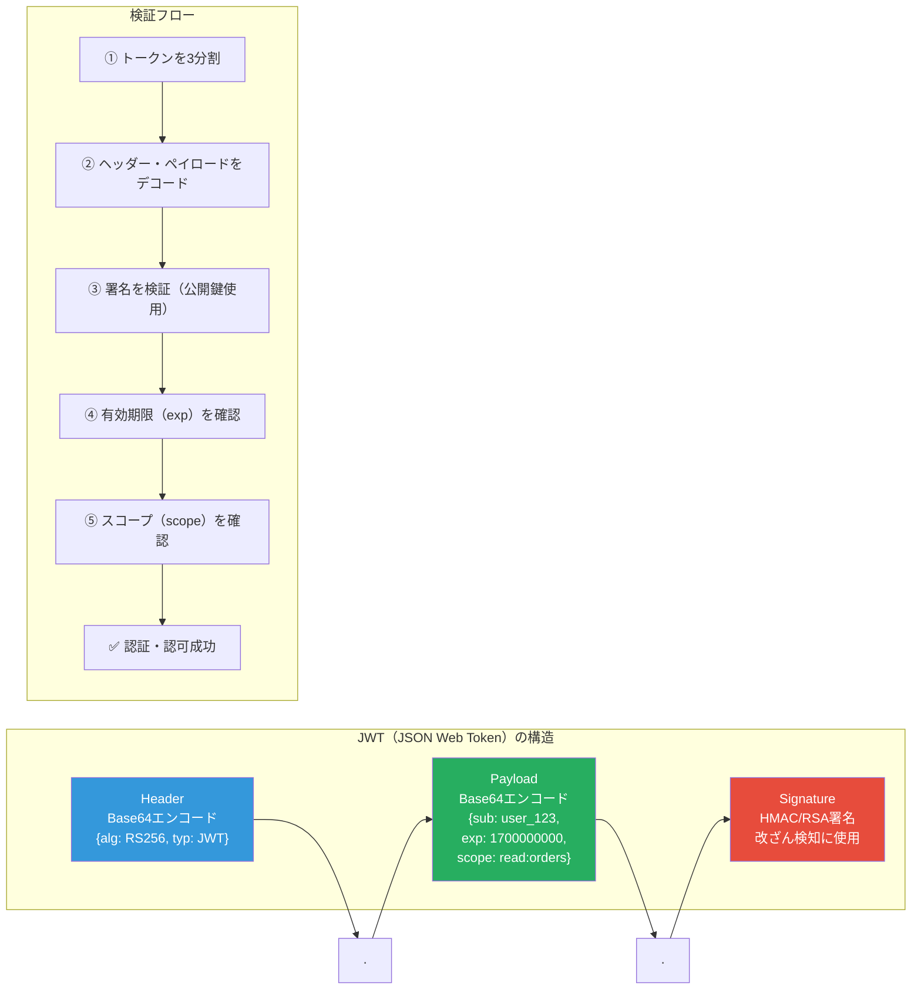

---

## 7. エラーハンドリングの設計

### 7.1 統一エラーレスポンス形式

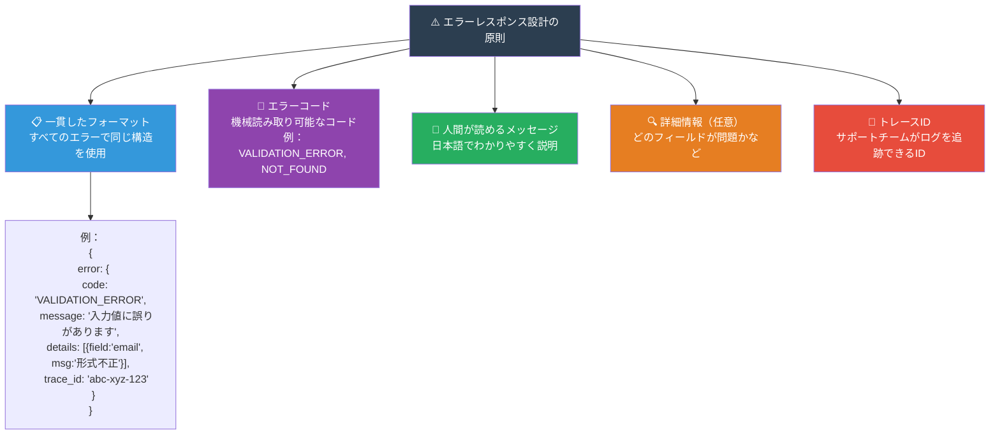

### 7.2 エラーコードの体系設計

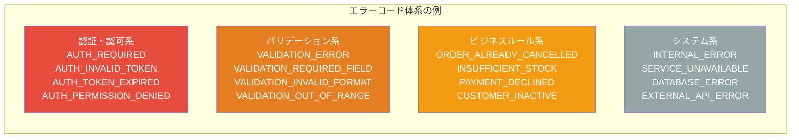

### 7.3 バリデーションエラーの詳細レスポンス（Python FastAPIの例）

```python
from fastapi import FastAPI, HTTPException
from pydantic import BaseModel, field_validator, Field
from typing import Optional, List
from enum import Enum


class CreateOrderRequest(BaseModel):
    customer_id: str = Field(..., min_length=1, description="顧客ID")
    items: List[OrderItemRequest] = Field(..., min_items=1, description="注文商品リスト")
    shipping_address: AddressRequest

    @field_validator("customer_id")
    @classmethod
    def customer_id_must_not_be_empty(cls, v: str) -> str:
        if not v.strip():
            raise ValueError("顧客IDは空白のみは不可です")
        return v


# カスタム例外ハンドラー
from fastapi.responses import JSONResponse
from fastapi.exceptions import RequestValidationError

app = FastAPI()

@app.exception_handler(RequestValidationError)
async def validation_exception_handler(request, exc: RequestValidationError):
    """バリデーションエラーを統一フォーマットに変換"""
    details = []
    for error in exc.errors():
        details.append({
            "field": ".".join(str(loc) for loc in error["loc"][1:]),
            "message": error["msg"],
            "type": error["type"]
        })

    return JSONResponse(
        status_code=422,
        content={
            "error": {
                "code": "VALIDATION_ERROR",
                "message": "入力値に誤りがあります",
                "details": details
            }
        }
    )


# ビジネスルールエラーのカスタム例外
class DomainError(Exception):
    def __init__(self, code: str, message: str, status_code: int = 422):
        self.code = code
        self.message = message
        self.status_code = status_code


@app.exception_handler(DomainError)
async def domain_error_handler(request, exc: DomainError):
    return JSONResponse(
        status_code=exc.status_code,
        content={
            "error": {
                "code": exc.code,
                "message": exc.message
            }
        }
    )


# 使用例
@app.post("/v1/orders", status_code=201)
async def create_order(req: CreateOrderRequest):
    if not customer_service.is_active(req.customer_id):
        raise DomainError(
            code="CUSTOMER_INACTIVE",
            message="このアカウントは現在ご利用いただけません",
            status_code=422
        )
    # 注文作成ロジック...
```

---

## 8. APIのページネーション・フィルタリング

### 8.1 ページネーション方式の比較

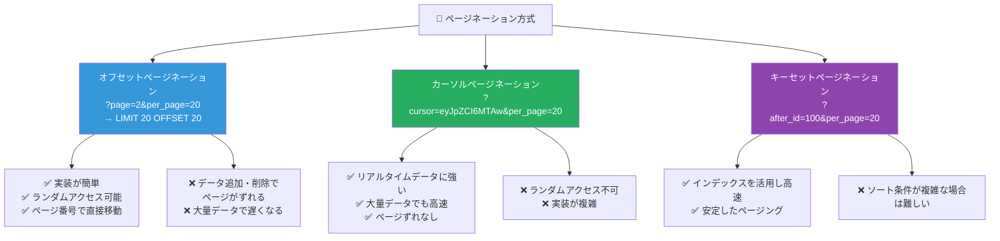

### 8.2 ページネーションのレスポンス設計

```mermaid
graph LR
    subgraph "オフセット方式のレスポンス例"
        OR["GET /orders?page=2&per_page=20<br><br>レスポンス:<br>{<br>  data: [...],<br>  pagination: {<br>    total: 150,<br>    page: 2,<br>    per_page: 20,<br>    total_pages: 8,<br>    has_next: true,<br>    has_prev: true<br>  }<br>}"]
    end

    subgraph "カーソル方式のレスポンス例"
        CR["GET /orders?cursor=abc&per_page=20<br><br>レスポンス:<br>{<br>  data: [...],<br>  pagination: {<br>    next_cursor: 'xyz',<br>    prev_cursor: 'def',<br>    has_next: true,<br>    has_prev: true<br>  }<br>}"]
    end

    style OR fill:#3498db,color:#fff
    style CR fill:#27ae60,color:#fff
```

### 8.3 フィルタリング・ソートの設計

```mermaid
graph TD
    subgraph "クエリパラメータ設計パターン"
        FILTER["🔍 フィルタリング<br>GET /orders?status=shipped<br>GET /orders?created_after=2024-01-01&created_before=2024-12-31<br>GET /orders?customer_id=cust_123"]

        SORT["⬆️ ソート<br>GET /orders?sort=created_at<br>GET /orders?sort=-created_at （降順はマイナスプレフィックス）<br>GET /orders?sort=status,-created_at （複数条件）"]

        SEARCH["🔎 全文検索<br>GET /products?q=Tシャツ<br>GET /products?search=blue+shirt"]

        SELECT["✂️ フィールド選択（Sparse Fieldsets）<br>GET /orders?fields=id,status,total_amount<br>必要なフィールドのみ返す（通信量削減）"]

        INCLUDE["📦 関連リソース展開<br>GET /orders?include=items,customer<br>N+1クエリを避けるためのインクルード"]
    end

    style FILTER fill:#3498db,color:#fff
    style SORT fill:#27ae60,color:#fff
    style SEARCH fill:#8e44ad,color:#fff
    style SELECT fill:#e67e22,color:#fff
    style INCLUDE fill:#e74c3c,color:#fff
```

---

## 9. APIゲートウェイパターン

### 9.1 APIゲートウェイの役割

```mermaid
graph TD
    subgraph "クライアント層"
        WEB["🌐 Webアプリ"]
        MOBILE["📱 モバイルアプリ"]
        PARTNER["🤝 パートナーシステム"]
    end

    subgraph "APIゲートウェイ層"
        GW["🚪 API Gateway<br>（Kong / AWS API Gateway / Nginx）"]
        GW_FUNC["機能一覧:<br>• 認証・認可（JWT検証）<br>• レート制限（Rate Limiting）<br>• SSLターミネーション<br>• リクエストロギング<br>• リクエスト変換<br>• ロードバランシング<br>• キャッシング<br>• APIバージョン管理"]
    end

    subgraph "マイクロサービス層"
        ORDER_SVC["注文サービス<br>:3001"]
        PRODUCT_SVC["商品サービス<br>:3002"]
        USER_SVC["ユーザーサービス<br>:3003"]
        PAYMENT_SVC["決済サービス<br>:3004"]
    end

    WEB --> GW
    MOBILE --> GW
    PARTNER --> GW

    GW --> ORDER_SVC
    GW --> PRODUCT_SVC
    GW --> USER_SVC
    GW --> PAYMENT_SVC

    style GW fill:#f39c12,color:#fff
    style GW_FUNC fill:#e67e22,color:#fff
```

### 9.2 BFF（Backend for Frontend）パターン

```mermaid
graph LR
    subgraph "クライアント"
        WEB_CLIENT["🌐 Webアプリ<br>React/Vue"]
        MOBILE_CLIENT["📱 モバイルアプリ<br>iOS/Android"]
    end

    subgraph "BFFレイヤー"
        WEB_BFF["🔵 Web BFF<br>PC向けの集約・変換<br>大きなデータを返す"]
        MOB_BFF["🟢 Mobile BFF<br>モバイル向けの集約・変換<br>軽量なデータを返す"]
    end

    subgraph "マイクロサービス群"
        SVC1["注文サービス"]
        SVC2["商品サービス"]
        SVC3["ユーザーサービス"]
    end

    WEB_CLIENT --> WEB_BFF
    MOBILE_CLIENT --> MOB_BFF

    WEB_BFF --> SVC1
    WEB_BFF --> SVC2
    WEB_BFF --> SVC3
    MOB_BFF --> SVC1
    MOB_BFF --> SVC2
    MOB_BFF --> SVC3

    style WEB_BFF fill:#3498db,color:#fff
    style MOB_BFF fill:#27ae60,color:#fff
```

### 9.3 レート制限（Rate Limiting）の設計

```mermaid
graph TD
    subgraph "レート制限の方式"
        FIXED["📦 固定ウィンドウ<br>1分間に100リクエストまで<br>（シンプルだが境界で突発アクセス）"]
        SLIDING["🔄 スライディングウィンドウ<br>直近60秒を常に計算<br>（より公平だが実装が複雑）"]
        TOKEN["🪙 トークンバケット<br>バケットにトークンを蓄積<br>バースト許容・制限を柔軟に設定"]
        LEAKY["💧 リーキーバケット<br>一定レートで処理<br>バーストを平滑化する"]
    end

    subgraph "レスポンスヘッダーの設計"
        HEADERS["レート制限情報をヘッダーに含める:<br>X-RateLimit-Limit: 100<br>X-RateLimit-Remaining: 45<br>X-RateLimit-Reset: 1700000060<br>Retry-After: 30 (制限超過時)"]
    end

    style FIXED fill:#95a5a6,color:#fff
    style SLIDING fill:#3498db,color:#fff
    style TOKEN fill:#27ae60,color:#fff
    style LEAKY fill:#8e44ad,color:#fff
    style HEADERS fill:#e67e22,color:#fff
```

---

## 10. APIのテスト戦略

### 10.1 APIテストピラミッド

```mermaid
graph TD
    subgraph PYRAMID["🔺 APIテストピラミッド"]
        E2E["E2Eテスト（少数）<br>実際のユーザーシナリオを自動化<br>ツール：Playwright / Cypress / Postman Collection"]
        INTEGRATION["統合テスト（中程度）<br>複数のサービス・DBを組み合わせて検証<br>ツール：pytest / Jest / REST Assured"]
        CONTRACT["契約テスト<br>プロデューサー・コンシューマー間の契約検証<br>ツール：Pact / Spring Cloud Contract"]
        UNIT["ユニットテスト（多数）<br>個々の関数・クラスの検証<br>ツール：pytest / Jest / JUnit"]
    end

    UNIT --> CONTRACT --> INTEGRATION --> E2E

    style E2E fill:#e74c3c,color:#fff
    style INTEGRATION fill:#e67e22,color:#fff
    style CONTRACT fill:#8e44ad,color:#fff
    style UNIT fill:#27ae60,color:#fff
```

### 10.2 Contract Testing（契約テスト）のフロー

```mermaid
sequenceDiagram
    participant FE as フロントエンド（Consumer）
    participant PACT as Pact Broker
    participant BE as バックエンド（Provider）
    participant CI as CIパイプライン

    FE->>FE: コンシューマーテストを書く<br>「こういうリクエストを送ったら<br>こういうレスポンスが来るはず」
    FE->>PACT: 契約（Pact）をPact Brokerに公開

    BE->>PACT: 最新の契約をPact Brokerから取得
    BE->>BE: プロバイダーテストを実行<br>契約通りのレスポンスを返せるか検証
    BE->>PACT: 検証結果を報告

    CI->>PACT: デプロイ前に "can-i-deploy" チェック
    PACT-->>CI: 契約の互換性を確認
    CI->>CI: ✅ 互換性OK → デプロイ実行
```

### 10.3 APIテストの実装例（Python/pytest）

```python
import pytest
import httpx
from unittest.mock import AsyncMock


# ─────────── ユニットテスト ───────────

class TestOrderService:
    """注文サービスのユニットテスト"""

    def test_create_order_with_valid_data(self):
        """有効なデータで注文が作成できること"""
        # Arrange
        order_repo = MockOrderRepository()
        service = OrderService(repository=order_repo)
        request = CreateOrderRequest(
            customer_id="cust_123",
            items=[OrderItem(product_id="prod_001", quantity=2)]
        )

        # Act
        result = service.create_order(request)

        # Assert
        assert result.status == "pending"
        assert result.customer_id == "cust_123"
        assert len(result.items) == 1

    def test_create_order_fails_when_customer_inactive(self):
        """非アクティブ顧客は注文できないこと"""
        customer_service = MockCustomerService(is_active=False)
        service = OrderService(customer_service=customer_service)

        valid_request = CreateOrderRequest(
            customer_id="cust_123",
            items=[OrderItem(product_id="prod_001", quantity=2)]
        )

        with pytest.raises(DomainError) as exc_info:
            service.create_order(valid_request)

        assert exc_info.value.code == "CUSTOMER_INACTIVE"


# ─────────── 統合テスト ───────────

@pytest.mark.asyncio
class TestOrderAPI:
    """注文APIの統合テスト（実際のHTTPリクエスト）"""

    @pytest.fixture
    async def client(self, app):
        async with httpx.AsyncClient(app=app, base_url="http://test") as c:
            yield c

    @pytest.fixture
    def auth_headers(self):
        return {"Authorization": "Bearer test_jwt_token"}

    async def test_create_order_returns_201(self, client, auth_headers, db):
        """注文作成が201を返すこと"""
        # Arrange
        payload = {
            "customer_id": "cust_123",
            "items": [{"product_id": "prod_001", "quantity": 2}],
            "shipping_address": {
                "postal_code": "150-0001",
                "prefecture": "東京都",
                "city": "渋谷区",
                "street": "神宮前1-1-1"
            }
        }

        # Act
        response = await client.post(
            "/v1/orders",
            json=payload,
            headers=auth_headers
        )

        # Assert
        assert response.status_code == 201
        data = response.json()
        assert data["status"] == "pending"
        assert data["customer_id"] == "cust_123"
        assert "id" in data

    async def test_get_order_returns_404_for_unknown_id(self, client, auth_headers):
        """存在しない注文IDで404が返ること"""
        response = await client.get(
            "/v1/orders/nonexistent_id",
            headers=auth_headers
        )
        assert response.status_code == 404
        error = response.json()["error"]
        assert error["code"] == "NOT_FOUND"

    async def test_create_order_returns_422_with_validation_errors(
        self, client, auth_headers
    ):
        """バリデーションエラーが詳細情報付きで返ること"""
        payload = {
            "customer_id": "",  # 空文字（NG）
            "items": [],  # 空配列（NG）
        }

        response = await client.post(
            "/v1/orders",
            json=payload,
            headers=auth_headers
        )

        assert response.status_code == 422
        error = response.json()["error"]
        assert error["code"] == "VALIDATION_ERROR"
        assert len(error["details"]) >= 2
```

---

## 11. APIドキュメントとDeveloper Experience

### 11.1 優れたAPIドキュメントの要素

```mermaid
mindmap
    root((優れた<br>APIドキュメント))
        クイックスタート
            5分で動くサンプルコード
            認証トークンの取得方法
            最初のAPIコール手順
        リファレンス
            全エンドポイントの仕様
            リクエスト・レスポンス例
            エラーコード一覧
        ガイド・チュートリアル
            ユースケース別の実装例
            よくあるパターン集
            トラブルシューティング
        インタラクティブ機能
            Swagger UI / ReDoc
            ブラウザ上でAPI試行
            リアルタイムレスポンス確認
        SDK・コードサンプル
            主要言語のSDK提供
            Python / JS / Java / Go
            コピペで動くコード
        変更履歴
            Changelog（変更記録）
            非推奨・廃止のアナウンス
            マイグレーションガイド
```

### 11.2 Swagger UIとReDocの生成（Python FastAPI）

```python
from fastapi import FastAPI
from fastapi.openapi.utils import get_openapi


app = FastAPI(
    title="ECサイト 注文管理API",
    version="2.0.0",
    description="""
## 概要
ECサイトの注文管理に関するAPIです。

## 認証
全てのエンドポイントはBearerトークン認証が必要です。

Authorization: Bearer {your_token}

## レート制限
- 通常: 1000リクエスト/分
- バースト: 200リクエスト/秒
    """,
    contact={
        "name": "APIサポートチーム",
        "email": "api-support@example.com",
        "url": "https://developer.example.com",
    },
    license_info={
        "name": "Apache 2.0",
        "url": "https://www.apache.org/licenses/LICENSE-2.0",
    },
    # Swagger UIのカスタマイズ
    swagger_ui_parameters={
        "syntaxHighlight": True,
        "tryItOutEnabled": True,
        "displayRequestDuration": True,
    },
)


# ReDocを別URLで提供
from fastapi.responses import HTMLResponse

@app.get("/redoc", include_in_schema=False)
async def redoc():
    return HTMLResponse("""
    <!DOCTYPE html>
    <html>
      <head><title>API Reference</title></head>
      <body>
        <redoc spec-url='/openapi.json'></redoc>
        <script src="https://cdn.jsdelivr.net/npm/redoc/bundles/redoc.standalone.js"></script>
      </body>
    </html>
    """)
```

### 11.3 開発者体験（DX）改善のチェックリスト

```mermaid
flowchart TD
    DX["🌟 Developer Experience チェックリスト"]

    DX --> ONBOARD["📚 オンボーディング<br>□ 5分以内にHello World到達<br>□ テスト用API Keyの即時発行<br>□ サンドボックス環境提供"]

    DX --> DOCS["📄 ドキュメント品質<br>□ 全エンドポイントにサンプルあり<br>□ エラーコードの解説と対処法<br>□ 変更履歴（Changelog）を管理"]

    DX --> SDK["🛠️ SDK・ツール<br>□ 主要言語のSDKを提供<br>□ Postman Collection公開<br>□ OpenAPI仕様ファイル公開"]

    DX --> SUPPORT["🆘 サポート<br>□ ステータスページ運用<br>□ 障害通知メール/Slack<br>□ GitHubで質問・フィードバック受付"]

    DX --> RELIABILITY["⚡ 信頼性<br>□ SLA 99.9%以上<br>□ レイテンシP99 < 500ms<br>□ 週次でアップタイムレポート"]

    style DX fill:#2c3e50,color:#fff
    style ONBOARD fill:#3498db,color:#fff
    style DOCS fill:#27ae60,color:#fff
    style SDK fill:#8e44ad,color:#fff
    style SUPPORT fill:#e67e22,color:#fff
    style RELIABILITY fill:#e74c3c,color:#fff
```

---

## 12. GraphQL vs REST vs gRPC 比較

### 12.1 3方式の特徴比較

```mermaid
graph TD
    subgraph REST["🌐 REST API"]
        R1["リソース中心の設計<br>URL + HTTP メソッド"]
        R2["JSONレスポンス<br>Over-fetching / Under-fetchingが発生"]
        R3["ブラウザ・モバイルに最適<br>キャッシュがしやすい"]
        R4["📌 用途：<br>公開API・Web/モバイルアプリ<br>シンプルなCRUD"]
    end

    subgraph GRAPHQL["🔮 GraphQL"]
        G1["クエリ言語で取得内容を指定<br>必要なフィールドだけ取得"]
        G2["単一エンドポイント<br>POST /graphql"]
        G3["N+1問題を解決<br>複雑な関連データを1回のリクエストで"]
        G4["📌 用途：<br>複雑なデータグラフ・BFF<br>モバイルアプリ最適化"]
    end

    subgraph GRPC["⚡ gRPC"]
        P1["Protocol Buffers（バイナリ）<br>高速・型安全"]
        P2["双方向ストリーミング対応<br>HTTP/2ベース"]
        P3["サーバー間通信に最適<br>ブラウザから直接使いにくい"]
        P4["📌 用途：<br>マイクロサービス間通信<br>低レイテンシが必要なAPI"]
    end

    style REST fill:#3498db,color:#fff
    style GRAPHQL fill:#e74c3c,color:#fff
    style GRPC fill:#27ae60,color:#fff
```

### 12.2 ユースケース別の選択フロー

```mermaid
flowchart TD
    START["APIの方式を選ぶ"]

    Q1{"外部・公開APIか？<br>（サードパーティ連携）"}
    Q2{"マイクロサービス間の<br>内部通信か？"}
    Q3{"クライアント側の<br>データ取得が複雑か？<br>（関連データが多い）"}
    Q4{"低レイテンシ・<br>高スループットが<br>最優先か？"}

    REST_REC["✅ REST が最適<br>最も普及・学習コスト低<br>ツールが豊富"]
    GRPC_REC["✅ gRPC が最適<br>バイナリで高速<br>型安全・ストリーミング対応"]
    GRAPHQL_REC["✅ GraphQL が最適<br>柔軟なデータ取得<br>Over/Under-fetchingを解消"]
    REST_ALSO["✅ REST も選択肢<br>シンプルならRESTで十分"]

    START --> Q1
    Q1 -->|"Yes"| REST_REC
    Q1 -->|"No"| Q2
    Q2 -->|"Yes"| Q4
    Q4 -->|"Yes"| GRPC_REC
    Q4 -->|"No"| Q3
    Q2 -->|"No（BFF/クライアント向け）"| Q3
    Q3 -->|"Yes"| GRAPHQL_REC
    Q3 -->|"No"| REST_ALSO

    style REST_REC fill:#27ae60,color:#fff
    style GRPC_REC fill:#3498db,color:#fff
    style GRAPHQL_REC fill:#e74c3c,color:#fff
    style REST_ALSO fill:#95a5a6,color:#fff
```

### 12.3 同じデータ取得の3方式比較

```mermaid
graph LR
    subgraph "REST（複数リクエスト）"
        REST_1["GET /users/123"]
        REST_2["GET /users/123/orders"]
        REST_3["GET /products/456"]
        REST_1 --> REST_2 --> REST_3
        REST_NOTE["3回のHTTPリクエストが必要<br>N+1問題が発生しやすい"]
    end

    subgraph "GraphQL（1回のリクエスト）"
        GQL["POST /graphql<br>query {<br>  user(id: 123) {<br>    name<br>    orders {<br>      id<br>      product { name }<br>    }<br>  }<br>}"]
        GQL_NOTE["1回のリクエストで必要なデータのみ取得"]
    end

    subgraph "gRPC（型安全な高速通信）"
        GRPC_NOTE["message GetUserRequest { int64 id = 1; }<br>message User { string name = 1; repeated Order orders = 2; }<br><br>バイナリで高速通信<br>型チェックはコンパイル時に実施"]
    end

    style REST_NOTE fill:#e74c3c,color:#fff
    style GQL_NOTE fill:#27ae60,color:#fff
    style GRPC_NOTE fill:#3498db,color:#fff
```

---

## 13. API-First実践：ECサイト完全事例

### 13.1 ECサイトAPIの全体設計

```mermaid
graph TD
    subgraph "クライアント"
        WEB2["🌐 Web（React）"]
        IOS["📱 iOS App"]
        ANDROID["🤖 Android App"]
        PARTNER2["🤝 パートナーシステム"]
    end

    subgraph "API Gateway層"
        APIGW["🚪 API Gateway<br>認証・レート制限・ロギング"]
        WEB_BFF2["Web BFF<br>/api/web/v1"]
        MOB_BFF2["Mobile BFF<br>/api/mobile/v1"]
        PARTNER_API["Partner API<br>/api/partner/v1"]
    end

    subgraph "マイクロサービスAPI群"
        ORDERS["📦 注文API<br>POST /orders<br>GET /orders/{id}<br>DELETE /orders/{id}"]
        PRODUCTS["🛍️ 商品API<br>GET /products<br>GET /products/{id}<br>GET /products/search"]
        USERS["👤 ユーザーAPI<br>POST /users<br>GET /users/{id}<br>PUT /users/{id}"]
        PAYMENTS["💳 決済API<br>POST /payments<br>GET /payments/{id}<br>POST /payments/{id}/refund"]
        INVENTORY["📊 在庫API<br>GET /inventory/{product_id}<br>PUT /inventory/{product_id}"]
    end

    WEB2 --> APIGW
    IOS --> APIGW
    ANDROID --> APIGW
    PARTNER2 --> APIGW

    APIGW --> WEB_BFF2
    APIGW --> MOB_BFF2
    APIGW --> PARTNER_API

    WEB_BFF2 --> ORDERS
    WEB_BFF2 --> PRODUCTS
    WEB_BFF2 --> USERS
    MOB_BFF2 --> ORDERS
    MOB_BFF2 --> PRODUCTS
    PARTNER_API --> ORDERS
    PARTNER_API --> INVENTORY

    ORDERS --> PAYMENTS

    style APIGW fill:#f39c12,color:#fff
    style WEB_BFF2 fill:#3498db,color:#fff
    style MOB_BFF2 fill:#3498db,color:#fff
    style PARTNER_API fill:#3498db,color:#fff
```

### 13.2 注文作成APIの完全なシーケンス

```mermaid
sequenceDiagram
    participant CLIENT2 as クライアント
    participant GW as API Gateway
    participant AUTH2 as 認証サービス
    participant ORDERS2 as 注文API
    participant INV as 在庫API
    participant PAY as 決済API
    participant NOTIFY as 通知API

    CLIENT2->>GW: POST /v1/orders<br>Authorization: Bearer jwt_token

    GW->>AUTH2: JWTトークン検証
    AUTH2-->>GW: ✅ 認証OK（customer_id: cust_123）

    GW->>ORDERS2: POST /orders（内部転送）

    ORDERS2->>ORDERS2: リクエストバリデーション
    ORDERS2->>INV: GET /inventory/prod_001<br>在庫確認
    INV-->>ORDERS2: {available: 50} ✅

    ORDERS2->>ORDERS2: 注文レコード作成（PENDING）
    ORDERS2->>PAY: POST /payments<br>{order_id, amount: 15000}
    PAY-->>ORDERS2: {payment_id, status: "processing"}

    ORDERS2->>ORDERS2: 注文ステータスを CONFIRMED に更新
    ORDERS2->>NOTIFY: POST /notifications<br>（非同期・fire and forget）

    ORDERS2-->>GW: 201 Created<br>{order_id, status: "confirmed", total_amount: 15000}
    GW-->>CLIENT2: 201 Created（レスポンス返却）
```

### 13.3 API設計の変遷（v1 → v2）

```mermaid
flowchart LR
    subgraph V1["v1 API（初期設計）"]
        V1_E1["POST /api/v1/orders<br>シンプルな注文作成"]
        V1_E2["GET /api/v1/orders/:id<br>注文詳細取得"]
        V1_NOTE["問題点:<br>・レスポンスが過剰<br>・関連データはN+1<br>・エラー形式が統一されていない"]
    end

    MIGRATE["🔄 改善点を整理<br>→ v2設計に反映"]

    subgraph V2["v2 API（改善版）"]
        V2_E1["POST /api/v2/orders<br>バリデーション強化<br>統一エラーフォーマット"]
        V2_E2["GET /api/v2/orders/:id<br>?include=items,customer<br>Sparse Fieldsets対応"]
        V2_NOTE["改善点:<br>・fields / include パラメータで最適化<br>・エラーコード体系整備<br>・Cursor Pagination導入"]
    end

    V1 --> MIGRATE --> V2

    style V1 fill:#e74c3c,color:#fff
    style V2 fill:#27ae60,color:#fff
    style MIGRATE fill:#f39c12,color:#fff
```

---

## 14. API-Firstのベストプラクティス総まとめ

### 14.1 設計フェーズのベストプラクティス

```mermaid
graph TD
    subgraph "API設計のベストプラクティス"
        BP1["✅ コードより先に仕様を書く<br>実装前にOpenAPI YAMLを完成させる"]
        BP2["✅ チームレビューを必ず実施<br>フロント・バック・QA全員で合意形成"]
        BP3["✅ コンシューマー視点で設計<br>使いやすさ優先・実装都合は後回し"]
        BP4["✅ リソース中心の設計<br>動詞はHTTPメソッドで表現"]
        BP5["✅ エラーハンドリングを先に設計<br>失敗パターンを正常系より先に考える"]
        BP6["✅ バージョニング戦略を初期に決める<br>後から変えると全クライアントに影響"]
    end
```

### 14.2 実装フェーズのベストプラクティス

| # | カテゴリ | ベストプラクティス | 理由 |
|---|---------|----------------|------|
| 1 | **仕様適合** | Contract Testで仕様との乖離を自動検出 | 手動確認は漏れが発生する |
| 2 | **モック活用** | Prism/Stoplight でモックサーバーを即時起動 | 並行開発でチームをブロックしない |
| 3 | **自動生成** | 仕様からSDK・クライアントを自動生成 | 手動実装は仕様と乖離する |
| 4 | **べき等性** | PUT/DELETE はべき等に設計する | 重複リクエストに安全に対処 |
| 5 | **冪等キー** | POST にIdempotency-Key ヘッダーを対応 | ネットワーク障害時のリトライ安全性 |
| 6 | **一貫性** | 命名規則はスネークケースまたはキャメルケースに統一 | クライアントの実装混乱を防ぐ |

### 14.3 API-First成熟度モデル

```mermaid
graph TD
    LV0["Level 0: コードファースト<br>実装してからAPIが決まる<br>ドキュメントなし・一貫性なし"]
    LV1["Level 1: ドキュメント化<br>実装後にSwaggerコメントを追加<br>OpenAPI仕様書は存在するが古い"]
    LV2["Level 2: 設計優先<br>実装前にOpenAPI仕様を書く<br>チームレビューを実施"]
    LV3["Level 3: 自動化・検証<br>仕様からモック・テスト・SDKを自動生成<br>Contract Testを導入"]
    LV4["Level 4: API as a Product<br>APIに専任オーナーを設置<br>バージョニング・廃止ポリシーを整備"]
    LV5["Level 5: APIプラットフォーム<br>開発者ポータル・セルフサービス<br>APIエコシステムとして展開"]

    LV0 --> LV1 --> LV2 --> LV3 --> LV4 --> LV5

    style LV0 fill:#e74c3c,color:#fff
    style LV1 fill:#e67e22,color:#fff
    style LV2 fill:#f39c12,color:#fff
    style LV3 fill:#27ae60,color:#fff
    style LV4 fill:#3498db,color:#fff
    style LV5 fill:#8e44ad,color:#fff
```

### 14.4 API-First導入ロードマップ

```mermaid
flowchart LR
    M1["Month 1<br>🎓 基礎整備<br>・OpenAPI仕様書の書き方学習<br>・チームでの設計レビュー実践<br>・Swagger UI導入"]

    M2["Month 2<br>🛠️ 自動化<br>・Prismでモックサーバー構築<br>・Contract Testの導入<br>・CI/CDにAPI仕様チェック追加"]

    M3["Month 3<br>📊 品質向上<br>・APIガイドライン策定<br>・SDK自動生成パイプライン<br>・開発者向けドキュメント整備"]

    M4["Month 4-6<br>🚀 スケール<br>・全チームへのAPI-First展開<br>・開発者ポータル構築<br>・APIガバナンス体制確立"]

    M1 --> M2 --> M3 --> M4

    style M1 fill:#3498db,color:#fff
    style M2 fill:#27ae60,color:#fff
    style M3 fill:#e67e22,color:#fff
    style M4 fill:#8e44ad,color:#fff
```

---

## 15. API-Firstのアンチパターン

### 15.1 よくある失敗パターン

```mermaid
graph TD
    subgraph "❌ Anti-Pattern 1: Code-First（コードファースト）"
        A1["実装してからAPI仕様を後付けする<br>ドキュメントは常に古くなる"]
        A1_FIX["解決：実装前にOpenAPI仕様を書き<br>仕様が承認されてから実装を開始する"]
    end

    subgraph "❌ Anti-Pattern 2: RPC Style REST（RPCスタイルREST）"
        A2["URLに動詞を含める設計<br>/getOrders /createUser /deleteProduct"]
        A2_FIX["解決：リソース名（名詞）+HTTPメソッドで表現<br>GET /orders / POST /users / DELETE /products/{id}"]
    end

    subgraph "❌ Anti-Pattern 3: Chatty API（チャッティAPI）"
        A3["1画面表示に10回のAPIコールが必要<br>フロントエンドがN+1問題を引き起こす"]
        A3_FIX["解決：BFFパターンでデータを集約<br>または ?include= で関連データを1回で取得"]
    end

    subgraph "❌ Anti-Pattern 4: Versioning Neglect（バージョニング放棄）"
        A4["バージョンなしで破壊的変更を加える<br>既存クライアントが突然壊れる"]
        A4_FIX["解決：変更前に必ずv2を作成<br>移行期間（6ヶ月以上）を設けてv1を廃止"]
    end

    subgraph "❌ Anti-Pattern 5: Generic Error（汎用エラー）"
        A5["すべてのエラーで同じメッセージ<br>Internal Server Error だけでは調査不能"]
        A5_FIX["解決：エラーコード体系を設計し<br>trace_id と詳細情報を必ず含める"]
    end

    style A1 fill:#e74c3c,color:#fff
    style A2 fill:#e74c3c,color:#fff
    style A3 fill:#e74c3c,color:#fff
    style A4 fill:#e74c3c,color:#fff
    style A5 fill:#e74c3c,color:#fff
    style A1_FIX fill:#27ae60,color:#fff
    style A2_FIX fill:#27ae60,color:#fff
    style A3_FIX fill:#27ae60,color:#fff
    style A4_FIX fill:#27ae60,color:#fff
    style A5_FIX fill:#27ae60,color:#fff
```

### 15.2 アンチパターン健全性チェックフロー

```mermaid
flowchart TD
    CHECK["API設計の健全性チェック"]

    Q1{"OpenAPI仕様書が<br>実装より先に<br>作成されているか？"}
    Q2{"URLに動詞（create/get/delete）<br>が含まれていないか？"}
    Q3{"1画面の表示に<br>必要なAPIコール数は<br>3回以内か？"}
    Q4{"エラーレスポンスに<br>機械可読なコードが<br>含まれているか？"}
    Q5{"バージョニング戦略が<br>定義されているか？"}

    FIX1["📄 設計優先プロセスに変更する<br>仕様レビューを必須工程にする"]
    FIX2["🔄 リソース+HTTPメソッド設計に改める<br>URL設計ガイドラインを整備する"]
    FIX3["📦 BFFまたは?includeで集約する<br>GraphQL導入を検討する"]
    FIX4["⚠️ エラーコード体系を設計する<br>エラーハンドリングガイドラインを整備"]
    FIX5["📋 バージョニングポリシーを策定する<br>変更管理プロセスを導入する"]
    HEALTHY["✅ 健全なAPI-Firstプロジェクト"]

    CHECK --> Q1
    Q1 -->|"No"| FIX1
    Q1 -->|"Yes"| Q2
    Q2 -->|"No（動詞がある）"| FIX2
    Q2 -->|"Yes"| Q3
    Q3 -->|"No（多すぎる）"| FIX3
    Q3 -->|"Yes"| Q4
    Q4 -->|"No"| FIX4
    Q4 -->|"Yes"| Q5
    Q5 -->|"No"| FIX5
    Q5 -->|"Yes"| HEALTHY

    style HEALTHY fill:#27ae60,color:#fff
    style FIX1 fill:#3498db,color:#fff
    style FIX2 fill:#3498db,color:#fff
    style FIX3 fill:#3498db,color:#fff
    style FIX4 fill:#3498db,color:#fff
    style FIX5 fill:#3498db,color:#fff
```

---

## 16. 参考文献・ソース一覧

### 📚 必読書籍

| タイトル | 著者 | 難易度 | 内容 |
|---------|------|--------|------|
| **Designing Web APIs** | Brenda Jin, Saurabh Sahni, Amir Shevat | ★★★☆☆ | APIデザインの実践的入門書 |
| **RESTful Web API Design** | Mark Masse | ★★★☆☆ | REST APIデザインパターン詳解 |
| **The Design of Web APIs** | Arnaud Lauret | ★★★★☆ | APIデザイン思考の決定版 |
| **API Design Patterns** | JJ Geewax | ★★★★☆ | Googleの実践的APIパターン集 |
| **Building Microservices** | Sam Newman | ★★★★☆ | マイクロサービスとAPIの関係 |
| **Learning GraphQL** | Eve Porcello, Alex Banks | ★★★☆☆ | GraphQLの実践入門 |

### 🌐 公式ドキュメント・URL

#### OpenAPI・Swagger関連

| リソース | URL |
|---------|-----|
| **OpenAPI Initiative 公式** | https://www.openapis.org/ |
| **OpenAPI Specification 3.1（最新仕様）** | https://spec.openapis.org/oas/v3.1.0 |
| **Swagger 公式ドキュメント** | https://swagger.io/docs/ |
| **Swagger Editor（ブラウザで仕様編集）** | https://editor.swagger.io/ |
| **Swagger UI（インタラクティブドキュメント）** | https://swagger.io/tools/swagger-ui/ |
| **ReDoc（美しいドキュメント生成）** | https://redocly.github.io/redoc/ |

#### RESTful設計原則

| リソース | URL |
|---------|-----|
| **Roy Fielding - REST論文（原典）** | https://www.ics.uci.edu/~fielding/pubs/dissertation/rest_arch_style.htm |
| **Microsoft REST API Guidelines** | https://github.com/microsoft/api-guidelines/blob/vNext/azure/Guidelines.md |
| **Google API Design Guide** | https://cloud.google.com/apis/design |
| **Stripe API設計（業界最高水準の参考）** | https://stripe.com/docs/api |
| **GitHub REST API（参考実装）** | https://docs.github.com/en/rest |
| **Richardson Maturity Model（Martin Fowler）** | https://martinfowler.com/articles/richardsonMaturityModel.html |

#### API設計・管理ツール

| リソース | URL |
|---------|-----|
| **Stoplight（API-Firstプラットフォーム）** | https://stoplight.io/ |
| **Postman（APIテスト・ドキュメント）** | https://www.postman.com/ |
| **Prism（OpenAPIモックサーバー）** | https://stoplight.io/open-source/prism |
| **Redocly（OpenAPI管理・CI）** | https://redocly.com/ |
| **APICurio（API設計エディタ）** | https://www.apicur.io/ |
| **Kong Gateway（APIゲートウェイ）** | https://konghq.com/ |

#### 認証・セキュリティ

| リソース | URL |
|---------|-----|
| **OAuth 2.0 RFC 6749（公式仕様）** | https://www.rfc-editor.org/rfc/rfc6749 |
| **JWT 公式サイト** | https://jwt.io/ |
| **OpenID Connect 公式** | https://openid.net/connect/ |
| **OWASP API Security Top 10** | https://owasp.org/www-project-api-security/ |

#### GraphQL・gRPC

| リソース | URL |
|---------|-----|
| **GraphQL 公式** | https://graphql.org/ |
| **GraphQL Best Practices** | https://graphql.org/learn/best-practices/ |
| **gRPC 公式** | https://grpc.io/ |
| **Protocol Buffers 公式** | https://protobuf.dev/ |

#### テスト・Contract Testing

| リソース | URL |
|---------|-----|
| **Pact（Contract Testing）** | https://pact.io/ |
| **Dredd（APIテストフレームワーク）** | https://dredd.org/ |
| **Schemathesis（OpenAPIファジングテスト）** | https://schemathesis.readthedocs.io/ |

#### 業界ガイドライン・ベストプラクティス

| リソース | URL |
|---------|-----|
| **Zalando RESTful API Guidelines** | https://opensource.zalando.com/restful-api-guidelines/ |
| **Paypal API Style Guide** | https://github.com/paypal/api-standards |
| **Atlassian API Design Guidelines** | https://developer.atlassian.com/server/framework/atlassian-sdk/rest-plugin-module/ |
| **JSON API 仕様（標準フォーマット）** | https://jsonapi.org/ |
| **Problem Details RFC 7807（エラー形式標準）** | https://www.rfc-editor.org/rfc/rfc7807 |

---

> 📅 本ドキュメントは2024年時点の情報を基に作成しています。各ツール・仕様のバージョンや内容は変更される場合があります。実装前に必ず公式ドキュメントをご確認ください。

---

*作成者：Software Architect Guide | バージョン 1.0 | API-First Complete Guide*
