# 🧩 DDD（ドメイン駆動設計）完全ガイド

## 📚 目次

1. [DDDとは何か？](#1-dddとは何か)
2. [DDDの全体構造](#2-dddの全体構造)
3. [戦略的設計：ユビキタス言語](#3-戦略的設計ユビキタス言語)
4. [戦略的設計：ドメインとサブドメイン](#4-戦略的設計ドメインとサブドメイン)
5. [戦略的設計：Bounded Context](#5-戦略的設計bounded-context)
6. [戦略的設計：Context Map](#6-戦略的設計context-map)
7. [戦術的設計：Entity（エンティティ）](#7-戦術的設計entityエンティティ)
8. [戦術的設計：Value Object（値オブジェクト）](#8-戦術的設計value-object値オブジェクト)
9. [戦術的設計：Aggregate（集約）](#9-戦術的設計aggregate集約)
10. [戦術的設計：Domain Event（ドメインイベント）](#10-戦術的設計domain-eventドメインイベント)
11. [戦術的設計：Repository（リポジトリ）](#11-戦術的設計repositoryリポジトリ)
12. [戦術的設計：Domain Service（ドメインサービス）](#12-戦術的設計domain-serviceドメインサービス)
13. [戦術的設計：Factory（ファクトリ）](#13-戦術的設計factoryファクトリ)
14. [アーキテクチャとDDDの組み合わせ](#14-アーキテクチャとdddの組み合わせ)
15. [Event Storming（イベントストーミング）](#15-event-stormingイベントストーミング)
16. [DDD実践：ECサイト完全実装例](#16-ddd実践ecサイト完全実装例)
17. [DDDのアンチパターン](#17-dddのアンチパターン)
18. [各設計要素のベストプラクティス一覧](#18-各設計要素のベストプラクティス一覧)
19. [参考文献・ソース一覧](#19-参考文献ソース一覧)

---

## 1. DDDとは何か？

### 1.1 DDDの定義

**Domain-Driven Design（ドメイン駆動設計）** は、Eric Evansが2003年の著書「Domain-Driven Design: Tackling Complexity in the Heart of Software」で提唱した設計哲学です。

> 💡 **核心思想：**「ソフトウェアの複雑さはビジネス（ドメイン）の複雑さに由来する。だからこそ、ドメインを深く理解し、そのモデルをコードに直接反映させるべきだ」

### 1.2 DDDが解決する問題

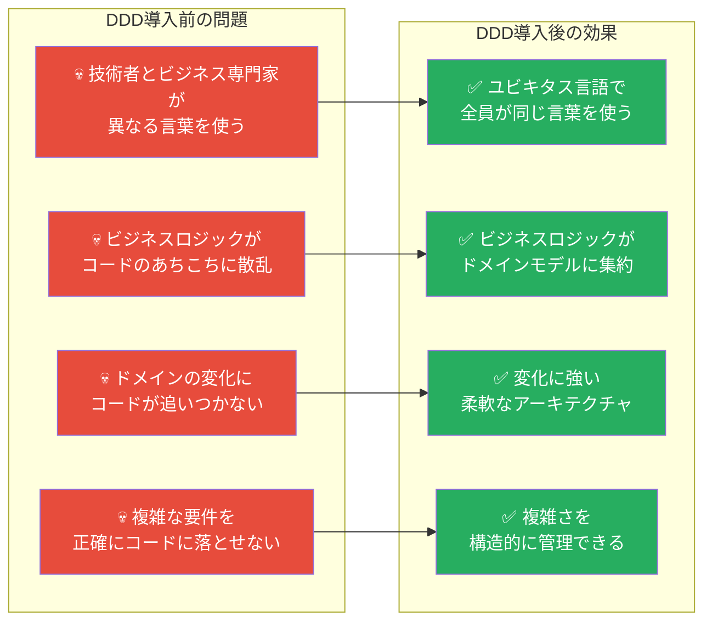

### 1.3 DDDが適しているプロジェクト

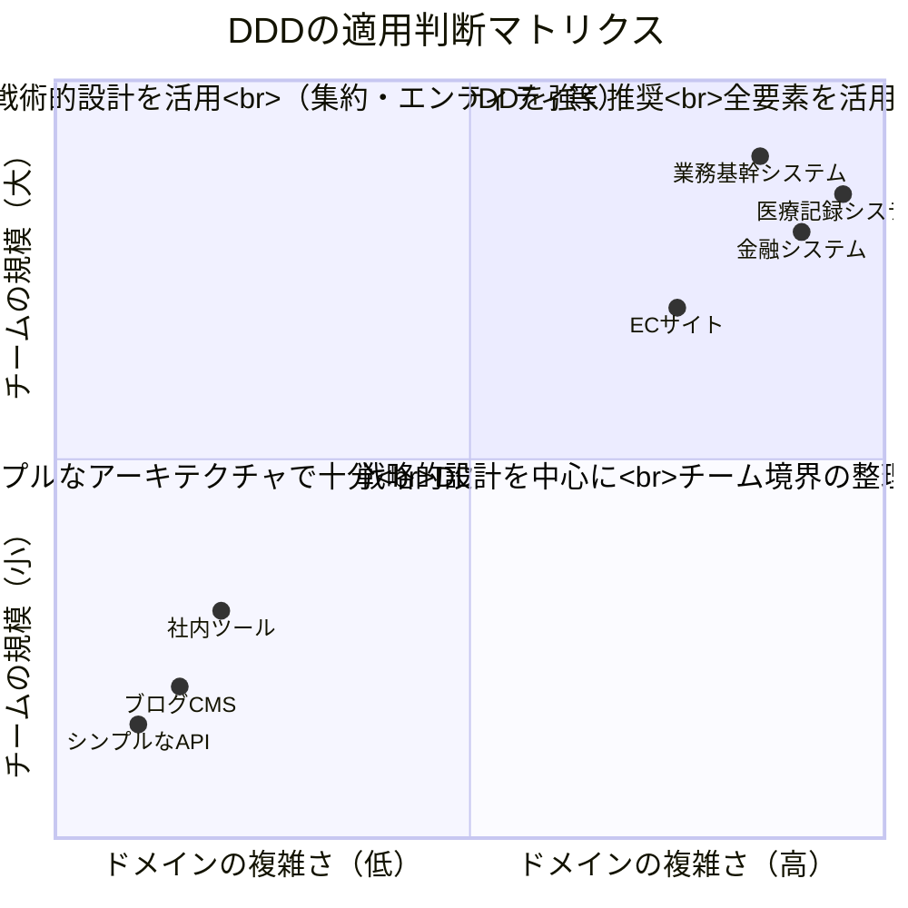

---

## 2. DDDの全体構造

### 2.1 DDDの2つの柱

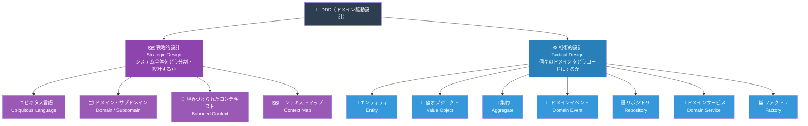

### 2.2 DDDの学習ロードマップ

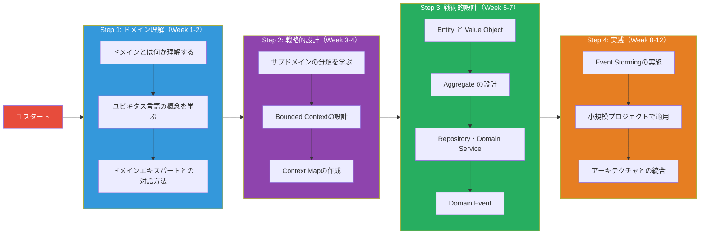

---

## 3. 戦略的設計：ユビキタス言語

### 3.1 ユビキタス言語とは

**Ubiquitous Language（ユビキタス言語）** とは、ビジネス専門家（ドメインエキスパート）と開発チームが共通で使う言語です。

> 💡 「ユビキタス（Ubiquitous）」= 「どこにでも存在する」という意味。コード・ドキュメント・会話の**すべてで同じ言葉**を使う。

### 3.2 ユビキタス言語の構築プロセス

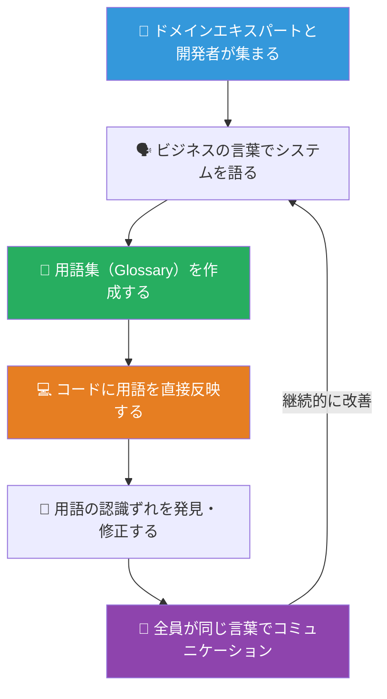

### 3.3 ユビキタス言語の具体例（ECサイト）

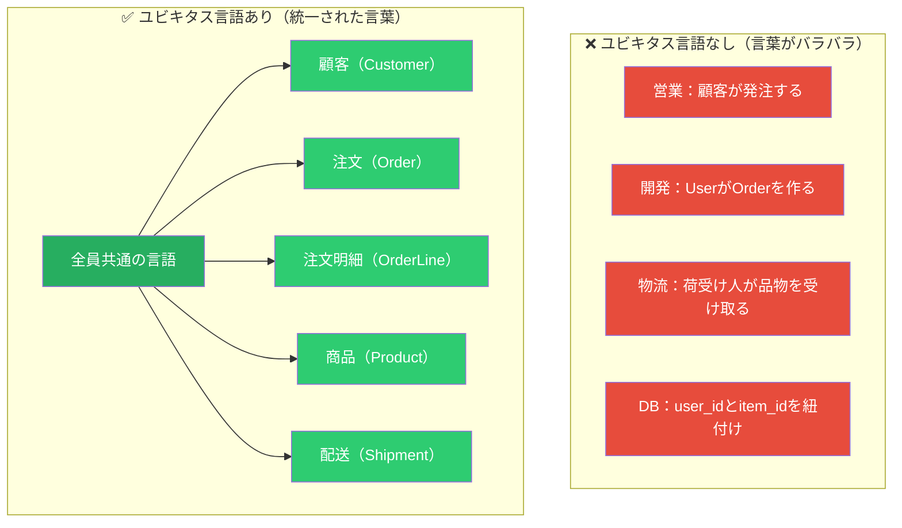

### 3.4 ユビキタス言語のベストプラクティス

| # | プラクティス | 詳細 |
|---|-------------|------|
| 1 | **用語集を常に最新に保つ** | ドキュメント化してチーム全員がアクセスできるようにする |
| 2 | **コードの命名と一致させる** | クラス名・メソッド名がドメイン用語と完全に一致すること |
| 3 | **あいまいな言葉を排除する** | 「処理する」「管理する」などの曖昧な動詞を避ける |
| 4 | **コンテキストを明示する** | 同じ言葉でも文脈によって意味が変わることを理解する |
| 5 | **継続的にリファインする** | ドメインの理解が深まるにつれ言語も進化させる |

---

## 4. 戦略的設計：ドメインとサブドメイン

### 4.1 ドメインの分類

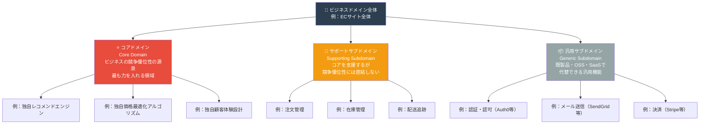

### 4.2 サブドメインへの投資戦略

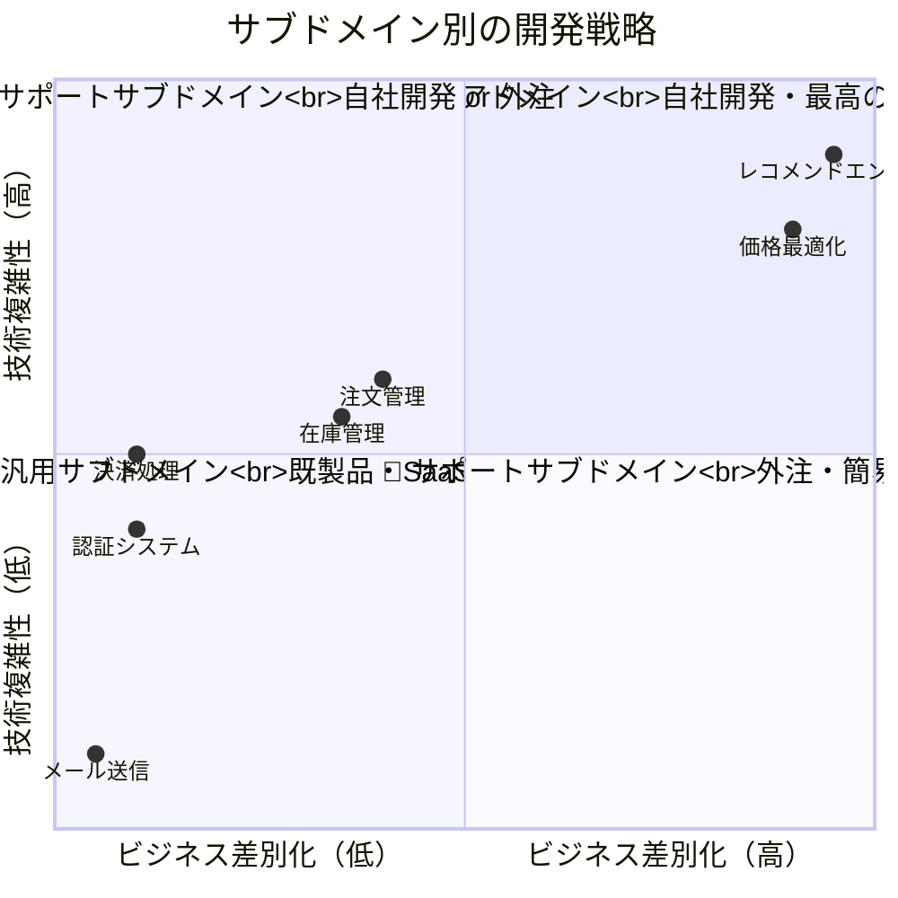

---

## 5. 戦略的設計：Bounded Context

### 5.1 Bounded Context とは

**Bounded Context（境界づけられたコンテキスト）** は、ユビキタス言語が一貫して通用する**明確な境界を持ったシステムの領域**です。

```mermaid
graph LR
    subgraph OrderCtx["📦 注文コンテキスト<br>Order Context"]
        O_CUST["Customer<br>（注文者情報）"]
        O_ORDER["Order<br>（注文全体）"]
        O_ITEM["OrderItem<br>（注文明細）"]
        O_STATUS["OrderStatus<br>（注文状態）"]
    end

    subgraph InvCtx["🏭 在庫コンテキスト<br>Inventory Context"]
        I_PROD["Product<br>（管理対象の物）"]
        I_STOCK["StockLevel<br>（在庫数量）"]
        I_WH["Warehouse<br>（倉庫）"]
    end

    subgraph ShipCtx["🚚 配送コンテキスト<br>Shipping Context"]
        S_PKG["Package<br>（荷物）"]
        S_ROUTE["DeliveryRoute<br>（配送経路）"]
        S_CARRIER["Carrier<br>（配送業者）"]
    end

    OrderCtx --> |"注文確定イベント"| InvCtx
    InvCtx --> |"出荷指示イベント"| ShipCtx

    style OrderCtx fill:#3498db,color:#fff
    style InvCtx fill:#27ae60,color:#fff
    style ShipCtx fill:#e67e22,color:#fff
```

### 5.2 なぜ「Product（商品）」の意味が異なるのか

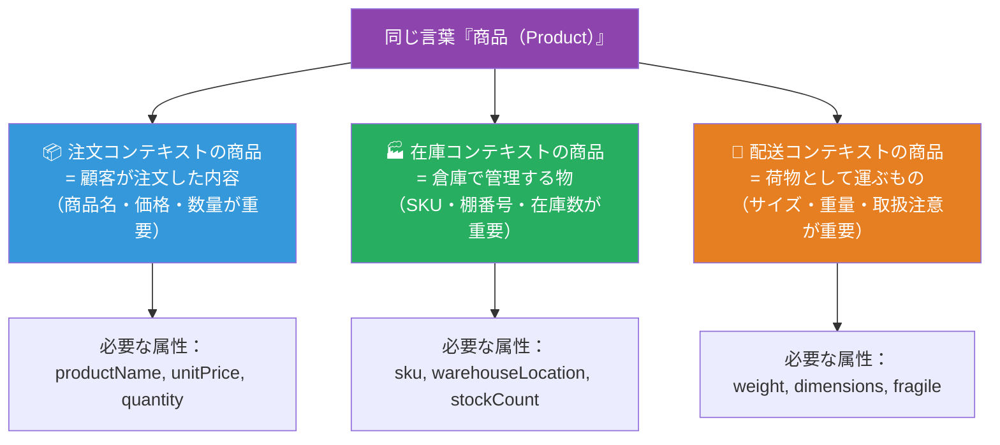

### 5.3 Bounded Contextの境界設計ベストプラクティス

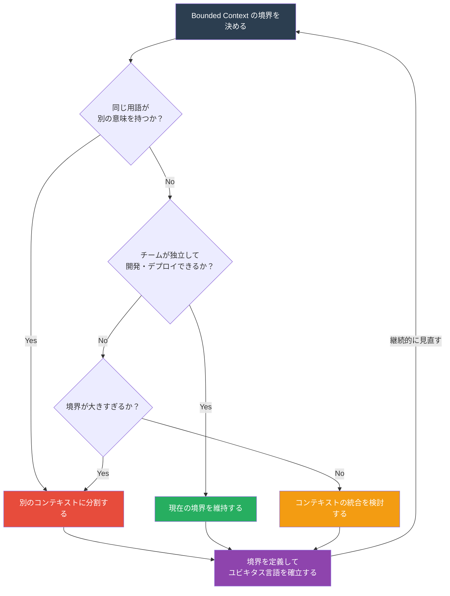

---

## 6. 戦略的設計：Context Map

### 6.1 Context Mapとは

**Context Map** は、複数のBounded Contextがどのように連携・依存しているかを可視化したマップです。

### 6.2 Context Map のパターン

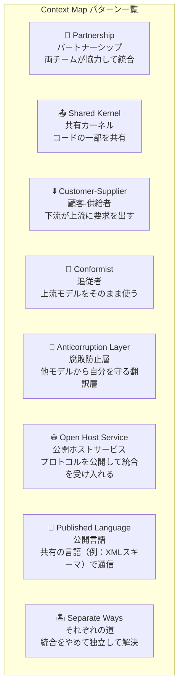

### 6.3 ECサイトのContext Map実例

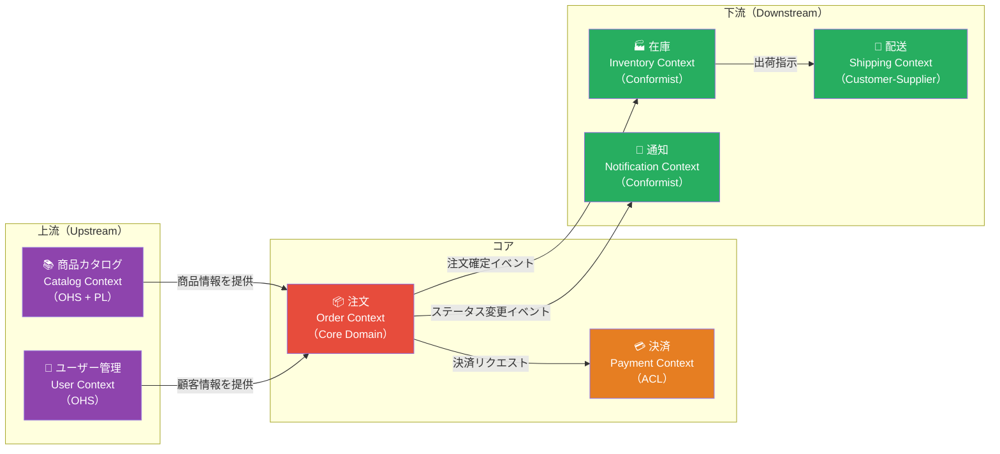

### 6.4 腐敗防止層（Anticorruption Layer）の仕組み

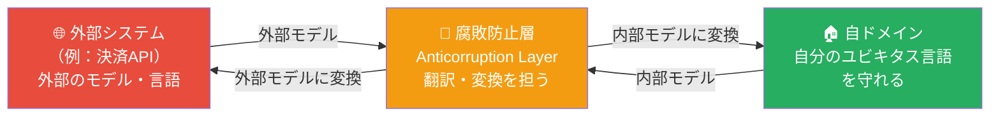

---

## 7. 戦術的設計：Entity（エンティティ）

### 7.1 Entityとは

**Entity（エンティティ）** は「**一意のID**によって同一性が判断されるオブジェクト」です。属性が変わっても、IDが同じであれば「同じもの」として扱われます。

### 7.2 EntityとValue Objectの違い

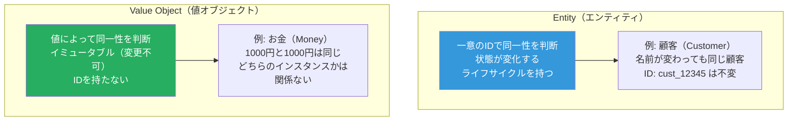

### 7.3 Entityの実装例（Python）

```python
from dataclasses import dataclass, field
from typing import Optional
from datetime import datetime
from uuid import uuid4


@dataclass
class CustomerId:
    """顧客IDの値オブジェクト"""
    value: str

    def __post_init__(self):
        if not self.value:
            raise ValueError("顧客IDは空にできません")

    @classmethod
    def generate(cls) -> "CustomerId":
        return cls(value=str(uuid4()))


@dataclass
class Customer:
    """
    顧客エンティティ（Entity）
    - 一意のIDで同一性を判断
    - 名前・メールが変わっても同じ顧客
    - ビジネスルールをメソッドとして持つ
    """
    id: CustomerId
    name: str
    email: str
    is_active: bool = True
    created_at: datetime = field(default_factory=datetime.now)

    def __eq__(self, other: object) -> bool:
        """IDで同一性を判断（属性ではない！）"""
        if not isinstance(other, Customer):
            return False
        return self.id == other.id

    def __hash__(self) -> int:
        return hash(self.id)

    # ────── ドメインロジック（ビジネスルール）──────

    def change_email(self, new_email: str) -> None:
        """メールアドレス変更のビジネスルールをEntityが持つ"""
        if not new_email or "@" not in new_email:
            raise ValueError("有効なメールアドレスを入力してください")
        self.email = new_email

    def deactivate(self) -> None:
        """退会処理：すでに退会済みならエラー"""
        if not self.is_active:
            raise ValueError("すでに退会済みの顧客です")
        self.is_active = False

    @property
    def is_valid_for_order(self) -> bool:
        """注文可能かどうかのビジネスルール"""
        return self.is_active
```

### 7.4 Entity設計のベストプラクティス

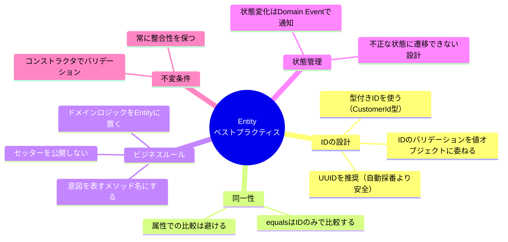

---

## 8. 戦術的設計：Value Object（値オブジェクト）

### 8.1 Value Objectとは

**Value Object（値オブジェクト）** は、「IDを持たず、**値の組み合わせによって同一性**が決まるオブジェクト」です。

### 8.2 Value Objectの特性

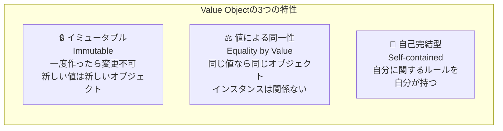

### 8.3 Value Objectの実装例（Python）

```python
from dataclasses import dataclass
from typing import Literal


@dataclass(frozen=True)  # frozen=True でイミュータブルにする
class Money:
    """
    金額の値オブジェクト
    - IDを持たない
    - 同じ金額・通貨なら同じオブジェクト
    - 計算ロジックを自分が持つ
    """
    amount: int
    currency: Literal["JPY", "USD", "EUR"]

    def __post_init__(self):
        if self.amount < 0:
            raise ValueError("金額は0以上でなければなりません")
        if self.currency not in ("JPY", "USD", "EUR"):
            raise ValueError(f"未対応の通貨です: {self.currency}")

    def add(self, other: "Money") -> "Money":
        """加算：新しいMoneyオブジェクトを返す（自分は変更しない）"""
        self._assert_same_currency(other)
        return Money(self.amount + other.amount, self.currency)

    def subtract(self, other: "Money") -> "Money":
        """減算"""
        self._assert_same_currency(other)
        if self.amount < other.amount:
            raise ValueError("差し引く金額が残高を超えています")
        return Money(self.amount - other.amount, self.currency)

    def multiply(self, factor: int) -> "Money":
        """乗算（個数×単価など）"""
        if factor < 0:
            raise ValueError("乗数は0以上でなければなりません")
        return Money(self.amount * factor, self.currency)

    def is_greater_than(self, other: "Money") -> bool:
        self._assert_same_currency(other)
        return self.amount > other.amount

    def _assert_same_currency(self, other: "Money") -> None:
        if self.currency != other.currency:
            raise ValueError(f"通貨が一致しません: {self.currency} vs {other.currency}")

    def __str__(self) -> str:
        return f"{self.amount:,} {self.currency}"


@dataclass(frozen=True)
class Address:
    """住所の値オブジェクト"""
    postal_code: str
    prefecture: str
    city: str
    street: str
    building: str = ""

    def __post_init__(self):
        if not self.postal_code or not self.prefecture:
            raise ValueError("郵便番号と都道府県は必須です")

    @property
    def full_address(self) -> str:
        base = f"{self.prefecture}{self.city}{self.street}"
        return f"{base} {self.building}".strip()


# 使い方
price = Money(1000, "JPY")
tax = Money(100, "JPY")
total = price.add(tax)  # Money(1100, "JPY") -- 新しいオブジェクト

price1 = Money(1000, "JPY")
price2 = Money(1000, "JPY")
print(price1 == price2)  # True（値が同じなら等しい）
```

---

## 9. 戦術的設計：Aggregate（集約）

### 9.1 Aggregateとは

**Aggregate（集約）** は、「整合性の境界を持つ、密接に関連したオブジェクト群のまとまり」です。外部からは必ず**Aggregate Root（集約ルート）**を通じてのみアクセスします。

### 9.2 Aggregateの構造

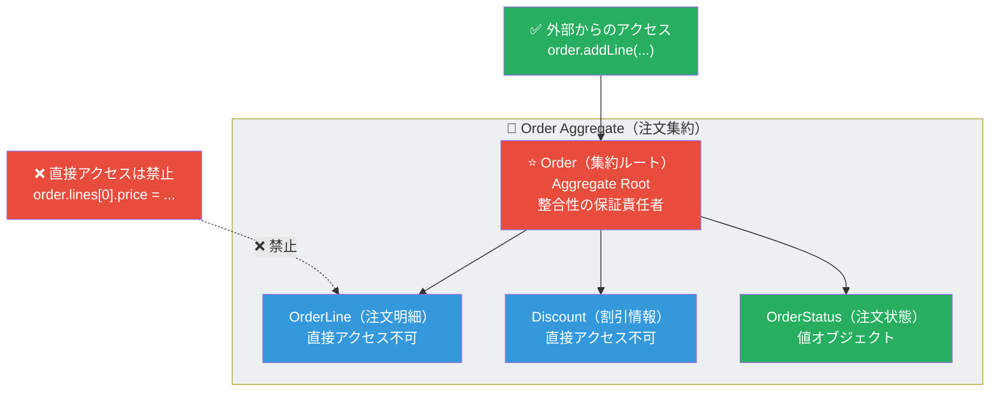

### 9.3 Aggregateの4つの設計ルール

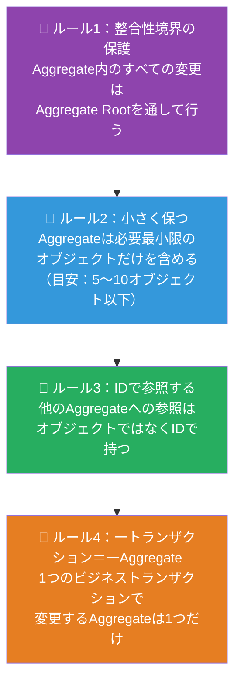

### 9.4 Aggregate実装例（Python）

```python
from dataclasses import dataclass, field
from typing import Optional
from enum import Enum


class OrderStatus(Enum):
    PENDING = "pending"       # 注文保留中
    CONFIRMED = "confirmed"   # 注文確定
    SHIPPED = "shipped"       # 発送済み
    DELIVERED = "delivered"   # 配達完了
    CANCELLED = "cancelled"   # キャンセル


@dataclass
class OrderLine:
    """
    注文明細（Aggregate内部のオブジェクト）
    - 外部から直接変更不可
    - Orderを通じてのみ操作される
    """
    product_id: str        # 他のAggregateへはIDで参照
    product_name: str
    unit_price: Money
    quantity: int

    @property
    def subtotal(self) -> Money:
        return self.unit_price.multiply(self.quantity)


@dataclass
class Order:
    """
    注文集約ルート（Aggregate Root）
    - 整合性の保証はここが責任を持つ
    - すべての変更はここを通じて行う
    """
    id: str
    customer_id: str        # 顧客AggregateへはIDで参照
    _lines: list[OrderLine] = field(default_factory=list)
    _status: OrderStatus = OrderStatus.PENDING
    _events: list = field(default_factory=list)  # Domain Events

    # ────── 公開インターフェース（外部からのアクセス口）──────

    def add_line(self, product_id: str, product_name: str,
                 unit_price: Money, quantity: int) -> None:
        """注文明細の追加：ビジネスルールをここで検証する"""
        # 不変条件の検証
        self._assert_can_modify()
        if quantity <= 0:
            raise ValueError("数量は1以上でなければなりません")
        if unit_price.amount <= 0:
            raise ValueError("単価は0より大きくなければなりません")

        # 同じ商品があれば数量を加算
        existing = self._find_line(product_id)
        if existing:
            existing.quantity += quantity
        else:
            self._lines.append(OrderLine(product_id, product_name,
                                         unit_price, quantity))

    def remove_line(self, product_id: str) -> None:
        """注文明細の削除"""
        self._assert_can_modify()
        line = self._find_line(product_id)
        if not line:
            raise ValueError(f"商品 {product_id} は注文に含まれていません")
        self._lines.remove(line)

    def confirm(self) -> None:
        """注文確定：状態遷移のビジネスルールを集約が保証"""
        if self._status != OrderStatus.PENDING:
            raise ValueError("保留中の注文のみ確定できます")
        if not self._lines:
            raise ValueError("注文明細がありません")

        self._status = OrderStatus.CONFIRMED
        # ドメインイベントを発行
        self._events.append(OrderConfirmedEvent(order_id=self.id,
                                                  total_amount=int(self.total_amount.amount)))

    def cancel(self) -> None:
        """注文キャンセル"""
        if self._status in (OrderStatus.SHIPPED, OrderStatus.DELIVERED):
            raise ValueError("発送済み・配達済みの注文はキャンセルできません")
        self._status = OrderStatus.CANCELLED
        self._events.append(OrderCancelledEvent(order_id=self.id))

    # ────── プロパティ（読み取り専用）──────

    @property
    def lines(self) -> tuple[OrderLine, ...]:
        """外部からlinesをイミュータブルに返す（変更させない）"""
        return tuple(self._lines)

    @property
    def status(self) -> OrderStatus:
        return self._status

    @property
    def total_amount(self) -> Money:
        """合計金額の計算"""
        if not self._lines:
            return Money(0, "JPY")
        totals = [line.subtotal for line in self._lines]
        return sum(totals[1:], totals[0])

    @property
    def domain_events(self) -> list:
        return list(self._events)

    def clear_events(self) -> None:
        self._events.clear()

    # ────── プライベートメソッド（内部ロジック）──────

    def _assert_can_modify(self) -> None:
        """変更可能な状態かチェック"""
        if self._status != OrderStatus.PENDING:
            raise ValueError("確定済みの注文は変更できません")

    def _find_line(self, product_id: str) -> Optional[OrderLine]:
        return next((l for l in self._lines
                     if l.product_id == product_id), None)
```

---

## 10. 戦術的設計：Domain Event（ドメインイベント）

### 10.1 Domain Eventとは

**Domain Event（ドメインイベント）** は「ドメイン内で起きた重要な出来事」を表すオブジェクトです。**過去形で命名**し、発生した事実を記録します。

### 10.2 Domain Eventの流れ

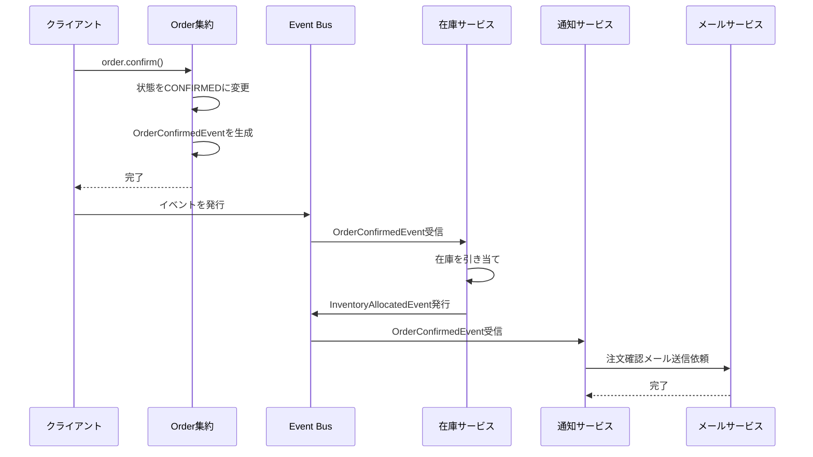

### 10.3 Domain Event実装例（Python）

```python
from dataclasses import dataclass, field
from datetime import datetime
from uuid import uuid4


@dataclass(frozen=True)
class DomainEvent:
    """すべてのドメインイベントの基底クラス"""
    event_id: str = field(default_factory=lambda: str(uuid4()))
    occurred_at: datetime = field(default_factory=datetime.now)


@dataclass(frozen=True)
class OrderConfirmedEvent(DomainEvent):
    """
    注文が確定した
    - 名前は必ず過去形
    - イベントは自己完結型（受信者がDBを引かなくてもよい情報を含む）
    - イミュータブル（frozenで変更不可）
    """
    order_id: str = ""
    customer_id: str = ""
    total_amount: int = 0
    currency: str = "JPY"
    item_count: int = 0


@dataclass(frozen=True)
class OrderCancelledEvent(DomainEvent):
    """注文がキャンセルされた"""
    order_id: str = ""
    customer_id: str = ""
    reason: str = ""


@dataclass(frozen=True)
class ProductOutOfStockEvent(DomainEvent):
    """商品が在庫切れになった"""
    product_id: str = ""
    product_name: str = ""
    warehouse_id: str = ""


# ────── イベントハンドラー（購読者）──────

class InventoryEventHandler:
    """在庫サービスのイベントハンドラー"""

    def handle_order_confirmed(self, event: OrderConfirmedEvent) -> None:
        """注文確定時に在庫を引き当てる"""
        print(f"在庫引き当て: 注文ID {event.order_id}")
        # 在庫処理ロジック...


class NotificationEventHandler:
    """通知サービスのイベントハンドラー"""

    def handle_order_confirmed(self, event: OrderConfirmedEvent) -> None:
        """注文確定メールを送信する"""
        print(f"確認メール送信: 顧客ID {event.customer_id}")
        # メール送信ロジック...
```

### 10.4 Domain Eventの設計ベストプラクティス

```mermaid
graph TD
    subgraph "✅ 良いDomain Event設計"
        G1["📌 過去形で命名する<br>OrderPlaced / CustomerRegistered<br>OrderCancelled"]
        G2["📌 自己完結型にする<br>受信者がDBを参照しなくて<br>済む情報をイベントに含める"]
        G3["📌 イミュータブルにする<br>発生した事実は変更不可<br>frozenにする"]
        G4["📌 イベントIDと発生日時を持つ<br>べき等性チェックと<br>監査ログに必要"]
    end

    subgraph "❌ 悪いDomain Event設計"
        B1["🚫 動詞・命令形は避ける<br>PlaceOrder / CreateCustomer<br>（これはコマンドの命名）"]
        B2["🚫 ID だけを含める<br>受信者が毎回DBを<br>参照しなければならない"]
        B3["🚫 後から変更できる<br>過去の事実を書き換えるのは<br>ドメインの整合性を壊す"]
    end

    style G1 fill:#27ae60,color:#fff
    style G2 fill:#27ae60,color:#fff
    style G3 fill:#27ae60,color:#fff
    style G4 fill:#27ae60,color:#fff
    style B1 fill:#e74c3c,color:#fff
    style B2 fill:#e74c3c,color:#fff
    style B3 fill:#e74c3c,color:#fff
```

---

## 11. 戦術的設計：Repository（リポジトリ）

### 11.1 Repositoryとは

**Repository（リポジトリ）** は、「Aggregateの永続化と取得を担う抽象化レイヤー」です。ドメイン層は具体的なデータベース（RDB・NoSQL等）を知らなくてよくなります。

### 11.2 Repositoryのアーキテクチャ上の役割

```mermaid
graph LR
    subgraph "ドメイン層"
        USE_CASE["PlaceOrderUseCase<br>（ユースケース）"]
        REPO_IF["OrderRepository<br>Interface<br>（抽象）"]
        ORDER["Order<br>（集約）"]
    end

    subgraph "インフラ層"
        REPO_IMPL["SQLAlchemyOrderRepository<br>（具体的実装）"]
        DB["PostgreSQL<br>データベース"]
    end

    USE_CASE --> REPO_IF
    USE_CASE --> ORDER
    REPO_IF -.->|"依存の逆転"| REPO_IMPL
    REPO_IMPL --> DB

    style USE_CASE fill:#3498db,color:#fff
    style REPO_IF fill:#8e44ad,color:#fff
    style ORDER fill:#27ae60,color:#fff
    style REPO_IMPL fill:#e67e22,color:#fff
    style DB fill:#95a5a6,color:#fff
```

### 11.3 Repository実装例（Python）

```python
from abc import ABC, abstractmethod
from typing import Optional


# ────── インターフェース（ドメイン層に置く）──────

class OrderRepository(ABC):
    """
    注文リポジトリのインターフェース
    ドメイン層はこれにのみ依存する
    具体的なDB実装は知らない
    """

    @abstractmethod
    def find_by_id(self, order_id: str) -> Optional[Order]:
        """IDで注文を取得する"""
        ...

    @abstractmethod
    def find_by_customer_id(self, customer_id: str) -> list[Order]:
        """顧客IDで注文一覧を取得する"""
        ...

    @abstractmethod
    def save(self, order: Order) -> None:
        """注文を保存する（新規・更新どちらも）"""
        ...

    @abstractmethod
    def delete(self, order_id: str) -> None:
        """注文を削除する"""
        ...


# ────── 具体的な実装（インフラ層に置く）──────

class InMemoryOrderRepository(OrderRepository):
    """
    テスト用のインメモリ実装
    DBなしでドメインロジックをテストできる
    """

    def __init__(self):
        self._store: dict[str, Order] = {}

    def find_by_id(self, order_id: str) -> Optional[Order]:
        return self._store.get(order_id)

    def find_by_customer_id(self, customer_id: str) -> list[Order]:
        return [o for o in self._store.values()
                if o.customer_id == customer_id]

    def save(self, order: Order) -> None:
        self._store[order.id] = order

    def delete(self, order_id: str) -> None:
        self._store.pop(order_id, None)


class SQLAlchemyOrderRepository(OrderRepository):
    """
    本番用のSQLAlchemy実装
    ドメインオブジェクト ←→ DBモデルの変換を担う
    """

    def __init__(self, session):
        self._session = session

    def find_by_id(self, order_id: str) -> Optional[Order]:
        record = self._session.query(OrderModel).filter_by(
            id=order_id).first()
        if not record:
            return None
        return self._to_domain(record)

    def save(self, order: Order) -> None:
        record = self._to_model(order)
        self._session.merge(record)
        self._session.flush()

    def _to_domain(self, record: "OrderModel") -> Order:
        """DBモデル → ドメインオブジェクトへの変換"""
        order = Order(id=record.id, customer_id=record.customer_id)
        # ... 変換ロジック
        return order

    def _to_model(self, order: Order) -> "OrderModel":
        """ドメインオブジェクト → DBモデルへの変換"""
        return OrderModel(id=order.id, customer_id=order.customer_id,
                          status=order.status.value)

    def find_by_customer_id(self, customer_id: str) -> list[Order]:
        records = self._session.query(OrderModel).filter_by(
            customer_id=customer_id).all()
        return [self._to_domain(r) for r in records]

    def delete(self, order_id: str) -> None:
        self._session.query(OrderModel).filter_by(
            id=order_id).delete()
```

---

## 12. 戦術的設計：Domain Service（ドメインサービス）

### 12.1 Domain Serviceとは

**Domain Service（ドメインサービス）** は、「特定のEntityやValue Objectに自然に属さないドメインロジック」を置く場所です。

### 12.2 Domain ServiceとApplication Serviceの違い

```mermaid
graph TB
    subgraph "Domain Service（ドメインサービス）"
        DS_DEF["ドメインの業務ロジックを持つ<br>Entityをまたぐビジネスルール<br>ドメイン用語で記述"]
        DS_EX["例：在庫チェックと価格計算を<br>組み合わせた注文可否判定"]
    end

    subgraph "Application Service（アプリケーションサービス）"
        AS_DEF["ユースケースの調整役<br>ドメインロジックは持たない<br>リポジトリ・ドメインサービスを呼び出す"]
        AS_EX["例：注文を受け付け、<br>在庫サービスを呼び、<br>リポジトリに保存する"]
    end

    DS_DEF --> DS_EX
    AS_DEF --> AS_EX

    style DS_DEF fill:#8e44ad,color:#fff
    style AS_DEF fill:#3498db,color:#fff
```

### 12.3 Domain Service実装例（Python）

```python
class PricingDomainService:
    """
    価格計算ドメインサービス
    - 複数のAggregateにまたがるビジネスルール
    - 「割引適用」は Customer と Order と Promotion にまたがるため
      どのEntityにも属さない → Domain Serviceに置く
    """

    def calculate_discounted_price(
        self,
        order: Order,
        customer: Customer,
        promotions: list["Promotion"],
    ) -> Money:
        """顧客の等級と適用可能なプロモーションを考慮した価格計算"""

        base_total = order.total_amount

        # VIP顧客は追加10%割引
        if customer.membership_tier == "VIP":
            discount_rate = 0.10
        elif customer.membership_tier == "GOLD":
            discount_rate = 0.05
        else:
            discount_rate = 0.0

        # プロモーション割引の適用
        promo_discount = Money(0, base_total.currency)
        for promo in promotions:
            if promo.is_applicable(order, customer):
                promo_discount = promo_discount.add(
                    promo.calculate_discount(base_total)
                )

        # 会員割引の計算
        member_discount = Money(
            int(base_total.amount * discount_rate),
            base_total.currency
        )

        # 合計割引の適用（ただし0円以下にはしない）
        total_discount = member_discount.add(promo_discount)
        discounted = base_total.subtract(
            total_discount if not total_discount.is_greater_than(base_total)
            else base_total
        )

        return discounted


class TransferDomainService:
    """
    口座振替ドメインサービス
    - 2つのAccountをまたぐ操作
    - どちらのAccountにも属さないのでService化
    """

    def transfer(
        self,
        source: "BankAccount",
        destination: "BankAccount",
        amount: Money,
    ) -> None:
        """送金：残高チェックと両口座の更新を原子的に行う"""
        if not source.has_sufficient_funds(amount):
            raise InsufficientFundsError(
                f"残高不足: 必要={amount}, 残高={source.balance}"
            )
        source.withdraw(amount)
        destination.deposit(amount)
```

---

## 13. 戦術的設計：Factory（ファクトリ）

### 13.1 Factoryとは

**Factory（ファクトリ）** は、「複雑なAggregateやEntityの生成ロジックをカプセル化する」パターンです。

### 13.2 Factoryが必要な理由

```mermaid
graph TD
    subgraph "Factoryが不要なケース"
        S1["生成がシンプル<br>Order(id, customer_id) だけでOK<br>→ コンストラクタで十分"]
    end

    subgraph "Factoryが必要なケース"
        C1["生成が複雑<br>複数のサービス・リポジトリが必要<br>→ Factoryに委ねる"]
        C2["生成ルールがビジネスロジック<br>条件によって異なる種類のオブジェクトを作る<br>→ Factoryに委ねる"]
        C3["既存データからの再構成<br>DBレコードをドメインオブジェクトに変換<br>→ Factoryに委ねる"]
    end

    style S1 fill:#27ae60,color:#fff
    style C1 fill:#3498db,color:#fff
    style C2 fill:#3498db,color:#fff
    style C3 fill:#3498db,color:#fff
```

### 13.3 Factory実装例（Python）

```python
class OrderFactory:
    """
    注文集約のファクトリ
    - 注文生成のビジネスルールをカプセル化
    - 生成時の検証を集中管理
    """

    def __init__(
        self,
        customer_repository: CustomerRepository,
        product_repository: ProductRepository,
    ):
        self._customer_repo = customer_repository
        self._product_repo = product_repository

    def create_order(
        self,
        customer_id: str,
        items: list[dict],
    ) -> Order:
        """
        注文の生成：ビジネスルールを検証しながらOrderを作る
        """
        # 顧客の存在確認と注文可否チェック
        customer = self._customer_repo.find_by_id(customer_id)
        if not customer:
            raise CustomerNotFoundError(f"顧客が見つかりません: {customer_id}")
        if not customer.is_valid_for_order:
            raise CustomerNotEligibleError("この顧客は注文できません")

        # Orderを生成
        order = Order(id=str(uuid4()), customer_id=customer_id)

        # 各商品を追加（在庫確認付き）
        for item in items:
            product = self._product_repo.find_by_id(item["product_id"])
            if not product:
                raise ProductNotFoundError(f"商品が見つかりません: {item['product_id']}")
            if not product.is_available(item["quantity"]):
                raise OutOfStockError(f"在庫が不足しています: {product.name}")

            order.add_line(
                product_id=product.id,
                product_name=product.name,
                unit_price=product.price,
                quantity=item["quantity"],
            )

        return order

    def reconstruct_from_snapshot(self, snapshot: dict) -> Order:
        """DBのスナップショットから注文を再構成する"""
        order = Order(id=snapshot["id"],
                      customer_id=snapshot["customer_id"])
        # ... 再構成ロジック
        return order
```

---

## 14. アーキテクチャとDDDの組み合わせ

### 14.1 レイヤードアーキテクチャ × DDD

```mermaid
graph TB
    subgraph UI["🖥️ プレゼンテーション層<br>Presentation Layer"]
        CTRL["Controller / API Handler"]
        DTO["DTO / リクエスト・レスポンスモデル"]
    end

    subgraph APP["⚙️ アプリケーション層<br>Application Layer"]
        AS["Application Service<br>ユースケースの調整役"]
        CMD["Command / Query オブジェクト"]
    end

    subgraph DOMAIN["🧩 ドメイン層<br>Domain Layer（コア）"]
        ENTITY["Entity"]
        VO["Value Object"]
        AGG["Aggregate"]
        DS["Domain Service"]
        DE["Domain Event"]
        RI["Repository Interface（抽象）"]
    end

    subgraph INFRA["🔧 インフラ層<br>Infrastructure Layer"]
        REPO["Repository 実装（SQLAlchemy等）"]
        DB[("データベース")]
        MQ["メッセージキュー<br>（Kafka / RabbitMQ）"]
        EXTAPI["外部API"]
    end

    UI --> APP
    APP --> DOMAIN
    DOMAIN -.->|"依存の逆転"| INFRA
    INFRA --> DB
    INFRA --> MQ
    INFRA --> EXTAPI

    style UI fill:#3498db,color:#fff
    style APP fill:#8e44ad,color:#fff
    style DOMAIN fill:#e74c3c,color:#fff
    style INFRA fill:#27ae60,color:#fff
```

### 14.2 ヘキサゴナルアーキテクチャ（ポート＆アダプター）× DDD

```mermaid
graph LR
    subgraph CORE["🧩 ドメインコア"]
        AGG2["Aggregate"]
        DS2["Domain Service"]
        DE2["Domain Event"]
    end

    subgraph PORTS["🔌 ポート（インターフェース）"]
        IN_PORT["Inbound Ports<br>OrderRepository I/F<br>PlaceOrderUseCase I/F"]
        OUT_PORT["Outbound Ports<br>OrderRepository I/F<br>EventPublisher I/F"]
    end

    subgraph ADAPTERS_IN["📥 インバウンドアダプター"]
        REST["REST API Controller"]
        GRPC["gRPC Handler"]
        MQ_IN["Message Queue Consumer"]
    end

    subgraph ADAPTERS_OUT["📤 アウトバウンドアダプター"]
        SQL["SQLAlchemy Repository"]
        KAFKA["Kafka Event Publisher"]
        EMAIL2["Email Service Adapter"]
    end

    ADAPTERS_IN --> IN_PORT
    IN_PORT --> CORE
    CORE --> OUT_PORT
    OUT_PORT --> ADAPTERS_OUT

    style CORE fill:#e74c3c,color:#fff
    style PORTS fill:#8e44ad,color:#fff
    style ADAPTERS_IN fill:#3498db,color:#fff
    style ADAPTERS_OUT fill:#27ae60,color:#fff
```

---

## 15. Event Storming（イベントストーミング）

### 15.1 Event Stormingとは

**Event Storming** は、Alberto Brandoliniが考案した、ドメインエキスパートと開発者が**付箋紙を使って共同でドメインモデルを発見・設計するワークショップ手法**です。

### 15.2 Event Stormingの付箋カラーコード

```mermaid
graph TD
    subgraph "付箋の種類と色"
        O["🟠 Domain Event（オレンジ）<br>起きた出来事（過去形）<br>例：注文が確定された"]
        B["🔵 Command（青）<br>引き起こすアクション<br>例：注文を確定する"]
        Y["🟡 Aggregate（黄）<br>コマンドを受け取り<br>イベントを発生させる主体"]
        P["🟣 Policy / Reaction（紫）<br>イベントに反応する自動処理<br>例：注文確定されたら在庫を減らす"]
        G["🟢 Read Model（緑）<br>ユーザーが参照する情報<br>例：注文一覧画面"]
        W["⬜ External System（白）<br>外部システム<br>例：決済API"]
        R["🔴 Hot Spot（赤）<br>問題・不明点・議論が必要な箇所"]
    end
```

### 15.3 Event Stormingのプロセス

```mermaid
flowchart LR
    ST1["Step 1<br>🟠 ドメインイベントを<br>洗い出す<br>（個人作業・混沌）"]
    ST2["Step 2<br>🟠 イベントを<br>時系列に並べる<br>（チーム整理）"]
    ST3["Step 3<br>🔵 コマンドを<br>追加する<br>（何が起こすか）"]
    ST4["Step 4<br>⬜ 外部システムや<br>アクターを追加"]
    ST5["Step 5<br>🟡 集約を特定し<br>グループ化する"]
    ST6["Step 6<br>🟣 Policy / 自動処理<br>を発見する"]
    ST7["Step 7<br>🔲 Bounded Contextの<br>境界を引く"]

    ST1 --> ST2 --> ST3 --> ST4 --> ST5 --> ST6 --> ST7

    style ST1 fill:#e67e22,color:#fff
    style ST2 fill:#e67e22,color:#fff
    style ST3 fill:#3498db,color:#fff
    style ST4 fill:#95a5a6,color:#fff
    style ST5 fill:#f1c40f,color:#333
    style ST6 fill:#9b59b6,color:#fff
    style ST7 fill:#2c3e50,color:#fff
```

### 15.4 ECサイトのEvent Storming結果例

```mermaid
flowchart LR
    subgraph "注文フロー"
        CMD1["🔵 カートに追加"] --> EV1["🟠 商品がカートに追加された"]
        EV1 --> CMD2["🔵 注文を確定する"]
        CMD2 --> AGG1["🟡 Order集約"]
        AGG1 --> EV2["🟠 注文が確定された"]
        EV2 --> POL1["🟣 注文確定されたら<br>在庫を引き当てる"]
        EV2 --> POL2["🟣 注文確定されたら<br>確認メールを送る"]
        POL1 --> CMD3["🔵 在庫を引き当てる"]
        POL2 --> CMD4["🔵 メールを送信する"]
    end

    style CMD1 fill:#3498db,color:#fff
    style CMD2 fill:#3498db,color:#fff
    style CMD3 fill:#3498db,color:#fff
    style CMD4 fill:#3498db,color:#fff
    style EV1 fill:#e67e22,color:#fff
    style EV2 fill:#e67e22,color:#fff
    style AGG1 fill:#f1c40f,color:#333
    style POL1 fill:#9b59b6,color:#fff
    style POL2 fill:#9b59b6,color:#fff
```

---

## 16. DDD実践：ECサイト完全実装例

### 16.1 ドメインモデル全体像

```mermaid
classDiagram
    class Order {
        +OrderId id
        +CustomerId customerId
        +OrderStatus status
        +List~OrderLine~ lines
        +addLine(productId, name, price, qty)
        +confirm()
        +cancel()
        +totalAmount() Money
    }

    class OrderLine {
        +ProductId productId
        +String productName
        +Money unitPrice
        +int quantity
        +subtotal() Money
    }

    class Customer {
        +CustomerId id
        +String name
        +Email email
        +MembershipTier tier
        +changeEmail(email)
        +deactivate()
    }

    class Product {
        +ProductId id
        +String name
        +Money price
        +int stockCount
        +reserve(qty)
        +restock(qty)
    }

    class Money {
        +int amount
        +String currency
        +add(Money) Money
        +subtract(Money) Money
        +multiply(int) Money
    }

    class Email {
        +String value
    }

    class OrderId {
        +String value
    }

    class CustomerId {
        +String value
    }

    Order "1" *-- "0..*" OrderLine : contains
    Order --> OrderId : has
    Order --> CustomerId : references
    OrderLine --> Money : uses
    Customer --> CustomerId : has
    Customer --> Email : has
    Product --> Money : has
```

### 16.2 注文ユースケースの全体フロー

```mermaid
sequenceDiagram
    participant HTTP as HTTP Request
    participant CTRL as OrderController
    participant UC as PlaceOrderUseCase
    participant FACTORY as OrderFactory
    participant REPO as OrderRepository
    participant PRICE as PricingDomainService
    participant BUS as EventBus

    HTTP->>CTRL: POST /orders {customerId, items}
    CTRL->>CTRL: リクエストをCommandに変換
    CTRL->>UC: execute(PlaceOrderCommand)

    UC->>FACTORY: create_order(customerId, items)
    FACTORY->>FACTORY: 顧客・商品の検証
    FACTORY-->>UC: Order集約

    UC->>PRICE: calculate_discounted_price(order, customer)
    PRICE-->>UC: 割引後金額

    UC->>UC: order.confirm()
    UC->>REPO: save(order)

    UC->>BUS: publish(OrderConfirmedEvent)
    BUS->>BUS: 在庫サービスに通知
    BUS->>BUS: 通知サービスに通知

    UC-->>CTRL: PlaceOrderResult
    CTRL-->>HTTP: 201 Created {orderId}
```

---

## 17. DDDのアンチパターン

### 17.1 よくある失敗パターン

```mermaid
graph TD
    subgraph "❌ アンチパターン1: Anemic Domain Model（貧血ドメインモデル）"
        A1["Entityがデータ（getter/setter）だけを持ち<br>ビジネスロジックがServiceに流出している状態"]
        A1_EX["例: order.setStatus('confirmed')<br>→ 本来は order.confirm() にロジックがあるべき"]
    end

    subgraph "❌ アンチパターン2: God Aggregate（神集約）"
        A2["1つの集約があまりにも多くを含みすぎている<br>結果：変更のたびにロック競合・巨大トランザクション"]
        A2_EX["例: Orderが顧客・商品・在庫・配送<br>すべてを含んでいる"]
    end

    subgraph "❌ アンチパターン3: Domain Leakage（ドメイン漏洩）"
        A3["ビジネスルールがController・SQLクエリ・<br>フロントエンドに散らばっている"]
        A3_EX["例: SQLで在庫チェックを行い<br>アプリで価格計算を行っている"]
    end

    subgraph "❌ アンチパターン4: Shared Database（共有DB）"
        A4["複数のBounded Contextが同じDBテーブルを共有<br>境界が崩れ、変更時に全コンテキストに影響"]
    end

    style A1 fill:#e74c3c,color:#fff
    style A2 fill:#e74c3c,color:#fff
    style A3 fill:#e74c3c,color:#fff
    style A4 fill:#e74c3c,color:#fff
```

### 17.2 アンチパターンの修正方法

```mermaid
flowchart LR
    subgraph "Before（問題）"
        B1["貧血モデル<br>order.setStatus('confirmed')"]
        B2["サービスにロジック漏洩<br>OrderService.confirm(order)"]
    end

    subgraph "After（解決）"
        A1_FIX["リッチモデル<br>order.confirm()<br>検証ロジックをEntityが持つ"]
        A2_FIX["Serviceは協調のみ<br>複数AggregateをまたぐときのみService"]
    end

    B1 --> A1_FIX
    B2 --> A2_FIX

    style B1 fill:#e74c3c,color:#fff
    style B2 fill:#e74c3c,color:#fff
    style A1_FIX fill:#27ae60,color:#fff
    style A2_FIX fill:#27ae60,color:#fff
```

---

## 18. 各設計要素のベストプラクティス一覧

### 18.1 設計要素まとめ

| 要素 | 一言説明 | 判断基準 | ベストプラクティス |
|------|---------|---------|-----------------|
| **Entity** | IDで区別されるオブジェクト | ライフサイクルを持ち、IDで追跡する必要があるか？ | IDは型付き値オブジェクトにする。セッターを公開しない |
| **Value Object** | 値で区別されるオブジェクト | 交換可能で、IDが不要か？ | `frozen=True`でイミュータブルに。バリデーションをここに集める |
| **Aggregate** | 整合性境界のまとまり | どこまでが1つのトランザクションで整合性を保証すべきか？ | 小さく保つ。他Aggregateへの参照はIDで |
| **Domain Event** | 起きた重要な出来事 | 他のコンポーネントが反応すべき出来事か？ | 過去形で命名。自己完結型にする |
| **Repository** | 永続化の抽象化 | Aggregateの保存・取得が必要か？ | インターフェースはドメイン層。実装はインフラ層 |
| **Domain Service** | どのEntityにも属さないロジック | 複数のEntityにまたがるビジネスルールか？ | ステートレスにする。「できる限りEntityに置く」のが原則 |
| **Factory** | 複雑な生成のカプセル化 | 生成に複雑なビジネスルールや依存が必要か？ | 生成ルールの変更を1箇所に集める |

### 18.2 DDDの成熟度モデル

```mermaid
graph TD
    LV0["Level 0: DDD未適用<br>手続き型コード・ビジネスロジック散乱"]
    LV1["Level 1: 基本的な戦術パターン<br>Entity / Value Object / Repository を使い始める"]
    LV2["Level 2: 集約と整合性管理<br>Aggregate の境界を意識した設計ができる"]
    LV3["Level 3: 戦略的設計の適用<br>Bounded Context / Context Map を活用している"]
    LV4["Level 4: Event Driven DDD<br>Domain Event を中心とした疎結合設計"]
    LV5["Level 5: 継続的改善<br>Event Storming を定期的に実施し<br>ドメインモデルを進化させている"]

    LV0 --> LV1 --> LV2 --> LV3 --> LV4 --> LV5

    style LV0 fill:#e74c3c,color:#fff
    style LV1 fill:#e67e22,color:#fff
    style LV2 fill:#f39c12,color:#fff
    style LV3 fill:#27ae60,color:#fff
    style LV4 fill:#3498db,color:#fff
    style LV5 fill:#8e44ad,color:#fff
```

---

## 19. 参考文献・ソース一覧

### 📚 必読書籍

| タイトル | 著者 | 難易度 | 内容 |
|---------|------|--------|------|
| **Domain-Driven Design** | Eric Evans | ★★★★★ | DDD原典。「Blue Book」として知られる |
| **Implementing Domain-Driven Design** | Vaughn Vernon | ★★★★☆ | DDDの実践的実装ガイド。「Red Book」 |
| **Domain-Driven Design Distilled** | Vaughn Vernon | ★★★☆☆ | DDDのエッセンスを凝縮した入門書 |
| **Learning Domain-Driven Design** | Vlad Khononov | ★★★☆☆ | 2021年出版の最新入門書。図解豊富 |
| **Clean Architecture** | Robert C. Martin | ★★★★☆ | DDDと組み合わせるアーキテクチャの定番 |
| **Building Microservices** | Sam Newman | ★★★★☆ | DDDとマイクロサービスの統合 |

### 🌐 公式ドキュメント・URL

#### DDD コア概念

| リソース | URL |
|---------|-----|
| **Eric Evans 公式サイト** | https://www.domainlanguage.com/ |
| **DDD Reference（Eric Evans）** | https://www.domainlanguage.com/ddd/reference/ |
| **Martin Fowler - Bounded Context** | https://martinfowler.com/bliki/BoundedContext.html |
| **Martin Fowler - Ubiquitous Language** | https://martinfowler.com/bliki/UbiquitousLanguage.html |
| **Martin Fowler - Domain Model** | https://martinfowler.com/eaaCatalog/domainModel.html |
| **Martin Fowler - Aggregate** | https://martinfowler.com/bliki/DDD_Aggregate.html |
| **Martin Fowler - Anemic Domain Model** | https://martinfowler.com/bliki/AnemicDomainModel.html |

#### Event Storming

| リソース | URL |
|---------|-----|
| **Alberto Brandolini 公式** | https://www.eventstorming.com/ |
| **Event Storming Book（無料版）** | https://leanpub.com/introducing_eventstorming |
| **Event Storming チートシート** | https://www.eventstorming.com/resources/ |

#### アーキテクチャパターン

| リソース | URL |
|---------|-----|
| **Hexagonal Architecture（Alistair Cockburn）** | https://web.archive.org/web/20210615175905/https://alistair.cockburn.us/hexagonal-architecture/ |
| **CQRS（Martin Fowler）** | https://martinfowler.com/bliki/CQRS.html |
| **Event Sourcing（Martin Fowler）** | https://martinfowler.com/eaaDev/EventSourcing.html |
| **Microservices × DDD（Martin Fowler）** | https://martinfowler.com/articles/microservices.html |

#### コミュニティ・学習リソース

| リソース | URL |
|---------|-----|
| **DDD Community** | https://www.dddcommunity.org/ |
| **Virtual DDD（Meetup・講演）** | [外部サイト（活動休止・アーカイブ）](https://web.archive.org/web/20230515120000/https://virtualddd.com/sessions) |
| **DDD Crew（GitHub・リソース集）** | https://github.com/ddd-crew |
| **Awesome DDD（GitHub）** | https://github.com/heynickc/awesome-ddd |

#### 実装サンプル・リファレンス

| リソース | URL |
|---------|-----|
| **Microsoft eShopOnContainers（.NET DDD実装例）** | https://github.com/dotnet-architecture/eShopOnContainers |
| **DDD with Python サンプル** | https://github.com/cosmicpython/book |
| **Cosmic Python（Python DDD Book）** | https://www.cosmicpython.com/ |

---

> 📅 本ドキュメントは2024年時点の情報を基に作成しています。

---

*作成者：World-Class Software Architect Guide | バージョン 1.0 | DDD Complete Guide*
