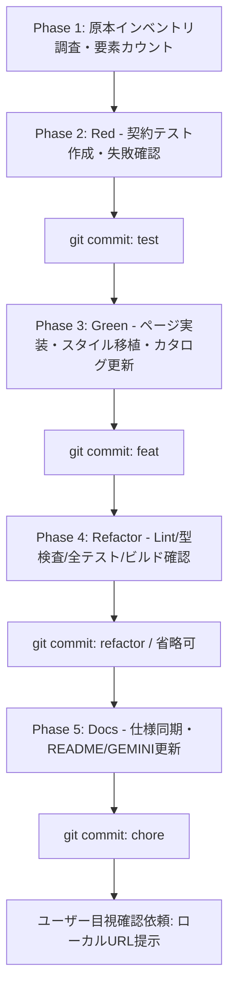

# Next.js ガイドページ移行プロンプト（指示書テンプレート）

このドキュメントは、当リポジトリ（`software-architecture-design`）において、静的 HTML ガイドを `web-next/`（Next.js 16 App Router + React 19）へ 100% 欠落なく完全移行するための**AIエージェント向け指示書（プロンプト）テンプレート**です。

---

## 使い方

新規ガイドページを移行する際は、以下の「移行プロンプト本体」をコピーし、冒頭の **【移行対象パラメータ】** を実際の対象ページに合わせて書き換えてから、AIエージェントへの指示として渡してください。

---

# 【移行プロンプト本体】

## 目的

`[原本HTMLパス]` の内容を、`web-next/` の Next.js（App Router）へ **100% 欠落なく完全移行** してください。
移行漏れやスタイリング劣化を完全に防ぐため、厳格な **TDD（Red → Green → Refactor → Docs）** と、原本要素の機械的カウント照合に基づく **契約テスト（Contract Testing）** を実施し、ステップバイステップの小さなコミット単位で作業を進めてください。

---

## 【移行対象パラメータ】

作業前に以下の変数を設定・確認してください:

- **原本 HTML パス**: `[原本HTMLパス]` (例: `architecture/microservices-architecture-comprehensive-guide/microservices-architecture-comprehensive-guide.html`)
- **移行先カテゴリ**: `[移行先カテゴリ]` (例: `architecture`, `design-principles`, `development-methodologies`, `product-and-enterprise`, `general`, `css-design-system-guide`)
- **移行先 slug**: `[移行先slug]` (例: `microservices-architecture-comprehensive-guide`)
- **ガイド日本語タイトル**: `[日本語タイトル]` (例: `マイクロサービスアーキテクチャ`)
- **スコープクラス名**: `[スコープクラス名]` (通常は slug と同名。例: `.microservices-architecture-comprehensive-guide`)
- **配置先ディレクトリ**: `web-next/app/[移行先カテゴリ]/[移行先slug]/`

---

## 参照ルール・仕様書（作業開始前に必読）

作業着手前に以下のファイルを必ず読み込み、各指示・ワークフローを遵守してください。

1. **`GEMINI.md`**: プロジェクト全体の絶対ルール（最優先）
2. **`CLAUDE.md`**: 開発ガイドラインおよびコマンド仕様
3. **`.claude/rules/tdd-commit-workflow.md`**: TDD コミットワークフロー規約（Red → Green → Refactor → Docs）
4. **`.claude/rules/no-absolute-paths.md`**: PII・絶対パス排除の検証規約
5. **`.claude/skills/nextjs-page-migration/SKILL.md`**: Next.js ページ移行の標準手順とパターン
6. **`.claude/skills/fix-mermaid/SKILL.md`**: Mermaid 構文修正ガイド
7. **`docs/development-rules.md`**: ドキュメントおよびコード規約
8. **参照実装**:
   - `web-next/app/general/comprehensive-guide/page.tsx`（初回参照実装）
   - `web-next/app/architecture/clean-architecture-comprehensive-guide/`（サイドバー + 契約テストの標準例）
   - `web-next/app/architecture/microservices-architecture-comprehensive-guide/page.tsx`（手書き span ハイライトの標準例）
   - `web-next/app/globals.css`（スコープスタイル定義の標準例）

---

## 厳守事項・実行制約（絶対遵守）

### 1. 実行コマンド制約

- **パッケージマネージャーは Bun を使用してください**: `npm` / `npx` / `yarn` / `pnpm` / `node` の実行は禁止です。
- **テスト実行**: 必ず `(cd web-next && bun run test <対象テストパス>)` で実行してください（`bun test` は vitest/jsdom 設定を無視するため禁止）。
- **Biome Lint 実行**: 必ず対象ファイル/ディレクトリを指定してください（例: `(cd web-next && bun run lint app/<カテゴリ>/<slug>)`）。引数なしで `bun run lint:fix` や `bunx biome check --write` をリポジトリ全体に実行することは禁止です。
- **設定ファイルの勝手な変更禁止**: `next.config.ts`, `tsconfig.json` などの勝手な変更は禁止です。ただし、手書き span 構文ハイライトのために `biome.json` の `overrides` に `app/<カテゴリ>/<slug>/page.tsx` を追加して `noDangerouslySetInnerHtml: "off"` を設定することは規定の手順です。
- **原本ファイルの保持**: 原本 HTML/Markdown は削除せず保持してください。

### 2. 100% 完全移植とスタイリング防犯原則（要約・省略・縮約の絶対禁止）
- **完全移植の義務**: ソース HTML の要約、省略、縮約、代表抽出、見出しの言い換えは重大な規約違反です。全セクション・全段落・全リスト項目・全図表・全コードブロック・全外部リンクを 100% 漏れなく JSX へ転写してください。
- **Server Component デフォルト**: `page.tsx` は Server Component を維持してください（`"use client"` 禁止）。
- **クライアント chrome の分離**: 固定サイドバー・進捗バー・scroll-spy などのクライアント interactivity は、別ファイル `<Topic>Sidebar.tsx`（`"use client"`）に分離し、本文セクションは Server Component の children または DOM 経由で監視してください。
- **共通ヘッダー・ディスクレーマー**: `<SiteHeader>` / `<DisclaimerBanner>` は `app/layout.tsx` に配置済みのため、ページ側で再配置しないでください。
- **スタイリング防犯ルール**:
  - **CSS Modules 不使用**: 本リポジトリは CSS Modules (`*.module.css`) や shiki は使用しません。`web-next/app/globals.css` 内のスコープクラス（`.<slug> { … }`）配下にネストして記述します。
  - **ページ固有トークンの温存**: ソース HTML が持つ独自トークン（例: `--ac`, `--bg`, `--sf`, `--gn`, `--or` 等）は、共通トークンへ無理にリマップせず、スコープクラス内のローカル変数として温存してください。
  - **コードブロック**: 手書き span ハイライト（`<span class="kw|st|fn|cm|nu">`）を `dangerouslySetInnerHTML` のテンプレートリテラルで `<pre>` に直接渡します（`<code>` ラッパーなし）。パディングやフォント指定は `.cd pre` 自体に設定し、スコープクラス内に `.kw`, `.st`, `.fn`, `.cm`, `.nu` の色定義を記述してください。
  - **Mermaid 図**: `import MermaidDiagram from "@/components/MermaidDiagram";`（default export）を使用します。ラベル内の改行記法 `\n` はテンプレートリテラル内で `\\n` と二重エスケープしてください。ページ側 CSS で layout や svg を上書きしないでください。
  - **外部リンク**: `import { Ext } from "@/components/Ext";`（named export）を使用し、`target="_blank"` と `rel="noopener noreferrer"` を保証してください。内部リンク（アンカー等）は通常の `<a>` を使用し、旧 `.html` 拡張子は除去してください。
  - **アイコン**: 元 HTML の `<i class="ti ti-xxx">` は `@tabler/icons-react` のコンポーネント（`<IconXxx />`）に変換してください。Unicode 絵文字はそのまま維持して構いません。
  - **アンカーめり込み防止**: 見出し等に `scroll-margin-top: calc(var(--header-height, 60px) + 80px)` を適用してください。

### 3. 厳格な TDD（Red → Green → Refactor → Docs）とコミット分割
- **一括コミット厳禁**: テスト・実装・リファクタ・ドキュメントを 1 コミットにまとめることは重大な規約違反です。各論理ステップ完了ごとにコミットを実行してください。
- **Red フェーズの厳守**: 失敗するテスト（Red）を確認せずに実装コードを書いてはなりません。
- **コミットメッセージ形式**:
  - `test(web-next): add failing contract specs for <slug>`
  - `feat(web-next): implement <slug> with 100% source parity`
  - `refactor(web-next): clean up styles and components for <slug>`
  - `chore(docs): sync specifications and update catalog for <slug>`
- **PII・絶対パス検査**: すべてのコミット前に、必ず `git diff --cached` でユーザー名やローカル絶対パス（`/Users/` 等）が含まれていないことを確認してください。

### 4. ガイドカタログ登録とグローバルナビ同期
- 新規ページは `web-next/lib/guide-catalog.ts` の該当エントリの `status` を `"published"` に更新してください。
- 必要に応じて `web-next/components/site/nav-links.ts` と整合していることを確認し、契約テスト `(cd web-next && bun run test lib/guide-catalog-nav.test.ts)` の通過を確認してください。

---

## 実行フェーズ



### Phase 1: 原本インベントリ調査・要素カウント・計画策定

1. 原本 HTML の規模、見出し階層、リスト構造、Mermaid 図、コードブロック、テーブル、外部リンク数を機械的に計測します:

   ```bash
   # 見出し数の計測
   grep -c '<h1>' [原本HTMLパス]
   grep -c '<h2>' [原本HTMLパス]
   grep -c '<h3' [原本HTMLパス]

   # セクションID配列の抽出（順序の確認）
   grep -oE 'id="[^"]+"' [原本HTMLパス]

   # Mermaid図・テーブル・コードブロック数の計測
   grep -c 'class="mermaid"' [原本HTMLパス]
   grep -c '<table' [原本HTMLパス]
   grep -c '<pre' [原本HTMLパス]

   # 外部リンク数の計測
   grep -oE 'href="https?://[^"]*"' [原本HTMLパス] | wc -l
   ```

2. 調査結果をまとめ、移行計画（コンポーネント構成、スコープ名、実装タスクリスト）を提示してください。

---

### Phase 2: [Red] 契約テストの作成とコミット

1. `web-next/app/[移行先カテゴリ]/[移行先slug]/page.test.tsx` を作成します。
   - 先頭に `// @vitest-environment jsdom` を記述。
   - `MermaidDiagram` は軽量モックに差し替える:

     ```tsx
     vi.mock("@/components/MermaidDiagram", () => ({
       default: ({ chart }: { chart: string }) => <div className="mermaid" data-chart={chart} />,
     }));
     ```

   - **契約テストの必須アサーション（最低 6 契約）**:
     1. `h1` テキストの一致検証
     2. `h2` 見出し数の完全一致検証
     3. `section.section` の `id` 配列が原本の順序・個数と完全一致（`toEqual([...])`）
     4. 外部リンクすべてに `target="_blank"` と `rel="noopener noreferrer"` が付与されていること
     5. 内部リンク（`#` や相対パス）に旧 `.html` が含まれていないこと
     6. Mermaid 図数・table 数・コードブロック（`pre`）数が原本実数と完全一致すること
     7. `globals.css` にスコープクラスとレイアウト定義が含まれていること

2. サイドバーが存在する場合は、同階層に `<Topic>Sidebar.test.tsx` を作成し、進捗バー計算と scroll-spy の active 切替（IntersectionObserver スタブ使用）をテストします。

3. テストを実行し、**テストが失敗すること（Red）** を確認します:
   ```bash
   (cd web-next && bun run test app/[移行先カテゴリ]/[移行先slug]/page.test.tsx)
   ```

4. PII・絶対パスの混入がないことを検証し、Red コミットを実行します:
   ```bash
   git diff --cached | grep -E '^\+[^+]' | grep -E '(/Users/|/home/|C:\\Users\\)'
   git commit -m "test(web-next): add failing contract specs for [移行先slug]"
   ```

---

### Phase 3: [Green] ページ実装・スタイル移植・カタログ登録とコミット

1. `web-next/app/[移行先カテゴリ]/[移行先slug]/page.tsx` を作成し、原本の全要素を 100% 漏れなく JSX 化します。
   - 必要に応じて同階層に `<Topic>Sidebar.tsx`（`"use client"`）を作成。
2. `web-next/app/globals.css` にスコープクラス（`.[スコープクラス名] { … }`）を追加し、元 HTML のスタイル・ページ固有トークン・手書き span 構文ハイライト定義（`.kw`, `.st`, `.fn`, `.cm`, `.nu`）を移植します。
3. `web-next/biome.json` の `overrides` に当該ページを追加し、`noDangerouslySetInnerHtml: "off"` を設定します:
   ```jsonc
   {
     "includes": ["app/[移行先カテゴリ]/[移行先slug]/page.tsx"],
     "linter": {
       "rules": {
         "security": {
           "noDangerouslySetInnerHtml": "off"
         }
       }
     }
   }
   ```
4. `web-next/lib/guide-catalog.ts` の該当エントリの `status` を `"published"` に更新します。
5. 契約テストおよびカタログナビテストを実行し、すべて成功（Green）することを確認します:
   ```bash
   (cd web-next && bun run test app/[移行先カテゴリ]/[移行先slug]/page.test.tsx)
   (cd web-next && bun run test lib/guide-catalog-nav.test.ts)
   ```
6. PII・絶対パスの混入がないことを検証し、Green コミットを実行します:
   ```bash
   git diff --cached | grep -E '^\+[^+]' | grep -E '(/Users/|/home/|C:\\Users\\)'
   git commit -m "feat(web-next): implement [移行先slug] with 100% source parity"
   ```

---

### Phase 4: [Refactor] 品質検証とリファクタコミット

1. Lint および型チェックを実行し、エラーがゼロであることを確認します:
   ```bash
   (cd web-next && bun run lint app/[移行先カテゴリ]/[移行先slug])
   (cd web-next && bun run typecheck)
   ```
2. 全体テストを実行し、リグレッションがないことを確認します:
   ```bash
   (cd web-next && bun run test)
   ```
3. プロダクションビルドを実行し、ビルドエラーがないことを確認します:
   ```bash
   (cd web-next && bun run build)
   ```
4. コード整理や重複排除を行った場合は、PII 検査後にリファクタコミットを実行します（コード変更がない場合はスキップ可）:
   ```bash
   git commit -m "refactor(web-next): clean up styles and components for [移行先slug]"
   ```

---

### Phase 5: [Docs] 仕様書・進捗同期と確認依頼

1. `GEMINI.md` および `README.md` の「移行済み」リストに新規移行ページを追記・同期します。
2. PII・絶対パスの混入がないことを検証し、Docs コミットを実行します:
   ```bash
   git diff --cached | grep -E '^\+[^+]' | grep -E '(/Users/|/home/|C:\\Users\\)'
   git commit -m "chore(docs): sync specifications and update catalog for [移行先slug]"
   ```
3. ユーザーへ実装完了を報告し、ブラウザで確認すべきローカル URL（例: `http://localhost:3000/[移行先カテゴリ]/[移行先slug]`）を提示して手動目視確認を依頼してください。

---

## 参考文献・ソース一覧

- **開発規約**: [`GEMINI.md`](../GEMINI.md)
- **プロジェクトガイドライン**: [`CLAUDE.md`](../CLAUDE.md)
- **TDDワークフロー規約**: [`.claude/rules/tdd-commit-workflow.md`](../.claude/rules/tdd-commit-workflow.md)
- **絶対パス排除規約**: [`.claude/rules/no-absolute-paths.md`](../.claude/rules/no-absolute-paths.md)
- **Next.jsページ移行スキル**: [`.claude/skills/nextjs-page-migration/SKILL.md`](../.claude/skills/nextjs-page-migration/SKILL.md)
- **ガイドカタログ定義**: [`web-next/lib/guide-catalog.ts`](../web-next/lib/guide-catalog.ts)
- **グローバルナビ定義**: [`web-next/components/site/nav-links.ts`](../web-next/components/site/nav-links.ts)
