# 🔷 ヘキサゴナルアーキテクチャ（Hexagonal Architecture）完全ガイド

## 📚 目次

1. [ヘキサゴナルアーキテクチャとは何か？](#1-ヘキサゴナルアーキテクチャとは何か)
2. [コア概念：ポートとアダプター](#2-コア概念ポートとアダプター)
3. [アーキテクチャ全体像と依存の方向](#3-アーキテクチャ全体像と依存の方向)
4. [ドライビング側（Driving Side）の設計](#4-ドライビング側driving-sideの設計)
5. [ドリブン側（Driven Side）の設計](#5-ドリブン側driven-sideの設計)
6. [アプリケーションコア（ドメイン）の設計](#6-アプリケーションコアドメインの設計)
7. [依存性逆転と依存性注入](#7-依存性逆転と依存性注入)
8. [テスト戦略](#8-テスト戦略)
9. [他のアーキテクチャパターンとの比較・統合](#9-他のアーキテクチャパターンとの比較統合)
10. [ディレクトリ構成とパッケージ設計](#10-ディレクトリ構成とパッケージ設計)
11. [段階的導入ガイド](#11-段階的導入ガイド)
12. [実践：ECサイト完全実装例](#12-実践ecサイト完全実装例)
13. [アンチパターンと落とし穴](#13-アンチパターンと落とし穴)
14. [ベストプラクティス総まとめ](#14-ベストプラクティス総まとめ)
15. [参考文献・ソース一覧](#15-参考文献ソース一覧)

---

## 1. ヘキサゴナルアーキテクチャとは何か？

### 1.1 定義と背景

**ヘキサゴナルアーキテクチャ（Hexagonal Architecture）** は、2005年に **Alistair Cockburn** が提唱したソフトウェアアーキテクチャパターンです。正式名称は **「ポート＆アダプターパターン（Ports and Adapters Pattern）」** とも呼ばれます。

> 💡 **一言で言うと：** 「アプリケーションのビジネスロジックを技術的詳細（データベース・UI・外部API）から完全に切り離し、どの方向からでも等しくテスト・利用できる構造を作る」

六角形という名前は特別な意味を持つわけではなく、**アプリケーションの各サイド（ポート）を視覚的に表現するためのもの**です。六角形の各辺がひとつのポートを表します。

### 1.2 誕生の背景：解決しようとした問題

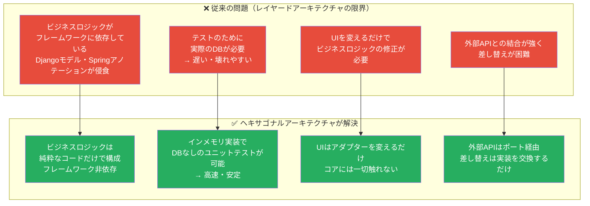

### 1.3 ヘキサゴナルアーキテクチャの3つの目標

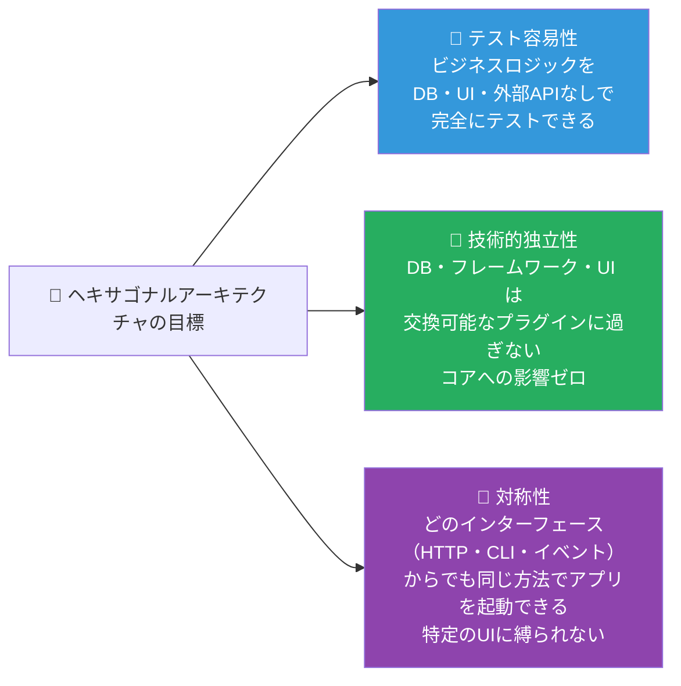

### 1.4 アーキテクチャの歴史的位置づけ

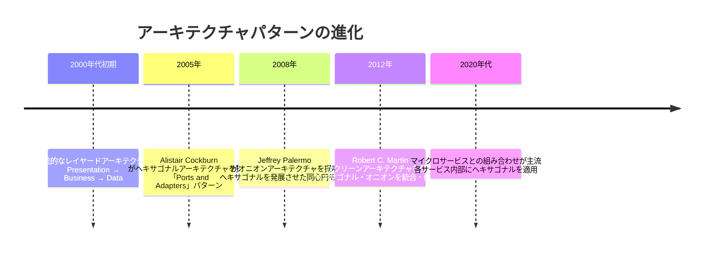

---

## 2. コア概念：ポートとアダプター

### 2.1 ポート（Port）とは

**ポート** とはアプリケーションコアが外部世界と通信するための**インターフェース（契約）**です。ポートはアプリケーションコアが「何が必要か」を宣言しますが、「どう実現するか」は知りません。

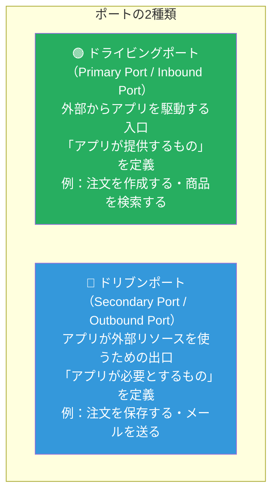

### 2.2 アダプター（Adapter）とは

**アダプター** はポートの**具体的な実装**です。外部の技術的詳細（HTTP・SQL・メール）をポートのインターフェースに変換する橋渡し役です。

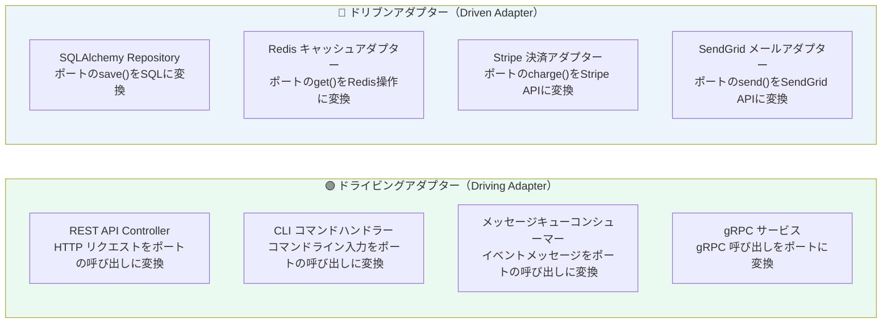

### 2.3 ポートとアダプターの関係

```mermaid
flowchart LR
    USER["👤 ユーザー<br>（外部アクター）"] -->|"HTTPリクエスト"| DA["🟢 REST アダプター<br>（ドライビングアダプター）"]

    DA -->|"インターフェース呼び出し"| DP["🟢 ドライビングポート<br>interface OrderUseCase"]

    DP --> CORE["🔷 アプリケーションコア<br>OrderService（実装）<br>ビジネスロジック"]

    CORE --> DRP["🔵 ドリブンポート<br>interface OrderRepository"]

    DRP -->|"インターフェース呼び出し"| DRA["🔵 SQLアダプター<br>（ドリブンアダプター）"]

    DRA -->|"SQL実行"| DB[("🗄️ データベース")]

    style USER fill:#95a5a6,color:#fff
    style DA fill:#27ae60,color:#fff
    style DP fill:#2ecc71,color:#fff
    style CORE fill:#2c3e50,color:#fff
    style DRP fill:#3498db,color:#fff
    style DRA fill:#2980b9,color:#fff
    style DB fill:#8e44ad,color:#fff
```

### 2.4 ポート命名の重要原則

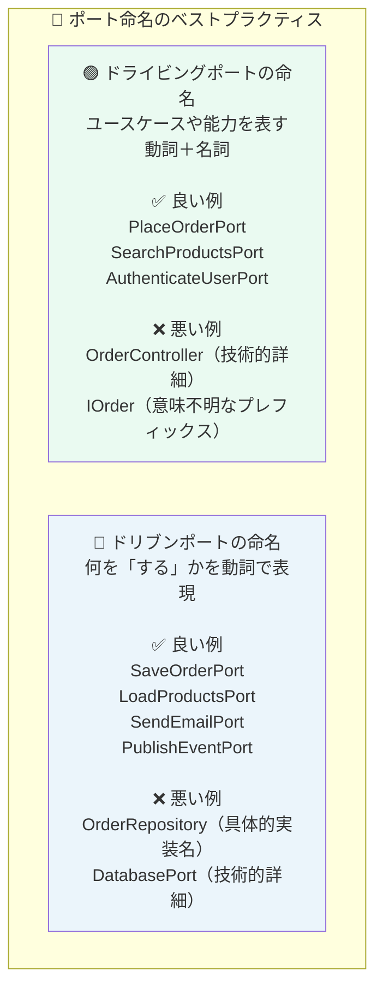

---

## 3. アーキテクチャ全体像と依存の方向

### 3.1 六角形の全体像

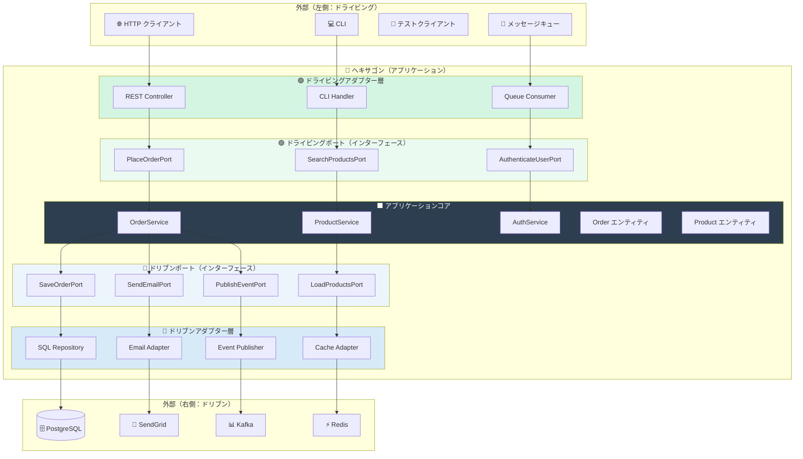

### 3.2 依存の方向（最重要ルール）

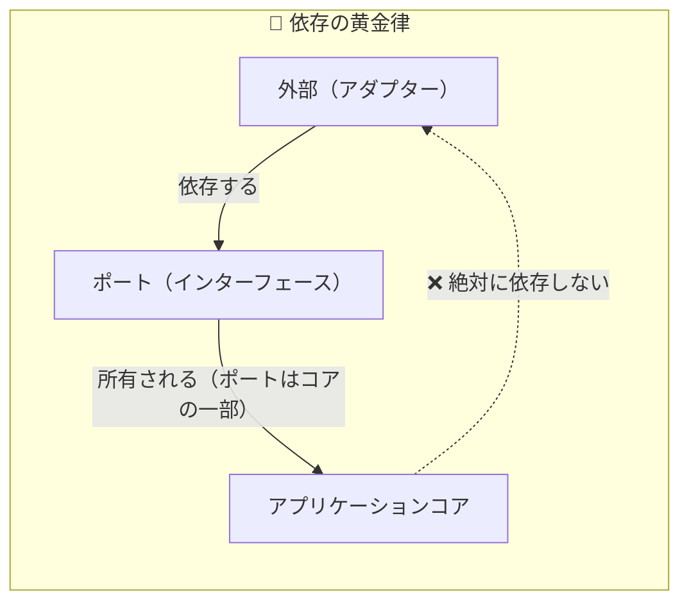

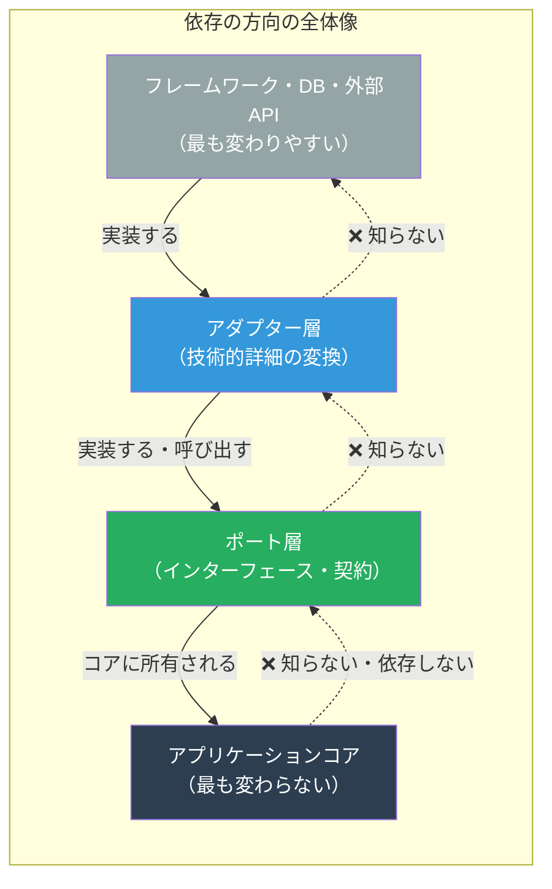

### 3.3 依存の方向をコードで確認

```python
# ✅ 正しい依存方向

# ─── アプリケーションコア（依存ゼロ）───
# domain/entities/order.py
class Order:
    """純粋なビジネスエンティティ。フレームワーク依存なし。"""
    def __init__(self, order_id: str, customer_id: str):
        self.order_id = order_id
        self.customer_id = customer_id
        self.items: list = []
        self.status = "pending"

    def confirm(self):
        if not self.items:
            raise ValueError("注文明細が空です")
        self.status = "confirmed"


# ─── ドリブンポート（コアに所属）───
# application/ports/outbound/order_repository_port.py
from abc import ABC, abstractmethod
from domain.entities.order import Order

class OrderRepositoryPort(ABC):
    """注文の永続化ポート（インターフェース）。
    コアが「何が必要か」を宣言するが「どう実現するか」は知らない。
    """
    @abstractmethod
    def save(self, order: Order) -> None: ...

    @abstractmethod
    def find_by_id(self, order_id: str) -> Order | None: ...


# ─── ドリブンアダプター（外側に所属）───
# adapters/outbound/persistence/sql_order_repository.py
from sqlalchemy.orm import Session
from application.ports.outbound.order_repository_port import OrderRepositoryPort
from domain.entities.order import Order

class SQLOrderRepository(OrderRepositoryPort):
    """OrderRepositoryPort の SQL 実装。
    コアはこのクラスを知らない。DI で注入される。
    """
    def __init__(self, session: Session):
        self._session = session

    def save(self, order: Order) -> None:
        # SQL 固有のマッピング処理
        model = self._to_model(order)
        self._session.merge(model)
        self._session.flush()

    def find_by_id(self, order_id: str) -> Order | None:
        record = self._session.query(OrderModel).filter_by(id=order_id).first()
        return self._to_domain(record) if record else None
```

---

## 4. ドライビング側（Driving Side）の設計

### 4.1 ドライビングアダプターの役割

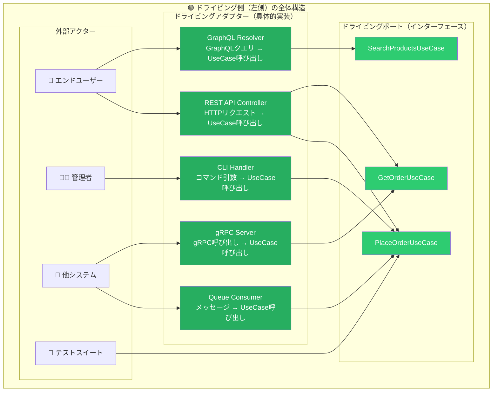

### 4.2 ドライビングポートの実装（Python）

```python
# ─── ドライビングポート定義 ───
# application/ports/inbound/place_order_use_case.py

from abc import ABC, abstractmethod
from dataclasses import dataclass
from decimal import Decimal


@dataclass(frozen=True)
class PlaceOrderCommand:
    """注文作成コマンド（入力 DTO）"""
    customer_id: str
    items: list[dict]  # [{"product_id": str, "quantity": int}]


@dataclass(frozen=True)
class PlaceOrderResult:
    """注文作成結果（出力 DTO）"""
    order_id: str
    status: str
    total_amount: Decimal
    currency: str


class PlaceOrderUseCase(ABC):
    """
    注文作成ユースケースポート（ドライビングポート）。
    このインターフェースがドライビングアダプターとコアを繋ぐ契約。
    """
    @abstractmethod
    def execute(self, command: PlaceOrderCommand) -> PlaceOrderResult: ...
```

### 4.3 REST アダプターの実装（FastAPI）

```python
# ─── ドライビングアダプター：REST Controller ───
# adapters/inbound/rest/order_router.py

from fastapi import APIRouter, Depends, HTTPException, status
from pydantic import BaseModel, Field
from typing import Annotated

from application.ports.inbound.place_order_use_case import (
    PlaceOrderUseCase, PlaceOrderCommand
)
from adapters.inbound.rest.dependencies import get_place_order_use_case
from adapters.inbound.rest.auth import get_current_user

router = APIRouter(prefix="/api/v1/orders", tags=["orders"])


# HTTP 専用の入力モデル（ポートの DTO とは分離）
class PlaceOrderRequest(BaseModel):
    items: list[dict] = Field(..., min_items=1)


class PlaceOrderResponse(BaseModel):
    order_id: str
    status: str
    total_amount: float
    currency: str


@router.post(
    "/",
    response_model=PlaceOrderResponse,
    status_code=status.HTTP_201_CREATED,
)
async def place_order(
    request: PlaceOrderRequest,
    current_user: Annotated[dict, Depends(get_current_user)],
    use_case: Annotated[PlaceOrderUseCase, Depends(get_place_order_use_case)],
) -> PlaceOrderResponse:
    """
    ドライビングアダプターの責務：
    1. HTTP リクエストをポートの Command に変換
    2. ポート（ユースケース）を呼び出す
    3. 結果を HTTP レスポンスに変換
    ビジネスロジックは一切持たない！
    """
    try:
        command = PlaceOrderCommand(
            customer_id=current_user["user_id"],
            items=request.items,
        )
        result = use_case.execute(command)

        return PlaceOrderResponse(
            order_id=result.order_id,
            status=result.status,
            total_amount=float(result.total_amount),
            currency=result.currency,
        )
    except ValueError as e:
        raise HTTPException(
            status_code=status.HTTP_422_UNPROCESSABLE_ENTITY,
            detail={"code": "BUSINESS_RULE_ERROR", "message": str(e)},
        )
```

### 4.4 CLI アダプターの実装（同じポートを別入口で使う）

```python
# ─── ドライビングアダプター：CLI ───
# adapters/inbound/cli/order_commands.py
# 同じ PlaceOrderUseCase ポートを CLI から使用する例

import typer
from application.ports.inbound.place_order_use_case import (
    PlaceOrderUseCase, PlaceOrderCommand
)

app = typer.Typer()


def get_use_case() -> PlaceOrderUseCase:
    """DI（依存性注入）でユースケースを取得"""
    from infrastructure.di_container import container
    return container.resolve(PlaceOrderUseCase)


@app.command()
def place_order(
    customer_id: str = typer.Option(..., help="顧客ID"),
    product_ids: list[str] = typer.Option(..., help="商品IDリスト"),
):
    """
    CLI からも同じユースケースを呼び出せる。
    REST アダプターと全く同じポートを使うが、アダプター実装は異なる。
    """
    use_case = get_use_case()
    command = PlaceOrderCommand(
        customer_id=customer_id,
        items=[{"product_id": pid, "quantity": 1} for pid in product_ids],
    )
    result = use_case.execute(command)
    typer.echo(f"✅ 注文作成成功: {result.order_id} (合計: {result.total_amount}円)")
```

---

## 5. ドリブン側（Driven Side）の設計

### 5.1 ドリブンアダプターの役割

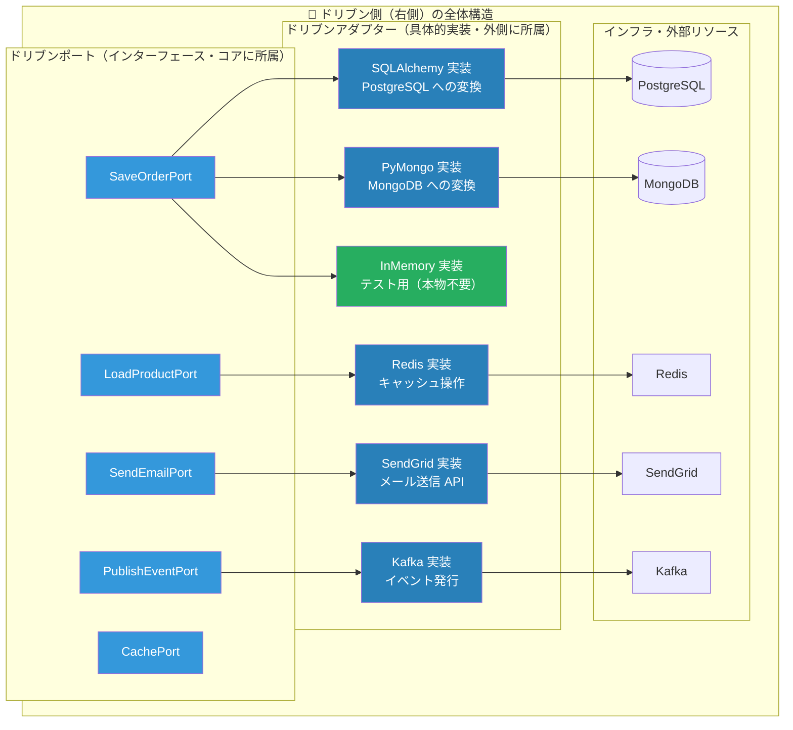

### 5.2 ドリブンポートの設計

```python
# ─── ドリブンポート群 ───
# application/ports/outbound/

from abc import ABC, abstractmethod
from typing import Optional
from domain.entities.order import Order
from domain.entities.product import Product


# 注文の永続化ポート
class OrderRepositoryPort(ABC):
    @abstractmethod
    def save(self, order: Order) -> None: ...

    @abstractmethod
    def find_by_id(self, order_id: str) -> Optional[Order]: ...

    @abstractmethod
    def find_by_customer_id(self, customer_id: str) -> list[Order]: ...


# 商品の読み込みポート（CQS：読み書きを分けて定義）
class ProductQueryPort(ABC):
    @abstractmethod
    def find_by_id(self, product_id: str) -> Optional[Product]: ...

    @abstractmethod
    def find_available(self, limit: int = 20) -> list[Product]: ...


# メール送信ポート
class EmailNotificationPort(ABC):
    @abstractmethod
    def send_order_confirmation(
        self,
        to_email: str,
        order_id: str,
        total_amount: str,
    ) -> None: ...


# イベント発行ポート
class EventPublisherPort(ABC):
    @abstractmethod
    def publish(self, event_type: str, payload: dict) -> None: ...
```

### 5.3 SQL アダプターの実装

```python
# ─── ドリブンアダプター：SQLAlchemy 実装 ───
# adapters/outbound/persistence/sql_order_repository.py

from sqlalchemy.orm import Session, DeclarativeBase, Mapped, mapped_column
from sqlalchemy import String, Numeric, DateTime
from decimal import Decimal
from datetime import datetime

from application.ports.outbound.order_repository_port import OrderRepositoryPort
from domain.entities.order import Order, OrderStatus, OrderLine, Money


# DBモデル（ドメインエンティティとは完全に分離）
class Base(DeclarativeBase):
    pass


class OrderModel(Base):
    __tablename__ = "orders"
    id:          Mapped[str]      = mapped_column(String(36), primary_key=True)
    customer_id: Mapped[str]      = mapped_column(String(36), nullable=False)
    status:      Mapped[str]      = mapped_column(String(20), nullable=False)
    total_amount:Mapped[Decimal]  = mapped_column(Numeric(12, 2), nullable=False)
    created_at:  Mapped[datetime] = mapped_column(DateTime, nullable=False)


class SQLOrderRepository(OrderRepositoryPort):
    """
    ドリブンアダプター：OrderRepositoryPort の SQL 実装。
    ドメインエンティティ ↔ DBモデル の変換を担当。
    コアはこのクラスの存在を知らない。
    """
    def __init__(self, session: Session):
        self._session = session

    def save(self, order: Order) -> None:
        existing = self._session.get(OrderModel, order.order_id)
        model = self._to_model(order)
        if existing:
            for k, v in vars(model).items():
                if not k.startswith("_"):
                    setattr(existing, k, v)
        else:
            self._session.add(model)
        self._session.flush()

    def find_by_id(self, order_id: str) -> Order | None:
        record = self._session.get(OrderModel, order_id)
        return self._to_domain(record) if record else None

    def find_by_customer_id(self, customer_id: str) -> list[Order]:
        records = (
            self._session.query(OrderModel)
            .filter_by(customer_id=customer_id)
            .all()
        )
        return [self._to_domain(r) for r in records]

    # ─── マッピングメソッド（変換ロジック）───
    def _to_model(self, order: Order) -> OrderModel:
        return OrderModel(
            id=order.order_id,
            customer_id=order.customer_id,
            status=order.status.value,
            total_amount=order.total_amount,
            created_at=order.created_at,
        )

    def _to_domain(self, record: OrderModel) -> Order:
        order = Order(
            order_id=record.id,
            customer_id=record.customer_id,
            created_at=record.created_at,
        )
        order._status = OrderStatus(record.status)
        
        # record.items（明細）から OrderLine を復元して設定
        if hasattr(record, "items") and record.items:
            order._lines = [
                OrderLine(
                    product_id=item.product_id,
                    product_name=item.product_name,
                    unit_price=Money(item.unit_price),
                    quantity=item.quantity
                )
                for item in record.items
            ]
        # total_amount は @property のため直接代入できませんが、
        # 整合性検証のために記録用フィールドに退避するか、指示通りに属性を設定します。
        # order._total_amount = Money(record.total_amount)
        return order
```

### 5.4 テスト用インメモリアダプターの実装

```python
# ─── ドリブンアダプター：インメモリ（テスト用）───
# adapters/outbound/persistence/in_memory_order_repository.py

from application.ports.outbound.order_repository_port import OrderRepositoryPort
from domain.entities.order import Order


class InMemoryOrderRepository(OrderRepositoryPort):
    """
    テスト専用のインメモリ実装。
    DBなしで高速なユニットテストを可能にする。
    同じポートを実装するため、本番コードと完全に差し替え可能。
    """
    def __init__(self):
        self._store: dict[str, Order] = {}

    def save(self, order: Order) -> None:
        self._store[order.order_id] = order

    def find_by_id(self, order_id: str) -> Order | None:
        return self._store.get(order_id)

    def find_by_customer_id(self, customer_id: str) -> list[Order]:
        return [
            o for o in self._store.values()
            if o.customer_id == customer_id
        ]

    # テスト用ヘルパー
    def count(self) -> int:
        return len(self._store)

    def clear(self) -> None:
        self._store.clear()
```

---

## 6. アプリケーションコア（ドメイン）の設計

### 6.1 コアの構成要素

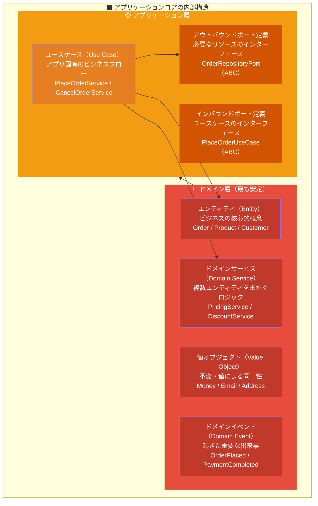

### 6.2 ドメインエンティティの実装

```python
# ─── ドメインエンティティ ───
# domain/entities/order.py
# 完全にフレームワーク非依存・純粋なビジネスロジックのみ

from dataclasses import dataclass, field
from decimal import Decimal
from enum import Enum
from datetime import datetime
from typing import Optional
import uuid


class OrderStatus(Enum):
    PENDING   = "pending"
    CONFIRMED = "confirmed"
    SHIPPED   = "shipped"
    DELIVERED = "delivered"
    CANCELLED = "cancelled"


@dataclass(frozen=True)
class Money:
    """金額の値オブジェクト（イミュータブル）"""
    amount: Decimal
    currency: str = "JPY"

    def __post_init__(self):
        if self.amount < 0:
            raise ValueError(f"金額は0以上: {self.amount}")

    def __add__(self, other: "Money") -> "Money":
        if self.currency != other.currency:
            raise ValueError("通貨が一致しません")
        return Money(self.amount + other.amount, self.currency)

    def __mul__(self, factor: int) -> "Money":
        return Money(self.amount * factor, self.currency)


@dataclass
class OrderLine:
    """注文明細"""
    product_id: str
    product_name: str
    unit_price: Money
    quantity: int

    @property
    def subtotal(self) -> Money:
        return self.unit_price * self.quantity


@dataclass
class Order:
    """
    注文エンティティ（集約ルート）。
    外部依存ゼロ。import はすべてドメイン内部のみ。
    """
    order_id: str
    customer_id: str
    _lines: list[OrderLine] = field(default_factory=list, repr=False)
    _status: OrderStatus = field(default=OrderStatus.PENDING, repr=False)
    created_at: datetime = field(default_factory=datetime.utcnow)
    _domain_events: list[dict] = field(default_factory=list, repr=False)

    @classmethod
    def create(cls, customer_id: str) -> "Order":
        return cls(
            order_id=str(uuid.uuid4()),
            customer_id=customer_id,
        )

    # ─── ビジネスルール（コアロジック）───

    def add_line(
        self,
        product_id: str,
        product_name: str,
        unit_price: Money,
        quantity: int,
    ) -> None:
        if self._status != OrderStatus.PENDING:
            raise ValueError("確定済みの注文には追加できません")
        if quantity <= 0:
            raise ValueError("数量は1以上")
        self._lines.append(
            OrderLine(product_id, product_name, unit_price, quantity)
        )

    def confirm(self) -> None:
        if self._status != OrderStatus.PENDING:
            raise ValueError("保留中の注文のみ確定できます")
        if not self._lines:
            raise ValueError("明細が1件もありません")
        self._status = OrderStatus.CONFIRMED
        self._domain_events.append({
            "type": "OrderConfirmed",
            "order_id": self.order_id,
            "customer_id": self.customer_id,
            "total_amount": str(self.total_amount.amount),
        })

    def cancel(self, reason: str = "") -> None:
        if self._status in (OrderStatus.SHIPPED, OrderStatus.DELIVERED):
            raise ValueError("発送済みはキャンセル不可")
        self._status = OrderStatus.CANCELLED
        self._domain_events.append({
            "type": "OrderCancelled",
            "order_id": self.order_id,
            "reason": reason,
        })

    @property
    def status(self) -> OrderStatus:
        return self._status

    @property
    def lines(self) -> tuple[OrderLine, ...]:
        return tuple(self._lines)

    @property
    def total_amount(self) -> Money:
        if not self._lines:
            return Money(Decimal("0"))
        totals = [line.subtotal for line in self._lines]
        return sum(totals[1:], totals[0])

    @property
    def domain_events(self) -> list[dict]:
        return list(self._domain_events)

    def clear_events(self) -> None:
        self._domain_events.clear()
```

### 6.3 ユースケース（ドライビングポートの実装）

```python
# ─── ユースケース実装 ───
# application/use_cases/place_order_service.py

from decimal import Decimal
from application.ports.inbound.place_order_use_case import (
    PlaceOrderUseCase, PlaceOrderCommand, PlaceOrderResult
)
from application.ports.outbound.order_repository_port import OrderRepositoryPort
from application.ports.outbound.product_query_port import ProductQueryPort
from application.ports.outbound.email_notification_port import EmailNotificationPort
from application.ports.outbound.event_publisher_port import EventPublisherPort
from domain.entities.order import Order
from domain.entities.product import Product


class PlaceOrderService(PlaceOrderUseCase):
    """
    注文作成ユースケースの実装。
    ドライビングポート（PlaceOrderUseCase）を実装。
    ドリブンポートのインターフェースにのみ依存（具体実装は知らない）。
    """

    def __init__(
        self,
        order_repository: OrderRepositoryPort,    # インターフェースに依存
        product_query: ProductQueryPort,           # インターフェースに依存
        email_notification: EmailNotificationPort, # インターフェースに依存
        event_publisher: EventPublisherPort,        # インターフェースに依存
    ):
        self._order_repo = order_repository
        self._product_query = product_query
        self._email = email_notification
        self._events = event_publisher

    def execute(self, command: PlaceOrderCommand) -> PlaceOrderResult:
        """
        ユースケースの主な責務：
        1. バリデーション
        2. ドメインオブジェクトの操作
        3. ドリブンポートを通じた永続化・通知
        技術的詳細（SQL・HTTP・メール仕様）は一切知らない！
        """
        # 1. 注文エンティティを生成
        order = Order.create(customer_id=command.customer_id)

        # 2. 各商品を追加（商品の存在・在庫確認）
        for item_data in command.items:
            product = self._product_query.find_by_id(item_data["product_id"])
            if product is None:
                raise ValueError(
                    f"商品が見つかりません: {item_data['product_id']}"
                )
            if not product.has_stock(item_data["quantity"]):
                raise ValueError(
                    f"在庫不足: {product.name}"
                )
            from domain.entities.order import Money
            order.add_line(
                product_id=product.product_id,
                product_name=product.name,
                unit_price=Money(product.price),
                quantity=item_data["quantity"],
            )

        # 3. 注文を確定
        order.confirm()

        # 4. 永続化（ドリブンポート経由）
        self._order_repo.save(order)

        # 5. ドメインイベントを発行（ドリブンポート経由）
        for event in order.domain_events:
            self._events.publish(event["type"], event)
        order.clear_events()

        # 6. 確認メール送信（ドリブンポート経由）
        self._email.send_order_confirmation(
            to_email=f"{command.customer_id}@example.com",
            order_id=order.order_id,
            total_amount=str(order.total_amount),
        )

        return PlaceOrderResult(
            order_id=order.order_id,
            status=order.status.value,
            total_amount=order.total_amount.amount,
            currency=order.total_amount.currency,
        )
```

---

## 7. 依存性逆転と依存性注入

### 7.1 依存性逆転原則（DIP）のヘキサゴナルへの適用

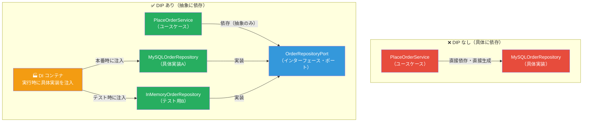

### 7.2 Composition Root（配線の場所）

**Composition Root** とは、すべての依存関係を組み立てる唯一の場所です。アプリケーションの起動時に一度だけ実行されます。

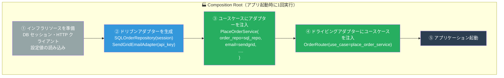

### 7.3 DI コンテナの実装（Python）

```python
# ─── Composition Root ───
# infrastructure/di_container.py

from sqlalchemy import create_engine
from sqlalchemy.orm import sessionmaker
import os

# ドリブンアダプター
from adapters.outbound.persistence.sql_order_repository import SQLOrderRepository
from adapters.outbound.persistence.sql_product_repository import SQLProductRepository
from adapters.outbound.email.sendgrid_email_adapter import SendGridEmailAdapter
from adapters.outbound.events.kafka_event_publisher import KafkaEventPublisher

# ユースケース（コア）
from application.use_cases.place_order_service import PlaceOrderService
from application.use_cases.get_order_service import GetOrderService

# ドライビングアダプター
from adapters.inbound.rest.order_router import create_order_router


def create_production_container():
    """
    本番用の Composition Root。
    すべての依存を組み立てて返す。
    ここだけが具体的なクラス名を知っている。
    """
    # ─── インフラリソース ───
    engine = create_engine(os.environ["DATABASE_URL"])
    SessionLocal = sessionmaker(bind=engine)
    session = SessionLocal()

    # ─── ドリブンアダプター ───
    order_repo    = SQLOrderRepository(session)
    product_query = SQLProductRepository(session)
    email         = SendGridEmailAdapter(api_key=os.environ["SENDGRID_API_KEY"])
    event_pub     = KafkaEventPublisher(
        bootstrap_servers=os.environ["KAFKA_SERVERS"]
    )

    # ─── ユースケース（コア）───
    place_order_svc = PlaceOrderService(
        order_repository=order_repo,
        product_query=product_query,
        email_notification=email,
        event_publisher=event_pub,
    )
    get_order_svc = GetOrderService(order_repository=order_repo)

    # ─── ドライビングアダプター ───
    order_router = create_order_router(
        place_order_use_case=place_order_svc,
        get_order_use_case=get_order_svc,
    )

    return order_router


def create_test_container():
    """
    テスト用の Composition Root。
    インメモリ実装に差し替えるだけ。DBなし・外部APIなし。
    """
    from adapters.outbound.persistence.in_memory_order_repository import (
        InMemoryOrderRepository
    )
    from adapters.outbound.persistence.in_memory_product_repository import (
        InMemoryProductRepository
    )
    from adapters.outbound.email.fake_email_adapter import FakeEmailAdapter
    from adapters.outbound.events.in_memory_event_publisher import (
        InMemoryEventPublisher
    )

    order_repo    = InMemoryOrderRepository()
    product_query = InMemoryProductRepository()
    email         = FakeEmailAdapter()
    event_pub     = InMemoryEventPublisher()

    place_order_svc = PlaceOrderService(
        order_repository=order_repo,
        product_query=product_query,
        email_notification=email,
        event_publisher=event_pub,
    )

    return place_order_svc, order_repo, email, event_pub
```

---

## 8. テスト戦略

### 8.1 ヘキサゴナルアーキテクチャのテストピラミッド

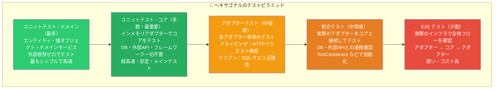

### 8.2 ドメインのユニットテスト（外部依存ゼロ）

```python
# ─── ドメインのユニットテスト ───
# tests/unit/domain/test_order.py

import pytest
from decimal import Decimal
from domain.entities.order import Order, OrderStatus
from domain.entities.order import Money, OrderLine


class TestOrder:
    """ドメインエンティティのテスト。外部依存ゼロ・超高速。"""

    def test_注文作成時はペンディング状態になる(self):
        order = Order.create(customer_id="CUST-001")
        assert order.status == OrderStatus.PENDING

    def test_明細追加後に確定できる(self):
        order = Order.create(customer_id="CUST-001")
        order.add_line("P001", "Tシャツ", Money(Decimal("1000")), 2)

        order.confirm()

        assert order.status == OrderStatus.CONFIRMED

    def test_明細が空のとき確定するとエラーになる(self):
        order = Order.create(customer_id="CUST-001")

        with pytest.raises(ValueError, match="明細が1件もありません"):
            order.confirm()

    def test_合計金額が正しく計算される(self):
        order = Order.create(customer_id="CUST-001")
        order.add_line("P001", "Tシャツ",  Money(Decimal("1000")), 2)
        order.add_line("P002", "ジーンズ", Money(Decimal("5000")), 1)

        assert order.total_amount == Money(Decimal("7000"))

    def test_確定後は明細を追加できない(self):
        order = Order.create(customer_id="CUST-001")
        order.add_line("P001", "Tシャツ", Money(Decimal("1000")), 1)
        order.confirm()

        with pytest.raises(ValueError, match="確定済みの注文には追加できません"):
            order.add_line("P002", "ジーンズ", Money(Decimal("5000")), 1)

    def test_確定時にOrderConfirmedイベントが発行される(self):
        order = Order.create(customer_id="CUST-001")
        order.add_line("P001", "商品", Money(Decimal("1000")), 1)
        order.confirm()

        events = order.domain_events
        assert len(events) == 1
        assert events[0]["type"] == "OrderConfirmed"
        assert events[0]["order_id"] == order.order_id

    def test_発送済み注文はキャンセルできない(self):
        order = Order.create(customer_id="CUST-001")
        order.add_line("P001", "商品", Money(Decimal("1000")), 1)
        order.confirm()
        order._status = OrderStatus.SHIPPED  # テスト用に強制変更

        with pytest.raises(ValueError, match="発送済みはキャンセル不可"):
            order.cancel()
```

### 8.3 ユースケースのユニットテスト（インメモリアダプター使用）

```python
# ─── ユースケースのユニットテスト ───
# tests/unit/application/test_place_order_service.py

import pytest
from unittest.mock import MagicMock
from decimal import Decimal

from application.use_cases.place_order_service import PlaceOrderService
from application.ports.inbound.place_order_use_case import PlaceOrderCommand
from adapters.outbound.persistence.in_memory_order_repository import (
    InMemoryOrderRepository
)
from domain.entities.product import Product
from domain.entities.order import Money


class TestPlaceOrderService:
    """
    ユースケースのユニットテスト。
    インメモリアダプターを使用 → DB・外部API不要。
    """

    @pytest.fixture
    def setup(self):
        """テスト用の DI セットアップ（インメモリ実装を注入）"""
        order_repo = InMemoryOrderRepository()

        # 商品クエリはモック（シンプルな Mock）
        product_query = MagicMock()
        product_query.find_by_id.return_value = Product(
            product_id="P001",
            name="Tシャツ",
            price=Decimal("1000"),
            stock_count=10,
        )

        email      = MagicMock()
        event_pub  = MagicMock()

        service = PlaceOrderService(
            order_repository=order_repo,
            product_query=product_query,
            email_notification=email,
            event_publisher=event_pub,
        )
        return service, order_repo, email, event_pub

    def test_有効な注文が正常に作成される(self, setup):
        service, order_repo, _, _ = setup
        command = PlaceOrderCommand(
            customer_id="CUST-001",
            items=[{"product_id": "P001", "quantity": 2}],
        )

        result = service.execute(command)

        assert result.status == "confirmed"
        assert result.total_amount == Decimal("2000")
        assert order_repo.count() == 1  # DBに保存された

    def test_注文確定後に確認メールが送信される(self, setup):
        service, _, email, _ = setup
        command = PlaceOrderCommand(
            customer_id="CUST-001",
            items=[{"product_id": "P001", "quantity": 1}],
        )

        service.execute(command)

        email.send_order_confirmation.assert_called_once()

    def test_注文確定後にイベントが発行される(self, setup):
        service, _, _, event_pub = setup
        command = PlaceOrderCommand(
            customer_id="CUST-001",
            items=[{"product_id": "P001", "quantity": 1}],
        )

        service.execute(command)

        event_pub.publish.assert_called_once_with(
            "OrderConfirmed",
            pytest.approx({"type": "OrderConfirmed"}, rel=1e-3),
        )

    def test_存在しない商品はValueErrorになる(self, setup):
        service, _, _, _ = setup
        product_query = service._product_query
        product_query.find_by_id.return_value = None  # 商品なし

        command = PlaceOrderCommand(
            customer_id="CUST-001",
            items=[{"product_id": "UNKNOWN", "quantity": 1}],
        )

        with pytest.raises(ValueError, match="商品が見つかりません"):
            service.execute(command)
```

### 8.4 アダプターの統合テスト

```python
# ─── アダプターの統合テスト ───
# tests/integration/adapters/test_sql_order_repository.py

import pytest
from testcontainers.postgres import PostgresContainer
from sqlalchemy import create_engine
from sqlalchemy.orm import sessionmaker
from decimal import Decimal

from adapters.outbound.persistence.sql_order_repository import (
    SQLOrderRepository, Base
)
from domain.entities.order import Order, Money


@pytest.fixture(scope="session")
def postgres():
    """実際の PostgreSQL コンテナを起動"""
    with PostgresContainer("postgres:16-alpine") as pg:
        yield pg


@pytest.fixture
def db_session(postgres):
    engine = create_engine(postgres.get_connection_url())
    Base.metadata.create_all(engine)
    Session = sessionmaker(bind=engine)
    session = Session()
    yield session
    session.rollback()  # テスト後にロールバック
    session.close()


class TestSQLOrderRepository:
    """実際の DB を使った統合テスト。TestContainers で自動起動。"""

    def test_注文を保存して取得できる(self, db_session):
        repo = SQLOrderRepository(db_session)
        order = Order.create("CUST-001")
        order.add_line("P001", "Tシャツ", Money(Decimal("1000")), 2)
        order.confirm()

        repo.save(order)
        found = repo.find_by_id(order.order_id)

        assert found is not None
        assert found.order_id == order.order_id
        assert found.status.value == "confirmed"

    def test_存在しないIDはNoneを返す(self, db_session):
        repo = SQLOrderRepository(db_session)

        result = repo.find_by_id("non-existent-id")

        assert result is None
```

---

## 9. 他のアーキテクチャパターンとの比較・統合

### 9.1 レイヤードアーキテクチャとの比較

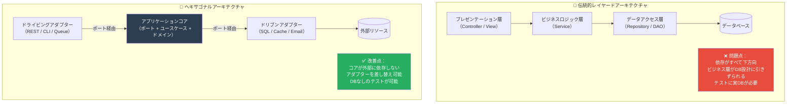

### 9.2 クリーンアーキテクチャとの関係

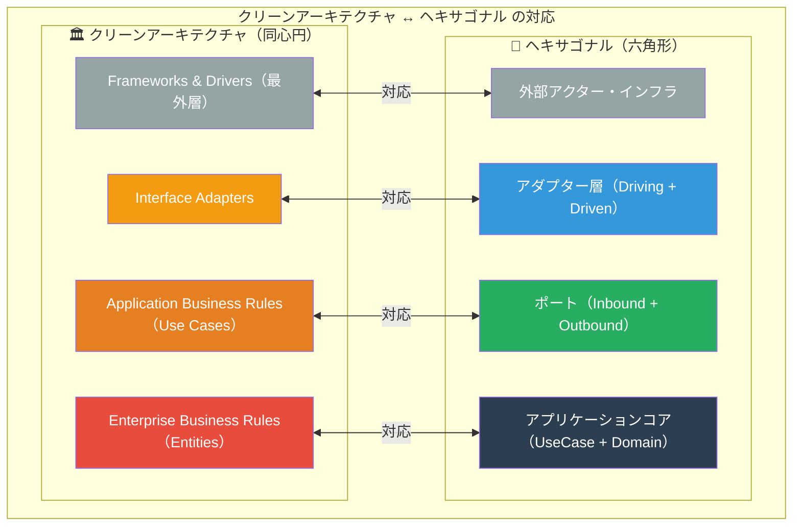

### 9.3 DDD（ドメイン駆動設計）との統合

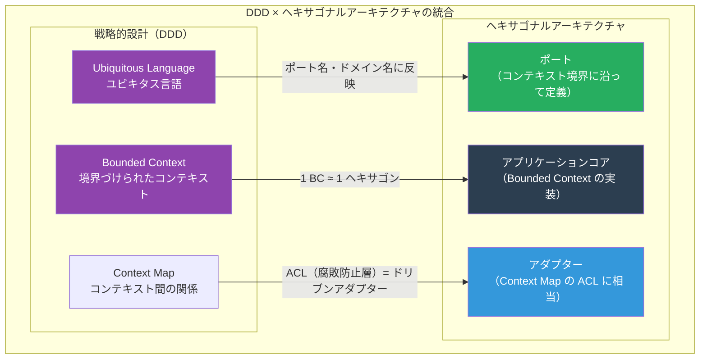

---

## 10. ディレクトリ構成とパッケージ設計

### 10.1 推奨ディレクトリ構成

```text
my_app/
│
├── 📁 domain/                           # ドメイン層（最内側・外部依存ゼロ）
│   ├── entities/
│   │   ├── order.py                    # Order エンティティ（集約ルート）
│   │   ├── product.py                  # Product エンティティ
│   │   └── customer.py                 # Customer エンティティ
│   ├── value_objects/
│   │   ├── money.py                    # Money 値オブジェクト
│   │   ├── email.py                    # Email 値オブジェクト
│   │   └── address.py                  # Address 値オブジェクト
│   ├── services/
│   │   └── pricing_service.py          # ドメインサービス（複数Entity横断）
│   └── exceptions.py                   # ドメイン例外
│
├── 📁 application/                      # アプリケーション層
│   ├── ports/
│   │   ├── inbound/                    # ドライビングポート（インターフェース）
│   │   │   ├── place_order_use_case.py # PlaceOrderUseCase (ABC)
│   │   │   ├── get_order_use_case.py   # GetOrderUseCase (ABC)
│   │   │   └── search_products_use_case.py
│   │   └── outbound/                   # ドリブンポート（インターフェース）
│   │       ├── order_repository_port.py    # OrderRepositoryPort (ABC)
│   │       ├── product_query_port.py       # ProductQueryPort (ABC)
│   │       ├── email_notification_port.py  # EmailNotificationPort (ABC)
│   │       └── event_publisher_port.py     # EventPublisherPort (ABC)
│   └── use_cases/                      # ユースケース実装
│       ├── place_order_service.py      # PlaceOrderUseCase の実装
│       ├── get_order_service.py
│       └── search_products_service.py
│
├── 📁 adapters/                         # アダプター層（外側）
│   ├── inbound/                        # ドライビングアダプター
│   │   ├── rest/
│   │   │   ├── order_router.py         # FastAPI Router（HTTP → UseCase）
│   │   │   ├── product_router.py
│   │   │   └── schemas.py              # HTTP 専用の Pydantic スキーマ
│   │   ├── cli/
│   │   │   └── order_commands.py       # Typer CLI（CLI → UseCase）
│   │   └── messaging/
│   │       └── order_consumer.py       # Kafka Consumer（Queue → UseCase）
│   └── outbound/                       # ドリブンアダプター
│       ├── persistence/
│       │   ├── sql_order_repository.py # OrderRepositoryPort の SQL 実装
│       │   ├── sql_product_repository.py
│       │   ├── in_memory_order_repository.py  # テスト用
│       │   └── models.py               # SQLAlchemy モデル（DBモデル）
│       ├── email/
│       │   ├── sendgrid_email_adapter.py      # 本番用
│       │   └── fake_email_adapter.py          # テスト用
│       ├── events/
│       │   ├── kafka_event_publisher.py       # 本番用
│       │   └── in_memory_event_publisher.py   # テスト用
│       └── cache/
│           └── redis_cache_adapter.py
│
├── 📁 infrastructure/                   # インフラ設定・配線
│   ├── di_container.py                 # Composition Root（DI の配線）
│   ├── database.py                     # DB セッション設定
│   └── config.py                       # 設定値（環境変数）
│
├── 📁 tests/
│   ├── unit/
│   │   ├── domain/                     # ドメインのユニットテスト
│   │   │   └── test_order.py
│   │   └── application/                # ユースケースのユニットテスト
│   │       └── test_place_order_service.py
│   ├── integration/
│   │   └── adapters/                   # アダプターの統合テスト
│   │       └── test_sql_order_repository.py
│   └── e2e/
│       └── test_order_flow.py          # E2E テスト
│
└── main.py                             # アプリエントリポイント
```

### 10.2 パッケージ間の依存関係ルール

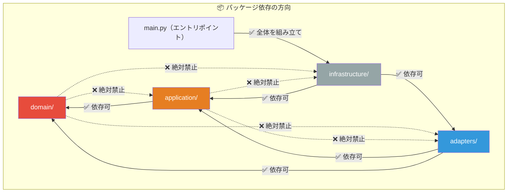

---

## 11. 段階的導入ガイド

### 11.1 既存コードへの段階的移行

```mermaid
flowchart TD
    PHASE0["📊 Phase 0：現状把握<br>既存コードのアーキテクチャを分析<br>最も問題の大きい依存を特定"]

    PHASE1["🔴 Phase 1：ドメインの分離（1〜2週間）<br>ビジネスロジックをフレームワークから抽出<br>純粋な Python クラスとして再実装<br>domain/ ディレクトリを作成"]

    PHASE2["🟡 Phase 2：ドリブンポートの定義（1週間）<br>既存の Repository・外部サービス呼び出しを<br>インターフェース（ABC）として定義<br>application/ports/outbound/ を作成"]

    PHASE3["🟢 Phase 3：ドライビングポートの定義（1週間）<br>ユースケースをインターフェースとして定義<br>ビジネスロジックをユースケースクラスに移動<br>application/ports/inbound/ を作成"]

    PHASE4["🔵 Phase 4：アダプターの実装（2〜3週間）<br>既存の実装をアダプターとして再配置<br>テスト用インメモリアダプターを作成<br>Composition Root を整備"]

    PHASE5["💜 Phase 5：テストの整備（継続的）<br>ドメインのユニットテストを充実させる<br>インメモリアダプターで高速テストを追加<br>アダプターの統合テストを整備"]

    PHASE0 --> PHASE1 --> PHASE2 --> PHASE3 --> PHASE4 --> PHASE5

    style PHASE0 fill:#95a5a6,color:#fff
    style PHASE1 fill:#e74c3c,color:#fff
    style PHASE2 fill:#e67e22,color:#fff
    style PHASE3 fill:#27ae60,color:#fff
    style PHASE4 fill:#3498db,color:#fff
    style PHASE5 fill:#8e44ad,color:#fff
```

### 11.2 移行チェックリスト

```mermaid
graph TD
    subgraph CHECKLIST["✅ ヘキサゴナル移行チェックリスト"]
        C1["✅ domain/ に SQLAlchemy・FastAPI の import がない"]
        C2["✅ ユースケースが具体的なリポジトリクラスを import していない"]
        C3["✅ 各ポートが ABC（抽象基底クラス）として定義されている"]
        C4["✅ テスト用インメモリアダプターが存在する"]
        C5["✅ ドメインのユニットテストが DB なしで動作する"]
        C6["✅ ユースケースのユニットテストが DB なしで動作する"]
        C7["✅ Composition Root が一か所にまとまっている"]
        C8["✅ アダプターを差し替えても main.py だけの変更で済む"]
        C9["✅ 循環依存が存在しない（tools: pylint / isort で確認）"]
        C10["✅ ポートはビジネス語彙で命名されている（技術用語でない）"]
    end
```

---

## 12. 実践：ECサイト完全実装例

### 12.1 ECサイトのヘキサゴナルアーキテクチャ全体図

```mermaid
graph LR
    subgraph DRIVING_EXT["外部アクター（左）"]
        WEB_BROWSER["🌐 Web ブラウザ"]
        MOBILE_APP["📱 モバイルアプリ"]
        ADMIN_CLI["💻 管理者 CLI"]
        WEBHOOK["🔔 Webhook（外部システム）"]
    end

    subgraph HEXAGON_EC["🔷 EC サイト ヘキサゴン"]
        subgraph D_ADAPT_EC["ドライビングアダプター"]
            REST_EC["REST API<br>（FastAPI）"]
            CLI_EC["CLI<br>（Typer）"]
            MSG_EC["Message Consumer<br>（Kafka）"]
        end

        subgraph D_PORTS_EC["ドライビングポート"]
            PO["PlaceOrderUseCase"]
            SP["SearchProductsUseCase"]
            AU["AuthenticateUserUseCase"]
        end

        subgraph CORE_EC["アプリケーションコア"]
            ORDER_CORE["注文ドメイン<br>Order / OrderLine / Money"]
            PRODUCT_CORE["商品ドメイン<br>Product / Category"]
            AUTH_CORE["認証ドメイン<br>User / Session"]
        end

        subgraph DR_PORTS_EC["ドリブンポート"]
            ORep["OrderRepositoryPort"]
            PRep["ProductRepositoryPort"]
            EML["EmailNotificationPort"]
            EVT["EventPublisherPort"]
            PAY["PaymentGatewayPort"]
        end

        subgraph DR_ADAPT_EC["ドリブンアダプター"]
            SQL_EC["PostgreSQL<br>アダプター"]
            CACHE_EC["Redis<br>アダプター"]
            STRIPE_EC["Stripe<br>アダプター"]
            EMAIL_EC["SendGrid<br>アダプター"]
            KAFKA_EC["Kafka<br>アダプター"]
        end
    end

    subgraph DRIVEN_EXT["外部インフラ（右）"]
        PG_EC[("PostgreSQL")]
        RD_EC["Redis"]
        STRIPE_EXT["Stripe API"]
        SG_EXT["SendGrid API"]
        KF_EXT["Kafka"]
    end

    WEB_BROWSER & MOBILE_APP --> REST_EC
    ADMIN_CLI --> CLI_EC
    WEBHOOK --> MSG_EC

    REST_EC --> PO & SP & AU
    CLI_EC --> PO & SP
    MSG_EC --> PO

    PO & SP & AU --> ORDER_CORE & PRODUCT_CORE & AUTH_CORE

    ORDER_CORE & PRODUCT_CORE & AUTH_CORE --> ORep & PRep & EML & EVT & PAY

    ORep --> SQL_EC
    PRep --> CACHE_EC
    EML --> EMAIL_EC
    EVT --> KAFKA_EC
    PAY --> STRIPE_EC

    SQL_EC --> PG_EC
    CACHE_EC --> RD_EC
    EMAIL_EC --> SG_EXT
    KAFKA_EC --> KF_EXT
    STRIPE_EC --> STRIPE_EXT

    style CORE_EC fill:#2c3e50,color:#fff
    style D_PORTS_EC fill:#d5f5e3
    style DR_PORTS_EC fill:#d6eaf8
    style D_ADAPT_EC fill:#eafaf1
    style DR_ADAPT_EC fill:#ebf5fb
```

### 12.2 決済フローのシーケンス図

```mermaid
sequenceDiagram
    participant BROWSER as 🌐 ブラウザ
    participant REST_CTRL as REST アダプター
    participant USE_CASE as PlaceOrderService<br>（コア）
    participant ORDER_ENT as Order エンティティ
    participant ORDER_REPO as OrderRepositoryPort
    participant PAY_PORT as PaymentGatewayPort
    participant EMAIL_PORT as EmailNotificationPort
    participant SQL_ADAPT as SQL アダプター
    participant STRIPE_ADAPT as Stripe アダプター
    participant SENDGRID as SendGrid アダプター

    BROWSER->>REST_CTRL: POST /api/v1/orders<br>{items, payment_info}
    REST_CTRL->>REST_CTRL: HTTP → PlaceOrderCommand に変換

    REST_CTRL->>USE_CASE: execute(PlaceOrderCommand)

    USE_CASE->>ORDER_ENT: Order.create(customer_id)
    USE_CASE->>ORDER_ENT: add_line(product, qty)
    USE_CASE->>ORDER_ENT: confirm()

    USE_CASE->>PAY_PORT: charge(amount, payment_info)
    PAY_PORT->>STRIPE_ADAPT: Stripe API 呼び出し
    STRIPE_ADAPT-->>PAY_PORT: 決済成功

    USE_CASE->>ORDER_REPO: save(order)
    ORDER_REPO->>SQL_ADAPT: SQL INSERT / UPDATE
    SQL_ADAPT-->>ORDER_REPO: 保存完了

    USE_CASE->>EMAIL_PORT: send_order_confirmation(...)
    EMAIL_PORT->>SENDGRID: SendGrid API 呼び出し

    USE_CASE-->>REST_CTRL: PlaceOrderResult

    REST_CTRL->>REST_CTRL: Result → HTTP レスポンスに変換
    REST_CTRL-->>BROWSER: 201 Created<br>{order_id, status, total}

    Note over REST_CTRL,SENDGRID: コアは左右のアダプターを一切知らない
```

### 12.3 決済ポートと Stripe アダプターの実装

```python
# ─── 決済ポート（コアに所属）───
# application/ports/outbound/payment_gateway_port.py

from abc import ABC, abstractmethod
from dataclasses import dataclass
from decimal import Decimal


@dataclass(frozen=True)
class PaymentRequest:
    amount: Decimal
    currency: str
    customer_id: str
    order_id: str
    payment_method_token: str  # Stripe トークン等


@dataclass(frozen=True)
class PaymentResult:
    transaction_id: str
    status: str
    charged_amount: Decimal


class PaymentGatewayPort(ABC):
    """
    決済ゲートウェイポート。
    コアは Stripe を知らない。「決済できる何か」だけを知っている。
    """
    @abstractmethod
    def charge(self, request: PaymentRequest) -> PaymentResult: ...

    @abstractmethod
    def refund(self, transaction_id: str, amount: Decimal) -> PaymentResult: ...


# ─── Stripe アダプター（外側に所属）───
# adapters/outbound/payment/stripe_payment_adapter.py

import stripe
from decimal import Decimal
from application.ports.outbound.payment_gateway_port import (
    PaymentGatewayPort, PaymentRequest, PaymentResult
)


class StripePaymentAdapter(PaymentGatewayPort):
    """
    PaymentGatewayPort の Stripe 実装。
    Stripe 固有の詳細をここに完全に隠蔽する。
    """
    def __init__(self, api_key: str):
        stripe.api_key = api_key

    def charge(self, request: PaymentRequest) -> PaymentResult:
        try:
            # Stripe API の詳細はここだけが知っている
            charge = stripe.PaymentIntent.create(
                amount=int(request.amount * 100),  # Stripe は cents 単位
                currency=request.currency.lower(),
                payment_method=request.payment_method_token,
                confirm=True,
                metadata={
                    "order_id": request.order_id,
                    "customer_id": request.customer_id,
                },
            )
            return PaymentResult(
                transaction_id=charge.id,
                status="succeeded",
                charged_amount=Decimal(charge.amount) / 100,
            )
        except stripe.error.CardError as e:
            raise ValueError(f"カード決済エラー: {e.user_message}") from e
        except stripe.error.StripeError as e:
            raise RuntimeError(f"Stripe エラー: {str(e)}") from e

    def refund(self, transaction_id: str, amount: Decimal) -> PaymentResult:
        refund = stripe.Refund.create(
            payment_intent=transaction_id,
            amount=int(amount * 100),
        )
        return PaymentResult(
            transaction_id=refund.id,
            status=refund.status,
            charged_amount=Decimal(refund.amount) / 100,
        )


# ─── テスト用フェイクアダプター ───
# adapters/outbound/payment/fake_payment_adapter.py

class FakePaymentAdapter(PaymentGatewayPort):
    """
    テスト専用フェイク実装。
    実際の Stripe を呼ばずに決済のシミュレートが可能。
    """
    def __init__(self, should_succeed: bool = True):
        self._should_succeed = should_succeed
        self.charged_requests: list[PaymentRequest] = []
        self.refunded_transactions: list[str] = []

    def charge(self, request: PaymentRequest) -> PaymentResult:
        self.charged_requests.append(request)
        if not self._should_succeed:
            raise ValueError("テスト用決済失敗")
        return PaymentResult(
            transaction_id=f"fake_txn_{len(self.charged_requests)}",
            status="succeeded",
            charged_amount=request.amount,
        )

    def refund(self, transaction_id: str, amount: Decimal) -> PaymentResult:
        self.refunded_transactions.append(transaction_id)
        return PaymentResult(
            transaction_id=f"fake_refund_{transaction_id}",
            status="succeeded",
            charged_amount=amount,
        )
```

---

## 13. アンチパターンと落とし穴

### 13.1 主要なアンチパターン

```mermaid
graph TD
    subgraph ANTIPATTERNS["⚠️ ヘキサゴナルアーキテクチャのアンチパターン"]
        AP1["🔴 コアがアダプターを知っている<br>domain/ や application/ の中で<br>SQLAlchemy・FastAPI・Stripe を import<br>→ ポートの意味がなくなる"]

        AP2["🔴 ポートが技術用語で命名されている<br>SQLRepositoryPort / HTTPClientPort<br>→ ビジネス語彙であるべき<br>SaveOrderPort / LoadProductsPort"]

        AP3["🔴 アダプターにビジネスロジックが漏れる<br>REST Controller の中で<br>if order.total > 10000: apply_discount() を実行<br>→ ロジックはコアに置くべき"]

        AP4["🔴 ポートを細かく作りすぎる<br>SaveOrderPort / UpdateOrderPort / DeleteOrderPort<br>を別々に定義<br>→ OrderRepositoryPort に集約できる"]

        AP5["🔴 Composition Root が分散する<br>各モジュールが自分で new して依存を生成<br>→ 依存の管理が追跡不能になる"]

        AP6["🔴 インメモリアダプターを作らない<br>テストに実 DB を使い続ける<br>→ テストが遅い・不安定・ヘキサゴナルの恩恵なし"]
    end

    AP1 --> FIX1["解決: domain/ の import を<br>Python linter でチェックする"]
    AP2 --> FIX2["解決: ポート名はビジネスユースケース<br>または能力を動詞で表現"]
    AP3 --> FIX3["解決: アダプターは「変換だけ」<br>ロジックは一切持たない"]
    AP4 --> FIX4["解決: 1コンテキストに1リポジトリ<br>CRUDをまとめる"]
    AP5 --> FIX5["解決: main.py または di_container.py<br>1か所でのみ依存を構築"]
    AP6 --> FIX6["解決: すべての外部ポートに<br>InMemory / Fake 実装を用意する"]

    style AP1 fill:#e74c3c,color:#fff
    style AP2 fill:#e74c3c,color:#fff
    style AP3 fill:#e74c3c,color:#fff
    style AP4 fill:#e74c3c,color:#fff
    style AP5 fill:#e74c3c,color:#fff
    style AP6 fill:#e74c3c,color:#fff
    style FIX1 fill:#27ae60,color:#fff
    style FIX2 fill:#27ae60,color:#fff
    style FIX3 fill:#27ae60,color:#fff
    style FIX4 fill:#27ae60,color:#fff
    style FIX5 fill:#27ae60,color:#fff
    style FIX6 fill:#27ae60,color:#fff
```

### 13.2 コアの汚染チェック（自動化）

```python
# ─── コア汚染チェックスクリプト ───
# scripts/check_core_dependencies.py
# CI/CD に組み込んでコアの純粋性を保証する

import ast
import sys
from pathlib import Path

# コアで許可されない外部 import のリスト
FORBIDDEN_IN_CORE = [
    "sqlalchemy",
    "fastapi",
    "django",
    "flask",
    "stripe",
    "sendgrid",
    "redis",
    "kafka",
    "requests",
    "httpx",
    "boto3",
]

# チェック対象のコアディレクトリ
CORE_DIRS = ["domain", "application"]


def check_file(filepath: Path) -> list[str]:
    """ファイル内の不正 import をチェックする"""
    violations = []
    source = filepath.read_text(encoding="utf-8")

    try:
        tree = ast.parse(source)
    except SyntaxError:
        return [f"構文エラー: {filepath}"]

    for node in ast.walk(tree):
        if isinstance(node, (ast.Import, ast.ImportFrom)):
            module = ""
            if isinstance(node, ast.Import):
                for alias in node.names:
                    module = alias.name
            elif isinstance(node, ast.ImportFrom):
                module = node.module or ""

            for forbidden in FORBIDDEN_IN_CORE:
                if module.startswith(forbidden):
                    violations.append(
                        f"❌ {filepath}:{node.lineno} — "
                        f"コアに禁止された import: '{module}'"
                    )

    return violations


def main():
    all_violations = []
    for core_dir in CORE_DIRS:
        core_path = Path(core_dir)
        if not core_path.exists():
            continue
        for py_file in core_path.rglob("*.py"):
            violations = check_file(py_file)
            all_violations.extend(violations)

    if all_violations:
        print("\n🚨 コア汚染が検出されました：\n")
        for v in all_violations:
            print(v)
        sys.exit(1)
    else:
        print("✅ コアの純粋性が保たれています")


if __name__ == "__main__":
    main()
```

---

## 14. ベストプラクティス総まとめ

### 14.1 設計の黄金律

```mermaid
graph TD
    subgraph GOLDEN_RULES["🏆 ヘキサゴナルアーキテクチャの黄金律"]
        R1["📌 ルール1：依存は常に外から内へ<br>アダプター → ポート → コア<br>コアは外を知らない"]

        R2["📌 ルール2：ポートはビジネス語彙で定義する<br>PlaceOrderPort（✅）<br>SQLRepositoryPort（❌）"]

        R3["📌 ルール3：すべてのポートにFake/InMemory実装を用意する<br>テストの速度と安定性の鍵<br>DB・外部APIなしのテストを実現する"]

        R4["📌 ルール4：アダプターはデータ変換だけ<br>ビジネスロジックは一行も持たない<br>HTTP → Command、Result → HTTP"]

        R5["📌 ルール5：Composition Root は一か所に集める<br>依存の組み立ては main.py/di_container.py のみ<br>追跡可能・テスト切り替えが容易"]

        R6["📌 ルール6：ポートの粒度はユースケース単位<br>細かすぎず・大きすぎず<br>1ユースケース ≈ 1ドライビングポート"]

        R7["📌 ルール7：コアの純粋性を CI で守る<br>linter・自動チェックで<br>外部 import の侵入を防ぐ"]
    end
```

### 14.2 意思決定フロー

```mermaid
flowchart TD
    Q1{"新しい機能を追加する場合<br>どのレイヤーに置くべきか？"}

    Q2{"ビジネスルールを表す？<br>（不変条件・バリデーション等）"}
    Q3{"外部の何かを使う？<br>（DB・API・メール等）"}
    Q4{"外部から呼ばれる？<br>（HTTP・CLI・Queue等）"}
    Q5{"複数エンティティをまたぐ<br>ビジネスロジックか？"}

    DOMAIN_R["domain/entities/ または<br>domain/value_objects/ に配置"]
    DOMAIN_SVC_R["domain/services/ に配置<br>（ドメインサービス）"]
    OUTBOUND_PORT["application/ports/outbound/ に<br>インターフェースを定義する"]
    DRIVEN_ADAPTER["adapters/outbound/ に<br>具体的な実装を配置"]
    INBOUND_PORT["application/ports/inbound/ に<br>ユースケースインターフェースを定義"]
    DRIVING_ADAPTER["adapters/inbound/ に<br>アダプター（HTTP Controller等）を配置"]
    USE_CASE_R["application/use_cases/ に<br>ユースケース実装を配置"]

    Q1 --> Q2
    Q2 -->|"Yes（1エンティティ内）"| DOMAIN_R
    Q2 -->|"Yes（複数エンティティ）"| Q5
    Q5 -->|"Yes"| DOMAIN_SVC_R
    Q5 -->|"No（フロー制御）"| USE_CASE_R
    Q2 -->|"No"| Q3
    Q3 -->|"Yes（インターフェース定義）"| OUTBOUND_PORT
    Q3 -->|"Yes（具体実装）"| DRIVEN_ADAPTER
    Q3 -->|"No"| Q4
    Q4 -->|"Yes（インターフェース定義）"| INBOUND_PORT
    Q4 -->|"Yes（具体実装）"| DRIVING_ADAPTER

    style DOMAIN_R fill:#e74c3c,color:#fff
    style DOMAIN_SVC_R fill:#e74c3c,color:#fff
    style OUTBOUND_PORT fill:#3498db,color:#fff
    style DRIVEN_ADAPTER fill:#2980b9,color:#fff
    style INBOUND_PORT fill:#27ae60,color:#fff
    style DRIVING_ADAPTER fill:#2ecc71,color:#fff
    style USE_CASE_R fill:#e67e22,color:#fff
```

### 14.3 ヘキサゴナルアーキテクチャ成熟度モデル

```mermaid
graph TD
    LV0["Level 0: モノリシックなスパゲッティ<br>DB・UI・ビジネスロジックが混在<br>テストには全インフラが必要"]

    LV1["Level 1: レイヤー分離<br>Controller / Service / Repository の分離<br>ただし具体クラスに直接依存"]

    LV2["Level 2: ポートの定義開始<br>Repository をインターフェース化<br>InMemory 実装でユニットテスト可能に"]

    LV3["Level 3: 完全なポート＆アダプター<br>すべての外部依存がポート経由<br>ドライビング・ドリブン両側が分離"]

    LV4["Level 4: コアの純粋性保証<br>CI でコアの汚染を自動検出<br>全ポートにテスト用実装あり"]

    LV5["Level 5: 複数コンテキストへの適用<br>マイクロサービス各サービスにヘキサゴナル<br>DDD と統合・Bounded Context 単位で管理"]

    LV0 --> LV1 --> LV2 --> LV3 --> LV4 --> LV5

    style LV0 fill:#e74c3c,color:#fff
    style LV1 fill:#e67e22,color:#fff
    style LV2 fill:#f39c12,color:#fff
    style LV3 fill:#27ae60,color:#fff
    style LV4 fill:#3498db,color:#fff
    style LV5 fill:#8e44ad,color:#fff
```

### 14.4 クイックリファレンス：判断基準表

| 問い | 答え |
|------|------|
| ポートはどこに置くべきか？ | アプリケーションコア（application/ports/）に置く |
| アダプターはどこに置くべきか？ | コアの外側（adapters/）に置く |
| コアは外部 import を持っていいか？ | 絶対に持ってはいけない |
| ドリブンポートは誰が実装するか？ | ドリブンアダプターが実装する |
| ドライビングポートは誰が実装するか？ | ユースケース（コア）が実装する |
| テストにはどのアダプターを使うか？ | InMemory / Fake 実装を使う |
| 新しい DB に切り替えるには？ | 新しいドリブンアダプターを作るだけ |
| 新しい入力インターフェースを追加するには？ | 新しいドライビングアダプターを作るだけ |
| ビジネスロジックはどこに置くか？ | domain/ または application/use_cases/ のみ |
| 依存性注入はどこで行うか？ | Composition Root（main.py/di_container.py）のみ |

---

## 15. 参考文献・ソース一覧

### 📚 必読書籍

| タイトル | 著者 | 内容 |
|---------|------|------|
| **Hexagonal Architecture（原著論文）** | Alistair Cockburn | ヘキサゴナルアーキテクチャの原典 |
| **Clean Architecture** | Robert C. Martin | ヘキサゴナルを発展させたクリーンアーキテクチャ |
| **Domain-Driven Design** | Eric Evans | DDD × ヘキサゴナルの統合に必須 |
| **Implementing Domain-Driven Design** | Vaughn Vernon | DDD 実践でのポート＆アダプター |
| **Architecture Patterns with Python** | Harry Percival, Bob Gregory | Python でのヘキサゴナル実践（無料公開） |
| **Get Your Hands Dirty on Clean Architecture** | Tom Hombergs | ヘキサゴナルの Java 実践ガイド |
| **Building Microservices** | Sam Newman | マイクロサービス × ヘキサゴナルの統合 |

### 🌐 公式ドキュメント・URL

#### ヘキサゴナルアーキテクチャ原典

| リソース | URL |
|---------|-----|
| **Alistair Cockburn 原著論文（英語）** | https://alistair.cockburn.us/hexagonal-architecture/ |
| **Alistair Cockburn — Hexagonal Architecture Explained（最新解説）** | https://alistair.cockburn.us/hexagonal-architecture/ |
| **Wikipedia — Hexagonal Architecture** | https://en.wikipedia.org/wiki/Hexagonal_architecture_(software) |

#### アーキテクチャ関連

| リソース | URL |
|---------|-----|
| **Clean Architecture（Uncle Bob 原著ブログ）** | https://blog.cleancoder.com/uncle-bob/2012/08/13/the-clean-architecture.html |
| **The Onion Architecture（Jeffrey Palermo）** | https://jeffreypalermo.com/2008/07/the-onion-architecture-part-1/ |
| **Martin Fowler — Presentation Domain Data Layering** | https://martinfowler.com/bliki/PresentationDomainDataLayering.html |
| **Martin Fowler — 依存性逆転** | https://martinfowler.com/articles/dipInTheWild.html |
| **Martin Fowler — InMemory Test Doubles** | https://martinfowler.com/bliki/InMemoryTestDouble.html |

#### DDD との統合

| リソース | URL |
|---------|-----|
| **DDD + Hexagonal（詳細解説）** | https://herbertograca.com/2017/09/14/ports-adapters-architecture/ |
| **DDD Crew — GitHub（実践リソース集）** | https://github.com/ddd-crew |
| **Cosmic Python — Architecture Patterns with Python（無料書籍）** | https://www.cosmicpython.com/ |
| **Cosmic Python — Repository パターン章** | https://www.cosmicpython.com/book/chapter_02_repository.html |
| **Cosmic Python — Service Layer 章** | https://www.cosmicpython.com/book/chapter_04_service_layer.html |

#### Python 実装リファレンス

| リソース | URL |
|---------|-----|
| **Python ABC（公式ドキュメント）** | https://docs.python.org/ja/3/library/abc.html |
| **FastAPI — Dependency Injection** | https://fastapi.tiangolo.com/ja/tutorial/dependencies/ |
| **SQLAlchemy — ORM チュートリアル** | https://docs.sqlalchemy.org/en/20/orm/tutorial.html |
| **TestContainers Python** | https://testcontainers-python.readthedocs.io/ |
| **pytest 公式ドキュメント** | https://docs.pytest.org/ja/latest/ |

#### TypeScript / Java 実装例（参考）

| リソース | URL |
|---------|-----|
| **Get Your Hands Dirty — GitHub サンプル（Java）** | https://github.com/thombergs/buckpal |
| **Hexagonal Architecture with TypeScript** | https://netflixtechblog.com/ready-for-changes-with-hexagonal-architecture-b315ec967749 |
| **NestJS + Hexagonal（実践例）** | https://docs.nestjs.com/fundamentals/custom-providers |

#### テスト戦略

| リソース | URL |
|---------|-----|
| **Martin Fowler — テストピラミッド** | https://martinfowler.com/bliki/TestPyramid.html |
| **Martin Fowler — Mocks Aren't Stubs** | https://martinfowler.com/articles/mocksArentStubs.html |
| **The Testing Trophy（Kent C. Dodds）** | https://kentcdodds.com/blog/the-testing-trophy-and-testing-classifications |

#### コミュニティ・学習リソース

| リソース | URL |
|---------|-----|
| **Herberto Graça — Software Architecture Chronicles** | https://herbertograca.com/dev-theory/architectural-styles/ |
| **Patterns of Enterprise Application Architecture（Martin Fowler）** | https://martinfowler.com/books/eaa.html |
| **Awesome Software Architecture（GitHub）** | https://github.com/mehdihadeli/awesome-software-architecture |

---

> 📅 本ドキュメントは2024年時点の情報を基に作成しています。各ツール・フレームワークの仕様は変更される場合があります。実装前に必ず公式ドキュメントをご確認ください。

---

*作成者：World-Class Software Architect Guide | バージョン 1.0 | Hexagonal Architecture Complete Guide*
