# 🚀 MVP（最小実行可能製品）開発 完全ガイド

## 📚 目次

1. [MVPとは何か？](#1-mvpとは何か)
2. [MVPの思想的背景：リーンスタートアップ](#2-mvpの思想的背景リーンスタートアップ)
3. [MVP開発の全体プロセス](#3-mvp開発の全体プロセス)
4. [Step 1：問題発見と顧客検証](#4-step-1問題発見と顧客検証)
5. [Step 2：MVPのスコープ定義](#5-step-2mvpのスコープ定義)
6. [Step 3：アーキテクチャ選択](#6-step-3アーキテクチャ選択)
7. [Step 4：技術スタック選定](#7-step-4技術スタック選定)
8. [Step 5：MVP実装のベストプラクティス](#8-step-5mvp実装のベストプラクティス)
9. [Step 6：測定・学習（Measure & Learn）](#9-step-6測定学習measure--learn)
10. [Step 7：ピボットか継続かの判断](#10-step-7ピボットか継続かの判断)
11. [よくある失敗パターンと対策](#11-よくある失敗パターンと対策)
12. [MVPから本番プロダクトへの移行](#12-mvpから本番プロダクトへの移行)
13. [ベストプラクティス総まとめ](#13-ベストプラクティス総まとめ)
14. [参考文献・ソース一覧](#14-参考文献ソース一覧)

---

## 1. MVPとは何か？

### 1.1 MVPの定義

**MVP（Minimum Viable Product / 最小実行可能製品）** とは、**最小限の機能で最大限の学びを得るために構築するプロダクト**です。

Eric Riesが著書「The Lean Startup（リーン・スタートアップ）」で提唱したこの概念は、現代のプロダクト開発における根幹哲学となっています。

> 💡 **一言で言うと：**「作りすぎず、学ぶための最小限のプロダクトを素早く届けて、顧客の反応から真実を学ぶ」

### 1.2 「M・V・P」それぞれの意味

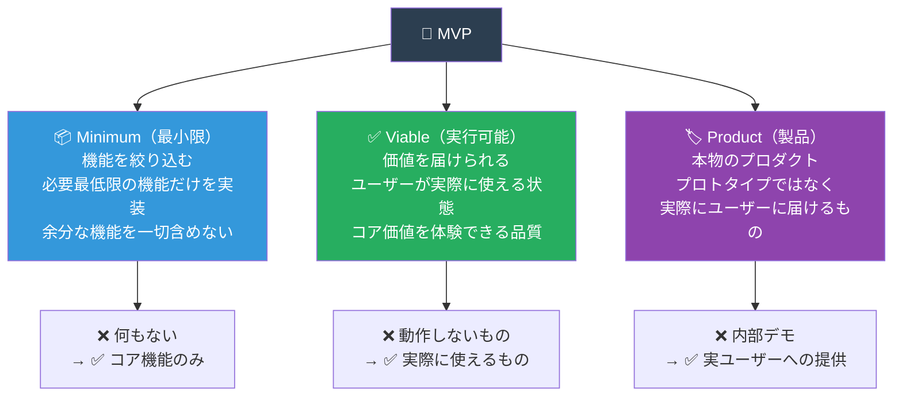

### 1.3 MVPが「モック」「プロトタイプ」と異なる点

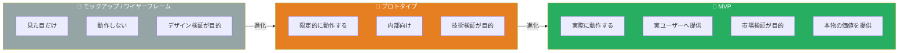

### 1.4 MVPが重要な理由

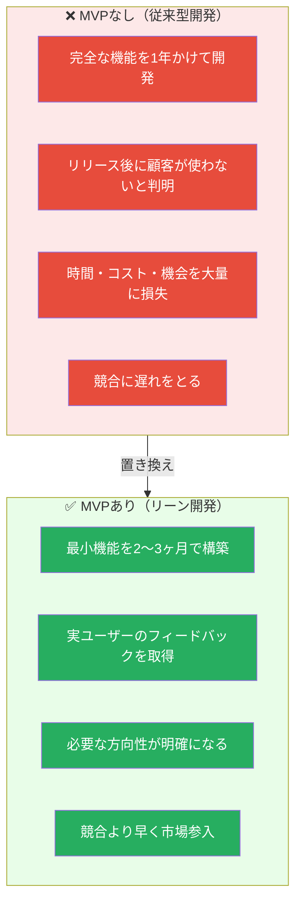

---

## 2. MVPの思想的背景：リーンスタートアップ

### 2.1 Build-Measure-Learn サイクル

MVPの中核にある考え方は、**Build（構築）→ Measure（測定）→ Learn（学習）**の高速サイクルです。

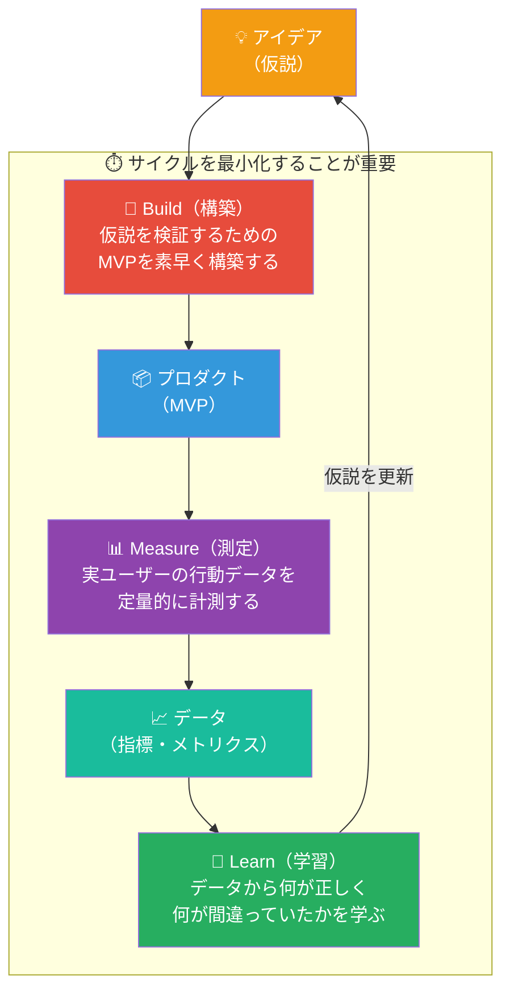

### 2.2 検証済み学習（Validated Learning）

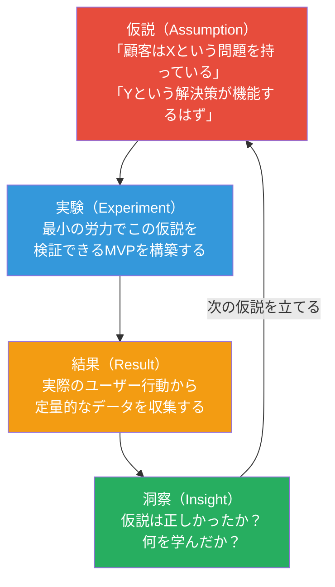

### 2.3 Innovation Accounting（イノベーション会計）

MVPの成果は従来の財務指標ではなく、「**学習の進捗**」で測定します。

```mermaid
graph LR
    subgraph TRADITIONAL["❌ 従来の指標"]
        T1["売上高"]
        T2["ユーザー数"]
        T3["ページビュー"]
    end

    subgraph LEAN["✅ リーン指標（Actionable Metrics）"]
        L1["顧客獲得コスト（CAC）"]
        L2["顧客生涯価値（LTV）"]
        L3["リテンション率（継続率）"]
        L4["機能の実際の使用率"]
        L5["NPS（顧客推奨度）"]
        L6["コンバージョン率"]
    end

    TRADITIONAL -->|"置き換え"| LEAN

    style T1 fill:#e74c3c,color:#fff
    style T2 fill:#e74c3c,color:#fff
    style T3 fill:#e74c3c,color:#fff
    style L1 fill:#27ae60,color:#fff
    style L2 fill:#27ae60,color:#fff
    style L3 fill:#27ae60,color:#fff
    style L4 fill:#27ae60,color:#fff
    style L5 fill:#27ae60,color:#fff
    style L6 fill:#27ae60,color:#fff
```

---

## 3. MVP開発の全体プロセス

### 3.1 全体フロー概観

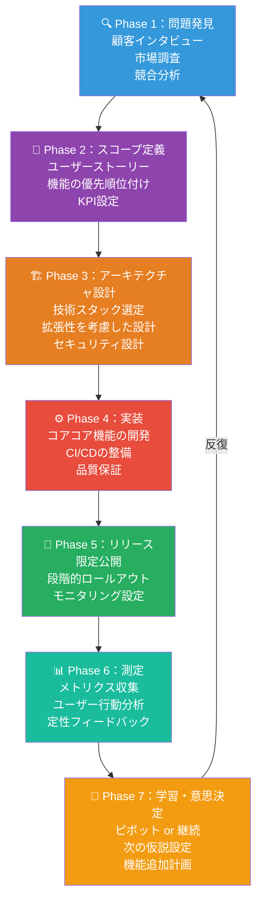

### 3.2 MVP開発のタイムライン目安

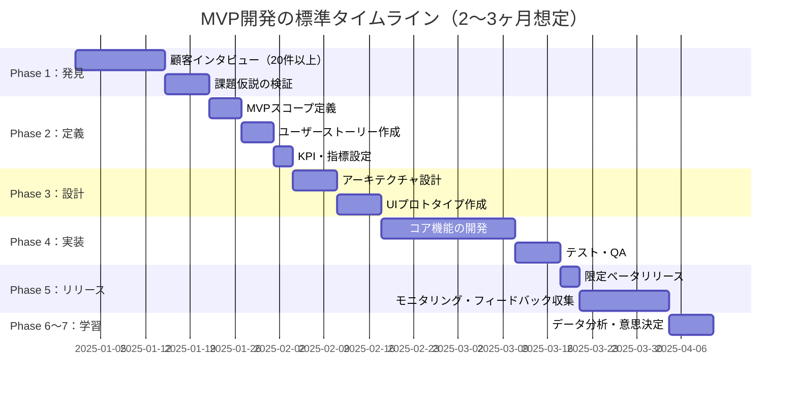

---

## 4. Step 1：問題発見と顧客検証

### 4.1 顧客開発（Customer Development）プロセス

MVPを作る前に、**本当に解くべき問題があるかを確認**することが最重要です。

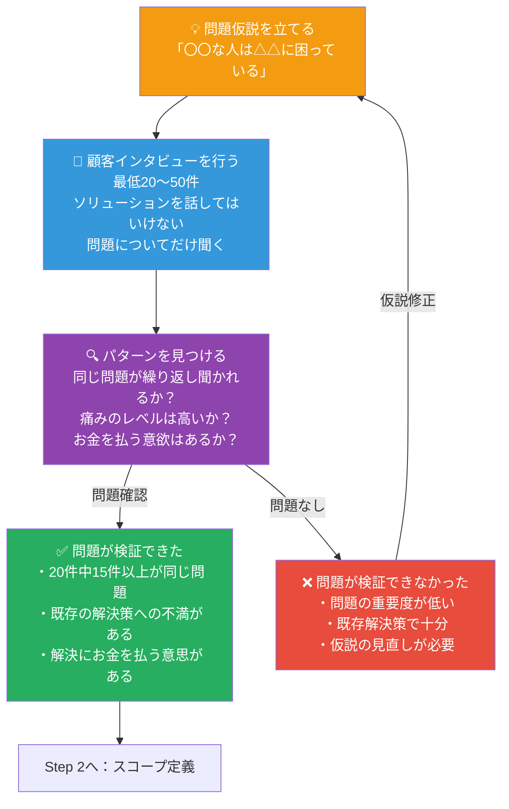

### 4.2 顧客インタビューのベストプラクティス

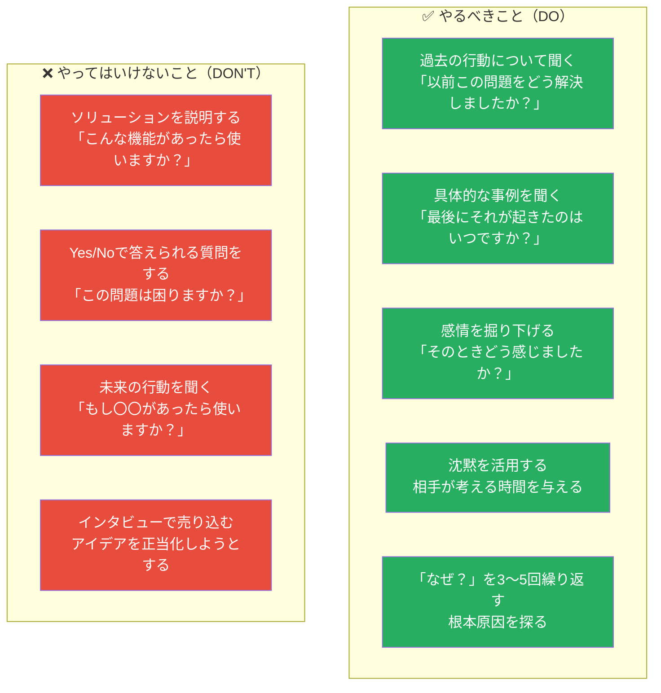

### 4.3 市場規模の検証（TAM・SAM・SOM）

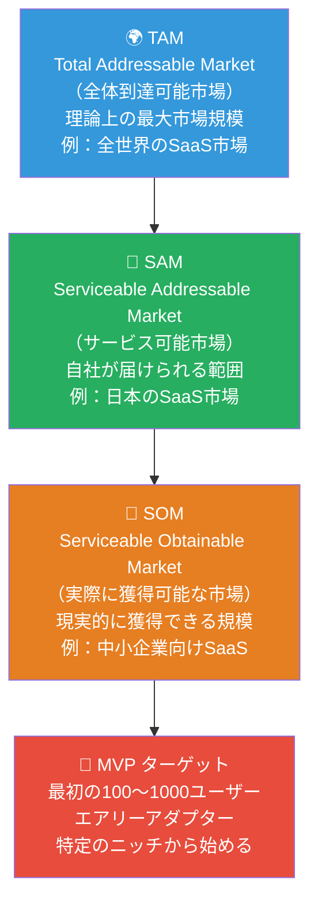

---

## 5. Step 2：MVPのスコープ定義

### 5.1 Jobs-to-be-Done（JTBD）フレームワーク

機能リストではなく、「**ユーザーが何を達成しようとしているか**」を中心に考えます。

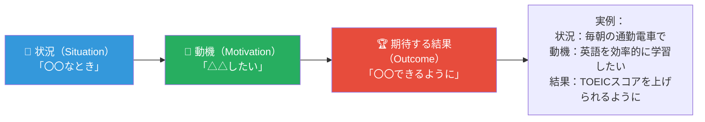

### 5.2 機能優先順位付け：MoSCoW法

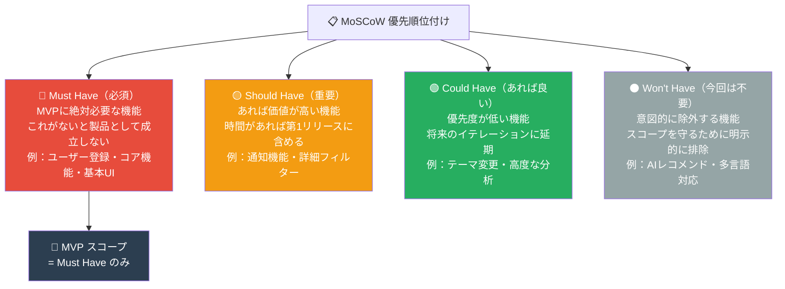

### 5.3 ユーザーストーリーマッピング

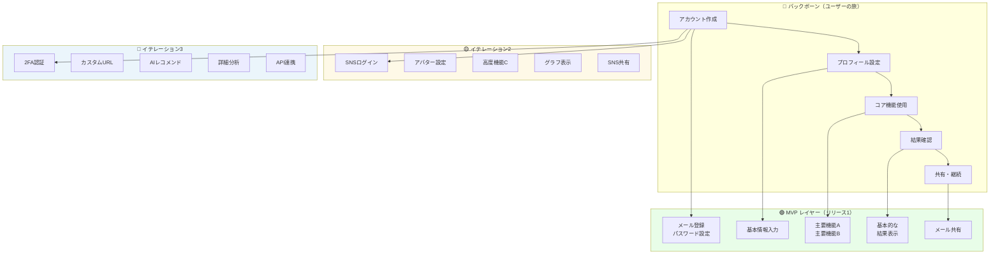

### 5.4 MVPの成功指標（KPI）設定

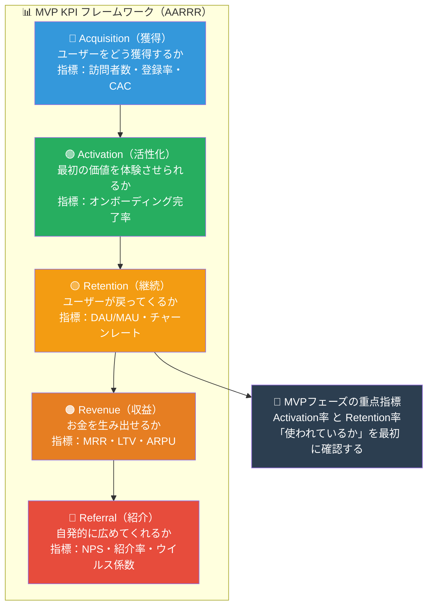

---

## 6. Step 3：アーキテクチャ選択

### 6.1 MVPに適したアーキテクチャの選択基準

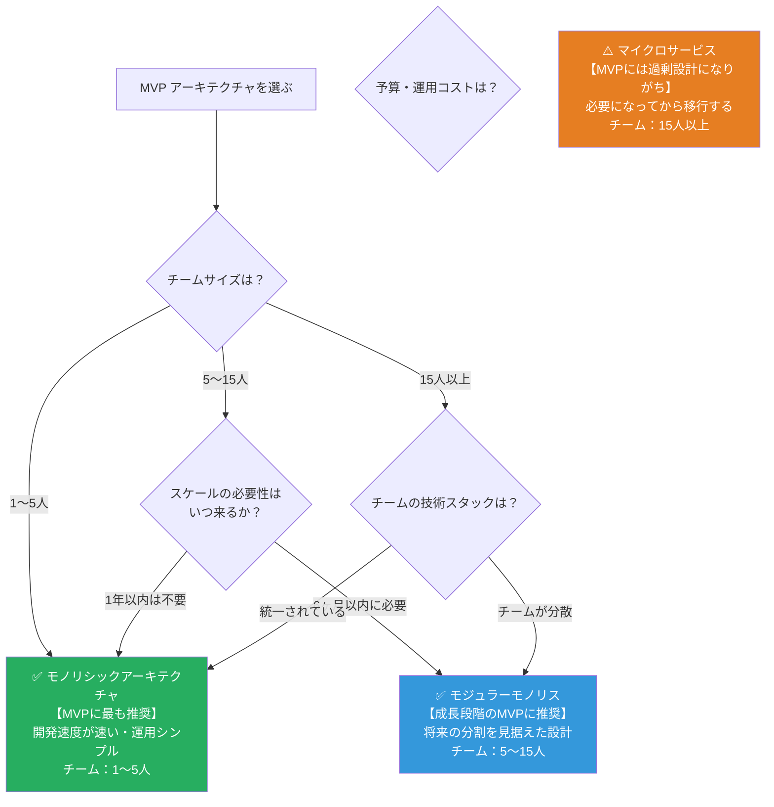

### 6.2 MVP向けアーキテクチャの全体像

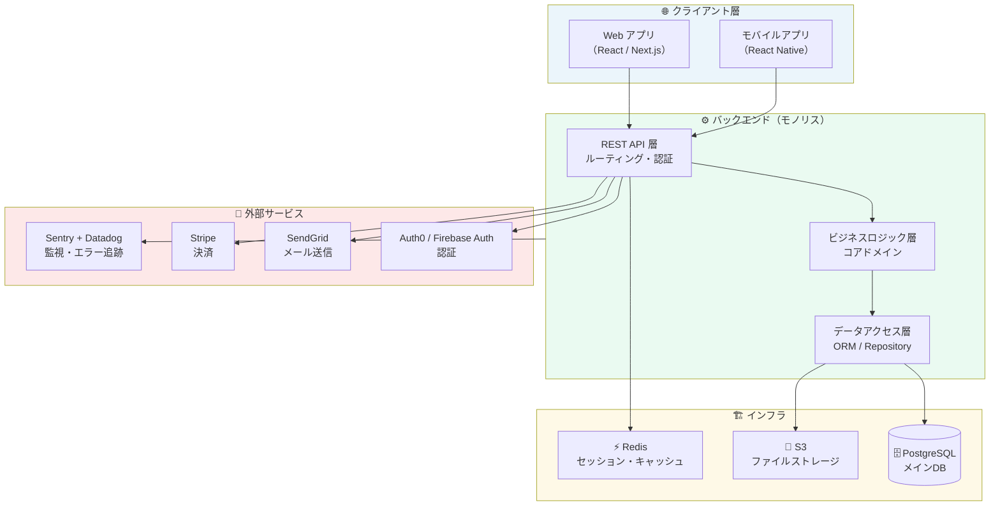

### 6.3 MVP設計の「今 vs 将来」トレードオフ

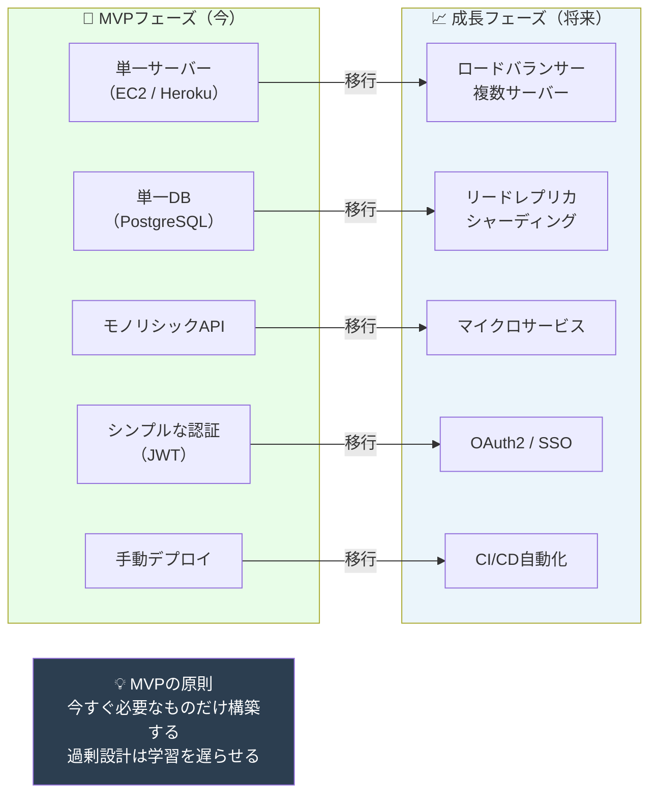

---

## 7. Step 4：技術スタック選定

### 7.1 技術スタック選定の判断基準

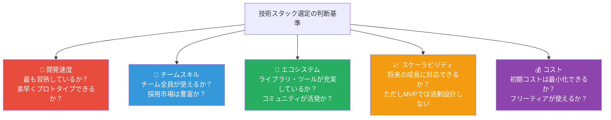

### 7.2 MVP推奨技術スタック（2025年版）

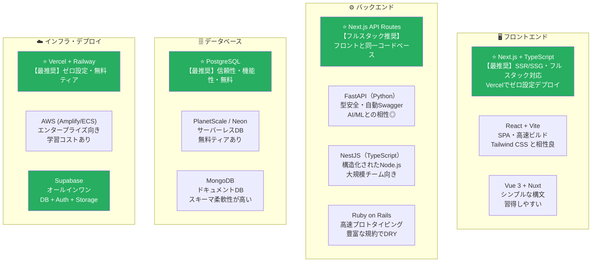

### 7.3 外部サービス活用戦略（作らずに買う）

MVPでは**自前実装を最小化**し、外部サービスを最大限活用します。

```mermaid
graph TD
    subgraph BUILD["❌ 自前で作ると（避けるべき）"]
        B1["認証システムを自前実装\n（数週間かかる・セキュリティリスク）"]
        B2["決済システムを自前実装\n（PCI DSS対応が必要）"]
        B3["メール配信インフラを構築\n（配信率・スパム対策が複雑）"]
        B4["監視システムを自前構築\n（維持コストが高い）"]
    end

    subgraph BUY["✅ 外部サービスを使う（推奨）"]
        S1["Auth0 / Clerk / Supabase Auth\n数時間で本番品質の認証完成"]
        S2["Stripe / Paddle\n数時間で決済機能完成"]
        S3["SendGrid / Resend\n高配信率メール送信"]
        S4["Sentry + Datadog\nエラー追跡・APM監視"]
    end

    B1 --> S1
    B2 --> S2
    B3 --> S3
    B4 --> S4

    style B1 fill:#e74c3c,color:#fff
    style B2 fill:#e74c3c,color:#fff
    style B3 fill:#e74c3c,color:#fff
    style B4 fill:#e74c3c,color:#fff
    style S1 fill:#27ae60,color:#fff
    style S2 fill:#27ae60,color:#fff
    style S3 fill:#27ae60,color:#fff
    style S4 fill:#27ae60,color:#fff
```

---

## 8. Step 5：MVP実装のベストプラクティス

### 8.1 コードの原則：シンプルさを優先する

```mermaid
graph TD
    subgraph MVP_CODING["🖥️ MVP実装のコーディング原則"]
        P1["📌 YAGNI原則\n（You Aren't Gonna Need It）\n今必要でない機能は実装しない\n将来の妄想より現在の問題を解く"]

        P2["📌 KISS原則\n（Keep It Simple, Stupid）\n複雑な設計より単純な解決策\nシンプルなコードが保守しやすい"]

        P3["📌 完璧より完成\n（Done is Better than Perfect）\nきれいなコードより\n動くプロダクトを優先する"]

        P4["📌 技術的負債の管理\n意図的な技術的負債はOK\n無意識な負債は避ける\n負債は文書化して追跡する"]
    end

    style P1 fill:#3498db,color:#fff
    style P2 fill:#27ae60,color:#fff
    style P3 fill:#f39c12,color:#fff
    style P4 fill:#8e44ad,color:#fff
```

### 8.2 ディレクトリ構成（フルスタックMVP例）

```mermaid
graph TD
    subgraph PROJECT["📁 MVP プロジェクト構成（Next.js例）"]
        ROOT["my-mvp/"]
        APP["app/\n（Next.js App Router）"]
        COMPONENTS["components/\n（再利用可能なUIコンポーネント）"]
        LIB["lib/\n（共通ユーティリティ・クライアント）"]
        PRISMA["prisma/\n（DBスキーマ・マイグレーション）"]
        API_DIR["app/api/\n（APIエンドポイント）"]
        PAGES["app/（pages）\n（画面ページ）"]
        TESTS["tests/\n（テストファイル）"]

        ROOT --> APP
        ROOT --> COMPONENTS
        ROOT --> LIB
        ROOT --> PRISMA
        APP --> API_DIR
        APP --> PAGES
        ROOT --> TESTS
    end

    subgraph DETAIL["📋 詳細"]
        API_DETAIL["api/\n├── auth/route.ts\n├── users/route.ts\n└── [core]/route.ts"]
        LIB_DETAIL["lib/\n├── db.ts（Prismaクライアント）\n├── auth.ts（認証ヘルパー）\n└── stripe.ts（決済クライアント）"]
    end

    style ROOT fill:#2c3e50,color:#fff
    style APP fill:#3498db,color:#fff
    style COMPONENTS fill:#27ae60,color:#fff
    style LIB fill:#8e44ad,color:#fff
    style PRISMA fill:#e67e22,color:#fff
```

### 8.3 CI/CDパイプラインの整備

早期にCI/CDを整備することで、迅速なイテレーションが可能になります。

```mermaid
flowchart TD
    subgraph DEV["💻 開発者のローカル環境"]
        CODE["コードを書く"]
        LOCAL_TEST["ローカルテスト実行\n（jest / pytest）"]
        COMMIT["git commit & push"]
    end

    subgraph CI["🔄 CI（自動チェック）"]
        LINT["Lint チェック\n（ESLint / Ruff）"]
        TYPE_CHECK["型チェック\n（TypeScript / mypy）"]
        UNIT_TEST["ユニットテスト"]
        BUILD_CHECK["ビルド確認"]
    end

    subgraph CD_STAGING["🧪 ステージング自動デプロイ"]
        DEPLOY_STG["ステージング環境へデプロイ\n（PRごとにプレビューURL）"]
        SMOKE_TEST["スモークテスト\n（基本動作確認）"]
    end

    subgraph CD_PROD["🚀 本番デプロイ（main merge後）"]
        DEPLOY_PROD["本番環境へデプロイ"]
        MONITOR_POST["デプロイ後監視\n（エラー率・レイテンシ）"]
    end

    CODE --> LOCAL_TEST --> COMMIT
    COMMIT --> LINT --> TYPE_CHECK --> UNIT_TEST --> BUILD_CHECK
    BUILD_CHECK -->|"PR作成時"| DEPLOY_STG --> SMOKE_TEST
    SMOKE_TEST -->|"PRマージ後"| DEPLOY_PROD --> MONITOR_POST

    style CI fill:#ebf5fb
    style CD_STAGING fill:#fef9e7
    style CD_PROD fill:#eafaf1
```

### 8.4 データベース設計のベストプラクティス

```mermaid
graph TD
    subgraph MVP_DB["🗄️ MVPデータベース設計原則"]
        DB1["📌 シンプルなスキーマから始める\n正規化より開発速度を優先\n複雑なリレーションは後で追加"]

        DB2["📌 created_at・updated_atを必ず付ける\n後からデータ分析するときに必須\n最初からつけないと後悔する"]

        DB3["📌 ソフトデリートを検討する\ndeleted_atフィールドで論理削除\nデータ復元・監査ログに有用"]

        DB4["📌 インデックスは最低限\nよく検索されるカラムにのみ付与\n過剰なインデックスは書き込みを遅くする"]

        DB5["📌 マイグレーション管理を徹底\n手動でDBを変更しない\nコードで変更を管理する"]
    end

    style DB1 fill:#3498db,color:#fff
    style DB2 fill:#27ae60,color:#fff
    style DB3 fill:#f39c12,color:#fff
    style DB4 fill:#8e44ad,color:#fff
    style DB5 fill:#e74c3c,color:#fff
```

### 8.5 セキュリティの最低限チェックリスト

```mermaid
graph TD
    subgraph SECURITY_MVP["🔒 MVPのセキュリティ必須項目"]
        S1["✅ HTTPS 必須\nHTTPは絶対に使わない\nLet's Encrypt / CDNで無料化"]

        S2["✅ 環境変数で秘密情報を管理\nコードにAPIキーを絶対に書かない\n.env.local / secrets manager"]

        S3["✅ パスワードハッシュ化\nbcrypt / argon2 を使用\nMD5・SHA1は禁止"]

        S4["✅ SQLインジェクション対策\nORMを使う・生SQLを避ける\nパラメータバインドを徹底"]

        S5["✅ CORS設定\n許可するオリジンを明示\nワイルドカード（*）は避ける"]

        S6["✅ レート制限\nAPIエンドポイントに上限を設定\nDDoS・ブルートフォース対策"]

        S7["✅ 依存関係の脆弱性スキャン\nnpm audit / pip-audit\nGitHub Dependabotを活用"]
    end

    style S1 fill:#27ae60,color:#fff
    style S2 fill:#27ae60,color:#fff
    style S3 fill:#27ae60,color:#fff
    style S4 fill:#27ae60,color:#fff
    style S5 fill:#27ae60,color:#fff
    style S6 fill:#27ae60,color:#fff
    style S7 fill:#27ae60,color:#fff
```

### 8.6 テスト戦略：MVPでのテスト優先度

```mermaid
graph TD
    subgraph MVP_TEST_PYRAMID["🔺 MVPのテストピラミッド"]
        E2E_T["E2Eテスト（最小限）\n重要なユーザーシナリオのみ\nCypress / Playwright\n数件程度"]

        INTEGRATION_T["統合テスト（中程度）\nAPI エンドポイントの動作確認\n外部サービスとの連携確認"]

        UNIT_T["ユニットテスト（多め）\nビジネスロジックのコア部分\n計算・バリデーション・変換ロジック\nMVPで最も価値が高いテスト"]
    end

    UNIT_T --> INTEGRATION_T --> E2E_T

    MVP_TEST_RULE["💡 MVPのテスト原則\n完全なテストカバレッジは求めない\nビジネスロジックの中核だけをカバー\nリグレッションを防ぐための最小限のテスト"]

    style E2E_T fill:#e74c3c,color:#fff
    style INTEGRATION_T fill:#f39c12,color:#fff
    style UNIT_T fill:#27ae60,color:#fff
    style MVP_TEST_RULE fill:#2c3e50,color:#fff
```

---

## 9. Step 6：測定・学習（Measure & Learn）

### 9.1 アナリティクスの設計

```mermaid
graph TD
    subgraph ANALYTICS_SETUP["📊 MVPのアナリティクス設計"]
        DEFINE["1️⃣ 測定する指標を事前に決める\nKPIを数値で定義\n「良い状態」の閾値を設定"]

        INSTRUMENT["2️⃣ 計測コードを組み込む\nイベントトラッキング\nファネル分析の設計"]

        DASHBOARD["3️⃣ ダッシュボードを作成\n毎日見る習慣をつける\n自動レポートを設定"]

        REVIEW["4️⃣ 定期レビュー\n週次で指標を確認\n異常値をすぐに検知"]

        DEFINE --> INSTRUMENT --> DASHBOARD --> REVIEW
    end

    subgraph TOOLS["🛠️ 推奨ツール"]
        T1["PostHog\nオープンソース・プロダクト分析\nセルフホスト可能"]
        T2["Mixpanel\nイベント分析に特化\n無料ティア充実"]
        T3["Amplitude\n行動分析・コホート分析\nスタートアップ向け無料プラン"]
        T4["Google Analytics 4\n基本的なWebアナリティクス\n無料"]
    end

    style DEFINE fill:#3498db,color:#fff
    style INSTRUMENT fill:#27ae60,color:#fff
    style DASHBOARD fill:#f39c12,color:#fff
    style REVIEW fill:#8e44ad,color:#fff
```

### 9.2 定量指標 vs 定性フィードバック

```mermaid
graph LR
    subgraph QUANTITATIVE["📊 定量指標（What）\n何が起きているかを教えてくれる"]
        Q1["コンバージョン率"]
        Q2["リテンション率"]
        Q3["機能使用率"]
        Q4["エラー発生率"]
        Q5["平均セッション時間"]
    end

    subgraph QUALITATIVE["💬 定性フィードバック（Why）\nなぜそれが起きているかを教えてくれる"]
        QL1["ユーザーインタビュー"]
        QL2["サポートチケット分析"]
        QL3["NPS自由記述欄"]
        QL4["セッションリプレイ\n（Hotjar / FullStory）"]
        QL5["ユーザビリティテスト"]
    end

    WHAT["定量：コンバージョン率が\n30%から15%に低下した"]
    WHY["定性：新しいオンボーディング\nフローが複雑すぎる"]

    QUANTITATIVE --> WHAT
    QUALITATIVE --> WHY
    WHAT & WHY --> ACTION["✅ 改善アクション\nオンボーディングを\nシンプルに再設計する"]

    style QUANTITATIVE fill:#3498db,color:#fff
    style QUALITATIVE fill:#27ae60,color:#fff
    style ACTION fill:#e74c3c,color:#fff
```

### 9.3 North Star Metric（北極星指標）の設定

```mermaid
graph TD
    NSM["⭐ North Star Metric（北極星指標）\nプロダクトの長期的な成功を最もよく表す\nたった1つの指標"]

    subgraph EXAMPLES["実例"]
        NSM1["Slack\nDAU（日次アクティブユーザー）"]
        NSM2["Airbnb\n予約された宿泊日数"]
        NSM3["Spotify\n1日あたりの楽曲再生時間"]
        NSM4["あなたのMVP\n[コア価値が生まれた回数]"]
    end

    NSM --> EXAMPLES

    subgraph INPUT_METRICS["📊 インプット指標\n（北極星指標を動かす要因）"]
        I1["新規ユーザー獲得数"]
        I2["オンボーディング完了率"]
        I3["コア機能使用頻度"]
        I4["リテンション率"]
    end

    NSM4 --> INPUT_METRICS

    style NSM fill:#f39c12,color:#fff
    style NSM4 fill:#e74c3c,color:#fff
```

---

## 10. Step 7：ピボットか継続かの判断

### 10.1 ピボットの判断フレームワーク

```mermaid
flowchart TD
    REVIEW["📊 定期レビュー（週次/月次）\n指標データを確認する"]

    CHECK1{"北極星指標は\n目標値を達成しているか？"}
    CHECK2{"ユーザーが\n本当の問題を解決できているか？"}
    CHECK3{"ビジネスとして\n持続可能か？"}

    PERSEVERE["✅ 継続（Persevere）\n現在の戦略を続ける\n機能を深化させる\n拡大に集中する"]

    PIVOT["🔄 ピボット（Pivot）\n戦略を変える\n前提を見直す\n何かを根本的に変える"]

    STOP["🛑 停止\n市場がない・解決策がない\nリソースを他に向ける"]

    REVIEW --> CHECK1
    CHECK1 -->|"Yes"| CHECK2
    CHECK1 -->|"No（でも伸びてる）"| PERSEVERE
    CHECK1 -->|"No（止まってる）"| PIVOT
    CHECK2 -->|"Yes"| CHECK3
    CHECK2 -->|"No"| PIVOT
    CHECK3 -->|"Yes"| PERSEVERE
    CHECK3 -->|"No"| PIVOT
    PIVOT -->|"方向性が見えない"| STOP

    style PERSEVERE fill:#27ae60,color:#fff
    style PIVOT fill:#f39c12,color:#fff
    style STOP fill:#e74c3c,color:#fff
```

### 10.2 ピボットの種類

```mermaid
graph TD
    PIVOT_TYPES["🔄 ピボットの10種類（Eric Ries）"]

    PIVOT_TYPES --> Z1["📦 ズームイン・ピボット\n1機能が製品全体になる\n例：Twitterは元々Odeo（ポッドキャスト）の機能"]
    PIVOT_TYPES --> Z2["🔍 ズームアウト・ピボット\n1製品が1機能になる\n他の大きな製品の一部として組み込む"]
    PIVOT_TYPES --> Z3["👤 顧客セグメント・ピボット\n同じ問題を抱える別の顧客層へ\n解決策はそのままに対象を変える"]
    PIVOT_TYPES --> Z4["🎯 顧客ニーズ・ピボット\n同じ顧客の別の問題を解く\n深く知った顧客から別のニーズを発見"]
    PIVOT_TYPES --> Z5["🏗️ プラットフォーム・ピボット\nアプリ→プラットフォーム\nまたはプラットフォーム→アプリ"]
    PIVOT_TYPES --> Z6["💰 ビジネスモデル・ピボット\n収益化の方法を変える\n例：無料→有料・B2C→B2B"]

    style PIVOT_TYPES fill:#2c3e50,color:#fff
    style Z1 fill:#3498db,color:#fff
    style Z2 fill:#27ae60,color:#fff
    style Z3 fill:#8e44ad,color:#fff
    style Z4 fill:#e67e22,color:#fff
    style Z5 fill:#e74c3c,color:#fff
    style Z6 fill:#f39c12,color:#fff
```

---

## 11. よくある失敗パターンと対策

### 11.1 MVPの主要な失敗パターン

```mermaid
graph TD
    subgraph FAILURE_PATTERNS["❌ MVPでよくある失敗パターン"]
        F1["🔴 Too Big MVP\n「最小限」なのに多機能になる\n→ リリースが遅れ学習も遅れる"]
        F2["🔴 Problem-Solution Fit なし\n顧客検証なしに作り始める\n→ 誰も使わないものができあがる"]
        F3["🔴 間違った指標を追う\nバニティメトリクス（見栄えの良い数字）に\n→ 本質的な学習ができない"]
        F4["🔴 フィードバックを聞かない\n批判的な意見を無視する\n→ 現実から目を背ける確証バイアス"]
        F5["🔴 技術負債の過剰蓄積\nMVPで妥協しすぎる\n→ 第2バージョンが作れない負債を生む"]
        F6["🔴 過剰設計\nMVPでマイクロサービスを作る\n→ 機能より技術に時間をかける"]
    end

    subgraph SOLUTIONS["✅ 対策"]
        S1["機能リストを3回絞り込む\n「本当にこれが必要か？」を繰り返す"]
        S2["先にインタビュー20件\nコードを書く前に検証する"]
        S3["North Star Metric を1つ決める\nActionable Metrics を使う"]
        S4["毎週ユーザーと話す\n批判は宝として扱う"]
        S5["意図的な負債を文書化\n期限付きで管理する"]
        S6["モノリスから始める\n必要になってから分割する"]
    end

    F1 --> S1
    F2 --> S2
    F3 --> S3
    F4 --> S4
    F5 --> S5
    F6 --> S6

    style F1 fill:#e74c3c,color:#fff
    style F2 fill:#e74c3c,color:#fff
    style F3 fill:#e74c3c,color:#fff
    style F4 fill:#e74c3c,color:#fff
    style F5 fill:#e74c3c,color:#fff
    style F6 fill:#e74c3c,color:#fff
    style S1 fill:#27ae60,color:#fff
    style S2 fill:#27ae60,color:#fff
    style S3 fill:#27ae60,color:#fff
    style S4 fill:#27ae60,color:#fff
    style S5 fill:#27ae60,color:#fff
    style S6 fill:#27ae60,color:#fff
```

### 11.2 「スモークテスト」でMVP前に検証する

実際にコードを書く前に需要を確認できます。

```mermaid
flowchart TD
    subgraph SMOKE_TEST["💨 スモークテストの種類"]
        ST1["📧 ランディングページ\n機能説明ページ + メール登録\n登録率で需要を測定\n例：事前登録100件で開発開始"]

        ST2["📺 動画デモ\nDropboxは動画だけで\n75,000人がサインアップ\nプロダクトなしで需要確認"]

        ST3["🛍️ フェイクドア\n存在しない機能のボタンを置く\nクリック率で関心度を測定\n倫理的に使用すること"]

        ST4["🤝 Concierge MVP\n手動でサービスを提供\nツールなしで顧客の問題を解く\n例：Airbnbは最初手動で写真撮影"]

        ST5["🧩 Wizard of Oz MVP\n自動に見えるが手動で動かす\nバックエンドは人間が処理\n技術的検証より価値検証に集中"]
    end

    style ST1 fill:#3498db,color:#fff
    style ST2 fill:#27ae60,color:#fff
    style ST3 fill:#f39c12,color:#fff
    style ST4 fill:#8e44ad,color:#fff
    style ST5 fill:#e67e22,color:#fff
```

---

## 12. MVPから本番プロダクトへの移行

### 12.1 PMF（Product-Market Fit）の確認

```mermaid
graph TD
    PMF["🎯 Product-Market Fit（製品市場適合）\n顧客のニーズと製品が完全に合致した状態"]

    subgraph PMF_INDICATORS["PMF達成の指標"]
        PMF1["Sean Ellisテスト\n「このプロダクトが使えなくなったら？」\n→ 「非常に残念」が40%以上"]
        PMF2["Net Promoter Score\nNPS 50以上が目安\n顧客が積極的に勧める"]
        PMF3["有機的な成長\n口コミだけでユーザーが増える\n広告なしで成長する"]
        PMF4["チャーン率の低下\nユーザーが辞めない\n月次1〜3%以下"]
        PMF5["顧客からの要求\n「もっと使いたい」\n「早く次の機能を」"]
    end

    PMF --> PMF_INDICATORS

    subgraph AFTER_PMF["PMF後にやること"]
        A1["スケールの準備\nアーキテクチャの見直し"]
        A2["成長エンジンへの投資\nマーケティング・セールス"]
        A3["チームの拡大\n採用・組織設計"]
        A4["資金調達の検討\nVCラウンドの準備"]
    end

    PMF_INDICATORS --> AFTER_PMF

    style PMF fill:#f39c12,color:#fff
    style PMF1 fill:#27ae60,color:#fff
    style PMF2 fill:#27ae60,color:#fff
    style PMF3 fill:#27ae60,color:#fff
    style PMF4 fill:#27ae60,color:#fff
    style PMF5 fill:#27ae60,color:#fff
```

### 12.2 技術的な移行ロードマップ

```mermaid
gantt
    title MVP → 本番プロダクトへの技術移行ロードマップ
    dateFormat  YYYY-MM-DD
    section PMF確認期（MVP）
        コアMVP運用                          :m1, 2025-01-01, 90d
        メトリクス収集・分析                 :m2, 2025-01-15, 75d
        PMFの確認                           :m3, 2025-03-15, 21d
    section スケール準備期
        モニタリング・ロギング強化           :s1, after m3, 14d
        CI/CDパイプライン完全自動化          :s2, after s1, 14d
        負荷テスト・ボトルネック特定         :s3, after s2, 14d
        DB最適化（インデックス・キャッシュ） :s4, after s3, 21d
    section スケール期
        水平スケーリング対応                 :e1, after s4, 21d
        CDN・キャッシュ戦略                 :e2, after e1, 14d
        マイクロサービス化（必要な部分のみ） :e3, after e2, 30d
    section 成熟期
        セキュリティ監査                    :p1, after e3, 14d
        SLO/SLAの設定                      :p2, after p1, 14d
        ドキュメント整備                    :p3, after p2, 21d
```

### 12.3 モノリスからスケーラブルなアーキテクチャへの移行

```mermaid
graph LR
    subgraph PHASE_MVP["🚀 MVPフェーズ"]
        MONO["モノリシック\nアプリケーション\n（単一サーバー）"]
        SINGLE_DB_MVP["PostgreSQL\n（単一DB）"]
        MONO --> SINGLE_DB_MVP
    end

    subgraph PHASE_GROWTH["📈 成長フェーズ"]
        LB["ロードバランサー"]
        APP1["App Server 1"]
        APP2["App Server 2"]
        REDIS_G["Redis\nキャッシュ"]
        DB_PRIMARY["DB Primary"]
        DB_REPLICA["DB Replica"]

        LB --> APP1 & APP2
        APP1 & APP2 --> REDIS_G
        APP1 & APP2 --> DB_PRIMARY
        DB_PRIMARY --> DB_REPLICA
    end

    subgraph PHASE_SCALE["🏢 スケールフェーズ"]
        CDN_S["CDN"]
        API_GW["API Gateway"]
        SVC_A["サービスA"]
        SVC_B["サービスB"]
        MSG_Q["メッセージキュー"]
        DB_A["DB-A"]
        DB_B["DB-B"]

        CDN_S --> API_GW
        API_GW --> SVC_A & SVC_B
        SVC_A --> MSG_Q --> SVC_B
        SVC_A --> DB_A
        SVC_B --> DB_B
    end

    PHASE_MVP -->|"PMF達成後"| PHASE_GROWTH
    PHASE_GROWTH -->|"さらなる成長後"| PHASE_SCALE

    style PHASE_MVP fill:#e8fde8
    style PHASE_GROWTH fill:#fef9e7
    style PHASE_SCALE fill:#ebf5fb
```

---

## 13. ベストプラクティス総まとめ

### 13.1 MVP開発の黄金律 10箇条

```mermaid
graph TD
    subgraph GOLDEN_RULES["🏆 MVP開発の黄金律"]
        R1["📌 ルール1：コードを書く前に検証\n仮説を立てて→インタビューで確認\n問題を確認してからソリューションを作る"]

        R2["📌 ルール2：機能は3回絞り込む\nリストを作る→半分にする→さらに半分\n本当に必要なものだけが残る"]

        R3["📌 ルール3：完璧より速さを優先\n完成度80%でリリース\n残り20%はユーザーが教えてくれる"]

        R4["📌 ルール4：実ユーザーに早く届ける\n内部デモは学習にならない\n本物のユーザーの反応だけが真実"]

        R5["📌 ルール5：測定できるものだけを作る\n何を測るかを先に決める\n測れない機能は後回し"]

        R6["📌 ルール6：外部サービスを最大活用\n認証・決済・メールは自分で作らない\n差別化ポイントだけを作る"]

        R7["📌 ルール7：モノリスから始める\n必要になってから分割する\n過剰設計はMVPの敵"]

        R8["📌 ルール8：毎週ユーザーと話す\n定性フィードバックは定量と同じく重要\n顧客の言葉がプロダクトを作る"]

        R9["📌 ルール9：ピボットを恐れない\n間違いに気づいたら素早く方向転換\n失敗から学ぶのがMVPの目的"]

        R10["📌 ルール10：学習を記録する\n何を仮説として・何を学んだか\nチームの集合知を残す"]
    end

    style R1 fill:#e74c3c,color:#fff
    style R2 fill:#3498db,color:#fff
    style R3 fill:#27ae60,color:#fff
    style R4 fill:#f39c12,color:#fff
    style R5 fill:#8e44ad,color:#fff
    style R6 fill:#1abc9c,color:#fff
    style R7 fill:#e67e22,color:#fff
    style R8 fill:#2980b9,color:#fff
    style R9 fill:#c0392b,color:#fff
    style R10 fill:#16a085,color:#fff
```

### 13.2 MVP健全性チェックリスト

```mermaid
flowchart TD
    CHECK["MVP 健全性チェック"]

    Q1{"顧客インタビューを\n最低20件実施したか？"}
    Q2{"MVP に含める機能を\n3回以上削減したか？"}
    Q3{"North Star Metric が\n1つ定義されているか？"}
    Q4{"2〜3ヶ月以内に\nリリースできるか？"}
    Q5{"実ユーザーへの\n提供ができているか？"}
    Q6{"毎週データを\n確認しているか？"}

    FIX1["⚠️ まず問題の検証を\nコードを書くのを止める"]
    FIX2["⚠️ スコープを削る\nMust Have のみに絞る"]
    FIX3["⚠️ 指標を決める\n何を目標にするか合意する"]
    FIX4["⚠️ さらに機能を削る\nまたは段階的リリースを計画"]
    FIX5["⚠️ 内部テストを超えて\n実ユーザーに届ける"]
    FIX6["⚠️ ダッシュボードを設定\n自動レポートを作る"]
    HEALTHY["✅ 健全なMVP開発\n学習のサイクルが回っている"]

    CHECK --> Q1
    Q1 -->|"No"| FIX1
    Q1 -->|"Yes"| Q2
    Q2 -->|"No"| FIX2
    Q2 -->|"Yes"| Q3
    Q3 -->|"No"| FIX3
    Q3 -->|"Yes"| Q4
    Q4 -->|"No"| FIX4
    Q4 -->|"Yes"| Q5
    Q5 -->|"No"| FIX5
    Q5 -->|"Yes"| Q6
    Q6 -->|"No"| FIX6
    Q6 -->|"Yes"| HEALTHY

    style HEALTHY fill:#27ae60,color:#fff
    style FIX1 fill:#e74c3c,color:#fff
    style FIX2 fill:#e74c3c,color:#fff
    style FIX3 fill:#e74c3c,color:#fff
    style FIX4 fill:#e74c3c,color:#fff
    style FIX5 fill:#e74c3c,color:#fff
    style FIX6 fill:#e74c3c,color:#fff
```

### 13.3 MVP成熟度モデル

```mermaid
graph TD
    LV0["Level 0：アイデアのみ\n検証ゼロ・コードなし\n思い込みで動いている"]
    LV1["Level 1：問題の検証\n顧客インタビュー完了\n解くべき問題が明確"]
    LV2["Level 2：ソリューション検証\nランディングページ・デモ\n需要の証拠がある"]
    LV3["Level 3：技術的MVP\n実際に動くプロダクト\n最初の実ユーザーがいる"]
    LV4["Level 4：学習ループ稼働\nデータが集まりフィードバック取得中\nピボットor継続を判断中"]
    LV5["Level 5：PMF達成\n有機的成長が始まっている\nスケール準備完了"]

    LV0 --> LV1 --> LV2 --> LV3 --> LV4 --> LV5

    style LV0 fill:#e74c3c,color:#fff
    style LV1 fill:#e67e22,color:#fff
    style LV2 fill:#f39c12,color:#fff
    style LV3 fill:#27ae60,color:#fff
    style LV4 fill:#3498db,color:#fff
    style LV5 fill:#8e44ad,color:#fff
```

---

## 14. 参考文献・ソース一覧

### 📚 必読書籍

| タイトル | 著者 | 内容 |
|---------|------|------|
| **The Lean Startup** | Eric Ries | MVP・Build-Measure-Learnの原典 |
| **Running Lean** | Ash Maurya | リーンキャンバスとCustomer Developmentの実践書 |
| **The Mom Test** | Rob Fitzpatrick | 顧客インタビューの方法論 |
| **Inspired** | Marty Cagan | プロダクトマネジメントの実践 |
| **Zero to One** | Peter Thiel | スタートアップ戦略と独自性の構築 |
| **Continuous Discovery Habits** | Teresa Torres | 継続的な顧客発見の方法論 |

### 🌐 公式ドキュメント・参考URL

#### MVP・リーンスタートアップの基礎概念

| リソース | URL |
|---------|-----|
| **Eric Ries 公式サイト（Lean Startup）** | https://theleanstartup.com/ |
| **Lean Startup - Wikipedia（詳細解説）** | https://en.wikipedia.org/wiki/Lean_startup |
| **Ash Maurya - Running Lean（Lean Stack）** | https://leanstack.com/lean-canvas |
| **Y Combinator - How to Validate Your Startup Idea** | https://www.ycombinator.com/library |
| **Paul Graham - Do Things That Don't Scale** | https://paulgraham.com/ds.html |
| **a16z - Product-Market Fit（解説）** | https://a16z.com/ |

#### 顧客開発・インタビュー

| リソース | URL |
|---------|-----|
| **The Mom Test（公式サイト）** | https://www.momtestbook.com/ |
| **Steve Blank - Customer Development** | https://steveblank.com/category/customer-development/ |
| **Superhuman - How Rahul Vohra Achieved Product-Market Fit** | https://review.firstround.com/how-superhuman-built-an-engine-to-find-product-market-fit/ |
| **Sean Ellis - Product/Market Fit Survey** | https://pmfsurvey.com/ |

#### 技術的アーキテクチャとMVP

| リソース | URL |
|---------|-----|
| **Martin Fowler - Monolith First** | https://martinfowler.com/bliki/MonolithFirst.html |
| **Martin Fowler - Strangler Fig Application** | https://martinfowler.com/bliki/StranglerFigApplication.html |
| **Twelve-Factor App（SaaS設計原則）** | https://12factor.net/ja/ |
| **Martin Fowler - Sacrificial Architecture** | https://martinfowler.com/bliki/SacrificialArchitecture.html |

#### プロダクト指標・アナリティクス

| リソース | URL |
|---------|-----|
| **AARRR フレームワーク（Dave McClure）** | https://www.startuplessonslearned.com/ |
| **Amplitude - North Star Playbook** | https://amplitude.com/books/north-star |
| **PostHog（オープンソースプロダクト分析）** | https://posthog.com/ |
| **Mixpanel - Product Analytics Guide** | https://mixpanel.com/resources/ |

#### 技術スタックの選定

| リソース | URL |
|---------|-----|
| **Next.js 公式（フルスタックMVP推奨）** | https://nextjs.org/docs |
| **Supabase（BaaS - MVP向け）** | https://supabase.com/docs |
| **Vercel（デプロイプラットフォーム）** | https://vercel.com/docs |
| **Railway（バックエンドデプロイ）** | https://railway.app/docs |

#### セキュリティ

| リソース | URL |
|---------|-----|
| **OWASP Top 10（Webセキュリティ）** | https://owasp.org/www-project-top-ten/ |
| **Clerk（認証サービス）** | https://clerk.com/docs |
| **Stripe（決済SDK公式）** | https://stripe.com/docs |

#### 著名なMVP成功事例

| リソース | URL |
|---------|-----|
| **Dropbox MVP（動画デモで需要検証）** | https://www.youtube.com/watch?v=7QmCUDHpNzE |
| **Airbnb の初期戦略（Paul Graham）** | https://paulgraham.com/growth.html |
| **Twitter の誕生（ピボット事例）** | https://hbr.org/2013/05/why-the-lean-start-up-changes-everything |

---

> 📅 本ドキュメントは2025年時点の情報を基に作成しています。技術情報は変更される場合があるため、実装前に必ず公式ドキュメントをご確認ください。

---

*作成者：World-Class Software Architect Guide | バージョン 1.0 | MVP Complete Development Guide*
