# 🏗️ モノリシックアーキテクチャ 完全ガイド
>
> 世界トップクラスのソフトウェアアーキテクトが解説する、初学者から実践者まで対応したMonolithic Architecture決定版

---

## 📚 目次

1. [モノリシックアーキテクチャとは何か？](#1-モノリシックアーキテクチャとは何か)
2. [モノリシックの種類と構造](#2-モノリシックの種類と構造)
3. [モノリシックの基本設計原則](#3-モノリシックの基本設計原則)
4. [レイヤードアーキテクチャの詳細](#4-レイヤードアーキテクチャの詳細)
5. [モジュラーモノリス（推奨形態）](#5-モジュラーモノリス推奨形態)
6. [データベース設計](#6-データベース設計)
7. [ビジネスロジックの実装](#7-ビジネスロジックの実装)
8. [APIとルーティング設計](#8-apiとルーティング設計)
9. [認証・認可の実装](#9-認証認可の実装)
10. [テスト戦略](#10-テスト戦略)
11. [スケーリング戦略](#11-スケーリング戦略)
12. [CI/CDとデプロイ戦略](#12-cicdとデプロイ戦略)
13. [監視・ロギング](#13-監視ロギング)
14. [実践：ECサイト完全実装例](#14-実践ecサイト完全実装例)
15. [マイクロサービスへの段階的移行](#15-マイクロサービスへの段階的移行)
16. [ベストプラクティス総まとめ](#16-ベストプラクティス総まとめ)
17. [アンチパターン](#17-アンチパターン)
18. [参考文献・ソース一覧](#18-参考文献ソース一覧)

---

## 1. モノリシックアーキテクチャとは何か？

### 1.1 定義

**モノリシックアーキテクチャ（Monolithic Architecture）** とは、アプリケーションのすべての機能を**単一のコードベース・単一のデプロイ単位**として構築するアーキテクチャスタイルです。

「Monolithic（一枚岩）」という言葉が示すとおり、UI・ビジネスロジック・データアクセスがひとつのプロセスとして統合されています。

> 💡 **核心思想：**「すべての機能を1つのアプリケーションとして構築し、シンプルさ・一貫性・開発スピードを最大化する。多くのシステムにとって、これが最も適切な出発点である」

### 1.2 モノリシックの全体像

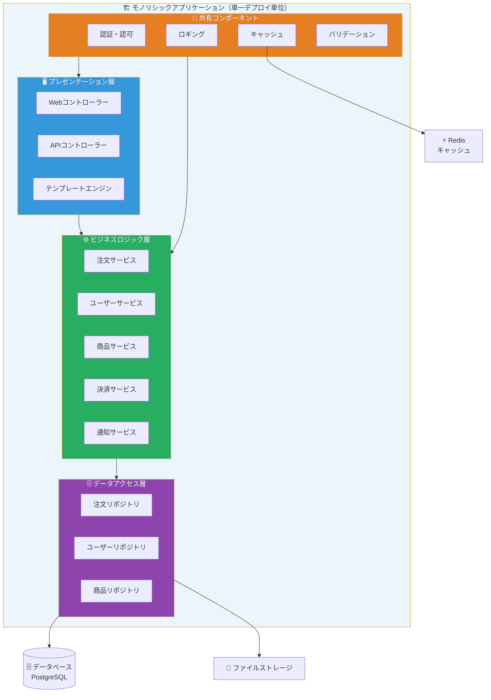
```mermaid
graph TD
    subgraph MONOLITH["🏗️ モノリシックアプリケーション（単一デプロイ単位）"]
        subgraph PRESENTATION["🖥️ プレゼンテーション層"]
            WEB_CTRL["Webコントローラー"]
            API_CTRL["APIコントローラー"]
            TEMPLATE["テンプレートエンジン"]
        end

        subgraph BUSINESS["⚙️ ビジネスロジック層"]
            ORDER_SVC["注文サービス"]
            USER_SVC["ユーザーサービス"]
            PRODUCT_SVC["商品サービス"]
            PAYMENT_SVC["決済サービス"]
            NOTIFY_SVC["通知サービス"]
        end

        subgraph DATA["🗄️ データアクセス層"]
            ORDER_REPO["注文リポジトリ"]
            USER_REPO["ユーザーリポジトリ"]
            PRODUCT_REPO["商品リポジトリ"]
        end

        subgraph SHARED["🔧 共有コンポーネント"]
            AUTH["認証・認可"]
            LOGGER["ロギング"]
            CACHE["キャッシュ"]
            VALIDATOR["バリデーション"]
        end
    end

    DB[("🗄️ データベース<br>PostgreSQL")]
    REDIS["⚡ Redis<br>キャッシュ"]
    STORAGE["📁 ファイルストレージ"]

    PRESENTATION --> BUSINESS
    BUSINESS --> DATA
    DATA --> DB
    SHARED --> PRESENTATION & BUSINESS
    CACHE --> REDIS
    DATA --> STORAGE

    style MONOLITH fill:#ebf5fb
    style PRESENTATION fill:#3498db,color:#fff
    style BUSINESS fill:#27ae60,color:#fff
    style DATA fill:#8e44ad,color:#fff
    style SHARED fill:#e67e22,color:#fff
```

### 1.3 モノリシックが依然として重要な理由

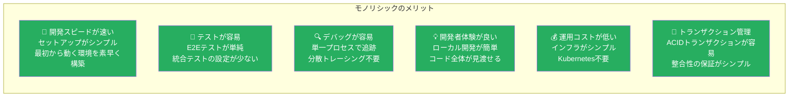
```mermaid
graph LR
    subgraph "モノリシックのメリット"
        M1["🚀 開発スピードが速い<br>セットアップがシンプル<br>最初から動く環境を素早く構築"]
        M2["🧪 テストが容易<br>E2Eテストが単純<br>統合テストの設定が少ない"]
        M3["🔍 デバッグが容易<br>単一プロセスで追跡<br>分散トレーシング不要"]
        M4["💡 開発者体験が良い<br>ローカル開発が簡単<br>コード全体が見渡せる"]
        M5["💰 運用コストが低い<br>インフラがシンプル<br>Kubernetes不要"]
        M6["🔄 トランザクション管理<br>ACIDトランザクションが容易<br>整合性の保証がシンプル"]
    end

    style M1 fill:#27ae60,color:#fff
    style M2 fill:#27ae60,color:#fff
    style M3 fill:#27ae60,color:#fff
    style M4 fill:#27ae60,color:#fff
    style M5 fill:#27ae60,color:#fff
    style M6 fill:#27ae60,color:#fff
```

### 1.4 アーキテクチャ選択の判断基準

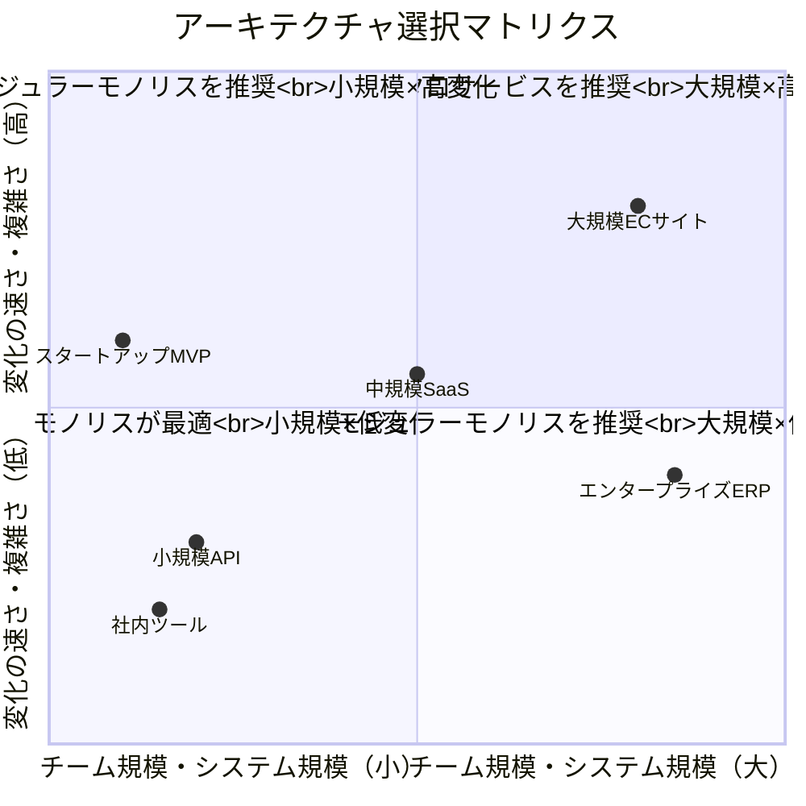
```mermaid
quadrantChart
    title アーキテクチャ選択マトリクス
    x-axis チーム規模・システム規模（小） --> チーム規模・システム規模（大）
    y-axis 変化の速さ・複雑さ（低） --> 変化の速さ・複雑さ（高）
    quadrant-1 "マイクロサービスを推奨<br>大規模×高変化"
    quadrant-2 "モジュラーモノリスを推奨<br>小規模×高変化"
    quadrant-3 "モノリスが最適<br>小規模×低変化"
    quadrant-4 "モジュラーモノリスを推奨<br>大規模×低変化"
    スタートアップMVP: [0.1, 0.6]
    社内ツール: [0.15, 0.2]
    中規模SaaS: [0.5, 0.55]
    大規模ECサイト: [0.8, 0.8]
    エンタープライズERP: [0.85, 0.4]
    小規模API: [0.2, 0.3]
```

---

## 2. モノリシックの種類と構造

### 2.1 モノリシックの4タイプ

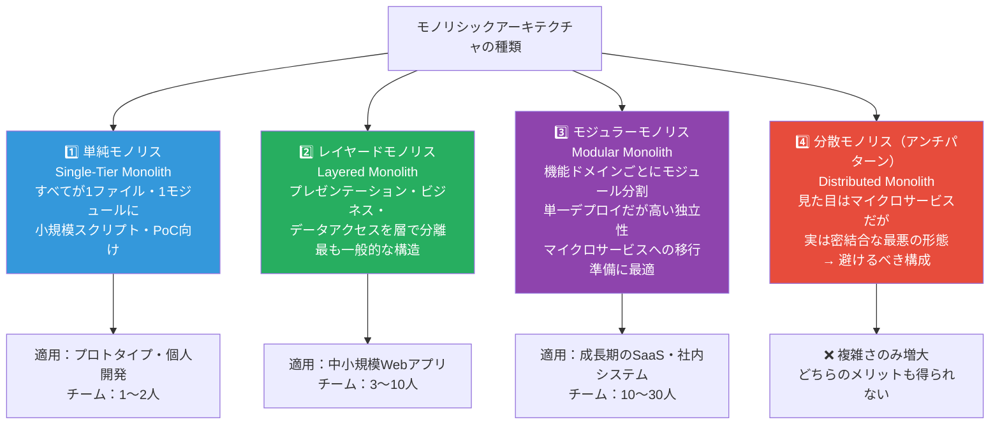
```mermaid
graph TD
    TYPES["モノリシックアーキテクチャの種類"]

    TYPES --> SINGLE["1️⃣ 単純モノリス<br>Single-Tier Monolith<br>すべてが1ファイル・1モジュールに<br>小規模スクリプト・PoC向け"]

    TYPES --> LAYERED["2️⃣ レイヤードモノリス<br>Layered Monolith<br>プレゼンテーション・ビジネス・<br>データアクセスを層で分離<br>最も一般的な構造"]

    TYPES --> MODULAR["3️⃣ モジュラーモノリス<br>Modular Monolith<br>機能ドメインごとにモジュール分割<br>単一デプロイだが高い独立性<br>マイクロサービスへの移行準備に最適"]

    TYPES --> DISTRIBUTED["4️⃣ 分散モノリス（アンチパターン）<br>Distributed Monolith<br>見た目はマイクロサービスだが<br>実は密結合な最悪の形態<br>→ 避けるべき構成"]

    SINGLE --> S_USE["適用：プロトタイプ・個人開発<br>チーム：1〜2人"]
    LAYERED --> L_USE["適用：中小規模Webアプリ<br>チーム：3〜10人"]
    MODULAR --> M_USE["適用：成長期のSaaS・社内システム<br>チーム：10〜30人"]
    DISTRIBUTED --> D_USE["❌ 複雑さのみ増大<br>どちらのメリットも得られない"]

    style SINGLE fill:#3498db,color:#fff
    style LAYERED fill:#27ae60,color:#fff
    style MODULAR fill:#8e44ad,color:#fff
    style DISTRIBUTED fill:#e74c3c,color:#fff
```

### 2.2 単純モノリス vs レイヤードモノリス

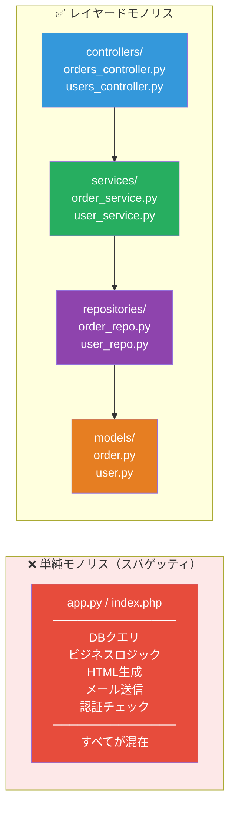
```mermaid
graph LR
    subgraph SIMPLE["❌ 単純モノリス（スパゲッティ）"]
        SP_FILE["app.py / index.php<br>───────────────<br>DBクエリ<br>ビジネスロジック<br>HTML生成<br>メール送信<br>認証チェック<br>───────────────<br>すべてが混在"]
    end

    subgraph LAYERED_GOOD["✅ レイヤードモノリス"]
        L1["controllers/<br>orders_controller.py<br>users_controller.py"]
        L2["services/<br>order_service.py<br>user_service.py"]
        L3["repositories/<br>order_repo.py<br>user_repo.py"]
        L4["models/<br>order.py<br>user.py"]
        L1 --> L2 --> L3 --> L4
    end

    style SIMPLE fill:#fde8e8
    style SP_FILE fill:#e74c3c,color:#fff
    style L1 fill:#3498db,color:#fff
    style L2 fill:#27ae60,color:#fff
    style L3 fill:#8e44ad,color:#fff
    style L4 fill:#e67e22,color:#fff
```

---

## 3. モノリシックの基本設計原則

### 3.1 SOLID原則のモノリスへの適用

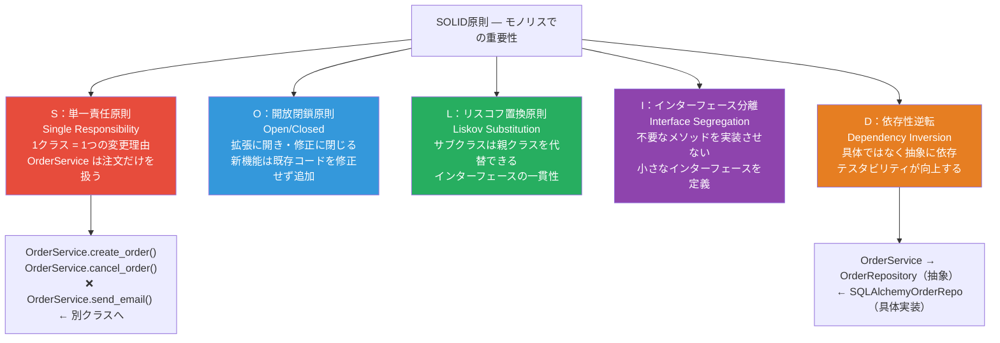
```mermaid
graph TD
    SOLID["SOLID原則 — モノリスでの重要性"]

    SOLID --> SRP["S：単一責任原則<br>Single Responsibility<br>1クラス = 1つの変更理由<br>OrderService は注文だけを扱う"]

    SOLID --> OCP["O：開放閉鎖原則<br>Open/Closed<br>拡張に開き・修正に閉じる<br>新機能は既存コードを修正せず追加"]

    SOLID --> LSP["L：リスコフ置換原則<br>Liskov Substitution<br>サブクラスは親クラスを代替できる<br>インターフェースの一貫性"]

    SOLID --> ISP["I：インターフェース分離<br>Interface Segregation<br>不要なメソッドを実装させない<br>小さなインターフェースを定義"]

    SOLID --> DIP["D：依存性逆転<br>Dependency Inversion<br>具体ではなく抽象に依存<br>テスタビリティが向上する"]

    SRP --> SRP_EX["OrderService.create_order()<br>OrderService.cancel_order()<br>❌ OrderService.send_email() ← 別クラスへ"]
    DIP --> DIP_EX["OrderService → OrderRepository（抽象）<br>← SQLAlchemyOrderRepo（具体実装）"]

    style SRP fill:#e74c3c,color:#fff
    style OCP fill:#3498db,color:#fff
    style LSP fill:#27ae60,color:#fff
    style ISP fill:#8e44ad,color:#fff
    style DIP fill:#e67e22,color:#fff
```

### 3.2 モノリス設計の黄金ルール

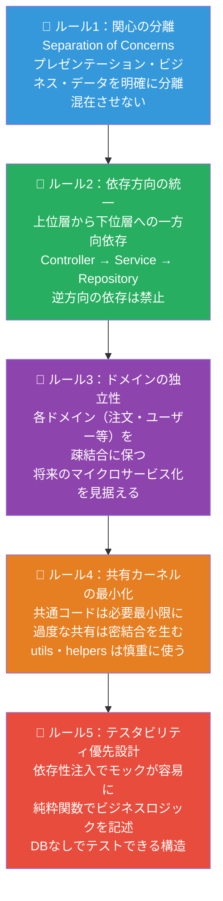
```mermaid
flowchart TD
    RULE1["📌 ルール1：関心の分離<br>Separation of Concerns<br>プレゼンテーション・ビジネス・データを明確に分離<br>混在させない"]

    RULE2["📌 ルール2：依存方向の統一<br>上位層から下位層への一方向依存<br>Controller → Service → Repository<br>逆方向の依存は禁止"]

    RULE3["📌 ルール3：ドメインの独立性<br>各ドメイン（注文・ユーザー等）を<br>疎結合に保つ<br>将来のマイクロサービス化を見据える"]

    RULE4["📌 ルール4：共有カーネルの最小化<br>共通コードは必要最小限に<br>過度な共有は密結合を生む<br>utils・helpers は慎重に使う"]

    RULE5["📌 ルール5：テスタビリティ優先設計<br>依存性注入でモックが容易に<br>純粋関数でビジネスロジックを記述<br>DBなしでテストできる構造"]

    RULE1 --> RULE2 --> RULE3 --> RULE4 --> RULE5

    style RULE1 fill:#3498db,color:#fff
    style RULE2 fill:#27ae60,color:#fff
    style RULE3 fill:#8e44ad,color:#fff
    style RULE4 fill:#e67e22,color:#fff
    style RULE5 fill:#e74c3c,color:#fff
```

---

## 4. レイヤードアーキテクチャの詳細

### 4.1 4層レイヤードアーキテクチャ

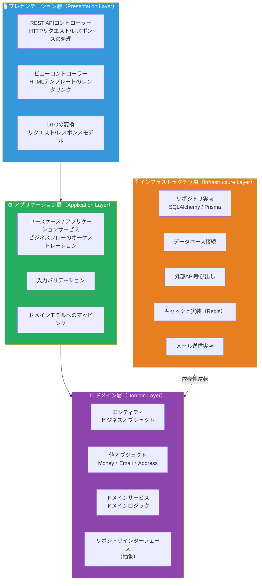
```mermaid
graph TD
    subgraph LAYER1["🖥️ プレゼンテーション層（Presentation Layer）"]
        REST_C["REST APIコントローラー<br>HTTPリクエスト/レスポンスの処理"]
        VIEW_C["ビューコントローラー<br>HTMLテンプレートのレンダリング"]
        DTO["DTOの変換<br>リクエスト/レスポンスモデル"]
    end

    subgraph LAYER2["⚙️ アプリケーション層（Application Layer）"]
        USE_CASE["ユースケース / アプリケーションサービス<br>ビジネスフローのオーケストレーション"]
        VALIDATOR2["入力バリデーション"]
        MAPPER["ドメインモデルへのマッピング"]
    end

    subgraph LAYER3["🧩 ドメイン層（Domain Layer）"]
        ENTITIES["エンティティ<br>ビジネスオブジェクト"]
        VALUE_OBJ["値オブジェクト<br>Money・Email・Address"]
        DOMAIN_SVC["ドメインサービス<br>ドメインロジック"]
        REPO_IF["リポジトリインターフェース<br>（抽象）"]
    end

    subgraph LAYER4["🗄️ インフラストラクチャ層（Infrastructure Layer）"]
        REPO_IMPL["リポジトリ実装<br>SQLAlchemy / Prisma"]
        DB_LAYER["データベース接続"]
        EXT_API["外部API呼び出し"]
        CACHE_IMPL["キャッシュ実装（Redis）"]
        EMAIL_IMPL["メール送信実装"]
    end

    LAYER1 --> LAYER2 --> LAYER3
    LAYER4 -.->|"依存性逆転"| LAYER3

    style LAYER1 fill:#3498db,color:#fff
    style LAYER2 fill:#27ae60,color:#fff
    style LAYER3 fill:#8e44ad,color:#fff
    style LAYER4 fill:#e67e22,color:#fff
```

### 4.2 データフローの流れ

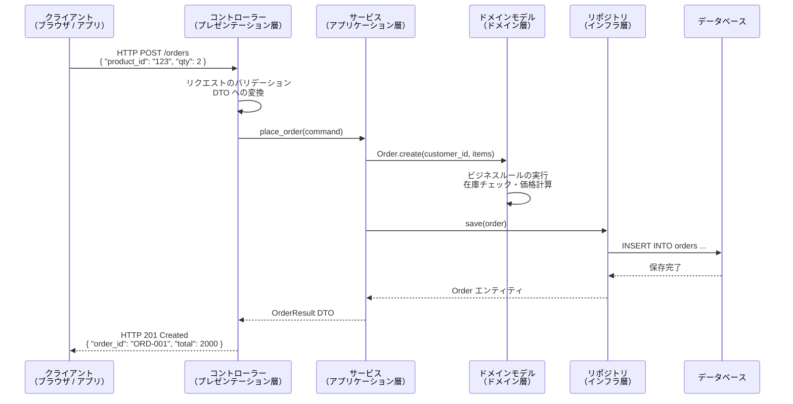
```mermaid
sequenceDiagram
    participant CLIENT as クライアント<br>（ブラウザ / アプリ）
    participant CTRL as コントローラー<br>（プレゼンテーション層）
    participant SVC as サービス<br>（アプリケーション層）
    participant DOM as ドメインモデル<br>（ドメイン層）
    participant REPO as リポジトリ<br>（インフラ層）
    participant DB as データベース

    CLIENT->>CTRL: HTTP POST /orders<br>{ "product_id": "123", "qty": 2 }

    CTRL->>CTRL: リクエストのバリデーション<br>DTO への変換

    CTRL->>SVC: place_order(command)

    SVC->>DOM: Order.create(customer_id, items)
    DOM->>DOM: ビジネスルールの実行<br>在庫チェック・価格計算

    SVC->>REPO: save(order)
    REPO->>DB: INSERT INTO orders ...
    DB-->>REPO: 保存完了

    REPO-->>SVC: Order エンティティ

    SVC-->>CTRL: OrderResult DTO

    CTRL-->>CLIENT: HTTP 201 Created<br>{ "order_id": "ORD-001", "total": 2000 }
```

### 4.3 ディレクトリ構成のベストプラクティス

```text
my_app/
│
├── 📁 presentation/               # プレゼンテーション層
│   ├── controllers/
│   │   ├── order_controller.py    # 注文 API エンドポイント
│   │   ├── user_controller.py
│   │   └── product_controller.py
│   ├── schemas/                   # リクエスト/レスポンス スキーマ (Pydantic)
│   │   ├── order_schema.py
│   │   └── user_schema.py
│   └── middleware/
│       ├── auth_middleware.py
│       └── error_handler.py
│
├── 📁 application/                # アプリケーション層
│   ├── use_cases/
│   │   ├── place_order.py         # 注文確定ユースケース
│   │   ├── cancel_order.py
│   │   └── register_user.py
│   └── dtos/                      # アプリケーション内部 DTO
│
├── 📁 domain/                     # ドメイン層（最重要・最安定）
│   ├── entities/
│   │   ├── order.py               # 注文エンティティ
│   │   ├── user.py
│   │   └── product.py
│   ├── value_objects/
│   │   ├── money.py               # 金額値オブジェクト
│   │   ├── email.py
│   │   └── address.py
│   ├── services/                  # ドメインサービス
│   │   └── pricing_service.py
│   ├── repositories/              # リポジトリ インターフェース（抽象）
│   │   ├── order_repository.py
│   │   └── user_repository.py
│   └── exceptions.py              # ドメイン例外
│
├── 📁 infrastructure/             # インフラストラクチャ層
│   ├── database/
│   │   ├── models.py              # SQLAlchemy モデル
│   │   ├── session.py             # DB セッション管理
│   │   └── migrations/            # Alembic マイグレーション
│   ├── repositories/              # リポジトリ 具体実装
│   │   ├── sql_order_repo.py
│   │   └── sql_user_repo.py
│   ├── cache/
│   │   └── redis_cache.py
│   └── external/
│       ├── payment_gateway.py     # 決済API
│       └── email_service.py       # メール送信
│
├── 📁 config/                     # 設定管理
│   ├── settings.py                # 環境変数・設定値
│   └── dependencies.py            # 依存性注入設定
│
├── 📁 tests/                      # テスト（層別に整理）
│   ├── unit/
│   │   ├── domain/
│   │   └── application/
│   ├── integration/
│   └── e2e/
│
└── main.py                        # アプリエントリポイント
```

---

## 5. モジュラーモノリス（推奨形態）

### 5.1 モジュラーモノリスの構造

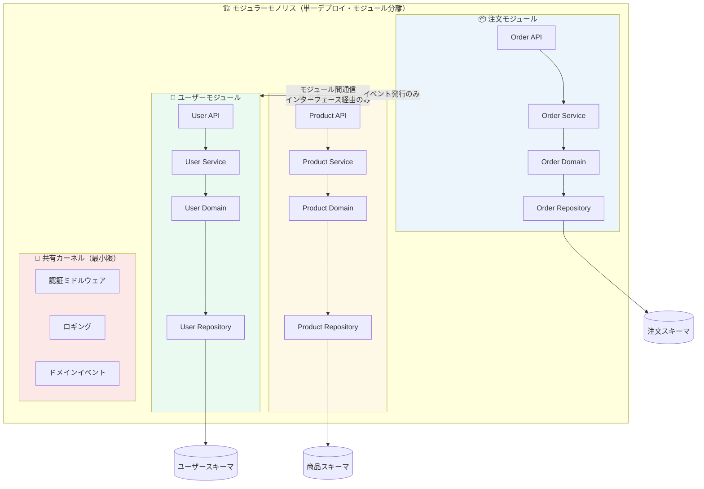
```mermaid
graph TD
    subgraph MODULAR_MONO["🏗️ モジュラーモノリス（単一デプロイ・モジュール分離）"]
        subgraph ORDER_MOD["📦 注文モジュール"]
            OM_API["Order API"]
            OM_SVC["Order Service"]
            OM_DOM["Order Domain"]
            OM_REPO["Order Repository"]
            OM_API --> OM_SVC --> OM_DOM
            OM_DOM --> OM_REPO
        end

        subgraph USER_MOD["👤 ユーザーモジュール"]
            UM_API["User API"]
            UM_SVC["User Service"]
            UM_DOM["User Domain"]
            UM_REPO["User Repository"]
            UM_API --> UM_SVC --> UM_DOM
            UM_DOM --> UM_REPO
        end

        subgraph PRODUCT_MOD["🛍️ 商品モジュール"]
            PM_API["Product API"]
            PM_SVC["Product Service"]
            PM_DOM["Product Domain"]
            PM_REPO["Product Repository"]
            PM_API --> PM_SVC --> PM_DOM
            PM_DOM --> PM_REPO
        end

        subgraph SHARED_KERNEL["🔧 共有カーネル（最小限）"]
            AUTH_K["認証ミドルウェア"]
            LOG_K["ロギング"]
            EVENT_K["ドメインイベント"]
        end
    end

    ORDER_MOD -->|"モジュール間通信<br>インターフェース経由のみ"| USER_MOD
    ORDER_MOD -->|"イベント発行のみ"| PRODUCT_MOD

    DB_ORDER[("注文スキーマ")]
    DB_USER[("ユーザースキーマ")]
    DB_PRODUCT[("商品スキーマ")]

    OM_REPO --> DB_ORDER
    UM_REPO --> DB_USER
    PM_REPO --> DB_PRODUCT

    style ORDER_MOD fill:#ebf5fb
    style USER_MOD fill:#eafaf1
    style PRODUCT_MOD fill:#fef9e7
    style SHARED_KERNEL fill:#fde8e8
```

### 5.2 モジュール間通信のルール

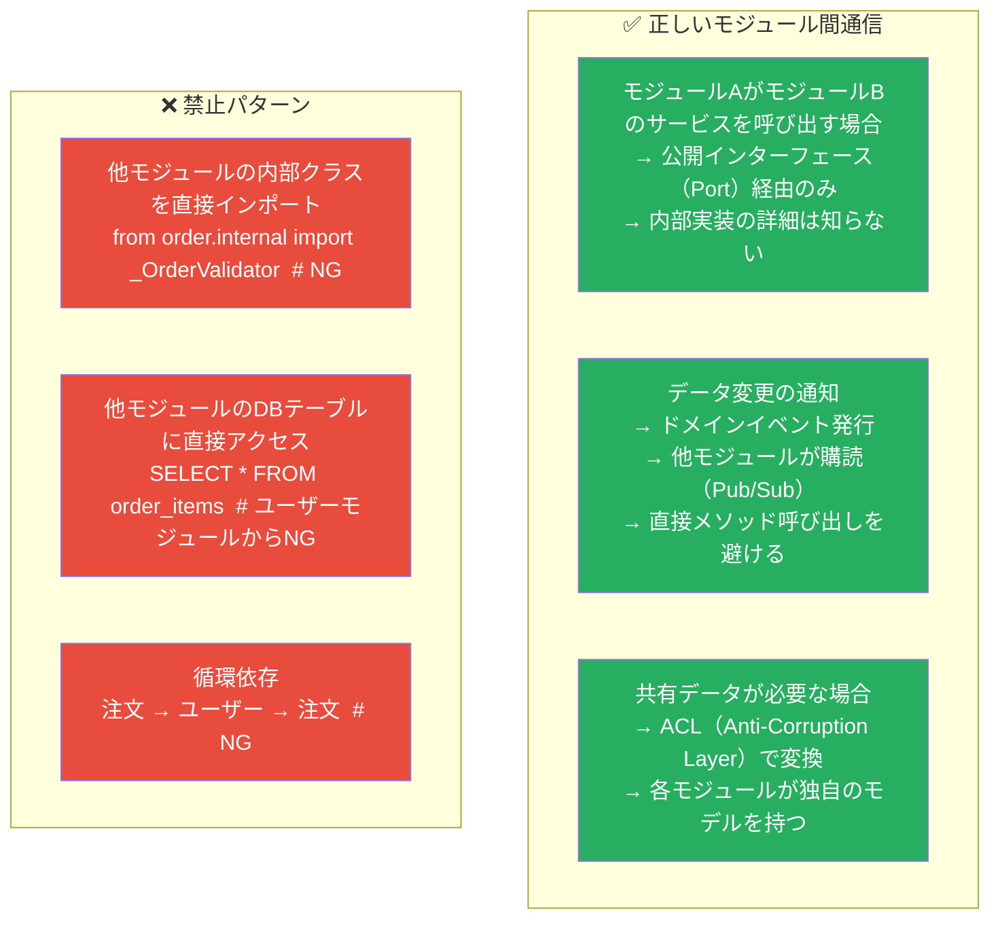
```mermaid
graph TD
    subgraph "✅ 正しいモジュール間通信"
        GOOD1["モジュールAがモジュールBのサービスを呼び出す場合<br>→ 公開インターフェース（Port）経由のみ<br>→ 内部実装の詳細は知らない"]

        GOOD2["データ変更の通知<br>→ ドメインイベント発行<br>→ 他モジュールが購読（Pub/Sub）<br>→ 直接メソッド呼び出しを避ける"]

        GOOD3["共有データが必要な場合<br>→ ACL（Anti-Corruption Layer）で変換<br>→ 各モジュールが独自のモデルを持つ"]
    end

    subgraph "❌ 禁止パターン"
        BAD1["他モジュールの内部クラスを直接インポート<br>from order.internal import _OrderValidator  # NG"]
        BAD2["他モジュールのDBテーブルに直接アクセス<br>SELECT * FROM order_items  # ユーザーモジュールからNG"]
        BAD3["循環依存<br>注文 → ユーザー → 注文  # NG"]
    end

    style GOOD1 fill:#27ae60,color:#fff
    style GOOD2 fill:#27ae60,color:#fff
    style GOOD3 fill:#27ae60,color:#fff
    style BAD1 fill:#e74c3c,color:#fff
    style BAD2 fill:#e74c3c,color:#fff
    style BAD3 fill:#e74c3c,color:#fff
```

### 5.3 モジュラーモノリスの実装例（Python）

```python
# ────────────────────────────────────────────────
# モジュール間通信パターン（Python実装例）
# ────────────────────────────────────────────────

# ─── 各モジュールの公開インターフェース定義 ───
# modules/users/public.py（ユーザーモジュールの公開API）

from abc import ABC, abstractmethod
from dataclasses import dataclass


@dataclass(frozen=True)
class UserInfo:
    """ユーザーモジュールが外部に公開するデータ構造"""
    user_id: str
    name: str
    email: str
    is_active: bool


class UserQueryService(ABC):
    """ユーザーモジュールの公開クエリインターフェース"""

    @abstractmethod
    def get_user_by_id(self, user_id: str) -> UserInfo | None:
        ...

    @abstractmethod
    def is_user_active(self, user_id: str) -> bool:
        ...


# ─── 注文モジュールからユーザーモジュールを使う ───
# modules/orders/application/place_order.py

from modules.users.public import UserQueryService  # 公開インターフェースのみ依存
from modules.orders.domain.order import Order
from modules.orders.domain.repositories import OrderRepository
from modules.shared.events import EventBus


class PlaceOrderUseCase:
    """
    注文モジュールのユースケース
    他モジュールへは公開インターフェース経由でのみアクセス
    """

    def __init__(
        self,
        order_repository: OrderRepository,
        user_query_service: UserQueryService,  # ← インターフェースに依存
        event_bus: EventBus,
    ):
        self._order_repo = order_repository
        self._user_service = user_query_service
        self._event_bus = event_bus

    def execute(self, customer_id: str, items: list[dict]) -> dict:
        # ユーザーモジュールの公開インターフェースを使用
        if not self._user_service.is_user_active(customer_id):
            raise ValueError("アクティブでないユーザーは注文できません")

        user_info = self._user_service.get_user_by_id(customer_id)

        # 注文の作成（注文ドメイン内部ロジック）
        order = Order.create(
            customer_id=customer_id,
            customer_name=user_info.name,
            items=items,
        )

        self._order_repo.save(order)

        # イベント発行（他モジュールへの通知はイベント経由）
        self._event_bus.publish("order.placed", {
            "order_id": order.id,
            "customer_id": customer_id,
        })

        return {"order_id": order.id, "status": order.status.value}


# ─── ドメインイベントバスの実装 ───
# modules/shared/events.py

from typing import Callable, Any
from collections import defaultdict
import logging

logger = logging.getLogger(__name__)


class InMemoryEventBus:
    """
    シンプルなインメモリイベントバス
    モジュール間の疎結合な通信を実現する
    """

    def __init__(self):
        self._handlers: dict[str, list[Callable]] = defaultdict(list)

    def subscribe(self, event_type: str, handler: Callable) -> None:
        """イベントハンドラーを登録する"""
        self._handlers[event_type].append(handler)
        logger.debug(f"ハンドラー登録: {event_type} → {handler.__name__}")

    def publish(self, event_type: str, payload: dict) -> None:
        """イベントを発行する"""
        handlers = self._handlers.get(event_type, [])
        logger.info(f"イベント発行: {event_type} ハンドラー数={len(handlers)}")

        for handler in handlers:
            try:
                handler(payload)
            except Exception as e:
                logger.error(f"ハンドラーエラー: {handler.__name__} - {e}")


# ─── 通知モジュールが注文イベントを購読 ───
# modules/notifications/event_handlers.py

class OrderNotificationHandler:
    """注文イベントに反応して通知を送る"""

    def __init__(self, email_service):
        self._email = email_service

    def handle_order_placed(self, payload: dict) -> None:
        """注文確定イベントを処理する"""
        order_id = payload["order_id"]
        customer_id = payload["customer_id"]
        logger.info(f"注文確認メール送信: order={order_id}")
        # メール送信処理...


# ─── アプリ起動時の配線（Composition Root）───
# config/dependencies.py

def setup_event_handlers(event_bus: InMemoryEventBus) -> None:
    """モジュール間のイベント配線を一か所で設定する"""
    notification_handler = OrderNotificationHandler(email_service=get_email_service())

    event_bus.subscribe("order.placed", notification_handler.handle_order_placed)
    event_bus.subscribe("order.cancelled", notification_handler.handle_order_cancelled)
```

---

## 6. データベース設計

### 6.1 モノリスのデータベース設計パターン

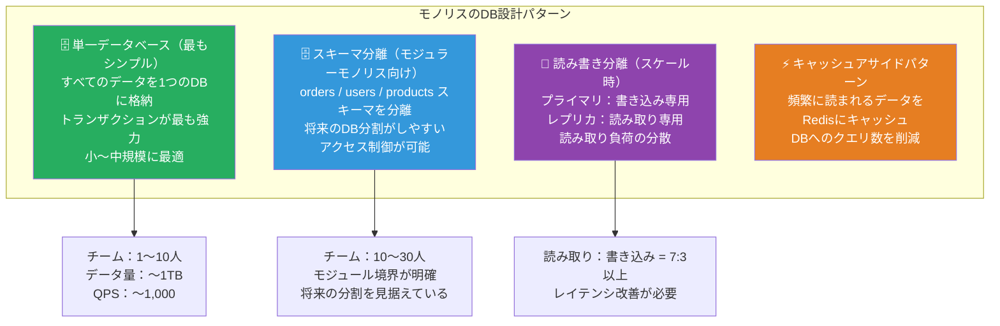
```mermaid
graph TD
    subgraph DB_PATTERNS["モノリスのDB設計パターン"]
        SINGLE_DB["🗄️ 単一データベース（最もシンプル）<br>すべてのデータを1つのDBに格納<br>トランザクションが最も強力<br>小〜中規模に最適"]

        SCHEMA_SEP["🗄️ スキーマ分離（モジュラーモノリス向け）<br>orders / users / products スキーマを分離<br>将来のDB分割がしやすい<br>アクセス制御が可能"]

        READ_WRITE["🔄 読み書き分離（スケール時）<br>プライマリ：書き込み専用<br>レプリカ：読み取り専用<br>読み取り負荷の分散"]

        CACHE_ASIDE["⚡ キャッシュアサイドパターン<br>頻繁に読まれるデータをRedisにキャッシュ<br>DBへのクエリ数を削減"]
    end

    SINGLE_DB --> WHEN1["チーム：1〜10人<br>データ量：〜1TB<br>QPS：〜1,000"]
    SCHEMA_SEP --> WHEN2["チーム：10〜30人<br>モジュール境界が明確<br>将来の分割を見据えている"]
    READ_WRITE --> WHEN3["読み取り：書き込み = 7:3以上<br>レイテンシ改善が必要"]

    style SINGLE_DB fill:#27ae60,color:#fff
    style SCHEMA_SEP fill:#3498db,color:#fff
    style READ_WRITE fill:#8e44ad,color:#fff
    style CACHE_ASIDE fill:#e67e22,color:#fff
```

### 6.2 スキーマ設計のベストプラクティス

```python
# ────────────────────────────────────────────────
# SQLAlchemy モデル設計（モノリスのベストプラクティス）
# ────────────────────────────────────────────────

from sqlalchemy import (
    Column, String, Integer, Numeric, DateTime,
    ForeignKey, Index, Boolean, Text, Enum as SQLEnum
)
from sqlalchemy.orm import relationship, DeclarativeBase
from sqlalchemy.sql import func
from enum import Enum
import uuid


class Base(DeclarativeBase):
    pass


class OrderStatus(str, Enum):
    PENDING   = "pending"
    CONFIRMED = "confirmed"
    SHIPPED   = "shipped"
    DELIVERED = "delivered"
    CANCELLED = "cancelled"


class UserModel(Base):
    """ユーザーテーブル"""
    __tablename__ = "users"
    __table_args__ = (
        Index("ix_users_email", "email", unique=True),
        Index("ix_users_created_at", "created_at"),
        {"schema": "user_schema"},  # スキーマ分離
    )

    id         = Column(String(36), primary_key=True, default=lambda: str(uuid.uuid4()))
    email      = Column(String(255), nullable=False, unique=True)
    name       = Column(String(100), nullable=False)
    is_active  = Column(Boolean, nullable=False, default=True)
    created_at = Column(DateTime, nullable=False, server_default=func.now())
    updated_at = Column(DateTime, nullable=False, server_default=func.now(), onupdate=func.now())

    # リレーション
    orders = relationship("OrderModel", back_populates="user", lazy="select")


class OrderModel(Base):
    """注文テーブル"""
    __tablename__ = "orders"
    __table_args__ = (
        Index("ix_orders_user_id", "user_id"),
        Index("ix_orders_status", "status"),
        Index("ix_orders_created_at", "created_at"),
        {"schema": "order_schema"},  # スキーマ分離
    )

    id           = Column(String(36), primary_key=True, default=lambda: str(uuid.uuid4()))
    user_id      = Column(String(36), ForeignKey("user_schema.users.id"), nullable=False)
    status       = Column(SQLEnum(OrderStatus), nullable=False, default=OrderStatus.PENDING)
    total_amount = Column(Numeric(12, 2), nullable=False)
    currency     = Column(String(3), nullable=False, default="JPY")
    created_at   = Column(DateTime, nullable=False, server_default=func.now())
    updated_at   = Column(DateTime, nullable=False, server_default=func.now(), onupdate=func.now())

    # リレーション
    user       = relationship("UserModel", back_populates="orders")
    order_items = relationship("OrderItemModel", back_populates="order", cascade="all, delete-orphan")


class OrderItemModel(Base):
    """注文明細テーブル"""
    __tablename__ = "order_items"
    __table_args__ = (
        Index("ix_order_items_order_id", "order_id"),
        {"schema": "order_schema"},
    )

    id           = Column(String(36), primary_key=True, default=lambda: str(uuid.uuid4()))
    order_id     = Column(String(36), ForeignKey("order_schema.orders.id"), nullable=False)
    product_id   = Column(String(36), nullable=False)
    product_name = Column(String(200), nullable=False)
    quantity     = Column(Integer, nullable=False)
    unit_price   = Column(Numeric(12, 2), nullable=False)

    order = relationship("OrderModel", back_populates="order_items")

    @property
    def subtotal(self) -> Numeric:
        return self.unit_price * self.quantity
```

### 6.3 マイグレーション管理

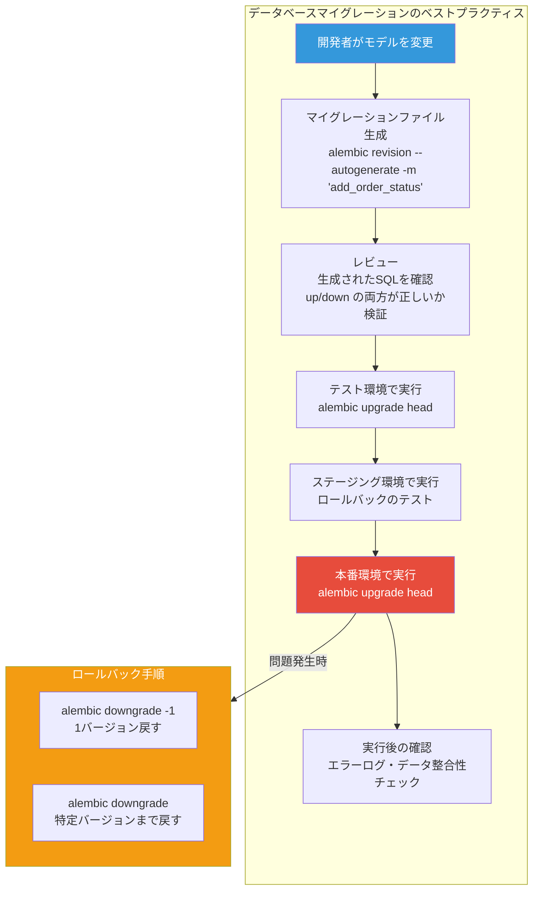
```mermaid
flowchart TD
    subgraph MIGRATION_FLOW["データベースマイグレーションのベストプラクティス"]
        DEV["開発者がモデルを変更"]
        GEN["マイグレーションファイル生成<br>alembic revision --autogenerate -m 'add_order_status'"]
        REVIEW["レビュー<br>生成されたSQLを確認<br>up/down の両方が正しいか検証"]
        TEST["テスト環境で実行<br>alembic upgrade head"]
        STAGING["ステージング環境で実行<br>ロールバックのテスト"]
        PROD["本番環境で実行<br>alembic upgrade head"]
        MONITOR["実行後の確認<br>エラーログ・データ整合性チェック"]
    end

    DEV --> GEN --> REVIEW --> TEST --> STAGING --> PROD --> MONITOR

    subgraph ROLLBACK["ロールバック手順"]
        RB1["alembic downgrade -1<br>1バージョン戻す"]
        RB2["alembic downgrade <revision_id><br>特定バージョンまで戻す"]
    end

    PROD -->|"問題発生時"| ROLLBACK

    style DEV fill:#3498db,color:#fff
    style PROD fill:#e74c3c,color:#fff
    style ROLLBACK fill:#f39c12,color:#fff
```

---

## 7. ビジネスロジックの実装

### 7.1 ビジネスロジックの配置場所

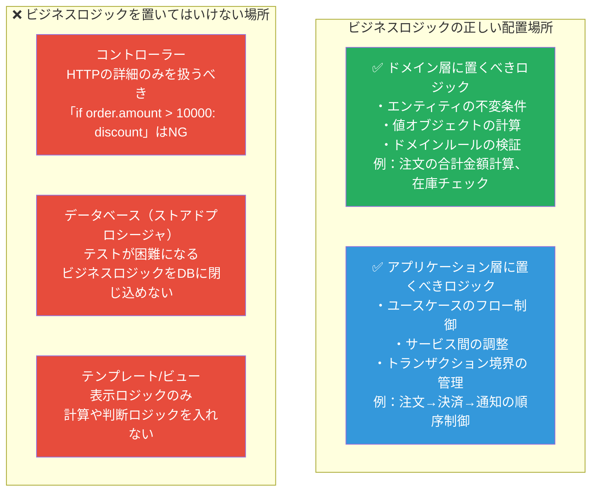
```mermaid
graph TD
    subgraph WHERE_LOGIC["ビジネスロジックの正しい配置場所"]
        DOMAIN_LAYER["✅ ドメイン層に置くべきロジック<br>・エンティティの不変条件<br>・値オブジェクトの計算<br>・ドメインルールの検証<br>例：注文の合計金額計算、在庫チェック"]

        APP_LAYER["✅ アプリケーション層に置くべきロジック<br>・ユースケースのフロー制御<br>・サービス間の調整<br>・トランザクション境界の管理<br>例：注文→決済→通知の順序制御"]
    end

    subgraph WRONG_PLACE["❌ ビジネスロジックを置いてはいけない場所"]
        CTRL_WRONG["コントローラー<br>HTTPの詳細のみを扱うべき<br>「if order.amount > 10000: discount」はNG"]

        DB_WRONG["データベース（ストアドプロシージャ）<br>テストが困難になる<br>ビジネスロジックをDBに閉じ込めない"]

        TEMPLATE_WRONG["テンプレート/ビュー<br>表示ロジックのみ<br>計算や判断ロジックを入れない"]
    end

    style DOMAIN_LAYER fill:#27ae60,color:#fff
    style APP_LAYER fill:#3498db,color:#fff
    style CTRL_WRONG fill:#e74c3c,color:#fff
    style DB_WRONG fill:#e74c3c,color:#fff
    style TEMPLATE_WRONG fill:#e74c3c,color:#fff
```

### 7.2 ドメインモデルの実装例

```python
# ────────────────────────────────────────────────
# ドメインモデル実装（リッチドメインモデル）
# ────────────────────────────────────────────────

from dataclasses import dataclass, field
from decimal import Decimal
from enum import Enum
from datetime import datetime
from typing import Optional
import uuid


# ─── 値オブジェクト ───

@dataclass(frozen=True)
class Money:
    """金額を表す値オブジェクト（イミュータブル）"""
    amount: Decimal
    currency: str = "JPY"

    def __post_init__(self):
        if self.amount < 0:
            raise ValueError(f"金額は0以上でなければなりません: {self.amount}")

    def __add__(self, other: "Money") -> "Money":
        if self.currency != other.currency:
            raise ValueError(f"通貨が一致しません: {self.currency} vs {other.currency}")
        return Money(self.amount + other.amount, self.currency)

    def __mul__(self, quantity: int) -> "Money":
        return Money(self.amount * quantity, self.currency)

    def apply_discount(self, rate: Decimal) -> "Money":
        """割引を適用する（0.0〜1.0の割引率）"""
        if not 0 <= rate <= 1:
            raise ValueError(f"割引率は0〜1の範囲: {rate}")
        discount = self.amount * rate
        return Money(self.amount - discount, self.currency)

    def __str__(self) -> str:
        return f"{self.amount:,.0f} {self.currency}"


@dataclass(frozen=True)
class Email:
    """メールアドレスの値オブジェクト"""
    value: str

    def __post_init__(self):
        if "@" not in self.value or len(self.value) < 5:
            raise ValueError(f"無効なメールアドレス: {self.value}")


# ─── エンティティ ───

class OrderStatus(Enum):
    PENDING   = "pending"
    CONFIRMED = "confirmed"
    SHIPPED   = "shipped"
    DELIVERED = "delivered"
    CANCELLED = "cancelled"


@dataclass
class OrderItem:
    """注文明細（値オブジェクト的なエンティティ）"""
    product_id:   str
    product_name: str
    unit_price:   Money
    quantity:     int

    def __post_init__(self):
        if self.quantity <= 0:
            raise ValueError(f"数量は1以上: {self.quantity}")

    @property
    def subtotal(self) -> Money:
        return self.unit_price * self.quantity


@dataclass
class Order:
    """
    注文エンティティ（集約ルート）
    ─ ビジネスロジックをここに集約する ─
    ─ フレームワーク依存なし・純粋なPython ─
    """
    id:          str
    customer_id: str
    _items:      list[OrderItem] = field(default_factory=list)
    _status:     OrderStatus    = OrderStatus.PENDING
    created_at:  datetime       = field(default_factory=datetime.utcnow)
    _events:     list[dict]     = field(default_factory=list)  # ドメインイベント

    # ─── ファクトリメソッド ───
    @classmethod
    def create(cls, customer_id: str) -> "Order":
        return cls(id=str(uuid.uuid4()), customer_id=customer_id)

    # ─── ビジネスロジック ───

    def add_item(
        self,
        product_id: str,
        product_name: str,
        unit_price: Money,
        quantity: int,
    ) -> None:
        """商品を注文に追加する（ビジネスルール付き）"""
        self._assert_editable()
        if quantity <= 0:
            raise ValueError("数量は1以上でなければなりません")

        # 同じ商品があれば数量を加算
        existing = next(
            (i for i in self._items if i.product_id == product_id), None
        )
        if existing:
            existing.quantity += quantity
        else:
            self._items.append(
                OrderItem(product_id, product_name, unit_price, quantity)
            )

    def confirm(self) -> None:
        """注文を確定する"""
        if self._status != OrderStatus.PENDING:
            raise ValueError("保留中の注文のみ確定できます")
        if not self._items:
            raise ValueError("商品が1件もありません")

        self._status = OrderStatus.CONFIRMED

        # ドメインイベントを記録
        self._events.append({
            "type": "OrderConfirmed",
            "order_id": self.id,
            "customer_id": self.customer_id,
            "total": str(self.total_amount),
        })

    def cancel(self, reason: str = "") -> None:
        """注文をキャンセルする"""
        if self._status in (OrderStatus.SHIPPED, OrderStatus.DELIVERED):
            raise ValueError("発送済み・配達済みの注文はキャンセルできません")
        self._status = OrderStatus.CANCELLED
        self._events.append({
            "type": "OrderCancelled",
            "order_id": self.id,
            "reason": reason,
        })

    def apply_discount(self, rate: Decimal) -> None:
        """注文全体に割引を適用する"""
        self._assert_editable()
        for item in self._items:
            item.unit_price = item.unit_price.apply_discount(rate)

    # ─── プロパティ ───

    @property
    def status(self) -> OrderStatus:
        return self._status

    @property
    def total_amount(self) -> Money:
        if not self._items:
            return Money(Decimal("0"))
        totals = [item.subtotal for item in self._items]
        return sum(totals[1:], totals[0])

    @property
    def items(self) -> tuple[OrderItem, ...]:
        return tuple(self._items)

    @property
    def domain_events(self) -> list[dict]:
        return list(self._events)

    def clear_events(self) -> None:
        self._events.clear()

    # ─── 内部ヘルパー ───

    def _assert_editable(self) -> None:
        if self._status != OrderStatus.PENDING:
            raise ValueError("確定済みの注文は変更できません")
```

---

## 8. APIとルーティング設計

### 8.1 RESTful API設計の構造

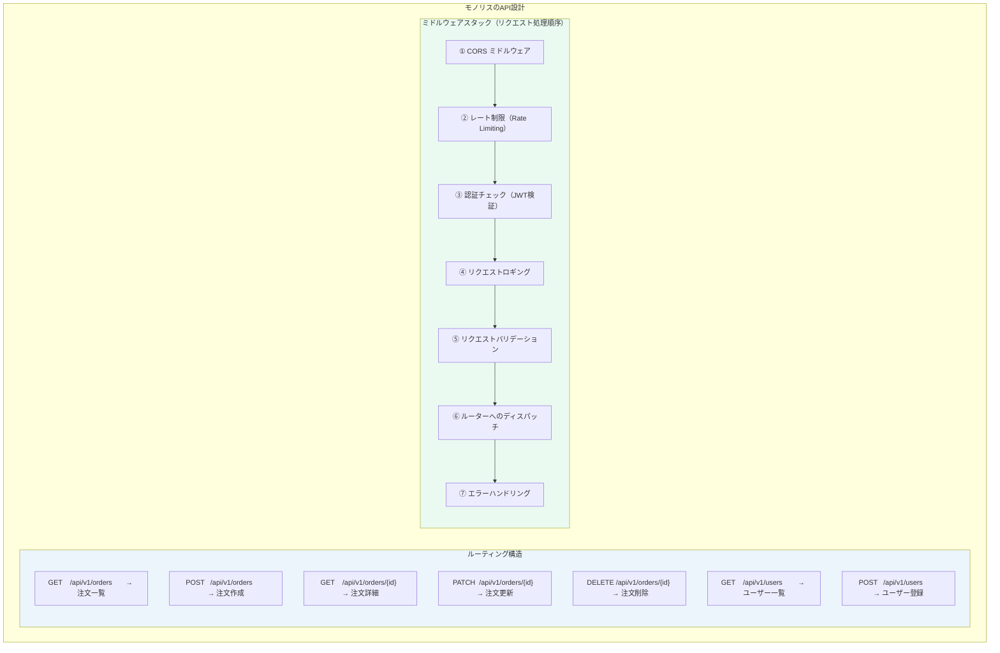
```mermaid
graph TD
    subgraph API_STRUCTURE["モノリスのAPI設計"]
        subgraph ROUTES["ルーティング構造"]
            R1["GET    /api/v1/orders       → 注文一覧"]
            R2["POST   /api/v1/orders       → 注文作成"]
            R3["GET    /api/v1/orders/{id}  → 注文詳細"]
            R4["PATCH  /api/v1/orders/{id}  → 注文更新"]
            R5["DELETE /api/v1/orders/{id}  → 注文削除"]
            R6["GET    /api/v1/users        → ユーザー一覧"]
            R7["POST   /api/v1/users        → ユーザー登録"]
        end

        subgraph MIDDLEWARE_STACK["ミドルウェアスタック（リクエスト処理順序）"]
            MW1["① CORS ミドルウェア"]
            MW2["② レート制限（Rate Limiting）"]
            MW3["③ 認証チェック（JWT検証）"]
            MW4["④ リクエストロギング"]
            MW5["⑤ リクエストバリデーション"]
            MW6["⑥ ルーターへのディスパッチ"]
            MW7["⑦ エラーハンドリング"]
            MW1 --> MW2 --> MW3 --> MW4 --> MW5 --> MW6
            MW6 --> MW7
        end
    end

    style ROUTES fill:#ebf5fb
    style MIDDLEWARE_STACK fill:#eafaf1
```

### 8.2 コントローラーの実装例（FastAPI）

```python
# ────────────────────────────────────────────────
# FastAPI コントローラー実装（ベストプラクティス）
# ────────────────────────────────────────────────

from fastapi import APIRouter, Depends, HTTPException, Query, Path, status
from fastapi.responses import JSONResponse
from pydantic import BaseModel, Field, validator
from typing import Optional, Annotated
from decimal import Decimal
import logging

logger = logging.getLogger(__name__)
router = APIRouter(prefix="/api/v1/orders", tags=["orders"])


# ─── リクエスト/レスポンス スキーマ ───

class OrderItemRequest(BaseModel):
    product_id:   str   = Field(..., min_length=1, description="商品ID")
    quantity:     int   = Field(..., ge=1, le=999, description="数量（1〜999）")

    @field_validator("product_id")
    @classmethod
    def product_id_not_empty(cls, v: str) -> str:
        if not v.strip():
            raise ValueError("商品IDは空白のみは不可")
        return v.strip()


class CreateOrderRequest(BaseModel):
    customer_id: str                    = Field(..., min_length=1)
    items:       list[OrderItemRequest] = Field(..., min_items=1, max_items=100)

    class Config:
        json_schema_extra = {
            "example": {
                "customer_id": "cust_123",
                "items": [{"product_id": "prod_001", "quantity": 2}]
            }
        }


class OrderItemResponse(BaseModel):
    product_id:   str
    product_name: str
    quantity:     int
    unit_price:   Decimal
    subtotal:     Decimal


class OrderResponse(BaseModel):
    order_id:     str
    customer_id:  str
    status:       str
    total_amount: Decimal
    currency:     str
    items:        list[OrderItemResponse]
    created_at:   str


class PaginatedOrderResponse(BaseModel):
    data:        list[OrderResponse]
    total:       int
    page:        int
    per_page:    int
    total_pages: int


# ─── エンドポイント ───

@router.post(
    "",
    response_model=OrderResponse,
    status_code=status.HTTP_201_CREATED,
    summary="注文を作成する",
    description="カートの内容から新しい注文を作成します。",
)
async def create_order(
    request: CreateOrderRequest,
    use_case: PlaceOrderUseCase = Depends(get_place_order_use_case),
    current_user: CurrentUser   = Depends(get_current_user),
) -> OrderResponse:
    """
    注文作成エンドポイント
    コントローラーはHTTPの詳細のみを担当し
    ビジネスロジックはユースケースに委譲する
    """
    try:
        result = await use_case.execute(
            customer_id=current_user.user_id,
            items=[
                {"product_id": i.product_id, "quantity": i.quantity}
                for i in request.items
            ],
        )
        return OrderResponse(**result)

    except ValueError as e:
        raise HTTPException(
            status_code=status.HTTP_422_UNPROCESSABLE_ENTITY,
            detail={"code": "BUSINESS_RULE_VIOLATION", "message": str(e)},
        )
    except Exception as e:
        logger.error(f"注文作成エラー: {e}", exc_info=True)
        raise HTTPException(
            status_code=status.HTTP_500_INTERNAL_SERVER_ERROR,
            detail={"code": "INTERNAL_ERROR", "message": "内部エラーが発生しました"},
        )


@router.get(
    "",
    response_model=PaginatedOrderResponse,
    summary="注文一覧を取得する",
)
async def list_orders(
    page:        Annotated[int, Query(ge=1, description="ページ番号")] = 1,
    per_page:    Annotated[int, Query(ge=1, le=100)] = 20,
    status_filter: Optional[str] = Query(None, alias="status"),
    query_svc:   OrderQueryService = Depends(get_order_query_service),
    current_user: CurrentUser      = Depends(get_current_user),
) -> PaginatedOrderResponse:
    result = await query_svc.list_orders(
        customer_id=current_user.user_id,
        page=page,
        per_page=per_page,
        status=status_filter,
    )
    return PaginatedOrderResponse(**result)


@router.get(
    "/{order_id}",
    response_model=OrderResponse,
    summary="注文詳細を取得する",
)
async def get_order(
    order_id:   Annotated[str, Path(description="注文ID")],
    query_svc:  OrderQueryService = Depends(get_order_query_service),
    current_user: CurrentUser     = Depends(get_current_user),
) -> OrderResponse:
    order = await query_svc.get_order(
        order_id=order_id,
        customer_id=current_user.user_id,  # 自分の注文のみ参照可
    )
    if not order:
        raise HTTPException(
            status_code=status.HTTP_404_NOT_FOUND,
            detail={"code": "ORDER_NOT_FOUND", "message": f"注文が見つかりません: {order_id}"},
        )
    return OrderResponse(**order)
```

---

## 9. 認証・認可の実装

### 9.1 モノリスの認証フロー

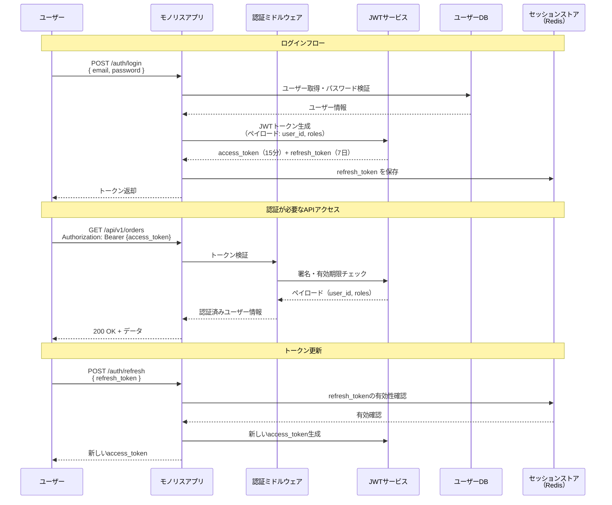
```mermaid
sequenceDiagram
    participant USER as ユーザー
    participant APP as モノリスアプリ
    participant AUTH_M as 認証ミドルウェア
    participant JWT_SVC as JWTサービス
    participant USER_DB as ユーザーDB
    participant REDIS_S as セッションストア<br>（Redis）

    Note over USER,REDIS_S: ログインフロー

    USER->>APP: POST /auth/login<br>{ email, password }
    APP->>USER_DB: ユーザー取得・パスワード検証
    USER_DB-->>APP: ユーザー情報
    APP->>JWT_SVC: JWTトークン生成<br>（ペイロード: user_id, roles）
    JWT_SVC-->>APP: access_token（15分）+ refresh_token（7日）
    APP->>REDIS_S: refresh_token を保存
    APP-->>USER: トークン返却

    Note over USER,REDIS_S: 認証が必要なAPIアクセス

    USER->>APP: GET /api/v1/orders<br>Authorization: Bearer {access_token}
    APP->>AUTH_M: トークン検証
    AUTH_M->>JWT_SVC: 署名・有効期限チェック
    JWT_SVC-->>AUTH_M: ペイロード（user_id, roles）
    AUTH_M-->>APP: 認証済みユーザー情報
    APP-->>USER: 200 OK + データ

    Note over USER,REDIS_S: トークン更新

    USER->>APP: POST /auth/refresh<br>{ refresh_token }
    APP->>REDIS_S: refresh_tokenの有効性確認
    REDIS_S-->>APP: 有効確認
    APP->>JWT_SVC: 新しいaccess_token生成
    APP-->>USER: 新しいaccess_token
```

### 9.2 認証・認可の実装例

```python
# ────────────────────────────────────────────────
# 認証・認可の実装（Python FastAPI + JWT）
# ────────────────────────────────────────────────

import jwt
import bcrypt
from datetime import datetime, timedelta, timezone
from functools import wraps
from typing import Optional
from enum import Enum
import os


class Role(str, Enum):
    ADMIN    = "admin"
    CUSTOMER = "customer"
    STAFF    = "staff"


class JWTService:
    """JWTトークンの発行・検証サービス"""

    SECRET_KEY    = os.environ["JWT_SECRET_KEY"]  # 環境変数から取得（必須）
    ALGORITHM     = "HS256"
    ACCESS_EXPIRE = timedelta(minutes=15)          # 短い有効期限
    REFRESH_EXPIRE = timedelta(days=7)

    @classmethod
    def create_access_token(cls, user_id: str, roles: list[str]) -> str:
        """アクセストークンを生成する"""
        now = datetime.now(timezone.utc)
        payload = {
            "sub":   user_id,
            "roles": roles,
            "iat":   now,
            "exp":   now + cls.ACCESS_EXPIRE,
            "type":  "access",
        }
        return jwt.encode(payload, cls.SECRET_KEY, algorithm=cls.ALGORITHM)

    @classmethod
    def verify_token(cls, token: str) -> dict:
        """トークンを検証してペイロードを返す"""
        try:
            return jwt.decode(
                token,
                cls.SECRET_KEY,
                algorithms=[cls.ALGORITHM],
                options={"verify_exp": True},
            )
        except jwt.ExpiredSignatureError:
            raise AuthenticationError("トークンの有効期限が切れています")
        except jwt.InvalidTokenError as e:
            raise AuthenticationError(f"無効なトークン: {e}")


class PasswordHasher:
    """パスワードのハッシュ化・検証"""

    @staticmethod
    def hash(plain_password: str) -> str:
        """bcryptでパスワードをハッシュ化する"""
        return bcrypt.hashpw(
            plain_password.encode("utf-8"),
            bcrypt.gensalt(rounds=12),  # コストファクター12（推奨）
        ).decode("utf-8")

    @staticmethod
    def verify(plain_password: str, hashed_password: str) -> bool:
        """ハッシュ化されたパスワードを検証する"""
        return bcrypt.checkpw(
            plain_password.encode("utf-8"),
            hashed_password.encode("utf-8"),
        )


# ─── FastAPI 依存性注入による認証 ───

from fastapi import Depends, HTTPException, Security, status
from fastapi.security import HTTPBearer, HTTPAuthorizationCredentials

security_scheme = HTTPBearer()


class CurrentUser:
    def __init__(self, user_id: str, roles: list[str]):
        self.user_id = user_id
        self.roles   = roles

    def has_role(self, role: Role) -> bool:
        return role.value in self.roles

    def require_role(self, role: Role) -> None:
        if not self.has_role(role):
            raise HTTPException(
                status_code=status.HTTP_403_FORBIDDEN,
                detail=f"この操作には {role.value} 権限が必要です",
            )


def get_current_user(
    credentials: HTTPAuthorizationCredentials = Security(security_scheme),
) -> CurrentUser:
    """認証済みユーザーを取得する（FastAPI依存性注入）"""
    payload = JWTService.verify_token(credentials.credentials)
    return CurrentUser(
        user_id=payload["sub"],
        roles=payload.get("roles", []),
    )


def require_roles(*roles: Role):
    """ロールベースアクセス制御デコレーター"""
    def dependency(current_user: CurrentUser = Depends(get_current_user)):
        # いずれかのロールを持っていれば許可 (OR条件)
        if not any(current_user.has_role(role) for role in roles):
            raise HTTPException(
                status_code=status.HTTP_403_FORBIDDEN,
                detail=f"権限が不足しています。必要なロールのいずれか: {[r.value for r in roles]}",
            )
        return current_user
    return dependency


# ─── 使用例 ───

@router.delete("/{order_id}", status_code=204)
async def delete_order(
    order_id: str,
    # admin または staff のみ削除可能
    admin: CurrentUser = Depends(require_roles(Role.ADMIN, Role.STAFF)),
):
    """注文を削除する（管理者・スタッフ専用）"""
    ...


class AuthenticationError(Exception):
    pass
```

---

## 10. テスト戦略

### 10.1 モノリスのテストピラミッド

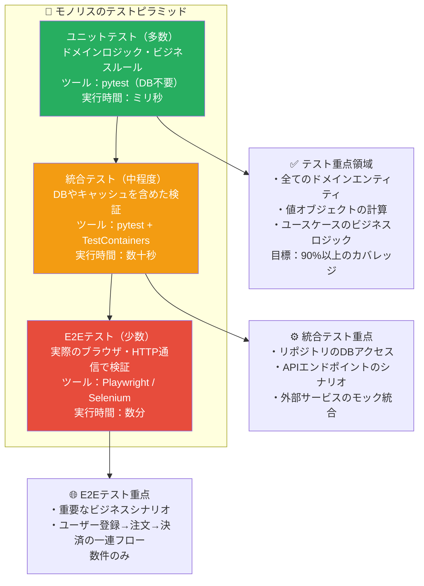
```mermaid
graph TD
    subgraph TEST_PYRAMID["🔺 モノリスのテストピラミッド"]
        E2E_T["E2Eテスト（少数）<br>実際のブラウザ・HTTP通信で検証<br>ツール：Playwright / Selenium<br>実行時間：数分"]
        INT_T["統合テスト（中程度）<br>DBやキャッシュを含めた検証<br>ツール：pytest + TestContainers<br>実行時間：数十秒"]
        UNIT_T["ユニットテスト（多数）<br>ドメインロジック・ビジネスルール<br>ツール：pytest（DB不要）<br>実行時間：ミリ秒"]
    end

    UNIT_T --> INT_T --> E2E_T

    UNIT_T --> U_FOCUS["✅ テスト重点領域<br>・全てのドメインエンティティ<br>・値オブジェクトの計算<br>・ユースケースのビジネスロジック<br>目標：90%以上のカバレッジ"]

    INT_T --> I_FOCUS["⚙️ 統合テスト重点<br>・リポジトリのDBアクセス<br>・APIエンドポイントのシナリオ<br>・外部サービスのモック統合"]

    E2E_T --> E_FOCUS["🌐 E2Eテスト重点<br>・重要なビジネスシナリオ<br>・ユーザー登録→注文→決済の一連フロー<br>数件のみ"]

    style UNIT_T fill:#27ae60,color:#fff
    style INT_T fill:#f39c12,color:#fff
    style E2E_T fill:#e74c3c,color:#fff
```

### 10.2 テスト実装例

```python
# ────────────────────────────────────────────────
# ユニットテスト（pytest）
# ────────────────────────────────────────────────

import pytest
from decimal import Decimal
from domain.entities.order import Order, OrderStatus
from domain.value_objects.money import Money


class TestOrder:
    """注文エンティティのユニットテスト（DB不要・高速）"""

    def test_注文作成時は保留中ステータスになる(self):
        order = Order.create(customer_id="cust_001")
        assert order.status == OrderStatus.PENDING

    def test_商品を追加すると合計金額が増える(self):
        order = Order.create(customer_id="cust_001")
        order.add_item("prod_001", "Tシャツ", Money(Decimal("1000")), 2)
        assert order.total_amount == Money(Decimal("2000"))

    def test_確定後は商品を追加できない(self):
        order = Order.create(customer_id="cust_001")
        order.add_item("prod_001", "Tシャツ", Money(Decimal("1000")), 1)
        order.confirm()

        with pytest.raises(ValueError, match="確定済みの注文は変更できません"):
            order.add_item("prod_002", "ジーンズ", Money(Decimal("5000")), 1)

    def test_発送済み注文はキャンセルできない(self):
        order = Order.create(customer_id="cust_001")
        order.add_item("prod_001", "Tシャツ", Money(Decimal("1000")), 1)
        order.confirm()
        order._status = OrderStatus.SHIPPED  # テスト用に直接変更

        with pytest.raises(ValueError, match="発送済み"):
            order.cancel()

    def test_注文確定時にドメインイベントが発行される(self):
        order = Order.create(customer_id="cust_001")
        order.add_item("prod_001", "Tシャツ", Money(Decimal("1000")), 1)
        order.confirm()

        events = order.domain_events
        assert len(events) == 1
        assert events[0]["type"] == "OrderConfirmed"
        assert events[0]["customer_id"] == "cust_001"


# ────────────────────────────────────────────────
# 統合テスト（TestContainers + pytest）
# ────────────────────────────────────────────────

import pytest
from testcontainers.postgres import PostgresContainer
from fastapi.testclient import TestClient
from sqlalchemy import create_engine
from sqlalchemy.orm import sessionmaker


@pytest.fixture(scope="session")
def postgres_container():
    """テスト用PostgreSQLコンテナを起動する"""
    with PostgresContainer("postgres:16-alpine") as pg:
        yield pg


@pytest.fixture(scope="session")
def db_engine(postgres_container):
    engine = create_engine(postgres_container.get_connection_url())
    Base.metadata.create_all(engine)
    yield engine
    engine.dispose()


@pytest.fixture
def db_session(db_engine):
    """各テストごとにトランザクションをロールバック（高速・独立性保証）"""
    connection = db_engine.connect()
    transaction = connection.begin()
    session = sessionmaker(bind=connection)()
    yield session
    session.close()
    transaction.rollback()
    connection.close()


@pytest.fixture
def client(db_session):
    """テスト用FastAPIクライアント"""
    app = create_app()
    app.dependency_overrides[get_db] = lambda: db_session
    return TestClient(app)


class TestOrderAPI:
    """注文APIの統合テスト"""

    def test_注文を作成できる(self, client, db_session):
        # 事前にユーザーを作成
        user = create_test_user(db_session, email="test@example.com")
        token = JWTService.create_access_token(user.id, ["customer"])

        response = client.post(
            "/api/v1/orders",
            json={
                "customer_id": user.id,
                "items": [{"product_id": "prod_001", "quantity": 2}],
            },
            headers={"Authorization": f"Bearer {token}"},
        )

        assert response.status_code == 201
        data = response.json()
        assert data["status"] == "pending"
        assert "order_id" in data

    def test_認証なしでアクセスすると401が返る(self, client):
        response = client.get("/api/v1/orders")
        assert response.status_code == 401
```

---

## 11. スケーリング戦略

### 11.1 モノリスのスケーリング手法

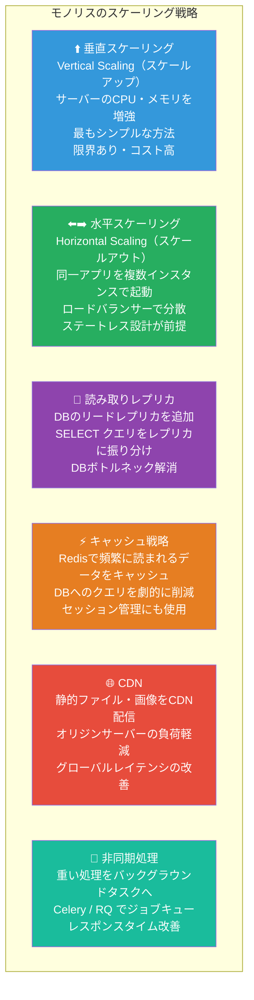
```mermaid
graph TD
    subgraph SCALING["モノリスのスケーリング戦略"]
        VERTICAL["⬆️ 垂直スケーリング<br>Vertical Scaling（スケールアップ）<br>サーバーのCPU・メモリを増強<br>最もシンプルな方法<br>限界あり・コスト高"]

        HORIZONTAL["⬅️➡️ 水平スケーリング<br>Horizontal Scaling（スケールアウト）<br>同一アプリを複数インスタンスで起動<br>ロードバランサーで分散<br>ステートレス設計が前提"]

        READ_REPLICA["📖 読み取りレプリカ<br>DBのリードレプリカを追加<br>SELECT クエリをレプリカに振り分け<br>DBボトルネック解消"]

        CACHING["⚡ キャッシュ戦略<br>Redisで頻繁に読まれるデータをキャッシュ<br>DBへのクエリを劇的に削減<br>セッション管理にも使用"]

        CDN["🌐 CDN<br>静的ファイル・画像をCDN配信<br>オリジンサーバーの負荷軽減<br>グローバルレイテンシの改善"]

        ASYNC["🔄 非同期処理<br>重い処理をバックグラウンドタスクへ<br>Celery / RQ でジョブキュー<br>レスポンスタイム改善"]
    end

    style VERTICAL fill:#3498db,color:#fff
    style HORIZONTAL fill:#27ae60,color:#fff
    style READ_REPLICA fill:#8e44ad,color:#fff
    style CACHING fill:#e67e22,color:#fff
    style CDN fill:#e74c3c,color:#fff
    style ASYNC fill:#1abc9c,color:#fff
```

### 11.2 水平スケーリングの構成

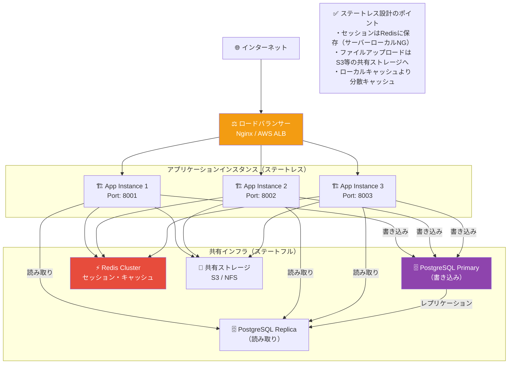
```mermaid
graph TD
    INTERNET["🌐 インターネット"]
    LB["⚖️ ロードバランサー<br>Nginx / AWS ALB"]

    subgraph APP_INSTANCES["アプリケーションインスタンス（ステートレス）"]
        APP1["🏗️ App Instance 1<br>Port: 8001"]
        APP2["🏗️ App Instance 2<br>Port: 8002"]
        APP3["🏗️ App Instance 3<br>Port: 8003"]
    end

    subgraph SHARED_INFRA["共有インフラ（ステートフル）"]
        PG_PRIMARY["🗄️ PostgreSQL Primary<br>（書き込み）"]
        PG_REPLICA["🗄️ PostgreSQL Replica<br>（読み取り）"]
        REDIS_CLUSTER["⚡ Redis Cluster<br>セッション・キャッシュ"]
        SHARED_STORAGE["📁 共有ストレージ<br>S3 / NFS"]
    end

    INTERNET --> LB
    LB --> APP1 & APP2 & APP3

    APP1 & APP2 & APP3 -->|"書き込み"| PG_PRIMARY
    APP1 & APP2 & APP3 -->|"読み取り"| PG_REPLICA
    APP1 & APP2 & APP3 --> REDIS_CLUSTER
    APP1 & APP2 & APP3 --> SHARED_STORAGE

    PG_PRIMARY -->|"レプリケーション"| PG_REPLICA

    NOTE["✅ ステートレス設計のポイント<br>・セッションはRedisに保存（サーバーローカルNG）<br>・ファイルアップロードはS3等の共有ストレージへ<br>・ローカルキャッシュより分散キャッシュ"]

    style LB fill:#f39c12,color:#fff
    style REDIS_CLUSTER fill:#e74c3c,color:#fff
    style PG_PRIMARY fill:#8e44ad,color:#fff
```

---

## 12. CI/CDとデプロイ戦略

### 12.1 モノリスのCI/CDパイプライン

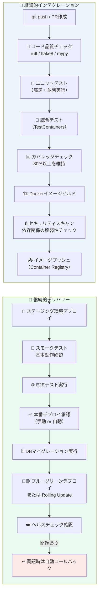
```mermaid
flowchart TD
    subgraph CI["🔄 継続的インテグレーション"]
        PUSH["git push / PR作成"]
        LINT["📝 コード品質チェック<br>ruff / flake8 / mypy"]
        UNIT_CI["🧪 ユニットテスト<br>（高速・並列実行）"]
        INT_CI["🔗 統合テスト<br>（TestContainers）"]
        COVERAGE["📊 カバレッジチェック<br>80%以上を維持"]
        BUILD["🏗️ Dockerイメージビルド"]
        SECURITY["🔒 セキュリティスキャン<br>依存関係の脆弱性チェック"]
        PUSH_IMG["📤 イメージプッシュ<br>（Container Registry）"]
    end

    subgraph CD["🚀 継続的デリバリー"]
        DEPLOY_STG["🧪 ステージング環境デプロイ"]
        SMOKE["💨 スモークテスト<br>基本動作確認"]
        E2E_CD["🌐 E2Eテスト実行"]
        APPROVE["✅ 本番デプロイ承認<br>（手動 or 自動）"]
        DB_MIGRATE["🗄️ DBマイグレーション実行"]
        BLUE_GREEN["🔵🟢 ブルーグリーンデプロイ<br>または Rolling Update"]
        HEALTH_CHECK["❤️ ヘルスチェック確認"]
        ROLLBACK["↩️ 問題時は自動ロールバック"]
    end

    PUSH --> LINT --> UNIT_CI --> INT_CI --> COVERAGE --> BUILD --> SECURITY --> PUSH_IMG
    PUSH_IMG --> DEPLOY_STG --> SMOKE --> E2E_CD --> APPROVE
    APPROVE --> DB_MIGRATE --> BLUE_GREEN --> HEALTH_CHECK
    HEALTH_CHECK -->|"問題あり"| ROLLBACK

    style CI fill:#ebf5fb
    style CD fill:#eafaf1
    style ROLLBACK fill:#fde8e8
```

### 12.2 Dockerfileのベストプラクティス

```dockerfile
# ────────────────────────────────────────────────
# モノリスアプリのDockerfile（マルチステージビルド）
# ────────────────────────────────────────────────

# ─── Stage 1: 依存関係インストール ───
FROM python:3.12-slim AS dependencies

WORKDIR /app

# 依存関係ファイルを先にコピー（キャッシュ最適化）
COPY requirements.txt .
RUN pip install --user --no-cache-dir -r requirements.txt


# ─── Stage 2: 本番イメージ ───
FROM python:3.12-slim AS runtime

# セキュリティ：非rootユーザーで実行
RUN groupadd --system appgroup && \
    useradd --system --gid appgroup --home /app appuser

WORKDIR /app

# 依存関係のみコピー（最小イメージ）
COPY --from=dependencies /root/.local /home/appuser/.local

# アプリケーションコードをコピー
COPY --chown=appuser:appgroup . .

# 非rootユーザーに切り替え
USER appuser

# ヘルスチェック
HEALTHCHECK --interval=30s --timeout=10s --start-period=60s --retries=3 \
    CMD python -c "import urllib.request, sys; \
                   try: r = urllib.request.urlopen('http://localhost:8000/health'); sys.exit(0 if r.status == 200 else 1) \
                   except: sys.exit(1)"

EXPOSE 8000

ENV PATH=/home/appuser/.local/bin:$PATH
ENV PYTHONUNBUFFERED=1

# Gunicorn で複数ワーカー起動
CMD ["gunicorn", "main:app", \
     "--workers", "4", \
     "--worker-class", "uvicorn.workers.UvicornWorker", \
     "--bind", "0.0.0.0:8000", \
     "--timeout", "60", \
     "--access-logfile", "-", \
     "--error-logfile", "-"]
```

---

## 13. 監視・ロギング

### 13.1 モノリスの監視体系

```mermaid
graph TD
    subgraph OBSERVABILITY["📊 オブザーバビリティの3本柱"]
        METRICS["📈 メトリクス<br>Prometheus + Grafana<br>・リクエスト数/秒（RPS）<br>・レスポンスタイム（P50/P95/P99）<br>・エラーレート<br>・CPU/メモリ使用率"]

        LOGS["📝 ログ<br>ELK Stack / Loki + Grafana<br>・構造化ログ（JSON形式）<br>・リクエスト/レスポンスログ<br>・エラー・例外スタックトレース<br>・トレースID付き"]

        TRACES["🔍 トレース<br>Jaeger / OpenTelemetry<br>・リクエストの処理経路<br>・DBクエリの実行時間<br>・ボトルネックの特定"]
    end

    subgraph ALERTING["🔔 アラート設定"]
        A1["レスポンスタイムP99 > 1秒"]
        A2["エラーレート > 1%"]
        A3["CPU使用率 > 80% for 5分"]
        A4["DBコネクション数 > 80%"]
        A5["ディスク使用率 > 85%"]
    end

    METRICS & LOGS & TRACES --> ALERTING
    ALERTING -->|"通知"| SLACK["Slack / PagerDuty"]

    style METRICS fill:#3498db,color:#fff
    style LOGS fill:#27ae60,color:#fff
    style TRACES fill:#8e44ad,color:#fff
    style ALERTING fill:#e74c3c,color:#fff
```

### 13.2 構造化ロギングの実装

```python
# ────────────────────────────────────────────────
# 構造化ロギング実装（Python + structlog）
# ────────────────────────────────────────────────

import structlog
import time
import uuid
from fastapi import Request, Response
from starlette.middleware.base import BaseHTTPMiddleware


def configure_logging():
    """構造化ロギングの初期設定"""
    structlog.configure(
        processors=[
            structlog.contextvars.merge_contextvars,
            structlog.stdlib.add_log_level,
            structlog.stdlib.add_logger_name,
            structlog.processors.TimeStamper(fmt="iso"),
            structlog.processors.StackInfoRenderer(),
            structlog.processors.format_exc_info,
            structlog.processors.JSONRenderer(),  # JSON形式で出力
        ],
        wrapper_class=structlog.stdlib.BoundLogger,
        context_class=dict,
        logger_factory=structlog.stdlib.LoggerFactory(),
    )


logger = structlog.get_logger()


class RequestLoggingMiddleware(BaseHTTPMiddleware):
    """リクエスト/レスポンスのロギングミドルウェア"""

    async def dispatch(self, request: Request, call_next) -> Response:
        # リクエストIDを生成（トレーサビリティのため）
        request_id = str(uuid.uuid4())
        start_time = time.perf_counter()

        # コンテキスト変数にリクエストIDをセット
        structlog.contextvars.bind_contextvars(
            request_id=request_id,
            method=request.method,
            path=request.url.path,
            client_ip=request.client.host if request.client else "unknown",
        )

        logger.info(
            "リクエスト受信",
            query_params=dict(request.query_params),
        )

        try:
            response = await call_next(request)
            elapsed_ms = (time.perf_counter() - start_time) * 1000

            logger.info(
                "レスポンス送信",
                status_code=response.status_code,
                elapsed_ms=round(elapsed_ms, 2),
            )

            # レスポンスヘッダーにリクエストIDを追加
            response.headers["X-Request-ID"] = request_id
            return response

        except Exception as e:
            elapsed_ms = (time.perf_counter() - start_time) * 1000
            logger.error(
                "リクエスト処理エラー",
                error=str(e),
                elapsed_ms=round(elapsed_ms, 2),
                exc_info=True,
            )
            raise
        finally:
            structlog.contextvars.unbind_contextvars(
                "request_id", "method", "path", "client_ip"
            )
```

---

## 14. 実践：ECサイト完全実装例

### 14.1 ECサイトのモノリシックアーキテクチャ全体図

```mermaid
graph TD
    subgraph USERS["👥 ユーザー"]
        BROWSER["🌐 ブラウザ"]
        MOBILE["📱 モバイルアプリ"]
    end

    subgraph INFRA["インフラ層"]
        CDN_EC["☁️ CDN<br>静的ファイル配信"]
        LB_EC["⚖️ ロードバランサー"]
    end

    subgraph EC_MONO["🏗️ ECサイト モノリシックアプリケーション"]
        subgraph PRES_EC["プレゼンテーション層"]
            PRODUCT_CTRL["商品コントローラー"]
            ORDER_CTRL["注文コントローラー"]
            USER_CTRL["ユーザーコントローラー"]
            CART_CTRL["カートコントローラー"]
            ADMIN_CTRL["管理画面コントローラー"]
        end

        subgraph BUSI_EC["ビジネスロジック層"]
            PRODUCT_MOD["商品モジュール<br>カタログ管理・検索"]
            ORDER_MOD["注文モジュール<br>注文処理・履歴"]
            USER_MOD["ユーザーモジュール<br>会員管理・認証"]
            CART_MOD["カートモジュール<br>カート操作"]
            PAYMENT_MOD["決済モジュール<br>決済処理"]
            INVENTORY_MOD["在庫モジュール<br>在庫管理"]
            NOTIFY_MOD["通知モジュール<br>メール・プッシュ"]
        end

        subgraph SHARED_EC["共有コンポーネント"]
            JWT_EC["JWT認証"]
            CACHE_EC["キャッシュ管理"]
            EVENTS_EC["イベントバス"]
            LOGGER_EC["ロギング"]
        end
    end

    subgraph STORAGE["ストレージ層"]
        PG_EC[("PostgreSQL<br>メインDB")]
        REDIS_EC["Redis<br>キャッシュ/セッション"]
        S3_EC["S3<br>商品画像"]
        ES_EC["Elasticsearch<br>商品検索"]
    end

    BROWSER & MOBILE --> CDN_EC
    BROWSER & MOBILE --> LB_EC --> EC_MONO
    PRES_EC --> BUSI_EC
    BUSI_EC --> STORAGE
    SHARED_EC --> PRES_EC & BUSI_EC

    style EC_MONO fill:#f0f8ff
    style PRES_EC fill:#3498db,color:#fff
    style BUSI_EC fill:#27ae60,color:#fff
    style SHARED_EC fill:#e67e22,color:#fff
```

### 14.2 注文処理の完全フロー

```mermaid
sequenceDiagram
    participant BROWSER as ブラウザ
    participant CTRL as 注文コントローラー
    participant USE_CASE as 注文作成ユースケース
    participant CART_MOD2 as カートモジュール
    participant INVENTORY2 as 在庫モジュール
    participant ORDER_DOM2 as 注文ドメイン
    participant PAYMENT2 as 決済モジュール
    participant DB2 as PostgreSQL
    participant EVENTS2 as イベントバス
    participant NOTIFY2 as 通知モジュール
    participant EMAIL as メールサービス

    BROWSER->>CTRL: POST /api/v1/orders/checkout<br>{ cart_id, shipping_address, payment_info }
    CTRL->>CTRL: JWT検証・リクエストバリデーション
    CTRL->>USE_CASE: execute(checkout_command)

    USE_CASE->>CART_MOD2: get_cart(cart_id)
    CART_MOD2-->>USE_CASE: カート内容

    USE_CASE->>INVENTORY2: check_and_reserve_stock(items)
    INVENTORY2->>DB2: 在庫確認（SELECT FOR UPDATE）
    DB2-->>INVENTORY2: 在庫OK
    INVENTORY2->>DB2: 在庫引き当て（UPDATE）
    INVENTORY2-->>USE_CASE: 引き当て成功

    USE_CASE->>ORDER_DOM2: Order.create(customer_id, items)
    ORDER_DOM2->>ORDER_DOM2: ビジネスルール実行<br>価格計算・割引適用

    USE_CASE->>DB2: BEGIN TRANSACTION
    USE_CASE->>DB2: INSERT INTO orders
    USE_CASE->>DB2: INSERT INTO order_items

    USE_CASE->>PAYMENT2: process_payment(order, payment_info)
    PAYMENT2->>DB2: INSERT INTO payments（pending）
    PAYMENT2-->>USE_CASE: 決済成功

    USE_CASE->>DB2: UPDATE orders SET status = 'confirmed'
    USE_CASE->>DB2: COMMIT TRANSACTION

    USE_CASE->>EVENTS2: publish("order.placed", {...})

    par 非同期処理（バックグラウンド）
        EVENTS2--)NOTIFY2: order.placed イベント受信
        NOTIFY2--)EMAIL: 注文確認メール送信
    end

    USE_CASE-->>CTRL: OrderResult
    CTRL-->>BROWSER: HTTP 201 Created<br>{ order_id, status, total }
```

---

## 15. マイクロサービスへの段階的移行

### 15.1 移行判断のフロー

```mermaid
flowchart TD
    START["モノリスの課題が発生している"]

    Q1{"開発チームが<br>5人以上になったか？"}
    Q2{"デプロイ頻度が<br>週1回以上必要か？"}
    Q3{"特定の機能が<br>スケールボトルネックか？"}
    Q4{"技術スタックを<br>機能ごとに変えたいか？"}

    STAY["✅ モノリスを最適化<br>モジュラーモノリスへの再設計<br>パフォーマンスチューニング"]

    MODULAR["🔵 モジュラーモノリスへ移行<br>コード境界を明確化<br>将来の分割に備える"]

    EXTRACT["🚀 一部機能をマイクロサービス化<br>Strangler Figパターンで<br>高負荷・独立性が高い機能から"]

    START --> Q1
    Q1 -->|"No"| STAY
    Q1 -->|"Yes"| Q2
    Q2 -->|"No"| MODULAR
    Q2 -->|"Yes"| Q3
    Q3 -->|"No"| MODULAR
    Q3 -->|"Yes"| Q4
    Q4 -->|"どちらでも"| EXTRACT

    style STAY fill:#27ae60,color:#fff
    style MODULAR fill:#3498db,color:#fff
    style EXTRACT fill:#8e44ad,color:#fff
```

### 15.2 Strangler Figパターンによる段階的移行

```mermaid
flowchart LR
    subgraph PHASE1["Phase 1: モノリス運用中"]
        MONO1["モノリス<br>全機能"]
    end

    subgraph PHASE2["Phase 2: 一部を切り出す（通知機能）"]
        MONO2["モノリス<br>（通知機能を除く）"]
        NOTIFY_MS["通知マイクロサービス"]
        PROXY1["プロキシ/APIゲートウェイ<br>新機能はマイクロサービスへ"]
        PROXY1 --> MONO2
        PROXY1 --> NOTIFY_MS
    end

    subgraph PHASE3["Phase 3: さらに切り出す（検索機能）"]
        MONO3["モノリス<br>コア機能"]
        NOTIFY_MS2["通知<br>マイクロサービス"]
        SEARCH_MS["検索<br>マイクロサービス"]
        PROXY2["APIゲートウェイ"]
        PROXY2 --> MONO3
        PROXY2 --> NOTIFY_MS2
        PROXY2 --> SEARCH_MS
    end

    PHASE1 --> PHASE2 --> PHASE3

    style MONO1 fill:#e74c3c,color:#fff
    style MONO2 fill:#f39c12,color:#fff
    style MONO3 fill:#27ae60,color:#fff
    style PROXY1 fill:#3498db,color:#fff
    style PROXY2 fill:#3498db,color:#fff
```

---

## 16. ベストプラクティス総まとめ

### 16.1 設計フェーズのベストプラクティス

| カテゴリ | ベストプラクティス | 理由 |
|---------|----------------|------|
| **構造** | モジュラーモノリスを選択する | 将来の移行が容易になる |
| **依存方向** | 上位層から下位層への一方向依存 | 変更の影響範囲を限定できる |
| **ドメイン分離** | 各ドメインは公開インターフェース経由で通信 | 疎結合を保ち拡張しやすい |
| **DB設計** | スキーマ分離でモジュールのDB境界を明確に | 将来のDB分割が容易になる |
| **ビジネスロジック** | ドメイン層に集約し、フレームワーク非依存に | テストが容易・移植性が高い |
| **設定** | 環境変数で外部注入（12-Factor App） | 環境差異を最小化できる |
| **エラー処理** | 統一されたエラーレスポンス形式 | クライアントの実装が一貫する |

### 16.2 モノリス成熟度モデル

```mermaid
graph TD
    LV0["Level 0: スパゲッティモノリス<br>すべてが1ファイルに混在<br>テスト不可・変更が怖い"]
    LV1["Level 1: レイヤードモノリス<br>プレゼンテーション・ビジネス・DBを分離<br>基本的なテストが可能"]
    LV2["Level 2: テスタブルモノリス<br>依存性注入・ユニットテスト充実<br>CI/CDが整備されている"]
    LV3["Level 3: モジュラーモノリス<br>ドメイン境界が明確<br>モジュール間が疎結合"]
    LV4["Level 4: 最適化されたモノリス<br>水平スケーリング・キャッシュ戦略<br>監視・ロギングが充実"]
    LV5["Level 5: マイクロサービス移行準備完了<br>必要に応じて段階的に分離可能<br>または高品質なモノリスとして維持"]

    LV0 --> LV1 --> LV2 --> LV3 --> LV4 --> LV5

    style LV0 fill:#e74c3c,color:#fff
    style LV1 fill:#e67e22,color:#fff
    style LV2 fill:#f39c12,color:#fff
    style LV3 fill:#27ae60,color:#fff
    style LV4 fill:#3498db,color:#fff
    style LV5 fill:#8e44ad,color:#fff
```

### 16.3 導入ロードマップ

```mermaid
gantt
    title モノリシックアーキテクチャ改善ロードマップ
    dateFormat  YYYY-MM-DD
    section 基礎整備
        レイヤー分離・ディレクトリ整理      :t1, 2025-01-01, 14d
        ユニットテストの整備                 :t2, after t1, 21d
        CI/CDパイプライン構築               :t3, after t2, 14d
    section 品質向上
        依存性注入の導入                    :t4, after t3, 14d
        ドメインモデルのリッチ化             :t5, after t4, 21d
        統合テストの整備                    :t6, after t5, 14d
    section モジュール化
        モジュール境界の定義                 :t7, after t6, 21d
        モジュール間通信のインターフェース化  :t8, after t7, 21d
        DBスキーマ分離                      :t9, after t8, 14d
    section スケーリング
        Redisキャッシュ導入                 :t10, after t9, 14d
        水平スケーリング対応（ステートレス化） :t11, after t10, 14d
        監視・ロギング充実                  :t12, after t11, 14d
```

---

## 17. アンチパターン

### 17.1 主要なアンチパターン

```mermaid
graph TD
    subgraph "❌ Anti-Pattern 1: 大きな泥の塊（Big Ball of Mud）"
        A1["コード構造がなく<br>すべてが密結合している<br>→ 変更のたびに予期しないバグが発生<br>→ テストが書けない・書かれていない"]
        A1_FIX["解決：レイヤードアーキテクチャを採用<br>責務を明確に分離する<br>テストを書きやすい設計に"]
    end

    subgraph "❌ Anti-Pattern 2: コントローラーにビジネスロジック"
        A2["コントローラーメソッドが100行を超え<br>DB操作・計算・メール送信がすべて入っている<br>→ テストが困難<br>→ 再利用できない"]
        A2_FIX["解決：ユースケースクラスを作成<br>コントローラーはHTTP変換のみ担当<br>ビジネスロジックはドメイン層へ"]
    end

    subgraph "❌ Anti-Pattern 3: 神クラス（God Class）"
        A3["OrderManagerクラスが<br>注文・在庫・決済・通知・配送・顧客を<br>すべて処理している<br>→ 数千行のクラス<br>→ 変更に恐怖を感じる"]
        A3_FIX["解決：単一責任原則を適用<br>機能ごとにクラスを分割<br>各クラスは1つのことだけ"]
    end

    subgraph "❌ Anti-Pattern 4: コピー&ペーストプログラミング"
        A4["同じバリデーションロジックが<br>10か所にコピーされている<br>→ 1か所修正すると他9か所に漏れが発生<br>→ 技術的負債が急速に蓄積"]
        A4_FIX["解決：DRY原則（Don't Repeat Yourself）<br>共通ロジックは値オブジェクトや<br>ヘルパークラスに集約する"]
    end

    subgraph "❌ Anti-Pattern 5: 分散モノリス"
        A5["サービスに分割したが<br>デプロイを常に一緒にしないと動かない<br>→ マイクロサービスの複雑さのみ増大<br>→ モノリスのシンプルさも失われる"]
        A5_FIX["解決：潔くモノリスに戻す<br>またはサービス間の依存を<br>徹底的に排除してから分割する"]
    end

    style A1 fill:#e74c3c,color:#fff
    style A2 fill:#e74c3c,color:#fff
    style A3 fill:#e74c3c,color:#fff
    style A4 fill:#e74c3c,color:#fff
    style A5 fill:#e74c3c,color:#fff
    style A1_FIX fill:#27ae60,color:#fff
    style A2_FIX fill:#27ae60,color:#fff
    style A3_FIX fill:#27ae60,color:#fff
    style A4_FIX fill:#27ae60,color:#fff
    style A5_FIX fill:#27ae60,color:#fff
```

### 17.2 健全性チェックフロー

```mermaid
flowchart TD
    CHECK["モノリスアーキテクチャの健全性チェック"]

    Q1{"コントローラーのメソッドが<br>50行以下に収まっているか？"}
    Q2{"ビジネスロジックがドメイン層・<br>ユースケース層に集約されているか？"}
    Q3{"DBなしでユニットテストが<br>書けるか？（主要ロジック）"}
    Q4{"モジュール間の通信が<br>インターフェース経由か？"}
    Q5{"同じロジックが<br>3か所以上にコピーされていないか？"}
    Q6{"新機能追加時に既存の<br>テストが壊れないか？"}

    FIX1["🔧 コントローラーからロジックを抽出<br>ユースケースクラスに移動する"]
    FIX2["🔧 ドメインモデルをリッチ化する<br>サービス層にロジックを集約する"]
    FIX3["🔧 依存性注入パターンを導入<br>インターフェースを定義する"]
    FIX4["🔧 モジュール境界を定義し<br>直接依存を除去する"]
    FIX5["🔧 重複コードを値オブジェクトや<br>共通クラスに集約する"]
    FIX6["🔧 テストカバレッジを改善<br>リグレッションテストを整備する"]
    HEALTHY["✅ 健全なモノリス<br>保守性・拡張性・テスタビリティが高い"]

    CHECK --> Q1
    Q1 -->|"No"| FIX1
    Q1 -->|"Yes"| Q2
    Q2 -->|"No"| FIX2
    Q2 -->|"Yes"| Q3
    Q3 -->|"No"| FIX3
    Q3 -->|"Yes"| Q4
    Q4 -->|"No"| FIX4
    Q4 -->|"Yes"| Q5
    Q5 -->|"No（ある）"| FIX5
    Q5 -->|"Yes"| Q6
    Q6 -->|"No"| FIX6
    Q6 -->|"Yes"| HEALTHY

    style HEALTHY fill:#27ae60,color:#fff
    style FIX1 fill:#3498db,color:#fff
    style FIX2 fill:#3498db,color:#fff
    style FIX3 fill:#3498db,color:#fff
    style FIX4 fill:#3498db,color:#fff
    style FIX5 fill:#3498db,color:#fff
    style FIX6 fill:#3498db,color:#fff
```

---

## 18. 参考文献・ソース一覧

### 📚 必読書籍

| タイトル | 著者 | 難易度 | 内容 |
|---------|------|--------|------|
| **Clean Architecture** | Robert C. Martin | ★★★★☆ | レイヤードアーキテクチャの決定版 |
| **Domain-Driven Design** | Eric Evans | ★★★★★ | ドメイン層設計の原典 |
| **Monolith to Microservices** | Sam Newman | ★★★☆☆ | モノリスの最適化と移行戦略 |
| **Building Microservices（第2版）** | Sam Newman | ★★★★☆ | モノリスとの比較・移行手法 |
| **Designing Data-Intensive Applications** | Martin Kleppmann | ★★★★★ | スケーリング・データ設計の詳解 |
| **Patterns of Enterprise Application Architecture** | Martin Fowler | ★★★★☆ | エンタープライズパターン百科事典 |

### 🌐 公式ドキュメント・URL

#### モノリス・アーキテクチャ原則

| リソース | URL |
|---------|-----|
| **Martin Fowler - MonolithFirst パターン** | https://martinfowler.com/bliki/MonolithFirst.html |
| **Martin Fowler - Modular Monolith** | https://martinfowler.com/articles/break-monolith-into-microservices.html |
| **Sam Newman - Strangler Fig Application** | https://martinfowler.com/bliki/StranglerFigApplication.html |
| **Twelve-Factor App（設計原則）** | https://12factor.net/ja/ |
| **Clean Architecture（Uncle Bob）** | https://blog.cleancoder.com/uncle-bob/2012/08/13/the-clean-architecture.html |

#### レイヤードアーキテクチャ

| リソース | URL |
|---------|-----|
| **Martin Fowler - Presentation Domain Data Layering** | https://martinfowler.com/bliki/PresentationDomainDataLayering.html |
| **Martin Fowler - Anemic Domain Model（アンチパターン）** | https://martinfowler.com/bliki/AnemicDomainModel.html |
| **Martin Fowler - Repository Pattern** | https://martinfowler.com/eaaCatalog/repository.html |
| **Hexagonal Architecture（Alistair Cockburn）** | https://alistair.cockburn.us/hexagonal-architecture/ |

#### Python 実装・フレームワーク

| リソース | URL |
|---------|-----|
| **FastAPI 公式ドキュメント** | https://fastapi.tiangolo.com/ |
| **SQLAlchemy 公式** | https://docs.sqlalchemy.org/ |
| **Alembic（DBマイグレーション）** | https://alembic.sqlalchemy.org/ |
| **pytest 公式** | https://docs.pytest.org/ |
| **Pydantic（バリデーション）** | https://docs.pydantic.dev/ |
| **structlog（構造化ロギング）** | https://www.structlog.org/ |

#### スケーリング・パフォーマンス

| リソース | URL |
|---------|-----|
| **Redis 公式ドキュメント** | https://redis.io/docs/ |
| **PostgreSQL パフォーマンスチューニング** | https://www.postgresql.org/docs/current/performance-tips.html |
| **Docker Best Practices** | https://docs.docker.com/develop/develop-images/dockerfile_best-practices/ |
| **Gunicorn 設定ガイド** | https://docs.gunicorn.org/en/stable/configure.html |

#### テスト

| リソース | URL |
|---------|-----|
| **TestContainers（統合テスト）** | https://testcontainers.com/guides/getting-started-with-testcontainers-for-python/ |
| **pytest-cov（カバレッジ）** | https://pytest-cov.readthedocs.io/ |
| **Playwright（E2Eテスト）** | https://playwright.dev/python/ |

#### 監視・オブザーバビリティ

| リソース | URL |
|---------|-----|
| **OpenTelemetry 公式** | https://opentelemetry.io/ |
| **Prometheus 公式** | https://prometheus.io/docs/ |
| **Grafana 公式** | https://grafana.com/docs/ |

#### モノリスからマイクロサービスへの移行

| リソース | URL |
|---------|-----|
| **Martin Fowler - Microservices（比較）** | https://martinfowler.com/articles/microservices.html |
| **Sam Newman - When to use Microservices** | https://samnewman.io/talks/principles-of-microservices/ |
| **AWS - Monolith to Microservices** | https://aws.amazon.com/microservices/monolith-to-microservices/ |

---

> 📅 最終更新日: 2026-04-17（本ドキュメントは当時の情報に基づいて作成されています）。各ツール・フレームワークのバージョンや仕様は変更される場合があります。実装前に必ず公式ドキュメントをご確認ください。

---

*作成者：World-Class Software Architect Guide | バージョン 1.0 | Monolithic Architecture Complete Guide*
ります。実装前に必ず公式ドキュメントをご確認ください。

\n---\n\n*作成者：World-Class Software Architect Guide | バージョン 1.0 | Monolithic Architecture Complete Guide*
