# 🧱 OOP（オブジェクト指向プログラミング）完全ガイド

## 📚 目次

1. [OOPとは何か？](#1-oopとは何か)
2. [4大原則：カプセル化・継承・ポリモーフィズム・抽象化](#2-4大原則)
3. [SOLID原則](#3-solid原則)
4. [クラスと オブジェクトの設計](#4-クラスとオブジェクトの設計)
5. [継承の正しい使い方](#5-継承の正しい使い方)
6. [インターフェースと抽象クラス](#6-インターフェースと抽象クラス)
7. [デザインパターン（GoFパターン）](#7-デザインパターン)
8. [OOPとアーキテクチャの統合](#8-oopとアーキテクチャの統合)
9. [テスト駆動OOP開発](#9-テスト駆動oop開発)
10. [リファクタリング技法](#10-リファクタリング技法)
11. [実践：ECサイト完全実装例](#11-実践ecサイト完全実装例)
12. [OOPアンチパターン](#12-oopアンチパターン)
13. [ベストプラクティス総まとめ](#13-ベストプラクティス総まとめ)
14. [参考文献・ソース一覧](#14-参考文献ソース一覧)

---

## 1. OOPとは何か？

### 1.1 定義

**Object-Oriented Programming（オブジェクト指向プログラミング）** は、プログラムを「データ（状態）」と「振る舞い（操作）」を持つ**オブジェクト**の集まりとして設計する考え方です。1960年代の Simula 言語から始まり、Smalltalk、C++、Java、Python など現代のあらゆる言語に影響を与えています。

> 💡 **一言で言うと：** 「現実世界の物事をプログラムで表現し、物事同士が協力し合うようにシステムを組み立てる手法」

### 1.2 なぜ OOP が重要なのか？

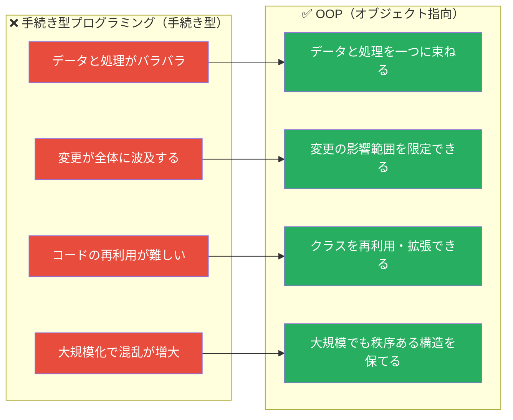
```mermaid
graph LR
    subgraph BEFORE["❌ 手続き型プログラミング（手続き型）"]
        P1["データと処理がバラバラ"]
        P2["変更が全体に波及する"]
        P3["コードの再利用が難しい"]
        P4["大規模化で混乱が増大"]
    end

    subgraph AFTER["✅ OOP（オブジェクト指向）"]
        S1["データと処理を一つに束ねる"]
        S2["変更の影響範囲を限定できる"]
        S3["クラスを再利用・拡張できる"]
        S4["大規模でも秩序ある構造を保てる"]
    end

    P1 --> S1
    P2 --> S2
    P3 --> S3
    P4 --> S4

    style P1 fill:#e74c3c,color:#fff
    style P2 fill:#e74c3c,color:#fff
    style P3 fill:#e74c3c,color:#fff
    style P4 fill:#e74c3c,color:#fff
    style S1 fill:#27ae60,color:#fff
    style S2 fill:#27ae60,color:#fff
    style S3 fill:#27ae60,color:#fff
    style S4 fill:#27ae60,color:#fff
```

### 1.3 OOP の全体マップ

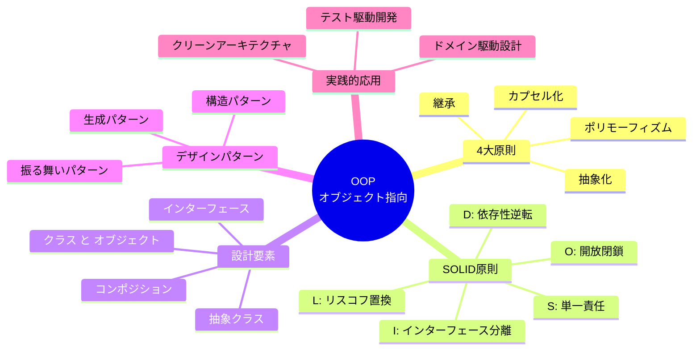
```mermaid
mindmap
    root((OOP<br>オブジェクト指向))
        4大原則
            カプセル化
            継承
            ポリモーフィズム
            抽象化
        SOLID原則
            S: 単一責任
            O: 開放閉鎖
            L: リスコフ置換
            I: インターフェース分離
            D: 依存性逆転
        設計要素
            クラス と オブジェクト
            インターフェース
            抽象クラス
            コンポジション
        デザインパターン
            生成パターン
            構造パターン
            振る舞いパターン
        実践的応用
            ドメイン駆動設計
            クリーンアーキテクチャ
            テスト駆動開発
```

### 1.4 OOP の歴史と主要言語

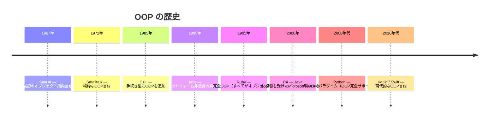
```mermaid
timeline
    title OOP の歴史
    1967年 : Simula — 最初のオブジェクト指向言語
    1972年 : Smalltalk — 純粋なOOP言語
    1985年 : C++ — 手続き型にOOPを追加
    1995年 : Java — プラットフォーム非依存の純粋OOP
    1995年 : Ruby — 完全OOP（すべてがオブジェクト）
    2000年 : C# — Java に影響を受けたMicrosoft製OOP言語
    2000年代 : Python — マルチパラダイム（OOP完全サポート）
    2010年代 : Kotlin / Swift — 現代的なOOP言語
```

---

## 2. 4大原則

### 2.1 全体像

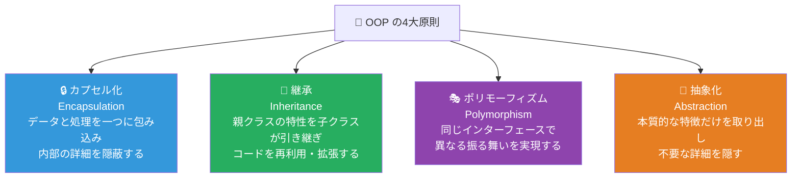
```mermaid
graph TD
    OOP_CORE["🧱 OOP の4大原則"]

    OOP_CORE --> ENCAP["🔒 カプセル化<br>Encapsulation<br>データと処理を一つに包み込み<br>内部の詳細を隠蔽する"]

    OOP_CORE --> INHERIT["🧬 継承<br>Inheritance<br>親クラスの特性を子クラスが引き継ぎ<br>コードを再利用・拡張する"]

    OOP_CORE --> POLY["🎭 ポリモーフィズム<br>Polymorphism<br>同じインターフェースで<br>異なる振る舞いを実現する"]

    OOP_CORE --> ABST["🎨 抽象化<br>Abstraction<br>本質的な特徴だけを取り出し<br>不要な詳細を隠す"]

    style ENCAP fill:#3498db,color:#fff
    style INHERIT fill:#27ae60,color:#fff
    style POLY fill:#8e44ad,color:#fff
    style ABST fill:#e67e22,color:#fff
```

---

### 2.2 カプセル化（Encapsulation）

**概念：** データ（フィールド）と処理（メソッド）を一つのクラスに束ね、外部から直接アクセスさせないようにする原則。

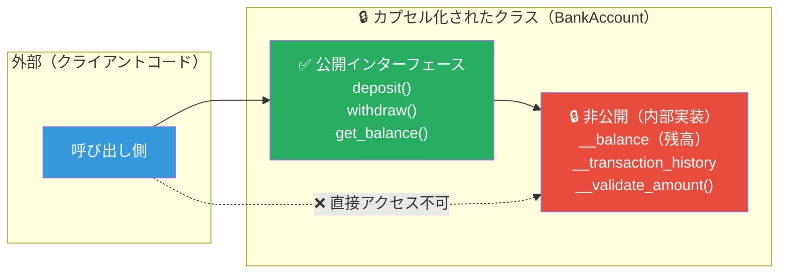
```mermaid
flowchart LR
    subgraph OUTSIDE["外部（クライアントコード）"]
        CLIENT["呼び出し側"]
    end

    subgraph CAPSULE["🔒 カプセル化されたクラス（BankAccount）"]
        PUB["✅ 公開インターフェース<br>deposit()<br>withdraw()<br>get_balance()"]
        PRIV["🔒 非公開（内部実装）<br>__balance（残高）<br>__transaction_history<br>__validate_amount()"]
        PUB --> PRIV
    end

    CLIENT --> PUB
    CLIENT -.->|"❌ 直接アクセス不可"| PRIV

    style PUB fill:#27ae60,color:#fff
    style PRIV fill:#e74c3c,color:#fff
    style CLIENT fill:#3498db,color:#fff
```

**実装例（Python）：**

```python
class BankAccount:
    """銀行口座 — カプセル化の例"""

    def __init__(self, owner: str, initial_balance: float = 0):
        self._owner = owner               # protected（サブクラスからアクセス可）
        self.__balance = initial_balance  # private（外部から直接アクセス不可）
        self.__transaction_history = []

    # ✅ 公開インターフェース（外部からアクセス可能）
    def deposit(self, amount: float) -> None:
        """入金する"""
        self.__validate_amount(amount)
        self.__balance += amount
        self.__record_transaction("入金", amount)

    def withdraw(self, amount: float) -> None:
        """出金する"""
        self.__validate_amount(amount)
        if amount > self.__balance:
            raise ValueError("残高が不足しています")
        self.__balance -= amount
        self.__record_transaction("出金", amount)

    @property
    def balance(self) -> float:
        """残高を読み取り専用で公開（書き込みは不可）"""
        return self.__balance

    # 🔒 非公開メソッド（内部実装の詳細）
    def __validate_amount(self, amount: float) -> None:
        if amount <= 0:
            raise ValueError("金額は0より大きくなければなりません")

    def __record_transaction(self, type_: str, amount: float) -> None:
        self.__transaction_history.append({"type": type_, "amount": amount})


# 使い方
account = BankAccount("山田太郎", 10000)
account.deposit(5000)
account.withdraw(3000)
print(account.balance)       # ✅ OK: 12000
# account.__balance = 999999  # ❌ 外部から直接変更できない
```

**ベストプラクティス：**

| # | プラクティス | 詳細 |
|---|-------------|------|
| 1 | **最小公開の原則** | 必要なものだけ public にする。迷ったら private から始める |
| 2 | **getter/setter より意図を表すメソッド** | `set_status("active")` より `activate()` の方が意図が明確 |
| 3 | **イミュータブル（不変）を積極的に使う** | 変更不可なフィールドは `@property` で読み取り専用にする |
| 4 | **バリデーションをコンストラクタに集める** | 不正な状態のオブジェクトを作らせない |

---

### 2.3 継承（Inheritance）

**概念：** 親クラス（スーパークラス）の属性・メソッドを子クラス（サブクラス）が引き継ぐ仕組み。「is-a 関係」を表す。

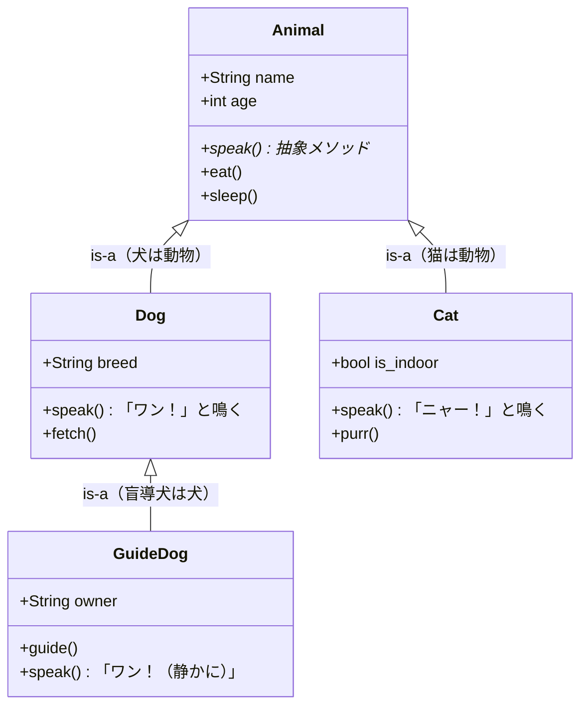
```mermaid
classDiagram
    class Animal {
        +String name
        +int age
        +speak()* 抽象メソッド
        +eat()
        +sleep()
    }

    class Dog {
        +String breed
        +speak() 「ワン！」と鳴く
        +fetch()
    }

    class Cat {
        +bool is_indoor
        +speak() 「ニャー！」と鳴く
        +purr()
    }

    class GuideDog {
        +String owner
        +guide()
        +speak() 「ワン！（静かに）」
    }

    Animal <|-- Dog : is-a（犬は動物）
    Animal <|-- Cat : is-a（猫は動物）
    Dog <|-- GuideDog : is-a（盲導犬は犬）
```

**実装例（Python）：**

```python
from abc import ABC, abstractmethod


class Animal(ABC):
    """動物の基底クラス（抽象クラス）"""

    def __init__(self, name: str, age: int):
        self.name = name
        self.age = age

    @abstractmethod
    def speak(self) -> str:
        """各動物固有の鳴き声（サブクラスで必ず実装）"""
        ...

    def eat(self) -> str:
        return f"{self.name} がご飯を食べています"

    def sleep(self) -> str:
        return f"{self.name} が眠っています"

    def __str__(self) -> str:
        return f"{self.__class__.__name__}(名前={self.name}, 年齢={self.age})"


class Dog(Animal):
    """犬クラス — Animal を継承"""

    def __init__(self, name: str, age: int, breed: str):
        super().__init__(name, age)  # 親クラスの __init__ を呼ぶ
        self.breed = breed

    def speak(self) -> str:
        return "ワン！"

    def fetch(self) -> str:
        return f"{self.name} がボールを取ってきました！"


class Cat(Animal):
    """猫クラス — Animal を継承"""

    def __init__(self, name: str, age: int, is_indoor: bool = True):
        super().__init__(name, age)
        self.is_indoor = is_indoor

    def speak(self) -> str:
        return "ニャー！"

    def purr(self) -> str:
        return f"{self.name} がゴロゴロ言っています"


# 使い方
dog = Dog("ポチ", 3, "柴犬")
cat = Cat("タマ", 5)

print(dog.speak())   # ワン！
print(cat.speak())   # ニャー！
print(dog.eat())     # ポチ がご飯を食べています（親から継承）
```

**継承 vs コンポジションの選択基準：**

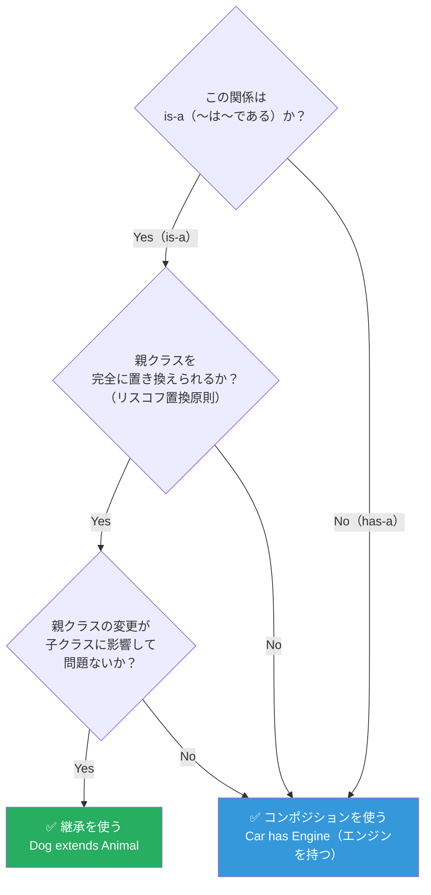
```mermaid
flowchart TD
    Q1{"この関係は<br>is-a（〜は〜である）か？"}
    Q2{"親クラスを<br>完全に置き換えられるか？<br>（リスコフ置換原則）"}
    Q3{"親クラスの変更が<br>子クラスに影響して<br>問題ないか？"}

    USE_INHERIT["✅ 継承を使う<br>Dog extends Animal"]
    USE_COMPOSE["✅ コンポジションを使う<br>Car has Engine（エンジンを持つ）"]

    Q1 -->|"Yes（is-a）"| Q2
    Q1 -->|"No（has-a）"| USE_COMPOSE
    Q2 -->|"Yes"| Q3
    Q2 -->|"No"| USE_COMPOSE
    Q3 -->|"Yes"| USE_INHERIT
    Q3 -->|"No"| USE_COMPOSE

    style USE_INHERIT fill:#27ae60,color:#fff
    style USE_COMPOSE fill:#3498db,color:#fff
```

---

### 2.4 ポリモーフィズム（Polymorphism）

**概念：** 同じインターフェース（メソッド名）に対して、オブジェクトの種類によって異なる振る舞いをすること。

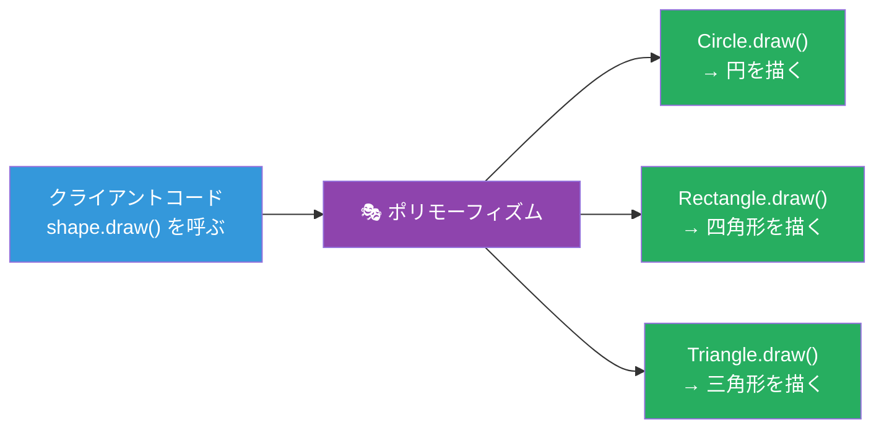
```mermaid
graph LR
    CLIENT["クライアントコード<br>shape.draw() を呼ぶ"] --> POLY_CENTER["🎭 ポリモーフィズム"]

    POLY_CENTER --> CIRCLE["Circle.draw()<br>→ 円を描く"]
    POLY_CENTER --> RECT["Rectangle.draw()<br>→ 四角形を描く"]
    POLY_CENTER --> TRIANGLE["Triangle.draw()<br>→ 三角形を描く"]

    style CLIENT fill:#3498db,color:#fff
    style POLY_CENTER fill:#8e44ad,color:#fff
    style CIRCLE fill:#27ae60,color:#fff
    style RECT fill:#27ae60,color:#fff
    style TRIANGLE fill:#27ae60,color:#fff
```

**実装例（Python）：**

```python
from abc import ABC, abstractmethod
from math import pi


class Shape(ABC):
    """図形の抽象クラス"""

    @abstractmethod
    def area(self) -> float:
        """面積を計算する（各図形で実装必須）"""
        ...

    @abstractmethod
    def perimeter(self) -> float:
        """周囲の長さを計算する"""
        ...

    def describe(self) -> str:
        """共通の説明メソッド（ポリモーフィズム活用）"""
        return (
            f"{self.__class__.__name__}: "
            f"面積={self.area():.2f}, 周囲={self.perimeter():.2f}"
        )


class Circle(Shape):
    def __init__(self, radius: float):
        self.radius = radius

    def area(self) -> float:
        return pi * self.radius ** 2

    def perimeter(self) -> float:
        return 2 * pi * self.radius


class Rectangle(Shape):
    def __init__(self, width: float, height: float):
        self.width = width
        self.height = height

    def area(self) -> float:
        return self.width * self.height

    def perimeter(self) -> float:
        return 2 * (self.width + self.height)


# ✅ ポリモーフィズムの真価：コードが形の種類を知らなくていい
shapes: list[Shape] = [
    Circle(5),
    Rectangle(4, 6),
    Circle(3),
    Rectangle(2, 8),
]

for shape in shapes:
    print(shape.describe())  # 各オブジェクトが正しい計算を行う

# 新しい図形を追加しても、このループを変更する必要がない！
```

---

### 2.5 抽象化（Abstraction）

**概念：** 複雑な実装の詳細を隠し、本質的なインターフェース（何ができるか）だけを公開すること。

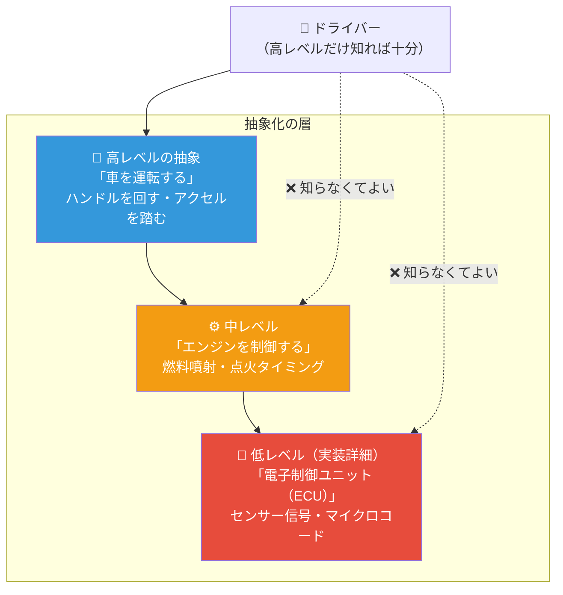
```mermaid
graph TD
    subgraph ABSTRACTION["抽象化の層"]
        HIGH["🎨 高レベルの抽象<br>「車を運転する」<br>ハンドルを回す・アクセルを踏む"]
        MID["⚙️ 中レベル<br>「エンジンを制御する」<br>燃料噴射・点火タイミング"]
        LOW["🔧 低レベル（実装詳細）<br>「電子制御ユニット（ECU）」<br>センサー信号・マイクロコード"]
    end

    USER["👤 ドライバー<br>（高レベルだけ知れば十分）"] --> HIGH
    HIGH --> MID
    MID --> LOW

    USER -.->|"❌ 知らなくてよい"| MID
    USER -.->|"❌ 知らなくてよい"| LOW

    style HIGH fill:#3498db,color:#fff
    style MID fill:#f39c12,color:#fff
    style LOW fill:#e74c3c,color:#fff
```

**実装例（Python）：**

```python
from abc import ABC, abstractmethod


class DatabaseConnection(ABC):
    """データベース接続の抽象（抽象化の例）"""

    @abstractmethod
    def connect(self) -> None: ...

    @abstractmethod
    def execute(self, query: str) -> list: ...

    @abstractmethod
    def close(self) -> None: ...

    # テンプレートメソッド：共通フロー
    def run_query(self, query: str) -> list:
        """クエリ実行の共通フロー（抽象化されたインターフェース）"""
        self.connect()
        try:
            return self.execute(query)
        finally:
            self.close()


class PostgreSQLConnection(DatabaseConnection):
    """PostgreSQL 具体実装（詳細は隠蔽される）"""

    def connect(self) -> None:
        print("PostgreSQL に接続しました")

    def execute(self, query: str) -> list:
        print(f"PostgreSQL クエリ実行: {query}")
        return []

    def close(self) -> None:
        print("PostgreSQL 接続を閉じました")


class MySQLConnection(DatabaseConnection):
    """MySQL 具体実装"""

    def connect(self) -> None:
        print("MySQL に接続しました")

    def execute(self, query: str) -> list:
        print(f"MySQL クエリ実行: {query}")
        return []

    def close(self) -> None:
        print("MySQL 接続を閉じました")


# 呼び出し側は「どのDBか」を知らなくてよい
def fetch_users(db: DatabaseConnection) -> list:
    return db.run_query("SELECT * FROM users")

fetch_users(PostgreSQLConnection())  # PostgreSQL を使う
fetch_users(MySQLConnection())        # MySQL に差し替えても動く
```

---

## 3. SOLID原則

SOLID は OOP 設計の5つの黄金律です。最初に提唱したのは Robert C. Martin（Uncle Bob）です。

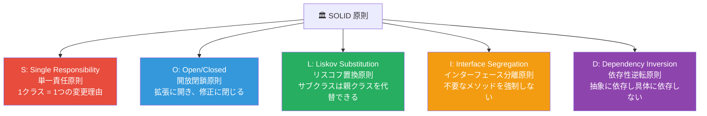
```mermaid
graph TD
    SOLID["🏛️ SOLID 原則"]

    SOLID --> SRP["S: Single Responsibility<br>単一責任原則<br>1クラス = 1つの変更理由"]
    SOLID --> OCP["O: Open/Closed<br>開放閉鎖原則<br>拡張に開き、修正に閉じる"]
    SOLID --> LSP["L: Liskov Substitution<br>リスコフ置換原則<br>サブクラスは親クラスを代替できる"]
    SOLID --> ISP["I: Interface Segregation<br>インターフェース分離原則<br>不要なメソッドを強制しない"]
    SOLID --> DIP["D: Dependency Inversion<br>依存性逆転原則<br>抽象に依存し具体に依存しない"]

    style SRP fill:#e74c3c,color:#fff
    style OCP fill:#3498db,color:#fff
    style LSP fill:#27ae60,color:#fff
    style ISP fill:#f39c12,color:#fff
    style DIP fill:#8e44ad,color:#fff
```

### 3.1 S：単一責任原則（Single Responsibility Principle）

> 「クラスを変更する理由は、ただ一つであるべきだ」— Robert C. Martin

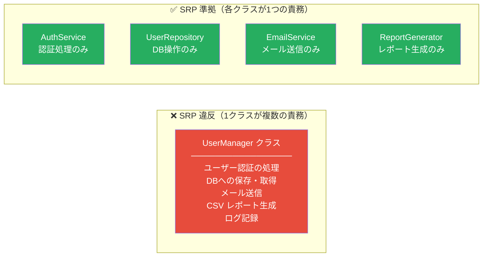
```mermaid
graph LR
    subgraph BAD["❌ SRP 違反（1クラスが複数の責務）"]
        GOD_CLASS["UserManager クラス<br>─────────────────<br>ユーザー認証の処理<br>DBへの保存・取得<br>メール送信<br>CSV レポート生成<br>ログ記録"]
    end

    subgraph GOOD["✅ SRP 準拠（各クラスが1つの責務）"]
        AUTH_C["AuthService<br>認証処理のみ"]
        REPO_C["UserRepository<br>DB操作のみ"]
        EMAIL_C["EmailService<br>メール送信のみ"]
        REPORT_C["ReportGenerator<br>レポート生成のみ"]
    end

    style GOD_CLASS fill:#e74c3c,color:#fff
    style AUTH_C fill:#27ae60,color:#fff
    style REPO_C fill:#27ae60,color:#fff
    style EMAIL_C fill:#27ae60,color:#fff
    style REPORT_C fill:#27ae60,color:#fff
```

```python
# ❌ SRP 違反：1クラスが認証・DB・メールすべてを担当
class UserManager:
    def authenticate(self, email, password): ...
    def save_to_db(self, user): ...
    def send_welcome_email(self, user): ...
    def generate_report(self) -> str: ...


# ✅ SRP 準拠：責務ごとにクラスを分割
class AuthService:
    def authenticate(self, email: str, password: str) -> bool:
        """認証のみを担当"""
        ...

class UserRepository:
    def save(self, user) -> None:
        """DB 操作のみを担当"""
        ...

class EmailService:
    def send_welcome(self, user) -> None:
        """メール送信のみを担当"""
        ...
```

---

### 3.2 O：開放閉鎖原則（Open/Closed Principle）

> 「ソフトウェアの要素は拡張に対して開かれており、修正に対して閉じていなければならない」

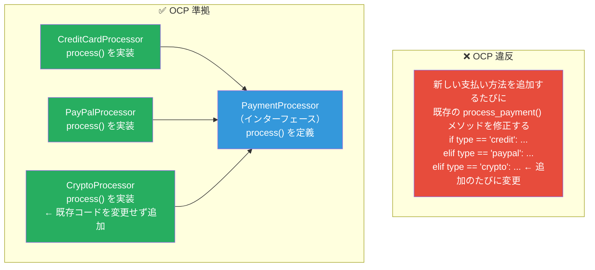
```mermaid
flowchart TD
    subgraph BAD_OCP["❌ OCP 違反"]
        BAD1["新しい支払い方法を追加するたびに<br>既存の process_payment() メソッドを修正する<br>if type == 'credit': ...<br>elif type == 'paypal': ...<br>elif type == 'crypto': ... ← 追加のたびに変更"]
    end

    subgraph GOOD_OCP["✅ OCP 準拠"]
        IF_PAY["PaymentProcessor<br>（インターフェース）<br>process() を定義"]
        CREDIT["CreditCardProcessor<br>process() を実装"]
        PAYPAL["PayPalProcessor<br>process() を実装"]
        CRYPTO["CryptoProcessor<br>process() を実装<br>← 既存コードを変更せず追加"]
        CREDIT --> IF_PAY
        PAYPAL --> IF_PAY
        CRYPTO --> IF_PAY
    end

    style BAD1 fill:#e74c3c,color:#fff
    style IF_PAY fill:#3498db,color:#fff
    style CREDIT fill:#27ae60,color:#fff
    style PAYPAL fill:#27ae60,color:#fff
    style CRYPTO fill:#27ae60,color:#fff
```

```python
from abc import ABC, abstractmethod


class PaymentProcessor(ABC):
    """支払い処理の抽象（変更に閉じている）"""

    @abstractmethod
    def process(self, amount: float) -> bool:
        ...


class CreditCardProcessor(PaymentProcessor):
    def process(self, amount: float) -> bool:
        print(f"クレジットカードで {amount}円 を処理")
        return True


class PayPalProcessor(PaymentProcessor):
    def process(self, amount: float) -> bool:
        print(f"PayPal で {amount}円 を処理")
        return True


# ✅ 新しい支払い方法は追加するだけ（既存コードを修正しない）
class CryptoProcessor(PaymentProcessor):
    def process(self, amount: float) -> bool:
        print(f"暗号通貨で {amount}円 を処理")
        return True


# 呼び出し元は変更不要
def checkout(processor: PaymentProcessor, amount: float):
    processor.process(amount)
```

---

### 3.3 L：リスコフ置換原則（Liskov Substitution Principle）

> 「派生クラスは、その基底クラスと置換可能でなければならない」— Barbara Liskov

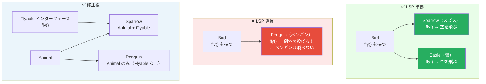
```mermaid
graph TD
    subgraph LSP_GOOD["✅ LSP 準拠"]
        BIRD_OK["Bird<br>fly() を持つ"]
        SPARROW["Sparrow（スズメ）<br>fly() → 空を飛ぶ"]
        EAGLE["Eagle（鷲）<br>fly() → 空を飛ぶ"]
        BIRD_OK --> SPARROW
        BIRD_OK --> EAGLE
    end

    subgraph LSP_BAD["❌ LSP 違反"]
        BIRD_NG["Bird<br>fly() を持つ"]
        PENGUIN["Penguin（ペンギン）<br>fly() → 例外を投げる！<br>← ペンギンは飛べない"]
        BIRD_NG --> PENGUIN
    end

    subgraph LSP_FIX["✅ 修正後"]
        ANIMAL["Animal"]
        FLYABLE["Flyable インターフェース<br>fly()"]
        SPARROW2["Sparrow<br>Animal + Flyable"]
        PENGUIN2["Penguin<br>Animal のみ（Flyable なし）"]
        ANIMAL --> SPARROW2
        ANIMAL --> PENGUIN2
        FLYABLE --> SPARROW2
    end

    style LSP_BAD fill:#fde8e8
    style LSP_GOOD fill:#e8fde8
    style LSP_FIX fill:#ebf5fb
    style PENGUIN fill:#e74c3c,color:#fff
    style SPARROW fill:#27ae60,color:#fff
    style EAGLE fill:#27ae60,color:#fff
```

```python
# ❌ LSP 違反：Penguin は Bird を置き換えられない
class Bird:
    def fly(self): return "飛んでいます"

class Penguin(Bird):
    def fly(self):
        raise NotImplementedError("ペンギンは飛べません！")  # 違反！


# ✅ LSP 準拠：Flyable を別に定義
class Animal(ABC):
    pass

class FlyableAnimal(Animal, ABC):
    @abstractmethod
    def fly(self) -> str: ...

class Sparrow(FlyableAnimal):
    def fly(self) -> str:
        return "スズメが空を飛んでいます"

class Penguin(Animal):  # Flyable を継承しない
    def swim(self) -> str:
        return "ペンギンが泳いでいます"
```

---

### 3.4 I：インターフェース分離原則（Interface Segregation Principle）

> 「クライアントが使用しないメソッドへの依存を強制してはならない」

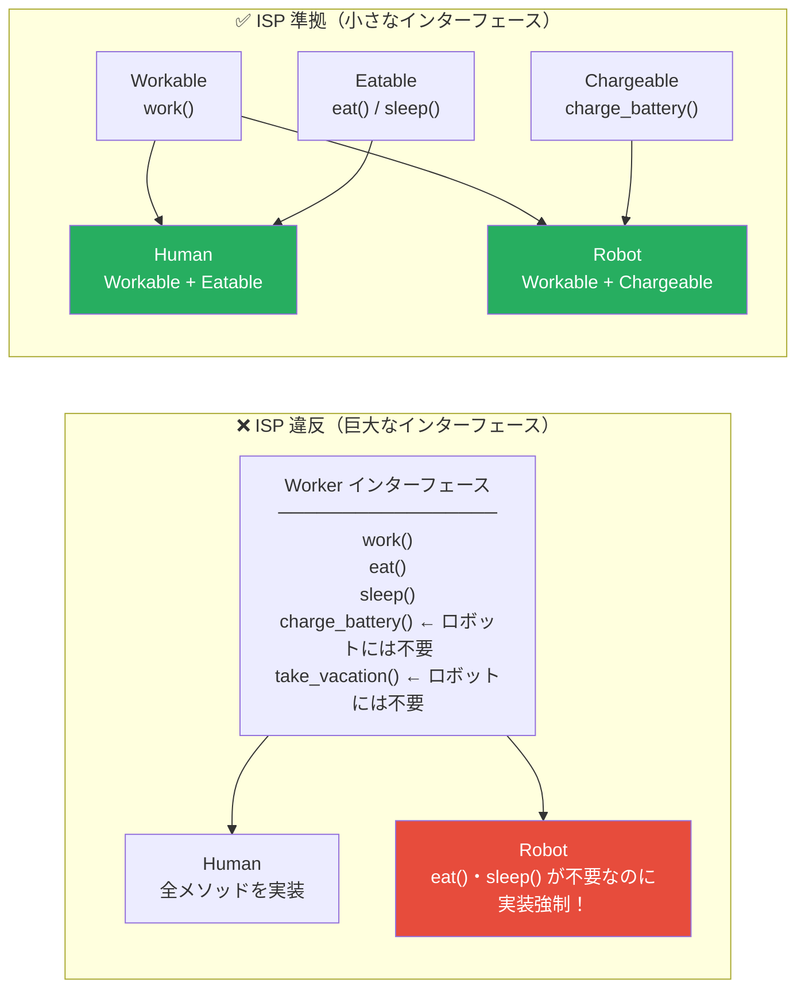
```mermaid
graph LR
    subgraph BAD_ISP["❌ ISP 違反（巨大なインターフェース）"]
        FAT_IF["Worker インターフェース<br>─────────────────<br>work()<br>eat()<br>sleep()<br>charge_battery() ← ロボットには不要<br>take_vacation() ← ロボットには不要"]
        HUMAN_BAD["Human<br>全メソッドを実装"]
        ROBOT_BAD["Robot<br>eat()・sleep() が不要なのに実装強制！"]
        FAT_IF --> HUMAN_BAD
        FAT_IF --> ROBOT_BAD
    end

    subgraph GOOD_ISP["✅ ISP 準拠（小さなインターフェース）"]
        WORKABLE["Workable<br>work()"]
        EATABLE["Eatable<br>eat() / sleep()"]
        CHARGEABLE["Chargeable<br>charge_battery()"]
        HUMAN_OK["Human<br>Workable + Eatable"]
        ROBOT_OK["Robot<br>Workable + Chargeable"]
        WORKABLE --> HUMAN_OK
        EATABLE --> HUMAN_OK
        WORKABLE --> ROBOT_OK
        CHARGEABLE --> ROBOT_OK
    end

    style ROBOT_BAD fill:#e74c3c,color:#fff
    style ROBOT_OK fill:#27ae60,color:#fff
    style HUMAN_OK fill:#27ae60,color:#fff
```

---

### 3.5 D：依存性逆転原則（Dependency Inversion Principle）

> 「上位レベルのモジュールは下位レベルのモジュールに依存してはならない。両者は抽象に依存すべきだ」

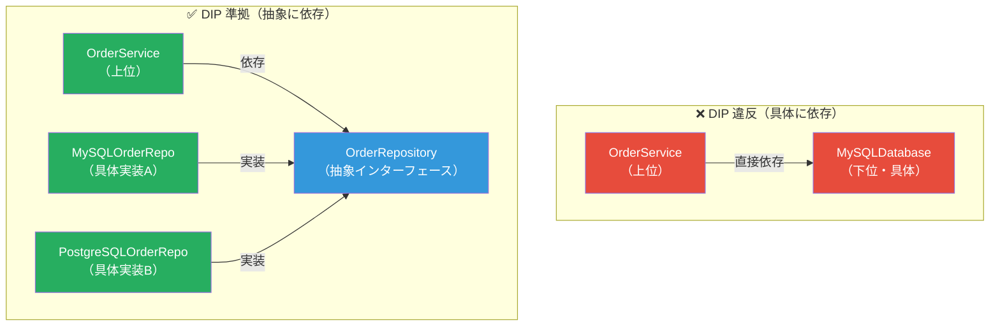
```mermaid
graph TD
    subgraph BAD_DIP["❌ DIP 違反（具体に依存）"]
        HIGH_BAD["OrderService<br>（上位）"]
        LOW_BAD["MySQLDatabase<br>（下位・具体）"]
        HIGH_BAD -->|"直接依存"| LOW_BAD
    end

    subgraph GOOD_DIP["✅ DIP 準拠（抽象に依存）"]
        HIGH_GOOD["OrderService<br>（上位）"]
        INTERFACE["OrderRepository<br>（抽象インターフェース）"]
        MYSQL["MySQLOrderRepo<br>（具体実装A）"]
        POSTGRES["PostgreSQLOrderRepo<br>（具体実装B）"]
        HIGH_GOOD -->|"依存"| INTERFACE
        MYSQL -->|"実装"| INTERFACE
        POSTGRES -->|"実装"| INTERFACE
    end

    style HIGH_BAD fill:#e74c3c,color:#fff
    style LOW_BAD fill:#e74c3c,color:#fff
    style HIGH_GOOD fill:#27ae60,color:#fff
    style INTERFACE fill:#3498db,color:#fff
    style MYSQL fill:#27ae60,color:#fff
    style POSTGRES fill:#27ae60,color:#fff
```

```python
from abc import ABC, abstractmethod


# ✅ 抽象（インターフェース）
class OrderRepository(ABC):
    @abstractmethod
    def save(self, order) -> None: ...

    @abstractmethod
    def find_by_id(self, order_id: str): ...


# 上位モジュール：抽象にのみ依存
class OrderService:
    def __init__(self, repository: OrderRepository):  # 抽象を受け取る
        self._repo = repository

    def place_order(self, customer_id: str, items: list):
        order = {"id": "ORD-001", "customer_id": customer_id, "items": items}
        self._repo.save(order)
        return order


# 下位モジュール：抽象を実装
class MySQLOrderRepository(OrderRepository):
    def save(self, order) -> None:
        print(f"MySQL に保存: {order}")

    def find_by_id(self, order_id: str):
        return {"id": order_id}


class InMemoryOrderRepository(OrderRepository):
    def __init__(self):
        self._store = {}

    def save(self, order) -> None:
        self._store[order["id"]] = order

    def find_by_id(self, order_id: str):
        return self._store.get(order_id)


# 本番：MySQL を使用
service = OrderService(MySQLOrderRepository())

# テスト：インメモリを使用（DBなしでテスト可能）
test_service = OrderService(InMemoryOrderRepository())
```

---

## 4. クラスとオブジェクトの設計

### 4.1 クラスの構成要素

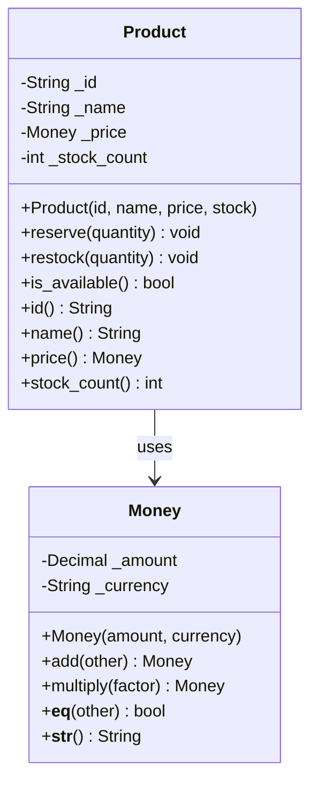
```mermaid
classDiagram
    class Product {
        -String _id
        -String _name
        -Money _price
        -int _stock_count
        +Product(id, name, price, stock)
        +reserve(quantity) void
        +restock(quantity) void
        +is_available() bool
        +id() String
        +name() String
        +price() Money
        +stock_count() int
    }

    class Money {
        -Decimal _amount
        -String _currency
        +Money(amount, currency)
        +add(other) Money
        +multiply(factor) Money
        +__eq__(other) bool
        +__str__() String
    }

    Product --> Money : uses
```

### 4.2 クラス設計の7原則

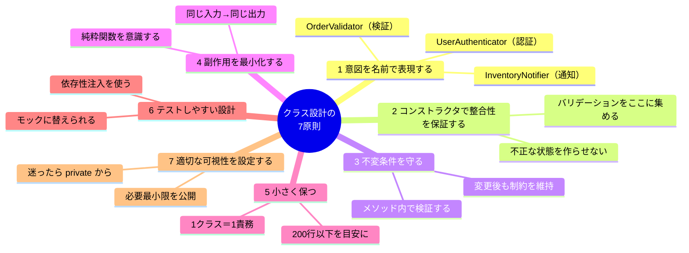
```mermaid
mindmap
    root((クラス設計の<br>7原則))
        1 意図を名前で表現する
            UserAuthenticator（認証）
            OrderValidator（検証）
            InventoryNotifier（通知）
        2 コンストラクタで整合性を保証する
            不正な状態を作らせない
            バリデーションをここに集める
        3 不変条件を守る
            変更後も制約を維持
            メソッド内で検証する
        4 副作用を最小化する
            同じ入力→同じ出力
            純粋関数を意識する
        5 小さく保つ
            1クラス＝1責務
            200行以下を目安に
        6 テストしやすい設計
            依存性注入を使う
            モックに替えられる
        7 適切な可視性を設定する
            必要最小限を公開
            迷ったら private から
```

### 4.3 値オブジェクト（Value Object）パターン

値オブジェクトは OOP の強力な設計ツールです。IDを持たず、値の等価性で判断するイミュータブルなオブジェクトです。

```python
from dataclasses import dataclass
from decimal import Decimal


@dataclass(frozen=True)  # frozen=True → イミュータブル（変更不可）
class Money:
    """金額を表す値オブジェクト"""
    amount: Decimal
    currency: str = "JPY"

    def __post_init__(self):
        if self.amount < 0:
            raise ValueError(f"金額は0以上でなければなりません: {self.amount}")
        if not self.currency:
            raise ValueError("通貨コードは必須です")

    def add(self, other: "Money") -> "Money":
        """加算：新しい Money を返す（自身を変更しない）"""
        self._assert_same_currency(other)
        return Money(self.amount + other.amount, self.currency)

    def multiply(self, factor: int) -> "Money":
        """乗算"""
        return Money(self.amount * factor, self.currency)

    def apply_discount(self, rate: Decimal) -> "Money":
        """割引適用（0.0〜1.0の割引率）"""
        if not Decimal("0") <= rate <= Decimal("1"):
            raise ValueError(f"割引率は 0〜1 の範囲: {rate}")
        discounted = self.amount * (1 - rate)
        return Money(discounted, self.currency)

    def _assert_same_currency(self, other: "Money") -> None:
        if self.currency != other.currency:
            raise ValueError(f"通貨が一致しません: {self.currency} vs {other.currency}")

    def __str__(self) -> str:
        return f"{self.amount:,.0f} {self.currency}"


# 使い方
price = Money(Decimal("1000"))
tax   = Money(Decimal("100"))
total = price.add(tax)
print(total)               # 1,100 JPY
print(price == total)      # False（値が異なる）

price2 = Money(Decimal("1000"))
print(price == price2)     # True（同じ値は等しい）
```

---

## 5. 継承の正しい使い方

### 5.1 継承の種類

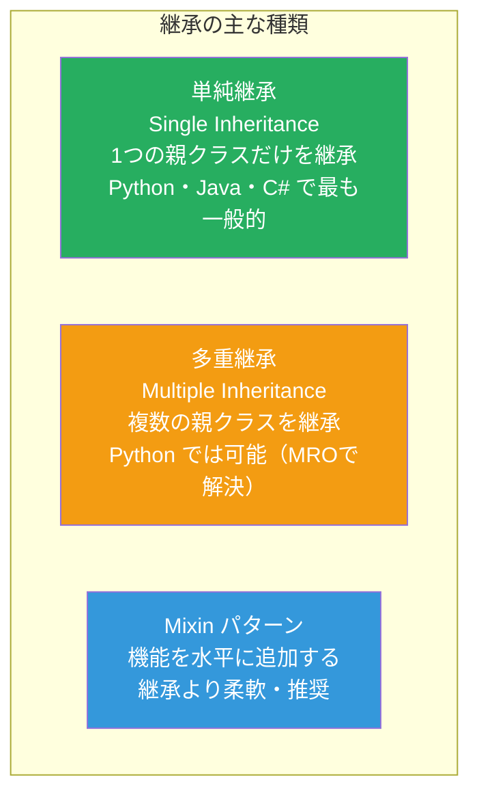
```mermaid
graph TD
    subgraph TYPES["継承の主な種類"]
        SINGLE["単純継承<br>Single Inheritance<br>1つの親クラスだけを継承<br>Python・Java・C# で最も一般的"]
        MULTI["多重継承<br>Multiple Inheritance<br>複数の親クラスを継承<br>Python では可能（MROで解決）"]
        MIXIN["Mixin パターン<br>機能を水平に追加する<br>継承より柔軟・推奨"]
    end

    style SINGLE fill:#27ae60,color:#fff
    style MULTI fill:#f39c12,color:#fff
    style MIXIN fill:#3498db,color:#fff
```

### 5.2 Mixin パターン（推奨）

多重継承の問題を避けつつ、機能を組み合わせる設計パターンです。

```python
# Mixin：単一の機能を提供する小さなクラス

class LoggingMixin:
    """ロギング機能を追加する Mixin"""
    def log(self, message: str) -> None:
        print(f"[{self.__class__.__name__}] {message}")


class SerializableMixin:
    """シリアライズ機能を追加する Mixin"""
    def to_dict(self) -> dict:
        return {k: v for k, v in self.__dict__.items()
                if not k.startswith("_")}


class ValidatableMixin:
    """バリデーション機能を追加する Mixin"""
    def validate(self) -> bool:
        return all(
            getattr(self, field) is not None
            for field in getattr(self, "required_fields", [])
        )


# ✅ Mixin を組み合わせてクラスを構成
class User(LoggingMixin, SerializableMixin, ValidatableMixin):
    required_fields = ["name", "email"]

    def __init__(self, name: str, email: str):
        self.name = name
        self.email = email

    def register(self) -> None:
        if self.validate():
            self.log(f"ユーザー登録: {self.name}")
        else:
            self.log("バリデーション失敗")


user = User("山田太郎", "yamada@example.com")
user.register()           # [User] ユーザー登録: 山田太郎
print(user.to_dict())     # {'name': '山田太郎', 'email': 'yamada@example.com'}
```

### 5.3 コンポジション over 継承（推奨パターン）

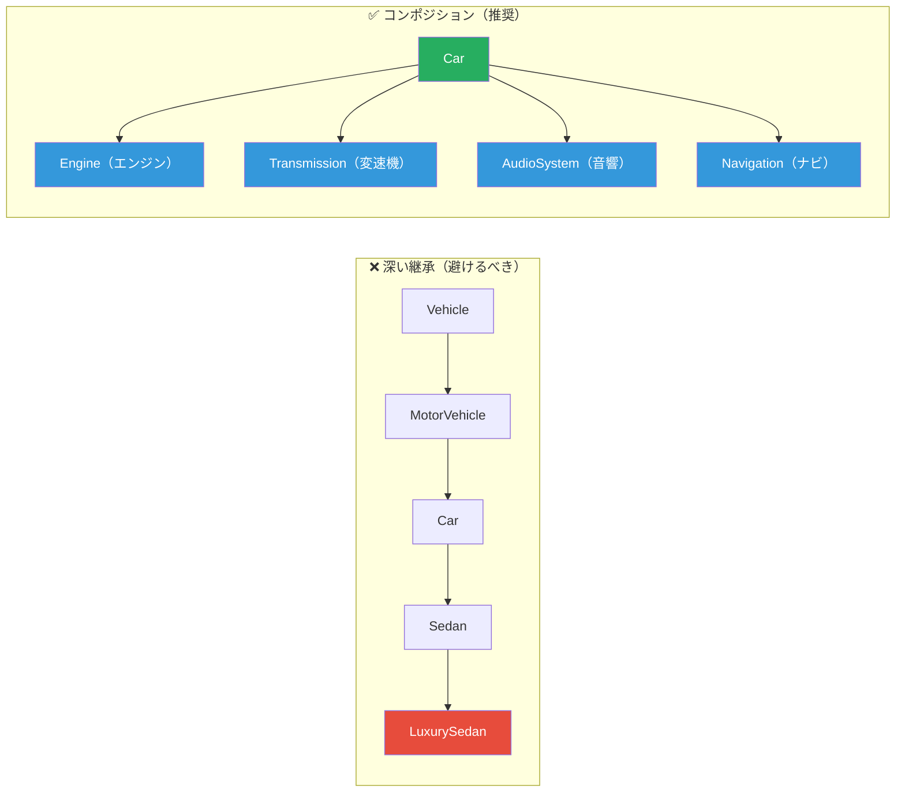
```mermaid
graph LR
    subgraph INHERIT_DEEP["❌ 深い継承（避けるべき）"]
        V["Vehicle"]
        MV["MotorVehicle"]
        CAR["Car"]
        SEDAN["Sedan"]
        LUXURY_SEDAN["LuxurySedan"]
        V --> MV --> CAR --> SEDAN --> LUXURY_SEDAN
    end

    subgraph COMPOSE["✅ コンポジション（推奨）"]
        CAR2["Car"]
        ENGINE["Engine（エンジン）"]
        TRANS["Transmission（変速機）"]
        AUDIO["AudioSystem（音響）"]
        NAV["Navigation（ナビ）"]
        CAR2 --> ENGINE
        CAR2 --> TRANS
        CAR2 --> AUDIO
        CAR2 --> NAV
    end

    style LUXURY_SEDAN fill:#e74c3c,color:#fff
    style CAR2 fill:#27ae60,color:#fff
    style ENGINE fill:#3498db,color:#fff
    style TRANS fill:#3498db,color:#fff
    style AUDIO fill:#3498db,color:#fff
    style NAV fill:#3498db,color:#fff
```

```python
# ✅ コンポジション：has-a 関係で機能を組み合わせる

class Engine:
    def __init__(self, horsepower: int):
        self.horsepower = horsepower

    def start(self) -> str:
        return f"{self.horsepower}馬力エンジン始動"


class AudioSystem:
    def __init__(self, brand: str):
        self.brand = brand

    def play(self, song: str) -> str:
        return f"{self.brand} で「{song}」を再生中"


class Car:
    """コンポジションで機能を組み合わせた Car クラス"""

    def __init__(self, model: str, engine: Engine, audio: AudioSystem):
        self.model = model
        self._engine = engine      # has-a（エンジンを持つ）
        self._audio = audio        # has-a（音響システムを持つ）

    def start(self) -> str:
        return f"{self.model}: {self._engine.start()}"

    def play_music(self, song: str) -> str:
        return self._audio.play(song)


# 組み合わせを自由に変更できる
car = Car(
    "プリウス",
    Engine(120),
    AudioSystem("Pioneer"),
)
print(car.start())              # プリウス: 120馬力エンジン始動
print(car.play_music("JPop"))  # Pioneer で「JPop」を再生中
```

---

## 6. インターフェースと抽象クラス

### 6.1 インターフェース vs 抽象クラスの違い

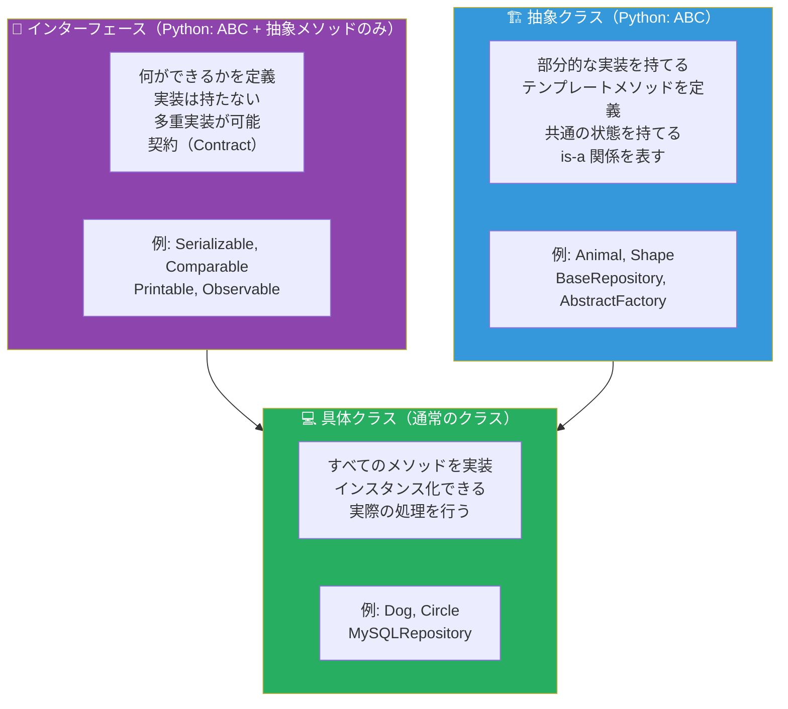
```mermaid
graph TD
    subgraph INTERFACE["🔌 インターフェース（Python: ABC + 抽象メソッドのみ）"]
        IF_DEF["何ができるかを定義<br>実装は持たない<br>多重実装が可能<br>契約（Contract）"]
        IF_EX["例: Serializable, Comparable<br>Printable, Observable"]
    end

    subgraph ABSTRACT["🏗️ 抽象クラス（Python: ABC）"]
        ABS_DEF["部分的な実装を持てる<br>テンプレートメソッドを定義<br>共通の状態を持てる<br>is-a 関係を表す"]
        ABS_EX["例: Animal, Shape<br>BaseRepository, AbstractFactory"]
    end

    subgraph CONCRETE["💻 具体クラス（通常のクラス）"]
        CON_DEF["すべてのメソッドを実装<br>インスタンス化できる<br>実際の処理を行う"]
        CON_EX["例: Dog, Circle<br>MySQLRepository"]
    end

    INTERFACE --> CONCRETE
    ABSTRACT --> CONCRETE

    style INTERFACE fill:#8e44ad,color:#fff
    style ABSTRACT fill:#3498db,color:#fff
    style CONCRETE fill:#27ae60,color:#fff
```

### 6.2 インターフェース（ABC）の設計

```python
from abc import ABC, abstractmethod
from typing import Protocol


# 方法1: ABC を使ったインターフェース定義
class Printable(ABC):
    @abstractmethod
    def print_info(self) -> str: ...


class Saveable(ABC):
    @abstractmethod
    def save(self) -> None: ...

    @abstractmethod
    def load(self, id: str) -> "Saveable": ...


# 方法2: Protocol（Python 3.8+）— 構造的部分型
# ABC を継承しなくてもインターフェースを満たせる
class Drawable(Protocol):
    def draw(self) -> None: ...
    def resize(self, factor: float) -> None: ...


# ✅ 複数インターフェースを実装
class Document(Printable, Saveable):
    def __init__(self, title: str, content: str):
        self.title = title
        self.content = content

    def print_info(self) -> str:
        return f"文書: {self.title}\n{self.content}"

    def save(self) -> None:
        print(f"「{self.title}」を保存しました")

    def load(self, id: str) -> "Document":
        return Document(f"文書_{id}", "読み込まれたコンテンツ")
```

### 6.3 テンプレートメソッドパターン（抽象クラスの活用）

```mermaid
sequenceDiagram
    participant CLIENT as クライアント
    participant ABSTRACT as AbstractClass<br>（テンプレート定義）
    participant CONCRETE as ConcreteClass<br>（具体実装）

    CLIENT->>ABSTRACT: template_method() を呼ぶ
    ABSTRACT->>ABSTRACT: step1()（共通処理）
    ABSTRACT->>CONCRETE: step2()（抽象メソッド → 委譲）
    CONCRETE-->>ABSTRACT: 具体的な処理結果
    ABSTRACT->>ABSTRACT: step3()（共通処理）
    ABSTRACT-->>CLIENT: 最終結果
```

```python
from abc import ABC, abstractmethod


class DataExporter(ABC):
    """データエクスポートのテンプレートメソッドパターン"""

    # テンプレートメソッド：処理の骨格を定義（final に相当）
    def export(self, data: list) -> None:
        validated = self.validate(data)
        transformed = self.transform(validated)
        self.write(transformed)
        self.notify_completion()

    def validate(self, data: list) -> list:
        """共通バリデーション（サブクラスでオーバーライド可）"""
        return [item for item in data if item is not None]

    @abstractmethod
    def transform(self, data: list) -> str:
        """データ変換（サブクラスで実装必須）"""
        ...

    @abstractmethod
    def write(self, content: str) -> None:
        """書き出し（サブクラスで実装必須）"""
        ...

    def notify_completion(self) -> None:
        """完了通知（デフォルト実装、必要なら上書き可）"""
        print("エクスポート完了")


class CSVExporter(DataExporter):
    def transform(self, data: list) -> str:
        return ",".join(str(item) for item in data)

    def write(self, content: str) -> None:
        print(f"CSV に書き込み: {content}")


class JSONExporter(DataExporter):
    def transform(self, data: list) -> str:
        import json
        return json.dumps(data, ensure_ascii=False)

    def write(self, content: str) -> None:
        print(f"JSON に書き込み: {content}")


# 使い方
csv_exporter  = CSVExporter()
json_exporter = JSONExporter()

data = [1, 2, 3, None, 4]
csv_exporter.export(data)   # CSV に書き込み: 1,2,3,4
json_exporter.export(data)  # JSON に書き込み: [1, 2, 3, 4]
```

---

## 7. デザインパターン

GoF（Gang of Four）が提唱した23のデザインパターンを、OOP で頻繁に使うものに絞って解説します。

```mermaid
graph TD
    DP["🎨 GoF デザインパターン（23種）"]

    DP --> CREATIONAL["生成パターン<br>Creational Patterns<br>オブジェクトの生成に関する"]
    DP --> STRUCTURAL["構造パターン<br>Structural Patterns<br>クラスの構造に関する"]
    DP --> BEHAVIORAL["振る舞いパターン<br>Behavioral Patterns<br>クラスの相互作用に関する"]

    CREATIONAL --> SINGLETON["Singleton<br>インスタンスを1つに限定"]
    CREATIONAL --> FACTORY["Factory Method<br>生成をサブクラスに委譲"]
    CREATIONAL --> BUILDER["Builder<br>複雑なオブジェクトの構築"]

    STRUCTURAL --> ADAPTER["Adapter<br>インターフェースの変換"]
    STRUCTURAL --> DECORATOR["Decorator<br>機能を動的に追加"]
    STRUCTURAL --> FACADE["Facade<br>複雑な処理を簡単なI/Fで隠す"]

    BEHAVIORAL --> OBSERVER["Observer<br>状態変化を通知"]
    BEHAVIORAL --> STRATEGY["Strategy<br>アルゴリズムを交換可能に"]
    BEHAVIORAL --> COMMAND["Command<br>処理をオブジェクト化"]

    style CREATIONAL fill:#3498db,color:#fff
    style STRUCTURAL fill:#27ae60,color:#fff
    style BEHAVIORAL fill:#8e44ad,color:#fff
```

### 7.1 Singleton パターン（生成）

インスタンスを1つに限定するパターン。設定管理・ロガーなどで使います。

```python
class DatabasePool:
    """DB コネクションプール（Singleton）"""
    _instance = None

    def __new__(cls):
        if cls._instance is None:
            cls._instance = super().__new__(cls)
            cls._instance._connections = []
        return cls._instance

    def get_connection(self):
        return f"接続 #{len(self._connections) + 1}"


pool1 = DatabasePool()
pool2 = DatabasePool()
print(pool1 is pool2)  # True — 同じインスタンス
```

### 7.2 Factory Method パターン（生成）

```mermaid
classDiagram
    class NotificationFactory {
        <<abstract>>
        +create_notifier()* Notifier
        +send(message) void
    }

    class EmailNotificationFactory {
        +create_notifier() EmailNotifier
    }

    class SMSNotificationFactory {
        +create_notifier() SMSNotifier
    }

    class Notifier {
        <<abstract>>
        +notify(message)* void
    }

    class EmailNotifier {
        +notify(message) void
    }

    class SMSNotifier {
        +notify(message) void
    }

    NotificationFactory <|-- EmailNotificationFactory
    NotificationFactory <|-- SMSNotificationFactory
    Notifier <|-- EmailNotifier
    Notifier <|-- SMSNotifier
    EmailNotificationFactory --> EmailNotifier
    SMSNotificationFactory --> SMSNotifier
```

```python
from abc import ABC, abstractmethod


class Notifier(ABC):
    @abstractmethod
    def notify(self, message: str) -> None: ...


class EmailNotifier(Notifier):
    def __init__(self, address: str):
        self.address = address

    def notify(self, message: str) -> None:
        print(f"メール送信 to {self.address}: {message}")


class SMSNotifier(Notifier):
    def __init__(self, phone: str):
        self.phone = phone

    def notify(self, message: str) -> None:
        print(f"SMS 送信 to {self.phone}: {message}")


class NotifierFactory(ABC):
    """Factory Method: 生成をサブクラスに委譲"""

    @abstractmethod
    def create_notifier(self) -> Notifier: ...

    def send_alert(self, message: str) -> None:
        notifier = self.create_notifier()  # ファクトリメソッド呼び出し
        notifier.notify(message)


class EmailNotifierFactory(NotifierFactory):
    def create_notifier(self) -> Notifier:
        return EmailNotifier("admin@example.com")


class SMSNotifierFactory(NotifierFactory):
    def create_notifier(self) -> Notifier:
        return SMSNotifier("090-0000-0000")


# 呼び出し元は具体的な通知方法を知らなくてよい
factories = [EmailNotifierFactory(), SMSNotifierFactory()]
for factory in factories:
    factory.send_alert("システム障害が発生しました")
```

### 7.3 Strategy パターン（振る舞い）

アルゴリズムを交換可能にするパターン。OCP の実現に最適です。

```python
from abc import ABC, abstractmethod
from decimal import Decimal


class DiscountStrategy(ABC):
    """割引戦略の抽象（Strategy インターフェース）"""

    @abstractmethod
    def calculate(self, original_price: Decimal) -> Decimal: ...


class NoDiscount(DiscountStrategy):
    def calculate(self, original_price: Decimal) -> Decimal:
        return original_price


class PercentageDiscount(DiscountStrategy):
    def __init__(self, rate: Decimal):
        self.rate = rate

    def calculate(self, original_price: Decimal) -> Decimal:
        return original_price * (1 - self.rate)


class FixedAmountDiscount(DiscountStrategy):
    def __init__(self, discount_amount: Decimal):
        self.discount_amount = discount_amount

    def calculate(self, original_price: Decimal) -> Decimal:
        return max(Decimal("0"), original_price - self.discount_amount)


class ShoppingCart:
    """Strategy パターン：割引戦略を差し替え可能"""

    def __init__(self, strategy: DiscountStrategy = None):
        self._strategy = strategy or NoDiscount()
        self._items: list[tuple[str, Decimal]] = []

    def set_discount_strategy(self, strategy: DiscountStrategy) -> None:
        self._strategy = strategy

    def add_item(self, name: str, price: Decimal) -> None:
        self._items.append((name, price))

    def total(self) -> Decimal:
        subtotal = sum(price for _, price in self._items)
        return self._strategy.calculate(subtotal)


cart = ShoppingCart()
cart.add_item("Tシャツ", Decimal("3000"))
cart.add_item("ジーンズ", Decimal("8000"))

print(f"通常価格: {cart.total()}円")       # 11000円

cart.set_discount_strategy(PercentageDiscount(Decimal("0.1")))
print(f"10%割引後: {cart.total()}円")      # 9900円

cart.set_discount_strategy(FixedAmountDiscount(Decimal("1000")))
print(f"1000円引き後: {cart.total()}円")   # 10000円
```

### 7.4 Observer パターン（振る舞い）

```mermaid
sequenceDiagram
    participant ORDER as Order（Subject）
    participant INVENTORY as InventoryObserver
    participant EMAIL as EmailObserver
    participant LOG as LogObserver

    ORDER->>ORDER: confirm() を呼ぶ
    ORDER->>ORDER: status を CONFIRMED に変更
    ORDER->>INVENTORY: notify(OrderConfirmed)
    INVENTORY->>INVENTORY: 在庫を引き当てる
    ORDER->>EMAIL: notify(OrderConfirmed)
    EMAIL->>EMAIL: 確認メールを送る
    ORDER->>LOG: notify(OrderConfirmed)
    LOG->>LOG: ログに記録する
```

```python
from abc import ABC, abstractmethod
from typing import Any


class Observer(ABC):
    @abstractmethod
    def update(self, event: str, data: Any) -> None: ...


class Observable:
    """観察されるオブジェクトの基底クラス"""

    def __init__(self):
        self._observers: list[Observer] = []

    def subscribe(self, observer: Observer) -> None:
        self._observers.append(observer)

    def unsubscribe(self, observer: Observer) -> None:
        self._observers.remove(observer)

    def notify(self, event: str, data: Any = None) -> None:
        for observer in self._observers:
            observer.update(event, data)


class Order(Observable):
    def __init__(self, order_id: str):
        super().__init__()
        self.order_id = order_id
        self._status = "PENDING"

    def confirm(self) -> None:
        self._status = "CONFIRMED"
        self.notify("ORDER_CONFIRMED", {"order_id": self.order_id})


# 各 Observer の実装
class InventoryObserver(Observer):
    def update(self, event: str, data: Any) -> None:
        if event == "ORDER_CONFIRMED":
            print(f"在庫を引き当て: {data['order_id']}")


class EmailObserver(Observer):
    def update(self, event: str, data: Any) -> None:
        if event == "ORDER_CONFIRMED":
            print(f"確認メールを送信: {data['order_id']}")


# 使い方
order = Order("ORD-001")
order.subscribe(InventoryObserver())
order.subscribe(EmailObserver())

order.confirm()
# 在庫を引き当て: ORD-001
# 確認メールを送信: ORD-001
```

### 7.5 Decorator パターン（構造）

機能を動的に追加するパターン。継承を使わずに拡張できます。

```python
from abc import ABC, abstractmethod
from functools import wraps


class TextProcessor(ABC):
    @abstractmethod
    def process(self, text: str) -> str: ...


class PlainText(TextProcessor):
    def process(self, text: str) -> str:
        return text


class UpperCaseDecorator(TextProcessor):
    def __init__(self, processor: TextProcessor):
        self._processor = processor

    def process(self, text: str) -> str:
        return self._processor.process(text).upper()


class TrimDecorator(TextProcessor):
    def __init__(self, processor: TextProcessor):
        self._processor = processor

    def process(self, text: str) -> str:
        return self._processor.process(text).strip()


class ExclamationDecorator(TextProcessor):
    def __init__(self, processor: TextProcessor):
        self._processor = processor

    def process(self, text: str) -> str:
        return self._processor.process(text) + "!!!"


# Decorator をチェーン（組み合わせ）できる
text = "  hello world  "
processor = ExclamationDecorator(
    UpperCaseDecorator(
        TrimDecorator(PlainText())
    )
)
print(processor.process(text))   # HELLO WORLD!!!
```

---

## 8. OOP とアーキテクチャの統合

### 8.1 OOP とクリーンアーキテクチャ

```mermaid
graph TD
    subgraph CLEAN_ARCH["クリーンアーキテクチャ × OOP"]
        subgraph DOMAIN["🧩 ドメイン層（最も純粋な OOP）"]
            ENTITIES["Entity（エンティティ）<br>ビジネスルールを持つオブジェクト"]
            VALUE_OBJ["Value Object（値オブジェクト）<br>イミュータブルな値の表現"]
            DOMAIN_SVC["Domain Service（ドメインサービス）<br>エンティティをまたぐビジネスロジック"]
        end

        subgraph APP["⚙️ アプリケーション層"]
            USE_CASE["Use Case（ユースケース）<br>ビジネスフローのオーケストレーション"]
            REPO_IF["Repository Interface（抽象）<br>依存性逆転の適用（DIP）"]
        end

        subgraph INFRA["🔧 インフラ層"]
            REPO_IMPL["Repository 実装<br>具体的な永続化処理"]
        end
    end

    APP --> DOMAIN
    INFRA -.->|"DIP: 抽象に向けて実装"| REPO_IF

    style DOMAIN fill:#e74c3c,color:#fff
    style APP fill:#e67e22,color:#fff
    style INFRA fill:#95a5a6,color:#fff
```

### 8.2 OOP と DDD（ドメイン駆動設計）の対応

```mermaid
graph LR
    subgraph DDD_TACTICAL["DDD 戦術パターン ≒ OOP パターン"]
        E["Entity<br>（エンティティ）<br>IDで同一性を判断するクラス"]
        VO["Value Object<br>（値オブジェクト）<br>値で同一性を判断するイミュータブルクラス"]
        AGG["Aggregate<br>（集約）<br>整合性境界を持つオブジェクト群"]
        DS["Domain Service<br>（ドメインサービス）<br>どのEntityにも属さないロジック"]
        REP["Repository<br>（リポジトリ）<br>集約の永続化を担うインターフェース"]
    end

    subgraph OOP_CONCEPTS["対応する OOP 概念"]
        C_CLASS["クラス + カプセル化"]
        C_VO_OOP["イミュータブルクラス<br>（@dataclass frozen=True）"]
        C_AGG_OOP["Aggregate Root クラス<br>（ファサードパターン）"]
        C_DS_OOP["純粋なクラス<br>（ステートレスサービス）"]
        C_REP_OOP["インターフェース（ABC）<br>依存性逆転原則（DIP）"]
    end

    E --> C_CLASS
    VO --> C_VO_OOP
    AGG --> C_AGG_OOP
    DS --> C_DS_OOP
    REP --> C_REP_OOP

    style E fill:#3498db,color:#fff
    style VO fill:#27ae60,color:#fff
    style AGG fill:#8e44ad,color:#fff
    style DS fill:#e67e22,color:#fff
    style REP fill:#e74c3c,color:#fff
```

---

## 9. テスト駆動OOP開発

### 9.1 OOP クラスのテスト戦略

```mermaid
graph TD
    subgraph TEST_TYPES["OOP のテスト種別"]
        UNIT_T["🧪 ユニットテスト<br>単一クラス・メソッドのテスト<br>外部依存はモック化<br>最も多い・最も速い"]
        INTEGRATION["🔗 統合テスト<br>複数クラスの協調テスト<br>実際の依存を使う<br>中程度の数"]
        CONTRACT["📋 契約テスト<br>インターフェースの<br>実装が正しいかテスト"]
    end

    UNIT_T --> U_TIP["テストのポイント<br>・カプセル化を尊重する（private に触れない）<br>・振る舞い（結果）をテストする<br>・1テスト1概念を守る"]
    INTEGRATION --> I_TIP["インメモリ実装でテスト<br>DIで依存を差し替える"]
    CONTRACT --> C_TIP["インターフェースを満たすか<br>LSP の検証にも使える"]

    style UNIT_T fill:#27ae60,color:#fff
    style INTEGRATION fill:#f39c12,color:#fff
    style CONTRACT fill:#3498db,color:#fff
```

### 9.2 テスタブルな OOP 設計

```python
import pytest
from unittest.mock import MagicMock
from decimal import Decimal


# ─── テスト対象クラス ───

class InventoryRepository:
    """リポジトリのインターフェース"""
    def get_stock(self, product_id: str) -> int: ...
    def reduce_stock(self, product_id: str, quantity: int) -> None: ...


class OrderService:
    """テスタブルな設計: 依存性注入で InMemory に差し替え可能"""

    def __init__(self, inventory: InventoryRepository):
        self._inventory = inventory

    def place_order(self, product_id: str, quantity: int) -> dict:
        stock = self._inventory.get_stock(product_id)
        if stock < quantity:
            raise ValueError(f"在庫不足: 在庫={stock}, 注文数={quantity}")
        self._inventory.reduce_stock(product_id, quantity)
        return {"product_id": product_id, "quantity": quantity, "status": "confirmed"}


# ─── テストコード ───

class TestOrderService:

    @pytest.fixture
    def mock_inventory(self):
        mock = MagicMock(spec=InventoryRepository)
        mock.get_stock.return_value = 10   # 在庫10個と仮定
        return mock

    @pytest.fixture
    def service(self, mock_inventory):
        return OrderService(mock_inventory)

    def test_注文が正常に確定される(self, service, mock_inventory):
        result = service.place_order("PROD-001", 3)

        assert result["status"] == "confirmed"
        assert result["quantity"] == 3
        mock_inventory.reduce_stock.assert_called_once_with("PROD-001", 3)

    def test_在庫不足の場合はValueErrorが発生する(self, service, mock_inventory):
        mock_inventory.get_stock.return_value = 2  # 在庫2個に変更

        with pytest.raises(ValueError, match="在庫不足"):
            service.place_order("PROD-001", 5)

    def test_在庫削減は呼ばれない(self, service, mock_inventory):
        mock_inventory.get_stock.return_value = 0

        with pytest.raises(ValueError):
            service.place_order("PROD-001", 1)

        mock_inventory.reduce_stock.assert_not_called()
```

---

## 10. リファクタリング技法

### 10.1 よくあるコードの匂い（Code Smells）と対処法

```mermaid
graph TD
    subgraph SMELLS["🚨 コードの匂い（Code Smells）"]
        LONG_METHOD["長すぎるメソッド<br>50行を超えるメソッド"]
        LARGE_CLASS["大きすぎるクラス<br>300行を超えるクラス"]
        DUPLICATED["重複コード<br>同じロジックが複数箇所"]
        PRIMITIVE["プリミティブ執着<br>string/int で概念を表現"]
        LONG_PARAM["長い引数リスト<br>引数が5個以上"]
    end

    subgraph FIXES["✅ 対処法"]
        EXTRACT_M["メソッドの抽出<br>Extract Method"]
        EXTRACT_C["クラスの抽出<br>Extract Class"]
        DRY["テンプレートメソッド<br>または共通クラスに集約"]
        VALUE_O["値オブジェクトの導入<br>Introduce Value Object"]
        PARAM_OBJ["パラメータオブジェクト<br>Introduce Parameter Object"]
    end

    LONG_METHOD --> EXTRACT_M
    LARGE_CLASS --> EXTRACT_C
    DUPLICATED --> DRY
    PRIMITIVE --> VALUE_O
    LONG_PARAM --> PARAM_OBJ

    style LONG_METHOD fill:#e74c3c,color:#fff
    style LARGE_CLASS fill:#e74c3c,color:#fff
    style DUPLICATED fill:#e74c3c,color:#fff
    style PRIMITIVE fill:#e74c3c,color:#fff
    style LONG_PARAM fill:#e74c3c,color:#fff
    style EXTRACT_M fill:#27ae60,color:#fff
    style EXTRACT_C fill:#27ae60,color:#fff
    style DRY fill:#27ae60,color:#fff
    style VALUE_O fill:#27ae60,color:#fff
    style PARAM_OBJ fill:#27ae60,color:#fff
```

### 10.2 リファクタリング実践例

**Before（リファクタリング前）：**

```python
# ❌ 問題のあるコード
def process_order(customer_name, customer_email, product_id,
                  product_name, quantity, price, discount_type,
                  discount_value):
    # 長い引数リスト + 重複ロジック + プリミティブ執着

    if discount_type == "percentage":
        final_price = price * quantity * (1 - discount_value / 100)
    elif discount_type == "fixed":
        final_price = price * quantity - discount_value
    else:
        final_price = price * quantity

    print(f"顧客: {customer_name} ({customer_email})")
    print(f"商品: {product_name} x {quantity}")
    print(f"合計: {final_price}円")
```

**After（リファクタリング後）：**

```python
# ✅ リファクタリング後

from dataclasses import dataclass
from decimal import Decimal
from abc import ABC, abstractmethod


@dataclass(frozen=True)
class Customer:
    name: str
    email: str


@dataclass(frozen=True)
class OrderItem:
    product_id: str
    product_name: str
    unit_price: Decimal
    quantity: int

    @property
    def subtotal(self) -> Decimal:
        return self.unit_price * self.quantity


class DiscountStrategy(ABC):
    @abstractmethod
    def apply(self, amount: Decimal) -> Decimal: ...


class NoDiscount(DiscountStrategy):
    def apply(self, amount: Decimal) -> Decimal:
        return amount


class PercentageDiscount(DiscountStrategy):
    def __init__(self, rate: Decimal):
        self.rate = rate

    def apply(self, amount: Decimal) -> Decimal:
        return amount * (1 - self.rate)


class FixedDiscount(DiscountStrategy):
    def __init__(self, amount: Decimal):
        self.amount = amount

    def apply(self, amount: Decimal) -> Decimal:
        return max(Decimal("0"), amount - self.amount)


@dataclass
class Order:
    customer: Customer
    item: OrderItem
    discount: DiscountStrategy = None

    def __post_init__(self):
        if self.discount is None:
            self.discount = NoDiscount()

    @property
    def total(self) -> Decimal:
        return self.discount.apply(self.item.subtotal)

    def print_receipt(self) -> None:
        print(f"顧客: {self.customer.name} ({self.customer.email})")
        print(f"商品: {self.item.product_name} x {self.item.quantity}")
        print(f"合計: {self.total}円")


# 使い方：読みやすく、拡張しやすい
order = Order(
    customer=Customer("山田太郎", "yamada@example.com"),
    item=OrderItem("P001", "Tシャツ", Decimal("3000"), 2),
    discount=PercentageDiscount(Decimal("0.1")),
)
order.print_receipt()
```

---

## 11. 実践：ECサイト完全実装例

### 11.1 ドメインモデル全体像

```mermaid
classDiagram
    class Customer {
        -CustomerId _id
        -String _name
        -Email _email
        -bool _is_active
        +activate() void
        +deactivate() void
        +is_valid_for_order() bool
    }

    class Order {
        -OrderId _id
        -CustomerId _customer_id
        -List~OrderLine~ _lines
        -OrderStatus _status
        +add_line(product, qty) void
        +confirm() void
        +cancel() void
        +total() Money
    }

    class OrderLine {
        -ProductId _product_id
        -String _product_name
        -Money _unit_price
        -int _quantity
        +subtotal() Money
    }

    class Product {
        -ProductId _id
        -String _name
        -Money _price
        -int _stock_count
        +reserve(qty) void
        +is_available(qty) bool
    }

    class Money {
        -Decimal _amount
        -String _currency
        +add(Money) Money
        +multiply(int) Money
    }

    Customer "1" --> "0..*" Order : places
    Order "1" *-- "1..*" OrderLine : contains
    Product "1" <-- "0..*" OrderLine : references
    OrderLine --> Money
    Product --> Money
```

### 11.2 完全実装例

```python
from __future__ import annotations
from abc import ABC, abstractmethod
from dataclasses import dataclass, field
from decimal import Decimal
from enum import Enum
from typing import Optional
import uuid


# ─────────────────────────────────
# 値オブジェクト（Value Objects）
# ─────────────────────────────────

@dataclass(frozen=True)
class Money:
    amount: Decimal
    currency: str = "JPY"

    def __post_init__(self):
        if self.amount < 0:
            raise ValueError(f"金額は0以上: {self.amount}")

    def __add__(self, other: Money) -> Money:
        if self.currency != other.currency:
            raise ValueError("通貨が一致しません")
        return Money(self.amount + other.amount, self.currency)

    def __mul__(self, factor: int) -> Money:
        return Money(self.amount * factor, self.currency)

    def __str__(self) -> str:
        return f"{self.amount:,.0f} {self.currency}"


@dataclass(frozen=True)
class Email:
    value: str

    def __post_init__(self):
        if "@" not in self.value:
            raise ValueError(f"不正なメールアドレス: {self.value}")


# ─────────────────────────────────
# エンティティ（Entities）
# ─────────────────────────────────

class OrderStatus(Enum):
    PENDING   = "pending"
    CONFIRMED = "confirmed"
    SHIPPED   = "shipped"
    CANCELLED = "cancelled"


@dataclass
class Product:
    """商品エンティティ"""
    id: str
    name: str
    price: Money
    _stock_count: int = field(default=0, repr=False)

    def reserve(self, quantity: int) -> None:
        """在庫を引き当てる（ビジネスルール）"""
        if quantity <= 0:
            raise ValueError("数量は1以上でなければなりません")
        if self._stock_count < quantity:
            raise ValueError(
                f"在庫不足: 在庫={self._stock_count}, 要求={quantity}"
            )
        self._stock_count -= quantity

    def restock(self, quantity: int) -> None:
        """在庫を補充する"""
        if quantity <= 0:
            raise ValueError("補充数量は1以上でなければなりません")
        self._stock_count += quantity

    def is_available(self, quantity: int = 1) -> bool:
        return self._stock_count >= quantity

    @property
    def stock_count(self) -> int:
        return self._stock_count


@dataclass
class OrderLine:
    """注文明細（Aggregate 内部のオブジェクト）"""
    product_id: str
    product_name: str
    unit_price: Money
    quantity: int

    @property
    def subtotal(self) -> Money:
        return self.unit_price * self.quantity


@dataclass
class Order:
    """注文エンティティ（Aggregate Root）"""
    id: str
    customer_id: str
    _lines: list[OrderLine] = field(default_factory=list, repr=False)
    _status: OrderStatus = field(default=OrderStatus.PENDING, repr=False)

    @classmethod
    def create(cls, customer_id: str) -> Order:
        return cls(id=str(uuid.uuid4()), customer_id=customer_id)

    def add_line(self, product: Product, quantity: int) -> None:
        """商品を注文に追加（ビジネスルールを適用）"""
        self._assert_editable()
        if not product.is_available(quantity):
            raise ValueError(f"商品「{product.name}」の在庫が不足しています")
        self._lines.append(
            OrderLine(product.id, product.name, product.price, quantity)
        )

    def confirm(self) -> None:
        """注文を確定する"""
        if self._status != OrderStatus.PENDING:
            raise ValueError("保留中の注文のみ確定できます")
        if not self._lines:
            raise ValueError("注文明細がありません")
        self._status = OrderStatus.CONFIRMED

    def cancel(self) -> None:
        """注文をキャンセルする"""
        if self._status == OrderStatus.SHIPPED:
            raise ValueError("発送済みの注文はキャンセルできません")
        self._status = OrderStatus.CANCELLED

    @property
    def status(self) -> OrderStatus:
        return self._status

    @property
    def total(self) -> Money:
        if not self._lines:
            return Money(Decimal("0"))
        totals = [line.subtotal for line in self._lines]
        return sum(totals[1:], totals[0])

    @property
    def lines(self) -> tuple[OrderLine, ...]:
        return tuple(self._lines)

    def _assert_editable(self) -> None:
        if self._status != OrderStatus.PENDING:
            raise ValueError("確定済みの注文は変更できません")


# ─────────────────────────────────
# リポジトリ（Repository）— DIP 適用
# ─────────────────────────────────

class OrderRepository(ABC):
    @abstractmethod
    def save(self, order: Order) -> None: ...

    @abstractmethod
    def find_by_id(self, order_id: str) -> Optional[Order]: ...


class InMemoryOrderRepository(OrderRepository):
    """テスト用インメモリ実装"""

    def __init__(self):
        self._store: dict[str, Order] = {}

    def save(self, order: Order) -> None:
        self._store[order.id] = order

    def find_by_id(self, order_id: str) -> Optional[Order]:
        return self._store.get(order_id)


# ─────────────────────────────────
# ユースケース（Application Layer）
# ─────────────────────────────────

class PlaceOrderUseCase:
    """注文作成ユースケース — OOP の総合的な活用"""

    def __init__(self, order_repository: OrderRepository):
        self._repo = order_repository  # DIP: 抽象に依存

    def execute(self, customer_id: str, items: list[tuple[Product, int]]) -> Order:
        """
        注文を作成して確定する

        Args:
            customer_id: 顧客ID
            items: [(商品, 数量)] のリスト
        """
        order = Order.create(customer_id)

        for product, quantity in items:
            order.add_line(product, quantity)

        order.confirm()
        self._repo.save(order)

        return order


# ─────────────────────────────────
# 動作確認
# ─────────────────────────────────

if __name__ == "__main__":
    # 商品を準備
    tshirt = Product("P001", "Tシャツ", Money(Decimal("1500")), _stock_count=10)
    jeans  = Product("P002", "ジーンズ", Money(Decimal("6000")), _stock_count=5)

    # リポジトリとユースケースを初期化
    repo     = InMemoryOrderRepository()
    use_case = PlaceOrderUseCase(repo)

    # 注文を作成
    order = use_case.execute(
        customer_id="CUST-001",
        items=[(tshirt, 2), (jeans, 1)],
    )

    print(f"注文ID: {order.id}")
    print(f"ステータス: {order.status.value}")
    print(f"合計金額: {order.total}")
    print(f"明細数: {len(order.lines)}")

    # 在庫が減っていることを確認
    print(f"Tシャツの残在庫: {tshirt.stock_count}")  # 8
    print(f"ジーンズの残在庫: {jeans.stock_count}")   # 5（reserveはaddLineで呼ばれない設計）
```

---

## 12. OOP アンチパターン

### 12.1 主要なアンチパターン一覧

```mermaid
graph TD
    subgraph ANTIPATTERNS["⚠️ OOP アンチパターン"]
        G["神クラス<br>God Class<br>1クラスがすべてを管理する"]
        ANEMIC["貧血ドメインモデル<br>Anemic Domain Model<br>クラスがデータのみ・ロジックなし"]
        DEEP_INHERIT["深い継承ツリー<br>Deep Inheritance<br>5階層以上の継承"]
        SINGLETON_ABUSE["Singleton 乱用<br>グローバル状態の多用"]
        DEAD_CODE["デッドコード<br>使われないメソッド・フィールド"]
        FEATURE_ENVY["フィーチャーエンビー<br>他クラスのデータを過剰に使う"]
    end

    G --> G_FIX["解決：SRP 適用<br>責務ごとにクラスを分割"]
    ANEMIC --> ANEMIC_FIX["解決：ロジックをクラスに移動<br>リッチドメインモデルへ"]
    DEEP_INHERIT --> DI_FIX["解決：コンポジションに切り替え<br>Mixin パターンを使う"]
    SINGLETON_ABUSE --> SA_FIX["解決：DI（依存性注入）を使う<br>テスタビリティを向上させる"]

    style G fill:#e74c3c,color:#fff
    style ANEMIC fill:#e74c3c,color:#fff
    style DEEP_INHERIT fill:#e74c3c,color:#fff
    style SINGLETON_ABUSE fill:#e74c3c,color:#fff
    style G_FIX fill:#27ae60,color:#fff
    style ANEMIC_FIX fill:#27ae60,color:#fff
    style DI_FIX fill:#27ae60,color:#fff
    style SA_FIX fill:#27ae60,color:#fff
```

### 12.2 貧血ドメインモデル vs リッチドメインモデル

```python
# ❌ 貧血ドメインモデル（アンチパターン）
class Order:
    def __init__(self):
        self.id = None
        self.status = None
        self.items = []
        self.total = 0

# すべてのロジックが外部サービスに漏れる
class OrderService:
    def confirm_order(self, order):
        if order.status != "pending":
            raise Exception("...")
        if not order.items:
            raise Exception("...")
        order.status = "confirmed"   # ← 本来 Order が持つべきロジック
        order.total = sum(...)       # ← 本来 Order が持つべきロジック


# ✅ リッチドメインモデル（推奨）
class Order:
    def confirm(self) -> None:  # ← ロジックはクラス自身が持つ
        if self._status != OrderStatus.PENDING:
            raise ValueError("...")
        if not self._lines:
            raise ValueError("...")
        self._status = OrderStatus.CONFIRMED

    @property
    def total(self) -> Money:  # ← 計算もクラス自身が担当
        return sum(line.subtotal for line in self._lines)
```

---

## 13. ベストプラクティス総まとめ

### 13.1 設計の黄金ルール

```mermaid
mindmap
    root((OOP<br>ベストプラクティス))
        命名
            意図を明確に表す名前をつける
            動詞（メソッド）+名詞（クラス）
            ドメイン言語と一致させる
        カプセル化
            デフォルトは private から始める
            setterより意図を表すメソッド
            不変条件をコンストラクタで保証
        継承
            is-a 関係にのみ使う
            深さ3以下を目安に
            has-a はコンポジションを使う
        インターフェース
            小さく保つ（ISP）
            変更点に対して抽象を定義
            具体より抽象に依存する（DIP）
        テスタビリティ
            依存性注入を基本にする
            副作用を最小化する
            状態より振る舞いをテストする
        SOLID
            SRP: 1クラス1責務
            OCP: 拡張に開き修正に閉じる
            LSP: 置き換え可能な継承
            ISP: インターフェース分離
            DIP: 抽象に依存する
```

### 13.2 OOP 成熟度モデル

```mermaid
graph TD
    LV0["Level 0: 手続き型スタイル<br>クラスがデータの入れ物のみ<br>すべてのロジックが外部関数に"]
    LV1["Level 1: 基本的な OOP<br>クラス・メソッドを正しく使う<br>カプセル化を意識している"]
    LV2["Level 2: SOLID 原則の適用<br>SRP・OCP を意識した設計<br>インターフェースを活用している"]
    LV3["Level 3: デザインパターンの活用<br>適切なパターンを選択できる<br>コンポジション > 継承を実践"]
    LV4["Level 4: ドメイン駆動設計との統合<br>リッチドメインモデル<br>値オブジェクト・集約を活用"]
    LV5["Level 5: アーキテクチャへの応用<br>クリーンアーキテクチャ<br>テスタブルで疎結合な設計"]

    LV0 --> LV1 --> LV2 --> LV3 --> LV4 --> LV5

    style LV0 fill:#e74c3c,color:#fff
    style LV1 fill:#e67e22,color:#fff
    style LV2 fill:#f39c12,color:#fff
    style LV3 fill:#27ae60,color:#fff
    style LV4 fill:#3498db,color:#fff
    style LV5 fill:#8e44ad,color:#fff
```

### 13.3 クイックリファレンス

| 状況 | 推奨アプローチ |
|------|---------------|
| 同じロジックが2か所以上ある | DRY 原則を適用：メソッド抽出 or 共通クラス |
| クラスが大きすぎる（300行超） | SRP を適用：責務ごとにクラスを分割 |
| if/elif が増え続ける | Strategy or Factory パターンを使う |
| テストのためにメソッドを public にした | 設計を見直す：依存性注入を使う |
| 深い継承ツリーが生まれた | コンポジション or Mixin に切り替える |
| 引数が5個以上 | パラメータオブジェクトを導入する |
| private メソッドを外部からテストしたい | public インターフェースからテストする |
| フレームワークがビジネスロジックに侵入 | DIP を適用：抽象化レイヤーを追加 |

---

## 14. 参考文献・ソース一覧

### 📚 必読書籍

| タイトル | 著者 | 分野 |
|---------|------|------|
| **Object-Oriented Analysis and Design with Applications** | Grady Booch | OOP 基礎・設計 |
| **Clean Code** | Robert C. Martin | コード品質・OOP 実践 |
| **Clean Architecture** | Robert C. Martin | アーキテクチャ × OOP |
| **Design Patterns: Elements of Reusable OO Software** | GoF（Gang of Four） | デザインパターン原典 |
| **Refactoring: Improving the Design of Existing Code** | Martin Fowler | リファクタリング技法 |
| **Domain-Driven Design** | Eric Evans | DDD × OOP |
| **Implementing Domain-Driven Design** | Vaughn Vernon | DDD × OOP 実践 |
| **Head First Design Patterns** | Freeman & Robson | デザインパターン入門 |
| **Effective Java（第3版）** | Joshua Bloch | OOP ベストプラクティス（Java） |
| **Fluent Python** | Luciano Ramalho | Python × OOP |

### 🌐 公式ドキュメント・URL

#### OOP 基礎・設計原則

| リソース | URL |
|---------|-----|
| **SOLID 原則（Robert C. Martin 公式）** | https://blog.cleancoder.com/uncle-bob/2020/10/18/Solid-Relevance.html |
| **Martin Fowler — OOP パターン解説** | https://martinfowler.com/bliki/ |
| **Refactoring.com — リファクタリング技法カタログ** | https://refactoring.com/ |
| **SourceMaking — デザインパターン・アンチパターン** | https://sourcemaking.com/ |
| **Refactoring Guru — デザインパターン図解** | https://refactoring.guru/design-patterns |

#### SOLID 原則詳細

| リソース | URL |
|---------|-----|
| **Single Responsibility Principle** | https://www.oodesign.com/single-responsibility-principle |
| **Open/Closed Principle** | https://www.oodesign.com/open-close-principle |
| **Liskov Substitution Principle** | https://www.oodesign.com/liskov-s-substitution-principle |
| **Interface Segregation Principle** | https://www.oodesign.com/interface-segregation-principle |
| **Dependency Inversion Principle** | https://www.oodesign.com/dependency-inversion-principle |

#### デザインパターン

| リソース | URL |
|---------|-----|
| **GoF デザインパターン（公式 PDF）** | https://www.oodesign.com/ |
| **Python デザインパターン実装集** | https://python-patterns.guide/ |
| **Refactoring Guru — Strategy パターン** | https://refactoring.guru/design-patterns/strategy |
| **Refactoring Guru — Observer パターン** | https://refactoring.guru/design-patterns/observer |
| **Refactoring Guru — Factory Method** | https://refactoring.guru/design-patterns/factory-method |
| **Refactoring Guru — Decorator パターン** | https://refactoring.guru/design-patterns/decorator |

#### Python OOP リファレンス

| リソース | URL |
|---------|-----|
| **Python 公式 — クラス（チュートリアル）** | https://docs.python.org/ja/3/tutorial/classes.html |
| **Python 公式 — ABC モジュール** | https://docs.python.org/ja/3/library/abc.html |
| **Python 公式 — dataclasses** | https://docs.python.org/ja/3/library/dataclasses.html |
| **Real Python — OOP 入門** | https://realpython.com/python3-object-oriented-programming/ |
| **Real Python — Python デザインパターン** | https://realpython.com/factory-method-python/ |

#### DDD × OOP

| リソース | URL |
|---------|-----|
| **Eric Evans 公式サイト** | https://www.domainlanguage.com/ |
| **Martin Fowler — Anemic Domain Model（アンチパターン）** | https://martinfowler.com/bliki/AnemicDomainModel.html |
| **Martin Fowler — Value Object** | https://martinfowler.com/bliki/ValueObject.html |
| **DDD Crew — GitHub 実践リソース集** | https://github.com/ddd-crew |
| **Cosmic Python（Python × DDD + OOP 無料書籍）** | https://www.cosmicpython.com/ |

#### テスト × OOP

| リソース | URL |
|---------|-----|
| **pytest 公式ドキュメント** | https://docs.pytest.org/ja/latest/ |
| **Martin Fowler — Mocks Aren't Stubs** | https://martinfowler.com/articles/mocksArentStubs.html |
| **Martin Fowler — テストピラミッド** | https://martinfowler.com/bliki/TestPyramid.html |

#### アーキテクチャ × OOP

| リソース | URL |
|---------|-----|
| **Clean Architecture（Uncle Bob ブログ原文）** | https://blog.cleancoder.com/uncle-bob/2012/08/13/the-clean-architecture.html |
| **Hexagonal Architecture（Alistair Cockburn 原文）** | https://alistair.cockburn.us/ |
| **The Onion Architecture** | https://jeffreypalermo.com/2008/07/the-onion-architecture-part-1/ |

---

> 📅 本ドキュメントは2024年時点の情報を基に作成しています。各リンク・ツールの仕様は変更される場合があります。

---

*作成者：World-Class Software Architect Guide | バージョン 1.0 | OOP Complete Guide*
