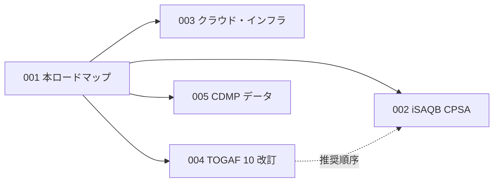

# Plan 001: アーキテクト資格試験対策プラットフォームのカテゴリ体系とロードマップを確立する

> **Executor instructions**: 本計画はプラットフォーム全体の方針文書であり、コード変更を伴わない「意思決定の記録 + 後続計画の前提」である。後続計画（002〜005）を実行する前に必ず本文書を読むこと。本文書自体に実装ステップはない。
>
> **Drift check**: `git diff --stat 06ca17c..HEAD -- web-next/components/site/nav-links.ts README.md`
> nav-links.ts のカテゴリ構造が変わっていた場合は「現状」節を実態と突き合わせてから後続計画に進むこと。

## Status

- **Priority**: P1
- **Effort**: S（方針文書のため）
- **Risk**: LOW
- **Depends on**: none
- **Category**: direction
- **Planned at**: commit `06ca17c`, 2026-07-06

## Why this matters

本リポジトリは「ソフトウェアアーキテクチャの日本語ガイド集 + web-next による Web 化」の二層構造を持つが、現状のコンテンツは設計手法・開発手法に偏っており、**アーキテクト職のキャリアを支える資格試験対策**という観点では TOGAF ガイド 1 本しかない。主要アーキテクト 4 領域（ソフトウェア設計 = iSAQB CPSA、クラウド・インフラ、エンタープライズ = TOGAF、データ = CDMP）を体系的にカバーし、資格改訂に追随できる仕組みを備えることで、本プラットフォームは「一度書いて陳腐化するガイド集」から「試験対策の最新情報をキャッチアップし続けられるプラットフォーム」へ進化する。

## 現状（Recon 結果）

### 二層構造

| 層 | 場所 | 規約 |
|---|---|---|
| コンテンツ層 | ルートの `<category>/<slug>-comprehensive-guide/` | 同名 `.md`（+ 移植済みなら `.html`）のペア。末尾に「参考文献・ソース一覧」必須 |
| Web 層 | `web-next/app/<category>/<slug>/page.tsx` | Next.js 16 App Router。ナビは `web-next/components/site/nav-links.ts` が単一真実源（未移行リンクも意図的に含み、移植完了で有効化される設計） |

### 既存カテゴリとカバレッジ（2026-07-06 時点）

| カテゴリ | ガイド数 | web-next 移植 | 資格対応 |
|---|---|---|---|
| `architecture/` | 6（Clean/EDA/Hexagonal/Microservices/Monolithic/SOA） | 6 ルート存在 | なし |
| `design-principles/` | 4（API-First/COD/DDD/OOP） | 2 移植 | なし |
| `development-methodologies/` | 4（BDD/XP/FDD/TDD） | 0 移植 | なし |
| `product-and-enterprise/` | 2（MVP/**TOGAF**） | 0 移植 | TOGAF のみ（ただし TOGAF 10 未対応の疑い → Plan 004） |
| `general/` | 1（総合ガイド） | 1 移植 | 国際資格の概観を含む |
| `css-design-system-guide/` | 5 | 2+ 移植 | なし |

### 検証コマンド（全後続計画の検証ゲート）

| 目的 | コマンド | 成功条件 |
|---|---|---|
| リンク検証 | ルートで `bun run check-links` | exit 0 |
| Markdown 整形 | `bun run format-markdown` / `bun run fix-markdown` | exit 0 |
| Web 層 lint | `cd web-next && bun run lint` | exit 0 |
| Web 層 型 | `cd web-next && bun run typecheck` | exit 0 |
| Web 層 テスト | `cd web-next && bun run test` | 全パス |
| Web 層 build | `cd web-next && bun run build` | exit 0 |

## 決定 1: カテゴリ体系 — ドメイン別を維持し、2 カテゴリを新設する

**推奨**: 資格専用の `certifications/` カテゴリは**新設しない**。資格ガイドは対応するドメインカテゴリに置く（TOGAF が `product-and-enterprise/` に置かれている既存判断を踏襲）。理由:

1. ナビゲーション（nav-links.ts）がドメイン別ドロップダウンで構成されており、学習者は「クラウドを学ぶ→資格も見つける」という動線をとる。資格を分離すると同一ドメインの知識ガイドと試験ガイドが分断される。
2. 資格は改廃されるがドメインは残る。カテゴリ名を資格名に依存させない方が長寿命。

**新設カテゴリ（2 つ）**:

| 新カテゴリ | 収容内容 | 対応資格 |
|---|---|---|
| `cloud-infrastructure/` | クラウドアーキテクチャ設計原則、IaC、コンテナ/K8s | AWS SAP-C02 / Azure AZ-305 / Google PCA / CKA |
| `data-management/` | DMBOK 知識領域、データモデリング、データガバナンス | CDMP（Associate/Practitioner/Master） |

**既存カテゴリへの追加**:

- iSAQB CPSA ガイド → `architecture/`（ソフトウェアアーキテクチャ資格の本丸。既存 6 ガイドが CPSA-F カリキュラムの技法各論に相当し、相互リンクで試験対策の導線を作れる）
- TOGAF 10 改訂 → `product-and-enterprise/`（現行位置を維持）

### 資格横断インデックス

ドメイン別配置の弱点（「資格一覧が一目でわからない」）は、`general/comprehensive-guide` に既にある国際資格セクションを拡張し、**資格→ガイドへのハブ**とすることで補う（Plan 002〜005 の各ガイド完成時にリンク追加）。

## 決定 2: web-next の拡張方針

- ルーティング規約 `/<category>/<slug>` を踏襲。新カテゴリは `web-next/app/cloud-infrastructure/`, `web-next/app/data-management/` を新設。
- `nav-links.ts` に新ドロップダウン「クラウド & インフラ」「データマネジメント」を追加。**未移植ページへのリンクを先に置いてよい**（ファイル冒頭コメントに「未移行ページへのリンクも意図的に含む」と明記された既存設計）。
- ページ移植は `.claude/skills/nextjs-page-migration/SKILL.md` の TDD 手順に従う。exemplar は `web-next/app/general/comprehensive-guide/page.tsx`。

## 決定 3: 最新情報キャッチアップの仕組み

資格は改訂される（実例: TOGAF 9→10 で資格名自体が変更、ISSAP は 2025 年にドメイン再編、iSAQB Advanced は新モジュール FM を追加）。仕組みは 3 層:

1. **参考文献の公式ソース原則**: 各ガイド末尾「参考文献・ソース一覧」には必ず認定団体の公式 URL（isaqb.org / opengroup.org / dama.org / aws.amazon.com / learn.microsoft.com / cloud.google.com）を含める。ブログ・予備校系 URL は補助に留める。
2. **週次リンクチェック CI の活用**: 既存の GitHub Actions（毎週月曜のリンクチェック）が公式 URL の死活を検知する。リンク切れ = 改訂・再編のシグナルとして扱い、検知時は該当ガイドの改訂要否を確認する運用とする。
3. **カリキュラム版数の明記**: 各資格ガイドの冒頭に「対象試験バージョン表」（例: `CPSA-F カリキュラム 2025.x / 確認日 2026-07-06`）を置く。版数が書いてあれば陳腐化が読者にも保守者にも見える。

### 資格改訂ウォッチ表（各ガイドが冒頭に持つべき情報の原本）

| 資格 | 認定団体 | 公式ウォッチ先 | 2026-07 時点の体系 |
|---|---|---|---|
| iSAQB CPSA-F/A | iSAQB | isaqb.org / public.isaqb.org | F: 40 問・75 分・60% 合格。A: 19 モジュール制 + 試験 |
| TOGAF EA | The Open Group | opengroup.org/certifications | 10th Edition。資格名は「TOGAF EA Foundation / Practitioner」（旧 9 Part1/2 と別体系） |
| CDMP | DAMA International | dama.org / cdmp.info | 全レベルで Data Management Fundamentals（100 問・90 分）必須。Associate/Practitioner/Master |
| AWS SAP-C02 | AWS | aws.amazon.com/certification | 75 問・180 分 |
| Azure AZ-305 | Microsoft | learn.microsoft.com | シナリオ型・約 120 分 |
| Google PCA | Google Cloud | cloud.google.com/learn/certification | ケーススタディ 2〜3 本を含む |

## 決定 4: 追加カテゴリの評価（採用 / 見送り）

| 候補 | 判定 | 理由 |
|---|---|---|
| セキュリティアーキテクチャ（CISSP/ISSAP） | **中期採用**（フェーズ 3） | アーキテクト 4 領域の次に需要が高い。ISSAP は 2025 年にドメイン再編済みで教材価値が高い。ただし主要 4 領域完了後 |
| Kubernetes（CKA/CKAD） | **採用（吸収）** | 独立カテゴリにせず `cloud-infrastructure/` 内の 1 ガイドとして扱う |
| ISTQB（テスト） | 見送り | テスト設計の知識は既存 TDD/BDD ガイドと重複が大きく、アーキテクト資格の主軸から外れる |
| ITIL / PMP | 見送り | 運用管理・プロジェクト管理はプラットフォームの「アーキテクチャ・設計」スコープ外 |
| ソフトウェア品質（SQuBOK 等） | 見送り（再評価可） | 日本語圏需要はあるが、まず国際資格 4 領域を完了させる |

## 実行フェーズ（後続計画の依存順序）

- **フェーズ 1（コンテンツ）**: 004（既存資産の改訂 = 最小努力で最大効果）→ 002 → 003 → 005。各計画は独立しており並行実行も可。
- **フェーズ 2（Web 化）**: 各ガイド完成後、nextjs-page-migration スキルで web-next へ移植（各計画内のオプションステップ）。
- **フェーズ 3（拡張）**: セキュリティアーキテクチャカテゴリの追加検討（本計画の再評価から開始）。

## Done criteria

- [x] カテゴリ体系・キャッチアップ機構・採否評価が本文書に記録されている
- [ ] 後続計画 002〜005 が本文書の決定に整合している（各計画の Done criteria で担保）

## Maintenance notes

- 新資格カテゴリを追加検討する際は、まず「決定 4」の表に候補行を追加し採否理由を記録すること（再監査の重複を防ぐ）。
- 資格改訂ウォッチ表の「体系」列は各ガイド改訂時に必ず同期すること。

## 参考文献・ソース一覧

- [iSAQB CPSA-Foundation Level Exam](https://www.isaqb.org/certifications/cpsa-exams/foundation-level-exam/)
- [iSAQB CPSA-Advanced Level](https://www.isaqb.org/certifications/cpsa-certifications/cpsa-advanced-level/)
- [The Open Group: TOGAF Certification Portfolio](https://www.opengroup.org/certifications/togaf-certification-portfolio)
- [TOGAF Examinations データシート (PDF)](https://certification.opengroup.org/docs/datasheets/togaf-exams.pdf)
- 補足: The Open Group ヘルプセンター（help.opengroup.org）の FAQ「What certifications are available for the TOGAF Standard, 10th Edition」も一次情報として有用だが、同ホストは自動リンクチェックをボットブロック（HTTP 403）するため URL 直リンクは記載しない（Plan 004 の Maintenance notes 参照）
- [DAMA CDMP Certification Levels](https://dama.org/certification/cdmp-certification-levels/)
- [DAMA CDMP Exam Information & Pricing](https://dama.org/certification/exam-information-and-pricing/)
- [AWS Certified Solutions Architect – Professional](https://aws.amazon.com/certification/certified-solutions-architect-professional/)
- [ISC2 ISSAP](https://www.isc2.org/certifications/issap)
