# 🏛️ TOGAF 完全試験ガイド

## 📚 目次

1. [TOGAFとは何か？](#1-togafとは何か)
2. [試験の種類と概要](#2-試験の種類と概要)
3. [ADM（アーキテクチャ開発手法）完全解説](#3-adm完全解説)
4. [アーキテクチャドメイン（BDAT）](#4-アーキテクチャドメインbdat)
5. [エンタープライズアーキテクチャの構成要素](#5-エンタープライズアーキテクチャの構成要素)
6. [アーキテクチャリポジトリ](#6-アーキテクチャリポジトリ)
7. [ステークホルダーマネジメント](#7-ステークホルダーマネジメント)
8. [ガバナンスとコンプライアンス](#8-ガバナンスとコンプライアンス)
9. [試験対策・ベストプラクティス](#9-試験対策ベストプラクティス)
10. [学習ロードマップ（7週間プラン）](#10-学習ロードマップ7週間プラン)
11. [参考文献・公式ソース](#11-参考文献公式ソース)

---

## 1. TOGAFとは何か？

### 1.1 TOGAFの定義

**TOGAF（The Open Group Architecture Framework）** は、The Open Groupが策定・維持する**エンタープライズアーキテクチャ（EA）のための世界標準フレームワーク**です。

> 💡 **一言で言うと：**「大企業・組織のIT戦略とビジネス戦略を整合させるための共通言語・方法論」

### 1.2 TOGAFが解決する問題

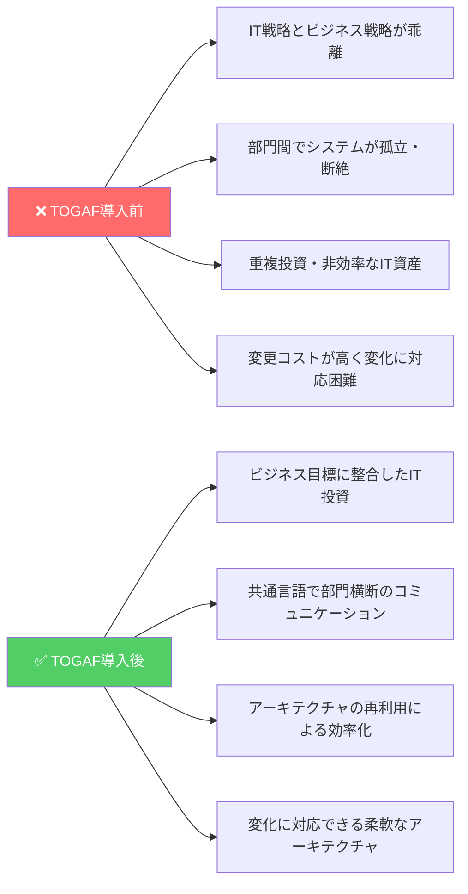

### 1.3 TOGAFの歴史と普及

| 年 | 出来事 |
|----|--------|
| 1995 | TOGAF 1.0 リリース（TAFIM from US DoD をベースに） |
| 2002 | TOGAF 8（Enterprise Edition）リリース |
| 2009 | **TOGAF 9** リリース（現在も広く使用） |
| 2018 | TOGAF 9.2 リリース |
| 2022 | **TOGAF Standard Version 10** リリース（最新版） |
| 2023 | 認定者数：世界206カ国・**10万人以上** |

### 1.4 TOGAFの位置づけ

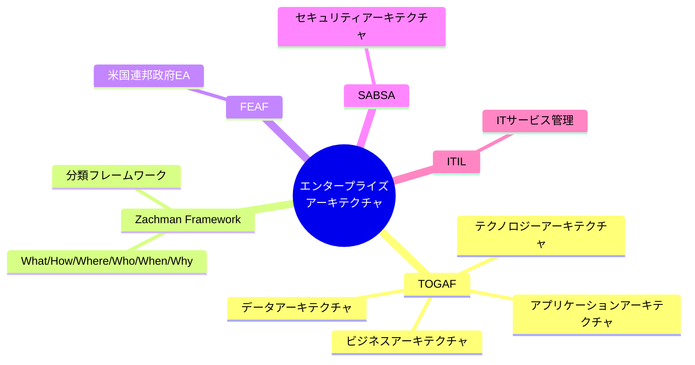

---

## 2. 試験の種類と概要

### 2.1 試験レベル構造

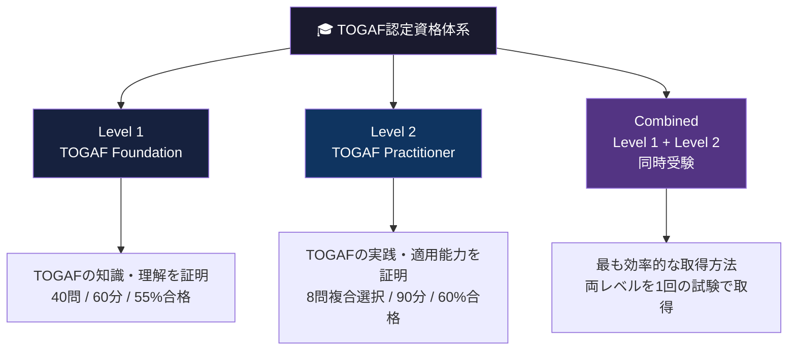

### 2.2 試験詳細比較表

| 項目 | Level 1 (Foundation) | Level 2 (Practitioner) | Combined |
|------|---------------------|----------------------|---------|
| **目的** | 知識・理解の証明 | 実践・適用能力の証明 | 両レベル同時取得 |
| **問題形式** | 多肢選択（1つ選ぶ） | 複合選択（複数選択・重み付け） | 両形式 |
| **問題数** | 40問 | 8問（各12.5点） | 40問＋8問 |
| **試験時間** | 60分 | 90分 | 150分 |
| **合格基準** | 55%（22/40問） | 60%（60/100点） | 両方クリア |
| **受験料** | 約$320 USD | 約$320 USD | 約$495 USD |
| **有効期限** | **無期限** | **無期限** | 無期限 |
| **持込み** | 不可 | **公式ドキュメント持込可** | 混合 |
| **難易度** | ★★★☆☆ | ★★★★☆ | ★★★★☆ |

> ⚠️ **重要：** Level 2は公式TOGAFドキュメントの持込みが可能です。ただし時間が限られるため、知識の内在化が必要です。

### 2.3 Level 2の問題形式（複合選択）

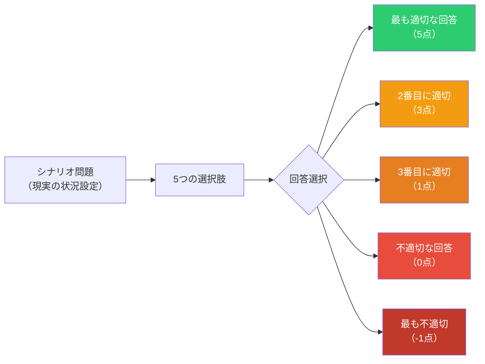

---

## 3. ADM完全解説

### 3.1 ADM（Architecture Development Method）とは

ADMはTOGAFの中核となる**反復的・循環的なアーキテクチャ開発プロセス**です。

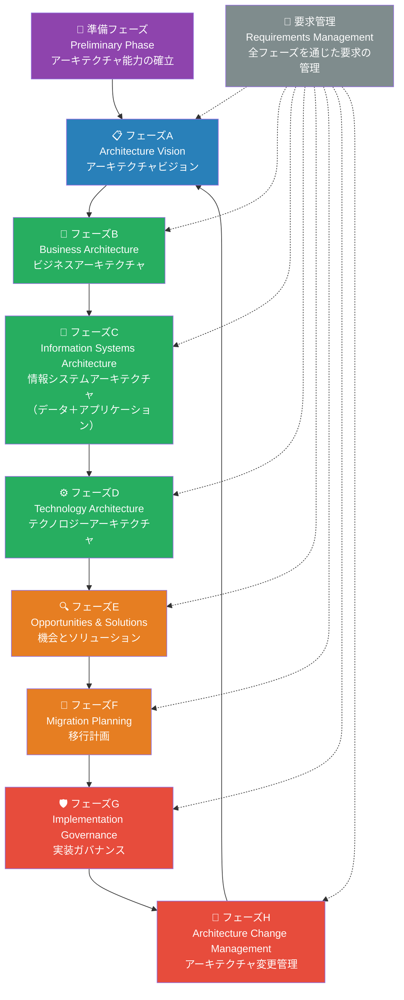

### 3.2 各フェーズの詳細解説

#### 準備フェーズ（Preliminary Phase）

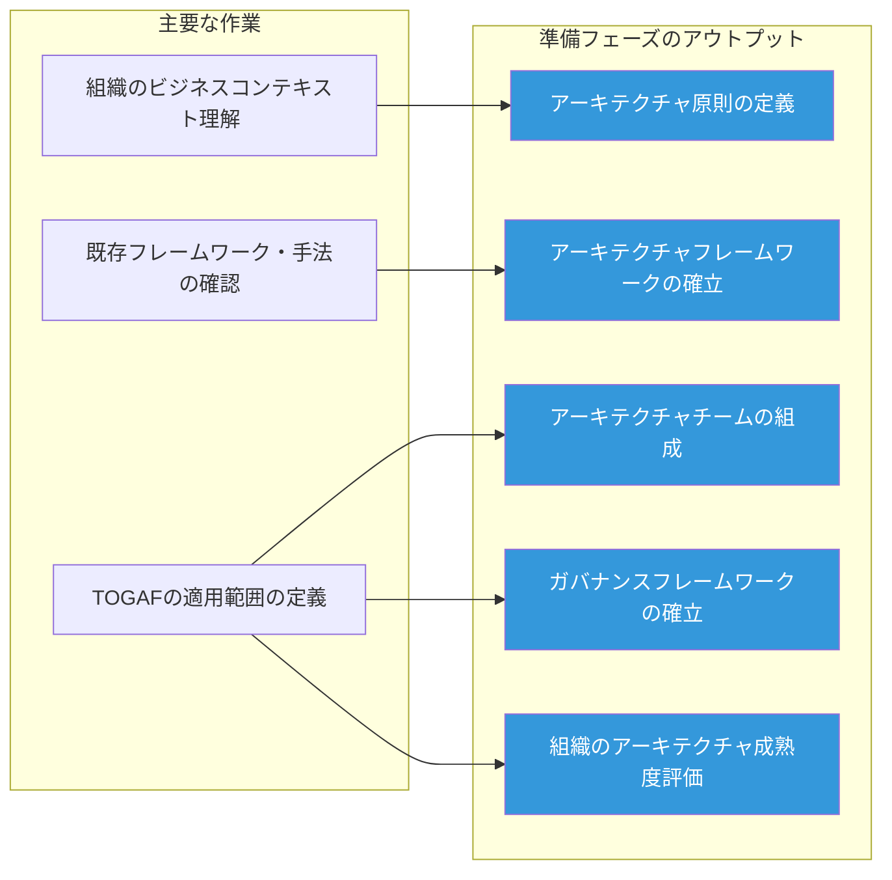

#### フェーズA：アーキテクチャビジョン

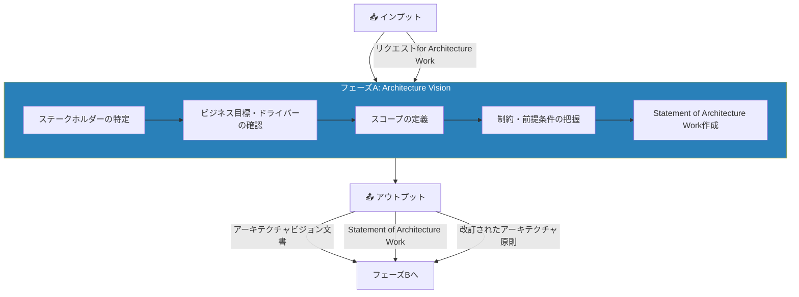

#### フェーズB・C・D：3つのアーキテクチャ開発

```mermaid
graph LR
    subgraph B["📋 フェーズB：ビジネスアーキテクチャ"]
        B1["ビジネスプロセスの現状分析"]
        B2["目標ビジネスアーキテクチャの設計"]
        B3["ギャップ分析の実施"]
    end

    subgraph C["💾 フェーズC：情報システムアーキテクチャ"]
        C1["データアーキテクチャ"]
        C2["アプリケーションアーキテクチャ"]
        C3["データモデルの設計"]
        C4["アプリケーションポートフォリオ整理"]
    end

    subgraph D["⚙️ フェーズD：テクノロジーアーキテクチャ"]
        D1["インフラ現状の分析"]
        D2["目標テクノロジーアーキテクチャの設計"]
        D3["クラウド・オンプレ選定"]
    end

    B --> C --> D

    style B fill:#27ae60,color:#fff
    style C fill:#16a085,color:#fff
    style D fill:#1abc9c,color:#fff
```

#### フェーズE・F：実装計画

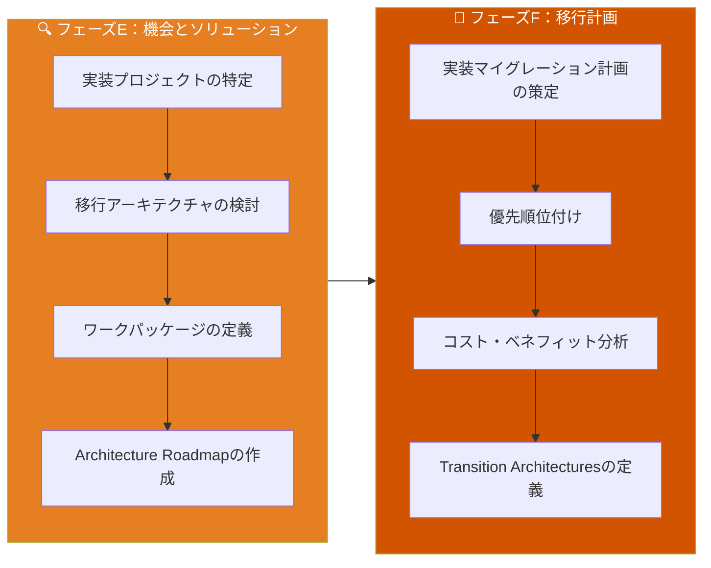

#### フェーズG・H：ガバナンスと変更管理

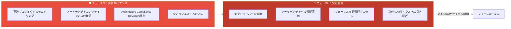

### 3.3 ADM各フェーズの入出力（試験頻出）

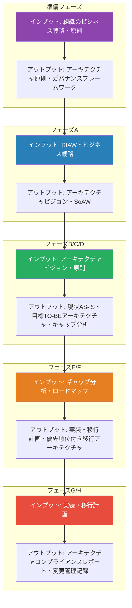

### 3.4 ギャップ分析（Gap Analysis）

TOGAFの中核技術の一つ。**AS-IS（現状）**から**TO-BE（目標）**へのギャップを特定します。

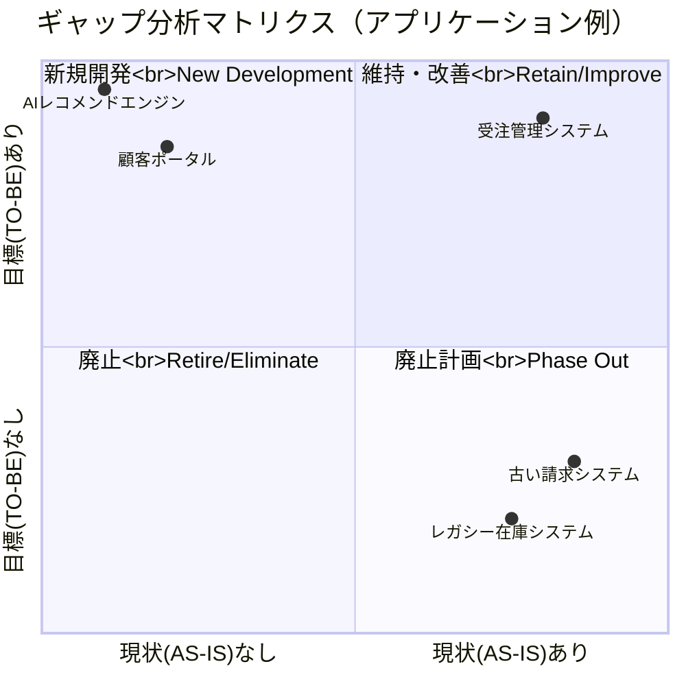

---

## 4. アーキテクチャドメイン（BDAT）

### 4.1 4つのアーキテクチャドメイン

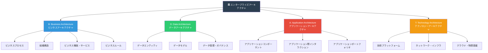

### 4.2 BDATの関係性と依存性

```mermaid
flowchart TD
    B["🏢 ビジネスアーキテクチャ<br>ビジネスニーズ・プロセス・組織"] 
    |-->|"ビジネス要件を定義"| 
    DA["💾 データアーキテクチャ<br>どんなデータが必要か"]
    
    B |-->|"機能要件を定義"| AP["📱 アプリケーションアーキテクチャ<br>どんなシステムが必要か"]
    
    DA |-->|"データストレージ要件"| T["⚙️ テクノロジーアーキテクチャ<br>どんな技術基盤が必要か"]
    
    AP |-->|"システム稼働要件"| T

    style B fill:#3498db,color:#fff
    style DA fill:#2ecc71,color:#fff
    style AP fill:#e74c3c,color:#fff
    style T fill:#f39c12,color:#fff
```

### 4.3 アーキテクチャビューとビューポイント

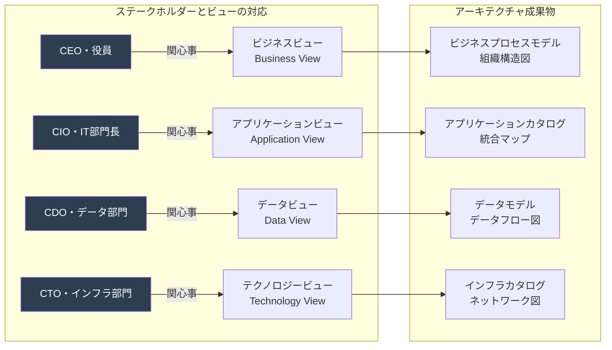

---

## 5. エンタープライズアーキテクチャの構成要素

### 5.1 アーキテクチャビルディングブロック（ABB）とソリューションビルディングブロック（SBB）

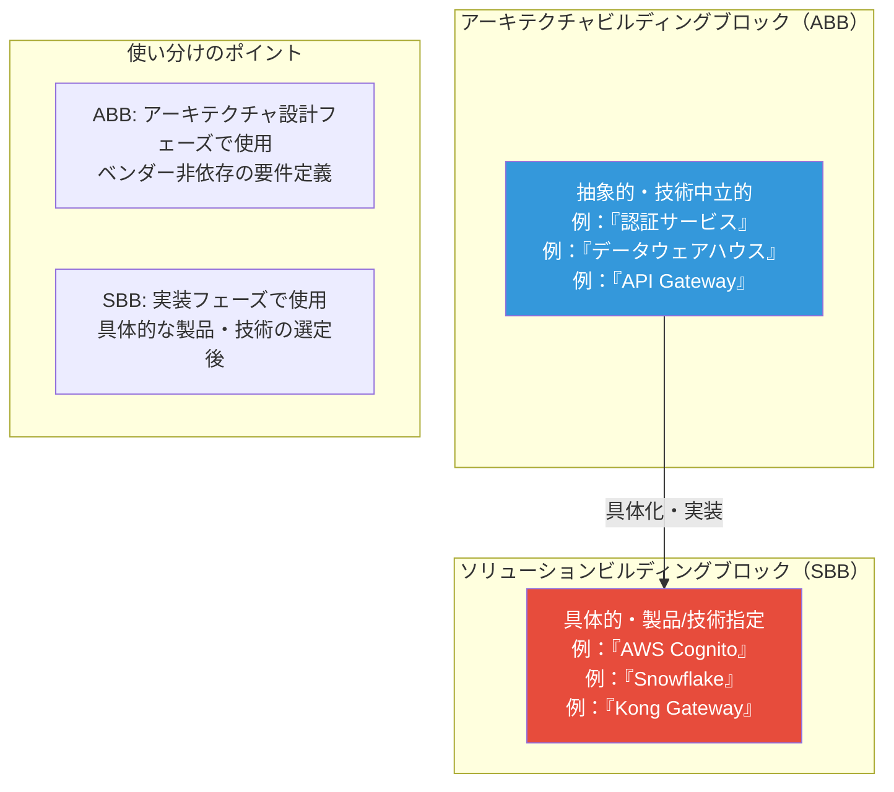

### 5.2 アーキテクチャ原則（Architecture Principles）

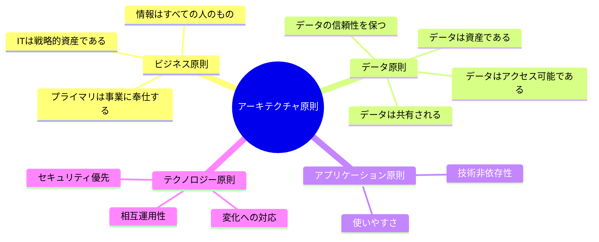

### 5.3 アーキテクチャ原則の構成要素（試験頻出）

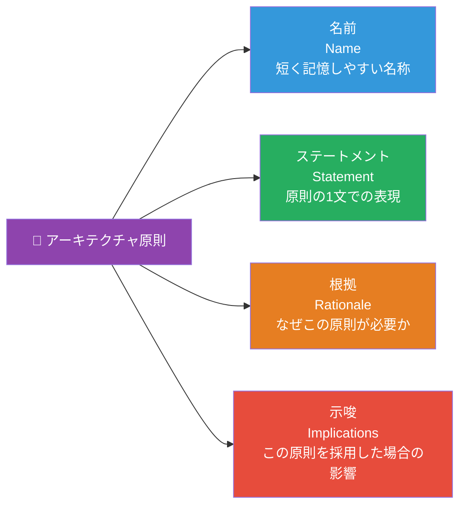

---

## 6. アーキテクチャリポジトリ

### 6.1 リポジトリの全体構造

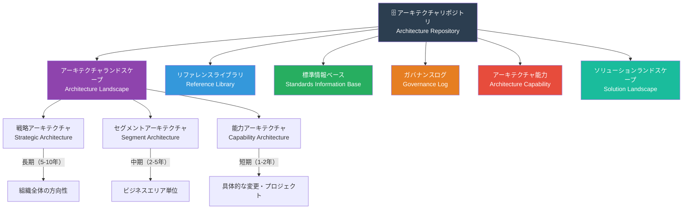

### 6.2 アーキテクチャランドスケープの3層構造

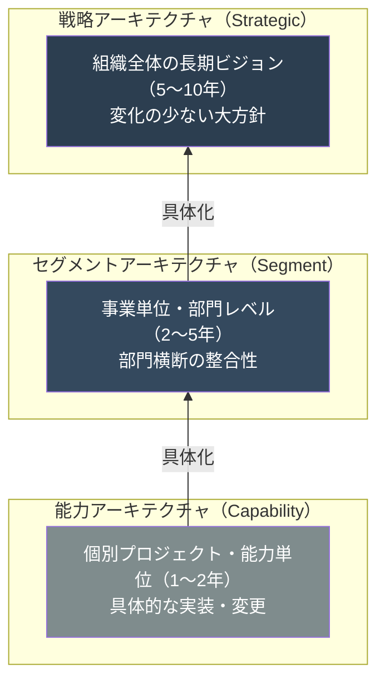

---

## 7. ステークホルダーマネジメント

### 7.1 ステークホルダーマップ

```mermaid
quadrantChart
    title ステークホルダー管理マトリクス
    x-axis 影響力（低い） --> 影響力（高い）
    y-axis 関心度（低い） --> 関心度（高い）
    quadrant-1 "密接に管理<br>Manage Closely"
    quadrant-2 "継続的な情報提供<br>Keep Informed"
    quadrant-3 "モニタリング<br>Monitor"
    quadrant-4 "満足を維持<br>Keep Satisfied"
    CEO: [0.9, 0.9]
    CIO: [0.85, 0.8]
    現場マネージャー: [0.4, 0.85]
    IT運用チーム: [0.5, 0.7]
    エンドユーザー: [0.3, 0.6]
    規制当局: [0.8, 0.3]
    ベンダー: [0.5, 0.4]
    株主: [0.9, 0.35]
```

### 7.2 ステークホルダーの関心事（Concerns）マッピング

```mermaid
graph LR
    subgraph "経営層"
        C_EXEC["コスト削減<br>ROI・競争優位性<br>リスク管理<br>規制対応"]
    end

    subgraph "IT部門"
        C_IT["技術的負債の解消<br>システム信頼性<br>セキュリティ<br>保守性・拡張性"]
    end

    subgraph "ビジネス部門"
        C_BIZ["業務効率化<br>使いやすさ<br>データアクセス<br>プロセス改善"]
    end

    subgraph "エンドユーザー"
        C_USER["使いやすいUI<br>システム速度<br>データの正確性<br>サポート"]
    end

    EA["🏛️ エンタープライズ<br>アーキテクチャ"] --> C_EXEC
    EA --> C_IT
    EA --> C_BIZ
    EA --> C_USER

    style EA fill:#2c3e50,color:#fff
```

---

## 8. ガバナンスとコンプライアンス

### 8.1 アーキテクチャガバナンスの構造

```mermaid
graph TD
    subgraph "ガバナンス組織階層"
        BOARD["経営委員会・取締役会"] --> IT_GOV["IT投資委員会"]
        IT_GOV --> ARCH_BOARD["アーキテクチャボード<br>Architecture Board"]
        ARCH_BOARD --> PROJ["プロジェクト・プログラム"]
    end

    subgraph "アーキテクチャボードの役割"
        AB1["アーキテクチャ方針の策定・維持"]
        AB2["コンプライアンスレビューの実施"]
        AB3["例外申請の承認・却下"]
        AB4["アーキテクチャ原則の管理"]
        AB5["アーキテクチャ成果物の承認"]
    end

    ARCH_BOARD --> AB1
    ARCH_BOARD --> AB2
    ARCH_BOARD --> AB3
    ARCH_BOARD --> AB4
    ARCH_BOARD --> AB5

    style BOARD fill:#2c3e50,color:#fff
    style IT_GOV fill:#34495e,color:#fff
    style ARCH_BOARD fill:#8e44ad,color:#fff
```

### 8.2 アーキテクチャコンプライアンスの種類

```mermaid
graph LR
    subgraph "コンプライアンスレベル"
        CONF["✅ Conformant<br>適合<br>アーキテクチャに完全準拠"]
        PART["⚠️ Partially Conformant<br>部分適合<br>一部準拠・改善計画あり"]
        NON["❌ Non-Conformant<br>不適合<br>アーキテクチャに準拠していない"]
        IRR["📋 Irrelevant<br>対象外<br>このアーキテクチャは適用外"]
    end

    REQ["プロジェクト要件"] --> CONF
    REQ --> PART
    REQ --> NON
    REQ --> IRR

    CONF --> OK["そのまま進行可能"]
    PART --> ACT["改善計画の策定が必要"]
    NON --> ESC["例外申請またはアーキテクチャ変更"]
    IRR --> EXC["対象外として記録"]

    style CONF fill:#27ae60,color:#fff
    style PART fill:#f39c12,color:#fff
    style NON fill:#e74c3c,color:#fff
    style IRR fill:#95a5a6,color:#fff
```

### 8.3 アーキテクチャコントラクト

```mermaid
flowchart LR
    A["アーキテクチャチーム"] <--> |"アーキテクチャコントラクト<br>Architecture Contract"| B["実装チーム<br>（プロジェクト）"]

    subgraph "コントラクトの内容"
        C1["アーキテクチャ要件・制約"]
        C2["適合性の基準"]
        C3["成果物の承認基準"]
        C4["変更管理プロセス"]
        C5["ガバナンス要件"]
    end

    B --> C1
    B --> C2
    B --> C3
    B --> C4
    B --> C5

    style A fill:#3498db,color:#fff
    style B fill:#e74c3c,color:#fff
```

---

## 9. 試験対策・ベストプラクティス

### 9.1 Level 1 試験の頻出テーマ

```mermaid
pie title Level 1 出題比率（目安）
    "ADMの各フェーズ理解" : 35
    "アーキテクチャドメインBDAT" : 20
    "TOGAFの基本概念・用語" : 20
    "アーキテクチャリポジトリ" : 10
    "ガバナンス・コンプライアンス" : 10
    "ステークホルダーマネジメント" : 5
```

### 9.2 Level 2 試験の頻出テーマ

```mermaid
pie title Level 2 出題比率（目安）
    "ADMの適用・シナリオ分析" : 40
    "ガバナンスの実践" : 20
    "ステークホルダーマネジメント" : 15
    "変更管理の実践" : 15
    "アーキテクチャコントラクト" : 10
```

### 9.3 必ず覚えるべき重要用語 TOP 20

```mermaid
mindmap
    root((TOGAF必須用語))
        ADM関連
            Architecture Vision
            Statement of Architecture Work
            Architecture Definition Document
            Architecture Requirements Specification
            Architecture Roadmap
            Transition Architecture
        組織・ガバナンス
            Architecture Board
            Architecture Contract
            Architecture Compliance
            Architecture Governance
            Architecture Capability
        成果物
            Architecture Building Block（ABB）
            Solution Building Block（SBB）
            Architecture Landscape
            Architecture Repository
        手法
            Gap Analysis
            Ubiquitous Language
            Stakeholder Map
            Architecture Principle
            Requirements Management
```

### 9.4 Level 2 問題の解き方フレームワーク

```mermaid
flowchart TD
    Q["問題文を読む"] --> S["シナリオの状況を把握する<br>• 何の組織か<br>• 何の問題が起きているか<br>• 現在のフェーズはどこか"]
    S --> R["TOGAFのどの概念が<br>適用されるか特定する"]
    R --> C["各選択肢を評価する<br>• TOGAFのベストプラクティスに合致するか<br>• ADMのシーケンスを守っているか<br>• ガバナンスを尊重しているか"]
    C --> A["最適な選択肢を選ぶ<br>（公式ドキュメントで確認）"]

    subgraph "陥りやすい罠"
        T1["直感に頼りすぎる（TOGAF視点で考える）"]
        T2["ADMのフェーズ順序を無視する"]
        T3["ステークホルダー関与を軽視する"]
        T4["ガバナンスプロセスをスキップする答えを選ぶ"]
    end

    A --> T1

    style Q fill:#2c3e50,color:#fff
    style A fill:#27ae60,color:#fff
    style T1 fill:#e74c3c,color:#fff
    style T2 fill:#e74c3c,color:#fff
    style T3 fill:#e74c3c,color:#fff
    style T4 fill:#e74c3c,color:#fff
```

### 9.5 ベストプラクティス：合格のための10箇条

| # | ベストプラクティス | 詳細 |
|---|----------------|------|
| 1 | **ADMのフロー完全暗記** | 準備フェーズ〜フェーズHまでの順序と目的を暗記する |
| 2 | **各フェーズの入出力を理解** | どのフェーズで何を作成し、何を次に渡すか |
| 3 | **BDAT を体系的に理解** | ビジネス→データ→アプリ→テクノロジーの依存関係 |
| 4 | **ギャップ分析の手法をマスター** | AS-ISとTO-BEの差分特定が試験で頻出 |
| 5 | **ABBとSBBの違いを完全理解** | 抽象（ABB）vs具体（SBB）の区別 |
| 6 | **ガバナンスプロセスを重視** | TOGAFは必ずガバナンスを通すことを前提とする |
| 7 | **公式ドキュメント（Level 2）の活用** | タブインデックスを貼り、素早く参照できるようにする |
| 8 | **模擬試験を最低200問解く** | 問題のパターンと罠を把握する |
| 9 | **ステークホルダー視点で考える** | 誰の関心事（Concerns）に答えているかを常に考える |
| 10 | **TOGAFの「考え方」を内在化** | 暗記でなく、なぜそうするかの論理を理解する |

---

## 10. 学習ロードマップ（7週間プラン）

### 10.1 全体スケジュール

```mermaid
gantt
    title TOGAF試験合格 7週間学習プラン
    dateFormat  YYYY-MM-DD
    section 基礎理解
        TOGAFとは・歴史・背景          :a1, 2025-01-01, 3d
        BDATアーキテクチャドメイン      :a2, after a1, 4d
    section ADM習得
        ADM準備〜フェーズD             :b1, after a2, 7d
        ADM フェーズE〜H・要求管理      :b2, after b1, 7d
    section 発展学習
        アーキテクチャリポジトリ        :c1, after b2, 4d
        ガバナンス・コンプライアンス     :c2, after c1, 3d
        ステークホルダーマネジメント     :c3, after c2, 3d
    section 試験対策
        模擬試験（100問）・弱点洗い出し  :d1, after c3, 3d
        模擬試験（150問以上）・復習      :d2, after d1, 4d
        最終確認・キーワード整理         :d3, after d2, 3d
```

### 10.2 週ごとの学習目標

```mermaid
graph LR
    W1["Week 1<br>🎯 TOGAF概要・BDAT<br>TOGAFとは何か<br>4つのドメイン理解"]
    W2["Week 2<br>🎯 ADM前半<br>準備〜フェーズD<br>各フェーズの目的・入出力"]
    W3["Week 3<br>🎯 ADM後半<br>フェーズE〜H<br>要求管理・反復サイクル"]
    W4["Week 4<br>🎯 成果物・リポジトリ<br>ABB/SBB・3層構造<br>アーキテクチャ原則"]
    W5["Week 5<br>🎯 ガバナンス<br>アーキテクチャボード<br>コンプライアンス4種"]
    W6["Week 6<br>🎯 模擬試験①<br>100問 + 弱点分析<br>間違えた箇所の再学習"]
    W7["Week 7<br>🎯 模擬試験②<br>150問 + 直前対策<br>キーワード・用語確認"]

    W1 --> W2 --> W3 --> W4 --> W5 --> W6 --> W7

    style W1 fill:#3498db,color:#fff
    style W2 fill:#3498db,color:#fff
    style W3 fill:#27ae60,color:#fff
    style W4 fill:#27ae60,color:#fff
    style W5 fill:#e67e22,color:#fff
    style W6 fill:#e74c3c,color:#fff
    style W7 fill:#e74c3c,color:#fff
```

### 10.3 学習リソースの優先順位

```mermaid
graph TD
    subgraph "必須リソース（Must）"
        M1["📘 TOGAF Standard Version 10<br>The Open Group公式"]
        M2["📝 公式サンプル問題（Level 1/2）<br>The Open Group提供"]
        M3["🎓 認定トレーニングプログラム<br>Accredited Training Course"]
    end

    subgraph "推奨リソース（Should）"
        S1["📚 TOGAF公式スタディガイド<br>The Open Group著"]
        S2["💻 模擬試験プラットフォーム<br>Whizlabs / ExamTopics等"]
        S3["🎥 動画コース<br>Udemy / Coursera等"]
    end

    subgraph "補足リソース（Nice-to-Have）"
        N1["🌐 TOGAF Wiki<br>コミュニティ解説"]
        N2["📖 関連書籍<br>EA関連の書籍"]
        N3["👥 学習コミュニティ<br>フォーラム・勉強会"]
    end

    M1 --> |"最重要"| M2
    M2 --> |"理解深化"| S1
    S1 --> |"補足"| N1

    style M1 fill:#e74c3c,color:#fff
    style M2 fill:#e74c3c,color:#fff
    style M3 fill:#e74c3c,color:#fff
    style S1 fill:#e67e22,color:#fff
    style S2 fill:#e67e22,color:#fff
    style S3 fill:#e67e22,color:#fff
    style N1 fill:#27ae60,color:#fff
    style N2 fill:#27ae60,color:#fff
    style N3 fill:#27ae60,color:#fff
```

---

## 11. 参考文献・公式ソース

### 📋 公式ドキュメント・URL

#### TOGAF公式

| リソース | URL |
|---------|-----|
| **TOGAF公式サイト（The Open Group）** | <https://www.opengroup.org/togaf> |
| **TOGAF Standard Version 10（公式標準）** | <https://www.opengroup.org/togaf> |
| **TOGAF認定資格プログラム** | <https://www.opengroup.org/certifications/togaf> |
| **公式サンプル試験問題** | <https://www.opengroup.org/certifications/togaf> |
| **認定トレーニングプロバイダー一覧** | <https://www.opengroup.org/certifications/togaf> |
| **TOGAF学習ポータル（The Open Group）** | <https://www.opengroup.org/certifications> |
| **TOGAF認定者検索** | <https://www.opengroup.org/certifications/professional-register> |

#### エンタープライズアーキテクチャ関連

| リソース | URL |
|---------|-----|
| **The Open Group Architecture Forum** | <https://www.opengroup.org/architecture> |
| **TOGAF ADM リファレンスガイド** | <https://pubs.opengroup.org/architecture/togaf9-doc/arch/> |
| **Zachman Framework** | <https://www.zachman.com/about-the-zachman-framework> |
| **FEAF（米国連邦政府EA）** | <https://www.cio.gov/> |

#### 学習プラットフォーム

| リソース | URL |
|---------|-----|
| **Udemy - TOGAF試験対策コース** | <https://www.udemy.com/topic/togaf/> |
| **Coursera - Enterprise Architecture** | <https://www.coursera.org/> |
| **LinkedIn Learning - TOGAF** | <https://www.linkedin.com/learning/topics/togaf> |
| **Whizlabs 模擬試験** | <https://www.whizlabs.com/togaf/> |

#### 試験申込・受験

| リソース | URL |
|---------|-----|
| **Pearson VUE 試験申込** | <https://home.pearsonvue.com/opengroup> |
| **試験センター検索（日本）** | <https://home.pearsonvue.com/Test-takers/Find-a-test-center.aspx> |
| **オンライン受験（OnVUE）** | <https://home.pearsonvue.com/opengroup/onvue> |

### 📚 推薦書籍

| タイトル | 著者 | 出版社 | 用途 |
|---------|------|--------|------|
| TOGAF® Standard, Version 9.2 | The Open Group | The Open Group | 公式テキスト |
| TOGAF® Standard, Version 10 | The Open Group | The Open Group | 最新公式テキスト |
| TOGAF® Version 9.1 Pocket Guide | Andrew Josey | Van Haren | 試験直前対策 |
| The Enterprise Architect's Handbook | Andrew Josey | The Open Group | 実践ガイド |
| Enterprise Architecture As Strategy | Ross, Weill, Robertson | Harvard Business Review | EA戦略理論 |

---

> 📅 本ドキュメントは2024年時点の情報を基に作成しています。試験情報・受験料・試験形式は変更される場合があります。受験前に必ず公式サイト（<https://www.opengroup.org/togaf>）をご確認ください。

---

*作成者： Software Architect Guide | バージョン 2.0 | TOGAF® Complete Exam Guide*

> ⚠️ **免責事項：** TOGAF® はThe Open
 Groupの登録商標です。本ドキュメントはThe Open Groupの公式資料ではありません。公式情報は必ず公式サイトでご確認ください。
