# 🏛️ SOA（サービス指向アーキテクチャ）完全ガイド
>
> 世界トップクラスのソフトウェアアーキテクトが解説する、初学者から実践者まで対応したSOA決定版

---

## 📚 目次

1. [SOAとは何か？](#1-soaとは何か)
2. [SOAの基本原則](#2-soaの基本原則)
3. [SOAの主要コンポーネント](#3-soaの主要コンポーネント)
4. [ESB（エンタープライズ・サービス・バス）](#4-esbエンタープライズサービスバス)
5. [サービスの設計パターン](#5-サービスの設計パターン)
6. [SOAとマイクロサービスの比較](#6-soaとマイクロサービスの比較)
7. [Webサービス技術スタック（SOAP / REST / WSDL）](#7-webサービス技術スタックsoap--rest--wsdl)
8. [サービスレジストリとサービスディスカバリ](#8-サービスレジストリとサービスディスカバリ)
9. [セキュリティ設計](#9-セキュリティ設計)
10. [データ管理とサービス間連携](#10-データ管理とサービス間連携)
11. [SOAガバナンス](#11-soaガバナンス)
12. [実装ステップバイステップ](#12-実装ステップバイステップ)
13. [実践：銀行基幹システム移行事例](#13-実践銀行基幹システム移行事例)
14. [監視・運用管理](#14-監視運用管理)
15. [SOAのベストプラクティス総まとめ](#15-soaのベストプラクティス総まとめ)
16. [SOAのアンチパターン](#16-soaのアンチパターン)
17. [参考文献・ソース一覧](#17-参考文献ソース一覧)

---

## 1. SOAとは何か？

### 1.1 SOAの定義

**SOA（Service-Oriented Architecture：サービス指向アーキテクチャ）** は、アプリケーションの機能を**再利用可能な独立したサービス**として設計・提供し、それらを組み合わせてビジネスプロセスを実現するアーキテクチャスタイルです。

2000年代初頭にエンタープライズシステムの統合課題を解決するために普及し、現在もレガシーシステム統合・大規模エンタープライズ・金融・官公庁系システムで広く採用されています。

> 💡 **核心思想：**「ビジネス機能をネットワーク越しに呼び出せる独立したサービスとして公開し、標準プロトコルで疎結合に連携させることで、システム全体の再利用性・柔軟性・相互運用性を高める」

### 1.2 SOAが生まれた背景

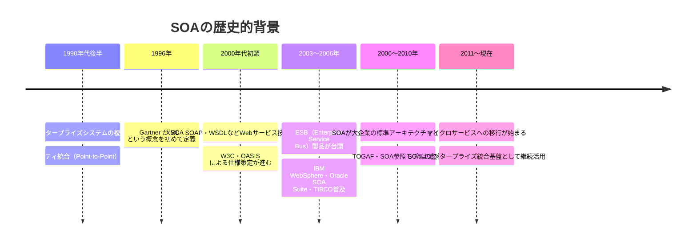

### 1.3 SOAが解決する問題

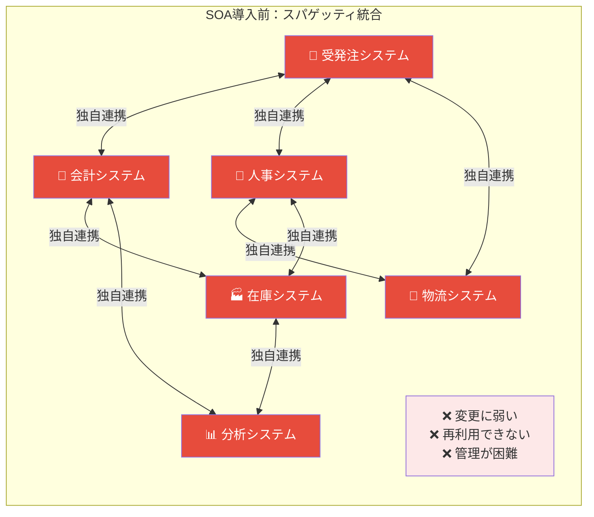

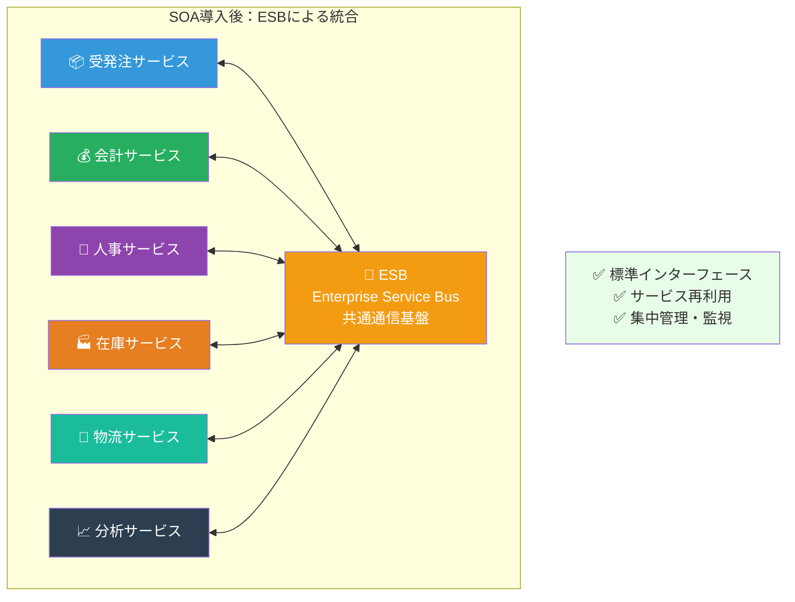

### 1.4 SOAの適用領域

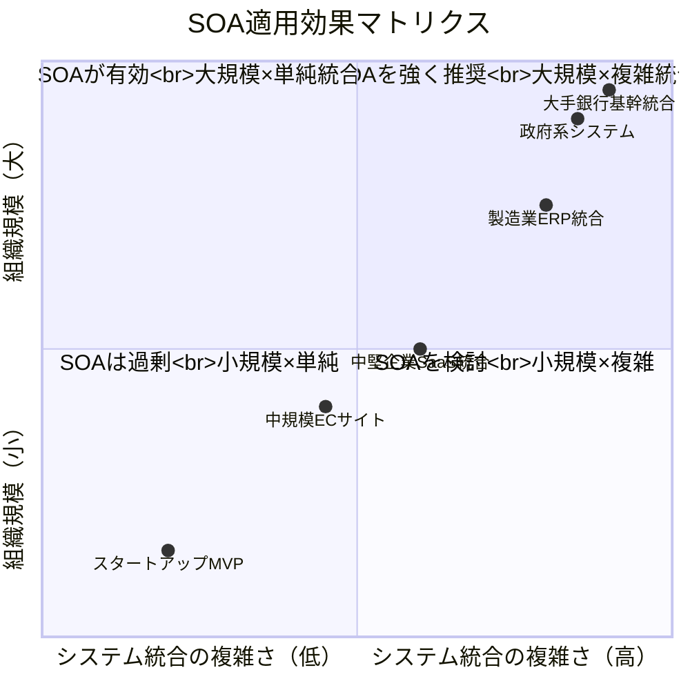

---

## 2. SOAの基本原則

### 2.1 SOA設計の8大原則（Thomas Erl の定義）

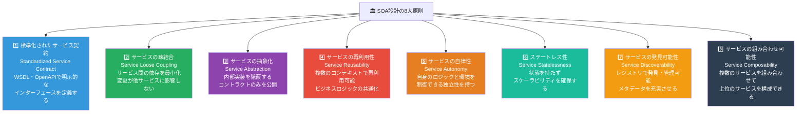

### 2.2 疎結合の実現方法

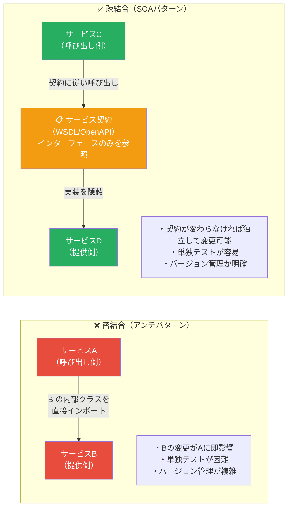

### 2.3 サービスの粒度（Granularity）の考え方

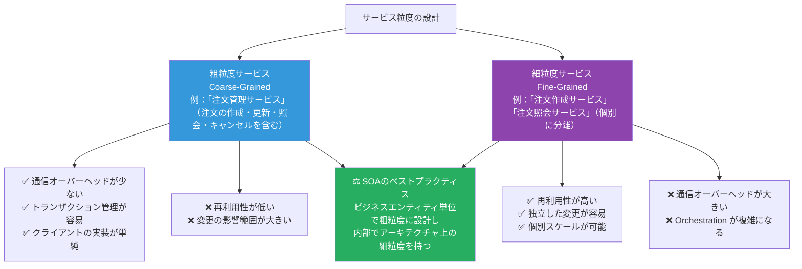

---

## 3. SOAの主要コンポーネント

### 3.1 SOAリファレンスアーキテクチャ

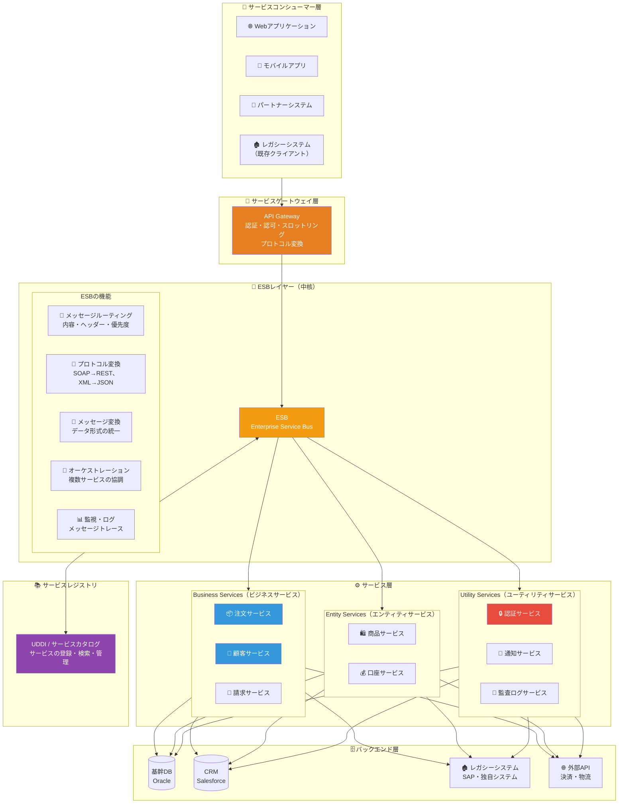

### 3.2 サービスの3つの分類

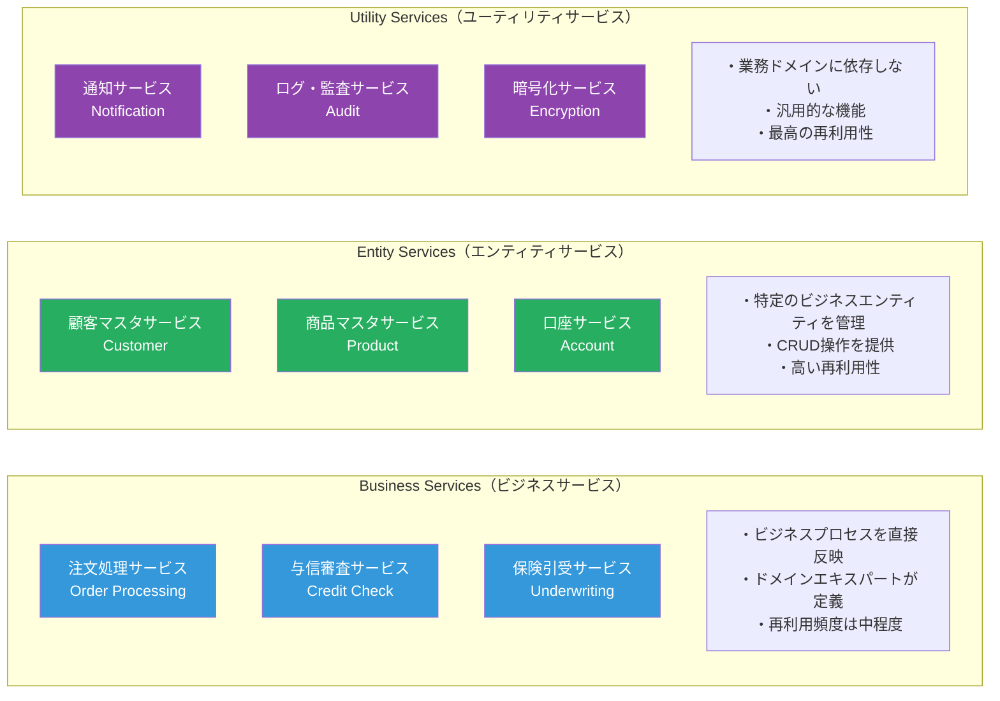

---

## 4. ESB（エンタープライズ・サービス・バス）

### 4.1 ESBの役割と機能

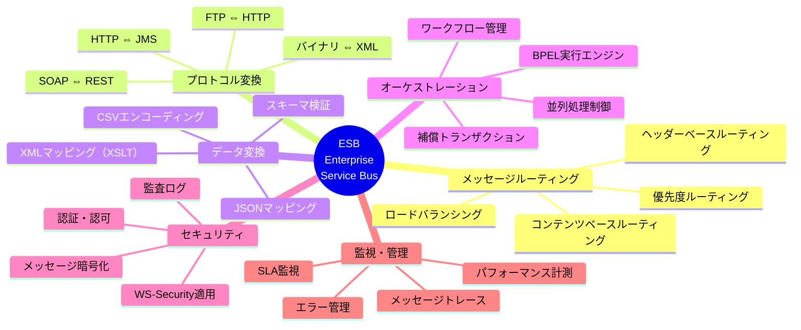

### 4.2 ESBのメッセージフロー

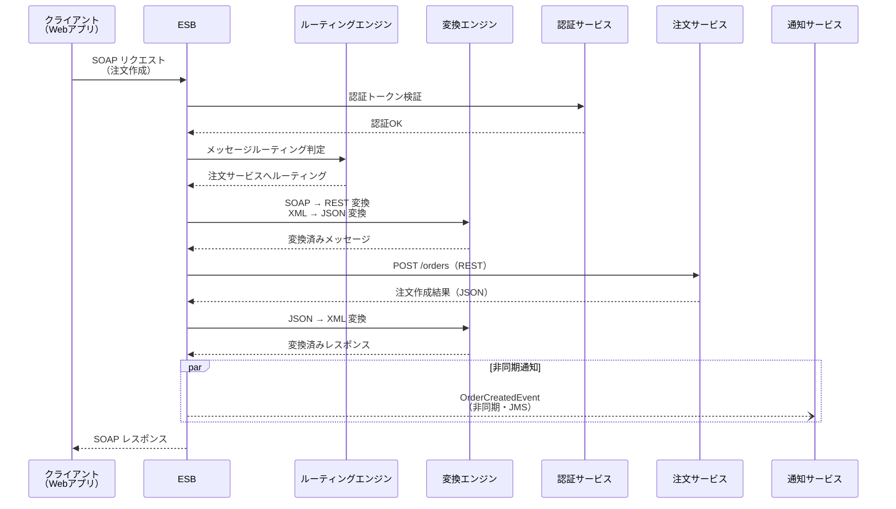

### 4.3 ESBと主要製品の比較

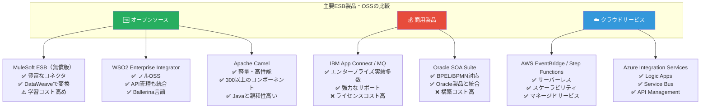

---

## 5. サービスの設計パターン

### 5.1 SOAの主要デザインパターン

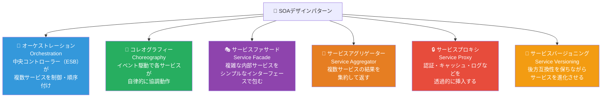

### 5.2 オーケストレーション vs コレオグラフィー

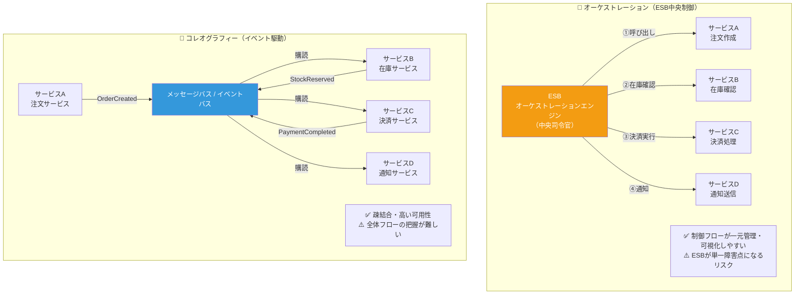

### 5.3 サービスバージョニング戦略

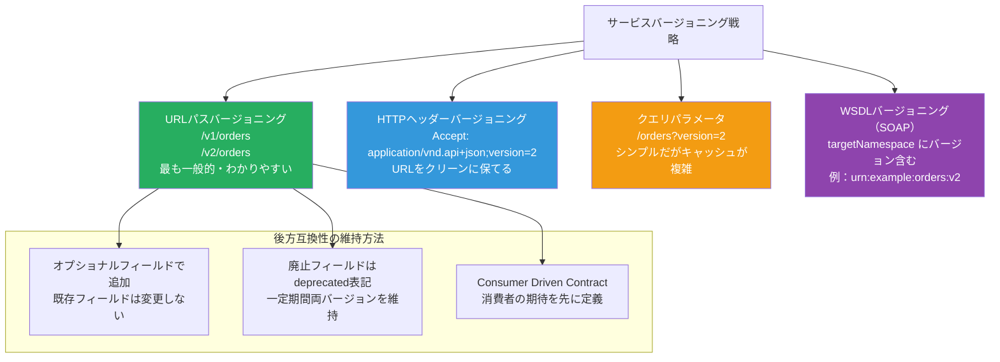

---

## 6. SOAとマイクロサービスの比較

### 6.1 詳細比較表

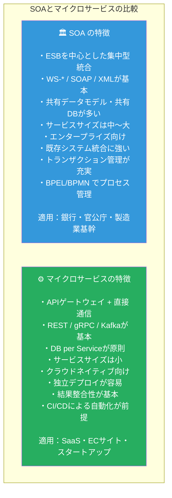

### 6.2 コミュニケーションモデルの違い

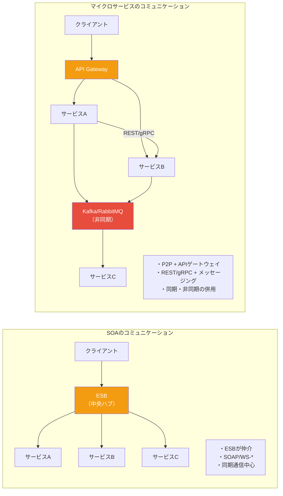

### 6.3 SOAからマイクロサービスへの移行判断

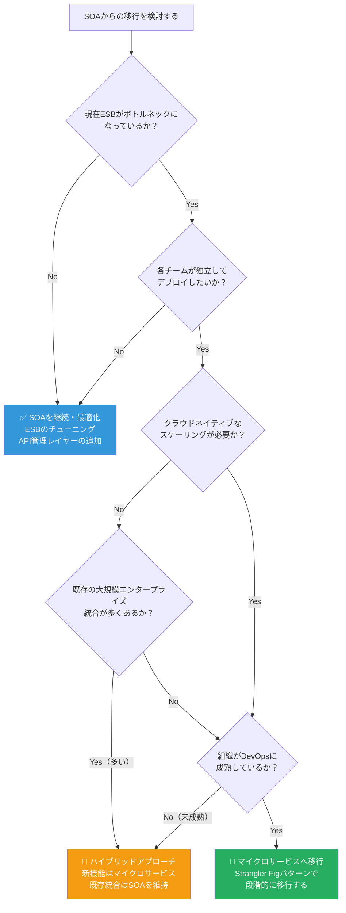

---

## 7. Webサービス技術スタック（SOAP / REST / WSDL）

### 7.1 SOAの技術スタック全体像

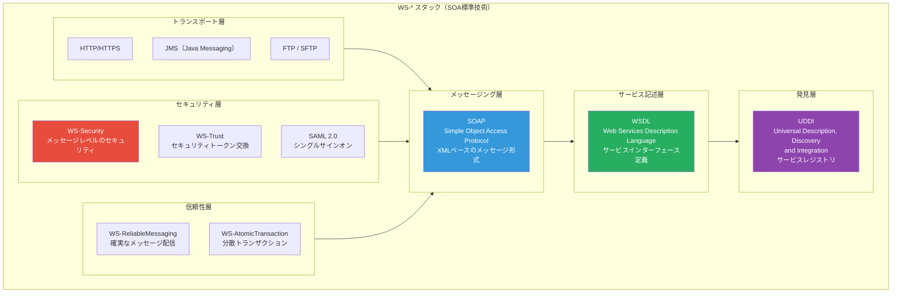

### 7.2 WSDLの構造

```xml
<!-- 注文サービスのWSDL定義例 -->

<?xml version="1.0" encoding="UTF-8"?>
<definitions name="OrderService"
    targetNamespace="urn:example:orderservice:v1"
    xmlns="http://schemas.xmlsoap.org/wsdl/"
    xmlns:soap="http://schemas.xmlsoap.org/wsdl/soap/"
    xmlns:tns="urn:example:orderservice:v1"
    xmlns:xsd="http://www.w3.org/2001/XMLSchema">

    <!-- 1. Types：データ型定義 -->
    <types>
        <xsd:schema targetNamespace="urn:example:orderservice:v1">
            <!-- 注文作成リクエスト -->
            <xsd:element name="CreateOrderRequest">
                <xsd:complexType>
                    <xsd:sequence>
                        <xsd:element name="customerId"  type="xsd:string"/>
                        <xsd:element name="productId"   type="xsd:string"/>
                        <xsd:element name="quantity"    type="xsd:int"/>
                        <xsd:element name="totalAmount" type="xsd:decimal"/>
                    </xsd:sequence>
                </xsd:complexType>
            </xsd:element>
            <!-- 注文作成レスポンス -->
            <xsd:element name="CreateOrderResponse">
                <xsd:complexType>
                    <xsd:sequence>
                        <xsd:element name="orderId" type="xsd:string"/>
                        <xsd:element name="status"  type="xsd:string"/>
                        <xsd:element name="message" type="xsd:string"/>
                    </xsd:sequence>
                </xsd:complexType>
            </xsd:element>
        </xsd:schema>
    </types>

    <!-- 2. Message：メッセージ定義 -->
    <message name="CreateOrderInput">
        <part name="parameters" element="tns:CreateOrderRequest"/>
    </message>
    <message name="CreateOrderOutput">
        <part name="parameters" element="tns:CreateOrderResponse"/>
    </message>

    <!-- 3. PortType：操作定義（抽象インターフェース）-->
    <portType name="OrderServicePortType">
        <operation name="createOrder">
            <input  message="tns:CreateOrderInput"/>
            <output message="tns:CreateOrderOutput"/>
        </operation>
    </portType>

    <!-- 4. Binding：プロトコルバインディング -->
    <binding name="OrderServiceSOAPBinding"
             type="tns:OrderServicePortType">
        <soap:binding style="document"
                      transport="http://schemas.xmlsoap.org/soap/http"/>
        <operation name="createOrder">
            <soap:operation soapAction="urn:createOrder"/>
            <input>
                <soap:body use="literal"/>
            </input>
            <output>
                <soap:body use="literal"/>
            </output>
        </operation>
    </binding>

    <!-- 5. Service：エンドポイント定義 -->
    <service name="OrderService">
        <port name="OrderServicePort"
              binding="tns:OrderServiceSOAPBinding">
            <soap:address
                location="https://api.example.com/ws/order-service/v1"/>
        </port>
    </service>

</definitions>
```

### 7.3 SOAPメッセージの構造

```xml
<!-- SOAPリクエストメッセージ -->
<soapenv:Envelope
    xmlns:soapenv="http://schemas.xmlsoap.org/soap/envelope/"
    xmlns:ord="urn:example:orderservice:v1">

    <!-- ヘッダー：セキュリティ・メタデータ -->
    <soapenv:Header>
        <wsse:Security
            xmlns:wsse="http://docs.oasis-open.org/wss/...">
            <wsse:UsernameToken>
                <wsse:Username>service_account</wsse:Username>
                <wsse:Password>{{encrypted_password}}</wsse:Password>
            </wsse:UsernameToken>
        </wsse:Security>
        <!-- 相関ID（トレーサビリティ）-->
        <ord:CorrelationId>550e8400-e29b-41d4-a716</ord:CorrelationId>
    </soapenv:Header>

    <!-- ボディ：実際のリクエストデータ -->
    <soapenv:Body>
        <ord:CreateOrderRequest>
            <ord:customerId>CUST-001</ord:customerId>
            <ord:productId>PROD-ABC</ord:productId>
            <ord:quantity>3</ord:quantity>
            <ord:totalAmount>15000.00</ord:totalAmount>
        </ord:CreateOrderRequest>
    </soapenv:Body>

</soapenv:Envelope>
```

### 7.4 SOAP vs REST の使い分け判断

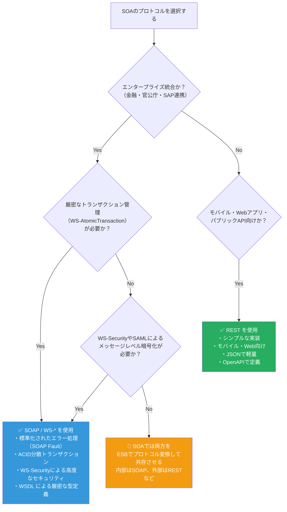

---

## 8. サービスレジストリとサービスディスカバリ

### 8.1 サービスレジストリの役割

```mermaid
graph TD
    subgraph REGISTRY_FLOW["📚 サービスレジストリの役割"]
        REGISTRY_CORE["サービスレジストリ<br>（UDDI / カスタムカタログ）"]

        subgraph REGISTRY_INFO["登録される情報"]
            META1["サービス名・バージョン"]
            META2["エンドポイントURL"]
            META3["WSDLの場所"]
            META4["SLA（応答時間・可用性）"]
            META5["オーナー・連絡先"]
            META6["依存サービス一覧"]
            META7["テスト・本番環境URL"]
        end

        PROVIDER["サービス提供者<br>（Service Provider）"]
        CONSUMER_R["サービス消費者<br>（Service Consumer）"]

        PROVIDER -->|"① サービスを登録"| REGISTRY_CORE
        CONSUMER_R -->|"② サービスを検索"| REGISTRY_CORE
        REGISTRY_CORE -->|"③ エンドポイントを返す"| CONSUMER_R
        CONSUMER_R -->|"④ サービスを呼び出す"| PROVIDER
    end

    REGISTRY_CORE --- META1 & META2 & META3 & META4 & META5 & META6 & META7

    style REGISTRY_CORE fill:#8e44ad,color:#fff
    style PROVIDER fill:#27ae60,color:#fff
    style CONSUMER_R fill:#3498db,color:#fff
```

### 8.2 サービスカタログの実装例

```yaml
# サービスカタログ定義例（YAML形式）

services:
  - name: "order-service"
    version: "v2.1.0"
    description: "注文の作成・照会・キャンセルを管理するサービス"
    owner: "注文チーム"
    contact: "order-team@example.com"

    endpoints:
      production:
        soap: "https://api.example.com/ws/order/v2?wsdl"
        rest: "https://api.example.com/rest/v2/orders"
      staging:
        soap: "https://staging-api.example.com/ws/order/v2?wsdl"
        rest: "https://staging-api.example.com/rest/v2/orders"

    sla:
      availability: "99.9%"
      response_time_p99: "500ms"
      maintenance_window: "毎週日曜 02:00-04:00 JST"

    protocols:
      - "SOAP 1.1"
      - "REST/JSON"

    security:
      - "WS-Security UsernameToken"
      - "OAuth 2.0 Bearer Token"

    dependencies:
      - "customer-service:v1"
      - "inventory-service:v2"
      - "payment-service:v1"

    documentation: "https://wiki.example.com/order-service"
    wsdl: "https://api.example.com/ws/order/v2?wsdl"
    openapi: "https://api.example.com/rest/v2/orders/openapi.json"

    tags:
      - "core"
      - "order-management"
      - "business-critical"
```

---

## 9. セキュリティ設計

### 9.1 SOAのセキュリティレイヤー

```mermaid
graph TD
    subgraph SOA_SECURITY["🔒 SOAセキュリティアーキテクチャ"]
        subgraph PERIMETER["境界セキュリティ"]
            FIREWALL["🛡️ ファイアウォール / DMZ"]
            WAF2["🛡️ WAF（Webアプリケーションファイアウォール）"]
        end

        subgraph TRANSPORT_SEC["トランスポートセキュリティ"]
            TLS_SOA["🔐 TLS 1.3 / HTTPS<br>通信経路の暗号化"]
            MTLS_SOA["🔏 mTLS（相互TLS）<br>サービス間の相互認証"]
        end

        subgraph MSG_SEC["メッセージセキュリティ（WS-Security）"]
            XML_ENC["🔑 XML Encryption<br>メッセージボディの暗号化"]
            XML_SIG["✍️ XML Signature<br>メッセージの完全性検証"]
            WS_TOKEN["🎫 セキュリティトークン<br>SAML / X.509証明書 / Kerberos"]
        end

        subgraph IDENTITY["ID管理・認証認可"]
            SSO["🔑 SSO（シングルサインオン）<br>SAML 2.0 / OpenID Connect"]
            RBAC_SOA["🛡️ RBAC（役割ベースアクセス制御）<br>サービス操作レベルで権限管理"]
            OAUTH_SOA["🎫 OAuth 2.0<br>APIアクセス認可"]
        end

        subgraph AUDIT["監査・コンプライアンス"]
            AUDIT_LOG["📝 監査ログ<br>全メッセージの記録"]
            COMPLIANCE["📋 コンプライアンス<br>PCI-DSS / SOX / GDPR対応"]
        end
    end

    PERIMETER --> TRANSPORT_SEC --> MSG_SEC --> IDENTITY --> AUDIT

    style FIREWALL fill:#e74c3c,color:#fff
    style TLS_SOA fill:#3498db,color:#fff
    style XML_ENC fill:#8e44ad,color:#fff
    style SSO fill:#27ae60,color:#fff
    style AUDIT_LOG fill:#f39c12,color:#fff
```

### 9.2 WS-Securityの実装フロー

```mermaid
sequenceDiagram
    participant CLIENT_SEC as サービスコンシューマー
    participant STS as Security Token Service<br>（STS）
    participant ESB_SEC as ESB
    participant SVC as ビジネスサービス

    Note over CLIENT_SEC,SVC: WS-Trust / WS-Security フロー

    CLIENT_SEC->>STS: セキュリティトークン要求<br>（RST: RequestSecurityToken）
    STS->>STS: 認証・認可チェック
    STS-->>CLIENT_SEC: SAMLトークン発行<br>（RSTR: RequestSecurityTokenResponse）

    CLIENT_SEC->>ESB_SEC: SOAPリクエスト<br>（WS-Securityヘッダー + SAMLトークン）
    ESB_SEC->>STS: トークン検証
    STS-->>ESB_SEC: 検証OK

    ESB_SEC->>ESB_SEC: ルーティング・変換

    ESB_SEC->>SVC: サービス呼び出し<br>（サービス間認証: mTLS）
    SVC-->>ESB_SEC: レスポンス

    ESB_SEC->>ESB_SEC: XML Signature で<br>レスポンスに署名
    ESB_SEC-->>CLIENT_SEC: 署名済みSOAPレスポンス
```

---

## 10. データ管理とサービス間連携

### 10.1 SOAのデータ共有パターン

```mermaid
graph TD
    subgraph "データ共有の3パターン"
        P1_SHARED["📊 パターン1：共有データモデル<br>（SOAで一般的）<br>共通スキーマをすべてのサービスが参照<br>Enterprise Data Model（EDM）"]

        P2_CANONICAL["📋 パターン2：カノニカルデータモデル<br>（ESBで変換）<br>サービスは独自モデルを持ち<br>ESBが標準形式に変換"]

        P3_EVENT["📨 パターン3：イベント駆動データ共有<br>（非同期）<br>データ変更をイベントとして発行<br>他サービスが購読・反映"]
    end

    P1_SHARED --> P1_PROS["✅ データの一貫性が高い<br>✅ 重複データが少ない<br>❌ サービス間の結合度が上がる"]
    P2_CANONICAL --> P2_PROS["✅ サービスが独立できる<br>✅ レガシー統合に強い<br>❌ ESBの変換ロジックが複雑化"]
    P3_EVENT --> P3_PROS["✅ 最大の疎結合<br>✅ 高いスケーラビリティ<br>❌ 結果整合性の管理が必要"]

    style P1_SHARED fill:#3498db,color:#fff
    style P2_CANONICAL fill:#27ae60,color:#fff
    style P3_EVENT fill:#8e44ad,color:#fff
```

### 10.2 SOAにおける分散トランザクション

```mermaid
flowchart TD
    subgraph "SOA分散トランザクション管理"
        ACID_SOA["🔒 WS-AtomicTransaction<br>（2フェーズコミット）<br>厳密なACIDトランザクション<br>同期・高コスト"]

        SAGA_SOA["🔄 Sagaパターン<br>補償トランザクション<br>各サービスがロールバック操作を持つ<br>SOAでもESBが調整可能"]

        COMPENSATE["↩️ 補償トランザクションの設計<br>OrderCreated → 失敗 → CancelOrder<br>PaymentCharged → 失敗 → RefundPayment<br>StockReserved → 失敗 → ReleaseStock"]
    end

    ACID_SOA -->|"厳密な整合性が必要な場合<br>金融・会計処理"| STRICT["金融取引・会計"]
    SAGA_SOA -->|"可用性重視の場合<br>注文・在庫処理"| EVENTUAL["注文・在庫管理"]
    COMPENSATE --> SAGA_SOA

    style ACID_SOA fill:#e74c3c,color:#fff
    style SAGA_SOA fill:#27ae60,color:#fff
    style COMPENSATE fill:#f39c12,color:#fff
```

---

## 11. SOAガバナンス

### 11.1 SOAガバナンスの構成要素

```mermaid
mindmap
    root((SOA<br>ガバナンス))
        設計ガバナンス
            サービス設計レビュー
            命名規約の統一
            インターフェース標準化
            バージョン管理ポリシー
        ライフサイクル管理
            サービスカタログ管理
            廃止・移行プロセス
            依存関係の追跡
            変更管理プロセス
        品質ガバナンス
            SLAの定義と監視
            パフォーマンスベンチマーク
            セキュリティ監査
            テスト標準化
        組織ガバナンス
            CoE（センター・オブ・エクセレンス）
            サービス所有者の明確化
            開発標準・ガイドライン
            教育・トレーニング
        技術ガバナンス
            承認済み技術スタック
            ESB設定の管理
            証明書・鍵の管理
            インフラ標準化
```

### 11.2 SOAガバナンスのライフサイクル

```mermaid
stateDiagram-v2
    [*] --> DESIGN : サービス設計開始

    DESIGN : 設計フェーズ
    DESIGN : ・要件定義・インターフェース設計
    DESIGN : ・レビュー・承認プロセス
    DESIGN : ・サービスカタログへの仮登録

    DEVELOPMENT : 開発フェーズ
    DEVELOPMENT : ・実装・ユニットテスト
    DEVELOPMENT : ・統合テスト
    DEVELOPMENT : ・セキュリティレビュー

    TESTING : テストフェーズ
    TESTING : ・SIT（システム統合テスト）
    TESTING : ・UAT（受け入れテスト）
    TESTING : ・パフォーマンステスト

    DEPLOYED : 本番稼働
    DEPLOYED : ・SLA監視
    DEPLOYED : ・バージョン管理
    DEPLOYED : ・変更管理

    DEPRECATED : 廃止予告
    DEPRECATED : ・後継サービスへの移行告知
    DEPRECATED : ・コンシューマーへの通知
    DEPRECATED : ・移行サポート

    RETIRED : 廃止完了
    RETIRED : ・レジストリから削除
    RETIRED : ・ドキュメントのアーカイブ

    DESIGN --> DEVELOPMENT : 設計承認
    DEVELOPMENT --> TESTING : 開発完了
    TESTING --> DEPLOYED : テスト合格
    DEPLOYED --> DEPRECATED : 廃止決定
    DEPRECATED --> RETIRED : 移行完了
    TESTING --> DESIGN : テスト不合格
    DEPLOYED --> DEVELOPMENT : 障害・改修
```

---

## 12. 実装ステップバイステップ

### 12.1 SOA導入の段階的ステップ

```mermaid
flowchart TD
    STEP1["Step 1：現状分析・As-Is設計<br>・既存システムのインベントリ作成<br>・インテグレーションの現状（スパゲッティ）を可視化<br>・ビジネスプロセスのマッピング<br>期間：4〜8週間"]

    STEP2["Step 2：SOAロードマップ策定<br>・ビジネス優先度に基づくサービス候補の選定<br>・To-Beアーキテクチャの設計<br>・ESB製品の選定・PoC<br>・ガバナンス体制の整備<br>期間：4〜8週間"]

    STEP3["Step 3：基盤整備<br>・ESBのインストール・設定<br>・サービスレジストリのセットアップ<br>・開発・テスト環境の構築<br>・セキュリティ基盤の整備<br>期間：4〜6週間"]

    STEP4["Step 4：パイロットサービスの実装<br>・最も価値の高い1〜3サービスを実装<br>・WSDLの設計・レビュー<br>・ESBへのデプロイ<br>・モニタリングの検証<br>期間：6〜12週間"]

    STEP5["Step 5：段階的サービス拡大<br>・パイロットの知見を横展開<br>・サービスカタログの充実<br>・チーム教育・ナレッジ共有<br>・ガバナンスの運用開始<br>期間：継続的"]

    STEP6["Step 6：継続的改善<br>・SLA達成状況の評価<br>・サービスの最適化・リファクタリング<br>・新技術（APIマネジメント等）の導入<br>・マイクロサービスへの段階的移行検討<br>期間：継続的"]

    STEP1 --> STEP2 --> STEP3 --> STEP4 --> STEP5 --> STEP6

    style STEP1 fill:#e74c3c,color:#fff
    style STEP2 fill:#e67e22,color:#fff
    style STEP3 fill:#f39c12,color:#fff
    style STEP4 fill:#27ae60,color:#fff
    style STEP5 fill:#3498db,color:#fff
    style STEP6 fill:#8e44ad,color:#fff
```

### 12.2 サービス実装例（Python + Zeep SOAP クライアント）

```python
# ────────────────────────────────────────────────
# SOAサービス実装例（Python）
# ────────────────────────────────────────────────

# ─── SOAPサービス（zeep を使ったSOAPクライアント実装）───

from zeep import Client
from zeep.transports import Transport
from zeep.wsse.username import UsernameToken
import requests
import logging

logger = logging.getLogger(__name__)


class OrderServiceClient:
    """
    注文サービスSOAPクライアント
    WS-Securityによる認証付き
    """

    WSDL_URL = "https://api.example.com/ws/order-service/v2?wsdl"

    def __init__(self, username: str, password: str, timeout: int = 30):
        session = requests.Session()
        session.verify = "/path/to/ca-bundle.crt"  # TLS証明書検証

        transport = Transport(
            session=session,
            timeout=timeout,
            operation_timeout=timeout
        )

        # WS-Security UsernameToken 認証
        wsse = UsernameToken(
            username=username,
            password=password,
            use_digest=True  # パスワードダイジェスト方式
        )

        self._client = Client(
            wsdl=self.WSDL_URL,
            transport=transport,
            wsse=wsse,
        )

    def create_order(
        self,
        customer_id: str,
        product_id: str,
        quantity: int,
        total_amount: float,
        correlation_id: str = None,
    ) -> dict:
        """
        注文を作成する（SOAP呼び出し）
        ESBを経由してバックエンドの注文サービスを呼び出す
        """
        import uuid
        corr_id = correlation_id or str(uuid.uuid4())

        logger.info(f"注文作成開始 correlationId={corr_id} customerId={customer_id}")

        try:
            # SOAPリクエスト送信
            response = self._client.service.createOrder(
                customerId=customer_id,
                productId=product_id,
                quantity=quantity,
                totalAmount=total_amount,
            )

            logger.info(f"注文作成成功 orderId={response.orderId}")

            return {
                "order_id": response.orderId,
                "status":   response.status,
                "message":  response.message,
            }

        except Exception as e:
            logger.error(f"注文作成失敗 correlationId={corr_id} error={str(e)}")
            raise ServiceCallError(f"注文サービス呼び出しエラー: {str(e)}") from e


# ─── RESTサービス（FastAPI を使ったSOAサービス実装）───

from fastapi import FastAPI, HTTPException, Depends, Header
from pydantic import BaseModel, Field
from typing import Optional
from datetime import datetime
import uuid


app = FastAPI(
    title="Order Service",
    version="2.1.0",
    description="SOAにおける注文管理サービス（ESB経由で呼び出される）"
)


class CreateOrderRequest(BaseModel):
    customer_id:  str          = Field(..., description="顧客ID")
    product_id:   str          = Field(..., description="商品ID")
    quantity:     int          = Field(..., ge=1, description="数量")
    total_amount: float        = Field(..., gt=0, description="合計金額")

class CreateOrderResponse(BaseModel):
    order_id:   str
    status:     str
    created_at: str
    message:    str


# サービス間認証（ESBからの呼び出しを検証）
async def verify_esb_token(
    x_service_token: Optional[str] = Header(None),
    x_correlation_id: Optional[str] = Header(None),
):
    """ESBからの呼び出しであることを検証するミドルウェア"""
    if not x_service_token:
        raise HTTPException(status_code=401, detail="サービストークンが必要です")
    # 実際はトークンの署名・有効期限を検証する
    return {"correlation_id": x_correlation_id or str(uuid.uuid4())}


@app.post(
    "/v2/orders",
    response_model=CreateOrderResponse,
    status_code=201,
    tags=["orders"],
    summary="注文を作成する",
)
async def create_order(
    request: CreateOrderRequest,
    auth: dict = Depends(verify_esb_token),
):
    """
    注文を作成するエンドポイント
    ESBを経由して呼び出される（直接クライアントからは呼べない）
    """
    correlation_id = auth["correlation_id"]
    logger.info(f"[{correlation_id}] 注文作成: customer={request.customer_id}")

    # ビジネスロジック（在庫確認・注文作成など）
    order_id = f"ORD-{uuid.uuid4().hex[:8].upper()}"

    return CreateOrderResponse(
        order_id=order_id,
        status="CREATED",
        created_at=datetime.utcnow().isoformat(),
        message="注文が正常に作成されました",
    )


# ─── エラーハンドリング（SOAP Fault相当のRESTエラー）───

from fastapi.responses import JSONResponse

@app.exception_handler(HTTPException)
async def http_exception_handler(request, exc):
    """SOAの標準エラーレスポンス形式"""
    return JSONResponse(
        status_code=exc.status_code,
        content={
            "fault": {
                "faultCode": f"HTTP_{exc.status_code}",
                "faultString": exc.detail,
                "detail": {
                    "service": "order-service",
                    "version": "v2",
                }
            }
        }
    )


class ServiceCallError(Exception):
    """サービス呼び出しエラー"""
    pass
```

### 12.3 Apache Camel によるESBルーティング例

```java
// Apache Camel を使ったESBルーティング設定例
// （JavaのSOAプロジェクトでよく使われる）

import org.apache.camel.builder.RouteBuilder;

public class OrderServiceRoute extends RouteBuilder {

    @Override
    public void configure() throws Exception {

        // ─── エラーハンドリング設定 ───
        errorHandler(
            deadLetterChannel("jms:queue:error.orders")
                .maximumRedeliveries(3)
                .redeliveryDelay(1000)
                .backOffMultiplier(2)
                .useExponentialBackOff()
                .logRetryAttempted(true)
        );

        // ─── 注文処理ルート ───
        from("jms:queue:orders.incoming")
            // 相関IDの設定
            .setHeader("X-Correlation-Id",
                simple("${exchangeId}"))

            // ログ記録
            .log("注文受信: correlationId=${header.X-Correlation-Id}")

            // メッセージバリデーション
            .to("validator:schema/order-request.xsd")

            // コンテンツベースルーティング
            .choice()
                .when(xpath("//order/amount > 1000000"))
                    // 高額注文は審査キューへ
                    .to("jms:queue:orders.review")
                .when(xpath("//order/type = 'EXPRESS'"))
                    // 特急注文は優先処理へ
                    .to("direct:processExpressOrder")
                .otherwise()
                    // 通常注文処理
                    .to("direct:processStandardOrder")
            .end();

        // ─── 標準注文処理サブルート ───
        from("direct:processStandardOrder")
            // SOAP → REST 変換
            .marshal().jacksonXml()
            .convertBodyTo(String.class)

            // 在庫サービス呼び出し（REST）
            .to("http://inventory-service/v1/check?httpMethod=POST")
            .unmarshal().json()

            // 決済サービス呼び出し（SOAP）
            .to("cxf:https://payment-service/ws/v1?wsdlURL=payment.wsdl"
                + "&serviceName={urn:payment}PaymentService"
                + "&portName={urn:payment}PaymentPort")

            // 結果をレスポンスキューへ
            .to("jms:queue:orders.responses");
    }
}
```

---

## 13. 実践：銀行基幹システム移行事例

### 13.1 銀行システムのSOAアーキテクチャ

```mermaid
graph TD
    subgraph CHANNELS["チャネル層"]
        ATM["🏧 ATM"]
        INTERNET_BANK["💻 インターネットバンキング"]
        MOBILE_BANK["📱 モバイルバンキング"]
        TELLER["👩 窓口システム"]
        PARTNER_BANK["🤝 他行システム"]
    end

    subgraph CHANNEL_LAYER["チャネル統合層"]
        API_MGMT["API管理基盤<br>（Kong / Apigee）<br>外部向けAPIゲートウェイ"]
    end

    subgraph SOA_CORE["SOAコア層（ESB）"]
        CORE_ESB["🚌 銀行ESB<br>（IBM MQ / MuleSoft）"]

        subgraph SECURITY_BANK["セキュリティ基盤"]
            IAM["🔑 IAM<br>SAML / OAuth2"]
            HSM["🔐 HSM<br>ハードウェアセキュリティモジュール"]
        end
    end

    subgraph BANK_SERVICES["銀行業務サービス層"]
        ACCOUNT_SVC2["💰 口座サービス<br>残高照会・入出金"]
        TRANSFER_SVC["🔄 振込サービス<br>国内・海外送金"]
        LOAN_SVC["🏠 ローンサービス<br>申込・審査・返済"]
        FX_SVC["💱 為替サービス<br>外貨換算・レート"]
        CARD_SVC["💳 カードサービス<br>デビット・クレジット"]
    end

    subgraph UTILITY_BANK["ユーティリティサービス"]
        AUTH_BANK["🔒 認証サービス"]
        AUDIT_BANK["📝 監査ログサービス"]
        NOTIFY_BANK["📧 通知サービス"]
        CRYPTO_SVC["🔑 暗号化サービス"]
    end

    subgraph BACKEND_BANK["基幹バックエンド"]
        CORE_BANKING["🏦 勘定系システム<br>（IBM メインフレーム）"]
        IFRS_SYS["📊 財務会計<br>（SAP FICO）"]
        CRM_BANK["👤 顧客管理<br>（Salesforce）"]
        INTERBANK["🌐 全銀システム<br>SWIFT 接続"]
    end

    CHANNELS --> API_MGMT --> CORE_ESB
    CORE_ESB --> BANK_SERVICES & UTILITY_BANK
    CORE_ESB --> SECURITY_BANK
    BANK_SERVICES --> CORE_BANKING & IFRS_SYS & CRM_BANK & INTERBANK

    style CORE_ESB fill:#f39c12,color:#fff
    style CORE_BANKING fill:#2c3e50,color:#fff
    style API_MGMT fill:#e67e22,color:#fff
    style IAM fill:#e74c3c,color:#fff
```

### 13.2 振込処理の完全フロー

```mermaid
sequenceDiagram
    participant USER as 顧客（モバイル）
    participant API_GW2 as API管理基盤
    participant ESB_BANK as ESB
    participant AUTH_SERV as 認証サービス
    participant TRANSFER as 振込サービス
    participant ACCOUNT as 口座サービス
    participant AUDIT as 監査ログサービス
    participant ZENGIN as 全銀システム
    participant NOTIFY as 通知サービス

    USER->>API_GW2: 振込リクエスト<br>（HTTPS + OAuth2トークン）
    API_GW2->>AUTH_SERV: トークン検証・認証
    AUTH_SERV-->>API_GW2: 認証OK（顧客情報）

    API_GW2->>ESB_BANK: 振込オーケストレーション開始<br>（相関ID付与）

    ESB_BANK->>ACCOUNT: 出金元口座の残高確認
    ACCOUNT-->>ESB_BANK: 残高: 500,000円

    ESB_BANK->>TRANSFER: 振込トランザクション開始<br>（WS-AtomicTransaction）
    TRANSFER->>ACCOUNT: 出金処理（-100,000円）
    ACCOUNT-->>TRANSFER: 出金完了

    TRANSFER->>ZENGIN: 全銀電文送信<br>（全銀システム連携）
    ZENGIN-->>TRANSFER: 受付完了

    TRANSFER-->>ESB_BANK: 振込成功

    ESB_BANK->>AUDIT: 取引ログ記録<br>（非同期・必須）

    par 非同期処理
        ESB_BANK--)NOTIFY: 振込完了通知<br>（プッシュ通知・メール）
    end

    ESB_BANK-->>API_GW2: 振込完了レスポンス
    API_GW2-->>USER: 200 OK + 振込完了明細
```

---

## 14. 監視・運用管理

### 14.1 SOAの監視体系

```mermaid
graph TD
    subgraph SOA_MONITORING["📊 SOA監視体系"]
        subgraph INFRA_MON["インフラ監視"]
            CPU_MON["CPU・メモリ監視<br>ESBサーバーリソース"]
            NETWORK_MON["ネットワーク監視<br>帯域・レイテンシ"]
            AVAIL_MON["可用性監視<br>死活監視・ヘルスチェック"]
        end

        subgraph SVC_MON["サービス監視"]
            SLA_MON["SLA監視<br>応答時間・可用性達成率"]
            THROUGHPUT["スループット監視<br>TPS（Transaction Per Second）"]
            ERROR_RATE["エラー率監視<br>SOAP Fault発生率"]
        end

        subgraph MSG_MON["メッセージ監視"]
            MSG_TRACE["メッセージトレース<br>相関IDで全経路を追跡"]
            QUEUE_DEPTH["キュー深度監視<br>JMSキューの積み上がり"]
            DEAD_LETTER["デッドレターキュー<br>処理失敗メッセージ管理"]
        end

        subgraph BUSI_MON["ビジネスプロセス監視"]
            BAM["BAM<br>Business Activity Monitoring<br>ビジネスKPIのリアルタイム監視"]
            PROC_STATUS["プロセス状態監視<br>BPELプロセスの進行状況"]
        end
    end

    INFRA_MON --> ALERT["📢 アラート通知<br>PagerDuty / Slack / メール"]
    SVC_MON --> ALERT
    MSG_MON --> ALERT
    BUSI_MON --> ALERT

    ALERT --> DASHBOARD["📈 統合ダッシュボード<br>Grafana / Kibana"]

    style ALERT fill:#e74c3c,color:#fff
    style DASHBOARD fill:#3498db,color:#fff
    style BAM fill:#27ae60,color:#fff
```

### 14.2 SLA定義と監視の実装例

```yaml
# SLA定義例（YAML形式でサービスカタログに登録）

sla_definitions:
  order-service:
    availability:
      target: 99.9        # 月次99.9%の可用性
      measurement: "月次計算（予定メンテナンスを除く）"

    response_time:
      p50_ms: 100         # 中央値 100ms以内
      p95_ms: 300         # 95パーセンタイル 300ms以内
      p99_ms: 500         # 99パーセンタイル 500ms以内
      max_ms: 2000        # 最大 2000ms（タイムアウト閾値）

    throughput:
      normal_tps: 100     # 通常時: 100 TPS
      peak_tps:   500     # ピーク時: 500 TPS

    error_rate:
      warning: 0.1        # 警告: 0.1%
      critical: 1.0       # 重大: 1.0%

    recovery_time:
      rto_minutes: 15     # Recovery Time Objective: 15分
      rpo_minutes: 5      # Recovery Point Objective: 5分

    alerting:
      channels:
        - slack: "#ops-alerts"
        - pagerduty: "order-service-oncall"
      escalation:
        - level: 1
          delay_minutes: 5
          contact: "service-owner"
        - level: 2
          delay_minutes: 15
          contact: "engineering-manager"
        - level: 3
          delay_minutes: 30
          contact: "cto"
```

### 14.3 分散トレーシングの実装

```mermaid
sequenceDiagram
    participant CLIENT_T as クライアント
    participant ESB_T as ESB
    participant SVC_A_T as サービスA
    participant SVC_B_T as サービスB
    participant TRACE_SYS as 分散トレーシング基盤<br>（Jaeger / Zipkin）

    CLIENT_T->>ESB_T: リクエスト
    ESB_T->>ESB_T: 相関ID生成<br>CID: abc-123

    ESB_T->>TRACE_SYS: スパン記録<br>ESB開始 t=0ms

    ESB_T->>SVC_A_T: 呼び出し<br>（X-Correlation-Id: abc-123）
    SVC_A_T->>TRACE_SYS: スパン記録<br>SvcA開始 t=5ms

    SVC_A_T->>SVC_B_T: 呼び出し<br>（X-Correlation-Id: abc-123）
    SVC_B_T->>TRACE_SYS: スパン記録<br>SvcB開始 t=10ms

    SVC_B_T-->>SVC_A_T: レスポンス
    SVC_B_T->>TRACE_SYS: スパン記録<br>SvcB終了 t=25ms

    SVC_A_T-->>ESB_T: レスポンス
    SVC_A_T->>TRACE_SYS: スパン記録<br>SvcA終了 t=30ms

    ESB_T-->>CLIENT_T: レスポンス
    ESB_T->>TRACE_SYS: スパン記録<br>ESB終了 t=35ms

    Note over TRACE_SYS: トレース全体を可視化<br>abc-123: ESB(35ms) → SvcA(25ms) → SvcB(15ms)<br>ボトルネック特定・SLA違反検知
```

---

## 15. SOAのベストプラクティス総まとめ

### 15.1 設計フェーズのベストプラクティス

| カテゴリ | ベストプラクティス | 理由 |
|---------|----------------|------|
| **サービス設計** | ビジネス機能単位で粗粒度に設計 | 過度な細分化は通信コストを増大させる |
| **契約設計** | WSDLを先に定義してから実装 | コントラクトファーストで疎結合を実現 |
| **バージョニング** | URLパスかnamespaceにバージョンを含める | 後方互換性を保ちながら進化できる |
| **エラー処理** | SOAP Fault / 標準エラーレスポンスを統一 | コンシューマーがエラーを一貫して処理できる |
| **セキュリティ** | メッセージレベルの暗号化を優先 | トランスポート暗号化だけでは不十分 |
| **相関ID** | すべてのメッセージに一意のIDを付与 | 分散トレーシングと問題調査に必須 |
| **冪等性** | 重要な操作は冪等性を持たせる | リトライ・再送による二重処理を防ぐ |

### 15.2 SOA成熟度モデル

```mermaid
graph TD
    LV0["Level 0：アドホック統合<br>Point-to-Point のスパゲッティ<br>標準化なし・管理不能"]
    LV1["Level 1：サービス化の開始<br>個別サービスを定義しているが<br>統一規格はまだない"]
    LV2["Level 2：SOA基盤の確立<br>ESB導入・WSDL標準化<br>サービスレジストリ運用開始"]
    LV3["Level 3：SOAの定着<br>ガバナンス体制が機能<br>サービス再利用率が向上<br>SLA監視が定常化"]
    LV4["Level 4：ビジネス俊敏性<br>サービス組み合わせでの<br>新規プロセス構築が迅速<br>BAMによるリアルタイム可視化"]
    LV5["Level 5：最適化・進化<br>AI・MLとの統合<br>マイクロサービスとの共存<br>継続的なサービス改善文化"]

    LV0 --> LV1 --> LV2 --> LV3 --> LV4 --> LV5

    style LV0 fill:#e74c3c,color:#fff
    style LV1 fill:#e67e22,color:#fff
    style LV2 fill:#f39c12,color:#fff
    style LV3 fill:#27ae60,color:#fff
    style LV4 fill:#3498db,color:#fff
    style LV5 fill:#8e44ad,color:#fff
```

### 15.3 SOA導入ロードマップ

```mermaid
gantt
    title SOA導入・成熟化ロードマップ（典型的な大企業の例）
    dateFormat  YYYY-MM-DD
    section フェーズ1：基盤整備
        現状分析・As-Isマッピング        :p1a, 2025-01-01, 42d
        SOAロードマップ策定              :p1b, after p1a, 28d
        ESB製品選定・PoC                 :p1c, after p1a, 35d
        基盤インフラ構築                  :p1d, after p1c, 42d
    section フェーズ2：パイロット
        ガバナンス体制整備               :p2a, after p1d, 21d
        パイロットサービス実装（3本）    :p2b, after p1d, 60d
        レジストリ・監視基盤整備         :p2c, after p2b, 21d
    section フェーズ3：展開
        主要業務サービス移行（Phase1）   :p3a, after p2c, 90d
        主要業務サービス移行（Phase2）   :p3b, after p3a, 90d
        全社サービスカタログ充実         :p3c, after p3b, 60d
    section フェーズ4：最適化
        SLA最適化・ガバナンス強化        :p4a, after p3c, 60d
        API管理基盤の追加                :p4b, after p4a, 45d
        マイクロサービス移行検討         :p4c, after p4b, 30d
```

---

## 16. SOAのアンチパターン

### 16.1 主要なアンチパターン

```mermaid
graph TD
    subgraph "❌ Anti-Pattern 1：ESBのモノリス化"
        A1["ESBにすべてのビジネスロジックを集中させる<br>「スマートESB・ダムサービス」<br>→ ESBが神様コンポーネントになる<br>→ ESBの変更が全体に影響"]
        A1_FIX["解決：「ダムESB・スマートサービス」原則<br>ESBはルーティング・変換・監視に徹する<br>ビジネスロジックはサービス側に置く"]
    end

    subgraph "❌ Anti-Pattern 2：サービスの過細分化（ナノサービス）"
        A2["1機能ずつ別サービスにして<br>100個のサービスが乱立する<br>→ ESBの設定が爆発的に増加<br>→ 運用コストが急増する"]
        A2_FIX["解決：ビジネスエンティティ単位の粗粒度設計<br>「注文サービス」にCRUD操作をまとめる<br>サービス数を適切な規模に保つ"]
    end

    subgraph "❌ Anti-Pattern 3：共有DBへの直接アクセス"
        A3["複数のサービスが同じDBテーブルに<br>直接接続してデータを読み書きする<br>→ データの整合性管理が不能<br>→ スキーマ変更が全サービスに影響"]
        A3_FIX["解決：データオーナーシップの明確化<br>データを持つサービスのAPIを経由する<br>またはカノニカルデータモデルで統一"]
    end

    subgraph "❌ Anti-Pattern 4：バージョニング無視"
        A4["サービスのインターフェースを変更するとき<br>バージョン管理せずに直接変更する<br>→ 既存のコンシューマーが突然壊れる<br>→ テスト・デプロイの調整が必要"]
        A4_FIX["解決：後方互換性を保つバージョニング<br>新バージョンは別URLで公開<br>旧バージョンを一定期間維持して移行期間を設ける"]
    end

    subgraph "❌ Anti-Pattern 5：SOAガバナンスの形骸化"
        A5["ガバナンスルールが定義されているが<br>実際には誰も守らない・チェックされない<br>→ 命名規約の不統一<br>→ 重複サービスの乱立"]
        A5_FIX["解決：ガバナンスの自動化と教育<br>設計レビュープロセスの義務化<br>CI/CDでのルール自動チェック<br>SOA CoEの実質的な活動"]
    end

    style A1 fill:#e74c3c,color:#fff
    style A2 fill:#e74c3c,color:#fff
    style A3 fill:#e74c3c,color:#fff
    style A4 fill:#e74c3c,color:#fff
    style A5 fill:#e74c3c,color:#fff
    style A1_FIX fill:#27ae60,color:#fff
    style A2_FIX fill:#27ae60,color:#fff
    style A3_FIX fill:#27ae60,color:#fff
    style A4_FIX fill:#27ae60,color:#fff
    style A5_FIX fill:#27ae60,color:#fff
```

### 16.2 SOA健全性チェックフロー

```mermaid
flowchart TD
    CHECK["SOAアーキテクチャの健全性チェック"]

    Q1{"すべてのサービスが<br>標準インターフェース（WSDL/OpenAPI）を<br>持っているか？"}
    Q2{"ESBがルーティング・変換に<br>徹しているか？<br>（ビジネスロジックが入っていないか）"}
    Q3{"サービス間で他サービスの<br>DBに直接アクセスしていないか？"}
    Q4{"バージョン管理が<br>適切に行われているか？"}
    Q5{"サービスカタログが<br>最新の状態に保たれているか？"}
    Q6{"SLAが定義・監視<br>されているか？"}

    FIX1["🔧 WSDL・OpenAPIの設計を先行させる<br>コントラクトファースト開発を導入"]
    FIX2["🔧 ESBからビジネスロジックを<br>サービス側に移動させる"]
    FIX3["🔧 データオーナーシップポリシーを策定<br>サービスAPI経由のアクセスに統一"]
    FIX4["🔧 バージョニング戦略を定義<br>廃止予告プロセスを整備"]
    FIX5["🔧 サービスカタログの更新を<br>デプロイプロセスに組み込む"]
    FIX6["🔧 SLAを定義して監視基盤を整備<br>アラートとエスカレーションを設定"]
    HEALTHY["✅ 健全なSOAアーキテクチャ<br>再利用性・保守性・可視性が高い状態"]

    CHECK --> Q1
    Q1 -->|"No"| FIX1
    Q1 -->|"Yes"| Q2
    Q2 -->|"No（ロジックが入っている）"| FIX2
    Q2 -->|"Yes"| Q3
    Q3 -->|"No（直接アクセスあり）"| FIX3
    Q3 -->|"Yes"| Q4
    Q4 -->|"No"| FIX4
    Q4 -->|"Yes"| Q5
    Q5 -->|"No（古い）"| FIX5
    Q5 -->|"Yes"| Q6
    Q6 -->|"No"| FIX6
    Q6 -->|"Yes"| HEALTHY

    style HEALTHY fill:#27ae60,color:#fff
    style FIX1 fill:#3498db,color:#fff
    style FIX2 fill:#3498db,color:#fff
    style FIX3 fill:#3498db,color:#fff
    style FIX4 fill:#3498db,color:#fff
    style FIX5 fill:#3498db,color:#fff
    style FIX6 fill:#3498db,color:#fff
```

---

## 17. 参考文献・ソース一覧

### 📚 必読書籍

| タイトル | 著者 | 難易度 | 内容 |
|---------|------|--------|------|
| **SOA Design Patterns** | Thomas Erl | ★★★★☆ | SOAパターンの決定版百科事典 |
| **Service-Oriented Architecture: Analysis and Design for Services and Microservices** | Thomas Erl | ★★★★☆ | SOA・マイクロサービス統合解説 |
| **Enterprise Integration Patterns** | Gregor Hohpe, Bobby Woolf | ★★★★☆ | ESBと統合パターンの名著 |
| **Implementing SOA** | Eric Newcomer, Greg Lomow | ★★★☆☆ | SOA実装の実践ガイド |
| **SOA Governance** | Thomas Erl | ★★★★☆ | SOAガバナンスの体系書 |
| **Web Services Platform Architecture** | Sanjiva Weerawarana et al. | ★★★★★ | WS-*技術スタックの詳細解説 |

### 🌐 公式ドキュメント・URL

#### SOA コア概念

| リソース | URL |
|---------|-----|
| **OASIS SOA Reference Model** | https://www.oasis-open.org/committees/tc_home.php?wg_abbrev=soa-rm |
| **W3C Web Services Architecture** | https://www.w3.org/TR/ws-arch/ |
| **SOA Design Patterns（公式サイト）** | https://www.soapatterns.org/ |
| **Thomas Erl SOA公式** | https://www.serviceorientation.com/ |
| **TOGAF SOA Reference Architecture** | https://pubs.opengroup.org/architecture/togaf9-doc/arch/ |

#### WebサービスとSOA標準

| リソース | URL |
|---------|-----|
| **WSDL 2.0 仕様（W3C）** | https://www.w3.org/TR/wsdl20/ |
| **SOAP 1.2 仕様（W3C）** | https://www.w3.org/TR/soap12/ |
| **WS-Security（OASIS）** | https://www.oasis-open.org/standards#wssv1.1 |
| **WS-AtomicTransaction（OASIS）** | https://www.oasis-open.org/committees/ws-tx/ |
| **UDDI 仕様（OASIS）** | https://www.oasis-open.org/committees/uddi-spec/ |
| **SAML 2.0（OASIS）** | https://www.oasis-open.org/standards#samlv2.0 |
| **Enterprise Integration Patterns（Web版）** | https://www.enterpriseintegrationpatterns.com/ |

#### ESBフレームワーク・ツール

| リソース | URL |
|---------|-----|
| **Apache Camel 公式** | https://camel.apache.org/ |
| **MuleSoft ドキュメント** | https://docs.mulesoft.com/ |
| **WSO2 Enterprise Integrator** | https://wso2.com/integration/ |
| **IBM App Connect 公式** | https://www.ibm.com/products/app-connect |
| **Oracle SOA Suite** | https://www.oracle.com/middleware/technologies/soasuite.html |
| **Spring Integration（Java）** | https://spring.io/projects/spring-integration |

#### クラウドSOA・統合サービス

| リソース | URL |
|---------|-----|
| **AWS Application Integration** | https://aws.amazon.com/products/application-integration/ |
| **Azure Integration Services** | https://azure.microsoft.com/en-us/products/category/integration |
| **Google Cloud Integration** | https://cloud.google.com/integration-connectors |

#### SOAガバナンス・ベストプラクティス

| リソース | URL |
|---------|-----|
| **The Open Group SOA Governance** | https://www.opengroup.org/soa/source-book/gov/ |
| **Gartner SOA Research** | https://www.gartner.com/en/information-technology/insights/service-oriented-architecture |
| **IBMSOA ベストプラクティス** | https://www.ibm.com/think/topics/soa |
| **Microsoft SOA Architecture Guide** | https://learn.microsoft.com/en-us/azure/architecture/guide/ |

#### SOAとマイクロサービスの比較

| リソース | URL |
|---------|-----|
| **Martin Fowler - Microservices vs SOA** | https://martinfowler.com/articles/microservices.html |
| **AWS SOA vs Microservices** | https://aws.amazon.com/compare/the-difference-between-soa-microservices/ |

---

> 📅 本ドキュメントは2024年時点の情報を基に作成しています。各ツール・フレームワークのバージョンや仕様は変更される場合があります。実装前に必ず公式ドキュメントをご確認ください。

---

*作成者：World-Class Software Architect Guide | バージョン 1.0 | SOA Complete Guide*
